# 前端加密的分析与突破-先知社区

> **来源**: https://xz.aliyun.com/news/19247  
> **文章ID**: 19247

---

# 前言

在现如今的互联网生态中，前端技术早已超越了简单的页面展示与用户交互，演变为一场复杂而精密的“攻防博弈”。随着数据价值的日益凸显，各大平台为了保护自身核心资源、防止自动化爬虫和恶意请求，纷纷在前端布下层层防护：从动态生成的加密参数、时间戳签名，到复杂的代码混淆（obfuscation）、环境校验乃至行为分析，安全策略不断升级，手段愈发隐蔽。面对这些精心设计的障碍，前端逆向工程成为理解系统逻辑、实现合法数据交互不可或缺的技术能力。

本文将围绕一个真实的前端对抗案例展开，通过剖析登录认证、接口签名、动态加密参数等典型场景。我们将从浏览器调试入手，定位关键加密函数，还原混淆代码，到扣js代码补齐加密参数最终利用 Python 结合 JS 环境实现自动化调用，完成数据的高效获取。

# 案例一图片.png

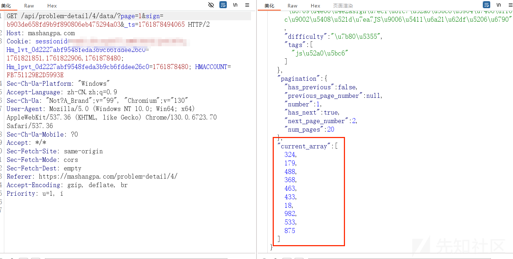

题目的意思就是要把20页里面的current\_array数组里面的值全部加起来，但是get请求里面有一个sign参数是不断变化的，就需要逆向出sign的加密逻辑，再用脚本爬取current\_array数组进行相加

找加密位置的3种方法：

方法一：既然知道了加密参数，那么找加密地点最快的方法就是直接全局搜索js文件里面含有sign参数的位置

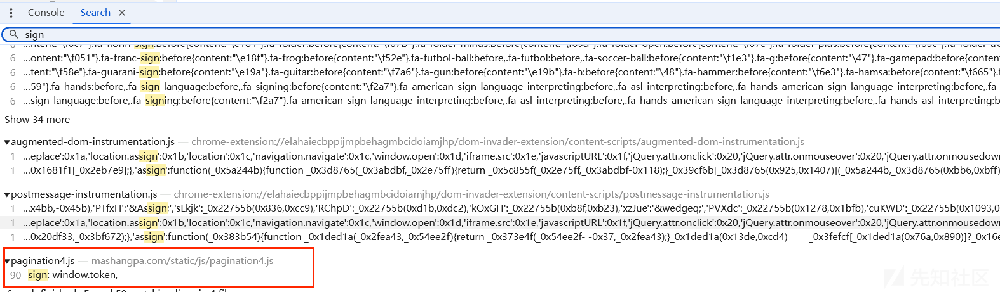

直接在这里下一个断点看看是不是加密后的位置

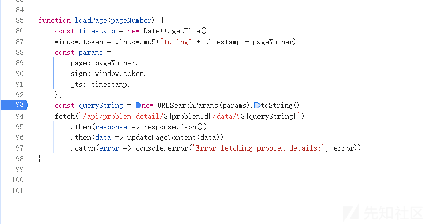

可以发现确实是

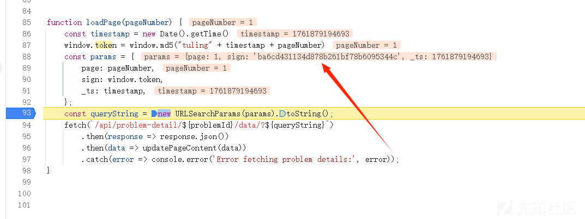

方法二：xhr打断点，找一个标志性的特征，一般选择url后的路由


点击加号添加


刷新界面即可断住

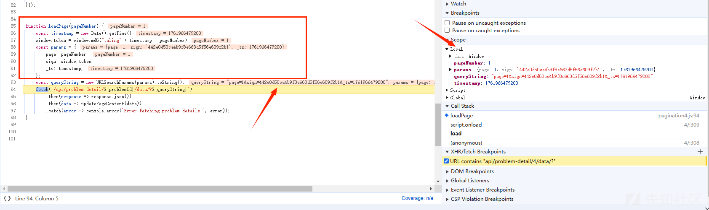

方法三：启动器入手，从加载页面的这个js入手

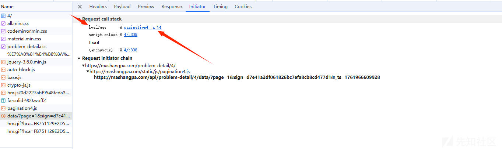

点击即可跳转到这儿

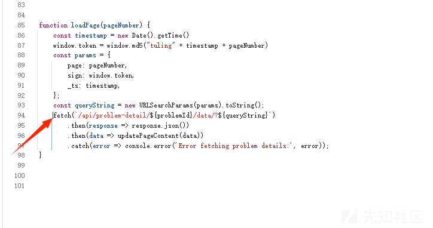

打上断点，刷新界面，即可发现加密位置

那么我们就可以从js代码中获取这些信息

```
sign=window.token
window.token = window.md5("tuling" + timestamp + pageNumber)  //MD5加密，tuling为盐值
const timestamp = new Date().getTime()
pageNumber    //参数为页数
```

加密所需要的参数及加密方式已经确定了

接下来可以扣js代码了,大致的逻辑就是这样了，接下来看看还缺什么参数接着扣

```
function get_sign(pageNumber) {
    const timestamp = new Date().getTime()
    const sign = window.md5("tuling" + timestamp + pageNumber)
    console.log(sign)
}
```

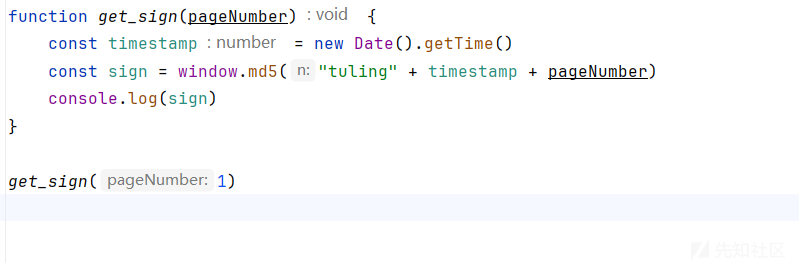

MD5加密在我们本地肯定是没有的，但是它的js代码对MD5加密进行了重写，那我们只需要把window方法也给扣下来即可

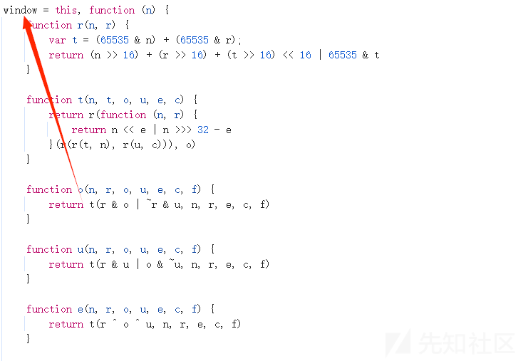

最终代码如下：

```
window = this, function (n) {
    function r(n, r) {
        var t = (65535 & n) + (65535 & r);
        return (n >> 16) + (r >> 16) + (t >> 16) << 16 | 65535 & t
    }

    function t(n, t, o, u, e, c) {
        return r(function (n, r) {
            return n << e | n >>> 32 - e
        }(r(r(t, n), r(u, c))), o)
    }

    function o(n, r, o, u, e, c, f) {
        return t(r & o | ~r & u, n, r, e, c, f)
    }

    function u(n, r, o, u, e, c, f) {
        return t(r & u | o & ~u, n, r, e, c, f)
    }

    function e(n, r, o, u, e, c, f) {
        return t(r ^ o ^ u, n, r, e, c, f)
    }

    function c(n, r, o, u, e, c, f) {
        return t(o ^ (r | ~u), n, r, e, c, f)
    }

    function f(n, t) {
        var f, i, a, h, g;
        n[t >> 5] |= 128 << t % 32, n[14 + (t + 64 >>> 9 << 4)] = t;
        var l = 1732584193, d = -271733879, v = -1732584194, C = 271733878;
        for (f = 0; f < n.length; f += 16) d = c(d = c(d = c(d = c(d = e(d = e(d = e(d = e(d = u(d = u(d = u(d = u(d = o(d = o(d = o(d = o(a = d, v = o(h = v, C = o(g = C, l = o(i = l, d, v, C, n[f], 7, -680876936), d, v, n[f + 1], 12, -389564586), l, d, n[f + 2], 17, 606105819), C, l, n[f + 3], 22, -1044525330), v = o(v, C = o(C, l = o(l, d, v, C, n[f + 4], 7, -176418897), d, v, n[f + 5], 12, 1200080426), l, d, n[f + 6], 17, -1473231341), C, l, n[f + 7], 22, -45705983), v = o(v, C = o(C, l = o(l, d, v, C, n[f + 8], 7, 1770035416), d, v, n[f + 9], 12, -1958414417), l, d, n[f + 10], 17, -42063), C, l, n[f + 11], 22, -1990404162), v = o(v, C = o(C, l = o(l, d, v, C, n[f + 12], 7, 1804603682), d, v, n[f + 13], 12, -40341101), l, d, n[f + 14], 17, -1502002290), C, l, n[f + 15], 22, 1236535329), v = u(v, C = u(C, l = u(l, d, v, C, n[f + 1], 5, -165796510), d, v, n[f + 6], 9, -1069501632), l, d, n[f + 11], 14, 643717713), C, l, n[f], 20, -373897302), v = u(v, C = u(C, l = u(l, d, v, C, n[f + 5], 5, -701558691), d, v, n[f + 10], 9, 38016083), l, d, n[f + 15], 14, -660478335), C, l, n[f + 4], 20, -405537848), v = u(v, C = u(C, l = u(l, d, v, C, n[f + 9], 5, 568446438), d, v, n[f + 14], 9, -1019803690), l, d, n[f + 3], 14, -187363961), C, l, n[f + 8], 20, 1163531501), v = u(v, C = u(C, l = u(l, d, v, C, n[f + 13], 5, -1444681467), d, v, n[f + 2], 9, -51403784), l, d, n[f + 7], 14, 1735328473), C, l, n[f + 12], 20, -1926607734), v = e(v, C = e(C, l = e(l, d, v, C, n[f + 5], 4, -378558), d, v, n[f + 8], 11, -2022574463), l, d, n[f + 11], 16, 1839030562), C, l, n[f + 14], 23, -35309556), v = e(v, C = e(C, l = e(l, d, v, C, n[f + 1], 4, -1530992060), d, v, n[f + 4], 11, 1272893353), l, d, n[f + 7], 16, -155497632), C, l, n[f + 10], 23, -1094730640), v = e(v, C = e(C, l = e(l, d, v, C, n[f + 13], 4, 681279174), d, v, n[f], 11, -358537222), l, d, n[f + 3], 16, -722521979), C, l, n[f + 6], 23, 76029189), v = e(v, C = e(C, l = e(l, d, v, C, n[f + 9], 4, -640364487), d, v, n[f + 12], 11, -421815835), l, d, n[f + 15], 16, 530742520), C, l, n[f + 2], 23, -995338651), v = c(v, C = c(C, l = c(l, d, v, C, n[f], 6, -198630844), d, v, n[f + 7], 10, 1126891415), l, d, n[f + 14], 15, -1416354905), C, l, n[f + 5], 21, -57434055), v = c(v, C = c(C, l = c(l, d, v, C, n[f + 12], 6, 1700485571), d, v, n[f + 3], 10, -1894986606), l, d, n[f + 10], 15, -1051523), C, l, n[f + 1], 21, -2054922799), v = c(v, C = c(C, l = c(l, d, v, C, n[f + 8], 6, 1873313359), d, v, n[f + 15], 10, -30611744), l, d, n[f + 6], 15, -1560198380), C, l, n[f + 13], 21, 1309151649), v = c(v, C = c(C, l = c(l, d, v, C, n[f + 4], 6, -145523070), d, v, n[f + 11], 10, -1120210379), l, d, n[f + 2], 15, 718787259), C, l, n[f + 9], 21, -343485551), l = r(l, i), d = r(d, a), v = r(v, h), C = r(C, g);
        return [l, d, v, C]
    }

    function i(n) {
        var r, t = "", o = 32 * n.length;
        for (r = 0; r < o; r += 8) t += String.fromCharCode(n[r >> 5] >>> r % 32 & 255);
        return t
    }

    function a(n) {
        var r, t = [];
        for (t[(n.length >> 2) - 1] = void 0, r = 0; r < t.length; r += 1) t[r] = 0;
        var o = 8 * n.length;
        for (r = 0; r < o; r += 8) t[r >> 5] |= (255 & n.charCodeAt(r / 8)) << r % 32;
        return t
    }

    function h(n) {
        var r, t, o = "0123456789abcdef", u = "";
        for (t = 0; t < n.length; t += 1) r = n.charCodeAt(t), u += o.charAt(r >>> 4 & 15) + o.charAt(15 & r);
        return u
    }

    function g(n) {
        return unescape(encodeURIComponent(n))
    }

    function l(n) {
        return function (n) {
            return i(f(a(n), 8 * n.length))
        }(g(n))
    }

    function d(n, r) {
        return function (n, r) {
            var t, o, u = a(n), e = [], c = [];
            for (e[15] = c[15] = void 0, 16 < u.length && (u = f(u, 8 * n.length)), t = 0; t < 16; t += 1) e[t] = 909522486 ^ u[t], c[t] = 1549556828 ^ u[t];
            return o = f(e.concat(a(r)), 512 + 8 * r.length), i(f(c.concat(o), 640))
        }(g(n), g(r))
    }

    window.md5 = function (n, r, t) {
        return r ? t ? d(r, n) : function (n, r) {
            return h(d(n, r))
        }(r, n) : t ? l(n) : function (n) {
            return h(l(n))
        }(n)
    }
}();


// 上面内容不动，修改了loadPage函数
function get_sign(pageNumber) {
    const timestamp = new Date().getTime()
    const sign = window.md5("tuling" + timestamp + pageNumber)
    console.log(sign)
}

get_sign(1)
```

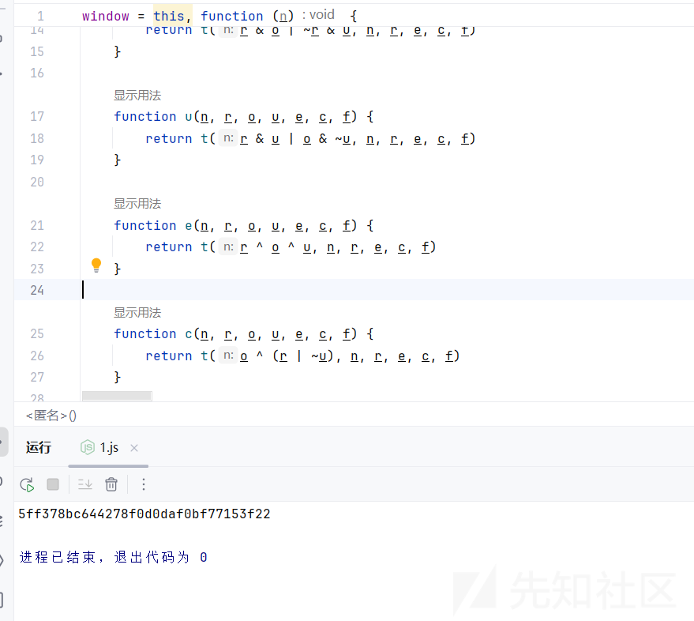

可以看到已经可以生成sign了，接下来写一个python脚本去发包即可,复制bash，放入[爬虫工具库](https://spidertools.cn/#/curl2Request)一键生成爬虫代码


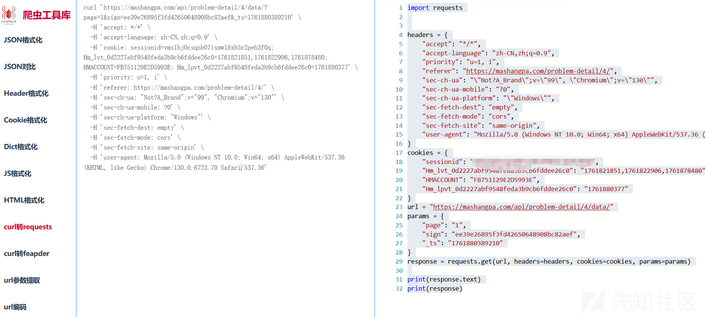

接下来再修改其中参数即可

这里要python代码与js代码进行交互需要安装pyexecjs库

```
import requests
import execjs

# 读取并编译 JS 文件
with open("1.js", "r", encoding="utf-8") as f:
    js_code = f.read()

ctx = execjs.compile(js_code)

# 请求头
headers = {
    "accept": "*/*",
    "accept-language": "zh-CN,zh;q=0.9",
    "priority": "u=1, i",
    "referer": "https://mashangpa.com/problem-detail/4/",
    "sec-ch-ua": '"Not?A_Brand";v="99", "Chromium";v="130"',
    "sec-ch-ua-mobile": "?0",
    "sec-ch-ua-platform": '"Windows"',
    "sec-fetch-dest": "empty",
    "sec-fetch-mode": "cors",
    "sec-fetch-site": "same-origin",
    "user-agent": "Mozilla/5.0 (Windows NT 10.0; Win64; x64) AppleWebKit/537.36 (KHTML, like Gecko) Chrome/130.0.6723.70 Safari/537.36"
}

# Cookie（请确保有效）
cookies = {
    "sessionid": "",
    "Hm_lvt_0d2227abf9548feda3b9cb6fddee26c0": "1761821851,1761822906,1761878480",
    "HMACCOUNT": "FB751129E2D5993E",
    "Hm_lpvt_0d2227abf9548feda3b9cb6fddee26c0": "1761880377"
}

# 存储总和
total_sum = 0

# API 地址
url = "https://mashangpa.com/api/problem-detail/4/data/"

# 遍历 page 1 到 20
for page in range(1, 21):
    try:
        # 调用 JS 函数生成 sign 和 timestamp
        result = ctx.call("get_sign", page)
        sign = result["sign"]
        timestamp = result["ts"]

        # 请求参数
        params = {
            "page": str(page),
            "sign": sign,
            "_ts": timestamp
        }

        # 发起 GET 请求
        response = requests.get(url, headers=headers, cookies=cookies, params=params)
        response.raise_for_status()  # 检查 HTTP 错误

        data = response.json()

        if "current_array" in data:
            current_sum = sum(data["current_array"])
            total_sum += current_sum
            print(f"Page {page}: {data['current_array']} -> Sum = {current_sum}")
        else:
            print(f"Page {page}: 'current_array' not found in response.")

    except Exception as e:
        print(f"Error on page {page}: {e}")

# 输出最终结果
print(f"
所有数组元素总和: {total_sum}")
```

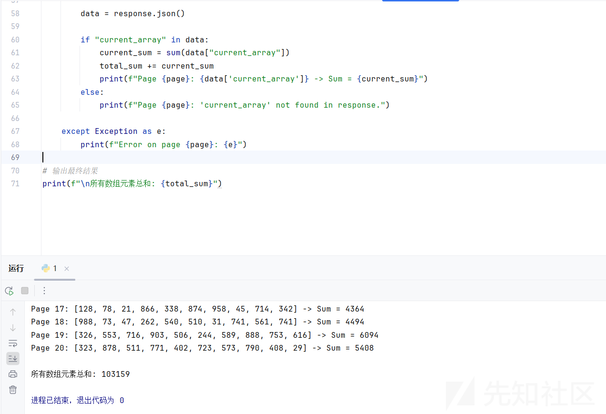

# 案例二


查看请求就可以发现这里页多了一个加密的xl参数

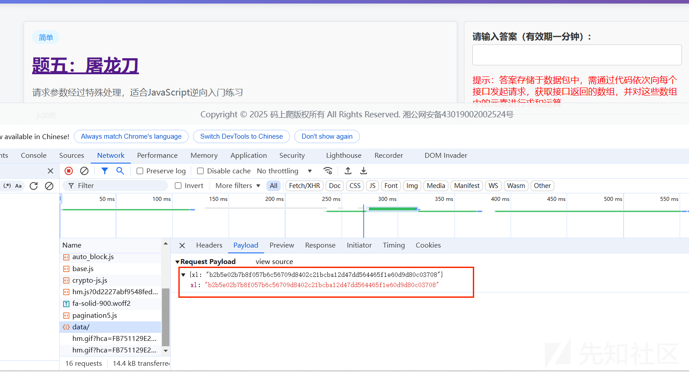

全局搜索一下该参数

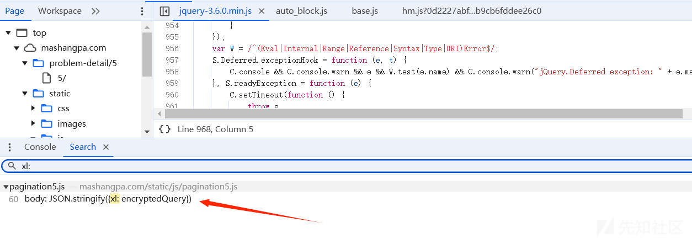

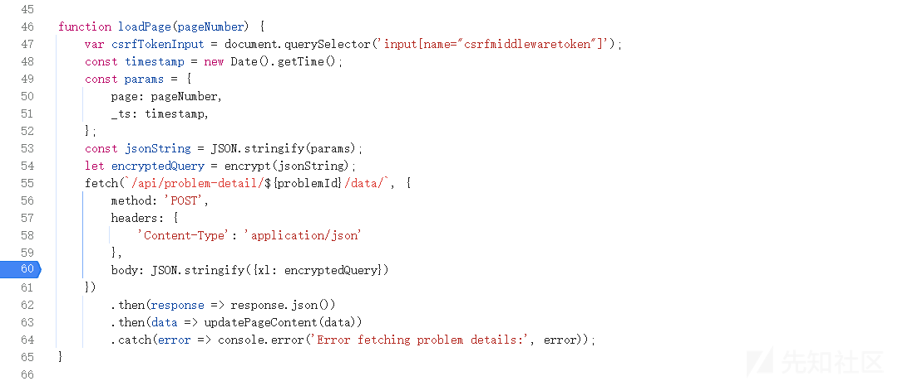

接下来看一下代码所需要的参数

```
xl: encryptedQuery
let encryptedQuery = encrypt(jsonString);
const jsonString = JSON.stringify(params);
const params = {
        page: pageNumber,
        _ts: timestamp,
    };
```

接下来就可以大概写一下加密逻辑

```
function demo(pageNumber) {
    const timestamp = new Date().getTime();
    const params = {
        page: pageNumber,
        _ts: timestamp
    };
    const xl = encrypt(JSON.stringify(params));
    return xl;
}
```

就只差encrypt方法不知道了

看看encrypt方法

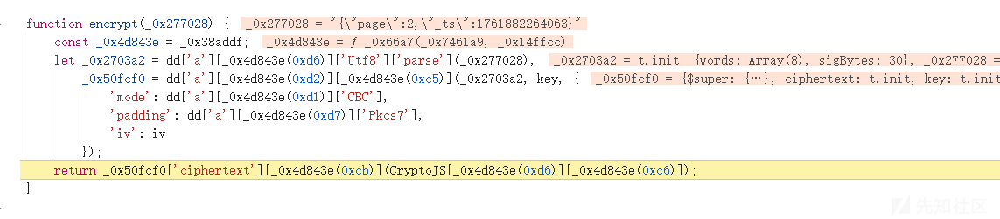

可以发现这里进行了一个ob混淆

ob解混淆方法1，直接把鼠标放参数上面

​

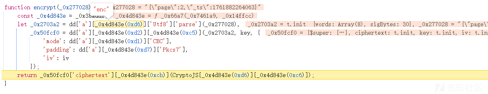

方法2：控制台解密

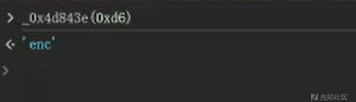

方法三：直接在线网站：<https://tool.yuanrenxue.cn/decode_obfuscator>

这里页声明了encrypt方法里面的参数

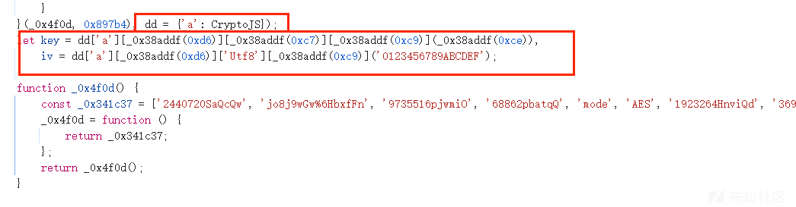

解混淆后：

```
const CryptoJS = require("crypto-js");

function encrypt(dataString) {
    const key = CryptoJS.enc.Utf8.parse('jo8j9wGw%6Hbxffn');
    const iv = CryptoJS.enc.Utf8.parse('0123456789ABCDEF');

    const encrypted = CryptoJS.AES.encrypt(dataString, key, {
        iv: iv,
        mode: CryptoJS.mode.CBC,
        padding: CryptoJS.pad.Pkcs7
    });

    return encrypted.ciphertext.toString(CryptoJS.enc.hex);
}
```

所有可以写出完整js代码了

```
const CryptoJS = require("crypto-js");

function encrypt(dataString) {
    const key = CryptoJS.enc.Utf8.parse('jo8j9wGw%6Hbxffn');
    const iv = CryptoJS.enc.Utf8.parse('0123456789ABCDEF');

    const encrypted = CryptoJS.AES.encrypt(dataString, key, {
        iv: iv,
        mode: CryptoJS.mode.CBC,
        padding: CryptoJS.pad.Pkcs7
    });

    return encrypted.ciphertext.toString(CryptoJS.enc.hex);
}
function demo(pageNumber) {
    const timestamp = new Date().getTime();
    const params = {
        page: pageNumber,
        _ts: timestamp
    };
    const xl = encrypt(JSON.stringify(params));
    return xl;
}
demo(1)
```

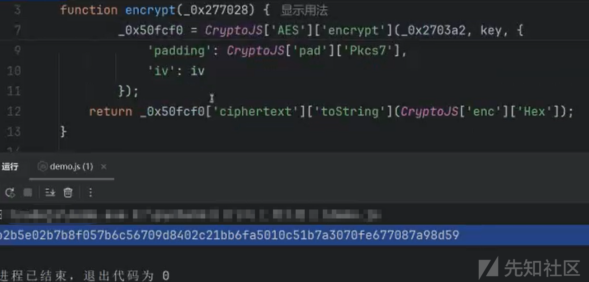

# 案例三


这一关可以发现是请求响应被加密了

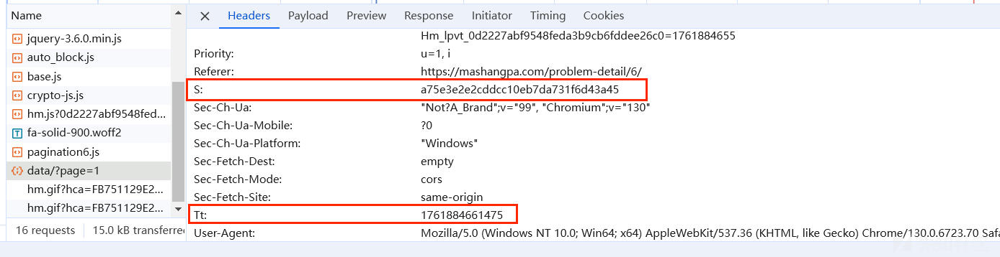

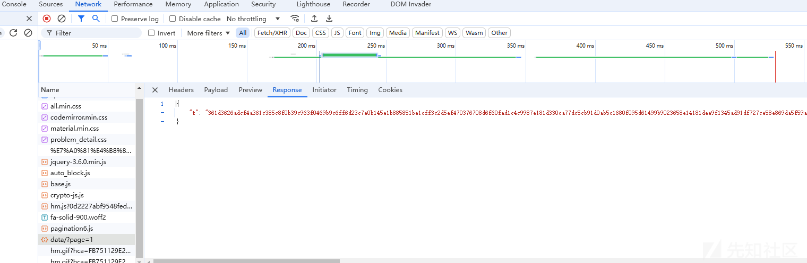

所以这里无法进行全局搜索来定位加密，这里需要从启动器入手


可以发现这里发送请求的时候携带了hearder信息

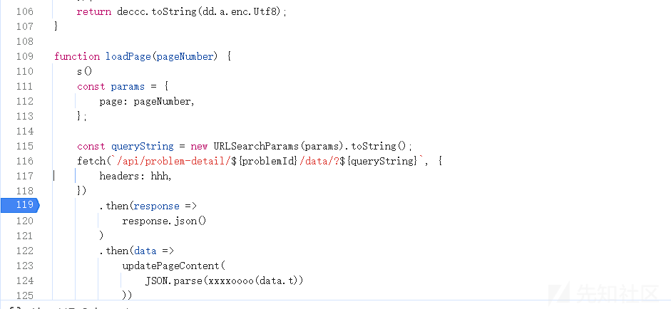

打个断点调一下，发现确实为加密数据，接下来需要去找hhh

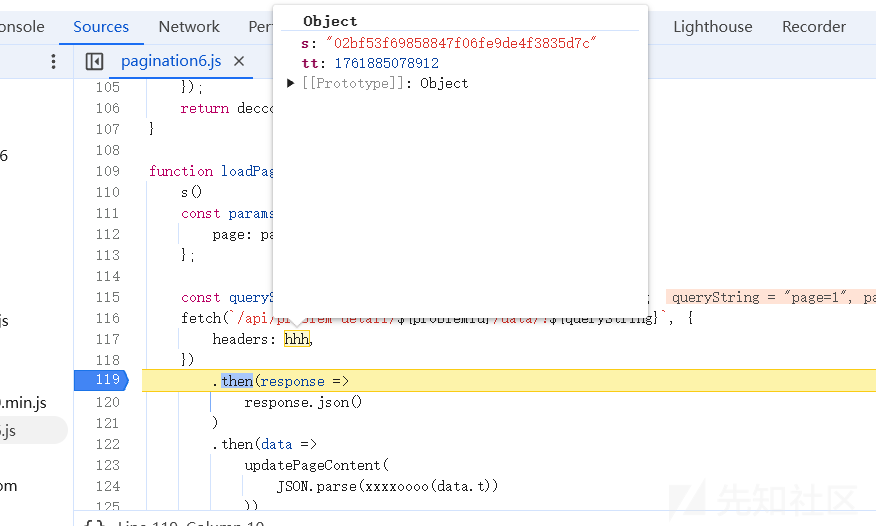

这里写清楚了参数构造

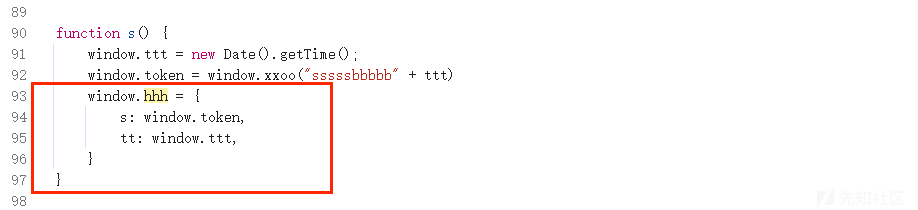

再定位一下xxo

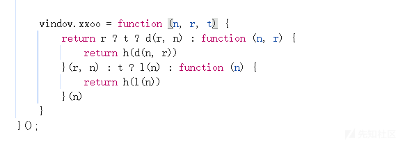

这里的加密和第一个一样的，都是自己写的一个方法，直接把window方法扣下来

js完整代码：

```
window = this, function (n) {
    function r(n, r) {
        var t = (65535 & n) + (65535 & r);
        return (n >> 16) + (r >> 16) + (t >> 16) << 16 | 65535 & t
    }

    function t(n, t, o, u, e, c) {
        return r(function (n, r) {
            return n << e | n >>> 32 - e
        }(r(r(t, n), r(u, c))), o)
    }

    function o(n, r, o, u, e, c, f) {
        return t(r & o | ~r & u, n, r, e, c, f)
    }

    function u(n, r, o, u, e, c, f) {
        return t(r & u | o & ~u, n, r, e, c, f)
    }

    function e(n, r, o, u, e, c, f) {
        return t(r ^ o ^ u, n, r, e, c, f)
    }

    function c(n, r, o, u, e, c, f) {
        return t(o ^ (r | ~u), n, r, e, c, f)
    }

    function f(n, t) {
        var f, i, a, h, g;
        n[t >> 5] |= 128 << t % 32, n[14 + (t + 64 >>> 9 << 4)] = t;
        var l = 1732584193, d = -271733879, v = -1732584194, C = 271733878;
        for (f = 0; f < n.length; f += 16) d = c(d = c(d = c(d = c(d = e(d = e(d = e(d = e(d = u(d = u(d = u(d = u(d = o(d = o(d = o(d = o(a = d, v = o(h = v, C = o(g = C, l = o(i = l, d, v, C, n[f], 7, -680876936), d, v, n[f + 1], 12, -389564586), l, d, n[f + 2], 17, 606105819), C, l, n[f + 3], 22, -1044525330), v = o(v, C = o(C, l = o(l, d, v, C, n[f + 4], 7, -176418897), d, v, n[f + 5], 12, 1200080426), l, d, n[f + 6], 17, -1473231341), C, l, n[f + 7], 22, -45705983), v = o(v, C = o(C, l = o(l, d, v, C, n[f + 8], 7, 1770035416), d, v, n[f + 9], 12, -1958414417), l, d, n[f + 10], 17, -42063), C, l, n[f + 11], 22, -1990404162), v = o(v, C = o(C, l = o(l, d, v, C, n[f + 12], 7, 1804603682), d, v, n[f + 13], 12, -40341101), l, d, n[f + 14], 17, -1502002290), C, l, n[f + 15], 22, 1236535329), v = u(v, C = u(C, l = u(l, d, v, C, n[f + 1], 5, -165796510), d, v, n[f + 6], 9, -1069501632), l, d, n[f + 11], 14, 643717713), C, l, n[f], 20, -373897302), v = u(v, C = u(C, l = u(l, d, v, C, n[f + 5], 5, -701558691), d, v, n[f + 10], 9, 38016083), l, d, n[f + 15], 14, -660478335), C, l, n[f + 4], 20, -405537848), v = u(v, C = u(C, l = u(l, d, v, C, n[f + 9], 5, 568446438), d, v, n[f + 14], 9, -1019803690), l, d, n[f + 3], 14, -187363961), C, l, n[f + 8], 20, 1163531501), v = u(v, C = u(C, l = u(l, d, v, C, n[f + 13], 5, -1444681467), d, v, n[f + 2], 9, -51403784), l, d, n[f + 7], 14, 1735328473), C, l, n[f + 12], 20, -1926607734), v = e(v, C = e(C, l = e(l, d, v, C, n[f + 5], 4, -378558), d, v, n[f + 8], 11, -2022574463), l, d, n[f + 11], 16, 1839030562), C, l, n[f + 14], 23, -35309556), v = e(v, C = e(C, l = e(l, d, v, C, n[f + 1], 4, -1530992060), d, v, n[f + 4], 11, 1272893353), l, d, n[f + 7], 16, -155497632), C, l, n[f + 10], 23, -1094730640), v = e(v, C = e(C, l = e(l, d, v, C, n[f + 13], 4, 681279174), d, v, n[f], 11, -358537222), l, d, n[f + 3], 16, -722521979), C, l, n[f + 6], 23, 76029189), v = e(v, C = e(C, l = e(l, d, v, C, n[f + 9], 4, -640364487), d, v, n[f + 12], 11, -421815835), l, d, n[f + 15], 16, 530742520), C, l, n[f + 2], 23, -995338651), v = c(v, C = c(C, l = c(l, d, v, C, n[f], 6, -198630844), d, v, n[f + 7], 10, 1126891415), l, d, n[f + 14], 15, -1416354905), C, l, n[f + 5], 21, -57434055), v = c(v, C = c(C, l = c(l, d, v, C, n[f + 12], 6, 1700485571), d, v, n[f + 3], 10, -1894986606), l, d, n[f + 10], 15, -1051523), C, l, n[f + 1], 21, -2054922799), v = c(v, C = c(C, l = c(l, d, v, C, n[f + 8], 6, 1873313359), d, v, n[f + 15], 10, -30611744), l, d, n[f + 6], 15, -1560198380), C, l, n[f + 13], 21, 1309151649), v = c(v, C = c(C, l = c(l, d, v, C, n[f + 4], 6, -145523070), d, v, n[f + 11], 10, -1120210379), l, d, n[f + 2], 15, 718787259), C, l, n[f + 9], 21, -343485551), l = r(l, i), d = r(d, a), v = r(v, h), C = r(C, g);
        return [l, d, v, C]
    }

    function i(n) {
        var r, t = "", o = 32 * n.length;
        for (r = 0; r < o; r += 8) t += String.fromCharCode(n[r >> 5] >>> r % 32 & 255);
        return t
    }

    function a(n) {
        var r, t = [];
        for (t[(n.length >> 2) - 1] = void 0, r = 0; r < t.length; r += 1) t[r] = 0;
        var o = 8 * n.length;
        for (r = 0; r < o; r += 8) t[r >> 5] |= (255 & n.charCodeAt(r / 8)) << r % 32;
        return t
    }

    function h(n) {
        var r, t, o = "0123456789abcdef", u = "";
        for (t = 0; t < n.length; t += 1) r = n.charCodeAt(t), u += o.charAt(r >>> 4 & 15) + o.charAt(15 & r);
        return u
    }

    function g(n) {
        return unescape(encodeURIComponent(n))
    }

    function l(n) {
        return function (n) {
            return i(f(a(n), 8 * n.length))
        }(g(n))
    }

    function d(n, r) {
        return function (n, r) {
            var t, o, u = a(n), e = [], c = [];
            for (e[15] = c[15] = void 0, 16 < u.length && (u = f(u, 8 * n.length)), t = 0; t < 16; t += 1) e[t] = 909522486 ^ u[t], c[t] = 1549556828 ^ u[t];
            return o = f(e.concat(a(r)), 512 + 8 * r.length), i(f(c.concat(o), 640))
        }(g(n), g(r))
    }

    window.xxoo = function (n, r, t) {
        return r ? t ? d(r, n) : function (n, r) {
            return h(d(n, r))
        }(r, n) : t ? l(n) : function (n) {
            return h(l(n))
        }(n)
    }
}();
const ttt  = new Date().getTime();
const s = window.xxoo("sssssbbbbb" + ttt)

console.log(s)
```

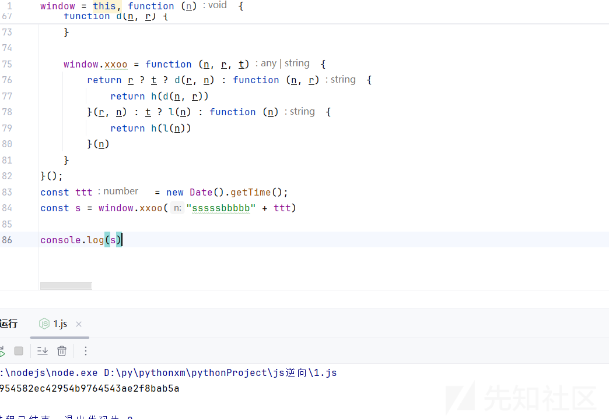

请求的问题已经解决了，接下来该解决响应的问题了

这里有个函数对响应data做了处理

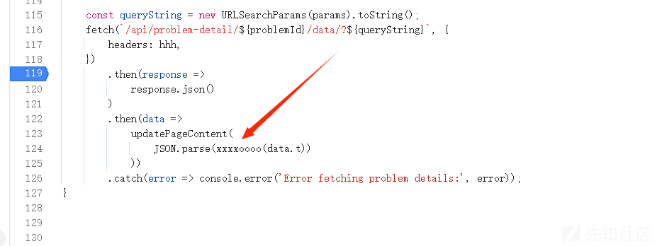

跟进一下可以发现存在解密逻辑

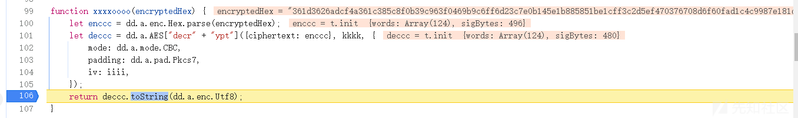

```
function xxxxoooo(encryptedHex) {
    let enccc = dd.a.enc.Hex.parse(encryptedHex);
    let deccc = dd.a.AES["decr" + "ypt"]({ciphertext: enccc}, kkkk, {
        mode: dd.a.mode.CBC,
        padding: dd.a.pad.Pkcs7,
        iv: iiii,
    });
    return deccc.toString(dd.a.enc.Utf8);
}
```

找到函数中需要的参数

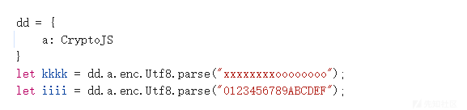

再加入到js代码里面去

```
const CryptoJS =require("crypto-js")
window = this, function (n) {
    function r(n, r) {
        var t = (65535 & n) + (65535 & r);
        return (n >> 16) + (r >> 16) + (t >> 16) << 16 | 65535 & t
    }

    function t(n, t, o, u, e, c) {
        return r(function (n, r) {
            return n << e | n >>> 32 - e
        }(r(r(t, n), r(u, c))), o)
    }

    function o(n, r, o, u, e, c, f) {
        return t(r & o | ~r & u, n, r, e, c, f)
    }

    function u(n, r, o, u, e, c, f) {
        return t(r & u | o & ~u, n, r, e, c, f)
    }

    function e(n, r, o, u, e, c, f) {
        return t(r ^ o ^ u, n, r, e, c, f)
    }

    function c(n, r, o, u, e, c, f) {
        return t(o ^ (r | ~u), n, r, e, c, f)
    }

    function f(n, t) {
        var f, i, a, h, g;
        n[t >> 5] |= 128 << t % 32, n[14 + (t + 64 >>> 9 << 4)] = t;
        var l = 1732584193, d = -271733879, v = -1732584194, C = 271733878;
        for (f = 0; f < n.length; f += 16) d = c(d = c(d = c(d = c(d = e(d = e(d = e(d = e(d = u(d = u(d = u(d = u(d = o(d = o(d = o(d = o(a = d, v = o(h = v, C = o(g = C, l = o(i = l, d, v, C, n[f], 7, -680876936), d, v, n[f + 1], 12, -389564586), l, d, n[f + 2], 17, 606105819), C, l, n[f + 3], 22, -1044525330), v = o(v, C = o(C, l = o(l, d, v, C, n[f + 4], 7, -176418897), d, v, n[f + 5], 12, 1200080426), l, d, n[f + 6], 17, -1473231341), C, l, n[f + 7], 22, -45705983), v = o(v, C = o(C, l = o(l, d, v, C, n[f + 8], 7, 1770035416), d, v, n[f + 9], 12, -1958414417), l, d, n[f + 10], 17, -42063), C, l, n[f + 11], 22, -1990404162), v = o(v, C = o(C, l = o(l, d, v, C, n[f + 12], 7, 1804603682), d, v, n[f + 13], 12, -40341101), l, d, n[f + 14], 17, -1502002290), C, l, n[f + 15], 22, 1236535329), v = u(v, C = u(C, l = u(l, d, v, C, n[f + 1], 5, -165796510), d, v, n[f + 6], 9, -1069501632), l, d, n[f + 11], 14, 643717713), C, l, n[f], 20, -373897302), v = u(v, C = u(C, l = u(l, d, v, C, n[f + 5], 5, -701558691), d, v, n[f + 10], 9, 38016083), l, d, n[f + 15], 14, -660478335), C, l, n[f + 4], 20, -405537848), v = u(v, C = u(C, l = u(l, d, v, C, n[f + 9], 5, 568446438), d, v, n[f + 14], 9, -1019803690), l, d, n[f + 3], 14, -187363961), C, l, n[f + 8], 20, 1163531501), v = u(v, C = u(C, l = u(l, d, v, C, n[f + 13], 5, -1444681467), d, v, n[f + 2], 9, -51403784), l, d, n[f + 7], 14, 1735328473), C, l, n[f + 12], 20, -1926607734), v = e(v, C = e(C, l = e(l, d, v, C, n[f + 5], 4, -378558), d, v, n[f + 8], 11, -2022574463), l, d, n[f + 11], 16, 1839030562), C, l, n[f + 14], 23, -35309556), v = e(v, C = e(C, l = e(l, d, v, C, n[f + 1], 4, -1530992060), d, v, n[f + 4], 11, 1272893353), l, d, n[f + 7], 16, -155497632), C, l, n[f + 10], 23, -1094730640), v = e(v, C = e(C, l = e(l, d, v, C, n[f + 13], 4, 681279174), d, v, n[f], 11, -358537222), l, d, n[f + 3], 16, -722521979), C, l, n[f + 6], 23, 76029189), v = e(v, C = e(C, l = e(l, d, v, C, n[f + 9], 4, -640364487), d, v, n[f + 12], 11, -421815835), l, d, n[f + 15], 16, 530742520), C, l, n[f + 2], 23, -995338651), v = c(v, C = c(C, l = c(l, d, v, C, n[f], 6, -198630844), d, v, n[f + 7], 10, 1126891415), l, d, n[f + 14], 15, -1416354905), C, l, n[f + 5], 21, -57434055), v = c(v, C = c(C, l = c(l, d, v, C, n[f + 12], 6, 1700485571), d, v, n[f + 3], 10, -1894986606), l, d, n[f + 10], 15, -1051523), C, l, n[f + 1], 21, -2054922799), v = c(v, C = c(C, l = c(l, d, v, C, n[f + 8], 6, 1873313359), d, v, n[f + 15], 10, -30611744), l, d, n[f + 6], 15, -1560198380), C, l, n[f + 13], 21, 1309151649), v = c(v, C = c(C, l = c(l, d, v, C, n[f + 4], 6, -145523070), d, v, n[f + 11], 10, -1120210379), l, d, n[f + 2], 15, 718787259), C, l, n[f + 9], 21, -343485551), l = r(l, i), d = r(d, a), v = r(v, h), C = r(C, g);
        return [l, d, v, C]
    }

    function i(n) {
        var r, t = "", o = 32 * n.length;
        for (r = 0; r < o; r += 8) t += String.fromCharCode(n[r >> 5] >>> r % 32 & 255);
        return t
    }

    function a(n) {
        var r, t = [];
        for (t[(n.length >> 2) - 1] = void 0, r = 0; r < t.length; r += 1) t[r] = 0;
        var o = 8 * n.length;
        for (r = 0; r < o; r += 8) t[r >> 5] |= (255 & n.charCodeAt(r / 8)) << r % 32;
        return t
    }

    function h(n) {
        var r, t, o = "0123456789abcdef", u = "";
        for (t = 0; t < n.length; t += 1) r = n.charCodeAt(t), u += o.charAt(r >>> 4 & 15) + o.charAt(15 & r);
        return u
    }

    function g(n) {
        return unescape(encodeURIComponent(n))
    }

    function l(n) {
        return function (n) {
            return i(f(a(n), 8 * n.length))
        }(g(n))
    }

    function d(n, r) {
        return function (n, r) {
            var t, o, u = a(n), e = [], c = [];
            for (e[15] = c[15] = void 0, 16 < u.length && (u = f(u, 8 * n.length)), t = 0; t < 16; t += 1) e[t] = 909522486 ^ u[t], c[t] = 1549556828 ^ u[t];
            return o = f(e.concat(a(r)), 512 + 8 * r.length), i(f(c.concat(o), 640))
        }(g(n), g(r))
    }

    window.xxoo = function (n, r, t) {
        return r ? t ? d(r, n) : function (n, r) {
            return h(d(n, r))
        }(r, n) : t ? l(n) : function (n) {
            return h(l(n))
        }(n)
    }
}();
function demo() {
    const ttt = new Date().getTime();
    const s = window.xxoo("sssssbbbbb" + ttt);
    return {
        "ttt": ttt,
        "s": s
    };
}

function xxxxoooo(encryptedHex) {
    let kkkk = CryptoJS.enc.Utf8.parse("xxxxxxxxoooooooo");
    let iiii = CryptoJS.enc.Utf8.parse("0123456789ABCDEF");
    let enccc = CryptoJS.enc.Hex.parse(encryptedHex);
    let deccc = CryptoJS.AES["decrypt"]({ciphertext: enccc}, kkkk, {
        mode: CryptoJS.mode.CBC,
        padding: CryptoJS.pad.Pkcs7,
        iv: iiii,
    });
    return deccc.toString(CryptoJS.enc.Utf8);
}
```

python代码：

```
import json
import execjs
import requests

# 需要登录，请先登录，获取cookie并完善参数
cookies = {
    "sessionid": "vms1bj0csqnb07ismwl8xb5r2peh3f0q",
    "Hm_lvt_0d2227abf9548feda3b9cb6fddee26c0": "1761822906,1761878480,1761881876,1761884653",
    "HMACCOUNT": "FB751129E2D5993E",
    "Hm_lpvt_0d2227abf9548feda3b9cb6fddee26c0": "1761884662"
}

var = 0
for i in range(1, 21):
    with open('1.js', 'r', encoding='utf-8') as f:
        js_code = f.read()
    result = execjs.compile(js_code).call('demo')
    print(result)
    s = result['s']
    tt = str(result['ttt'])
    headers = {
        "accept": "*/*",
        "accept-language": "zh-CN,zh;q=0.9",
        "priority": "u=1, i",
        "referer": "https://mashangpa.com/problem-detail/6/",
        "s": s,
        "sec-ch-ua": ""Not?A_Brand";v="99", "Chromium";v="130"",
        "sec-ch-ua-mobile": "?0",
        "sec-ch-ua-platform": ""Windows"",
        "sec-fetch-dest": "empty",
        "sec-fetch-mode": "cors",
        "sec-fetch-site": "same-origin",
        "tt": tt,
        "user-agent": "Mozilla/5.0 (Windows NT 10.0; Win64; x64) AppleWebKit/537.36 (KHTML, like Gecko) Chrome/130.0.6723.70 Safari/537.36"
    }
    params = {
        'page': i,
    }
    res = requests.get('https://www.mashangpa.com/api/problem-detail/6/data/', headers=headers, params=params,
                       cookies=cookies)
    data = res.json()['t']
    val = execjs.compile(js_code).call('xxxxoooo', data)
    # print(val)
    val_json = json.loads(val)
    print(val_json)
    var += sum(val_json['current_array'])
print(f"和为：{var}")
```

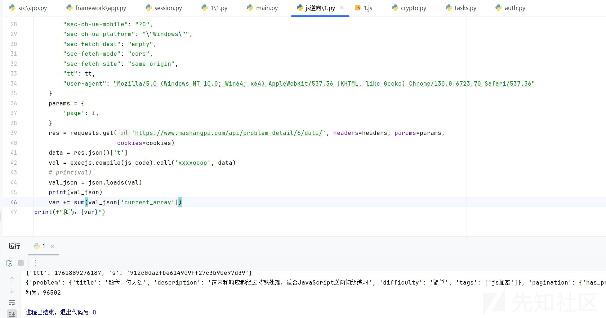

# 案例四

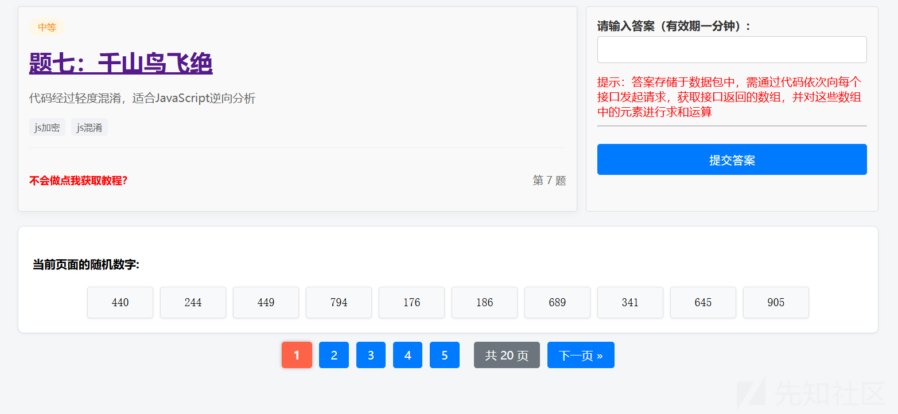

调试出现无限debugger

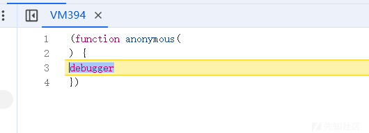

绕过方法：右击跳过


现在可以看见请求和响应了，发现都被加密了

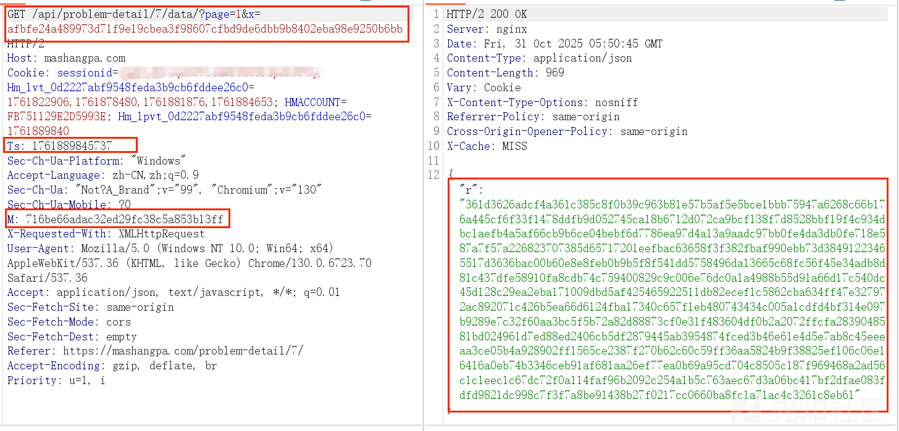

依旧启动器入手


跳转发现有混淆，直接用在线网站

[免费在线JavaScript混淆加密解密工具 - JS代码加密解密器](https://webfem.com/tools/js-decode/index.html)

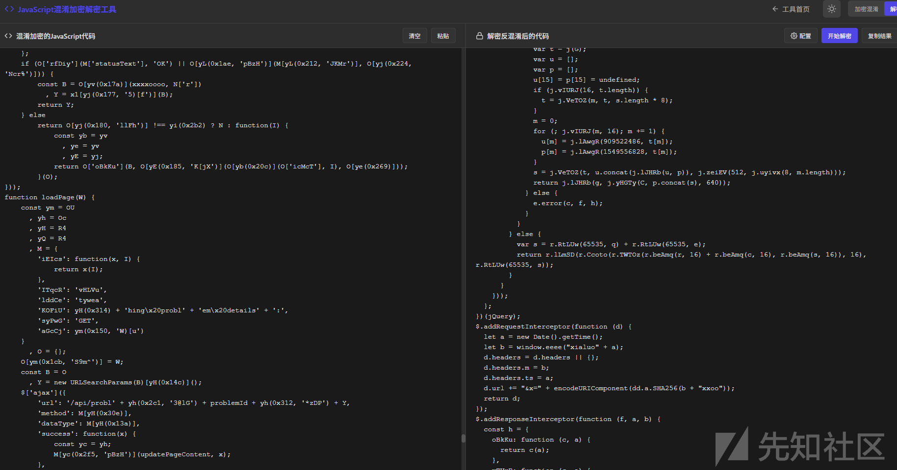

解密后的js代码：

```
const originalJSON = {
  "stringify": JSON.stringify,
  "parse": JSON.parse
};
const x1 = new Proxy(originalJSON, {
  "get"(_0x4bf3ac, _0x31ad78) {
    if (_0x31ad78 === "stringify") {
      return function (..._0x14b4e2) {
        return _0x4bf3ac.stringify(..._0x14b4e2);
      };
    } else {
      if (_0x31ad78 === "parse") {
        return function (..._0x446842) {
          return _0x4bf3ac.parse(..._0x446842);
        };
      }
    }
    return _0x4bf3ac[_0x31ad78];
  }
});
console.log("我盯着你呢小子");
setInterval(() => {
  0x0;
  (function (_0x4adaca) {
    return function (_0x135fc7) {
      return Function("Function(arguments[0]+"" + _0x135fc7 + "")()");
    }(_0x4adaca);
  })("bugger")("de", 0x0, 0x0, 0x0);
}, 0x3e8);
window = this;
(function (_0x2eb23f) {
  const _0x8e5473 = function () {
    let _0xfba24c = true;
    return function (_0x5cf9d7, _0x283755) {
      const _0x3ed046 = _0xfba24c ? function () {
        if (_0x283755) {
          const _0xf646c0 = _0x283755.apply(_0x5cf9d7, arguments);
          _0x283755 = null;
          return _0xf646c0;
        }
      } : function () {};
      _0xfba24c = false;
      return _0x3ed046;
    };
  }();
  const _0x372b67 = _0x8e5473(this, function () {
    return _0x372b67.toString().search("(((.+)+)+)+$").toString().constructor(_0x372b67).search("(((.+)+)+)+$");
  });
  _0x372b67();
  function _0x42fcff(_0x2a4dbf, _0x1aac01) {
    var _0x4c862c = (0xffff & _0x2a4dbf) + (0xffff & _0x1aac01);
    return (_0x2a4dbf >> 0x10) + (_0x1aac01 >> 0x10) + (_0x4c862c >> 0x10) << 0x10 | 0xffff & _0x4c862c;
  }
  function _0x3d57b3(_0x37dd5c, _0x241fbb, _0x41c5da, _0x29f9bb, _0x5c4414, _0x461224) {
    return _0x42fcff(function (_0x5961b3, _0x5d9435) {
      return _0x5961b3 << _0x5c4414 | _0x5961b3 >>> 0x20 - _0x5c4414;
    }(_0x42fcff(_0x42fcff(_0x241fbb, _0x37dd5c), _0x42fcff(_0x29f9bb, _0x461224))), _0x41c5da);
  }
  function _0x4ca385(_0x2dc616, _0x307043) {
    var _0x5a7e07;
    var _0xd5b683;
    var _0x4cf87b;
    var _0x13ac12;
    var _0x3d4242;
    _0x2dc616[_0x307043 >> 0x5] |= 0x80 << _0x307043 % 0x20;
    _0x2dc616[0xe + (_0x307043 + 0x40 >>> 0x9 << 0x4)] = _0x307043;
    var _0x2f897c = 0x67452301;
    var _0x58e914 = -0x10325477;
    var _0x4fed8f = -0x67452302;
    var _0x16de2e = 0x10325476;
    for (_0x5a7e07 = 0x0; _0x5a7e07 < _0x2dc616.length; _0x5a7e07 += 0x10) {
      _0x58e914 = _0x3d57b3(_0x16de2e ^ ((_0x4fed8f = _0x3d57b3(_0x2f897c ^ ((_0x16de2e = _0x3d57b3(_0x58e914 ^ ((_0x2f897c = _0x3d57b3(_0x4fed8f ^ (_0x58e914 | ~_0x16de2e), _0x2f897c, _0x58e914, _0x2dc616[_0x5a7e07 + 0x4], 0x6, -0x8ac817e)) | ~_0x4fed8f), _0x16de2e, _0x2f897c = _0x3d57b3(_0x4fed8f ^ (_0x58e914 | ~_0x16de2e), _0x2f897c, _0x58e914, _0x2dc616[_0x5a7e07 + 0x4], 0x6, -0x8ac817e), _0x2dc616[_0x5a7e07 + 0xb], 0xa, -0x42c50dcb)) | ~_0x58e914), _0x4fed8f, _0x16de2e = _0x3d57b3(_0x58e914 ^ ((_0x2f897c = _0x3d57b3(_0x4fed8f ^ (_0x58e914 | ~_0x16de2e), _0x2f897c, _0x58e914, _0x2dc616[_0x5a7e07 + 0x4], 0x6, -0x8ac817e)) | ~_0x4fed8f), _0x16de2e, _0x2f897c = _0x3d57b3(_0x4fed8f ^ (_0x58e914 | ~_0x16de2e), _0x2f897c, _0x58e914, _0x2dc616[_0x5a7e07 + 0x4], 0x6, -0x8ac817e), _0x2dc616[_0x5a7e07 + 0xb], 0xa, -0x42c50dcb), _0x2dc616[_0x5a7e07 + 0x2], 0xf, 0x2ad7d2bb)) | ~_0x2f897c), _0x58e914 = _0x3d57b3(_0x16de2e ^ ((_0x4fed8f = _0x3d57b3(_0x2f897c ^ ((_0x16de2e = _0x3d57b3(_0x58e914 ^ ((_0x2f897c = _0x3d57b3(_0x4fed8f ^ (_0x58e914 | ~_0x16de2e), _0x2f897c, _0x58e914, _0x2dc616[_0x5a7e07 + 0x8], 0x6, 0x6fa87e4f)) | ~_0x4fed8f), _0x16de2e, _0x2f897c = _0x3d57b3(_0x4fed8f ^ (_0x58e914 | ~_0x16de2e), _0x2f897c, _0x58e914, _0x2dc616[_0x5a7e07 + 0x8], 0x6, 0x6fa87e4f), _0x2dc616[_0x5a7e07 + 0xf], 0xa, -0x1d31920)) | ~_0x58e914), _0x4fed8f, _0x16de2e = _0x3d57b3(_0x58e914 ^ ((_0x2f897c = _0x3d57b3(_0x4fed8f ^ (_0x58e914 | ~_0x16de2e), _0x2f897c, _0x58e914, _0x2dc616[_0x5a7e07 + 0x8], 0x6, 0x6fa87e4f)) | ~_0x4fed8f), _0x16de2e, _0x2f897c = _0x3d57b3(_0x4fed8f ^ (_0x58e914 | ~_0x16de2e), _0x2f897c, _0x58e914, _0x2dc616[_0x5a7e07 + 0x8], 0x6, 0x6fa87e4f), _0x2dc616[_0x5a7e07 + 0xf], 0xa, -0x1d31920), _0x2dc616[_0x5a7e07 + 0x6], 0xf, -0x5cfebcec)) | ~_0x2f897c), _0x58e914 = _0x3d57b3(_0x16de2e ^ ((_0x4fed8f = _0x3d57b3(_0x2f897c ^ ((_0x16de2e = _0x3d57b3(_0x58e914 ^ ((_0x2f897c = _0x3d57b3(_0x4fed8f ^ (_0x58e914 | ~_0x16de2e), _0x2f897c, _0x58e914, _0x2dc616[_0x5a7e07 + 0xc], 0x6, 0x655b59c3)) | ~_0x4fed8f), _0x16de2e, _0x2f897c = _0x3d57b3(_0x4fed8f ^ (_0x58e914 | ~_0x16de2e), _0x2f897c, _0x58e914, _0x2dc616[_0x5a7e07 + 0xc], 0x6, 0x655b59c3), _0x2dc616[_0x5a7e07 + 0x3], 0xa, -0x70f3336e)) | ~_0x58e914), _0x4fed8f, _0x16de2e = _0x3d57b3(_0x58e914 ^ ((_0x2f897c = _0x3d57b3(_0x4fed8f ^ (_0x58e914 | ~_0x16de2e), _0x2f897c, _0x58e914, _0x2dc616[_0x5a7e07 + 0xc], 0x6, 0x655b59c3)) | ~_0x4fed8f), _0x16de2e, _0x2f897c = _0x3d57b3(_0x4fed8f ^ (_0x58e914 | ~_0x16de2e), _0x2f897c, _0x58e914, _0x2dc616[_0x5a7e07 + 0xc], 0x6, 0x655b59c3), _0x2dc616[_0x5a7e07 + 0x3], 0xa, -0x70f3336e), _0x2dc616[_0x5a7e07 + 0xa], 0xf, -0x100b83)) | ~_0x2f897c), _0x58e914 = _0x3d57b3(_0x16de2e ^ ((_0x4fed8f = _0x3d57b3(_0x2f897c ^ ((_0x16de2e = _0x3d57b3(_0x58e914 ^ ((_0x2f897c = _0x3d57b3(_0x4fed8f ^ (_0x58e914 | ~_0x16de2e), _0x2f897c, _0x58e914, _0x2dc616[_0x5a7e07], 0x6, -0xbd6ddbc)) | ~_0x4fed8f), _0x16de2e, _0x2f897c = _0x3d57b3(_0x4fed8f ^ (_0x58e914 | ~_0x16de2e), _0x2f897c, _0x58e914, _0x2dc616[_0x5a7e07], 0x6, -0xbd6ddbc), _0x2dc616[_0x5a7e07 + 0x7], 0xa, 0x432aff97)) | ~_0x58e914), _0x4fed8f, _0x16de2e = _0x3d57b3(_0x58e914 ^ ((_0x2f897c = _0x3d57b3(_0x4fed8f ^ (_0x58e914 | ~_0x16de2e), _0x2f897c, _0x58e914, _0x2dc616[_0x5a7e07], 0x6, -0xbd6ddbc)) | ~_0x4fed8f), _0x16de2e, _0x2f897c = _0x3d57b3(_0x4fed8f ^ (_0x58e914 | ~_0x16de2e), _0x2f897c, _0x58e914, _0x2dc616[_0x5a7e07], 0x6, -0xbd6ddbc), _0x2dc616[_0x5a7e07 + 0x7], 0xa, 0x432aff97), _0x2dc616[_0x5a7e07 + 0xe], 0xf, -0x546bdc59)) | ~_0x2f897c), _0x58e914 = _0x3d57b3((_0x4fed8f = _0x3d57b3((_0x16de2e = _0x3d57b3((_0x2f897c = _0x3d57b3(_0x58e914 ^ _0x4fed8f ^ _0x16de2e, _0x2f897c, _0x58e914, _0x2dc616[_0x5a7e07 + 0x9], 0x4, -0x262b2fc7)) ^ _0x58e914 ^ _0x4fed8f, _0x16de2e, _0x2f897c = _0x3d57b3(_0x58e914 ^ _0x4fed8f ^ _0x16de2e, _0x2f897c, _0x58e914, _0x2dc616[_0x5a7e07 + 0x9], 0x4, -0x262b2fc7), _0x2dc616[_0x5a7e07 + 0xc], 0xb, -0x1924661b)) ^ _0x2f897c ^ _0x58e914, _0x4fed8f, _0x16de2e = _0x3d57b3((_0x2f897c = _0x3d57b3(_0x58e914 ^ _0x4fed8f ^ _0x16de2e, _0x2f897c, _0x58e914, _0x2dc616[_0x5a7e07 + 0x9], 0x4, -0x262b2fc7)) ^ _0x58e914 ^ _0x4fed8f, _0x16de2e, _0x2f897c = _0x3d57b3(_0x58e914 ^ _0x4fed8f ^ _0x16de2e, _0x2f897c, _0x58e914, _0x2dc616[_0x5a7e07 + 0x9], 0x4, -0x262b2fc7), _0x2dc616[_0x5a7e07 + 0xc], 0xb, -0x1924661b), _0x2dc616[_0x5a7e07 + 0xf], 0x10, 0x1fa27cf8)) ^ _0x16de2e ^ _0x2f897c, _0x58e914 = _0x3d57b3((_0x4fed8f = _0x3d57b3((_0x16de2e = _0x3d57b3((_0x2f897c = _0x3d57b3(_0x58e914 ^ _0x4fed8f ^ _0x16de2e, _0x2f897c, _0x58e914, _0x2dc616[_0x5a7e07 + 0xd], 0x4, 0x289b7ec6)) ^ _0x58e914 ^ _0x4fed8f, _0x16de2e, _0x2f897c = _0x3d57b3(_0x58e914 ^ _0x4fed8f ^ _0x16de2e, _0x2f897c, _0x58e914, _0x2dc616[_0x5a7e07 + 0xd], 0x4, 0x289b7ec6), _0x2dc616[_0x5a7e07], 0xb, -0x155ed806)) ^ _0x2f897c ^ _0x58e914, _0x4fed8f, _0x16de2e = _0x3d57b3((_0x2f897c = _0x3d57b3(_0x58e914 ^ _0x4fed8f ^ _0x16de2e, _0x2f897c, _0x58e914, _0x2dc616[_0x5a7e07 + 0xd], 0x4, 0x289b7ec6)) ^ _0x58e914 ^ _0x4fed8f, _0x16de2e, _0x2f897c = _0x3d57b3(_0x58e914 ^ _0x4fed8f ^ _0x16de2e, _0x2f897c, _0x58e914, _0x2dc616[_0x5a7e07 + 0xd], 0x4, 0x289b7ec6), _0x2dc616[_0x5a7e07], 0xb, -0x155ed806), _0x2dc616[_0x5a7e07 + 0x3], 0x10, -0x2b10cf7b)) ^ _0x16de2e ^ _0x2f897c, _0x58e914 = _0x3d57b3((_0x4fed8f = _0x3d57b3((_0x16de2e = _0x3d57b3((_0x2f897c = _0x3d57b3(_0x58e914 ^ _0x4fed8f ^ _0x16de2e, _0x2f897c, _0x58e914, _0x2dc616[_0x5a7e07 + 0x1], 0x4, -0x5b4115bc)) ^ _0x58e914 ^ _0x4fed8f, _0x16de2e, _0x2f897c = _0x3d57b3(_0x58e914 ^ _0x4fed8f ^ _0x16de2e, _0x2f897c, _0x58e914, _0x2dc616[_0x5a7e07 + 0x1], 0x4, -0x5b4115bc), _0x2dc616[_0x5a7e07 + 0x4], 0xb, 0x4bdecfa9)) ^ _0x2f897c ^ _0x58e914, _0x4fed8f, _0x16de2e = _0x3d57b3((_0x2f897c = _0x3d57b3(_0x58e914 ^ _0x4fed8f ^ _0x16de2e, _0x2f897c, _0x58e914, _0x2dc616[_0x5a7e07 + 0x1], 0x4, -0x5b4115bc)) ^ _0x58e914 ^ _0x4fed8f, _0x16de2e, _0x2f897c = _0x3d57b3(_0x58e914 ^ _0x4fed8f ^ _0x16de2e, _0x2f897c, _0x58e914, _0x2dc616[_0x5a7e07 + 0x1], 0x4, -0x5b4115bc), _0x2dc616[_0x5a7e07 + 0x4], 0xb, 0x4bdecfa9), _0x2dc616[_0x5a7e07 + 0x7], 0x10, -0x944b4a0)) ^ _0x16de2e ^ _0x2f897c, _0x58e914 = _0x3d57b3((_0x4fed8f = _0x3d57b3((_0x16de2e = _0x3d57b3((_0x2f897c = _0x3d57b3(_0x58e914 ^ _0x4fed8f ^ _0x16de2e, _0x2f897c, _0x58e914, _0x2dc616[_0x5a7e07 + 0x5], 0x4, -0x5c6be)) ^ _0x58e914 ^ _0x4fed8f, _0x16de2e, _0x2f897c = _0x3d57b3(_0x58e914 ^ _0x4fed8f ^ _0x16de2e, _0x2f897c, _0x58e914, _0x2dc616[_0x5a7e07 + 0x5], 0x4, -0x5c6be), _0x2dc616[_0x5a7e07 + 0x8], 0xb, -0x788e097f)) ^ _0x2f897c ^ _0x58e914, _0x4fed8f, _0x16de2e = _0x3d57b3((_0x2f897c = _0x3d57b3(_0x58e914 ^ _0x4fed8f ^ _0x16de2e, _0x2f897c, _0x58e914, _0x2dc616[_0x5a7e07 + 0x5], 0x4, -0x5c6be)) ^ _0x58e914 ^ _0x4fed8f, _0x16de2e, _0x2f897c = _0x3d57b3(_0x58e914 ^ _0x4fed8f ^ _0x16de2e, _0x2f897c, _0x58e914, _0x2dc616[_0x5a7e07 + 0x5], 0x4, -0x5c6be), _0x2dc616[_0x5a7e07 + 0x8], 0xb, -0x788e097f), _0x2dc616[_0x5a7e07 + 0xb], 0x10, 0x6d9d6122)) ^ _0x16de2e ^ _0x2f897c, _0x58e914 = _0x3d57b3((_0x4fed8f = _0x3d57b3((_0x16de2e = _0x3d57b3((_0x2f897c = _0x3d57b3(_0x58e914 & _0x16de2e | _0x4fed8f & ~_0x16de2e, _0x2f897c, _0x58e914, _0x2dc616[_0x5a7e07 + 0xd], 0x5, -0x561c16fb)) & _0x4fed8f | _0x58e914 & ~_0x4fed8f, _0x16de2e, _0x2f897c = _0x3d57b3(_0x58e914 & _0x16de2e | _0x4fed8f & ~_0x16de2e, _0x2f897c, _0x58e914, _0x2dc616[_0x5a7e07 + 0xd], 0x5, -0x561c16fb), _0x2dc616[_0x5a7e07 + 0x2], 0x9, -0x3105c08)) & _0x58e914 | _0x2f897c & ~_0x58e914, _0x4fed8f, _0x16de2e = _0x3d57b3((_0x2f897c = _0x3d57b3(_0x58e914 & _0x16de2e | _0x4fed8f & ~_0x16de2e, _0x2f897c, _0x58e914, _0x2dc616[_0x5a7e07 + 0xd], 0x5, -0x561c16fb)) & _0x4fed8f | _0x58e914 & ~_0x4fed8f, _0x16de2e, _0x2f897c = _0x3d57b3(_0x58e914 & _0x16de2e | _0x4fed8f & ~_0x16de2e, _0x2f897c, _0x58e914, _0x2dc616[_0x5a7e07 + 0xd], 0x5, -0x561c16fb), _0x2dc616[_0x5a7e07 + 0x2], 0x9, -0x3105c08), _0x2dc616[_0x5a7e07 + 0x7], 0xe, 0x676f02d9)) & _0x2f897c | _0x16de2e & ~_0x2f897c, _0x58e914 = _0x3d57b3((_0x4fed8f = _0x3d57b3((_0x16de2e = _0x3d57b3((_0x2f897c = _0x3d57b3(_0x58e914 & _0x16de2e | _0x4fed8f & ~_0x16de2e, _0x2f897c, _0x58e914, _0x2dc616[_0x5a7e07 + 0x9], 0x5, 0x21e1cde6)) & _0x4fed8f | _0x58e914 & ~_0x4fed8f, _0x16de2e, _0x2f897c = _0x3d57b3(_0x58e914 & _0x16de2e | _0x4fed8f & ~_0x16de2e, _0x2f897c, _0x58e914, _0x2dc616[_0x5a7e07 + 0x9], 0x5, 0x21e1cde6), _0x2dc616[_0x5a7e07 + 0xe], 0x9, -0x3cc8f82a)) & _0x58e914 | _0x2f897c & ~_0x58e914, _0x4fed8f, _0x16de2e = _0x3d57b3((_0x2f897c = _0x3d57b3(_0x58e914 & _0x16de2e | _0x4fed8f & ~_0x16de2e, _0x2f897c, _0x58e914, _0x2dc616[_0x5a7e07 + 0x9], 0x5, 0x21e1cde6)) & _0x4fed8f | _0x58e914 & ~_0x4fed8f, _0x16de2e, _0x2f897c = _0x3d57b3(_0x58e914 & _0x16de2e | _0x4fed8f & ~_0x16de2e, _0x2f897c, _0x58e914, _0x2dc616[_0x5a7e07 + 0x9], 0x5, 0x21e1cde6), _0x2dc616[_0x5a7e07 + 0xe], 0x9, -0x3cc8f82a), _0x2dc616[_0x5a7e07 + 0x3], 0xe, -0xb2af279)) & _0x2f897c | _0x16de2e & ~_0x2f897c, _0x58e914 = _0x3d57b3((_0x4fed8f = _0x3d57b3((_0x16de2e = _0x3d57b3((_0x2f897c = _0x3d57b3(_0x58e914 & _0x16de2e | _0x4fed8f & ~_0x16de2e, _0x2f897c, _0x58e914, _0x2dc616[_0x5a7e07 + 0x5], 0x5, -0x29d0efa3)) & _0x4fed8f | _0x58e914 & ~_0x4fed8f, _0x16de2e, _0x2f897c = _0x3d57b3(_0x58e914 & _0x16de2e | _0x4fed8f & ~_0x16de2e, _0x2f897c, _0x58e914, _0x2dc616[_0x5a7e07 + 0x5], 0x5, -0x29d0efa3), _0x2dc616[_0x5a7e07 + 0xa], 0x9, 0x2441453)) & _0x58e914 | _0x2f897c & ~_0x58e914, _0x4fed8f, _0x16de2e = _0x3d57b3((_0x2f897c = _0x3d57b3(_0x58e914 & _0x16de2e | _0x4fed8f & ~_0x16de2e, _0x2f897c, _0x58e914, _0x2dc616[_0x5a7e07 + 0x5], 0x5, -0x29d0efa3)) & _0x4fed8f | _0x58e914 & ~_0x4fed8f, _0x16de2e, _0x2f897c = _0x3d57b3(_0x58e914 & _0x16de2e | _0x4fed8f & ~_0x16de2e, _0x2f897c, _0x58e914, _0x2dc616[_0x5a7e07 + 0x5], 0x5, -0x29d0efa3), _0x2dc616[_0x5a7e07 + 0xa], 0x9, 0x2441453), _0x2dc616[_0x5a7e07 + 0xf], 0xe, -0x275e197f)) & _0x2f897c | _0x16de2e & ~_0x2f897c, _0x58e914 = _0x3d57b3((_0x4fed8f = _0x3d57b3((_0x16de2e = _0x3d57b3((_0x2f897c = _0x3d57b3(_0x58e914 & _0x16de2e | _0x4fed8f & ~_0x16de2e, _0x2f897c, _0x58e914, _0x2dc616[_0x5a7e07 + 0x1], 0x5, -0x9e1da9e)) & _0x4fed8f | _0x58e914 & ~_0x4fed8f, _0x16de2e, _0x2f897c = _0x3d57b3(_0x58e914 & _0x16de2e | _0x4fed8f & ~_0x16de2e, _0x2f897c, _0x58e914, _0x2dc616[_0x5a7e07 + 0x1], 0x5, -0x9e1da9e), _0x2dc616[_0x5a7e07 + 0x6], 0x9, -0x3fbf4cc0)) & _0x58e914 | _0x2f897c & ~_0x58e914, _0x4fed8f, _0x16de2e = _0x3d57b3((_0x2f897c = _0x3d57b3(_0x58e914 & _0x16de2e | _0x4fed8f & ~_0x16de2e, _0x2f897c, _0x58e914, _0x2dc616[_0x5a7e07 + 0x1], 0x5, -0x9e1da9e)) & _0x4fed8f | _0x58e914 & ~_0x4fed8f, _0x16de2e, _0x2f897c = _0x3d57b3(_0x58e914 & _0x16de2e | _0x4fed8f & ~_0x16de2e, _0x2f897c, _0x58e914, _0x2dc616[_0x5a7e07 + 0x1], 0x5, -0x9e1da9e), _0x2dc616[_0x5a7e07 + 0x6], 0x9, -0x3fbf4cc0), _0x2dc616[_0x5a7e07 + 0xb], 0xe, 0x265e5a51)) & _0x2f897c | _0x16de2e & ~_0x2f897c, _0x58e914 = _0x3d57b3((_0x4fed8f = _0x3d57b3((_0x16de2e = _0x3d57b3((_0x2f897c = _0x3d57b3(_0x58e914 & _0x4fed8f | ~_0x58e914 & _0x16de2e, _0x2f897c, _0x58e914, _0x2dc616[_0x5a7e07 + 0xc], 0x7, 0x6b901122)) & _0x58e914 | ~(_0x2f897c = _0x3d57b3(_0x58e914 & _0x4fed8f | ~_0x58e914 & _0x16de2e, _0x2f897c, _0x58e914, _0x2dc616[_0x5a7e07 + 0xc], 0x7, 0x6b901122)) & _0x4fed8f, _0x16de2e, _0x2f897c = _0x3d57b3(_0x58e914 & _0x4fed8f | ~_0x58e914 & _0x16de2e, _0x2f897c, _0x58e914, _0x2dc616[_0x5a7e07 + 0xc], 0x7, 0x6b901122), _0x2dc616[_0x5a7e07 + 0xd], 0xc, -0x2678e6d)) & _0x2f897c | ~(_0x16de2e = _0x3d57b3((_0x2f897c = _0x3d57b3(_0x58e914 & _0x4fed8f | ~_0x58e914 & _0x16de2e, _0x2f897c, _0x58e914, _0x2dc616[_0x5a7e07 + 0xc], 0x7, 0x6b901122)) & _0x58e914 | ~(_0x2f897c = _0x3d57b3(_0x58e914 & _0x4fed8f | ~_0x58e914 & _0x16de2e, _0x2f897c, _0x58e914, _0x2dc616[_0x5a7e07 + 0xc], 0x7, 0x6b901122)) & _0x4fed8f, _0x16de2e, _0x2f897c = _0x3d57b3(_0x58e914 & _0x4fed8f | ~_0x58e914 & _0x16de2e, _0x2f897c, _0x58e914, _0x2dc616[_0x5a7e07 + 0xc], 0x7, 0x6b901122), _0x2dc616[_0x5a7e07 + 0xd], 0xc, -0x2678e6d)) & _0x58e914, _0x4fed8f, _0x16de2e = _0x3d57b3((_0x2f897c = _0x3d57b3(_0x58e914 & _0x4fed8f | ~_0x58e914 & _0x16de2e, _0x2f897c, _0x58e914, _0x2dc616[_0x5a7e07 + 0xc], 0x7, 0x6b901122)) & _0x58e914 | ~(_0x2f897c = _0x3d57b3(_0x58e914 & _0x4fed8f | ~_0x58e914 & _0x16de2e, _0x2f897c, _0x58e914, _0x2dc616[_0x5a7e07 + 0xc], 0x7, 0x6b901122)) & _0x4fed8f, _0x16de2e, _0x2f897c = _0x3d57b3(_0x58e914 & _0x4fed8f | ~_0x58e914 & _0x16de2e, _0x2f897c, _0x58e914, _0x2dc616[_0x5a7e07 + 0xc], 0x7, 0x6b901122), _0x2dc616[_0x5a7e07 + 0xd], 0xc, -0x2678e6d), _0x2dc616[_0x5a7e07 + 0xe], 0x11, -0x5986bc72)) & _0x16de2e | ~(_0x4fed8f = _0x3d57b3((_0x16de2e = _0x3d57b3((_0x2f897c = _0x3d57b3(_0x58e914 & _0x4fed8f | ~_0x58e914 & _0x16de2e, _0x2f897c, _0x58e914, _0x2dc616[_0x5a7e07 + 0xc], 0x7, 0x6b901122)) & _0x58e914 | ~(_0x2f897c = _0x3d57b3(_0x58e914 & _0x4fed8f | ~_0x58e914 & _0x16de2e, _0x2f897c, _0x58e914, _0x2dc616[_0x5a7e07 + 0xc], 0x7, 0x6b901122)) & _0x4fed8f, _0x16de2e, _0x2f897c = _0x3d57b3(_0x58e914 & _0x4fed8f | ~_0x58e914 & _0x16de2e, _0x2f897c, _0x58e914, _0x2dc616[_0x5a7e07 + 0xc], 0x7, 0x6b901122), _0x2dc616[_0x5a7e07 + 0xd], 0xc, -0x2678e6d)) & _0x2f897c | ~(_0x16de2e = _0x3d57b3((_0x2f897c = _0x3d57b3(_0x58e914 & _0x4fed8f | ~_0x58e914 & _0x16de2e, _0x2f897c, _0x58e914, _0x2dc616[_0x5a7e07 + 0xc], 0x7, 0x6b901122)) & _0x58e914 | ~(_0x2f897c = _0x3d57b3(_0x58e914 & _0x4fed8f | ~_0x58e914 & _0x16de2e, _0x2f897c, _0x58e914, _0x2dc616[_0x5a7e07 + 0xc], 0x7, 0x6b901122)) & _0x4fed8f, _0x16de2e, _0x2f897c = _0x3d57b3(_0x58e914 & _0x4fed8f | ~_0x58e914 & _0x16de2e, _0x2f897c, _0x58e914, _0x2dc616[_0x5a7e07 + 0xc], 0x7, 0x6b901122), _0x2dc616[_0x5a7e07 + 0xd], 0xc, -0x2678e6d)) & _0x58e914, _0x4fed8f, _0x16de2e = _0x3d57b3((_0x2f897c = _0x3d57b3(_0x58e914 & _0x4fed8f | ~_0x58e914 & _0x16de2e, _0x2f897c, _0x58e914, _0x2dc616[_0x5a7e07 + 0xc], 0x7, 0x6b901122)) & _0x58e914 | ~(_0x2f897c = _0x3d57b3(_0x58e914 & _0x4fed8f | ~_0x58e914 & _0x16de2e, _0x2f897c, _0x58e914, _0x2dc616[_0x5a7e07 + 0xc], 0x7, 0x6b901122)) & _0x4fed8f, _0x16de2e, _0x2f897c = _0x3d57b3(_0x58e914 & _0x4fed8f | ~_0x58e914 & _0x16de2e, _0x2f897c, _0x58e914, _0x2dc616[_0x5a7e07 + 0xc], 0x7, 0x6b901122), _0x2dc616[_0x5a7e07 + 0xd], 0xc, -0x2678e6d), _0x2dc616[_0x5a7e07 + 0xe], 0x11, -0x5986bc72)) & _0x2f897c, _0x58e914 = _0x3d57b3((_0x4fed8f = _0x3d57b3((_0x16de2e = _0x3d57b3((_0x2f897c = _0x3d57b3(_0x58e914 & _0x4fed8f | ~_0x58e914 & _0x16de2e, _0x2f897c, _0x58e914, _0x2dc616[_0x5a7e07 + 0x8], 0x7, 0x698098d8)) & _0x58e914 | ~(_0x2f897c = _0x3d57b3(_0x58e914 & _0x4fed8f | ~_0x58e914 & _0x16de2e, _0x2f897c, _0x58e914, _0x2dc616[_0x5a7e07 + 0x8], 0x7, 0x698098d8)) & _0x4fed8f, _0x16de2e, _0x2f897c = _0x3d57b3(_0x58e914 & _0x4fed8f | ~_0x58e914 & _0x16de2e, _0x2f897c, _0x58e914, _0x2dc616[_0x5a7e07 + 0x8], 0x7, 0x698098d8), _0x2dc616[_0x5a7e07 + 0x9], 0xc, -0x74bb0851)) & _0x2f897c | ~(_0x16de2e = _0x3d57b3((_0x2f897c = _0x3d57b3(_0x58e914 & _0x4fed8f | ~_0x58e914 & _0x16de2e, _0x2f897c, _0x58e914, _0x2dc616[_0x5a7e07 + 0x8], 0x7, 0x698098d8)) & _0x58e914 | ~(_0x2f897c = _0x3d57b3(_0x58e914 & _0x4fed8f | ~_0x58e914 & _0x16de2e, _0x2f897c, _0x58e914, _0x2dc616[_0x5a7e07 + 0x8], 0x7, 0x698098d8)) & _0x4fed8f, _0x16de2e, _0x2f897c = _0x3d57b3(_0x58e914 & _0x4fed8f | ~_0x58e914 & _0x16de2e, _0x2f897c, _0x58e914, _0x2dc616[_0x5a7e07 + 0x8], 0x7, 0x698098d8), _0x2dc616[_0x5a7e07 + 0x9], 0xc, -0x74bb0851)) & _0x58e914, _0x4fed8f, _0x16de2e = _0x3d57b3((_0x2f897c = _0x3d57b3(_0x58e914 & _0x4fed8f | ~_0x58e914 & _0x16de2e, _0x2f897c, _0x58e914, _0x2dc616[_0x5a7e07 + 0x8], 0x7, 0x698098d8)) & _0x58e914 | ~(_0x2f897c = _0x3d57b3(_0x58e914 & _0x4fed8f | ~_0x58e914 & _0x16de2e, _0x2f897c, _0x58e914, _0x2dc616[_0x5a7e07 + 0x8], 0x7, 0x698098d8)) & _0x4fed8f, _0x16de2e, _0x2f897c = _0x3d57b3(_0x58e914 & _0x4fed8f | ~_0x58e914 & _0x16de2e, _0x2f897c, _0x58e914, _0x2dc616[_0x5a7e07 + 0x8], 0x7, 0x698098d8), _0x2dc616[_0x5a7e07 + 0x9], 0xc, -0x74bb0851), _0x2dc616[_0x5a7e07 + 0xa], 0x11, -0xa44f)) & _0x16de2e | ~(_0x4fed8f = _0x3d57b3((_0x16de2e = _0x3d57b3((_0x2f897c = _0x3d57b3(_0x58e914 & _0x4fed8f | ~_0x58e914 & _0x16de2e, _0x2f897c, _0x58e914, _0x2dc616[_0x5a7e07 + 0x8], 0x7, 0x698098d8)) & _0x58e914 | ~(_0x2f897c = _0x3d57b3(_0x58e914 & _0x4fed8f | ~_0x58e914 & _0x16de2e, _0x2f897c, _0x58e914, _0x2dc616[_0x5a7e07 + 0x8], 0x7, 0x698098d8)) & _0x4fed8f, _0x16de2e, _0x2f897c = _0x3d57b3(_0x58e914 & _0x4fed8f | ~_0x58e914 & _0x16de2e, _0x2f897c, _0x58e914, _0x2dc616[_0x5a7e07 + 0x8], 0x7, 0x698098d8), _0x2dc616[_0x5a7e07 + 0x9], 0xc, -0x74bb0851)) & _0x2f897c | ~(_0x16de2e = _0x3d57b3((_0x2f897c = _0x3d57b3(_0x58e914 & _0x4fed8f | ~_0x58e914 & _0x16de2e, _0x2f897c, _0x58e914, _0x2dc616[_0x5a7e07 + 0x8], 0x7, 0x698098d8)) & _0x58e914 | ~(_0x2f897c = _0x3d57b3(_0x58e914 & _0x4fed8f | ~_0x58e914 & _0x16de2e, _0x2f897c, _0x58e914, _0x2dc616[_0x5a7e07 + 0x8], 0x7, 0x698098d8)) & _0x4fed8f, _0x16de2e, _0x2f897c = _0x3d57b3(_0x58e914 & _0x4fed8f | ~_0x58e914 & _0x16de2e, _0x2f897c, _0x58e914, _0x2dc616[_0x5a7e07 + 0x8], 0x7, 0x698098d8), _0x2dc616[_0x5a7e07 + 0x9], 0xc, -0x74bb0851)) & _0x58e914, _0x4fed8f, _0x16de2e = _0x3d57b3((_0x2f897c = _0x3d57b3(_0x58e914 & _0x4fed8f | ~_0x58e914 & _0x16de2e, _0x2f897c, _0x58e914, _0x2dc616[_0x5a7e07 + 0x8], 0x7, 0x698098d8)) & _0x58e914 | ~(_0x2f897c = _0x3d57b3(_0x58e914 & _0x4fed8f | ~_0x58e914 & _0x16de2e, _0x2f897c, _0x58e914, _0x2dc616[_0x5a7e07 + 0x8], 0x7, 0x698098d8)) & _0x4fed8f, _0x16de2e, _0x2f897c = _0x3d57b3(_0x58e914 & _0x4fed8f | ~_0x58e914 & _0x16de2e, _0x2f897c, _0x58e914, _0x2dc616[_0x5a7e07 + 0x8], 0x7, 0x698098d8), _0x2dc616[_0x5a7e07 + 0x9], 0xc, -0x74bb0851), _0x2dc616[_0x5a7e07 + 0xa], 0x11, -0xa44f)) & _0x2f897c, _0x58e914 = _0x3d57b3((_0x4fed8f = _0x3d57b3((_0x16de2e = _0x3d57b3((_0x2f897c = _0x3d57b3(_0x58e914 & _0x4fed8f | ~_0x58e914 & _0x16de2e, _0x2f897c, _0x58e914, _0x2dc616[_0x5a7e07 + 0x4], 0x7, -0xa83f051)) & _0x58e914 | ~(_0x2f897c = _0x3d57b3(_0x58e914 & _0x4fed8f | ~_0x58e914 & _0x16de2e, _0x2f897c, _0x58e914, _0x2dc616[_0x5a7e07 + 0x4], 0x7, -0xa83f051)) & _0x4fed8f, _0x16de2e, _0x2f897c = _0x3d57b3(_0x58e914 & _0x4fed8f | ~_0x58e914 & _0x16de2e, _0x2f897c, _0x58e914, _0x2dc616[_0x5a7e07 + 0x4], 0x7, -0xa83f051), _0x2dc616[_0x5a7e07 + 0x5], 0xc, 0x4787c62a)) & _0x2f897c | ~(_0x16de2e = _0x3d57b3((_0x2f897c = _0x3d57b3(_0x58e914 & _0x4fed8f | ~_0x58e914 & _0x16de2e, _0x2f897c, _0x58e914, _0x2dc616[_0x5a7e07 + 0x4], 0x7, -0xa83f051)) & _0x58e914 | ~(_0x2f897c = _0x3d57b3(_0x58e914 & _0x4fed8f | ~_0x58e914 & _0x16de2e, _0x2f897c, _0x58e914, _0x2dc616[_0x5a7e07 + 0x4], 0x7, -0xa83f051)) & _0x4fed8f, _0x16de2e, _0x2f897c = _0x3d57b3(_0x58e914 & _0x4fed8f | ~_0x58e914 & _0x16de2e, _0x2f897c, _0x58e914, _0x2dc616[_0x5a7e07 + 0x4], 0x7, -0xa83f051), _0x2dc616[_0x5a7e07 + 0x5], 0xc, 0x4787c62a)) & _0x58e914, _0x4fed8f, _0x16de2e = _0x3d57b3((_0x2f897c = _0x3d57b3(_0x58e914 & _0x4fed8f | ~_0x58e914 & _0x16de2e, _0x2f897c, _0x58e914, _0x2dc616[_0x5a7e07 + 0x4], 0x7, -0xa83f051)) & _0x58e914 | ~(_0x2f897c = _0x3d57b3(_0x58e914 & _0x4fed8f | ~_0x58e914 & _0x16de2e, _0x2f897c, _0x58e914, _0x2dc616[_0x5a7e07 + 0x4], 0x7, -0xa83f051)) & _0x4fed8f, _0x16de2e, _0x2f897c = _0x3d57b3(_0x58e914 & _0x4fed8f | ~_0x58e914 & _0x16de2e, _0x2f897c, _0x58e914, _0x2dc616[_0x5a7e07 + 0x4], 0x7, -0xa83f051), _0x2dc616[_0x5a7e07 + 0x5], 0xc, 0x4787c62a), _0x2dc616[_0x5a7e07 + 0x6], 0x11, -0x57cfb9ed)) & _0x16de2e | ~(_0x4fed8f = _0x3d57b3((_0x16de2e = _0x3d57b3((_0x2f897c = _0x3d57b3(_0x58e914 & _0x4fed8f | ~_0x58e914 & _0x16de2e, _0x2f897c, _0x58e914, _0x2dc616[_0x5a7e07 + 0x4], 0x7, -0xa83f051)) & _0x58e914 | ~(_0x2f897c = _0x3d57b3(_0x58e914 & _0x4fed8f | ~_0x58e914 & _0x16de2e, _0x2f897c, _0x58e914, _0x2dc616[_0x5a7e07 + 0x4], 0x7, -0xa83f051)) & _0x4fed8f, _0x16de2e, _0x2f897c = _0x3d57b3(_0x58e914 & _0x4fed8f | ~_0x58e914 & _0x16de2e, _0x2f897c, _0x58e914, _0x2dc616[_0x5a7e07 + 0x4], 0x7, -0xa83f051), _0x2dc616[_0x5a7e07 + 0x5], 0xc, 0x4787c62a)) & _0x2f897c | ~(_0x16de2e = _0x3d57b3((_0x2f897c = _0x3d57b3(_0x58e914 & _0x4fed8f | ~_0x58e914 & _0x16de2e, _0x2f897c, _0x58e914, _0x2dc616[_0x5a7e07 + 0x4], 0x7, -0xa83f051)) & _0x58e914 | ~(_0x2f897c = _0x3d57b3(_0x58e914 & _0x4fed8f | ~_0x58e914 & _0x16de2e, _0x2f897c, _0x58e914, _0x2dc616[_0x5a7e07 + 0x4], 0x7, -0xa83f051)) & _0x4fed8f, _0x16de2e, _0x2f897c = _0x3d57b3(_0x58e914 & _0x4fed8f | ~_0x58e914 & _0x16de2e, _0x2f897c, _0x58e914, _0x2dc616[_0x5a7e07 + 0x4], 0x7, -0xa83f051), _0x2dc616[_0x5a7e07 + 0x5], 0xc, 0x4787c62a)) & _0x58e914, _0x4fed8f, _0x16de2e = _0x3d57b3((_0x2f897c = _0x3d57b3(_0x58e914 & _0x4fed8f | ~_0x58e914 & _0x16de2e, _0x2f897c, _0x58e914, _0x2dc616[_0x5a7e07 + 0x4], 0x7, -0xa83f051)) & _0x58e914 | ~(_0x2f897c = _0x3d57b3(_0x58e914 & _0x4fed8f | ~_0x58e914 & _0x16de2e, _0x2f897c, _0x58e914, _0x2dc616[_0x5a7e07 + 0x4], 0x7, -0xa83f051)) & _0x4fed8f, _0x16de2e, _0x2f897c = _0x3d57b3(_0x58e914 & _0x4fed8f | ~_0x58e914 & _0x16de2e, _0x2f897c, _0x58e914, _0x2dc616[_0x5a7e07 + 0x4], 0x7, -0xa83f051), _0x2dc616[_0x5a7e07 + 0x5], 0xc, 0x4787c62a), _0x2dc616[_0x5a7e07 + 0x6], 0x11, -0x57cfb9ed)) & _0x2f897c, _0x58e914 = _0x3d57b3((_0x4fed8f = _0x3d57b3((_0x16de2e = _0x3d57b3((_0x2f897c = _0x3d57b3(_0x58e914 & _0x4fed8f | ~_0x58e914 & _0x16de2e, _0xd5b683 = _0x2f897c, _0x58e914, _0x2dc616[_0x5a7e07], 0x7, -0x28955b88)) & _0x58e914 | ~(_0x2f897c = _0x3d57b3(_0x58e914 & _0x4fed8f | ~_0x58e914 & _0x16de2e, _0xd5b683 = _0x2f897c, _0x58e914, _0x2dc616[_0x5a7e07], 0x7, -0x28955b88)) & _0x4fed8f, _0x3d4242 = _0x16de2e, _0x2f897c = _0x3d57b3(_0x58e914 & _0x4fed8f | ~_0x58e914 & _0x16de2e, _0xd5b683 = _0x2f897c, _0x58e914, _0x2dc616[_0x5a7e07], 0x7, -0x28955b88), _0x2dc616[_0x5a7e07 + 0x1], 0xc, -0x173848aa)) & _0x2f897c | ~(_0x16de2e = _0x3d57b3((_0x2f897c = _0x3d57b3(_0x58e914 & _0x4fed8f | ~_0x58e914 & _0x16de2e, _0xd5b683 = _0x2f897c, _0x58e914, _0x2dc616[_0x5a7e07], 0x7, -0x28955b88)) & _0x58e914 | ~(_0x2f897c = _0x3d57b3(_0x58e914 & _0x4fed8f | ~_0x58e914 & _0x16de2e, _0xd5b683 = _0x2f897c, _0x58e914, _0x2dc616[_0x5a7e07], 0x7, -0x28955b88)) & _0x4fed8f, _0x3d4242 = _0x16de2e, _0x2f897c = _0x3d57b3(_0x58e914 & _0x4fed8f | ~_0x58e914 & _0x16de2e, _0xd5b683 = _0x2f897c, _0x58e914, _0x2dc616[_0x5a7e07], 0x7, -0x28955b88), _0x2dc616[_0x5a7e07 + 0x1], 0xc, -0x173848aa)) & _0x58e914, _0x13ac12 = _0x4fed8f, _0x16de2e = _0x3d57b3((_0x2f897c = _0x3d57b3(_0x58e914 & _0x4fed8f | ~_0x58e914 & _0x16de2e, _0xd5b683 = _0x2f897c, _0x58e914, _0x2dc616[_0x5a7e07], 0x7, -0x28955b88)) & _0x58e914 | ~(_0x2f897c = _0x3d57b3(_0x58e914 & _0x4fed8f | ~_0x58e914 & _0x16de2e, _0xd5b683 = _0x2f897c, _0x58e914, _0x2dc616[_0x5a7e07], 0x7, -0x28955b88)) & _0x4fed8f, _0x3d4242 = _0x16de2e, _0x2f897c = _0x3d57b3(_0x58e914 & _0x4fed8f | ~_0x58e914 & _0x16de2e, _0xd5b683 = _0x2f897c, _0x58e914, _0x2dc616[_0x5a7e07], 0x7, -0x28955b88), _0x2dc616[_0x5a7e07 + 0x1], 0xc, -0x173848aa), _0x2dc616[_0x5a7e07 + 0x2], 0x11, 0x242070db)) & _0x16de2e | ~(_0x4fed8f = _0x3d57b3((_0x16de2e = _0x3d57b3((_0x2f897c = _0x3d57b3(_0x58e914 & _0x4fed8f | ~_0x58e914 & _0x16de2e, _0xd5b683 = _0x2f897c, _0x58e914, _0x2dc616[_0x5a7e07], 0x7, -0x28955b88)) & _0x58e914 | ~(_0x2f897c = _0x3d57b3(_0x58e914 & _0x4fed8f | ~_0x58e914 & _0x16de2e, _0xd5b683 = _0x2f897c, _0x58e914, _0x2dc616[_0x5a7e07], 0x7, -0x28955b88)) & _0x4fed8f, _0x3d4242 = _0x16de2e, _0x2f897c = _0x3d57b3(_0x58e914 & _0x4fed8f | ~_0x58e914 & _0x16de2e, _0xd5b683 = _0x2f897c, _0x58e914, _0x2dc616[_0x5a7e07], 0x7, -0x28955b88), _0x2dc616[_0x5a7e07 + 0x1], 0xc, -0x173848aa)) & _0x2f897c | ~(_0x16de2e = _0x3d57b3((_0x2f897c = _0x3d57b3(_0x58e914 & _0x4fed8f | ~_0x58e914 & _0x16de2e, _0xd5b683 = _0x2f897c, _0x58e914, _0x2dc616[_0x5a7e07], 0x7, -0x28955b88)) & _0x58e914 | ~(_0x2f897c = _0x3d57b3(_0x58e914 & _0x4fed8f | ~_0x58e914 & _0x16de2e, _0xd5b683 = _0x2f897c, _0x58e914, _0x2dc616[_0x5a7e07], 0x7, -0x28955b88)) & _0x4fed8f, _0x3d4242 = _0x16de2e, _0x2f897c = _0x3d57b3(_0x58e914 & _0x4fed8f | ~_0x58e914 & _0x16de2e, _0xd5b683 = _0x2f897c, _0x58e914, _0x2dc616[_0x5a7e07], 0x7, -0x28955b88), _0x2dc616[_0x5a7e07 + 0x1], 0xc, -0x173848aa)) & _0x58e914, _0x13ac12 = _0x4fed8f, _0x16de2e = _0x3d57b3((_0x2f897c = _0x3d57b3(_0x58e914 & _0x4fed8f | ~_0x58e914 & _0x16de2e, _0xd5b683 = _0x2f897c, _0x58e914, _0x2dc616[_0x5a7e07], 0x7, -0x28955b88)) & _0x58e914 | ~(_0x2f897c = _0x3d57b3(_0x58e914 & _0x4fed8f | ~_0x58e914 & _0x16de2e, _0xd5b683 = _0x2f897c, _0x58e914, _0x2dc616[_0x5a7e07], 0x7, -0x28955b88)) & _0x4fed8f, _0x3d4242 = _0x16de2e, _0x2f897c = _0x3d57b3(_0x58e914 & _0x4fed8f | ~_0x58e914 & _0x16de2e, _0xd5b683 = _0x2f897c, _0x58e914, _0x2dc616[_0x5a7e07], 0x7, -0x28955b88), _0x2dc616[_0x5a7e07 + 0x1], 0xc, -0x173848aa), _0x2dc616[_0x5a7e07 + 0x2], 0x11, 0x242070db)) & _0x2f897c, _0x4cf87b = _0x58e914, _0x4fed8f = _0x3d57b3((_0x16de2e = _0x3d57b3((_0x2f897c = _0x3d57b3(_0x58e914 & _0x4fed8f | ~_0x58e914 & _0x16de2e, _0xd5b683 = _0x2f897c, _0x58e914, _0x2dc616[_0x5a7e07], 0x7, -0x28955b88)) & _0x58e914 | ~(_0x2f897c = _0x3d57b3(_0x58e914 & _0x4fed8f | ~_0x58e914 & _0x16de2e, _0xd5b683 = _0x2f897c, _0x58e914, _0x2dc616[_0x5a7e07], 0x7, -0x28955b88)) & _0x4fed8f, _0x3d4242 = _0x16de2e, _0x2f897c = _0x3d57b3(_0x58e914 & _0x4fed8f | ~_0x58e914 & _0x16de2e, _0xd5b683 = _0x2f897c, _0x58e914, _0x2dc616[_0x5a7e07], 0x7, -0x28955b88), _0x2dc616[_0x5a7e07 + 0x1], 0xc, -0x173848aa)) & _0x2f897c | ~(_0x16de2e = _0x3d57b3((_0x2f897c = _0x3d57b3(_0x58e914 & _0x4fed8f | ~_0x58e914 & _0x16de2e, _0xd5b683 = _0x2f897c, _0x58e914, _0x2dc616[_0x5a7e07], 0x7, -0x28955b88)) & _0x58e914 | ~(_0x2f897c = _0x3d57b3(_0x58e914 & _0x4fed8f | ~_0x58e914 & _0x16de2e, _0xd5b683 = _0x2f897c, _0x58e914, _0x2dc616[_0x5a7e07], 0x7, -0x28955b88)) & _0x4fed8f, _0x3d4242 = _0x16de2e, _0x2f897c = _0x3d57b3(_0x58e914 & _0x4fed8f | ~_0x58e914 & _0x16de2e, _0xd5b683 = _0x2f897c, _0x58e914, _0x2dc616[_0x5a7e07], 0x7, -0x28955b88), _0x2dc616[_0x5a7e07 + 0x1], 0xc, -0x173848aa)) & _0x58e914, _0x13ac12 = _0x4fed8f, _0x16de2e = _0x3d57b3((_0x2f897c = _0x3d57b3(_0x58e914 & _0x4fed8f | ~_0x58e914 & _0x16de2e, _0xd5b683 = _0x2f897c, _0x58e914, _0x2dc616[_0x5a7e07], 0x7, -0x28955b88)) & _0x58e914 | ~(_0x2f897c = _0x3d57b3(_0x58e914 & _0x4fed8f | ~_0x58e914 & _0x16de2e, _0xd5b683 = _0x2f897c, _0x58e914, _0x2dc616[_0x5a7e07], 0x7, -0x28955b88)) & _0x4fed8f, _0x3d4242 = _0x16de2e, _0x2f897c = _0x3d57b3(_0x58e914 & _0x4fed8f | ~_0x58e914 & _0x16de2e, _0xd5b683 = _0x2f897c, _0x58e914, _0x2dc616[_0x5a7e07], 0x7, -0x28955b88), _0x2dc616[_0x5a7e07 + 0x1], 0xc, -0x173848aa), _0x2dc616[_0x5a7e07 + 0x2], 0x11, 0x242070db), _0x2dc616[_0x5a7e07 + 0x3], 0x16, -0x3e423112), _0x4fed8f = _0x3d57b3((_0x16de2e = _0x3d57b3((_0x2f897c = _0x3d57b3(_0x58e914 & _0x4fed8f | ~_0x58e914 & _0x16de2e, _0x2f897c, _0x58e914, _0x2dc616[_0x5a7e07 + 0x4], 0x7, -0xa83f051)) & _0x58e914 | ~(_0x2f897c = _0x3d57b3(_0x58e914 & _0x4fed8f | ~_0x58e914 & _0x16de2e, _0x2f897c, _0x58e914, _0x2dc616[_0x5a7e07 + 0x4], 0x7, -0xa83f051)) & _0x4fed8f, _0x16de2e, _0x2f897c = _0x3d57b3(_0x58e914 & _0x4fed8f | ~_0x58e914 & _0x16de2e, _0x2f897c, _0x58e914, _0x2dc616[_0x5a7e07 + 0x4], 0x7, -0xa83f051), _0x2dc616[_0x5a7e07 + 0x5], 0xc, 0x4787c62a)) & _0x2f897c | ~(_0x16de2e = _0x3d57b3((_0x2f897c = _0x3d57b3(_0x58e914 & _0x4fed8f | ~_0x58e914 & _0x16de2e, _0x2f897c, _0x58e914, _0x2dc616[_0x5a7e07 + 0x4], 0x7, -0xa83f051)) & _0x58e914 | ~(_0x2f897c = _0x3d57b3(_0x58e914 & _0x4fed8f | ~_0x58e914 & _0x16de2e, _0x2f897c, _0x58e914, _0x2dc616[_0x5a7e07 + 0x4], 0x7, -0xa83f051)) & _0x4fed8f, _0x16de2e, _0x2f897c = _0x3d57b3(_0x58e914 & _0x4fed8f | ~_0x58e914 & _0x16de2e, _0x2f897c, _0x58e914, _0x2dc616[_0x5a7e07 + 0x4], 0x7, -0xa83f051), _0x2dc616[_0x5a7e07 + 0x5], 0xc, 0x4787c62a)) & _0x58e914, _0x4fed8f, _0x16de2e = _0x3d57b3((_0x2f897c = _0x3d57b3(_0x58e914 & _0x4fed8f | ~_0x58e914 & _0x16de2e, _0x2f897c, _0x58e914, _0x2dc616[_0x5a7e07 + 0x4], 0x7, -0xa83f051)) & _0x58e914 | ~(_0x2f897c = _0x3d57b3(_0x58e914 & _0x4fed8f | ~_0x58e914 & _0x16de2e, _0x2f897c, _0x58e914, _0x2dc616[_0x5a7e07 + 0x4], 0x7, -0xa83f051)) & _0x4fed8f, _0x16de2e, _0x2f897c = _0x3d57b3(_0x58e914 & _0x4fed8f | ~_0x58e914 & _0x16de2e, _0x2f897c, _0x58e914, _0x2dc616[_0x5a7e07 + 0x4], 0x7, -0xa83f051), _0x2dc616[_0x5a7e07 + 0x5], 0xc, 0x4787c62a), _0x2dc616[_0x5a7e07 + 0x6], 0x11, -0x57cfb9ed), _0x2dc616[_0x5a7e07 + 0x7], 0x16, -0x2b96aff), _0x4fed8f = _0x3d57b3((_0x16de2e = _0x3d57b3((_0x2f897c = _0x3d57b3(_0x58e914 & _0x4fed8f | ~_0x58e914 & _0x16de2e, _0x2f897c, _0x58e914, _0x2dc616[_0x5a7e07 + 0x8], 0x7, 0x698098d8)) & _0x58e914 | ~(_0x2f897c = _0x3d57b3(_0x58e914 & _0x4fed8f | ~_0x58e914 & _0x16de2e, _0x2f897c, _0x58e914, _0x2dc616[_0x5a7e07 + 0x8], 0x7, 0x698098d8)) & _0x4fed8f, _0x16de2e, _0x2f897c = _0x3d57b3(_0x58e914 & _0x4fed8f | ~_0x58e914 & _0x16de2e, _0x2f897c, _0x58e914, _0x2dc616[_0x5a7e07 + 0x8], 0x7, 0x698098d8), _0x2dc616[_0x5a7e07 + 0x9], 0xc, -0x74bb0851)) & _0x2f897c | ~(_0x16de2e = _0x3d57b3((_0x2f897c = _0x3d57b3(_0x58e914 & _0x4fed8f | ~_0x58e914 & _0x16de2e, _0x2f897c, _0x58e914, _0x2dc616[_0x5a7e07 + 0x8], 0x7, 0x698098d8)) & _0x58e914 | ~(_0x2f897c = _0x3d57b3(_0x58e914 & _0x4fed8f | ~_0x58e914 & _0x16de2e, _0x2f897c, _0x58e914, _0x2dc616[_0x5a7e07 + 0x8], 0x7, 0x698098d8)) & _0x4fed8f, _0x16de2e, _0x2f897c = _0x3d57b3(_0x58e914 & _0x4fed8f | ~_0x58e914 & _0x16de2e, _0x2f897c, _0x58e914, _0x2dc616[_0x5a7e07 + 0x8], 0x7, 0x698098d8), _0x2dc616[_0x5a7e07 + 0x9], 0xc, -0x74bb0851)) & _0x58e914, _0x4fed8f, _0x16de2e = _0x3d57b3((_0x2f897c = _0x3d57b3(_0x58e914 & _0x4fed8f | ~_0x58e914 & _0x16de2e, _0x2f897c, _0x58e914, _0x2dc616[_0x5a7e07 + 0x8], 0x7, 0x698098d8)) & _0x58e914 | ~(_0x2f897c = _0x3d57b3(_0x58e914 & _0x4fed8f | ~_0x58e914 & _0x16de2e, _0x2f897c, _0x58e914, _0x2dc616[_0x5a7e07 + 0x8], 0x7, 0x698098d8)) & _0x4fed8f, _0x16de2e, _0x2f897c = _0x3d57b3(_0x58e914 & _0x4fed8f | ~_0x58e914 & _0x16de2e, _0x2f897c, _0x58e914, _0x2dc616[_0x5a7e07 + 0x8], 0x7, 0x698098d8), _0x2dc616[_0x5a7e07 + 0x9], 0xc, -0x74bb0851), _0x2dc616[_0x5a7e07 + 0xa], 0x11, -0xa44f), _0x2dc616[_0x5a7e07 + 0xb], 0x16, -0x76a32842), _0x4fed8f = _0x3d57b3((_0x16de2e = _0x3d57b3((_0x2f897c = _0x3d57b3(_0x58e914 & _0x4fed8f | ~_0x58e914 & _0x16de2e, _0x2f897c, _0x58e914, _0x2dc616[_0x5a7e07 + 0xc], 0x7, 0x6b901122)) & _0x58e914 | ~(_0x2f897c = _0x3d57b3(_0x58e914 & _0x4fed8f | ~_0x58e914 & _0x16de2e, _0x2f897c, _0x58e914, _0x2dc616[_0x5a7e07 + 0xc], 0x7, 0x6b901122)) & _0x4fed8f, _0x16de2e, _0x2f897c = _0x3d57b3(_0x58e914 & _0x4fed8f | ~_0x58e914 & _0x16de2e, _0x2f897c, _0x58e914, _0x2dc616[_0x5a7e07 + 0xc], 0x7, 0x6b901122), _0x2dc616[_0x5a7e07 + 0xd], 0xc, -0x2678e6d)) & _0x2f897c | ~(_0x16de2e = _0x3d57b3((_0x2f897c = _0x3d57b3(_0x58e914 & _0x4fed8f | ~_0x58e914 & _0x16de2e, _0x2f897c, _0x58e914, _0x2dc616[_0x5a7e07 + 0xc], 0x7, 0x6b901122)) & _0x58e914 | ~(_0x2f897c = _0x3d57b3(_0x58e914 & _0x4fed8f | ~_0x58e914 & _0x16de2e, _0x2f897c, _0x58e914, _0x2dc616[_0x5a7e07 + 0xc], 0x7, 0x6b901122)) & _0x4fed8f, _0x16de2e, _0x2f897c = _0x3d57b3(_0x58e914 & _0x4fed8f | ~_0x58e914 & _0x16de2e, _0x2f897c, _0x58e914, _0x2dc616[_0x5a7e07 + 0xc], 0x7, 0x6b901122), _0x2dc616[_0x5a7e07 + 0xd], 0xc, -0x2678e6d)) & _0x58e914, _0x4fed8f, _0x16de2e = _0x3d57b3((_0x2f897c = _0x3d57b3(_0x58e914 & _0x4fed8f | ~_0x58e914 & _0x16de2e, _0x2f897c, _0x58e914, _0x2dc616[_0x5a7e07 + 0xc], 0x7, 0x6b901122)) & _0x58e914 | ~(_0x2f897c = _0x3d57b3(_0x58e914 & _0x4fed8f | ~_0x58e914 & _0x16de2e, _0x2f897c, _0x58e914, _0x2dc616[_0x5a7e07 + 0xc], 0x7, 0x6b901122)) & _0x4fed8f, _0x16de2e, _0x2f897c = _0x3d57b3(_0x58e914 & _0x4fed8f | ~_0x58e914 & _0x16de2e, _0x2f897c, _0x58e914, _0x2dc616[_0x5a7e07 + 0xc], 0x7, 0x6b901122), _0x2dc616[_0x5a7e07 + 0xd], 0xc, -0x2678e6d), _0x2dc616[_0x5a7e07 + 0xe], 0x11, -0x5986bc72), _0x2dc616[_0x5a7e07 + 0xf], 0x16, 0x49b40821), _0x4fed8f = _0x3d57b3((_0x16de2e = _0x3d57b3((_0x2f897c = _0x3d57b3(_0x58e914 & _0x16de2e | _0x4fed8f & ~_0x16de2e, _0x2f897c, _0x58e914, _0x2dc616[_0x5a7e07 + 0x1], 0x5, -0x9e1da9e)) & _0x4fed8f | _0x58e914 & ~_0x4fed8f, _0x16de2e, _0x2f897c = _0x3d57b3(_0x58e914 & _0x16de2e | _0x4fed8f & ~_0x16de2e, _0x2f897c, _0x58e914, _0x2dc616[_0x5a7e07 + 0x1], 0x5, -0x9e1da9e), _0x2dc616[_0x5a7e07 + 0x6], 0x9, -0x3fbf4cc0)) & _0x58e914 | _0x2f897c & ~_0x58e914, _0x4fed8f, _0x16de2e = _0x3d57b3((_0x2f897c = _0x3d57b3(_0x58e914 & _0x16de2e | _0x4fed8f & ~_0x16de2e, _0x2f897c, _0x58e914, _0x2dc616[_0x5a7e07 + 0x1], 0x5, -0x9e1da9e)) & _0x4fed8f | _0x58e914 & ~_0x4fed8f, _0x16de2e, _0x2f897c = _0x3d57b3(_0x58e914 & _0x16de2e | _0x4fed8f & ~_0x16de2e, _0x2f897c, _0x58e914, _0x2dc616[_0x5a7e07 + 0x1], 0x5, -0x9e1da9e), _0x2dc616[_0x5a7e07 + 0x6], 0x9, -0x3fbf4cc0), _0x2dc616[_0x5a7e07 + 0xb], 0xe, 0x265e5a51), _0x2dc616[_0x5a7e07], 0x14, -0x16493856), _0x4fed8f = _0x3d57b3((_0x16de2e = _0x3d57b3((_0x2f897c = _0x3d57b3(_0x58e914 & _0x16de2e | _0x4fed8f & ~_0x16de2e, _0x2f897c, _0x58e914, _0x2dc616[_0x5a7e07 + 0x5], 0x5, -0x29d0efa3)) & _0x4fed8f | _0x58e914 & ~_0x4fed8f, _0x16de2e, _0x2f897c = _0x3d57b3(_0x58e914 & _0x16de2e | _0x4fed8f & ~_0x16de2e, _0x2f897c, _0x58e914, _0x2dc616[_0x5a7e07 + 0x5], 0x5, -0x29d0efa3), _0x2dc616[_0x5a7e07 + 0xa], 0x9, 0x2441453)) & _0x58e914 | _0x2f897c & ~_0x58e914, _0x4fed8f, _0x16de2e = _0x3d57b3((_0x2f897c = _0x3d57b3(_0x58e914 & _0x16de2e | _0x4fed8f & ~_0x16de2e, _0x2f897c, _0x58e914, _0x2dc616[_0x5a7e07 + 0x5], 0x5, -0x29d0efa3)) & _0x4fed8f | _0x58e914 & ~_0x4fed8f, _0x16de2e, _0x2f897c = _0x3d57b3(_0x58e914 & _0x16de2e | _0x4fed8f & ~_0x16de2e, _0x2f897c, _0x58e914, _0x2dc616[_0x5a7e07 + 0x5], 0x5, -0x29d0efa3), _0x2dc616[_0x5a7e07 + 0xa], 0x9, 0x2441453), _0x2dc616[_0x5a7e07 + 0xf], 0xe, -0x275e197f), _0x2dc616[_0x5a7e07 + 0x4], 0x14, -0x182c0438), _0x4fed8f = _0x3d57b3((_0x16de2e = _0x3d57b3((_0x2f897c = _0x3d57b3(_0x58e914 & _0x16de2e | _0x4fed8f & ~_0x16de2e, _0x2f897c, _0x58e914, _0x2dc616[_0x5a7e07 + 0x9], 0x5, 0x21e1cde6)) & _0x4fed8f | _0x58e914 & ~_0x4fed8f, _0x16de2e, _0x2f897c = _0x3d57b3(_0x58e914 & _0x16de2e | _0x4fed8f & ~_0x16de2e, _0x2f897c, _0x58e914, _0x2dc616[_0x5a7e07 + 0x9], 0x5, 0x21e1cde6), _0x2dc616[_0x5a7e07 + 0xe], 0x9, -0x3cc8f82a)) & _0x58e914 | _0x2f897c & ~_0x58e914, _0x4fed8f, _0x16de2e = _0x3d57b3((_0x2f897c = _0x3d57b3(_0x58e914 & _0x16de2e | _0x4fed8f & ~_0x16de2e, _0x2f897c, _0x58e914, _0x2dc616[_0x5a7e07 + 0x9], 0x5, 0x21e1cde6)) & _0x4fed8f | _0x58e914 & ~_0x4fed8f, _0x16de2e, _0x2f897c = _0x3d57b3(_0x58e914 & _0x16de2e | _0x4fed8f & ~_0x16de2e, _0x2f897c, _0x58e914, _0x2dc616[_0x5a7e07 + 0x9], 0x5, 0x21e1cde6), _0x2dc616[_0x5a7e07 + 0xe], 0x9, -0x3cc8f82a), _0x2dc616[_0x5a7e07 + 0x3], 0xe, -0xb2af279), _0x2dc616[_0x5a7e07 + 0x8], 0x14, 0x455a14ed), _0x4fed8f = _0x3d57b3((_0x16de2e = _0x3d57b3((_0x2f897c = _0x3d57b3(_0x58e914 & _0x16de2e | _0x4fed8f & ~_0x16de2e, _0x2f897c, _0x58e914, _0x2dc616[_0x5a7e07 + 0xd], 0x5, -0x561c16fb)) & _0x4fed8f | _0x58e914 & ~_0x4fed8f, _0x16de2e, _0x2f897c = _0x3d57b3(_0x58e914 & _0x16de2e | _0x4fed8f & ~_0x16de2e, _0x2f897c, _0x58e914, _0x2dc616[_0x5a7e07 + 0xd], 0x5, -0x561c16fb), _0x2dc616[_0x5a7e07 + 0x2], 0x9, -0x3105c08)) & _0x58e914 | _0x2f897c & ~_0x58e914, _0x4fed8f, _0x16de2e = _0x3d57b3((_0x2f897c = _0x3d57b3(_0x58e914 & _0x16de2e | _0x4fed8f & ~_0x16de2e, _0x2f897c, _0x58e914, _0x2dc616[_0x5a7e07 + 0xd], 0x5, -0x561c16fb)) & _0x4fed8f | _0x58e914 & ~_0x4fed8f, _0x16de2e, _0x2f897c = _0x3d57b3(_0x58e914 & _0x16de2e | _0x4fed8f & ~_0x16de2e, _0x2f897c, _0x58e914, _0x2dc616[_0x5a7e07 + 0xd], 0x5, -0x561c16fb), _0x2dc616[_0x5a7e07 + 0x2], 0x9, -0x3105c08), _0x2dc616[_0x5a7e07 + 0x7], 0xe, 0x676f02d9), _0x2dc616[_0x5a7e07 + 0xc], 0x14, -0x72d5b376), _0x4fed8f = _0x3d57b3((_0x16de2e = _0x3d57b3((_0x2f897c = _0x3d57b3(_0x58e914 ^ _0x4fed8f ^ _0x16de2e, _0x2f897c, _0x58e914, _0x2dc616[_0x5a7e07 + 0x5], 0x4, -0x5c6be)) ^ _0x58e914 ^ _0x4fed8f, _0x16de2e, _0x2f897c = _0x3d57b3(_0x58e914 ^ _0x4fed8f ^ _0x16de2e, _0x2f897c, _0x58e914, _0x2dc616[_0x5a7e07 + 0x5], 0x4, -0x5c6be), _0x2dc616[_0x5a7e07 + 0x8], 0xb, -0x788e097f)) ^ _0x2f897c ^ _0x58e914, _0x4fed8f, _0x16de2e = _0x3d57b3((_0x2f897c = _0x3d57b3(_0x58e914 ^ _0x4fed8f ^ _0x16de2e, _0x2f897c, _0x58e914, _0x2dc616[_0x5a7e07 + 0x5], 0x4, -0x5c6be)) ^ _0x58e914 ^ _0x4fed8f, _0x16de2e, _0x2f897c = _0x3d57b3(_0x58e914 ^ _0x4fed8f ^ _0x16de2e, _0x2f897c, _0x58e914, _0x2dc616[_0x5a7e07 + 0x5], 0x4, -0x5c6be), _0x2dc616[_0x5a7e07 + 0x8], 0xb, -0x788e097f), _0x2dc616[_0x5a7e07 + 0xb], 0x10, 0x6d9d6122), _0x2dc616[_0x5a7e07 + 0xe], 0x17, -0x21ac7f4), _0x4fed8f = _0x3d57b3((_0x16de2e = _0x3d57b3((_0x2f897c = _0x3d57b3(_0x58e914 ^ _0x4fed8f ^ _0x16de2e, _0x2f897c, _0x58e914, _0x2dc616[_0x5a7e07 + 0x1], 0x4, -0x5b4115bc)) ^ _0x58e914 ^ _0x4fed8f, _0x16de2e, _0x2f897c = _0x3d57b3(_0x58e914 ^ _0x4fed8f ^ _0x16de2e, _0x2f897c, _0x58e914, _0x2dc616[_0x5a7e07 + 0x1], 0x4, -0x5b4115bc), _0x2dc616[_0x5a7e07 + 0x4], 0xb, 0x4bdecfa9)) ^ _0x2f897c ^ _0x58e914, _0x4fed8f, _0x16de2e = _0x3d57b3((_0x2f897c = _0x3d57b3(_0x58e914 ^ _0x4fed8f ^ _0x16de2e, _0x2f897c, _0x58e914, _0x2dc616[_0x5a7e07 + 0x1], 0x4, -0x5b4115bc)) ^ _0x58e914 ^ _0x4fed8f, _0x16de2e, _0x2f897c = _0x3d57b3(_0x58e914 ^ _0x4fed8f ^ _0x16de2e, _0x2f897c, _0x58e914, _0x2dc616[_0x5a7e07 + 0x1], 0x4, -0x5b4115bc), _0x2dc616[_0x5a7e07 + 0x4], 0xb, 0x4bdecfa9), _0x2dc616[_0x5a7e07 + 0x7], 0x10, -0x944b4a0), _0x2dc616[_0x5a7e07 + 0xa], 0x17, -0x41404390), _0x4fed8f = _0x3d57b3((_0x16de2e = _0x3d57b3((_0x2f897c = _0x3d57b3(_0x58e914 ^ _0x4fed8f ^ _0x16de2e, _0x2f897c, _0x58e914, _0x2dc616[_0x5a7e07 + 0xd], 0x4, 0x289b7ec6)) ^ _0x58e914 ^ _0x4fed8f, _0x16de2e, _0x2f897c = _0x3d57b3(_0x58e914 ^ _0x4fed8f ^ _0x16de2e, _0x2f897c, _0x58e914, _0x2dc616[_0x5a7e07 + 0xd], 0x4, 0x289b7ec6), _0x2dc616[_0x5a7e07], 0xb, -0x155ed806)) ^ _0x2f897c ^ _0x58e914, _0x4fed8f, _0x16de2e = _0x3d57b3((_0x2f897c = _0x3d57b3(_0x58e914 ^ _0x4fed8f ^ _0x16de2e, _0x2f897c, _0x58e914, _0x2dc616[_0x5a7e07 + 0xd], 0x4, 0x289b7ec6)) ^ _0x58e914 ^ _0x4fed8f, _0x16de2e, _0x2f897c = _0x3d57b3(_0x58e914 ^ _0x4fed8f ^ _0x16de2e, _0x2f897c, _0x58e914, _0x2dc616[_0x5a7e07 + 0xd], 0x4, 0x289b7ec6), _0x2dc616[_0x5a7e07], 0xb, -0x155ed806), _0x2dc616[_0x5a7e07 + 0x3], 0x10, -0x2b10cf7b), _0x2dc616[_0x5a7e07 + 0x6], 0x17, 0x4881d05), _0x4fed8f = _0x3d57b3((_0x16de2e = _0x3d57b3((_0x2f897c = _0x3d57b3(_0x58e914 ^ _0x4fed8f ^ _0x16de2e, _0x2f897c, _0x58e914, _0x2dc616[_0x5a7e07 + 0x9], 0x4, -0x262b2fc7)) ^ _0x58e914 ^ _0x4fed8f, _0x16de2e, _0x2f897c = _0x3d57b3(_0x58e914 ^ _0x4fed8f ^ _0x16de2e, _0x2f897c, _0x58e914, _0x2dc616[_0x5a7e07 + 0x9], 0x4, -0x262b2fc7), _0x2dc616[_0x5a7e07 + 0xc], 0xb, -0x1924661b)) ^ _0x2f897c ^ _0x58e914, _0x4fed8f, _0x16de2e = _0x3d57b3((_0x2f897c = _0x3d57b3(_0x58e914 ^ _0x4fed8f ^ _0x16de2e, _0x2f897c, _0x58e914, _0x2dc616[_0x5a7e07 + 0x9], 0x4, -0x262b2fc7)) ^ _0x58e914 ^ _0x4fed8f, _0x16de2e, _0x2f897c = _0x3d57b3(_0x58e914 ^ _0x4fed8f ^ _0x16de2e, _0x2f897c, _0x58e914, _0x2dc616[_0x5a7e07 + 0x9], 0x4, -0x262b2fc7), _0x2dc616[_0x5a7e07 + 0xc], 0xb, -0x1924661b), _0x2dc616[_0x5a7e07 + 0xf], 0x10, 0x1fa27cf8), _0x2dc616[_0x5a7e07 + 0x2], 0x17, -0x3b53a99b), _0x4fed8f = _0x3d57b3(_0x2f897c ^ ((_0x16de2e = _0x3d57b3(_0x58e914 ^ ((_0x2f897c = _0x3d57b3(_0x4fed8f ^ (_0x58e914 | ~_0x16de2e), _0x2f897c, _0x58e914, _0x2dc616[_0x5a7e07], 0x6, -0xbd6ddbc)) | ~_0x4fed8f), _0x16de2e, _0x2f897c = _0x3d57b3(_0x4fed8f ^ (_0x58e914 | ~_0x16de2e), _0x2f897c, _0x58e914, _0x2dc616[_0x5a7e07], 0x6, -0xbd6ddbc), _0x2dc616[_0x5a7e07 + 0x7], 0xa, 0x432aff97)) | ~_0x58e914), _0x4fed8f, _0x16de2e = _0x3d57b3(_0x58e914 ^ ((_0x2f897c = _0x3d57b3(_0x4fed8f ^ (_0x58e914 | ~_0x16de2e), _0x2f897c, _0x58e914, _0x2dc616[_0x5a7e07], 0x6, -0xbd6ddbc)) | ~_0x4fed8f), _0x16de2e, _0x2f897c = _0x3d57b3(_0x4fed8f ^ (_0x58e914 | ~_0x16de2e), _0x2f897c, _0x58e914, _0x2dc616[_0x5a7e07], 0x6, -0xbd6ddbc), _0x2dc616[_0x5a7e07 + 0x7], 0xa, 0x432aff97), _0x2dc616[_0x5a7e07 + 0xe], 0xf, -0x546bdc59), _0x2dc616[_0x5a7e07 + 0x5], 0x15, -0x36c5fc7), _0x4fed8f = _0x3d57b3(_0x2f897c ^ ((_0x16de2e = _0x3d57b3(_0x58e914 ^ ((_0x2f897c = _0x3d57b3(_0x4fed8f ^ (_0x58e914 | ~_0x16de2e), _0x2f897c, _0x58e914, _0x2dc616[_0x5a7e07 + 0xc], 0x6, 0x655b59c3)) | ~_0x4fed8f), _0x16de2e, _0x2f897c = _0x3d57b3(_0x4fed8f ^ (_0x58e914 | ~_0x16de2e), _0x2f897c, _0x58e914, _0x2dc616[_0x5a7e07 + 0xc], 0x6, 0x655b59c3), _0x2dc616[_0x5a7e07 + 0x3], 0xa, -0x70f3336e)) | ~_0x58e914), _0x4fed8f, _0x16de2e = _0x3d57b3(_0x58e914 ^ ((_0x2f897c = _0x3d57b3(_0x4fed8f ^ (_0x58e914 | ~_0x16de2e), _0x2f897c, _0x58e914, _0x2dc616[_0x5a7e07 + 0xc], 0x6, 0x655b59c3)) | ~_0x4fed8f), _0x16de2e, _0x2f897c = _0x3d57b3(_0x4fed8f ^ (_0x58e914 | ~_0x16de2e), _0x2f897c, _0x58e914, _0x2dc616[_0x5a7e07 + 0xc], 0x6, 0x655b59c3), _0x2dc616[_0x5a7e07 + 0x3], 0xa, -0x70f3336e), _0x2dc616[_0x5a7e07 + 0xa], 0xf, -0x100b83), _0x2dc616[_0x5a7e07 + 0x1], 0x15, -0x7a7ba22f), _0x4fed8f = _0x3d57b3(_0x2f897c ^ ((_0x16de2e = _0x3d57b3(_0x58e914 ^ ((_0x2f897c = _0x3d57b3(_0x4fed8f ^ (_0x58e914 | ~_0x16de2e), _0x2f897c, _0x58e914, _0x2dc616[_0x5a7e07 + 0x8], 0x6, 0x6fa87e4f)) | ~_0x4fed8f), _0x16de2e, _0x2f897c = _0x3d57b3(_0x4fed8f ^ (_0x58e914 | ~_0x16de2e), _0x2f897c, _0x58e914, _0x2dc616[_0x5a7e07 + 0x8], 0x6, 0x6fa87e4f), _0x2dc616[_0x5a7e07 + 0xf], 0xa, -0x1d31920)) | ~_0x58e914), _0x4fed8f, _0x16de2e = _0x3d57b3(_0x58e914 ^ ((_0x2f897c = _0x3d57b3(_0x4fed8f ^ (_0x58e914 | ~_0x16de2e), _0x2f897c, _0x58e914, _0x2dc616[_0x5a7e07 + 0x8], 0x6, 0x6fa87e4f)) | ~_0x4fed8f), _0x16de2e, _0x2f897c = _0x3d57b3(_0x4fed8f ^ (_0x58e914 | ~_0x16de2e), _0x2f897c, _0x58e914, _0x2dc616[_0x5a7e07 + 0x8], 0x6, 0x6fa87e4f), _0x2dc616[_0x5a7e07 + 0xf], 0xa, -0x1d31920), _0x2dc616[_0x5a7e07 + 0x6], 0xf, -0x5cfebcec), _0x2dc616[_0x5a7e07 + 0xd], 0x15, 0x4e0811a1), _0x4fed8f = _0x3d57b3(_0x2f897c ^ ((_0x16de2e = _0x3d57b3(_0x58e914 ^ ((_0x2f897c = _0x3d57b3(_0x4fed8f ^ (_0x58e914 | ~_0x16de2e), _0x2f897c, _0x58e914, _0x2dc616[_0x5a7e07 + 0x4], 0x6, -0x8ac817e)) | ~_0x4fed8f), _0x16de2e, _0x2f897c = _0x3d57b3(_0x4fed8f ^ (_0x58e914 | ~_0x16de2e), _0x2f897c, _0x58e914, _0x2dc616[_0x5a7e07 + 0x4], 0x6, -0x8ac817e), _0x2dc616[_0x5a7e07 + 0xb], 0xa, -0x42c50dcb)) | ~_0x58e914), _0x4fed8f, _0x16de2e = _0x3d57b3(_0x58e914 ^ ((_0x2f897c = _0x3d57b3(_0x4fed8f ^ (_0x58e914 | ~_0x16de2e), _0x2f897c, _0x58e914, _0x2dc616[_0x5a7e07 + 0x4], 0x6, -0x8ac817e)) | ~_0x4fed8f), _0x16de2e, _0x2f897c = _0x3d57b3(_0x4fed8f ^ (_0x58e914 | ~_0x16de2e), _0x2f897c, _0x58e914, _0x2dc616[_0x5a7e07 + 0x4], 0x6, -0x8ac817e), _0x2dc616[_0x5a7e07 + 0xb], 0xa, -0x42c50dcb), _0x2dc616[_0x5a7e07 + 0x2], 0xf, 0x2ad7d2bb), _0x2dc616[_0x5a7e07 + 0x9], 0x15, -0x14792c6f);
      _0x2f897c = _0x42fcff(_0x2f897c, _0xd5b683);
      _0x58e914 = _0x42fcff(_0x58e914, _0x4cf87b);
      _0x4fed8f = _0x42fcff(_0x4fed8f, _0x13ac12);
      _0x16de2e = _0x42fcff(_0x16de2e, _0x3d4242);
    }
    return [_0x2f897c, _0x58e914, _0x4fed8f, _0x16de2e];
  }
  function _0x39f712(_0x46c2c6) {
    var _0x46b898;
    var _0x5016fb = '';
    var _0x3072e8 = 0x20 * _0x46c2c6.length;
    for (_0x46b898 = 0x0; _0x46b898 < _0x3072e8; _0x46b898 += 0x8) {
      _0x5016fb += String.fromCharCode(_0x46c2c6[_0x46b898 >> 0x5] >>> _0x46b898 % 0x20 & 0xff);
    }
    return _0x5016fb;
  }
  function _0x19e0dd(_0xe66aef) {
    var _0x286c6a;
    var _0x53584a = [];
    _0x53584a[(_0xe66aef.length >> 0x2) - 0x1] = undefined;
    for (_0x286c6a = 0x0; _0x286c6a < _0x53584a.length; _0x286c6a += 0x1) {
      _0x53584a[_0x286c6a] = 0x0;
    }
    var _0x29afd4 = 0x8 * _0xe66aef.length;
    for (_0x286c6a = 0x0; _0x286c6a < _0x29afd4; _0x286c6a += 0x8) {
      _0x53584a[_0x286c6a >> 0x5] |= (0xff & _0xe66aef.charCodeAt(_0x286c6a / 0x8)) << _0x286c6a % 0x20;
    }
    return _0x53584a;
  }
  function _0x4646b5(_0x15e082) {
    var _0x1ccbb8;
    var _0x4bc150;
    var _0xca94ca = '';
    for (_0x4bc150 = 0x0; _0x4bc150 < _0x15e082.length; _0x4bc150 += 0x1) {
      _0x1ccbb8 = _0x15e082.charCodeAt(_0x4bc150);
      _0xca94ca += "0123456789abcdef".charAt(_0x1ccbb8 >>> 0x4 & 0xf) + "0123456789abcdef".charAt(0xf & _0x1ccbb8);
    }
    return _0xca94ca;
  }
  function _0x3fdbf5(_0x15f5cd) {
    return function (_0x359016) {
      return _0x39f712(_0x4ca385(_0x19e0dd(_0x359016), 0x8 * _0x359016.length));
    }(unescape(encodeURIComponent(_0x15f5cd)));
  }
  function _0x5333d7(_0x496f36, _0x861ce4) {
    return function (_0x29c7f6, _0x3bd907) {
      var _0x1a64f5;
      var _0x2b8e11;
      var _0x56bc17 = _0x19e0dd(_0x29c7f6);
      var _0x4c10d8 = [];
      var _0x1d7d90 = [];
      _0x4c10d8[0xf] = _0x1d7d90[0xf] = undefined;
      if (0x10 < _0x56bc17.length) {
        _0x56bc17 = _0x4ca385(_0x56bc17, 0x8 * _0x29c7f6.length);
      }
      for (_0x1a64f5 = 0x0; _0x1a64f5 < 0x10; _0x1a64f5 += 0x1) {
        _0x4c10d8[_0x1a64f5] = 0x36363636 ^ _0x56bc17[_0x1a64f5];
        _0x1d7d90[_0x1a64f5] = 0x5c5c5c5c ^ _0x56bc17[_0x1a64f5];
      }
      _0x2b8e11 = _0x4ca385(_0x4c10d8.concat(_0x19e0dd(_0x3bd907)), 0x200 + 0x8 * _0x3bd907.length);
      return _0x39f712(_0x4ca385(_0x1d7d90.concat(_0x2b8e11), 0x280));
    }(unescape(encodeURIComponent(_0x496f36)), unescape(encodeURIComponent(_0x861ce4)));
  }
  window.eeee = function (_0x4e41fb, _0x151d45, _0x21b59a) {
    return _0x151d45 ? _0x21b59a ? _0x5333d7(_0x151d45, _0x4e41fb) : function (_0x32e6c1, _0x317277) {
      return _0x4646b5(_0x5333d7(_0x32e6c1, _0x317277));
    }(_0x151d45, _0x4e41fb) : _0x21b59a ? _0x3fdbf5(_0x4e41fb) : function (_0x5beac5) {
      return _0x4646b5(_0x3fdbf5(_0x5beac5));
    }(_0x4e41fb);
  };
})();
dd = {
  "a": CryptoJS
};
let kkkk = dd.a.enc.Utf8.parse("xxxxxxxxoooooooo");
let iiii = dd.a.enc.Utf8.parse("0123456789ABCDEF");
function xxxxoooo(_0x5477b4) {
  let _0x3b2b73 = dd.a.enc.Hex.parse(_0x5477b4);
  let _0x198675 = dd.a.AES.decrypt({
    "ciphertext": _0x3b2b73
  }, kkkk, {
    "mode": dd.a.mode.CBC,
    "padding": dd.a.pad.Pkcs7,
    "iv": iiii
  });
  return _0x198675.toString(dd.a.enc.Utf8);
}
(function (_0x210282) {
  const _0x25bad8 = function () {
    let _0x25d758 = true;
    return function (_0x3a4c70, _0x562d99) {
      const _0x28bc99 = _0x25d758 ? function () {
        if (_0x562d99) {
          const _0x453aa0 = _0x562d99.apply(_0x3a4c70, arguments);
          _0x562d99 = null;
          return _0x453aa0;
        }
      } : function () {};
      _0x25d758 = false;
      return _0x28bc99;
    };
  }();
  const _0x2ff89b = _0x25bad8(this, function () {
    const _0x59f3dc = function () {
      let _0x414162;
      try {
        _0x414162 = Function("return (function() {}.constructor("return this")( ));")();
      } catch (_0x42412f) {
        _0x414162 = window;
      }
      return _0x414162;
    };
    const _0x51a688 = _0x59f3dc();
    const _0x4428b7 = _0x51a688.console = _0x51a688.console || {};
    const _0x40cd6f = ["log", "warn", "info", "error", "exception", "table", "trace"];
    for (let _0x2544d1 = 0x0; _0x2544d1 < _0x40cd6f.length; _0x2544d1++) {
      const _0x3674ca = _0x25bad8.constructor.prototype.bind(_0x25bad8);
      const _0x7f3972 = _0x40cd6f[_0x2544d1];
      const _0x32dcf5 = _0x4428b7[_0x7f3972] || _0x3674ca;
      _0x3674ca.__proto__ = _0x25bad8.bind(_0x25bad8);
      _0x3674ca.toString = _0x32dcf5.toString.bind(_0x32dcf5);
      _0x4428b7[_0x7f3972] = _0x3674ca;
    }
  });
  _0x2ff89b();
  const _0x2dfed6 = _0x210282.ajax;
  const _0x2683e4 = [];
  const _0xaf8fb6 = [];
  _0x210282.addRequestInterceptor = function (_0x3aa560) {
    _0x2683e4.push(_0x3aa560);
  };
  _0x210282.addResponseInterceptor = function (_0x27c2ef) {
    _0xaf8fb6.push(_0x27c2ef);
  };
  _0x210282.ajax = function (_0x2e86e1) {
    _0x2683e4.forEach(_0x1646e9 => {
      _0x2e86e1 = _0x1646e9(_0x2e86e1) || _0x2e86e1;
    });
    return _0x2dfed6(_0x210282.extend(true, {}, _0x2e86e1, {
      "success": function (_0x46bbda, _0x4f6dd9, _0x5f4ce9) {
        _0xaf8fb6.forEach(_0x2a738c => {
          _0x46bbda = _0x2a738c(_0x46bbda, _0x4f6dd9, _0x5f4ce9) || _0x46bbda;
        });
        if (_0x2e86e1.success) {
          _0x2e86e1.success(_0x46bbda, _0x4f6dd9, _0x5f4ce9);
        }
      },
      "error": function (_0x32a151, _0x5e7898, _0x5ebc6f) {
        _0xaf8fb6.forEach(_0x68ec9b => {
          _0x32a151 = _0x68ec9b(_0x32a151, _0x5e7898, _0x5ebc6f) || _0x32a151;
        });
        if (_0x2e86e1.error) {
          _0x2e86e1.error(_0x32a151, _0x5e7898, _0x5ebc6f);
        }
      }
    }));
  };
})(jQuery);
$.addRequestInterceptor(function (_0x2410d2) {
  let _0x2498e1 = new Date().getTime();
  let _0x48003c = window.eeee("xialuo" + _0x2498e1);
  _0x2410d2.headers = _0x2410d2.headers || {};
  _0x2410d2.headers.m = _0x48003c;
  _0x2410d2.headers.ts = _0x2498e1;
  _0x2410d2.url += "&x=" + encodeURIComponent(dd.a.SHA256(_0x48003c + "xxoo"));
  return _0x2410d2;
});
$.addResponseInterceptor(function (_0x3dd6df, _0x1ec311, _0x2ea8f0) {
  if (_0x2ea8f0.statusText === "OK" || _0x2ea8f0.statusText === "success") {
    const _0x10319d = xxxxoooo(_0x3dd6df.r);
    const _0x3f6d4e = x1.parse(_0x10319d);
    return _0x3f6d4e;
  } else {
    return _0x3dd6df;
  }
});
function loadPage(_0x259170) {
  const _0x1a9379 = {
    "page": _0x259170
  };
  const _0x51d236 = new URLSearchParams(_0x1a9379).toString();
  $.ajax({
    "url": "/api/problem-detail/" + problemId + "/data/?" + _0x51d236,
    "method": "GET",
    "dataType": "json",
    "success": function (_0x7d75e) {
      updatePageContent(_0x7d75e);
    },
    "error": function (_0x35f582, _0x32b698, _0x16d4db) {
      console.error("Error fetching problem details:", _0x32b698, _0x16d4db);
    }
  });
}
```

找到加密函数，然后看函数里面缺少什么东西需要补齐的，开始扣js代码

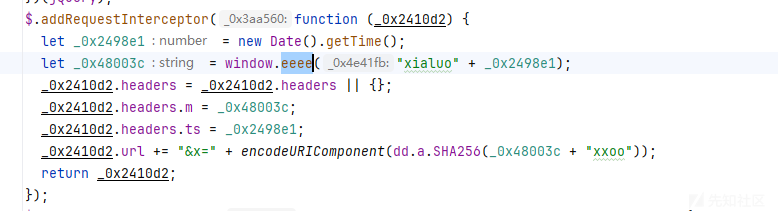

可以看到有个eeee函数，我们补齐一下，再运行代码

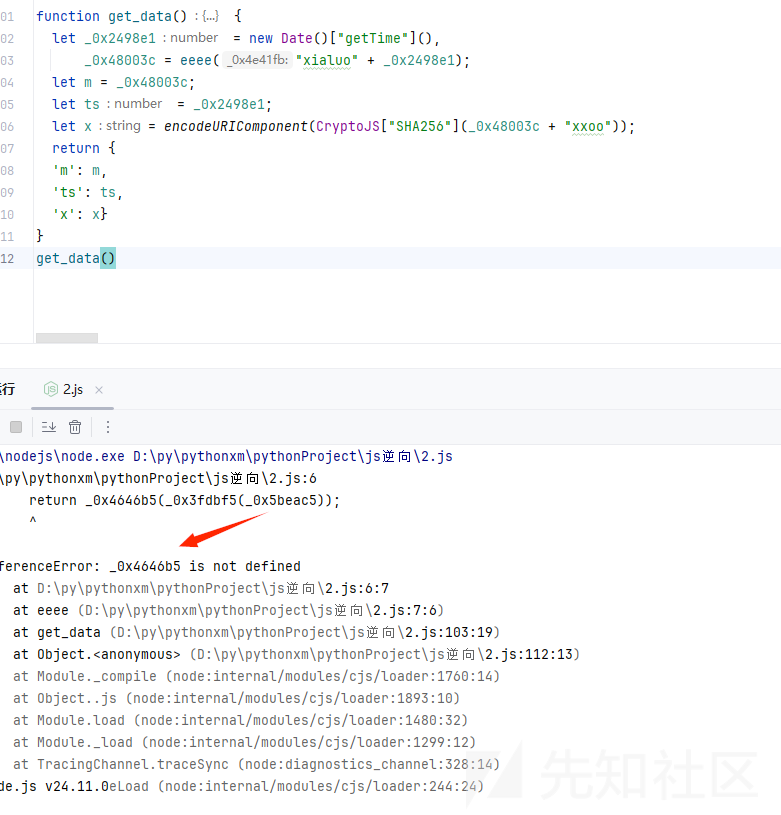

发现有缺了有个函数，全局搜索，复制粘贴过去

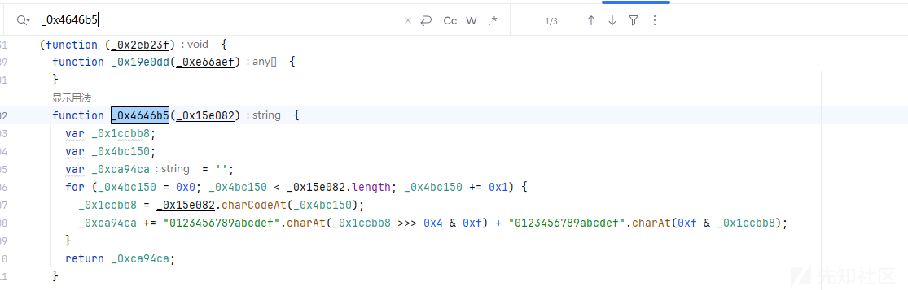

以此类推，直到不再报错

完整代码：

```
const CryptoJS = require('crypto-js')
function eeee(_0x4e41fb, _0x151d45, _0x21b59a) {
    return _0x151d45 ? _0x21b59a ? _0x5333d7(_0x151d45, _0x4e41fb) : function (_0x32e6c1, _0x317277) {
      return _0x4646b5(_0x5333d7(_0x32e6c1, _0x317277));
    }(_0x151d45, _0x4e41fb) : _0x21b59a ? _0x3fdbf5(_0x4e41fb) : function (_0x5beac5) {
      return _0x4646b5(_0x3fdbf5(_0x5beac5));
    }(_0x4e41fb);
  };
function _0x4646b5(_0x15e082) {
    var _0x1ccbb8,
        _0x4bc150,
        _0x319430 = "0123456789abcdef",
        _0xca94ca = '';

    for (_0x4bc150 = 0; _0x4bc150 < _0x15e082["length"]; _0x4bc150 += 1) {
      _0x1ccbb8 = _0x15e082["charCodeAt"](_0x4bc150);
      _0xca94ca += _0x319430["charAt"](_0x1ccbb8 >>> 4 & 15) + _0x319430["charAt"](15 & _0x1ccbb8);
    }

    return _0xca94ca;
  };
function _0x3fdbf5(_0x15f5cd) {
    return function (_0x359016) {
      return _0x39f712(_0x4ca385(_0x19e0dd(_0x359016), 8 * _0x359016["length"]));
    }(_0x28dd2d(_0x15f5cd));
  };
function _0x28dd2d(_0xafa9b4) {
    return unescape(encodeURIComponent(_0xafa9b4));
  };
function _0x39f712(_0x46c2c6) {
    var _0x46b898,
        _0x5016fb = '',
        _0x3072e8 = 32 * _0x46c2c6["length"];

    for (_0x46b898 = 0; _0x46b898 < _0x3072e8; _0x46b898 += 8) {
      _0x5016fb += String["fromCharCode"](_0x46c2c6[_0x46b898 >> 5] >>> _0x46b898 % 32 & 255);
    }

    return _0x5016fb;
  };
function _0x4ca385(_0x2dc616, _0x307043) {
    var _0x5a7e07, _0xd5b683, _0x4cf87b, _0x13ac12, _0x3d4242;

    _0x2dc616[_0x307043 >> 5] |= 128 << _0x307043 % 32;
    _0x2dc616[14 + (_0x307043 + 64 >>> 9 << 4)] = _0x307043;

    var _0x2f897c = 1732584193,
        _0x58e914 = -271733879,
        _0x4fed8f = -1732584194,
        _0x16de2e = 271733878;

    for (_0x5a7e07 = 0; _0x5a7e07 < _0x2dc616["length"]; _0x5a7e07 += 16) {
      _0x58e914 = _0x4025ad(_0x58e914 = _0x4025ad(_0x58e914 = _0x4025ad(_0x58e914 = _0x4025ad(_0x58e914 = _0x456ee7(_0x58e914 = _0x456ee7(_0x58e914 = _0x456ee7(_0x58e914 = _0x456ee7(_0x58e914 = _0x2ee51e(_0x58e914 = _0x2ee51e(_0x58e914 = _0x2ee51e(_0x58e914 = _0x2ee51e(_0x58e914 = _0x37e5c4(_0x58e914 = _0x37e5c4(_0x58e914 = _0x37e5c4(_0x58e914 = _0x37e5c4(_0x4cf87b = _0x58e914, _0x4fed8f = _0x37e5c4(_0x13ac12 = _0x4fed8f, _0x16de2e = _0x37e5c4(_0x3d4242 = _0x16de2e, _0x2f897c = _0x37e5c4(_0xd5b683 = _0x2f897c, _0x58e914, _0x4fed8f, _0x16de2e, _0x2dc616[_0x5a7e07], 7, -680876936), _0x58e914, _0x4fed8f, _0x2dc616[_0x5a7e07 + 1], 12, -389564586), _0x2f897c, _0x58e914, _0x2dc616[_0x5a7e07 + 2], 17, 606105819), _0x16de2e, _0x2f897c, _0x2dc616[_0x5a7e07 + 3], 22, -1044525330), _0x4fed8f = _0x37e5c4(_0x4fed8f, _0x16de2e = _0x37e5c4(_0x16de2e, _0x2f897c = _0x37e5c4(_0x2f897c, _0x58e914, _0x4fed8f, _0x16de2e, _0x2dc616[_0x5a7e07 + 4], 7, -176418897), _0x58e914, _0x4fed8f, _0x2dc616[_0x5a7e07 + 5], 12, 1200080426), _0x2f897c, _0x58e914, _0x2dc616[_0x5a7e07 + 6], 17, -1473231341), _0x16de2e, _0x2f897c, _0x2dc616[_0x5a7e07 + 7], 22, -45705983), _0x4fed8f = _0x37e5c4(_0x4fed8f, _0x16de2e = _0x37e5c4(_0x16de2e, _0x2f897c = _0x37e5c4(_0x2f897c, _0x58e914, _0x4fed8f, _0x16de2e, _0x2dc616[_0x5a7e07 + 8], 7, 1770035416), _0x58e914, _0x4fed8f, _0x2dc616[_0x5a7e07 + 9], 12, -1958414417), _0x2f897c, _0x58e914, _0x2dc616[_0x5a7e07 + 10], 17, -42063), _0x16de2e, _0x2f897c, _0x2dc616[_0x5a7e07 + 11], 22, -1990404162), _0x4fed8f = _0x37e5c4(_0x4fed8f, _0x16de2e = _0x37e5c4(_0x16de2e, _0x2f897c = _0x37e5c4(_0x2f897c, _0x58e914, _0x4fed8f, _0x16de2e, _0x2dc616[_0x5a7e07 + 12], 7, 1804603682), _0x58e914, _0x4fed8f, _0x2dc616[_0x5a7e07 + 13], 12, -40341101), _0x2f897c, _0x58e914, _0x2dc616[_0x5a7e07 + 14], 17, -1502002290), _0x16de2e, _0x2f897c, _0x2dc616[_0x5a7e07 + 15], 22, 1236535329), _0x4fed8f = _0x2ee51e(_0x4fed8f, _0x16de2e = _0x2ee51e(_0x16de2e, _0x2f897c = _0x2ee51e(_0x2f897c, _0x58e914, _0x4fed8f, _0x16de2e, _0x2dc616[_0x5a7e07 + 1], 5, -165796510), _0x58e914, _0x4fed8f, _0x2dc616[_0x5a7e07 + 6], 9, -1069501632), _0x2f897c, _0x58e914, _0x2dc616[_0x5a7e07 + 11], 14, 643717713), _0x16de2e, _0x2f897c, _0x2dc616[_0x5a7e07], 20, -373897302), _0x4fed8f = _0x2ee51e(_0x4fed8f, _0x16de2e = _0x2ee51e(_0x16de2e, _0x2f897c = _0x2ee51e(_0x2f897c, _0x58e914, _0x4fed8f, _0x16de2e, _0x2dc616[_0x5a7e07 + 5], 5, -701558691), _0x58e914, _0x4fed8f, _0x2dc616[_0x5a7e07 + 10], 9, 38016083), _0x2f897c, _0x58e914, _0x2dc616[_0x5a7e07 + 15], 14, -660478335), _0x16de2e, _0x2f897c, _0x2dc616[_0x5a7e07 + 4], 20, -405537848), _0x4fed8f = _0x2ee51e(_0x4fed8f, _0x16de2e = _0x2ee51e(_0x16de2e, _0x2f897c = _0x2ee51e(_0x2f897c, _0x58e914, _0x4fed8f, _0x16de2e, _0x2dc616[_0x5a7e07 + 9], 5, 568446438), _0x58e914, _0x4fed8f, _0x2dc616[_0x5a7e07 + 14], 9, -1019803690), _0x2f897c, _0x58e914, _0x2dc616[_0x5a7e07 + 3], 14, -187363961), _0x16de2e, _0x2f897c, _0x2dc616[_0x5a7e07 + 8], 20, 1163531501), _0x4fed8f = _0x2ee51e(_0x4fed8f, _0x16de2e = _0x2ee51e(_0x16de2e, _0x2f897c = _0x2ee51e(_0x2f897c, _0x58e914, _0x4fed8f, _0x16de2e, _0x2dc616[_0x5a7e07 + 13], 5, -1444681467), _0x58e914, _0x4fed8f, _0x2dc616[_0x5a7e07 + 2], 9, -51403784), _0x2f897c, _0x58e914, _0x2dc616[_0x5a7e07 + 7], 14, 1735328473), _0x16de2e, _0x2f897c, _0x2dc616[_0x5a7e07 + 12], 20, -1926607734), _0x4fed8f = _0x456ee7(_0x4fed8f, _0x16de2e = _0x456ee7(_0x16de2e, _0x2f897c = _0x456ee7(_0x2f897c, _0x58e914, _0x4fed8f, _0x16de2e, _0x2dc616[_0x5a7e07 + 5], 4, -378558), _0x58e914, _0x4fed8f, _0x2dc616[_0x5a7e07 + 8], 11, -2022574463), _0x2f897c, _0x58e914, _0x2dc616[_0x5a7e07 + 11], 16, 1839030562), _0x16de2e, _0x2f897c, _0x2dc616[_0x5a7e07 + 14], 23, -35309556), _0x4fed8f = _0x456ee7(_0x4fed8f, _0x16de2e = _0x456ee7(_0x16de2e, _0x2f897c = _0x456ee7(_0x2f897c, _0x58e914, _0x4fed8f, _0x16de2e, _0x2dc616[_0x5a7e07 + 1], 4, -1530992060), _0x58e914, _0x4fed8f, _0x2dc616[_0x5a7e07 + 4], 11, 1272893353), _0x2f897c, _0x58e914, _0x2dc616[_0x5a7e07 + 7], 16, -155497632), _0x16de2e, _0x2f897c, _0x2dc616[_0x5a7e07 + 10], 23, -1094730640), _0x4fed8f = _0x456ee7(_0x4fed8f, _0x16de2e = _0x456ee7(_0x16de2e, _0x2f897c = _0x456ee7(_0x2f897c, _0x58e914, _0x4fed8f, _0x16de2e, _0x2dc616[_0x5a7e07 + 13], 4, 681279174), _0x58e914, _0x4fed8f, _0x2dc616[_0x5a7e07], 11, -358537222), _0x2f897c, _0x58e914, _0x2dc616[_0x5a7e07 + 3], 16, -722521979), _0x16de2e, _0x2f897c, _0x2dc616[_0x5a7e07 + 6], 23, 76029189), _0x4fed8f = _0x456ee7(_0x4fed8f, _0x16de2e = _0x456ee7(_0x16de2e, _0x2f897c = _0x456ee7(_0x2f897c, _0x58e914, _0x4fed8f, _0x16de2e, _0x2dc616[_0x5a7e07 + 9], 4, -640364487), _0x58e914, _0x4fed8f, _0x2dc616[_0x5a7e07 + 12], 11, -421815835), _0x2f897c, _0x58e914, _0x2dc616[_0x5a7e07 + 15], 16, 530742520), _0x16de2e, _0x2f897c, _0x2dc616[_0x5a7e07 + 2], 23, -995338651), _0x4fed8f = _0x4025ad(_0x4fed8f, _0x16de2e = _0x4025ad(_0x16de2e, _0x2f897c = _0x4025ad(_0x2f897c, _0x58e914, _0x4fed8f, _0x16de2e, _0x2dc616[_0x5a7e07], 6, -198630844), _0x58e914, _0x4fed8f, _0x2dc616[_0x5a7e07 + 7], 10, 1126891415), _0x2f897c, _0x58e914, _0x2dc616[_0x5a7e07 + 14], 15, -1416354905), _0x16de2e, _0x2f897c, _0x2dc616[_0x5a7e07 + 5], 21, -57434055), _0x4fed8f = _0x4025ad(_0x4fed8f, _0x16de2e = _0x4025ad(_0x16de2e, _0x2f897c = _0x4025ad(_0x2f897c, _0x58e914, _0x4fed8f, _0x16de2e, _0x2dc616[_0x5a7e07 + 12], 6, 1700485571), _0x58e914, _0x4fed8f, _0x2dc616[_0x5a7e07 + 3], 10, -1894986606), _0x2f897c, _0x58e914, _0x2dc616[_0x5a7e07 + 10], 15, -1051523), _0x16de2e, _0x2f897c, _0x2dc616[_0x5a7e07 + 1], 21, -2054922799), _0x4fed8f = _0x4025ad(_0x4fed8f, _0x16de2e = _0x4025ad(_0x16de2e, _0x2f897c = _0x4025ad(_0x2f897c, _0x58e914, _0x4fed8f, _0x16de2e, _0x2dc616[_0x5a7e07 + 8], 6, 1873313359), _0x58e914, _0x4fed8f, _0x2dc616[_0x5a7e07 + 15], 10, -30611744), _0x2f897c, _0x58e914, _0x2dc616[_0x5a7e07 + 6], 15, -1560198380), _0x16de2e, _0x2f897c, _0x2dc616[_0x5a7e07 + 13], 21, 1309151649), _0x4fed8f = _0x4025ad(_0x4fed8f, _0x16de2e = _0x4025ad(_0x16de2e, _0x2f897c = _0x4025ad(_0x2f897c, _0x58e914, _0x4fed8f, _0x16de2e, _0x2dc616[_0x5a7e07 + 4], 6, -145523070), _0x58e914, _0x4fed8f, _0x2dc616[_0x5a7e07 + 11], 10, -1120210379), _0x2f897c, _0x58e914, _0x2dc616[_0x5a7e07 + 2], 15, 718787259), _0x16de2e, _0x2f897c, _0x2dc616[_0x5a7e07 + 9], 21, -343485551);
      _0x2f897c = _0x42fcff(_0x2f897c, _0xd5b683);
      _0x58e914 = _0x42fcff(_0x58e914, _0x4cf87b);
      _0x4fed8f = _0x42fcff(_0x4fed8f, _0x13ac12);
      _0x16de2e = _0x42fcff(_0x16de2e, _0x3d4242);
    }

    return [_0x2f897c, _0x58e914, _0x4fed8f, _0x16de2e];
  };
function _0x19e0dd(_0xe66aef) {
    var _0x286c6a,
        _0x53584a = [];

    for (_0x53584a[(_0xe66aef["length"] >> 2) - 1] = void 0, _0x286c6a = 0; _0x286c6a < _0x53584a["length"]; _0x286c6a += 1) {
      _0x53584a[_0x286c6a] = 0;
    }

    var _0x29afd4 = 8 * _0xe66aef["length"];

    for (_0x286c6a = 0; _0x286c6a < _0x29afd4; _0x286c6a += 8) {
      _0x53584a[_0x286c6a >> 5] |= (255 & _0xe66aef["charCodeAt"](_0x286c6a / 8)) << _0x286c6a % 32;
    }

    return _0x53584a;
  };
function _0x4025ad(_0x551614, _0x3736d8, _0x3091a9, _0x5c8ce5, _0x29a596, _0x3e1797, _0x2a5aa9) {
    return _0x3d57b3(_0x3091a9 ^ (_0x3736d8 | ~_0x5c8ce5), _0x551614, _0x3736d8, _0x29a596, _0x3e1797, _0x2a5aa9);
  };
function _0x456ee7(_0x1ccf9c, _0xf3008c, _0x21c7c7, _0xa84375, _0xa121be, _0x5a76ec, _0x47fb6e) {
    return _0x3d57b3(_0xf3008c ^ _0x21c7c7 ^ _0xa84375, _0x1ccf9c, _0xf3008c, _0xa121be, _0x5a76ec, _0x47fb6e);
  };
function _0x2ee51e(_0x398952, _0x441c4e, _0x4c89ff, _0x5d836a, _0x967345, _0x474483, _0x369a2d) {
    return _0x3d57b3(_0x441c4e & _0x5d836a | _0x4c89ff & ~_0x5d836a, _0x398952, _0x441c4e, _0x967345, _0x474483, _0x369a2d);
  };
function _0x37e5c4(_0x4c79ac, _0x1bc981, _0x372a6a, _0x27faff, _0x563eb7, _0x118215, _0x4d4537) {
    return _0x3d57b3(_0x1bc981 & _0x372a6a | ~_0x1bc981 & _0x27faff, _0x4c79ac, _0x1bc981, _0x563eb7, _0x118215, _0x4d4537);
  };
function _0x3d57b3(_0x37dd5c, _0x241fbb, _0x41c5da, _0x29f9bb, _0x5c4414, _0x461224) {
    return _0x42fcff(function (_0x5961b3, _0x5d9435) {
      return _0x5961b3 << _0x5c4414 | _0x5961b3 >>> 32 - _0x5c4414;
    }(_0x42fcff(_0x42fcff(_0x241fbb, _0x37dd5c), _0x42fcff(_0x29f9bb, _0x461224))), _0x41c5da);
  }
function _0x42fcff(_0x2a4dbf, _0x1aac01) {
    var _0x4c862c = (65535 & _0x2a4dbf) + (65535 & _0x1aac01);

    return (_0x2a4dbf >> 16) + (_0x1aac01 >> 16) + (_0x4c862c >> 16) << 16 | 65535 & _0x4c862c;
  };

function get_data() {
  let _0x2498e1 = new Date()["getTime"](),
      _0x48003c = eeee("xialuo" + _0x2498e1);
  let m = _0x48003c;
  let ts = _0x2498e1;
  let x= encodeURIComponent(CryptoJS["SHA256"](_0x48003c + "xxoo"));
  return {
  'm': m,
  'ts': ts,
  'x': x}
}
console.log(get_data())
```

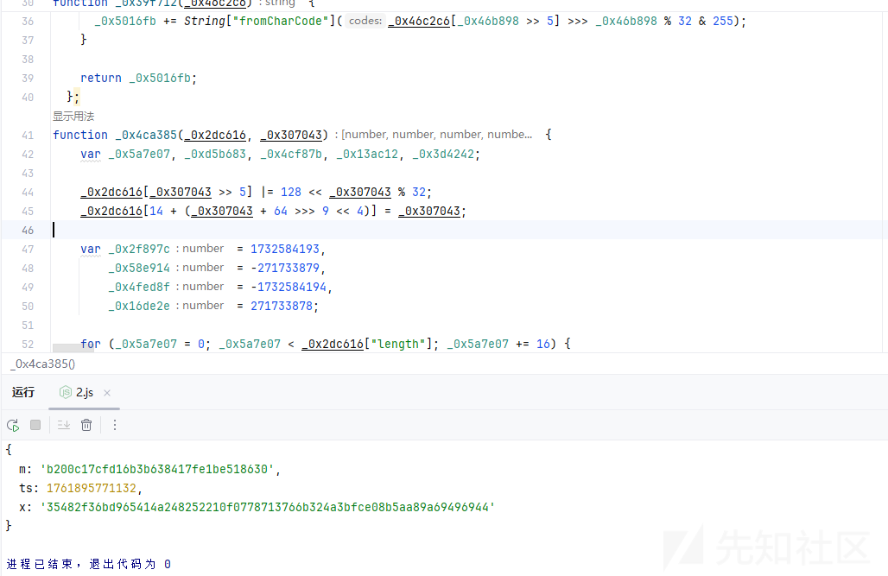

接下来寻找解密代码

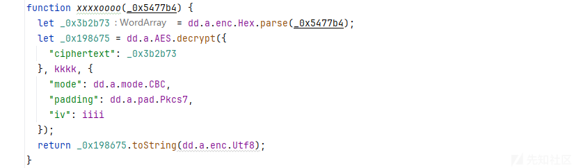

和上面一样的思路，扣出来，哪里缺了补哪里

```
let kkkk = CryptoJS["enc"]["Utf8"]["parse"]("xxxxxxxxoooooooo"),
    iiii = CryptoJS["enc"]["Utf8"]["parse"]("0123456789ABCDEF");

function xxxxoooo(_0x5477b4) {
  let _0x3b2b73 = CryptoJS["enc"]["Hex"]["parse"](_0x5477b4),
      _0x198675 = CryptoJS["AES"]["decrypt"]({
    "ciphertext": _0x3b2b73
  }, kkkk, {
    "mode": CryptoJS["mode"]["CBC"],
    "padding": CryptoJS["pad"]["Pkcs7"],
    "iv": iiii
  });

  return _0x198675["toString"](CryptoJS["enc"]["Utf8"]);
}
```

# 实战案例

**AES 加解密简介**

高级加密标准(AES,Advanced Encryption Standard)为最常见的对称加密算法（微信小程序）加密传输就是用这个加密算法的)。对称加密算法也就是加密和解密用相同的密钥，具体的加密流程如下图：

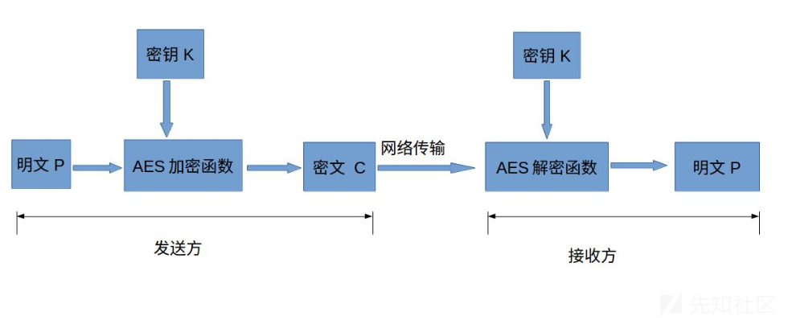

这里很明显就可以发现请求和响应都被加密了

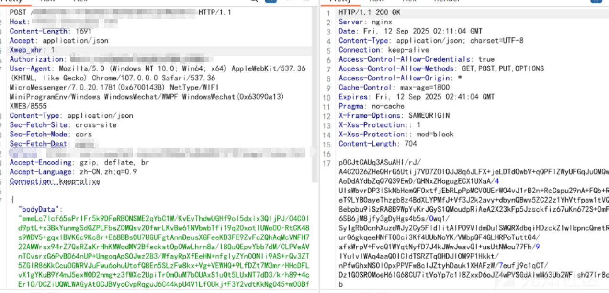

全局搜索加密函数encrypt

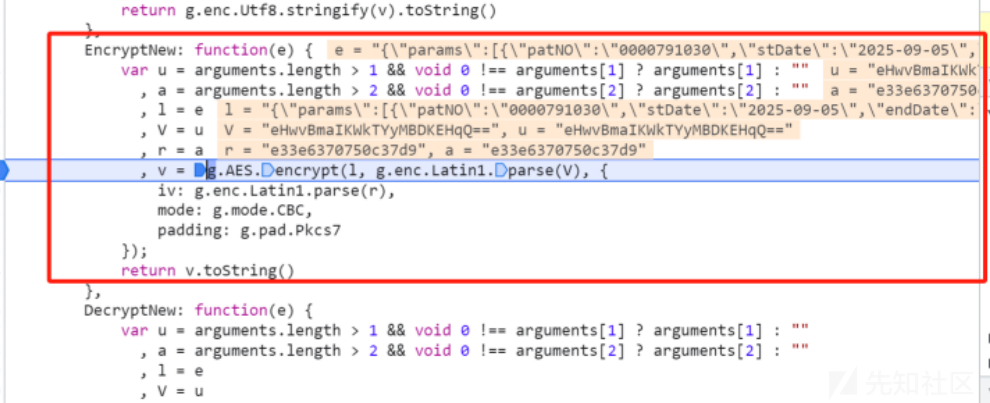

动调后可以获取以下信息

```
加密算法: AES
模式: CBC
填充: PKCS7
密钥: eHwvBmaIKWkTYyMBDKEHqQ== 
初始化向量(IV): e33e6370750c37d9
```

使用解密工具解密

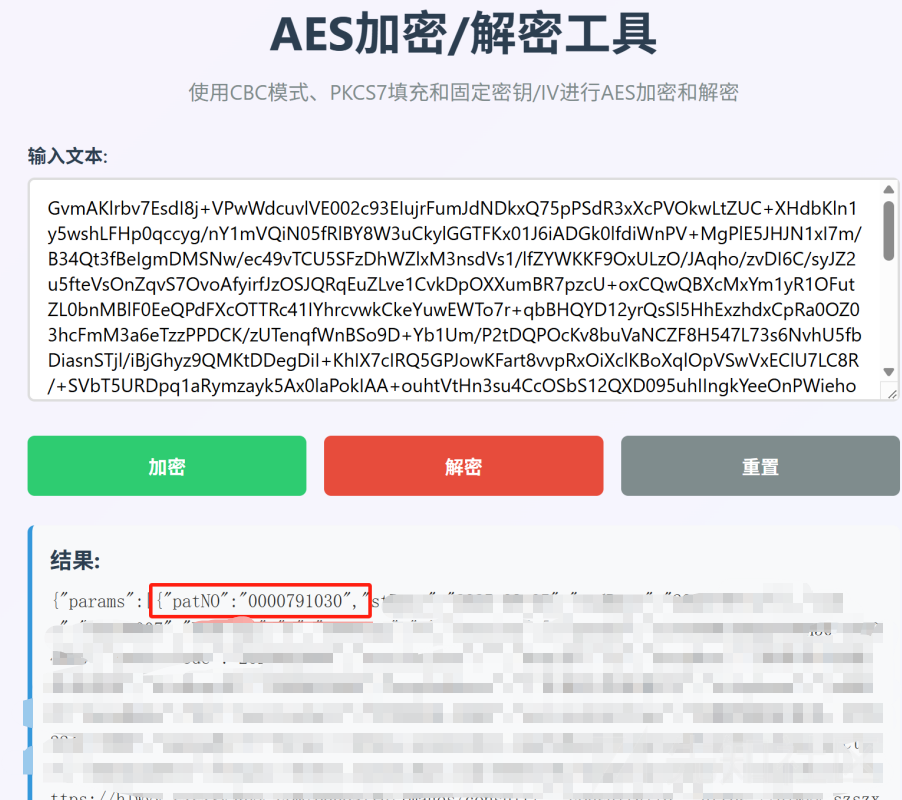

遍历参数值即可获取敏感信息

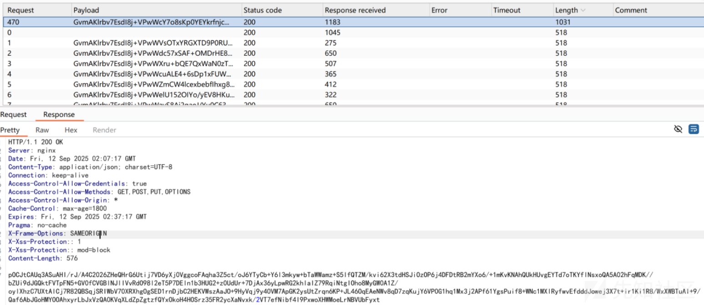

一键生成爬虫代码


接下来再修改其中参数即可

这里要python代码与js代码进行交互需要安装pyexecjs库

```
import requests
import execjs

# 读取并编译 JS 文件
with open("1.js", "r", encoding="utf-8") as f:
    js_code = f.read()

ctx = execjs.compile(js_code)

# 请求头
headers = {
    "accept": "*/*",
    "accept-language": "zh-CN,zh;q=0.9",
    "priority": "u=1, i",
    "referer": "https://mashangpa.com/problem-detail/4/",
    "sec-ch-ua": '"Not?A_Brand";v="99", "Chromium";v="130"',
    "sec-ch-ua-mobile": "?0",
    "sec-ch-ua-platform": '"Windows"',
    "sec-fetch-dest": "empty",
    "sec-fetch-mode": "cors",
    "sec-fetch-site": "same-origin",
    "user-agent": "Mozilla/5.0 (Windows NT 10.0; Win64; x64) AppleWebKit/537.36 (KHTML, like Gecko) Chrome/130.0.6723.70 Safari/537.36"
}

# Cookie（请确保有效）
cookies = {
    "sessionid": "",
    "Hm_lvt_0d2227abf9548feda3b9cb6fddee26c0": "1761821851,1761822906,1761878480",
    "HMACCOUNT": "FB751129E2D5993E",
    "Hm_lpvt_0d2227abf9548feda3b9cb6fddee26c0": "1761880377"
}

# 存储总和
total_sum = 0

# API 地址
url = "https://mashangpa.com/api/problem-detail/4/data/"

# 遍历 page 1 到 20
for page in range(1, 21):
    try:
        # 调用 JS 函数生成 sign 和 timestamp
        result = ctx.call("get_sign", page)
        sign = result["sign"]
        timestamp = result["ts"]

        # 请求参数
        params = {
            "page": str(page),
            "sign": sign,
            "_ts": timestamp
        }

        # 发起 GET 请求
        response = requests.get(url, headers=headers, cookies=cookies, params=params)
        response.raise_for_status()  # 检查 HTTP 错误

        data = response.json()

        if "current_array" in data:
            current_sum = sum(data["current_array"])
            total_sum += current_sum
            print(f"Page {page}: {data['current_array']} -> Sum = {current_sum}")
        else:
            print(f"Page {page}: 'current_array' not found in response.")

    except Exception as e:
        print(f"Error on page {page}: {e}")

# 输出最终结果
print(f"
所有数组元素总和: {total_sum}")
```


# 案例二


查看请求就可以发现这里页多了一个加密的xl参数


全局搜索一下该参数


接下来看一下代码所需要的参数

```
xl: encryptedQuery
let encryptedQuery = encrypt(jsonString);
const jsonString = JSON.stringify(params);
const params = {
        page: pageNumber,
        _ts: timestamp,
    };
```

接下来就可以大概写一下加密逻辑

```
function demo(pageNumber) {
    const timestamp = new Date().getTime();
    const params = {
        page: pageNumber,
        _ts: timestamp
    };
    const xl = encrypt(JSON.stringify(params));
    return xl;
}
```

就只差encrypt方法不知道了

看看encrypt方法


可以发现这里进行了一个ob混淆

ob解混淆方法1，直接把鼠标放参数上面

​


方法2：控制台解密


方法三：直接在线网站：<https://tool.yuanrenxue.cn/decode_obfuscator>

这里页声明了encrypt方法里面的参数


解混淆后：

```
const CryptoJS = require("crypto-js");

function encrypt(dataString) {
    const key = CryptoJS.enc.Utf8.parse('jo8j9wGw%6Hbxffn');
    const iv = CryptoJS.enc.Utf8.parse('0123456789ABCDEF');

    const encrypted = CryptoJS.AES.encrypt(dataString, key, {
        iv: iv,
        mode: CryptoJS.mode.CBC,
        padding: CryptoJS.pad.Pkcs7
    });

    return encrypted.ciphertext.toString(CryptoJS.enc.hex);
}
```

所有可以写出完整js代码了

```
const CryptoJS = require("crypto-js");

function encrypt(dataString) {
    const key = CryptoJS.enc.Utf8.parse('jo8j9wGw%6Hbxffn');
    const iv = CryptoJS.enc.Utf8.parse('0123456789ABCDEF');

    const encrypted = CryptoJS.AES.encrypt(dataString, key, {
        iv: iv,
        mode: CryptoJS.mode.CBC,
        padding: CryptoJS.pad.Pkcs7
    });

    return encrypted.ciphertext.toString(CryptoJS.enc.hex);
}
function demo(pageNumber) {
    const timestamp = new Date().getTime();
    const params = {
        page: pageNumber,
        _ts: timestamp
    };
    const xl = encrypt(JSON.stringify(params));
    return xl;
}
demo(1)
```


# 案例三


这一关可以发现是请求响应被加密了


所以这里无法进行全局搜索来定位加密，这里需要从启动器入手


可以发现这里发送请求的时候携带了hearder信息


打个断点调一下，发现确实为加密数据，接下来需要去找hhh


这里写清楚了参数构造


再定位一下xxo


这里的加密和第一个一样的，都是自己写的一个方法，直接把window方法扣下来

js完整代码：

```
window = this, function (n) {
    function r(n, r) {
        var t = (65535 & n) + (65535 & r);
        return (n >> 16) + (r >> 16) + (t >> 16) << 16 | 65535 & t
    }

    function t(n, t, o, u, e, c) {
        return r(function (n, r) {
            return n << e | n >>> 32 - e
        }(r(r(t, n), r(u, c))), o)
    }

    function o(n, r, o, u, e, c, f) {
        return t(r & o | ~r & u, n, r, e, c, f)
    }

    function u(n, r, o, u, e, c, f) {
        return t(r & u | o & ~u, n, r, e, c, f)
    }

    function e(n, r, o, u, e, c, f) {
        return t(r ^ o ^ u, n, r, e, c, f)
    }

    function c(n, r, o, u, e, c, f) {
        return t(o ^ (r | ~u), n, r, e, c, f)
    }

    function f(n, t) {
        var f, i, a, h, g;
        n[t >> 5] |= 128 << t % 32, n[14 + (t + 64 >>> 9 << 4)] = t;
        var l = 1732584193, d = -271733879, v = -1732584194, C = 271733878;
        for (f = 0; f < n.length; f += 16) d = c(d = c(d = c(d = c(d = e(d = e(d = e(d = e(d = u(d = u(d = u(d = u(d = o(d = o(d = o(d = o(a = d, v = o(h = v, C = o(g = C, l = o(i = l, d, v, C, n[f], 7, -680876936), d, v, n[f + 1], 12, -389564586), l, d, n[f + 2], 17, 606105819), C, l, n[f + 3], 22, -1044525330), v = o(v, C = o(C, l = o(l, d, v, C, n[f + 4], 7, -176418897), d, v, n[f + 5], 12, 1200080426), l, d, n[f + 6], 17, -1473231341), C, l, n[f + 7], 22, -45705983), v = o(v, C = o(C, l = o(l, d, v, C, n[f + 8], 7, 1770035416), d, v, n[f + 9], 12, -1958414417), l, d, n[f + 10], 17, -42063), C, l, n[f + 11], 22, -1990404162), v = o(v, C = o(C, l = o(l, d, v, C, n[f + 12], 7, 1804603682), d, v, n[f + 13], 12, -40341101), l, d, n[f + 14], 17, -1502002290), C, l, n[f + 15], 22, 1236535329), v = u(v, C = u(C, l = u(l, d, v, C, n[f + 1], 5, -165796510), d, v, n[f + 6], 9, -1069501632), l, d, n[f + 11], 14, 643717713), C, l, n[f], 20, -373897302), v = u(v, C = u(C, l = u(l, d, v, C, n[f + 5], 5, -701558691), d, v, n[f + 10], 9, 38016083), l, d, n[f + 15], 14, -660478335), C, l, n[f + 4], 20, -405537848), v = u(v, C = u(C, l = u(l, d, v, C, n[f + 9], 5, 568446438), d, v, n[f + 14], 9, -1019803690), l, d, n[f + 3], 14, -187363961), C, l, n[f + 8], 20, 1163531501), v = u(v, C = u(C, l = u(l, d, v, C, n[f + 13], 5, -1444681467), d, v, n[f + 2], 9, -51403784), l, d, n[f + 7], 14, 1735328473), C, l, n[f + 12], 20, -1926607734), v = e(v, C = e(C, l = e(l, d, v, C, n[f + 5], 4, -378558), d, v, n[f + 8], 11, -2022574463), l, d, n[f + 11], 16, 1839030562), C, l, n[f + 14], 23, -35309556), v = e(v, C = e(C, l = e(l, d, v, C, n[f + 1], 4, -1530992060), d, v, n[f + 4], 11, 1272893353), l, d, n[f + 7], 16, -155497632), C, l, n[f + 10], 23, -1094730640), v = e(v, C = e(C, l = e(l, d, v, C, n[f + 13], 4, 681279174), d, v, n[f], 11, -358537222), l, d, n[f + 3], 16, -722521979), C, l, n[f + 6], 23, 76029189), v = e(v, C = e(C, l = e(l, d, v, C, n[f + 9], 4, -640364487), d, v, n[f + 12], 11, -421815835), l, d, n[f + 15], 16, 530742520), C, l, n[f + 2], 23, -995338651), v = c(v, C = c(C, l = c(l, d, v, C, n[f], 6, -198630844), d, v, n[f + 7], 10, 1126891415), l, d, n[f + 14], 15, -1416354905), C, l, n[f + 5], 21, -57434055), v = c(v, C = c(C, l = c(l, d, v, C, n[f + 12], 6, 1700485571), d, v, n[f + 3], 10, -1894986606), l, d, n[f + 10], 15, -1051523), C, l, n[f + 1], 21, -2054922799), v = c(v, C = c(C, l = c(l, d, v, C, n[f + 8], 6, 1873313359), d, v, n[f + 15], 10, -30611744), l, d, n[f + 6], 15, -1560198380), C, l, n[f + 13], 21, 1309151649), v = c(v, C = c(C, l = c(l, d, v, C, n[f + 4], 6, -145523070), d, v, n[f + 11], 10, -1120210379), l, d, n[f + 2], 15, 718787259), C, l, n[f + 9], 21, -343485551), l = r(l, i), d = r(d, a), v = r(v, h), C = r(C, g);
        return [l, d, v, C]
    }

    function i(n) {
        var r, t = "", o = 32 * n.length;
        for (r = 0; r < o; r += 8) t += String.fromCharCode(n[r >> 5] >>> r % 32 & 255);
        return t
    }

    function a(n) {
        var r, t = [];
        for (t[(n.length >> 2) - 1] = void 0, r = 0; r < t.length; r += 1) t[r] = 0;
        var o = 8 * n.length;
        for (r = 0; r < o; r += 8) t[r >> 5] |= (255 & n.charCodeAt(r / 8)) << r % 32;
        return t
    }

    function h(n) {
        var r, t, o = "0123456789abcdef", u = "";
        for (t = 0; t < n.length; t += 1) r = n.charCodeAt(t), u += o.charAt(r >>> 4 & 15) + o.charAt(15 & r);
        return u
    }

    function g(n) {
        return unescape(encodeURIComponent(n))
    }

    function l(n) {
        return function (n) {
            return i(f(a(n), 8 * n.length))
        }(g(n))
    }

    function d(n, r) {
        return function (n, r) {
            var t, o, u = a(n), e = [], c = [];
            for (e[15] = c[15] = void 0, 16 < u.length && (u = f(u, 8 * n.length)), t = 0; t < 16; t += 1) e[t] = 909522486 ^ u[t], c[t] = 1549556828 ^ u[t];
            return o = f(e.concat(a(r)), 512 + 8 * r.length), i(f(c.concat(o), 640))
        }(g(n), g(r))
    }

    window.xxoo = function (n, r, t) {
        return r ? t ? d(r, n) : function (n, r) {
            return h(d(n, r))
        }(r, n) : t ? l(n) : function (n) {
            return h(l(n))
        }(n)
    }
}();
const ttt  = new Date().getTime();
const s = window.xxoo("sssssbbbbb" + ttt)

console.log(s)
```


请求的问题已经解决了，接下来该解决响应的问题了

这里有个函数对响应data做了处理


跟进一下可以发现存在解密逻辑


```
function xxxxoooo(encryptedHex) {
    let enccc = dd.a.enc.Hex.parse(encryptedHex);
    let deccc = dd.a.AES["decr" + "ypt"]({ciphertext: enccc}, kkkk, {
        mode: dd.a.mode.CBC,
        padding: dd.a.pad.Pkcs7,
        iv: iiii,
    });
    return deccc.toString(dd.a.enc.Utf8);
}
```

找到函数中需要的参数


再加入到js代码里面去

```
const CryptoJS =require("crypto-js")
window = this, function (n) {
    function r(n, r) {
        var t = (65535 & n) + (65535 & r);
        return (n >> 16) + (r >> 16) + (t >> 16) << 16 | 65535 & t
    }

    function t(n, t, o, u, e, c) {
        return r(function (n, r) {
            return n << e | n >>> 32 - e
        }(r(r(t, n), r(u, c))), o)
    }

    function o(n, r, o, u, e, c, f) {
        return t(r & o | ~r & u, n, r, e, c, f)
    }

    function u(n, r, o, u, e, c, f) {
        return t(r & u | o & ~u, n, r, e, c, f)
    }

    function e(n, r, o, u, e, c, f) {
        return t(r ^ o ^ u, n, r, e, c, f)
    }

    function c(n, r, o, u, e, c, f) {
        return t(o ^ (r | ~u), n, r, e, c, f)
    }

    function f(n, t) {
        var f, i, a, h, g;
        n[t >> 5] |= 128 << t % 32, n[14 + (t + 64 >>> 9 << 4)] = t;
        var l = 1732584193, d = -271733879, v = -1732584194, C = 271733878;
        for (f = 0; f < n.length; f += 16) d = c(d = c(d = c(d = c(d = e(d = e(d = e(d = e(d = u(d = u(d = u(d = u(d = o(d = o(d = o(d = o(a = d, v = o(h = v, C = o(g = C, l = o(i = l, d, v, C, n[f], 7, -680876936), d, v, n[f + 1], 12, -389564586), l, d, n[f + 2], 17, 606105819), C, l, n[f + 3], 22, -1044525330), v = o(v, C = o(C, l = o(l, d, v, C, n[f + 4], 7, -176418897), d, v, n[f + 5], 12, 1200080426), l, d, n[f + 6], 17, -1473231341), C, l, n[f + 7], 22, -45705983), v = o(v, C = o(C, l = o(l, d, v, C, n[f + 8], 7, 1770035416), d, v, n[f + 9], 12, -1958414417), l, d, n[f + 10], 17, -42063), C, l, n[f + 11], 22, -1990404162), v = o(v, C = o(C, l = o(l, d, v, C, n[f + 12], 7, 1804603682), d, v, n[f + 13], 12, -40341101), l, d, n[f + 14], 17, -1502002290), C, l, n[f + 15], 22, 1236535329), v = u(v, C = u(C, l = u(l, d, v, C, n[f + 1], 5, -165796510), d, v, n[f + 6], 9, -1069501632), l, d, n[f + 11], 14, 643717713), C, l, n[f], 20, -373897302), v = u(v, C = u(C, l = u(l, d, v, C, n[f + 5], 5, -701558691), d, v, n[f + 10], 9, 38016083), l, d, n[f + 15], 14, -660478335), C, l, n[f + 4], 20, -405537848), v = u(v, C = u(C, l = u(l, d, v, C, n[f + 9], 5, 568446438), d, v, n[f + 14], 9, -1019803690), l, d, n[f + 3], 14, -187363961), C, l, n[f + 8], 20, 1163531501), v = u(v, C = u(C, l = u(l, d, v, C, n[f + 13], 5, -1444681467), d, v, n[f + 2], 9, -51403784), l, d, n[f + 7], 14, 1735328473), C, l, n[f + 12], 20, -1926607734), v = e(v, C = e(C, l = e(l, d, v, C, n[f + 5], 4, -378558), d, v, n[f + 8], 11, -2022574463), l, d, n[f + 11], 16, 1839030562), C, l, n[f + 14], 23, -35309556), v = e(v, C = e(C, l = e(l, d, v, C, n[f + 1], 4, -1530992060), d, v, n[f + 4], 11, 1272893353), l, d, n[f + 7], 16, -155497632), C, l, n[f + 10], 23, -1094730640), v = e(v, C = e(C, l = e(l, d, v, C, n[f + 13], 4, 681279174), d, v, n[f], 11, -358537222), l, d, n[f + 3], 16, -722521979), C, l, n[f + 6], 23, 76029189), v = e(v, C = e(C, l = e(l, d, v, C, n[f + 9], 4, -640364487), d, v, n[f + 12], 11, -421815835), l, d, n[f + 15], 16, 530742520), C, l, n[f + 2], 23, -995338651), v = c(v, C = c(C, l = c(l, d, v, C, n[f], 6, -198630844), d, v, n[f + 7], 10, 1126891415), l, d, n[f + 14], 15, -1416354905), C, l, n[f + 5], 21, -57434055), v = c(v, C = c(C, l = c(l, d, v, C, n[f + 12], 6, 1700485571), d, v, n[f + 3], 10, -1894986606), l, d, n[f + 10], 15, -1051523), C, l, n[f + 1], 21, -2054922799), v = c(v, C = c(C, l = c(l, d, v, C, n[f + 8], 6, 1873313359), d, v, n[f + 15], 10, -30611744), l, d, n[f + 6], 15, -1560198380), C, l, n[f + 13], 21, 1309151649), v = c(v, C = c(C, l = c(l, d, v, C, n[f + 4], 6, -145523070), d, v, n[f + 11], 10, -1120210379), l, d, n[f + 2], 15, 718787259), C, l, n[f + 9], 21, -343485551), l = r(l, i), d = r(d, a), v = r(v, h), C = r(C, g);
        return [l, d, v, C]
    }

    function i(n) {
        var r, t = "", o = 32 * n.length;
        for (r = 0; r < o; r += 8) t += String.fromCharCode(n[r >> 5] >>> r % 32 & 255);
        return t
    }

    function a(n) {
        var r, t = [];
        for (t[(n.length >> 2) - 1] = void 0, r = 0; r < t.length; r += 1) t[r] = 0;
        var o = 8 * n.length;
        for (r = 0; r < o; r += 8) t[r >> 5] |= (255 & n.charCodeAt(r / 8)) << r % 32;
        return t
    }

    function h(n) {
        var r, t, o = "0123456789abcdef", u = "";
        for (t = 0; t < n.length; t += 1) r = n.charCodeAt(t), u += o.charAt(r >>> 4 & 15) + o.charAt(15 & r);
        return u
    }

    function g(n) {
        return unescape(encodeURIComponent(n))
    }

    function l(n) {
        return function (n) {
            return i(f(a(n), 8 * n.length))
        }(g(n))
    }

    function d(n, r) {
        return function (n, r) {
            var t, o, u = a(n), e = [], c = [];
            for (e[15] = c[15] = void 0, 16 < u.length && (u = f(u, 8 * n.length)), t = 0; t < 16; t += 1) e[t] = 909522486 ^ u[t], c[t] = 1549556828 ^ u[t];
            return o = f(e.concat(a(r)), 512 + 8 * r.length), i(f(c.concat(o), 640))
        }(g(n), g(r))
    }

    window.xxoo = function (n, r, t) {
        return r ? t ? d(r, n) : function (n, r) {
            return h(d(n, r))
        }(r, n) : t ? l(n) : function (n) {
            return h(l(n))
        }(n)
    }
}();
function demo() {
    const ttt = new Date().getTime();
    const s = window.xxoo("sssssbbbbb" + ttt);
    return {
        "ttt": ttt,
        "s": s
    };
}

function xxxxoooo(encryptedHex) {
    let kkkk = CryptoJS.enc.Utf8.parse("xxxxxxxxoooooooo");
    let iiii = CryptoJS.enc.Utf8.parse("0123456789ABCDEF");
    let enccc = CryptoJS.enc.Hex.parse(encryptedHex);
    let deccc = CryptoJS.AES["decrypt"]({ciphertext: enccc}, kkkk, {
        mode: CryptoJS.mode.CBC,
        padding: CryptoJS.pad.Pkcs7,
        iv: iiii,
    });
    return deccc.toString(CryptoJS.enc.Utf8);
}
```

python代码：

```
import json
import execjs
import requests

# 需要登录，请先登录，获取cookie并完善参数
cookies = {
    "sessionid": "vms1bj0csqnb07ismwl8xb5r2peh3f0q",
    "Hm_lvt_0d2227abf9548feda3b9cb6fddee26c0": "1761822906,1761878480,1761881876,1761884653",
    "HMACCOUNT": "FB751129E2D5993E",
    "Hm_lpvt_0d2227abf9548feda3b9cb6fddee26c0": "1761884662"
}

var = 0
for i in range(1, 21):
    with open('1.js', 'r', encoding='utf-8') as f:
        js_code = f.read()
    result = execjs.compile(js_code).call('demo')
    print(result)
    s = result['s']
    tt = str(result['ttt'])
    headers = {
        "accept": "*/*",
        "accept-language": "zh-CN,zh;q=0.9",
        "priority": "u=1, i",
        "referer": "https://mashangpa.com/problem-detail/6/",
        "s": s,
        "sec-ch-ua": ""Not?A_Brand";v="99", "Chromium";v="130"",
        "sec-ch-ua-mobile": "?0",
        "sec-ch-ua-platform": ""Windows"",
        "sec-fetch-dest": "empty",
        "sec-fetch-mode": "cors",
        "sec-fetch-site": "same-origin",
        "tt": tt,
        "user-agent": "Mozilla/5.0 (Windows NT 10.0; Win64; x64) AppleWebKit/537.36 (KHTML, like Gecko) Chrome/130.0.6723.70 Safari/537.36"
    }
    params = {
        'page': i,
    }
    res = requests.get('https://www.mashangpa.com/api/problem-detail/6/data/', headers=headers, params=params,
                       cookies=cookies)
    data = res.json()['t']
    val = execjs.compile(js_code).call('xxxxoooo', data)
    # print(val)
    val_json = json.loads(val)
    print(val_json)
    var += sum(val_json['current_array'])
print(f"和为：{var}")
```


# 案例四


调试出现无限debugger


绕过方法：右击跳过


现在可以看见请求和响应了，发现都被加密了


依旧启动器入手


跳转发现有混淆，直接用在线网站


解密后的js代码：

```
const originalJSON = {
  "stringify": JSON.stringify,
  "parse": JSON.parse
};
const x1 = new Proxy(originalJSON, {
  "get"(_0x4bf3ac, _0x31ad78) {
    if (_0x31ad78 === "stringify") {
      return function (..._0x14b4e2) {
        return _0x4bf3ac.stringify(..._0x14b4e2);
      };
    } else {
      if (_0x31ad78 === "parse") {
        return function (..._0x446842) {
          return _0x4bf3ac.parse(..._0x446842);
        };
      }
    }
    return _0x4bf3ac[_0x31ad78];
  }
});
console.log("我盯着你呢小子");
setInterval(() => {
  0x0;
  (function (_0x4adaca) {
    return function (_0x135fc7) {
      return Function("Function(arguments[0]+"" + _0x135fc7 + "")()");
    }(_0x4adaca);
  })("bugger")("de", 0x0, 0x0, 0x0);
}, 0x3e8);
window = this;
(function (_0x2eb23f) {
  const _0x8e5473 = function () {
    let _0xfba24c = true;
    return function (_0x5cf9d7, _0x283755) {
      const _0x3ed046 = _0xfba24c ? function () {
        if (_0x283755) {
          const _0xf646c0 = _0x283755.apply(_0x5cf9d7, arguments);
          _0x283755 = null;
          return _0xf646c0;
        }
      } : function () {};
      _0xfba24c = false;
      return _0x3ed046;
    };
  }();
  const _0x372b67 = _0x8e5473(this, function () {
    return _0x372b67.toString().search("(((.+)+)+)+$").toString().constructor(_0x372b67).search("(((.+)+)+)+$");
  });
  _0x372b67();
  function _0x42fcff(_0x2a4dbf, _0x1aac01) {
    var _0x4c862c = (0xffff & _0x2a4dbf) + (0xffff & _0x1aac01);
    return (_0x2a4dbf >> 0x10) + (_0x1aac01 >> 0x10) + (_0x4c862c >> 0x10) << 0x10 | 0xffff & _0x4c862c;
  }
  function _0x3d57b3(_0x37dd5c, _0x241fbb, _0x41c5da, _0x29f9bb, _0x5c4414, _0x461224) {
    return _0x42fcff(function (_0x5961b3, _0x5d9435) {
      return _0x5961b3 << _0x5c4414 | _0x5961b3 >>> 0x20 - _0x5c4414;
    }(_0x42fcff(_0x42fcff(_0x241fbb, _0x37dd5c), _0x42fcff(_0x29f9bb, _0x461224))), _0x41c5da);
  }
  function _0x4ca385(_0x2dc616, _0x307043) {
    var _0x5a7e07;
    var _0xd5b683;
    var _0x4cf87b;
    var _0x13ac12;
    var _0x3d4242;
    _0x2dc616[_0x307043 >> 0x5] |= 0x80 << _0x307043 % 0x20;
    _0x2dc616[0xe + (_0x307043 + 0x40 >>> 0x9 << 0x4)] = _0x307043;
    var _0x2f897c = 0x67452301;
    var _0x58e914 = -0x10325477;
    var _0x4fed8f = -0x67452302;
    var _0x16de2e = 0x10325476;
    for (_0x5a7e07 = 0x0; _0x5a7e07 < _0x2dc616.length; _0x5a7e07 += 0x10) {
      _0x58e914 = _0x3d57b3(_0x16de2e ^ ((_0x4fed8f = _0x3d57b3(_0x2f897c ^ ((_0x16de2e = _0x3d57b3(_0x58e914 ^ ((_0x2f897c = _0x3d57b3(_0x4fed8f ^ (_0x58e914 | ~_0x16de2e), _0x2f897c, _0x58e914, _0x2dc616[_0x5a7e07 + 0x4], 0x6, -0x8ac817e)) | ~_0x4fed8f), _0x16de2e, _0x2f897c = _0x3d57b3(_0x4fed8f ^ (_0x58e914 | ~_0x16de2e), _0x2f897c, _0x58e914, _0x2dc616[_0x5a7e07 + 0x4], 0x6, -0x8ac817e), _0x2dc616[_0x5a7e07 + 0xb], 0xa, -0x42c50dcb)) | ~_0x58e914), _0x4fed8f, _0x16de2e = _0x3d57b3(_0x58e914 ^ ((_0x2f897c = _0x3d57b3(_0x4fed8f ^ (_0x58e914 | ~_0x16de2e), _0x2f897c, _0x58e914, _0x2dc616[_0x5a7e07 + 0x4], 0x6, -0x8ac817e)) | ~_0x4fed8f), _0x16de2e, _0x2f897c = _0x3d57b3(_0x4fed8f ^ (_0x58e914 | ~_0x16de2e), _0x2f897c, _0x58e914, _0x2dc616[_0x5a7e07 + 0x4], 0x6, -0x8ac817e), _0x2dc616[_0x5a7e07 + 0xb], 0xa, -0x42c50dcb), _0x2dc616[_0x5a7e07 + 0x2], 0xf, 0x2ad7d2bb)) | ~_0x2f897c), _0x58e914 = _0x3d57b3(_0x16de2e ^ ((_0x4fed8f = _0x3d57b3(_0x2f897c ^ ((_0x16de2e = _0x3d57b3(_0x58e914 ^ ((_0x2f897c = _0x3d57b3(_0x4fed8f ^ (_0x58e914 | ~_0x16de2e), _0x2f897c, _0x58e914, _0x2dc616[_0x5a7e07 + 0x8], 0x6, 0x6fa87e4f)) | ~_0x4fed8f), _0x16de2e, _0x2f897c = _0x3d57b3(_0x4fed8f ^ (_0x58e914 | ~_0x16de2e), _0x2f897c, _0x58e914, _0x2dc616[_0x5a7e07 + 0x8], 0x6, 0x6fa87e4f), _0x2dc616[_0x5a7e07 + 0xf], 0xa, -0x1d31920)) | ~_0x58e914), _0x4fed8f, _0x16de2e = _0x3d57b3(_0x58e914 ^ ((_0x2f897c = _0x3d57b3(_0x4fed8f ^ (_0x58e914 | ~_0x16de2e), _0x2f897c, _0x58e914, _0x2dc616[_0x5a7e07 + 0x8], 0x6, 0x6fa87e4f)) | ~_0x4fed8f), _0x16de2e, _0x2f897c = _0x3d57b3(_0x4fed8f ^ (_0x58e914 | ~_0x16de2e), _0x2f897c, _0x58e914, _0x2dc616[_0x5a7e07 + 0x8], 0x6, 0x6fa87e4f), _0x2dc616[_0x5a7e07 + 0xf], 0xa, -0x1d31920), _0x2dc616[_0x5a7e07 + 0x6], 0xf, -0x5cfebcec)) | ~_0x2f897c), _0x58e914 = _0x3d57b3(_0x16de2e ^ ((_0x4fed8f = _0x3d57b3(_0x2f897c ^ ((_0x16de2e = _0x3d57b3(_0x58e914 ^ ((_0x2f897c = _0x3d57b3(_0x4fed8f ^ (_0x58e914 | ~_0x16de2e), _0x2f897c, _0x58e914, _0x2dc616[_0x5a7e07 + 0xc], 0x6, 0x655b59c3)) | ~_0x4fed8f), _0x16de2e, _0x2f897c = _0x3d57b3(_0x4fed8f ^ (_0x58e914 | ~_0x16de2e), _0x2f897c, _0x58e914, _0x2dc616[_0x5a7e07 + 0xc], 0x6, 0x655b59c3), _0x2dc616[_0x5a7e07 + 0x3], 0xa, -0x70f3336e)) | ~_0x58e914), _0x4fed8f, _0x16de2e = _0x3d57b3(_0x58e914 ^ ((_0x2f897c = _0x3d57b3(_0x4fed8f ^ (_0x58e914 | ~_0x16de2e), _0x2f897c, _0x58e914, _0x2dc616[_0x5a7e07 + 0xc], 0x6, 0x655b59c3)) | ~_0x4fed8f), _0x16de2e, _0x2f897c = _0x3d57b3(_0x4fed8f ^ (_0x58e914 | ~_0x16de2e), _0x2f897c, _0x58e914, _0x2dc616[_0x5a7e07 + 0xc], 0x6, 0x655b59c3), _0x2dc616[_0x5a7e07 + 0x3], 0xa, -0x70f3336e), _0x2dc616[_0x5a7e07 + 0xa], 0xf, -0x100b83)) | ~_0x2f897c), _0x58e914 = _0x3d57b3(_0x16de2e ^ ((_0x4fed8f = _0x3d57b3(_0x2f897c ^ ((_0x16de2e = _0x3d57b3(_0x58e914 ^ ((_0x2f897c = _0x3d57b3(_0x4fed8f ^ (_0x58e914 | ~_0x16de2e), _0x2f897c, _0x58e914, _0x2dc616[_0x5a7e07], 0x6, -0xbd6ddbc)) | ~_0x4fed8f), _0x16de2e, _0x2f897c = _0x3d57b3(_0x4fed8f ^ (_0x58e914 | ~_0x16de2e), _0x2f897c, _0x58e914, _0x2dc616[_0x5a7e07], 0x6, -0xbd6ddbc), _0x2dc616[_0x5a7e07 + 0x7], 0xa, 0x432aff97)) | ~_0x58e914), _0x4fed8f, _0x16de2e = _0x3d57b3(_0x58e914 ^ ((_0x2f897c = _0x3d57b3(_0x4fed8f ^ (_0x58e914 | ~_0x16de2e), _0x2f897c, _0x58e914, _0x2dc616[_0x5a7e07], 0x6, -0xbd6ddbc)) | ~_0x4fed8f), _0x16de2e, _0x2f897c = _0x3d57b3(_0x4fed8f ^ (_0x58e914 | ~_0x16de2e), _0x2f897c, _0x58e914, _0x2dc616[_0x5a7e07], 0x6, -0xbd6ddbc), _0x2dc616[_0x5a7e07 + 0x7], 0xa, 0x432aff97), _0x2dc616[_0x5a7e07 + 0xe], 0xf, -0x546bdc59)) | ~_0x2f897c), _0x58e914 = _0x3d57b3((_0x4fed8f = _0x3d57b3((_0x16de2e = _0x3d57b3((_0x2f897c = _0x3d57b3(_0x58e914 ^ _0x4fed8f ^ _0x16de2e, _0x2f897c, _0x58e914, _0x2dc616[_0x5a7e07 + 0x9], 0x4, -0x262b2fc7)) ^ _0x58e914 ^ _0x4fed8f, _0x16de2e, _0x2f897c = _0x3d57b3(_0x58e914 ^ _0x4fed8f ^ _0x16de2e, _0x2f897c, _0x58e914, _0x2dc616[_0x5a7e07 + 0x9], 0x4, -0x262b2fc7), _0x2dc616[_0x5a7e07 + 0xc], 0xb, -0x1924661b)) ^ _0x2f897c ^ _0x58e914, _0x4fed8f, _0x16de2e = _0x3d57b3((_0x2f897c = _0x3d57b3(_0x58e914 ^ _0x4fed8f ^ _0x16de2e, _0x2f897c, _0x58e914, _0x2dc616[_0x5a7e07 + 0x9], 0x4, -0x262b2fc7)) ^ _0x58e914 ^ _0x4fed8f, _0x16de2e, _0x2f897c = _0x3d57b3(_0x58e914 ^ _0x4fed8f ^ _0x16de2e, _0x2f897c, _0x58e914, _0x2dc616[_0x5a7e07 + 0x9], 0x4, -0x262b2fc7), _0x2dc616[_0x5a7e07 + 0xc], 0xb, -0x1924661b), _0x2dc616[_0x5a7e07 + 0xf], 0x10, 0x1fa27cf8)) ^ _0x16de2e ^ _0x2f897c, _0x58e914 = _0x3d57b3((_0x4fed8f = _0x3d57b3((_0x16de2e = _0x3d57b3((_0x2f897c = _0x3d57b3(_0x58e914 ^ _0x4fed8f ^ _0x16de2e, _0x2f897c, _0x58e914, _0x2dc616[_0x5a7e07 + 0xd], 0x4, 0x289b7ec6)) ^ _0x58e914 ^ _0x4fed8f, _0x16de2e, _0x2f897c = _0x3d57b3(_0x58e914 ^ _0x4fed8f ^ _0x16de2e, _0x2f897c, _0x58e914, _0x2dc616[_0x5a7e07 + 0xd], 0x4, 0x289b7ec6), _0x2dc616[_0x5a7e07], 0xb, -0x155ed806)) ^ _0x2f897c ^ _0x58e914, _0x4fed8f, _0x16de2e = _0x3d57b3((_0x2f897c = _0x3d57b3(_0x58e914 ^ _0x4fed8f ^ _0x16de2e, _0x2f897c, _0x58e914, _0x2dc616[_0x5a7e07 + 0xd], 0x4, 0x289b7ec6)) ^ _0x58e914 ^ _0x4fed8f, _0x16de2e, _0x2f897c = _0x3d57b3(_0x58e914 ^ _0x4fed8f ^ _0x16de2e, _0x2f897c, _0x58e914, _0x2dc616[_0x5a7e07 + 0xd], 0x4, 0x289b7ec6), _0x2dc616[_0x5a7e07], 0xb, -0x155ed806), _0x2dc616[_0x5a7e07 + 0x3], 0x10, -0x2b10cf7b)) ^ _0x16de2e ^ _0x2f897c, _0x58e914 = _0x3d57b3((_0x4fed8f = _0x3d57b3((_0x16de2e = _0x3d57b3((_0x2f897c = _0x3d57b3(_0x58e914 ^ _0x4fed8f ^ _0x16de2e, _0x2f897c, _0x58e914, _0x2dc616[_0x5a7e07 + 0x1], 0x4, -0x5b4115bc)) ^ _0x58e914 ^ _0x4fed8f, _0x16de2e, _0x2f897c = _0x3d57b3(_0x58e914 ^ _0x4fed8f ^ _0x16de2e, _0x2f897c, _0x58e914, _0x2dc616[_0x5a7e07 + 0x1], 0x4, -0x5b4115bc), _0x2dc616[_0x5a7e07 + 0x4], 0xb, 0x4bdecfa9)) ^ _0x2f897c ^ _0x58e914, _0x4fed8f, _0x16de2e = _0x3d57b3((_0x2f897c = _0x3d57b3(_0x58e914 ^ _0x4fed8f ^ _0x16de2e, _0x2f897c, _0x58e914, _0x2dc616[_0x5a7e07 + 0x1], 0x4, -0x5b4115bc)) ^ _0x58e914 ^ _0x4fed8f, _0x16de2e, _0x2f897c = _0x3d57b3(_0x58e914 ^ _0x4fed8f ^ _0x16de2e, _0x2f897c, _0x58e914, _0x2dc616[_0x5a7e07 + 0x1], 0x4, -0x5b4115bc), _0x2dc616[_0x5a7e07 + 0x4], 0xb, 0x4bdecfa9), _0x2dc616[_0x5a7e07 + 0x7], 0x10, -0x944b4a0)) ^ _0x16de2e ^ _0x2f897c, _0x58e914 = _0x3d57b3((_0x4fed8f = _0x3d57b3((_0x16de2e = _0x3d57b3((_0x2f897c = _0x3d57b3(_0x58e914 ^ _0x4fed8f ^ _0x16de2e, _0x2f897c, _0x58e914, _0x2dc616[_0x5a7e07 + 0x5], 0x4, -0x5c6be)) ^ _0x58e914 ^ _0x4fed8f, _0x16de2e, _0x2f897c = _0x3d57b3(_0x58e914 ^ _0x4fed8f ^ _0x16de2e, _0x2f897c, _0x58e914, _0x2dc616[_0x5a7e07 + 0x5], 0x4, -0x5c6be), _0x2dc616[_0x5a7e07 + 0x8], 0xb, -0x788e097f)) ^ _0x2f897c ^ _0x58e914, _0x4fed8f, _0x16de2e = _0x3d57b3((_0x2f897c = _0x3d57b3(_0x58e914 ^ _0x4fed8f ^ _0x16de2e, _0x2f897c, _0x58e914, _0x2dc616[_0x5a7e07 + 0x5], 0x4, -0x5c6be)) ^ _0x58e914 ^ _0x4fed8f, _0x16de2e, _0x2f897c = _0x3d57b3(_0x58e914 ^ _0x4fed8f ^ _0x16de2e, _0x2f897c, _0x58e914, _0x2dc616[_0x5a7e07 + 0x5], 0x4, -0x5c6be), _0x2dc616[_0x5a7e07 + 0x8], 0xb, -0x788e097f), _0x2dc616[_0x5a7e07 + 0xb], 0x10, 0x6d9d6122)) ^ _0x16de2e ^ _0x2f897c, _0x58e914 = _0x3d57b3((_0x4fed8f = _0x3d57b3((_0x16de2e = _0x3d57b3((_0x2f897c = _0x3d57b3(_0x58e914 & _0x16de2e | _0x4fed8f & ~_0x16de2e, _0x2f897c, _0x58e914, _0x2dc616[_0x5a7e07 + 0xd], 0x5, -0x561c16fb)) & _0x4fed8f | _0x58e914 & ~_0x4fed8f, _0x16de2e, _0x2f897c = _0x3d57b3(_0x58e914 & _0x16de2e | _0x4fed8f & ~_0x16de2e, _0x2f897c, _0x58e914, _0x2dc616[_0x5a7e07 + 0xd], 0x5, -0x561c16fb), _0x2dc616[_0x5a7e07 + 0x2], 0x9, -0x3105c08)) & _0x58e914 | _0x2f897c & ~_0x58e914, _0x4fed8f, _0x16de2e = _0x3d57b3((_0x2f897c = _0x3d57b3(_0x58e914 & _0x16de2e | _0x4fed8f & ~_0x16de2e, _0x2f897c, _0x58e914, _0x2dc616[_0x5a7e07 + 0xd], 0x5, -0x561c16fb)) & _0x4fed8f | _0x58e914 & ~_0x4fed8f, _0x16de2e, _0x2f897c = _0x3d57b3(_0x58e914 & _0x16de2e | _0x4fed8f & ~_0x16de2e, _0x2f897c, _0x58e914, _0x2dc616[_0x5a7e07 + 0xd], 0x5, -0x561c16fb), _0x2dc616[_0x5a7e07 + 0x2], 0x9, -0x3105c08), _0x2dc616[_0x5a7e07 + 0x7], 0xe, 0x676f02d9)) & _0x2f897c | _0x16de2e & ~_0x2f897c, _0x58e914 = _0x3d57b3((_0x4fed8f = _0x3d57b3((_0x16de2e = _0x3d57b3((_0x2f897c = _0x3d57b3(_0x58e914 & _0x16de2e | _0x4fed8f & ~_0x16de2e, _0x2f897c, _0x58e914, _0x2dc616[_0x5a7e07 + 0x9], 0x5, 0x21e1cde6)) & _0x4fed8f | _0x58e914 & ~_0x4fed8f, _0x16de2e, _0x2f897c = _0x3d57b3(_0x58e914 & _0x16de2e | _0x4fed8f & ~_0x16de2e, _0x2f897c, _0x58e914, _0x2dc616[_0x5a7e07 + 0x9], 0x5, 0x21e1cde6), _0x2dc616[_0x5a7e07 + 0xe], 0x9, -0x3cc8f82a)) & _0x58e914 | _0x2f897c & ~_0x58e914, _0x4fed8f, _0x16de2e = _0x3d57b3((_0x2f897c = _0x3d57b3(_0x58e914 & _0x16de2e | _0x4fed8f & ~_0x16de2e, _0x2f897c, _0x58e914, _0x2dc616[_0x5a7e07 + 0x9], 0x5, 0x21e1cde6)) & _0x4fed8f | _0x58e914 & ~_0x4fed8f, _0x16de2e, _0x2f897c = _0x3d57b3(_0x58e914 & _0x16de2e | _0x4fed8f & ~_0x16de2e, _0x2f897c, _0x58e914, _0x2dc616[_0x5a7e07 + 0x9], 0x5, 0x21e1cde6), _0x2dc616[_0x5a7e07 + 0xe], 0x9, -0x3cc8f82a), _0x2dc616[_0x5a7e07 + 0x3], 0xe, -0xb2af279)) & _0x2f897c | _0x16de2e & ~_0x2f897c, _0x58e914 = _0x3d57b3((_0x4fed8f = _0x3d57b3((_0x16de2e = _0x3d57b3((_0x2f897c = _0x3d57b3(_0x58e914 & _0x16de2e | _0x4fed8f & ~_0x16de2e, _0x2f897c, _0x58e914, _0x2dc616[_0x5a7e07 + 0x5], 0x5, -0x29d0efa3)) & _0x4fed8f | _0x58e914 & ~_0x4fed8f, _0x16de2e, _0x2f897c = _0x3d57b3(_0x58e914 & _0x16de2e | _0x4fed8f & ~_0x16de2e, _0x2f897c, _0x58e914, _0x2dc616[_0x5a7e07 + 0x5], 0x5, -0x29d0efa3), _0x2dc616[_0x5a7e07 + 0xa], 0x9, 0x2441453)) & _0x58e914 | _0x2f897c & ~_0x58e914, _0x4fed8f, _0x16de2e = _0x3d57b3((_0x2f897c = _0x3d57b3(_0x58e914 & _0x16de2e | _0x4fed8f & ~_0x16de2e, _0x2f897c, _0x58e914, _0x2dc616[_0x5a7e07 + 0x5], 0x5, -0x29d0efa3)) & _0x4fed8f | _0x58e914 & ~_0x4fed8f, _0x16de2e, _0x2f897c = _0x3d57b3(_0x58e914 & _0x16de2e | _0x4fed8f & ~_0x16de2e, _0x2f897c, _0x58e914, _0x2dc616[_0x5a7e07 + 0x5], 0x5, -0x29d0efa3), _0x2dc616[_0x5a7e07 + 0xa], 0x9, 0x2441453), _0x2dc616[_0x5a7e07 + 0xf], 0xe, -0x275e197f)) & _0x2f897c | _0x16de2e & ~_0x2f897c, _0x58e914 = _0x3d57b3((_0x4fed8f = _0x3d57b3((_0x16de2e = _0x3d57b3((_0x2f897c = _0x3d57b3(_0x58e914 & _0x16de2e | _0x4fed8f & ~_0x16de2e, _0x2f897c, _0x58e914, _0x2dc616[_0x5a7e07 + 0x1], 0x5, -0x9e1da9e)) & _0x4fed8f | _0x58e914 & ~_0x4fed8f, _0x16de2e, _0x2f897c = _0x3d57b3(_0x58e914 & _0x16de2e | _0x4fed8f & ~_0x16de2e, _0x2f897c, _0x58e914, _0x2dc616[_0x5a7e07 + 0x1], 0x5, -0x9e1da9e), _0x2dc616[_0x5a7e07 + 0x6], 0x9, -0x3fbf4cc0)) & _0x58e914 | _0x2f897c & ~_0x58e914, _0x4fed8f, _0x16de2e = _0x3d57b3((_0x2f897c = _0x3d57b3(_0x58e914 & _0x16de2e | _0x4fed8f & ~_0x16de2e, _0x2f897c, _0x58e914, _0x2dc616[_0x5a7e07 + 0x1], 0x5, -0x9e1da9e)) & _0x4fed8f | _0x58e914 & ~_0x4fed8f, _0x16de2e, _0x2f897c = _0x3d57b3(_0x58e914 & _0x16de2e | _0x4fed8f & ~_0x16de2e, _0x2f897c, _0x58e914, _0x2dc616[_0x5a7e07 + 0x1], 0x5, -0x9e1da9e), _0x2dc616[_0x5a7e07 + 0x6], 0x9, -0x3fbf4cc0), _0x2dc616[_0x5a7e07 + 0xb], 0xe, 0x265e5a51)) & _0x2f897c | _0x16de2e & ~_0x2f897c, _0x58e914 = _0x3d57b3((_0x4fed8f = _0x3d57b3((_0x16de2e = _0x3d57b3((_0x2f897c = _0x3d57b3(_0x58e914 & _0x4fed8f | ~_0x58e914 & _0x16de2e, _0x2f897c, _0x58e914, _0x2dc616[_0x5a7e07 + 0xc], 0x7, 0x6b901122)) & _0x58e914 | ~(_0x2f897c = _0x3d57b3(_0x58e914 & _0x4fed8f | ~_0x58e914 & _0x16de2e, _0x2f897c, _0x58e914, _0x2dc616[_0x5a7e07 + 0xc], 0x7, 0x6b901122)) & _0x4fed8f, _0x16de2e, _0x2f897c = _0x3d57b3(_0x58e914 & _0x4fed8f | ~_0x58e914 & _0x16de2e, _0x2f897c, _0x58e914, _0x2dc616[_0x5a7e07 + 0xc], 0x7, 0x6b901122), _0x2dc616[_0x5a7e07 + 0xd], 0xc, -0x2678e6d)) & _0x2f897c | ~(_0x16de2e = _0x3d57b3((_0x2f897c = _0x3d57b3(_0x58e914 & _0x4fed8f | ~_0x58e914 & _0x16de2e, _0x2f897c, _0x58e914, _0x2dc616[_0x5a7e07 + 0xc], 0x7, 0x6b901122)) & _0x58e914 | ~(_0x2f897c = _0x3d57b3(_0x58e914 & _0x4fed8f | ~_0x58e914 & _0x16de2e, _0x2f897c, _0x58e914, _0x2dc616[_0x5a7e07 + 0xc], 0x7, 0x6b901122)) & _0x4fed8f, _0x16de2e, _0x2f897c = _0x3d57b3(_0x58e914 & _0x4fed8f | ~_0x58e914 & _0x16de2e, _0x2f897c, _0x58e914, _0x2dc616[_0x5a7e07 + 0xc], 0x7, 0x6b901122), _0x2dc616[_0x5a7e07 + 0xd], 0xc, -0x2678e6d)) & _0x58e914, _0x4fed8f, _0x16de2e = _0x3d57b3((_0x2f897c = _0x3d57b3(_0x58e914 & _0x4fed8f | ~_0x58e914 & _0x16de2e, _0x2f897c, _0x58e914, _0x2dc616[_0x5a7e07 + 0xc], 0x7, 0x6b901122)) & _0x58e914 | ~(_0x2f897c = _0x3d57b3(_0x58e914 & _0x4fed8f | ~_0x58e914 & _0x16de2e, _0x2f897c, _0x58e914, _0x2dc616[_0x5a7e07 + 0xc], 0x7, 0x6b901122)) & _0x4fed8f, _0x16de2e, _0x2f897c = _0x3d57b3(_0x58e914 & _0x4fed8f | ~_0x58e914 & _0x16de2e, _0x2f897c, _0x58e914, _0x2dc616[_0x5a7e07 + 0xc], 0x7, 0x6b901122), _0x2dc616[_0x5a7e07 + 0xd], 0xc, -0x2678e6d), _0x2dc616[_0x5a7e07 + 0xe], 0x11, -0x5986bc72)) & _0x16de2e | ~(_0x4fed8f = _0x3d57b3((_0x16de2e = _0x3d57b3((_0x2f897c = _0x3d57b3(_0x58e914 & _0x4fed8f | ~_0x58e914 & _0x16de2e, _0x2f897c, _0x58e914, _0x2dc616[_0x5a7e07 + 0xc], 0x7, 0x6b901122)) & _0x58e914 | ~(_0x2f897c = _0x3d57b3(_0x58e914 & _0x4fed8f | ~_0x58e914 & _0x16de2e, _0x2f897c, _0x58e914, _0x2dc616[_0x5a7e07 + 0xc], 0x7, 0x6b901122)) & _0x4fed8f, _0x16de2e, _0x2f897c = _0x3d57b3(_0x58e914 & _0x4fed8f | ~_0x58e914 & _0x16de2e, _0x2f897c, _0x58e914, _0x2dc616[_0x5a7e07 + 0xc], 0x7, 0x6b901122), _0x2dc616[_0x5a7e07 + 0xd], 0xc, -0x2678e6d)) & _0x2f897c | ~(_0x16de2e = _0x3d57b3((_0x2f897c = _0x3d57b3(_0x58e914 & _0x4fed8f | ~_0x58e914 & _0x16de2e, _0x2f897c, _0x58e914, _0x2dc616[_0x5a7e07 + 0xc], 0x7, 0x6b901122)) & _0x58e914 | ~(_0x2f897c = _0x3d57b3(_0x58e914 & _0x4fed8f | ~_0x58e914 & _0x16de2e, _0x2f897c, _0x58e914, _0x2dc616[_0x5a7e07 + 0xc], 0x7, 0x6b901122)) & _0x4fed8f, _0x16de2e, _0x2f897c = _0x3d57b3(_0x58e914 & _0x4fed8f | ~_0x58e914 & _0x16de2e, _0x2f897c, _0x58e914, _0x2dc616[_0x5a7e07 + 0xc], 0x7, 0x6b901122), _0x2dc616[_0x5a7e07 + 0xd], 0xc, -0x2678e6d)) & _0x58e914, _0x4fed8f, _0x16de2e = _0x3d57b3((_0x2f897c = _0x3d57b3(_0x58e914 & _0x4fed8f | ~_0x58e914 & _0x16de2e, _0x2f897c, _0x58e914, _0x2dc616[_0x5a7e07 + 0xc], 0x7, 0x6b901122)) & _0x58e914 | ~(_0x2f897c = _0x3d57b3(_0x58e914 & _0x4fed8f | ~_0x58e914 & _0x16de2e, _0x2f897c, _0x58e914, _0x2dc616[_0x5a7e07 + 0xc], 0x7, 0x6b901122)) & _0x4fed8f, _0x16de2e, _0x2f897c = _0x3d57b3(_0x58e914 & _0x4fed8f | ~_0x58e914 & _0x16de2e, _0x2f897c, _0x58e914, _0x2dc616[_0x5a7e07 + 0xc], 0x7, 0x6b901122), _0x2dc616[_0x5a7e07 + 0xd], 0xc, -0x2678e6d), _0x2dc616[_0x5a7e07 + 0xe], 0x11, -0x5986bc72)) & _0x2f897c, _0x58e914 = _0x3d57b3((_0x4fed8f = _0x3d57b3((_0x16de2e = _0x3d57b3((_0x2f897c = _0x3d57b3(_0x58e914 & _0x4fed8f | ~_0x58e914 & _0x16de2e, _0x2f897c, _0x58e914, _0x2dc616[_0x5a7e07 + 0x8], 0x7, 0x698098d8)) & _0x58e914 | ~(_0x2f897c = _0x3d57b3(_0x58e914 & _0x4fed8f | ~_0x58e914 & _0x16de2e, _0x2f897c, _0x58e914, _0x2dc616[_0x5a7e07 + 0x8], 0x7, 0x698098d8)) & _0x4fed8f, _0x16de2e, _0x2f897c = _0x3d57b3(_0x58e914 & _0x4fed8f | ~_0x58e914 & _0x16de2e, _0x2f897c, _0x58e914, _0x2dc616[_0x5a7e07 + 0x8], 0x7, 0x698098d8), _0x2dc616[_0x5a7e07 + 0x9], 0xc, -0x74bb0851)) & _0x2f897c | ~(_0x16de2e = _0x3d57b3((_0x2f897c = _0x3d57b3(_0x58e914 & _0x4fed8f | ~_0x58e914 & _0x16de2e, _0x2f897c, _0x58e914, _0x2dc616[_0x5a7e07 + 0x8], 0x7, 0x698098d8)) & _0x58e914 | ~(_0x2f897c = _0x3d57b3(_0x58e914 & _0x4fed8f | ~_0x58e914 & _0x16de2e, _0x2f897c, _0x58e914, _0x2dc616[_0x5a7e07 + 0x8], 0x7, 0x698098d8)) & _0x4fed8f, _0x16de2e, _0x2f897c = _0x3d57b3(_0x58e914 & _0x4fed8f | ~_0x58e914 & _0x16de2e, _0x2f897c, _0x58e914, _0x2dc616[_0x5a7e07 + 0x8], 0x7, 0x698098d8), _0x2dc616[_0x5a7e07 + 0x9], 0xc, -0x74bb0851)) & _0x58e914, _0x4fed8f, _0x16de2e = _0x3d57b3((_0x2f897c = _0x3d57b3(_0x58e914 & _0x4fed8f | ~_0x58e914 & _0x16de2e, _0x2f897c, _0x58e914, _0x2dc616[_0x5a7e07 + 0x8], 0x7, 0x698098d8)) & _0x58e914 | ~(_0x2f897c = _0x3d57b3(_0x58e914 & _0x4fed8f | ~_0x58e914 & _0x16de2e, _0x2f897c, _0x58e914, _0x2dc616[_0x5a7e07 + 0x8], 0x7, 0x698098d8)) & _0x4fed8f, _0x16de2e, _0x2f897c = _0x3d57b3(_0x58e914 & _0x4fed8f | ~_0x58e914 & _0x16de2e, _0x2f897c, _0x58e914, _0x2dc616[_0x5a7e07 + 0x8], 0x7, 0x698098d8), _0x2dc616[_0x5a7e07 + 0x9], 0xc, -0x74bb0851), _0x2dc616[_0x5a7e07 + 0xa], 0x11, -0xa44f)) & _0x16de2e | ~(_0x4fed8f = _0x3d57b3((_0x16de2e = _0x3d57b3((_0x2f897c = _0x3d57b3(_0x58e914 & _0x4fed8f | ~_0x58e914 & _0x16de2e, _0x2f897c, _0x58e914, _0x2dc616[_0x5a7e07 + 0x8], 0x7, 0x698098d8)) & _0x58e914 | ~(_0x2f897c = _0x3d57b3(_0x58e914 & _0x4fed8f | ~_0x58e914 & _0x16de2e, _0x2f897c, _0x58e914, _0x2dc616[_0x5a7e07 + 0x8], 0x7, 0x698098d8)) & _0x4fed8f, _0x16de2e, _0x2f897c = _0x3d57b3(_0x58e914 & _0x4fed8f | ~_0x58e914 & _0x16de2e, _0x2f897c, _0x58e914, _0x2dc616[_0x5a7e07 + 0x8], 0x7, 0x698098d8), _0x2dc616[_0x5a7e07 + 0x9], 0xc, -0x74bb0851)) & _0x2f897c | ~(_0x16de2e = _0x3d57b3((_0x2f897c = _0x3d57b3(_0x58e914 & _0x4fed8f | ~_0x58e914 & _0x16de2e, _0x2f897c, _0x58e914, _0x2dc616[_0x5a7e07 + 0x8], 0x7, 0x698098d8)) & _0x58e914 | ~(_0x2f897c = _0x3d57b3(_0x58e914 & _0x4fed8f | ~_0x58e914 & _0x16de2e, _0x2f897c, _0x58e914, _0x2dc616[_0x5a7e07 + 0x8], 0x7, 0x698098d8)) & _0x4fed8f, _0x16de2e, _0x2f897c = _0x3d57b3(_0x58e914 & _0x4fed8f | ~_0x58e914 & _0x16de2e, _0x2f897c, _0x58e914, _0x2dc616[_0x5a7e07 + 0x8], 0x7, 0x698098d8), _0x2dc616[_0x5a7e07 + 0x9], 0xc, -0x74bb0851)) & _0x58e914, _0x4fed8f, _0x16de2e = _0x3d57b3((_0x2f897c = _0x3d57b3(_0x58e914 & _0x4fed8f | ~_0x58e914 & _0x16de2e, _0x2f897c, _0x58e914, _0x2dc616[_0x5a7e07 + 0x8], 0x7, 0x698098d8)) & _0x58e914 | ~(_0x2f897c = _0x3d57b3(_0x58e914 & _0x4fed8f | ~_0x58e914 & _0x16de2e, _0x2f897c, _0x58e914, _0x2dc616[_0x5a7e07 + 0x8], 0x7, 0x698098d8)) & _0x4fed8f, _0x16de2e, _0x2f897c = _0x3d57b3(_0x58e914 & _0x4fed8f | ~_0x58e914 & _0x16de2e, _0x2f897c, _0x58e914, _0x2dc616[_0x5a7e07 + 0x8], 0x7, 0x698098d8), _0x2dc616[_0x5a7e07 + 0x9], 0xc, -0x74bb0851), _0x2dc616[_0x5a7e07 + 0xa], 0x11, -0xa44f)) & _0x2f897c, _0x58e914 = _0x3d57b3((_0x4fed8f = _0x3d57b3((_0x16de2e = _0x3d57b3((_0x2f897c = _0x3d57b3(_0x58e914 & _0x4fed8f | ~_0x58e914 & _0x16de2e, _0x2f897c, _0x58e914, _0x2dc616[_0x5a7e07 + 0x4], 0x7, -0xa83f051)) & _0x58e914 | ~(_0x2f897c = _0x3d57b3(_0x58e914 & _0x4fed8f | ~_0x58e914 & _0x16de2e, _0x2f897c, _0x58e914, _0x2dc616[_0x5a7e07 + 0x4], 0x7, -0xa83f051)) & _0x4fed8f, _0x16de2e, _0x2f897c = _0x3d57b3(_0x58e914 & _0x4fed8f | ~_0x58e914 & _0x16de2e, _0x2f897c, _0x58e914, _0x2dc616[_0x5a7e07 + 0x4], 0x7, -0xa83f051), _0x2dc616[_0x5a7e07 + 0x5], 0xc, 0x4787c62a)) & _0x2f897c | ~(_0x16de2e = _0x3d57b3((_0x2f897c = _0x3d57b3(_0x58e914 & _0x4fed8f | ~_0x58e914 & _0x16de2e, _0x2f897c, _0x58e914, _0x2dc616[_0x5a7e07 + 0x4], 0x7, -0xa83f051)) & _0x58e914 | ~(_0x2f897c = _0x3d57b3(_0x58e914 & _0x4fed8f | ~_0x58e914 & _0x16de2e, _0x2f897c, _0x58e914, _0x2dc616[_0x5a7e07 + 0x4], 0x7, -0xa83f051)) & _0x4fed8f, _0x16de2e, _0x2f897c = _0x3d57b3(_0x58e914 & _0x4fed8f | ~_0x58e914 & _0x16de2e, _0x2f897c, _0x58e914, _0x2dc616[_0x5a7e07 + 0x4], 0x7, -0xa83f051), _0x2dc616[_0x5a7e07 + 0x5], 0xc, 0x4787c62a)) & _0x58e914, _0x4fed8f, _0x16de2e = _0x3d57b3((_0x2f897c = _0x3d57b3(_0x58e914 & _0x4fed8f | ~_0x58e914 & _0x16de2e, _0x2f897c, _0x58e914, _0x2dc616[_0x5a7e07 + 0x4], 0x7, -0xa83f051)) & _0x58e914 | ~(_0x2f897c = _0x3d57b3(_0x58e914 & _0x4fed8f | ~_0x58e914 & _0x16de2e, _0x2f897c, _0x58e914, _0x2dc616[_0x5a7e07 + 0x4], 0x7, -0xa83f051)) & _0x4fed8f, _0x16de2e, _0x2f897c = _0x3d57b3(_0x58e914 & _0x4fed8f | ~_0x58e914 & _0x16de2e, _0x2f897c, _0x58e914, _0x2dc616[_0x5a7e07 + 0x4], 0x7, -0xa83f051), _0x2dc616[_0x5a7e07 + 0x5], 0xc, 0x4787c62a), _0x2dc616[_0x5a7e07 + 0x6], 0x11, -0x57cfb9ed)) & _0x16de2e | ~(_0x4fed8f = _0x3d57b3((_0x16de2e = _0x3d57b3((_0x2f897c = _0x3d57b3(_0x58e914 & _0x4fed8f | ~_0x58e914 & _0x16de2e, _0x2f897c, _0x58e914, _0x2dc616[_0x5a7e07 + 0x4], 0x7, -0xa83f051)) & _0x58e914 | ~(_0x2f897c = _0x3d57b3(_0x58e914 & _0x4fed8f | ~_0x58e914 & _0x16de2e, _0x2f897c, _0x58e914, _0x2dc616[_0x5a7e07 + 0x4], 0x7, -0xa83f051)) & _0x4fed8f, _0x16de2e, _0x2f897c = _0x3d57b3(_0x58e914 & _0x4fed8f | ~_0x58e914 & _0x16de2e, _0x2f897c, _0x58e914, _0x2dc616[_0x5a7e07 + 0x4], 0x7, -0xa83f051), _0x2dc616[_0x5a7e07 + 0x5], 0xc, 0x4787c62a)) & _0x2f897c | ~(_0x16de2e = _0x3d57b3((_0x2f897c = _0x3d57b3(_0x58e914 & _0x4fed8f | ~_0x58e914 & _0x16de2e, _0x2f897c, _0x58e914, _0x2dc616[_0x5a7e07 + 0x4], 0x7, -0xa83f051)) & _0x58e914 | ~(_0x2f897c = _0x3d57b3(_0x58e914 & _0x4fed8f | ~_0x58e914 & _0x16de2e, _0x2f897c, _0x58e914, _0x2dc616[_0x5a7e07 + 0x4], 0x7, -0xa83f051)) & _0x4fed8f, _0x16de2e, _0x2f897c = _0x3d57b3(_0x58e914 & _0x4fed8f | ~_0x58e914 & _0x16de2e, _0x2f897c, _0x58e914, _0x2dc616[_0x5a7e07 + 0x4], 0x7, -0xa83f051), _0x2dc616[_0x5a7e07 + 0x5], 0xc, 0x4787c62a)) & _0x58e914, _0x4fed8f, _0x16de2e = _0x3d57b3((_0x2f897c = _0x3d57b3(_0x58e914 & _0x4fed8f | ~_0x58e914 & _0x16de2e, _0x2f897c, _0x58e914, _0x2dc616[_0x5a7e07 + 0x4], 0x7, -0xa83f051)) & _0x58e914 | ~(_0x2f897c = _0x3d57b3(_0x58e914 & _0x4fed8f | ~_0x58e914 & _0x16de2e, _0x2f897c, _0x58e914, _0x2dc616[_0x5a7e07 + 0x4], 0x7, -0xa83f051)) & _0x4fed8f, _0x16de2e, _0x2f897c = _0x3d57b3(_0x58e914 & _0x4fed8f | ~_0x58e914 & _0x16de2e, _0x2f897c, _0x58e914, _0x2dc616[_0x5a7e07 + 0x4], 0x7, -0xa83f051), _0x2dc616[_0x5a7e07 + 0x5], 0xc, 0x4787c62a), _0x2dc616[_0x5a7e07 + 0x6], 0x11, -0x57cfb9ed)) & _0x2f897c, _0x58e914 = _0x3d57b3((_0x4fed8f = _0x3d57b3((_0x16de2e = _0x3d57b3((_0x2f897c = _0x3d57b3(_0x58e914 & _0x4fed8f | ~_0x58e914 & _0x16de2e, _0xd5b683 = _0x2f897c, _0x58e914, _0x2dc616[_0x5a7e07], 0x7, -0x28955b88)) & _0x58e914 | ~(_0x2f897c = _0x3d57b3(_0x58e914 & _0x4fed8f | ~_0x58e914 & _0x16de2e, _0xd5b683 = _0x2f897c, _0x58e914, _0x2dc616[_0x5a7e07], 0x7, -0x28955b88)) & _0x4fed8f, _0x3d4242 = _0x16de2e, _0x2f897c = _0x3d57b3(_0x58e914 & _0x4fed8f | ~_0x58e914 & _0x16de2e, _0xd5b683 = _0x2f897c, _0x58e914, _0x2dc616[_0x5a7e07], 0x7, -0x28955b88), _0x2dc616[_0x5a7e07 + 0x1], 0xc, -0x173848aa)) & _0x2f897c | ~(_0x16de2e = _0x3d57b3((_0x2f897c = _0x3d57b3(_0x58e914 & _0x4fed8f | ~_0x58e914 & _0x16de2e, _0xd5b683 = _0x2f897c, _0x58e914, _0x2dc616[_0x5a7e07], 0x7, -0x28955b88)) & _0x58e914 | ~(_0x2f897c = _0x3d57b3(_0x58e914 & _0x4fed8f | ~_0x58e914 & _0x16de2e, _0xd5b683 = _0x2f897c, _0x58e914, _0x2dc616[_0x5a7e07], 0x7, -0x28955b88)) & _0x4fed8f, _0x3d4242 = _0x16de2e, _0x2f897c = _0x3d57b3(_0x58e914 & _0x4fed8f | ~_0x58e914 & _0x16de2e, _0xd5b683 = _0x2f897c, _0x58e914, _0x2dc616[_0x5a7e07], 0x7, -0x28955b88), _0x2dc616[_0x5a7e07 + 0x1], 0xc, -0x173848aa)) & _0x58e914, _0x13ac12 = _0x4fed8f, _0x16de2e = _0x3d57b3((_0x2f897c = _0x3d57b3(_0x58e914 & _0x4fed8f | ~_0x58e914 & _0x16de2e, _0xd5b683 = _0x2f897c, _0x58e914, _0x2dc616[_0x5a7e07], 0x7, -0x28955b88)) & _0x58e914 | ~(_0x2f897c = _0x3d57b3(_0x58e914 & _0x4fed8f | ~_0x58e914 & _0x16de2e, _0xd5b683 = _0x2f897c, _0x58e914, _0x2dc616[_0x5a7e07], 0x7, -0x28955b88)) & _0x4fed8f, _0x3d4242 = _0x16de2e, _0x2f897c = _0x3d57b3(_0x58e914 & _0x4fed8f | ~_0x58e914 & _0x16de2e, _0xd5b683 = _0x2f897c, _0x58e914, _0x2dc616[_0x5a7e07], 0x7, -0x28955b88), _0x2dc616[_0x5a7e07 + 0x1], 0xc, -0x173848aa), _0x2dc616[_0x5a7e07 + 0x2], 0x11, 0x242070db)) & _0x16de2e | ~(_0x4fed8f = _0x3d57b3((_0x16de2e = _0x3d57b3((_0x2f897c = _0x3d57b3(_0x58e914 & _0x4fed8f | ~_0x58e914 & _0x16de2e, _0xd5b683 = _0x2f897c, _0x58e914, _0x2dc616[_0x5a7e07], 0x7, -0x28955b88)) & _0x58e914 | ~(_0x2f897c = _0x3d57b3(_0x58e914 & _0x4fed8f | ~_0x58e914 & _0x16de2e, _0xd5b683 = _0x2f897c, _0x58e914, _0x2dc616[_0x5a7e07], 0x7, -0x28955b88)) & _0x4fed8f, _0x3d4242 = _0x16de2e, _0x2f897c = _0x3d57b3(_0x58e914 & _0x4fed8f | ~_0x58e914 & _0x16de2e, _0xd5b683 = _0x2f897c, _0x58e914, _0x2dc616[_0x5a7e07], 0x7, -0x28955b88), _0x2dc616[_0x5a7e07 + 0x1], 0xc, -0x173848aa)) & _0x2f897c | ~(_0x16de2e = _0x3d57b3((_0x2f897c = _0x3d57b3(_0x58e914 & _0x4fed8f | ~_0x58e914 & _0x16de2e, _0xd5b683 = _0x2f897c, _0x58e914, _0x2dc616[_0x5a7e07], 0x7, -0x28955b88)) & _0x58e914 | ~(_0x2f897c = _0x3d57b3(_0x58e914 & _0x4fed8f | ~_0x58e914 & _0x16de2e, _0xd5b683 = _0x2f897c, _0x58e914, _0x2dc616[_0x5a7e07], 0x7, -0x28955b88)) & _0x4fed8f, _0x3d4242 = _0x16de2e, _0x2f897c = _0x3d57b3(_0x58e914 & _0x4fed8f | ~_0x58e914 & _0x16de2e, _0xd5b683 = _0x2f897c, _0x58e914, _0x2dc616[_0x5a7e07], 0x7, -0x28955b88), _0x2dc616[_0x5a7e07 + 0x1], 0xc, -0x173848aa)) & _0x58e914, _0x13ac12 = _0x4fed8f, _0x16de2e = _0x3d57b3((_0x2f897c = _0x3d57b3(_0x58e914 & _0x4fed8f | ~_0x58e914 & _0x16de2e, _0xd5b683 = _0x2f897c, _0x58e914, _0x2dc616[_0x5a7e07], 0x7, -0x28955b88)) & _0x58e914 | ~(_0x2f897c = _0x3d57b3(_0x58e914 & _0x4fed8f | ~_0x58e914 & _0x16de2e, _0xd5b683 = _0x2f897c, _0x58e914, _0x2dc616[_0x5a7e07], 0x7, -0x28955b88)) & _0x4fed8f, _0x3d4242 = _0x16de2e, _0x2f897c = _0x3d57b3(_0x58e914 & _0x4fed8f | ~_0x58e914 & _0x16de2e, _0xd5b683 = _0x2f897c, _0x58e914, _0x2dc616[_0x5a7e07], 0x7, -0x28955b88), _0x2dc616[_0x5a7e07 + 0x1], 0xc, -0x173848aa), _0x2dc616[_0x5a7e07 + 0x2], 0x11, 0x242070db)) & _0x2f897c, _0x4cf87b = _0x58e914, _0x4fed8f = _0x3d57b3((_0x16de2e = _0x3d57b3((_0x2f897c = _0x3d57b3(_0x58e914 & _0x4fed8f | ~_0x58e914 & _0x16de2e, _0xd5b683 = _0x2f897c, _0x58e914, _0x2dc616[_0x5a7e07], 0x7, -0x28955b88)) & _0x58e914 | ~(_0x2f897c = _0x3d57b3(_0x58e914 & _0x4fed8f | ~_0x58e914 & _0x16de2e, _0xd5b683 = _0x2f897c, _0x58e914, _0x2dc616[_0x5a7e07], 0x7, -0x28955b88)) & _0x4fed8f, _0x3d4242 = _0x16de2e, _0x2f897c = _0x3d57b3(_0x58e914 & _0x4fed8f | ~_0x58e914 & _0x16de2e, _0xd5b683 = _0x2f897c, _0x58e914, _0x2dc616[_0x5a7e07], 0x7, -0x28955b88), _0x2dc616[_0x5a7e07 + 0x1], 0xc, -0x173848aa)) & _0x2f897c | ~(_0x16de2e = _0x3d57b3((_0x2f897c = _0x3d57b3(_0x58e914 & _0x4fed8f | ~_0x58e914 & _0x16de2e, _0xd5b683 = _0x2f897c, _0x58e914, _0x2dc616[_0x5a7e07], 0x7, -0x28955b88)) & _0x58e914 | ~(_0x2f897c = _0x3d57b3(_0x58e914 & _0x4fed8f | ~_0x58e914 & _0x16de2e, _0xd5b683 = _0x2f897c, _0x58e914, _0x2dc616[_0x5a7e07], 0x7, -0x28955b88)) & _0x4fed8f, _0x3d4242 = _0x16de2e, _0x2f897c = _0x3d57b3(_0x58e914 & _0x4fed8f | ~_0x58e914 & _0x16de2e, _0xd5b683 = _0x2f897c, _0x58e914, _0x2dc616[_0x5a7e07], 0x7, -0x28955b88), _0x2dc616[_0x5a7e07 + 0x1], 0xc, -0x173848aa)) & _0x58e914, _0x13ac12 = _0x4fed8f, _0x16de2e = _0x3d57b3((_0x2f897c = _0x3d57b3(_0x58e914 & _0x4fed8f | ~_0x58e914 & _0x16de2e, _0xd5b683 = _0x2f897c, _0x58e914, _0x2dc616[_0x5a7e07], 0x7, -0x28955b88)) & _0x58e914 | ~(_0x2f897c = _0x3d57b3(_0x58e914 & _0x4fed8f | ~_0x58e914 & _0x16de2e, _0xd5b683 = _0x2f897c, _0x58e914, _0x2dc616[_0x5a7e07], 0x7, -0x28955b88)) & _0x4fed8f, _0x3d4242 = _0x16de2e, _0x2f897c = _0x3d57b3(_0x58e914 & _0x4fed8f | ~_0x58e914 & _0x16de2e, _0xd5b683 = _0x2f897c, _0x58e914, _0x2dc616[_0x5a7e07], 0x7, -0x28955b88), _0x2dc616[_0x5a7e07 + 0x1], 0xc, -0x173848aa), _0x2dc616[_0x5a7e07 + 0x2], 0x11, 0x242070db), _0x2dc616[_0x5a7e07 + 0x3], 0x16, -0x3e423112), _0x4fed8f = _0x3d57b3((_0x16de2e = _0x3d57b3((_0x2f897c = _0x3d57b3(_0x58e914 & _0x4fed8f | ~_0x58e914 & _0x16de2e, _0x2f897c, _0x58e914, _0x2dc616[_0x5a7e07 + 0x4], 0x7, -0xa83f051)) & _0x58e914 | ~(_0x2f897c = _0x3d57b3(_0x58e914 & _0x4fed8f | ~_0x58e914 & _0x16de2e, _0x2f897c, _0x58e914, _0x2dc616[_0x5a7e07 + 0x4], 0x7, -0xa83f051)) & _0x4fed8f, _0x16de2e, _0x2f897c = _0x3d57b3(_0x58e914 & _0x4fed8f | ~_0x58e914 & _0x16de2e, _0x2f897c, _0x58e914, _0x2dc616[_0x5a7e07 + 0x4], 0x7, -0xa83f051), _0x2dc616[_0x5a7e07 + 0x5], 0xc, 0x4787c62a)) & _0x2f897c | ~(_0x16de2e = _0x3d57b3((_0x2f897c = _0x3d57b3(_0x58e914 & _0x4fed8f | ~_0x58e914 & _0x16de2e, _0x2f897c, _0x58e914, _0x2dc616[_0x5a7e07 + 0x4], 0x7, -0xa83f051)) & _0x58e914 | ~(_0x2f897c = _0x3d57b3(_0x58e914 & _0x4fed8f | ~_0x58e914 & _0x16de2e, _0x2f897c, _0x58e914, _0x2dc616[_0x5a7e07 + 0x4], 0x7, -0xa83f051)) & _0x4fed8f, _0x16de2e, _0x2f897c = _0x3d57b3(_0x58e914 & _0x4fed8f | ~_0x58e914 & _0x16de2e, _0x2f897c, _0x58e914, _0x2dc616[_0x5a7e07 + 0x4], 0x7, -0xa83f051), _0x2dc616[_0x5a7e07 + 0x5], 0xc, 0x4787c62a)) & _0x58e914, _0x4fed8f, _0x16de2e = _0x3d57b3((_0x2f897c = _0x3d57b3(_0x58e914 & _0x4fed8f | ~_0x58e914 & _0x16de2e, _0x2f897c, _0x58e914, _0x2dc616[_0x5a7e07 + 0x4], 0x7, -0xa83f051)) & _0x58e914 | ~(_0x2f897c = _0x3d57b3(_0x58e914 & _0x4fed8f | ~_0x58e914 & _0x16de2e, _0x2f897c, _0x58e914, _0x2dc616[_0x5a7e07 + 0x4], 0x7, -0xa83f051)) & _0x4fed8f, _0x16de2e, _0x2f897c = _0x3d57b3(_0x58e914 & _0x4fed8f | ~_0x58e914 & _0x16de2e, _0x2f897c, _0x58e914, _0x2dc616[_0x5a7e07 + 0x4], 0x7, -0xa83f051), _0x2dc616[_0x5a7e07 + 0x5], 0xc, 0x4787c62a), _0x2dc616[_0x5a7e07 + 0x6], 0x11, -0x57cfb9ed), _0x2dc616[_0x5a7e07 + 0x7], 0x16, -0x2b96aff), _0x4fed8f = _0x3d57b3((_0x16de2e = _0x3d57b3((_0x2f897c = _0x3d57b3(_0x58e914 & _0x4fed8f | ~_0x58e914 & _0x16de2e, _0x2f897c, _0x58e914, _0x2dc616[_0x5a7e07 + 0x8], 0x7, 0x698098d8)) & _0x58e914 | ~(_0x2f897c = _0x3d57b3(_0x58e914 & _0x4fed8f | ~_0x58e914 & _0x16de2e, _0x2f897c, _0x58e914, _0x2dc616[_0x5a7e07 + 0x8], 0x7, 0x698098d8)) & _0x4fed8f, _0x16de2e, _0x2f897c = _0x3d57b3(_0x58e914 & _0x4fed8f | ~_0x58e914 & _0x16de2e, _0x2f897c, _0x58e914, _0x2dc616[_0x5a7e07 + 0x8], 0x7, 0x698098d8), _0x2dc616[_0x5a7e07 + 0x9], 0xc, -0x74bb0851)) & _0x2f897c | ~(_0x16de2e = _0x3d57b3((_0x2f897c = _0x3d57b3(_0x58e914 & _0x4fed8f | ~_0x58e914 & _0x16de2e, _0x2f897c, _0x58e914, _0x2dc616[_0x5a7e07 + 0x8], 0x7, 0x698098d8)) & _0x58e914 | ~(_0x2f897c = _0x3d57b3(_0x58e914 & _0x4fed8f | ~_0x58e914 & _0x16de2e, _0x2f897c, _0x58e914, _0x2dc616[_0x5a7e07 + 0x8], 0x7, 0x698098d8)) & _0x4fed8f, _0x16de2e, _0x2f897c = _0x3d57b3(_0x58e914 & _0x4fed8f | ~_0x58e914 & _0x16de2e, _0x2f897c, _0x58e914, _0x2dc616[_0x5a7e07 + 0x8], 0x7, 0x698098d8), _0x2dc616[_0x5a7e07 + 0x9], 0xc, -0x74bb0851)) & _0x58e914, _0x4fed8f, _0x16de2e = _0x3d57b3((_0x2f897c = _0x3d57b3(_0x58e914 & _0x4fed8f | ~_0x58e914 & _0x16de2e, _0x2f897c, _0x58e914, _0x2dc616[_0x5a7e07 + 0x8], 0x7, 0x698098d8)) & _0x58e914 | ~(_0x2f897c = _0x3d57b3(_0x58e914 & _0x4fed8f | ~_0x58e914 & _0x16de2e, _0x2f897c, _0x58e914, _0x2dc616[_0x5a7e07 + 0x8], 0x7, 0x698098d8)) & _0x4fed8f, _0x16de2e, _0x2f897c = _0x3d57b3(_0x58e914 & _0x4fed8f | ~_0x58e914 & _0x16de2e, _0x2f897c, _0x58e914, _0x2dc616[_0x5a7e07 + 0x8], 0x7, 0x698098d8), _0x2dc616[_0x5a7e07 + 0x9], 0xc, -0x74bb0851), _0x2dc616[_0x5a7e07 + 0xa], 0x11, -0xa44f), _0x2dc616[_0x5a7e07 + 0xb], 0x16, -0x76a32842), _0x4fed8f = _0x3d57b3((_0x16de2e = _0x3d57b3((_0x2f897c = _0x3d57b3(_0x58e914 & _0x4fed8f | ~_0x58e914 & _0x16de2e, _0x2f897c, _0x58e914, _0x2dc616[_0x5a7e07 + 0xc], 0x7, 0x6b901122)) & _0x58e914 | ~(_0x2f897c = _0x3d57b3(_0x58e914 & _0x4fed8f | ~_0x58e914 & _0x16de2e, _0x2f897c, _0x58e914, _0x2dc616[_0x5a7e07 + 0xc], 0x7, 0x6b901122)) & _0x4fed8f, _0x16de2e, _0x2f897c = _0x3d57b3(_0x58e914 & _0x4fed8f | ~_0x58e914 & _0x16de2e, _0x2f897c, _0x58e914, _0x2dc616[_0x5a7e07 + 0xc], 0x7, 0x6b901122), _0x2dc616[_0x5a7e07 + 0xd], 0xc, -0x2678e6d)) & _0x2f897c | ~(_0x16de2e = _0x3d57b3((_0x2f897c = _0x3d57b3(_0x58e914 & _0x4fed8f | ~_0x58e914 & _0x16de2e, _0x2f897c, _0x58e914, _0x2dc616[_0x5a7e07 + 0xc], 0x7, 0x6b901122)) & _0x58e914 | ~(_0x2f897c = _0x3d57b3(_0x58e914 & _0x4fed8f | ~_0x58e914 & _0x16de2e, _0x2f897c, _0x58e914, _0x2dc616[_0x5a7e07 + 0xc], 0x7, 0x6b901122)) & _0x4fed8f, _0x16de2e, _0x2f897c = _0x3d57b3(_0x58e914 & _0x4fed8f | ~_0x58e914 & _0x16de2e, _0x2f897c, _0x58e914, _0x2dc616[_0x5a7e07 + 0xc], 0x7, 0x6b901122), _0x2dc616[_0x5a7e07 + 0xd], 0xc, -0x2678e6d)) & _0x58e914, _0x4fed8f, _0x16de2e = _0x3d57b3((_0x2f897c = _0x3d57b3(_0x58e914 & _0x4fed8f | ~_0x58e914 & _0x16de2e, _0x2f897c, _0x58e914, _0x2dc616[_0x5a7e07 + 0xc], 0x7, 0x6b901122)) & _0x58e914 | ~(_0x2f897c = _0x3d57b3(_0x58e914 & _0x4fed8f | ~_0x58e914 & _0x16de2e, _0x2f897c, _0x58e914, _0x2dc616[_0x5a7e07 + 0xc], 0x7, 0x6b901122)) & _0x4fed8f, _0x16de2e, _0x2f897c = _0x3d57b3(_0x58e914 & _0x4fed8f | ~_0x58e914 & _0x16de2e, _0x2f897c, _0x58e914, _0x2dc616[_0x5a7e07 + 0xc], 0x7, 0x6b901122), _0x2dc616[_0x5a7e07 + 0xd], 0xc, -0x2678e6d), _0x2dc616[_0x5a7e07 + 0xe], 0x11, -0x5986bc72), _0x2dc616[_0x5a7e07 + 0xf], 0x16, 0x49b40821), _0x4fed8f = _0x3d57b3((_0x16de2e = _0x3d57b3((_0x2f897c = _0x3d57b3(_0x58e914 & _0x16de2e | _0x4fed8f & ~_0x16de2e, _0x2f897c, _0x58e914, _0x2dc616[_0x5a7e07 + 0x1], 0x5, -0x9e1da9e)) & _0x4fed8f | _0x58e914 & ~_0x4fed8f, _0x16de2e, _0x2f897c = _0x3d57b3(_0x58e914 & _0x16de2e | _0x4fed8f & ~_0x16de2e, _0x2f897c, _0x58e914, _0x2dc616[_0x5a7e07 + 0x1], 0x5, -0x9e1da9e), _0x2dc616[_0x5a7e07 + 0x6], 0x9, -0x3fbf4cc0)) & _0x58e914 | _0x2f897c & ~_0x58e914, _0x4fed8f, _0x16de2e = _0x3d57b3((_0x2f897c = _0x3d57b3(_0x58e914 & _0x16de2e | _0x4fed8f & ~_0x16de2e, _0x2f897c, _0x58e914, _0x2dc616[_0x5a7e07 + 0x1], 0x5, -0x9e1da9e)) & _0x4fed8f | _0x58e914 & ~_0x4fed8f, _0x16de2e, _0x2f897c = _0x3d57b3(_0x58e914 & _0x16de2e | _0x4fed8f & ~_0x16de2e, _0x2f897c, _0x58e914, _0x2dc616[_0x5a7e07 + 0x1], 0x5, -0x9e1da9e), _0x2dc616[_0x5a7e07 + 0x6], 0x9, -0x3fbf4cc0), _0x2dc616[_0x5a7e07 + 0xb], 0xe, 0x265e5a51), _0x2dc616[_0x5a7e07], 0x14, -0x16493856), _0x4fed8f = _0x3d57b3((_0x16de2e = _0x3d57b3((_0x2f897c = _0x3d57b3(_0x58e914 & _0x16de2e | _0x4fed8f & ~_0x16de2e, _0x2f897c, _0x58e914, _0x2dc616[_0x5a7e07 + 0x5], 0x5, -0x29d0efa3)) & _0x4fed8f | _0x58e914 & ~_0x4fed8f, _0x16de2e, _0x2f897c = _0x3d57b3(_0x58e914 & _0x16de2e | _0x4fed8f & ~_0x16de2e, _0x2f897c, _0x58e914, _0x2dc616[_0x5a7e07 + 0x5], 0x5, -0x29d0efa3), _0x2dc616[_0x5a7e07 + 0xa], 0x9, 0x2441453)) & _0x58e914 | _0x2f897c & ~_0x58e914, _0x4fed8f, _0x16de2e = _0x3d57b3((_0x2f897c = _0x3d57b3(_0x58e914 & _0x16de2e | _0x4fed8f & ~_0x16de2e, _0x2f897c, _0x58e914, _0x2dc616[_0x5a7e07 + 0x5], 0x5, -0x29d0efa3)) & _0x4fed8f | _0x58e914 & ~_0x4fed8f, _0x16de2e, _0x2f897c = _0x3d57b3(_0x58e914 & _0x16de2e | _0x4fed8f & ~_0x16de2e, _0x2f897c, _0x58e914, _0x2dc616[_0x5a7e07 + 0x5], 0x5, -0x29d0efa3), _0x2dc616[_0x5a7e07 + 0xa], 0x9, 0x2441453), _0x2dc616[_0x5a7e07 + 0xf], 0xe, -0x275e197f), _0x2dc616[_0x5a7e07 + 0x4], 0x14, -0x182c0438), _0x4fed8f = _0x3d57b3((_0x16de2e = _0x3d57b3((_0x2f897c = _0x3d57b3(_0x58e914 & _0x16de2e | _0x4fed8f & ~_0x16de2e, _0x2f897c, _0x58e914, _0x2dc616[_0x5a7e07 + 0x9], 0x5, 0x21e1cde6)) & _0x4fed8f | _0x58e914 & ~_0x4fed8f, _0x16de2e, _0x2f897c = _0x3d57b3(_0x58e914 & _0x16de2e | _0x4fed8f & ~_0x16de2e, _0x2f897c, _0x58e914, _0x2dc616[_0x5a7e07 + 0x9], 0x5, 0x21e1cde6), _0x2dc616[_0x5a7e07 + 0xe], 0x9, -0x3cc8f82a)) & _0x58e914 | _0x2f897c & ~_0x58e914, _0x4fed8f, _0x16de2e = _0x3d57b3((_0x2f897c = _0x3d57b3(_0x58e914 & _0x16de2e | _0x4fed8f & ~_0x16de2e, _0x2f897c, _0x58e914, _0x2dc616[_0x5a7e07 + 0x9], 0x5, 0x21e1cde6)) & _0x4fed8f | _0x58e914 & ~_0x4fed8f, _0x16de2e, _0x2f897c = _0x3d57b3(_0x58e914 & _0x16de2e | _0x4fed8f & ~_0x16de2e, _0x2f897c, _0x58e914, _0x2dc616[_0x5a7e07 + 0x9], 0x5, 0x21e1cde6), _0x2dc616[_0x5a7e07 + 0xe], 0x9, -0x3cc8f82a), _0x2dc616[_0x5a7e07 + 0x3], 0xe, -0xb2af279), _0x2dc616[_0x5a7e07 + 0x8], 0x14, 0x455a14ed), _0x4fed8f = _0x3d57b3((_0x16de2e = _0x3d57b3((_0x2f897c = _0x3d57b3(_0x58e914 & _0x16de2e | _0x4fed8f & ~_0x16de2e, _0x2f897c, _0x58e914, _0x2dc616[_0x5a7e07 + 0xd], 0x5, -0x561c16fb)) & _0x4fed8f | _0x58e914 & ~_0x4fed8f, _0x16de2e, _0x2f897c = _0x3d57b3(_0x58e914 & _0x16de2e | _0x4fed8f & ~_0x16de2e, _0x2f897c, _0x58e914, _0x2dc616[_0x5a7e07 + 0xd], 0x5, -0x561c16fb), _0x2dc616[_0x5a7e07 + 0x2], 0x9, -0x3105c08)) & _0x58e914 | _0x2f897c & ~_0x58e914, _0x4fed8f, _0x16de2e = _0x3d57b3((_0x2f897c = _0x3d57b3(_0x58e914 & _0x16de2e | _0x4fed8f & ~_0x16de2e, _0x2f897c, _0x58e914, _0x2dc616[_0x5a7e07 + 0xd], 0x5, -0x561c16fb)) & _0x4fed8f | _0x58e914 & ~_0x4fed8f, _0x16de2e, _0x2f897c = _0x3d57b3(_0x58e914 & _0x16de2e | _0x4fed8f & ~_0x16de2e, _0x2f897c, _0x58e914, _0x2dc616[_0x5a7e07 + 0xd], 0x5, -0x561c16fb), _0x2dc616[_0x5a7e07 + 0x2], 0x9, -0x3105c08), _0x2dc616[_0x5a7e07 + 0x7], 0xe, 0x676f02d9), _0x2dc616[_0x5a7e07 + 0xc], 0x14, -0x72d5b376), _0x4fed8f = _0x3d57b3((_0x16de2e = _0x3d57b3((_0x2f897c = _0x3d57b3(_0x58e914 ^ _0x4fed8f ^ _0x16de2e, _0x2f897c, _0x58e914, _0x2dc616[_0x5a7e07 + 0x5], 0x4, -0x5c6be)) ^ _0x58e914 ^ _0x4fed8f, _0x16de2e, _0x2f897c = _0x3d57b3(_0x58e914 ^ _0x4fed8f ^ _0x16de2e, _0x2f897c, _0x58e914, _0x2dc616[_0x5a7e07 + 0x5], 0x4, -0x5c6be), _0x2dc616[_0x5a7e07 + 0x8], 0xb, -0x788e097f)) ^ _0x2f897c ^ _0x58e914, _0x4fed8f, _0x16de2e = _0x3d57b3((_0x2f897c = _0x3d57b3(_0x58e914 ^ _0x4fed8f ^ _0x16de2e, _0x2f897c, _0x58e914, _0x2dc616[_0x5a7e07 + 0x5], 0x4, -0x5c6be)) ^ _0x58e914 ^ _0x4fed8f, _0x16de2e, _0x2f897c = _0x3d57b3(_0x58e914 ^ _0x4fed8f ^ _0x16de2e, _0x2f897c, _0x58e914, _0x2dc616[_0x5a7e07 + 0x5], 0x4, -0x5c6be), _0x2dc616[_0x5a7e07 + 0x8], 0xb, -0x788e097f), _0x2dc616[_0x5a7e07 + 0xb], 0x10, 0x6d9d6122), _0x2dc616[_0x5a7e07 + 0xe], 0x17, -0x21ac7f4), _0x4fed8f = _0x3d57b3((_0x16de2e = _0x3d57b3((_0x2f897c = _0x3d57b3(_0x58e914 ^ _0x4fed8f ^ _0x16de2e, _0x2f897c, _0x58e914, _0x2dc616[_0x5a7e07 + 0x1], 0x4, -0x5b4115bc)) ^ _0x58e914 ^ _0x4fed8f, _0x16de2e, _0x2f897c = _0x3d57b3(_0x58e914 ^ _0x4fed8f ^ _0x16de2e, _0x2f897c, _0x58e914, _0x2dc616[_0x5a7e07 + 0x1], 0x4, -0x5b4115bc), _0x2dc616[_0x5a7e07 + 0x4], 0xb, 0x4bdecfa9)) ^ _0x2f897c ^ _0x58e914, _0x4fed8f, _0x16de2e = _0x3d57b3((_0x2f897c = _0x3d57b3(_0x58e914 ^ _0x4fed8f ^ _0x16de2e, _0x2f897c, _0x58e914, _0x2dc616[_0x5a7e07 + 0x1], 0x4, -0x5b4115bc)) ^ _0x58e914 ^ _0x4fed8f, _0x16de2e, _0x2f897c = _0x3d57b3(_0x58e914 ^ _0x4fed8f ^ _0x16de2e, _0x2f897c, _0x58e914, _0x2dc616[_0x5a7e07 + 0x1], 0x4, -0x5b4115bc), _0x2dc616[_0x5a7e07 + 0x4], 0xb, 0x4bdecfa9), _0x2dc616[_0x5a7e07 + 0x7], 0x10, -0x944b4a0), _0x2dc616[_0x5a7e07 + 0xa], 0x17, -0x41404390), _0x4fed8f = _0x3d57b3((_0x16de2e = _0x3d57b3((_0x2f897c = _0x3d57b3(_0x58e914 ^ _0x4fed8f ^ _0x16de2e, _0x2f897c, _0x58e914, _0x2dc616[_0x5a7e07 + 0xd], 0x4, 0x289b7ec6)) ^ _0x58e914 ^ _0x4fed8f, _0x16de2e, _0x2f897c = _0x3d57b3(_0x58e914 ^ _0x4fed8f ^ _0x16de2e, _0x2f897c, _0x58e914, _0x2dc616[_0x5a7e07 + 0xd], 0x4, 0x289b7ec6), _0x2dc616[_0x5a7e07], 0xb, -0x155ed806)) ^ _0x2f897c ^ _0x58e914, _0x4fed8f, _0x16de2e = _0x3d57b3((_0x2f897c = _0x3d57b3(_0x58e914 ^ _0x4fed8f ^ _0x16de2e, _0x2f897c, _0x58e914, _0x2dc616[_0x5a7e07 + 0xd], 0x4, 0x289b7ec6)) ^ _0x58e914 ^ _0x4fed8f, _0x16de2e, _0x2f897c = _0x3d57b3(_0x58e914 ^ _0x4fed8f ^ _0x16de2e, _0x2f897c, _0x58e914, _0x2dc616[_0x5a7e07 + 0xd], 0x4, 0x289b7ec6), _0x2dc616[_0x5a7e07], 0xb, -0x155ed806), _0x2dc616[_0x5a7e07 + 0x3], 0x10, -0x2b10cf7b), _0x2dc616[_0x5a7e07 + 0x6], 0x17, 0x4881d05), _0x4fed8f = _0x3d57b3((_0x16de2e = _0x3d57b3((_0x2f897c = _0x3d57b3(_0x58e914 ^ _0x4fed8f ^ _0x16de2e, _0x2f897c, _0x58e914, _0x2dc616[_0x5a7e07 + 0x9], 0x4, -0x262b2fc7)) ^ _0x58e914 ^ _0x4fed8f, _0x16de2e, _0x2f897c = _0x3d57b3(_0x58e914 ^ _0x4fed8f ^ _0x16de2e, _0x2f897c, _0x58e914, _0x2dc616[_0x5a7e07 + 0x9], 0x4, -0x262b2fc7), _0x2dc616[_0x5a7e07 + 0xc], 0xb, -0x1924661b)) ^ _0x2f897c ^ _0x58e914, _0x4fed8f, _0x16de2e = _0x3d57b3((_0x2f897c = _0x3d57b3(_0x58e914 ^ _0x4fed8f ^ _0x16de2e, _0x2f897c, _0x58e914, _0x2dc616[_0x5a7e07 + 0x9], 0x4, -0x262b2fc7)) ^ _0x58e914 ^ _0x4fed8f, _0x16de2e, _0x2f897c = _0x3d57b3(_0x58e914 ^ _0x4fed8f ^ _0x16de2e, _0x2f897c, _0x58e914, _0x2dc616[_0x5a7e07 + 0x9], 0x4, -0x262b2fc7), _0x2dc616[_0x5a7e07 + 0xc], 0xb, -0x1924661b), _0x2dc616[_0x5a7e07 + 0xf], 0x10, 0x1fa27cf8), _0x2dc616[_0x5a7e07 + 0x2], 0x17, -0x3b53a99b), _0x4fed8f = _0x3d57b3(_0x2f897c ^ ((_0x16de2e = _0x3d57b3(_0x58e914 ^ ((_0x2f897c = _0x3d57b3(_0x4fed8f ^ (_0x58e914 | ~_0x16de2e), _0x2f897c, _0x58e914, _0x2dc616[_0x5a7e07], 0x6, -0xbd6ddbc)) | ~_0x4fed8f), _0x16de2e, _0x2f897c = _0x3d57b3(_0x4fed8f ^ (_0x58e914 | ~_0x16de2e), _0x2f897c, _0x58e914, _0x2dc616[_0x5a7e07], 0x6, -0xbd6ddbc), _0x2dc616[_0x5a7e07 + 0x7], 0xa, 0x432aff97)) | ~_0x58e914), _0x4fed8f, _0x16de2e = _0x3d57b3(_0x58e914 ^ ((_0x2f897c = _0x3d57b3(_0x4fed8f ^ (_0x58e914 | ~_0x16de2e), _0x2f897c, _0x58e914, _0x2dc616[_0x5a7e07], 0x6, -0xbd6ddbc)) | ~_0x4fed8f), _0x16de2e, _0x2f897c = _0x3d57b3(_0x4fed8f ^ (_0x58e914 | ~_0x16de2e), _0x2f897c, _0x58e914, _0x2dc616[_0x5a7e07], 0x6, -0xbd6ddbc), _0x2dc616[_0x5a7e07 + 0x7], 0xa, 0x432aff97), _0x2dc616[_0x5a7e07 + 0xe], 0xf, -0x546bdc59), _0x2dc616[_0x5a7e07 + 0x5], 0x15, -0x36c5fc7), _0x4fed8f = _0x3d57b3(_0x2f897c ^ ((_0x16de2e = _0x3d57b3(_0x58e914 ^ ((_0x2f897c = _0x3d57b3(_0x4fed8f ^ (_0x58e914 | ~_0x16de2e), _0x2f897c, _0x58e914, _0x2dc616[_0x5a7e07 + 0xc], 0x6, 0x655b59c3)) | ~_0x4fed8f), _0x16de2e, _0x2f897c = _0x3d57b3(_0x4fed8f ^ (_0x58e914 | ~_0x16de2e), _0x2f897c, _0x58e914, _0x2dc616[_0x5a7e07 + 0xc], 0x6, 0x655b59c3), _0x2dc616[_0x5a7e07 + 0x3], 0xa, -0x70f3336e)) | ~_0x58e914), _0x4fed8f, _0x16de2e = _0x3d57b3(_0x58e914 ^ ((_0x2f897c = _0x3d57b3(_0x4fed8f ^ (_0x58e914 | ~_0x16de2e), _0x2f897c, _0x58e914, _0x2dc616[_0x5a7e07 + 0xc], 0x6, 0x655b59c3)) | ~_0x4fed8f), _0x16de2e, _0x2f897c = _0x3d57b3(_0x4fed8f ^ (_0x58e914 | ~_0x16de2e), _0x2f897c, _0x58e914, _0x2dc616[_0x5a7e07 + 0xc], 0x6, 0x655b59c3), _0x2dc616[_0x5a7e07 + 0x3], 0xa, -0x70f3336e), _0x2dc616[_0x5a7e07 + 0xa], 0xf, -0x100b83), _0x2dc616[_0x5a7e07 + 0x1], 0x15, -0x7a7ba22f), _0x4fed8f = _0x3d57b3(_0x2f897c ^ ((_0x16de2e = _0x3d57b3(_0x58e914 ^ ((_0x2f897c = _0x3d57b3(_0x4fed8f ^ (_0x58e914 | ~_0x16de2e), _0x2f897c, _0x58e914, _0x2dc616[_0x5a7e07 + 0x8], 0x6, 0x6fa87e4f)) | ~_0x4fed8f), _0x16de2e, _0x2f897c = _0x3d57b3(_0x4fed8f ^ (_0x58e914 | ~_0x16de2e), _0x2f897c, _0x58e914, _0x2dc616[_0x5a7e07 + 0x8], 0x6, 0x6fa87e4f), _0x2dc616[_0x5a7e07 + 0xf], 0xa, -0x1d31920)) | ~_0x58e914), _0x4fed8f, _0x16de2e = _0x3d57b3(_0x58e914 ^ ((_0x2f897c = _0x3d57b3(_0x4fed8f ^ (_0x58e914 | ~_0x16de2e), _0x2f897c, _0x58e914, _0x2dc616[_0x5a7e07 + 0x8], 0x6, 0x6fa87e4f)) | ~_0x4fed8f), _0x16de2e, _0x2f897c = _0x3d57b3(_0x4fed8f ^ (_0x58e914 | ~_0x16de2e), _0x2f897c, _0x58e914, _0x2dc616[_0x5a7e07 + 0x8], 0x6, 0x6fa87e4f), _0x2dc616[_0x5a7e07 + 0xf], 0xa, -0x1d31920), _0x2dc616[_0x5a7e07 + 0x6], 0xf, -0x5cfebcec), _0x2dc616[_0x5a7e07 + 0xd], 0x15, 0x4e0811a1), _0x4fed8f = _0x3d57b3(_0x2f897c ^ ((_0x16de2e = _0x3d57b3(_0x58e914 ^ ((_0x2f897c = _0x3d57b3(_0x4fed8f ^ (_0x58e914 | ~_0x16de2e), _0x2f897c, _0x58e914, _0x2dc616[_0x5a7e07 + 0x4], 0x6, -0x8ac817e)) | ~_0x4fed8f), _0x16de2e, _0x2f897c = _0x3d57b3(_0x4fed8f ^ (_0x58e914 | ~_0x16de2e), _0x2f897c, _0x58e914, _0x2dc616[_0x5a7e07 + 0x4], 0x6, -0x8ac817e), _0x2dc616[_0x5a7e07 + 0xb], 0xa, -0x42c50dcb)) | ~_0x58e914), _0x4fed8f, _0x16de2e = _0x3d57b3(_0x58e914 ^ ((_0x2f897c = _0x3d57b3(_0x4fed8f ^ (_0x58e914 | ~_0x16de2e), _0x2f897c, _0x58e914, _0x2dc616[_0x5a7e07 + 0x4], 0x6, -0x8ac817e)) | ~_0x4fed8f), _0x16de2e, _0x2f897c = _0x3d57b3(_0x4fed8f ^ (_0x58e914 | ~_0x16de2e), _0x2f897c, _0x58e914, _0x2dc616[_0x5a7e07 + 0x4], 0x6, -0x8ac817e), _0x2dc616[_0x5a7e07 + 0xb], 0xa, -0x42c50dcb), _0x2dc616[_0x5a7e07 + 0x2], 0xf, 0x2ad7d2bb), _0x2dc616[_0x5a7e07 + 0x9], 0x15, -0x14792c6f);
      _0x2f897c = _0x42fcff(_0x2f897c, _0xd5b683);
      _0x58e914 = _0x42fcff(_0x58e914, _0x4cf87b);
      _0x4fed8f = _0x42fcff(_0x4fed8f, _0x13ac12);
      _0x16de2e = _0x42fcff(_0x16de2e, _0x3d4242);
    }
    return [_0x2f897c, _0x58e914, _0x4fed8f, _0x16de2e];
  }
  function _0x39f712(_0x46c2c6) {
    var _0x46b898;
    var _0x5016fb = '';
    var _0x3072e8 = 0x20 * _0x46c2c6.length;
    for (_0x46b898 = 0x0; _0x46b898 < _0x3072e8; _0x46b898 += 0x8) {
      _0x5016fb += String.fromCharCode(_0x46c2c6[_0x46b898 >> 0x5] >>> _0x46b898 % 0x20 & 0xff);
    }
    return _0x5016fb;
  }
  function _0x19e0dd(_0xe66aef) {
    var _0x286c6a;
    var _0x53584a = [];
    _0x53584a[(_0xe66aef.length >> 0x2) - 0x1] = undefined;
    for (_0x286c6a = 0x0; _0x286c6a < _0x53584a.length; _0x286c6a += 0x1) {
      _0x53584a[_0x286c6a] = 0x0;
    }
    var _0x29afd4 = 0x8 * _0xe66aef.length;
    for (_0x286c6a = 0x0; _0x286c6a < _0x29afd4; _0x286c6a += 0x8) {
      _0x53584a[_0x286c6a >> 0x5] |= (0xff & _0xe66aef.charCodeAt(_0x286c6a / 0x8)) << _0x286c6a % 0x20;
    }
    return _0x53584a;
  }
  function _0x4646b5(_0x15e082) {
    var _0x1ccbb8;
    var _0x4bc150;
    var _0xca94ca = '';
    for (_0x4bc150 = 0x0; _0x4bc150 < _0x15e082.length; _0x4bc150 += 0x1) {
      _0x1ccbb8 = _0x15e082.charCodeAt(_0x4bc150);
      _0xca94ca += "0123456789abcdef".charAt(_0x1ccbb8 >>> 0x4 & 0xf) + "0123456789abcdef".charAt(0xf & _0x1ccbb8);
    }
    return _0xca94ca;
  }
  function _0x3fdbf5(_0x15f5cd) {
    return function (_0x359016) {
      return _0x39f712(_0x4ca385(_0x19e0dd(_0x359016), 0x8 * _0x359016.length));
    }(unescape(encodeURIComponent(_0x15f5cd)));
  }
  function _0x5333d7(_0x496f36, _0x861ce4) {
    return function (_0x29c7f6, _0x3bd907) {
      var _0x1a64f5;
      var _0x2b8e11;
      var _0x56bc17 = _0x19e0dd(_0x29c7f6);
      var _0x4c10d8 = [];
      var _0x1d7d90 = [];
      _0x4c10d8[0xf] = _0x1d7d90[0xf] = undefined;
      if (0x10 < _0x56bc17.length) {
        _0x56bc17 = _0x4ca385(_0x56bc17, 0x8 * _0x29c7f6.length);
      }
      for (_0x1a64f5 = 0x0; _0x1a64f5 < 0x10; _0x1a64f5 += 0x1) {
        _0x4c10d8[_0x1a64f5] = 0x36363636 ^ _0x56bc17[_0x1a64f5];
        _0x1d7d90[_0x1a64f5] = 0x5c5c5c5c ^ _0x56bc17[_0x1a64f5];
      }
      _0x2b8e11 = _0x4ca385(_0x4c10d8.concat(_0x19e0dd(_0x3bd907)), 0x200 + 0x8 * _0x3bd907.length);
      return _0x39f712(_0x4ca385(_0x1d7d90.concat(_0x2b8e11), 0x280));
    }(unescape(encodeURIComponent(_0x496f36)), unescape(encodeURIComponent(_0x861ce4)));
  }
  window.eeee = function (_0x4e41fb, _0x151d45, _0x21b59a) {
    return _0x151d45 ? _0x21b59a ? _0x5333d7(_0x151d45, _0x4e41fb) : function (_0x32e6c1, _0x317277) {
      return _0x4646b5(_0x5333d7(_0x32e6c1, _0x317277));
    }(_0x151d45, _0x4e41fb) : _0x21b59a ? _0x3fdbf5(_0x4e41fb) : function (_0x5beac5) {
      return _0x4646b5(_0x3fdbf5(_0x5beac5));
    }(_0x4e41fb);
  };
})();
dd = {
  "a": CryptoJS
};
let kkkk = dd.a.enc.Utf8.parse("xxxxxxxxoooooooo");
let iiii = dd.a.enc.Utf8.parse("0123456789ABCDEF");
function xxxxoooo(_0x5477b4) {
  let _0x3b2b73 = dd.a.enc.Hex.parse(_0x5477b4);
  let _0x198675 = dd.a.AES.decrypt({
    "ciphertext": _0x3b2b73
  }, kkkk, {
    "mode": dd.a.mode.CBC,
    "padding": dd.a.pad.Pkcs7,
    "iv": iiii
  });
  return _0x198675.toString(dd.a.enc.Utf8);
}
(function (_0x210282) {
  const _0x25bad8 = function () {
    let _0x25d758 = true;
    return function (_0x3a4c70, _0x562d99) {
      const _0x28bc99 = _0x25d758 ? function () {
        if (_0x562d99) {
          const _0x453aa0 = _0x562d99.apply(_0x3a4c70, arguments);
          _0x562d99 = null;
          return _0x453aa0;
        }
      } : function () {};
      _0x25d758 = false;
      return _0x28bc99;
    };
  }();
  const _0x2ff89b = _0x25bad8(this, function () {
    const _0x59f3dc = function () {
      let _0x414162;
      try {
        _0x414162 = Function("return (function() {}.constructor("return this")( ));")();
      } catch (_0x42412f) {
        _0x414162 = window;
      }
      return _0x414162;
    };
    const _0x51a688 = _0x59f3dc();
    const _0x4428b7 = _0x51a688.console = _0x51a688.console || {};
    const _0x40cd6f = ["log", "warn", "info", "error", "exception", "table", "trace"];
    for (let _0x2544d1 = 0x0; _0x2544d1 < _0x40cd6f.length; _0x2544d1++) {
      const _0x3674ca = _0x25bad8.constructor.prototype.bind(_0x25bad8);
      const _0x7f3972 = _0x40cd6f[_0x2544d1];
      const _0x32dcf5 = _0x4428b7[_0x7f3972] || _0x3674ca;
      _0x3674ca.__proto__ = _0x25bad8.bind(_0x25bad8);
      _0x3674ca.toString = _0x32dcf5.toString.bind(_0x32dcf5);
      _0x4428b7[_0x7f3972] = _0x3674ca;
    }
  });
  _0x2ff89b();
  const _0x2dfed6 = _0x210282.ajax;
  const _0x2683e4 = [];
  const _0xaf8fb6 = [];
  _0x210282.addRequestInterceptor = function (_0x3aa560) {
    _0x2683e4.push(_0x3aa560);
  };
  _0x210282.addResponseInterceptor = function (_0x27c2ef) {
    _0xaf8fb6.push(_0x27c2ef);
  };
  _0x210282.ajax = function (_0x2e86e1) {
    _0x2683e4.forEach(_0x1646e9 => {
      _0x2e86e1 = _0x1646e9(_0x2e86e1) || _0x2e86e1;
    });
    return _0x2dfed6(_0x210282.extend(true, {}, _0x2e86e1, {
      "success": function (_0x46bbda, _0x4f6dd9, _0x5f4ce9) {
        _0xaf8fb6.forEach(_0x2a738c => {
          _0x46bbda = _0x2a738c(_0x46bbda, _0x4f6dd9, _0x5f4ce9) || _0x46bbda;
        });
        if (_0x2e86e1.success) {
          _0x2e86e1.success(_0x46bbda, _0x4f6dd9, _0x5f4ce9);
        }
      },
      "error": function (_0x32a151, _0x5e7898, _0x5ebc6f) {
        _0xaf8fb6.forEach(_0x68ec9b => {
          _0x32a151 = _0x68ec9b(_0x32a151, _0x5e7898, _0x5ebc6f) || _0x32a151;
        });
        if (_0x2e86e1.error) {
          _0x2e86e1.error(_0x32a151, _0x5e7898, _0x5ebc6f);
        }
      }
    }));
  };
})(jQuery);
$.addRequestInterceptor(function (_0x2410d2) {
  let _0x2498e1 = new Date().getTime();
  let _0x48003c = window.eeee("xialuo" + _0x2498e1);
  _0x2410d2.headers = _0x2410d2.headers || {};
  _0x2410d2.headers.m = _0x48003c;
  _0x2410d2.headers.ts = _0x2498e1;
  _0x2410d2.url += "&x=" + encodeURIComponent(dd.a.SHA256(_0x48003c + "xxoo"));
  return _0x2410d2;
});
$.addResponseInterceptor(function (_0x3dd6df, _0x1ec311, _0x2ea8f0) {
  if (_0x2ea8f0.statusText === "OK" || _0x2ea8f0.statusText === "success") {
    const _0x10319d = xxxxoooo(_0x3dd6df.r);
    const _0x3f6d4e = x1.parse(_0x10319d);
    return _0x3f6d4e;
  } else {
    return _0x3dd6df;
  }
});
function loadPage(_0x259170) {
  const _0x1a9379 = {
    "page": _0x259170
  };
  const _0x51d236 = new URLSearchParams(_0x1a9379).toString();
  $.ajax({
    "url": "/api/problem-detail/" + problemId + "/data/?" + _0x51d236,
    "method": "GET",
    "dataType": "json",
    "success": function (_0x7d75e) {
      updatePageContent(_0x7d75e);
    },
    "error": function (_0x35f582, _0x32b698, _0x16d4db) {
      console.error("Error fetching problem details:", _0x32b698, _0x16d4db);
    }
  });
}
```

找到加密函数，然后看函数里面缺少什么东西需要补齐的，开始扣js代码


可以看到有个eeee函数，我们补齐一下，再运行代码


发现有缺了有个函数，全局搜索，复制粘贴过去


以此类推，直到不再报错

完整代码：

```
const CryptoJS = require('crypto-js')
function eeee(_0x4e41fb, _0x151d45, _0x21b59a) {
    return _0x151d45 ? _0x21b59a ? _0x5333d7(_0x151d45, _0x4e41fb) : function (_0x32e6c1, _0x317277) {
      return _0x4646b5(_0x5333d7(_0x32e6c1, _0x317277));
    }(_0x151d45, _0x4e41fb) : _0x21b59a ? _0x3fdbf5(_0x4e41fb) : function (_0x5beac5) {
      return _0x4646b5(_0x3fdbf5(_0x5beac5));
    }(_0x4e41fb);
  };
function _0x4646b5(_0x15e082) {
    var _0x1ccbb8,
        _0x4bc150,
        _0x319430 = "0123456789abcdef",
        _0xca94ca = '';

    for (_0x4bc150 = 0; _0x4bc150 < _0x15e082["length"]; _0x4bc150 += 1) {
      _0x1ccbb8 = _0x15e082["charCodeAt"](_0x4bc150);
      _0xca94ca += _0x319430["charAt"](_0x1ccbb8 >>> 4 & 15) + _0x319430["charAt"](15 & _0x1ccbb8);
    }

    return _0xca94ca;
  };
function _0x3fdbf5(_0x15f5cd) {
    return function (_0x359016) {
      return _0x39f712(_0x4ca385(_0x19e0dd(_0x359016), 8 * _0x359016["length"]));
    }(_0x28dd2d(_0x15f5cd));
  };
function _0x28dd2d(_0xafa9b4) {
    return unescape(encodeURIComponent(_0xafa9b4));
  };
function _0x39f712(_0x46c2c6) {
    var _0x46b898,
        _0x5016fb = '',
        _0x3072e8 = 32 * _0x46c2c6["length"];

    for (_0x46b898 = 0; _0x46b898 < _0x3072e8; _0x46b898 += 8) {
      _0x5016fb += String["fromCharCode"](_0x46c2c6[_0x46b898 >> 5] >>> _0x46b898 % 32 & 255);
    }

    return _0x5016fb;
  };
function _0x4ca385(_0x2dc616, _0x307043) {
    var _0x5a7e07, _0xd5b683, _0x4cf87b, _0x13ac12, _0x3d4242;

    _0x2dc616[_0x307043 >> 5] |= 128 << _0x307043 % 32;
    _0x2dc616[14 + (_0x307043 + 64 >>> 9 << 4)] = _0x307043;

    var _0x2f897c = 1732584193,
        _0x58e914 = -271733879,
        _0x4fed8f = -1732584194,
        _0x16de2e = 271733878;

    for (_0x5a7e07 = 0; _0x5a7e07 < _0x2dc616["length"]; _0x5a7e07 += 16) {
      _0x58e914 = _0x4025ad(_0x58e914 = _0x4025ad(_0x58e914 = _0x4025ad(_0x58e914 = _0x4025ad(_0x58e914 = _0x456ee7(_0x58e914 = _0x456ee7(_0x58e914 = _0x456ee7(_0x58e914 = _0x456ee7(_0x58e914 = _0x2ee51e(_0x58e914 = _0x2ee51e(_0x58e914 = _0x2ee51e(_0x58e914 = _0x2ee51e(_0x58e914 = _0x37e5c4(_0x58e914 = _0x37e5c4(_0x58e914 = _0x37e5c4(_0x58e914 = _0x37e5c4(_0x4cf87b = _0x58e914, _0x4fed8f = _0x37e5c4(_0x13ac12 = _0x4fed8f, _0x16de2e = _0x37e5c4(_0x3d4242 = _0x16de2e, _0x2f897c = _0x37e5c4(_0xd5b683 = _0x2f897c, _0x58e914, _0x4fed8f, _0x16de2e, _0x2dc616[_0x5a7e07], 7, -680876936), _0x58e914, _0x4fed8f, _0x2dc616[_0x5a7e07 + 1], 12, -389564586), _0x2f897c, _0x58e914, _0x2dc616[_0x5a7e07 + 2], 17, 606105819), _0x16de2e, _0x2f897c, _0x2dc616[_0x5a7e07 + 3], 22, -1044525330), _0x4fed8f = _0x37e5c4(_0x4fed8f, _0x16de2e = _0x37e5c4(_0x16de2e, _0x2f897c = _0x37e5c4(_0x2f897c, _0x58e914, _0x4fed8f, _0x16de2e, _0x2dc616[_0x5a7e07 + 4], 7, -176418897), _0x58e914, _0x4fed8f, _0x2dc616[_0x5a7e07 + 5], 12, 1200080426), _0x2f897c, _0x58e914, _0x2dc616[_0x5a7e07 + 6], 17, -1473231341), _0x16de2e, _0x2f897c, _0x2dc616[_0x5a7e07 + 7], 22, -45705983), _0x4fed8f = _0x37e5c4(_0x4fed8f, _0x16de2e = _0x37e5c4(_0x16de2e, _0x2f897c = _0x37e5c4(_0x2f897c, _0x58e914, _0x4fed8f, _0x16de2e, _0x2dc616[_0x5a7e07 + 8], 7, 1770035416), _0x58e914, _0x4fed8f, _0x2dc616[_0x5a7e07 + 9], 12, -1958414417), _0x2f897c, _0x58e914, _0x2dc616[_0x5a7e07 + 10], 17, -42063), _0x16de2e, _0x2f897c, _0x2dc616[_0x5a7e07 + 11], 22, -1990404162), _0x4fed8f = _0x37e5c4(_0x4fed8f, _0x16de2e = _0x37e5c4(_0x16de2e, _0x2f897c = _0x37e5c4(_0x2f897c, _0x58e914, _0x4fed8f, _0x16de2e, _0x2dc616[_0x5a7e07 + 12], 7, 1804603682), _0x58e914, _0x4fed8f, _0x2dc616[_0x5a7e07 + 13], 12, -40341101), _0x2f897c, _0x58e914, _0x2dc616[_0x5a7e07 + 14], 17, -1502002290), _0x16de2e, _0x2f897c, _0x2dc616[_0x5a7e07 + 15], 22, 1236535329), _0x4fed8f = _0x2ee51e(_0x4fed8f, _0x16de2e = _0x2ee51e(_0x16de2e, _0x2f897c = _0x2ee51e(_0x2f897c, _0x58e914, _0x4fed8f, _0x16de2e, _0x2dc616[_0x5a7e07 + 1], 5, -165796510), _0x58e914, _0x4fed8f, _0x2dc616[_0x5a7e07 + 6], 9, -1069501632), _0x2f897c, _0x58e914, _0x2dc616[_0x5a7e07 + 11], 14, 643717713), _0x16de2e, _0x2f897c, _0x2dc616[_0x5a7e07], 20, -373897302), _0x4fed8f = _0x2ee51e(_0x4fed8f, _0x16de2e = _0x2ee51e(_0x16de2e, _0x2f897c = _0x2ee51e(_0x2f897c, _0x58e914, _0x4fed8f, _0x16de2e, _0x2dc616[_0x5a7e07 + 5], 5, -701558691), _0x58e914, _0x4fed8f, _0x2dc616[_0x5a7e07 + 10], 9, 38016083), _0x2f897c, _0x58e914, _0x2dc616[_0x5a7e07 + 15], 14, -660478335), _0x16de2e, _0x2f897c, _0x2dc616[_0x5a7e07 + 4], 20, -405537848), _0x4fed8f = _0x2ee51e(_0x4fed8f, _0x16de2e = _0x2ee51e(_0x16de2e, _0x2f897c = _0x2ee51e(_0x2f897c, _0x58e914, _0x4fed8f, _0x16de2e, _0x2dc616[_0x5a7e07 + 9], 5, 568446438), _0x58e914, _0x4fed8f, _0x2dc616[_0x5a7e07 + 14], 9, -1019803690), _0x2f897c, _0x58e914, _0x2dc616[_0x5a7e07 + 3], 14, -187363961), _0x16de2e, _0x2f897c, _0x2dc616[_0x5a7e07 + 8], 20, 1163531501), _0x4fed8f = _0x2ee51e(_0x4fed8f, _0x16de2e = _0x2ee51e(_0x16de2e, _0x2f897c = _0x2ee51e(_0x2f897c, _0x58e914, _0x4fed8f, _0x16de2e, _0x2dc616[_0x5a7e07 + 13], 5, -1444681467), _0x58e914, _0x4fed8f, _0x2dc616[_0x5a7e07 + 2], 9, -51403784), _0x2f897c, _0x58e914, _0x2dc616[_0x5a7e07 + 7], 14, 1735328473), _0x16de2e, _0x2f897c, _0x2dc616[_0x5a7e07 + 12], 20, -1926607734), _0x4fed8f = _0x456ee7(_0x4fed8f, _0x16de2e = _0x456ee7(_0x16de2e, _0x2f897c = _0x456ee7(_0x2f897c, _0x58e914, _0x4fed8f, _0x16de2e, _0x2dc616[_0x5a7e07 + 5], 4, -378558), _0x58e914, _0x4fed8f, _0x2dc616[_0x5a7e07 + 8], 11, -2022574463), _0x2f897c, _0x58e914, _0x2dc616[_0x5a7e07 + 11], 16, 1839030562), _0x16de2e, _0x2f897c, _0x2dc616[_0x5a7e07 + 14], 23, -35309556), _0x4fed8f = _0x456ee7(_0x4fed8f, _0x16de2e = _0x456ee7(_0x16de2e, _0x2f897c = _0x456ee7(_0x2f897c, _0x58e914, _0x4fed8f, _0x16de2e, _0x2dc616[_0x5a7e07 + 1], 4, -1530992060), _0x58e914, _0x4fed8f, _0x2dc616[_0x5a7e07 + 4], 11, 1272893353), _0x2f897c, _0x58e914, _0x2dc616[_0x5a7e07 + 7], 16, -155497632), _0x16de2e, _0x2f897c, _0x2dc616[_0x5a7e07 + 10], 23, -1094730640), _0x4fed8f = _0x456ee7(_0x4fed8f, _0x16de2e = _0x456ee7(_0x16de2e, _0x2f897c = _0x456ee7(_0x2f897c, _0x58e914, _0x4fed8f, _0x16de2e, _0x2dc616[_0x5a7e07 + 13], 4, 681279174), _0x58e914, _0x4fed8f, _0x2dc616[_0x5a7e07], 11, -358537222), _0x2f897c, _0x58e914, _0x2dc616[_0x5a7e07 + 3], 16, -722521979), _0x16de2e, _0x2f897c, _0x2dc616[_0x5a7e07 + 6], 23, 76029189), _0x4fed8f = _0x456ee7(_0x4fed8f, _0x16de2e = _0x456ee7(_0x16de2e, _0x2f897c = _0x456ee7(_0x2f897c, _0x58e914, _0x4fed8f, _0x16de2e, _0x2dc616[_0x5a7e07 + 9], 4, -640364487), _0x58e914, _0x4fed8f, _0x2dc616[_0x5a7e07 + 12], 11, -421815835), _0x2f897c, _0x58e914, _0x2dc616[_0x5a7e07 + 15], 16, 530742520), _0x16de2e, _0x2f897c, _0x2dc616[_0x5a7e07 + 2], 23, -995338651), _0x4fed8f = _0x4025ad(_0x4fed8f, _0x16de2e = _0x4025ad(_0x16de2e, _0x2f897c = _0x4025ad(_0x2f897c, _0x58e914, _0x4fed8f, _0x16de2e, _0x2dc616[_0x5a7e07], 6, -198630844), _0x58e914, _0x4fed8f, _0x2dc616[_0x5a7e07 + 7], 10, 1126891415), _0x2f897c, _0x58e914, _0x2dc616[_0x5a7e07 + 14], 15, -1416354905), _0x16de2e, _0x2f897c, _0x2dc616[_0x5a7e07 + 5], 21, -57434055), _0x4fed8f = _0x4025ad(_0x4fed8f, _0x16de2e = _0x4025ad(_0x16de2e, _0x2f897c = _0x4025ad(_0x2f897c, _0x58e914, _0x4fed8f, _0x16de2e, _0x2dc616[_0x5a7e07 + 12], 6, 1700485571), _0x58e914, _0x4fed8f, _0x2dc616[_0x5a7e07 + 3], 10, -1894986606), _0x2f897c, _0x58e914, _0x2dc616[_0x5a7e07 + 10], 15, -1051523), _0x16de2e, _0x2f897c, _0x2dc616[_0x5a7e07 + 1], 21, -2054922799), _0x4fed8f = _0x4025ad(_0x4fed8f, _0x16de2e = _0x4025ad(_0x16de2e, _0x2f897c = _0x4025ad(_0x2f897c, _0x58e914, _0x4fed8f, _0x16de2e, _0x2dc616[_0x5a7e07 + 8], 6, 1873313359), _0x58e914, _0x4fed8f, _0x2dc616[_0x5a7e07 + 15], 10, -30611744), _0x2f897c, _0x58e914, _0x2dc616[_0x5a7e07 + 6], 15, -1560198380), _0x16de2e, _0x2f897c, _0x2dc616[_0x5a7e07 + 13], 21, 1309151649), _0x4fed8f = _0x4025ad(_0x4fed8f, _0x16de2e = _0x4025ad(_0x16de2e, _0x2f897c = _0x4025ad(_0x2f897c, _0x58e914, _0x4fed8f, _0x16de2e, _0x2dc616[_0x5a7e07 + 4], 6, -145523070), _0x58e914, _0x4fed8f, _0x2dc616[_0x5a7e07 + 11], 10, -1120210379), _0x2f897c, _0x58e914, _0x2dc616[_0x5a7e07 + 2], 15, 718787259), _0x16de2e, _0x2f897c, _0x2dc616[_0x5a7e07 + 9], 21, -343485551);
      _0x2f897c = _0x42fcff(_0x2f897c, _0xd5b683);
      _0x58e914 = _0x42fcff(_0x58e914, _0x4cf87b);
      _0x4fed8f = _0x42fcff(_0x4fed8f, _0x13ac12);
      _0x16de2e = _0x42fcff(_0x16de2e, _0x3d4242);
    }

    return [_0x2f897c, _0x58e914, _0x4fed8f, _0x16de2e];
  };
function _0x19e0dd(_0xe66aef) {
    var _0x286c6a,
        _0x53584a = [];

    for (_0x53584a[(_0xe66aef["length"] >> 2) - 1] = void 0, _0x286c6a = 0; _0x286c6a < _0x53584a["length"]; _0x286c6a += 1) {
      _0x53584a[_0x286c6a] = 0;
    }

    var _0x29afd4 = 8 * _0xe66aef["length"];

    for (_0x286c6a = 0; _0x286c6a < _0x29afd4; _0x286c6a += 8) {
      _0x53584a[_0x286c6a >> 5] |= (255 & _0xe66aef["charCodeAt"](_0x286c6a / 8)) << _0x286c6a % 32;
    }

    return _0x53584a;
  };
function _0x4025ad(_0x551614, _0x3736d8, _0x3091a9, _0x5c8ce5, _0x29a596, _0x3e1797, _0x2a5aa9) {
    return _0x3d57b3(_0x3091a9 ^ (_0x3736d8 | ~_0x5c8ce5), _0x551614, _0x3736d8, _0x29a596, _0x3e1797, _0x2a5aa9);
  };
function _0x456ee7(_0x1ccf9c, _0xf3008c, _0x21c7c7, _0xa84375, _0xa121be, _0x5a76ec, _0x47fb6e) {
    return _0x3d57b3(_0xf3008c ^ _0x21c7c7 ^ _0xa84375, _0x1ccf9c, _0xf3008c, _0xa121be, _0x5a76ec, _0x47fb6e);
  };
function _0x2ee51e(_0x398952, _0x441c4e, _0x4c89ff, _0x5d836a, _0x967345, _0x474483, _0x369a2d) {
    return _0x3d57b3(_0x441c4e & _0x5d836a | _0x4c89ff & ~_0x5d836a, _0x398952, _0x441c4e, _0x967345, _0x474483, _0x369a2d);
  };
function _0x37e5c4(_0x4c79ac, _0x1bc981, _0x372a6a, _0x27faff, _0x563eb7, _0x118215, _0x4d4537) {
    return _0x3d57b3(_0x1bc981 & _0x372a6a | ~_0x1bc981 & _0x27faff, _0x4c79ac, _0x1bc981, _0x563eb7, _0x118215, _0x4d4537);
  };
function _0x3d57b3(_0x37dd5c, _0x241fbb, _0x41c5da, _0x29f9bb, _0x5c4414, _0x461224) {
    return _0x42fcff(function (_0x5961b3, _0x5d9435) {
      return _0x5961b3 << _0x5c4414 | _0x5961b3 >>> 32 - _0x5c4414;
    }(_0x42fcff(_0x42fcff(_0x241fbb, _0x37dd5c), _0x42fcff(_0x29f9bb, _0x461224))), _0x41c5da);
  }
function _0x42fcff(_0x2a4dbf, _0x1aac01) {
    var _0x4c862c = (65535 & _0x2a4dbf) + (65535 & _0x1aac01);

    return (_0x2a4dbf >> 16) + (_0x1aac01 >> 16) + (_0x4c862c >> 16) << 16 | 65535 & _0x4c862c;
  };

function get_data() {
  let _0x2498e1 = new Date()["getTime"](),
      _0x48003c = eeee("xialuo" + _0x2498e1);
  let m = _0x48003c;
  let ts = _0x2498e1;
  let x= encodeURIComponent(CryptoJS["SHA256"](_0x48003c + "xxoo"));
  return {
  'm': m,
  'ts': ts,
  'x': x}
}
console.log(get_data())
```


接下来寻找解密代码


和上面一样的思路，扣出来，哪里缺了补哪里

```
let kkkk = CryptoJS["enc"]["Utf8"]["parse"]("xxxxxxxxoooooooo"),
    iiii = CryptoJS["enc"]["Utf8"]["parse"]("0123456789ABCDEF");

function xxxxoooo(_0x5477b4) {
  let _0x3b2b73 = CryptoJS["enc"]["Hex"]["parse"](_0x5477b4),
      _0x198675 = CryptoJS["AES"]["decrypt"]({
    "ciphertext": _0x3b2b73
  }, kkkk, {
    "mode": CryptoJS["mode"]["CBC"],
    "padding": CryptoJS["pad"]["Pkcs7"],
    "iv": iiii
  });

  return _0x198675["toString"](CryptoJS["enc"]["Utf8"]);
}
```

# 实战案例

**AES 加解密简介**

高级加密标准(AES,Advanced Encryption Standard)为最常见的对称加密算法（微信小程序）加密传输就是用这个加密算法的)。对称加密算法也就是加密和解密用相同的密钥，具体的加密流程如下图：


这里很明显就可以发现请求和响应都被加密了


全局搜索加密函数encrypt


动调后可以获取以下信息

```
加密算法: AES
模式: CBC
填充: PKCS7
密钥: eHwvBmaIKWkTYyMBDKEHqQ== 
初始化向量(IV): e33e6370750c37d9
```

使用解密工具解密


遍历参数值即可获取敏感信息


# 一键生成爬虫代码


接下来再修改其中参数即可

这里要python代码与js代码进行交互需要安装pyexecjs库

```
import requests
import execjs

# 读取并编译 JS 文件
with open("1.js", "r", encoding="utf-8") as f:
    js_code = f.read()

ctx = execjs.compile(js_code)

# 请求头
headers = {
    "accept": "*/*",
    "accept-language": "zh-CN,zh;q=0.9",
    "priority": "u=1, i",
    "referer": "https://mashangpa.com/problem-detail/4/",
    "sec-ch-ua": '"Not?A_Brand";v="99", "Chromium";v="130"',
    "sec-ch-ua-mobile": "?0",
    "sec-ch-ua-platform": '"Windows"',
    "sec-fetch-dest": "empty",
    "sec-fetch-mode": "cors",
    "sec-fetch-site": "same-origin",
    "user-agent": "Mozilla/5.0 (Windows NT 10.0; Win64; x64) AppleWebKit/537.36 (KHTML, like Gecko) Chrome/130.0.6723.70 Safari/537.36"
}

# Cookie（请确保有效）
cookies = {
    "sessionid": "",
    "Hm_lvt_0d2227abf9548feda3b9cb6fddee26c0": "1761821851,1761822906,1761878480",
    "HMACCOUNT": "FB751129E2D5993E",
    "Hm_lpvt_0d2227abf9548feda3b9cb6fddee26c0": "1761880377"
}

# 存储总和
total_sum = 0

# API 地址
url = "https://mashangpa.com/api/problem-detail/4/data/"

# 遍历 page 1 到 20
for page in range(1, 21):
    try:
        # 调用 JS 函数生成 sign 和 timestamp
        result = ctx.call("get_sign", page)
        sign = result["sign"]
        timestamp = result["ts"]

        # 请求参数
        params = {
            "page": str(page),
            "sign": sign,
            "_ts": timestamp
        }

        # 发起 GET 请求
        response = requests.get(url, headers=headers, cookies=cookies, params=params)
        response.raise_for_status()  # 检查 HTTP 错误

        data = response.json()

        if "current_array" in data:
            current_sum = sum(data["current_array"])
            total_sum += current_sum
            print(f"Page {page}: {data['current_array']} -> Sum = {current_sum}")
        else:
            print(f"Page {page}: 'current_array' not found in response.")

    except Exception as e:
        print(f"Error on page {page}: {e}")

# 输出最终结果
print(f"
所有数组元素总和: {total_sum}")
```


# 案例二


查看请求就可以发现这里页多了一个加密的xl参数


全局搜索一下该参数


接下来看一下代码所需要的参数

```
xl: encryptedQuery
let encryptedQuery = encrypt(jsonString);
const jsonString = JSON.stringify(params);
const params = {
        page: pageNumber,
        _ts: timestamp,
    };
```

接下来就可以大概写一下加密逻辑

```
function demo(pageNumber) {
    const timestamp = new Date().getTime();
    const params = {
        page: pageNumber,
        _ts: timestamp
    };
    const xl = encrypt(JSON.stringify(params));
    return xl;
}
```

就只差encrypt方法不知道了

看看encrypt方法


可以发现这里进行了一个ob混淆

ob解混淆方法1，直接把鼠标放参数上面

​


方法2：控制台解密


方法三：直接在线网站：<https://tool.yuanrenxue.cn/decode_obfuscator>

这里页声明了encrypt方法里面的参数


解混淆后：

```
const CryptoJS = require("crypto-js");

function encrypt(dataString) {
    const key = CryptoJS.enc.Utf8.parse('jo8j9wGw%6Hbxffn');
    const iv = CryptoJS.enc.Utf8.parse('0123456789ABCDEF');

    const encrypted = CryptoJS.AES.encrypt(dataString, key, {
        iv: iv,
        mode: CryptoJS.mode.CBC,
        padding: CryptoJS.pad.Pkcs7
    });

    return encrypted.ciphertext.toString(CryptoJS.enc.hex);
}
```

所有可以写出完整js代码了

```
const CryptoJS = require("crypto-js");

function encrypt(dataString) {
    const key = CryptoJS.enc.Utf8.parse('jo8j9wGw%6Hbxffn');
    const iv = CryptoJS.enc.Utf8.parse('0123456789ABCDEF');

    const encrypted = CryptoJS.AES.encrypt(dataString, key, {
        iv: iv,
        mode: CryptoJS.mode.CBC,
        padding: CryptoJS.pad.Pkcs7
    });

    return encrypted.ciphertext.toString(CryptoJS.enc.hex);
}
function demo(pageNumber) {
    const timestamp = new Date().getTime();
    const params = {
        page: pageNumber,
        _ts: timestamp
    };
    const xl = encrypt(JSON.stringify(params));
    return xl;
}
demo(1)
```


# 案例三


这一关可以发现是请求响应被加密了


所以这里无法进行全局搜索来定位加密，这里需要从启动器入手


可以发现这里发送请求的时候携带了hearder信息


打个断点调一下，发现确实为加密数据，接下来需要去找hhh


这里写清楚了参数构造


再定位一下xxo


这里的加密和第一个一样的，都是自己写的一个方法，直接把window方法扣下来

js完整代码：

```
window = this, function (n) {
    function r(n, r) {
        var t = (65535 & n) + (65535 & r);
        return (n >> 16) + (r >> 16) + (t >> 16) << 16 | 65535 & t
    }

    function t(n, t, o, u, e, c) {
        return r(function (n, r) {
            return n << e | n >>> 32 - e
        }(r(r(t, n), r(u, c))), o)
    }

    function o(n, r, o, u, e, c, f) {
        return t(r & o | ~r & u, n, r, e, c, f)
    }

    function u(n, r, o, u, e, c, f) {
        return t(r & u | o & ~u, n, r, e, c, f)
    }

    function e(n, r, o, u, e, c, f) {
        return t(r ^ o ^ u, n, r, e, c, f)
    }

    function c(n, r, o, u, e, c, f) {
        return t(o ^ (r | ~u), n, r, e, c, f)
    }

    function f(n, t) {
        var f, i, a, h, g;
        n[t >> 5] |= 128 << t % 32, n[14 + (t + 64 >>> 9 << 4)] = t;
        var l = 1732584193, d = -271733879, v = -1732584194, C = 271733878;
        for (f = 0; f < n.length; f += 16) d = c(d = c(d = c(d = c(d = e(d = e(d = e(d = e(d = u(d = u(d = u(d = u(d = o(d = o(d = o(d = o(a = d, v = o(h = v, C = o(g = C, l = o(i = l, d, v, C, n[f], 7, -680876936), d, v, n[f + 1], 12, -389564586), l, d, n[f + 2], 17, 606105819), C, l, n[f + 3], 22, -1044525330), v = o(v, C = o(C, l = o(l, d, v, C, n[f + 4], 7, -176418897), d, v, n[f + 5], 12, 1200080426), l, d, n[f + 6], 17, -1473231341), C, l, n[f + 7], 22, -45705983), v = o(v, C = o(C, l = o(l, d, v, C, n[f + 8], 7, 1770035416), d, v, n[f + 9], 12, -1958414417), l, d, n[f + 10], 17, -42063), C, l, n[f + 11], 22, -1990404162), v = o(v, C = o(C, l = o(l, d, v, C, n[f + 12], 7, 1804603682), d, v, n[f + 13], 12, -40341101), l, d, n[f + 14], 17, -1502002290), C, l, n[f + 15], 22, 1236535329), v = u(v, C = u(C, l = u(l, d, v, C, n[f + 1], 5, -165796510), d, v, n[f + 6], 9, -1069501632), l, d, n[f + 11], 14, 643717713), C, l, n[f], 20, -373897302), v = u(v, C = u(C, l = u(l, d, v, C, n[f + 5], 5, -701558691), d, v, n[f + 10], 9, 38016083), l, d, n[f + 15], 14, -660478335), C, l, n[f + 4], 20, -405537848), v = u(v, C = u(C, l = u(l, d, v, C, n[f + 9], 5, 568446438), d, v, n[f + 14], 9, -1019803690), l, d, n[f + 3], 14, -187363961), C, l, n[f + 8], 20, 1163531501), v = u(v, C = u(C, l = u(l, d, v, C, n[f + 13], 5, -1444681467), d, v, n[f + 2], 9, -51403784), l, d, n[f + 7], 14, 1735328473), C, l, n[f + 12], 20, -1926607734), v = e(v, C = e(C, l = e(l, d, v, C, n[f + 5], 4, -378558), d, v, n[f + 8], 11, -2022574463), l, d, n[f + 11], 16, 1839030562), C, l, n[f + 14], 23, -35309556), v = e(v, C = e(C, l = e(l, d, v, C, n[f + 1], 4, -1530992060), d, v, n[f + 4], 11, 1272893353), l, d, n[f + 7], 16, -155497632), C, l, n[f + 10], 23, -1094730640), v = e(v, C = e(C, l = e(l, d, v, C, n[f + 13], 4, 681279174), d, v, n[f], 11, -358537222), l, d, n[f + 3], 16, -722521979), C, l, n[f + 6], 23, 76029189), v = e(v, C = e(C, l = e(l, d, v, C, n[f + 9], 4, -640364487), d, v, n[f + 12], 11, -421815835), l, d, n[f + 15], 16, 530742520), C, l, n[f + 2], 23, -995338651), v = c(v, C = c(C, l = c(l, d, v, C, n[f], 6, -198630844), d, v, n[f + 7], 10, 1126891415), l, d, n[f + 14], 15, -1416354905), C, l, n[f + 5], 21, -57434055), v = c(v, C = c(C, l = c(l, d, v, C, n[f + 12], 6, 1700485571), d, v, n[f + 3], 10, -1894986606), l, d, n[f + 10], 15, -1051523), C, l, n[f + 1], 21, -2054922799), v = c(v, C = c(C, l = c(l, d, v, C, n[f + 8], 6, 1873313359), d, v, n[f + 15], 10, -30611744), l, d, n[f + 6], 15, -1560198380), C, l, n[f + 13], 21, 1309151649), v = c(v, C = c(C, l = c(l, d, v, C, n[f + 4], 6, -145523070), d, v, n[f + 11], 10, -1120210379), l, d, n[f + 2], 15, 718787259), C, l, n[f + 9], 21, -343485551), l = r(l, i), d = r(d, a), v = r(v, h), C = r(C, g);
        return [l, d, v, C]
    }

    function i(n) {
        var r, t = "", o = 32 * n.length;
        for (r = 0; r < o; r += 8) t += String.fromCharCode(n[r >> 5] >>> r % 32 & 255);
        return t
    }

    function a(n) {
        var r, t = [];
        for (t[(n.length >> 2) - 1] = void 0, r = 0; r < t.length; r += 1) t[r] = 0;
        var o = 8 * n.length;
        for (r = 0; r < o; r += 8) t[r >> 5] |= (255 & n.charCodeAt(r / 8)) << r % 32;
        return t
    }

    function h(n) {
        var r, t, o = "0123456789abcdef", u = "";
        for (t = 0; t < n.length; t += 1) r = n.charCodeAt(t), u += o.charAt(r >>> 4 & 15) + o.charAt(15 & r);
        return u
    }

    function g(n) {
        return unescape(encodeURIComponent(n))
    }

    function l(n) {
        return function (n) {
            return i(f(a(n), 8 * n.length))
        }(g(n))
    }

    function d(n, r) {
        return function (n, r) {
            var t, o, u = a(n), e = [], c = [];
            for (e[15] = c[15] = void 0, 16 < u.length && (u = f(u, 8 * n.length)), t = 0; t < 16; t += 1) e[t] = 909522486 ^ u[t], c[t] = 1549556828 ^ u[t];
            return o = f(e.concat(a(r)), 512 + 8 * r.length), i(f(c.concat(o), 640))
        }(g(n), g(r))
    }

    window.xxoo = function (n, r, t) {
        return r ? t ? d(r, n) : function (n, r) {
            return h(d(n, r))
        }(r, n) : t ? l(n) : function (n) {
            return h(l(n))
        }(n)
    }
}();
const ttt  = new Date().getTime();
const s = window.xxoo("sssssbbbbb" + ttt)

console.log(s)
```


请求的问题已经解决了，接下来该解决响应的问题了

这里有个函数对响应data做了处理


跟进一下可以发现存在解密逻辑


```
function xxxxoooo(encryptedHex) {
    let enccc = dd.a.enc.Hex.parse(encryptedHex);
    let deccc = dd.a.AES["decr" + "ypt"]({ciphertext: enccc}, kkkk, {
        mode: dd.a.mode.CBC,
        padding: dd.a.pad.Pkcs7,
        iv: iiii,
    });
    return deccc.toString(dd.a.enc.Utf8);
}
```

找到函数中需要的参数


再加入到js代码里面去

```
const CryptoJS =require("crypto-js")
window = this, function (n) {
    function r(n, r) {
        var t = (65535 & n) + (65535 & r);
        return (n >> 16) + (r >> 16) + (t >> 16) << 16 | 65535 & t
    }

    function t(n, t, o, u, e, c) {
        return r(function (n, r) {
            return n << e | n >>> 32 - e
        }(r(r(t, n), r(u, c))), o)
    }

    function o(n, r, o, u, e, c, f) {
        return t(r & o | ~r & u, n, r, e, c, f)
    }

    function u(n, r, o, u, e, c, f) {
        return t(r & u | o & ~u, n, r, e, c, f)
    }

    function e(n, r, o, u, e, c, f) {
        return t(r ^ o ^ u, n, r, e, c, f)
    }

    function c(n, r, o, u, e, c, f) {
        return t(o ^ (r | ~u), n, r, e, c, f)
    }

    function f(n, t) {
        var f, i, a, h, g;
        n[t >> 5] |= 128 << t % 32, n[14 + (t + 64 >>> 9 << 4)] = t;
        var l = 1732584193, d = -271733879, v = -1732584194, C = 271733878;
        for (f = 0; f < n.length; f += 16) d = c(d = c(d = c(d = c(d = e(d = e(d = e(d = e(d = u(d = u(d = u(d = u(d = o(d = o(d = o(d = o(a = d, v = o(h = v, C = o(g = C, l = o(i = l, d, v, C, n[f], 7, -680876936), d, v, n[f + 1], 12, -389564586), l, d, n[f + 2], 17, 606105819), C, l, n[f + 3], 22, -1044525330), v = o(v, C = o(C, l = o(l, d, v, C, n[f + 4], 7, -176418897), d, v, n[f + 5], 12, 1200080426), l, d, n[f + 6], 17, -1473231341), C, l, n[f + 7], 22, -45705983), v = o(v, C = o(C, l = o(l, d, v, C, n[f + 8], 7, 1770035416), d, v, n[f + 9], 12, -1958414417), l, d, n[f + 10], 17, -42063), C, l, n[f + 11], 22, -1990404162), v = o(v, C = o(C, l = o(l, d, v, C, n[f + 12], 7, 1804603682), d, v, n[f + 13], 12, -40341101), l, d, n[f + 14], 17, -1502002290), C, l, n[f + 15], 22, 1236535329), v = u(v, C = u(C, l = u(l, d, v, C, n[f + 1], 5, -165796510), d, v, n[f + 6], 9, -1069501632), l, d, n[f + 11], 14, 643717713), C, l, n[f], 20, -373897302), v = u(v, C = u(C, l = u(l, d, v, C, n[f + 5], 5, -701558691), d, v, n[f + 10], 9, 38016083), l, d, n[f + 15], 14, -660478335), C, l, n[f + 4], 20, -405537848), v = u(v, C = u(C, l = u(l, d, v, C, n[f + 9], 5, 568446438), d, v, n[f + 14], 9, -1019803690), l, d, n[f + 3], 14, -187363961), C, l, n[f + 8], 20, 1163531501), v = u(v, C = u(C, l = u(l, d, v, C, n[f + 13], 5, -1444681467), d, v, n[f + 2], 9, -51403784), l, d, n[f + 7], 14, 1735328473), C, l, n[f + 12], 20, -1926607734), v = e(v, C = e(C, l = e(l, d, v, C, n[f + 5], 4, -378558), d, v, n[f + 8], 11, -2022574463), l, d, n[f + 11], 16, 1839030562), C, l, n[f + 14], 23, -35309556), v = e(v, C = e(C, l = e(l, d, v, C, n[f + 1], 4, -1530992060), d, v, n[f + 4], 11, 1272893353), l, d, n[f + 7], 16, -155497632), C, l, n[f + 10], 23, -1094730640), v = e(v, C = e(C, l = e(l, d, v, C, n[f + 13], 4, 681279174), d, v, n[f], 11, -358537222), l, d, n[f + 3], 16, -722521979), C, l, n[f + 6], 23, 76029189), v = e(v, C = e(C, l = e(l, d, v, C, n[f + 9], 4, -640364487), d, v, n[f + 12], 11, -421815835), l, d, n[f + 15], 16, 530742520), C, l, n[f + 2], 23, -995338651), v = c(v, C = c(C, l = c(l, d, v, C, n[f], 6, -198630844), d, v, n[f + 7], 10, 1126891415), l, d, n[f + 14], 15, -1416354905), C, l, n[f + 5], 21, -57434055), v = c(v, C = c(C, l = c(l, d, v, C, n[f + 12], 6, 1700485571), d, v, n[f + 3], 10, -1894986606), l, d, n[f + 10], 15, -1051523), C, l, n[f + 1], 21, -2054922799), v = c(v, C = c(C, l = c(l, d, v, C, n[f + 8], 6, 1873313359), d, v, n[f + 15], 10, -30611744), l, d, n[f + 6], 15, -1560198380), C, l, n[f + 13], 21, 1309151649), v = c(v, C = c(C, l = c(l, d, v, C, n[f + 4], 6, -145523070), d, v, n[f + 11], 10, -1120210379), l, d, n[f + 2], 15, 718787259), C, l, n[f + 9], 21, -343485551), l = r(l, i), d = r(d, a), v = r(v, h), C = r(C, g);
        return [l, d, v, C]
    }

    function i(n) {
        var r, t = "", o = 32 * n.length;
        for (r = 0; r < o; r += 8) t += String.fromCharCode(n[r >> 5] >>> r % 32 & 255);
        return t
    }

    function a(n) {
        var r, t = [];
        for (t[(n.length >> 2) - 1] = void 0, r = 0; r < t.length; r += 1) t[r] = 0;
        var o = 8 * n.length;
        for (r = 0; r < o; r += 8) t[r >> 5] |= (255 & n.charCodeAt(r / 8)) << r % 32;
        return t
    }

    function h(n) {
        var r, t, o = "0123456789abcdef", u = "";
        for (t = 0; t < n.length; t += 1) r = n.charCodeAt(t), u += o.charAt(r >>> 4 & 15) + o.charAt(15 & r);
        return u
    }

    function g(n) {
        return unescape(encodeURIComponent(n))
    }

    function l(n) {
        return function (n) {
            return i(f(a(n), 8 * n.length))
        }(g(n))
    }

    function d(n, r) {
        return function (n, r) {
            var t, o, u = a(n), e = [], c = [];
            for (e[15] = c[15] = void 0, 16 < u.length && (u = f(u, 8 * n.length)), t = 0; t < 16; t += 1) e[t] = 909522486 ^ u[t], c[t] = 1549556828 ^ u[t];
            return o = f(e.concat(a(r)), 512 + 8 * r.length), i(f(c.concat(o), 640))
        }(g(n), g(r))
    }

    window.xxoo = function (n, r, t) {
        return r ? t ? d(r, n) : function (n, r) {
            return h(d(n, r))
        }(r, n) : t ? l(n) : function (n) {
            return h(l(n))
        }(n)
    }
}();
function demo() {
    const ttt = new Date().getTime();
    const s = window.xxoo("sssssbbbbb" + ttt);
    return {
        "ttt": ttt,
        "s": s
    };
}

function xxxxoooo(encryptedHex) {
    let kkkk = CryptoJS.enc.Utf8.parse("xxxxxxxxoooooooo");
    let iiii = CryptoJS.enc.Utf8.parse("0123456789ABCDEF");
    let enccc = CryptoJS.enc.Hex.parse(encryptedHex);
    let deccc = CryptoJS.AES["decrypt"]({ciphertext: enccc}, kkkk, {
        mode: CryptoJS.mode.CBC,
        padding: CryptoJS.pad.Pkcs7,
        iv: iiii,
    });
    return deccc.toString(CryptoJS.enc.Utf8);
}
```

python代码：

```
import json
import execjs
import requests

# 需要登录，请先登录，获取cookie并完善参数
cookies = {
    "sessionid": "vms1bj0csqnb07ismwl8xb5r2peh3f0q",
    "Hm_lvt_0d2227abf9548feda3b9cb6fddee26c0": "1761822906,1761878480,1761881876,1761884653",
    "HMACCOUNT": "FB751129E2D5993E",
    "Hm_lpvt_0d2227abf9548feda3b9cb6fddee26c0": "1761884662"
}

var = 0
for i in range(1, 21):
    with open('1.js', 'r', encoding='utf-8') as f:
        js_code = f.read()
    result = execjs.compile(js_code).call('demo')
    print(result)
    s = result['s']
    tt = str(result['ttt'])
    headers = {
        "accept": "*/*",
        "accept-language": "zh-CN,zh;q=0.9",
        "priority": "u=1, i",
        "referer": "https://mashangpa.com/problem-detail/6/",
        "s": s,
        "sec-ch-ua": ""Not?A_Brand";v="99", "Chromium";v="130"",
        "sec-ch-ua-mobile": "?0",
        "sec-ch-ua-platform": ""Windows"",
        "sec-fetch-dest": "empty",
        "sec-fetch-mode": "cors",
        "sec-fetch-site": "same-origin",
        "tt": tt,
        "user-agent": "Mozilla/5.0 (Windows NT 10.0; Win64; x64) AppleWebKit/537.36 (KHTML, like Gecko) Chrome/130.0.6723.70 Safari/537.36"
    }
    params = {
        'page': i,
    }
    res = requests.get('https://www.mashangpa.com/api/problem-detail/6/data/', headers=headers, params=params,
                       cookies=cookies)
    data = res.json()['t']
    val = execjs.compile(js_code).call('xxxxoooo', data)
    # print(val)
    val_json = json.loads(val)
    print(val_json)
    var += sum(val_json['current_array'])
print(f"和为：{var}")
```


# 案例四


调试出现无限debugger


绕过方法：右击跳过


现在可以看见请求和响应了，发现都被加密了


依旧启动器入手


跳转发现有混淆，直接用在线网站


解密后的js代码：

```
const originalJSON = {
  "stringify": JSON.stringify,
  "parse": JSON.parse
};
const x1 = new Proxy(originalJSON, {
  "get"(_0x4bf3ac, _0x31ad78) {
    if (_0x31ad78 === "stringify") {
      return function (..._0x14b4e2) {
        return _0x4bf3ac.stringify(..._0x14b4e2);
      };
    } else {
      if (_0x31ad78 === "parse") {
        return function (..._0x446842) {
          return _0x4bf3ac.parse(..._0x446842);
        };
      }
    }
    return _0x4bf3ac[_0x31ad78];
  }
});
console.log("我盯着你呢小子");
setInterval(() => {
  0x0;
  (function (_0x4adaca) {
    return function (_0x135fc7) {
      return Function("Function(arguments[0]+"" + _0x135fc7 + "")()");
    }(_0x4adaca);
  })("bugger")("de", 0x0, 0x0, 0x0);
}, 0x3e8);
window = this;
(function (_0x2eb23f) {
  const _0x8e5473 = function () {
    let _0xfba24c = true;
    return function (_0x5cf9d7, _0x283755) {
      const _0x3ed046 = _0xfba24c ? function () {
        if (_0x283755) {
          const _0xf646c0 = _0x283755.apply(_0x5cf9d7, arguments);
          _0x283755 = null;
          return _0xf646c0;
        }
      } : function () {};
      _0xfba24c = false;
      return _0x3ed046;
    };
  }();
  const _0x372b67 = _0x8e5473(this, function () {
    return _0x372b67.toString().search("(((.+)+)+)+$").toString().constructor(_0x372b67).search("(((.+)+)+)+$");
  });
  _0x372b67();
  function _0x42fcff(_0x2a4dbf, _0x1aac01) {
    var _0x4c862c = (0xffff & _0x2a4dbf) + (0xffff & _0x1aac01);
    return (_0x2a4dbf >> 0x10) + (_0x1aac01 >> 0x10) + (_0x4c862c >> 0x10) << 0x10 | 0xffff & _0x4c862c;
  }
  function _0x3d57b3(_0x37dd5c, _0x241fbb, _0x41c5da, _0x29f9bb, _0x5c4414, _0x461224) {
    return _0x42fcff(function (_0x5961b3, _0x5d9435) {
      return _0x5961b3 << _0x5c4414 | _0x5961b3 >>> 0x20 - _0x5c4414;
    }(_0x42fcff(_0x42fcff(_0x241fbb, _0x37dd5c), _0x42fcff(_0x29f9bb, _0x461224))), _0x41c5da);
  }
  function _0x4ca385(_0x2dc616, _0x307043) {
    var _0x5a7e07;
    var _0xd5b683;
    var _0x4cf87b;
    var _0x13ac12;
    var _0x3d4242;
    _0x2dc616[_0x307043 >> 0x5] |= 0x80 << _0x307043 % 0x20;
    _0x2dc616[0xe + (_0x307043 + 0x40 >>> 0x9 << 0x4)] = _0x307043;
    var _0x2f897c = 0x67452301;
    var _0x58e914 = -0x10325477;
    var _0x4fed8f = -0x67452302;
    var _0x16de2e = 0x10325476;
    for (_0x5a7e07 = 0x0; _0x5a7e07 < _0x2dc616.length; _0x5a7e07 += 0x10) {
      _0x58e914 = _0x3d57b3(_0x16de2e ^ ((_0x4fed8f = _0x3d57b3(_0x2f897c ^ ((_0x16de2e = _0x3d57b3(_0x58e914 ^ ((_0x2f897c = _0x3d57b3(_0x4fed8f ^ (_0x58e914 | ~_0x16de2e), _0x2f897c, _0x58e914, _0x2dc616[_0x5a7e07 + 0x4], 0x6, -0x8ac817e)) | ~_0x4fed8f), _0x16de2e, _0x2f897c = _0x3d57b3(_0x4fed8f ^ (_0x58e914 | ~_0x16de2e), _0x2f897c, _0x58e914, _0x2dc616[_0x5a7e07 + 0x4], 0x6, -0x8ac817e), _0x2dc616[_0x5a7e07 + 0xb], 0xa, -0x42c50dcb)) | ~_0x58e914), _0x4fed8f, _0x16de2e = _0x3d57b3(_0x58e914 ^ ((_0x2f897c = _0x3d57b3(_0x4fed8f ^ (_0x58e914 | ~_0x16de2e), _0x2f897c, _0x58e914, _0x2dc616[_0x5a7e07 + 0x4], 0x6, -0x8ac817e)) | ~_0x4fed8f), _0x16de2e, _0x2f897c = _0x3d57b3(_0x4fed8f ^ (_0x58e914 | ~_0x16de2e), _0x2f897c, _0x58e914, _0x2dc616[_0x5a7e07 + 0x4], 0x6, -0x8ac817e), _0x2dc616[_0x5a7e07 + 0xb], 0xa, -0x42c50dcb), _0x2dc616[_0x5a7e07 + 0x2], 0xf, 0x2ad7d2bb)) | ~_0x2f897c), _0x58e914 = _0x3d57b3(_0x16de2e ^ ((_0x4fed8f = _0x3d57b3(_0x2f897c ^ ((_0x16de2e = _0x3d57b3(_0x58e914 ^ ((_0x2f897c = _0x3d57b3(_0x4fed8f ^ (_0x58e914 | ~_0x16de2e), _0x2f897c, _0x58e914, _0x2dc616[_0x5a7e07 + 0x8], 0x6, 0x6fa87e4f)) | ~_0x4fed8f), _0x16de2e, _0x2f897c = _0x3d57b3(_0x4fed8f ^ (_0x58e914 | ~_0x16de2e), _0x2f897c, _0x58e914, _0x2dc616[_0x5a7e07 + 0x8], 0x6, 0x6fa87e4f), _0x2dc616[_0x5a7e07 + 0xf], 0xa, -0x1d31920)) | ~_0x58e914), _0x4fed8f, _0x16de2e = _0x3d57b3(_0x58e914 ^ ((_0x2f897c = _0x3d57b3(_0x4fed8f ^ (_0x58e914 | ~_0x16de2e), _0x2f897c, _0x58e914, _0x2dc616[_0x5a7e07 + 0x8], 0x6, 0x6fa87e4f)) | ~_0x4fed8f), _0x16de2e, _0x2f897c = _0x3d57b3(_0x4fed8f ^ (_0x58e914 | ~_0x16de2e), _0x2f897c, _0x58e914, _0x2dc616[_0x5a7e07 + 0x8], 0x6, 0x6fa87e4f), _0x2dc616[_0x5a7e07 + 0xf], 0xa, -0x1d31920), _0x2dc616[_0x5a7e07 + 0x6], 0xf, -0x5cfebcec)) | ~_0x2f897c), _0x58e914 = _0x3d57b3(_0x16de2e ^ ((_0x4fed8f = _0x3d57b3(_0x2f897c ^ ((_0x16de2e = _0x3d57b3(_0x58e914 ^ ((_0x2f897c = _0x3d57b3(_0x4fed8f ^ (_0x58e914 | ~_0x16de2e), _0x2f897c, _0x58e914, _0x2dc616[_0x5a7e07 + 0xc], 0x6, 0x655b59c3)) | ~_0x4fed8f), _0x16de2e, _0x2f897c = _0x3d57b3(_0x4fed8f ^ (_0x58e914 | ~_0x16de2e), _0x2f897c, _0x58e914, _0x2dc616[_0x5a7e07 + 0xc], 0x6, 0x655b59c3), _0x2dc616[_0x5a7e07 + 0x3], 0xa, -0x70f3336e)) | ~_0x58e914), _0x4fed8f, _0x16de2e = _0x3d57b3(_0x58e914 ^ ((_0x2f897c = _0x3d57b3(_0x4fed8f ^ (_0x58e914 | ~_0x16de2e), _0x2f897c, _0x58e914, _0x2dc616[_0x5a7e07 + 0xc], 0x6, 0x655b59c3)) | ~_0x4fed8f), _0x16de2e, _0x2f897c = _0x3d57b3(_0x4fed8f ^ (_0x58e914 | ~_0x16de2e), _0x2f897c, _0x58e914, _0x2dc616[_0x5a7e07 + 0xc], 0x6, 0x655b59c3), _0x2dc616[_0x5a7e07 + 0x3], 0xa, -0x70f3336e), _0x2dc616[_0x5a7e07 + 0xa], 0xf, -0x100b83)) | ~_0x2f897c), _0x58e914 = _0x3d57b3(_0x16de2e ^ ((_0x4fed8f = _0x3d57b3(_0x2f897c ^ ((_0x16de2e = _0x3d57b3(_0x58e914 ^ ((_0x2f897c = _0x3d57b3(_0x4fed8f ^ (_0x58e914 | ~_0x16de2e), _0x2f897c, _0x58e914, _0x2dc616[_0x5a7e07], 0x6, -0xbd6ddbc)) | ~_0x4fed8f), _0x16de2e, _0x2f897c = _0x3d57b3(_0x4fed8f ^ (_0x58e914 | ~_0x16de2e), _0x2f897c, _0x58e914, _0x2dc616[_0x5a7e07], 0x6, -0xbd6ddbc), _0x2dc616[_0x5a7e07 + 0x7], 0xa, 0x432aff97)) | ~_0x58e914), _0x4fed8f, _0x16de2e = _0x3d57b3(_0x58e914 ^ ((_0x2f897c = _0x3d57b3(_0x4fed8f ^ (_0x58e914 | ~_0x16de2e), _0x2f897c, _0x58e914, _0x2dc616[_0x5a7e07], 0x6, -0xbd6ddbc)) | ~_0x4fed8f), _0x16de2e, _0x2f897c = _0x3d57b3(_0x4fed8f ^ (_0x58e914 | ~_0x16de2e), _0x2f897c, _0x58e914, _0x2dc616[_0x5a7e07], 0x6, -0xbd6ddbc), _0x2dc616[_0x5a7e07 + 0x7], 0xa, 0x432aff97), _0x2dc616[_0x5a7e07 + 0xe], 0xf, -0x546bdc59)) | ~_0x2f897c), _0x58e914 = _0x3d57b3((_0x4fed8f = _0x3d57b3((_0x16de2e = _0x3d57b3((_0x2f897c = _0x3d57b3(_0x58e914 ^ _0x4fed8f ^ _0x16de2e, _0x2f897c, _0x58e914, _0x2dc616[_0x5a7e07 + 0x9], 0x4, -0x262b2fc7)) ^ _0x58e914 ^ _0x4fed8f, _0x16de2e, _0x2f897c = _0x3d57b3(_0x58e914 ^ _0x4fed8f ^ _0x16de2e, _0x2f897c, _0x58e914, _0x2dc616[_0x5a7e07 + 0x9], 0x4, -0x262b2fc7), _0x2dc616[_0x5a7e07 + 0xc], 0xb, -0x1924661b)) ^ _0x2f897c ^ _0x58e914, _0x4fed8f, _0x16de2e = _0x3d57b3((_0x2f897c = _0x3d57b3(_0x58e914 ^ _0x4fed8f ^ _0x16de2e, _0x2f897c, _0x58e914, _0x2dc616[_0x5a7e07 + 0x9], 0x4, -0x262b2fc7)) ^ _0x58e914 ^ _0x4fed8f, _0x16de2e, _0x2f897c = _0x3d57b3(_0x58e914 ^ _0x4fed8f ^ _0x16de2e, _0x2f897c, _0x58e914, _0x2dc616[_0x5a7e07 + 0x9], 0x4, -0x262b2fc7), _0x2dc616[_0x5a7e07 + 0xc], 0xb, -0x1924661b), _0x2dc616[_0x5a7e07 + 0xf], 0x10, 0x1fa27cf8)) ^ _0x16de2e ^ _0x2f897c, _0x58e914 = _0x3d57b3((_0x4fed8f = _0x3d57b3((_0x16de2e = _0x3d57b3((_0x2f897c = _0x3d57b3(_0x58e914 ^ _0x4fed8f ^ _0x16de2e, _0x2f897c, _0x58e914, _0x2dc616[_0x5a7e07 + 0xd], 0x4, 0x289b7ec6)) ^ _0x58e914 ^ _0x4fed8f, _0x16de2e, _0x2f897c = _0x3d57b3(_0x58e914 ^ _0x4fed8f ^ _0x16de2e, _0x2f897c, _0x58e914, _0x2dc616[_0x5a7e07 + 0xd], 0x4, 0x289b7ec6), _0x2dc616[_0x5a7e07], 0xb, -0x155ed806)) ^ _0x2f897c ^ _0x58e914, _0x4fed8f, _0x16de2e = _0x3d57b3((_0x2f897c = _0x3d57b3(_0x58e914 ^ _0x4fed8f ^ _0x16de2e, _0x2f897c, _0x58e914, _0x2dc616[_0x5a7e07 + 0xd], 0x4, 0x289b7ec6)) ^ _0x58e914 ^ _0x4fed8f, _0x16de2e, _0x2f897c = _0x3d57b3(_0x58e914 ^ _0x4fed8f ^ _0x16de2e, _0x2f897c, _0x58e914, _0x2dc616[_0x5a7e07 + 0xd], 0x4, 0x289b7ec6), _0x2dc616[_0x5a7e07], 0xb, -0x155ed806), _0x2dc616[_0x5a7e07 + 0x3], 0x10, -0x2b10cf7b)) ^ _0x16de2e ^ _0x2f897c, _0x58e914 = _0x3d57b3((_0x4fed8f = _0x3d57b3((_0x16de2e = _0x3d57b3((_0x2f897c = _0x3d57b3(_0x58e914 ^ _0x4fed8f ^ _0x16de2e, _0x2f897c, _0x58e914, _0x2dc616[_0x5a7e07 + 0x1], 0x4, -0x5b4115bc)) ^ _0x58e914 ^ _0x4fed8f, _0x16de2e, _0x2f897c = _0x3d57b3(_0x58e914 ^ _0x4fed8f ^ _0x16de2e, _0x2f897c, _0x58e914, _0x2dc616[_0x5a7e07 + 0x1], 0x4, -0x5b4115bc), _0x2dc616[_0x5a7e07 + 0x4], 0xb, 0x4bdecfa9)) ^ _0x2f897c ^ _0x58e914, _0x4fed8f, _0x16de2e = _0x3d57b3((_0x2f897c = _0x3d57b3(_0x58e914 ^ _0x4fed8f ^ _0x16de2e, _0x2f897c, _0x58e914, _0x2dc616[_0x5a7e07 + 0x1], 0x4, -0x5b4115bc)) ^ _0x58e914 ^ _0x4fed8f, _0x16de2e, _0x2f897c = _0x3d57b3(_0x58e914 ^ _0x4fed8f ^ _0x16de2e, _0x2f897c, _0x58e914, _0x2dc616[_0x5a7e07 + 0x1], 0x4, -0x5b4115bc), _0x2dc616[_0x5a7e07 + 0x4], 0xb, 0x4bdecfa9), _0x2dc616[_0x5a7e07 + 0x7], 0x10, -0x944b4a0)) ^ _0x16de2e ^ _0x2f897c, _0x58e914 = _0x3d57b3((_0x4fed8f = _0x3d57b3((_0x16de2e = _0x3d57b3((_0x2f897c = _0x3d57b3(_0x58e914 ^ _0x4fed8f ^ _0x16de2e, _0x2f897c, _0x58e914, _0x2dc616[_0x5a7e07 + 0x5], 0x4, -0x5c6be)) ^ _0x58e914 ^ _0x4fed8f, _0x16de2e, _0x2f897c = _0x3d57b3(_0x58e914 ^ _0x4fed8f ^ _0x16de2e, _0x2f897c, _0x58e914, _0x2dc616[_0x5a7e07 + 0x5], 0x4, -0x5c6be), _0x2dc616[_0x5a7e07 + 0x8], 0xb, -0x788e097f)) ^ _0x2f897c ^ _0x58e914, _0x4fed8f, _0x16de2e = _0x3d57b3((_0x2f897c = _0x3d57b3(_0x58e914 ^ _0x4fed8f ^ _0x16de2e, _0x2f897c, _0x58e914, _0x2dc616[_0x5a7e07 + 0x5], 0x4, -0x5c6be)) ^ _0x58e914 ^ _0x4fed8f, _0x16de2e, _0x2f897c = _0x3d57b3(_0x58e914 ^ _0x4fed8f ^ _0x16de2e, _0x2f897c, _0x58e914, _0x2dc616[_0x5a7e07 + 0x5], 0x4, -0x5c6be), _0x2dc616[_0x5a7e07 + 0x8], 0xb, -0x788e097f), _0x2dc616[_0x5a7e07 + 0xb], 0x10, 0x6d9d6122)) ^ _0x16de2e ^ _0x2f897c, _0x58e914 = _0x3d57b3((_0x4fed8f = _0x3d57b3((_0x16de2e = _0x3d57b3((_0x2f897c = _0x3d57b3(_0x58e914 & _0x16de2e | _0x4fed8f & ~_0x16de2e, _0x2f897c, _0x58e914, _0x2dc616[_0x5a7e07 + 0xd], 0x5, -0x561c16fb)) & _0x4fed8f | _0x58e914 & ~_0x4fed8f, _0x16de2e, _0x2f897c = _0x3d57b3(_0x58e914 & _0x16de2e | _0x4fed8f & ~_0x16de2e, _0x2f897c, _0x58e914, _0x2dc616[_0x5a7e07 + 0xd], 0x5, -0x561c16fb), _0x2dc616[_0x5a7e07 + 0x2], 0x9, -0x3105c08)) & _0x58e914 | _0x2f897c & ~_0x58e914, _0x4fed8f, _0x16de2e = _0x3d57b3((_0x2f897c = _0x3d57b3(_0x58e914 & _0x16de2e | _0x4fed8f & ~_0x16de2e, _0x2f897c, _0x58e914, _0x2dc616[_0x5a7e07 + 0xd], 0x5, -0x561c16fb)) & _0x4fed8f | _0x58e914 & ~_0x4fed8f, _0x16de2e, _0x2f897c = _0x3d57b3(_0x58e914 & _0x16de2e | _0x4fed8f & ~_0x16de2e, _0x2f897c, _0x58e914, _0x2dc616[_0x5a7e07 + 0xd], 0x5, -0x561c16fb), _0x2dc616[_0x5a7e07 + 0x2], 0x9, -0x3105c08), _0x2dc616[_0x5a7e07 + 0x7], 0xe, 0x676f02d9)) & _0x2f897c | _0x16de2e & ~_0x2f897c, _0x58e914 = _0x3d57b3((_0x4fed8f = _0x3d57b3((_0x16de2e = _0x3d57b3((_0x2f897c = _0x3d57b3(_0x58e914 & _0x16de2e | _0x4fed8f & ~_0x16de2e, _0x2f897c, _0x58e914, _0x2dc616[_0x5a7e07 + 0x9], 0x5, 0x21e1cde6)) & _0x4fed8f | _0x58e914 & ~_0x4fed8f, _0x16de2e, _0x2f897c = _0x3d57b3(_0x58e914 & _0x16de2e | _0x4fed8f & ~_0x16de2e, _0x2f897c, _0x58e914, _0x2dc616[_0x5a7e07 + 0x9], 0x5, 0x21e1cde6), _0x2dc616[_0x5a7e07 + 0xe], 0x9, -0x3cc8f82a)) & _0x58e914 | _0x2f897c & ~_0x58e914, _0x4fed8f, _0x16de2e = _0x3d57b3((_0x2f897c = _0x3d57b3(_0x58e914 & _0x16de2e | _0x4fed8f & ~_0x16de2e, _0x2f897c, _0x58e914, _0x2dc616[_0x5a7e07 + 0x9], 0x5, 0x21e1cde6)) & _0x4fed8f | _0x58e914 & ~_0x4fed8f, _0x16de2e, _0x2f897c = _0x3d57b3(_0x58e914 & _0x16de2e | _0x4fed8f & ~_0x16de2e, _0x2f897c, _0x58e914, _0x2dc616[_0x5a7e07 + 0x9], 0x5, 0x21e1cde6), _0x2dc616[_0x5a7e07 + 0xe], 0x9, -0x3cc8f82a), _0x2dc616[_0x5a7e07 + 0x3], 0xe, -0xb2af279)) & _0x2f897c | _0x16de2e & ~_0x2f897c, _0x58e914 = _0x3d57b3((_0x4fed8f = _0x3d57b3((_0x16de2e = _0x3d57b3((_0x2f897c = _0x3d57b3(_0x58e914 & _0x16de2e | _0x4fed8f & ~_0x16de2e, _0x2f897c, _0x58e914, _0x2dc616[_0x5a7e07 + 0x5], 0x5, -0x29d0efa3)) & _0x4fed8f | _0x58e914 & ~_0x4fed8f, _0x16de2e, _0x2f897c = _0x3d57b3(_0x58e914 & _0x16de2e | _0x4fed8f & ~_0x16de2e, _0x2f897c, _0x58e914, _0x2dc616[_0x5a7e07 + 0x5], 0x5, -0x29d0efa3), _0x2dc616[_0x5a7e07 + 0xa], 0x9, 0x2441453)) & _0x58e914 | _0x2f897c & ~_0x58e914, _0x4fed8f, _0x16de2e = _0x3d57b3((_0x2f897c = _0x3d57b3(_0x58e914 & _0x16de2e | _0x4fed8f & ~_0x16de2e, _0x2f897c, _0x58e914, _0x2dc616[_0x5a7e07 + 0x5], 0x5, -0x29d0efa3)) & _0x4fed8f | _0x58e914 & ~_0x4fed8f, _0x16de2e, _0x2f897c = _0x3d57b3(_0x58e914 & _0x16de2e | _0x4fed8f & ~_0x16de2e, _0x2f897c, _0x58e914, _0x2dc616[_0x5a7e07 + 0x5], 0x5, -0x29d0efa3), _0x2dc616[_0x5a7e07 + 0xa], 0x9, 0x2441453), _0x2dc616[_0x5a7e07 + 0xf], 0xe, -0x275e197f)) & _0x2f897c | _0x16de2e & ~_0x2f897c, _0x58e914 = _0x3d57b3((_0x4fed8f = _0x3d57b3((_0x16de2e = _0x3d57b3((_0x2f897c = _0x3d57b3(_0x58e914 & _0x16de2e | _0x4fed8f & ~_0x16de2e, _0x2f897c, _0x58e914, _0x2dc616[_0x5a7e07 + 0x1], 0x5, -0x9e1da9e)) & _0x4fed8f | _0x58e914 & ~_0x4fed8f, _0x16de2e, _0x2f897c = _0x3d57b3(_0x58e914 & _0x16de2e | _0x4fed8f & ~_0x16de2e, _0x2f897c, _0x58e914, _0x2dc616[_0x5a7e07 + 0x1], 0x5, -0x9e1da9e), _0x2dc616[_0x5a7e07 + 0x6], 0x9, -0x3fbf4cc0)) & _0x58e914 | _0x2f897c & ~_0x58e914, _0x4fed8f, _0x16de2e = _0x3d57b3((_0x2f897c = _0x3d57b3(_0x58e914 & _0x16de2e | _0x4fed8f & ~_0x16de2e, _0x2f897c, _0x58e914, _0x2dc616[_0x5a7e07 + 0x1], 0x5, -0x9e1da9e)) & _0x4fed8f | _0x58e914 & ~_0x4fed8f, _0x16de2e, _0x2f897c = _0x3d57b3(_0x58e914 & _0x16de2e | _0x4fed8f & ~_0x16de2e, _0x2f897c, _0x58e914, _0x2dc616[_0x5a7e07 + 0x1], 0x5, -0x9e1da9e), _0x2dc616[_0x5a7e07 + 0x6], 0x9, -0x3fbf4cc0), _0x2dc616[_0x5a7e07 + 0xb], 0xe, 0x265e5a51)) & _0x2f897c | _0x16de2e & ~_0x2f897c, _0x58e914 = _0x3d57b3((_0x4fed8f = _0x3d57b3((_0x16de2e = _0x3d57b3((_0x2f897c = _0x3d57b3(_0x58e914 & _0x4fed8f | ~_0x58e914 & _0x16de2e, _0x2f897c, _0x58e914, _0x2dc616[_0x5a7e07 + 0xc], 0x7, 0x6b901122)) & _0x58e914 | ~(_0x2f897c = _0x3d57b3(_0x58e914 & _0x4fed8f | ~_0x58e914 & _0x16de2e, _0x2f897c, _0x58e914, _0x2dc616[_0x5a7e07 + 0xc], 0x7, 0x6b901122)) & _0x4fed8f, _0x16de2e, _0x2f897c = _0x3d57b3(_0x58e914 & _0x4fed8f | ~_0x58e914 & _0x16de2e, _0x2f897c, _0x58e914, _0x2dc616[_0x5a7e07 + 0xc], 0x7, 0x6b901122), _0x2dc616[_0x5a7e07 + 0xd], 0xc, -0x2678e6d)) & _0x2f897c | ~(_0x16de2e = _0x3d57b3((_0x2f897c = _0x3d57b3(_0x58e914 & _0x4fed8f | ~_0x58e914 & _0x16de2e, _0x2f897c, _0x58e914, _0x2dc616[_0x5a7e07 + 0xc], 0x7, 0x6b901122)) & _0x58e914 | ~(_0x2f897c = _0x3d57b3(_0x58e914 & _0x4fed8f | ~_0x58e914 & _0x16de2e, _0x2f897c, _0x58e914, _0x2dc616[_0x5a7e07 + 0xc], 0x7, 0x6b901122)) & _0x4fed8f, _0x16de2e, _0x2f897c = _0x3d57b3(_0x58e914 & _0x4fed8f | ~_0x58e914 & _0x16de2e, _0x2f897c, _0x58e914, _0x2dc616[_0x5a7e07 + 0xc], 0x7, 0x6b901122), _0x2dc616[_0x5a7e07 + 0xd], 0xc, -0x2678e6d)) & _0x58e914, _0x4fed8f, _0x16de2e = _0x3d57b3((_0x2f897c = _0x3d57b3(_0x58e914 & _0x4fed8f | ~_0x58e914 & _0x16de2e, _0x2f897c, _0x58e914, _0x2dc616[_0x5a7e07 + 0xc], 0x7, 0x6b901122)) & _0x58e914 | ~(_0x2f897c = _0x3d57b3(_0x58e914 & _0x4fed8f | ~_0x58e914 & _0x16de2e, _0x2f897c, _0x58e914, _0x2dc616[_0x5a7e07 + 0xc], 0x7, 0x6b901122)) & _0x4fed8f, _0x16de2e, _0x2f897c = _0x3d57b3(_0x58e914 & _0x4fed8f | ~_0x58e914 & _0x16de2e, _0x2f897c, _0x58e914, _0x2dc616[_0x5a7e07 + 0xc], 0x7, 0x6b901122), _0x2dc616[_0x5a7e07 + 0xd], 0xc, -0x2678e6d), _0x2dc616[_0x5a7e07 + 0xe], 0x11, -0x5986bc72)) & _0x16de2e | ~(_0x4fed8f = _0x3d57b3((_0x16de2e = _0x3d57b3((_0x2f897c = _0x3d57b3(_0x58e914 & _0x4fed8f | ~_0x58e914 & _0x16de2e, _0x2f897c, _0x58e914, _0x2dc616[_0x5a7e07 + 0xc], 0x7, 0x6b901122)) & _0x58e914 | ~(_0x2f897c = _0x3d57b3(_0x58e914 & _0x4fed8f | ~_0x58e914 & _0x16de2e, _0x2f897c, _0x58e914, _0x2dc616[_0x5a7e07 + 0xc], 0x7, 0x6b901122)) & _0x4fed8f, _0x16de2e, _0x2f897c = _0x3d57b3(_0x58e914 & _0x4fed8f | ~_0x58e914 & _0x16de2e, _0x2f897c, _0x58e914, _0x2dc616[_0x5a7e07 + 0xc], 0x7, 0x6b901122), _0x2dc616[_0x5a7e07 + 0xd], 0xc, -0x2678e6d)) & _0x2f897c | ~(_0x16de2e = _0x3d57b3((_0x2f897c = _0x3d57b3(_0x58e914 & _0x4fed8f | ~_0x58e914 & _0x16de2e, _0x2f897c, _0x58e914, _0x2dc616[_0x5a7e07 + 0xc], 0x7, 0x6b901122)) & _0x58e914 | ~(_0x2f897c = _0x3d57b3(_0x58e914 & _0x4fed8f | ~_0x58e914 & _0x16de2e, _0x2f897c, _0x58e914, _0x2dc616[_0x5a7e07 + 0xc], 0x7, 0x6b901122)) & _0x4fed8f, _0x16de2e, _0x2f897c = _0x3d57b3(_0x58e914 & _0x4fed8f | ~_0x58e914 & _0x16de2e, _0x2f897c, _0x58e914, _0x2dc616[_0x5a7e07 + 0xc], 0x7, 0x6b901122), _0x2dc616[_0x5a7e07 + 0xd], 0xc, -0x2678e6d)) & _0x58e914, _0x4fed8f, _0x16de2e = _0x3d57b3((_0x2f897c = _0x3d57b3(_0x58e914 & _0x4fed8f | ~_0x58e914 & _0x16de2e, _0x2f897c, _0x58e914, _0x2dc616[_0x5a7e07 + 0xc], 0x7, 0x6b901122)) & _0x58e914 | ~(_0x2f897c = _0x3d57b3(_0x58e914 & _0x4fed8f | ~_0x58e914 & _0x16de2e, _0x2f897c, _0x58e914, _0x2dc616[_0x5a7e07 + 0xc], 0x7, 0x6b901122)) & _0x4fed8f, _0x16de2e, _0x2f897c = _0x3d57b3(_0x58e914 & _0x4fed8f | ~_0x58e914 & _0x16de2e, _0x2f897c, _0x58e914, _0x2dc616[_0x5a7e07 + 0xc], 0x7, 0x6b901122), _0x2dc616[_0x5a7e07 + 0xd], 0xc, -0x2678e6d), _0x2dc616[_0x5a7e07 + 0xe], 0x11, -0x5986bc72)) & _0x2f897c, _0x58e914 = _0x3d57b3((_0x4fed8f = _0x3d57b3((_0x16de2e = _0x3d57b3((_0x2f897c = _0x3d57b3(_0x58e914 & _0x4fed8f | ~_0x58e914 & _0x16de2e, _0x2f897c, _0x58e914, _0x2dc616[_0x5a7e07 + 0x8], 0x7, 0x698098d8)) & _0x58e914 | ~(_0x2f897c = _0x3d57b3(_0x58e914 & _0x4fed8f | ~_0x58e914 & _0x16de2e, _0x2f897c, _0x58e914, _0x2dc616[_0x5a7e07 + 0x8], 0x7, 0x698098d8)) & _0x4fed8f, _0x16de2e, _0x2f897c = _0x3d57b3(_0x58e914 & _0x4fed8f | ~_0x58e914 & _0x16de2e, _0x2f897c, _0x58e914, _0x2dc616[_0x5a7e07 + 0x8], 0x7, 0x698098d8), _0x2dc616[_0x5a7e07 + 0x9], 0xc, -0x74bb0851)) & _0x2f897c | ~(_0x16de2e = _0x3d57b3((_0x2f897c = _0x3d57b3(_0x58e914 & _0x4fed8f | ~_0x58e914 & _0x16de2e, _0x2f897c, _0x58e914, _0x2dc616[_0x5a7e07 + 0x8], 0x7, 0x698098d8)) & _0x58e914 | ~(_0x2f897c = _0x3d57b3(_0x58e914 & _0x4fed8f | ~_0x58e914 & _0x16de2e, _0x2f897c, _0x58e914, _0x2dc616[_0x5a7e07 + 0x8], 0x7, 0x698098d8)) & _0x4fed8f, _0x16de2e, _0x2f897c = _0x3d57b3(_0x58e914 & _0x4fed8f | ~_0x58e914 & _0x16de2e, _0x2f897c, _0x58e914, _0x2dc616[_0x5a7e07 + 0x8], 0x7, 0x698098d8), _0x2dc616[_0x5a7e07 + 0x9], 0xc, -0x74bb0851)) & _0x58e914, _0x4fed8f, _0x16de2e = _0x3d57b3((_0x2f897c = _0x3d57b3(_0x58e914 & _0x4fed8f | ~_0x58e914 & _0x16de2e, _0x2f897c, _0x58e914, _0x2dc616[_0x5a7e07 + 0x8], 0x7, 0x698098d8)) & _0x58e914 | ~(_0x2f897c = _0x3d57b3(_0x58e914 & _0x4fed8f | ~_0x58e914 & _0x16de2e, _0x2f897c, _0x58e914, _0x2dc616[_0x5a7e07 + 0x8], 0x7, 0x698098d8)) & _0x4fed8f, _0x16de2e, _0x2f897c = _0x3d57b3(_0x58e914 & _0x4fed8f | ~_0x58e914 & _0x16de2e, _0x2f897c, _0x58e914, _0x2dc616[_0x5a7e07 + 0x8], 0x7, 0x698098d8), _0x2dc616[_0x5a7e07 + 0x9], 0xc, -0x74bb0851), _0x2dc616[_0x5a7e07 + 0xa], 0x11, -0xa44f)) & _0x16de2e | ~(_0x4fed8f = _0x3d57b3((_0x16de2e = _0x3d57b3((_0x2f897c = _0x3d57b3(_0x58e914 & _0x4fed8f | ~_0x58e914 & _0x16de2e, _0x2f897c, _0x58e914, _0x2dc616[_0x5a7e07 + 0x8], 0x7, 0x698098d8)) & _0x58e914 | ~(_0x2f897c = _0x3d57b3(_0x58e914 & _0x4fed8f | ~_0x58e914 & _0x16de2e, _0x2f897c, _0x58e914, _0x2dc616[_0x5a7e07 + 0x8], 0x7, 0x698098d8)) & _0x4fed8f, _0x16de2e, _0x2f897c = _0x3d57b3(_0x58e914 & _0x4fed8f | ~_0x58e914 & _0x16de2e, _0x2f897c, _0x58e914, _0x2dc616[_0x5a7e07 + 0x8], 0x7, 0x698098d8), _0x2dc616[_0x5a7e07 + 0x9], 0xc, -0x74bb0851)) & _0x2f897c | ~(_0x16de2e = _0x3d57b3((_0x2f897c = _0x3d57b3(_0x58e914 & _0x4fed8f | ~_0x58e914 & _0x16de2e, _0x2f897c, _0x58e914, _0x2dc616[_0x5a7e07 + 0x8], 0x7, 0x698098d8)) & _0x58e914 | ~(_0x2f897c = _0x3d57b3(_0x58e914 & _0x4fed8f | ~_0x58e914 & _0x16de2e, _0x2f897c, _0x58e914, _0x2dc616[_0x5a7e07 + 0x8], 0x7, 0x698098d8)) & _0x4fed8f, _0x16de2e, _0x2f897c = _0x3d57b3(_0x58e914 & _0x4fed8f | ~_0x58e914 & _0x16de2e, _0x2f897c, _0x58e914, _0x2dc616[_0x5a7e07 + 0x8], 0x7, 0x698098d8), _0x2dc616[_0x5a7e07 + 0x9], 0xc, -0x74bb0851)) & _0x58e914, _0x4fed8f, _0x16de2e = _0x3d57b3((_0x2f897c = _0x3d57b3(_0x58e914 & _0x4fed8f | ~_0x58e914 & _0x16de2e, _0x2f897c, _0x58e914, _0x2dc616[_0x5a7e07 + 0x8], 0x7, 0x698098d8)) & _0x58e914 | ~(_0x2f897c = _0x3d57b3(_0x58e914 & _0x4fed8f | ~_0x58e914 & _0x16de2e, _0x2f897c, _0x58e914, _0x2dc616[_0x5a7e07 + 0x8], 0x7, 0x698098d8)) & _0x4fed8f, _0x16de2e, _0x2f897c = _0x3d57b3(_0x58e914 & _0x4fed8f | ~_0x58e914 & _0x16de2e, _0x2f897c, _0x58e914, _0x2dc616[_0x5a7e07 + 0x8], 0x7, 0x698098d8), _0x2dc616[_0x5a7e07 + 0x9], 0xc, -0x74bb0851), _0x2dc616[_0x5a7e07 + 0xa], 0x11, -0xa44f)) & _0x2f897c, _0x58e914 = _0x3d57b3((_0x4fed8f = _0x3d57b3((_0x16de2e = _0x3d57b3((_0x2f897c = _0x3d57b3(_0x58e914 & _0x4fed8f | ~_0x58e914 & _0x16de2e, _0x2f897c, _0x58e914, _0x2dc616[_0x5a7e07 + 0x4], 0x7, -0xa83f051)) & _0x58e914 | ~(_0x2f897c = _0x3d57b3(_0x58e914 & _0x4fed8f | ~_0x58e914 & _0x16de2e, _0x2f897c, _0x58e914, _0x2dc616[_0x5a7e07 + 0x4], 0x7, -0xa83f051)) & _0x4fed8f, _0x16de2e, _0x2f897c = _0x3d57b3(_0x58e914 & _0x4fed8f | ~_0x58e914 & _0x16de2e, _0x2f897c, _0x58e914, _0x2dc616[_0x5a7e07 + 0x4], 0x7, -0xa83f051), _0x2dc616[_0x5a7e07 + 0x5], 0xc, 0x4787c62a)) & _0x2f897c | ~(_0x16de2e = _0x3d57b3((_0x2f897c = _0x3d57b3(_0x58e914 & _0x4fed8f | ~_0x58e914 & _0x16de2e, _0x2f897c, _0x58e914, _0x2dc616[_0x5a7e07 + 0x4], 0x7, -0xa83f051)) & _0x58e914 | ~(_0x2f897c = _0x3d57b3(_0x58e914 & _0x4fed8f | ~_0x58e914 & _0x16de2e, _0x2f897c, _0x58e914, _0x2dc616[_0x5a7e07 + 0x4], 0x7, -0xa83f051)) & _0x4fed8f, _0x16de2e, _0x2f897c = _0x3d57b3(_0x58e914 & _0x4fed8f | ~_0x58e914 & _0x16de2e, _0x2f897c, _0x58e914, _0x2dc616[_0x5a7e07 + 0x4], 0x7, -0xa83f051), _0x2dc616[_0x5a7e07 + 0x5], 0xc, 0x4787c62a)) & _0x58e914, _0x4fed8f, _0x16de2e = _0x3d57b3((_0x2f897c = _0x3d57b3(_0x58e914 & _0x4fed8f | ~_0x58e914 & _0x16de2e, _0x2f897c, _0x58e914, _0x2dc616[_0x5a7e07 + 0x4], 0x7, -0xa83f051)) & _0x58e914 | ~(_0x2f897c = _0x3d57b3(_0x58e914 & _0x4fed8f | ~_0x58e914 & _0x16de2e, _0x2f897c, _0x58e914, _0x2dc616[_0x5a7e07 + 0x4], 0x7, -0xa83f051)) & _0x4fed8f, _0x16de2e, _0x2f897c = _0x3d57b3(_0x58e914 & _0x4fed8f | ~_0x58e914 & _0x16de2e, _0x2f897c, _0x58e914, _0x2dc616[_0x5a7e07 + 0x4], 0x7, -0xa83f051), _0x2dc616[_0x5a7e07 + 0x5], 0xc, 0x4787c62a), _0x2dc616[_0x5a7e07 + 0x6], 0x11, -0x57cfb9ed)) & _0x16de2e | ~(_0x4fed8f = _0x3d57b3((_0x16de2e = _0x3d57b3((_0x2f897c = _0x3d57b3(_0x58e914 & _0x4fed8f | ~_0x58e914 & _0x16de2e, _0x2f897c, _0x58e914, _0x2dc616[_0x5a7e07 + 0x4], 0x7, -0xa83f051)) & _0x58e914 | ~(_0x2f897c = _0x3d57b3(_0x58e914 & _0x4fed8f | ~_0x58e914 & _0x16de2e, _0x2f897c, _0x58e914, _0x2dc616[_0x5a7e07 + 0x4], 0x7, -0xa83f051)) & _0x4fed8f, _0x16de2e, _0x2f897c = _0x3d57b3(_0x58e914 & _0x4fed8f | ~_0x58e914 & _0x16de2e, _0x2f897c, _0x58e914, _0x2dc616[_0x5a7e07 + 0x4], 0x7, -0xa83f051), _0x2dc616[_0x5a7e07 + 0x5], 0xc, 0x4787c62a)) & _0x2f897c | ~(_0x16de2e = _0x3d57b3((_0x2f897c = _0x3d57b3(_0x58e914 & _0x4fed8f | ~_0x58e914 & _0x16de2e, _0x2f897c, _0x58e914, _0x2dc616[_0x5a7e07 + 0x4], 0x7, -0xa83f051)) & _0x58e914 | ~(_0x2f897c = _0x3d57b3(_0x58e914 & _0x4fed8f | ~_0x58e914 & _0x16de2e, _0x2f897c, _0x58e914, _0x2dc616[_0x5a7e07 + 0x4], 0x7, -0xa83f051)) & _0x4fed8f, _0x16de2e, _0x2f897c = _0x3d57b3(_0x58e914 & _0x4fed8f | ~_0x58e914 & _0x16de2e, _0x2f897c, _0x58e914, _0x2dc616[_0x5a7e07 + 0x4], 0x7, -0xa83f051), _0x2dc616[_0x5a7e07 + 0x5], 0xc, 0x4787c62a)) & _0x58e914, _0x4fed8f, _0x16de2e = _0x3d57b3((_0x2f897c = _0x3d57b3(_0x58e914 & _0x4fed8f | ~_0x58e914 & _0x16de2e, _0x2f897c, _0x58e914, _0x2dc616[_0x5a7e07 + 0x4], 0x7, -0xa83f051)) & _0x58e914 | ~(_0x2f897c = _0x3d57b3(_0x58e914 & _0x4fed8f | ~_0x58e914 & _0x16de2e, _0x2f897c, _0x58e914, _0x2dc616[_0x5a7e07 + 0x4], 0x7, -0xa83f051)) & _0x4fed8f, _0x16de2e, _0x2f897c = _0x3d57b3(_0x58e914 & _0x4fed8f | ~_0x58e914 & _0x16de2e, _0x2f897c, _0x58e914, _0x2dc616[_0x5a7e07 + 0x4], 0x7, -0xa83f051), _0x2dc616[_0x5a7e07 + 0x5], 0xc, 0x4787c62a), _0x2dc616[_0x5a7e07 + 0x6], 0x11, -0x57cfb9ed)) & _0x2f897c, _0x58e914 = _0x3d57b3((_0x4fed8f = _0x3d57b3((_0x16de2e = _0x3d57b3((_0x2f897c = _0x3d57b3(_0x58e914 & _0x4fed8f | ~_0x58e914 & _0x16de2e, _0xd5b683 = _0x2f897c, _0x58e914, _0x2dc616[_0x5a7e07], 0x7, -0x28955b88)) & _0x58e914 | ~(_0x2f897c = _0x3d57b3(_0x58e914 & _0x4fed8f | ~_0x58e914 & _0x16de2e, _0xd5b683 = _0x2f897c, _0x58e914, _0x2dc616[_0x5a7e07], 0x7, -0x28955b88)) & _0x4fed8f, _0x3d4242 = _0x16de2e, _0x2f897c = _0x3d57b3(_0x58e914 & _0x4fed8f | ~_0x58e914 & _0x16de2e, _0xd5b683 = _0x2f897c, _0x58e914, _0x2dc616[_0x5a7e07], 0x7, -0x28955b88), _0x2dc616[_0x5a7e07 + 0x1], 0xc, -0x173848aa)) & _0x2f897c | ~(_0x16de2e = _0x3d57b3((_0x2f897c = _0x3d57b3(_0x58e914 & _0x4fed8f | ~_0x58e914 & _0x16de2e, _0xd5b683 = _0x2f897c, _0x58e914, _0x2dc616[_0x5a7e07], 0x7, -0x28955b88)) & _0x58e914 | ~(_0x2f897c = _0x3d57b3(_0x58e914 & _0x4fed8f | ~_0x58e914 & _0x16de2e, _0xd5b683 = _0x2f897c, _0x58e914, _0x2dc616[_0x5a7e07], 0x7, -0x28955b88)) & _0x4fed8f, _0x3d4242 = _0x16de2e, _0x2f897c = _0x3d57b3(_0x58e914 & _0x4fed8f | ~_0x58e914 & _0x16de2e, _0xd5b683 = _0x2f897c, _0x58e914, _0x2dc616[_0x5a7e07], 0x7, -0x28955b88), _0x2dc616[_0x5a7e07 + 0x1], 0xc, -0x173848aa)) & _0x58e914, _0x13ac12 = _0x4fed8f, _0x16de2e = _0x3d57b3((_0x2f897c = _0x3d57b3(_0x58e914 & _0x4fed8f | ~_0x58e914 & _0x16de2e, _0xd5b683 = _0x2f897c, _0x58e914, _0x2dc616[_0x5a7e07], 0x7, -0x28955b88)) & _0x58e914 | ~(_0x2f897c = _0x3d57b3(_0x58e914 & _0x4fed8f | ~_0x58e914 & _0x16de2e, _0xd5b683 = _0x2f897c, _0x58e914, _0x2dc616[_0x5a7e07], 0x7, -0x28955b88)) & _0x4fed8f, _0x3d4242 = _0x16de2e, _0x2f897c = _0x3d57b3(_0x58e914 & _0x4fed8f | ~_0x58e914 & _0x16de2e, _0xd5b683 = _0x2f897c, _0x58e914, _0x2dc616[_0x5a7e07], 0x7, -0x28955b88), _0x2dc616[_0x5a7e07 + 0x1], 0xc, -0x173848aa), _0x2dc616[_0x5a7e07 + 0x2], 0x11, 0x242070db)) & _0x16de2e | ~(_0x4fed8f = _0x3d57b3((_0x16de2e = _0x3d57b3((_0x2f897c = _0x3d57b3(_0x58e914 & _0x4fed8f | ~_0x58e914 & _0x16de2e, _0xd5b683 = _0x2f897c, _0x58e914, _0x2dc616[_0x5a7e07], 0x7, -0x28955b88)) & _0x58e914 | ~(_0x2f897c = _0x3d57b3(_0x58e914 & _0x4fed8f | ~_0x58e914 & _0x16de2e, _0xd5b683 = _0x2f897c, _0x58e914, _0x2dc616[_0x5a7e07], 0x7, -0x28955b88)) & _0x4fed8f, _0x3d4242 = _0x16de2e, _0x2f897c = _0x3d57b3(_0x58e914 & _0x4fed8f | ~_0x58e914 & _0x16de2e, _0xd5b683 = _0x2f897c, _0x58e914, _0x2dc616[_0x5a7e07], 0x7, -0x28955b88), _0x2dc616[_0x5a7e07 + 0x1], 0xc, -0x173848aa)) & _0x2f897c | ~(_0x16de2e = _0x3d57b3((_0x2f897c = _0x3d57b3(_0x58e914 & _0x4fed8f | ~_0x58e914 & _0x16de2e, _0xd5b683 = _0x2f897c, _0x58e914, _0x2dc616[_0x5a7e07], 0x7, -0x28955b88)) & _0x58e914 | ~(_0x2f897c = _0x3d57b3(_0x58e914 & _0x4fed8f | ~_0x58e914 & _0x16de2e, _0xd5b683 = _0x2f897c, _0x58e914, _0x2dc616[_0x5a7e07], 0x7, -0x28955b88)) & _0x4fed8f, _0x3d4242 = _0x16de2e, _0x2f897c = _0x3d57b3(_0x58e914 & _0x4fed8f | ~_0x58e914 & _0x16de2e, _0xd5b683 = _0x2f897c, _0x58e914, _0x2dc616[_0x5a7e07], 0x7, -0x28955b88), _0x2dc616[_0x5a7e07 + 0x1], 0xc, -0x173848aa)) & _0x58e914, _0x13ac12 = _0x4fed8f, _0x16de2e = _0x3d57b3((_0x2f897c = _0x3d57b3(_0x58e914 & _0x4fed8f | ~_0x58e914 & _0x16de2e, _0xd5b683 = _0x2f897c, _0x58e914, _0x2dc616[_0x5a7e07], 0x7, -0x28955b88)) & _0x58e914 | ~(_0x2f897c = _0x3d57b3(_0x58e914 & _0x4fed8f | ~_0x58e914 & _0x16de2e, _0xd5b683 = _0x2f897c, _0x58e914, _0x2dc616[_0x5a7e07], 0x7, -0x28955b88)) & _0x4fed8f, _0x3d4242 = _0x16de2e, _0x2f897c = _0x3d57b3(_0x58e914 & _0x4fed8f | ~_0x58e914 & _0x16de2e, _0xd5b683 = _0x2f897c, _0x58e914, _0x2dc616[_0x5a7e07], 0x7, -0x28955b88), _0x2dc616[_0x5a7e07 + 0x1], 0xc, -0x173848aa), _0x2dc616[_0x5a7e07 + 0x2], 0x11, 0x242070db)) & _0x2f897c, _0x4cf87b = _0x58e914, _0x4fed8f = _0x3d57b3((_0x16de2e = _0x3d57b3((_0x2f897c = _0x3d57b3(_0x58e914 & _0x4fed8f | ~_0x58e914 & _0x16de2e, _0xd5b683 = _0x2f897c, _0x58e914, _0x2dc616[_0x5a7e07], 0x7, -0x28955b88)) & _0x58e914 | ~(_0x2f897c = _0x3d57b3(_0x58e914 & _0x4fed8f | ~_0x58e914 & _0x16de2e, _0xd5b683 = _0x2f897c, _0x58e914, _0x2dc616[_0x5a7e07], 0x7, -0x28955b88)) & _0x4fed8f, _0x3d4242 = _0x16de2e, _0x2f897c = _0x3d57b3(_0x58e914 & _0x4fed8f | ~_0x58e914 & _0x16de2e, _0xd5b683 = _0x2f897c, _0x58e914, _0x2dc616[_0x5a7e07], 0x7, -0x28955b88), _0x2dc616[_0x5a7e07 + 0x1], 0xc, -0x173848aa)) & _0x2f897c | ~(_0x16de2e = _0x3d57b3((_0x2f897c = _0x3d57b3(_0x58e914 & _0x4fed8f | ~_0x58e914 & _0x16de2e, _0xd5b683 = _0x2f897c, _0x58e914, _0x2dc616[_0x5a7e07], 0x7, -0x28955b88)) & _0x58e914 | ~(_0x2f897c = _0x3d57b3(_0x58e914 & _0x4fed8f | ~_0x58e914 & _0x16de2e, _0xd5b683 = _0x2f897c, _0x58e914, _0x2dc616[_0x5a7e07], 0x7, -0x28955b88)) & _0x4fed8f, _0x3d4242 = _0x16de2e, _0x2f897c = _0x3d57b3(_0x58e914 & _0x4fed8f | ~_0x58e914 & _0x16de2e, _0xd5b683 = _0x2f897c, _0x58e914, _0x2dc616[_0x5a7e07], 0x7, -0x28955b88), _0x2dc616[_0x5a7e07 + 0x1], 0xc, -0x173848aa)) & _0x58e914, _0x13ac12 = _0x4fed8f, _0x16de2e = _0x3d57b3((_0x2f897c = _0x3d57b3(_0x58e914 & _0x4fed8f | ~_0x58e914 & _0x16de2e, _0xd5b683 = _0x2f897c, _0x58e914, _0x2dc616[_0x5a7e07], 0x7, -0x28955b88)) & _0x58e914 | ~(_0x2f897c = _0x3d57b3(_0x58e914 & _0x4fed8f | ~_0x58e914 & _0x16de2e, _0xd5b683 = _0x2f897c, _0x58e914, _0x2dc616[_0x5a7e07], 0x7, -0x28955b88)) & _0x4fed8f, _0x3d4242 = _0x16de2e, _0x2f897c = _0x3d57b3(_0x58e914 & _0x4fed8f | ~_0x58e914 & _0x16de2e, _0xd5b683 = _0x2f897c, _0x58e914, _0x2dc616[_0x5a7e07], 0x7, -0x28955b88), _0x2dc616[_0x5a7e07 + 0x1], 0xc, -0x173848aa), _0x2dc616[_0x5a7e07 + 0x2], 0x11, 0x242070db), _0x2dc616[_0x5a7e07 + 0x3], 0x16, -0x3e423112), _0x4fed8f = _0x3d57b3((_0x16de2e = _0x3d57b3((_0x2f897c = _0x3d57b3(_0x58e914 & _0x4fed8f | ~_0x58e914 & _0x16de2e, _0x2f897c, _0x58e914, _0x2dc616[_0x5a7e07 + 0x4], 0x7, -0xa83f051)) & _0x58e914 | ~(_0x2f897c = _0x3d57b3(_0x58e914 & _0x4fed8f | ~_0x58e914 & _0x16de2e, _0x2f897c, _0x58e914, _0x2dc616[_0x5a7e07 + 0x4], 0x7, -0xa83f051)) & _0x4fed8f, _0x16de2e, _0x2f897c = _0x3d57b3(_0x58e914 & _0x4fed8f | ~_0x58e914 & _0x16de2e, _0x2f897c, _0x58e914, _0x2dc616[_0x5a7e07 + 0x4], 0x7, -0xa83f051), _0x2dc616[_0x5a7e07 + 0x5], 0xc, 0x4787c62a)) & _0x2f897c | ~(_0x16de2e = _0x3d57b3((_0x2f897c = _0x3d57b3(_0x58e914 & _0x4fed8f | ~_0x58e914 & _0x16de2e, _0x2f897c, _0x58e914, _0x2dc616[_0x5a7e07 + 0x4], 0x7, -0xa83f051)) & _0x58e914 | ~(_0x2f897c = _0x3d57b3(_0x58e914 & _0x4fed8f | ~_0x58e914 & _0x16de2e, _0x2f897c, _0x58e914, _0x2dc616[_0x5a7e07 + 0x4], 0x7, -0xa83f051)) & _0x4fed8f, _0x16de2e, _0x2f897c = _0x3d57b3(_0x58e914 & _0x4fed8f | ~_0x58e914 & _0x16de2e, _0x2f897c, _0x58e914, _0x2dc616[_0x5a7e07 + 0x4], 0x7, -0xa83f051), _0x2dc616[_0x5a7e07 + 0x5], 0xc, 0x4787c62a)) & _0x58e914, _0x4fed8f, _0x16de2e = _0x3d57b3((_0x2f897c = _0x3d57b3(_0x58e914 & _0x4fed8f | ~_0x58e914 & _0x16de2e, _0x2f897c, _0x58e914, _0x2dc616[_0x5a7e07 + 0x4], 0x7, -0xa83f051)) & _0x58e914 | ~(_0x2f897c = _0x3d57b3(_0x58e914 & _0x4fed8f | ~_0x58e914 & _0x16de2e, _0x2f897c, _0x58e914, _0x2dc616[_0x5a7e07 + 0x4], 0x7, -0xa83f051)) & _0x4fed8f, _0x16de2e, _0x2f897c = _0x3d57b3(_0x58e914 & _0x4fed8f | ~_0x58e914 & _0x16de2e, _0x2f897c, _0x58e914, _0x2dc616[_0x5a7e07 + 0x4], 0x7, -0xa83f051), _0x2dc616[_0x5a7e07 + 0x5], 0xc, 0x4787c62a), _0x2dc616[_0x5a7e07 + 0x6], 0x11, -0x57cfb9ed), _0x2dc616[_0x5a7e07 + 0x7], 0x16, -0x2b96aff), _0x4fed8f = _0x3d57b3((_0x16de2e = _0x3d57b3((_0x2f897c = _0x3d57b3(_0x58e914 & _0x4fed8f | ~_0x58e914 & _0x16de2e, _0x2f897c, _0x58e914, _0x2dc616[_0x5a7e07 + 0x8], 0x7, 0x698098d8)) & _0x58e914 | ~(_0x2f897c = _0x3d57b3(_0x58e914 & _0x4fed8f | ~_0x58e914 & _0x16de2e, _0x2f897c, _0x58e914, _0x2dc616[_0x5a7e07 + 0x8], 0x7, 0x698098d8)) & _0x4fed8f, _0x16de2e, _0x2f897c = _0x3d57b3(_0x58e914 & _0x4fed8f | ~_0x58e914 & _0x16de2e, _0x2f897c, _0x58e914, _0x2dc616[_0x5a7e07 + 0x8], 0x7, 0x698098d8), _0x2dc616[_0x5a7e07 + 0x9], 0xc, -0x74bb0851)) & _0x2f897c | ~(_0x16de2e = _0x3d57b3((_0x2f897c = _0x3d57b3(_0x58e914 & _0x4fed8f | ~_0x58e914 & _0x16de2e, _0x2f897c, _0x58e914, _0x2dc616[_0x5a7e07 + 0x8], 0x7, 0x698098d8)) & _0x58e914 | ~(_0x2f897c = _0x3d57b3(_0x58e914 & _0x4fed8f | ~_0x58e914 & _0x16de2e, _0x2f897c, _0x58e914, _0x2dc616[_0x5a7e07 + 0x8], 0x7, 0x698098d8)) & _0x4fed8f, _0x16de2e, _0x2f897c = _0x3d57b3(_0x58e914 & _0x4fed8f | ~_0x58e914 & _0x16de2e, _0x2f897c, _0x58e914, _0x2dc616[_0x5a7e07 + 0x8], 0x7, 0x698098d8), _0x2dc616[_0x5a7e07 + 0x9], 0xc, -0x74bb0851)) & _0x58e914, _0x4fed8f, _0x16de2e = _0x3d57b3((_0x2f897c = _0x3d57b3(_0x58e914 & _0x4fed8f | ~_0x58e914 & _0x16de2e, _0x2f897c, _0x58e914, _0x2dc616[_0x5a7e07 + 0x8], 0x7, 0x698098d8)) & _0x58e914 | ~(_0x2f897c = _0x3d57b3(_0x58e914 & _0x4fed8f | ~_0x58e914 & _0x16de2e, _0x2f897c, _0x58e914, _0x2dc616[_0x5a7e07 + 0x8], 0x7, 0x698098d8)) & _0x4fed8f, _0x16de2e, _0x2f897c = _0x3d57b3(_0x58e914 & _0x4fed8f | ~_0x58e914 & _0x16de2e, _0x2f897c, _0x58e914, _0x2dc616[_0x5a7e07 + 0x8], 0x7, 0x698098d8), _0x2dc616[_0x5a7e07 + 0x9], 0xc, -0x74bb0851), _0x2dc616[_0x5a7e07 + 0xa], 0x11, -0xa44f), _0x2dc616[_0x5a7e07 + 0xb], 0x16, -0x76a32842), _0x4fed8f = _0x3d57b3((_0x16de2e = _0x3d57b3((_0x2f897c = _0x3d57b3(_0x58e914 & _0x4fed8f | ~_0x58e914 & _0x16de2e, _0x2f897c, _0x58e914, _0x2dc616[_0x5a7e07 + 0xc], 0x7, 0x6b901122)) & _0x58e914 | ~(_0x2f897c = _0x3d57b3(_0x58e914 & _0x4fed8f | ~_0x58e914 & _0x16de2e, _0x2f897c, _0x58e914, _0x2dc616[_0x5a7e07 + 0xc], 0x7, 0x6b901122)) & _0x4fed8f, _0x16de2e, _0x2f897c = _0x3d57b3(_0x58e914 & _0x4fed8f | ~_0x58e914 & _0x16de2e, _0x2f897c, _0x58e914, _0x2dc616[_0x5a7e07 + 0xc], 0x7, 0x6b901122), _0x2dc616[_0x5a7e07 + 0xd], 0xc, -0x2678e6d)) & _0x2f897c | ~(_0x16de2e = _0x3d57b3((_0x2f897c = _0x3d57b3(_0x58e914 & _0x4fed8f | ~_0x58e914 & _0x16de2e, _0x2f897c, _0x58e914, _0x2dc616[_0x5a7e07 + 0xc], 0x7, 0x6b901122)) & _0x58e914 | ~(_0x2f897c = _0x3d57b3(_0x58e914 & _0x4fed8f | ~_0x58e914 & _0x16de2e, _0x2f897c, _0x58e914, _0x2dc616[_0x5a7e07 + 0xc], 0x7, 0x6b901122)) & _0x4fed8f, _0x16de2e, _0x2f897c = _0x3d57b3(_0x58e914 & _0x4fed8f | ~_0x58e914 & _0x16de2e, _0x2f897c, _0x58e914, _0x2dc616[_0x5a7e07 + 0xc], 0x7, 0x6b901122), _0x2dc616[_0x5a7e07 + 0xd], 0xc, -0x2678e6d)) & _0x58e914, _0x4fed8f, _0x16de2e = _0x3d57b3((_0x2f897c = _0x3d57b3(_0x58e914 & _0x4fed8f | ~_0x58e914 & _0x16de2e, _0x2f897c, _0x58e914, _0x2dc616[_0x5a7e07 + 0xc], 0x7, 0x6b901122)) & _0x58e914 | ~(_0x2f897c = _0x3d57b3(_0x58e914 & _0x4fed8f | ~_0x58e914 & _0x16de2e, _0x2f897c, _0x58e914, _0x2dc616[_0x5a7e07 + 0xc], 0x7, 0x6b901122)) & _0x4fed8f, _0x16de2e, _0x2f897c = _0x3d57b3(_0x58e914 & _0x4fed8f | ~_0x58e914 & _0x16de2e, _0x2f897c, _0x58e914, _0x2dc616[_0x5a7e07 + 0xc], 0x7, 0x6b901122), _0x2dc616[_0x5a7e07 + 0xd], 0xc, -0x2678e6d), _0x2dc616[_0x5a7e07 + 0xe], 0x11, -0x5986bc72), _0x2dc616[_0x5a7e07 + 0xf], 0x16, 0x49b40821), _0x4fed8f = _0x3d57b3((_0x16de2e = _0x3d57b3((_0x2f897c = _0x3d57b3(_0x58e914 & _0x16de2e | _0x4fed8f & ~_0x16de2e, _0x2f897c, _0x58e914, _0x2dc616[_0x5a7e07 + 0x1], 0x5, -0x9e1da9e)) & _0x4fed8f | _0x58e914 & ~_0x4fed8f, _0x16de2e, _0x2f897c = _0x3d57b3(_0x58e914 & _0x16de2e | _0x4fed8f & ~_0x16de2e, _0x2f897c, _0x58e914, _0x2dc616[_0x5a7e07 + 0x1], 0x5, -0x9e1da9e), _0x2dc616[_0x5a7e07 + 0x6], 0x9, -0x3fbf4cc0)) & _0x58e914 | _0x2f897c & ~_0x58e914, _0x4fed8f, _0x16de2e = _0x3d57b3((_0x2f897c = _0x3d57b3(_0x58e914 & _0x16de2e | _0x4fed8f & ~_0x16de2e, _0x2f897c, _0x58e914, _0x2dc616[_0x5a7e07 + 0x1], 0x5, -0x9e1da9e)) & _0x4fed8f | _0x58e914 & ~_0x4fed8f, _0x16de2e, _0x2f897c = _0x3d57b3(_0x58e914 & _0x16de2e | _0x4fed8f & ~_0x16de2e, _0x2f897c, _0x58e914, _0x2dc616[_0x5a7e07 + 0x1], 0x5, -0x9e1da9e), _0x2dc616[_0x5a7e07 + 0x6], 0x9, -0x3fbf4cc0), _0x2dc616[_0x5a7e07 + 0xb], 0xe, 0x265e5a51), _0x2dc616[_0x5a7e07], 0x14, -0x16493856), _0x4fed8f = _0x3d57b3((_0x16de2e = _0x3d57b3((_0x2f897c = _0x3d57b3(_0x58e914 & _0x16de2e | _0x4fed8f & ~_0x16de2e, _0x2f897c, _0x58e914, _0x2dc616[_0x5a7e07 + 0x5], 0x5, -0x29d0efa3)) & _0x4fed8f | _0x58e914 & ~_0x4fed8f, _0x16de2e, _0x2f897c = _0x3d57b3(_0x58e914 & _0x16de2e | _0x4fed8f & ~_0x16de2e, _0x2f897c, _0x58e914, _0x2dc616[_0x5a7e07 + 0x5], 0x5, -0x29d0efa3), _0x2dc616[_0x5a7e07 + 0xa], 0x9, 0x2441453)) & _0x58e914 | _0x2f897c & ~_0x58e914, _0x4fed8f, _0x16de2e = _0x3d57b3((_0x2f897c = _0x3d57b3(_0x58e914 & _0x16de2e | _0x4fed8f & ~_0x16de2e, _0x2f897c, _0x58e914, _0x2dc616[_0x5a7e07 + 0x5], 0x5, -0x29d0efa3)) & _0x4fed8f | _0x58e914 & ~_0x4fed8f, _0x16de2e, _0x2f897c = _0x3d57b3(_0x58e914 & _0x16de2e | _0x4fed8f & ~_0x16de2e, _0x2f897c, _0x58e914, _0x2dc616[_0x5a7e07 + 0x5], 0x5, -0x29d0efa3), _0x2dc616[_0x5a7e07 + 0xa], 0x9, 0x2441453), _0x2dc616[_0x5a7e07 + 0xf], 0xe, -0x275e197f), _0x2dc616[_0x5a7e07 + 0x4], 0x14, -0x182c0438), _0x4fed8f = _0x3d57b3((_0x16de2e = _0x3d57b3((_0x2f897c = _0x3d57b3(_0x58e914 & _0x16de2e | _0x4fed8f & ~_0x16de2e, _0x2f897c, _0x58e914, _0x2dc616[_0x5a7e07 + 0x9], 0x5, 0x21e1cde6)) & _0x4fed8f | _0x58e914 & ~_0x4fed8f, _0x16de2e, _0x2f897c = _0x3d57b3(_0x58e914 & _0x16de2e | _0x4fed8f & ~_0x16de2e, _0x2f897c, _0x58e914, _0x2dc616[_0x5a7e07 + 0x9], 0x5, 0x21e1cde6), _0x2dc616[_0x5a7e07 + 0xe], 0x9, -0x3cc8f82a)) & _0x58e914 | _0x2f897c & ~_0x58e914, _0x4fed8f, _0x16de2e = _0x3d57b3((_0x2f897c = _0x3d57b3(_0x58e914 & _0x16de2e | _0x4fed8f & ~_0x16de2e, _0x2f897c, _0x58e914, _0x2dc616[_0x5a7e07 + 0x9], 0x5, 0x21e1cde6)) & _0x4fed8f | _0x58e914 & ~_0x4fed8f, _0x16de2e, _0x2f897c = _0x3d57b3(_0x58e914 & _0x16de2e | _0x4fed8f & ~_0x16de2e, _0x2f897c, _0x58e914, _0x2dc616[_0x5a7e07 + 0x9], 0x5, 0x21e1cde6), _0x2dc616[_0x5a7e07 + 0xe], 0x9, -0x3cc8f82a), _0x2dc616[_0x5a7e07 + 0x3], 0xe, -0xb2af279), _0x2dc616[_0x5a7e07 + 0x8], 0x14, 0x455a14ed), _0x4fed8f = _0x3d57b3((_0x16de2e = _0x3d57b3((_0x2f897c = _0x3d57b3(_0x58e914 & _0x16de2e | _0x4fed8f & ~_0x16de2e, _0x2f897c, _0x58e914, _0x2dc616[_0x5a7e07 + 0xd], 0x5, -0x561c16fb)) & _0x4fed8f | _0x58e914 & ~_0x4fed8f, _0x16de2e, _0x2f897c = _0x3d57b3(_0x58e914 & _0x16de2e | _0x4fed8f & ~_0x16de2e, _0x2f897c, _0x58e914, _0x2dc616[_0x5a7e07 + 0xd], 0x5, -0x561c16fb), _0x2dc616[_0x5a7e07 + 0x2], 0x9, -0x3105c08)) & _0x58e914 | _0x2f897c & ~_0x58e914, _0x4fed8f, _0x16de2e = _0x3d57b3((_0x2f897c = _0x3d57b3(_0x58e914 & _0x16de2e | _0x4fed8f & ~_0x16de2e, _0x2f897c, _0x58e914, _0x2dc616[_0x5a7e07 + 0xd], 0x5, -0x561c16fb)) & _0x4fed8f | _0x58e914 & ~_0x4fed8f, _0x16de2e, _0x2f897c = _0x3d57b3(_0x58e914 & _0x16de2e | _0x4fed8f & ~_0x16de2e, _0x2f897c, _0x58e914, _0x2dc616[_0x5a7e07 + 0xd], 0x5, -0x561c16fb), _0x2dc616[_0x5a7e07 + 0x2], 0x9, -0x3105c08), _0x2dc616[_0x5a7e07 + 0x7], 0xe, 0x676f02d9), _0x2dc616[_0x5a7e07 + 0xc], 0x14, -0x72d5b376), _0x4fed8f = _0x3d57b3((_0x16de2e = _0x3d57b3((_0x2f897c = _0x3d57b3(_0x58e914 ^ _0x4fed8f ^ _0x16de2e, _0x2f897c, _0x58e914, _0x2dc616[_0x5a7e07 + 0x5], 0x4, -0x5c6be)) ^ _0x58e914 ^ _0x4fed8f, _0x16de2e, _0x2f897c = _0x3d57b3(_0x58e914 ^ _0x4fed8f ^ _0x16de2e, _0x2f897c, _0x58e914, _0x2dc616[_0x5a7e07 + 0x5], 0x4, -0x5c6be), _0x2dc616[_0x5a7e07 + 0x8], 0xb, -0x788e097f)) ^ _0x2f897c ^ _0x58e914, _0x4fed8f, _0x16de2e = _0x3d57b3((_0x2f897c = _0x3d57b3(_0x58e914 ^ _0x4fed8f ^ _0x16de2e, _0x2f897c, _0x58e914, _0x2dc616[_0x5a7e07 + 0x5], 0x4, -0x5c6be)) ^ _0x58e914 ^ _0x4fed8f, _0x16de2e, _0x2f897c = _0x3d57b3(_0x58e914 ^ _0x4fed8f ^ _0x16de2e, _0x2f897c, _0x58e914, _0x2dc616[_0x5a7e07 + 0x5], 0x4, -0x5c6be), _0x2dc616[_0x5a7e07 + 0x8], 0xb, -0x788e097f), _0x2dc616[_0x5a7e07 + 0xb], 0x10, 0x6d9d6122), _0x2dc616[_0x5a7e07 + 0xe], 0x17, -0x21ac7f4), _0x4fed8f = _0x3d57b3((_0x16de2e = _0x3d57b3((_0x2f897c = _0x3d57b3(_0x58e914 ^ _0x4fed8f ^ _0x16de2e, _0x2f897c, _0x58e914, _0x2dc616[_0x5a7e07 + 0x1], 0x4, -0x5b4115bc)) ^ _0x58e914 ^ _0x4fed8f, _0x16de2e, _0x2f897c = _0x3d57b3(_0x58e914 ^ _0x4fed8f ^ _0x16de2e, _0x2f897c, _0x58e914, _0x2dc616[_0x5a7e07 + 0x1], 0x4, -0x5b4115bc), _0x2dc616[_0x5a7e07 + 0x4], 0xb, 0x4bdecfa9)) ^ _0x2f897c ^ _0x58e914, _0x4fed8f, _0x16de2e = _0x3d57b3((_0x2f897c = _0x3d57b3(_0x58e914 ^ _0x4fed8f ^ _0x16de2e, _0x2f897c, _0x58e914, _0x2dc616[_0x5a7e07 + 0x1], 0x4, -0x5b4115bc)) ^ _0x58e914 ^ _0x4fed8f, _0x16de2e, _0x2f897c = _0x3d57b3(_0x58e914 ^ _0x4fed8f ^ _0x16de2e, _0x2f897c, _0x58e914, _0x2dc616[_0x5a7e07 + 0x1], 0x4, -0x5b4115bc), _0x2dc616[_0x5a7e07 + 0x4], 0xb, 0x4bdecfa9), _0x2dc616[_0x5a7e07 + 0x7], 0x10, -0x944b4a0), _0x2dc616[_0x5a7e07 + 0xa], 0x17, -0x41404390), _0x4fed8f = _0x3d57b3((_0x16de2e = _0x3d57b3((_0x2f897c = _0x3d57b3(_0x58e914 ^ _0x4fed8f ^ _0x16de2e, _0x2f897c, _0x58e914, _0x2dc616[_0x5a7e07 + 0xd], 0x4, 0x289b7ec6)) ^ _0x58e914 ^ _0x4fed8f, _0x16de2e, _0x2f897c = _0x3d57b3(_0x58e914 ^ _0x4fed8f ^ _0x16de2e, _0x2f897c, _0x58e914, _0x2dc616[_0x5a7e07 + 0xd], 0x4, 0x289b7ec6), _0x2dc616[_0x5a7e07], 0xb, -0x155ed806)) ^ _0x2f897c ^ _0x58e914, _0x4fed8f, _0x16de2e = _0x3d57b3((_0x2f897c = _0x3d57b3(_0x58e914 ^ _0x4fed8f ^ _0x16de2e, _0x2f897c, _0x58e914, _0x2dc616[_0x5a7e07 + 0xd], 0x4, 0x289b7ec6)) ^ _0x58e914 ^ _0x4fed8f, _0x16de2e, _0x2f897c = _0x3d57b3(_0x58e914 ^ _0x4fed8f ^ _0x16de2e, _0x2f897c, _0x58e914, _0x2dc616[_0x5a7e07 + 0xd], 0x4, 0x289b7ec6), _0x2dc616[_0x5a7e07], 0xb, -0x155ed806), _0x2dc616[_0x5a7e07 + 0x3], 0x10, -0x2b10cf7b), _0x2dc616[_0x5a7e07 + 0x6], 0x17, 0x4881d05), _0x4fed8f = _0x3d57b3((_0x16de2e = _0x3d57b3((_0x2f897c = _0x3d57b3(_0x58e914 ^ _0x4fed8f ^ _0x16de2e, _0x2f897c, _0x58e914, _0x2dc616[_0x5a7e07 + 0x9], 0x4, -0x262b2fc7)) ^ _0x58e914 ^ _0x4fed8f, _0x16de2e, _0x2f897c = _0x3d57b3(_0x58e914 ^ _0x4fed8f ^ _0x16de2e, _0x2f897c, _0x58e914, _0x2dc616[_0x5a7e07 + 0x9], 0x4, -0x262b2fc7), _0x2dc616[_0x5a7e07 + 0xc], 0xb, -0x1924661b)) ^ _0x2f897c ^ _0x58e914, _0x4fed8f, _0x16de2e = _0x3d57b3((_0x2f897c = _0x3d57b3(_0x58e914 ^ _0x4fed8f ^ _0x16de2e, _0x2f897c, _0x58e914, _0x2dc616[_0x5a7e07 + 0x9], 0x4, -0x262b2fc7)) ^ _0x58e914 ^ _0x4fed8f, _0x16de2e, _0x2f897c = _0x3d57b3(_0x58e914 ^ _0x4fed8f ^ _0x16de2e, _0x2f897c, _0x58e914, _0x2dc616[_0x5a7e07 + 0x9], 0x4, -0x262b2fc7), _0x2dc616[_0x5a7e07 + 0xc], 0xb, -0x1924661b), _0x2dc616[_0x5a7e07 + 0xf], 0x10, 0x1fa27cf8), _0x2dc616[_0x5a7e07 + 0x2], 0x17, -0x3b53a99b), _0x4fed8f = _0x3d57b3(_0x2f897c ^ ((_0x16de2e = _0x3d57b3(_0x58e914 ^ ((_0x2f897c = _0x3d57b3(_0x4fed8f ^ (_0x58e914 | ~_0x16de2e), _0x2f897c, _0x58e914, _0x2dc616[_0x5a7e07], 0x6, -0xbd6ddbc)) | ~_0x4fed8f), _0x16de2e, _0x2f897c = _0x3d57b3(_0x4fed8f ^ (_0x58e914 | ~_0x16de2e), _0x2f897c, _0x58e914, _0x2dc616[_0x5a7e07], 0x6, -0xbd6ddbc), _0x2dc616[_0x5a7e07 + 0x7], 0xa, 0x432aff97)) | ~_0x58e914), _0x4fed8f, _0x16de2e = _0x3d57b3(_0x58e914 ^ ((_0x2f897c = _0x3d57b3(_0x4fed8f ^ (_0x58e914 | ~_0x16de2e), _0x2f897c, _0x58e914, _0x2dc616[_0x5a7e07], 0x6, -0xbd6ddbc)) | ~_0x4fed8f), _0x16de2e, _0x2f897c = _0x3d57b3(_0x4fed8f ^ (_0x58e914 | ~_0x16de2e), _0x2f897c, _0x58e914, _0x2dc616[_0x5a7e07], 0x6, -0xbd6ddbc), _0x2dc616[_0x5a7e07 + 0x7], 0xa, 0x432aff97), _0x2dc616[_0x5a7e07 + 0xe], 0xf, -0x546bdc59), _0x2dc616[_0x5a7e07 + 0x5], 0x15, -0x36c5fc7), _0x4fed8f = _0x3d57b3(_0x2f897c ^ ((_0x16de2e = _0x3d57b3(_0x58e914 ^ ((_0x2f897c = _0x3d57b3(_0x4fed8f ^ (_0x58e914 | ~_0x16de2e), _0x2f897c, _0x58e914, _0x2dc616[_0x5a7e07 + 0xc], 0x6, 0x655b59c3)) | ~_0x4fed8f), _0x16de2e, _0x2f897c = _0x3d57b3(_0x4fed8f ^ (_0x58e914 | ~_0x16de2e), _0x2f897c, _0x58e914, _0x2dc616[_0x5a7e07 + 0xc], 0x6, 0x655b59c3), _0x2dc616[_0x5a7e07 + 0x3], 0xa, -0x70f3336e)) | ~_0x58e914), _0x4fed8f, _0x16de2e = _0x3d57b3(_0x58e914 ^ ((_0x2f897c = _0x3d57b3(_0x4fed8f ^ (_0x58e914 | ~_0x16de2e), _0x2f897c, _0x58e914, _0x2dc616[_0x5a7e07 + 0xc], 0x6, 0x655b59c3)) | ~_0x4fed8f), _0x16de2e, _0x2f897c = _0x3d57b3(_0x4fed8f ^ (_0x58e914 | ~_0x16de2e), _0x2f897c, _0x58e914, _0x2dc616[_0x5a7e07 + 0xc], 0x6, 0x655b59c3), _0x2dc616[_0x5a7e07 + 0x3], 0xa, -0x70f3336e), _0x2dc616[_0x5a7e07 + 0xa], 0xf, -0x100b83), _0x2dc616[_0x5a7e07 + 0x1], 0x15, -0x7a7ba22f), _0x4fed8f = _0x3d57b3(_0x2f897c ^ ((_0x16de2e = _0x3d57b3(_0x58e914 ^ ((_0x2f897c = _0x3d57b3(_0x4fed8f ^ (_0x58e914 | ~_0x16de2e), _0x2f897c, _0x58e914, _0x2dc616[_0x5a7e07 + 0x8], 0x6, 0x6fa87e4f)) | ~_0x4fed8f), _0x16de2e, _0x2f897c = _0x3d57b3(_0x4fed8f ^ (_0x58e914 | ~_0x16de2e), _0x2f897c, _0x58e914, _0x2dc616[_0x5a7e07 + 0x8], 0x6, 0x6fa87e4f), _0x2dc616[_0x5a7e07 + 0xf], 0xa, -0x1d31920)) | ~_0x58e914), _0x4fed8f, _0x16de2e = _0x3d57b3(_0x58e914 ^ ((_0x2f897c = _0x3d57b3(_0x4fed8f ^ (_0x58e914 | ~_0x16de2e), _0x2f897c, _0x58e914, _0x2dc616[_0x5a7e07 + 0x8], 0x6, 0x6fa87e4f)) | ~_0x4fed8f), _0x16de2e, _0x2f897c = _0x3d57b3(_0x4fed8f ^ (_0x58e914 | ~_0x16de2e), _0x2f897c, _0x58e914, _0x2dc616[_0x5a7e07 + 0x8], 0x6, 0x6fa87e4f), _0x2dc616[_0x5a7e07 + 0xf], 0xa, -0x1d31920), _0x2dc616[_0x5a7e07 + 0x6], 0xf, -0x5cfebcec), _0x2dc616[_0x5a7e07 + 0xd], 0x15, 0x4e0811a1), _0x4fed8f = _0x3d57b3(_0x2f897c ^ ((_0x16de2e = _0x3d57b3(_0x58e914 ^ ((_0x2f897c = _0x3d57b3(_0x4fed8f ^ (_0x58e914 | ~_0x16de2e), _0x2f897c, _0x58e914, _0x2dc616[_0x5a7e07 + 0x4], 0x6, -0x8ac817e)) | ~_0x4fed8f), _0x16de2e, _0x2f897c = _0x3d57b3(_0x4fed8f ^ (_0x58e914 | ~_0x16de2e), _0x2f897c, _0x58e914, _0x2dc616[_0x5a7e07 + 0x4], 0x6, -0x8ac817e), _0x2dc616[_0x5a7e07 + 0xb], 0xa, -0x42c50dcb)) | ~_0x58e914), _0x4fed8f, _0x16de2e = _0x3d57b3(_0x58e914 ^ ((_0x2f897c = _0x3d57b3(_0x4fed8f ^ (_0x58e914 | ~_0x16de2e), _0x2f897c, _0x58e914, _0x2dc616[_0x5a7e07 + 0x4], 0x6, -0x8ac817e)) | ~_0x4fed8f), _0x16de2e, _0x2f897c = _0x3d57b3(_0x4fed8f ^ (_0x58e914 | ~_0x16de2e), _0x2f897c, _0x58e914, _0x2dc616[_0x5a7e07 + 0x4], 0x6, -0x8ac817e), _0x2dc616[_0x5a7e07 + 0xb], 0xa, -0x42c50dcb), _0x2dc616[_0x5a7e07 + 0x2], 0xf, 0x2ad7d2bb), _0x2dc616[_0x5a7e07 + 0x9], 0x15, -0x14792c6f);
      _0x2f897c = _0x42fcff(_0x2f897c, _0xd5b683);
      _0x58e914 = _0x42fcff(_0x58e914, _0x4cf87b);
      _0x4fed8f = _0x42fcff(_0x4fed8f, _0x13ac12);
      _0x16de2e = _0x42fcff(_0x16de2e, _0x3d4242);
    }
    return [_0x2f897c, _0x58e914, _0x4fed8f, _0x16de2e];
  }
  function _0x39f712(_0x46c2c6) {
    var _0x46b898;
    var _0x5016fb = '';
    var _0x3072e8 = 0x20 * _0x46c2c6.length;
    for (_0x46b898 = 0x0; _0x46b898 < _0x3072e8; _0x46b898 += 0x8) {
      _0x5016fb += String.fromCharCode(_0x46c2c6[_0x46b898 >> 0x5] >>> _0x46b898 % 0x20 & 0xff);
    }
    return _0x5016fb;
  }
  function _0x19e0dd(_0xe66aef) {
    var _0x286c6a;
    var _0x53584a = [];
    _0x53584a[(_0xe66aef.length >> 0x2) - 0x1] = undefined;
    for (_0x286c6a = 0x0; _0x286c6a < _0x53584a.length; _0x286c6a += 0x1) {
      _0x53584a[_0x286c6a] = 0x0;
    }
    var _0x29afd4 = 0x8 * _0xe66aef.length;
    for (_0x286c6a = 0x0; _0x286c6a < _0x29afd4; _0x286c6a += 0x8) {
      _0x53584a[_0x286c6a >> 0x5] |= (0xff & _0xe66aef.charCodeAt(_0x286c6a / 0x8)) << _0x286c6a % 0x20;
    }
    return _0x53584a;
  }
  function _0x4646b5(_0x15e082) {
    var _0x1ccbb8;
    var _0x4bc150;
    var _0xca94ca = '';
    for (_0x4bc150 = 0x0; _0x4bc150 < _0x15e082.length; _0x4bc150 += 0x1) {
      _0x1ccbb8 = _0x15e082.charCodeAt(_0x4bc150);
      _0xca94ca += "0123456789abcdef".charAt(_0x1ccbb8 >>> 0x4 & 0xf) + "0123456789abcdef".charAt(0xf & _0x1ccbb8);
    }
    return _0xca94ca;
  }
  function _0x3fdbf5(_0x15f5cd) {
    return function (_0x359016) {
      return _0x39f712(_0x4ca385(_0x19e0dd(_0x359016), 0x8 * _0x359016.length));
    }(unescape(encodeURIComponent(_0x15f5cd)));
  }
  function _0x5333d7(_0x496f36, _0x861ce4) {
    return function (_0x29c7f6, _0x3bd907) {
      var _0x1a64f5;
      var _0x2b8e11;
      var _0x56bc17 = _0x19e0dd(_0x29c7f6);
      var _0x4c10d8 = [];
      var _0x1d7d90 = [];
      _0x4c10d8[0xf] = _0x1d7d90[0xf] = undefined;
      if (0x10 < _0x56bc17.length) {
        _0x56bc17 = _0x4ca385(_0x56bc17, 0x8 * _0x29c7f6.length);
      }
      for (_0x1a64f5 = 0x0; _0x1a64f5 < 0x10; _0x1a64f5 += 0x1) {
        _0x4c10d8[_0x1a64f5] = 0x36363636 ^ _0x56bc17[_0x1a64f5];
        _0x1d7d90[_0x1a64f5] = 0x5c5c5c5c ^ _0x56bc17[_0x1a64f5];
      }
      _0x2b8e11 = _0x4ca385(_0x4c10d8.concat(_0x19e0dd(_0x3bd907)), 0x200 + 0x8 * _0x3bd907.length);
      return _0x39f712(_0x4ca385(_0x1d7d90.concat(_0x2b8e11), 0x280));
    }(unescape(encodeURIComponent(_0x496f36)), unescape(encodeURIComponent(_0x861ce4)));
  }
  window.eeee = function (_0x4e41fb, _0x151d45, _0x21b59a) {
    return _0x151d45 ? _0x21b59a ? _0x5333d7(_0x151d45, _0x4e41fb) : function (_0x32e6c1, _0x317277) {
      return _0x4646b5(_0x5333d7(_0x32e6c1, _0x317277));
    }(_0x151d45, _0x4e41fb) : _0x21b59a ? _0x3fdbf5(_0x4e41fb) : function (_0x5beac5) {
      return _0x4646b5(_0x3fdbf5(_0x5beac5));
    }(_0x4e41fb);
  };
})();
dd = {
  "a": CryptoJS
};
let kkkk = dd.a.enc.Utf8.parse("xxxxxxxxoooooooo");
let iiii = dd.a.enc.Utf8.parse("0123456789ABCDEF");
function xxxxoooo(_0x5477b4) {
  let _0x3b2b73 = dd.a.enc.Hex.parse(_0x5477b4);
  let _0x198675 = dd.a.AES.decrypt({
    "ciphertext": _0x3b2b73
  }, kkkk, {
    "mode": dd.a.mode.CBC,
    "padding": dd.a.pad.Pkcs7,
    "iv": iiii
  });
  return _0x198675.toString(dd.a.enc.Utf8);
}
(function (_0x210282) {
  const _0x25bad8 = function () {
    let _0x25d758 = true;
    return function (_0x3a4c70, _0x562d99) {
      const _0x28bc99 = _0x25d758 ? function () {
        if (_0x562d99) {
          const _0x453aa0 = _0x562d99.apply(_0x3a4c70, arguments);
          _0x562d99 = null;
          return _0x453aa0;
        }
      } : function () {};
      _0x25d758 = false;
      return _0x28bc99;
    };
  }();
  const _0x2ff89b = _0x25bad8(this, function () {
    const _0x59f3dc = function () {
      let _0x414162;
      try {
        _0x414162 = Function("return (function() {}.constructor("return this")( ));")();
      } catch (_0x42412f) {
        _0x414162 = window;
      }
      return _0x414162;
    };
    const _0x51a688 = _0x59f3dc();
    const _0x4428b7 = _0x51a688.console = _0x51a688.console || {};
    const _0x40cd6f = ["log", "warn", "info", "error", "exception", "table", "trace"];
    for (let _0x2544d1 = 0x0; _0x2544d1 < _0x40cd6f.length; _0x2544d1++) {
      const _0x3674ca = _0x25bad8.constructor.prototype.bind(_0x25bad8);
      const _0x7f3972 = _0x40cd6f[_0x2544d1];
      const _0x32dcf5 = _0x4428b7[_0x7f3972] || _0x3674ca;
      _0x3674ca.__proto__ = _0x25bad8.bind(_0x25bad8);
      _0x3674ca.toString = _0x32dcf5.toString.bind(_0x32dcf5);
      _0x4428b7[_0x7f3972] = _0x3674ca;
    }
  });
  _0x2ff89b();
  const _0x2dfed6 = _0x210282.ajax;
  const _0x2683e4 = [];
  const _0xaf8fb6 = [];
  _0x210282.addRequestInterceptor = function (_0x3aa560) {
    _0x2683e4.push(_0x3aa560);
  };
  _0x210282.addResponseInterceptor = function (_0x27c2ef) {
    _0xaf8fb6.push(_0x27c2ef);
  };
  _0x210282.ajax = function (_0x2e86e1) {
    _0x2683e4.forEach(_0x1646e9 => {
      _0x2e86e1 = _0x1646e9(_0x2e86e1) || _0x2e86e1;
    });
    return _0x2dfed6(_0x210282.extend(true, {}, _0x2e86e1, {
      "success": function (_0x46bbda, _0x4f6dd9, _0x5f4ce9) {
        _0xaf8fb6.forEach(_0x2a738c => {
          _0x46bbda = _0x2a738c(_0x46bbda, _0x4f6dd9, _0x5f4ce9) || _0x46bbda;
        });
        if (_0x2e86e1.success) {
          _0x2e86e1.success(_0x46bbda, _0x4f6dd9, _0x5f4ce9);
        }
      },
      "error": function (_0x32a151, _0x5e7898, _0x5ebc6f) {
        _0xaf8fb6.forEach(_0x68ec9b => {
          _0x32a151 = _0x68ec9b(_0x32a151, _0x5e7898, _0x5ebc6f) || _0x32a151;
        });
        if (_0x2e86e1.error) {
          _0x2e86e1.error(_0x32a151, _0x5e7898, _0x5ebc6f);
        }
      }
    }));
  };
})(jQuery);
$.addRequestInterceptor(function (_0x2410d2) {
  let _0x2498e1 = new Date().getTime();
  let _0x48003c = window.eeee("xialuo" + _0x2498e1);
  _0x2410d2.headers = _0x2410d2.headers || {};
  _0x2410d2.headers.m = _0x48003c;
  _0x2410d2.headers.ts = _0x2498e1;
  _0x2410d2.url += "&x=" + encodeURIComponent(dd.a.SHA256(_0x48003c + "xxoo"));
  return _0x2410d2;
});
$.addResponseInterceptor(function (_0x3dd6df, _0x1ec311, _0x2ea8f0) {
  if (_0x2ea8f0.statusText === "OK" || _0x2ea8f0.statusText === "success") {
    const _0x10319d = xxxxoooo(_0x3dd6df.r);
    const _0x3f6d4e = x1.parse(_0x10319d);
    return _0x3f6d4e;
  } else {
    return _0x3dd6df;
  }
});
function loadPage(_0x259170) {
  const _0x1a9379 = {
    "page": _0x259170
  };
  const _0x51d236 = new URLSearchParams(_0x1a9379).toString();
  $.ajax({
    "url": "/api/problem-detail/" + problemId + "/data/?" + _0x51d236,
    "method": "GET",
    "dataType": "json",
    "success": function (_0x7d75e) {
      updatePageContent(_0x7d75e);
    },
    "error": function (_0x35f582, _0x32b698, _0x16d4db) {
      console.error("Error fetching problem details:", _0x32b698, _0x16d4db);
    }
  });
}
```

找到加密函数，然后看函数里面缺少什么东西需要补齐的，开始扣js代码


可以看到有个eeee函数，我们补齐一下，再运行代码


发现有缺了有个函数，全局搜索，复制粘贴过去


以此类推，直到不再报错

完整代码：

```
const CryptoJS = require('crypto-js')
function eeee(_0x4e41fb, _0x151d45, _0x21b59a) {
    return _0x151d45 ? _0x21b59a ? _0x5333d7(_0x151d45, _0x4e41fb) : function (_0x32e6c1, _0x317277) {
      return _0x4646b5(_0x5333d7(_0x32e6c1, _0x317277));
    }(_0x151d45, _0x4e41fb) : _0x21b59a ? _0x3fdbf5(_0x4e41fb) : function (_0x5beac5) {
      return _0x4646b5(_0x3fdbf5(_0x5beac5));
    }(_0x4e41fb);
  };
function _0x4646b5(_0x15e082) {
    var _0x1ccbb8,
        _0x4bc150,
        _0x319430 = "0123456789abcdef",
        _0xca94ca = '';

    for (_0x4bc150 = 0; _0x4bc150 < _0x15e082["length"]; _0x4bc150 += 1) {
      _0x1ccbb8 = _0x15e082["charCodeAt"](_0x4bc150);
      _0xca94ca += _0x319430["charAt"](_0x1ccbb8 >>> 4 & 15) + _0x319430["charAt"](15 & _0x1ccbb8);
    }

    return _0xca94ca;
  };
function _0x3fdbf5(_0x15f5cd) {
    return function (_0x359016) {
      return _0x39f712(_0x4ca385(_0x19e0dd(_0x359016), 8 * _0x359016["length"]));
    }(_0x28dd2d(_0x15f5cd));
  };
function _0x28dd2d(_0xafa9b4) {
    return unescape(encodeURIComponent(_0xafa9b4));
  };
function _0x39f712(_0x46c2c6) {
    var _0x46b898,
        _0x5016fb = '',
        _0x3072e8 = 32 * _0x46c2c6["length"];

    for (_0x46b898 = 0; _0x46b898 < _0x3072e8; _0x46b898 += 8) {
      _0x5016fb += String["fromCharCode"](_0x46c2c6[_0x46b898 >> 5] >>> _0x46b898 % 32 & 255);
    }

    return _0x5016fb;
  };
function _0x4ca385(_0x2dc616, _0x307043) {
    var _0x5a7e07, _0xd5b683, _0x4cf87b, _0x13ac12, _0x3d4242;

    _0x2dc616[_0x307043 >> 5] |= 128 << _0x307043 % 32;
    _0x2dc616[14 + (_0x307043 + 64 >>> 9 << 4)] = _0x307043;

    var _0x2f897c = 1732584193,
        _0x58e914 = -271733879,
        _0x4fed8f = -1732584194,
        _0x16de2e = 271733878;

    for (_0x5a7e07 = 0; _0x5a7e07 < _0x2dc616["length"]; _0x5a7e07 += 16) {
      _0x58e914 = _0x4025ad(_0x58e914 = _0x4025ad(_0x58e914 = _0x4025ad(_0x58e914 = _0x4025ad(_0x58e914 = _0x456ee7(_0x58e914 = _0x456ee7(_0x58e914 = _0x456ee7(_0x58e914 = _0x456ee7(_0x58e914 = _0x2ee51e(_0x58e914 = _0x2ee51e(_0x58e914 = _0x2ee51e(_0x58e914 = _0x2ee51e(_0x58e914 = _0x37e5c4(_0x58e914 = _0x37e5c4(_0x58e914 = _0x37e5c4(_0x58e914 = _0x37e5c4(_0x4cf87b = _0x58e914, _0x4fed8f = _0x37e5c4(_0x13ac12 = _0x4fed8f, _0x16de2e = _0x37e5c4(_0x3d4242 = _0x16de2e, _0x2f897c = _0x37e5c4(_0xd5b683 = _0x2f897c, _0x58e914, _0x4fed8f, _0x16de2e, _0x2dc616[_0x5a7e07], 7, -680876936), _0x58e914, _0x4fed8f, _0x2dc616[_0x5a7e07 + 1], 12, -389564586), _0x2f897c, _0x58e914, _0x2dc616[_0x5a7e07 + 2], 17, 606105819), _0x16de2e, _0x2f897c, _0x2dc616[_0x5a7e07 + 3], 22, -1044525330), _0x4fed8f = _0x37e5c4(_0x4fed8f, _0x16de2e = _0x37e5c4(_0x16de2e, _0x2f897c = _0x37e5c4(_0x2f897c, _0x58e914, _0x4fed8f, _0x16de2e, _0x2dc616[_0x5a7e07 + 4], 7, -176418897), _0x58e914, _0x4fed8f, _0x2dc616[_0x5a7e07 + 5], 12, 1200080426), _0x2f897c, _0x58e914, _0x2dc616[_0x5a7e07 + 6], 17, -1473231341), _0x16de2e, _0x2f897c, _0x2dc616[_0x5a7e07 + 7], 22, -45705983), _0x4fed8f = _0x37e5c4(_0x4fed8f, _0x16de2e = _0x37e5c4(_0x16de2e, _0x2f897c = _0x37e5c4(_0x2f897c, _0x58e914, _0x4fed8f, _0x16de2e, _0x2dc616[_0x5a7e07 + 8], 7, 1770035416), _0x58e914, _0x4fed8f, _0x2dc616[_0x5a7e07 + 9], 12, -1958414417), _0x2f897c, _0x58e914, _0x2dc616[_0x5a7e07 + 10], 17, -42063), _0x16de2e, _0x2f897c, _0x2dc616[_0x5a7e07 + 11], 22, -1990404162), _0x4fed8f = _0x37e5c4(_0x4fed8f, _0x16de2e = _0x37e5c4(_0x16de2e, _0x2f897c = _0x37e5c4(_0x2f897c, _0x58e914, _0x4fed8f, _0x16de2e, _0x2dc616[_0x5a7e07 + 12], 7, 1804603682), _0x58e914, _0x4fed8f, _0x2dc616[_0x5a7e07 + 13], 12, -40341101), _0x2f897c, _0x58e914, _0x2dc616[_0x5a7e07 + 14], 17, -1502002290), _0x16de2e, _0x2f897c, _0x2dc616[_0x5a7e07 + 15], 22, 1236535329), _0x4fed8f = _0x2ee51e(_0x4fed8f, _0x16de2e = _0x2ee51e(_0x16de2e, _0x2f897c = _0x2ee51e(_0x2f897c, _0x58e914, _0x4fed8f, _0x16de2e, _0x2dc616[_0x5a7e07 + 1], 5, -165796510), _0x58e914, _0x4fed8f, _0x2dc616[_0x5a7e07 + 6], 9, -1069501632), _0x2f897c, _0x58e914, _0x2dc616[_0x5a7e07 + 11], 14, 643717713), _0x16de2e, _0x2f897c, _0x2dc616[_0x5a7e07], 20, -373897302), _0x4fed8f = _0x2ee51e(_0x4fed8f, _0x16de2e = _0x2ee51e(_0x16de2e, _0x2f897c = _0x2ee51e(_0x2f897c, _0x58e914, _0x4fed8f, _0x16de2e, _0x2dc616[_0x5a7e07 + 5], 5, -701558691), _0x58e914, _0x4fed8f, _0x2dc616[_0x5a7e07 + 10], 9, 38016083), _0x2f897c, _0x58e914, _0x2dc616[_0x5a7e07 + 15], 14, -660478335), _0x16de2e, _0x2f897c, _0x2dc616[_0x5a7e07 + 4], 20, -405537848), _0x4fed8f = _0x2ee51e(_0x4fed8f, _0x16de2e = _0x2ee51e(_0x16de2e, _0x2f897c = _0x2ee51e(_0x2f897c, _0x58e914, _0x4fed8f, _0x16de2e, _0x2dc616[_0x5a7e07 + 9], 5, 568446438), _0x58e914, _0x4fed8f, _0x2dc616[_0x5a7e07 + 14], 9, -1019803690), _0x2f897c, _0x58e914, _0x2dc616[_0x5a7e07 + 3], 14, -187363961), _0x16de2e, _0x2f897c, _0x2dc616[_0x5a7e07 + 8], 20, 1163531501), _0x4fed8f = _0x2ee51e(_0x4fed8f, _0x16de2e = _0x2ee51e(_0x16de2e, _0x2f897c = _0x2ee51e(_0x2f897c, _0x58e914, _0x4fed8f, _0x16de2e, _0x2dc616[_0x5a7e07 + 13], 5, -1444681467), _0x58e914, _0x4fed8f, _0x2dc616[_0x5a7e07 + 2], 9, -51403784), _0x2f897c, _0x58e914, _0x2dc616[_0x5a7e07 + 7], 14, 1735328473), _0x16de2e, _0x2f897c, _0x2dc616[_0x5a7e07 + 12], 20, -1926607734), _0x4fed8f = _0x456ee7(_0x4fed8f, _0x16de2e = _0x456ee7(_0x16de2e, _0x2f897c = _0x456ee7(_0x2f897c, _0x58e914, _0x4fed8f, _0x16de2e, _0x2dc616[_0x5a7e07 + 5], 4, -378558), _0x58e914, _0x4fed8f, _0x2dc616[_0x5a7e07 + 8], 11, -2022574463), _0x2f897c, _0x58e914, _0x2dc616[_0x5a7e07 + 11], 16, 1839030562), _0x16de2e, _0x2f897c, _0x2dc616[_0x5a7e07 + 14], 23, -35309556), _0x4fed8f = _0x456ee7(_0x4fed8f, _0x16de2e = _0x456ee7(_0x16de2e, _0x2f897c = _0x456ee7(_0x2f897c, _0x58e914, _0x4fed8f, _0x16de2e, _0x2dc616[_0x5a7e07 + 1], 4, -1530992060), _0x58e914, _0x4fed8f, _0x2dc616[_0x5a7e07 + 4], 11, 1272893353), _0x2f897c, _0x58e914, _0x2dc616[_0x5a7e07 + 7], 16, -155497632), _0x16de2e, _0x2f897c, _0x2dc616[_0x5a7e07 + 10], 23, -1094730640), _0x4fed8f = _0x456ee7(_0x4fed8f, _0x16de2e = _0x456ee7(_0x16de2e, _0x2f897c = _0x456ee7(_0x2f897c, _0x58e914, _0x4fed8f, _0x16de2e, _0x2dc616[_0x5a7e07 + 13], 4, 681279174), _0x58e914, _0x4fed8f, _0x2dc616[_0x5a7e07], 11, -358537222), _0x2f897c, _0x58e914, _0x2dc616[_0x5a7e07 + 3], 16, -722521979), _0x16de2e, _0x2f897c, _0x2dc616[_0x5a7e07 + 6], 23, 76029189), _0x4fed8f = _0x456ee7(_0x4fed8f, _0x16de2e = _0x456ee7(_0x16de2e, _0x2f897c = _0x456ee7(_0x2f897c, _0x58e914, _0x4fed8f, _0x16de2e, _0x2dc616[_0x5a7e07 + 9], 4, -640364487), _0x58e914, _0x4fed8f, _0x2dc616[_0x5a7e07 + 12], 11, -421815835), _0x2f897c, _0x58e914, _0x2dc616[_0x5a7e07 + 15], 16, 530742520), _0x16de2e, _0x2f897c, _0x2dc616[_0x5a7e07 + 2], 23, -995338651), _0x4fed8f = _0x4025ad(_0x4fed8f, _0x16de2e = _0x4025ad(_0x16de2e, _0x2f897c = _0x4025ad(_0x2f897c, _0x58e914, _0x4fed8f, _0x16de2e, _0x2dc616[_0x5a7e07], 6, -198630844), _0x58e914, _0x4fed8f, _0x2dc616[_0x5a7e07 + 7], 10, 1126891415), _0x2f897c, _0x58e914, _0x2dc616[_0x5a7e07 + 14], 15, -1416354905), _0x16de2e, _0x2f897c, _0x2dc616[_0x5a7e07 + 5], 21, -57434055), _0x4fed8f = _0x4025ad(_0x4fed8f, _0x16de2e = _0x4025ad(_0x16de2e, _0x2f897c = _0x4025ad(_0x2f897c, _0x58e914, _0x4fed8f, _0x16de2e, _0x2dc616[_0x5a7e07 + 12], 6, 1700485571), _0x58e914, _0x4fed8f, _0x2dc616[_0x5a7e07 + 3], 10, -1894986606), _0x2f897c, _0x58e914, _0x2dc616[_0x5a7e07 + 10], 15, -1051523), _0x16de2e, _0x2f897c, _0x2dc616[_0x5a7e07 + 1], 21, -2054922799), _0x4fed8f = _0x4025ad(_0x4fed8f, _0x16de2e = _0x4025ad(_0x16de2e, _0x2f897c = _0x4025ad(_0x2f897c, _0x58e914, _0x4fed8f, _0x16de2e, _0x2dc616[_0x5a7e07 + 8], 6, 1873313359), _0x58e914, _0x4fed8f, _0x2dc616[_0x5a7e07 + 15], 10, -30611744), _0x2f897c, _0x58e914, _0x2dc616[_0x5a7e07 + 6], 15, -1560198380), _0x16de2e, _0x2f897c, _0x2dc616[_0x5a7e07 + 13], 21, 1309151649), _0x4fed8f = _0x4025ad(_0x4fed8f, _0x16de2e = _0x4025ad(_0x16de2e, _0x2f897c = _0x4025ad(_0x2f897c, _0x58e914, _0x4fed8f, _0x16de2e, _0x2dc616[_0x5a7e07 + 4], 6, -145523070), _0x58e914, _0x4fed8f, _0x2dc616[_0x5a7e07 + 11], 10, -1120210379), _0x2f897c, _0x58e914, _0x2dc616[_0x5a7e07 + 2], 15, 718787259), _0x16de2e, _0x2f897c, _0x2dc616[_0x5a7e07 + 9], 21, -343485551);
      _0x2f897c = _0x42fcff(_0x2f897c, _0xd5b683);
      _0x58e914 = _0x42fcff(_0x58e914, _0x4cf87b);
      _0x4fed8f = _0x42fcff(_0x4fed8f, _0x13ac12);
      _0x16de2e = _0x42fcff(_0x16de2e, _0x3d4242);
    }

    return [_0x2f897c, _0x58e914, _0x4fed8f, _0x16de2e];
  };
function _0x19e0dd(_0xe66aef) {
    var _0x286c6a,
        _0x53584a = [];

    for (_0x53584a[(_0xe66aef["length"] >> 2) - 1] = void 0, _0x286c6a = 0; _0x286c6a < _0x53584a["length"]; _0x286c6a += 1) {
      _0x53584a[_0x286c6a] = 0;
    }

    var _0x29afd4 = 8 * _0xe66aef["length"];

    for (_0x286c6a = 0; _0x286c6a < _0x29afd4; _0x286c6a += 8) {
      _0x53584a[_0x286c6a >> 5] |= (255 & _0xe66aef["charCodeAt"](_0x286c6a / 8)) << _0x286c6a % 32;
    }

    return _0x53584a;
  };
function _0x4025ad(_0x551614, _0x3736d8, _0x3091a9, _0x5c8ce5, _0x29a596, _0x3e1797, _0x2a5aa9) {
    return _0x3d57b3(_0x3091a9 ^ (_0x3736d8 | ~_0x5c8ce5), _0x551614, _0x3736d8, _0x29a596, _0x3e1797, _0x2a5aa9);
  };
function _0x456ee7(_0x1ccf9c, _0xf3008c, _0x21c7c7, _0xa84375, _0xa121be, _0x5a76ec, _0x47fb6e) {
    return _0x3d57b3(_0xf3008c ^ _0x21c7c7 ^ _0xa84375, _0x1ccf9c, _0xf3008c, _0xa121be, _0x5a76ec, _0x47fb6e);
  };
function _0x2ee51e(_0x398952, _0x441c4e, _0x4c89ff, _0x5d836a, _0x967345, _0x474483, _0x369a2d) {
    return _0x3d57b3(_0x441c4e & _0x5d836a | _0x4c89ff & ~_0x5d836a, _0x398952, _0x441c4e, _0x967345, _0x474483, _0x369a2d);
  };
function _0x37e5c4(_0x4c79ac, _0x1bc981, _0x372a6a, _0x27faff, _0x563eb7, _0x118215, _0x4d4537) {
    return _0x3d57b3(_0x1bc981 & _0x372a6a | ~_0x1bc981 & _0x27faff, _0x4c79ac, _0x1bc981, _0x563eb7, _0x118215, _0x4d4537);
  };
function _0x3d57b3(_0x37dd5c, _0x241fbb, _0x41c5da, _0x29f9bb, _0x5c4414, _0x461224) {
    return _0x42fcff(function (_0x5961b3, _0x5d9435) {
      return _0x5961b3 << _0x5c4414 | _0x5961b3 >>> 32 - _0x5c4414;
    }(_0x42fcff(_0x42fcff(_0x241fbb, _0x37dd5c), _0x42fcff(_0x29f9bb, _0x461224))), _0x41c5da);
  }
function _0x42fcff(_0x2a4dbf, _0x1aac01) {
    var _0x4c862c = (65535 & _0x2a4dbf) + (65535 & _0x1aac01);

    return (_0x2a4dbf >> 16) + (_0x1aac01 >> 16) + (_0x4c862c >> 16) << 16 | 65535 & _0x4c862c;
  };

function get_data() {
  let _0x2498e1 = new Date()["getTime"](),
      _0x48003c = eeee("xialuo" + _0x2498e1);
  let m = _0x48003c;
  let ts = _0x2498e1;
  let x= encodeURIComponent(CryptoJS["SHA256"](_0x48003c + "xxoo"));
  return {
  'm': m,
  'ts': ts,
  'x': x}
}
console.log(get_data())
```


接下来寻找解密代码


和上面一样的思路，扣出来，哪里缺了补哪里

```
let kkkk = CryptoJS["enc"]["Utf8"]["parse"]("xxxxxxxxoooooooo"),
    iiii = CryptoJS["enc"]["Utf8"]["parse"]("0123456789ABCDEF");

function xxxxoooo(_0x5477b4) {
  let _0x3b2b73 = CryptoJS["enc"]["Hex"]["parse"](_0x5477b4),
      _0x198675 = CryptoJS["AES"]["decrypt"]({
    "ciphertext": _0x3b2b73
  }, kkkk, {
    "mode": CryptoJS["mode"]["CBC"],
    "padding": CryptoJS["pad"]["Pkcs7"],
    "iv": iiii
  });

  return _0x198675["toString"](CryptoJS["enc"]["Utf8"]);
}
```

# 实战案例

**AES 加解密简介**

高级加密标准(AES,Advanced Encryption Standard)为最常见的对称加密算法（微信小程序）加密传输就是用这个加密算法的)。对称加密算法也就是加密和解密用相同的密钥，具体的加密流程如下图：


这里很明显就可以发现请求和响应都被加密了


全局搜索加密函数encrypt


动调后可以获取以下信息

```
加密算法: AES
模式: CBC
填充: PKCS7
密钥: eHwvBmaIKWkTYyMBDKEHqQ== 
初始化向量(IV): e33e6370750c37d9
```

使用解密工具解密


遍历参数值即可获取敏感信息


