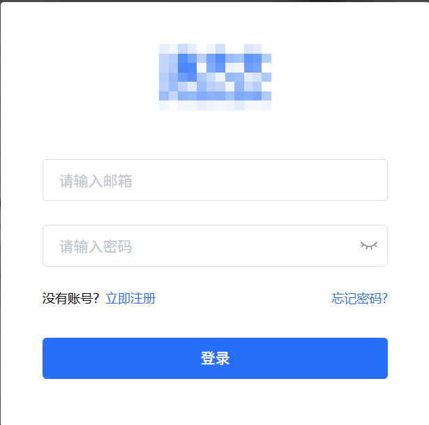
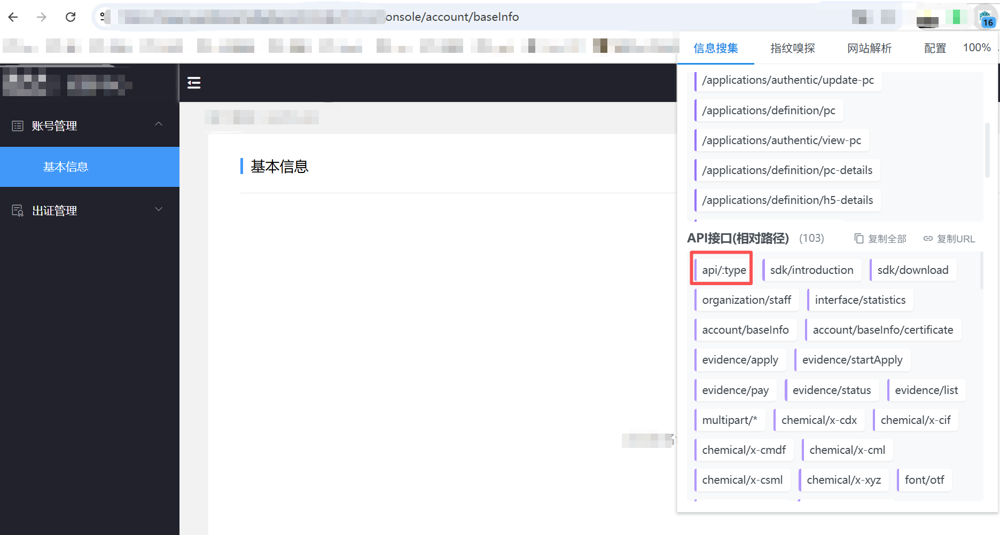
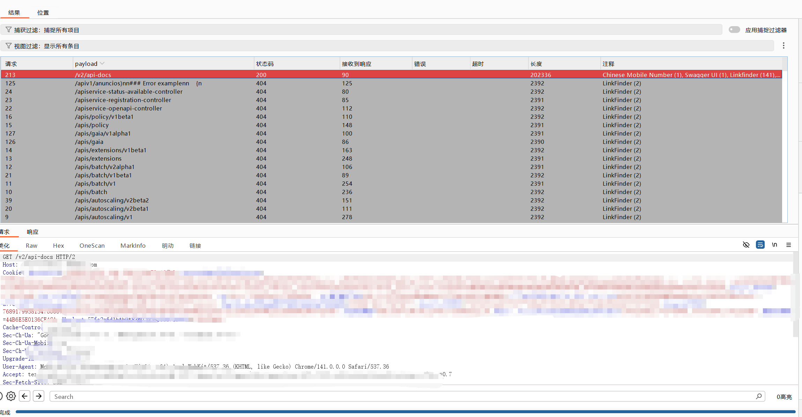
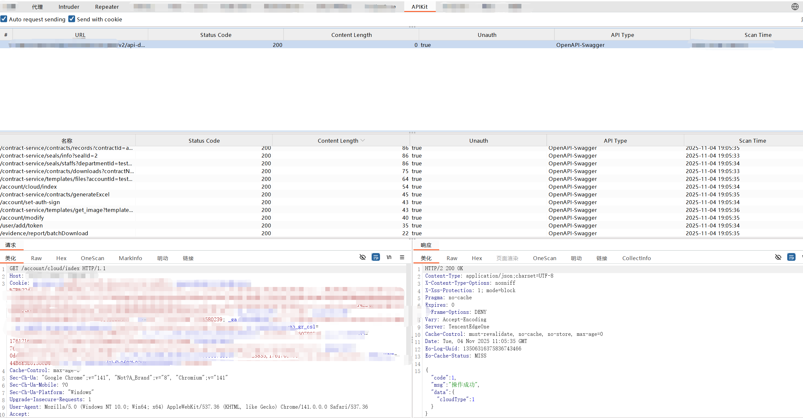
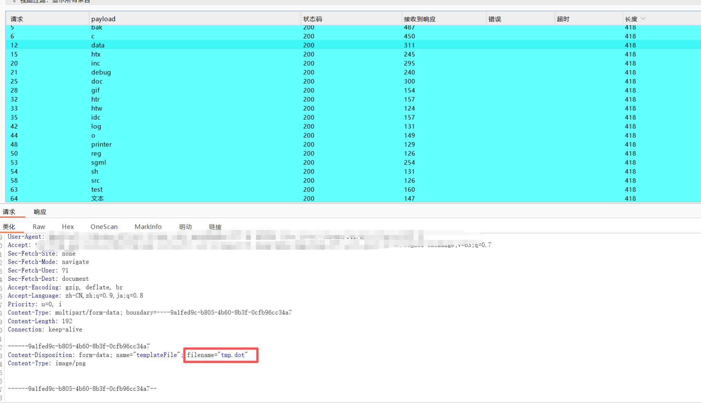
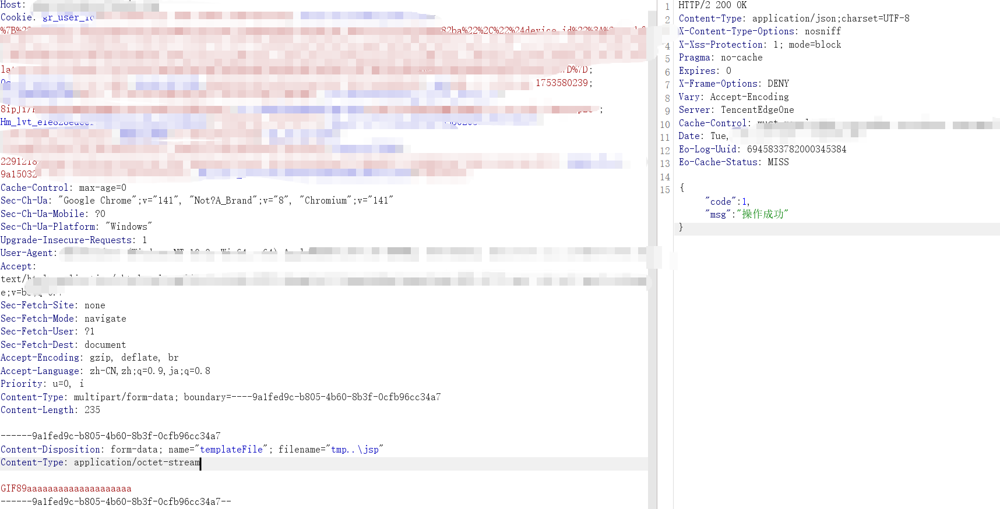
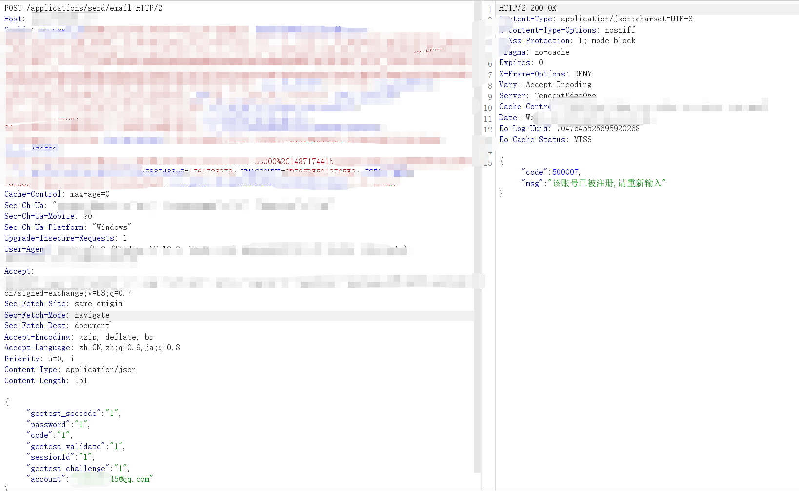
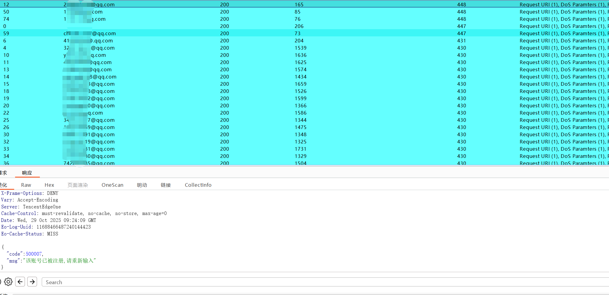
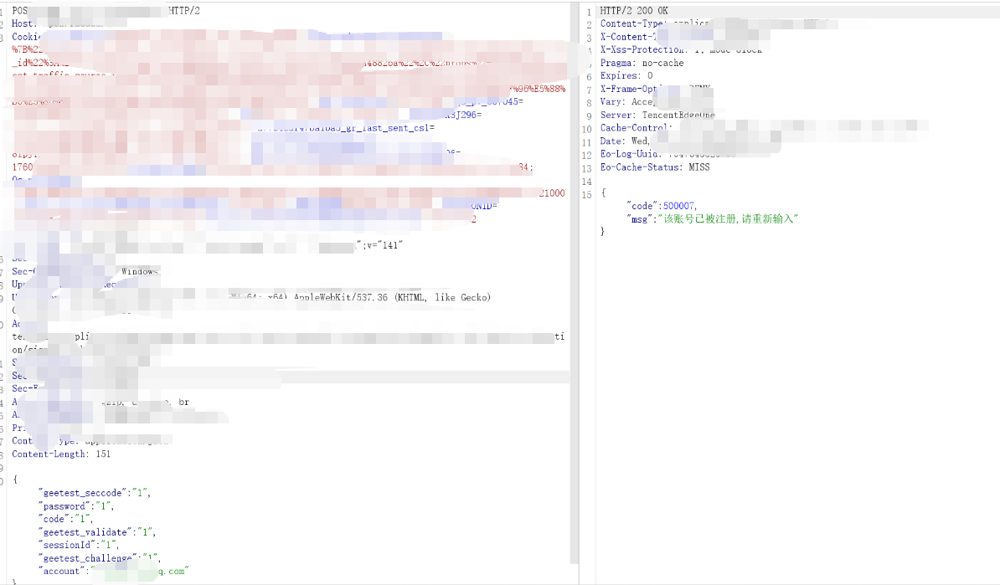

# 某企业src中危实战案例-先知社区

> **来源**: https://xz.aliyun.com/news/19249  
> **文章ID**: 19249

---

本文章中所有内容仅供学习交流，严禁用于商业用途和非法用途，否则由此产生的一切后果均与文章作者无关。

## 前言

在测试网站的过程中，存在很多的未授权接口，相信各位都知道findsomething这个插件，我再推荐一个雪瞳<https://github.com/SickleSec/snoweyes> 个人感觉也是非常不错的插件，话不多说直接上案例。

## 案例

在前台正常测试SQL、XSS、SSRF、业务逻辑等漏洞没有结果后，注册一个普通账号登录继续测试。



进入以后查看一下里面存在哪些接口发现了一个很显眼的 /api 并且在进入之前我已经了解到该网站为java开发的，推测其可能集成了 Swagger 接口文档框架 。



对该网站进行抓包fuzz一下接口以下是常见的接口

```
/swagger//api/swagger//swagger/ui//api/swagger/ui//swagger-ui.html//api/swagger-ui.html//user/swagger-ui.html//swagger/ui//api/swagger/ui//libs/swaggerui//api/swaggerui//swagger-resources/configuration/ui//swagger-resources/configuration/security//v3/api/ /v2/api/ /v1/api/
/v1/api-docs/ /v2/api-docs/ /v3/api-docs/
```

果然出货了 /v2/api-docs/ ，泄露接口接口文档，这里就已经可以直接提交了但是这种泄露应该是低位，一般网站存在未授权，肯定会有其他的地方可以利用。



这里可以给大家推荐一个burp的插件 APIKit，如果遇到这种接口数量比较大的时候，他会自动识别参数，进行拼接，看见有可深度利用的接口时可以提取出来，但是这个插件有一个地方大家需要注意一下，他拼接的接口是在根目录，使用的时候需要注意一下当时的环境。链接：[https://github.com/API-Security/APIKit](https://github.com/API-Security/APIKit。下面进行演示。)

实现过程，如果需要测试未授权或者是要带上cookie就在左上角进行选择，这个插件会自动编辑请求包，就不用自己来构造请求包非常的方便。



然后我又挨着把所有接口看了一遍里面的接口，有一大部分为未授权，可以好好利用一下。其中存在一个 applications/templates/forms 接口为上传接口能正常使用。上传jsp存在拦截，我就对他的后缀名进行fuzz一下，看看有没有漏网之鱼。



但是这些后缀危害不够大，我就尝试上传一下jsp，绕一下waf，但是上传，上去的文件不能返回路径，就没招了太菜了，换个接口测。



发现了一个发送验证码的接口存在两个逻辑问题，applications/send/email接口，为前端向后端请求发送邮箱验证码的调用接口，其中邮箱参数点，根据他的返回可以判断存在用户枚举，





​

第二，接口为发送邮箱接口，填写未注册的用户会对未使用的用户进行发送信息，可进行邮箱轰炸。



最后提交一共给了500，直接下机。


