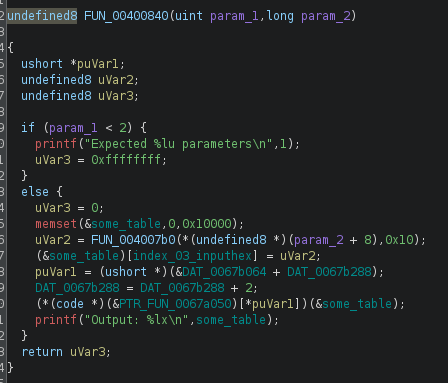
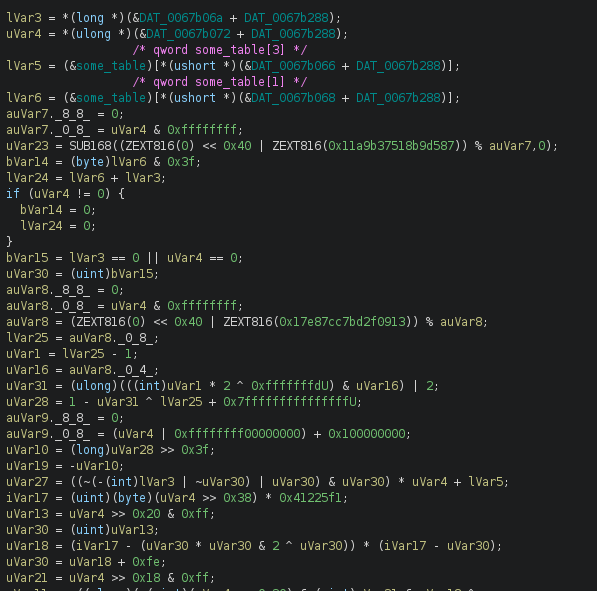
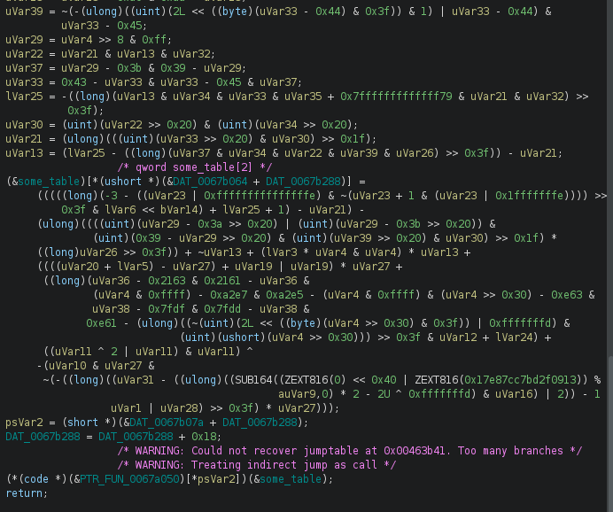
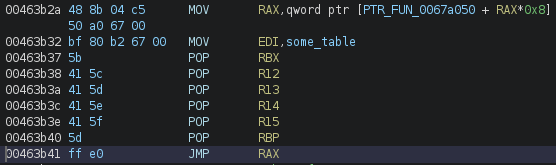
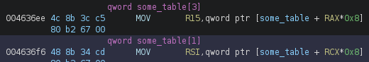
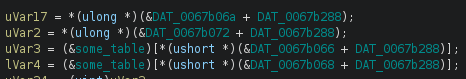

# 基于Triton与AI的OLLVM混淆算法逆向分析(hacklu-2021-ollvm分析)-先知社区

> **来源**: https://xz.aliyun.com/news/19255  
> **文章ID**: 19255

---

学习Triton是一个令人头疼的事情，没有文档，只有示例代码。自己还对符号执行、SMT Solving 还缺乏基本概念。0基础起步条件下，通过分析还原这个ollvm的算法，算是对符号执行和SMT求解有了一点小小的认识。

hacklu-2021-ollvm 是Triton开源example里面的一个例子（我也没找到原题），示例里面没有分析，只有一个代码和简单的注释。猜测原题应该是给出8个64位的散列值，要求逆向推导出原始的输入，就是flag。这个例子可以从[这里](https://github.com/JonathanSalwan/Triton/blob/master/src/examples/python/ctf-writeups/hacklu-2021-ollvm/ollvm)找到。

国外大佬有一篇[分析文章](https://farena.in/symbolic%20execution/triton/hacklu-ollvm-triton/)，重点介绍了使用Triton的更高级的用法 AST to LLVM IR，并调用外部Z3求解器进行求解的方法。不过对数据结构的分析比较简单随意，并不是很准确。当然这也不是这篇文章的重点。

本文主要是借助Triton AST的能力，结合AI的数学分析能力，尝试还原出ollvm的原始算法。

## 一、ollvm程序结构分析



主函数简洁明了，`FUN_004007b0`就是调用`strtoul`函数，将用户输入的文本转成对应的8字节的16进制数值并返回。

关键就在`(*(code *)(&PTR_FUN_0067a050)[*puVar1])(&some_table);`这条语句。`PTR_FUN_0067a050`似乎是一个函数指针表。`DAT_0067b288`看上去像是检索函数表的索引。`some_table`是我起的名字，对应的地址是`DAT_0067b280`，从程序结构上看是一个QWORD数组的大表，并且已开始整块区域就被清零。注意这个`DAT_0067b280`（`some_table`)其实包含了`DAT_0067b288`（`some_table[1]`)。

我们可以手动计算索引，获取第一个调用的函数`*PTR_FUN_0067a050[0x1C9] = FUN_004636b0`。这个函数长下面这样：





处理过程实在是太复杂，只截取了一头一尾。对于理解ollvm控制流逻辑和处理逻辑，这一头一尾提供了“输入--输出--JMP NEXT”三段逻辑的说有关键信息。

### 1、输入和输出

观察可以发现无论输入还是输出，都是基于某个基地址+DAT\_0067b288这个索引，得到`some_table`的偏移量。`DAT_0067b288`本身也是`some_table[1]`，这意味着说有的输入、输出、索引这些变化的量都是在`some_table`这个大表里面完成的。

### 2、JMP NEXT

代码块的最后看起来是 CALL 调用，实际的汇编代码如下：



可见代码块之间的串连是使用`JMP RAX`进行串连。除了`main`函数里的第一个调用以外。

手工验证几个串连的代码块，可以发现都遵循“输入--输出--JMP NEXT”三段逻辑。可以写一个提取脚本，将代码块的调用流程和`some_table`相关的输入、输出都关联展示出来。

```
memory = currentProgram.getMemory()

base_addr1 = toAddr(0x67b07a)
index1 = 2
base_addr2 = toAddr(0x67a050)

base_input1 = toAddr(0x67b066)
base_input2 = toAddr(0x67b068)
base_output = toAddr(0x67b064)

for i in range(22):
    print("  input:")
    print("    qword some_table[%d]" % memory.getShort(base_input1.add(index1 + 0x18*i)))
    print("    qword some_table[%d]" % memory.getShort(base_input2.add(index1 + 0x18*i)))
    print("  output:")
    print("    qword some_table[%d]" % memory.getShort(base_output.add(index1 + 0x18*i)))

    index2 = memory.getShort(base_addr1.add(index1 + 0x18*i))
    func = memory.getInt(base_addr2.add(index2*8))
    print(hex(func & 0xffffffff))
```

下面是补上了第一个调用函数的完整代码块调用链，以及关联的输入和输出。

```
qword some_talbe[3] = strtoul(user_input)

0x4636b0L
  input:
    qword some_table[3]
    qword some_table[1]
  output:
    qword some_table[2]
0x46b1f0L
  input:
    qword some_table[1]
    qword some_table[1]
  output:
    qword some_table[4]
0x40fa60L
  input:
    qword some_table[2]
    qword some_table[4]
  output:
    qword some_table[5]
0x46b1f0L
  input:
    qword some_table[1]
    qword some_table[1]
  output:
    qword some_table[6]
0x42c730L
  input:
    qword some_table[5]
    qword some_table[6]
  output:
    qword some_table[7]
0x425760L
  input:
    qword some_table[5]
    qword some_table[6]
  output:
    qword some_table[8]
0x43cdf0L
  input:
    qword some_table[5]
    qword some_table[6]
  output:
    qword some_table[9]
0x46b1f0L
  input:
    qword some_table[1]
    qword some_table[1]
  output:
    qword some_table[10]
0x439c40L
  input:
    qword some_table[7]
    qword some_table[8]
  output:
    qword some_table[11]
0x43f240L
  input:
    qword some_table[9]
    qword some_table[10]
  output:
    qword some_table[12]
0x46b1f0L
  input:
    qword some_table[1]
    qword some_table[1]
  output:
    qword some_table[13]
0x461da0L
  input:
    qword some_table[11]
    qword some_table[13]
  output:
    qword some_table[14]
0x4195f0L
  input:
    qword some_table[12]
    qword some_table[14]
  output:
    qword some_table[15]
0x46b1f0L
  input:
    qword some_table[1]
    qword some_table[1]
  output:
    qword some_table[16]
0x447ac0L
  input:
    qword some_table[15]
    qword some_table[16]
  output:
    qword some_table[17]
0x463ed0L
  input:
    qword some_table[17]
    qword some_table[1]
  output:
    qword some_table[18]
0x42a9f0L
  input:
    qword some_table[18]
    qword some_table[1]
  output:
    qword some_table[19]
0x46b1f0L
  input:
    qword some_table[1]
    qword some_table[1]
  output:
    qword some_table[20]
0x435e50L
  input:
    qword some_table[17]
    qword some_table[20]
  output:
    qword some_table[21]
0x41ec00L
  input:
    qword some_table[19]
    qword some_table[21]
  output:
    qword some_table[22]
0x46b1f0L
  input:
    qword some_table[1]
    qword some_table[1]
  output:
    qword some_table[23]
0x41f270L
  input:
    qword some_table[22]
    qword some_table[23]
  output:
    qword some_table[0]
```

实际上这应该就是一个hash函数，只是被ollvm给混淆成分段的了。

0x46b1f0L 这个代码块被执行了多次，且输入只与`some_table[1]`这个索引变量有关。换句话说就是`0x46b1f0L`代码块在各个层级的输出是相对固定的。只需要用任意值调试一下，就可以得到各个 `0x46b1f0L`代码块的执行结果。所以可以忽略`0x46b1f0L`代码块的算法还原（当然最终还是把这个代码块还原了，最有意思的就是这个）

### 3、`some_talbe`内存值

由于我们主要目的在于还原算法，所以直接拿flag的首8个字节`0x6d6972726f725f6d`（‘m\_rorrim‘）进行调试，得到`some_table`如下内存结果：

```
00000000:0067b280|c4 8f 8f e1 f2 d4 5c 87 12 02 00 00 00 00 00 00|......\.........|
00000000:0067b290|32 d1 f9 cb 60 87 44 bb 6d 5f 72 6f 72 72 69 6d|2...`.D.m_rorrim|
00000000:0067b2a0|72 0d 41 ac 45 95 1c b3 75 14 4b 75 f7 27 1f 94|r.A.E...u.Ku.'..|
00000000:0067b2b0|f7 a9 46 37 c5 20 9a ce 00 00 00 00 82 bd 0d 42|..F7. .........B|
00000000:0067b2c0|32 07 85 5a 00 00 00 00 32 07 85 5a 82 bd 0d 42|2..Z....2..Z...B|
00000000:0067b2d0|f5 4e ce da 40 bd 48 a6 da 1e bd 87 01 eb 7f 30|.N..@.H........0|
00000000:0067b2e0|91 21 76 c4 a8 f0 31 49 08 00 00 00 00 00 00 00|.!v...1I........|
00000000:0067b2f0|21 76 c4 a8 f0 31 49 00 21 76 c4 a8 f0 31 49 91|!v...1I.!v...1I.|
00000000:0067b300|fc b4 43 d1 44 ca d5 29 c6 e1 a0 c6 b1 a4 fa cc|..C.D..)........|
00000000:0067b310|e1 a0 c6 b1 a4 fa cc 00 e1 00 c6 00 a4 00 cc 00|................|
00000000:0067b320|08 00 00 00 00 00 00 00 00 c6 00 a0 00 b1 00 fa|................|
00000000:0067b330|e1 c6 c6 a0 a4 b1 cc fa 2d 77 9d 56 88 a7 b8 b9|........-w.V....|		
```

有了对代码块结构的了解以及相对应的输入/输出数据，就可以着手尝试进行算法还原。

## 二、算法AST的获取及化简（还原）

### 1、代码块`0x4636b0L`

> 以第一个代码块的算法还原为示例，介绍采用的主要方法和代码。后面基本采用同样的框架，不再列出类似的代码，只重点介绍不同的部分。
>
> 每一个代码块的还原算法，请密切结合前面的代码块跳转链表，参考其输入输出进行分析。
>
> 输入里面是由代码块`0x46b1f0L`生成的值，一般可以直接替换成相应的固定值。

#### （1）使用Triton获取代码块的算法AST。

基于混淆后代码块的复杂程度，人工去理解哪怕是被反编译成伪C代码的处理逻辑，也是异常复杂令人崩溃的。但既然是数据处理逻辑，提取其数学逻辑，把它转成数学的衡等式化简问题，相对就不那么崩溃，似乎能见到一丝还原的曙光。

输入点：



输出点：


对输入点寄存器 R15、RSI 进行符号化，模拟执行后，获取 RBP 的 RegiterAst。代码如下：

```
from triton import *

import string
import time
import lief
import sys

# Target binary
TARGET = "/home/snake/cangku/tools/Triton/src/examples/python/ctf-writeups/hacklu-2021-ollvm/ollvm"
DEBUG  = True

# Memory mapping
BASE_PLT = 0x10000000
BASE_ARGV = 0x20000000
BASE_STACK = 0x9ffffff0
ERRNO = 0xa0000000

# The debug function
def debug(s):
    if DEBUG: print(s)

def loadBinary(triton_ctx, lief_binary):
    phdrs = lief_binary.segments
    for phdr in phdrs:
        size = phdr.physical_size
        vaddr = phdr.virtual_address
        print("[+] Loading 0x%06x - 0x%06x" % (vaddr, vaddr+size))
        triton_ctx.setConcreteMemoryAreaValue(vaddr, list(phdr.content))
    return

def pre_execution(pc, ctx):
    if pc == 0x4636b0:
        ctx.setConcreteMemoryValue(MemoryAccess(0X67b288, CPUSIZE.QWORD), 2)

def post_execution(previous_pc, instruction, ctx):
    if previous_pc == 0x4636ee:
        ctx.symbolizeRegister(ctx.registers.r15)
        
    if previous_pc == 0x463b0a:
        rbp = ctx.getRegisterAst(ctx.registers.rbp)
        print(ctx.simplify(rbp, True))
        m = ctx.getModel(rbp == 0xbb448760cbf9d132)
        print(m)
        for k, v in m.items():
            print(hex(v.getValue()))

        sys.exit(0)
        
def emulate(ctx, pc):
    # emulation loop
    while pc:

        # print("[-] Running instruction at address: 0x%08X" % (pc))

        opcodes = ctx.getConcreteMemoryAreaValue(pc, 16)
        instruction = Instruction(pc, opcodes)

        # if we want to bypass code, do it
        # in this function
        pre_execution(pc, ctx)

        # process the instruction
        ret = ctx.processing(instruction)
        # if HALT, finish the execution
        if instruction.getType() == OPCODE.X86.HLT:
            break

        # all the code after processing, goes here
        # print(f"R15 {ctx.isRegisterSymbolized(ctx.registers.r15)}")
        post_execution(pc, instruction, ctx)

        # apply one of the handlers that are not provided by
        # Triton
        # hookingHandler(ctx)

        # Next
        pc = ctx.getConcreteRegisterValue(ctx.registers.rip)
     
def run(ctx, binary):
    # Define a fake stack
    ctx.setConcreteRegisterValue(ctx.registers.rbp, BASE_STACK)
    ctx.setConcreteRegisterValue(ctx.registers.rsp, BASE_STACK)

    # Let's emulate the binary from the entry point
    debug('[+] Starting emulation.')
    emulate(ctx, 0x4636b0)
    debug('[+] Emulation done.')

        
def main():
    # Get a Triton context
    ctx = TritonContext(ARCH.X86_64)

    # Set optimization
    ctx.setMode(MODE.ALIGNED_MEMORY, True)
    # ctx.setMode(MODE.CONSTANT_FOLDING, True)

    # Parse the binary
    binary = lief.parse(TARGET)

    # Load the binary
    loadBinary(ctx, binary)
    
    run(ctx, binary)
    
if __name__ == '__main__':
    main()
```

代码使用了Triton python examples 里面的ELF全模拟执行框架。因为只需要模拟纯算法的代码块，所以只需要保留相关ELF加载、模拟执行的部分。

代码的关键点是入口对寄存器进行符号化，在出口获取寄存器的AST。

表面上看似乎有两个入口参数，但由于 RSI == some\_table[1] == 2，这个第一轮就是个定值，所以可以在模拟运行前直接在`pre_execution`函数内进行内存赋值。这样就只需要符号化 R15 一个寄存器。

> 如果对已经符号化的寄存器/内存地址进行赋值，该寄存器/内存地址就会失去符号化。需要使用一些方式才能继续跟踪，高级用法我也没搞明白，通过这个例子对于符号执行，说到底也只是学了个皮毛。
>
> ctx.simplify(...) 方法会返回内部精简过的 SMT-LIB2 表达式。不是用这个方法，直接打印对应的`RegisterAst`只会得到一个简单的符号，需要特殊的`unroll`处理，除非算法非常简单。

执行上面的代码会得到如下精简过的输出：

```
(bvnot (bvor (bvnot (bvor (concat ((_ extract 63 2) (bvadd (_ bv5610100774807237061 64) SymVar_0)) (bvnot ((_ extract 1 1) (bvadd (_ bv5610100774807237061 64) SymVar_0))) (bvadd (_ bv1 1) ((_ extract 0 0) SymVar_0))) (bvadd (_ bv5610100774807237061 64) SymVar_0))) (bvnot (bvadd (_ bv5610100774807237061 64) SymVar_0))))
```

原始输出如下：

```
(bvadd (bvadd (bvadd (bvsub (bvsub (bvadd (bvadd (bvand (bvashr (bvsub (_ bv18446744073709551613 64) (bvand (bvor ((_ extract 63 0) (bvurem (concat ((_ zero_extend 32) (bvxor ((_ extract 31 0) (concat (_ bv0 8) (_ bv0 8) (_ bv0 8) (_ bv0 8) (_ bv0 8) (_ bv0 8) (_ bv0 8) (_ bv2 8))) ((_ extract 31 0) (concat (_ bv0 8) (_ bv0 8) (_ bv0 8) (_ bv0 8) (_ bv0 8) (_ bv0 8) (_ bv0 8) (_ bv2 8))))) (_ bv1272745685216253319 64)) ((_ zero_extend 64) ((_ zero_extend 32) ((_ extract 31 0) (concat (_ bv86 8) (_ bv66 8) (_ bv111 8) (_ bv53 8) (_ bv63 8) (_ bv244 8) (_ bv3 8) (_ bv194 8))))))) (_ bv18446744073709551614 64)) (bvnot (bvand (bvadd (_ bv1 64) (bvadd ((_ extract 63 0) (bvurem (concat ((_ zero_extend 32) (bvxor ((_ extract 31 0) (concat (_ bv0 8) (_ bv0 8) (_ bv0 8) (_ bv0 8) (_ bv0 8) (_ bv0 8) (_ bv0 8) (_ bv2 8))) ((_ extract 31 0) (concat (_ bv0 8) (_ bv0 8) (_ bv0 8) (_ bv0 8) (_ bv0 8) (_ bv0 8) (_ bv0 8) (_ bv2 8))))) (_ bv1272745685216253319 64)) ((_ zero_extend 64) ((_ zero_extend 32) ((_ extract 31 0) (concat (_ bv86 8) (_ bv66 8) (_ bv111 8) (_ bv53 8) (_ bv63 8) (_ bv244 8) (_ bv3 8) (_ bv194 8))))))) (bvmul (_ bv0 64) (_ bv1 64)))) (bvor (_ bv8589934590 64) ((_ extract 63 0) (bvurem (concat ((_ zero_extend 32) (bvxor ((_ extract 31 0) (concat (_ bv0 8) (_ bv0 8) (_ bv0 8) (_ bv0 8) (_ bv0 8) (_ bv0 8) (_ bv0 8) (_ bv2 8))) ((_ extract 31 0) (concat (_ bv0 8) (_ bv0 8) (_ bv0 8) (_ bv0 8) (_ bv0 8) (_ bv0 8) (_ bv0 8) (_ bv2 8))))) (_ bv1272745685216253319 64)) ((_ zero_extend 64) ((_ zero_extend 32) ((_ extract 31 0) (concat (_ bv86 8) (_ bv66 8) (_ bv111 8) (_ bv53 8) (_ bv63 8) (_ bv244 8) (_ bv3 8) (_ bv194 8)))))))))))) (bvand ((_ zero_extend 56) (_ bv63 8)) (_ bv63 64))) (bvshl (concat (_ bv0 8) (_ bv0 8) (_ bv0 8) (_ bv0 8) (_ bv0 8) (_ bv0 8) (_ bv0 8) (_ bv2 8)) (bvand ((_ zero_extend 56) ((_ extract 7 0) ((_ zero_extend 32) (_ bv0 32)))) (_ bv63 64)))) (bvlshr (bvand (bvand (bvand (bvand (bvadd ((_ zero_extend 32) ((_ zero_extend 24) ((_ extract 7 0) (bvlshr (concat (_ bv86 8) (_ bv66 8) (_ bv111 8) (_ bv53 8) (_ bv63 8) (_ bv244 8) (_ bv3 8) (_ bv194 8)) (bvand ((_ zero_extend 56) (_ bv48 8)) (_ bv63 64)))))) (_ bv18446744073709551444 64)) (bvsub ((_ zero_extend 32) (_ bv170 32)) ((_ zero_extend 32) ((_ zero_extend 24) ((_ extract 7 0) (bvlshr (concat (_ bv86 8) (_ bv66 8) (_ bv111 8) (_ bv53 8) (_ bv63 8) (_ bv244 8) (_ bv3 8) (_ bv194 8)) (bvand ((_ zero_extend 56) (_ bv48 8)) (_ bv63 64)))))))) (bvand (bvsub ((_ zero_extend 32) (_ bv134 32)) ((_ zero_extend 32) ((_ zero_extend 24) ((_ extract 7 0) (bvlshr (concat (_ bv86 8) (_ bv66 8) (_ bv111 8) (_ bv53 8) (_ bv63 8) (_ bv244 8) (_ bv3 8) (_ bv194 8)) (bvand ((_ zero_extend 56) (_ bv16 8)) (_ bv63 64))))))) (bvadd (_ bv18446744073709551480 64) (bvadd ((_ zero_extend 32) ((_ zero_extend 24) ((_ extract 7 0) (bvlshr (concat (_ bv86 8) (_ bv66 8) (_ bv111 8) (_ bv53 8) (_ bv63 8) (_ bv244 8) (_ bv3 8) (_ bv194 8)) (bvand ((_ zero_extend 56) (_ bv16 8)) (_ bv63 64)))))) (bvmul (_ bv0 64) (_ bv1 64)))))) (bvand (bvand (bvsub ((_ zero_extend 32) (_ bv67 32)) ((_ zero_extend 32) ((_ zero_extend 24) ((_ extract 7 0) (concat (_ bv86 8) (_ bv66 8) (_ bv111 8) (_ bv53 8) (_ bv63 8) (_ bv244 8) (_ bv3 8) (_ bv194 8)))))) (bvadd (_ bv18446744073709551547 64) (bvadd ((_ zero_extend 32) ((_ zero_extend 24) ((_ extract 7 0) (concat (_ bv86 8) (_ bv66 8) (_ bv111 8) (_ bv53 8) (_ bv63 8) (_ bv244 8) (_ bv3 8) (_ bv194 8))))) (bvmul (_ bv0 64) (_ bv1 64))))) (bvand (bvadd (_ bv18446744073709551557 64) (bvadd ((_ zero_extend 32) ((_ zero_extend 24) ((_ extract 15 8) (concat (_ bv86 8) (_ bv66 8) (_ bv111 8) (_ bv53 8) (_ bv63 8) (_ bv244 8) (_ bv3 8) (_ bv194 8))))) (bvmul (_ bv0 64) (_ bv1 64)))) (bvsub ((_ zero_extend 32) (_ bv57 32)) ((_ zero_extend 32) ((_ zero_extend 24) ((_ extract 15 8) (concat (_ bv86 8) (_ bv66 8) (_ bv111 8) (_ bv53 8) (_ bv63 8) (_ bv244 8) (_ bv3 8) (_ bv194 8))))))))) (bvand (bvand (bvadd ((_ zero_extend 32) ((_ zero_extend 24) ((_ extract 7 0) (bvlshr (concat (_ bv86 8) (_ bv66 8) (_ bv111 8) (_ bv53 8) (_ bv63 8) (_ bv244 8) (_ bv3 8) (_ bv194 8)) (bvand ((_ zero_extend 56) (_ bv16 8)) (_ bv63 64)))))) (_ bv9223372036854775673 64)) (bvand (bvadd ((_ zero_extend 32) ((_ zero_extend 24) ((_ extract 7 0) (bvlshr (concat (_ bv86 8) (_ bv66 8) (_ bv111 8) (_ bv53 8) (_ bv63 8) (_ bv244 8) (_ bv3 8) (_ bv194 8)) (bvand ((_ zero_extend 56) (_ bv40 8)) (_ bv63 64)))))) (_ bv18446744073709551596 64)) (bvsub ((_ zero_extend 32) (_ bv18 32)) ((_ zero_extend 32) ((_ zero_extend 24) ((_ extract 7 0) (bvlshr (concat (_ bv86 8) (_ bv66 8) (_ bv111 8) (_ bv53 8) (_ bv63 8) (_ bv244 8) (_ bv3 8) (_ bv194 8)) (bvand ((_ zero_extend 56) (_ bv40 8)) (_ bv63 64))))))))) (bvand (bvand (bvadd ((_ zero_extend 32) ((_ zero_extend 24) ((_ extract 7 0) (bvlshr (concat (_ bv86 8) (_ bv66 8) (_ bv111 8) (_ bv53 8) (_ bv63 8) (_ bv244 8) (_ bv3 8) (_ bv194 8)) (bvand ((_ zero_extend 56) (_ bv32 8)) (_ bv63 64)))))) (_ bv18446744073709551524 64)) (bvsub ((_ zero_extend 32) (_ bv90 32)) ((_ zero_extend 32) ((_ zero_extend 24) ((_ extract 7 0) (bvlshr (concat (_ bv86 8) (_ bv66 8) (_ bv111 8) (_ bv53 8) (_ bv63 8) (_ bv244 8) (_ bv3 8) (_ bv194 8)) (bvand ((_ zero_extend 56) (_ bv32 8)) (_ bv63 64)))))))) (bvand (bvadd ((_ zero_extend 32) (bvlshr ((_ extract 31 0) ((_ zero_extend 32) ((_ extract 31 0) (concat (_ bv86 8) (_ bv66 8) (_ bv111 8) (_ bv53 8) (_ bv63 8) (_ bv244 8) (_ bv3 8) (_ bv194 8))))) (bvand ((_ zero_extend 24) (_ bv24 8)) (_ bv31 32)))) (_ bv18446744073709551485 64)) (bvsub ((_ zero_extend 32) (_ bv129 32)) ((_ zero_extend 32) (bvlshr ((_ extract 31 0) ((_ zero_extend 32) ((_ extract 31 0) (concat (_ bv86 8) (_ bv66 8) (_ bv111 8) (_ bv53 8) (_ bv63 8) (_ bv244 8) (_ bv3 8) (_ bv194 8))))) (bvand ((_ zero_extend 24) (_ bv24 8)) (_ bv31 32))))))))) (bvand ((_ zero_extend 56) (_ bv63 8)) (_ bv63 64)))) (_ bv1 64)) ((_ zero_extend 32) (bvand ((_ extract 31 0) (bvlshr (bvand (bvand (bvsub ((_ zero_extend 32) (_ bv67 32)) ((_ zero_extend 32) ((_ zero_extend 24) ((_ extract 7 0) (concat (_ bv86 8) (_ bv66 8) (_ bv111 8) (_ bv53 8) (_ bv63 8) (_ bv244 8) (_ bv3 8) (_ bv194 8)))))) (bvadd (_ bv18446744073709551547 64) (bvadd ((_ zero_extend 32) ((_ zero_extend 24) ((_ extract 7 0) (concat (_ bv86 8) (_ bv66 8) (_ bv111 8) (_ bv53 8) (_ bv63 8) (_ bv244 8) (_ bv3 8) (_ bv194 8))))) (bvmul (_ bv0 64) (_ bv1 64))))) (bvand (bvadd (_ bv18446744073709551557 64) (bvadd ((_ zero_extend 32) ((_ zero_extend 24) ((_ extract 15 8) (concat (_ bv86 8) (_ bv66 8) (_ bv111 8) (_ bv53 8) (_ bv63 8) (_ bv244 8) (_ bv3 8) (_ bv194 8))))) (bvmul (_ bv0 64) (_ bv1 64)))) (bvsub ((_ zero_extend 32) (_ bv57 32)) ((_ zero_extend 32) ((_ zero_extend 24) ((_ extract 15 8) (concat (_ bv86 8) (_ bv66 8) (_ bv111 8) (_ bv53 8) (_ bv63 8) (_ bv244 8) (_ bv3 8) (_ bv194 8)))))))) (bvand ((_ zero_extend 56) (_ bv63 8)) (_ bv63 64)))) ((_ extract 31 0) (bvlshr (bvand (bvand (bvand (bvand (bvadd ((_ zero_extend 32) ((_ zero_extend 24) ((_ extract 7 0) (bvlshr (concat (_ bv86 8) (_ bv66 8) (_ bv111 8) (_ bv53 8) (_ bv63 8) (_ bv244 8) (_ bv3 8) (_ bv194 8)) (bvand ((_ zero_extend 56) (_ bv40 8)) (_ bv63 64)))))) (_ bv18446744073709551596 64)) (bvsub ((_ zero_extend 32) (_ bv18 32)) ((_ zero_extend 32) ((_ zero_extend 24) ((_ extract 7 0) (bvlshr (concat (_ bv86 8) (_ bv66 8) (_ bv111 8) (_ bv53 8) (_ bv63 8) (_ bv244 8) (_ bv3 8) (_ bv194 8)) (bvand ((_ zero_extend 56) (_ bv40 8)) (_ bv63 64)))))))) (bvand (bvadd ((_ zero_extend 32) ((_ zero_extend 24) ((_ extract 7 0) (bvlshr (concat (_ bv86 8) (_ bv66 8) (_ bv111 8) (_ bv53 8) (_ bv63 8) (_ bv244 8) (_ bv3 8) (_ bv194 8)) (bvand ((_ zero_extend 56) (_ bv48 8)) (_ bv63 64)))))) (_ bv18446744073709551444 64)) (bvsub ((_ zero_extend 32) (_ bv170 32)) ((_ zero_extend 32) ((_ zero_extend 24) ((_ extract 7 0) (bvlshr (concat (_ bv86 8) (_ bv66 8) (_ bv111 8) (_ bv53 8) (_ bv63 8) (_ bv244 8) (_ bv3 8) (_ bv194 8)) (bvand ((_ zero_extend 56) (_ bv48 8)) (_ bv63 64))))))))) (bvand (bvand (bvadd ((_ zero_extend 32) ((_ zero_extend 24) ((_ extract 7 0) (bvlshr (concat (_ bv86 8) (_ bv66 8) (_ bv111 8) (_ bv53 8) (_ bv63 8) (_ bv244 8) (_ bv3 8) (_ bv194 8)) (bvand ((_ zero_extend 56) (_ bv32 8)) (_ bv63 64)))))) (_ bv18446744073709551524 64)) (bvsub ((_ zero_extend 32) (_ bv90 32)) ((_ zero_extend 32) ((_ zero_extend 24) ((_ extract 7 0) (bvlshr (concat (_ bv86 8) (_ bv66 8) (_ bv111 8) (_ bv53 8) (_ bv63 8) (_ bv244 8) (_ bv3 8) (_ bv194 8)) (bvand ((_ zero_extend 56) (_ bv32 8)) (_ bv63 64)))))))) (bvand (bvadd ((_ zero_extend 32) (bvlshr ((_ extract 31 0) ((_ zero_extend 32) ((_ extract 31 0) (concat (_ bv86 8) (_ bv66 8) (_ bv111 8) (_ bv53 8) (_ bv63 8) (_ bv244 8) (_ bv3 8) (_ bv194 8))))) (bvand ((_ zero_extend 24) (_ bv24 8)) (_ bv31 32)))) (_ bv18446744073709551485 64)) (bvsub ((_ zero_extend 32) (_ bv129 32)) ((_ zero_extend 32) (bvlshr ((_ extract 31 0) ((_ zero_extend 32) ((_ extract 31 0) (concat (_ bv86 8) (_ bv66 8) (_ bv111 8) (_ bv53 8) (_ bv63 8) (_ bv244 8) (_ bv3 8) (_ bv194 8))))) (bvand ((_ zero_extend 24) (_ bv24 8)) (_ bv31 32)))))))) (bvand (bvsub ((_ zero_extend 32) (_ bv134 32)) ((_ zero_extend 32) ((_ zero_extend 24) ((_ extract 7 0) (bvlshr (concat (_ bv86 8) (_ bv66 8) (_ bv111 8) (_ bv53 8) (_ bv63 8) (_ bv244 8) (_ bv3 8) (_ bv194 8)) (bvand ((_ zero_extend 56) (_ bv16 8)) (_ bv63 64))))))) (bvadd (_ bv18446744073709551480 64) (bvadd ((_ zero_extend 32) ((_ zero_extend 24) ((_ extract 7 0) (bvlshr (concat (_ bv86 8) (_ bv66 8) (_ bv111 8) (_ bv53 8) (_ bv63 8) (_ bv244 8) (_ bv3 8) (_ bv194 8)) (bvand ((_ zero_extend 56) (_ bv16 8)) (_ bv63 64)))))) (bvmul (_ bv0 64) (_ bv1 64)))))) (bvand ((_ zero_extend 56) (_ bv63 8)) (_ bv63 64))))))) (bvmul ((_ zero_extend 32) (bvand ((_ extract 31 0) (bvlshr (bvand (bvand (bvor (bvadd (_ bv18446744073709551558 64) (bvadd ((_ zero_extend 32) ((_ zero_extend 24) ((_ extract 15 8) (concat (_ bv86 8) (_ bv66 8) (_ bv111 8) (_ bv53 8) (_ bv63 8) (_ bv244 8) (_ bv3 8) (_ bv194 8))))) (bvmul (_ bv0 64) (_ bv1 64)))) (bvadd (_ bv18446744073709551557 64) (bvadd ((_ zero_extend 32) ((_ zero_extend 24) ((_ extract 15 8) (concat (_ bv86 8) (_ bv66 8) (_ bv111 8) (_ bv53 8) (_ bv63 8) (_ bv244 8) (_ bv3 8) (_ bv194 8))))) (bvmul (_ bv0 64) (_ bv1 64))))) (bvsub ((_ zero_extend 32) (_ bv57 32)) ((_ zero_extend 32) ((_ zero_extend 24) ((_ extract 15 8) (concat (_ bv86 8) (_ bv66 8) (_ bv111 8) (_ bv53 8) (_ bv63 8) (_ bv244 8) (_ bv3 8) (_ bv194 8))))))) (bvand (bvnot (bvor (bvneg ((_ zero_extend 32) (bvand ((_ extract 31 0) (bvshl ((_ zero_extend 32) (_ bv2 32)) (bvand ((_ zero_extend 56) ((_ extract 7 0) (bvadd (_ bv18446744073709551548 64) (bvadd ((_ zero_extend 32) ((_ zero_extend 24) ((_ extract 7 0) (concat (_ bv86 8) (_ bv66 8) (_ bv111 8) (_ bv53 8) (_ bv63 8) (_ bv244 8) (_ bv3 8) (_ bv194 8))))) (bvmul (_ bv0 64) (_ bv1 64)))))) (_ bv63 64)))) (_ bv1 32)))) (bvadd (_ bv18446744073709551548 64) (bvadd ((_ zero_extend 32) ((_ zero_extend 24) ((_ extract 7 0) (concat (_ bv86 8) (_ bv66 8) (_ bv111 8) (_ bv53 8) (_ bv63 8) (_ bv244 8) (_ bv3 8) (_ bv194 8))))) (bvmul (_ bv0 64) (_ bv1 64)))))) (bvadd (_ bv18446744073709551547 64) (bvadd ((_ zero_extend 32) ((_ zero_extend 24) ((_ extract 7 0) (concat (_ bv86 8) (_ bv66 8) (_ bv111 8) (_ bv53 8) (_ bv63 8) (_ bv244 8) (_ bv3 8) (_ bv194 8))))) (bvmul (_ bv0 64) (_ bv1 64)))))) (bvand ((_ zero_extend 56) (_ bv63 8)) (_ bv63 64)))) ((_ extract 31 0) (bvlshr (bvand (bvand (bvand (bvand (bvadd ((_ zero_extend 32) ((_ zero_extend 24) ((_ extract 7 0) (bvlshr (concat (_ bv86 8) (_ bv66 8) (_ bv111 8) (_ bv53 8) (_ bv63 8) (_ bv244 8) (_ bv3 8) (_ bv194 8)) (bvand ((_ zero_extend 56) (_ bv40 8)) (_ bv63 64)))))) (_ bv18446744073709551596 64)) (bvsub ((_ zero_extend 32) (_ bv18 32)) ((_ zero_extend 32) ((_ zero_extend 24) ((_ extract 7 0) (bvlshr (concat (_ bv86 8) (_ bv66 8) (_ bv111 8) (_ bv53 8) (_ bv63 8) (_ bv244 8) (_ bv3 8) (_ bv194 8)) (bvand ((_ zero_extend 56) (_ bv40 8)) (_ bv63 64)))))))) (bvand (bvadd ((_ zero_extend 32) ((_ zero_extend 24) ((_ extract 7 0) (bvlshr (concat (_ bv86 8) (_ bv66 8) (_ bv111 8) (_ bv53 8) (_ bv63 8) (_ bv244 8) (_ bv3 8) (_ bv194 8)) (bvand ((_ zero_extend 56) (_ bv48 8)) (_ bv63 64)))))) (_ bv18446744073709551444 64)) (bvsub ((_ zero_extend 32) (_ bv170 32)) ((_ zero_extend 32) ((_ zero_extend 24) ((_ extract 7 0) (bvlshr (concat (_ bv86 8) (_ bv66 8) (_ bv111 8) (_ bv53 8) (_ bv63 8) (_ bv244 8) (_ bv3 8) (_ bv194 8)) (bvand ((_ zero_extend 56) (_ bv48 8)) (_ bv63 64))))))))) (bvand (bvand (bvadd ((_ zero_extend 32) ((_ zero_extend 24) ((_ extract 7 0) (bvlshr (concat (_ bv86 8) (_ bv66 8) (_ bv111 8) (_ bv53 8) (_ bv63 8) (_ bv244 8) (_ bv3 8) (_ bv194 8)) (bvand ((_ zero_extend 56) (_ bv32 8)) (_ bv63 64)))))) (_ bv18446744073709551524 64)) (bvsub ((_ zero_extend 32) (_ bv90 32)) ((_ zero_extend 32) ((_ zero_extend 24) ((_ extract 7 0) (bvlshr (concat (_ bv86 8) (_ bv66 8) (_ bv111 8) (_ bv53 8) (_ bv63 8) (_ bv244 8) (_ bv3 8) (_ bv194 8)) (bvand ((_ zero_extend 56) (_ bv32 8)) (_ bv63 64)))))))) (bvand (bvadd ((_ zero_extend 32) (bvlshr ((_ extract 31 0) ((_ zero_extend 32) ((_ extract 31 0) (concat (_ bv86 8) (_ bv66 8) (_ bv111 8) (_ bv53 8) (_ bv63 8) (_ bv244 8) (_ bv3 8) (_ bv194 8))))) (bvand ((_ zero_extend 24) (_ bv24 8)) (_ bv31 32)))) (_ bv18446744073709551485 64)) (bvsub ((_ zero_extend 32) (_ bv129 32)) ((_ zero_extend 32) (bvlshr ((_ extract 31 0) ((_ zero_extend 32) ((_ extract 31 0) (concat (_ bv86 8) (_ bv66 8) (_ bv111 8) (_ bv53 8) (_ bv63 8) (_ bv244 8) (_ bv3 8) (_ bv194 8))))) (bvand ((_ zero_extend 24) (_ bv24 8)) (_ bv31 32)))))))) (bvand (bvsub ((_ zero_extend 32) (_ bv134 32)) ((_ zero_extend 32) ((_ zero_extend 24) ((_ extract 7 0) (bvlshr (concat (_ bv86 8) (_ bv66 8) (_ bv111 8) (_ bv53 8) (_ bv63 8) (_ bv244 8) (_ bv3 8) (_ bv194 8)) (bvand ((_ zero_extend 56) (_ bv16 8)) (_ bv63 64))))))) (bvadd (_ bv18446744073709551480 64) (bvadd ((_ zero_extend 32) ((_ zero_extend 24) ((_ extract 7 0) (bvlshr (concat (_ bv86 8) (_ bv66 8) (_ bv111 8) (_ bv53 8) (_ bv63 8) (_ bv244 8) (_ bv3 8) (_ bv194 8)) (bvand ((_ zero_extend 56) (_ bv16 8)) (_ bv63 64)))))) (bvmul (_ bv0 64) (_ bv1 64)))))) (bvand ((_ zero_extend 56) (_ bv63 8)) (_ bv63 64)))))) (bvashr (bvand (bvadd (bvlshr (concat (_ bv86 8) (_ bv66 8) (_ bv111 8) (_ bv53 8) (_ bv63 8) (_ bv244 8) (_ bv3 8) (_ bv194 8)) (bvand ((_ zero_extend 56) (_ bv56 8)) (_ bv63 64))) (_ bv18446744073709551370 64)) (bvsub ((_ zero_extend 32) (_ bv244 32)) (bvlshr (concat (_ bv86 8) (_ bv66 8) (_ bv111 8) (_ bv53 8) (_ bv63 8) (_ bv244 8) (_ bv3 8) (_ bv194 8)) (bvand ((_ zero_extend 56) (_ bv56 8)) (_ bv63 64))))) (bvand ((_ zero_extend 56) (_ bv63 8)) (_ bv63 64))))) (bvnot (bvsub (bvsub (bvlshr (bvand (bvand (bvand (bvand (bvadd ((_ zero_extend 32) ((_ zero_extend 24) ((_ extract 7 0) (bvlshr (concat (_ bv86 8) (_ bv66 8) (_ bv111 8) (_ bv53 8) (_ bv63 8) (_ bv244 8) (_ bv3 8) (_ bv194 8)) (bvand ((_ zero_extend 56) (_ bv48 8)) (_ bv63 64)))))) (_ bv18446744073709551444 64)) (bvsub ((_ zero_extend 32) (_ bv170 32)) ((_ zero_extend 32) ((_ zero_extend 24) ((_ extract 7 0) (bvlshr (concat (_ bv86 8) (_ bv66 8) (_ bv111 8) (_ bv53 8) (_ bv63 8) (_ bv244 8) (_ bv3 8) (_ bv194 8)) (bvand ((_ zero_extend 56) (_ bv48 8)) (_ bv63 64)))))))) (bvand (bvsub ((_ zero_extend 32) (_ bv134 32)) ((_ zero_extend 32) ((_ zero_extend 24) ((_ extract 7 0) (bvlshr (concat (_ bv86 8) (_ bv66 8) (_ bv111 8) (_ bv53 8) (_ bv63 8) (_ bv244 8) (_ bv3 8) (_ bv194 8)) (bvand ((_ zero_extend 56) (_ bv16 8)) (_ bv63 64))))))) (bvadd (_ bv18446744073709551480 64) (bvadd ((_ zero_extend 32) ((_ zero_extend 24) ((_ extract 7 0) (bvlshr (concat (_ bv86 8) (_ bv66 8) (_ bv111 8) (_ bv53 8) (_ bv63 8) (_ bv244 8) (_ bv3 8) (_ bv194 8)) (bvand ((_ zero_extend 56) (_ bv16 8)) (_ bv63 64)))))) (bvmul (_ bv0 64) (_ bv1 64)))))) (bvand (bvand (bvsub ((_ zero_extend 32) (_ bv67 32)) ((_ zero_extend 32) ((_ zero_extend 24) ((_ extract 7 0) (concat (_ bv86 8) (_ bv66 8) (_ bv111 8) (_ bv53 8) (_ bv63 8) (_ bv244 8) (_ bv3 8) (_ bv194 8)))))) (bvadd (_ bv18446744073709551547 64) (bvadd ((_ zero_extend 32) ((_ zero_extend 24) ((_ extract 7 0) (concat (_ bv86 8) (_ bv66 8) (_ bv111 8) (_ bv53 8) (_ bv63 8) (_ bv244 8) (_ bv3 8) (_ bv194 8))))) (bvmul (_ bv0 64) (_ bv1 64))))) (bvand (bvadd (_ bv18446744073709551557 64) (bvadd ((_ zero_extend 32) ((_ zero_extend 24) ((_ extract 15 8) (concat (_ bv86 8) (_ bv66 8) (_ bv111 8) (_ bv53 8) (_ bv63 8) (_ bv244 8) (_ bv3 8) (_ bv194 8))))) (bvmul (_ bv0 64) (_ bv1 64)))) (bvsub ((_ zero_extend 32) (_ bv57 32)) ((_ zero_extend 32) ((_ zero_extend 24) ((_ extract 15 8) (concat (_ bv86 8) (_ bv66 8) (_ bv111 8) (_ bv53 8) (_ bv63 8) (_ bv244 8) (_ bv3 8) (_ bv194 8))))))))) (bvand (bvand (bvadd ((_ zero_extend 32) ((_ zero_extend 24) ((_ extract 7 0) (bvlshr (concat (_ bv86 8) (_ bv66 8) (_ bv111 8) (_ bv53 8) (_ bv63 8) (_ bv244 8) (_ bv3 8) (_ bv194 8)) (bvand ((_ zero_extend 56) (_ bv16 8)) (_ bv63 64)))))) (_ bv9223372036854775673 64)) (bvand (bvadd ((_ zero_extend 32) ((_ zero_extend 24) ((_ extract 7 0) (bvlshr (concat (_ bv86 8) (_ bv66 8) (_ bv111 8) (_ bv53 8) (_ bv63 8) (_ bv244 8) (_ bv3 8) (_ bv194 8)) (bvand ((_ zero_extend 56) (_ bv40 8)) (_ bv63 64)))))) (_ bv18446744073709551596 64)) (bvsub ((_ zero_extend 32) (_ bv18 32)) ((_ zero_extend 32) ((_ zero_extend 24) ((_ extract 7 0) (bvlshr (concat (_ bv86 8) (_ bv66 8) (_ bv111 8) (_ bv53 8) (_ bv63 8) (_ bv244 8) (_ bv3 8) (_ bv194 8)) (bvand ((_ zero_extend 56) (_ bv40 8)) (_ bv63 64))))))))) (bvand (bvand (bvadd ((_ zero_extend 32) ((_ zero_extend 24) ((_ extract 7 0) (bvlshr (concat (_ bv86 8) (_ bv66 8) (_ bv111 8) (_ bv53 8) (_ bv63 8) (_ bv244 8) (_ bv3 8) (_ bv194 8)) (bvand ((_ zero_extend 56) (_ bv32 8)) (_ bv63 64)))))) (_ bv18446744073709551524 64)) (bvsub ((_ zero_extend 32) (_ bv90 32)) ((_ zero_extend 32) ((_ zero_extend 24) ((_ extract 7 0) (bvlshr (concat (_ bv86 8) (_ bv66 8) (_ bv111 8) (_ bv53 8) (_ bv63 8) (_ bv244 8) (_ bv3 8) (_ bv194 8)) (bvand ((_ zero_extend 56) (_ bv32 8)) (_ bv63 64)))))))) (bvand (bvadd ((_ zero_extend 32) (bvlshr ((_ extract 31 0) ((_ zero_extend 32) ((_ extract 31 0) (concat (_ bv86 8) (_ bv66 8) (_ bv111 8) (_ bv53 8) (_ bv63 8) (_ bv244 8) (_ bv3 8) (_ bv194 8))))) (bvand ((_ zero_extend 24) (_ bv24 8)) (_ bv31 32)))) (_ bv18446744073709551485 64)) (bvsub ((_ zero_extend 32) (_ bv129 32)) ((_ zero_extend 32) (bvlshr ((_ extract 31 0) ((_ zero_extend 32) ((_ extract 31 0) (concat (_ bv86 8) (_ bv66 8) (_ bv111 8) (_ bv53 8) (_ bv63 8) (_ bv244 8) (_ bv3 8) (_ bv194 8))))) (bvand ((_ zero_extend 24) (_ bv24 8)) (_ bv31 32))))))))) (bvand ((_ zero_extend 56) (_ bv63 8)) (_ bv63 64))) (bvand (bvashr (bvand (bvand (bvand (bvand (bvadd (_ bv18446744073709551557 64) (bvadd ((_ zero_extend 32) ((_ zero_extend 24) ((_ extract 15 8) (concat (_ bv86 8) (_ bv66 8) (_ bv111 8) (_ bv53 8) (_ bv63 8) (_ bv244 8) (_ bv3 8) (_ bv194 8))))) (bvmul (_ bv0 64) (_ bv1 64)))) (bvsub ((_ zero_extend 32) (_ bv57 32)) ((_ zero_extend 32) ((_ zero_extend 24) ((_ extract 15 8) (concat (_ bv86 8) (_ bv66 8) (_ bv111 8) (_ bv53 8) (_ bv63 8) (_ bv244 8) (_ bv3 8) (_ bv194 8))))))) (bvand (bvsub ((_ zero_extend 32) (_ bv134 32)) ((_ zero_extend 32) ((_ zero_extend 24) ((_ extract 7 0) (bvlshr (concat (_ bv86 8) (_ bv66 8) (_ bv111 8) (_ bv53 8) (_ bv63 8) (_ bv244 8) (_ bv3 8) (_ bv194 8)) (bvand ((_ zero_extend 56) (_ bv16 8)) (_ bv63 64))))))) (bvadd (_ bv18446744073709551480 64) (bvadd ((_ zero_extend 32) ((_ zero_extend 24) ((_ extract 7 0) (bvlshr (concat (_ bv86 8) (_ bv66 8) (_ bv111 8) (_ bv53 8) (_ bv63 8) (_ bv244 8) (_ bv3 8) (_ bv194 8)) (bvand ((_ zero_extend 56) (_ bv16 8)) (_ bv63 64)))))) (bvmul (_ bv0 64) (_ bv1 64)))))) (bvand (bvand (bvand (bvadd ((_ zero_extend 32) ((_ zero_extend 24) ((_ extract 7 0) (bvlshr (concat (_ bv86 8) (_ bv66 8) (_ bv111 8) (_ bv53 8) (_ bv63 8) (_ bv244 8) (_ bv3 8) (_ bv194 8)) (bvand ((_ zero_extend 56) (_ bv40 8)) (_ bv63 64)))))) (_ bv18446744073709551596 64)) (bvsub ((_ zero_extend 32) (_ bv18 32)) ((_ zero_extend 32) ((_ zero_extend 24) ((_ extract 7 0) (bvlshr (concat (_ bv86 8) (_ bv66 8) (_ bv111 8) (_ bv53 8) (_ bv63 8) (_ bv244 8) (_ bv3 8) (_ bv194 8)) (bvand ((_ zero_extend 56) (_ bv40 8)) (_ bv63 64)))))))) (bvand (bvadd ((_ zero_extend 32) ((_ zero_extend 24) ((_ extract 7 0) (bvlshr (concat (_ bv86 8) (_ bv66 8) (_ bv111 8) (_ bv53 8) (_ bv63 8) (_ bv244 8) (_ bv3 8) (_ bv194 8)) (bvand ((_ zero_extend 56) (_ bv48 8)) (_ bv63 64)))))) (_ bv18446744073709551444 64)) (bvsub ((_ zero_extend 32) (_ bv170 32)) ((_ zero_extend 32) ((_ zero_extend 24) ((_ extract 7 0) (bvlshr (concat (_ bv86 8) (_ bv66 8) (_ bv111 8) (_ bv53 8) (_ bv63 8) (_ bv244 8) (_ bv3 8) (_ bv194 8)) (bvand ((_ zero_extend 56) (_ bv48 8)) (_ bv63 64))))))))) (bvand (bvand (bvadd ((_ zero_extend 32) ((_ zero_extend 24) ((_ extract 7 0) (bvlshr (concat (_ bv86 8) (_ bv66 8) (_ bv111 8) (_ bv53 8) (_ bv63 8) (_ bv244 8) (_ bv3 8) (_ bv194 8)) (bvand ((_ zero_extend 56) (_ bv32 8)) (_ bv63 64)))))) (_ bv18446744073709551524 64)) (bvsub ((_ zero_extend 32) (_ bv90 32)) ((_ zero_extend 32) ((_ zero_extend 24) ((_ extract 7 0) (bvlshr (concat (_ bv86 8) (_ bv66 8) (_ bv111 8) (_ bv53 8) (_ bv63 8) (_ bv244 8) (_ bv3 8) (_ bv194 8)) (bvand ((_ zero_extend 56) (_ bv32 8)) (_ bv63 64)))))))) (bvand (bvadd ((_ zero_extend 32) (bvlshr ((_ extract 31 0) ((_ zero_extend 32) ((_ extract 31 0) (concat (_ bv86 8) (_ bv66 8) (_ bv111 8) (_ bv53 8) (_ bv63 8) (_ bv244 8) (_ bv3 8) (_ bv194 8))))) (bvand ((_ zero_extend 24) (_ bv24 8)) (_ bv31 32)))) (_ bv18446744073709551485 64)) (bvsub ((_ zero_extend 32) (_ bv129 32)) ((_ zero_extend 32) (bvlshr ((_ extract 31 0) ((_ zero_extend 32) ((_ extract 31 0) (concat (_ bv86 8) (_ bv66 8) (_ bv111 8) (_ bv53 8) (_ bv63 8) (_ bv244 8) (_ bv3 8) (_ bv194 8))))) (bvand ((_ zero_extend 24) (_ bv24 8)) (_ bv31 32))))))))) (bvand (bvnot (bvor (bvneg ((_ zero_extend 32) (bvand ((_ extract 31 0) (bvshl ((_ zero_extend 32) (_ bv2 32)) (bvand ((_ zero_extend 56) ((_ extract 7 0) (bvadd (_ bv18446744073709551548 64) (bvadd ((_ zero_extend 32) ((_ zero_extend 24) ((_ extract 7 0) (concat (_ bv86 8) (_ bv66 8) (_ bv111 8) (_ bv53 8) (_ bv63 8) (_ bv244 8) (_ bv3 8) (_ bv194 8))))) (bvmul (_ bv0 64) (_ bv1 64)))))) (_ bv63 64)))) (_ bv1 32)))) (bvadd (_ bv18446744073709551548 64) (bvadd ((_ zero_extend 32) ((_ zero_extend 24) ((_ extract 7 0) (concat (_ bv86 8) (_ bv66 8) (_ bv111 8) (_ bv53 8) (_ bv63 8) (_ bv244 8) (_ bv3 8) (_ bv194 8))))) (bvmul (_ bv0 64) (_ bv1 64)))))) (bvadd (_ bv18446744073709551547 64) (bvadd ((_ zero_extend 32) ((_ zero_extend 24) ((_ extract 7 0) (concat (_ bv86 8) (_ bv66 8) (_ bv111 8) (_ bv53 8) (_ bv63 8) (_ bv244 8) (_ bv3 8) (_ bv194 8))))) (bvmul (_ bv0 64) (_ bv1 64)))))) (bvand ((_ zero_extend 56) (_ bv63 8)) (_ bv63 64))) (bvashr (bvand (bvadd (bvlshr (concat (_ bv86 8) (_ bv66 8) (_ bv111 8) (_ bv53 8) (_ bv63 8) (_ bv244 8) (_ bv3 8) (_ bv194 8)) (bvand ((_ zero_extend 56) (_ bv56 8)) (_ bv63 64))) (_ bv18446744073709551370 64)) (bvsub ((_ zero_extend 32) (_ bv244 32)) (bvlshr (concat (_ bv86 8) (_ bv66 8) (_ bv111 8) (_ bv53 8) (_ bv63 8) (_ bv244 8) (_ bv3 8) (_ bv194 8)) (bvand ((_ zero_extend 56) (_ bv56 8)) (_ bv63 64))))) (bvand ((_ zero_extend 56) (_ bv63 8)) (_ bv63 64))))) ((_ zero_extend 32) (bvand ((_ extract 31 0) (bvlshr (bvand (bvand (bvsub ((_ zero_extend 32) (_ bv67 32)) ((_ zero_extend 32) ((_ zero_extend 24) ((_ extract 7 0) (concat (_ bv86 8) (_ bv66 8) (_ bv111 8) (_ bv53 8) (_ bv63 8) (_ bv244 8) (_ bv3 8) (_ bv194 8)))))) (bvadd (_ bv18446744073709551547 64) (bvadd ((_ zero_extend 32) ((_ zero_extend 24) ((_ extract 7 0) (concat (_ bv86 8) (_ bv66 8) (_ bv111 8) (_ bv53 8) (_ bv63 8) (_ bv244 8) (_ bv3 8) (_ bv194 8))))) (bvmul (_ bv0 64) (_ bv1 64))))) (bvand (bvadd (_ bv18446744073709551557 64) (bvadd ((_ zero_extend 32) ((_ zero_extend 24) ((_ extract 15 8) (concat (_ bv86 8) (_ bv66 8) (_ bv111 8) (_ bv53 8) (_ bv63 8) (_ bv244 8) (_ bv3 8) (_ bv194 8))))) (bvmul (_ bv0 64) (_ bv1 64)))) (bvsub ((_ zero_extend 32) (_ bv57 32)) ((_ zero_extend 32) ((_ zero_extend 24) ((_ extract 15 8) (concat (_ bv86 8) (_ bv66 8) (_ bv111 8) (_ bv53 8) (_ bv63 8) (_ bv244 8) (_ bv3 8) (_ bv194 8)))))))) (bvand ((_ zero_extend 56) (_ bv63 8)) (_ bv63 64)))) ((_ extract 31 0) (bvlshr (bvand (bvand (bvand (bvand (bvadd ((_ zero_extend 32) ((_ zero_extend 24) ((_ extract 7 0) (bvlshr (concat (_ bv86 8) (_ bv66 8) (_ bv111 8) (_ bv53 8) (_ bv63 8) (_ bv244 8) (_ bv3 8) (_ bv194 8)) (bvand ((_ zero_extend 56) (_ bv40 8)) (_ bv63 64)))))) (_ bv18446744073709551596 64)) (bvsub ((_ zero_extend 32) (_ bv18 32)) ((_ zero_extend 32) ((_ zero_extend 24) ((_ extract 7 0) (bvlshr (concat (_ bv86 8) (_ bv66 8) (_ bv111 8) (_ bv53 8) (_ bv63 8) (_ bv244 8) (_ bv3 8) (_ bv194 8)) (bvand ((_ zero_extend 56) (_ bv40 8)) (_ bv63 64)))))))) (bvand (bvadd ((_ zero_extend 32) ((_ zero_extend 24) ((_ extract 7 0) (bvlshr (concat (_ bv86 8) (_ bv66 8) (_ bv111 8) (_ bv53 8) (_ bv63 8) (_ bv244 8) (_ bv3 8) (_ bv194 8)) (bvand ((_ zero_extend 56) (_ bv48 8)) (_ bv63 64)))))) (_ bv18446744073709551444 64)) (bvsub ((_ zero_extend 32) (_ bv170 32)) ((_ zero_extend 32) ((_ zero_extend 24) ((_ extract 7 0) (bvlshr (concat (_ bv86 8) (_ bv66 8) (_ bv111 8) (_ bv53 8) (_ bv63 8) (_ bv244 8) (_ bv3 8) (_ bv194 8)) (bvand ((_ zero_extend 56) (_ bv48 8)) (_ bv63 64))))))))) (bvand (bvand (bvadd ((_ zero_extend 32) ((_ zero_extend 24) ((_ extract 7 0) (bvlshr (concat (_ bv86 8) (_ bv66 8) (_ bv111 8) (_ bv53 8) (_ bv63 8) (_ bv244 8) (_ bv3 8) (_ bv194 8)) (bvand ((_ zero_extend 56) (_ bv32 8)) (_ bv63 64)))))) (_ bv18446744073709551524 64)) (bvsub ((_ zero_extend 32) (_ bv90 32)) ((_ zero_extend 32) ((_ zero_extend 24) ((_ extract 7 0) (bvlshr (concat (_ bv86 8) (_ bv66 8) (_ bv111 8) (_ bv53 8) (_ bv63 8) (_ bv244 8) (_ bv3 8) (_ bv194 8)) (bvand ((_ zero_extend 56) (_ bv32 8)) (_ bv63 64)))))))) (bvand (bvadd ((_ zero_extend 32) (bvlshr ((_ extract 31 0) ((_ zero_extend 32) ((_ extract 31 0) (concat (_ bv86 8) (_ bv66 8) (_ bv111 8) (_ bv53 8) (_ bv63 8) (_ bv244 8) (_ bv3 8) (_ bv194 8))))) (bvand ((_ zero_extend 24) (_ bv24 8)) (_ bv31 32)))) (_ bv18446744073709551485 64)) (bvsub ((_ zero_extend 32) (_ bv129 32)) ((_ zero_extend 32) (bvlshr ((_ extract 31 0) ((_ zero_extend 32) ((_ extract 31 0) (concat (_ bv86 8) (_ bv66 8) (_ bv111 8) (_ bv53 8) (_ bv63 8) (_ bv244 8) (_ bv3 8) (_ bv194 8))))) (bvand ((_ zero_extend 24) (_ bv24 8)) (_ bv31 32)))))))) (bvand (bvsub ((_ zero_extend 32) (_ bv134 32)) ((_ zero_extend 32) ((_ zero_extend 24) ((_ extract 7 0) (bvlshr (concat (_ bv86 8) (_ bv66 8) (_ bv111 8) (_ bv53 8) (_ bv63 8) (_ bv244 8) (_ bv3 8) (_ bv194 8)) (bvand ((_ zero_extend 56) (_ bv16 8)) (_ bv63 64))))))) (bvadd (_ bv18446744073709551480 64) (bvadd ((_ zero_extend 32) ((_ zero_extend 24) ((_ extract 7 0) (bvlshr (concat (_ bv86 8) (_ bv66 8) (_ bv111 8) (_ bv53 8) (_ bv63 8) (_ bv244 8) (_ bv3 8) (_ bv194 8)) (bvand ((_ zero_extend 56) (_ bv16 8)) (_ bv63 64)))))) (bvmul (_ bv0 64) (_ bv1 64)))))) (bvand ((_ zero_extend 56) (_ bv63 8)) (_ bv63 64))))))))) (bvmul (bvand (bvmul (concat (_ bv77 8) (_ bv219 8) (_ bv20 8) (_ bv238 8) (_ bv92 8) (_ bv135 8) (_ bv113 8) (_ bv197 8)) (concat (_ bv86 8) (_ bv66 8) (_ bv111 8) (_ bv53 8) (_ bv63 8) (_ bv244 8) (_ bv3 8) (_ bv194 8))) (concat (_ bv86 8) (_ bv66 8) (_ bv111 8) (_ bv53 8) (_ bv63 8) (_ bv244 8) (_ bv3 8) (_ bv194 8))) (bvsub (bvsub (bvlshr (bvand (bvand (bvand (bvand (bvadd ((_ zero_extend 32) ((_ zero_extend 24) ((_ extract 7 0) (bvlshr (concat (_ bv86 8) (_ bv66 8) (_ bv111 8) (_ bv53 8) (_ bv63 8) (_ bv244 8) (_ bv3 8) (_ bv194 8)) (bvand ((_ zero_extend 56) (_ bv48 8)) (_ bv63 64)))))) (_ bv18446744073709551444 64)) (bvsub ((_ zero_extend 32) (_ bv170 32)) ((_ zero_extend 32) ((_ zero_extend 24) ((_ extract 7 0) (bvlshr (concat (_ bv86 8) (_ bv66 8) (_ bv111 8) (_ bv53 8) (_ bv63 8) (_ bv244 8) (_ bv3 8) (_ bv194 8)) (bvand ((_ zero_extend 56) (_ bv48 8)) (_ bv63 64)))))))) (bvand (bvsub ((_ zero_extend 32) (_ bv134 32)) ((_ zero_extend 32) ((_ zero_extend 24) ((_ extract 7 0) (bvlshr (concat (_ bv86 8) (_ bv66 8) (_ bv111 8) (_ bv53 8) (_ bv63 8) (_ bv244 8) (_ bv3 8) (_ bv194 8)) (bvand ((_ zero_extend 56) (_ bv16 8)) (_ bv63 64))))))) (bvadd (_ bv18446744073709551480 64) (bvadd ((_ zero_extend 32) ((_ zero_extend 24) ((_ extract 7 0) (bvlshr (concat (_ bv86 8) (_ bv66 8) (_ bv111 8) (_ bv53 8) (_ bv63 8) (_ bv244 8) (_ bv3 8) (_ bv194 8)) (bvand ((_ zero_extend 56) (_ bv16 8)) (_ bv63 64)))))) (bvmul (_ bv0 64) (_ bv1 64)))))) (bvand (bvand (bvsub ((_ zero_extend 32) (_ bv67 32)) ((_ zero_extend 32) ((_ zero_extend 24) ((_ extract 7 0) (concat (_ bv86 8) (_ bv66 8) (_ bv111 8) (_ bv53 8) (_ bv63 8) (_ bv244 8) (_ bv3 8) (_ bv194 8)))))) (bvadd (_ bv18446744073709551547 64) (bvadd ((_ zero_extend 32) ((_ zero_extend 24) ((_ extract 7 0) (concat (_ bv86 8) (_ bv66 8) (_ bv111 8) (_ bv53 8) (_ bv63 8) (_ bv244 8) (_ bv3 8) (_ bv194 8))))) (bvmul (_ bv0 64) (_ bv1 64))))) (bvand (bvadd (_ bv18446744073709551557 64) (bvadd ((_ zero_extend 32) ((_ zero_extend 24) ((_ extract 15 8) (concat (_ bv86 8) (_ bv66 8) (_ bv111 8) (_ bv53 8) (_ bv63 8) (_ bv244 8) (_ bv3 8) (_ bv194 8))))) (bvmul (_ bv0 64) (_ bv1 64)))) (bvsub ((_ zero_extend 32) (_ bv57 32)) ((_ zero_extend 32) ((_ zero_extend 24) ((_ extract 15 8) (concat (_ bv86 8) (_ bv66 8) (_ bv111 8) (_ bv53 8) (_ bv63 8) (_ bv244 8) (_ bv3 8) (_ bv194 8))))))))) (bvand (bvand (bvadd ((_ zero_extend 32) ((_ zero_extend 24) ((_ extract 7 0) (bvlshr (concat (_ bv86 8) (_ bv66 8) (_ bv111 8) (_ bv53 8) (_ bv63 8) (_ bv244 8) (_ bv3 8) (_ bv194 8)) (bvand ((_ zero_extend 56) (_ bv16 8)) (_ bv63 64)))))) (_ bv9223372036854775673 64)) (bvand (bvadd ((_ zero_extend 32) ((_ zero_extend 24) ((_ extract 7 0) (bvlshr (concat (_ bv86 8) (_ bv66 8) (_ bv111 8) (_ bv53 8) (_ bv63 8) (_ bv244 8) (_ bv3 8) (_ bv194 8)) (bvand ((_ zero_extend 56) (_ bv40 8)) (_ bv63 64)))))) (_ bv18446744073709551596 64)) (bvsub ((_ zero_extend 32) (_ bv18 32)) ((_ zero_extend 32) ((_ zero_extend 24) ((_ extract 7 0) (bvlshr (concat (_ bv86 8) (_ bv66 8) (_ bv111 8) (_ bv53 8) (_ bv63 8) (_ bv244 8) (_ bv3 8) (_ bv194 8)) (bvand ((_ zero_extend 56) (_ bv40 8)) (_ bv63 64))))))))) (bvand (bvand (bvadd ((_ zero_extend 32) ((_ zero_extend 24) ((_ extract 7 0) (bvlshr (concat (_ bv86 8) (_ bv66 8) (_ bv111 8) (_ bv53 8) (_ bv63 8) (_ bv244 8) (_ bv3 8) (_ bv194 8)) (bvand ((_ zero_extend 56) (_ bv32 8)) (_ bv63 64)))))) (_ bv18446744073709551524 64)) (bvsub ((_ zero_extend 32) (_ bv90 32)) ((_ zero_extend 32) ((_ zero_extend 24) ((_ extract 7 0) (bvlshr (concat (_ bv86 8) (_ bv66 8) (_ bv111 8) (_ bv53 8) (_ bv63 8) (_ bv244 8) (_ bv3 8) (_ bv194 8)) (bvand ((_ zero_extend 56) (_ bv32 8)) (_ bv63 64)))))))) (bvand (bvadd ((_ zero_extend 32) (bvlshr ((_ extract 31 0) ((_ zero_extend 32) ((_ extract 31 0) (concat (_ bv86 8) (_ bv66 8) (_ bv111 8) (_ bv53 8) (_ bv63 8) (_ bv244 8) (_ bv3 8) (_ bv194 8))))) (bvand ((_ zero_extend 24) (_ bv24 8)) (_ bv31 32)))) (_ bv18446744073709551485 64)) (bvsub ((_ zero_extend 32) (_ bv129 32)) ((_ zero_extend 32) (bvlshr ((_ extract 31 0) ((_ zero_extend 32) ((_ extract 31 0) (concat (_ bv86 8) (_ bv66 8) (_ bv111 8) (_ bv53 8) (_ bv63 8) (_ bv244 8) (_ bv3 8) (_ bv194 8))))) (bvand ((_ zero_extend 24) (_ bv24 8)) (_ bv31 32))))))))) (bvand ((_ zero_extend 56) (_ bv63 8)) (_ bv63 64))) (bvand (bvashr (bvand (bvand (bvand (bvand (bvadd (_ bv18446744073709551557 64) (bvadd ((_ zero_extend 32) ((_ zero_extend 24) ((_ extract 15 8) (concat (_ bv86 8) (_ bv66 8) (_ bv111 8) (_ bv53 8) (_ bv63 8) (_ bv244 8) (_ bv3 8) (_ bv194 8))))) (bvmul (_ bv0 64) (_ bv1 64)))) (bvsub ((_ zero_extend 32) (_ bv57 32)) ((_ zero_extend 32) ((_ zero_extend 24) ((_ extract 15 8) (concat (_ bv86 8) (_ bv66 8) (_ bv111 8) (_ bv53 8) (_ bv63 8) (_ bv244 8) (_ bv3 8) (_ bv194 8))))))) (bvand (bvsub ((_ zero_extend 32) (_ bv134 32)) ((_ zero_extend 32) ((_ zero_extend 24) ((_ extract 7 0) (bvlshr (concat (_ bv86 8) (_ bv66 8) (_ bv111 8) (_ bv53 8) (_ bv63 8) (_ bv244 8) (_ bv3 8) (_ bv194 8)) (bvand ((_ zero_extend 56) (_ bv16 8)) (_ bv63 64))))))) (bvadd (_ bv18446744073709551480 64) (bvadd ((_ zero_extend 32) ((_ zero_extend 24) ((_ extract 7 0) (bvlshr (concat (_ bv86 8) (_ bv66 8) (_ bv111 8) (_ bv53 8) (_ bv63 8) (_ bv244 8) (_ bv3 8) (_ bv194 8)) (bvand ((_ zero_extend 56) (_ bv16 8)) (_ bv63 64)))))) (bvmul (_ bv0 64) (_ bv1 64)))))) (bvand (bvand (bvand (bvadd ((_ zero_extend 32) ((_ zero_extend 24) ((_ extract 7 0) (bvlshr (concat (_ bv86 8) (_ bv66 8) (_ bv111 8) (_ bv53 8) (_ bv63 8) (_ bv244 8) (_ bv3 8) (_ bv194 8)) (bvand ((_ zero_extend 56) (_ bv40 8)) (_ bv63 64)))))) (_ bv18446744073709551596 64)) (bvsub ((_ zero_extend 32) (_ bv18 32)) ((_ zero_extend 32) ((_ zero_extend 24) ((_ extract 7 0) (bvlshr (concat (_ bv86 8) (_ bv66 8) (_ bv111 8) (_ bv53 8) (_ bv63 8) (_ bv244 8) (_ bv3 8) (_ bv194 8)) (bvand ((_ zero_extend 56) (_ bv40 8)) (_ bv63 64)))))))) (bvand (bvadd ((_ zero_extend 32) ((_ zero_extend 24) ((_ extract 7 0) (bvlshr (concat (_ bv86 8) (_ bv66 8) (_ bv111 8) (_ bv53 8) (_ bv63 8) (_ bv244 8) (_ bv3 8) (_ bv194 8)) (bvand ((_ zero_extend 56) (_ bv48 8)) (_ bv63 64)))))) (_ bv18446744073709551444 64)) (bvsub ((_ zero_extend 32) (_ bv170 32)) ((_ zero_extend 32) ((_ zero_extend 24) ((_ extract 7 0) (bvlshr (concat (_ bv86 8) (_ bv66 8) (_ bv111 8) (_ bv53 8) (_ bv63 8) (_ bv244 8) (_ bv3 8) (_ bv194 8)) (bvand ((_ zero_extend 56) (_ bv48 8)) (_ bv63 64))))))))) (bvand (bvand (bvadd ((_ zero_extend 32) ((_ zero_extend 24) ((_ extract 7 0) (bvlshr (concat (_ bv86 8) (_ bv66 8) (_ bv111 8) (_ bv53 8) (_ bv63 8) (_ bv244 8) (_ bv3 8) (_ bv194 8)) (bvand ((_ zero_extend 56) (_ bv32 8)) (_ bv63 64)))))) (_ bv18446744073709551524 64)) (bvsub ((_ zero_extend 32) (_ bv90 32)) ((_ zero_extend 32) ((_ zero_extend 24) ((_ extract 7 0) (bvlshr (concat (_ bv86 8) (_ bv66 8) (_ bv111 8) (_ bv53 8) (_ bv63 8) (_ bv244 8) (_ bv3 8) (_ bv194 8)) (bvand ((_ zero_extend 56) (_ bv32 8)) (_ bv63 64)))))))) (bvand (bvadd ((_ zero_extend 32) (bvlshr ((_ extract 31 0) ((_ zero_extend 32) ((_ extract 31 0) (concat (_ bv86 8) (_ bv66 8) (_ bv111 8) (_ bv53 8) (_ bv63 8) (_ bv244 8) (_ bv3 8) (_ bv194 8))))) (bvand ((_ zero_extend 24) (_ bv24 8)) (_ bv31 32)))) (_ bv18446744073709551485 64)) (bvsub ((_ zero_extend 32) (_ bv129 32)) ((_ zero_extend 32) (bvlshr ((_ extract 31 0) ((_ zero_extend 32) ((_ extract 31 0) (concat (_ bv86 8) (_ bv66 8) (_ bv111 8) (_ bv53 8) (_ bv63 8) (_ bv244 8) (_ bv3 8) (_ bv194 8))))) (bvand ((_ zero_extend 24) (_ bv24 8)) (_ bv31 32))))))))) (bvand (bvnot (bvor (bvneg ((_ zero_extend 32) (bvand ((_ extract 31 0) (bvshl ((_ zero_extend 32) (_ bv2 32)) (bvand ((_ zero_extend 56) ((_ extract 7 0) (bvadd (_ bv18446744073709551548 64) (bvadd ((_ zero_extend 32) ((_ zero_extend 24) ((_ extract 7 0) (concat (_ bv86 8) (_ bv66 8) (_ bv111 8) (_ bv53 8) (_ bv63 8) (_ bv244 8) (_ bv3 8) (_ bv194 8))))) (bvmul (_ bv0 64) (_ bv1 64)))))) (_ bv63 64)))) (_ bv1 32)))) (bvadd (_ bv18446744073709551548 64) (bvadd ((_ zero_extend 32) ((_ zero_extend 24) ((_ extract 7 0) (concat (_ bv86 8) (_ bv66 8) (_ bv111 8) (_ bv53 8) (_ bv63 8) (_ bv244 8) (_ bv3 8) (_ bv194 8))))) (bvmul (_ bv0 64) (_ bv1 64)))))) (bvadd (_ bv18446744073709551547 64) (bvadd ((_ zero_extend 32) ((_ zero_extend 24) ((_ extract 7 0) (concat (_ bv86 8) (_ bv66 8) (_ bv111 8) (_ bv53 8) (_ bv63 8) (_ bv244 8) (_ bv3 8) (_ bv194 8))))) (bvmul (_ bv0 64) (_ bv1 64)))))) (bvand ((_ zero_extend 56) (_ bv63 8)) (_ bv63 64))) (bvashr (bvand (bvadd (bvlshr (concat (_ bv86 8) (_ bv66 8) (_ bv111 8) (_ bv53 8) (_ bv63 8) (_ bv244 8) (_ bv3 8) (_ bv194 8)) (bvand ((_ zero_extend 56) (_ bv56 8)) (_ bv63 64))) (_ bv18446744073709551370 64)) (bvsub ((_ zero_extend 32) (_ bv244 32)) (bvlshr (concat (_ bv86 8) (_ bv66 8) (_ bv111 8) (_ bv53 8) (_ bv63 8) (_ bv244 8) (_ bv3 8) (_ bv194 8)) (bvand ((_ zero_extend 56) (_ bv56 8)) (_ bv63 64))))) (bvand ((_ zero_extend 56) (_ bv63 8)) (_ bv63 64))))) ((_ zero_extend 32) (bvand ((_ extract 31 0) (bvlshr (bvand (bvand (bvsub ((_ zero_extend 32) (_ bv67 32)) ((_ zero_extend 32) ((_ zero_extend 24) ((_ extract 7 0) (concat (_ bv86 8) (_ bv66 8) (_ bv111 8) (_ bv53 8) (_ bv63 8) (_ bv244 8) (_ bv3 8) (_ bv194 8)))))) (bvadd (_ bv18446744073709551547 64) (bvadd ((_ zero_extend 32) ((_ zero_extend 24) ((_ extract 7 0) (concat (_ bv86 8) (_ bv66 8) (_ bv111 8) (_ bv53 8) (_ bv63 8) (_ bv244 8) (_ bv3 8) (_ bv194 8))))) (bvmul (_ bv0 64) (_ bv1 64))))) (bvand (bvadd (_ bv18446744073709551557 64) (bvadd ((_ zero_extend 32) ((_ zero_extend 24) ((_ extract 15 8) (concat (_ bv86 8) (_ bv66 8) (_ bv111 8) (_ bv53 8) (_ bv63 8) (_ bv244 8) (_ bv3 8) (_ bv194 8))))) (bvmul (_ bv0 64) (_ bv1 64)))) (bvsub ((_ zero_extend 32) (_ bv57 32)) ((_ zero_extend 32) ((_ zero_extend 24) ((_ extract 15 8) (concat (_ bv86 8) (_ bv66 8) (_ bv111 8) (_ bv53 8) (_ bv63 8) (_ bv244 8) (_ bv3 8) (_ bv194 8)))))))) (bvand ((_ zero_extend 56) (_ bv63 8)) (_ bv63 64)))) ((_ extract 31 0) (bvlshr (bvand (bvand (bvand (bvand (bvadd ((_ zero_extend 32) ((_ zero_extend 24) ((_ extract 7 0) (bvlshr (concat (_ bv86 8) (_ bv66 8) (_ bv111 8) (_ bv53 8) (_ bv63 8) (_ bv244 8) (_ bv3 8) (_ bv194 8)) (bvand ((_ zero_extend 56) (_ bv40 8)) (_ bv63 64)))))) (_ bv18446744073709551596 64)) (bvsub ((_ zero_extend 32) (_ bv18 32)) ((_ zero_extend 32) ((_ zero_extend 24) ((_ extract 7 0) (bvlshr (concat (_ bv86 8) (_ bv66 8) (_ bv111 8) (_ bv53 8) (_ bv63 8) (_ bv244 8) (_ bv3 8) (_ bv194 8)) (bvand ((_ zero_extend 56) (_ bv40 8)) (_ bv63 64)))))))) (bvand (bvadd ((_ zero_extend 32) ((_ zero_extend 24) ((_ extract 7 0) (bvlshr (concat (_ bv86 8) (_ bv66 8) (_ bv111 8) (_ bv53 8) (_ bv63 8) (_ bv244 8) (_ bv3 8) (_ bv194 8)) (bvand ((_ zero_extend 56) (_ bv48 8)) (_ bv63 64)))))) (_ bv18446744073709551444 64)) (bvsub ((_ zero_extend 32) (_ bv170 32)) ((_ zero_extend 32) ((_ zero_extend 24) ((_ extract 7 0) (bvlshr (concat (_ bv86 8) (_ bv66 8) (_ bv111 8) (_ bv53 8) (_ bv63 8) (_ bv244 8) (_ bv3 8) (_ bv194 8)) (bvand ((_ zero_extend 56) (_ bv48 8)) (_ bv63 64))))))))) (bvand (bvand (bvadd ((_ zero_extend 32) ((_ zero_extend 24) ((_ extract 7 0) (bvlshr (concat (_ bv86 8) (_ bv66 8) (_ bv111 8) (_ bv53 8) (_ bv63 8) (_ bv244 8) (_ bv3 8) (_ bv194 8)) (bvand ((_ zero_extend 56) (_ bv32 8)) (_ bv63 64)))))) (_ bv18446744073709551524 64)) (bvsub ((_ zero_extend 32) (_ bv90 32)) ((_ zero_extend 32) ((_ zero_extend 24) ((_ extract 7 0) (bvlshr (concat (_ bv86 8) (_ bv66 8) (_ bv111 8) (_ bv53 8) (_ bv63 8) (_ bv244 8) (_ bv3 8) (_ bv194 8)) (bvand ((_ zero_extend 56) (_ bv32 8)) (_ bv63 64)))))))) (bvand (bvadd ((_ zero_extend 32) (bvlshr ((_ extract 31 0) ((_ zero_extend 32) ((_ extract 31 0) (concat (_ bv86 8) (_ bv66 8) (_ bv111 8) (_ bv53 8) (_ bv63 8) (_ bv244 8) (_ bv3 8) (_ bv194 8))))) (bvand ((_ zero_extend 24) (_ bv24 8)) (_ bv31 32)))) (_ bv18446744073709551485 64)) (bvsub ((_ zero_extend 32) (_ bv129 32)) ((_ zero_extend 32) (bvlshr ((_ extract 31 0) ((_ zero_extend 32) ((_ extract 31 0) (concat (_ bv86 8) (_ bv66 8) (_ bv111 8) (_ bv53 8) (_ bv63 8) (_ bv244 8) (_ bv3 8) (_ bv194 8))))) (bvand ((_ zero_extend 24) (_ bv24 8)) (_ bv31 32)))))))) (bvand (bvsub ((_ zero_extend 32) (_ bv134 32)) ((_ zero_extend 32) ((_ zero_extend 24) ((_ extract 7 0) (bvlshr (concat (_ bv86 8) (_ bv66 8) (_ bv111 8) (_ bv53 8) (_ bv63 8) (_ bv244 8) (_ bv3 8) (_ bv194 8)) (bvand ((_ zero_extend 56) (_ bv16 8)) (_ bv63 64))))))) (bvadd (_ bv18446744073709551480 64) (bvadd ((_ zero_extend 32) ((_ zero_extend 24) ((_ extract 7 0) (bvlshr (concat (_ bv86 8) (_ bv66 8) (_ bv111 8) (_ bv53 8) (_ bv63 8) (_ bv244 8) (_ bv3 8) (_ bv194 8)) (bvand ((_ zero_extend 56) (_ bv16 8)) (_ bv63 64)))))) (bvmul (_ bv0 64) (_ bv1 64)))))) (bvand ((_ zero_extend 56) (_ bv63 8)) (_ bv63 64))))))))) (bvxor (bvadd (bvmul (bvor (bvadd (bvsub (bvadd (ite (= (ite (= (bvsub ((_ extract 7 0) ((_ extract 31 0) ((_ zero_extend 32) ((_ zero_extend 24) ((_ extract 7 0) (concat ((_ extract 63 8) (concat ((_ extract 63 8) ((_ zero_extend 32) (_ bv0 32))) (ite (= (ite (= (bvand (concat (_ bv77 8) (_ bv219 8) (_ bv20 8) (_ bv238 8) (_ bv92 8) (_ bv135 8) (_ bv113 8) (_ bv197 8)) (concat (_ bv77 8) (_ bv219 8) (_ bv20 8) (_ bv238 8) (_ bv92 8) (_ bv135 8) (_ bv113 8) (_ bv197 8))) (_ bv0 64)) (_ bv1 1) (_ bv0 1)) (_ bv1 1)) (_ bv1 8) (_ bv0 8)))) (bvor ((_ extract 7 0) (concat ((_ extract 63 8) ((_ zero_extend 32) (_ bv0 32))) (ite (= (ite (= (bvand (concat (_ bv77 8) (_ bv219 8) (_ bv20 8) (_ bv238 8) (_ bv92 8) (_ bv135 8) (_ bv113 8) (_ bv197 8)) (concat (_ bv77 8) (_ bv219 8) (_ bv20 8) (_ bv238 8) (_ bv92 8) (_ bv135 8) (_ bv113 8) (_ bv197 8))) (_ bv0 64)) (_ bv1 1) (_ bv0 1)) (_ bv1 1)) (_ bv1 8) (_ bv0 8)))) ((_ extract 7 0) (concat ((_ extract 63 8) (bvor (_ bv8589934590 64) ((_ extract 63 0) (bvurem (concat ((_ zero_extend 32) (bvxor ((_ extract 31 0) (concat (_ bv0 8) (_ bv0 8) (_ bv0 8) (_ bv0 8) (_ bv0 8) (_ bv0 8) (_ bv0 8) (_ bv2 8))) ((_ extract 31 0) (concat (_ bv0 8) (_ bv0 8) (_ bv0 8) (_ bv0 8) (_ bv0 8) (_ bv0 8) (_ bv0 8) (_ bv2 8))))) (_ bv1272745685216253319 64)) ((_ zero_extend 64) ((_ zero_extend 32) ((_ extract 31 0) (concat (_ bv86 8) (_ bv66 8) (_ bv111 8) (_ bv53 8) (_ bv63 8) (_ bv244 8) (_ bv3 8) (_ bv194 8))))))))) (ite (= (ite (= (bvand (concat (_ bv86 8) (_ bv66 8) (_ bv111 8) (_ bv53 8) (_ bv63 8) (_ bv244 8) (_ bv3 8) (_ bv194 8)) (concat (_ bv86 8) (_ bv66 8) (_ bv111 8) (_ bv53 8) (_ bv63 8) (_ bv244 8) (_ bv3 8) (_ bv194 8))) (_ bv0 64)) (_ bv1 1) (_ bv0 1)) (_ bv1 1)) (_ bv1 8) (_ bv0 8))))))))))) (_ bv0 8)) (_ bv0 8)) (_ bv1 1) (_ bv0 1)) (_ bv0 1)) (concat (_ bv86 8) (_ bv66 8) (_ bv111 8) (_ bv53 8) (_ bv63 8) (_ bv244 8) (_ bv3 8) (_ bv194 8)) ((_ zero_extend 32) (_ bv0 32))) (concat (_ bv0 8) (_ bv0 8) (_ bv0 8) (_ bv0 8) (_ bv0 8) (_ bv0 8) (_ bv0 8) (_ bv0 8))) (bvadd (bvmul ((_ zero_extend 32) (bvand ((_ extract 31 0) ((_ zero_extend 32) (bvor ((_ extract 31 0) ((_ zero_extend 32) (bvnot ((_ extract 31 0) ((_ zero_extend 32) (bvor ((_ extract 31 0) ((_ zero_extend 32) (bvneg ((_ extract 31 0) ((_ zero_extend 32) ((_ extract 31 0) (concat (_ bv77 8) (_ bv219 8) (_ bv20 8) (_ bv238 8) (_ bv92 8) (_ bv135 8) (_ bv113 8) (_ bv197 8)))))))) ((_ extract 31 0) ((_ zero_extend 32) (bvnot ((_ extract 31 0) ((_ zero_extend 32) ((_ extract 31 0) ((_ zero_extend 32) ((_ zero_extend 24) ((_ extract 7 0) (concat ((_ extract 63 8) (concat ((_ extract 63 8) ((_ zero_extend 32) (_ bv0 32))) (ite (= (ite (= (bvand (concat (_ bv77 8) (_ bv219 8) (_ bv20 8) (_ bv238 8) (_ bv92 8) (_ bv135 8) (_ bv113 8) (_ bv197 8)) (concat (_ bv77 8) (_ bv219 8) (_ bv20 8) (_ bv238 8) (_ bv92 8) (_ bv135 8) (_ bv113 8) (_ bv197 8))) (_ bv0 64)) (_ bv1 1) (_ bv0 1)) (_ bv1 1)) (_ bv1 8) (_ bv0 8)))) (bvor ((_ extract 7 0) (concat ((_ extract 63 8) ((_ zero_extend 32) (_ bv0 32))) (ite (= (ite (= (bvand (concat (_ bv77 8) (_ bv219 8) (_ bv20 8) (_ bv238 8) (_ bv92 8) (_ bv135 8) (_ bv113 8) (_ bv197 8)) (concat (_ bv77 8) (_ bv219 8) (_ bv20 8) (_ bv238 8) (_ bv92 8) (_ bv135 8) (_ bv113 8) (_ bv197 8))) (_ bv0 64)) (_ bv1 1) (_ bv0 1)) (_ bv1 1)) (_ bv1 8) (_ bv0 8)))) ((_ extract 7 0) (concat ((_ extract 63 8) (bvor (_ bv8589934590 64) ((_ extract 63 0) (bvurem (concat ((_ zero_extend 32) (bvxor ((_ extract 31 0) (concat (_ bv0 8) (_ bv0 8) (_ bv0 8) (_ bv0 8) (_ bv0 8) (_ bv0 8) (_ bv0 8) (_ bv2 8))) ((_ extract 31 0) (concat (_ bv0 8) (_ bv0 8) (_ bv0 8) (_ bv0 8) (_ bv0 8) (_ bv0 8) (_ bv0 8) (_ bv2 8))))) (_ bv1272745685216253319 64)) ((_ zero_extend 64) ((_ zero_extend 32) ((_ extract 31 0) (concat (_ bv86 8) (_ bv66 8) (_ bv111 8) (_ bv53 8) (_ bv63 8) (_ bv244 8) (_ bv3 8) (_ bv194 8))))))))) (ite (= (ite (= (bvand (concat (_ bv86 8) (_ bv66 8) (_ bv111 8) (_ bv53 8) (_ bv63 8) (_ bv244 8) (_ bv3 8) (_ bv194 8)) (concat (_ bv86 8) (_ bv66 8) (_ bv111 8) (_ bv53 8) (_ bv63 8) (_ bv244 8) (_ bv3 8) (_ bv194 8))) (_ bv0 64)) (_ bv1 1) (_ bv0 1)) (_ bv1 1)) (_ bv1 8) (_ bv0 8))))))))))))))))))))) ((_ extract 31 0) ((_ zero_extend 32) ((_ zero_extend 24) ((_ extract 7 0) (concat ((_ extract 63 8) (concat ((_ extract 63 8) ((_ zero_extend 32) (_ bv0 32))) (ite (= (ite (= (bvand (concat (_ bv77 8) (_ bv219 8) (_ bv20 8) (_ bv238 8) (_ bv92 8) (_ bv135 8) (_ bv113 8) (_ bv197 8)) (concat (_ bv77 8) (_ bv219 8) (_ bv20 8) (_ bv238 8) (_ bv92 8) (_ bv135 8) (_ bv113 8) (_ bv197 8))) (_ bv0 64)) (_ bv1 1) (_ bv0 1)) (_ bv1 1)) (_ bv1 8) (_ bv0 8)))) (bvor ((_ extract 7 0) (concat ((_ extract 63 8) ((_ zero_extend 32) (_ bv0 32))) (ite (= (ite (= (bvand (concat (_ bv77 8) (_ bv219 8) (_ bv20 8) (_ bv238 8) (_ bv92 8) (_ bv135 8) (_ bv113 8) (_ bv197 8)) (concat (_ bv77 8) (_ bv219 8) (_ bv20 8) (_ bv238 8) (_ bv92 8) (_ bv135 8) (_ bv113 8) (_ bv197 8))) (_ bv0 64)) (_ bv1 1) (_ bv0 1)) (_ bv1 1)) (_ bv1 8) (_ bv0 8)))) ((_ extract 7 0) (concat ((_ extract 63 8) (bvor (_ bv8589934590 64) ((_ extract 63 0) (bvurem (concat ((_ zero_extend 32) (bvxor ((_ extract 31 0) (concat (_ bv0 8) (_ bv0 8) (_ bv0 8) (_ bv0 8) (_ bv0 8) (_ bv0 8) (_ bv0 8) (_ bv2 8))) ((_ extract 31 0) (concat (_ bv0 8) (_ bv0 8) (_ bv0 8) (_ bv0 8) (_ bv0 8) (_ bv0 8) (_ bv0 8) (_ bv2 8))))) (_ bv1272745685216253319 64)) ((_ zero_extend 64) ((_ zero_extend 32) ((_ extract 31 0) (concat (_ bv86 8) (_ bv66 8) (_ bv111 8) (_ bv53 8) (_ bv63 8) (_ bv244 8) (_ bv3 8) (_ bv194 8))))))))) (ite (= (ite (= (bvand (concat (_ bv86 8) (_ bv66 8) (_ bv111 8) (_ bv53 8) (_ bv63 8) (_ bv244 8) (_ bv3 8) (_ bv194 8)) (concat (_ bv86 8) (_ bv66 8) (_ bv111 8) (_ bv53 8) (_ bv63 8) (_ bv244 8) (_ bv3 8) (_ bv194 8))) (_ bv0 64)) (_ bv1 1) (_ bv0 1)) (_ bv1 1)) (_ bv1 8) (_ bv0 8))))))))))))) ((_ extract 31 0) ((_ zero_extend 32) ((_ zero_extend 24) ((_ extract 7 0) (concat ((_ extract 63 8) (concat ((_ extract 63 8) ((_ zero_extend 32) (_ bv0 32))) (ite (= (ite (= (bvand (concat (_ bv77 8) (_ bv219 8) (_ bv20 8) (_ bv238 8) (_ bv92 8) (_ bv135 8) (_ bv113 8) (_ bv197 8)) (concat (_ bv77 8) (_ bv219 8) (_ bv20 8) (_ bv238 8) (_ bv92 8) (_ bv135 8) (_ bv113 8) (_ bv197 8))) (_ bv0 64)) (_ bv1 1) (_ bv0 1)) (_ bv1 1)) (_ bv1 8) (_ bv0 8)))) (bvor ((_ extract 7 0) (concat ((_ extract 63 8) ((_ zero_extend 32) (_ bv0 32))) (ite (= (ite (= (bvand (concat (_ bv77 8) (_ bv219 8) (_ bv20 8) (_ bv238 8) (_ bv92 8) (_ bv135 8) (_ bv113 8) (_ bv197 8)) (concat (_ bv77 8) (_ bv219 8) (_ bv20 8) (_ bv238 8) (_ bv92 8) (_ bv135 8) (_ bv113 8) (_ bv197 8))) (_ bv0 64)) (_ bv1 1) (_ bv0 1)) (_ bv1 1)) (_ bv1 8) (_ bv0 8)))) ((_ extract 7 0) (concat ((_ extract 63 8) (bvor (_ bv8589934590 64) ((_ extract 63 0) (bvurem (concat ((_ zero_extend 32) (bvxor ((_ extract 31 0) (concat (_ bv0 8) (_ bv0 8) (_ bv0 8) (_ bv0 8) (_ bv0 8) (_ bv0 8) (_ bv0 8) (_ bv2 8))) ((_ extract 31 0) (concat (_ bv0 8) (_ bv0 8) (_ bv0 8) (_ bv0 8) (_ bv0 8) (_ bv0 8) (_ bv0 8) (_ bv2 8))))) (_ bv1272745685216253319 64)) ((_ zero_extend 64) ((_ zero_extend 32) ((_ extract 31 0) (concat (_ bv86 8) (_ bv66 8) (_ bv111 8) (_ bv53 8) (_ bv63 8) (_ bv244 8) (_ bv3 8) (_ bv194 8))))))))) (ite (= (ite (= (bvand (concat (_ bv86 8) (_ bv66 8) (_ bv111 8) (_ bv53 8) (_ bv63 8) (_ bv244 8) (_ bv3 8) (_ bv194 8)) (concat (_ bv86 8) (_ bv66 8) (_ bv111 8) (_ bv53 8) (_ bv63 8) (_ bv244 8) (_ bv3 8) (_ bv194 8))) (_ bv0 64)) (_ bv1 1) (_ bv0 1)) (_ bv1 1)) (_ bv1 8) (_ bv0 8)))))))))))) (concat (_ bv86 8) (_ bv66 8) (_ bv111 8) (_ bv53 8) (_ bv63 8) (_ bv244 8) (_ bv3 8) (_ bv194 8))) (concat (_ bv0 8) (_ bv0 8) (_ bv0 8) (_ bv0 8) (_ bv0 8) (_ bv0 8) (_ bv0 8) (_ bv0 8)))) (bvlshr (bvxor (bvsub ((_ zero_extend 32) (_ bv1 32)) (bvor ((_ zero_extend 32) (bvand ((_ extract 31 0) ((_ zero_extend 32) (bvxor ((_ extract 31 0) ((_ zero_extend 32) ((_ extract 31 0) (bvadd (_ bv0 64) (bvadd (bvadd (_ bv18446744073709551615 64) (bvadd ((_ extract 63 0) (bvurem (concat ((_ zero_extend 32) (bvxor ((_ extract 31 0) (ite (= (ite (= (bvand (concat (_ bv86 8) (_ bv66 8) (_ bv111 8) (_ bv53 8) (_ bv63 8) (_ bv244 8) (_ bv3 8) (_ bv194 8)) (concat (_ bv86 8) (_ bv66 8) (_ bv111 8) (_ bv53 8) (_ bv63 8) (_ bv244 8) (_ bv3 8) (_ bv194 8))) (_ bv0 64)) (_ bv1 1) (_ bv0 1)) (_ bv0 1)) ((_ zero_extend 32) (bvxor (_ bv0 32) (_ bv0 32))) (bvadd (_ bv0 64) (bvadd (concat (_ bv0 8) (_ bv0 8) (_ bv0 8) (_ bv0 8) (_ bv0 8) (_ bv0 8) (_ bv0 8) (_ bv2 8)) (bvmul (concat (_ bv77 8) (_ bv219 8) (_ bv20 8) (_ bv238 8) (_ bv92 8) (_ bv135 8) (_ bv113 8) (_ bv197 8)) (_ bv1 64)))))) ((_ extract 31 0) (ite (= (ite (= (bvand (concat (_ bv86 8) (_ bv66 8) (_ bv111 8) (_ bv53 8) (_ bv63 8) (_ bv244 8) (_ bv3 8) (_ bv194 8)) (concat (_ bv86 8) (_ bv66 8) (_ bv111 8) (_ bv53 8) (_ bv63 8) (_ bv244 8) (_ bv3 8) (_ bv194 8))) (_ bv0 64)) (_ bv1 1) (_ bv0 1)) (_ bv0 1)) ((_ zero_extend 32) (bvxor (_ bv0 32) (_ bv0 32))) (bvadd (_ bv0 64) (bvadd (concat (_ bv0 8) (_ bv0 8) (_ bv0 8) (_ bv0 8) (_ bv0 8) (_ bv0 8) (_ bv0 8) (_ bv2 8)) (bvmul (concat (_ bv77 8) (_ bv219 8) (_ bv20 8) (_ bv238 8) (_ bv92 8) (_ bv135 8) (_ bv113 8) (_ bv197 8)) (_ bv1 64)))))))) (_ bv1722764054783527187 64)) ((_ zero_extend 64) ((_ zero_extend 32) ((_ extract 31 0) (concat (_ bv86 8) (_ bv66 8) (_ bv111 8) (_ bv53 8) (_ bv63 8) (_ bv244 8) (_ bv3 8) (_ bv194 8))))))) (bvmul (_ bv0 64) (_ bv1 64)))) (bvmul (bvadd (_ bv18446744073709551615 64) (bvadd ((_ extract 63 0) (bvurem (concat ((_ zero_extend 32) (bvxor ((_ extract 31 0) (ite (= (ite (= (bvand (concat (_ bv86 8) (_ bv66 8) (_ bv111 8) (_ bv53 8) (_ bv63 8) (_ bv244 8) (_ bv3 8) (_ bv194 8)) (concat (_ bv86 8) (_ bv66 8) (_ bv111 8) (_ bv53 8) (_ bv63 8) (_ bv244 8) (_ bv3 8) (_ bv194 8))) (_ bv0 64)) (_ bv1 1) (_ bv0 1)) (_ bv0 1)) ((_ zero_extend 32) (bvxor (_ bv0 32) (_ bv0 32))) (bvadd (_ bv0 64) (bvadd (concat (_ bv0 8) (_ bv0 8) (_ bv0 8) (_ bv0 8) (_ bv0 8) (_ bv0 8) (_ bv0 8) (_ bv2 8)) (bvmul (concat (_ bv77 8) (_ bv219 8) (_ bv20 8) (_ bv238 8) (_ bv92 8) (_ bv135 8) (_ bv113 8) (_ bv197 8)) (_ bv1 64)))))) ((_ extract 31 0) (ite (= (ite (= (bvand (concat (_ bv86 8) (_ bv66 8) (_ bv111 8) (_ bv53 8) (_ bv63 8) (_ bv244 8) (_ bv3 8) (_ bv194 8)) (concat (_ bv86 8) (_ bv66 8) (_ bv111 8) (_ bv53 8) (_ bv63 8) (_ bv244 8) (_ bv3 8) (_ bv194 8))) (_ bv0 64)) (_ bv1 1) (_ bv0 1)) (_ bv0 1)) ((_ zero_extend 32) (bvxor (_ bv0 32) (_ bv0 32))) (bvadd (_ bv0 64) (bvadd (concat (_ bv0 8) (_ bv0 8) (_ bv0 8) (_ bv0 8) (_ bv0 8) (_ bv0 8) (_ bv0 8) (_ bv2 8)) (bvmul (concat (_ bv77 8) (_ bv219 8) (_ bv20 8) (_ bv238 8) (_ bv92 8) (_ bv135 8) (_ bv113 8) (_ bv197 8)) (_ bv1 64)))))))) (_ bv1722764054783527187 64)) ((_ zero_extend 64) ((_ zero_extend 32) ((_ extract 31 0) (concat (_ bv86 8) (_ bv66 8) (_ bv111 8) (_ bv53 8) (_ bv63 8) (_ bv244 8) (_ bv3 8) (_ bv194 8))))))) (bvmul (_ bv0 64) (_ bv1 64)))) (_ bv1 64))))))) ((_ extract 31 0) ((_ zero_extend 32) (_ bv4294967293 32)))))) ((_ extract 31 0) ((_ extract 63 0) (bvurem (concat ((_ zero_extend 32) (bvxor ((_ extract 31 0) (ite (= (ite (= (bvand (concat (_ bv86 8) (_ bv66 8) (_ bv111 8) (_ bv53 8) (_ bv63 8) (_ bv244 8) (_ bv3 8) (_ bv194 8)) (concat (_ bv86 8) (_ bv66 8) (_ bv111 8) (_ bv53 8) (_ bv63 8) (_ bv244 8) (_ bv3 8) (_ bv194 8))) (_ bv0 64)) (_ bv1 1) (_ bv0 1)) (_ bv0 1)) ((_ zero_extend 32) (bvxor (_ bv0 32) (_ bv0 32))) (bvadd (_ bv0 64) (bvadd (concat (_ bv0 8) (_ bv0 8) (_ bv0 8) (_ bv0 8) (_ bv0 8) (_ bv0 8) (_ bv0 8) (_ bv2 8)) (bvmul (concat (_ bv77 8) (_ bv219 8) (_ bv20 8) (_ bv238 8) (_ bv92 8) (_ bv135 8) (_ bv113 8) (_ bv197 8)) (_ bv1 64)))))) ((_ extract 31 0) (ite (= (ite (= (bvand (concat (_ bv86 8) (_ bv66 8) (_ bv111 8) (_ bv53 8) (_ bv63 8) (_ bv244 8) (_ bv3 8) (_ bv194 8)) (concat (_ bv86 8) (_ bv66 8) (_ bv111 8) (_ bv53 8) (_ bv63 8) (_ bv244 8) (_ bv3 8) (_ bv194 8))) (_ bv0 64)) (_ bv1 1) (_ bv0 1)) (_ bv0 1)) ((_ zero_extend 32) (bvxor (_ bv0 32) (_ bv0 32))) (bvadd (_ bv0 64) (bvadd (concat (_ bv0 8) (_ bv0 8) (_ bv0 8) (_ bv0 8) (_ bv0 8) (_ bv0 8) (_ bv0 8) (_ bv2 8)) (bvmul (concat (_ bv77 8) (_ bv219 8) (_ bv20 8) (_ bv238 8) (_ bv92 8) (_ bv135 8) (_ bv113 8) (_ bv197 8)) (_ bv1 64)))))))) (_ bv1722764054783527187 64)) ((_ zero_extend 64) ((_ zero_extend 32) ((_ extract 31 0) (concat (_ bv86 8) (_ bv66 8) (_ bv111 8) (_ bv53 8) (_ bv63 8) (_ bv244 8) (_ bv3 8) (_ bv194 8)))))))))) (_ bv2 64))) (bvadd (bvadd (_ bv9223372036854775673 64) ((_ extract 63 0) (bvurem (concat ((_ zero_extend 32) (bvxor ((_ extract 31 0) (ite (= (ite (= (bvand (concat (_ bv86 8) (_ bv66 8) (_ bv111 8) (_ bv53 8) (_ bv63 8) (_ bv244 8) (_ bv3 8) (_ bv194 8)) (concat (_ bv86 8) (_ bv66 8) (_ bv111 8) (_ bv53 8) (_ bv63 8) (_ bv244 8) (_ bv3 8) (_ bv194 8))) (_ bv0 64)) (_ bv1 1) (_ bv0 1)) (_ bv0 1)) ((_ zero_extend 32) (bvxor (_ bv0 32) (_ bv0 32))) (bvadd (_ bv0 64) (bvadd (concat (_ bv0 8) (_ bv0 8) (_ bv0 8) (_ bv0 8) (_ bv0 8) (_ bv0 8) (_ bv0 8) (_ bv2 8)) (bvmul (concat (_ bv77 8) (_ bv219 8) (_ bv20 8) (_ bv238 8) (_ bv92 8) (_ bv135 8) (_ bv113 8) (_ bv197 8)) (_ bv1 64)))))) ((_ extract 31 0) (ite (= (ite (= (bvand (concat (_ bv86 8) (_ bv66 8) (_ bv111 8) (_ bv53 8) (_ bv63 8) (_ bv244 8) (_ bv3 8) (_ bv194 8)) (concat (_ bv86 8) (_ bv66 8) (_ bv111 8) (_ bv53 8) (_ bv63 8) (_ bv244 8) (_ bv3 8) (_ bv194 8))) (_ bv0 64)) (_ bv1 1) (_ bv0 1)) (_ bv0 1)) ((_ zero_extend 32) (bvxor (_ bv0 32) (_ bv0 32))) (bvadd (_ bv0 64) (bvadd (concat (_ bv0 8) (_ bv0 8) (_ bv0 8) (_ bv0 8) (_ bv0 8) (_ bv0 8) (_ bv0 8) (_ bv2 8)) (bvmul (concat (_ bv77 8) (_ bv219 8) (_ bv20 8) (_ bv238 8) (_ bv92 8) (_ bv135 8) (_ bv113 8) (_ bv197 8)) (_ bv1 64)))))))) (_ bv1722764054783527187 64)) ((_ zero_extend 64) ((_ zero_extend 32) ((_ extract 31 0) (concat (_ bv86 8) (_ bv66 8) (_ bv111 8) (_ bv53 8) (_ bv63 8) (_ bv244 8) (_ bv3 8) (_ bv194 8)))))))) (_ bv134 64))) (bvand ((_ zero_extend 56) (_ bv63 8)) (_ bv63 64)))) (bvlshr (bvxor (bvsub ((_ zero_extend 32) (_ bv1 32)) (bvor ((_ zero_extend 32) (bvand ((_ extract 31 0) ((_ zero_extend 32) (bvxor ((_ extract 31 0) ((_ zero_extend 32) ((_ extract 31 0) (bvadd (_ bv0 64) (bvadd (bvadd (_ bv18446744073709551615 64) (bvadd ((_ extract 63 0) (bvurem (concat ((_ zero_extend 32) (bvxor ((_ extract 31 0) (ite (= (ite (= (bvand (concat (_ bv86 8) (_ bv66 8) (_ bv111 8) (_ bv53 8) (_ bv63 8) (_ bv244 8) (_ bv3 8) (_ bv194 8)) (concat (_ bv86 8) (_ bv66 8) (_ bv111 8) (_ bv53 8) (_ bv63 8) (_ bv244 8) (_ bv3 8) (_ bv194 8))) (_ bv0 64)) (_ bv1 1) (_ bv0 1)) (_ bv0 1)) ((_ zero_extend 32) (bvxor (_ bv0 32) (_ bv0 32))) (bvadd (_ bv0 64) (bvadd (concat (_ bv0 8) (_ bv0 8) (_ bv0 8) (_ bv0 8) (_ bv0 8) (_ bv0 8) (_ bv0 8) (_ bv2 8)) (bvmul (concat (_ bv77 8) (_ bv219 8) (_ bv20 8) (_ bv238 8) (_ bv92 8) (_ bv135 8) (_ bv113 8) (_ bv197 8)) (_ bv1 64)))))) ((_ extract 31 0) (ite (= (ite (= (bvand (concat (_ bv86 8) (_ bv66 8) (_ bv111 8) (_ bv53 8) (_ bv63 8) (_ bv244 8) (_ bv3 8) (_ bv194 8)) (concat (_ bv86 8) (_ bv66 8) (_ bv111 8) (_ bv53 8) (_ bv63 8) (_ bv244 8) (_ bv3 8) (_ bv194 8))) (_ bv0 64)) (_ bv1 1) (_ bv0 1)) (_ bv0 1)) ((_ zero_extend 32) (bvxor (_ bv0 32) (_ bv0 32))) (bvadd (_ bv0 64) (bvadd (concat (_ bv0 8) (_ bv0 8) (_ bv0 8) (_ bv0 8) (_ bv0 8) (_ bv0 8) (_ bv0 8) (_ bv2 8)) (bvmul (concat (_ bv77 8) (_ bv219 8) (_ bv20 8) (_ bv238 8) (_ bv92 8) (_ bv135 8) (_ bv113 8) (_ bv197 8)) (_ bv1 64)))))))) (_ bv1722764054783527187 64)) ((_ zero_extend 64) ((_ zero_extend 32) ((_ extract 31 0) (concat (_ bv86 8) (_ bv66 8) (_ bv111 8) (_ bv53 8) (_ bv63 8) (_ bv244 8) (_ bv3 8) (_ bv194 8))))))) (bvmul (_ bv0 64) (_ bv1 64)))) (bvmul (bvadd (_ bv18446744073709551615 64) (bvadd ((_ extract 63 0) (bvurem (concat ((_ zero_extend 32) (bvxor ((_ extract 31 0) (ite (= (ite (= (bvand (concat (_ bv86 8) (_ bv66 8) (_ bv111 8) (_ bv53 8) (_ bv63 8) (_ bv244 8) (_ bv3 8) (_ bv194 8)) (concat (_ bv86 8) (_ bv66 8) (_ bv111 8) (_ bv53 8) (_ bv63 8) (_ bv244 8) (_ bv3 8) (_ bv194 8))) (_ bv0 64)) (_ bv1 1) (_ bv0 1)) (_ bv0 1)) ((_ zero_extend 32) (bvxor (_ bv0 32) (_ bv0 32))) (bvadd (_ bv0 64) (bvadd (concat (_ bv0 8) (_ bv0 8) (_ bv0 8) (_ bv0 8) (_ bv0 8) (_ bv0 8) (_ bv0 8) (_ bv2 8)) (bvmul (concat (_ bv77 8) (_ bv219 8) (_ bv20 8) (_ bv238 8) (_ bv92 8) (_ bv135 8) (_ bv113 8) (_ bv197 8)) (_ bv1 64)))))) ((_ extract 31 0) (ite (= (ite (= (bvand (concat (_ bv86 8) (_ bv66 8) (_ bv111 8) (_ bv53 8) (_ bv63 8) (_ bv244 8) (_ bv3 8) (_ bv194 8)) (concat (_ bv86 8) (_ bv66 8) (_ bv111 8) (_ bv53 8) (_ bv63 8) (_ bv244 8) (_ bv3 8) (_ bv194 8))) (_ bv0 64)) (_ bv1 1) (_ bv0 1)) (_ bv0 1)) ((_ zero_extend 32) (bvxor (_ bv0 32) (_ bv0 32))) (bvadd (_ bv0 64) (bvadd (concat (_ bv0 8) (_ bv0 8) (_ bv0 8) (_ bv0 8) (_ bv0 8) (_ bv0 8) (_ bv0 8) (_ bv2 8)) (bvmul (concat (_ bv77 8) (_ bv219 8) (_ bv20 8) (_ bv238 8) (_ bv92 8) (_ bv135 8) (_ bv113 8) (_ bv197 8)) (_ bv1 64)))))))) (_ bv1722764054783527187 64)) ((_ zero_extend 64) ((_ zero_extend 32) ((_ extract 31 0) (concat (_ bv86 8) (_ bv66 8) (_ bv111 8) (_ bv53 8) (_ bv63 8) (_ bv244 8) (_ bv3 8) (_ bv194 8))))))) (bvmul (_ bv0 64) (_ bv1 64)))) (_ bv1 64))))))) ((_ extract 31 0) ((_ zero_extend 32) (_ bv4294967293 32)))))) ((_ extract 31 0) ((_ extract 63 0) (bvurem (concat ((_ zero_extend 32) (bvxor ((_ extract 31 0) (ite (= (ite (= (bvand (concat (_ bv86 8) (_ bv66 8) (_ bv111 8) (_ bv53 8) (_ bv63 8) (_ bv244 8) (_ bv3 8) (_ bv194 8)) (concat (_ bv86 8) (_ bv66 8) (_ bv111 8) (_ bv53 8) (_ bv63 8) (_ bv244 8) (_ bv3 8) (_ bv194 8))) (_ bv0 64)) (_ bv1 1) (_ bv0 1)) (_ bv0 1)) ((_ zero_extend 32) (bvxor (_ bv0 32) (_ bv0 32))) (bvadd (_ bv0 64) (bvadd (concat (_ bv0 8) (_ bv0 8) (_ bv0 8) (_ bv0 8) (_ bv0 8) (_ bv0 8) (_ bv0 8) (_ bv2 8)) (bvmul (concat (_ bv77 8) (_ bv219 8) (_ bv20 8) (_ bv238 8) (_ bv92 8) (_ bv135 8) (_ bv113 8) (_ bv197 8)) (_ bv1 64)))))) ((_ extract 31 0) (ite (= (ite (= (bvand (concat (_ bv86 8) (_ bv66 8) (_ bv111 8) (_ bv53 8) (_ bv63 8) (_ bv244 8) (_ bv3 8) (_ bv194 8)) (concat (_ bv86 8) (_ bv66 8) (_ bv111 8) (_ bv53 8) (_ bv63 8) (_ bv244 8) (_ bv3 8) (_ bv194 8))) (_ bv0 64)) (_ bv1 1) (_ bv0 1)) (_ bv0 1)) ((_ zero_extend 32) (bvxor (_ bv0 32) (_ bv0 32))) (bvadd (_ bv0 64) (bvadd (concat (_ bv0 8) (_ bv0 8) (_ bv0 8) (_ bv0 8) (_ bv0 8) (_ bv0 8) (_ bv0 8) (_ bv2 8)) (bvmul (concat (_ bv77 8) (_ bv219 8) (_ bv20 8) (_ bv238 8) (_ bv92 8) (_ bv135 8) (_ bv113 8) (_ bv197 8)) (_ bv1 64)))))))) (_ bv1722764054783527187 64)) ((_ zero_extend 64) ((_ zero_extend 32) ((_ extract 31 0) (concat (_ bv86 8) (_ bv66 8) (_ bv111 8) (_ bv53 8) (_ bv63 8) (_ bv244 8) (_ bv3 8) (_ bv194 8)))))))))) (_ bv2 64))) (bvadd (bvadd (_ bv9223372036854775673 64) ((_ extract 63 0) (bvurem (concat ((_ zero_extend 32) (bvxor ((_ extract 31 0) (ite (= (ite (= (bvand (concat (_ bv86 8) (_ bv66 8) (_ bv111 8) (_ bv53 8) (_ bv63 8) (_ bv244 8) (_ bv3 8) (_ bv194 8)) (concat (_ bv86 8) (_ bv66 8) (_ bv111 8) (_ bv53 8) (_ bv63 8) (_ bv244 8) (_ bv3 8) (_ bv194 8))) (_ bv0 64)) (_ bv1 1) (_ bv0 1)) (_ bv0 1)) ((_ zero_extend 32) (bvxor (_ bv0 32) (_ bv0 32))) (bvadd (_ bv0 64) (bvadd (concat (_ bv0 8) (_ bv0 8) (_ bv0 8) (_ bv0 8) (_ bv0 8) (_ bv0 8) (_ bv0 8) (_ bv2 8)) (bvmul (concat (_ bv77 8) (_ bv219 8) (_ bv20 8) (_ bv238 8) (_ bv92 8) (_ bv135 8) (_ bv113 8) (_ bv197 8)) (_ bv1 64)))))) ((_ extract 31 0) (ite (= (ite (= (bvand (concat (_ bv86 8) (_ bv66 8) (_ bv111 8) (_ bv53 8) (_ bv63 8) (_ bv244 8) (_ bv3 8) (_ bv194 8)) (concat (_ bv86 8) (_ bv66 8) (_ bv111 8) (_ bv53 8) (_ bv63 8) (_ bv244 8) (_ bv3 8) (_ bv194 8))) (_ bv0 64)) (_ bv1 1) (_ bv0 1)) (_ bv0 1)) ((_ zero_extend 32) (bvxor (_ bv0 32) (_ bv0 32))) (bvadd (_ bv0 64) (bvadd (concat (_ bv0 8) (_ bv0 8) (_ bv0 8) (_ bv0 8) (_ bv0 8) (_ bv0 8) (_ bv0 8) (_ bv2 8)) (bvmul (concat (_ bv77 8) (_ bv219 8) (_ bv20 8) (_ bv238 8) (_ bv92 8) (_ bv135 8) (_ bv113 8) (_ bv197 8)) (_ bv1 64)))))))) (_ bv1722764054783527187 64)) ((_ zero_extend 64) ((_ zero_extend 32) ((_ extract 31 0) (concat (_ bv86 8) (_ bv66 8) (_ bv111 8) (_ bv53 8) (_ bv63 8) (_ bv244 8) (_ bv3 8) (_ bv194 8)))))))) (_ bv134 64))) (bvand ((_ zero_extend 56) (_ bv63 8)) (_ bv63 64)))) (bvadd (bvmul ((_ zero_extend 32) (bvand ((_ extract 31 0) ((_ zero_extend 32) (bvor ((_ extract 31 0) ((_ zero_extend 32) (bvnot ((_ extract 31 0) ((_ zero_extend 32) (bvor ((_ extract 31 0) ((_ zero_extend 32) (bvneg ((_ extract 31 0) ((_ zero_extend 32) ((_ extract 31 0) (concat (_ bv77 8) (_ bv219 8) (_ bv20 8) (_ bv238 8) (_ bv92 8) (_ bv135 8) (_ bv113 8) (_ bv197 8)))))))) ((_ extract 31 0) ((_ zero_extend 32) (bvnot ((_ extract 31 0) ((_ zero_extend 32) ((_ extract 31 0) ((_ zero_extend 32) ((_ zero_extend 24) ((_ extract 7 0) (concat ((_ extract 63 8) (concat ((_ extract 63 8) ((_ zero_extend 32) (_ bv0 32))) (ite (= (ite (= (bvand (concat (_ bv77 8) (_ bv219 8) (_ bv20 8) (_ bv238 8) (_ bv92 8) (_ bv135 8) (_ bv113 8) (_ bv197 8)) (concat (_ bv77 8) (_ bv219 8) (_ bv20 8) (_ bv238 8) (_ bv92 8) (_ bv135 8) (_ bv113 8) (_ bv197 8))) (_ bv0 64)) (_ bv1 1) (_ bv0 1)) (_ bv1 1)) (_ bv1 8) (_ bv0 8)))) (bvor ((_ extract 7 0) (concat ((_ extract 63 8) ((_ zero_extend 32) (_ bv0 32))) (ite (= (ite (= (bvand (concat (_ bv77 8) (_ bv219 8) (_ bv20 8) (_ bv238 8) (_ bv92 8) (_ bv135 8) (_ bv113 8) (_ bv197 8)) (concat (_ bv77 8) (_ bv219 8) (_ bv20 8) (_ bv238 8) (_ bv92 8) (_ bv135 8) (_ bv113 8) (_ bv197 8))) (_ bv0 64)) (_ bv1 1) (_ bv0 1)) (_ bv1 1)) (_ bv1 8) (_ bv0 8)))) ((_ extract 7 0) (concat ((_ extract 63 8) (bvor (_ bv8589934590 64) ((_ extract 63 0) (bvurem (concat ((_ zero_extend 32) (bvxor ((_ extract 31 0) (concat (_ bv0 8) (_ bv0 8) (_ bv0 8) (_ bv0 8) (_ bv0 8) (_ bv0 8) (_ bv0 8) (_ bv2 8))) ((_ extract 31 0) (concat (_ bv0 8) (_ bv0 8) (_ bv0 8) (_ bv0 8) (_ bv0 8) (_ bv0 8) (_ bv0 8) (_ bv2 8))))) (_ bv1272745685216253319 64)) ((_ zero_extend 64) ((_ zero_extend 32) ((_ extract 31 0) (concat (_ bv86 8) (_ bv66 8) (_ bv111 8) (_ bv53 8) (_ bv63 8) (_ bv244 8) (_ bv3 8) (_ bv194 8))))))))) (ite (= (ite (= (bvand (concat (_ bv86 8) (_ bv66 8) (_ bv111 8) (_ bv53 8) (_ bv63 8) (_ bv244 8) (_ bv3 8) (_ bv194 8)) (concat (_ bv86 8) (_ bv66 8) (_ bv111 8) (_ bv53 8) (_ bv63 8) (_ bv244 8) (_ bv3 8) (_ bv194 8))) (_ bv0 64)) (_ bv1 1) (_ bv0 1)) (_ bv1 1)) (_ bv1 8) (_ bv0 8))))))))))))))))))))) ((_ extract 31 0) ((_ zero_extend 32) ((_ zero_extend 24) ((_ extract 7 0) (concat ((_ extract 63 8) (concat ((_ extract 63 8) ((_ zero_extend 32) (_ bv0 32))) (ite (= (ite (= (bvand (concat (_ bv77 8) (_ bv219 8) (_ bv20 8) (_ bv238 8) (_ bv92 8) (_ bv135 8) (_ bv113 8) (_ bv197 8)) (concat (_ bv77 8) (_ bv219 8) (_ bv20 8) (_ bv238 8) (_ bv92 8) (_ bv135 8) (_ bv113 8) (_ bv197 8))) (_ bv0 64)) (_ bv1 1) (_ bv0 1)) (_ bv1 1)) (_ bv1 8) (_ bv0 8)))) (bvor ((_ extract 7 0) (concat ((_ extract 63 8) ((_ zero_extend 32) (_ bv0 32))) (ite (= (ite (= (bvand (concat (_ bv77 8) (_ bv219 8) (_ bv20 8) (_ bv238 8) (_ bv92 8) (_ bv135 8) (_ bv113 8) (_ bv197 8)) (concat (_ bv77 8) (_ bv219 8) (_ bv20 8) (_ bv238 8) (_ bv92 8) (_ bv135 8) (_ bv113 8) (_ bv197 8))) (_ bv0 64)) (_ bv1 1) (_ bv0 1)) (_ bv1 1)) (_ bv1 8) (_ bv0 8)))) ((_ extract 7 0) (concat ((_ extract 63 8) (bvor (_ bv8589934590 64) ((_ extract 63 0) (bvurem (concat ((_ zero_extend 32) (bvxor ((_ extract 31 0) (concat (_ bv0 8) (_ bv0 8) (_ bv0 8) (_ bv0 8) (_ bv0 8) (_ bv0 8) (_ bv0 8) (_ bv2 8))) ((_ extract 31 0) (concat (_ bv0 8) (_ bv0 8) (_ bv0 8) (_ bv0 8) (_ bv0 8) (_ bv0 8) (_ bv0 8) (_ bv2 8))))) (_ bv1272745685216253319 64)) ((_ zero_extend 64) ((_ zero_extend 32) ((_ extract 31 0) (concat (_ bv86 8) (_ bv66 8) (_ bv111 8) (_ bv53 8) (_ bv63 8) (_ bv244 8) (_ bv3 8) (_ bv194 8))))))))) (ite (= (ite (= (bvand (concat (_ bv86 8) (_ bv66 8) (_ bv111 8) (_ bv53 8) (_ bv63 8) (_ bv244 8) (_ bv3 8) (_ bv194 8)) (concat (_ bv86 8) (_ bv66 8) (_ bv111 8) (_ bv53 8) (_ bv63 8) (_ bv244 8) (_ bv3 8) (_ bv194 8))) (_ bv0 64)) (_ bv1 1) (_ bv0 1)) (_ bv1 1)) (_ bv1 8) (_ bv0 8))))))))))))) ((_ extract 31 0) ((_ zero_extend 32) ((_ zero_extend 24) ((_ extract 7 0) (concat ((_ extract 63 8) (concat ((_ extract 63 8) ((_ zero_extend 32) (_ bv0 32))) (ite (= (ite (= (bvand (concat (_ bv77 8) (_ bv219 8) (_ bv20 8) (_ bv238 8) (_ bv92 8) (_ bv135 8) (_ bv113 8) (_ bv197 8)) (concat (_ bv77 8) (_ bv219 8) (_ bv20 8) (_ bv238 8) (_ bv92 8) (_ bv135 8) (_ bv113 8) (_ bv197 8))) (_ bv0 64)) (_ bv1 1) (_ bv0 1)) (_ bv1 1)) (_ bv1 8) (_ bv0 8)))) (bvor ((_ extract 7 0) (concat ((_ extract 63 8) ((_ zero_extend 32) (_ bv0 32))) (ite (= (ite (= (bvand (concat (_ bv77 8) (_ bv219 8) (_ bv20 8) (_ bv238 8) (_ bv92 8) (_ bv135 8) (_ bv113 8) (_ bv197 8)) (concat (_ bv77 8) (_ bv219 8) (_ bv20 8) (_ bv238 8) (_ bv92 8) (_ bv135 8) (_ bv113 8) (_ bv197 8))) (_ bv0 64)) (_ bv1 1) (_ bv0 1)) (_ bv1 1)) (_ bv1 8) (_ bv0 8)))) ((_ extract 7 0) (concat ((_ extract 63 8) (bvor (_ bv8589934590 64) ((_ extract 63 0) (bvurem (concat ((_ zero_extend 32) (bvxor ((_ extract 31 0) (concat (_ bv0 8) (_ bv0 8) (_ bv0 8) (_ bv0 8) (_ bv0 8) (_ bv0 8) (_ bv0 8) (_ bv2 8))) ((_ extract 31 0) (concat (_ bv0 8) (_ bv0 8) (_ bv0 8) (_ bv0 8) (_ bv0 8) (_ bv0 8) (_ bv0 8) (_ bv2 8))))) (_ bv1272745685216253319 64)) ((_ zero_extend 64) ((_ zero_extend 32) ((_ extract 31 0) (concat (_ bv86 8) (_ bv66 8) (_ bv111 8) (_ bv53 8) (_ bv63 8) (_ bv244 8) (_ bv3 8) (_ bv194 8))))))))) (ite (= (ite (= (bvand (concat (_ bv86 8) (_ bv66 8) (_ bv111 8) (_ bv53 8) (_ bv63 8) (_ bv244 8) (_ bv3 8) (_ bv194 8)) (concat (_ bv86 8) (_ bv66 8) (_ bv111 8) (_ bv53 8) (_ bv63 8) (_ bv244 8) (_ bv3 8) (_ bv194 8))) (_ bv0 64)) (_ bv1 1) (_ bv0 1)) (_ bv1 1)) (_ bv1 8) (_ bv0 8)))))))))))) (concat (_ bv86 8) (_ bv66 8) (_ bv111 8) (_ bv53 8) (_ bv63 8) (_ bv244 8) (_ bv3 8) (_ bv194 8))) (concat (_ bv0 8) (_ bv0 8) (_ bv0 8) (_ bv0 8) (_ bv0 8) (_ bv0 8) (_ bv0 8) (_ bv0 8)))) (bvadd (bvand (bvashr (bvand (bvand (bvand (bvand (bvadd ((_ zero_extend 32) ((_ zero_extend 16) ((_ extract 15 0) (bvlshr (concat (_ bv86 8) (_ bv66 8) (_ bv111 8) (_ bv53 8) (_ bv63 8) (_ bv244 8) (_ bv3 8) (_ bv194 8)) (bvand ((_ zero_extend 56) (_ bv32 8)) (_ bv63 64)))))) (_ bv18446744073709543069 64)) (bvsub ((_ zero_extend 32) (_ bv8545 32)) ((_ zero_extend 32) ((_ zero_extend 16) ((_ extract 15 0) (bvlshr (concat (_ bv86 8) (_ bv66 8) (_ bv111 8) (_ bv53 8) (_ bv63 8) (_ bv244 8) (_ bv3 8) (_ bv194 8)) (bvand ((_ zero_extend 56) (_ bv32 8)) (_ bv63 64)))))))) (bvand (bvand (bvadd ((_ zero_extend 32) ((_ zero_extend 16) ((_ extract 15 0) (concat (_ bv86 8) (_ bv66 8) (_ bv111 8) (_ bv53 8) (_ bv63 8) (_ bv244 8) (_ bv3 8) (_ bv194 8))))) (_ bv18446744073709509913 64)) (bvsub ((_ zero_extend 32) (_ bv41701 32)) ((_ zero_extend 32) ((_ zero_extend 16) ((_ extract 15 0) (concat (_ bv86 8) (_ bv66 8) (_ bv111 8) (_ bv53 8) (_ bv63 8) (_ bv244 8) (_ bv3 8) (_ bv194 8))))))) (bvadd (bvlshr (concat (_ bv86 8) (_ bv66 8) (_ bv111 8) (_ bv53 8) (_ bv63 8) (_ bv244 8) (_ bv3 8) (_ bv194 8)) (bvand ((_ zero_extend 56) (_ bv48 8)) (_ bv63 64))) (_ bv18446744073709547933 64)))) (bvand (bvadd ((_ zero_extend 32) ((_ zero_extend 16) ((_ extract 15 0) (bvlshr (concat (_ bv86 8) (_ bv66 8) (_ bv111 8) (_ bv53 8) (_ bv63 8) (_ bv244 8) (_ bv3 8) (_ bv194 8)) (bvand ((_ zero_extend 56) (_ bv16 8)) (_ bv63 64)))))) (_ bv18446744073709518881 64)) (bvsub ((_ zero_extend 32) (_ bv32733 32)) ((_ zero_extend 32) ((_ zero_extend 16) ((_ extract 15 0) (bvlshr (concat (_ bv86 8) (_ bv66 8) (_ bv111 8) (_ bv53 8) (_ bv63 8) (_ bv244 8) (_ bv3 8) (_ bv194 8)) (bvand ((_ zero_extend 56) (_ bv16 8)) (_ bv63 64))))))))) (bvsub ((_ zero_extend 32) (_ bv3681 32)) ((_ zero_extend 32) (bvand ((_ extract 31 0) ((_ zero_extend 32) (bvor ((_ extract 31 0) ((_ zero_extend 32) (bvnot ((_ extract 31 0) (bvshl ((_ zero_extend 32) (_ bv2 32)) (bvand ((_ zero_extend 56) ((_ extract 7 0) ((_ zero_extend 32) ((_ extract 31 0) (bvlshr (concat (_ bv86 8) (_ bv66 8) (_ bv111 8) (_ bv53 8) (_ bv63 8) (_ bv244 8) (_ bv3 8) (_ bv194 8)) (bvand ((_ zero_extend 56) (_ bv48 8)) (_ bv63 64))))))) (_ bv63 64))))))) (_ bv4294967293 32)))) ((_ extract 31 0) (bvlshr (concat (_ bv86 8) (_ bv66 8) (_ bv111 8) (_ bv53 8) (_ bv63 8) (_ bv244 8) (_ bv3 8) (_ bv194 8)) (bvand ((_ zero_extend 56) (_ bv48 8)) (_ bv63 64)))))))) (bvand ((_ zero_extend 56) (_ bv63 8)) (_ bv63 64))) (bvadd (ite (= (ite (= (bvand (concat (_ bv0 8) (_ bv0 8) (_ bv0 8) (_ bv0 8) (_ bv0 8) (_ bv0 8) (_ bv0 8) (_ bv0 8)) (concat (_ bv0 8) (_ bv0 8) (_ bv0 8) (_ bv0 8) (_ bv0 8) (_ bv0 8) (_ bv0 8) (_ bv0 8))) (_ bv0 64)) (_ bv1 1) (_ bv0 1)) (_ bv1 1)) (concat (_ bv0 8) (_ bv0 8) (_ bv0 8) (_ bv0 8) (_ bv0 8) (_ bv0 8) (_ bv0 8) (_ bv0 8)) (concat (_ bv86 8) (_ bv66 8) (_ bv111 8) (_ bv53 8) (_ bv63 8) (_ bv244 8) (_ bv3 8) (_ bv194 8))) (ite (= (ite (= (bvand (concat (_ bv86 8) (_ bv66 8) (_ bv111 8) (_ bv53 8) (_ bv63 8) (_ bv244 8) (_ bv3 8) (_ bv194 8)) (concat (_ bv86 8) (_ bv66 8) (_ bv111 8) (_ bv53 8) (_ bv63 8) (_ bv244 8) (_ bv3 8) (_ bv194 8))) (_ bv0 64)) (_ bv1 1) (_ bv0 1)) (_ bv0 1)) ((_ zero_extend 32) (bvxor (_ bv0 32) (_ bv0 32))) (bvadd (_ bv0 64) (bvadd (concat (_ bv0 8) (_ bv0 8) (_ bv0 8) (_ bv0 8) (_ bv0 8) (_ bv0 8) (_ bv0 8) (_ bv2 8)) (bvmul (concat (_ bv77 8) (_ bv219 8) (_ bv20 8) (_ bv238 8) (_ bv92 8) (_ bv135 8) (_ bv113 8) (_ bv197 8)) (_ bv1 64))))))) (bvand (bvor (bvxor (bvneg (bvmul ((_ zero_extend 32) (bvxor ((_ extract 31 0) ((_ zero_extend 32) (bvand ((_ extract 31 0) ((_ zero_extend 32) (bvand ((_ extract 31 0) ((_ zero_extend 32) (bvnot ((_ extract 31 0) ((_ zero_extend 32) ((_ extract 31 0) (bvlshr (concat (_ bv86 8) (_ bv66 8) (_ bv111 8) (_ bv53 8) (_ bv63 8) (_ bv244 8) (_ bv3 8) (_ bv194 8)) (bvand ((_ zero_extend 56) (_ bv32 8)) (_ bv63 64))))))))) ((_ extract 31 0) ((_ zero_extend 32) (bvlshr ((_ extract 31 0) ((_ zero_extend 32) ((_ extract 31 0) (concat (_ bv86 8) (_ bv66 8) (_ bv111 8) (_ bv53 8) (_ bv63 8) (_ bv244 8) (_ bv3 8) (_ bv194 8))))) (bvand ((_ zero_extend 24) (_ bv24 8)) (_ bv31 32)))))))) ((_ extract 31 0) ((_ zero_extend 32) (bvmul ((_ extract 31 0) ((_ zero_extend 32) (bvsub ((_ extract 31 0) (bvmul (_ bv11811363825906755057 64) (bvlshr (concat (_ bv86 8) (_ bv66 8) (_ bv111 8) (_ bv53 8) (_ bv63 8) (_ bv244 8) (_ bv3 8) (_ bv194 8)) (bvand ((_ zero_extend 56) (_ bv56 8)) (_ bv63 64))))) ((_ extract 31 0) ((_ zero_extend 32) (bvxor ((_ extract 31 0) ((_ zero_extend 32) (bvand ((_ extract 31 0) ((_ zero_extend 32) (bvmul ((_ extract 31 0) ((_ zero_extend 32) ((_ extract 31 0) ((_ zero_extend 32) ((_ zero_extend 24) ((_ extract 7 0) (bvlshr (concat (_ bv86 8) (_ bv66 8) (_ bv111 8) (_ bv53 8) (_ bv63 8) (_ bv244 8) (_ bv3 8) (_ bv194 8)) (bvand ((_ zero_extend 56) (_ bv32 8)) (_ bv63 64))))))))) ((_ extract 31 0) ((_ zero_extend 32) ((_ zero_extend 24) ((_ extract 7 0) (bvlshr (concat (_ bv86 8) (_ bv66 8) (_ bv111 8) (_ bv53 8) (_ bv63 8) (_ bv244 8) (_ bv3 8) (_ bv194 8)) (bvand ((_ zero_extend 56) (_ bv32 8)) (_ bv63 64)))))))))) (_ bv2 32)))) ((_ extract 31 0) ((_ zero_extend 32) ((_ zero_extend 24) ((_ extract 7 0) (bvlshr (concat (_ bv86 8) (_ bv66 8) (_ bv111 8) (_ bv53 8) (_ bv63 8) (_ bv244 8) (_ bv3 8) (_ bv194 8)) (bvand ((_ zero_extend 56) (_ bv32 8)) (_ bv63 64))))))))))))) ((_ extract 31 0) ((_ zero_extend 32) (bvsub ((_ extract 31 0) ((_ zero_extend 32) ((_ extract 31 0) (bvmul (_ bv11811363825906755057 64) (bvlshr (concat (_ bv86 8) (_ bv66 8) (_ bv111 8) (_ bv53 8) (_ bv63 8) (_ bv244 8) (_ bv3 8) (_ bv194 8)) (bvand ((_ zero_extend 56) (_ bv56 8)) (_ bv63 64))))))) ((_ extract 31 0) ((_ zero_extend 32) ((_ zero_extend 24) ((_ extract 7 0) (bvlshr (concat (_ bv86 8) (_ bv66 8) (_ bv111 8) (_ bv53 8) (_ bv63 8) (_ bv244 8) (_ bv3 8) (_ bv194 8)) (bvand ((_ zero_extend 56) (_ bv32 8)) (_ bv63 64)))))))))))))))) ((_ extract 31 0) ((_ zero_extend 32) (bvand ((_ extract 31 0) ((_ zero_extend 32) (bvadd ((_ extract 31 0) ((_ zero_extend 32) (bvand ((_ extract 31 0) ((_ zero_extend 32) (bvor ((_ extract 31 0) ((_ zero_extend 32) ((_ extract 31 0) ((_ zero_extend 32) ((_ extract 31 0) (bvadd (_ bv254 64) (bvadd ((_ zero_extend 32) (bvmul ((_ extract 31 0) ((_ zero_extend 32) (bvsub ((_ extract 31 0) (bvmul (_ bv11811363825906755057 64) (bvlshr (concat (_ bv86 8) (_ bv66 8) (_ bv111 8) (_ bv53 8) (_ bv63 8) (_ bv244 8) (_ bv3 8) (_ bv194 8)) (bvand ((_ zero_extend 56) (_ bv56 8)) (_ bv63 64))))) ((_ extract 31 0) ((_ zero_extend 32) (bvxor ((_ extract 31 0) ((_ zero_extend 32) (bvand ((_ extract 31 0) ((_ zero_extend 32) (bvmul ((_ extract 31 0) ((_ zero_extend 32) ((_ extract 31 0) ((_ zero_extend 32) ((_ zero_extend 24) ((_ extract 7 0) (bvlshr (concat (_ bv86 8) (_ bv66 8) (_ bv111 8) (_ bv53 8) (_ bv63 8) (_ bv244 8) (_ bv3 8) (_ bv194 8)) (bvand ((_ zero_extend 56) (_ bv32 8)) (_ bv63 64))))))))) ((_ extract 31 0) ((_ zero_extend 32) ((_ zero_extend 24) ((_ extract 7 0) (bvlshr (concat (_ bv86 8) (_ bv66 8) (_ bv111 8) (_ bv53 8) (_ bv63 8) (_ bv244 8) (_ bv3 8) (_ bv194 8)) (bvand ((_ zero_extend 56) (_ bv32 8)) (_ bv63 64)))))))))) (_ bv2 32)))) ((_ extract 31 0) ((_ zero_extend 32) ((_ zero_extend 24) ((_ extract 7 0) (bvlshr (concat (_ bv86 8) (_ bv66 8) (_ bv111 8) (_ bv53 8) (_ bv63 8) (_ bv244 8) (_ bv3 8) (_ bv194 8)) (bvand ((_ zero_extend 56) (_ bv32 8)) (_ bv63 64))))))))))))) ((_ extract 31 0) ((_ zero_extend 32) (bvsub ((_ extract 31 0) ((_ zero_extend 32) ((_ extract 31 0) (bvmul (_ bv11811363825906755057 64) (bvlshr (concat (_ bv86 8) (_ bv66 8) (_ bv111 8) (_ bv53 8) (_ bv63 8) (_ bv244 8) (_ bv3 8) (_ bv194 8)) (bvand ((_ zero_extend 56) (_ bv56 8)) (_ bv63 64))))))) ((_ extract 31 0) ((_ zero_extend 32) ((_ zero_extend 24) ((_ extract 7 0) (bvlshr (concat (_ bv86 8) (_ bv66 8) (_ bv111 8) (_ bv53 8) (_ bv63 8) (_ bv244 8) (_ bv3 8) (_ bv194 8)) (bvand ((_ zero_extend 56) (_ bv32 8)) (_ bv63 64)))))))))))) (bvmul (_ bv0 64) (_ bv1 64))))))))) (_ bv2 32)))) ((_ extract 31 0) ((_ zero_extend 32) ((_ extract 31 0) (bvadd (_ bv254 64) (bvadd ((_ zero_extend 32) (bvmul ((_ extract 31 0) ((_ zero_extend 32) (bvsub ((_ extract 31 0) (bvmul (_ bv11811363825906755057 64) (bvlshr (concat (_ bv86 8) (_ bv66 8) (_ bv111 8) (_ bv53 8) (_ bv63 8) (_ bv244 8) (_ bv3 8) (_ bv194 8)) (bvand ((_ zero_extend 56) (_ bv56 8)) (_ bv63 64))))) ((_ extract 31 0) ((_ zero_extend 32) (bvxor ((_ extract 31 0) ((_ zero_extend 32) (bvand ((_ extract 31 0) ((_ zero_extend 32) (bvmul ((_ extract 31 0) ((_ zero_extend 32) ((_ extract 31 0) ((_ zero_extend 32) ((_ zero_extend 24) ((_ extract 7 0) (bvlshr (concat (_ bv86 8) (_ bv66 8) (_ bv111 8) (_ bv53 8) (_ bv63 8) (_ bv244 8) (_ bv3 8) (_ bv194 8)) (bvand ((_ zero_extend 56) (_ bv32 8)) (_ bv63 64))))))))) ((_ extract 31 0) ((_ zero_extend 32) ((_ zero_extend 24) ((_ extract 7 0) (bvlshr (concat (_ bv86 8) (_ bv66 8) (_ bv111 8) (_ bv53 8) (_ bv63 8) (_ bv244 8) (_ bv3 8) (_ bv194 8)) (bvand ((_ zero_extend 56) (_ bv32 8)) (_ bv63 64)))))))))) (_ bv2 32)))) ((_ extract 31 0) ((_ zero_extend 32) ((_ zero_extend 24) ((_ extract 7 0) (bvlshr (concat (_ bv86 8) (_ bv66 8) (_ bv111 8) (_ bv53 8) (_ bv63 8) (_ bv244 8) (_ bv3 8) (_ bv194 8)) (bvand ((_ zero_extend 56) (_ bv32 8)) (_ bv63 64))))))))))))) ((_ extract 31 0) ((_ zero_extend 32) (bvsub ((_ extract 31 0) ((_ zero_extend 32) ((_ extract 31 0) (bvmul (_ bv11811363825906755057 64) (bvlshr (concat (_ bv86 8) (_ bv66 8) (_ bv111 8) (_ bv53 8) (_ bv63 8) (_ bv244 8) (_ bv3 8) (_ bv194 8)) (bvand ((_ zero_extend 56) (_ bv56 8)) (_ bv63 64))))))) ((_ extract 31 0) ((_ zero_extend 32) ((_ zero_extend 24) ((_ extract 7 0) (bvlshr (concat (_ bv86 8) (_ bv66 8) (_ bv111 8) (_ bv53 8) (_ bv63 8) (_ bv244 8) (_ bv3 8) (_ bv194 8)) (bvand ((_ zero_extend 56) (_ bv32 8)) (_ bv63 64)))))))))))) (bvmul (_ bv0 64) (_ bv1 64)))))))))) (_ bv2 32)))) ((_ extract 31 0) ((_ zero_extend 32) (bvlshr ((_ extract 31 0) ((_ zero_extend 32) ((_ extract 31 0) (concat (_ bv86 8) (_ bv66 8) (_ bv111 8) (_ bv53 8) (_ bv63 8) (_ bv244 8) (_ bv3 8) (_ bv194 8))))) (bvand ((_ zero_extend 24) (_ bv24 8)) (_ bv31 32)))))))))) (bvsub (bvsub (concat (_ bv0 8) (_ bv0 8) (_ bv0 8) (_ bv0 8) (_ bv0 8) (_ bv0 8) (_ bv0 8) (_ bv0 8)) (concat (_ bv77 8) (_ bv219 8) (_ bv20 8) (_ bv238 8) (_ bv92 8) (_ bv135 8) (_ bv113 8) (_ bv197 8))) (bvxor (bvxor (bvadd (_ bv0 64) (bvadd (concat (_ bv0 8) (_ bv0 8) (_ bv0 8) (_ bv0 8) (_ bv0 8) (_ bv0 8) (_ bv0 8) (_ bv0 8)) (bvmul (concat (_ bv0 8) (_ bv0 8) (_ bv0 8) (_ bv0 8) (_ bv0 8) (_ bv0 8) (_ bv0 8) (_ bv0 8)) (_ bv1 64)))) (_ bv18446744073709551614 64)) (_ bv18446744073709551614 64))))) (_ bv2 64)) (bvneg (bvmul ((_ zero_extend 32) (bvxor ((_ extract 31 0) ((_ zero_extend 32) (bvand ((_ extract 31 0) ((_ zero_extend 32) (bvand ((_ extract 31 0) ((_ zero_extend 32) (bvnot ((_ extract 31 0) ((_ zero_extend 32) ((_ extract 31 0) (bvlshr (concat (_ bv86 8) (_ bv66 8) (_ bv111 8) (_ bv53 8) (_ bv63 8) (_ bv244 8) (_ bv3 8) (_ bv194 8)) (bvand ((_ zero_extend 56) (_ bv32 8)) (_ bv63 64))))))))) ((_ extract 31 0) ((_ zero_extend 32) (bvlshr ((_ extract 31 0) ((_ zero_extend 32) ((_ extract 31 0) (concat (_ bv86 8) (_ bv66 8) (_ bv111 8) (_ bv53 8) (_ bv63 8) (_ bv244 8) (_ bv3 8) (_ bv194 8))))) (bvand ((_ zero_extend 24) (_ bv24 8)) (_ bv31 32)))))))) ((_ extract 31 0) ((_ zero_extend 32) (bvmul ((_ extract 31 0) ((_ zero_extend 32) (bvsub ((_ extract 31 0) (bvmul (_ bv11811363825906755057 64) (bvlshr (concat (_ bv86 8) (_ bv66 8) (_ bv111 8) (_ bv53 8) (_ bv63 8) (_ bv244 8) (_ bv3 8) (_ bv194 8)) (bvand ((_ zero_extend 56) (_ bv56 8)) (_ bv63 64))))) ((_ extract 31 0) ((_ zero_extend 32) (bvxor ((_ extract 31 0) ((_ zero_extend 32) (bvand ((_ extract 31 0) ((_ zero_extend 32) (bvmul ((_ extract 31 0) ((_ zero_extend 32) ((_ extract 31 0) ((_ zero_extend 32) ((_ zero_extend 24) ((_ extract 7 0) (bvlshr (concat (_ bv86 8) (_ bv66 8) (_ bv111 8) (_ bv53 8) (_ bv63 8) (_ bv244 8) (_ bv3 8) (_ bv194 8)) (bvand ((_ zero_extend 56) (_ bv32 8)) (_ bv63 64))))))))) ((_ extract 31 0) ((_ zero_extend 32) ((_ zero_extend 24) ((_ extract 7 0) (bvlshr (concat (_ bv86 8) (_ bv66 8) (_ bv111 8) (_ bv53 8) (_ bv63 8) (_ bv244 8) (_ bv3 8) (_ bv194 8)) (bvand ((_ zero_extend 56) (_ bv32 8)) (_ bv63 64)))))))))) (_ bv2 32)))) ((_ extract 31 0) ((_ zero_extend 32) ((_ zero_extend 24) ((_ extract 7 0) (bvlshr (concat (_ bv86 8) (_ bv66 8) (_ bv111 8) (_ bv53 8) (_ bv63 8) (_ bv244 8) (_ bv3 8) (_ bv194 8)) (bvand ((_ zero_extend 56) (_ bv32 8)) (_ bv63 64))))))))))))) ((_ extract 31 0) ((_ zero_extend 32) (bvsub ((_ extract 31 0) ((_ zero_extend 32) ((_ extract 31 0) (bvmul (_ bv11811363825906755057 64) (bvlshr (concat (_ bv86 8) (_ bv66 8) (_ bv111 8) (_ bv53 8) (_ bv63 8) (_ bv244 8) (_ bv3 8) (_ bv194 8)) (bvand ((_ zero_extend 56) (_ bv56 8)) (_ bv63 64))))))) ((_ extract 31 0) ((_ zero_extend 32) ((_ zero_extend 24) ((_ extract 7 0) (bvlshr (concat (_ bv86 8) (_ bv66 8) (_ bv111 8) (_ bv53 8) (_ bv63 8) (_ bv244 8) (_ bv3 8) (_ bv194 8)) (bvand ((_ zero_extend 56) (_ bv32 8)) (_ bv63 64)))))))))))))))) ((_ extract 31 0) ((_ zero_extend 32) (bvand ((_ extract 31 0) ((_ zero_extend 32) (bvadd ((_ extract 31 0) ((_ zero_extend 32) (bvand ((_ extract 31 0) ((_ zero_extend 32) (bvor ((_ extract 31 0) ((_ zero_extend 32) ((_ extract 31 0) ((_ zero_extend 32) ((_ extract 31 0) (bvadd (_ bv254 64) (bvadd ((_ zero_extend 32) (bvmul ((_ extract 31 0) ((_ zero_extend 32) (bvsub ((_ extract 31 0) (bvmul (_ bv11811363825906755057 64) (bvlshr (concat (_ bv86 8) (_ bv66 8) (_ bv111 8) (_ bv53 8) (_ bv63 8) (_ bv244 8) (_ bv3 8) (_ bv194 8)) (bvand ((_ zero_extend 56) (_ bv56 8)) (_ bv63 64))))) ((_ extract 31 0) ((_ zero_extend 32) (bvxor ((_ extract 31 0) ((_ zero_extend 32) (bvand ((_ extract 31 0) ((_ zero_extend 32) (bvmul ((_ extract 31 0) ((_ zero_extend 32) ((_ extract 31 0) ((_ zero_extend 32) ((_ zero_extend 24) ((_ extract 7 0) (bvlshr (concat (_ bv86 8) (_ bv66 8) (_ bv111 8) (_ bv53 8) (_ bv63 8) (_ bv244 8) (_ bv3 8) (_ bv194 8)) (bvand ((_ zero_extend 56) (_ bv32 8)) (_ bv63 64))))))))) ((_ extract 31 0) ((_ zero_extend 32) ((_ zero_extend 24) ((_ extract 7 0) (bvlshr (concat (_ bv86 8) (_ bv66 8) (_ bv111 8) (_ bv53 8) (_ bv63 8) (_ bv244 8) (_ bv3 8) (_ bv194 8)) (bvand ((_ zero_extend 56) (_ bv32 8)) (_ bv63 64)))))))))) (_ bv2 32)))) ((_ extract 31 0) ((_ zero_extend 32) ((_ zero_extend 24) ((_ extract 7 0) (bvlshr (concat (_ bv86 8) (_ bv66 8) (_ bv111 8) (_ bv53 8) (_ bv63 8) (_ bv244 8) (_ bv3 8) (_ bv194 8)) (bvand ((_ zero_extend 56) (_ bv32 8)) (_ bv63 64))))))))))))) ((_ extract 31 0) ((_ zero_extend 32) (bvsub ((_ extract 31 0) ((_ zero_extend 32) ((_ extract 31 0) (bvmul (_ bv11811363825906755057 64) (bvlshr (concat (_ bv86 8) (_ bv66 8) (_ bv111 8) (_ bv53 8) (_ bv63 8) (_ bv244 8) (_ bv3 8) (_ bv194 8)) (bvand ((_ zero_extend 56) (_ bv56 8)) (_ bv63 64))))))) ((_ extract 31 0) ((_ zero_extend 32) ((_ zero_extend 24) ((_ extract 7 0) (bvlshr (concat (_ bv86 8) (_ bv66 8) (_ bv111 8) (_ bv53 8) (_ bv63 8) (_ bv244 8) (_ bv3 8) (_ bv194 8)) (bvand ((_ zero_extend 56) (_ bv32 8)) (_ bv63 64)))))))))))) (bvmul (_ bv0 64) (_ bv1 64))))))))) (_ bv2 32)))) ((_ extract 31 0) ((_ zero_extend 32) ((_ extract 31 0) (bvadd (_ bv254 64) (bvadd ((_ zero_extend 32) (bvmul ((_ extract 31 0) ((_ zero_extend 32) (bvsub ((_ extract 31 0) (bvmul (_ bv11811363825906755057 64) (bvlshr (concat (_ bv86 8) (_ bv66 8) (_ bv111 8) (_ bv53 8) (_ bv63 8) (_ bv244 8) (_ bv3 8) (_ bv194 8)) (bvand ((_ zero_extend 56) (_ bv56 8)) (_ bv63 64))))) ((_ extract 31 0) ((_ zero_extend 32) (bvxor ((_ extract 31 0) ((_ zero_extend 32) (bvand ((_ extract 31 0) ((_ zero_extend 32) (bvmul ((_ extract 31 0) ((_ zero_extend 32) ((_ extract 31 0) ((_ zero_extend 32) ((_ zero_extend 24) ((_ extract 7 0) (bvlshr (concat (_ bv86 8) (_ bv66 8) (_ bv111 8) (_ bv53 8) (_ bv63 8) (_ bv244 8) (_ bv3 8) (_ bv194 8)) (bvand ((_ zero_extend 56) (_ bv32 8)) (_ bv63 64))))))))) ((_ extract 31 0) ((_ zero_extend 32) ((_ zero_extend 24) ((_ extract 7 0) (bvlshr (concat (_ bv86 8) (_ bv66 8) (_ bv111 8) (_ bv53 8) (_ bv63 8) (_ bv244 8) (_ bv3 8) (_ bv194 8)) (bvand ((_ zero_extend 56) (_ bv32 8)) (_ bv63 64)))))))))) (_ bv2 32)))) ((_ extract 31 0) ((_ zero_extend 32) ((_ zero_extend 24) ((_ extract 7 0) (bvlshr (concat (_ bv86 8) (_ bv66 8) (_ bv111 8) (_ bv53 8) (_ bv63 8) (_ bv244 8) (_ bv3 8) (_ bv194 8)) (bvand ((_ zero_extend 56) (_ bv32 8)) (_ bv63 64))))))))))))) ((_ extract 31 0) ((_ zero_extend 32) (bvsub ((_ extract 31 0) ((_ zero_extend 32) ((_ extract 31 0) (bvmul (_ bv11811363825906755057 64) (bvlshr (concat (_ bv86 8) (_ bv66 8) (_ bv111 8) (_ bv53 8) (_ bv63 8) (_ bv244 8) (_ bv3 8) (_ bv194 8)) (bvand ((_ zero_extend 56) (_ bv56 8)) (_ bv63 64))))))) ((_ extract 31 0) ((_ zero_extend 32) ((_ zero_extend 24) ((_ extract 7 0) (bvlshr (concat (_ bv86 8) (_ bv66 8) (_ bv111 8) (_ bv53 8) (_ bv63 8) (_ bv244 8) (_ bv3 8) (_ bv194 8)) (bvand ((_ zero_extend 56) (_ bv32 8)) (_ bv63 64)))))))))))) (bvmul (_ bv0 64) (_ bv1 64)))))))))) (_ bv2 32)))) ((_ extract 31 0) ((_ zero_extend 32) (bvlshr ((_ extract 31 0) ((_ zero_extend 32) ((_ extract 31 0) (concat (_ bv86 8) (_ bv66 8) (_ bv111 8) (_ bv53 8) (_ bv63 8) (_ bv244 8) (_ bv3 8) (_ bv194 8))))) (bvand ((_ zero_extend 24) (_ bv24 8)) (_ bv31 32)))))))))) (bvsub (bvsub (concat (_ bv0 8) (_ bv0 8) (_ bv0 8) (_ bv0 8) (_ bv0 8) (_ bv0 8) (_ bv0 8) (_ bv0 8)) (concat (_ bv77 8) (_ bv219 8) (_ bv20 8) (_ bv238 8) (_ bv92 8) (_ bv135 8) (_ bv113 8) (_ bv197 8))) (bvxor (bvxor (bvadd (_ bv0 64) (bvadd (concat (_ bv0 8) (_ bv0 8) (_ bv0 8) (_ bv0 8) (_ bv0 8) (_ bv0 8) (_ bv0 8) (_ bv0 8)) (bvmul (concat (_ bv0 8) (_ bv0 8) (_ bv0 8) (_ bv0 8) (_ bv0 8) (_ bv0 8) (_ bv0 8) (_ bv0 8)) (_ bv1 64)))) (_ bv18446744073709551614 64)) (_ bv18446744073709551614 64)))))) (bvneg (bvmul ((_ zero_extend 32) (bvxor ((_ extract 31 0) ((_ zero_extend 32) (bvand ((_ extract 31 0) ((_ zero_extend 32) (bvand ((_ extract 31 0) ((_ zero_extend 32) (bvnot ((_ extract 31 0) ((_ zero_extend 32) ((_ extract 31 0) (bvlshr (concat (_ bv86 8) (_ bv66 8) (_ bv111 8) (_ bv53 8) (_ bv63 8) (_ bv244 8) (_ bv3 8) (_ bv194 8)) (bvand ((_ zero_extend 56) (_ bv32 8)) (_ bv63 64))))))))) ((_ extract 31 0) ((_ zero_extend 32) (bvlshr ((_ extract 31 0) ((_ zero_extend 32) ((_ extract 31 0) (concat (_ bv86 8) (_ bv66 8) (_ bv111 8) (_ bv53 8) (_ bv63 8) (_ bv244 8) (_ bv3 8) (_ bv194 8))))) (bvand ((_ zero_extend 24) (_ bv24 8)) (_ bv31 32)))))))) ((_ extract 31 0) ((_ zero_extend 32) (bvmul ((_ extract 31 0) ((_ zero_extend 32) (bvsub ((_ extract 31 0) (bvmul (_ bv11811363825906755057 64) (bvlshr (concat (_ bv86 8) (_ bv66 8) (_ bv111 8) (_ bv53 8) (_ bv63 8) (_ bv244 8) (_ bv3 8) (_ bv194 8)) (bvand ((_ zero_extend 56) (_ bv56 8)) (_ bv63 64))))) ((_ extract 31 0) ((_ zero_extend 32) (bvxor ((_ extract 31 0) ((_ zero_extend 32) (bvand ((_ extract 31 0) ((_ zero_extend 32) (bvmul ((_ extract 31 0) ((_ zero_extend 32) ((_ extract 31 0) ((_ zero_extend 32) ((_ zero_extend 24) ((_ extract 7 0) (bvlshr (concat (_ bv86 8) (_ bv66 8) (_ bv111 8) (_ bv53 8) (_ bv63 8) (_ bv244 8) (_ bv3 8) (_ bv194 8)) (bvand ((_ zero_extend 56) (_ bv32 8)) (_ bv63 64))))))))) ((_ extract 31 0) ((_ zero_extend 32) ((_ zero_extend 24) ((_ extract 7 0) (bvlshr (concat (_ bv86 8) (_ bv66 8) (_ bv111 8) (_ bv53 8) (_ bv63 8) (_ bv244 8) (_ bv3 8) (_ bv194 8)) (bvand ((_ zero_extend 56) (_ bv32 8)) (_ bv63 64)))))))))) (_ bv2 32)))) ((_ extract 31 0) ((_ zero_extend 32) ((_ zero_extend 24) ((_ extract 7 0) (bvlshr (concat (_ bv86 8) (_ bv66 8) (_ bv111 8) (_ bv53 8) (_ bv63 8) (_ bv244 8) (_ bv3 8) (_ bv194 8)) (bvand ((_ zero_extend 56) (_ bv32 8)) (_ bv63 64))))))))))))) ((_ extract 31 0) ((_ zero_extend 32) (bvsub ((_ extract 31 0) ((_ zero_extend 32) ((_ extract 31 0) (bvmul (_ bv11811363825906755057 64) (bvlshr (concat (_ bv86 8) (_ bv66 8) (_ bv111 8) (_ bv53 8) (_ bv63 8) (_ bv244 8) (_ bv3 8) (_ bv194 8)) (bvand ((_ zero_extend 56) (_ bv56 8)) (_ bv63 64))))))) ((_ extract 31 0) ((_ zero_extend 32) ((_ zero_extend 24) ((_ extract 7 0) (bvlshr (concat (_ bv86 8) (_ bv66 8) (_ bv111 8) (_ bv53 8) (_ bv63 8) (_ bv244 8) (_ bv3 8) (_ bv194 8)) (bvand ((_ zero_extend 56) (_ bv32 8)) (_ bv63 64)))))))))))))))) ((_ extract 31 0) ((_ zero_extend 32) (bvand ((_ extract 31 0) ((_ zero_extend 32) (bvadd ((_ extract 31 0) ((_ zero_extend 32) (bvand ((_ extract 31 0) ((_ zero_extend 32) (bvor ((_ extract 31 0) ((_ zero_extend 32) ((_ extract 31 0) ((_ zero_extend 32) ((_ extract 31 0) (bvadd (_ bv254 64) (bvadd ((_ zero_extend 32) (bvmul ((_ extract 31 0) ((_ zero_extend 32) (bvsub ((_ extract 31 0) (bvmul (_ bv11811363825906755057 64) (bvlshr (concat (_ bv86 8) (_ bv66 8) (_ bv111 8) (_ bv53 8) (_ bv63 8) (_ bv244 8) (_ bv3 8) (_ bv194 8)) (bvand ((_ zero_extend 56) (_ bv56 8)) (_ bv63 64))))) ((_ extract 31 0) ((_ zero_extend 32) (bvxor ((_ extract 31 0) ((_ zero_extend 32) (bvand ((_ extract 31 0) ((_ zero_extend 32) (bvmul ((_ extract 31 0) ((_ zero_extend 32) ((_ extract 31 0) ((_ zero_extend 32) ((_ zero_extend 24) ((_ extract 7 0) (bvlshr (concat (_ bv86 8) (_ bv66 8) (_ bv111 8) (_ bv53 8) (_ bv63 8) (_ bv244 8) (_ bv3 8) (_ bv194 8)) (bvand ((_ zero_extend 56) (_ bv32 8)) (_ bv63 64))))))))) ((_ extract 31 0) ((_ zero_extend 32) ((_ zero_extend 24) ((_ extract 7 0) (bvlshr (concat (_ bv86 8) (_ bv66 8) (_ bv111 8) (_ bv53 8) (_ bv63 8) (_ bv244 8) (_ bv3 8) (_ bv194 8)) (bvand ((_ zero_extend 56) (_ bv32 8)) (_ bv63 64)))))))))) (_ bv2 32)))) ((_ extract 31 0) ((_ zero_extend 32) ((_ zero_extend 24) ((_ extract 7 0) (bvlshr (concat (_ bv86 8) (_ bv66 8) (_ bv111 8) (_ bv53 8) (_ bv63 8) (_ bv244 8) (_ bv3 8) (_ bv194 8)) (bvand ((_ zero_extend 56) (_ bv32 8)) (_ bv63 64))))))))))))) ((_ extract 31 0) ((_ zero_extend 32) (bvsub ((_ extract 31 0) ((_ zero_extend 32) ((_ extract 31 0) (bvmul (_ bv11811363825906755057 64) (bvlshr (concat (_ bv86 8) (_ bv66 8) (_ bv111 8) (_ bv53 8) (_ bv63 8) (_ bv244 8) (_ bv3 8) (_ bv194 8)) (bvand ((_ zero_extend 56) (_ bv56 8)) (_ bv63 64))))))) ((_ extract 31 0) ((_ zero_extend 32) ((_ zero_extend 24) ((_ extract 7 0) (bvlshr (concat (_ bv86 8) (_ bv66 8) (_ bv111 8) (_ bv53 8) (_ bv63 8) (_ bv244 8) (_ bv3 8) (_ bv194 8)) (bvand ((_ zero_extend 56) (_ bv32 8)) (_ bv63 64)))))))))))) (bvmul (_ bv0 64) (_ bv1 64))))))))) (_ bv2 32)))) ((_ extract 31 0) ((_ zero_extend 32) ((_ extract 31 0) (bvadd (_ bv254 64) (bvadd ((_ zero_extend 32) (bvmul ((_ extract 31 0) ((_ zero_extend 32) (bvsub ((_ extract 31 0) (bvmul (_ bv11811363825906755057 64) (bvlshr (concat (_ bv86 8) (_ bv66 8) (_ bv111 8) (_ bv53 8) (_ bv63 8) (_ bv244 8) (_ bv3 8) (_ bv194 8)) (bvand ((_ zero_extend 56) (_ bv56 8)) (_ bv63 64))))) ((_ extract 31 0) ((_ zero_extend 32) (bvxor ((_ extract 31 0) ((_ zero_extend 32) (bvand ((_ extract 31 0) ((_ zero_extend 32) (bvmul ((_ extract 31 0) ((_ zero_extend 32) ((_ extract 31 0) ((_ zero_extend 32) ((_ zero_extend 24) ((_ extract 7 0) (bvlshr (concat (_ bv86 8) (_ bv66 8) (_ bv111 8) (_ bv53 8) (_ bv63 8) (_ bv244 8) (_ bv3 8) (_ bv194 8)) (bvand ((_ zero_extend 56) (_ bv32 8)) (_ bv63 64))))))))) ((_ extract 31 0) ((_ zero_extend 32) ((_ zero_extend 24) ((_ extract 7 0) (bvlshr (concat (_ bv86 8) (_ bv66 8) (_ bv111 8) (_ bv53 8) (_ bv63 8) (_ bv244 8) (_ bv3 8) (_ bv194 8)) (bvand ((_ zero_extend 56) (_ bv32 8)) (_ bv63 64)))))))))) (_ bv2 32)))) ((_ extract 31 0) ((_ zero_extend 32) ((_ zero_extend 24) ((_ extract 7 0) (bvlshr (concat (_ bv86 8) (_ bv66 8) (_ bv111 8) (_ bv53 8) (_ bv63 8) (_ bv244 8) (_ bv3 8) (_ bv194 8)) (bvand ((_ zero_extend 56) (_ bv32 8)) (_ bv63 64))))))))))))) ((_ extract 31 0) ((_ zero_extend 32) (bvsub ((_ extract 31 0) ((_ zero_extend 32) ((_ extract 31 0) (bvmul (_ bv11811363825906755057 64) (bvlshr (concat (_ bv86 8) (_ bv66 8) (_ bv111 8) (_ bv53 8) (_ bv63 8) (_ bv244 8) (_ bv3 8) (_ bv194 8)) (bvand ((_ zero_extend 56) (_ bv56 8)) (_ bv63 64))))))) ((_ extract 31 0) ((_ zero_extend 32) ((_ zero_extend 24) ((_ extract 7 0) (bvlshr (concat (_ bv86 8) (_ bv66 8) (_ bv111 8) (_ bv53 8) (_ bv63 8) (_ bv244 8) (_ bv3 8) (_ bv194 8)) (bvand ((_ zero_extend 56) (_ bv32 8)) (_ bv63 64)))))))))))) (bvmul (_ bv0 64) (_ bv1 64)))))))))) (_ bv2 32)))) ((_ extract 31 0) ((_ zero_extend 32) (bvlshr ((_ extract 31 0) ((_ zero_extend 32) ((_ extract 31 0) (concat (_ bv86 8) (_ bv66 8) (_ bv111 8) (_ bv53 8) (_ bv63 8) (_ bv244 8) (_ bv3 8) (_ bv194 8))))) (bvand ((_ zero_extend 24) (_ bv24 8)) (_ bv31 32)))))))))) (bvsub (bvsub (concat (_ bv0 8) (_ bv0 8) (_ bv0 8) (_ bv0 8) (_ bv0 8) (_ bv0 8) (_ bv0 8) (_ bv0 8)) (concat (_ bv77 8) (_ bv219 8) (_ bv20 8) (_ bv238 8) (_ bv92 8) (_ bv135 8) (_ bv113 8) (_ bv197 8))) (bvxor (bvxor (bvadd (_ bv0 64) (bvadd (concat (_ bv0 8) (_ bv0 8) (_ bv0 8) (_ bv0 8) (_ bv0 8) (_ bv0 8) (_ bv0 8) (_ bv0 8)) (bvmul (concat (_ bv0 8) (_ bv0 8) (_ bv0 8) (_ bv0 8) (_ bv0 8) (_ bv0 8) (_ bv0 8) (_ bv0 8)) (_ bv1 64)))) (_ bv18446744073709551614 64)) (_ bv18446744073709551614 64)))))))) (bvneg (bvand (bvand (bvashr (bvxor (bvsub ((_ zero_extend 32) (_ bv1 32)) (bvor ((_ zero_extend 32) (bvand ((_ extract 31 0) ((_ zero_extend 32) (bvxor ((_ extract 31 0) ((_ zero_extend 32) ((_ extract 31 0) (bvadd (_ bv0 64) (bvadd (bvadd (_ bv18446744073709551615 64) (bvadd ((_ extract 63 0) (bvurem (concat ((_ zero_extend 32) (bvxor ((_ extract 31 0) (ite (= (ite (= (bvand (concat (_ bv86 8) (_ bv66 8) (_ bv111 8) (_ bv53 8) (_ bv63 8) (_ bv244 8) (_ bv3 8) (_ bv194 8)) (concat (_ bv86 8) (_ bv66 8) (_ bv111 8) (_ bv53 8) (_ bv63 8) (_ bv244 8) (_ bv3 8) (_ bv194 8))) (_ bv0 64)) (_ bv1 1) (_ bv0 1)) (_ bv0 1)) ((_ zero_extend 32) (bvxor (_ bv0 32) (_ bv0 32))) (bvadd (_ bv0 64) (bvadd (concat (_ bv0 8) (_ bv0 8) (_ bv0 8) (_ bv0 8) (_ bv0 8) (_ bv0 8) (_ bv0 8) (_ bv2 8)) (bvmul (concat (_ bv77 8) (_ bv219 8) (_ bv20 8) (_ bv238 8) (_ bv92 8) (_ bv135 8) (_ bv113 8) (_ bv197 8)) (_ bv1 64)))))) ((_ extract 31 0) (ite (= (ite (= (bvand (concat (_ bv86 8) (_ bv66 8) (_ bv111 8) (_ bv53 8) (_ bv63 8) (_ bv244 8) (_ bv3 8) (_ bv194 8)) (concat (_ bv86 8) (_ bv66 8) (_ bv111 8) (_ bv53 8) (_ bv63 8) (_ bv244 8) (_ bv3 8) (_ bv194 8))) (_ bv0 64)) (_ bv1 1) (_ bv0 1)) (_ bv0 1)) ((_ zero_extend 32) (bvxor (_ bv0 32) (_ bv0 32))) (bvadd (_ bv0 64) (bvadd (concat (_ bv0 8) (_ bv0 8) (_ bv0 8) (_ bv0 8) (_ bv0 8) (_ bv0 8) (_ bv0 8) (_ bv2 8)) (bvmul (concat (_ bv77 8) (_ bv219 8) (_ bv20 8) (_ bv238 8) (_ bv92 8) (_ bv135 8) (_ bv113 8) (_ bv197 8)) (_ bv1 64)))))))) (_ bv1722764054783527187 64)) ((_ zero_extend 64) ((_ zero_extend 32) ((_ extract 31 0) (concat (_ bv86 8) (_ bv66 8) (_ bv111 8) (_ bv53 8) (_ bv63 8) (_ bv244 8) (_ bv3 8) (_ bv194 8))))))) (bvmul (_ bv0 64) (_ bv1 64)))) (bvmul (bvadd (_ bv18446744073709551615 64) (bvadd ((_ extract 63 0) (bvurem (concat ((_ zero_extend 32) (bvxor ((_ extract 31 0) (ite (= (ite (= (bvand (concat (_ bv86 8) (_ bv66 8) (_ bv111 8) (_ bv53 8) (_ bv63 8) (_ bv244 8) (_ bv3 8) (_ bv194 8)) (concat (_ bv86 8) (_ bv66 8) (_ bv111 8) (_ bv53 8) (_ bv63 8) (_ bv244 8) (_ bv3 8) (_ bv194 8))) (_ bv0 64)) (_ bv1 1) (_ bv0 1)) (_ bv0 1)) ((_ zero_extend 32) (bvxor (_ bv0 32) (_ bv0 32))) (bvadd (_ bv0 64) (bvadd (concat (_ bv0 8) (_ bv0 8) (_ bv0 8) (_ bv0 8) (_ bv0 8) (_ bv0 8) (_ bv0 8) (_ bv2 8)) (bvmul (concat (_ bv77 8) (_ bv219 8) (_ bv20 8) (_ bv238 8) (_ bv92 8) (_ bv135 8) (_ bv113 8) (_ bv197 8)) (_ bv1 64)))))) ((_ extract 31 0) (ite (= (ite (= (bvand (concat (_ bv86 8) (_ bv66 8) (_ bv111 8) (_ bv53 8) (_ bv63 8) (_ bv244 8) (_ bv3 8) (_ bv194 8)) (concat (_ bv86 8) (_ bv66 8) (_ bv111 8) (_ bv53 8) (_ bv63 8) (_ bv244 8) (_ bv3 8) (_ bv194 8))) (_ bv0 64)) (_ bv1 1) (_ bv0 1)) (_ bv0 1)) ((_ zero_extend 32) (bvxor (_ bv0 32) (_ bv0 32))) (bvadd (_ bv0 64) (bvadd (concat (_ bv0 8) (_ bv0 8) (_ bv0 8) (_ bv0 8) (_ bv0 8) (_ bv0 8) (_ bv0 8) (_ bv2 8)) (bvmul (concat (_ bv77 8) (_ bv219 8) (_ bv20 8) (_ bv238 8) (_ bv92 8) (_ bv135 8) (_ bv113 8) (_ bv197 8)) (_ bv1 64)))))))) (_ bv1722764054783527187 64)) ((_ zero_extend 64) ((_ zero_extend 32) ((_ extract 31 0) (concat (_ bv86 8) (_ bv66 8) (_ bv111 8) (_ bv53 8) (_ bv63 8) (_ bv244 8) (_ bv3 8) (_ bv194 8))))))) (bvmul (_ bv0 64) (_ bv1 64)))) (_ bv1 64))))))) ((_ extract 31 0) ((_ zero_extend 32) (_ bv4294967293 32)))))) ((_ extract 31 0) ((_ extract 63 0) (bvurem (concat ((_ zero_extend 32) (bvxor ((_ extract 31 0) (ite (= (ite (= (bvand (concat (_ bv86 8) (_ bv66 8) (_ bv111 8) (_ bv53 8) (_ bv63 8) (_ bv244 8) (_ bv3 8) (_ bv194 8)) (concat (_ bv86 8) (_ bv66 8) (_ bv111 8) (_ bv53 8) (_ bv63 8) (_ bv244 8) (_ bv3 8) (_ bv194 8))) (_ bv0 64)) (_ bv1 1) (_ bv0 1)) (_ bv0 1)) ((_ zero_extend 32) (bvxor (_ bv0 32) (_ bv0 32))) (bvadd (_ bv0 64) (bvadd (concat (_ bv0 8) (_ bv0 8) (_ bv0 8) (_ bv0 8) (_ bv0 8) (_ bv0 8) (_ bv0 8) (_ bv2 8)) (bvmul (concat (_ bv77 8) (_ bv219 8) (_ bv20 8) (_ bv238 8) (_ bv92 8) (_ bv135 8) (_ bv113 8) (_ bv197 8)) (_ bv1 64)))))) ((_ extract 31 0) (ite (= (ite (= (bvand (concat (_ bv86 8) (_ bv66 8) (_ bv111 8) (_ bv53 8) (_ bv63 8) (_ bv244 8) (_ bv3 8) (_ bv194 8)) (concat (_ bv86 8) (_ bv66 8) (_ bv111 8) (_ bv53 8) (_ bv63 8) (_ bv244 8) (_ bv3 8) (_ bv194 8))) (_ bv0 64)) (_ bv1 1) (_ bv0 1)) (_ bv0 1)) ((_ zero_extend 32) (bvxor (_ bv0 32) (_ bv0 32))) (bvadd (_ bv0 64) (bvadd (concat (_ bv0 8) (_ bv0 8) (_ bv0 8) (_ bv0 8) (_ bv0 8) (_ bv0 8) (_ bv0 8) (_ bv2 8)) (bvmul (concat (_ bv77 8) (_ bv219 8) (_ bv20 8) (_ bv238 8) (_ bv92 8) (_ bv135 8) (_ bv113 8) (_ bv197 8)) (_ bv1 64)))))))) (_ bv1722764054783527187 64)) ((_ zero_extend 64) ((_ zero_extend 32) ((_ extract 31 0) (concat (_ bv86 8) (_ bv66 8) (_ bv111 8) (_ bv53 8) (_ bv63 8) (_ bv244 8) (_ bv3 8) (_ bv194 8)))))))))) (_ bv2 64))) (bvadd (bvadd (_ bv9223372036854775673 64) ((_ extract 63 0) (bvurem (concat ((_ zero_extend 32) (bvxor ((_ extract 31 0) (ite (= (ite (= (bvand (concat (_ bv86 8) (_ bv66 8) (_ bv111 8) (_ bv53 8) (_ bv63 8) (_ bv244 8) (_ bv3 8) (_ bv194 8)) (concat (_ bv86 8) (_ bv66 8) (_ bv111 8) (_ bv53 8) (_ bv63 8) (_ bv244 8) (_ bv3 8) (_ bv194 8))) (_ bv0 64)) (_ bv1 1) (_ bv0 1)) (_ bv0 1)) ((_ zero_extend 32) (bvxor (_ bv0 32) (_ bv0 32))) (bvadd (_ bv0 64) (bvadd (concat (_ bv0 8) (_ bv0 8) (_ bv0 8) (_ bv0 8) (_ bv0 8) (_ bv0 8) (_ bv0 8) (_ bv2 8)) (bvmul (concat (_ bv77 8) (_ bv219 8) (_ bv20 8) (_ bv238 8) (_ bv92 8) (_ bv135 8) (_ bv113 8) (_ bv197 8)) (_ bv1 64)))))) ((_ extract 31 0) (ite (= (ite (= (bvand (concat (_ bv86 8) (_ bv66 8) (_ bv111 8) (_ bv53 8) (_ bv63 8) (_ bv244 8) (_ bv3 8) (_ bv194 8)) (concat (_ bv86 8) (_ bv66 8) (_ bv111 8) (_ bv53 8) (_ bv63 8) (_ bv244 8) (_ bv3 8) (_ bv194 8))) (_ bv0 64)) (_ bv1 1) (_ bv0 1)) (_ bv0 1)) ((_ zero_extend 32) (bvxor (_ bv0 32) (_ bv0 32))) (bvadd (_ bv0 64) (bvadd (concat (_ bv0 8) (_ bv0 8) (_ bv0 8) (_ bv0 8) (_ bv0 8) (_ bv0 8) (_ bv0 8) (_ bv2 8)) (bvmul (concat (_ bv77 8) (_ bv219 8) (_ bv20 8) (_ bv238 8) (_ bv92 8) (_ bv135 8) (_ bv113 8) (_ bv197 8)) (_ bv1 64)))))))) (_ bv1722764054783527187 64)) ((_ zero_extend 64) ((_ zero_extend 32) ((_ extract 31 0) (concat (_ bv86 8) (_ bv66 8) (_ bv111 8) (_ bv53 8) (_ bv63 8) (_ bv244 8) (_ bv3 8) (_ bv194 8)))))))) (_ bv134 64))) (bvand ((_ zero_extend 56) (_ bv63 8)) (_ bv63 64))) (bvadd (bvmul ((_ zero_extend 32) (bvand ((_ extract 31 0) ((_ zero_extend 32) (bvor ((_ extract 31 0) ((_ zero_extend 32) (bvnot ((_ extract 31 0) ((_ zero_extend 32) (bvor ((_ extract 31 0) ((_ zero_extend 32) (bvneg ((_ extract 31 0) ((_ zero_extend 32) ((_ extract 31 0) (concat (_ bv77 8) (_ bv219 8) (_ bv20 8) (_ bv238 8) (_ bv92 8) (_ bv135 8) (_ bv113 8) (_ bv197 8)))))))) ((_ extract 31 0) ((_ zero_extend 32) (bvnot ((_ extract 31 0) ((_ zero_extend 32) ((_ extract 31 0) ((_ zero_extend 32) ((_ zero_extend 24) ((_ extract 7 0) (concat ((_ extract 63 8) (concat ((_ extract 63 8) ((_ zero_extend 32) (_ bv0 32))) (ite (= (ite (= (bvand (concat (_ bv77 8) (_ bv219 8) (_ bv20 8) (_ bv238 8) (_ bv92 8) (_ bv135 8) (_ bv113 8) (_ bv197 8)) (concat (_ bv77 8) (_ bv219 8) (_ bv20 8) (_ bv238 8) (_ bv92 8) (_ bv135 8) (_ bv113 8) (_ bv197 8))) (_ bv0 64)) (_ bv1 1) (_ bv0 1)) (_ bv1 1)) (_ bv1 8) (_ bv0 8)))) (bvor ((_ extract 7 0) (concat ((_ extract 63 8) ((_ zero_extend 32) (_ bv0 32))) (ite (= (ite (= (bvand (concat (_ bv77 8) (_ bv219 8) (_ bv20 8) (_ bv238 8) (_ bv92 8) (_ bv135 8) (_ bv113 8) (_ bv197 8)) (concat (_ bv77 8) (_ bv219 8) (_ bv20 8) (_ bv238 8) (_ bv92 8) (_ bv135 8) (_ bv113 8) (_ bv197 8))) (_ bv0 64)) (_ bv1 1) (_ bv0 1)) (_ bv1 1)) (_ bv1 8) (_ bv0 8)))) ((_ extract 7 0) (concat ((_ extract 63 8) (bvor (_ bv8589934590 64) ((_ extract 63 0) (bvurem (concat ((_ zero_extend 32) (bvxor ((_ extract 31 0) (concat (_ bv0 8) (_ bv0 8) (_ bv0 8) (_ bv0 8) (_ bv0 8) (_ bv0 8) (_ bv0 8) (_ bv2 8))) ((_ extract 31 0) (concat (_ bv0 8) (_ bv0 8) (_ bv0 8) (_ bv0 8) (_ bv0 8) (_ bv0 8) (_ bv0 8) (_ bv2 8))))) (_ bv1272745685216253319 64)) ((_ zero_extend 64) ((_ zero_extend 32) ((_ extract 31 0) (concat (_ bv86 8) (_ bv66 8) (_ bv111 8) (_ bv53 8) (_ bv63 8) (_ bv244 8) (_ bv3 8) (_ bv194 8))))))))) (ite (= (ite (= (bvand (concat (_ bv86 8) (_ bv66 8) (_ bv111 8) (_ bv53 8) (_ bv63 8) (_ bv244 8) (_ bv3 8) (_ bv194 8)) (concat (_ bv86 8) (_ bv66 8) (_ bv111 8) (_ bv53 8) (_ bv63 8) (_ bv244 8) (_ bv3 8) (_ bv194 8))) (_ bv0 64)) (_ bv1 1) (_ bv0 1)) (_ bv1 1)) (_ bv1 8) (_ bv0 8))))))))))))))))))))) ((_ extract 31 0) ((_ zero_extend 32) ((_ zero_extend 24) ((_ extract 7 0) (concat ((_ extract 63 8) (concat ((_ extract 63 8) ((_ zero_extend 32) (_ bv0 32))) (ite (= (ite (= (bvand (concat (_ bv77 8) (_ bv219 8) (_ bv20 8) (_ bv238 8) (_ bv92 8) (_ bv135 8) (_ bv113 8) (_ bv197 8)) (concat (_ bv77 8) (_ bv219 8) (_ bv20 8) (_ bv238 8) (_ bv92 8) (_ bv135 8) (_ bv113 8) (_ bv197 8))) (_ bv0 64)) (_ bv1 1) (_ bv0 1)) (_ bv1 1)) (_ bv1 8) (_ bv0 8)))) (bvor ((_ extract 7 0) (concat ((_ extract 63 8) ((_ zero_extend 32) (_ bv0 32))) (ite (= (ite (= (bvand (concat (_ bv77 8) (_ bv219 8) (_ bv20 8) (_ bv238 8) (_ bv92 8) (_ bv135 8) (_ bv113 8) (_ bv197 8)) (concat (_ bv77 8) (_ bv219 8) (_ bv20 8) (_ bv238 8) (_ bv92 8) (_ bv135 8) (_ bv113 8) (_ bv197 8))) (_ bv0 64)) (_ bv1 1) (_ bv0 1)) (_ bv1 1)) (_ bv1 8) (_ bv0 8)))) ((_ extract 7 0) (concat ((_ extract 63 8) (bvor (_ bv8589934590 64) ((_ extract 63 0) (bvurem (concat ((_ zero_extend 32) (bvxor ((_ extract 31 0) (concat (_ bv0 8) (_ bv0 8) (_ bv0 8) (_ bv0 8) (_ bv0 8) (_ bv0 8) (_ bv0 8) (_ bv2 8))) ((_ extract 31 0) (concat (_ bv0 8) (_ bv0 8) (_ bv0 8) (_ bv0 8) (_ bv0 8) (_ bv0 8) (_ bv0 8) (_ bv2 8))))) (_ bv1272745685216253319 64)) ((_ zero_extend 64) ((_ zero_extend 32) ((_ extract 31 0) (concat (_ bv86 8) (_ bv66 8) (_ bv111 8) (_ bv53 8) (_ bv63 8) (_ bv244 8) (_ bv3 8) (_ bv194 8))))))))) (ite (= (ite (= (bvand (concat (_ bv86 8) (_ bv66 8) (_ bv111 8) (_ bv53 8) (_ bv63 8) (_ bv244 8) (_ bv3 8) (_ bv194 8)) (concat (_ bv86 8) (_ bv66 8) (_ bv111 8) (_ bv53 8) (_ bv63 8) (_ bv244 8) (_ bv3 8) (_ bv194 8))) (_ bv0 64)) (_ bv1 1) (_ bv0 1)) (_ bv1 1)) (_ bv1 8) (_ bv0 8))))))))))))) ((_ extract 31 0) ((_ zero_extend 32) ((_ zero_extend 24) ((_ extract 7 0) (concat ((_ extract 63 8) (concat ((_ extract 63 8) ((_ zero_extend 32) (_ bv0 32))) (ite (= (ite (= (bvand (concat (_ bv77 8) (_ bv219 8) (_ bv20 8) (_ bv238 8) (_ bv92 8) (_ bv135 8) (_ bv113 8) (_ bv197 8)) (concat (_ bv77 8) (_ bv219 8) (_ bv20 8) (_ bv238 8) (_ bv92 8) (_ bv135 8) (_ bv113 8) (_ bv197 8))) (_ bv0 64)) (_ bv1 1) (_ bv0 1)) (_ bv1 1)) (_ bv1 8) (_ bv0 8)))) (bvor ((_ extract 7 0) (concat ((_ extract 63 8) ((_ zero_extend 32) (_ bv0 32))) (ite (= (ite (= (bvand (concat (_ bv77 8) (_ bv219 8) (_ bv20 8) (_ bv238 8) (_ bv92 8) (_ bv135 8) (_ bv113 8) (_ bv197 8)) (concat (_ bv77 8) (_ bv219 8) (_ bv20 8) (_ bv238 8) (_ bv92 8) (_ bv135 8) (_ bv113 8) (_ bv197 8))) (_ bv0 64)) (_ bv1 1) (_ bv0 1)) (_ bv1 1)) (_ bv1 8) (_ bv0 8)))) ((_ extract 7 0) (concat ((_ extract 63 8) (bvor (_ bv8589934590 64) ((_ extract 63 0) (bvurem (concat ((_ zero_extend 32) (bvxor ((_ extract 31 0) (concat (_ bv0 8) (_ bv0 8) (_ bv0 8) (_ bv0 8) (_ bv0 8) (_ bv0 8) (_ bv0 8) (_ bv2 8))) ((_ extract 31 0) (concat (_ bv0 8) (_ bv0 8) (_ bv0 8) (_ bv0 8) (_ bv0 8) (_ bv0 8) (_ bv0 8) (_ bv2 8))))) (_ bv1272745685216253319 64)) ((_ zero_extend 64) ((_ zero_extend 32) ((_ extract 31 0) (concat (_ bv86 8) (_ bv66 8) (_ bv111 8) (_ bv53 8) (_ bv63 8) (_ bv244 8) (_ bv3 8) (_ bv194 8))))))))) (ite (= (ite (= (bvand (concat (_ bv86 8) (_ bv66 8) (_ bv111 8) (_ bv53 8) (_ bv63 8) (_ bv244 8) (_ bv3 8) (_ bv194 8)) (concat (_ bv86 8) (_ bv66 8) (_ bv111 8) (_ bv53 8) (_ bv63 8) (_ bv244 8) (_ bv3 8) (_ bv194 8))) (_ bv0 64)) (_ bv1 1) (_ bv0 1)) (_ bv1 1)) (_ bv1 8) (_ bv0 8)))))))))))) (concat (_ bv86 8) (_ bv66 8) (_ bv111 8) (_ bv53 8) (_ bv63 8) (_ bv244 8) (_ bv3 8) (_ bv194 8))) (concat (_ bv0 8) (_ bv0 8) (_ bv0 8) (_ bv0 8) (_ bv0 8) (_ bv0 8) (_ bv0 8) (_ bv0 8)))) (bvnot (bvmul (bvor (bvlshr (bvand (bvadd (bvadd (_ bv0 64) (bvadd (bvsub ((_ zero_extend 32) (_ bv1 32)) (bvor ((_ zero_extend 32) (bvand ((_ extract 31 0) ((_ zero_extend 32) (bvxor ((_ extract 31 0) ((_ zero_extend 32) (bvadd ((_ extract 31 0) ((_ zero_extend 32) ((_ extract 31 0) (bvadd (_ bv0 64) (bvadd ((_ zero_extend 32) (_ bv4294967293 32)) (bvmul ((_ extract 63 0) (bvurem (concat ((_ zero_extend 32) (bvxor ((_ extract 31 0) ((_ extract 63 0) (bvurem (concat ((_ zero_extend 32) (bvxor ((_ extract 31 0) (ite (= (ite (= (bvand (concat (_ bv86 8) (_ bv66 8) (_ bv111 8) (_ bv53 8) (_ bv63 8) (_ bv244 8) (_ bv3 8) (_ bv194 8)) (concat (_ bv86 8) (_ bv66 8) (_ bv111 8) (_ bv53 8) (_ bv63 8) (_ bv244 8) (_ bv3 8) (_ bv194 8))) (_ bv0 64)) (_ bv1 1) (_ bv0 1)) (_ bv0 1)) ((_ zero_extend 32) (bvxor (_ bv0 32) (_ bv0 32))) (bvadd (_ bv0 64) (bvadd (concat (_ bv0 8) (_ bv0 8) (_ bv0 8) (_ bv0 8) (_ bv0 8) (_ bv0 8) (_ bv0 8) (_ bv2 8)) (bvmul (concat (_ bv77 8) (_ bv219 8) (_ bv20 8) (_ bv238 8) (_ bv92 8) (_ bv135 8) (_ bv113 8) (_ bv197 8)) (_ bv1 64)))))) ((_ extract 31 0) (ite (= (ite (= (bvand (concat (_ bv86 8) (_ bv66 8) (_ bv111 8) (_ bv53 8) (_ bv63 8) (_ bv244 8) (_ bv3 8) (_ bv194 8)) (concat (_ bv86 8) (_ bv66 8) (_ bv111 8) (_ bv53 8) (_ bv63 8) (_ bv244 8) (_ bv3 8) (_ bv194 8))) (_ bv0 64)) (_ bv1 1) (_ bv0 1)) (_ bv0 1)) ((_ zero_extend 32) (bvxor (_ bv0 32) (_ bv0 32))) (bvadd (_ bv0 64) (bvadd (concat (_ bv0 8) (_ bv0 8) (_ bv0 8) (_ bv0 8) (_ bv0 8) (_ bv0 8) (_ bv0 8) (_ bv2 8)) (bvmul (concat (_ bv77 8) (_ bv219 8) (_ bv20 8) (_ bv238 8) (_ bv92 8) (_ bv135 8) (_ bv113 8) (_ bv197 8)) (_ bv1 64)))))))) (_ bv1722764054783527187 64)) ((_ zero_extend 64) ((_ zero_extend 32) ((_ extract 31 0) (concat (_ bv86 8) (_ bv66 8) (_ bv111 8) (_ bv53 8) (_ bv63 8) (_ bv244 8) (_ bv3 8) (_ bv194 8)))))))) ((_ extract 31 0) ((_ extract 63 0) (bvurem (concat ((_ zero_extend 32) (bvxor ((_ extract 31 0) (ite (= (ite (= (bvand (concat (_ bv86 8) (_ bv66 8) (_ bv111 8) (_ bv53 8) (_ bv63 8) (_ bv244 8) (_ bv3 8) (_ bv194 8)) (concat (_ bv86 8) (_ bv66 8) (_ bv111 8) (_ bv53 8) (_ bv63 8) (_ bv244 8) (_ bv3 8) (_ bv194 8))) (_ bv0 64)) (_ bv1 1) (_ bv0 1)) (_ bv0 1)) ((_ zero_extend 32) (bvxor (_ bv0 32) (_ bv0 32))) (bvadd (_ bv0 64) (bvadd (concat (_ bv0 8) (_ bv0 8) (_ bv0 8) (_ bv0 8) (_ bv0 8) (_ bv0 8) (_ bv0 8) (_ bv2 8)) (bvmul (concat (_ bv77 8) (_ bv219 8) (_ bv20 8) (_ bv238 8) (_ bv92 8) (_ bv135 8) (_ bv113 8) (_ bv197 8)) (_ bv1 64)))))) ((_ extract 31 0) (ite (= (ite (= (bvand (concat (_ bv86 8) (_ bv66 8) (_ bv111 8) (_ bv53 8) (_ bv63 8) (_ bv244 8) (_ bv3 8) (_ bv194 8)) (concat (_ bv86 8) (_ bv66 8) (_ bv111 8) (_ bv53 8) (_ bv63 8) (_ bv244 8) (_ bv3 8) (_ bv194 8))) (_ bv0 64)) (_ bv1 1) (_ bv0 1)) (_ bv0 1)) ((_ zero_extend 32) (bvxor (_ bv0 32) (_ bv0 32))) (bvadd (_ bv0 64) (bvadd (concat (_ bv0 8) (_ bv0 8) (_ bv0 8) (_ bv0 8) (_ bv0 8) (_ bv0 8) (_ bv0 8) (_ bv2 8)) (bvmul (concat (_ bv77 8) (_ bv219 8) (_ bv20 8) (_ bv238 8) (_ bv92 8) (_ bv135 8) (_ bv113 8) (_ bv197 8)) (_ bv1 64)))))))) (_ bv1722764054783527187 64)) ((_ zero_extend 64) ((_ zero_extend 32) ((_ extract 31 0) (concat (_ bv86 8) (_ bv66 8) (_ bv111 8) (_ bv53 8) (_ bv63 8) (_ bv244 8) (_ bv3 8) (_ bv194 8)))))))))) (_ bv1722764054783527187 64)) ((_ zero_extend 64) (bvadd (bvadd (_ bv0 64) (bvadd (bvor (_ bv18446744069414584320 64) (concat (_ bv86 8) (_ bv66 8) (_ bv111 8) (_ bv53 8) (_ bv63 8) (_ bv244 8) (_ bv3 8) (_ bv194 8))) (bvmul ((_ zero_extend 32) (_ bv4294967293 32)) (_ bv1 64)))) (_ bv3 64))))) (_ bv2 64))))))) (_ bv1 32)))) ((_ extract 31 0) ((_ zero_extend 32) (_ bv4294967293 32)))))) ((_ extract 31 0) ((_ extract 63 0) (bvurem (concat ((_ zero_extend 32) (bvxor ((_ extract 31 0) (ite (= (ite (= (bvand (concat (_ bv86 8) (_ bv66 8) (_ bv111 8) (_ bv53 8) (_ bv63 8) (_ bv244 8) (_ bv3 8) (_ bv194 8)) (concat (_ bv86 8) (_ bv66 8) (_ bv111 8) (_ bv53 8) (_ bv63 8) (_ bv244 8) (_ bv3 8) (_ bv194 8))) (_ bv0 64)) (_ bv1 1) (_ bv0 1)) (_ bv0 1)) ((_ zero_extend 32) (bvxor (_ bv0 32) (_ bv0 32))) (bvadd (_ bv0 64) (bvadd (concat (_ bv0 8) (_ bv0 8) (_ bv0 8) (_ bv0 8) (_ bv0 8) (_ bv0 8) (_ bv0 8) (_ bv2 8)) (bvmul (concat (_ bv77 8) (_ bv219 8) (_ bv20 8) (_ bv238 8) (_ bv92 8) (_ bv135 8) (_ bv113 8) (_ bv197 8)) (_ bv1 64)))))) ((_ extract 31 0) (ite (= (ite (= (bvand (concat (_ bv86 8) (_ bv66 8) (_ bv111 8) (_ bv53 8) (_ bv63 8) (_ bv244 8) (_ bv3 8) (_ bv194 8)) (concat (_ bv86 8) (_ bv66 8) (_ bv111 8) (_ bv53 8) (_ bv63 8) (_ bv244 8) (_ bv3 8) (_ bv194 8))) (_ bv0 64)) (_ bv1 1) (_ bv0 1)) (_ bv0 1)) ((_ zero_extend 32) (bvxor (_ bv0 32) (_ bv0 32))) (bvadd (_ bv0 64) (bvadd (concat (_ bv0 8) (_ bv0 8) (_ bv0 8) (_ bv0 8) (_ bv0 8) (_ bv0 8) (_ bv0 8) (_ bv2 8)) (bvmul (concat (_ bv77 8) (_ bv219 8) (_ bv20 8) (_ bv238 8) (_ bv92 8) (_ bv135 8) (_ bv113 8) (_ bv197 8)) (_ bv1 64)))))))) (_ bv1722764054783527187 64)) ((_ zero_extend 64) ((_ zero_extend 32) ((_ extract 31 0) (concat (_ bv86 8) (_ bv66 8) (_ bv111 8) (_ bv53 8) (_ bv63 8) (_ bv244 8) (_ bv3 8) (_ bv194 8)))))))))) (_ bv2 64))) (bvmul (bvor ((_ zero_extend 32) (bvand ((_ extract 31 0) ((_ zero_extend 32) (bvxor ((_ extract 31 0) ((_ zero_extend 32) ((_ extract 31 0) (bvadd (_ bv0 64) (bvadd (bvadd (_ bv18446744073709551615 64) (bvadd ((_ extract 63 0) (bvurem (concat ((_ zero_extend 32) (bvxor ((_ extract 31 0) (ite (= (ite (= (bvand (concat (_ bv86 8) (_ bv66 8) (_ bv111 8) (_ bv53 8) (_ bv63 8) (_ bv244 8) (_ bv3 8) (_ bv194 8)) (concat (_ bv86 8) (_ bv66 8) (_ bv111 8) (_ bv53 8) (_ bv63 8) (_ bv244 8) (_ bv3 8) (_ bv194 8))) (_ bv0 64)) (_ bv1 1) (_ bv0 1)) (_ bv0 1)) ((_ zero_extend 32) (bvxor (_ bv0 32) (_ bv0 32))) (bvadd (_ bv0 64) (bvadd (concat (_ bv0 8) (_ bv0 8) (_ bv0 8) (_ bv0 8) (_ bv0 8) (_ bv0 8) (_ bv0 8) (_ bv2 8)) (bvmul (concat (_ bv77 8) (_ bv219 8) (_ bv20 8) (_ bv238 8) (_ bv92 8) (_ bv135 8) (_ bv113 8) (_ bv197 8)) (_ bv1 64)))))) ((_ extract 31 0) (ite (= (ite (= (bvand (concat (_ bv86 8) (_ bv66 8) (_ bv111 8) (_ bv53 8) (_ bv63 8) (_ bv244 8) (_ bv3 8) (_ bv194 8)) (concat (_ bv86 8) (_ bv66 8) (_ bv111 8) (_ bv53 8) (_ bv63 8) (_ bv244 8) (_ bv3 8) (_ bv194 8))) (_ bv0 64)) (_ bv1 1) (_ bv0 1)) (_ bv0 1)) ((_ zero_extend 32) (bvxor (_ bv0 32) (_ bv0 32))) (bvadd (_ bv0 64) (bvadd (concat (_ bv0 8) (_ bv0 8) (_ bv0 8) (_ bv0 8) (_ bv0 8) (_ bv0 8) (_ bv0 8) (_ bv2 8)) (bvmul (concat (_ bv77 8) (_ bv219 8) (_ bv20 8) (_ bv238 8) (_ bv92 8) (_ bv135 8) (_ bv113 8) (_ bv197 8)) (_ bv1 64)))))))) (_ bv1722764054783527187 64)) ((_ zero_extend 64) ((_ zero_extend 32) ((_ extract 31 0) (concat (_ bv86 8) (_ bv66 8) (_ bv111 8) (_ bv53 8) (_ bv63 8) (_ bv244 8) (_ bv3 8) (_ bv194 8))))))) (bvmul (_ bv0 64) (_ bv1 64)))) (bvmul (bvadd (_ bv18446744073709551615 64) (bvadd ((_ extract 63 0) (bvurem (concat ((_ zero_extend 32) (bvxor ((_ extract 31 0) (ite (= (ite (= (bvand (concat (_ bv86 8) (_ bv66 8) (_ bv111 8) (_ bv53 8) (_ bv63 8) (_ bv244 8) (_ bv3 8) (_ bv194 8)) (concat (_ bv86 8) (_ bv66 8) (_ bv111 8) (_ bv53 8) (_ bv63 8) (_ bv244 8) (_ bv3 8) (_ bv194 8))) (_ bv0 64)) (_ bv1 1) (_ bv0 1)) (_ bv0 1)) ((_ zero_extend 32) (bvxor (_ bv0 32) (_ bv0 32))) (bvadd (_ bv0 64) (bvadd (concat (_ bv0 8) (_ bv0 8) (_ bv0 8) (_ bv0 8) (_ bv0 8) (_ bv0 8) (_ bv0 8) (_ bv2 8)) (bvmul (concat (_ bv77 8) (_ bv219 8) (_ bv20 8) (_ bv238 8) (_ bv92 8) (_ bv135 8) (_ bv113 8) (_ bv197 8)) (_ bv1 64)))))) ((_ extract 31 0) (ite (= (ite (= (bvand (concat (_ bv86 8) (_ bv66 8) (_ bv111 8) (_ bv53 8) (_ bv63 8) (_ bv244 8) (_ bv3 8) (_ bv194 8)) (concat (_ bv86 8) (_ bv66 8) (_ bv111 8) (_ bv53 8) (_ bv63 8) (_ bv244 8) (_ bv3 8) (_ bv194 8))) (_ bv0 64)) (_ bv1 1) (_ bv0 1)) (_ bv0 1)) ((_ zero_extend 32) (bvxor (_ bv0 32) (_ bv0 32))) (bvadd (_ bv0 64) (bvadd (concat (_ bv0 8) (_ bv0 8) (_ bv0 8) (_ bv0 8) (_ bv0 8) (_ bv0 8) (_ bv0 8) (_ bv2 8)) (bvmul (concat (_ bv77 8) (_ bv219 8) (_ bv20 8) (_ bv238 8) (_ bv92 8) (_ bv135 8) (_ bv113 8) (_ bv197 8)) (_ bv1 64)))))))) (_ bv1722764054783527187 64)) ((_ zero_extend 64) ((_ zero_extend 32) ((_ extract 31 0) (concat (_ bv86 8) (_ bv66 8) (_ bv111 8) (_ bv53 8) (_ bv63 8) (_ bv244 8) (_ bv3 8) (_ bv194 8))))))) (bvmul (_ bv0 64) (_ bv1 64)))) (_ bv1 64))))))) ((_ extract 31 0) ((_ zero_extend 32) (_ bv4294967293 32)))))) ((_ extract 31 0) ((_ extract 63 0) (bvurem (concat ((_ zero_extend 32) (bvxor ((_ extract 31 0) (ite (= (ite (= (bvand (concat (_ bv86 8) (_ bv66 8) (_ bv111 8) (_ bv53 8) (_ bv63 8) (_ bv244 8) (_ bv3 8) (_ bv194 8)) (concat (_ bv86 8) (_ bv66 8) (_ bv111 8) (_ bv53 8) (_ bv63 8) (_ bv244 8) (_ bv3 8) (_ bv194 8))) (_ bv0 64)) (_ bv1 1) (_ bv0 1)) (_ bv0 1)) ((_ zero_extend 32) (bvxor (_ bv0 32) (_ bv0 32))) (bvadd (_ bv0 64) (bvadd (concat (_ bv0 8) (_ bv0 8) (_ bv0 8) (_ bv0 8) (_ bv0 8) (_ bv0 8) (_ bv0 8) (_ bv2 8)) (bvmul (concat (_ bv77 8) (_ bv219 8) (_ bv20 8) (_ bv238 8) (_ bv92 8) (_ bv135 8) (_ bv113 8) (_ bv197 8)) (_ bv1 64)))))) ((_ extract 31 0) (ite (= (ite (= (bvand (concat (_ bv86 8) (_ bv66 8) (_ bv111 8) (_ bv53 8) (_ bv63 8) (_ bv244 8) (_ bv3 8) (_ bv194 8)) (concat (_ bv86 8) (_ bv66 8) (_ bv111 8) (_ bv53 8) (_ bv63 8) (_ bv244 8) (_ bv3 8) (_ bv194 8))) (_ bv0 64)) (_ bv1 1) (_ bv0 1)) (_ bv0 1)) ((_ zero_extend 32) (bvxor (_ bv0 32) (_ bv0 32))) (bvadd (_ bv0 64) (bvadd (concat (_ bv0 8) (_ bv0 8) (_ bv0 8) (_ bv0 8) (_ bv0 8) (_ bv0 8) (_ bv0 8) (_ bv2 8)) (bvmul (concat (_ bv77 8) (_ bv219 8) (_ bv20 8) (_ bv238 8) (_ bv92 8) (_ bv135 8) (_ bv113 8) (_ bv197 8)) (_ bv1 64)))))))) (_ bv1722764054783527187 64)) ((_ zero_extend 64) ((_ zero_extend 32) ((_ extract 31 0) (concat (_ bv86 8) (_ bv66 8) (_ bv111 8) (_ bv53 8) (_ bv63 8) (_ bv244 8) (_ bv3 8) (_ bv194 8)))))))))) (_ bv2 64)) (_ bv1 64)))) (_ bv18446744073709551614 64)) (bvadd (_ bv18446744073709551615 64) (bvadd ((_ extract 63 0) (bvurem (concat ((_ zero_extend 32) (bvxor ((_ extract 31 0) (ite (= (ite (= (bvand (concat (_ bv86 8) (_ bv66 8) (_ bv111 8) (_ bv53 8) (_ bv63 8) (_ bv244 8) (_ bv3 8) (_ bv194 8)) (concat (_ bv86 8) (_ bv66 8) (_ bv111 8) (_ bv53 8) (_ bv63 8) (_ bv244 8) (_ bv3 8) (_ bv194 8))) (_ bv0 64)) (_ bv1 1) (_ bv0 1)) (_ bv0 1)) ((_ zero_extend 32) (bvxor (_ bv0 32) (_ bv0 32))) (bvadd (_ bv0 64) (bvadd (concat (_ bv0 8) (_ bv0 8) (_ bv0 8) (_ bv0 8) (_ bv0 8) (_ bv0 8) (_ bv0 8) (_ bv2 8)) (bvmul (concat (_ bv77 8) (_ bv219 8) (_ bv20 8) (_ bv238 8) (_ bv92 8) (_ bv135 8) (_ bv113 8) (_ bv197 8)) (_ bv1 64)))))) ((_ extract 31 0) (ite (= (ite (= (bvand (concat (_ bv86 8) (_ bv66 8) (_ bv111 8) (_ bv53 8) (_ bv63 8) (_ bv244 8) (_ bv3 8) (_ bv194 8)) (concat (_ bv86 8) (_ bv66 8) (_ bv111 8) (_ bv53 8) (_ bv63 8) (_ bv244 8) (_ bv3 8) (_ bv194 8))) (_ bv0 64)) (_ bv1 1) (_ bv0 1)) (_ bv0 1)) ((_ zero_extend 32) (bvxor (_ bv0 32) (_ bv0 32))) (bvadd (_ bv0 64) (bvadd (concat (_ bv0 8) (_ bv0 8) (_ bv0 8) (_ bv0 8) (_ bv0 8) (_ bv0 8) (_ bv0 8) (_ bv2 8)) (bvmul (concat (_ bv77 8) (_ bv219 8) (_ bv20 8) (_ bv238 8) (_ bv92 8) (_ bv135 8) (_ bv113 8) (_ bv197 8)) (_ bv1 64)))))))) (_ bv1722764054783527187 64)) ((_ zero_extend 64) ((_ zero_extend 32) ((_ extract 31 0) (concat (_ bv86 8) (_ bv66 8) (_ bv111 8) (_ bv53 8) (_ bv63 8) (_ bv244 8) (_ bv3 8) (_ bv194 8))))))) (bvmul (_ bv0 64) (_ bv1 64))))) (bvand ((_ zero_extend 56) (_ bv63 8)) (_ bv63 64))) (bvlshr (bvxor (bvsub ((_ zero_extend 32) (_ bv1 32)) (bvor ((_ zero_extend 32) (bvand ((_ extract 31 0) ((_ zero_extend 32) (bvxor ((_ extract 31 0) ((_ zero_extend 32) ((_ extract 31 0) (bvadd (_ bv0 64) (bvadd (bvadd (_ bv18446744073709551615 64) (bvadd ((_ extract 63 0) (bvurem (concat ((_ zero_extend 32) (bvxor ((_ extract 31 0) (ite (= (ite (= (bvand (concat (_ bv86 8) (_ bv66 8) (_ bv111 8) (_ bv53 8) (_ bv63 8) (_ bv244 8) (_ bv3 8) (_ bv194 8)) (concat (_ bv86 8) (_ bv66 8) (_ bv111 8) (_ bv53 8) (_ bv63 8) (_ bv244 8) (_ bv3 8) (_ bv194 8))) (_ bv0 64)) (_ bv1 1) (_ bv0 1)) (_ bv0 1)) ((_ zero_extend 32) (bvxor (_ bv0 32) (_ bv0 32))) (bvadd (_ bv0 64) (bvadd (concat (_ bv0 8) (_ bv0 8) (_ bv0 8) (_ bv0 8) (_ bv0 8) (_ bv0 8) (_ bv0 8) (_ bv2 8)) (bvmul (concat (_ bv77 8) (_ bv219 8) (_ bv20 8) (_ bv238 8) (_ bv92 8) (_ bv135 8) (_ bv113 8) (_ bv197 8)) (_ bv1 64)))))) ((_ extract 31 0) (ite (= (ite (= (bvand (concat (_ bv86 8) (_ bv66 8) (_ bv111 8) (_ bv53 8) (_ bv63 8) (_ bv244 8) (_ bv3 8) (_ bv194 8)) (concat (_ bv86 8) (_ bv66 8) (_ bv111 8) (_ bv53 8) (_ bv63 8) (_ bv244 8) (_ bv3 8) (_ bv194 8))) (_ bv0 64)) (_ bv1 1) (_ bv0 1)) (_ bv0 1)) ((_ zero_extend 32) (bvxor (_ bv0 32) (_ bv0 32))) (bvadd (_ bv0 64) (bvadd (concat (_ bv0 8) (_ bv0 8) (_ bv0 8) (_ bv0 8) (_ bv0 8) (_ bv0 8) (_ bv0 8) (_ bv2 8)) (bvmul (concat (_ bv77 8) (_ bv219 8) (_ bv20 8) (_ bv238 8) (_ bv92 8) (_ bv135 8) (_ bv113 8) (_ bv197 8)) (_ bv1 64)))))))) (_ bv1722764054783527187 64)) ((_ zero_extend 64) ((_ zero_extend 32) ((_ extract 31 0) (concat (_ bv86 8) (_ bv66 8) (_ bv111 8) (_ bv53 8) (_ bv63 8) (_ bv244 8) (_ bv3 8) (_ bv194 8))))))) (bvmul (_ bv0 64) (_ bv1 64)))) (bvmul (bvadd (_ bv18446744073709551615 64) (bvadd ((_ extract 63 0) (bvurem (concat ((_ zero_extend 32) (bvxor ((_ extract 31 0) (ite (= (ite (= (bvand (concat (_ bv86 8) (_ bv66 8) (_ bv111 8) (_ bv53 8) (_ bv63 8) (_ bv244 8) (_ bv3 8) (_ bv194 8)) (concat (_ bv86 8) (_ bv66 8) (_ bv111 8) (_ bv53 8) (_ bv63 8) (_ bv244 8) (_ bv3 8) (_ bv194 8))) (_ bv0 64)) (_ bv1 1) (_ bv0 1)) (_ bv0 1)) ((_ zero_extend 32) (bvxor (_ bv0 32) (_ bv0 32))) (bvadd (_ bv0 64) (bvadd (concat (_ bv0 8) (_ bv0 8) (_ bv0 8) (_ bv0 8) (_ bv0 8) (_ bv0 8) (_ bv0 8) (_ bv2 8)) (bvmul (concat (_ bv77 8) (_ bv219 8) (_ bv20 8) (_ bv238 8) (_ bv92 8) (_ bv135 8) (_ bv113 8) (_ bv197 8)) (_ bv1 64)))))) ((_ extract 31 0) (ite (= (ite (= (bvand (concat (_ bv86 8) (_ bv66 8) (_ bv111 8) (_ bv53 8) (_ bv63 8) (_ bv244 8) (_ bv3 8) (_ bv194 8)) (concat (_ bv86 8) (_ bv66 8) (_ bv111 8) (_ bv53 8) (_ bv63 8) (_ bv244 8) (_ bv3 8) (_ bv194 8))) (_ bv0 64)) (_ bv1 1) (_ bv0 1)) (_ bv0 1)) ((_ zero_extend 32) (bvxor (_ bv0 32) (_ bv0 32))) (bvadd (_ bv0 64) (bvadd (concat (_ bv0 8) (_ bv0 8) (_ bv0 8) (_ bv0 8) (_ bv0 8) (_ bv0 8) (_ bv0 8) (_ bv2 8)) (bvmul (concat (_ bv77 8) (_ bv219 8) (_ bv20 8) (_ bv238 8) (_ bv92 8) (_ bv135 8) (_ bv113 8) (_ bv197 8)) (_ bv1 64)))))))) (_ bv1722764054783527187 64)) ((_ zero_extend 64) ((_ zero_extend 32) ((_ extract 31 0) (concat (_ bv86 8) (_ bv66 8) (_ bv111 8) (_ bv53 8) (_ bv63 8) (_ bv244 8) (_ bv3 8) (_ bv194 8))))))) (bvmul (_ bv0 64) (_ bv1 64)))) (_ bv1 64))))))) ((_ extract 31 0) ((_ zero_extend 32) (_ bv4294967293 32)))))) ((_ extract 31 0) ((_ extract 63 0) (bvurem (concat ((_ zero_extend 32) (bvxor ((_ extract 31 0) (ite (= (ite (= (bvand (concat (_ bv86 8) (_ bv66 8) (_ bv111 8) (_ bv53 8) (_ bv63 8) (_ bv244 8) (_ bv3 8) (_ bv194 8)) (concat (_ bv86 8) (_ bv66 8) (_ bv111 8) (_ bv53 8) (_ bv63 8) (_ bv244 8) (_ bv3 8) (_ bv194 8))) (_ bv0 64)) (_ bv1 1) (_ bv0 1)) (_ bv0 1)) ((_ zero_extend 32) (bvxor (_ bv0 32) (_ bv0 32))) (bvadd (_ bv0 64) (bvadd (concat (_ bv0 8) (_ bv0 8) (_ bv0 8) (_ bv0 8) (_ bv0 8) (_ bv0 8) (_ bv0 8) (_ bv2 8)) (bvmul (concat (_ bv77 8) (_ bv219 8) (_ bv20 8) (_ bv238 8) (_ bv92 8) (_ bv135 8) (_ bv113 8) (_ bv197 8)) (_ bv1 64)))))) ((_ extract 31 0) (ite (= (ite (= (bvand (concat (_ bv86 8) (_ bv66 8) (_ bv111 8) (_ bv53 8) (_ bv63 8) (_ bv244 8) (_ bv3 8) (_ bv194 8)) (concat (_ bv86 8) (_ bv66 8) (_ bv111 8) (_ bv53 8) (_ bv63 8) (_ bv244 8) (_ bv3 8) (_ bv194 8))) (_ bv0 64)) (_ bv1 1) (_ bv0 1)) (_ bv0 1)) ((_ zero_extend 32) (bvxor (_ bv0 32) (_ bv0 32))) (bvadd (_ bv0 64) (bvadd (concat (_ bv0 8) (_ bv0 8) (_ bv0 8) (_ bv0 8) (_ bv0 8) (_ bv0 8) (_ bv0 8) (_ bv2 8)) (bvmul (concat (_ bv77 8) (_ bv219 8) (_ bv20 8) (_ bv238 8) (_ bv92 8) (_ bv135 8) (_ bv113 8) (_ bv197 8)) (_ bv1 64)))))))) (_ bv1722764054783527187 64)) ((_ zero_extend 64) ((_ zero_extend 32) ((_ extract 31 0) (concat (_ bv86 8) (_ bv66 8) (_ bv111 8) (_ bv53 8) (_ bv63 8) (_ bv244 8) (_ bv3 8) (_ bv194 8)))))))))) (_ bv2 64))) (bvadd (bvadd (_ bv9223372036854775673 64) ((_ extract 63 0) (bvurem (concat ((_ zero_extend 32) (bvxor ((_ extract 31 0) (ite (= (ite (= (bvand (concat (_ bv86 8) (_ bv66 8) (_ bv111 8) (_ bv53 8) (_ bv63 8) (_ bv244 8) (_ bv3 8) (_ bv194 8)) (concat (_ bv86 8) (_ bv66 8) (_ bv111 8) (_ bv53 8) (_ bv63 8) (_ bv244 8) (_ bv3 8) (_ bv194 8))) (_ bv0 64)) (_ bv1 1) (_ bv0 1)) (_ bv0 1)) ((_ zero_extend 32) (bvxor (_ bv0 32) (_ bv0 32))) (bvadd (_ bv0 64) (bvadd (concat (_ bv0 8) (_ bv0 8) (_ bv0 8) (_ bv0 8) (_ bv0 8) (_ bv0 8) (_ bv0 8) (_ bv2 8)) (bvmul (concat (_ bv77 8) (_ bv219 8) (_ bv20 8) (_ bv238 8) (_ bv92 8) (_ bv135 8) (_ bv113 8) (_ bv197 8)) (_ bv1 64)))))) ((_ extract 31 0) (ite (= (ite (= (bvand (concat (_ bv86 8) (_ bv66 8) (_ bv111 8) (_ bv53 8) (_ bv63 8) (_ bv244 8) (_ bv3 8) (_ bv194 8)) (concat (_ bv86 8) (_ bv66 8) (_ bv111 8) (_ bv53 8) (_ bv63 8) (_ bv244 8) (_ bv3 8) (_ bv194 8))) (_ bv0 64)) (_ bv1 1) (_ bv0 1)) (_ bv0 1)) ((_ zero_extend 32) (bvxor (_ bv0 32) (_ bv0 32))) (bvadd (_ bv0 64) (bvadd (concat (_ bv0 8) (_ bv0 8) (_ bv0 8) (_ bv0 8) (_ bv0 8) (_ bv0 8) (_ bv0 8) (_ bv2 8)) (bvmul (concat (_ bv77 8) (_ bv219 8) (_ bv20 8) (_ bv238 8) (_ bv92 8) (_ bv135 8) (_ bv113 8) (_ bv197 8)) (_ bv1 64)))))))) (_ bv1722764054783527187 64)) ((_ zero_extend 64) ((_ zero_extend 32) ((_ extract 31 0) (concat (_ bv86 8) (_ bv66 8) (_ bv111 8) (_ bv53 8) (_ bv63 8) (_ bv244 8) (_ bv3 8) (_ bv194 8)))))))) (_ bv134 64))) (bvand ((_ zero_extend 56) (_ bv63 8)) (_ bv63 64)))) (bvadd (bvmul ((_ zero_extend 32) (bvand ((_ extract 31 0) ((_ zero_extend 32) (bvor ((_ extract 31 0) ((_ zero_extend 32) (bvnot ((_ extract 31 0) ((_ zero_extend 32) (bvor ((_ extract 31 0) ((_ zero_extend 32) (bvneg ((_ extract 31 0) ((_ zero_extend 32) ((_ extract 31 0) (concat (_ bv77 8) (_ bv219 8) (_ bv20 8) (_ bv238 8) (_ bv92 8) (_ bv135 8) (_ bv113 8) (_ bv197 8)))))))) ((_ extract 31 0) ((_ zero_extend 32) (bvnot ((_ extract 31 0) ((_ zero_extend 32) ((_ extract 31 0) ((_ zero_extend 32) ((_ zero_extend 24) ((_ extract 7 0) (concat ((_ extract 63 8) (concat ((_ extract 63 8) ((_ zero_extend 32) (_ bv0 32))) (ite (= (ite (= (bvand (concat (_ bv77 8) (_ bv219 8) (_ bv20 8) (_ bv238 8) (_ bv92 8) (_ bv135 8) (_ bv113 8) (_ bv197 8)) (concat (_ bv77 8) (_ bv219 8) (_ bv20 8) (_ bv238 8) (_ bv92 8) (_ bv135 8) (_ bv113 8) (_ bv197 8))) (_ bv0 64)) (_ bv1 1) (_ bv0 1)) (_ bv1 1)) (_ bv1 8) (_ bv0 8)))) (bvor ((_ extract 7 0) (concat ((_ extract 63 8) ((_ zero_extend 32) (_ bv0 32))) (ite (= (ite (= (bvand (concat (_ bv77 8) (_ bv219 8) (_ bv20 8) (_ bv238 8) (_ bv92 8) (_ bv135 8) (_ bv113 8) (_ bv197 8)) (concat (_ bv77 8) (_ bv219 8) (_ bv20 8) (_ bv238 8) (_ bv92 8) (_ bv135 8) (_ bv113 8) (_ bv197 8))) (_ bv0 64)) (_ bv1 1) (_ bv0 1)) (_ bv1 1)) (_ bv1 8) (_ bv0 8)))) ((_ extract 7 0) (concat ((_ extract 63 8) (bvor (_ bv8589934590 64) ((_ extract 63 0) (bvurem (concat ((_ zero_extend 32) (bvxor ((_ extract 31 0) (concat (_ bv0 8) (_ bv0 8) (_ bv0 8) (_ bv0 8) (_ bv0 8) (_ bv0 8) (_ bv0 8) (_ bv2 8))) ((_ extract 31 0) (concat (_ bv0 8) (_ bv0 8) (_ bv0 8) (_ bv0 8) (_ bv0 8) (_ bv0 8) (_ bv0 8) (_ bv2 8))))) (_ bv1272745685216253319 64)) ((_ zero_extend 64) ((_ zero_extend 32) ((_ extract 31 0) (concat (_ bv86 8) (_ bv66 8) (_ bv111 8) (_ bv53 8) (_ bv63 8) (_ bv244 8) (_ bv3 8) (_ bv194 8))))))))) (ite (= (ite (= (bvand (concat (_ bv86 8) (_ bv66 8) (_ bv111 8) (_ bv53 8) (_ bv63 8) (_ bv244 8) (_ bv3 8) (_ bv194 8)) (concat (_ bv86 8) (_ bv66 8) (_ bv111 8) (_ bv53 8) (_ bv63 8) (_ bv244 8) (_ bv3 8) (_ bv194 8))) (_ bv0 64)) (_ bv1 1) (_ bv0 1)) (_ bv1 1)) (_ bv1 8) (_ bv0 8))))))))))))))))))))) ((_ extract 31 0) ((_ zero_extend 32) ((_ zero_extend 24) ((_ extract 7 0) (concat ((_ extract 63 8) (concat ((_ extract 63 8) ((_ zero_extend 32) (_ bv0 32))) (ite (= (ite (= (bvand (concat (_ bv77 8) (_ bv219 8) (_ bv20 8) (_ bv238 8) (_ bv92 8) (_ bv135 8) (_ bv113 8) (_ bv197 8)) (concat (_ bv77 8) (_ bv219 8) (_ bv20 8) (_ bv238 8) (_ bv92 8) (_ bv135 8) (_ bv113 8) (_ bv197 8))) (_ bv0 64)) (_ bv1 1) (_ bv0 1)) (_ bv1 1)) (_ bv1 8) (_ bv0 8)))) (bvor ((_ extract 7 0) (concat ((_ extract 63 8) ((_ zero_extend 32) (_ bv0 32))) (ite (= (ite (= (bvand (concat (_ bv77 8) (_ bv219 8) (_ bv20 8) (_ bv238 8) (_ bv92 8) (_ bv135 8) (_ bv113 8) (_ bv197 8)) (concat (_ bv77 8) (_ bv219 8) (_ bv20 8) (_ bv238 8) (_ bv92 8) (_ bv135 8) (_ bv113 8) (_ bv197 8))) (_ bv0 64)) (_ bv1 1) (_ bv0 1)) (_ bv1 1)) (_ bv1 8) (_ bv0 8)))) ((_ extract 7 0) (concat ((_ extract 63 8) (bvor (_ bv8589934590 64) ((_ extract 63 0) (bvurem (concat ((_ zero_extend 32) (bvxor ((_ extract 31 0) (concat (_ bv0 8) (_ bv0 8) (_ bv0 8) (_ bv0 8) (_ bv0 8) (_ bv0 8) (_ bv0 8) (_ bv2 8))) ((_ extract 31 0) (concat (_ bv0 8) (_ bv0 8) (_ bv0 8) (_ bv0 8) (_ bv0 8) (_ bv0 8) (_ bv0 8) (_ bv2 8))))) (_ bv1272745685216253319 64)) ((_ zero_extend 64) ((_ zero_extend 32) ((_ extract 31 0) (concat (_ bv86 8) (_ bv66 8) (_ bv111 8) (_ bv53 8) (_ bv63 8) (_ bv244 8) (_ bv3 8) (_ bv194 8))))))))) (ite (= (ite (= (bvand (concat (_ bv86 8) (_ bv66 8) (_ bv111 8) (_ bv53 8) (_ bv63 8) (_ bv244 8) (_ bv3 8) (_ bv194 8)) (concat (_ bv86 8) (_ bv66 8) (_ bv111 8) (_ bv53 8) (_ bv63 8) (_ bv244 8) (_ bv3 8) (_ bv194 8))) (_ bv0 64)) (_ bv1 1) (_ bv0 1)) (_ bv1 1)) (_ bv1 8) (_ bv0 8))))))))))))) ((_ extract 31 0) ((_ zero_extend 32) ((_ zero_extend 24) ((_ extract 7 0) (concat ((_ extract 63 8) (concat ((_ extract 63 8) ((_ zero_extend 32) (_ bv0 32))) (ite (= (ite (= (bvand (concat (_ bv77 8) (_ bv219 8) (_ bv20 8) (_ bv238 8) (_ bv92 8) (_ bv135 8) (_ bv113 8) (_ bv197 8)) (concat (_ bv77 8) (_ bv219 8) (_ bv20 8) (_ bv238 8) (_ bv92 8) (_ bv135 8) (_ bv113 8) (_ bv197 8))) (_ bv0 64)) (_ bv1 1) (_ bv0 1)) (_ bv1 1)) (_ bv1 8) (_ bv0 8)))) (bvor ((_ extract 7 0) (concat ((_ extract 63 8) ((_ zero_extend 32) (_ bv0 32))) (ite (= (ite (= (bvand (concat (_ bv77 8) (_ bv219 8) (_ bv20 8) (_ bv238 8) (_ bv92 8) (_ bv135 8) (_ bv113 8) (_ bv197 8)) (concat (_ bv77 8) (_ bv219 8) (_ bv20 8) (_ bv238 8) (_ bv92 8) (_ bv135 8) (_ bv113 8) (_ bv197 8))) (_ bv0 64)) (_ bv1 1) (_ bv0 1)) (_ bv1 1)) (_ bv1 8) (_ bv0 8)))) ((_ extract 7 0) (concat ((_ extract 63 8) (bvor (_ bv8589934590 64) ((_ extract 63 0) (bvurem (concat ((_ zero_extend 32) (bvxor ((_ extract 31 0) (concat (_ bv0 8) (_ bv0 8) (_ bv0 8) (_ bv0 8) (_ bv0 8) (_ bv0 8) (_ bv0 8) (_ bv2 8))) ((_ extract 31 0) (concat (_ bv0 8) (_ bv0 8) (_ bv0 8) (_ bv0 8) (_ bv0 8) (_ bv0 8) (_ bv0 8) (_ bv2 8))))) (_ bv1272745685216253319 64)) ((_ zero_extend 64) ((_ zero_extend 32) ((_ extract 31 0) (concat (_ bv86 8) (_ bv66 8) (_ bv111 8) (_ bv53 8) (_ bv63 8) (_ bv244 8) (_ bv3 8) (_ bv194 8))))))))) (ite (= (ite (= (bvand (concat (_ bv86 8) (_ bv66 8) (_ bv111 8) (_ bv53 8) (_ bv63 8) (_ bv244 8) (_ bv3 8) (_ bv194 8)) (concat (_ bv86 8) (_ bv66 8) (_ bv111 8) (_ bv53 8) (_ bv63 8) (_ bv244 8) (_ bv3 8) (_ bv194 8))) (_ bv0 64)) (_ bv1 1) (_ bv0 1)) (_ bv1 1)) (_ bv1 8) (_ bv0 8)))))))))))) (concat (_ bv86 8) (_ bv66 8) (_ bv111 8) (_ bv53 8) (_ bv63 8) (_ bv244 8) (_ bv3 8) (_ bv194 8))) (concat (_ bv0 8) (_ bv0 8) (_ bv0 8) (_ bv0 8) (_ bv0 8) (_ bv0 8) (_ bv0 8) (_ bv0 8)))))))))
```

可见原始混淆的处理逻辑有多复杂，经过Triton内置Z3化简后，看上去轻松愉快多了。

#### （2）使用AI进行数学上的化简

由于ollvm使用 Mixed Boolean-Arithmetic (MBA) expressions 进行迭代混淆，这个数学知识我也不懂，也不打算去学习。据说AI的数学能力还是挺厉害的，直接交给AI，看看能不能得到想要的结果。

> Mixed Boolean-Arithmetic (MBA) expressions 经过这个例子的分析领悟，感觉就是布尔代数，加入简单的数学加减乘除等运算，在限定的计算位数内，存在若干恒等式。利用这些恒等式，选项递归替换深度，就可以控制混淆的复杂程度。

对于精简过的表达式，DeepSeek很快就给出了最终化简结果：

```
some_table[2] = (5610100774807237061 + some_table[3]) mod 2**64
```

> 由于64位运算存在溢出，而python不存在所谓溢出，为保证统一，对于运算可能存在溢出的情况，特意加了 `mod 2**64`。以下都默认如此。

经过验证，结果完全正确。

第一个上手试水就如此顺利，立马膨胀了。以为利用现代化工具，看似遥不可及的代码混淆可以快速化简的时候，后面的AST分分钟让人陷入崩溃，AI也是想当的不靠谱。

### 2、代码块`0x40fa60L`

省略第一步获取AST如下（参考上面的python代码，入口点/输出点和关键内存赋值稍加该动就可以）：

```
(bvadd (bvadd (_ bv10072043083552405557 64) (bvmul (_ bv7413137316104562390 64) (concat (_ bv0 63) ((_ extract 0 0) (bvshl SymVar_0 (concat (_ bv0 58) ((_ extract 5 0) SymVar_0))))))) (concat (bvnot ((_ extract 63 63) SymVar_0)) ((_ extract 62 62) SymVar_0) (bvnot ((_ extract 61 60) SymVar_0)) ((_ extract 59 58) SymVar_0) (bvnot ((_ extract 57 56) SymVar_0)) ((_ extract 55 53) SymVar_0) (bvnot ((_ extract 52 50) SymVar_0)) ((_ extract 49 48) SymVar_0) (bvnot ((_ extract 47 47) SymVar_0)) ((_ extract 46 45) SymVar_0) (bvnot ((_ extract 44 44) SymVar_0)) ((_ extract 43 43) SymVar_0) (bvnot ((_ extract 42 42) SymVar_0)) ((_ extract 41 41) SymVar_0) (bvnot ((_ extract 40 40) SymVar_0)) ((_ extract 39 39) SymVar_0) (bvnot ((_ extract 38 38) SymVar_0)) ((_ extract 37 35) SymVar_0) (bvnot ((_ extract 34 34) SymVar_0)) ((_ extract 33 33) SymVar_0) (bvnot ((_ extract 32 31) SymVar_0)) ((_ extract 30 30) SymVar_0) (bvnot ((_ extract 29 29) SymVar_0)) ((_ extract 28 28) SymVar_0) (bvnot ((_ extract 27 26) SymVar_0)) ((_ extract 25 23) SymVar_0) (bvnot ((_ extract 22 22) SymVar_0)) ((_ extract 21 17) SymVar_0) (bvnot ((_ extract 16 16) SymVar_0)) ((_ extract 15 12) SymVar_0) (bvnot ((_ extract 11 10) SymVar_0)) ((_ extract 9 9) SymVar_0) (bvnot ((_ extract 8 8) SymVar_0)) ((_ extract 7 7) SymVar_0) (bvnot ((_ extract 6 4) SymVar_0)) ((_ extract 3 2) SymVar_0) (bvnot ((_ extract 1 1) SymVar_0)) ((_ extract 0 0) SymVar_0)))
```

`extract`这么一大串典型的位操作，可以等效成与某个数的 `xor`操作。这种混淆模式在ollvm的多个代码块中反复出现，比较常见。看着一大串挺吓人，其实非常好简化，能很快缩小SMT符号表达式的规模。

看上去很简单，不过DeepSeek推理半天也没整正确，实在是遗憾。

这个还算简单，手动算算也能化简，结果如下：

```
some_table[5] = (10072043083552405557 +  (some_table[2] ^ 0xB31C9545AC410D72)) mod 2**64
```

由上面的跳转链结构里可以看到，代码块`0x40fa60L`接受的输入中，第二个是`some_table[4]`，这个是代码块`0x46b1f0L`上一步算出来的。前面分析了代码块`0x46b1f0L`每一轮的值都是固定的，比对可以发现`some_table[4] == 0xB31C9545AC410D72`。

### 3、代码块`0x42c730L`

```
(concat ((_ extract 31 30) SymVar_0) (bvnot ((_ extract 29 28) SymVar_0)) ((_ extract 27 27) SymVar_0) (bvnot ((_ extract 26 24) SymVar_0)) ((_ extract 23 23) SymVar_0) (bvnot ((_ extract 22 22) SymVar_0)) ((_ extract 21 19) SymVar_0) (bvnot ((_ extract 18 17) SymVar_0)) ((_ extract 16 16) SymVar_0) (bvnot ((_ extract 15 15) SymVar_0)) ((_ extract 14 14) SymVar_0) (bvnot ((_ extract 13 13) SymVar_0)) ((_ extract 12 12) SymVar_0) (bvnot ((_ extract 11 11) SymVar_0)) ((_ extract 10 9) SymVar_0) (bvnot ((_ extract 8 4) SymVar_0)) ((_ extract 3 3) SymVar_0) (bvnot ((_ extract 2 0) SymVar_0)) (_ bv0 32))
```

这个比较简单：

```
some_table[7] = (some_table[5][0:31] ^ 0xce9a20c53746a9f7[0:31]) << 32 = (some_table[5] ^ 0xce9a20c53746a9f7) << 32
```

一大堆`extract`典型的`xor`替换操作。

### 4、代码块`0x425760L`

```
(concat (_ bv0 32) (bvnot ((_ extract 63 62) SymVar_0)) ((_ extract 61 60) SymVar_0) (bvnot ((_ extract 59 57) SymVar_0)) ((_ extract 56 56) SymVar_0) (bvnot ((_ extract 55 55) SymVar_0)) ((_ extract 54 53) SymVar_0) (bvnot ((_ extract 52 51) SymVar_0)) ((_ extract 50 50) SymVar_0) (bvnot ((_ extract 49 49) SymVar_0)) ((_ extract 48 46) SymVar_0) (bvnot ((_ extract 45 45) SymVar_0)) ((_ extract 44 40) SymVar_0) (bvnot ((_ extract 39 38) SymVar_0)) ((_ extract 37 35) SymVar_0) (bvnot ((_ extract 34 34) SymVar_0)) ((_ extract 33 33) SymVar_0) (bvnot ((_ extract 32 32) SymVar_0)))
```

和前面类似，都简单：

```
some_table[8] = (some_table[5][32:63] ^ 0xce9a20c53746a9f7[32:63]) >> 32 = (some_table[5] ^ 0xce9a20c53746a9f7) >> 32
```

### 5、代码块`0x43cdf0L`

```
(bvnot (bvor (concat (bvnot (bvxor (bvnot (bvor ((_ extract 31 30) SymVar_0) (bvnot ((_ extract 63 62) (bvshl (concat (bvnot ((_ extract 63 62) SymVar_0)) ((_ extract 61 60) SymVar_0) (bvnot ((_ extract 59 57) SymVar_0)) ((_ extract 56 56) SymVar_0) (bvnot ((_ extract 55 55) SymVar_0)) ((_ extract 54 53) SymVar_0) (bvnot ((_ extract 52 51) SymVar_0)) ((_ extract 50 50) SymVar_0) (bvnot ((_ extract 49 49) SymVar_0)) ((_ extract 48 46) SymVar_0) (bvnot ((_ extract 45 45) SymVar_0)) ((_ extract 44 40) SymVar_0) (bvnot ((_ extract 39 38) SymVar_0)) ((_ extract 37 35) SymVar_0) (bvnot ((_ extract 34 34) SymVar_0)) ((_ extract 33 33) SymVar_0) (bvnot ((_ extract 32 32) SymVar_0)) ((_ extract 31 30) SymVar_0) (bvnot ((_ extract 29 28) SymVar_0)) ((_ extract 27 27) SymVar_0) (bvnot ((_ extract 26 24) SymVar_0)) ((_ extract 23 23) SymVar_0) (bvnot ((_ extract 22 22) SymVar_0)) ((_ extract 21 19) SymVar_0) (bvnot ((_ extract 18 17) SymVar_0)) ((_ extract 16 16) SymVar_0) (bvnot ((_ extract 15 15) SymVar_0)) ((_ extract 14 14) SymVar_0) (bvnot ((_ extract 13 13) SymVar_0)) ((_ extract 12 12) SymVar_0) (bvnot ((_ extract 11 11) SymVar_0)) ((_ extract 10 9) SymVar_0) (bvnot ((_ extract 8 4) SymVar_0)) ((_ extract 3 3) SymVar_0) (bvnot ((_ extract 2 0) SymVar_0))) (concat (_ bv0 58) ((_ extract 5 0) (bvshl (_ bv32 64) (concat (_ bv0 58) (bvnot (bvor (bvnot ((_ extract 5 0) (bvshl (_ bv32 64) (concat (_ bv0 58) (bvnot ((_ extract 5 4) SymVar_0)) ((_ extract 3 3) SymVar_0) (bvnot ((_ extract 2 0) SymVar_0)))))) (concat ((_ extract 5 4) SymVar_0) (bvnot ((_ extract 3 3) SymVar_0)) ((_ extract 2 0) SymVar_0))))))))))))) ((_ extract 31 30) SymVar_0))) (bvnot (bvxor (bvnot (bvor (bvnot ((_ extract 29 28) SymVar_0)) (bvnot ((_ extract 61 60) (bvshl (concat (bvnot ((_ extract 63 62) SymVar_0)) ((_ extract 61 60) SymVar_0) (bvnot ((_ extract 59 57) SymVar_0)) ((_ extract 56 56) SymVar_0) (bvnot ((_ extract 55 55) SymVar_0)) ((_ extract 54 53) SymVar_0) (bvnot ((_ extract 52 51) SymVar_0)) ((_ extract 50 50) SymVar_0) (bvnot ((_ extract 49 49) SymVar_0)) ((_ extract 48 46) SymVar_0) (bvnot ((_ extract 45 45) SymVar_0)) ((_ extract 44 40) SymVar_0) (bvnot ((_ extract 39 38) SymVar_0)) ((_ extract 37 35) SymVar_0) (bvnot ((_ extract 34 34) SymVar_0)) ((_ extract 33 33) SymVar_0) (bvnot ((_ extract 32 32) SymVar_0)) ((_ extract 31 30) SymVar_0) (bvnot ((_ extract 29 28) SymVar_0)) ((_ extract 27 27) SymVar_0) (bvnot ((_ extract 26 24) SymVar_0)) ((_ extract 23 23) SymVar_0) (bvnot ((_ extract 22 22) SymVar_0)) ((_ extract 21 19) SymVar_0) (bvnot ((_ extract 18 17) SymVar_0)) ((_ extract 16 16) SymVar_0) (bvnot ((_ extract 15 15) SymVar_0)) ((_ extract 14 14) SymVar_0) (bvnot ((_ extract 13 13) SymVar_0)) ((_ extract 12 12) SymVar_0) (bvnot ((_ extract 11 11) SymVar_0)) ((_ extract 10 9) SymVar_0) (bvnot ((_ extract 8 4) SymVar_0)) ((_ extract 3 3) SymVar_0) (bvnot ((_ extract 2 0) SymVar_0))) (concat (_ bv0 58) ((_ extract 5 0) (bvshl (_ bv32 64) (concat (_ bv0 58) (bvnot (bvor (bvnot ((_ extract 5 0) (bvshl (_ bv32 64) (concat (_ bv0 58) (bvnot ((_ extract 5 4) SymVar_0)) ((_ extract 3 3) SymVar_0) (bvnot ((_ extract 2 0) SymVar_0)))))) (concat ((_ extract 5 4) SymVar_0) (bvnot ((_ extract 3 3) SymVar_0)) ((_ extract 2 0) SymVar_0))))))))))))) (bvnot ((_ extract 29 28) SymVar_0)))) (bvnot (bvxor (bvnot (bvor ((_ extract 27 27) SymVar_0) (bvnot ((_ extract 59 59) (bvshl (concat (bvnot ((_ extract 63 62) SymVar_0)) ((_ extract 61 60) SymVar_0) (bvnot ((_ extract 59 57) SymVar_0)) ((_ extract 56 56) SymVar_0) (bvnot ((_ extract 55 55) SymVar_0)) ((_ extract 54 53) SymVar_0) (bvnot ((_ extract 52 51) SymVar_0)) ((_ extract 50 50) SymVar_0) (bvnot ((_ extract 49 49) SymVar_0)) ((_ extract 48 46) SymVar_0) (bvnot ((_ extract 45 45) SymVar_0)) ((_ extract 44 40) SymVar_0) (bvnot ((_ extract 39 38) SymVar_0)) ((_ extract 37 35) SymVar_0) (bvnot ((_ extract 34 34) SymVar_0)) ((_ extract 33 33) SymVar_0) (bvnot ((_ extract 32 32) SymVar_0)) ((_ extract 31 30) SymVar_0) (bvnot ((_ extract 29 28) SymVar_0)) ((_ extract 27 27) SymVar_0) (bvnot ((_ extract 26 24) SymVar_0)) ((_ extract 23 23) SymVar_0) (bvnot ((_ extract 22 22) SymVar_0)) ((_ extract 21 19) SymVar_0) (bvnot ((_ extract 18 17) SymVar_0)) ((_ extract 16 16) SymVar_0) (bvnot ((_ extract 15 15) SymVar_0)) ((_ extract 14 14) SymVar_0) (bvnot ((_ extract 13 13) SymVar_0)) ((_ extract 12 12) SymVar_0) (bvnot ((_ extract 11 11) SymVar_0)) ((_ extract 10 9) SymVar_0) (bvnot ((_ extract 8 4) SymVar_0)) ((_ extract 3 3) SymVar_0) (bvnot ((_ extract 2 0) SymVar_0))) (concat (_ bv0 58) ((_ extract 5 0) (bvshl (_ bv32 64) (concat (_ bv0 58) (bvnot (bvor (bvnot ((_ extract 5 0) (bvshl (_ bv32 64) (concat (_ bv0 58) (bvnot ((_ extract 5 4) SymVar_0)) ((_ extract 3 3) SymVar_0) (bvnot ((_ extract 2 0) SymVar_0)))))) (concat ((_ extract 5 4) SymVar_0) (bvnot ((_ extract 3 3) SymVar_0)) ((_ extract 2 0) SymVar_0))))))))))))) ((_ extract 27 27) SymVar_0))) (bvnot (bvxor (bvnot (bvor (bvnot ((_ extract 26 24) SymVar_0)) (bvnot ((_ extract 58 56) (bvshl (concat (bvnot ((_ extract 63 62) SymVar_0)) ((_ extract 61 60) SymVar_0) (bvnot ((_ extract 59 57) SymVar_0)) ((_ extract 56 56) SymVar_0) (bvnot ((_ extract 55 55) SymVar_0)) ((_ extract 54 53) SymVar_0) (bvnot ((_ extract 52 51) SymVar_0)) ((_ extract 50 50) SymVar_0) (bvnot ((_ extract 49 49) SymVar_0)) ((_ extract 48 46) SymVar_0) (bvnot ((_ extract 45 45) SymVar_0)) ((_ extract 44 40) SymVar_0) (bvnot ((_ extract 39 38) SymVar_0)) ((_ extract 37 35) SymVar_0) (bvnot ((_ extract 34 34) SymVar_0)) ((_ extract 33 33) SymVar_0) (bvnot ((_ extract 32 32) SymVar_0)) ((_ extract 31 30) SymVar_0) (bvnot ((_ extract 29 28) SymVar_0)) ((_ extract 27 27) SymVar_0) (bvnot ((_ extract 26 24) SymVar_0)) ((_ extract 23 23) SymVar_0) (bvnot ((_ extract 22 22) SymVar_0)) ((_ extract 21 19) SymVar_0) (bvnot ((_ extract 18 17) SymVar_0)) ((_ extract 16 16) SymVar_0) (bvnot ((_ extract 15 15) SymVar_0)) ((_ extract 14 14) SymVar_0) (bvnot ((_ extract 13 13) SymVar_0)) ((_ extract 12 12) SymVar_0) (bvnot ((_ extract 11 11) SymVar_0)) ((_ extract 10 9) SymVar_0) (bvnot ((_ extract 8 4) SymVar_0)) ((_ extract 3 3) SymVar_0) (bvnot ((_ extract 2 0) SymVar_0))) (concat (_ bv0 58) ((_ extract 5 0) (bvshl (_ bv32 64) (concat (_ bv0 58) (bvnot (bvor (bvnot ((_ extract 5 0) (bvshl (_ bv32 64) (concat (_ bv0 58) (bvnot ((_ extract 5 4) SymVar_0)) ((_ extract 3 3) SymVar_0) (bvnot ((_ extract 2 0) SymVar_0)))))) (concat ((_ extract 5 4) SymVar_0) (bvnot ((_ extract 3 3) SymVar_0)) ((_ extract 2 0) SymVar_0))))))))))))) (bvnot ((_ extract 26 24) SymVar_0)))) (bvnot (bvxor (bvnot (bvor ((_ extract 23 23) SymVar_0) (bvnot ((_ extract 55 55) (bvshl (concat (bvnot ((_ extract 63 62) SymVar_0)) ((_ extract 61 60) SymVar_0) (bvnot ((_ extract 59 57) SymVar_0)) ((_ extract 56 56) SymVar_0) (bvnot ((_ extract 55 55) SymVar_0)) ((_ extract 54 53) SymVar_0) (bvnot ((_ extract 52 51) SymVar_0)) ((_ extract 50 50) SymVar_0) (bvnot ((_ extract 49 49) SymVar_0)) ((_ extract 48 46) SymVar_0) (bvnot ((_ extract 45 45) SymVar_0)) ((_ extract 44 40) SymVar_0) (bvnot ((_ extract 39 38) SymVar_0)) ((_ extract 37 35) SymVar_0) (bvnot ((_ extract 34 34) SymVar_0)) ((_ extract 33 33) SymVar_0) (bvnot ((_ extract 32 32) SymVar_0)) ((_ extract 31 30) SymVar_0) (bvnot ((_ extract 29 28) SymVar_0)) ((_ extract 27 27) SymVar_0) (bvnot ((_ extract 26 24) SymVar_0)) ((_ extract 23 23) SymVar_0) (bvnot ((_ extract 22 22) SymVar_0)) ((_ extract 21 19) SymVar_0) (bvnot ((_ extract 18 17) SymVar_0)) ((_ extract 16 16) SymVar_0) (bvnot ((_ extract 15 15) SymVar_0)) ((_ extract 14 14) SymVar_0) (bvnot ((_ extract 13 13) SymVar_0)) ((_ extract 12 12) SymVar_0) (bvnot ((_ extract 11 11) SymVar_0)) ((_ extract 10 9) SymVar_0) (bvnot ((_ extract 8 4) SymVar_0)) ((_ extract 3 3) SymVar_0) (bvnot ((_ extract 2 0) SymVar_0))) (concat (_ bv0 58) ((_ extract 5 0) (bvshl (_ bv32 64) (concat (_ bv0 58) (bvnot (bvor (bvnot ((_ extract 5 0) (bvshl (_ bv32 64) (concat (_ bv0 58) (bvnot ((_ extract 5 4) SymVar_0)) ((_ extract 3 3) SymVar_0) (bvnot ((_ extract 2 0) SymVar_0)))))) (concat ((_ extract 5 4) SymVar_0) (bvnot ((_ extract 3 3) SymVar_0)) ((_ extract 2 0) SymVar_0))))))))))))) ((_ extract 23 23) SymVar_0))) (bvnot (bvxor (bvnot (bvor (bvnot ((_ extract 22 22) SymVar_0)) (bvnot ((_ extract 54 54) (bvshl (concat (bvnot ((_ extract 63 62) SymVar_0)) ((_ extract 61 60) SymVar_0) (bvnot ((_ extract 59 57) SymVar_0)) ((_ extract 56 56) SymVar_0) (bvnot ((_ extract 55 55) SymVar_0)) ((_ extract 54 53) SymVar_0) (bvnot ((_ extract 52 51) SymVar_0)) ((_ extract 50 50) SymVar_0) (bvnot ((_ extract 49 49) SymVar_0)) ((_ extract 48 46) SymVar_0) (bvnot ((_ extract 45 45) SymVar_0)) ((_ extract 44 40) SymVar_0) (bvnot ((_ extract 39 38) SymVar_0)) ((_ extract 37 35) SymVar_0) (bvnot ((_ extract 34 34) SymVar_0)) ((_ extract 33 33) SymVar_0) (bvnot ((_ extract 32 32) SymVar_0)) ((_ extract 31 30) SymVar_0) (bvnot ((_ extract 29 28) SymVar_0)) ((_ extract 27 27) SymVar_0) (bvnot ((_ extract 26 24) SymVar_0)) ((_ extract 23 23) SymVar_0) (bvnot ((_ extract 22 22) SymVar_0)) ((_ extract 21 19) SymVar_0) (bvnot ((_ extract 18 17) SymVar_0)) ((_ extract 16 16) SymVar_0) (bvnot ((_ extract 15 15) SymVar_0)) ((_ extract 14 14) SymVar_0) (bvnot ((_ extract 13 13) SymVar_0)) ((_ extract 12 12) SymVar_0) (bvnot ((_ extract 11 11) SymVar_0)) ((_ extract 10 9) SymVar_0) (bvnot ((_ extract 8 4) SymVar_0)) ((_ extract 3 3) SymVar_0) (bvnot ((_ extract 2 0) SymVar_0))) (concat (_ bv0 58) ((_ extract 5 0) (bvshl (_ bv32 64) (concat (_ bv0 58) (bvnot (bvor (bvnot ((_ extract 5 0) (bvshl (_ bv32 64) (concat (_ bv0 58) (bvnot ((_ extract 5 4) SymVar_0)) ((_ extract 3 3) SymVar_0) (bvnot ((_ extract 2 0) SymVar_0)))))) (concat ((_ extract 5 4) SymVar_0) (bvnot ((_ extract 3 3) SymVar_0)) ((_ extract 2 0) SymVar_0))))))))))))) (bvnot ((_ extract 22 22) SymVar_0)))) (bvnot (bvxor (bvnot (bvor ((_ extract 21 19) SymVar_0) (bvnot ((_ extract 53 51) (bvshl (concat (bvnot ((_ extract 63 62) SymVar_0)) ((_ extract 61 60) SymVar_0) (bvnot ((_ extract 59 57) SymVar_0)) ((_ extract 56 56) SymVar_0) (bvnot ((_ extract 55 55) SymVar_0)) ((_ extract 54 53) SymVar_0) (bvnot ((_ extract 52 51) SymVar_0)) ((_ extract 50 50) SymVar_0) (bvnot ((_ extract 49 49) SymVar_0)) ((_ extract 48 46) SymVar_0) (bvnot ((_ extract 45 45) SymVar_0)) ((_ extract 44 40) SymVar_0) (bvnot ((_ extract 39 38) SymVar_0)) ((_ extract 37 35) SymVar_0) (bvnot ((_ extract 34 34) SymVar_0)) ((_ extract 33 33) SymVar_0) (bvnot ((_ extract 32 32) SymVar_0)) ((_ extract 31 30) SymVar_0) (bvnot ((_ extract 29 28) SymVar_0)) ((_ extract 27 27) SymVar_0) (bvnot ((_ extract 26 24) SymVar_0)) ((_ extract 23 23) SymVar_0) (bvnot ((_ extract 22 22) SymVar_0)) ((_ extract 21 19) SymVar_0) (bvnot ((_ extract 18 17) SymVar_0)) ((_ extract 16 16) SymVar_0) (bvnot ((_ extract 15 15) SymVar_0)) ((_ extract 14 14) SymVar_0) (bvnot ((_ extract 13 13) SymVar_0)) ((_ extract 12 12) SymVar_0) (bvnot ((_ extract 11 11) SymVar_0)) ((_ extract 10 9) SymVar_0) (bvnot ((_ extract 8 4) SymVar_0)) ((_ extract 3 3) SymVar_0) (bvnot ((_ extract 2 0) SymVar_0))) (concat (_ bv0 58) ((_ extract 5 0) (bvshl (_ bv32 64) (concat (_ bv0 58) (bvnot (bvor (bvnot ((_ extract 5 0) (bvshl (_ bv32 64) (concat (_ bv0 58) (bvnot ((_ extract 5 4) SymVar_0)) ((_ extract 3 3) SymVar_0) (bvnot ((_ extract 2 0) SymVar_0)))))) (concat ((_ extract 5 4) SymVar_0) (bvnot ((_ extract 3 3) SymVar_0)) ((_ extract 2 0) SymVar_0))))))))))))) ((_ extract 21 19) SymVar_0))) (bvnot (bvxor (bvnot (bvor (bvnot ((_ extract 18 17) SymVar_0)) (bvnot ((_ extract 50 49) (bvshl (concat (bvnot ((_ extract 63 62) SymVar_0)) ((_ extract 61 60) SymVar_0) (bvnot ((_ extract 59 57) SymVar_0)) ((_ extract 56 56) SymVar_0) (bvnot ((_ extract 55 55) SymVar_0)) ((_ extract 54 53) SymVar_0) (bvnot ((_ extract 52 51) SymVar_0)) ((_ extract 50 50) SymVar_0) (bvnot ((_ extract 49 49) SymVar_0)) ((_ extract 48 46) SymVar_0) (bvnot ((_ extract 45 45) SymVar_0)) ((_ extract 44 40) SymVar_0) (bvnot ((_ extract 39 38) SymVar_0)) ((_ extract 37 35) SymVar_0) (bvnot ((_ extract 34 34) SymVar_0)) ((_ extract 33 33) SymVar_0) (bvnot ((_ extract 32 32) SymVar_0)) ((_ extract 31 30) SymVar_0) (bvnot ((_ extract 29 28) SymVar_0)) ((_ extract 27 27) SymVar_0) (bvnot ((_ extract 26 24) SymVar_0)) ((_ extract 23 23) SymVar_0) (bvnot ((_ extract 22 22) SymVar_0)) ((_ extract 21 19) SymVar_0) (bvnot ((_ extract 18 17) SymVar_0)) ((_ extract 16 16) SymVar_0) (bvnot ((_ extract 15 15) SymVar_0)) ((_ extract 14 14) SymVar_0) (bvnot ((_ extract 13 13) SymVar_0)) ((_ extract 12 12) SymVar_0) (bvnot ((_ extract 11 11) SymVar_0)) ((_ extract 10 9) SymVar_0) (bvnot ((_ extract 8 4) SymVar_0)) ((_ extract 3 3) SymVar_0) (bvnot ((_ extract 2 0) SymVar_0))) (concat (_ bv0 58) ((_ extract 5 0) (bvshl (_ bv32 64) (concat (_ bv0 58) (bvnot (bvor (bvnot ((_ extract 5 0) (bvshl (_ bv32 64) (concat (_ bv0 58) (bvnot ((_ extract 5 4) SymVar_0)) ((_ extract 3 3) SymVar_0) (bvnot ((_ extract 2 0) SymVar_0)))))) (concat ((_ extract 5 4) SymVar_0) (bvnot ((_ extract 3 3) SymVar_0)) ((_ extract 2 0) SymVar_0))))))))))))) (bvnot ((_ extract 18 17) SymVar_0)))) (bvnot (bvxor (bvnot (bvor ((_ extract 16 16) SymVar_0) (bvnot ((_ extract 48 48) (bvshl (concat (bvnot ((_ extract 63 62) SymVar_0)) ((_ extract 61 60) SymVar_0) (bvnot ((_ extract 59 57) SymVar_0)) ((_ extract 56 56) SymVar_0) (bvnot ((_ extract 55 55) SymVar_0)) ((_ extract 54 53) SymVar_0) (bvnot ((_ extract 52 51) SymVar_0)) ((_ extract 50 50) SymVar_0) (bvnot ((_ extract 49 49) SymVar_0)) ((_ extract 48 46) SymVar_0) (bvnot ((_ extract 45 45) SymVar_0)) ((_ extract 44 40) SymVar_0) (bvnot ((_ extract 39 38) SymVar_0)) ((_ extract 37 35) SymVar_0) (bvnot ((_ extract 34 34) SymVar_0)) ((_ extract 33 33) SymVar_0) (bvnot ((_ extract 32 32) SymVar_0)) ((_ extract 31 30) SymVar_0) (bvnot ((_ extract 29 28) SymVar_0)) ((_ extract 27 27) SymVar_0) (bvnot ((_ extract 26 24) SymVar_0)) ((_ extract 23 23) SymVar_0) (bvnot ((_ extract 22 22) SymVar_0)) ((_ extract 21 19) SymVar_0) (bvnot ((_ extract 18 17) SymVar_0)) ((_ extract 16 16) SymVar_0) (bvnot ((_ extract 15 15) SymVar_0)) ((_ extract 14 14) SymVar_0) (bvnot ((_ extract 13 13) SymVar_0)) ((_ extract 12 12) SymVar_0) (bvnot ((_ extract 11 11) SymVar_0)) ((_ extract 10 9) SymVar_0) (bvnot ((_ extract 8 4) SymVar_0)) ((_ extract 3 3) SymVar_0) (bvnot ((_ extract 2 0) SymVar_0))) (concat (_ bv0 58) ((_ extract 5 0) (bvshl (_ bv32 64) (concat (_ bv0 58) (bvnot (bvor (bvnot ((_ extract 5 0) (bvshl (_ bv32 64) (concat (_ bv0 58) (bvnot ((_ extract 5 4) SymVar_0)) ((_ extract 3 3) SymVar_0) (bvnot ((_ extract 2 0) SymVar_0)))))) (concat ((_ extract 5 4) SymVar_0) (bvnot ((_ extract 3 3) SymVar_0)) ((_ extract 2 0) SymVar_0))))))))))))) ((_ extract 16 16) SymVar_0))) (bvnot (bvxor (bvnot (bvor (bvnot ((_ extract 15 15) SymVar_0)) (bvnot ((_ extract 47 47) (bvshl (concat (bvnot ((_ extract 63 62) SymVar_0)) ((_ extract 61 60) SymVar_0) (bvnot ((_ extract 59 57) SymVar_0)) ((_ extract 56 56) SymVar_0) (bvnot ((_ extract 55 55) SymVar_0)) ((_ extract 54 53) SymVar_0) (bvnot ((_ extract 52 51) SymVar_0)) ((_ extract 50 50) SymVar_0) (bvnot ((_ extract 49 49) SymVar_0)) ((_ extract 48 46) SymVar_0) (bvnot ((_ extract 45 45) SymVar_0)) ((_ extract 44 40) SymVar_0) (bvnot ((_ extract 39 38) SymVar_0)) ((_ extract 37 35) SymVar_0) (bvnot ((_ extract 34 34) SymVar_0)) ((_ extract 33 33) SymVar_0) (bvnot ((_ extract 32 32) SymVar_0)) ((_ extract 31 30) SymVar_0) (bvnot ((_ extract 29 28) SymVar_0)) ((_ extract 27 27) SymVar_0) (bvnot ((_ extract 26 24) SymVar_0)) ((_ extract 23 23) SymVar_0) (bvnot ((_ extract 22 22) SymVar_0)) ((_ extract 21 19) SymVar_0) (bvnot ((_ extract 18 17) SymVar_0)) ((_ extract 16 16) SymVar_0) (bvnot ((_ extract 15 15) SymVar_0)) ((_ extract 14 14) SymVar_0) (bvnot ((_ extract 13 13) SymVar_0)) ((_ extract 12 12) SymVar_0) (bvnot ((_ extract 11 11) SymVar_0)) ((_ extract 10 9) SymVar_0) (bvnot ((_ extract 8 4) SymVar_0)) ((_ extract 3 3) SymVar_0) (bvnot ((_ extract 2 0) SymVar_0))) (concat (_ bv0 58) ((_ extract 5 0) (bvshl (_ bv32 64) (concat (_ bv0 58) (bvnot (bvor (bvnot ((_ extract 5 0) (bvshl (_ bv32 64) (concat (_ bv0 58) (bvnot ((_ extract 5 4) SymVar_0)) ((_ extract 3 3) SymVar_0) (bvnot ((_ extract 2 0) SymVar_0)))))) (concat ((_ extract 5 4) SymVar_0) (bvnot ((_ extract 3 3) SymVar_0)) ((_ extract 2 0) SymVar_0))))))))))))) (bvnot ((_ extract 15 15) SymVar_0)))) (bvnot (bvxor (bvnot (bvor ((_ extract 14 14) SymVar_0) (bvnot ((_ extract 46 46) (bvshl (concat (bvnot ((_ extract 63 62) SymVar_0)) ((_ extract 61 60) SymVar_0) (bvnot ((_ extract 59 57) SymVar_0)) ((_ extract 56 56) SymVar_0) (bvnot ((_ extract 55 55) SymVar_0)) ((_ extract 54 53) SymVar_0) (bvnot ((_ extract 52 51) SymVar_0)) ((_ extract 50 50) SymVar_0) (bvnot ((_ extract 49 49) SymVar_0)) ((_ extract 48 46) SymVar_0) (bvnot ((_ extract 45 45) SymVar_0)) ((_ extract 44 40) SymVar_0) (bvnot ((_ extract 39 38) SymVar_0)) ((_ extract 37 35) SymVar_0) (bvnot ((_ extract 34 34) SymVar_0)) ((_ extract 33 33) SymVar_0) (bvnot ((_ extract 32 32) SymVar_0)) ((_ extract 31 30) SymVar_0) (bvnot ((_ extract 29 28) SymVar_0)) ((_ extract 27 27) SymVar_0) (bvnot ((_ extract 26 24) SymVar_0)) ((_ extract 23 23) SymVar_0) (bvnot ((_ extract 22 22) SymVar_0)) ((_ extract 21 19) SymVar_0) (bvnot ((_ extract 18 17) SymVar_0)) ((_ extract 16 16) SymVar_0) (bvnot ((_ extract 15 15) SymVar_0)) ((_ extract 14 14) SymVar_0) (bvnot ((_ extract 13 13) SymVar_0)) ((_ extract 12 12) SymVar_0) (bvnot ((_ extract 11 11) SymVar_0)) ((_ extract 10 9) SymVar_0) (bvnot ((_ extract 8 4) SymVar_0)) ((_ extract 3 3) SymVar_0) (bvnot ((_ extract 2 0) SymVar_0))) (concat (_ bv0 58) ((_ extract 5 0) (bvshl (_ bv32 64) (concat (_ bv0 58) (bvnot (bvor (bvnot ((_ extract 5 0) (bvshl (_ bv32 64) (concat (_ bv0 58) (bvnot ((_ extract 5 4) SymVar_0)) ((_ extract 3 3) SymVar_0) (bvnot ((_ extract 2 0) SymVar_0)))))) (concat ((_ extract 5 4) SymVar_0) (bvnot ((_ extract 3 3) SymVar_0)) ((_ extract 2 0) SymVar_0))))))))))))) ((_ extract 14 14) SymVar_0))) (bvnot (bvxor (bvnot (bvor (bvnot ((_ extract 13 13) SymVar_0)) (bvnot ((_ extract 45 45) (bvshl (concat (bvnot ((_ extract 63 62) SymVar_0)) ((_ extract 61 60) SymVar_0) (bvnot ((_ extract 59 57) SymVar_0)) ((_ extract 56 56) SymVar_0) (bvnot ((_ extract 55 55) SymVar_0)) ((_ extract 54 53) SymVar_0) (bvnot ((_ extract 52 51) SymVar_0)) ((_ extract 50 50) SymVar_0) (bvnot ((_ extract 49 49) SymVar_0)) ((_ extract 48 46) SymVar_0) (bvnot ((_ extract 45 45) SymVar_0)) ((_ extract 44 40) SymVar_0) (bvnot ((_ extract 39 38) SymVar_0)) ((_ extract 37 35) SymVar_0) (bvnot ((_ extract 34 34) SymVar_0)) ((_ extract 33 33) SymVar_0) (bvnot ((_ extract 32 32) SymVar_0)) ((_ extract 31 30) SymVar_0) (bvnot ((_ extract 29 28) SymVar_0)) ((_ extract 27 27) SymVar_0) (bvnot ((_ extract 26 24) SymVar_0)) ((_ extract 23 23) SymVar_0) (bvnot ((_ extract 22 22) SymVar_0)) ((_ extract 21 19) SymVar_0) (bvnot ((_ extract 18 17) SymVar_0)) ((_ extract 16 16) SymVar_0) (bvnot ((_ extract 15 15) SymVar_0)) ((_ extract 14 14) SymVar_0) (bvnot ((_ extract 13 13) SymVar_0)) ((_ extract 12 12) SymVar_0) (bvnot ((_ extract 11 11) SymVar_0)) ((_ extract 10 9) SymVar_0) (bvnot ((_ extract 8 4) SymVar_0)) ((_ extract 3 3) SymVar_0) (bvnot ((_ extract 2 0) SymVar_0))) (concat (_ bv0 58) ((_ extract 5 0) (bvshl (_ bv32 64) (concat (_ bv0 58) (bvnot (bvor (bvnot ((_ extract 5 0) (bvshl (_ bv32 64) (concat (_ bv0 58) (bvnot ((_ extract 5 4) SymVar_0)) ((_ extract 3 3) SymVar_0) (bvnot ((_ extract 2 0) SymVar_0)))))) (concat ((_ extract 5 4) SymVar_0) (bvnot ((_ extract 3 3) SymVar_0)) ((_ extract 2 0) SymVar_0))))))))))))) (bvnot ((_ extract 13 13) SymVar_0)))) (bvnot (bvxor (bvnot (bvor ((_ extract 12 12) SymVar_0) (bvnot ((_ extract 44 44) (bvshl (concat (bvnot ((_ extract 63 62) SymVar_0)) ((_ extract 61 60) SymVar_0) (bvnot ((_ extract 59 57) SymVar_0)) ((_ extract 56 56) SymVar_0) (bvnot ((_ extract 55 55) SymVar_0)) ((_ extract 54 53) SymVar_0) (bvnot ((_ extract 52 51) SymVar_0)) ((_ extract 50 50) SymVar_0) (bvnot ((_ extract 49 49) SymVar_0)) ((_ extract 48 46) SymVar_0) (bvnot ((_ extract 45 45) SymVar_0)) ((_ extract 44 40) SymVar_0) (bvnot ((_ extract 39 38) SymVar_0)) ((_ extract 37 35) SymVar_0) (bvnot ((_ extract 34 34) SymVar_0)) ((_ extract 33 33) SymVar_0) (bvnot ((_ extract 32 32) SymVar_0)) ((_ extract 31 30) SymVar_0) (bvnot ((_ extract 29 28) SymVar_0)) ((_ extract 27 27) SymVar_0) (bvnot ((_ extract 26 24) SymVar_0)) ((_ extract 23 23) SymVar_0) (bvnot ((_ extract 22 22) SymVar_0)) ((_ extract 21 19) SymVar_0) (bvnot ((_ extract 18 17) SymVar_0)) ((_ extract 16 16) SymVar_0) (bvnot ((_ extract 15 15) SymVar_0)) ((_ extract 14 14) SymVar_0) (bvnot ((_ extract 13 13) SymVar_0)) ((_ extract 12 12) SymVar_0) (bvnot ((_ extract 11 11) SymVar_0)) ((_ extract 10 9) SymVar_0) (bvnot ((_ extract 8 4) SymVar_0)) ((_ extract 3 3) SymVar_0) (bvnot ((_ extract 2 0) SymVar_0))) (concat (_ bv0 58) ((_ extract 5 0) (bvshl (_ bv32 64) (concat (_ bv0 58) (bvnot (bvor (bvnot ((_ extract 5 0) (bvshl (_ bv32 64) (concat (_ bv0 58) (bvnot ((_ extract 5 4) SymVar_0)) ((_ extract 3 3) SymVar_0) (bvnot ((_ extract 2 0) SymVar_0)))))) (concat ((_ extract 5 4) SymVar_0) (bvnot ((_ extract 3 3) SymVar_0)) ((_ extract 2 0) SymVar_0))))))))))))) ((_ extract 12 12) SymVar_0))) (bvnot (bvxor (bvnot (bvor (bvnot ((_ extract 11 11) SymVar_0)) (bvnot ((_ extract 43 43) (bvshl (concat (bvnot ((_ extract 63 62) SymVar_0)) ((_ extract 61 60) SymVar_0) (bvnot ((_ extract 59 57) SymVar_0)) ((_ extract 56 56) SymVar_0) (bvnot ((_ extract 55 55) SymVar_0)) ((_ extract 54 53) SymVar_0) (bvnot ((_ extract 52 51) SymVar_0)) ((_ extract 50 50) SymVar_0) (bvnot ((_ extract 49 49) SymVar_0)) ((_ extract 48 46) SymVar_0) (bvnot ((_ extract 45 45) SymVar_0)) ((_ extract 44 40) SymVar_0) (bvnot ((_ extract 39 38) SymVar_0)) ((_ extract 37 35) SymVar_0) (bvnot ((_ extract 34 34) SymVar_0)) ((_ extract 33 33) SymVar_0) (bvnot ((_ extract 32 32) SymVar_0)) ((_ extract 31 30) SymVar_0) (bvnot ((_ extract 29 28) SymVar_0)) ((_ extract 27 27) SymVar_0) (bvnot ((_ extract 26 24) SymVar_0)) ((_ extract 23 23) SymVar_0) (bvnot ((_ extract 22 22) SymVar_0)) ((_ extract 21 19) SymVar_0) (bvnot ((_ extract 18 17) SymVar_0)) ((_ extract 16 16) SymVar_0) (bvnot ((_ extract 15 15) SymVar_0)) ((_ extract 14 14) SymVar_0) (bvnot ((_ extract 13 13) SymVar_0)) ((_ extract 12 12) SymVar_0) (bvnot ((_ extract 11 11) SymVar_0)) ((_ extract 10 9) SymVar_0) (bvnot ((_ extract 8 4) SymVar_0)) ((_ extract 3 3) SymVar_0) (bvnot ((_ extract 2 0) SymVar_0))) (concat (_ bv0 58) ((_ extract 5 0) (bvshl (_ bv32 64) (concat (_ bv0 58) (bvnot (bvor (bvnot ((_ extract 5 0) (bvshl (_ bv32 64) (concat (_ bv0 58) (bvnot ((_ extract 5 4) SymVar_0)) ((_ extract 3 3) SymVar_0) (bvnot ((_ extract 2 0) SymVar_0)))))) (concat ((_ extract 5 4) SymVar_0) (bvnot ((_ extract 3 3) SymVar_0)) ((_ extract 2 0) SymVar_0))))))))))))) (bvnot ((_ extract 11 11) SymVar_0)))) (bvnot (bvxor (bvnot (bvor ((_ extract 10 9) SymVar_0) (bvnot ((_ extract 42 41) (bvshl (concat (bvnot ((_ extract 63 62) SymVar_0)) ((_ extract 61 60) SymVar_0) (bvnot ((_ extract 59 57) SymVar_0)) ((_ extract 56 56) SymVar_0) (bvnot ((_ extract 55 55) SymVar_0)) ((_ extract 54 53) SymVar_0) (bvnot ((_ extract 52 51) SymVar_0)) ((_ extract 50 50) SymVar_0) (bvnot ((_ extract 49 49) SymVar_0)) ((_ extract 48 46) SymVar_0) (bvnot ((_ extract 45 45) SymVar_0)) ((_ extract 44 40) SymVar_0) (bvnot ((_ extract 39 38) SymVar_0)) ((_ extract 37 35) SymVar_0) (bvnot ((_ extract 34 34) SymVar_0)) ((_ extract 33 33) SymVar_0) (bvnot ((_ extract 32 32) SymVar_0)) ((_ extract 31 30) SymVar_0) (bvnot ((_ extract 29 28) SymVar_0)) ((_ extract 27 27) SymVar_0) (bvnot ((_ extract 26 24) SymVar_0)) ((_ extract 23 23) SymVar_0) (bvnot ((_ extract 22 22) SymVar_0)) ((_ extract 21 19) SymVar_0) (bvnot ((_ extract 18 17) SymVar_0)) ((_ extract 16 16) SymVar_0) (bvnot ((_ extract 15 15) SymVar_0)) ((_ extract 14 14) SymVar_0) (bvnot ((_ extract 13 13) SymVar_0)) ((_ extract 12 12) SymVar_0) (bvnot ((_ extract 11 11) SymVar_0)) ((_ extract 10 9) SymVar_0) (bvnot ((_ extract 8 4) SymVar_0)) ((_ extract 3 3) SymVar_0) (bvnot ((_ extract 2 0) SymVar_0))) (concat (_ bv0 58) ((_ extract 5 0) (bvshl (_ bv32 64) (concat (_ bv0 58) (bvnot (bvor (bvnot ((_ extract 5 0) (bvshl (_ bv32 64) (concat (_ bv0 58) (bvnot ((_ extract 5 4) SymVar_0)) ((_ extract 3 3) SymVar_0) (bvnot ((_ extract 2 0) SymVar_0)))))) (concat ((_ extract 5 4) SymVar_0) (bvnot ((_ extract 3 3) SymVar_0)) ((_ extract 2 0) SymVar_0))))))))))))) ((_ extract 10 9) SymVar_0))) (bvnot (bvxor (bvnot (bvor (bvnot ((_ extract 8 4) SymVar_0)) (bvnot ((_ extract 40 36) (bvshl (concat (bvnot ((_ extract 63 62) SymVar_0)) ((_ extract 61 60) SymVar_0) (bvnot ((_ extract 59 57) SymVar_0)) ((_ extract 56 56) SymVar_0) (bvnot ((_ extract 55 55) SymVar_0)) ((_ extract 54 53) SymVar_0) (bvnot ((_ extract 52 51) SymVar_0)) ((_ extract 50 50) SymVar_0) (bvnot ((_ extract 49 49) SymVar_0)) ((_ extract 48 46) SymVar_0) (bvnot ((_ extract 45 45) SymVar_0)) ((_ extract 44 40) SymVar_0) (bvnot ((_ extract 39 38) SymVar_0)) ((_ extract 37 35) SymVar_0) (bvnot ((_ extract 34 34) SymVar_0)) ((_ extract 33 33) SymVar_0) (bvnot ((_ extract 32 32) SymVar_0)) ((_ extract 31 30) SymVar_0) (bvnot ((_ extract 29 28) SymVar_0)) ((_ extract 27 27) SymVar_0) (bvnot ((_ extract 26 24) SymVar_0)) ((_ extract 23 23) SymVar_0) (bvnot ((_ extract 22 22) SymVar_0)) ((_ extract 21 19) SymVar_0) (bvnot ((_ extract 18 17) SymVar_0)) ((_ extract 16 16) SymVar_0) (bvnot ((_ extract 15 15) SymVar_0)) ((_ extract 14 14) SymVar_0) (bvnot ((_ extract 13 13) SymVar_0)) ((_ extract 12 12) SymVar_0) (bvnot ((_ extract 11 11) SymVar_0)) ((_ extract 10 9) SymVar_0) (bvnot ((_ extract 8 4) SymVar_0)) ((_ extract 3 3) SymVar_0) (bvnot ((_ extract 2 0) SymVar_0))) (concat (_ bv0 58) ((_ extract 5 0) (bvshl (_ bv32 64) (concat (_ bv0 58) (bvnot (bvor (bvnot ((_ extract 5 0) (bvshl (_ bv32 64) (concat (_ bv0 58) (bvnot ((_ extract 5 4) SymVar_0)) ((_ extract 3 3) SymVar_0) (bvnot ((_ extract 2 0) SymVar_0)))))) (concat ((_ extract 5 4) SymVar_0) (bvnot ((_ extract 3 3) SymVar_0)) ((_ extract 2 0) SymVar_0))))))))))))) (bvnot ((_ extract 8 4) SymVar_0)))) (bvnot (bvxor (bvnot (bvor ((_ extract 3 3) SymVar_0) (bvnot ((_ extract 35 35) (bvshl (concat (bvnot ((_ extract 63 62) SymVar_0)) ((_ extract 61 60) SymVar_0) (bvnot ((_ extract 59 57) SymVar_0)) ((_ extract 56 56) SymVar_0) (bvnot ((_ extract 55 55) SymVar_0)) ((_ extract 54 53) SymVar_0) (bvnot ((_ extract 52 51) SymVar_0)) ((_ extract 50 50) SymVar_0) (bvnot ((_ extract 49 49) SymVar_0)) ((_ extract 48 46) SymVar_0) (bvnot ((_ extract 45 45) SymVar_0)) ((_ extract 44 40) SymVar_0) (bvnot ((_ extract 39 38) SymVar_0)) ((_ extract 37 35) SymVar_0) (bvnot ((_ extract 34 34) SymVar_0)) ((_ extract 33 33) SymVar_0) (bvnot ((_ extract 32 32) SymVar_0)) ((_ extract 31 30) SymVar_0) (bvnot ((_ extract 29 28) SymVar_0)) ((_ extract 27 27) SymVar_0) (bvnot ((_ extract 26 24) SymVar_0)) ((_ extract 23 23) SymVar_0) (bvnot ((_ extract 22 22) SymVar_0)) ((_ extract 21 19) SymVar_0) (bvnot ((_ extract 18 17) SymVar_0)) ((_ extract 16 16) SymVar_0) (bvnot ((_ extract 15 15) SymVar_0)) ((_ extract 14 14) SymVar_0) (bvnot ((_ extract 13 13) SymVar_0)) ((_ extract 12 12) SymVar_0) (bvnot ((_ extract 11 11) SymVar_0)) ((_ extract 10 9) SymVar_0) (bvnot ((_ extract 8 4) SymVar_0)) ((_ extract 3 3) SymVar_0) (bvnot ((_ extract 2 0) SymVar_0))) (concat (_ bv0 58) ((_ extract 5 0) (bvshl (_ bv32 64) (concat (_ bv0 58) (bvnot (bvor (bvnot ((_ extract 5 0) (bvshl (_ bv32 64) (concat (_ bv0 58) (bvnot ((_ extract 5 4) SymVar_0)) ((_ extract 3 3) SymVar_0) (bvnot ((_ extract 2 0) SymVar_0)))))) (concat ((_ extract 5 4) SymVar_0) (bvnot ((_ extract 3 3) SymVar_0)) ((_ extract 2 0) SymVar_0))))))))))))) ((_ extract 3 3) SymVar_0))) (bvnot (bvxor (bvnot (bvor (bvnot ((_ extract 2 0) SymVar_0)) (bvnot ((_ extract 34 32) (bvshl (concat (bvnot ((_ extract 63 62) SymVar_0)) ((_ extract 61 60) SymVar_0) (bvnot ((_ extract 59 57) SymVar_0)) ((_ extract 56 56) SymVar_0) (bvnot ((_ extract 55 55) SymVar_0)) ((_ extract 54 53) SymVar_0) (bvnot ((_ extract 52 51) SymVar_0)) ((_ extract 50 50) SymVar_0) (bvnot ((_ extract 49 49) SymVar_0)) ((_ extract 48 46) SymVar_0) (bvnot ((_ extract 45 45) SymVar_0)) ((_ extract 44 40) SymVar_0) (bvnot ((_ extract 39 38) SymVar_0)) ((_ extract 37 35) SymVar_0) (bvnot ((_ extract 34 34) SymVar_0)) ((_ extract 33 33) SymVar_0) (bvnot ((_ extract 32 32) SymVar_0)) ((_ extract 31 30) SymVar_0) (bvnot ((_ extract 29 28) SymVar_0)) ((_ extract 27 27) SymVar_0) (bvnot ((_ extract 26 24) SymVar_0)) ((_ extract 23 23) SymVar_0) (bvnot ((_ extract 22 22) SymVar_0)) ((_ extract 21 19) SymVar_0) (bvnot ((_ extract 18 17) SymVar_0)) ((_ extract 16 16) SymVar_0) (bvnot ((_ extract 15 15) SymVar_0)) ((_ extract 14 14) SymVar_0) (bvnot ((_ extract 13 13) SymVar_0)) ((_ extract 12 12) SymVar_0) (bvnot ((_ extract 11 11) SymVar_0)) ((_ extract 10 9) SymVar_0) (bvnot ((_ extract 8 4) SymVar_0)) ((_ extract 3 3) SymVar_0) (bvnot ((_ extract 2 0) SymVar_0))) (concat (_ bv0 58) ((_ extract 5 0) (bvshl (_ bv32 64) (concat (_ bv0 58) (bvnot (bvor (bvnot ((_ extract 5 0) (bvshl (_ bv32 64) (concat (_ bv0 58) (bvnot ((_ extract 5 4) SymVar_0)) ((_ extract 3 3) SymVar_0) (bvnot ((_ extract 2 0) SymVar_0)))))) (concat ((_ extract 5 4) SymVar_0) (bvnot ((_ extract 3 3) SymVar_0)) ((_ extract 2 0) SymVar_0))))))))))))) (bvnot ((_ extract 2 0) SymVar_0)))) (bvnot (bvor ((_ extract 31 0) (bvshl (concat (bvnot ((_ extract 63 62) SymVar_0)) ((_ extract 61 60) SymVar_0) (bvnot ((_ extract 59 57) SymVar_0)) ((_ extract 56 56) SymVar_0) (bvnot ((_ extract 55 55) SymVar_0)) ((_ extract 54 53) SymVar_0) (bvnot ((_ extract 52 51) SymVar_0)) ((_ extract 50 50) SymVar_0) (bvnot ((_ extract 49 49) SymVar_0)) ((_ extract 48 46) SymVar_0) (bvnot ((_ extract 45 45) SymVar_0)) ((_ extract 44 40) SymVar_0) (bvnot ((_ extract 39 38) SymVar_0)) ((_ extract 37 35) SymVar_0) (bvnot ((_ extract 34 34) SymVar_0)) ((_ extract 33 33) SymVar_0) (bvnot ((_ extract 32 32) SymVar_0)) ((_ extract 31 30) SymVar_0) (bvnot ((_ extract 29 28) SymVar_0)) ((_ extract 27 27) SymVar_0) (bvnot ((_ extract 26 24) SymVar_0)) ((_ extract 23 23) SymVar_0) (bvnot ((_ extract 22 22) SymVar_0)) ((_ extract 21 19) SymVar_0) (bvnot ((_ extract 18 17) SymVar_0)) ((_ extract 16 16) SymVar_0) (bvnot ((_ extract 15 15) SymVar_0)) ((_ extract 14 14) SymVar_0) (bvnot ((_ extract 13 13) SymVar_0)) ((_ extract 12 12) SymVar_0) (bvnot ((_ extract 11 11) SymVar_0)) ((_ extract 10 9) SymVar_0) (bvnot ((_ extract 8 4) SymVar_0)) ((_ extract 3 3) SymVar_0) (bvnot ((_ extract 2 0) SymVar_0))) (concat (_ bv0 58) ((_ extract 5 0) (bvshl (_ bv32 64) (concat (_ bv0 58) (bvnot (bvor (bvnot ((_ extract 5 0) (bvshl (_ bv32 64) (concat (_ bv0 58) (bvnot ((_ extract 5 4) SymVar_0)) ((_ extract 3 3) SymVar_0) (bvnot ((_ extract 2 0) SymVar_0)))))) (concat ((_ extract 5 4) SymVar_0) (bvnot ((_ extract 3 3) SymVar_0)) ((_ extract 2 0) SymVar_0)))))))))) (concat (bvnot ((_ extract 63 62) SymVar_0)) ((_ extract 61 60) SymVar_0) (bvnot ((_ extract 59 57) SymVar_0)) ((_ extract 56 56) SymVar_0) (bvnot ((_ extract 55 55) SymVar_0)) ((_ extract 54 53) SymVar_0) (bvnot ((_ extract 52 51) SymVar_0)) ((_ extract 50 50) SymVar_0) (bvnot ((_ extract 49 49) SymVar_0)) ((_ extract 48 46) SymVar_0) (bvnot ((_ extract 45 45) SymVar_0)) ((_ extract 44 40) SymVar_0) (bvnot ((_ extract 39 38) SymVar_0)) ((_ extract 37 35) SymVar_0) (bvnot ((_ extract 34 34) SymVar_0)) ((_ extract 33 33) SymVar_0) (bvnot ((_ extract 32 32) SymVar_0)))))) (concat (_ bv0 63) (bvnot (bvor ((_ extract 0 0) (bvshl (concat (bvnot ((_ extract 63 62) SymVar_0)) ((_ extract 61 60) SymVar_0) (bvnot ((_ extract 59 57) SymVar_0)) ((_ extract 56 56) SymVar_0) (bvnot ((_ extract 55 55) SymVar_0)) ((_ extract 54 53) SymVar_0) (bvnot ((_ extract 52 51) SymVar_0)) ((_ extract 50 50) SymVar_0) (bvnot ((_ extract 49 49) SymVar_0)) ((_ extract 48 46) SymVar_0) (bvnot ((_ extract 45 45) SymVar_0)) ((_ extract 44 40) SymVar_0) (bvnot ((_ extract 39 38) SymVar_0)) ((_ extract 37 35) SymVar_0) (bvnot ((_ extract 34 34) SymVar_0)) ((_ extract 33 33) SymVar_0) (bvnot ((_ extract 32 32) SymVar_0)) ((_ extract 31 30) SymVar_0) (bvnot ((_ extract 29 28) SymVar_0)) ((_ extract 27 27) SymVar_0) (bvnot ((_ extract 26 24) SymVar_0)) ((_ extract 23 23) SymVar_0) (bvnot ((_ extract 22 22) SymVar_0)) ((_ extract 21 19) SymVar_0) (bvnot ((_ extract 18 17) SymVar_0)) ((_ extract 16 16) SymVar_0) (bvnot ((_ extract 15 15) SymVar_0)) ((_ extract 14 14) SymVar_0) (bvnot ((_ extract 13 13) SymVar_0)) ((_ extract 12 12) SymVar_0) (bvnot ((_ extract 11 11) SymVar_0)) ((_ extract 10 9) SymVar_0) (bvnot ((_ extract 8 4) SymVar_0)) ((_ extract 3 3) SymVar_0) (bvnot ((_ extract 2 0) SymVar_0))) (concat (_ bv0 58) ((_ extract 5 0) (bvshl (_ bv32 64) (concat (_ bv0 58) (bvnot (bvor (bvnot ((_ extract 5 0) (bvshl (_ bv32 64) (concat (_ bv0 58) (bvnot ((_ extract 5 4) SymVar_0)) ((_ extract 3 3) SymVar_0) (bvnot ((_ extract 2 0) SymVar_0)))))) (concat ((_ extract 5 4) SymVar_0) (bvnot ((_ extract 3 3) SymVar_0)) ((_ extract 2 0) SymVar_0)))))))))) (bvnot ((_ extract 32 32) SymVar_0)))))))
```

复杂出天际的表达式交给DeepSeek化简，完全就是在胡扯了。虽然看上去很难化简，但通过数值可以很容易猜出结果。

```
0x42c730L
    qword some_table[7] = 0x420dbd8200000000
0x425760L
    qword some_table[8] = 0x5a850732
0x43cdf0L
    qword some_table[9] = 0x420dbd825a850732
```

很明显

```
some_table[9] = some_table[7] | some_table[8] = some_table[7] + some_table[8]
```

由于代码块`0x42c730L`和`0x425760L`的计算逻辑都非常简单，`0x43cdf0L`实际上是把这两者重新算一遍，再合并起来，这样看上去就非常复杂，起到混淆的效果。实际上的化简结果：

```
some_table[9] = ((some_table[5] ^ some_table[6]) << 32) + ((some_table[5] ^ some_table[6]) >> 32)
```

这一步让代码块`0x42c730L`和`0x425760L`似乎显得多余，顶多起一个保留中间结果的作用。不过通过中间数值，让猜算法成为非常容易的事情。

### 6、代码块`0x439c40L`

```
(bvmul (_ bv11982034894865714933 64) (bvshl (bvor (bvor (bvnot (bvor (bvnot (bvor (bvadd (bvadd (bvadd (_ bv1 64) (bvxor (bvxor (bvadd (bvnot (bvxor (bvnot (bvor (bvnot (bvadd (_ bv18446744073709551615 64) SymVar_0)) (bvnot SymVar_1))) SymVar_0)) (bvnot SymVar_0)) SymVar_0) (bvadd (bvxor (bvnot (bvor (bvnot (bvadd (_ bv18446744073709551615 64) (bvor (bvnot (bvor (concat (_ bv4611686018427387903 62) ((_ extract 1 1) SymVar_1) (_ bv1 1)) (bvnot SymVar_1))) SymVar_0))) (bvnot SymVar_1))) SymVar_0) (bvmul (_ bv18446744073709551615 64) (bvnot SymVar_0))))) (bvxor (bvnot (bvor (bvnot (bvadd (_ bv18446744073709551615 64) SymVar_0)) (bvnot SymVar_1))) SymVar_0)) SymVar_0) SymVar_1)) (bvnot (bvadd (_ bv1 64) (bvor (bvxor (bvnot (bvor (bvnot (bvadd (_ bv18446744073709551615 64) SymVar_0)) (bvnot SymVar_1))) SymVar_0) SymVar_1))))) (bvxor (bvnot (bvor (bvnot (bvadd (_ bv18446744073709551615 64) (bvor (bvadd (bvadd (_ bv1 64) (bvnot SymVar_0)) (bvmul (_ bv2 64) SymVar_0)) SymVar_0))) (bvnot SymVar_1))) SymVar_0)) SymVar_1) (concat (_ bv0 62) ((_ extract 1 1) (bvmul ((_ extract 7 0) SymVar_1) ((_ extract 7 0) SymVar_1))) (_ bv0 1))))
```

这里需要着重说一下，如果只符号化一个参数，那么得到的表达式将会非常复杂。而符号化两个参数，得到的表达式如上所示，精简了许多。

将这个表达式交给DeepSeek，能给出一个大体结构上正确的表达式，只是常数是错误的。人工修正一下就可以了。

```
some_table[11] = (( some_table[7] | some_table[8]) * 0xa648bd40dace4ef5) mod 2**64
```

回看一下上面的代码块`0x43cdf0L`，可以进一步化简：

```
some_table[11] = some_table[9] * 0xa648bd40dace4ef5 mod 2**64
```

可见与`some_table[7]`和`some_table[8]`相关的代码块实际上是冗余的。

### 7、代码块`0x43f240L`

```
(bvadd (_ bv1779491018601202359 64) (bvmul (_ bv11982034894865714933 64) SymVar_0))
```

```
some_table[12] = (1779491018601202359 + some_table[9] * 0xa648bd40dace4ef5) mod 2**64
```

对比上一步的简化结果，在64位条件下，根据同余定理，还可以进一步化简：

```
some_table[12] = (1779491018601202359 + some_table[11]) mod 2**64
```

从`some_table[5]`到`some_table[11]`看起来像是一个复杂表达式被分成一个个小部分，组和起来。

### 8、代码块`0x461da0L`

```
(bvmul (_ bv18446744073709551615 64) (bvmul (concat (_ bv0 8) ((_ extract 63 8) (bvadd (_ bv1779491018601202359 64) SymVar_0))) (bvashr (bvadd (_ bv52617 64) (concat (_ bv9223372036854749499 63) ((_ extract 0 0) (bvshl SymVar_0 (concat (_ bv0 58) ((_ extract 5 0) SymVar_0)))))) (_ bv63 64))))
```

这个也很简单：

```
some_table[14] = (1779491018601202359 + some_table[11]) >> 8	# 存在溢出，python处理需要截断
```

结合上一步，实际上：

```
some_table[14] = some_table[12] >> 8
```

### 9、代码块`0x4195f0L`

```
(bvor (concat ((_ extract 7 0) SymVar_0) (_ bv0 56)) SymVar_1)
```

```
some_table[15] = (some_table[12] << 56) + some_table[14]
```

这两步实际上是将最后一个字节调放到最高位。

### 10、代码块`0x447ac0L`

真正的挑战来了！

```
(bvxor (bvadd (bvadd (_ bv15432206151197674244 64) (bvmul (_ bv18446744073709551614 64) (bvxor (bvxor (bvor (bvxor (bvxor (_ bv14812924542533936404 64) (bvnot (bvor (bvnot (bvmul (_ bv18446744073709551615 64) SymVar_0)) (bvnot SymVar_0)))) (bvnot (bvor (bvnot (bvadd (_ bv18446744073709551615 64) SymVar_0)) (bvnot SymVar_0)))) (concat ((_ extract 63 62) SymVar_0) (bvnot ((_ extract 61 60) SymVar_0)) ((_ extract 59 58) SymVar_0) (bvnot ((_ extract 57 57) SymVar_0)) ((_ extract 56 55) SymVar_0) (bvnot ((_ extract 54 53) SymVar_0)) ((_ extract 52 52) SymVar_0) (bvnot ((_ extract 51 50) SymVar_0)) ((_ extract 49 49) SymVar_0) (bvnot ((_ extract 48 45) SymVar_0)) ((_ extract 44 44) SymVar_0) (bvnot ((_ extract 43 43) SymVar_0)) ((_ extract 42 42) SymVar_0) (bvnot ((_ extract 41 39) SymVar_0)) ((_ extract 38 37) SymVar_0) (bvnot ((_ extract 36 34) SymVar_0)) ((_ extract 33 31) SymVar_0) (bvnot ((_ extract 30 30) SymVar_0)) ((_ extract 29 29) SymVar_0) (bvnot ((_ extract 28 26) SymVar_0)) ((_ extract 25 25) SymVar_0) (bvnot ((_ extract 24 23) SymVar_0)) ((_ extract 22 21) SymVar_0) (bvnot ((_ extract 20 19) SymVar_0)) ((_ extract 18 17) SymVar_0) (bvnot ((_ extract 16 16) SymVar_0)) ((_ extract 15 15) SymVar_0) (bvnot ((_ extract 14 14) SymVar_0)) ((_ extract 13 13) SymVar_0) (bvnot ((_ extract 12 11) SymVar_0)) ((_ extract 10 10) SymVar_0) (bvnot ((_ extract 9 9) SymVar_0)) ((_ extract 8 8) SymVar_0) (bvnot ((_ extract 7 5) SymVar_0)) ((_ extract 4 4) SymVar_0) (bvnot ((_ extract 3 3) SymVar_0)) ((_ extract 2 2) SymVar_0) (bvnot ((_ extract 1 0) SymVar_0)))) SymVar_0) (_ bv14812924542533936404 64)))) (concat ((_ extract 63 62) SymVar_0) (bvnot ((_ extract 61 60) SymVar_0)) ((_ extract 59 58) SymVar_0) (bvnot ((_ extract 57 57) SymVar_0)) ((_ extract 56 55) SymVar_0) (bvnot ((_ extract 54 53) SymVar_0)) ((_ extract 52 52) SymVar_0) (bvnot ((_ extract 51 50) SymVar_0)) ((_ extract 49 49) SymVar_0) (bvnot ((_ extract 48 45) SymVar_0)) ((_ extract 44 44) SymVar_0) (bvnot ((_ extract 43 43) SymVar_0)) ((_ extract 42 42) SymVar_0) (bvnot ((_ extract 41 39) SymVar_0)) ((_ extract 38 37) SymVar_0) (bvnot ((_ extract 36 34) SymVar_0)) ((_ extract 33 31) SymVar_0) (bvnot ((_ extract 30 30) SymVar_0)) ((_ extract 29 29) SymVar_0) (bvnot ((_ extract 28 26) SymVar_0)) ((_ extract 25 25) SymVar_0) (bvnot ((_ extract 24 23) SymVar_0)) ((_ extract 22 21) SymVar_0) (bvnot ((_ extract 20 19) SymVar_0)) ((_ extract 18 17) SymVar_0) (bvnot ((_ extract 16 16) SymVar_0)) ((_ extract 15 15) SymVar_0) (bvnot ((_ extract 14 14) SymVar_0)) ((_ extract 13 13) SymVar_0) (bvnot ((_ extract 12 11) SymVar_0)) ((_ extract 10 10) SymVar_0) (bvnot ((_ extract 9 9) SymVar_0)) ((_ extract 8 8) SymVar_0) (bvnot ((_ extract 7 5) SymVar_0)) ((_ extract 4 4) SymVar_0) (bvnot ((_ extract 3 3) SymVar_0)) ((_ extract 2 2) SymVar_0) (bvnot ((_ extract 1 0) SymVar_0)))) (bvnot (bvor (bvnot (bvxor (bvadd (_ bv3014537922511877372 64) (concat ((_ extract 63 62) SymVar_0) (bvnot ((_ extract 61 60) SymVar_0)) ((_ extract 59 58) SymVar_0) (bvnot ((_ extract 57 57) SymVar_0)) ((_ extract 56 55) SymVar_0) (bvnot ((_ extract 54 53) SymVar_0)) ((_ extract 52 52) SymVar_0) (bvnot ((_ extract 51 50) SymVar_0)) ((_ extract 49 49) SymVar_0) (bvnot ((_ extract 48 45) SymVar_0)) ((_ extract 44 44) SymVar_0) (bvnot ((_ extract 43 43) SymVar_0)) ((_ extract 42 42) SymVar_0) (bvnot ((_ extract 41 39) SymVar_0)) ((_ extract 38 37) SymVar_0) (bvnot ((_ extract 36 34) SymVar_0)) ((_ extract 33 31) SymVar_0) (bvnot ((_ extract 30 30) SymVar_0)) ((_ extract 29 29) SymVar_0) (bvnot ((_ extract 28 26) SymVar_0)) ((_ extract 25 25) SymVar_0) (bvnot ((_ extract 24 23) SymVar_0)) ((_ extract 22 21) SymVar_0) (bvnot ((_ extract 20 19) SymVar_0)) ((_ extract 18 17) SymVar_0) (bvnot ((_ extract 16 16) SymVar_0)) ((_ extract 15 15) SymVar_0) (bvnot ((_ extract 14 14) SymVar_0)) ((_ extract 13 13) SymVar_0) (bvnot ((_ extract 12 11) SymVar_0)) ((_ extract 10 10) SymVar_0) (bvnot ((_ extract 9 9) SymVar_0)) ((_ extract 8 8) SymVar_0) (bvnot ((_ extract 7 5) SymVar_0)) ((_ extract 4 4) SymVar_0) (bvnot ((_ extract 3 3) SymVar_0)) ((_ extract 2 2) SymVar_0) (bvnot ((_ extract 1 0) SymVar_0)))) (bvadd (_ bv15432206151197674244 64) (bvmul (_ bv18446744073709551615 64) (concat ((_ extract 63 62) SymVar_0) (bvnot ((_ extract 61 60) SymVar_0)) ((_ extract 59 58) SymVar_0) (bvnot ((_ extract 57 57) SymVar_0)) ((_ extract 56 55) SymVar_0) (bvnot ((_ extract 54 53) SymVar_0)) ((_ extract 52 52) SymVar_0) (bvnot ((_ extract 51 50) SymVar_0)) ((_ extract 49 49) SymVar_0) (bvnot ((_ extract 48 45) SymVar_0)) ((_ extract 44 44) SymVar_0) (bvnot ((_ extract 43 43) SymVar_0)) ((_ extract 42 42) SymVar_0) (bvnot ((_ extract 41 39) SymVar_0)) ((_ extract 38 37) SymVar_0) (bvnot ((_ extract 36 34) SymVar_0)) ((_ extract 33 31) SymVar_0) (bvnot ((_ extract 30 30) SymVar_0)) ((_ extract 29 29) SymVar_0) (bvnot ((_ extract 28 26) SymVar_0)) ((_ extract 25 25) SymVar_0) (bvnot ((_ extract 24 23) SymVar_0)) ((_ extract 22 21) SymVar_0) (bvnot ((_ extract 20 19) SymVar_0)) ((_ extract 18 17) SymVar_0) (bvnot ((_ extract 16 16) SymVar_0)) ((_ extract 15 15) SymVar_0) (bvnot ((_ extract 14 14) SymVar_0)) ((_ extract 13 13) SymVar_0) (bvnot ((_ extract 12 11) SymVar_0)) ((_ extract 10 10) SymVar_0) (bvnot ((_ extract 9 9) SymVar_0)) ((_ extract 8 8) SymVar_0) (bvnot ((_ extract 7 5) SymVar_0)) ((_ extract 4 4) SymVar_0) (bvnot ((_ extract 3 3) SymVar_0)) ((_ extract 2 2) SymVar_0) (bvnot ((_ extract 1 0) SymVar_0))))))) (bvnot (bvor (bvadd (_ bv15432206151197674244 64) (bvmul (_ bv18446744073709551615 64) (concat ((_ extract 63 62) SymVar_0) (bvnot ((_ extract 61 60) SymVar_0)) ((_ extract 59 58) SymVar_0) (bvnot ((_ extract 57 57) SymVar_0)) ((_ extract 56 55) SymVar_0) (bvnot ((_ extract 54 53) SymVar_0)) ((_ extract 52 52) SymVar_0) (bvnot ((_ extract 51 50) SymVar_0)) ((_ extract 49 49) SymVar_0) (bvnot ((_ extract 48 45) SymVar_0)) ((_ extract 44 44) SymVar_0) (bvnot ((_ extract 43 43) SymVar_0)) ((_ extract 42 42) SymVar_0) (bvnot ((_ extract 41 39) SymVar_0)) ((_ extract 38 37) SymVar_0) (bvnot ((_ extract 36 34) SymVar_0)) ((_ extract 33 31) SymVar_0) (bvnot ((_ extract 30 30) SymVar_0)) ((_ extract 29 29) SymVar_0) (bvnot ((_ extract 28 26) SymVar_0)) ((_ extract 25 25) SymVar_0) (bvnot ((_ extract 24 23) SymVar_0)) ((_ extract 22 21) SymVar_0) (bvnot ((_ extract 20 19) SymVar_0)) ((_ extract 18 17) SymVar_0) (bvnot ((_ extract 16 16) SymVar_0)) ((_ extract 15 15) SymVar_0) (bvnot ((_ extract 14 14) SymVar_0)) ((_ extract 13 13) SymVar_0) (bvnot ((_ extract 12 11) SymVar_0)) ((_ extract 10 10) SymVar_0) (bvnot ((_ extract 9 9) SymVar_0)) ((_ extract 8 8) SymVar_0) (bvnot ((_ extract 7 5) SymVar_0)) ((_ extract 4 4) SymVar_0) (bvnot ((_ extract 3 3) SymVar_0)) ((_ extract 2 2) SymVar_0) (bvnot ((_ extract 1 0) SymVar_0))))) (bvadd (_ bv3014537922511877372 64) (concat ((_ extract 63 62) SymVar_0) (bvnot ((_ extract 61 60) SymVar_0)) ((_ extract 59 58) SymVar_0) (bvnot ((_ extract 57 57) SymVar_0)) ((_ extract 56 55) SymVar_0) (bvnot ((_ extract 54 53) SymVar_0)) ((_ extract 52 52) SymVar_0) (bvnot ((_ extract 51 50) SymVar_0)) ((_ extract 49 49) SymVar_0) (bvnot ((_ extract 48 45) SymVar_0)) ((_ extract 44 44) SymVar_0) (bvnot ((_ extract 43 43) SymVar_0)) ((_ extract 42 42) SymVar_0) (bvnot ((_ extract 41 39) SymVar_0)) ((_ extract 38 37) SymVar_0) (bvnot ((_ extract 36 34) SymVar_0)) ((_ extract 33 31) SymVar_0) (bvnot ((_ extract 30 30) SymVar_0)) ((_ extract 29 29) SymVar_0) (bvnot ((_ extract 28 26) SymVar_0)) ((_ extract 25 25) SymVar_0) (bvnot ((_ extract 24 23) SymVar_0)) ((_ extract 22 21) SymVar_0) (bvnot ((_ extract 20 19) SymVar_0)) ((_ extract 18 17) SymVar_0) (bvnot ((_ extract 16 16) SymVar_0)) ((_ extract 15 15) SymVar_0) (bvnot ((_ extract 14 14) SymVar_0)) ((_ extract 13 13) SymVar_0) (bvnot ((_ extract 12 11) SymVar_0)) ((_ extract 10 10) SymVar_0) (bvnot ((_ extract 9 9) SymVar_0)) ((_ extract 8 8) SymVar_0) (bvnot ((_ extract 7 5) SymVar_0)) ((_ extract 4 4) SymVar_0) (bvnot ((_ extract 3 3) SymVar_0)) ((_ extract 2 2) SymVar_0) (bvnot ((_ extract 1 0) SymVar_0)))))))))
```

无论是单参数还是双参数，结果是一样的复杂。如此复杂的表达式，AI也是基本胡扯。没办法只能硬着头皮自己上了。

首先没找到能格式化 SMT-LIB2 表达式的插件或工具。那就自己写一个：

```
        
def findpair(raw, leftpos):
    left = 0
    right = 0
    
    for i in range(leftpos, len(raw)):
        if raw[i] == '(':
            left += 1
        elif raw[i] == ')':
            right += 1
            if right == left:
                return (i, right<=1, i == len(raw)-1)
    
def format(raw, deep, fw):
    indent = '\t' * deep
    
    if raw[0] == '(':
        rightpos, single, whole = findpair(raw, 0)
        if single and whole:
            fw.write(indent + raw + '
')
            return
        elif single:
            fw.write(indent + raw[:rightpos+1] + '
')
            format(raw[rightpos+1:].strip(), deep, fw)
        elif whole:
            index = raw.find(' ')
            if raw[index-1] == '_':
                fw.write(indent + raw + '
')
                return
            fw.write(indent + raw[:index] + '
')
            format(raw[index+1:-1], deep+1, fw)
            fw.write(indent + ')
')
        else:
            format(raw[:rightpos+1], deep, fw)
            format(raw[rightpos+1:].strip(), deep, fw)
    else:
        fw.write(indent + raw + '
')

        
f = open('/home/snake/cangku/tools/Triton/src/examples/python/ctf-writeups/hacklu-2021-ollvm/0x447ac0_raw')
raw = f.read()
fw = open('/home/snake/cangku/tools/Triton/src/examples/python/ctf-writeups/hacklu-2021-ollvm/0x447ac0_raw_3', 'w')
format(raw, 0, fw)
fw.close()
f.close()

```

临时解决方案，递归不完美，`concat` 这一块变化多端，获取漂亮的输出需要许多特殊处理，这里干脆不处理。

为了节约篇幅，格式化后的表达式这里就不贴出来了。

人工分析寻找衡等表达式进行替换。这个过程让自己极速的熟悉了 SMT-LIB2 表达式的语法，但还不够，还需要能计算 SMT-LIB2 表达式的工具。

借助AI的能力，经过不断修正，获得了一个可以给 z3 执行的计算 SMT-LIB2 表达式的框架：

```
(set-logic QF_BV)

; 根据变量位数自行调整
(declare-fun SymVar_0 () (_ BitVec 64))
; (declare-fun SymVar_1 () (_ BitVec 64))
(declare-fun result () (_ BitVec 64))

; 根据变量数量进行相应的赋值
(assert (= SymVar_0 #xddccffa4ffc60088))
; (assert (= SymVar_1 #xff00ff00ff00ff82))
(assert (= result 

; 需要求值的 SMT-LIB2 表达式
           
(check-sat)
(get-value (result))
```

借助这两个工具，可以讲复杂的 SMT\_LIB2 表达式进行拆解、提取、求值、化简：

```
                       (bvor
                            (bvxor
                                (bvxor
                                    (_ bv14812924542533936404 64)
                                    (bvnot
                                        (bvor
                                            (bvnot
                                                (bvmul
                                                    (_ bv18446744073709551615 64)
                                                    SymVar_0
                                                )
                                            )
                                            (bvnot SymVar_0)
                                        )
                                    )
                                )
                                (bvnot
                                    (bvor
                                        (bvnot
                                            (bvadd
                                                (_ bv18446744073709551615 64)
                                                SymVar_0
                                            )
                                        )
                                        (bvnot SymVar_0)
                                    )
                                )
                            )
                            (bvxor (_ bv3633819531175615211 64) SymVar_0)
                        )
```

上面的代码对于任意 SymVar\_0 ，值衡等为 -1 = 0xFFFFFFFFFFFFFFFF。由于不会相关的数学知识，依靠AI推导，免费的DeepSeek可靠性还是一般，简单的数值测试——猜猜就好。

```
                (bvxor
                    (bvxor
                        (_ bv18446744073709551615 64)	; 0xFFFFFFFFFFFFFFFF
                        SymVar_0
                    )	; 等价于 (bvnot SymVar_0)
                    (_ bv14812924542533936404 64)
                )
```

这个表达式等价于`(bvxor (_ bv3633819531175615211 64) SymVar_0)`

经过两次等价替换，原来复杂的表达式变成：

```
(bvxor
    (bvadd
        (bvadd
            (_ bv15432206151197674244 64)
            (bvmul
                (_ bv18446744073709551614 64)
                (bvxor (_ bv3633819531175615211 64) SymVar_0)
            )
        )
        (bvxor (_ bv3633819531175615211 64) SymVar_0)
    ) 
    (bvxor
        (bvadd
            (_ bv3014537922511877372 64)
            (bvxor (_ bv3633819531175615211 64) SymVar_0)
        )
        (bvadd
            (_ bv15432206151197674244 64)
            (bvmul
                (_ bv18446744073709551615 64)
                (bvxor (_ bv3633819531175615211 64) SymVar_0)
            )
        )
    )
)
```

直接求助DeepSeek进行化简，结果不堪入目。仔细观察这个表达式的结构，实际上可以看成是基于`(bvxor (_ bv3633819531175615211 64) SymVar_0)` 的一个表达式。将`(bvxor (_ bv3633819531175615211 64) SymVar_0)` 看作整体`X`提交给DeepSeek，结果就比较完美了，最终代入`X`得到最后的化简结果：

```
(bvadd (_ bv3014537922511877372 64)  (bvxor (_ bv3633819531175615211 64) SymVar_0))
```

```
some_table[17] = 3014537922511877372 + (3633819531175615211 ^ some_table[15])
```

### 11、代码块`0x463ed0L`

```
(bvshl (concat (_ bv0 8) ((_ extract 63 8) SymVar_0)) (concat (_ bv0 58) (bvnot (bvor (bvnot ((_ extract 13 8) SymVar_0)) (bvnot ((_ extract 5 0) (bvshl (_ bv1 64) (concat (_ bv0 58) ((_ extract 13 8) SymVar_0)))))))))
```

等价于：

```
SymVar_0 >> 8
```

```
some_table[18] = some_table[17] >> 8
```

### 12、代码块`0x42a9f0L`

```
(concat (_ bv0 8) ((_ extract 55 48) SymVar_0) (_ bv0 8) ((_ extract 39 32) SymVar_0) (_ bv0 8) ((_ extract 23 16) SymVar_0) (_ bv0 8) ((_ extract 7 0) SymVar_0))
```

等价于：

```
(bvand SymVar_0 #x00FF00FF00FF00FF)
```

```
some_table[19] = some_table[18] & 0x00ff00ff00ff00ff
```

### 13、代码块`0x435e50L`

```
(bvmul (_ bv18446744073709551615 64) (bvmul (bvor (concat ((_ extract 63 56) (bvadd (_ bv2 64) (bvor (concat (_ bv9223372036854775806 63) (bvnot ((_ extract 0 0) (bvshl SymVar_0 (concat (_ bv0 58) ((_ extract 5 0) SymVar_0)))))) (bvnot (bvor (bvnot (bvadd (_ bv18446744073709551614 64) (concat (_ bv9223372036854775806 63) (bvnot ((_ extract 0 0) (bvshl SymVar_0 (concat (_ bv0 58) ((_ extract 5 0) SymVar_0)))))))) (concat (_ bv1 63) ((_ extract 0 0) (bvshl SymVar_0 (concat (_ bv0 58) ((_ extract 5 0) SymVar_0)))))))))) (_ bv0 8) ((_ extract 47 40) (bvadd (_ bv2 64) (bvor (concat (_ bv9223372036854775806 63) (bvnot ((_ extract 0 0) (bvshl SymVar_0 (concat (_ bv0 58) ((_ extract 5 0) SymVar_0)))))) (bvnot (bvor (bvnot (bvadd (_ bv18446744073709551614 64) (concat (_ bv9223372036854775806 63) (bvnot ((_ extract 0 0) (bvshl SymVar_0 (concat (_ bv0 58) ((_ extract 5 0) SymVar_0)))))))) (concat (_ bv1 63) ((_ extract 0 0) (bvshl SymVar_0 (concat (_ bv0 58) ((_ extract 5 0) SymVar_0)))))))))) (_ bv0 8) ((_ extract 31 24) (bvadd (_ bv2 64) (bvor (concat (_ bv9223372036854775806 63) (bvnot ((_ extract 0 0) (bvshl SymVar_0 (concat (_ bv0 58) ((_ extract 5 0) SymVar_0)))))) (bvnot (bvor (bvnot (bvadd (_ bv18446744073709551614 64) (concat (_ bv9223372036854775806 63) (bvnot ((_ extract 0 0) (bvshl SymVar_0 (concat (_ bv0 58) ((_ extract 5 0) SymVar_0)))))))) (concat (_ bv1 63) ((_ extract 0 0) (bvshl SymVar_0 (concat (_ bv0 58) ((_ extract 5 0) SymVar_0)))))))))) (_ bv0 8) ((_ extract 15 8) (bvadd (_ bv2 64) (bvor (concat (_ bv9223372036854775806 63) (bvnot ((_ extract 0 0) (bvshl SymVar_0 (concat (_ bv0 58) ((_ extract 5 0) SymVar_0)))))) (bvnot (bvor (bvnot (bvadd (_ bv18446744073709551614 64) (concat (_ bv9223372036854775806 63) (bvnot ((_ extract 0 0) (bvshl SymVar_0 (concat (_ bv0 58) ((_ extract 5 0) SymVar_0)))))))) (concat (_ bv1 63) ((_ extract 0 0) (bvshl SymVar_0 (concat (_ bv0 58) ((_ extract 5 0) SymVar_0)))))))))) (_ bv0 6) (bvadd (_ bv2 2) (bvor (concat (_ bv0 1) (bvnot ((_ extract 0 0) (bvshl SymVar_0 (concat (_ bv0 58) ((_ extract 5 0) SymVar_0)))))) (bvnot (bvor (concat (_ bv0 1) ((_ extract 0 0) (bvshl SymVar_0 (concat (_ bv0 58) ((_ extract 5 0) SymVar_0))))) (concat (_ bv1 1) ((_ extract 0 0) (bvshl SymVar_0 (concat (_ bv0 58) ((_ extract 5 0) SymVar_0)))))))))) (bvadd (_ bv2 64) (bvor (concat (_ bv9223372036854775806 63) (bvnot ((_ extract 0 0) (bvshl SymVar_0 (concat (_ bv0 58) ((_ extract 5 0) SymVar_0)))))) (bvnot (bvor (bvnot (bvadd (_ bv18446744073709551614 64) (concat (_ bv9223372036854775806 63) (bvnot ((_ extract 0 0) (bvshl SymVar_0 (concat (_ bv0 58) ((_ extract 5 0) SymVar_0)))))))) (concat (_ bv1 63) ((_ extract 0 0) (bvshl SymVar_0 (concat (_ bv0 58) ((_ extract 5 0) SymVar_0)))))))))) (concat ((_ extract 55 48) SymVar_0) (_ bv0 8) ((_ extract 39 32) SymVar_0) (_ bv0 8) ((_ extract 23 16) SymVar_0) (_ bv0 8) ((_ extract 7 0) SymVar_0) (_ bv0 8))))
```

这个从打印的`some_table`数值变化，可以很容易的猜到算法。但Triton给出了一个非常复杂的表达式，还是扔给DeepSeek，然后从其一大堆的结果中，提取最接近真相的答案：

```
(concat ((_ extract 55 48) SymVar_0) 
                (_ bv0 8)
                ((_ extract 39 32) SymVar_0)
                (_ bv0 8)
                ((_ extract 23 16) SymVar_0)
                (_ bv0 8)
                ((_ extract 7 0) SymVar_0)
                (_ bv0 8))
```

```
some_table[21] = (some_table[17] << 8) & 0xff00ff00ff00ff00
```

### 14、代码块`0x41ec00L`

```
(bvnot (bvor (bvnot (bvor (bvadd (bvadd (bvor (bvnot (bvadd (bvor (bvnot SymVar_1) SymVar_0) (bvnot SymVar_0))) (concat (_ bv0 62) ((_ extract 1 1) (bvmul (bvadd (concat (bvor (bvnot ((_ extract 31 2) SymVar_1)) ((_ extract 31 2) SymVar_0)) (bvor (bvor (concat (bvor (bvnot ((_ extract 1 1) SymVar_1)) ((_ extract 1 1) SymVar_0)) (_ bv0 1)) (bvnot ((_ extract 1 0) SymVar_1))) ((_ extract 1 0) SymVar_0))) (bvmul (_ bv4294967295 32) ((_ extract 31 0) SymVar_0))) (bvadd (bvadd (_ bv1 32) (bvor (bvnot ((_ extract 31 0) SymVar_1)) ((_ extract 31 0) SymVar_0))) (bvor (bvnot ((_ extract 31 0) SymVar_0)) (concat (_ bv0 30) ((_ extract 1 1) (bvmul ((_ extract 31 0) SymVar_0) ((_ extract 31 0) SymVar_0))) (_ bv0 1)))))) (_ bv0 1))) (bvnot (bvor (bvor (concat (bvnot ((_ extract 63 2) SymVar_0)) (_ bv0 1) (bvnot ((_ extract 0 0) SymVar_0))) (bvnot SymVar_0)) (bvnot (bvxor (bvadd (concat ((_ extract 63 2) SymVar_0) (_ bv1 1) ((_ extract 0 0) SymVar_0)) (bvmul (_ bv18446744073709551615 64) SymVar_0)) SymVar_0))))) (bvor (concat (bvxor (bvnot (bvor ((_ extract 63 2) (bvadd (bvnot (bvmul (_ bv2 64) SymVar_0)) SymVar_0)) (bvnot ((_ extract 63 2) SymVar_0)))) ((_ extract 63 2) SymVar_0)) (bvor (bvnot (bvxor ((_ extract 1 1) (bvadd (bvnot (bvmul (_ bv2 2) ((_ extract 1 0) SymVar_0))) ((_ extract 1 0) SymVar_0))) ((_ extract 1 1) SymVar_0))) (bvnot ((_ extract 1 1) SymVar_0))) (bvxor (bvnot (bvor (bvadd (_ bv1 1) ((_ extract 0 0) SymVar_0)) (bvnot ((_ extract 0 0) SymVar_0)))) ((_ extract 0 0) SymVar_0))) (concat (bvnot ((_ extract 63 2) SymVar_0)) (_ bv0 1) (bvnot ((_ extract 0 0) SymVar_0))))) SymVar_1)) (bvnot (bvor (bvor (bvnot (bvor (bvadd (bvadd (bvor (bvnot (bvadd (bvor (bvnot SymVar_1) SymVar_0) (bvnot SymVar_0))) (concat (_ bv0 62) ((_ extract 1 1) (bvmul (bvadd (concat (bvor (bvnot ((_ extract 31 2) SymVar_1)) ((_ extract 31 2) SymVar_0)) (bvor (bvor (concat (bvor (bvnot ((_ extract 1 1) SymVar_1)) ((_ extract 1 1) SymVar_0)) (_ bv0 1)) (bvnot ((_ extract 1 0) SymVar_1))) ((_ extract 1 0) SymVar_0))) (bvmul (_ bv4294967295 32) ((_ extract 31 0) SymVar_0))) (bvadd (bvadd (_ bv1 32) (bvor (bvnot ((_ extract 31 0) SymVar_1)) ((_ extract 31 0) SymVar_0))) (bvor (bvnot ((_ extract 31 0) SymVar_0)) (concat (_ bv0 30) ((_ extract 1 1) (bvmul ((_ extract 31 0) SymVar_0) ((_ extract 31 0) SymVar_0))) (_ bv0 1)))))) (_ bv0 1))) (bvnot (bvor (bvor (concat (bvnot ((_ extract 63 2) SymVar_0)) (_ bv0 1) (bvnot ((_ extract 0 0) SymVar_0))) (bvnot SymVar_0)) (bvnot (bvxor (bvadd (concat ((_ extract 63 2) SymVar_0) (_ bv1 1) ((_ extract 0 0) SymVar_0)) (bvmul (_ bv18446744073709551615 64) SymVar_0)) SymVar_0))))) (bvor (concat (bvxor (bvnot (bvor ((_ extract 63 2) (bvadd (bvnot (bvmul (_ bv2 64) SymVar_0)) SymVar_0)) (bvnot ((_ extract 63 2) SymVar_0)))) ((_ extract 63 2) SymVar_0)) (bvor (bvnot (bvxor ((_ extract 1 1) (bvadd (bvnot (bvmul (_ bv2 2) ((_ extract 1 0) SymVar_0))) ((_ extract 1 0) SymVar_0))) ((_ extract 1 1) SymVar_0))) (bvnot ((_ extract 1 1) SymVar_0))) (bvxor (bvnot (bvor (bvadd (_ bv1 1) ((_ extract 0 0) SymVar_0)) (bvnot ((_ extract 0 0) SymVar_0)))) ((_ extract 0 0) SymVar_0))) (concat (bvnot ((_ extract 63 2) SymVar_0)) (_ bv0 1) (bvnot ((_ extract 0 0) SymVar_0))))) SymVar_1)) (bvadd (bvadd (bvor (bvnot (bvadd (bvor (bvnot SymVar_1) SymVar_0) (bvnot SymVar_0))) (concat (_ bv0 62) ((_ extract 1 1) (bvmul (bvadd (concat (bvor (bvnot ((_ extract 31 2) SymVar_1)) ((_ extract 31 2) SymVar_0)) (bvor (bvor (concat (bvor (bvnot ((_ extract 1 1) SymVar_1)) ((_ extract 1 1) SymVar_0)) (_ bv0 1)) (bvnot ((_ extract 1 0) SymVar_1))) ((_ extract 1 0) SymVar_0))) (bvmul (_ bv4294967295 32) ((_ extract 31 0) SymVar_0))) (bvadd (bvadd (_ bv1 32) (bvor (bvnot ((_ extract 31 0) SymVar_1)) ((_ extract 31 0) SymVar_0))) (bvor (bvnot ((_ extract 31 0) SymVar_0)) (concat (_ bv0 30) ((_ extract 1 1) (bvmul ((_ extract 31 0) SymVar_0) ((_ extract 31 0) SymVar_0))) (_ bv0 1)))))) (_ bv0 1))) (bvnot (bvor (bvor (concat (bvnot ((_ extract 63 2) SymVar_0)) (_ bv0 1) (bvnot ((_ extract 0 0) SymVar_0))) (bvnot SymVar_0)) (bvnot (bvxor (bvadd (concat ((_ extract 63 2) SymVar_0) (_ bv1 1) ((_ extract 0 0) SymVar_0)) (bvmul (_ bv18446744073709551615 64) SymVar_0)) SymVar_0))))) (bvor (concat (bvxor (bvnot (bvor ((_ extract 63 2) (bvadd (bvnot (bvmul (_ bv2 64) SymVar_0)) SymVar_0)) (bvnot ((_ extract 63 2) SymVar_0)))) ((_ extract 63 2) SymVar_0)) (bvor (bvnot (bvxor ((_ extract 1 1) (bvadd (bvnot (bvmul (_ bv2 2) ((_ extract 1 0) SymVar_0))) ((_ extract 1 0) SymVar_0))) ((_ extract 1 1) SymVar_0))) (bvnot ((_ extract 1 1) SymVar_0))) (bvxor (bvnot (bvor (bvadd (_ bv1 1) ((_ extract 0 0) SymVar_0)) (bvnot ((_ extract 0 0) SymVar_0)))) ((_ extract 0 0) SymVar_0))) (concat (bvnot ((_ extract 63 2) SymVar_0)) (_ bv0 1) (bvnot ((_ extract 0 0) SymVar_0)))))) SymVar_1))))
```

又是一块难啃的骨头，不过到数第二个代码块了，不能倒在黎明前。

还是利用上面两个工具进行格式化、拆解、求值，一步步替代恒等式。

```
                            (bvnot
                                (bvadd
                                    (bvor
                                        (bvnot SymVar_1)
                                        SymVar_0
                                    )
                                    (bvnot SymVar_0)
                                )
                            )
等价于 ==>
(bvadd (bvor SymVar_0 SymVar_1) (_ bv1 64))
```

```
                            (concat
                                (_ bv0 62)
                                ((_ extract 1 1) (bvmul (bvadd (concat (bvor (bvnot ((_ extract 31 2) SymVar_1)) ((_ extract 31 2) SymVar_0)) (bvor (bvor (concat (bvor (bvnot ((_ extract 1 1) SymVar_1)) ((_ extract 1 1) SymVar_0)) (_ bv0 1)) (bvnot ((_ extract 1 0) SymVar_1))) ((_ extract 1 0) SymVar_0))) (bvmul (_ bv4294967295 32) ((_ extract 31 0) SymVar_0))) (bvadd (bvadd (_ bv1 32) (bvor (bvnot ((_ extract 31 0) SymVar_1)) ((_ extract 31 0) SymVar_0))) (bvor (bvnot ((_ extract 31 0) SymVar_0)) (concat (_ bv0 30) ((_ extract 1 1) (bvmul ((_ extract 31 0) SymVar_0) ((_ extract 31 0) SymVar_0))) (_ bv0 1))))))
                                (_ bv0 1)
                            )
等价于 ==> 0 恒等于 0
```

```
                        (bvnot
                            (bvor
                                (bvor
                                    (concat
                                        (bvnot
                                            ((_ extract 63 2) SymVar_0)
                                        )
                                        (_ bv0 1)
                                        (bvnot
                                            ((_ extract 0 0) SymVar_0)
                                        )
                                    )
                                    (bvnot SymVar_0)
                                )
                                (bvnot
                                    (bvxor
                                        (bvadd
                                            (concat
                                                ((_ extract 63 2) SymVar_0)
                                                (_ bv1 1)
                                                ((_ extract 0 0) SymVar_0)
                                            )
                                            (bvmul
                                                (_ bv18446744073709551615 64)
                                                SymVar_0
                                            )
                                        )
                                        SymVar_0
                                    )
                                )
                            )
                        )
等价于 ==> SymVar_0
```

```
                    (bvor
                        (concat
                            (bvxor
                                (bvnot
                                    (bvor
                                        ((_ extract 63 2) (bvadd (bvnot (bvmul (_ bv2 64) SymVar_0)) SymVar_0))
                                        (bvnot
                                            ((_ extract 63 2) SymVar_0)
                                        )
                                    )
                                )
                                ((_ extract 63 2) SymVar_0)
                            )
                            (bvor
                                (bvnot
                                    (bvxor
                                        ((_ extract 1 1) (bvadd (bvnot (bvmul (_ bv2 2) ((_ extract 1 0) SymVar_0))) ((_ extract 1 0) SymVar_0)))
                                        ((_ extract 1 1) SymVar_0)
                                    )
                                )
                                (bvnot
                                    ((_ extract 1 1) SymVar_0)
                                )
                            )
                            (bvxor
                                (bvnot
                                    (bvor
                                        (bvadd
                                            (_ bv1 1)
                                            ((_ extract 0 0) SymVar_0)
                                        )
                                        (bvnot
                                            ((_ extract 0 0) SymVar_0)
                                        )
                                    )
                                )
                                ((_ extract 0 0) SymVar_0)
                            )
                        )
                        (concat
                            (bvnot
                                ((_ extract 63 2) SymVar_0)
                            )
                            (_ bv0 1)
                            (bvnot
                                ((_ extract 0 0) SymVar_0)
                            )
                        )
                    )
等价于 ==> (bvnot SymVar_0) ==> (bvxor SymVar_0 #xffffffffffffffff)
```

几个关键的等价替换后，实际简化的结果是：

```
(bvor SymVar_0 SymVar_1)
```

```
some_table[22] = some_table[19] | some_table[21]
```

### 15、代码块`0x41f270L`

```
(bvnot (bvor (bvnot (bvmul (_ bv18446744073709551615 64) (concat ((_ extract 63 1) (bvadd (_ bv18446744073709551615 64) (bvmul (_ bv5906144455206004469 64) (concat (bvnot ((_ extract 63 63) SymVar_0)) ((_ extract 62 62) SymVar_0) (bvnot ((_ extract 61 59) SymVar_0)) ((_ extract 58 57) SymVar_0) (bvnot ((_ extract 56 55) SymVar_0)) ((_ extract 54 54) SymVar_0) (bvnot ((_ extract 53 51) SymVar_0)) ((_ extract 50 48) SymVar_0) (bvnot ((_ extract 47 47) SymVar_0)) ((_ extract 46 46) SymVar_0) (bvnot ((_ extract 45 45) SymVar_0)) ((_ extract 44 43) SymVar_0) (bvnot ((_ extract 42 39) SymVar_0)) ((_ extract 38 36) SymVar_0) (bvnot ((_ extract 35 35) SymVar_0)) ((_ extract 34 31) SymVar_0) (bvnot ((_ extract 30 30) SymVar_0)) ((_ extract 29 29) SymVar_0) (bvnot ((_ extract 28 28) SymVar_0)) ((_ extract 27 27) SymVar_0) (bvnot ((_ extract 26 25) SymVar_0)) ((_ extract 24 24) SymVar_0) (bvnot ((_ extract 23 23) SymVar_0)) ((_ extract 22 21) SymVar_0) (bvnot ((_ extract 20 18) SymVar_0)) ((_ extract 17 17) SymVar_0) (bvnot ((_ extract 16 16) SymVar_0)) ((_ extract 15 15) SymVar_0) (bvnot ((_ extract 14 12) SymVar_0)) ((_ extract 11 11) SymVar_0) (bvnot ((_ extract 10 8) SymVar_0)) ((_ extract 7 6) SymVar_0) (bvnot ((_ extract 5 5) SymVar_0)) ((_ extract 4 4) SymVar_0) (bvnot ((_ extract 3 2) SymVar_0)) ((_ extract 1 1) SymVar_0) (bvnot ((_ extract 0 0) SymVar_0)))))) (_ bv1 1)))) (bvnot (bvmul (_ bv12540599618503547147 64) (concat (bvnot ((_ extract 63 63) SymVar_0)) ((_ extract 62 62) SymVar_0) (bvnot ((_ extract 61 59) SymVar_0)) ((_ extract 58 57) SymVar_0) (bvnot ((_ extract 56 55) SymVar_0)) ((_ extract 54 54) SymVar_0) (bvnot ((_ extract 53 51) SymVar_0)) ((_ extract 50 48) SymVar_0) (bvnot ((_ extract 47 47) SymVar_0)) ((_ extract 46 46) SymVar_0) (bvnot ((_ extract 45 45) SymVar_0)) ((_ extract 44 43) SymVar_0) (bvnot ((_ extract 42 39) SymVar_0)) ((_ extract 38 36) SymVar_0) (bvnot ((_ extract 35 35) SymVar_0)) ((_ extract 34 31) SymVar_0) (bvnot ((_ extract 30 30) SymVar_0)) ((_ extract 29 29) SymVar_0) (bvnot ((_ extract 28 28) SymVar_0)) ((_ extract 27 27) SymVar_0) (bvnot ((_ extract 26 25) SymVar_0)) ((_ extract 24 24) SymVar_0) (bvnot ((_ extract 23 23) SymVar_0)) ((_ extract 22 21) SymVar_0) (bvnot ((_ extract 20 18) SymVar_0)) ((_ extract 17 17) SymVar_0) (bvnot ((_ extract 16 16) SymVar_0)) ((_ extract 15 15) SymVar_0) (bvnot ((_ extract 14 12) SymVar_0)) ((_ extract 11 11) SymVar_0) (bvnot ((_ extract 10 8) SymVar_0)) ((_ extract 7 6) SymVar_0) (bvnot ((_ extract 5 5) SymVar_0)) ((_ extract 4 4) SymVar_0) (bvnot ((_ extract 3 2) SymVar_0)) ((_ extract 1 1) SymVar_0) (bvnot ((_ extract 0 0) SymVar_0)))))))
```

单变量获得的表达式比较复杂，主要是`extract`的位操作占了很大篇幅。前面的经验告诉我们，这种操作一般都可以等效成`XOR`掩位码。不过还可以更简单——尝试一下双变量的表达式：

```
(bvnot (bvor (bvnot (bvmul (_ bv18446744073709551615 64) (concat ((_ extract 63 1) (bvadd (_ bv18446744073709551615 64) (bvmul (_ bv5906144455206004469 64) (bvxor SymVar_1 SymVar_0)))) (_ bv1 1)))) (bvnot (bvmul (_ bv12540599618503547147 64) (bvxor SymVar_1 SymVar_0)))))
```

明显简单很多。直接扔给DeepSeek，直接就出结果。

```
(bvmul 12540599618503547147 (bvxor SymVar_1 SymVar_0))
```

`SymVar_1`代表输入`some_table[23]`，这个值是代码块`0x46b1f0L`在上一轮算出来的固定值`0xb9b8a788569d772d`，所以等效算法：

```
some_table[0] = 12540599618503547147 * (some_table[22] ^ some_table[23])
              = 12540599618503547147 * (some_table[22] ^ 0xb9b8a788569d772d)
```

至此，复杂的代码混淆算法，已经被简化成了十多步的简单算法操作，只需要按部就班写出逆算法，这个题就算解了。

### 16、代码块`0x46b1f0L`

对于这个贯穿全局，只对索引进行处理，提供常数参与计算代码块一直耿耿于怀。作为一个有点强迫症的cracker，不把这个啃下来有点不甘心。

当然对这个代码块的还原对整个算法破解没啥影响，但能更深刻的理解代码混淆的本质逻辑。

```
(bvadd (bvadd (bvadd (bvadd (bvnot (bvmul (_ bv5610100774807237061 64) (bvashr (concat (_ bv0 34) ((_ extract 29 29) (bvshl (_ bv18446744073061996106 64) (concat (_ bv0 58) (bvnot (bvor (bvor (bvnot (bvadd (_ bv63 6) ((_ extract 5 0) SymVar_1))) (bvnot ((_ extract 5 0) SymVar_1))) (_ bv62 6)))))) (_ bv0 2) ((_ extract 26 25) (bvshl (_ bv18446744073061996106 64) (concat (_ bv0 58) (bvnot (bvor (bvor (bvnot (bvadd (_ bv63 6) ((_ extract 5 0) SymVar_1))) (bvnot ((_ extract 5 0) SymVar_1))) (_ bv62 6)))))) (_ bv0 1) ((_ extract 23 23) (bvshl (_ bv18446744073061996106 64) (concat (_ bv0 58) (bvnot (bvor (bvor (bvnot (bvadd (_ bv63 6) ((_ extract 5 0) SymVar_1))) (bvnot ((_ extract 5 0) SymVar_1))) (_ bv62 6)))))) (_ bv0 2) ((_ extract 20 19) (bvshl (_ bv18446744073061996106 64) (concat (_ bv0 58) (bvnot (bvor (bvor (bvnot (bvadd (_ bv63 6) ((_ extract 5 0) SymVar_1))) (bvnot ((_ extract 5 0) SymVar_1))) (_ bv62 6)))))) (_ bv0 3) ((_ extract 15 13) (bvshl (_ bv18446744073061996106 64) (concat (_ bv0 58) (bvnot (bvor (bvor (bvnot (bvadd (_ bv63 6) ((_ extract 5 0) SymVar_1))) (bvnot ((_ extract 5 0) SymVar_1))) (_ bv62 6)))))) (_ bv0 1) ((_ extract 11 11) (bvshl (_ bv18446744073061996106 64) (concat (_ bv0 58) (bvnot (bvor (bvor (bvnot (bvadd (_ bv63 6) ((_ extract 5 0) SymVar_1))) (bvnot ((_ extract 5 0) SymVar_1))) (_ bv62 6)))))) (_ bv0 2) ((_ extract 8 7) (bvshl (_ bv18446744073061996106 64) (concat (_ bv0 58) (bvnot (bvor (bvor (bvnot (bvadd (_ bv63 6) ((_ extract 5 0) SymVar_1))) (bvnot ((_ extract 5 0) SymVar_1))) (_ bv62 6)))))) (_ bv0 1) ((_ extract 5 4) (bvshl (_ bv18446744073061996106 64) (concat (_ bv0 58) (bvnot (bvor (bvor (bvnot (bvadd (_ bv63 6) ((_ extract 5 0) SymVar_1))) (bvnot ((_ extract 5 0) SymVar_1))) (_ bv62 6)))))) (_ bv0 1) ((_ extract 2 2) (bvshl (_ bv18446744073061996106 64) (concat (_ bv0 58) (bvnot (bvor (bvor (bvnot (bvadd (_ bv63 6) ((_ extract 5 0) SymVar_1))) (bvnot ((_ extract 5 0) SymVar_1))) (_ bv62 6)))))) (_ bv0 2)) (_ bv63 64)))) (bvmul (_ bv18446744073709551615 64) (bvor (bvnot (bvashr (bvnot (bvmul (_ bv215631871 64) (concat (_ bv4611686018427387903 62) (bvnot ((_ extract 1 1) (bvshl (_ bv1 64) (concat (_ bv0 58) ((_ extract 5 0) (bvshl (_ bv2 64) (concat (_ bv0 58) ((_ extract 5 0) SymVar_0)))))))) (_ bv1 1)))) (_ bv63 64))) (bvadd (bvnot (bvmul (_ bv2 64) (concat ((_ extract 63 63) (bvmul SymVar_0 (bvnot SymVar_0))) (_ bv0 1) ((_ extract 61 61) (bvmul SymVar_0 (bvnot SymVar_0))) (_ bv0 1) ((_ extract 59 59) (bvmul SymVar_0 (bvnot SymVar_0))) (_ bv0 2) ((_ extract 56 55) (bvmul SymVar_0 (bvnot SymVar_0))) (_ bv0 1) ((_ extract 53 50) (bvmul SymVar_0 (bvnot SymVar_0))) (_ bv0 1) ((_ extract 48 47) (bvmul SymVar_0 (bvnot SymVar_0))) (_ bv0 2) ((_ extract 44 44) (bvmul SymVar_0 (bvnot SymVar_0))) (_ bv0 4) ((_ extract 39 38) (bvmul SymVar_0 (bvnot SymVar_0))) (_ bv0 2) ((_ extract 35 35) (bvmul SymVar_0 (bvnot SymVar_0))) (_ bv0 1) ((_ extract 33 33) (bvmul SymVar_0 (bvnot SymVar_0))) (_ bv0 1) ((_ extract 31 30) (bvmul SymVar_0 (bvnot SymVar_0))) (_ bv0 10) ((_ extract 19 19) (bvmul SymVar_0 (bvnot SymVar_0))) (_ bv0 1) ((_ extract 17 10) (bvmul SymVar_0 (bvnot SymVar_0))) (_ bv0 4) ((_ extract 5 2) (bvmul SymVar_0 (bvnot SymVar_0))) (_ bv0 1) (bvmul ((_ extract 0 0) SymVar_0) (bvnot ((_ extract 0 0) SymVar_0)))))) (concat ((_ extract 63 63) (bvmul SymVar_0 (bvnot SymVar_0))) (_ bv0 1) ((_ extract 61 61) (bvmul SymVar_0 (bvnot SymVar_0))) (_ bv0 1) ((_ extract 59 59) (bvmul SymVar_0 (bvnot SymVar_0))) (_ bv0 2) ((_ extract 56 55) (bvmul SymVar_0 (bvnot SymVar_0))) (_ bv0 1) ((_ extract 53 50) (bvmul SymVar_0 (bvnot SymVar_0))) (_ bv0 1) ((_ extract 48 47) (bvmul SymVar_0 (bvnot SymVar_0))) (_ bv0 2) ((_ extract 44 44) (bvmul SymVar_0 (bvnot SymVar_0))) (_ bv0 4) ((_ extract 39 38) (bvmul SymVar_0 (bvnot SymVar_0))) (_ bv0 2) ((_ extract 35 35) (bvmul SymVar_0 (bvnot SymVar_0))) (_ bv0 1) ((_ extract 33 33) (bvmul SymVar_0 (bvnot SymVar_0))) (_ bv0 1) ((_ extract 31 30) (bvmul SymVar_0 (bvnot SymVar_0))) (_ bv0 10) ((_ extract 19 19) (bvmul SymVar_0 (bvnot SymVar_0))) (_ bv0 1) ((_ extract 17 10) (bvmul SymVar_0 (bvnot SymVar_0))) (_ bv0 4) ((_ extract 5 2) (bvmul SymVar_0 (bvnot SymVar_0))) (_ bv0 1) (bvmul ((_ extract 0 0) SymVar_0) (bvnot ((_ extract 0 0) SymVar_0)))))))) (bvmul (_ bv18446744073709551615 64) (concat (_ bv0 63) ((_ extract 0 0) (bvshl (_ bv2 64) (concat (_ bv0 58) (bvmul (_ bv59 6) ((_ extract 5 0) (bvashr (concat (_ bv0 34) ((_ extract 29 29) (bvshl (_ bv18446744073061996106 64) (concat (_ bv0 58) (bvnot (bvor (bvor (bvnot (bvadd (_ bv63 6) ((_ extract 5 0) SymVar_1))) (bvnot ((_ extract 5 0) SymVar_1))) (_ bv62 6)))))) (_ bv0 2) ((_ extract 26 25) (bvshl (_ bv18446744073061996106 64) (concat (_ bv0 58) (bvnot (bvor (bvor (bvnot (bvadd (_ bv63 6) ((_ extract 5 0) SymVar_1))) (bvnot ((_ extract 5 0) SymVar_1))) (_ bv62 6)))))) (_ bv0 1) ((_ extract 23 23) (bvshl (_ bv18446744073061996106 64) (concat (_ bv0 58) (bvnot (bvor (bvor (bvnot (bvadd (_ bv63 6) ((_ extract 5 0) SymVar_1))) (bvnot ((_ extract 5 0) SymVar_1))) (_ bv62 6)))))) (_ bv0 2) ((_ extract 20 19) (bvshl (_ bv18446744073061996106 64) (concat (_ bv0 58) (bvnot (bvor (bvor (bvnot (bvadd (_ bv63 6) ((_ extract 5 0) SymVar_1))) (bvnot ((_ extract 5 0) SymVar_1))) (_ bv62 6)))))) (_ bv0 3) ((_ extract 15 13) (bvshl (_ bv18446744073061996106 64) (concat (_ bv0 58) (bvnot (bvor (bvor (bvnot (bvadd (_ bv63 6) ((_ extract 5 0) SymVar_1))) (bvnot ((_ extract 5 0) SymVar_1))) (_ bv62 6)))))) (_ bv0 1) ((_ extract 11 11) (bvshl (_ bv18446744073061996106 64) (concat (_ bv0 58) (bvnot (bvor (bvor (bvnot (bvadd (_ bv63 6) ((_ extract 5 0) SymVar_1))) (bvnot ((_ extract 5 0) SymVar_1))) (_ bv62 6)))))) (_ bv0 2) ((_ extract 8 7) (bvshl (_ bv18446744073061996106 64) (concat (_ bv0 58) (bvnot (bvor (bvor (bvnot (bvadd (_ bv63 6) ((_ extract 5 0) SymVar_1))) (bvnot ((_ extract 5 0) SymVar_1))) (_ bv62 6)))))) (_ bv0 1) ((_ extract 5 4) (bvshl (_ bv18446744073061996106 64) (concat (_ bv0 58) (bvnot (bvor (bvor (bvnot (bvadd (_ bv63 6) ((_ extract 5 0) SymVar_1))) (bvnot ((_ extract 5 0) SymVar_1))) (_ bv62 6)))))) (_ bv0 1) ((_ extract 2 2) (bvshl (_ bv18446744073061996106 64) (concat (_ bv0 58) (bvnot (bvor (bvor (bvnot (bvadd (_ bv63 6) ((_ extract 5 0) SymVar_1))) (bvnot ((_ extract 5 0) SymVar_1))) (_ bv62 6)))))) (_ bv0 2)) (_ bv63 64)))))))))) (bvmul (bvnot (bvor (concat (_ bv0 63) ((_ extract 0 0) (bvshl (_ bv2 64) (concat (_ bv0 58) (bvmul (_ bv63 6) ((_ extract 5 0) SymVar_1)))))) (bvnot (bvmul (_ bv18446744073709551615 64) SymVar_1)))) (bvadd (_ bv1 64) (bvnot (bvashr (concat ((_ extract 63 29) (bvadd (_ bv18446744073709551615 64) ((_ extract 63 0) (bvurem (_ bv2079729783162954203 128) (concat (_ bv536478177 127) (bvnot (bvor (bvnot (bvadd (_ bv1 1) ((_ extract 0 0) SymVar_0))) (bvnot ((_ extract 0 0) SymVar_0))))))))) (_ bv63 6) ((_ extract 22 22) (bvadd (_ bv18446744073709551615 64) ((_ extract 63 0) (bvurem (_ bv2079729783162954203 128) (concat (_ bv536478177 127) (bvnot (bvor (bvnot (bvadd (_ bv1 1) ((_ extract 0 0) SymVar_0))) (bvnot ((_ extract 0 0) SymVar_0))))))))) (_ bv1 1) ((_ extract 20 20) (bvadd (_ bv18446744073709551615 64) ((_ extract 63 0) (bvurem (_ bv2079729783162954203 128) (concat (_ bv536478177 127) (bvnot (bvor (bvnot (bvadd (_ bv1 1) ((_ extract 0 0) SymVar_0))) (bvnot ((_ extract 0 0) SymVar_0))))))))) (_ bv7 3) ((_ extract 16 16) (bvadd (_ bv18446744073709551615 64) ((_ extract 63 0) (bvurem (_ bv2079729783162954203 128) (concat (_ bv536478177 127) (bvnot (bvor (bvnot (bvadd (_ bv1 1) ((_ extract 0 0) SymVar_0))) (bvnot ((_ extract 0 0) SymVar_0))))))))) (_ bv7 3) ((_ extract 12 12) (bvadd (_ bv18446744073709551615 64) ((_ extract 63 0) (bvurem (_ bv2079729783162954203 128) (concat (_ bv536478177 127) (bvnot (bvor (bvnot (bvadd (_ bv1 1) ((_ extract 0 0) SymVar_0))) (bvnot ((_ extract 0 0) SymVar_0))))))))) (_ bv1 1) ((_ extract 10 8) (bvadd (_ bv18446744073709551615 64) ((_ extract 63 0) (bvurem (_ bv2079729783162954203 128) (concat (_ bv536478177 127) (bvnot (bvor (bvnot (bvadd (_ bv1 1) ((_ extract 0 0) SymVar_0))) (bvnot ((_ extract 0 0) SymVar_0))))))))) (_ bv3 2) ((_ extract 5 4) (bvadd (_ bv18446744073709551615 64) ((_ extract 63 0) (bvurem (_ bv2079729783162954203 128) (concat (_ bv536478177 127) (bvnot (bvor (bvnot (bvadd (_ bv1 1) ((_ extract 0 0) SymVar_0))) (bvnot ((_ extract 0 0) SymVar_0))))))))) (_ bv1 1) ((_ extract 2 1) (bvadd (_ bv18446744073709551615 64) ((_ extract 63 0) (bvurem (_ bv2079729783162954203 128) (concat (_ bv536478177 127) (bvnot (bvor (bvnot (bvadd (_ bv1 1) ((_ extract 0 0) SymVar_0))) (bvnot ((_ extract 0 0) SymVar_0))))))))) (_ bv0 1)) (_ bv63 64)))))) (bvmul (bvnot (bvadd (bvadd (_ bv18446744073709551615 64) (bvor (bvadd (bvnot (bvadd (bvadd (_ bv18446744073709551615 64) SymVar_1) (bvmul (_ bv2 64) SymVar_0))) SymVar_1) (bvmul (_ bv18446744073709551614 64) SymVar_0))) SymVar_1)) (bvadd (_ bv105 64) (concat (_ bv0 32) (bvnot (bvor (bvor (bvadd (bvadd (_ bv4294967295 32) ((_ extract 31 0) SymVar_1)) (bvmul (_ bv2 32) ((_ extract 31 0) SymVar_0))) (bvnot (bvadd (bvadd (_ bv4294967295 32) (bvor (bvadd (bvnot (bvadd (bvadd (_ bv4294967295 32) ((_ extract 31 0) SymVar_1)) (bvmul (_ bv2 32) ((_ extract 31 0) SymVar_0)))) ((_ extract 31 0) SymVar_1)) (bvmul (_ bv4294967294 32) ((_ extract 31 0) SymVar_0)))) ((_ extract 31 0) SymVar_1)))) (_ bv4294967294 32)))))))
```

根据前面的分析，这个代码块接受两个`some_table[1]`作为输入。而`some_table[1]`是索引变量。Triton获取的表达式十分复杂。初步分析、化简、提取恒等式发现遇到较大困难。回头重新研究反编译代码，发现原来漏掉了很重要的东西：



本质上，每一个代码块是有**4**个输入，其中两个和`some_table`有关。前面的分析过程只关注`some_table`内的输入输出。修改脚本，获得完整的输入输出：

```
memory = currentProgram.getMemory()

base_addr1 = toAddr(0x67b07a)
index1 = 2
base_addr2 = toAddr(0x67a050)

base_input1 = toAddr(0x67b066)
base_input2 = toAddr(0x67b068)
base_output = toAddr(0x67b064)

base_const1 = toAddr(0x67b06a)
base_const2 = toAddr(0x67b072)

print("0x4636b0L")

for i in range(22):
    print("  index: %d" % i)
    print("  const:")
    a = memory.getLong(base_const1.add(index1 + 0x18*i)) & 0xffffffffffffffff
    print("    qword u1 = 0x%lx = %lu" % (a, a))
    a = memory.getLong(base_const2.add(index1 + 0x18*i)) & 0xffffffffffffffff
    print("    qword u2 = 0x%lx = %lu" % (a, a))
    print("  input:")
    print("    qword some_table[%d]" % memory.getShort(base_input1.add(index1 + 0x18*i)))
    print("    qword some_table[%d]" % memory.getShort(base_input2.add(index1 + 0x18*i)))
    print("  output:")
    print("    qword some_table[%d]" % memory.getShort(base_output.add(index1 + 0x18*i)))

    index2 = memory.getShort(base_addr1.add(index1 + 0x18*i))
    func = memory.getInt(base_addr2.add(index2*8))
    print(hex(func & 0xffffffff))

```

对输入/输出补上相应的数值和对应的算法逻辑：

```
0x4636b0L
  index: 0
  const:
    qword u1 = 0x4ddb14ee5c8771c5 = 5610100774807237061
    qword u2 = 0x56426f353ff403c2 = 6215652710221611970
  input:
    qword some_table[3] = 0x6d6972726f725f6d
    qword some_table[1]
  output:
    qword some_table[2] = 0xbb448760cbf9d132
  algorithm:
    some_table[2] = (5610100774807237061 + some_table[3]) mod 2**64
0x46b1f0L
  index: 1
  const:
    qword u1 = 0xb31c9545ac410d72 = 12906354758612225394
    qword u2 = 0xc9915aa3 = 3381746339
  input:
    qword some_table[1]
    qword some_table[1]
  output:
    qword some_table[4] = 0xb31c9545ac410d72
0x40fa60L
  index: 2
  const:
    qword u1 = 0x8bc715d20d923835 = 10072043083552405557
    qword u2 = 0x1b9c73730c240e61 = 1989592073353039457
  input:
    qword some_table[2] = 0xbb448760cbf9d132
    qword some_table[4] = 0xb31c9545ac410d72
  output:
    qword some_table[5] = 0x941f27f7754b1475
  algorithm:
    some_table[5] = 10072043083552405557 +  (some_table[2] ^ some_table[4])
0x46b1f0L
  index: 3
  const:
    qword u1 = 0xce9a20c53746a9f7 = 14887247549634619895
    qword u2 = 0xc9915aa3 = 3381746339
  input:
    qword some_table[1]
    qword some_table[1]
  output:
    qword some_table[6] = 0xce9a20c53746a9f7
0x42c730L
  index: 4
  const:
    qword u1 = 0x20 = 32
    qword u2 = 0x28f45bac02a2962e = 2951084450171229742
  input:
    qword some_table[5] = 0x941f27f7754b1475
    qword some_table[6] = 0xce9a20c53746a9f7
  output:
    qword some_table[7] = 0x420dbd8200000000
  algorithm:
    some_table[7] = (some_table[5][0:31] ^ some_table[6][0:31]) << 32
0x425760L
  index: 5
  const:
    qword u1 = 0x20 = 32
    qword u2 = 0xcc99e55b = 3432637787
  input:
    qword some_table[5] = 0x941f27f7754b1475
    qword some_table[6] = 0xce9a20c53746a9f7
  output:
    qword some_table[8] = 0x5a850732
  algorithm:
    some_table[8] = (some_table[5][32:63] ^ some_table[6][32:63]) >> 32
0x43cdf0L
  index: 6
  const:
    qword u1 = 0x20 = 32
    qword u2 = 0x6b641c53636de3d2 = 7738341204205364178
  input:
    qword some_table[5] = 0x941f27f7754b1475
    qword some_table[6] = 0xce9a20c53746a9f7
  output:
    qword some_table[9] = 0x420dbd825a850732
  algorithm:  ; 实际上相当于 0x42c730L + 0x425760L
    some_table[9] = ((some_table[5] ^ some_table[6]) << 32) + ((some_table[5] ^ some_table[6]) >> 32)
                  = some_table[7] + some_table[8]
0x46b1f0L
  index: 7
  const:
    qword u1 = 0xa648bd40dace4ef5 = 11982034894865714933
    qword u2 = 0xc9915aa3 = 3381746339
  input:
    qword some_table[1]
    qword some_table[1]
  output:
    qword some_table[10] = 0xa648bd40dace4ef5
0x439c40L
  index: 8
  const:
    qword u1 = 0xa648bd40dace4ef5 = 11982034894865714933
    qword u2 = 0xc62d1e2b = 3324845611
  input:
    qword some_table[7] = 0x420dbd8200000000
    qword some_table[8] = 0x5a850732
  output:
    qword some_table[11] = 0x307feb0187bd1eda
  algorithm:
    some_table[11] = (( some_table[7] | some_table[8]) * 0xa648bd40dace4ef5) mod 2**64
                   = some_table[9] * 0xa648bd40dace4ef5 mod 2**64
0x43f240L
  index: 9
  const:
    qword u1 = 0x18b205a73cb902b7 = 1779491018601202359
    qword u2 = 0xaddf00ebe1fd51c0 = 12528733701476798912
  input:
    qword some_table[9] = 0x420dbd825a850732
    qword some_table[10] = 0xa648bd40dace4ef5
  output:
    qword some_table[12] = 0x4931f0a8c4762191
  algorithm:
    some_table[12] = (1779491018601202359 + some_table[9] * some_table[10]) mod 2**64
                   = 1779491018601202359 + some_table[11] mod 2**64
0x46b1f0L
  index: 10
  const:
    qword u1 = 0x8 = 8
    qword u2 = 0xc9915aa3 = 3381746339
  input:
    qword some_table[1]
    qword some_table[1]
  output:
    qword some_table[13] = 0x8
0x461da0L
  index: 11
  const:
    qword u1 = 0x18b205a73cb902b7 = 1779491018601202359
    qword u2 = 0xfa84cd88be6ce772 = 18051779193601845106
  input:
    qword some_table[11] = 0x307feb0187bd1eda
    qword some_table[13] = 0x8
  output:
    qword some_table[14] = 0x004931f0a8c47621
  algorithm:
    some_table[14] = (1779491018601202359 + some_table[11]) >> 8
                   = some_table[12] >> 8
0x4195f0L
  index: 12
  const:
    qword u1 = 0x38 = 56
    qword u2 = 0xbd85cca5 = 3179662501
  input:
    qword some_table[12] = 0x4931f0a8c4762191
    qword some_table[14] = 0x4931f0a8c47621
  output:
    qword some_table[15] = 0x914931f0a8c47621
  algorithm:
    some_table[15] = (some_table[12] << 56) + some_table[14]
0x46b1f0L
  index: 13
  const:
    qword u1 = 0x29d5ca44d143b4fc = 3014537922511877372
    qword u2 = 0xc9915aa3 = 3381746339
  input:
    qword some_table[1]
    qword some_table[1]
  output:
    qword some_table[16] = 0x29d5ca44d143b4fc
0x447ac0L
  index: 14
  const:
    qword u1 = 0x326deb9c5d995aeb = 3633819531175615211
    qword u2 = 0x4f14f521 = 1326773537
  input:
    qword some_table[15] = 0x914931f0a8c47621
    qword some_table[16] = 0x29d5ca44d143b4fc
  output:
    qword some_table[17] = 0xccfaa4b1c6a0e1c6
  algorithm:
    some_table[17] = 3014537922511877372 + (3633819531175615211 ^ some_table[15])
0x463ed0L
  index: 15
  const:
    qword u1 = 0x8 = 8
    qword u2 = 0x688e417d = 1754153341
  input:
    qword some_table[17] = 0xccfaa4b1c6a0e1c6
    qword some_table[1]
  output:
    qword some_table[18] = 0x00ccfaa4b1c6a0e1
  algorithm:
    some_table[18] = some_table[17] >> 8
0x42a9f0L
  index: 16
  const:
    qword u1 = 0x00ff00ff00ff00ff = 71777214294589695
    qword u2 = 0x91f63ea50441658c = 10517662858232292748
  input:
    qword some_table[18] = 0x00ccfaa4b1c6a0e1
    qword some_table[1]
  output:
    qword some_table[19] = 0x00cc00a400c600e1
  algorithm:
    some_table[19] = some_table[18] & 0x00ff00ff00ff00ff
0x46b1f0L
  index: 17
  const:
    qword u1 = 0x8 = 8
    qword u2 = 0xc9915aa3 = 3381746339
  input:
    qword some_table[1]
    qword some_table[1]
  output:
    qword some_table[20] = 0x8
0x435e50L
  index: 18
  const:
    qword u1 = 0xff00ff00ff00ff00 = 18374966859414961920
    qword u2 = 0xd7a201df = 3617718751
  input:
    qword some_table[17] = 0xccfaa4b1c6a0e1c6
    qword some_table[20] = 0x8
  output:
    qword some_table[21] = 0xfa00b100a000c600
  algorithm:
    some_table[21] = (some_table[17] << 8) & 0xff00ff00ff00ff00
0x41ec00L
  index: 19
  const:
    qword u1 = 0x0 = 0
    qword u2 = 0xb30ba0e7021d6017 = 12901582471566286871
  input:
    qword some_table[19] = 0x00cc00a400c600e1
    qword some_table[21] = 0xfa00b100a000c600
  output:
    qword some_table[22] = 0xfaccb1a4a0c6c6e1
  algorithm:
    some_table[22] = some_table[19] | some_table[21]
0x46b1f0L
  index: 20
  const:
    qword u1 = 0xb9b8a788569d772d = 13382630496741979949
    qword u2 = 0xc9915aa3 = 3381746339
  input:
    qword some_table[1]
    qword some_table[1]
  output:
    qword some_table[23] = 0xb9b8a788569d772d
0x41f270L
  index: 21
  const:
    qword u1 = 0xae0928e8fb4d990b = 12540599618503547147
    qword u2 = 0x5332381d = 1395800093
  input:
    qword some_table[22] = 0xfaccb1a4a0c6c6e1
    qword some_table[23] = 0xb9b8a788569d772d
  output:
    qword some_table[0] = 0x875cd4f2e18f8fc4
  algorithm:
    some_table[0] = 12540599618503547147 * (some_table[22] ^ some_table[23])
```

其实从各个数值情况还是可以看出一些混淆算法的端倪的。

回到正题，继续化简代码块`0x46b1f0L`。先用Triton获取一个4个输入参数的表达式：

> SymVar\_0 / SymVar\_1 / SymVar\_2 / SymVar\_3 分别对应上面列表中 u1 / u2 / some\_table[1] / some\_table[1]

```
(bvadd (bvadd (bvadd (bvadd (bvnot (bvmul (bvor (bvxor (bvshl SymVar_0 (concat (_ bv31 63) (bvnot ((_ extract 0 0) SymVar_0)))) (bvor (bvshl SymVar_0 (concat (_ bv0 58) (bvor (concat (_ bv0 5) (bvadd (_ bv1 1) ((_ extract 0 0) SymVar_0))) (concat (_ bv31 5) (bvnot ((_ extract 0 0) SymVar_0)))))) (bvshl SymVar_0 (concat (_ bv0 58) (bvor (concat (_ bv0 5) (bvnot ((_ extract 0 0) SymVar_0))) (concat (_ bv31 5) (bvnot ((_ extract 0 0) SymVar_0)))))))) SymVar_0) (bvashr (bvnot (bvor (bvnot (bvadd (_ bv18446744073709551615 64) ((_ extract 63 0) (bvurem (_ bv7703075454207770941 128) (concat (_ bv0 96) ((_ extract 31 0) SymVar_1)))))) (bvnot (bvshl (bvnot ((_ extract 63 0) (bvurem (_ bv7703075454207770941 128) (concat (_ bv0 96) ((_ extract 31 0) SymVar_1))))) (concat (_ bv0 58) (bvnot (bvor (bvor (bvnot (bvadd (_ bv63 6) ((_ extract 5 0) SymVar_3))) (bvnot ((_ extract 5 0) SymVar_3))) (_ bv62 6)))))))) (_ bv63 64)))) (bvmul (_ bv18446744073709551615 64) (bvor (bvnot (bvashr (bvnot (bvmul ((_ extract 63 0) (bvurem (_ bv3448709035285921249 128) (concat (_ bv0 96) ((_ extract 31 0) SymVar_1)))) (concat (_ bv4611686018427387903 62) (bvnot ((_ extract 1 1) (bvshl (_ bv1 64) (concat (_ bv0 58) ((_ extract 5 0) (bvshl (_ bv2 64) (concat (_ bv0 58) ((_ extract 5 0) SymVar_2)))))))) (_ bv1 1)))) (_ bv63 64))) (bvadd (bvnot (bvmul (_ bv2 64) (bvnot (bvor (bvnot (bvadd (bvnot (bvor (bvnot (bvmul SymVar_2 (bvnot SymVar_2))) SymVar_1)) SymVar_1)) SymVar_1)))) (bvnot (bvor (bvnot (bvadd (bvnot (bvor (bvnot (bvmul SymVar_2 (bvnot SymVar_2))) SymVar_1)) SymVar_1)) SymVar_1)))))) (bvmul (_ bv18446744073709551615 64) (concat (_ bv0 63) ((_ extract 0 0) (bvshl (_ bv2 64) (concat (_ bv0 58) (bvmul (_ bv63 6) (bvmul ((_ extract 5 0) (bvashr (bvnot (bvor (bvnot (bvadd (_ bv18446744073709551615 64) ((_ extract 63 0) (bvurem (_ bv7703075454207770941 128) (concat (_ bv0 96) ((_ extract 31 0) SymVar_1)))))) (bvnot (bvshl (bvnot ((_ extract 63 0) (bvurem (_ bv7703075454207770941 128) (concat (_ bv0 96) ((_ extract 31 0) SymVar_1))))) (concat (_ bv0 58) (bvnot (bvor (bvor (bvnot (bvadd (_ bv63 6) ((_ extract 5 0) SymVar_3))) (bvnot ((_ extract 5 0) SymVar_3))) (_ bv62 6)))))))) (_ bv63 64))) (bvor (bvxor ((_ extract 5 0) (bvshl SymVar_0 (concat (_ bv31 63) (bvnot ((_ extract 0 0) SymVar_0))))) (bvor ((_ extract 5 0) (bvshl SymVar_0 (concat (_ bv0 58) (bvor (concat (_ bv0 5) (bvadd (_ bv1 1) ((_ extract 0 0) SymVar_0))) (concat (_ bv31 5) (bvnot ((_ extract 0 0) SymVar_0))))))) ((_ extract 5 0) (bvshl SymVar_0 (concat (_ bv0 58) (bvor (concat (_ bv0 5) (bvnot ((_ extract 0 0) SymVar_0))) (concat (_ bv31 5) (bvnot ((_ extract 0 0) SymVar_0))))))))) ((_ extract 5 0) SymVar_0)))))))))) (bvmul (bvnot (bvor (concat (_ bv0 63) ((_ extract 0 0) (bvshl (_ bv2 64) (concat (_ bv0 58) (bvmul (_ bv63 6) ((_ extract 5 0) SymVar_3)))))) (bvnot (bvmul (_ bv18446744073709551615 64) SymVar_3)))) (bvadd (bvadd (_ bv1 64) (bvnot (bvashr (bvxor (bvmul (bvadd (_ bv1 64) (bvmul (_ bv18446744073709551615 64) ((_ extract 63 0) (bvurem (_ bv2079729783162954203 128) (concat (_ bv0 96) ((_ extract 31 0) SymVar_1)))))) (bvor (bvmul (_ bv18446744073709551615 64) (concat (_ bv0 32) (bvnot (bvor (bvnot ((_ extract 31 0) (bvurem (_ bv2079729783162954203 128) (concat (_ bv0 96) (bvadd (_ bv1 32) (bvmul (_ bv4294967295 32) (bvmul (bvnot (bvadd (bvnot (bvor (bvnot (bvmul (_ bv4294967295 32) ((_ extract 31 0) SymVar_1))) (concat (_ bv0 30) ((_ extract 1 1) (bvshl (bvmul (_ bv18446744073709551615 64) SymVar_1) (concat (_ bv0 58) (bvmul (_ bv63 6) ((_ extract 5 0) SymVar_1))))) (_ bv0 1)))) ((_ extract 31 0) SymVar_1))) (bvadd (_ bv4294967295 32) ((_ extract 31 0) SymVar_1))))))))) (bvnot (bvor (bvadd (_ bv2 32) (bvmul (_ bv4294967295 32) ((_ extract 31 0) (bvurem (_ bv2079729783162954203 128) (concat (_ bv0 96) ((_ extract 31 0) SymVar_1)))))) ((_ extract 31 0) (bvurem (_ bv2079729783162954203 128) (concat (_ bv0 96) ((_ extract 31 0) SymVar_1)))))))))) (bvadd (_ bv18446744073709551615 64) ((_ extract 63 0) (bvurem (_ bv2079729783162954203 128) (concat (_ bv0 96) ((_ extract 31 0) SymVar_1))))))) (bvnot (bvor (bvnot (bvadd (_ bv18446744073709551615 64) (bvmul (_ bv18446744073709551615 64) ((_ extract 63 0) (bvurem (_ bv2079729783162954203 128) (concat (_ bv0 96) ((_ extract 31 0) SymVar_1))))))) (bvnot (bvadd (_ bv18446744073709551615 64) ((_ extract 63 0) (bvurem (_ bv2079729783162954203 128) (concat (_ bv0 96) (bvadd (_ bv2 32) (bvxor (bvor (concat (_ bv0 31) (bvnot (bvor (bvnot (bvadd (_ bv1 1) ((_ extract 0 0) SymVar_2))) (bvnot ((_ extract 0 0) SymVar_2))))) (bvadd (_ bv4294967294 32) ((_ extract 31 0) SymVar_1))) (bvnot (bvor (bvmul ((_ extract 31 0) SymVar_2) (bvnot ((_ extract 31 0) (bvshl (bvadd (_ bv18446744073709551614 64) SymVar_1) (concat (_ bv0 58) ((_ extract 5 0) SymVar_1)))))) (concat (_ bv2147483647 31) (bvnot ((_ extract 0 0) SymVar_2))))))))))))))) (_ bv63 64)))) (concat (_ bv0 63) ((_ extract 63 63) (bvadd (_ bv18446744073709551615 64) ((_ extract 63 0) (bvurem (_ bv2079729783162954203 128) (concat (_ bv0 96) ((_ extract 31 0) SymVar_1)))))))))) (bvmul (bvnot (bvadd (bvadd (_ bv18446744073709551615 64) (bvor (bvadd (bvnot (bvadd (bvadd (_ bv18446744073709551615 64) SymVar_3) (bvmul (_ bv2 64) SymVar_2))) SymVar_3) (bvmul (_ bv18446744073709551614 64) SymVar_2))) SymVar_3)) (bvadd (concat (_ bv0 56) (bvnot (bvor (bvnot ((_ extract 47 40) SymVar_1)) (bvnot (bvmul (bvor (bvnot (bvadd ((_ extract 39 32) SymVar_1) ((_ extract 7 0) SymVar_1))) ((_ extract 15 8) SymVar_1)) (bvor (bvadd (bvadd (_ bv2 8) (bvnot (bvor ((_ extract 7 0) (bvshl (bvmul (_ bv18446744073709551615 64) (bvnot (bvor (bvnot (bvadd (_ bv18446744073709551614 64) (bvmul (_ bv18446744073709551615 64) (concat (_ bv0 56) ((_ extract 7 0) SymVar_1))))) (concat (_ bv0 63) (bvmul ((_ extract 0 0) SymVar_2) (bvnot ((_ extract 0 0) SymVar_1))))))) (concat (_ bv0 58) (bvnot (bvor (bvnot (bvmul (_ bv63 6) (bvnot (bvor (bvnot (bvadd (_ bv63 6) (bvnot (bvor (concat ((_ extract 5 2) SymVar_1) (_ bv0 1) ((_ extract 0 0) SymVar_1)) ((_ extract 5 0) SymVar_1))))) (concat (_ bv0 5) (bvmul ((_ extract 0 0) SymVar_2) (bvnot ((_ extract 0 0) SymVar_1)))))))) (bvnot (bvadd (_ bv63 6) (bvnot (bvor (bvnot (bvadd (_ bv62 6) (bvmul (_ bv63 6) ((_ extract 5 0) SymVar_1)))) (concat (_ bv0 5) (bvmul ((_ extract 0 0) SymVar_2) (bvnot ((_ extract 0 0) SymVar_1))))))))))))) (bvnot (bvor (bvor (bvmul (_ bv255 8) (bvor (concat (_ bv0 7) ((_ extract 0 0) SymVar_2)) ((_ extract 7 0) SymVar_2))) (bvadd (_ bv255 8) (bvnot (bvor (bvnot (bvadd (_ bv254 8) (bvmul (_ bv255 8) ((_ extract 7 0) SymVar_1)))) (concat (_ bv0 7) (bvmul ((_ extract 0 0) SymVar_2) (bvnot ((_ extract 0 0) SymVar_1)))))))) (_ bv1 8)))))) (bvmul (_ bv255 8) ((_ extract 39 32) SymVar_1))) ((_ extract 15 8) SymVar_1))))))) (concat (_ bv0 32) (bvnot (bvor (bvor (bvadd (bvadd (_ bv4294967295 32) ((_ extract 31 0) SymVar_3)) (bvmul (_ bv2 32) ((_ extract 31 0) SymVar_2))) (bvnot (bvadd (bvadd (_ bv4294967295 32) (bvor (bvadd (bvnot (bvadd (bvadd (_ bv4294967295 32) ((_ extract 31 0) SymVar_3)) (bvmul (_ bv2 32) ((_ extract 31 0) SymVar_2)))) ((_ extract 31 0) SymVar_3)) (bvmul (_ bv4294967294 32) ((_ extract 31 0) SymVar_2)))) ((_ extract 31 0) SymVar_3)))) (_ bv4294967294 32)))))))
```

还是老套路，格式化、提取分块表达式，尝试求值、AI化简等方式，不断尝试：

```
                (concat
                    (_ bv0 63)
                    ((_ extract 63 63) (bvadd (_ bv18446744073709551615 64) ((_ extract 63 0) (bvurem (_ bv2079729783162954203 128) (concat (_ bv0 96) ((_ extract 31 0) SymVar_1))))))
                )
因为每次执行代码块的时候，u2 的值是事先给定的，这种情况下，这个表达式对于这些给定的 u2 值，恒等于 0
```

```
                (concat
                    (_ bv0 63)
                    ((_ extract 0 0) (bvshl (_ bv2 64) (concat (_ bv0 58) (bvmul (_ bv63 6) (bvmul ((_ extract 5 0) (bvashr (bvnot (bvor (bvnot (bvadd (_ bv18446744073709551615 64) ((_ extract 63 0) (bvurem (_ bv7703075454207770941 128) (concat (_ bv0 96) ((_ extract 31 0) SymVar_1)))))) (bvnot (bvshl (bvnot ((_ extract 63 0) (bvurem (_ bv7703075454207770941 128) (concat (_ bv0 96) ((_ extract 31 0) SymVar_1))))) (concat (_ bv0 58) (bvnot (bvor (bvor (bvnot (bvadd (_ bv63 6) ((_ extract 5 0) SymVar_3))) (bvnot ((_ extract 5 0) SymVar_3))) (_ bv62 6)))))))) (_ bv63 64))) (bvor (bvxor ((_ extract 5 0) (bvshl SymVar_0 (concat (_ bv31 63) (bvnot ((_ extract 0 0) SymVar_0))))) (bvor ((_ extract 5 0) (bvshl SymVar_0 (concat (_ bv0 58) (bvor (concat (_ bv0 5) (bvadd (_ bv1 1) ((_ extract 0 0) SymVar_0))) (concat (_ bv31 5) (bvnot ((_ extract 0 0) SymVar_0))))))) ((_ extract 5 0) (bvshl SymVar_0 (concat (_ bv0 58) (bvor (concat (_ bv0 5) (bvnot ((_ extract 0 0) SymVar_0))) (concat (_ bv31 5) (bvnot ((_ extract 0 0) SymVar_0))))))))) ((_ extract 5 0) SymVar_0)))))))
                )
将 2 左移若干位，然后取最低位，这个恒等于 0
```

```
                (bvnot
                    (bvor
                        (bvor
                            (bvadd
                                (bvadd
                                    (_ bv4294967295 32)
                                    ((_ extract 31 0) SymVar_3)
                                )
                                (bvmul
                                    (_ bv2 32)
                                    ((_ extract 31 0) SymVar_2)
                                )
                            )
                            (bvnot
                                (bvadd
                                    (bvadd
                                        (_ bv4294967295 32)
                                        (bvor
                                            (bvadd
                                                (bvnot
                                                    (bvadd
                                                        (bvadd
                                                            (_ bv4294967295 32)
                                                            ((_ extract 31 0) SymVar_3)
                                                        )
                                                        (bvmul
                                                            (_ bv2 32)
                                                            ((_ extract 31 0) SymVar_2)
                                                        )
                                                    )
                                                )
                                                ((_ extract 31 0) SymVar_3)
                                            )
                                            (bvmul
                                                (_ bv4294967294 32)
                                                ((_ extract 31 0) SymVar_2)
                                            )
                                        )
                                    )
                                    ((_ extract 31 0) SymVar_3)
                                )
                            )
                        )
                        (_ bv4294967294 32)
                    )
                )
等价于 ==> 0 (deepseek)
```

`SymVar_2`和`SymVar_3`对应两个`some_table[1]`，实际上代码块逻辑与`some_table`没有关系。

```
最后一部分：
            (bvadd
                (bvnot
                    (bvmul
                        (bvor
                            (bvxor
                                (bvshl
                                    SymVar_0 (concat (_ bv31 63) (bvnot ((_ extract 0 0) SymVar_0)))
                                )
                                (bvor
                                    (bvshl
                                        SymVar_0 (concat (_ bv0 58) (bvor (concat (_ bv0 5) (bvadd (_ bv1 1) ((_ extract 0 0) SymVar_0))) (concat (_ bv31 5) (bvnot ((_ extract 0 0) SymVar_0)))))
                                    )
                                    (bvshl
                                        SymVar_0 (concat (_ bv0 58) (bvor (concat (_ bv0 5) (bvnot ((_ extract 0 0) SymVar_0))) (concat (_ bv31 5) (bvnot ((_ extract 0 0) SymVar_0)))))
                                    )
                                )
                            )
                            SymVar_0
                        )
                        (_ bv18446744073709551615 64)
                    )
                )
                (_ bv1 64)
            )
等价于 ==> SymVar_0
deepseek 第一天算出来是 0,隔了一天“冷静”后给出了正确的结果。
```

可见所谓的代码块`0x46b1f0L`本质上就是输入常数 u1。能把一个常数混淆成这样，也是够可以的。

## 三、逆向算法代码

算法存在需要使用同余求解的问题，有些复杂，直接用 z3 求解比较方便：

```
from z3 import *

hashes = [
    0x875cd4f2e18f8fc4, 0xbb093e17e5d3fa42, 0xada5dd034aae16b4, 0x97322728fea51225,
    0x4124799d72188d0d, 0x2b3e3fbbb4d44981, 0xdfcac668321e4daa, 0xeac2137a35c8923a
]    

def solve_for_input_simple(inputVal):
    # Create a 64-bit solver
    s = Solver()
    
    # Define all variables as 64-bit integers
    some_table = [BitVec(f'table_{i}', 64) for i in range(23)]

    # Output constraint
    s.add(some_table[0] == inputVal)
    
    # Forward constraints (same as original)
    s.add(some_table[2] == (5610100774807237061 + some_table[3]))
    s.add(some_table[5] == (10072043083552405557 + (some_table[2] ^ 0xb31c9545ac410d72)))
    s.add(some_table[7] == ((some_table[5] ^ 0xce9a20c53746a9f7) << 32))
    # s.add(some_table[8] == ((some_table[5] ^ 0xce9a20c53746a9f7) >> 32))
    s.add(some_table[8] == (LShR((some_table[5] ^ 0xce9a20c53746a9f7), 32)))
    s.add(some_table[9] == (some_table[7] + some_table[8]))
    # s.add(some_table[9] == (((some_table[5] ^ 0xce9a20c53746a9f7) << 32) + ((some_table[5] ^ 0xce9a20c53746a9f7) >> 32)))
    s.add(some_table[11] == (some_table[9] * 0xa648bd40dace4ef5))
    # s.add(some_table[11] == (( some_table[7] | some_table[8]) * 0xa648bd40dace4ef5))
    s.add(some_table[12] == (1779491018601202359 + some_table[11]))
    # s.add(some_table[12] == (1779491018601202359 + some_table[9] * 0xa648bd40dace4ef5))
    # s.add(some_table[14] == (some_table[12] >> 8))
    s.add(some_table[14] == (LShR(some_table[12], 8)))
    # s.add(some_table[14] == ((1779491018601202359 + some_table[11]) >> 8))
    s.add(some_table[15] == ((some_table[12] << 56) + some_table[14]))
    s.add(some_table[17] == (3014537922511877372 + (3633819531175615211 ^ some_table[15])))
    # s.add(some_table[18] == (some_table[17] >> 8))
    s.add(some_table[18] == (LShR(some_table[17], 8)))
    s.add(some_table[19] == (some_table[18] & 0x00ff00ff00ff00ff))
    s.add(some_table[21] == ((some_table[17] << 8) & 0xff00ff00ff00ff00))
    s.add(some_table[22] == (some_table[19] | some_table[21]))
    s.add(some_table[0] == (12540599618503547147 * (some_table[22] ^ 0xb9b8a788569d772d)))
    
    # Check if satisfiable
    if s.check() == sat:
        model = s.model()
        return model[some_table[3]].as_long()
    
    return None

flag = bytes()
for inputVal in hashes:
    result = solve_for_input_simple(inputVal)
    if result is not None:
        # print(f"ASCII representation: {result.to_bytes(8, 'big')}")
        flag += result.to_bytes(8, 'big')
        
print(flag)

# b'mirror_mirror_on_the_wall_whos_the_ugliest_handler_of_them_all?!'
```

这里需要特别强调遇到的特别大的一个坑：

> Z3 表达式里的右移符号`>>`代表的是**算术右移**
>
> python代码里面的右移符号`>>`是根据操作数是有符号数还是无符号数来决定的，对有符号数是算术右移，对无符号数是逻辑右移。
>
> Z3 里面默认是无符号数，有符号数需要特殊说明。
>
> python默认是有符号数，但`&`操作会强制转变成无符号数。
>
> python默认处理大数自动转换，存在溢出的地方需要手动进行取模或者`&`一下。

正因为这个问题，用python写的正向算法和 Z3 求解之间存在3个hash值求不出解或者正反向算出来的结果不一致。

最后还是把`some_table`表的中间值都打印出来逐个比对，才发现问题出在哪里。当数据溢出，最高位是 1 的时候，算术右移最高位都补 1。而实际上应该是逻辑右移，最高位补 0。

## 四、总结

原始算法其实不算复杂，都是简单操作，只是步骤多了些。ollvm的混淆逻辑基本上是对每一步算法进行不同强度的混淆复杂化。控制流使用级联跳转，数据流使用`some_table`这样一个简单的数组。真正无中生有的其实是代码块`0x46b1f0L`。本意是用来隐藏参与计算的常数，但似乎有点无用功，毕竟常数是可以通过简单调式从而轻松获取的。相比其最复杂的混淆代价，似乎用处不大。

基于 Mixed Boolean-Arithmetic (MBA) expressions 数学方法的混淆，使用Triton 提取表达式，把逆向问题转换成数学问题，再借助AI进行数学上的求解，是一个比较可行的方法。只是目前的AI推理稳定性和能力不怎么够，不然基于这种方式的混淆应该可以实现自动化分析吧。当然前提是钱包要足够鼓。
