# “国家授时中心”网攻事件中的模块化后门植入原理分析-先知社区

> **来源**: https://xz.aliyun.com/news/19278  
> **文章ID**: 19278

---

## 概述

2025年10月19日，国家互联网应急中心（CNCERT）发布了《关于国家授时中心遭受美国国家安全局（NSA）网络攻击事件的技术分析报告》。该报告详细披露了此次APT攻击的技术细节，引发了广泛关注与深入讨论。

与众多关注者一样，笔者也对此安全事件高度关注，同时鉴于该事件的重大影响与技术复杂性，笔者还尝试对报告中的关键技术细节展开了深入剖析：

* 根据CNCERT的报告，NSA在此事件中展现出其世界领先水平，主要体现在以下四个方面：攻击行为高度隐蔽、通信链路采用多层加密、行动节奏耐心谨慎、攻击武器具备动态扩展能力。此外，在背景研判环节，通过代码同源性分析，确认此次攻击所用工具与NSA武器库中的“DanderSpritz”网络攻击平台高度一致。
* 基于上述发现，笔者认为，深入研究“DanderSpritz”平台中的相关木马组件，有助于更全面地理解本次攻击事件背后的技术机制。

因此，在本文中，笔者将主要就“攻击武器具备动态扩展能力”进行详细剖析，并从如下角度开展详细研究：

* 详细剖析模块化后门传输过程中的通信算法原理；
* 详细剖析模块化后门内存加载过程中的代码实现原理；
* 尝试构建解密程序，还原“DanderSpritz”平台木马的通信内容；
* 从技术原理角度对比DanderSpritz平台木马和此网攻事件中的木马；

## 事件回顾

进入详细研究前，我们还是先回顾一下“国家授时中心”网攻事件中涉及的相关技术点。

关于“国家授时中心”网攻事件中整个攻击链路的情况，笔者在这里就不回顾梳理了，大家可自行查看CNCERT的官方技术报告；在这里，笔者主要对此次网络攻击事件中使用的网攻武器进行梳理。

根据CNCERT的官方技术报告，此次网络攻击事件中的网攻武器，按照功能主要分为三类：

* 前哨控守类武器：eHome\_0cx

* 武器组成：由 4 个网攻模块组成，支持16个指令号；
* 武器核心功能：

* 自启动：DLL劫持系统正常服务（如资源管理器和事件日志服务）；
* 隐蔽驻留：启动后抹除内存中可执行文件头数据；
* 定制化：以受控主机GUID 作为解密武器资源的密钥；

* 通信原理：

* 武器模块中内置了RSA公钥；
* RSA算法加密传输XX算法会话密钥，实现密钥交换；
* TLS协议传输XX算法会话密钥加密的数据；

* 隧道搭建类武器：Back\_Eleven

* 运行方式：由“eHome\_0cx”加载运行，支持17个指令号；
* 武器核心功能：

* 运行环境检测：运行环境系统版本异常、调试程序正在运行等情况，将启动自删除功能；
* 搭建网络通信和数据传输隧道：主动回连、被动监听

* 通信原理：

* 武器模块中内置了RSA公钥；
* RSA算法加密传输AES算法会话密钥，实现密钥交换；
* TLS1.3协议传输AES算法会话密钥加密的数据；

* 数据窃取类武器：New-Dsz-Implant

* 运行方式：由“eHome\_0cx”加载运行，配合“Back\_Eleven”所搭建的数据传输链路；
* 武器核心功能：

* 插件模块加载：自身无窃密功能，通过接收主控端指令加载功能模块，实现各项窃密功能；
* 本次网攻事件中，攻击者使用New-Dsz-Implant加载了 25 个功能模块；

* 通信原理：

* 压缩 + AES + TLS1.2协议；

CNCERT报告中关于通信原理的截图如下：

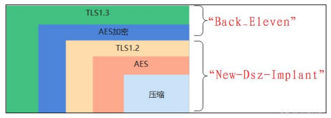

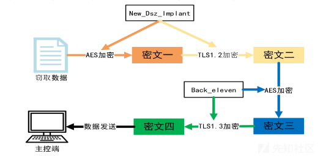

## DanderSpritz网攻平台

关于DanderSpritz网攻平台的介绍和使用教程，在公开网络中早已广为流传。与此网攻平台关联的最广为人知的网络安全事件就是---**WannaCry勒索病毒全球爆发**：2017年5月，攻击者将“永恒之蓝”整合进WannaCry勒索软件中，导致全球超过150个国家、数十万台设备被感染，医疗、交通、金融等多个关键基础设施遭受重创。

### pc\_prep配置木马

成功加载DanderSpritz网攻平台后，我们即可使用pc\_prep命令自定义配置并生成木马了。

木马配置截图如下：

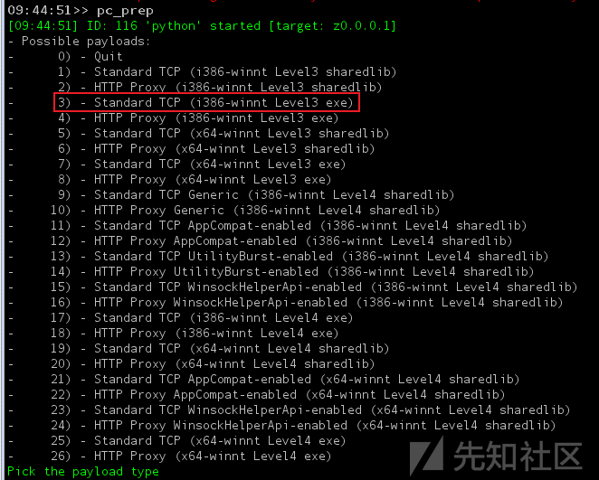

生成后木马截图如下：

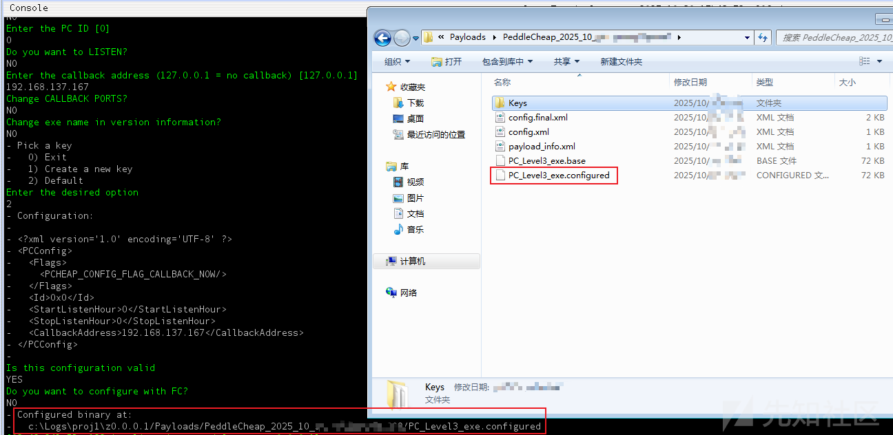

## PC\_Level3\_exe.configured

PC\_Level3\_exe.configured即为使用pc\_prep命令自定义配置并生成的木马程序。

### 内置RSA公钥

查看pc\_prep配置木马操作后生成的木马目录，我们可以发现Keys目录下存在两个密钥文件：private\_key.bin、public\_key.bin，对密钥文件进行分析，发现其实际为RSA公私钥文件。

结合DanderSpritz网攻武器中生成木马的流程，推测此密钥文件用于木马通信，因此，尝试搜索生成后的PC\_Level3\_exe.configured木马二进制内容，**发现PC\_Level3\_exe.configured木马二进制中存在public\_key.bin文件内容**。

Keys目录RSA公私钥文件截图如下：

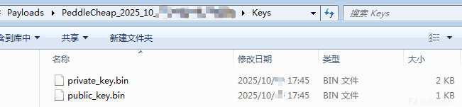

public\_key.bin文件内容截图如下：

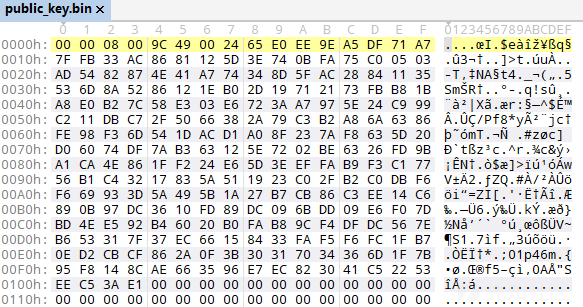

PC\_Level3\_exe.configured文件内容截图如下：

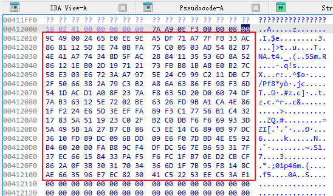

### RSA密钥校验

使用IDA对样本进行反编译，根据RSA公钥数据内容，我们即可定位RSA算法函数。

对RSA算法函数前后代码进行分析，我们可知：

* 样本建立通信后，将首先对RSA密钥进行校验，确保DanderSpritz控制端和木马端的RSA密钥配套；
* RSA密钥校验成功后，样本将生成AES算法密钥，并使用RSA算法加密发送至DanderSpritz控制端；

进一步分析，尝试对RSA密钥校验过程进行详细分析，梳理如下：

* 木马建立通信后，将首先接收256字节载荷数据；
* 成功接收数据后，木马将使用RSA公钥对256字节载荷数据进行解密；
* 解密后数据：

* 第一个字节为0x00
* 第二个字节为0x01
* 第二个字节后为大量0xFF
* 最后一个0xFF后为0x00
* 0x00后数据即为实际有效数据

* 解密后数据中的实际有效数据

* 有效长度为12
* 第1、2字节为0x0002
* 第3、4字节为校验值，应大于等于0x0003；
* 第5、6、7、8字节为校验值，固定为0x8e3071ab
* 第11、12字节为下一段载荷数据的长度

调试过程中，RSA解密后载荷内容如下：

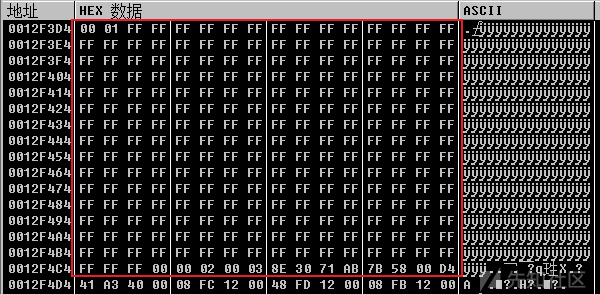

RSA运算及密钥校验代码截图如下：

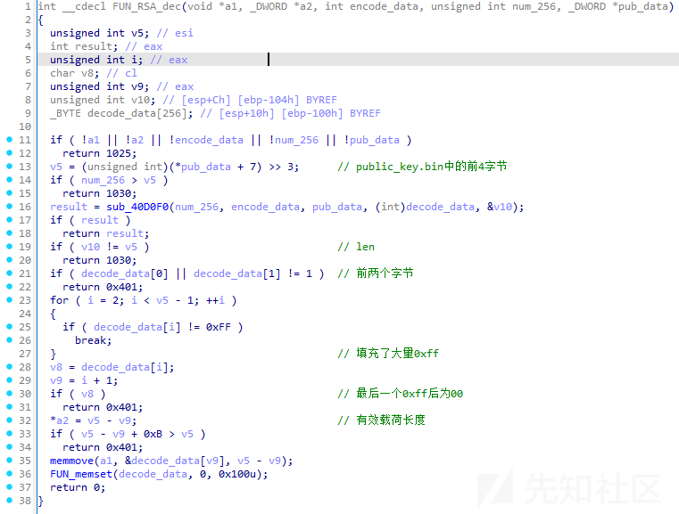

解密后载荷魔术值校验代码截图如下：

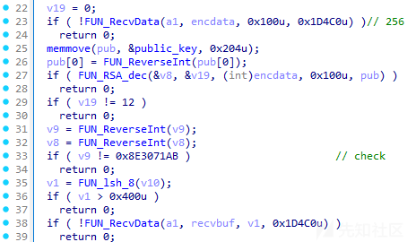

### 加密传输AES密钥

RSA密钥校验成功后，样本即可使用RSA密钥安全传输后续通信所需的AES算法密钥了。

**如何确定后续通信是基于AES算法的呢？**

其实很简单，在样本代码中能够很清晰的找到AES算法的SBOX值，基于SBOX值即可确定AES算法位置，相关代码截图如下：

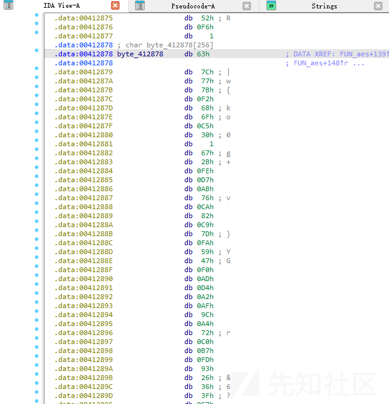

确定了此样本将使用AES算法进行后续加密通信，接下来，我们就需要剖析AES密钥是如何生成的？如何安全传输的？

通过分析，尝试对AES密钥的生成和安全传输过程进行详细分析，梳理如下：

* 样本将调用GetCursorPos、GetThreadTimes、GetDiskFreeSpaceExW、GlobalMemoryStatus、GetTickCount、QueryPerformanceCounter、GetSystemTimeAsFileTime等函数构造随机数据，多次调用SHA1算法生成SHA1值，用作AES密钥；
* AES密钥生成成功后，样本将AES密钥填充至0x30字节长度的有效载荷中；
* 构造256字节载荷数据：随机数据 + 有效载荷
* 使用RSA公钥对256字节载荷数据进行加密；
* 将加密后数据发送至控制端；

相关代码截图如下：

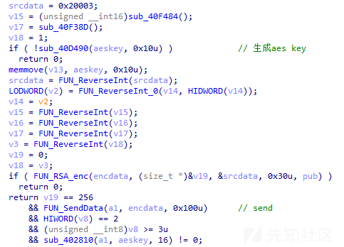

样本调用SHA1运算的代码截图如下：

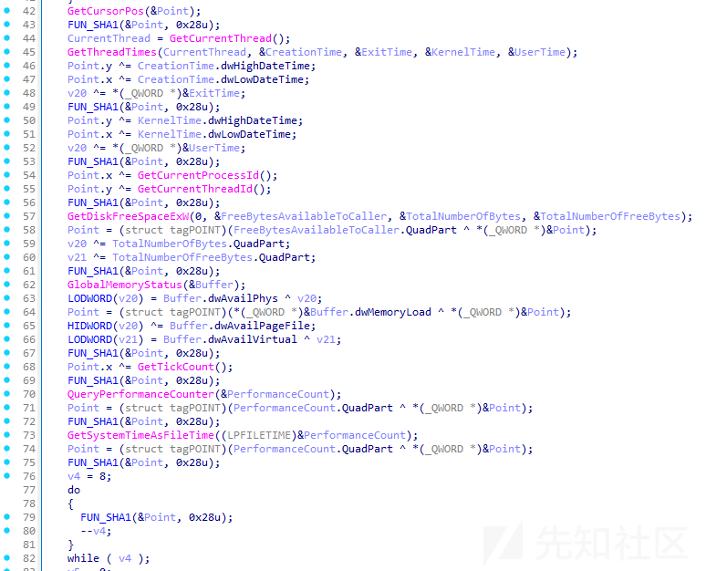

调试过程中，RSA加密前载荷内容如下：**（备注：最后0x30字节为有效载荷，其中能看到很明显的16字节AES密钥）**

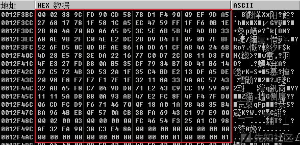

调试过程中，RSA加密后载荷内容如下：

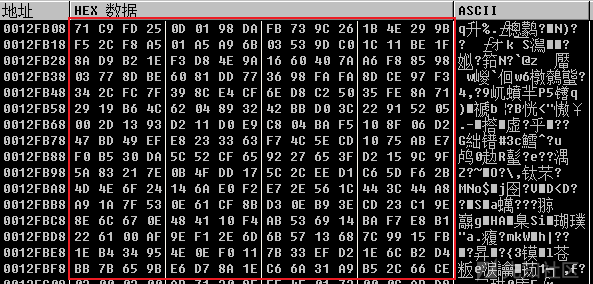

### 接收Dsz\_Implant\_Pc.dll模块

样本成功加密传输AES密钥后，即会使用AES密钥进行后续的通信数据加密。

通信过程中，控制端将向被控端发送Dsz\_Implant\_Pc.dll模块代码，传输流程如下：

* 接收第一段数据：传输Dsz\_Implant\_Pc.dll模块导出函数编号，以#开头；
* 接收第二段数据：传输压缩后的PE文件内容，压缩算法原理为压缩00数据；
* 解压压缩后的PE文件内容，得到实际Dsz\_Implant\_Pc.dll模块文件；

调试过程中，接收第一段数据代码截图如下：

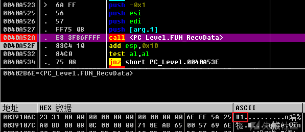

调试过程中，接收第二段数据代码截图如下：

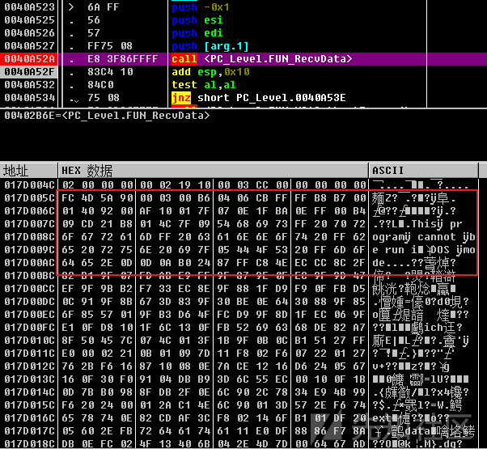

解压后Dsz\_Implant\_Pc.dll模块文件截图如下：

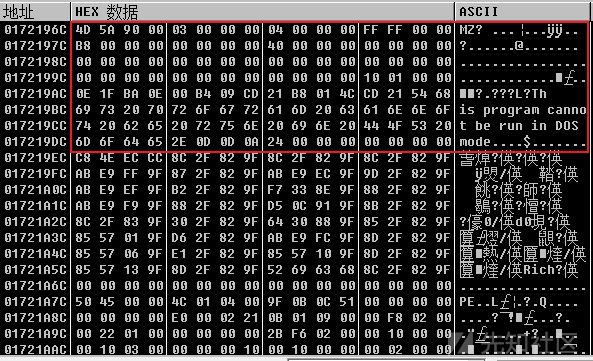

### 加载Dsz\_Implant\_Pc.dll模块

被控端成功接收Dsz\_Implant\_Pc.dll模块后，将在内存中加载并执行Dsz\_Implant\_Pc.dll模块。

通过分析，发现**此样本未使用VirtualProtectEx、WriteProcessMemory等注入技术经典函数，而是直接调用了ntdll的导出函数。**

模块加载大致流程如下：

* 调用RtlImageNtHeader函数解析已解压的PE文件头；
* 调用NtCreateSection、NtMapViewOfSection、memcpy函数实现内存节并映射；
* 调用RtlImageDirectoryEntryToData函数实现导入表解析；
* 根据导出函数编号获取Dsz\_Implant\_Pc.dll模块指定导出函数地址；
* 加载执行Dsz\_Implant\_Pc.dll模块指定导出函数代码，同时**将把此样本的部分通信相关数据作为函数参数传递**；

加载PE代码截图如下：

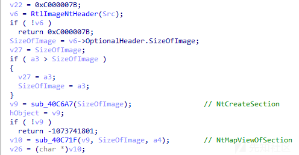

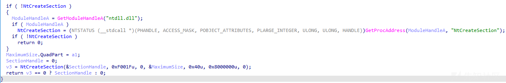

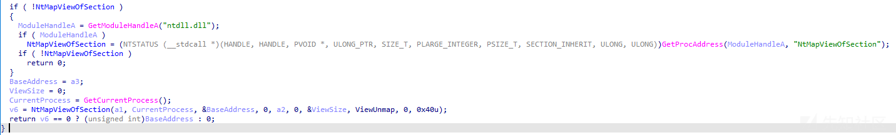

加载执行Dsz\_Implant\_Pc.dll模块代码截图如下：

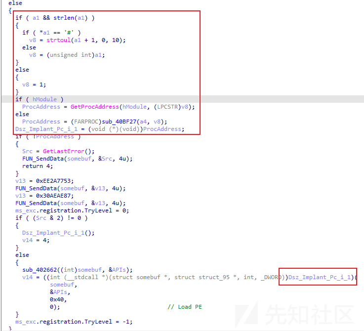

## Dsz\_Implant\_Pc.dll

Dsz\_Implant\_Pc.dll样本是一款植入模块样本，主要用于植入其他模块。样本还是比较有意思，有一定的分析难度。

### AES加密通信

通过分析，发现此样本将同样使用AES算法进行加密通信，AES算法密钥将使用PC\_Level3\_exe.configured样本的AES算法密钥。

样本代码中的AES算法SBOX值截图如下：

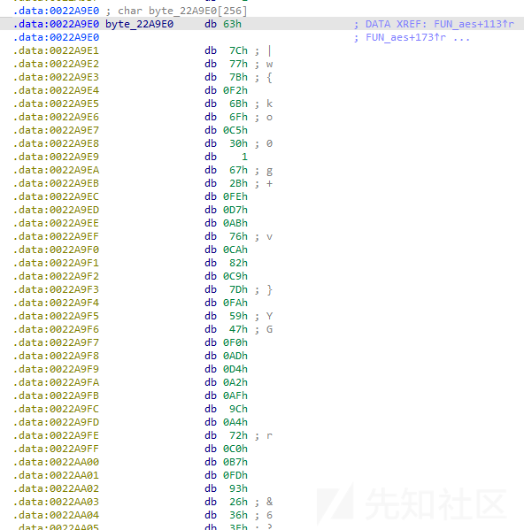

AES算法代码截图如下：

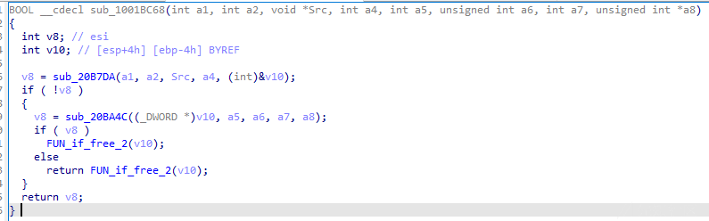

### 通信模型对比

通过分析，发现此样本虽然沿用了PC\_Level3\_exe.configured样本的AES通信算法，但通信数据的填充方式却完全不同。

同一会话中，不同样本的通信数据结构变化如下：

* 上面是PC\_Level3\_exe.configured样本
* 下面是Dsz\_Implant\_Pc.dll样本

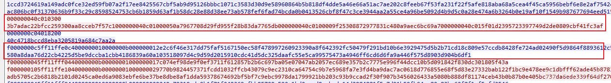

### 模块化加载并执行

通过分析，发现此样本在模块化加载过程中，除通信模型与PC\_Level3\_exe.configured样本不同外，整个模块化加载原理与PC\_Level3\_exe.configured样本基本相同。

调试过程中，解压后模块代码截图如下：

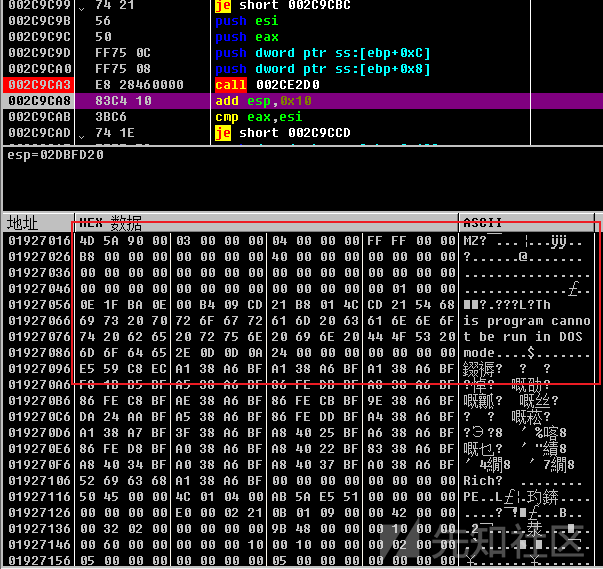

模块加载代码截图如下：

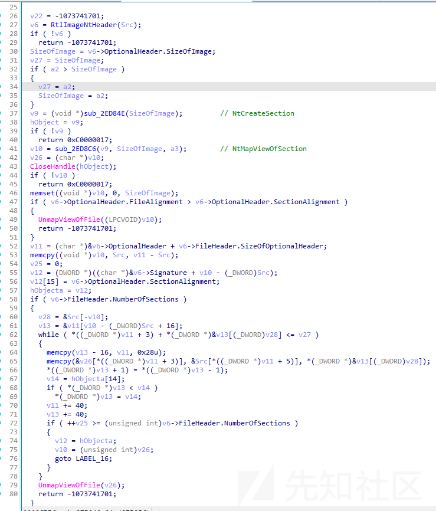

### 模块化后门提取

调试过程中，尝试提取木马默认上线过程中传输的所有模块样本，梳理共成功提取20余个模块，模块信息列表如下：

|  |  |  |
| --- | --- | --- |
| 编号 | 文件名称 | MD5 |
| 1 | Audit\_Target\_Vista.dll | 321707c2d0e3342eebf3ca4297f5407e |
| 2 | Cd\_Target.dll | 95a60330dfb34f8e6f74de650eb824e8 |
| 3 | Dir\_Target.dll | 51a566e86667a8a798b21dbed98933de |
| 4 | Drivers\_Target.dll | c9b8780510a66f6d976f4659dfbe8f81 |
| 5 | Environment\_Target.dll | 8c2a9d25a7fe706fc72fb596dcc2edd4 |
| 6 | FileAttributes\_Target.dll | 4ec910c6893ec41a3b0dee990ac816d4 |
| 7 | Ifconfig\_Target.dll | d836d1356d1c871d9122c68269f4a0d9 |
| 8 | Language\_Target.dll | c65da21963ddc19f805caab9bf86a806 |
| 9 | Mcl\_NtElevation\_EpMe\_GrSa.dll | bbb9507dff849f1054d1111bf2189d02 |
| 10 | Mcl\_NtMemory\_Std.dll | d9ec51813e5b906026bae8214e7c201e |
| 11 | Mcl\_NtNativeApi\_Win32.dll | fd8ca5a91a4593682c52ef259053e24d |
| 12 | Mcl\_ThreadInject\_Std.dll | 882753e3b55bd309fb4145f3a1916257 |
| 13 | Packages\_Target.dll | 11ec257b767dfc67e7e61fca1183d875 |
| 14 | PasswordDump\_Target.dll | 4e8136664c506b96c5c80fbac7e2925e |
| 15 | ProcessInfo\_Target.dll | a44f6b8e339059734723698e942656e3 |
| 16 | ProcessOptions\_Target.dll | 0e64828ee83dee083d3acdeef05a09d1 |
| 17 | Processes\_Target.dll | e03ed9ec64bdf56da9a500455fc40a3e |
| 18 | RegistryQuery\_Target.dll | b72eb84dc3e2fc436770f796d3bef16c |
| 19 | Route\_Target.dll | 377cfac5e1e969b3e021baa82a496b9f |
| 20 | Scheduler\_Target.dll | bf585f2a7db31a31f2f24da59b29770f |
| 21 | Services\_Target.dll | 17021bd7d4dcc1ae2fc341e08bd7cebd |
| 22 | SidLookup\_Target.dll | fdd6acf54f8d8cb0c6e78a3348c32927 |
| 23 | SystemPaths\_Target.dll | b7ec760dab660af992b9b22fb3af1b1c |
| 24 | SystemVersion\_Target.dll | 84c637d917568a2d777a3bfc804cc01d |
| 25 | Time\_Target.dll | f9b3ade1a2bc891c7e008c4f182265df |

进一步分析，发现相关模块均为NSA-windows\Resources\Dsz\Modules\Files-dsz\i386-winnt-vc9s
elease目录下的模块文件，相关截图如下：

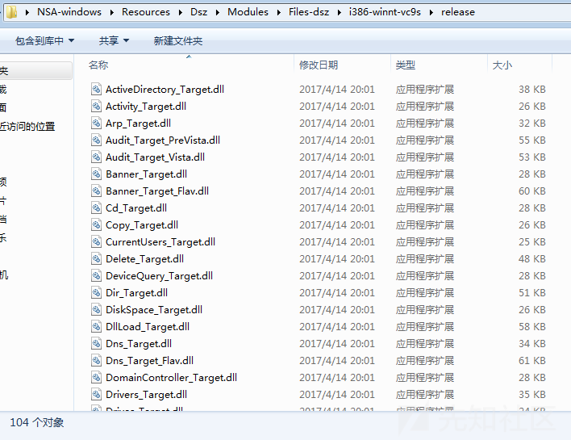

## 通信解密尝试

为了进一步梳理DanderSpritz平台木马的通信原理，笔者尝试构建了一个专用解密程序，当前可完整还原“DanderSpritz”平台木马的通信内容，并成功提取其模块化后门载荷。

通信数据包解密效果如下：

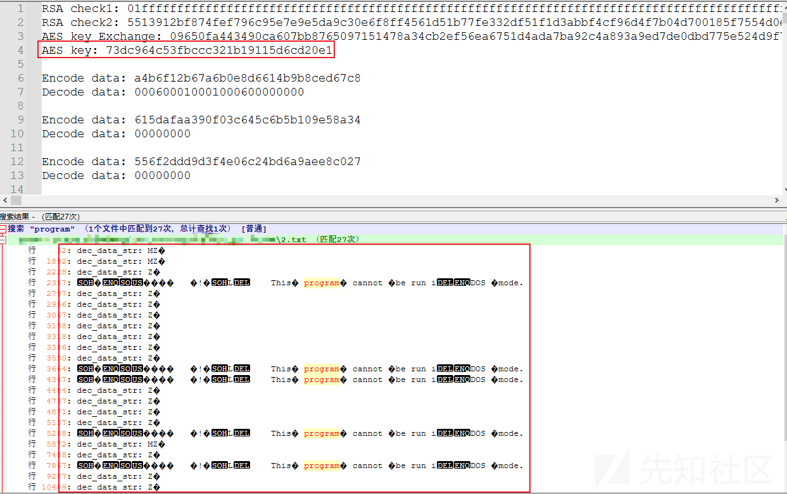

通信数据包截图如下：

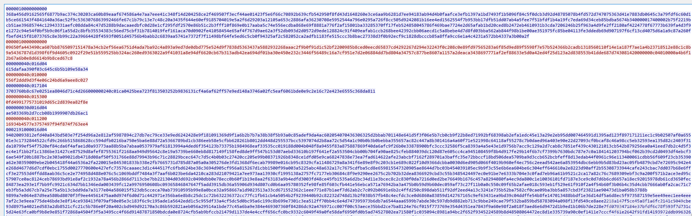

## 技术原理对比

通过细致分析，笔者对比了DanderSpritz平台木马和“国家授时中心”网攻事件中的木马技术原理，发现其在以下技术原理上存在吻合：

* 对比1

* PC\_Level3\_exe样本内置了RSA公钥，并利用RSA算法进行会话密钥交换；
* Back\_Eleven样本也内置了RSA公钥，并利用RSA算法进行会话密钥交换；

* 对比2

* Dsz\_Implant\_Pc.dll样本由PC\_Level3\_exe样本加载运行；
* New-Dsz-Implant样本由eHome\_0cx武器加载运行；

* 对比3

* Dsz\_Implant\_Pc.dll样本无会话密钥交换过程，将直接使用PC\_Level3\_exe样本会话密钥交换后的AES密钥进行加密通信；
* New-Dsz-Implant样本也无会话密钥交换过程，推测使用相同方式传递AES密钥；

* 对比4

* Dsz\_Implant\_Pc.dll样本配合使用PC\_Level3\_exe样本所搭建的数据传输链路；
* New-Dsz-Implant样本将配合使用Back\_Eleven所搭建的数据传输链路；

* 对比5

* PC\_Level3\_exe通信算法为：AES
* eHome\_0cx样本通信算法为：TLS协议 + XX算法
* Back\_Eleven样本通信算法为：TLS1.3 + AES
* Dsz\_Implant\_Pc.dll样本模块化传输通信算法为：AES + 压缩算法
* New-Dsz-Implant样本模块化传输通信算法为：TLS1.2 + AES + 压缩算法

CNCERT报告中模块化加载代码截图如下：

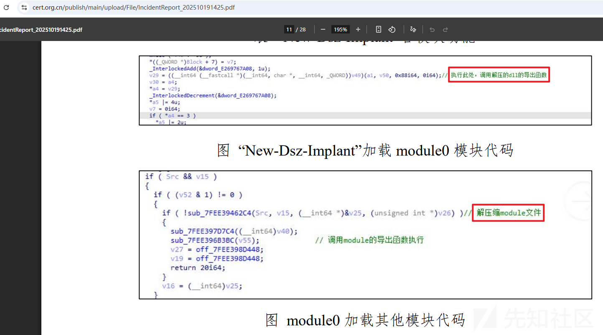
