# 【好靶场】JS加密逆向分析笔记-先知社区

> **来源**: https://xz.aliyun.com/news/19281  
> **文章ID**: 19281

---

# 0x00 前言

文本大部分内容都是由好靶场团队-秋佬编写，额外添加了一些简要的说明。废话不多说开始正文。

JS 加密逆向分析是前端安全与逆向工程领域的核心技术之一，主要针对网页、移动端 H5 或 Electron 等基于 JavaScript 运行的应用中，用于保护数据传输、接口请求、核心逻辑的加密机制，通过技术手段还原加密流程、推导加密算法、破解加密参数的一系列分析过程。

​

在很多时候，有一些接口存在越权漏洞，但是因为数据包被加密了，导致我们无法进行漏洞利用，这个时候我们就需要去分析JS，进行参数伪造，以及数据包构造。是作为安全研究员必回的能力之一。

​

以下所有的内容都是根据真实报告改编，取材于真实案例~

# 0x01 JS 加密逆向分析反调试对抗 1

> 靶场地址：<http://www.loveli.com.cn/see_bug_one?id=379>

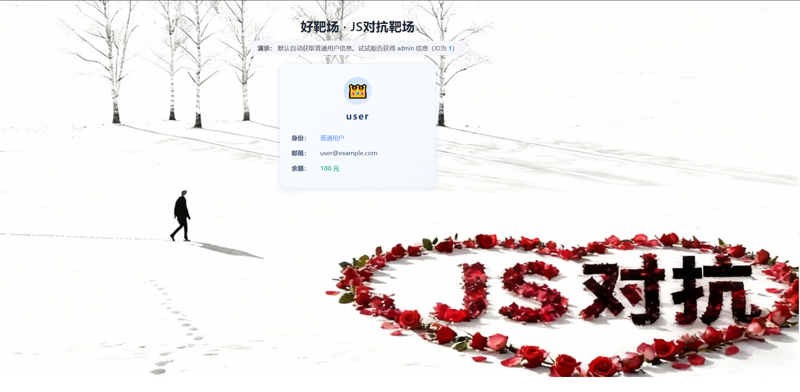

## 解题思路

已知本题考验的是javascript逆向，那肯定要从源码分析，我们首先看一下请求包。

咱们的id是2，那么管理员的就是1了，修改，重发包试试：

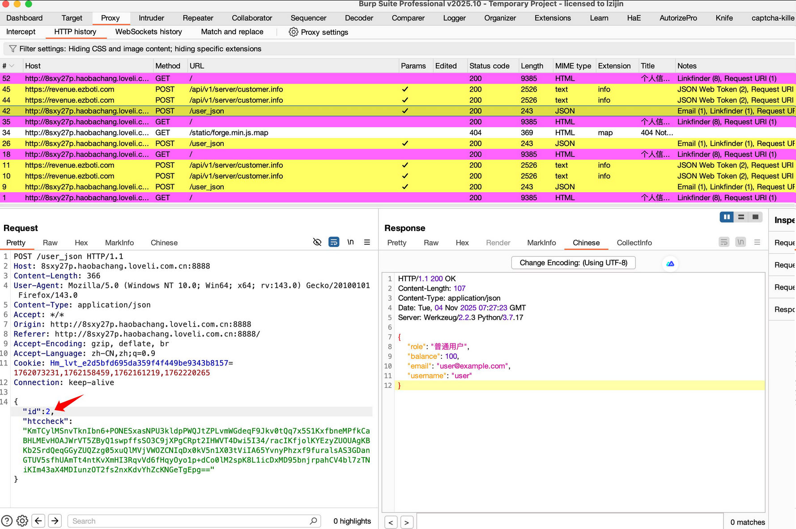

可以看到请求失败了，因为没有cookie等身份认证的字段，那用作身份校验的肯定就是请求体里的htccheck了，而且出现在请求体里，说明肯定是前段传过来的，那么我们从前端代码处分析一下：

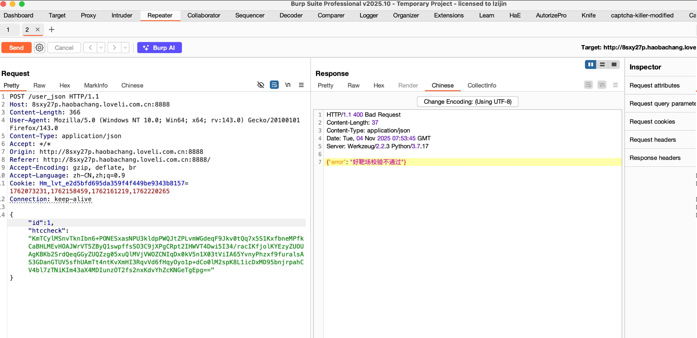

正片开始……

# 反调试手段

首先，网站是开启了禁止调试的，通过禁用快捷键和右键菜单、持续触发 `debugger` 暂停以及通过窗口尺寸变化检测 DevTools 状态等多种手段，阻止用户对网页进行调试、查看和复制代码的操作，是一种典型的反调试技术，好了，大家可以暂停一下心里暗骂@llm几句了。更详细的反调试这里就不做分析了，有兴趣的朋友可以去源码里面找到这段代码研究一下。

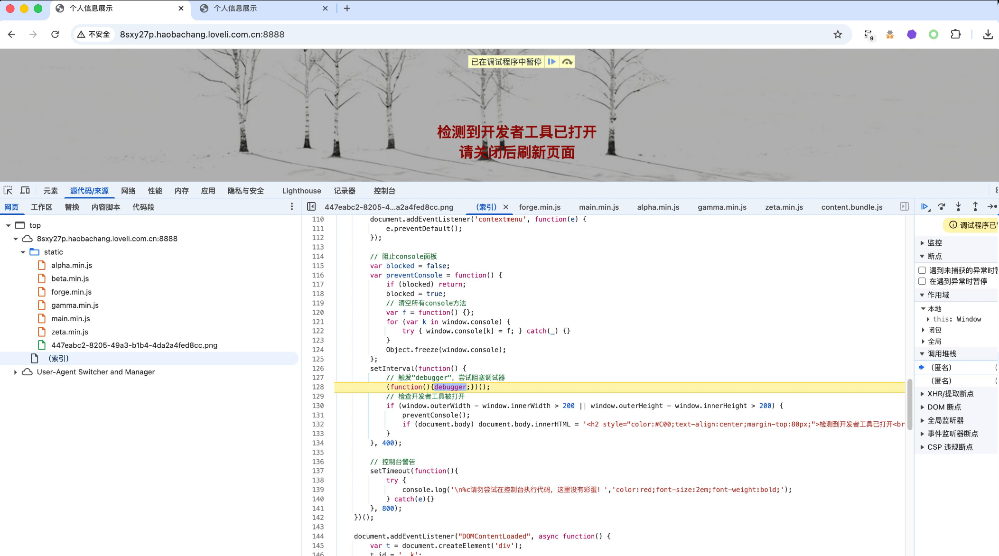

既然禁止我们调试，那就只能把源码扒下来了，在页面ctrs+s保存到本地即可！或者喜欢前段调试的朋友，可以直接选择“一律不在此处暂停”。

# javascript逆向分析

在页面中，DOMContentLoaded 时拼出一个隐藏节点 #\_\_k，其中 data-x 存储了被“插隔符+反转+Base64”的公钥数据，data-s 存储分隔符。

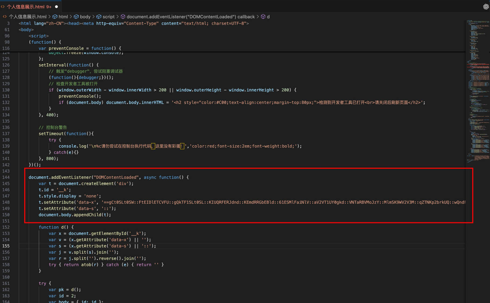

加密请求构造：默认 id = 2，并用公钥对字符串 &amp;quot;2&amp;quot; 加密，得到 htccheck 一并传给后端。

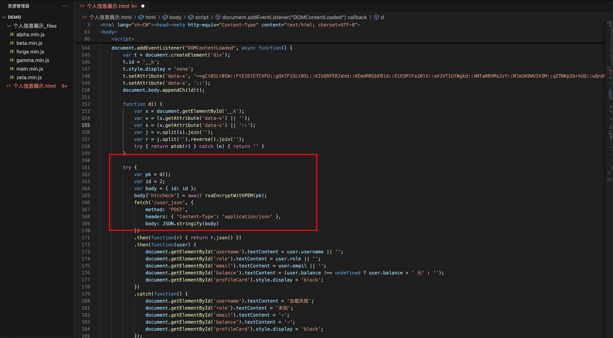

公钥还原函数 d() 的等价实现，从 data-x 用 data-s 拼接 → 反转 → Base64 解码 → PEM 文本：

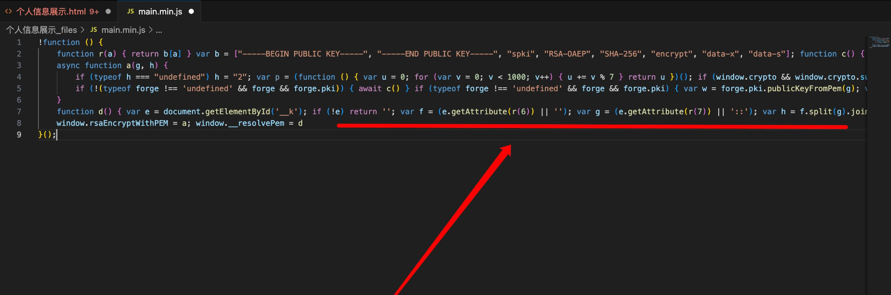

加密实现核心：RSA-OAEP(SHA-256)，优先 WebCrypto，回退 node-forge，这里两条路径算法一致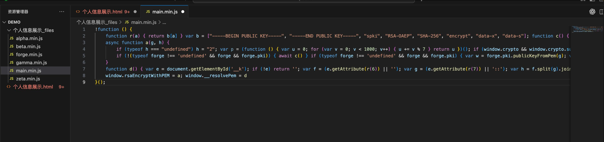总结：

到这里让我们捋一捋！

* 明文就是字符串 &amp;quot;2&amp;quot;，前端未把 id 动态绑定给加密函数的第二参
* 算法是 RSA-OAEP，哈希为 SHA-256，输出 Base64
* 你要生成 id=1 的 htccheck，只需对明文 &amp;quot;1&amp;quot; 用相同公钥同算法加密即可，id 放在 JSON 明文字段里

## 加密算法编写步骤：

1. 还原 PEM 公钥：

* 从 data-x 去掉分隔符 ::，拼接为一条长串；
* 整串反转
* Base64 解码得到 PEM 文本，包含

1. 对明文 &amp;quot;1&amp;quot; 执行 RSA-OAEP(SHA-256) 加密
2. 对密文字节做 Base64 编码，得到 htccheck

理论存在，实践开始：

## 脚本编写

知道了加密流程，解密流程逆着来就行了，就很简单了

```
# pip install cryptography
import base64
import argparse
from typing import Tuple
from cryptography.hazmat.primitives import serialization, hashes
from cryptography.hazmat.primitives.asymmetric import padding

DATA_X = &amp;quot;自己找data-x哦&amp;quot;
DATA_S = &amp;quot;::&amp;quot;

def resolve_pem(data_x: str, sep: str = &amp;quot;::&amp;quot;) -&amp;gt; str:
    joined = &amp;quot;&amp;quot;.join(data_x.split(sep))
    reversed_str = joined[::-1]
    pem_bytes = base64.b64decode(reversed_str)
    return pem_bytes.decode(&amp;quot;utf-8&amp;quot;)

def rsa_oaep_sha256_encrypt_base64(pem: str, plaintext: str) -&amp;gt; str:
    public_key = serialization.load_pem_public_key(pem.encode(&amp;quot;utf-8&amp;quot;))
    ciphertext = public_key.encrypt(
        plaintext.encode(&amp;quot;utf-8&amp;quot;),
        padding.OAEP(
            mgf=padding.MGF1(algorithm=hashes.SHA256()),
            algorithm=hashes.SHA256(),
            label=None,
        ),
    )
    return base64.b64encode(ciphertext).decode(&amp;quot;utf-8&amp;quot;)

def build_htccheck_for_id(target_id: int) -&amp;gt; Tuple[int, str]:
    pem = resolve_pem(DATA_X, DATA_S)
    htccheck = rsa_oaep_sha256_encrypt_base64(pem, str(target_id))
    return target_id, htccheck

if __name__ == &amp;quot;__main__&amp;quot;:
    parser = argparse.ArgumentParser()
    parser.add_argument(&amp;quot;--id&amp;quot;, type=int, default=1, help=&amp;quot;ID（默认1）&amp;quot;)
    args = parser.parse_args()

    target_id, htccheck = build_htccheck_for_id(args.id)
    print(htccheck)

```

* 用法：

* 只生成 id=1：python htccheck.py
* 生成任意 id：python htccheck.py --id 2

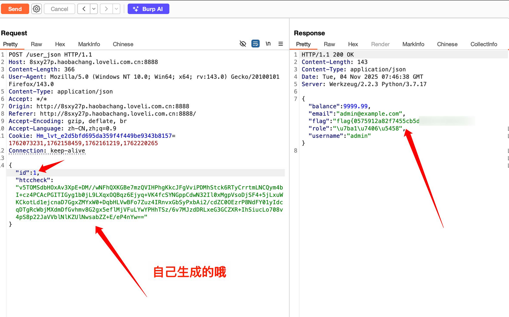

# 0x02 JS 加密加盐逆向分析案例

> 靶场地址：<http://www.loveli.com.cn/see_bug_one?id=379>

## 代码分析

通过main.min.js代码可以发现，在相关常量与辅助函数初始化中：

* 代码把常量数组收在 `b` 里，通过 `r(idx)` 取值，主要是公钥头尾与算法参数字面量：

* `b[0]=&amp;quot;-----BEGIN PUBLIC KEY-----&amp;quot;`
* `b[1]=&amp;quot;-----END PUBLIC KEY-----&amp;quot;`
* `b[2]=&amp;quot;spki&amp;quot;`
* `b[3]=&amp;quot;RSA-OAEP&amp;quot;`
* `b[4]=&amp;quot;SHA-256&amp;quot;`
* `b[5]=&amp;quot;encrypt&amp;quot;`
* `b[6]=&amp;quot;data-x&amp;quot;`
* `b[7]=&amp;quot;data-s&amp;quot;`

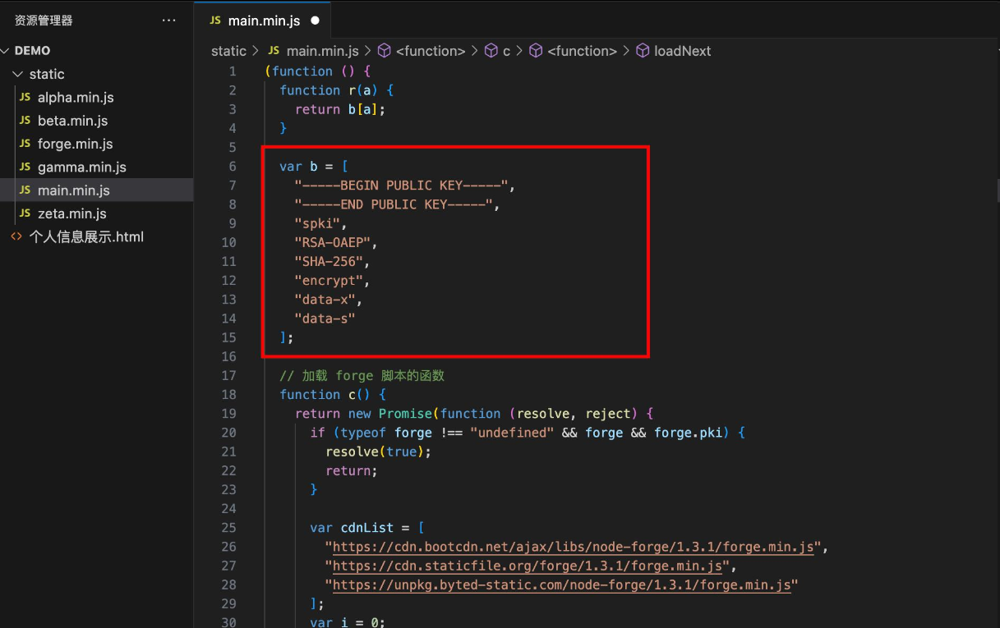

* c() 是一个回退加载器：如果没全局 forge.pki，就依次尝试 3 个 CDN 动态加载 node-forge。成功则 resolve(true)，失败轮换到下一个，全部失败才 reject。

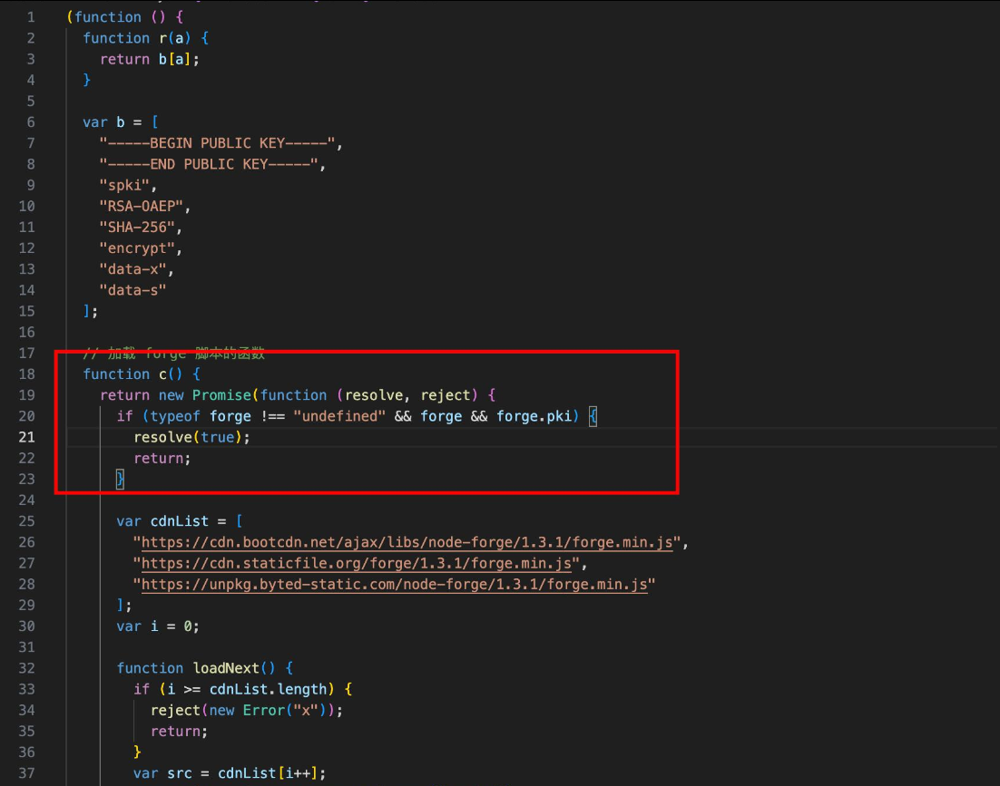

## 从 DOM 还原 PEM 公钥：`__resolvePem()`

* 查找元素：document.getElementById(&amp;#x27;\_\_k&amp;#x27;)，若不存在直接返回空串。
* 读取两个自定义属性：

* `data-x`：承载“处理后”的公钥数据
* `data-s`：data-x 内部的分隔符（默认 &amp;#x27;::&amp;#x27;）

* 还原流程：

1. 用分隔符把 data-x 中的分隔标记去掉，拼回连续字符串
2. 将结果整体反转
3. 对反转后的字符串执行 atob，得到标准 PEM 文本

* 导出到全局：window.\_\_resolvePem = d

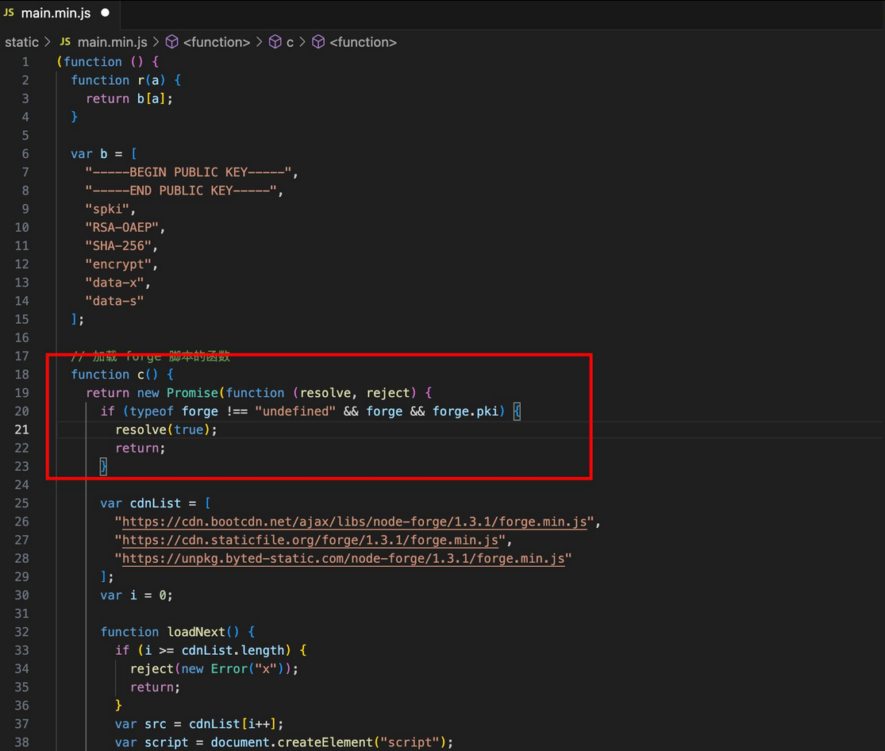

## 加密主函数签名：

默认前缀 + “10086”

* 入参：

* `g`：PEM 公钥字符串（上一步 \_\_resolvePem() 的返回值）
* `h`：可选明文前缀，缺省时设为 &amp;quot;2&amp;quot;

* 明文构造：

* 若 h 未传：h = &amp;quot;2&amp;quot;
* 固定拼接尾部 &amp;quot;10086&amp;quot;：h = h + &amp;quot;10086&amp;quot;
* 因此默认明文是 &amp;quot;210086&amp;quot;；自定义时如传 &amp;quot;9&amp;quot; 则为 &amp;quot;910086&amp;quot;

* 这里有一个无用的微型循环 p()，那小子骗人的
* 导出到全局：window.rsaEncryptWithPEM = a

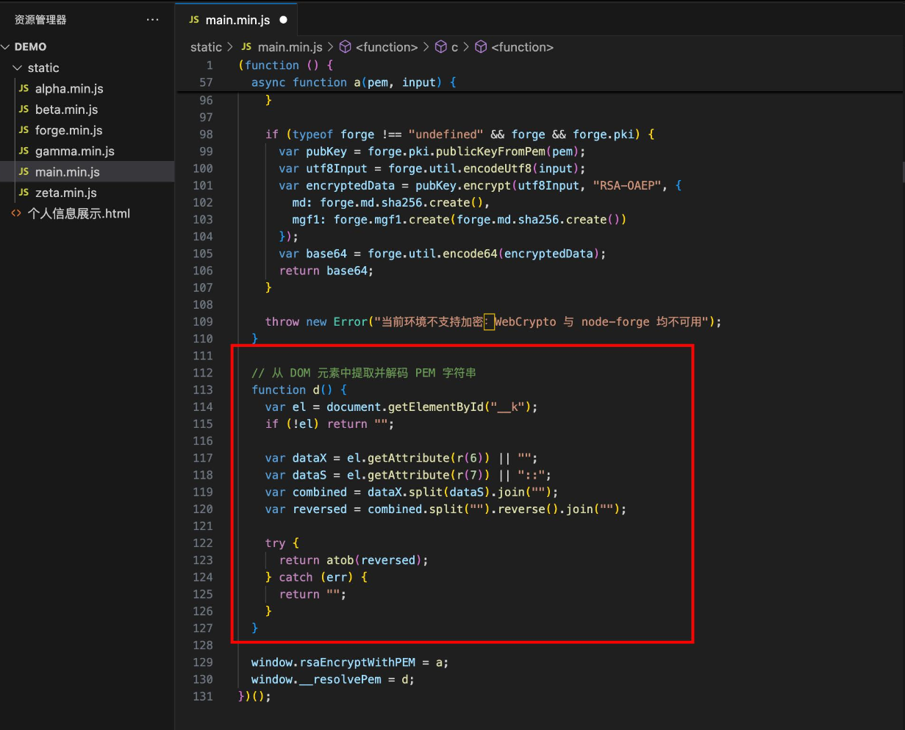

## WebCrypto 加密（RSA-OAEP/SHA-256）

当浏览器支持 window.crypto.subtle 时，按以下步骤执行：

1. 去掉 PEM 包裹与空白，得到 base64 的主体

* k = g.trim()
* 依次 replace(&amp;quot;-----BEGIN PUBLIC KEY-----&amp;quot;,&amp;quot;&amp;quot;)、replace(&amp;quot;-----END PUBLIC KEY-----&amp;quot;,&amp;quot;&amp;quot;)
* replace(/ \s+/g,&amp;#x27;&amp;#x27;) 去除换行与空白
* 此时 k 是纯 base64 内容（SPKI 的 DER 编码）

1. base64 → 二进制 → ArrayBuffer

* l = Uint8Array.from(atob(k), ch =&amp;gt; ch.charCodeAt(0))
* 取 l.buffer 作为密钥原始字节

1. 导入公钥为 CryptoKey

* subtle.importKey(&amp;quot;spki&amp;quot;, l.buffer, { name:&amp;quot;RSA-OAEP&amp;quot;, hash:&amp;quot;SHA-256&amp;quot; }, false, [&amp;quot;encrypt&amp;quot;])

* 格式为 spki
* 算法 RSA-OAEP
* 摘要 SHA-256
* 用途 encrypt

1. 明文编码

* 通过 TextEncoder() 把上一步的字符串明文 h 编码成 Uint8Array

1. 执行加密并 base64 输出

* subtle.encrypt({ name:&amp;quot;RSA-OAEP&amp;quot; }, publicKey, plaintextBytes)
* 将返回的 ArrayBuffer 转成 Uint8Array 再转成字符串，最后 btoa 得到 base64 密文，作为 htccheck

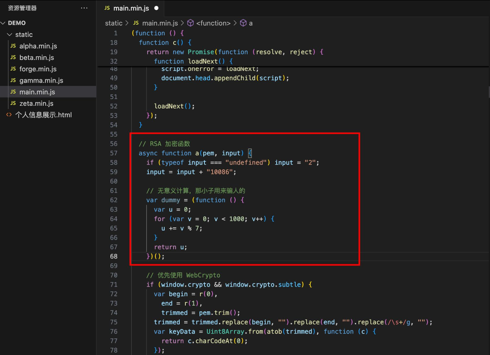

要点：

* 算法为 RSA-OAEP，MGF1 默认跟随 hash=SHA-256。
* 输出统一为 base64 字符串。

## 回退使用 node-forge（同为 RSA-OAEP/SHA-256）

若 WebCrypto 不可用：

* 如果还没全局 forge，则先执行 c() 动态加载
* 使用 forge.pki.publicKeyFromPem(g) 解析 PEM
* 明文用 forge.util.encodeUtf8(h) 得到字节
* 调用 publicKey.encrypt(plaintext, &amp;#x27;RSA-OAEP&amp;#x27;, { md: forge.md.sha256.create(), mgf1: forge.mgf1.create(forge.md.sha256.create()) })

* 指定 OAEP 的哈希与 MGF1 都是 SHA-256

* 最后 forge.util.encode64(cipherBytes) 作为 htccheck

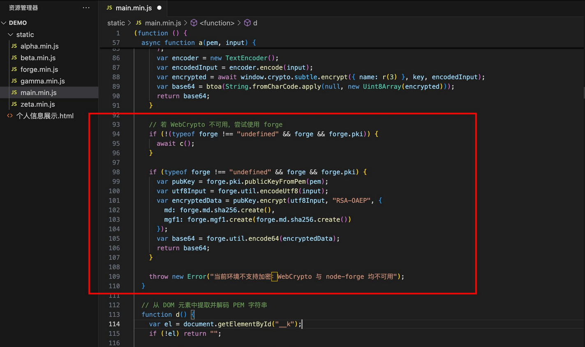

## 全流程

* 页面需要一个 id=&amp;quot;\_\_k&amp;quot; 的节点，包含：

* `data-x`：被插入分隔符、整体反转、再 base64 的字符串
* `data-s`：分隔符（默认 &amp;#x27;::&amp;#x27;）

* 取 PEM：const pem = \_\_resolvePem()
* 算出 htccheck：const htccheck = await rsaEncryptWithPEM(pem, prefix?)

* 若不传 prefix，默认明文 &amp;quot;210086&amp;quot;；传 &amp;quot;9&amp;quot; 则 &amp;quot;910086&amp;quot;

至于beta.min.js、gamma.min.js、zeta.min.js 分别生成 sessionStorage.k1..k3、window.\_\_z、window.\_\_q 之类的，纯属凑数的

## 总结

* 明文 = 前缀(默认&amp;quot;2&amp;quot;) + &amp;quot;10086&amp;quot;
* RSA-OAEP/SHA-256 加密，输出 base64
* PEM 公钥从 #\_\_k[data-x][data-s] 逆变换还原得到
* 先用 WebCrypto，失败回退 node-forge（同参数）

## 加密算法编写：

首先从页面属性还原 PEM：

```
document.getElementById(&amp;#x27;__k&amp;#x27;)?.getAttribute(&amp;#x27;data-x&amp;#x27;)
```

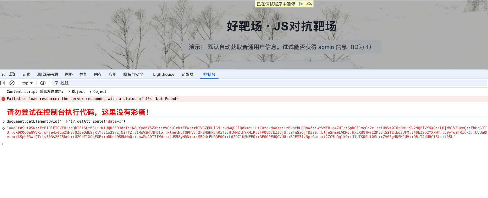

然后使用脚本生成htccheck：

```
python generate_htccheck.py --data-x &quot; PEM&quot; --data-s &quot;::&quot; --h 1
```

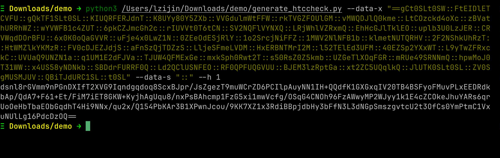  
重新发包：

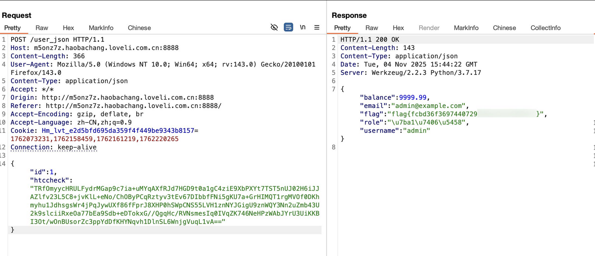

脚本附上：

```
import argparse
import base64
import sys
from typing import Optional


def resolve_pem_from_data_attrs(data_x: str, data_s: str = &amp;quot;::&amp;quot;) -&amp;gt; str:
    &amp;quot;&amp;quot;&amp;quot;
    Mirror JS __resolvePem():
    - remove separators (split/join by data_s)
    - reverse the string
    - atob (base64 decode) =&amp;gt; PEM (UTF-8)
    &amp;quot;&amp;quot;&amp;quot;
    if data_x is None:
        raise ValueError(&amp;quot;data-x is required to resolve PEM&amp;quot;)
    if data_s is None:
        data_s = &amp;quot;::&amp;quot;
    joined = (data_x or &amp;quot;&amp;quot;).split(data_s)
    joined = &amp;quot;&amp;quot;.join(joined)
    reversed_str = joined[::-1]
    try:
        pem_bytes = base64.b64decode(reversed_str)
        return pem_bytes.decode(&amp;quot;utf-8&amp;quot;)
    except Exception as exc:
        raise ValueError(f&amp;quot;Failed to decode PEM from data-x/data-s: {exc}&amp;quot;) from exc


def rsa_oaep_sha256_encrypt_b64_with_cryptography(pem: str, plaintext: bytes) -&amp;gt; Optional[str]:
    try:
        from cryptography.hazmat.primitives import hashes
        from cryptography.hazmat.primitives.asymmetric import padding
        from cryptography.hazmat.primitives import serialization
        from cryptography.hazmat.backends import default_backend
    except Exception:
        return None

    try:
        public_key = serialization.load_pem_public_key(
            pem.encode(&amp;quot;utf-8&amp;quot;), backend=default_backend()
        )
        ciphertext = public_key.encrypt(
            plaintext,
            padding.OAEP(
                mgf=padding.MGF1(algorithm=hashes.SHA256()),
                algorithm=hashes.SHA256(),
                label=None,
            ),
        )
        return base64.b64encode(ciphertext).decode(&amp;quot;ascii&amp;quot;)
    except Exception as exc:
        raise RuntimeError(f&amp;quot;cryptography encryption failed: {exc}&amp;quot;) from exc


def rsa_oaep_sha256_encrypt_b64_with_pycryptodome(pem: str, plaintext: bytes) -&amp;gt; Optional[str]:
    try:
        from Crypto.PublicKey import RSA
        from Crypto.Cipher import PKCS1_OAEP
        from Crypto.Hash import SHA256
    except Exception:
        return None

    try:
        key = RSA.import_key(pem)
        cipher = PKCS1_OAEP.new(key, hashAlgo=SHA256)
        ciphertext = cipher.encrypt(plaintext)
        return base64.b64encode(ciphertext).decode(&amp;quot;ascii&amp;quot;)
    except Exception as exc:
        raise RuntimeError(f&amp;quot;PyCryptodome encryption failed: {exc}&amp;quot;) from exc


def generate_htccheck(pem: str, h_value: str = &amp;quot;1&amp;quot;) -&amp;gt; str:
    if h_value is None or h_value == &amp;quot;&amp;quot;:
        h_value = &amp;quot;1&amp;quot;
    plaintext = (h_value + &amp;quot;10086&amp;quot;).encode(&amp;quot;utf-8&amp;quot;)

    # Try cryptography first
    out = rsa_oaep_sha256_encrypt_b64_with_cryptography(pem, plaintext)
    if out is not None:
        return out

    # Fallback to PyCryptodome
    out = rsa_oaep_sha256_encrypt_b64_with_pycryptodome(pem, plaintext)
    if out is not None:
        return out

    raise RuntimeError(
        &amp;quot;Neither &amp;#x27;cryptography&amp;#x27; nor &amp;#x27;PyCryptodome&amp;#x27; is available. Please install one of them.&amp;quot;
    )


def main(argv=None) -&amp;gt; int:
    parser = argparse.ArgumentParser(description=&amp;quot;Generate htccheck via RSA-OAEP(SHA-256)&amp;quot;)
    src = parser.add_mutually_exclusive_group(required=True)
    src.add_argument(&amp;quot;--pem-file&amp;quot;, help=&amp;quot;Path to PEM public key file&amp;quot;)
    src.add_argument(&amp;quot;--data-x&amp;quot;, help=&amp;quot;Obfuscated data-x attribute content&amp;quot;)
    parser.add_argument(&amp;quot;--data-s&amp;quot;, default=&amp;quot;::&amp;quot;, help=&amp;quot;Separator used in data-x (default &amp;#x27;::&amp;#x27;)&amp;quot;)
    parser.add_argument(&amp;quot;--h&amp;quot;, default=&amp;quot;1&amp;quot;, help=&amp;quot;Prefix h (default &amp;#x27;1&amp;#x27;)&amp;quot;)
    args = parser.parse_args(argv)

    if args.pem_file:
        with open(args.pem_file, &amp;quot;rb&amp;quot;) as f:
            pem = f.read().decode(&amp;quot;utf-8&amp;quot;)
    else:
        pem = resolve_pem_from_data_attrs(args.data_x, args.data_s)

    htccheck = generate_htccheck(pem, args.h)
    print(htccheck)
    return 0


if __name__ == &amp;quot;__main__&amp;quot;:
    sys.exit(main())

```

## 

# 0x03 总结

感谢秋佬对团队做出的卓越贡献。

​
