# IDA FLIRT 与 FLAIR 使用文档-先知社区

> **来源**: https://xz.aliyun.com/news/19284  
> **文章ID**: 19284

---

# IDA FLIRT 与 FLAIR 使用文档

## 一、FLIRT简介

FLIRT（**Fast Library Identification and Recognition Technology**）是 IDA Pro 的一项核心功能，它通过模式匹配技术来识别二进制文件中由编译器生成的标准库函数和自定义库函数。

如下图示，经过FLIRT修饰过的函数可以观察出其属于MFC标准库下的图形化函数，使用FLIRT的情况下，IDA会直接显示库函数的函数名以及参数信息，让我们在逆向过程中比较好的节省时间，同时也会省略去库函数的反汇编细节。FLIRT也支持快速判断二进制文件使用了哪些编译器版本、库文件。

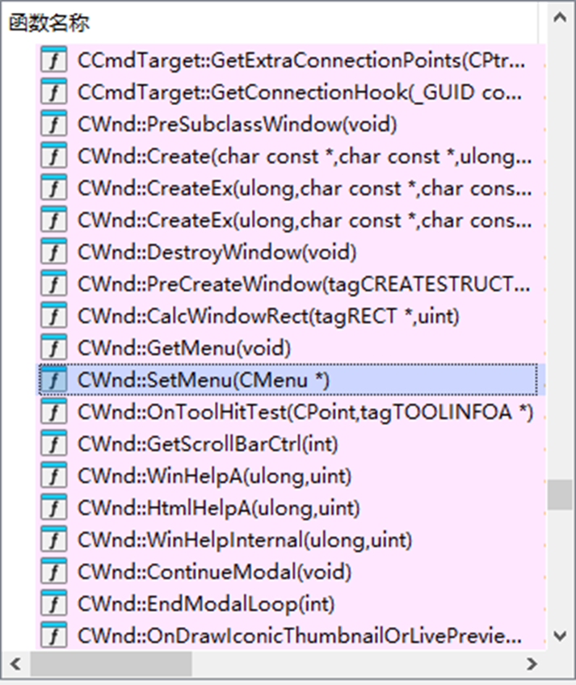

## 二、FLIRT使用及工作流程

### 1、FLIRT 模式匹配的流程：

#### 生成签名文件（`.sig`）

FLAIR 工具会提取库函数中**指令序列**，忽略地址常量和填充字节，形成函数签名的模式；由于库文件具有固定的格式规范，FLAIR为不同的库文件格式（如`.lib .o .a`等类型）提供了解析器，解析器会将库文件解析为`.pat`格式的模式文件。

每个函数模式包含：

* 函数起始字节序列；
* 校验码（CRC/Hash）；
* 函数长度信息；
* 函数名称（例如 `_memcpy`）。

下图中所示的即为打开的.pat文件信息，依次记录了函数起始字节，校验码，函数字节长度，函数在文件中的偏移，函数名称等信息。第一个字节序列列举了它所代表的函数的初始字节序列，最长为32个字节。一些字节因为重定位的入口而有所不同，这些字节将得到补全，每个字节以两点显示，如果一个函数短于32个字节（例如代码中的DSA\_meth函数），用点将函数模式填充到32字节。

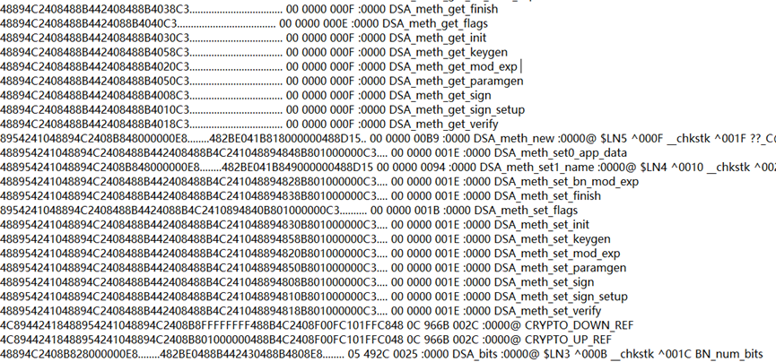

模式文件使用sigmake.exe可以将这些模式打包成签名文件（`.sig`），签名文件是一种特殊的二进制文件，需要处理完模式文件的排斥冲突（在模式文件中两个函数的模式相同，无法判断在签名文件中应该使用哪个函数），例如，**在上图中，一些函数的模式除了函数名称都相同**；

处理排斥文件之后，再运行sigmake.exe就会生成`.sig`的库函数签名文件。

#### IDA 自动匹配

* 反汇编时，IDA 读取可执行文件代码段；
* 对比指令序列与 `.sig` 文件中的模式；
* 一旦匹配成功，IDA 就将该函数重命名为真实库函数名，并标记为“外部库函数”，默认不会显示其反汇编代码。

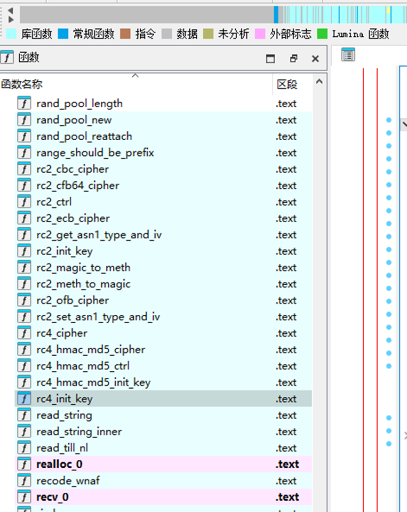

上图中的浅蓝色函数即为匹配成功并标记的库函数。

#### 结果

* 例如，`sub_1001` 可能会被替换为 `printf`；
* 识别出来的函数显示为灰色，减少分析干扰。

### 2、FLIRT使用说明

IDA 内置了一些签名文件，例如在IDA的`./sig`文件夹下有如下库信息，保存了一些常见的库函数签名文件，用于FLIRT加载函数签名进行函数匹配的流程。

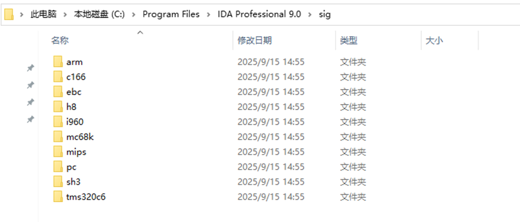

#### 使用方式：

1. 打开对应二进制文件并加载反汇编；
2. 菜单栏选择 **文件 → 加载文件 → FLIRT signature file**；

* 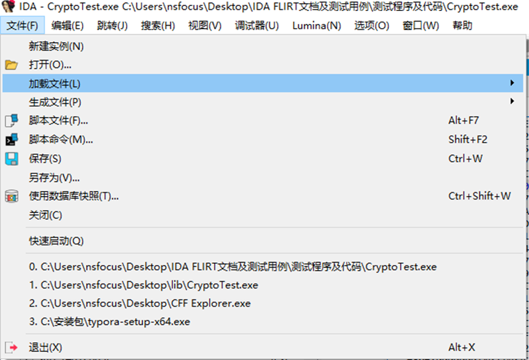

1. 选择 `.sig` 文件，确定；
2. 重新识别后，库函数会自动被替换名称。

可以在下图中的列表选择需要加载的对应库函数签名，也可以选择`Load SIG File`加载本地的其他库函数签名；

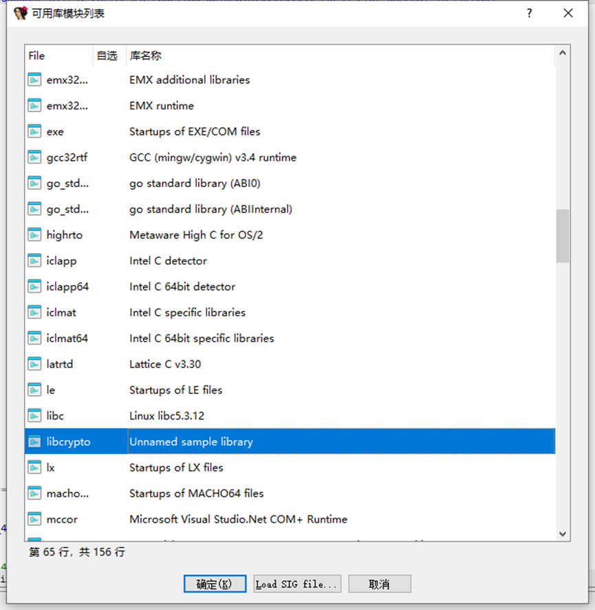

## 三、FLAIR工具解析外部库签名文件

#### 1、获取FLAIR工具集

安装 **FLAIR 工具集**（IDA 官方提供，通常在 `IDA/utils/flair` 下），也可以直接下载flair70/flair90等版本。

#### 2、获得静态库

可以使用VS编译出的静态库.lib或者其他已编译好的静态库，在编译的时候一定要选择debug方式进行编译，在生成PAT文件时，解析器主要根据符号进行分析，如果是release版本，由于可能被去除了符号，解析器将无法识别，并跳过相关函数。

#### 3、提取库函数模式

**Linux / ELF 静态库示例**

```
pelf libcrypto.a > libcrypto.pat
```

**Windows / COFF 静态库示例**

```
pcf libcrypto.lib > libcrypto.pat
```

**单个目标文件（.o）**

```
pobj libcrypto.o > libcrypto.pat
```

**说明：**

* `pelf` / `pcoff` / `pobj` / `par` 等工具会分析库文件内部的函数代码，忽略地址相关字节，生成 **模式文件（.pat）**。
* `.pat` 文件是文本格式，可以打开查看，里面记录了函数名、校验和、指令模式。

执行结果若如下，表示生成的模式文件.pat跳过了196个函数，生成了7900个函数模式

```
C:\Users
sfocus>pcf.exe libcrypto_Release.lib libcrypto_Release.pat
C:\Users
sfocus\libcrypto_Release.lib: skipped 196, total 7900
```

生成的如下图示的pat文件记录了函数起始字节序列，校验码，函数长度，名称等信息：

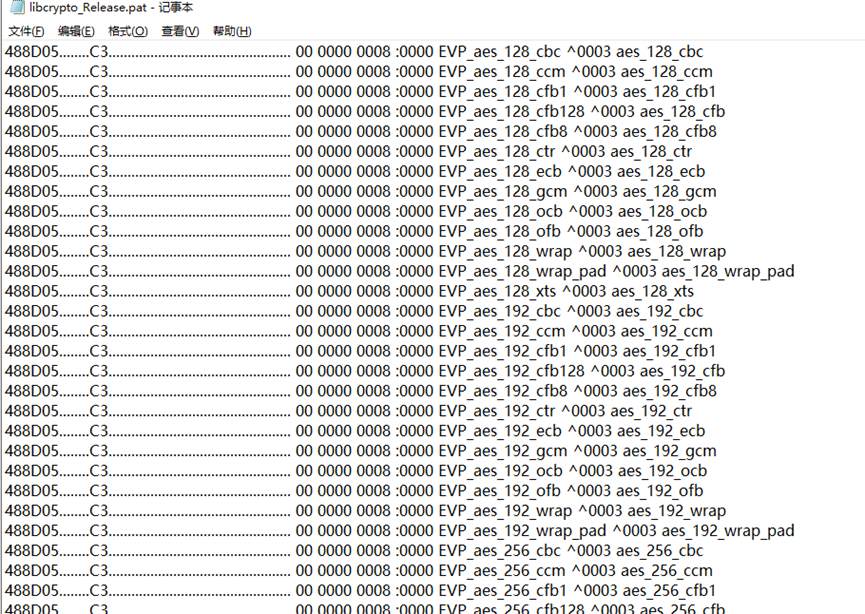

#### 4、生成签名文件

使用 `sigmake` 将 `.pat` 转换为 `.sig`：

```
sigmake.exe libcrypto.pat libcrypto.sig
```

如果需要调试或保留详细函数名：

```
sigmake.exe -n libcrypto.pat libcrypto.sig
```

生成的 `libcrypto.sig` 就是 IDA 能识别的签名文件。

如果生成的结果是`.exc .err`的情况，如下图所示，此时产生了冲突，也就是一些函数他的签名相近，在生成后无法分辨具体的函数情况；

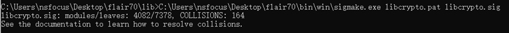

选择进入`.exc`文件，对冲突的函数进行编辑：

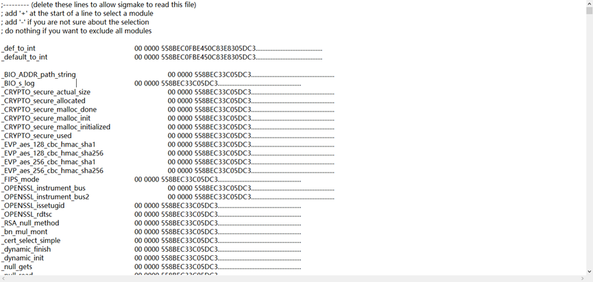

根据.exc文件的注释说明，如果在数据库中发现一个对应的签名，并且希望应用一个函数的名称，可以在该函数名称前附加一个`+`；如果希望在数据库中添加某个函数的注释，则在该函数名称前附加一个`-`；如果在数据库中发现对应的签名时，不应用任何名称，那么不需要添加任何符号。

进行对`.exc`文件的编辑之后，继续执行，如果依然生成\*\*.exc\*\*文件，在文件底部对相关函数重复上一步的操作。

```
sigmake.exe libcrypto.pat libcrypto.sig
```

重复该步骤直到生成`libcrypto.sig`，该文件是最终生成的该静态链接库的函数签名文件。

#### 5、在IDA中应用该签名文件

将生成的`.sig`文件放在`./IDA/sig`的文件夹下，此时，重新加载IDA程序，选择 **文件 → 加载文件 → FLIRT signature file**，发现生成的`.sig`文件已经存在函数签名列表中


如果找不到该签名，则重新选择Load SIG File加载函数签名文件。

加载sig文件完毕后，IDA会使用FLIRT模式匹配的方法，加载出对应的库函数信息。

#### 6、导入开源平台签名文件

我们可以使用开源平台的已编译好的标签文件，用于反汇编分析过程；

GitHub开源签名文件下载链接：

<https://github.com/Maktm/FLIRTDB>[GitHub - PlatyPew/ida-flirtdb: A collection of signature files for IDA](https://github.com/PlatyPew/ida-flirtdb/tree/master)

导入方法：将.sig文件放入`./IDA/sig`文件目录下，重新载入二进制文件，按照菜单栏选择 **文件 → 加载文件 → FLIRT signature file**的流程选择加载sig文件。

## 四、使用外部库分析流程

### 1、使用外部库创建样本EXE

选择静态库导入的方式，使用VS2019编译实例样本

（1）找到库文件位置，选择需要使用的库路径：

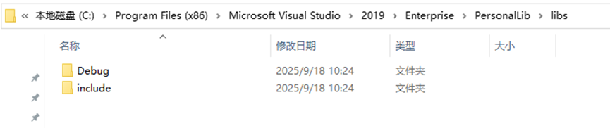

图中`include`文件夹是库使用所需头文件，debug文件夹存储静态库文件。

（2）打开Visual studio进入**项目属性**-**VC++目录**，在包含目录和库目录选项中分别添加路径（上一步的路径）

```
$(VC_LibraryPath_x64);$(WindowsSDK_LibraryPath_x64);C:\Program Files (x86)\Microsoft Visual Studio\2019\Enterprise\PersonalLib\libs\include;
$(VC_LibraryPath_x64);$(WindowsSDK_LibraryPath_x64);C:\Program Files (x86)\Microsoft Visual Studio\2019\Enterprise\PersonalLib\libs\Debug;
```

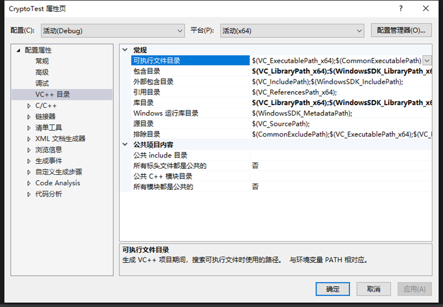

添加路径修改完后点击应用，在进入**链接器**-**输入**，添加静态库文件名；

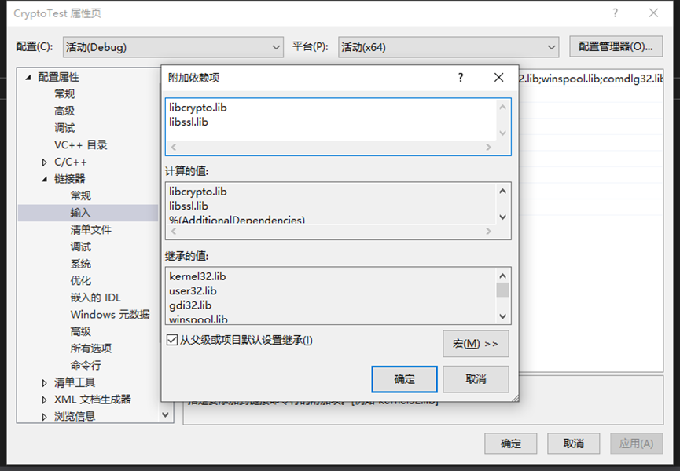

操作完毕此时可以正常添加头文件使用库了。

（3）创建带有加密函数的样本，使用一些加密函数编译出`exe`文件

实例代码如下：

```
#include <stdio.h>
#include <string.h>
#include <openssl/evp.h>
#include <openssl/rc4.h>
#include <openssl/sha.h>
#include <openssl/hmac.h>

#pragma comment(lib, "ws2_32.lib")

static void hex_print(const char* tag, const unsigned char* buf, size_t len)
{
    printf("%s: ", tag);
    for (size_t i = 0; i < len; ++i) printf("%02X", buf[i]);
    printf("
");
}
/* ----------RC4 流加密/解密 ---------- */
static void demo_rc4(void)
{
    const unsigned char key[] = "0123456789abcdef";          // 16 字节
    const unsigned char plaintext[] = "Hello RC4 Stream!";
    unsigned char ciphertext[sizeof(plaintext)];
    unsigned char decrypted[sizeof(plaintext)];

    RC4_KEY rc4_key;
    RC4_set_key(&rc4_key, sizeof(key) - 1, key);

    /* 加密 */
    RC4(&rc4_key, sizeof(plaintext) - 1, plaintext, ciphertext);
    hex_print("RC4 ciphertext", ciphertext, sizeof(plaintext) - 1);

    /* 解密（RC4 对称）*/
    RC4_set_key(&rc4_key, sizeof(key) - 1, key);            // 重新初始化
    RC4(&rc4_key, sizeof(plaintext) - 1, ciphertext, decrypted);
    printf("RC4 decrypted: %.*s

", (int)(sizeof(plaintext) - 1), decrypted);
}
/* ----------AES-256-CBC 加密/解密 ---------- */
static void demo_aes_cbc(void)
{
    const unsigned char key[] = "0123456789abcdef0123456789abcdef";
    const unsigned char iv[] = "1234567890abcdef";
    const unsigned char plaintext[] = "Hello AES CBC!";
    unsigned char ciphertext[64];
    unsigned char decrypted[64];
    EVP_CIPHER_CTX* ctx = EVP_CIPHER_CTX_new();
    int len, cipher_len, plain_len;
    /* 加密 */
    EVP_EncryptInit_ex(ctx, EVP_aes_256_cbc(), NULL, key, iv);
    EVP_EncryptUpdate(ctx, ciphertext, &len, plaintext, sizeof(plaintext) - 1);
    cipher_len = len;
    EVP_EncryptFinal_ex(ctx, ciphertext + len, &len);
    cipher_len += len;
    hex_print("AES-256-CBC ciphertext", ciphertext, cipher_len);
    /* 解密 */
    EVP_DecryptInit_ex(ctx, EVP_aes_256_cbc(), NULL, key, iv);
    EVP_DecryptUpdate(ctx, decrypted, &len, ciphertext, cipher_len);
    plain_len = len;
    EVP_DecryptFinal_ex(ctx, decrypted + len, &len);
    plain_len += len;
    printf("AES-256-CBC decrypted: %.*s

", plain_len, decrypted);
    EVP_CIPHER_CTX_free(ctx);
}
/* ---------- SHA-256 摘要 ---------- */
static void demo_sha256(void)
{
    const unsigned char msg[] = "Hello SHA-256";
    unsigned char md[SHA256_DIGEST_LENGTH];
    SHA256(msg, sizeof(msg) - 1, md);
    hex_print("SHA-256 digest", md, sizeof(md));
    printf("
");
}
/* ---------- HMAC-SHA256 ---------- */
static void demo_hmac_sha256(void)
{
    const unsigned char key[] = "secretkey";
    const unsigned char msg[] = "message to authenticate";
    unsigned char mac[EVP_MAX_MD_SIZE];
    unsigned int mac_len;
    HMAC(EVP_sha256(), key, sizeof(key) - 1, msg, sizeof(msg) - 1, mac, &mac_len);
    hex_print("HMAC-SHA256", mac, mac_len);
    printf("
");
}
/* ---------- main ---------- */
int main()
{
    demo_rc4();
    demo_aes_cbc();
    demo_sha256();
    demo_hmac_sha256();
    return 0;
}
```

编译得到`CryptoTest.exe`。

程序运行结果：

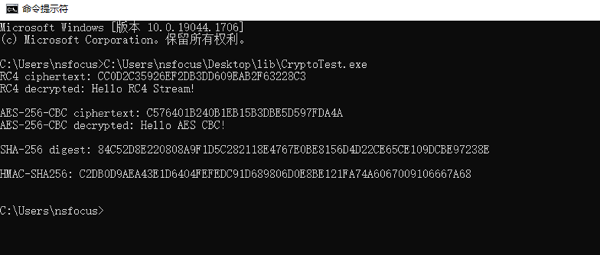

### 2、根据标签文件解析EXE中的函数

此时，在不包含.sig文件的情况下，发现无法解析出使用的库函数

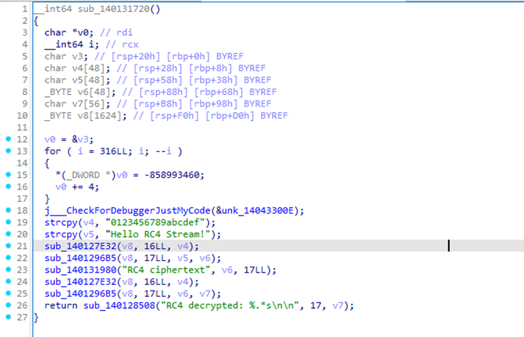

选择手动加载的方式，加载.sig文件用于函数分析：

使用FLAIR工具，生成对应的sig文件

```
pcf libcrypto.lib  libcrypto.pat

sigmake.exe -n libcrypto.pat libcrypto.sig
```

选择将生成的sig文件放入IDA的`sig`文件目录下，进入IDA，点击文件选择确定

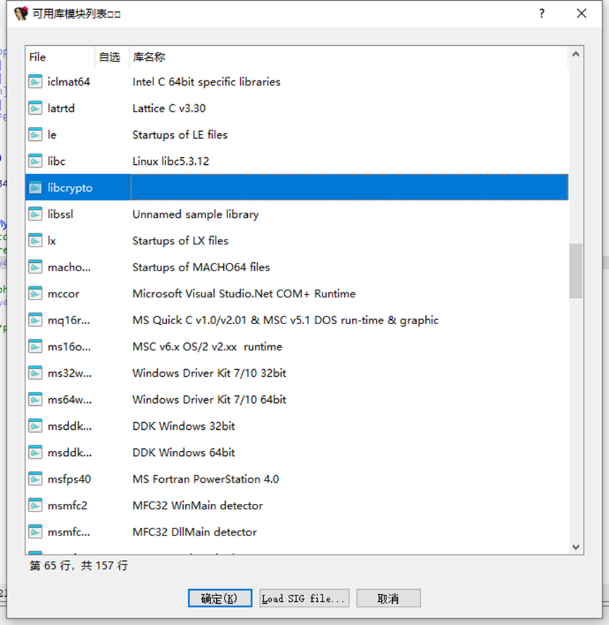

此时的IDA会根据函数标签，解析出库函数的具体函数名及信息，便于我们继续逆向操作：

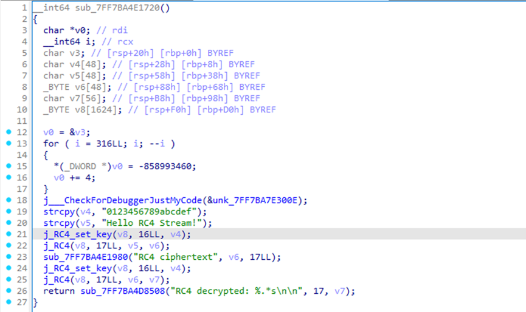

例如，我们现在可以看到RC4这一加密函数的具体信息，而不用再对该函数进行进一步的反汇编分析。

如果依然存在一些函数无法识别，可以考虑退回到生成sig文件的步骤，选择手动处理冲突，针对高频出现并且明确的函数，也可以选择自己写上函数的注释相关信息。

## 五、总结及注意事项

* IDA Pro支持使用FLIRT插件对已知常用的库函数二进制代码进行修饰，节省分析时间。
* 自行生成签名文件时，尽量使用**调试版本（Debug）**的静态库。发布版本（Release）的库通常被优化且去除符号，解析器无法提取有效的函数模式。对于一部分release版本的静态库，如果保留了符号信息，也可以被解析为有效的函数签名。
* 需要根据静态库的格式（COFF, ELF, OMF）选择正确的 FLAIR 解析器。
* 需要根据sigmake程序的生成结果，选择对需要保留的函数信息进行注释，在操作过程中需要保证生成的.sig标签文件无冲突。
* 由**.pat生成的.exc**文件可以删去注释后不做处理，此时所有的冲突函数都会在标签文件中被忽略。

> 附件：

插件支持的编译器以及库

**Supported C Compilers**

* Aztec C v3.20d
* Borland C++ for OS/2 v1.0, v1.5, v2.0
* Borland Turbo C v2.0, v2.01
* Borland Turbo C++ v1.01
* Borland C++ v2.0, v3.1, v4.0, v4.5, v5.0, v5.01
* Borland C++ Builder v1.0
* Borland C++ Builder v3.0
* EMX (GCC) for OS/2 v0.9b
* IBM C Set v2.00, v2.10
* IBM Visual Age C++ v3.0 OS/2
* Lattice C v3.30
* Metaware High C for OS/2
* Microsoft C v5.0, v6.0, v7.0 Microsoft Quick C v1.0, v2.01
* Microsoft Visual C++ v1.0, v1.5, v2.0, v4.0, v4.1, v5 and v6
* NDP C v4.2
* Optima v1.0
* Symantec C++ v6.0, 6.1, 7.2
* Texas Instruments C Compiler for TMS320C6
* Visual Age C++ v3.0
* Visual Age C++ v3.5
* Watcom C++ v9.01d, v9.5, v10.0,
* v10.0b, v10.5, v10.6
* Watcom for QNX
* Zortech C v1.0, v3.1
* Microsoft Visual C++ v7, 8 (Microsoft.NET)
* Microsoft 64-bit Visual C++ AMD64
* Microsoft Visual C++ for Windows CE v3-4.2 on ARM
* Borland C++ Build v1-6
* GNU C compilers on various platforms

**Supported Libraries**

* Microsoft Foundation Classes
* Borland 5.0x MFC adaptation, Borland Visual Component Library
* CTask
* SDK CAB Library
* Vireo Libraries Borland Edition and MicroSoft Edition
* Object Toolkit Pro
* Windows CE libraries
* Keil runtime libraries for C166
* C runtime library for I960
* C runtime for TMS320C6
* Borland 6.0x Visual Component Library

> 参考文档：

[IDA F.L.I.R.T. 技术：深入 Hex-Rays 文档](https://docs.hex-rays.com/user-guide/signatures/flirt/ida-f.l.i.r.t.-technology-in-depth)

[符号表恢复  Antel0p3's blog](https://antel0p3.github.io/2023/08/12/symbol-restore/)

[IDA FLIRT使用 - Bl0od - 博客园](https://www.cnblogs.com/zUotTe0/p/12729390.html)
