# 某edu的渗透测试-先知社区

> **来源**: https://xz.aliyun.com/news/19299  
> **文章ID**: 19299

---

本文章中所有内容仅供学习交流，严禁用于商业用途和非法用途，否则由此产生的一切后果均与文章作者无关。

## 前言

写的比较粗糙，希望师傅们多多指教。

## 案例一

开局就是一个统一身份认证，非常温馨的给我提示了登录规则直接事半功倍。

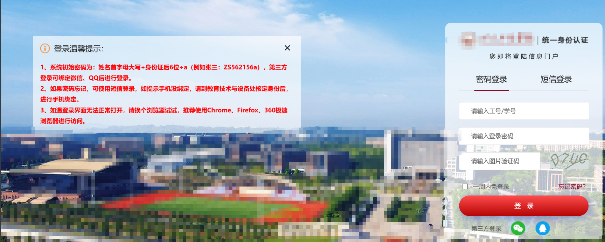

简单的使用google语法来收集两个学号，账号是学号密码规则中的两个部分都已经透露了，就只差一个sfz直接使用魔法。


成功找到了账号登录进去进行测，先找找这个鉴权平台有没有一些可以利用的信息。

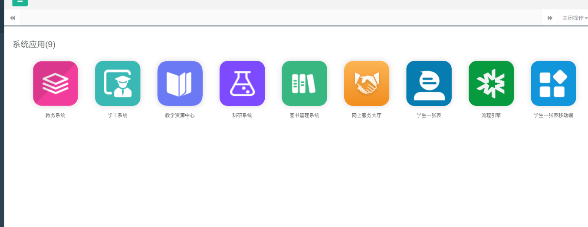

其中/uap应该是平台的功能接口，简单的fuzz一下看看有没有未授权或者是信息泄露什么的。

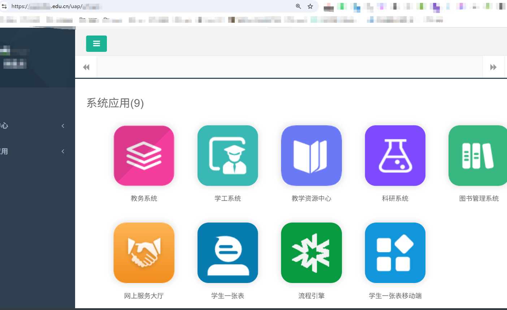

fuzz出了一个druid的未授权。

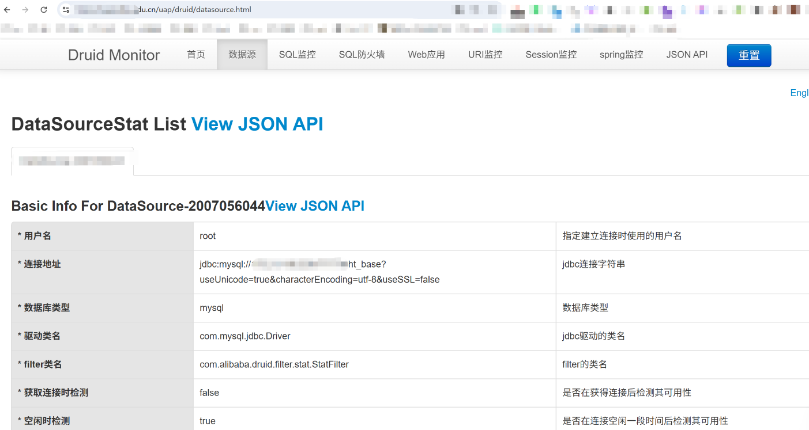

先交再说，低危一个。


## 案例二

这里看到一个非常诱人的接口，直接拼接上去看看效果。

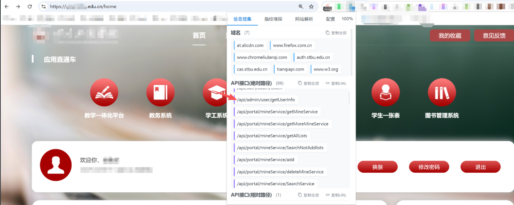

哎呦感觉有点东西。

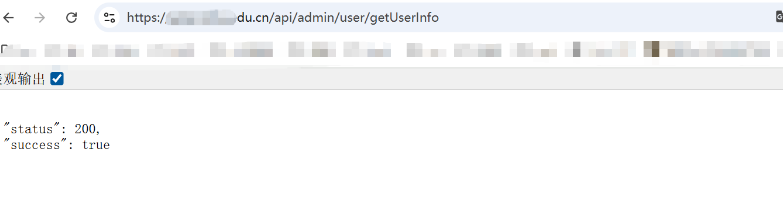

先删一节再说看看报错，这个报错是不是很熟悉，Springboot的报错。

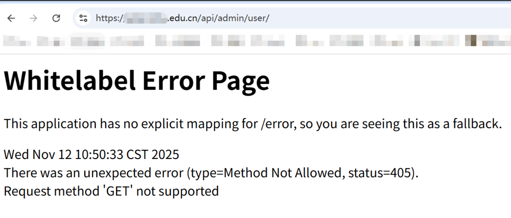

个人判断这个接口肯定有东西我拼接get和post都拼了一个遍，都没有出货，没招了太菜了。

这个是我个人收集的一些常见的参数，大家可以参考一下。

```
?page=1&limit=10000 
?page=1&page_size=100
?pageSize=10
?pageNum=1
?pageNo=1
```

掏出我祖传的字典，冲锋一手，完了以后发现全是404。

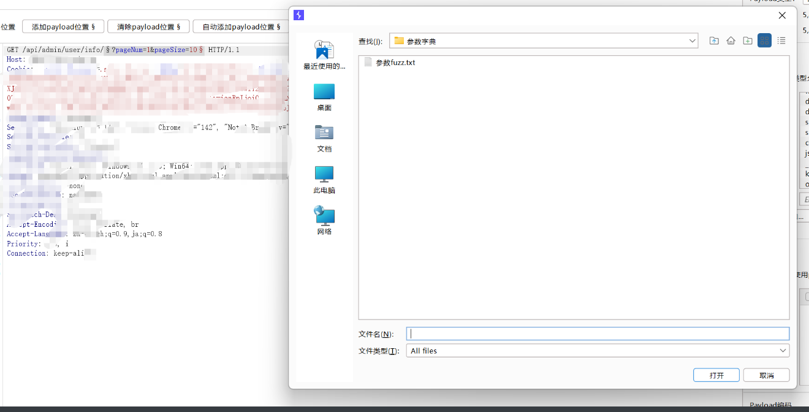

把info加上继续fuzz。

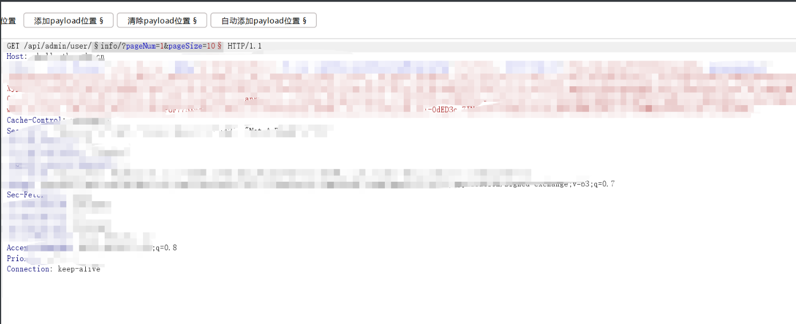

果然终于出东西了。

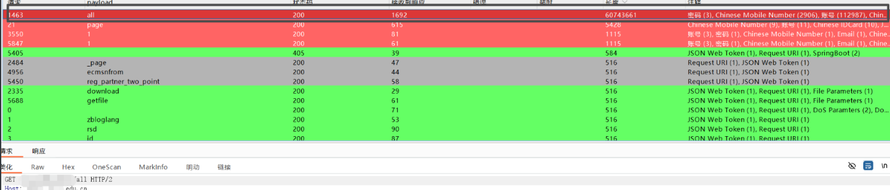

在前端进行访问内容过于敏感就直接厚码，太敏感了。

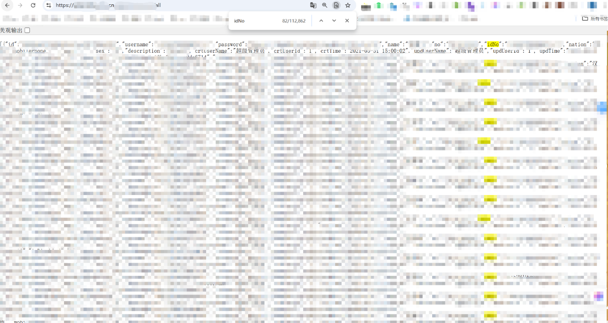

直接交，高危拿下。


## 案例三

那么多功能点肯定还有洞，随机挑一个测测看


有一个在校基本信息，先抓个包看看，圈起来的地方返回了sfz和xh，响应包中那么多id一看就肯定有越权，返回包中标识了是那个id返回的值，直接在响应包中对应的修改

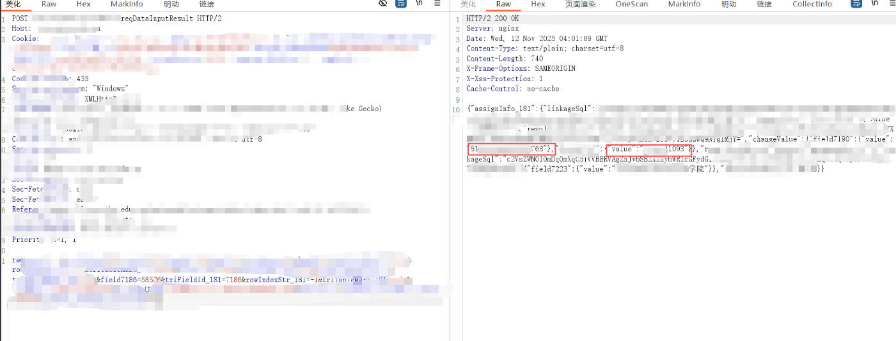

对fieid进行修改发现响应的值发生了变化确定存在越权。

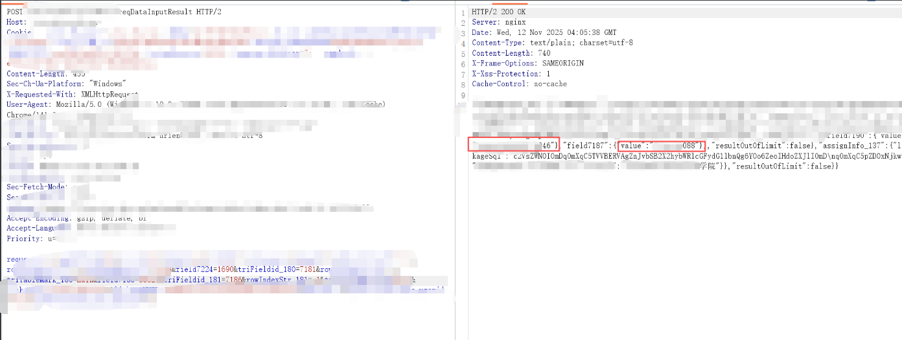

这个时候就直接进入intruder模块来确定泄露的数据量有多大。其中field7186=58521&triFieldid\_181=7186两个id任意变化一位都会发生变化就直接设两个payload来跑，泄露量估计在10w+

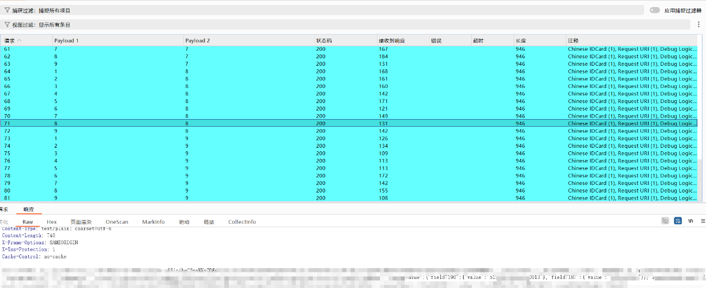

也是直接交报告，拿下高危。

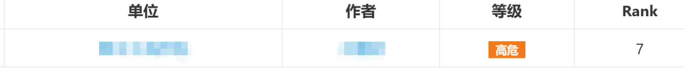
