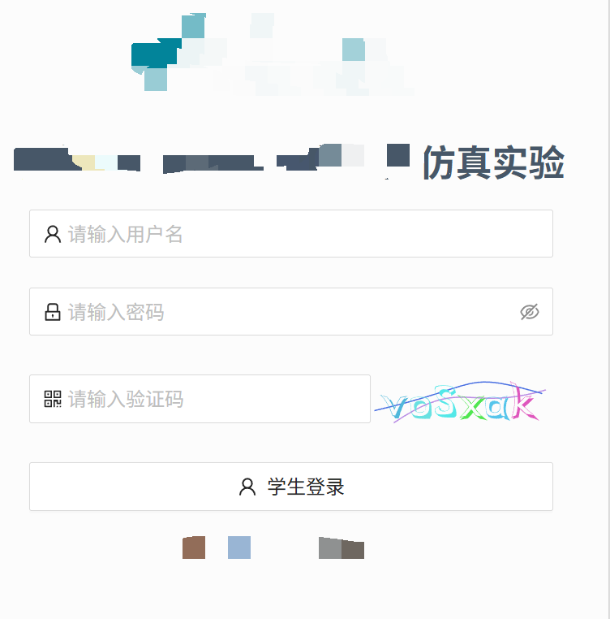
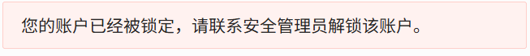
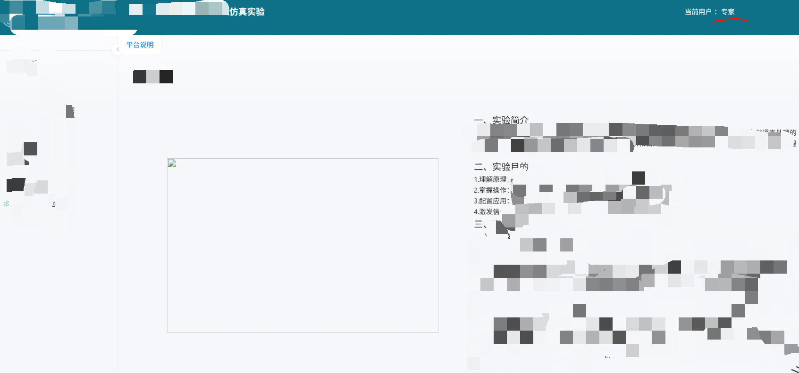
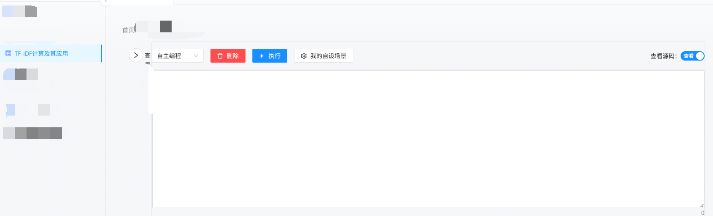
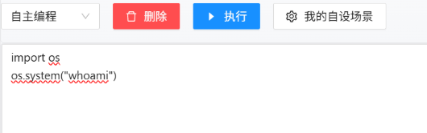
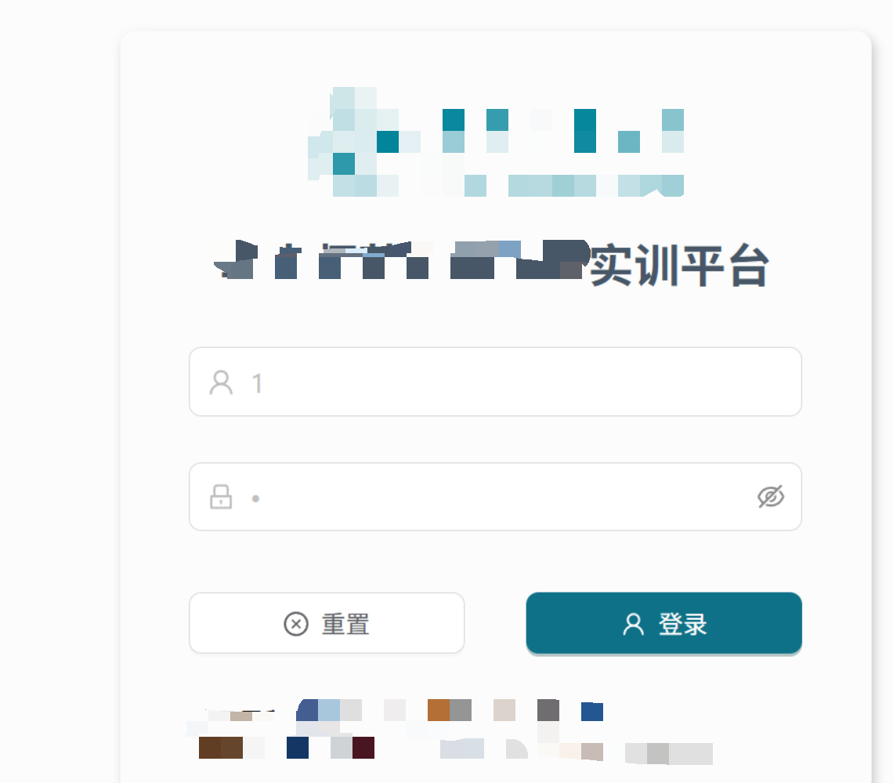
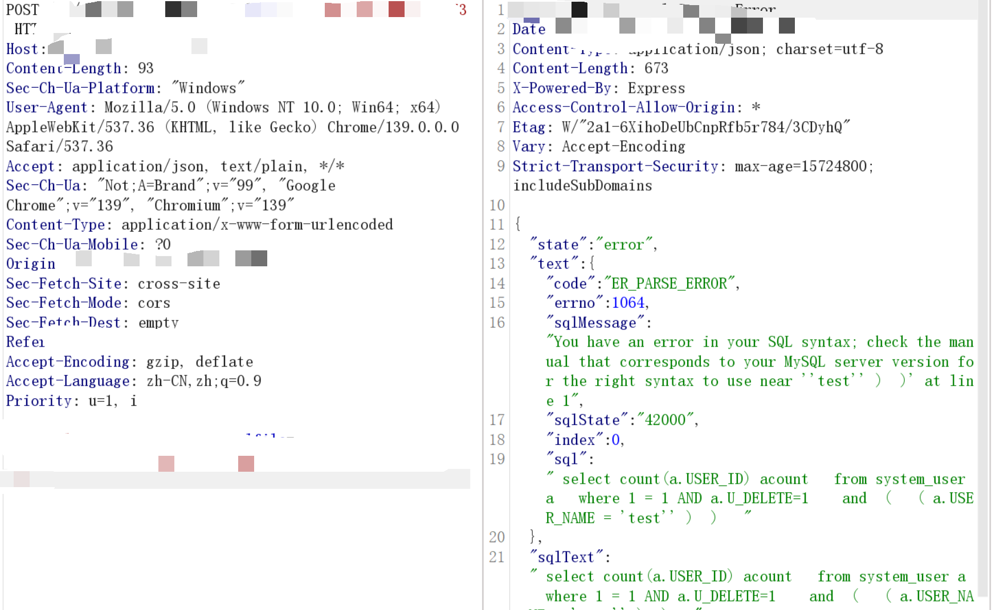
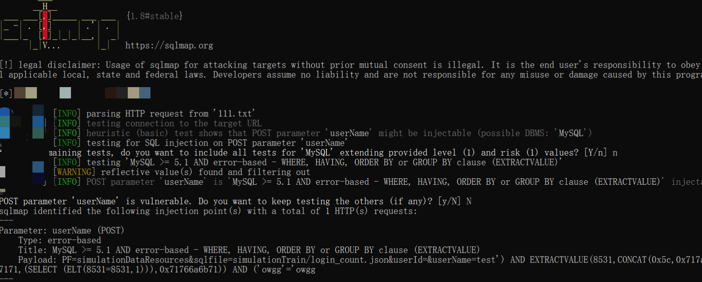
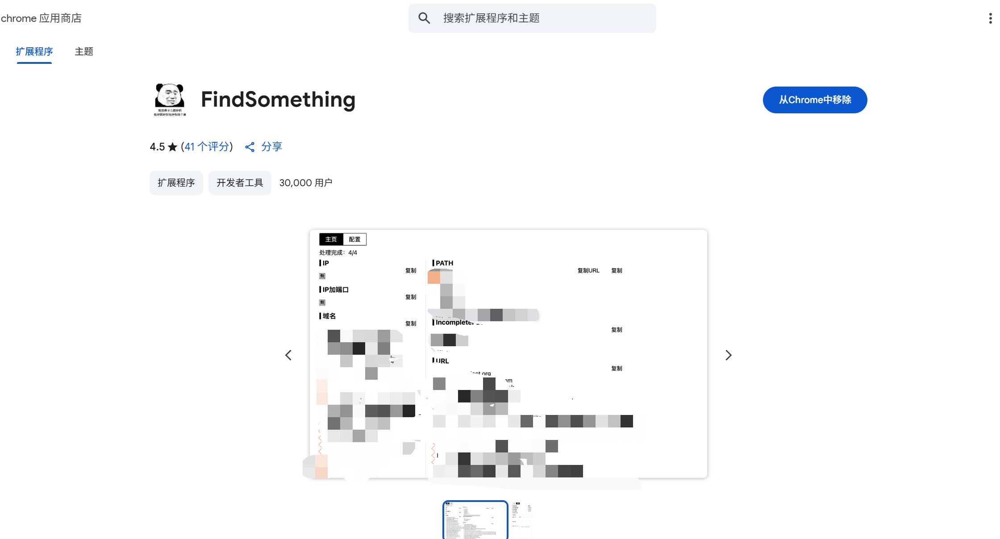
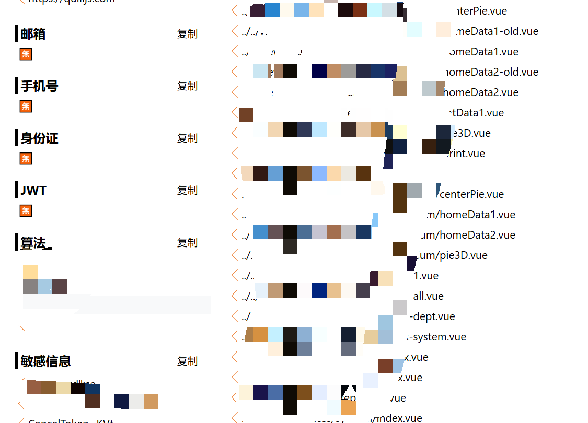

# 从js泄露敏感信息到命令执行再到旁站sql注入-先知社区

> **来源**: https://xz.aliyun.com/news/19302  
> **文章ID**: 19302

---

## 前言

各位师傅在测试登录框站点的时候，肯定都会尝试是否存在弱密码

当弱密码不存在的时候可能就直接走人下一个了

这时我们可以尝试翻找一下前端js文件中是否泄露敏感信息

没准就有平台的默认密码呢

## 资产搜集

首先通过fofa找到某学校实验平台

fofa语法是:title:"仿真实验"&&title="大学"



经典登录框开局，并且没有其他的功能点

只有一个简单的登录框

我们依然是尝试一下是否存在弱密码



看来这个站点之前也被人打过了

## 翻找js文件中的敏感信息

我们这个时候尝试去前端js文件里面看看有没有泄露些什么敏感信息

按下f12进入调试工具

点击源代码翻找js文件

并搜索password username等关键词


当我选中其中一个js文件的时候直接就跳出来账号密码

一开始我也是比较吃惊

怎么开发直接把账号密码给放到前端了呢

我拿着这个账号密码去登录



登录成功

显示专家用户，成功接管平台

看来在上线前，开发人员忘记掉把这个测试账号给删除掉了

## 命令执行

现在开始尝试站点中的每个功能点

当我点击这个功能点的时候看到了自主编程



猜测这个平台可能直接把主机的python功能给放到前端来给学生做实验了

那么这个时候直接写上系统命令尝试执行




成功回显root

至此成功从js到命令执行

## 旁站sql注入

到这里我就想：开发这么疏忽,是不是旁站也有可能有其他洞呢

于是通过fofa的ip扫描找到了另一个站点

fofa语法:ip="网站ip"



这里已经尝试过并不存在弱密码

我偶然间的一次抓包发现存在sql的调试信息



居然直接显示报错信息了

那这里就很有可能存在报错注入了

我们使用一下sqlmap工具

我们将数据包保存到笔记本中

我们已经知道存在报错信息和数据库类型

那么直接使用以下sqlmap命令，可以让sqlmap跑的更快一些

```
sqlmap.py -r 111.txt -p userName --technique=E --dbms=mysql --current-user
-p 参数名
--technique=E  #选择报错注入
--dbms=mysql   #选择mysql数据库
--current-user #爆出当前数据库的用户名
```



成功注入出当前数据库的用户名


至此我们完成了从js泄露到命令执行再到旁站sql注入的渗透全过程了

## 总结

当我们遇到登录框的时候往往会尝试弱密码，当弱密码无果后可能会疏忽掉一些遗留在js文件中的敏感信息，其次数据包中具体内容也有可能大有乾坤

时常去翻找一下js文件，这是个很好的习惯，没准就可以带来意想不到的收获

打开bp看看之前数据包的具体情况也是一个好习惯，没准前端就可能直接把敏感信息甩到你的脸上

关于js文件中的信息搜集我这里推荐一个插件FindSomething

我们可以直接在谷歌商城中下载这个插件



每当挖掘一个站点之前就可以先看看这个插件里面是否搜集到了一些有用的信息



不仅是敏感信息，他还可以搜集网站的接口信息，没准就存在未授权访问

## 叠甲环节

文章来自作者日常积累，未经许可严禁转载，转载需联系本人。文中内容仅限学习交流，严禁用于商业及非法用途，涉及网络安全相关未经授权不得测试，违规使用后果自负，与作者及本文无关 。（都别乱搞哈）
