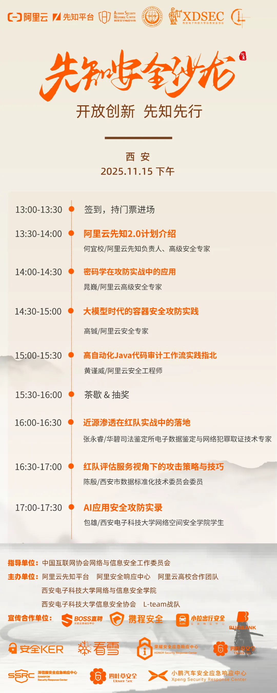

# 先知安全沙龙 - 西安站 11月15日开启！-先知社区

> **来源**: https://xz.aliyun.com/news/19305  
> **文章ID**: 19305

---

**阿里云先知灯塔系列城市安全沙龙第十一场-西安站**将于11月15日在西安电子科技大学南校区办公楼210报告厅举办。

本次沙龙在**中国互联网协会网络与信息安全工作委员会**的指导下**，由阿里云先知平台、阿里安全响应中心、阿里云高校合作团队、西安电子科技大学网络与信息安全学院、西安电子科技大学信息安全协会、L-team战队**联合举办，邀请西安多所高校网络安全相关专业师生和多名网络安全行业大咖、社会精英白帽子，旨在为学生和网络安全从业者提供面对面交流的机会，是一次纯粹的技术交流和分享！

除了干货满满的议题分享，我们还为每一位到场的、热爱安全技术的同学和白帽们准备了一份惊喜好礼。**以礼会友，共享技术盛宴，**在思维碰撞与灵感交流中深化对网络安全的理解与实践。期待大家在沙龙轻松愉快的氛围中收获知识、友好交流！如有意向参加可加入钉钉群了解活动详情，“先知安全沙龙·西安站2025”群的钉钉群号： 156805005468。

活动报名表链接：https://survey.taobao.com/apps/zhiliao/nyf3oORTd

为保障学生出行安全，报名人数较多的院校我们会**安排巴士往返免费接送**，具体接驳地址会在钉钉群内发布，欢迎同学们组队报名。11月15日，我们西安见～
