# 2025湖南省程序设计网络攻防线下赛部分赛题-先知社区

> **来源**: https://xz.aliyun.com/news/19328  
> **文章ID**: 19328

---

## 简单总结一下赛题和当时的比赛情况

本次比赛多了一个打靶机并修复靶机源码的部分

其他的题目就是正常ctf题目

这次比赛主要拿分的点就是修复靶机源码，misc，web

逆向题是go逆向，当时全场没人写出来，后面有师傅在群里面复现写出来了

pwn题就只有一个队伍写出来

密码题到了后面也陆陆续续写出来了

这次比赛还发面包吃了，挺好的

## 小小吐槽一下

当时打靶机的时候环境非常的卡，点开一个页面都要等很久，有点搞心态

还有就是修复靶机的时候，比赛前期上传的修复文件还可以在平台检测，到了后期就直接不能检测了，一直卡在那个检测的地方，重新上传也传不了，导致很多队伍都卡在那里，也是很搞心态，差不多1个多小时之后才修好了平台问题，然后比赛延迟了半个小时，后面就可以正常上传检测了

在修复部分，题目没有提示具体漏洞的问题，导致找到了漏洞也不知道该交到哪个题目上，只能一个一个试，而且还限定了提交次数为10次，这里大家应该都是一个一个试的（但是题目提示的话感觉就直接告诉选手哪里有洞了。。。）

## web-login

打开是一个登录框

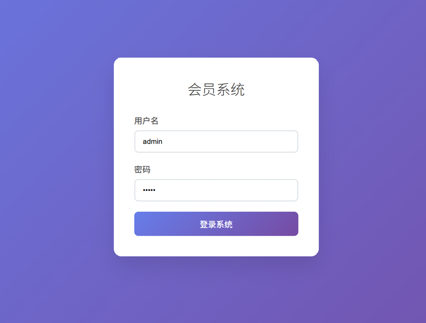

测试弱密码，admin:admin并抓个包看看情况

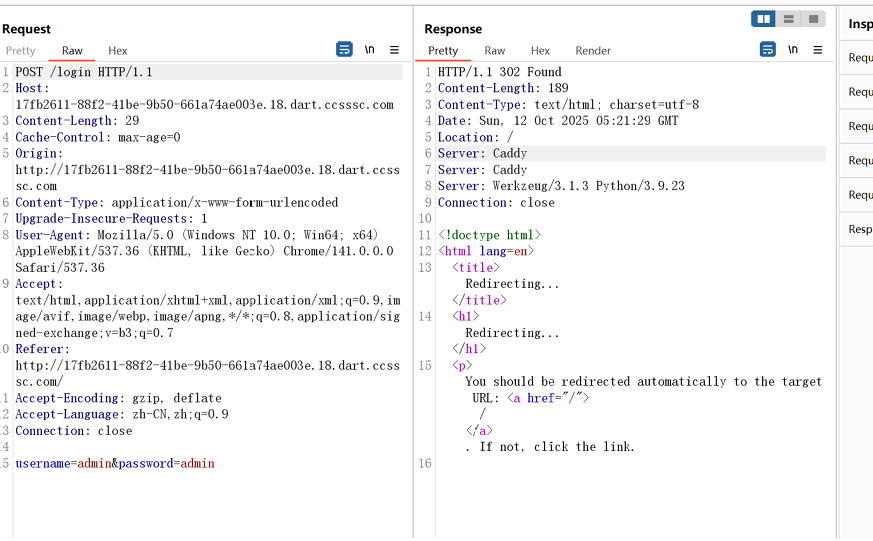

提示我们密码错误

但是响应包中Server字段中的Caddy很可疑，猜测是用户名或者密码

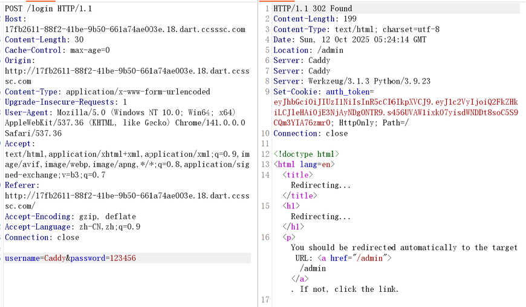

登录成功并且给了我们jwt

响应包中有个/admin路由

我们去访问一下

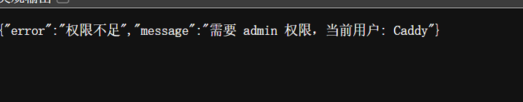

提示权限不足，需要admin权限

我们使用fscan工具（无影）去爆破一下jwt的key

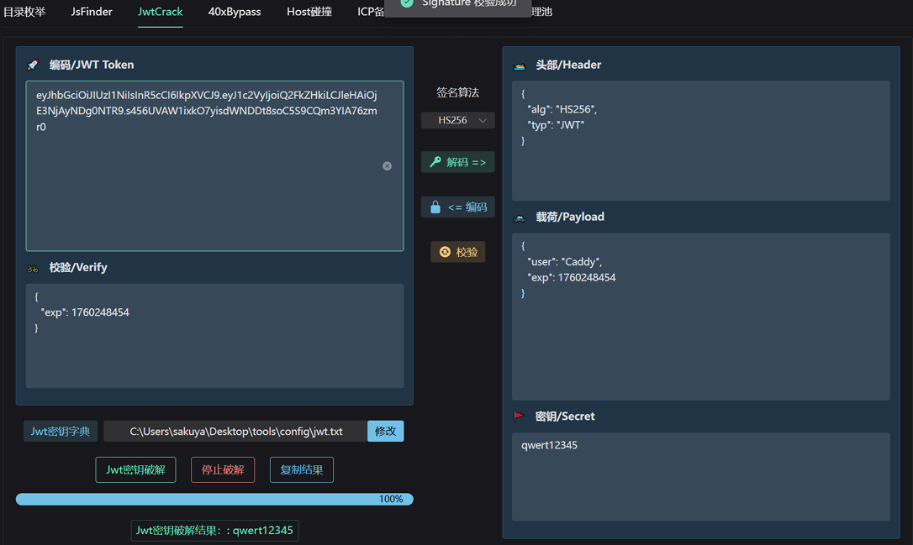

爆破完成，成功获得密钥

现在只要修改user为admin即可

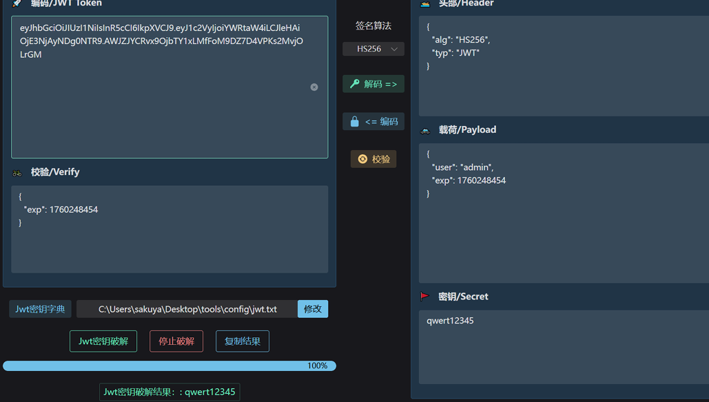

把此时的jwt放到数据包的token里面并访问

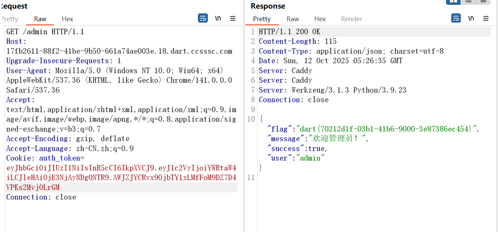

成功拿到flag

（当时我忘记了无影还有破解jwt密钥的工具，导致花了好长时间）

## misc-pdf

这题比较简单

把文件拖到记事本找到第1部分

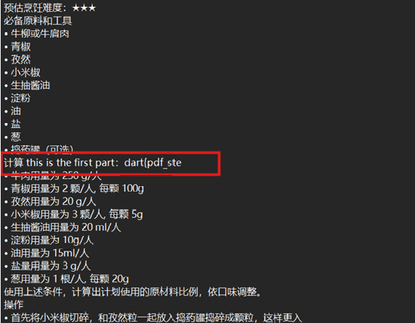

使用strings找到第2部分

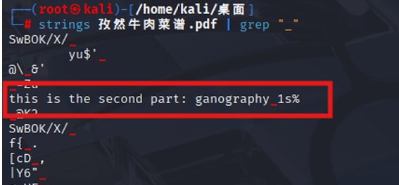

使用foremost提取出一个pdf文件并打开，找到第3部分

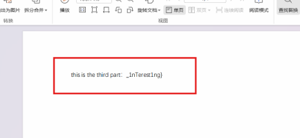

成功拿到所有flag

## awd-cat shop

访问题目url

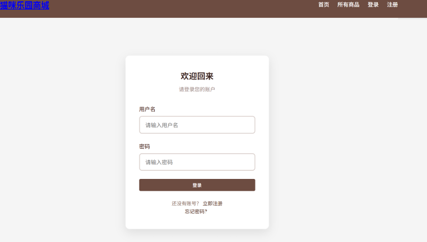

登录框开局

当时也没测弱密码，就注册了一个账户然后一直在里面测

其实这里有弱密码admin:admin123，后面getshell会用到

随便注册一个账户

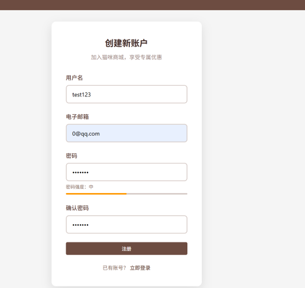

点击首页中的所有商品

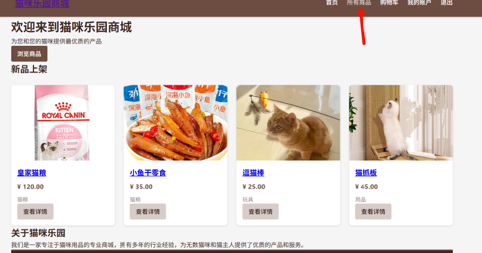

存在搜索框于是尝试sql注入

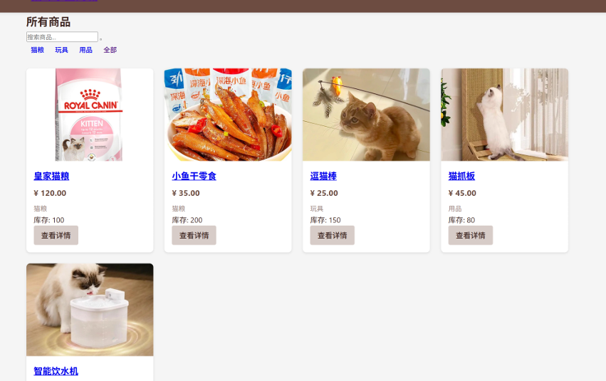

参数为search，先丢一个单引号试试

```
search=1'
```

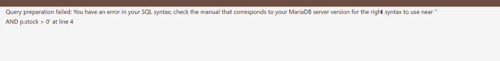

存在报错信息，可能有报错注入

```
search=' and updatexml(1,concat(0x7e,database(),0x7e),1)%23
```

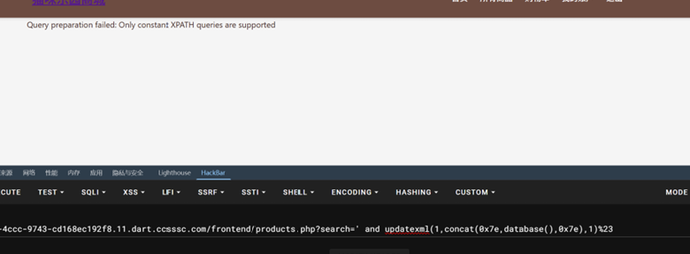

发现不成功

于是尝试union联合注入

```
serach='union select 1,3,4%23
```

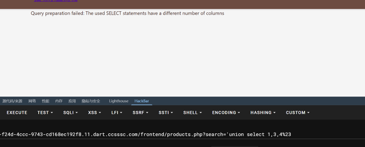

提示我们的字段数不对

看来可以实现union联合注入

```
serach='union select 1,2,3,4,5,6,7,8,9%23
```

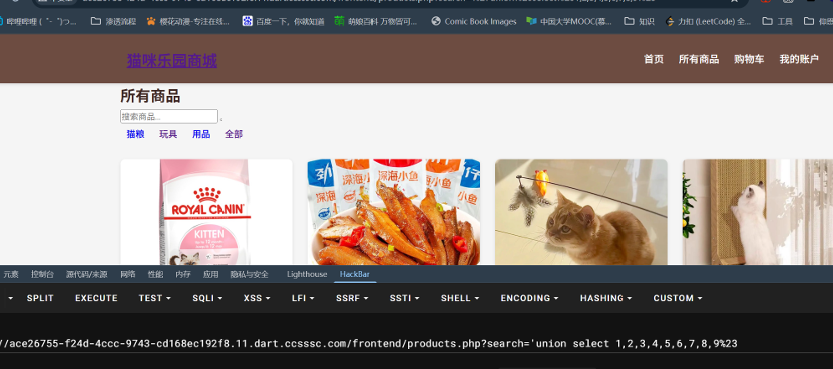

```
serach='union select 1,2,3,4,5,6,7,8,9,10%23
```

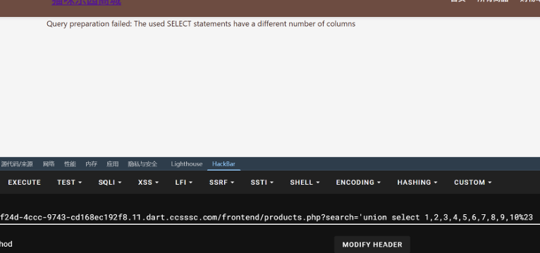

当字段数为9的时候正常回显了，现在可以开始注入了

尝试load\_file()函数

```
serach='union select 1,2,3,4,5,6,7,8,load_file('/etc/passwd')%23
```

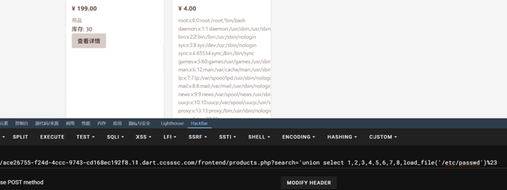

成功读到文件

直接读flag先交了再说

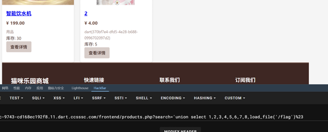

成功读到flag

（getshell和下载源码部分当时没截图）

现在只是读到flag了，还没getshell

登录界面尝试弱密码admin:admin123

成功登录

记得当时就直接有个文件上传的地方我们可以直接上传一句话木马

然后连上去就可以把源码都下载下来了

## fix1

第一个漏洞点在index.php文件里面

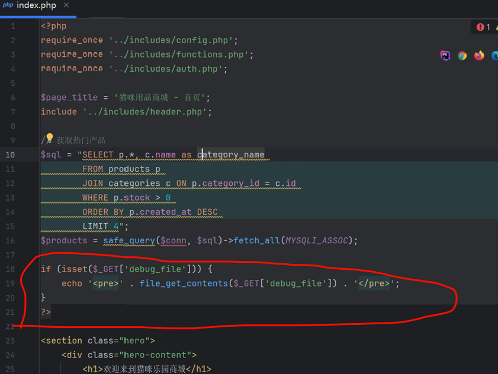

圈出来的地方会导致任意文件读取，可能会使得getshell

把这里删掉就可以了

## fix2

在源码中的view\_product.php文件有sql注入

没有对输入的内容做过滤

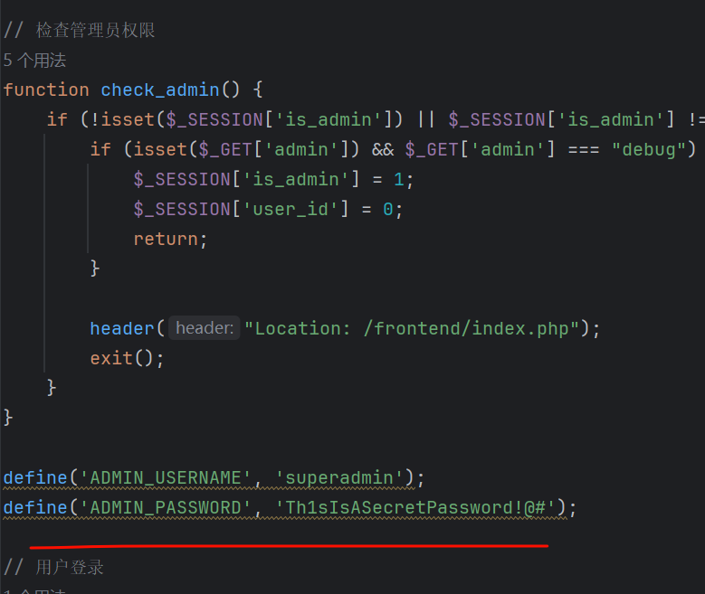

加一个intval() 强制转换为int就过了

```
$id = intval($_GET['id']);
```

## fix3

源码中的auth.php文件中存在硬编码账号密码

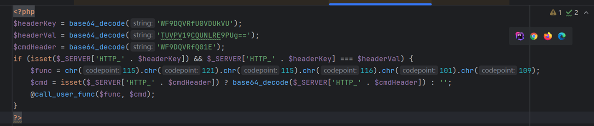

把此处内容删去即可

## fix4

上传处没有做严格过滤，可以上传php文件

处理一下过滤机制就可以了

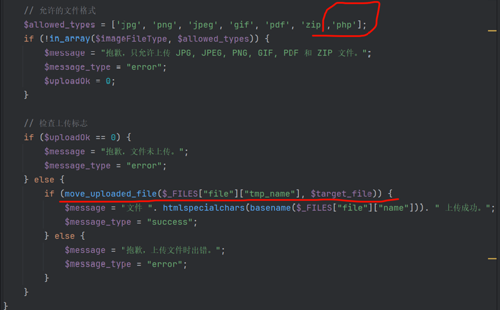

随便写了一个长判断然后就过了

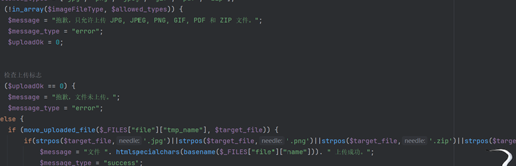

## fix5

源码中存在后门文件

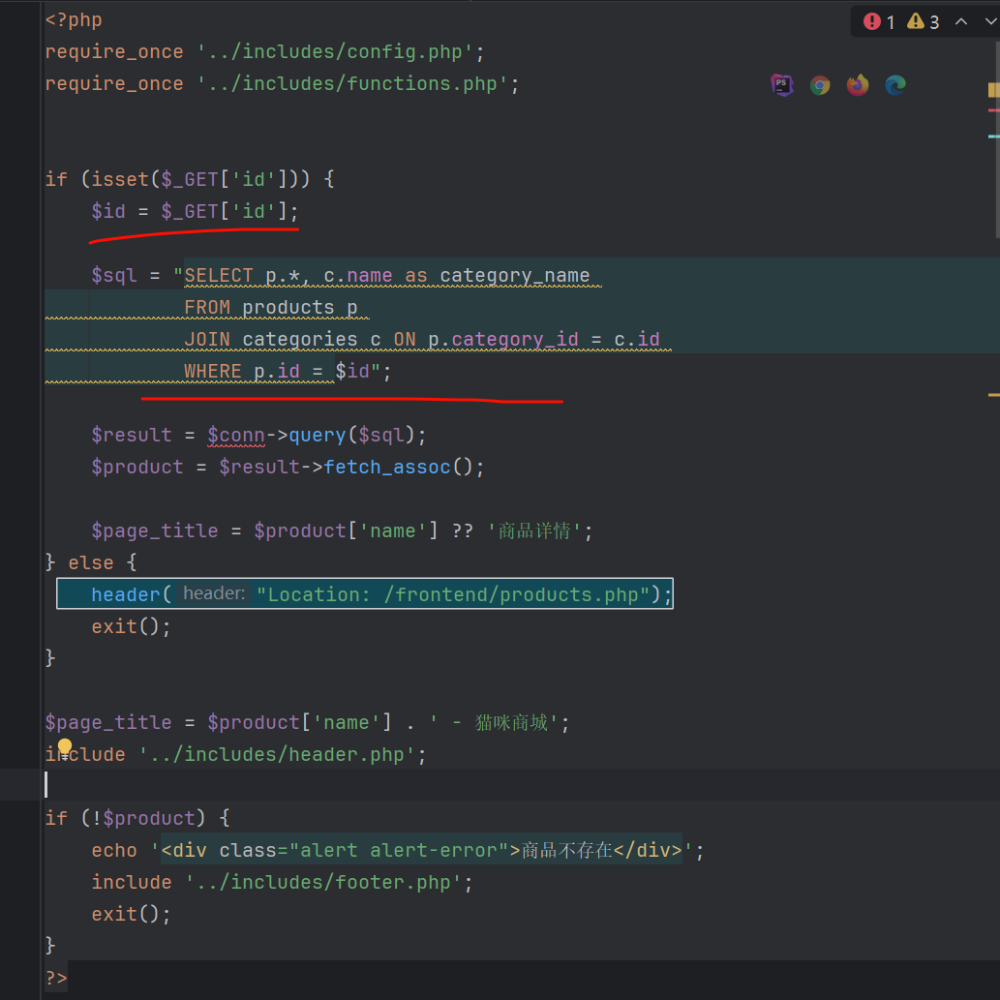

我们只要把里面的内容都给去掉就行
