# 如何利用AI对混淆js逆向分析还原加密逻辑-先知社区

> **来源**: https://xz.aliyun.com/news/19333  
> **文章ID**: 19333

---

F12打开

搜索encrypt定位到这里，看名称猜测是创建加密器的

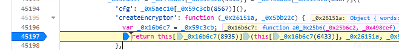

打印这两个变量看看是传入什么东西来判断采用的是什么加密形式

\_0x26151a, \_0x5bb22c

一个传入的是一组数组

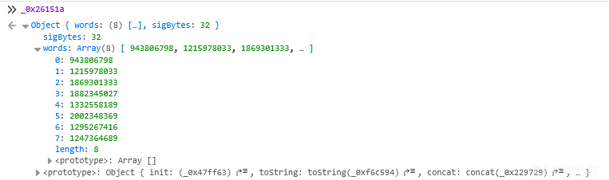

另一个是一个类，但是看到有iv，也是数组的形式

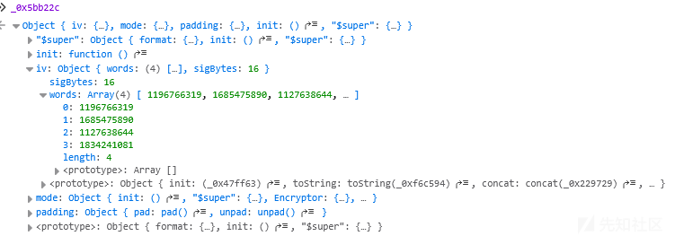初步猜测为aes加密形式，传入的参数一个是key,另一个是包括iv和加密模式，填充模式的类

多次发包发现这两个数组的值是固定不变的，推断是固定的iv和key

将获得的数组丢给ai分析出字符串

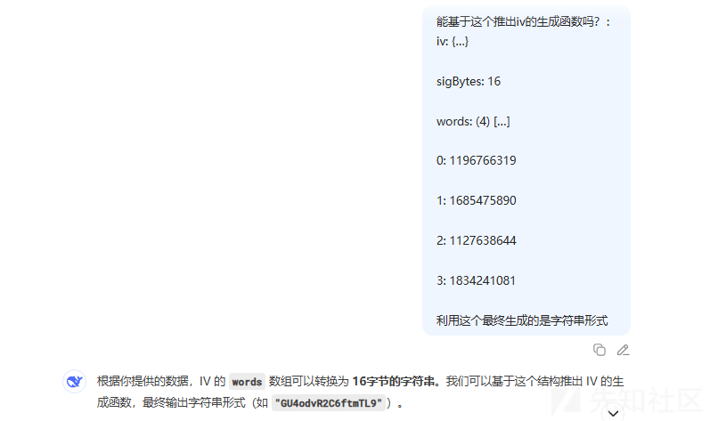

```
真正的实现函数长这样：
def words_to_bytes(words):
    return b''.join(word.to_bytes(4, 'big') for word in words)
key_words = [
    943806798, 1215978033, 1869301333, 1882345027,
    1332558189, 2002348369, 1295267416, 1247364689
]
key = words_to_bytes(key_words)
```

这样我们就拿到了key和iv了，接下来我们要确定加密的模式是什么

单步调试函数一步步进来到这个地方

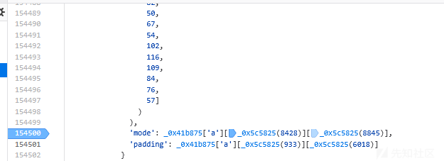

这里我们就可以打断点去看mode和padding的值

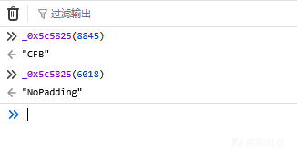

这个函数生成加解密的key和iv

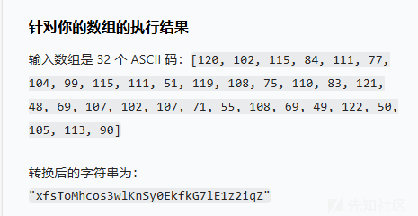

加密：

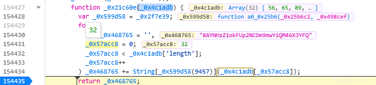

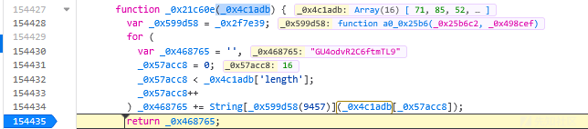

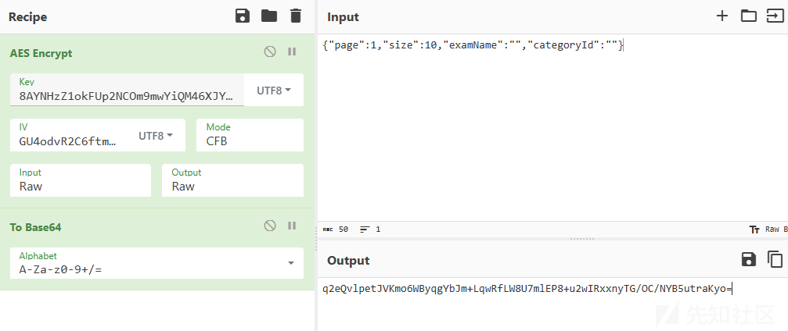

解密：

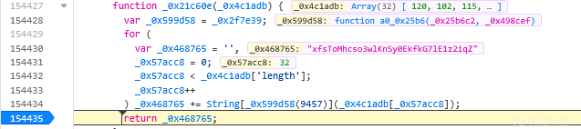

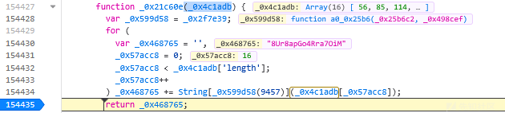

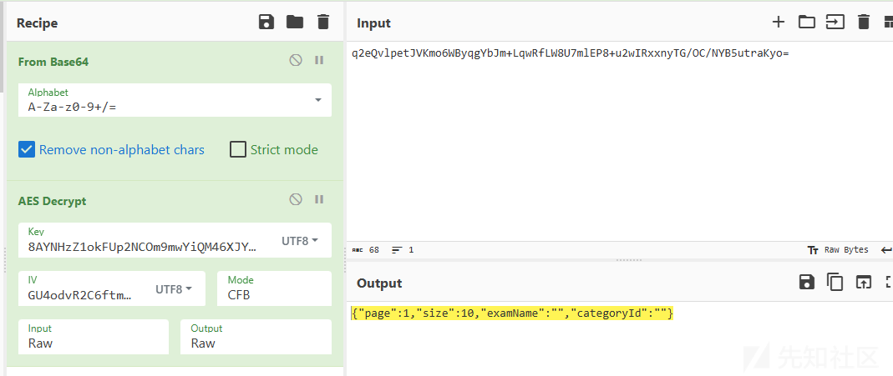
