# 实战——记一次利用AI实现逆向绕过防重放、sgin值伪造，全数据包加密-先知社区

> **来源**: https://xz.aliyun.com/news/19334  
> **文章ID**: 19334

---

来到网站，先重放发包，提示不能重复发包，限制参数为nonce

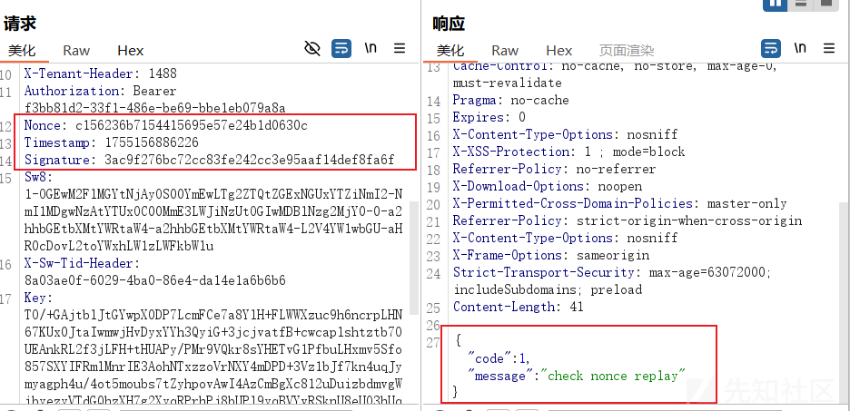

好，现在第一步我们先破解这个nonce参数，来到F12，查找这个关键字

找到生成函数Ge().replaceAll('-', '')，replaceAll('-', '')这个意思是Ge()返回的结果将'-'去掉,我们打断点跟进Ge()函数

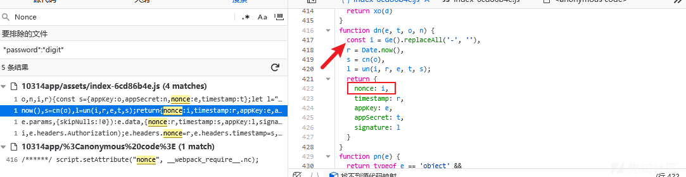

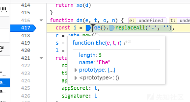

就是这一坨

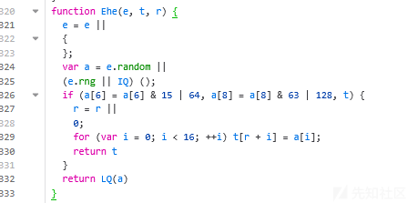

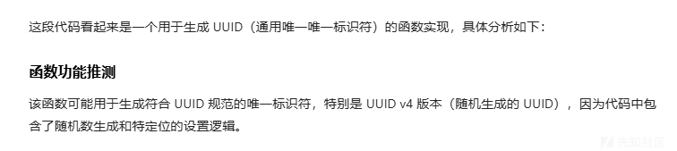

让他写一个python代码还原这个过程

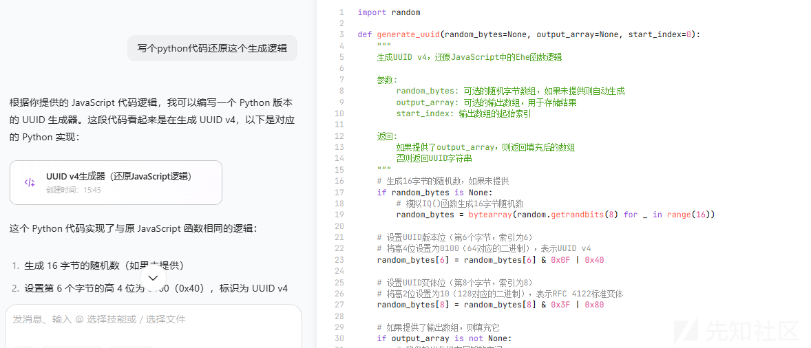

ok了老铁成功绕过了，现在提示sign错误，就是这个signature了

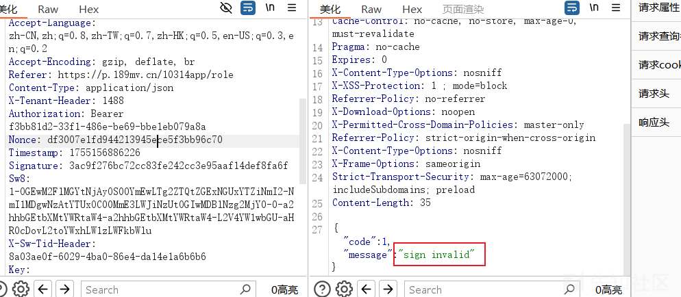之前定位到Nonce的地方同样看到了signature的生成函数位置

l = un(i, r, e, t, s)

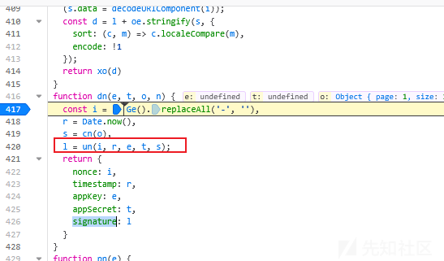

进到un(i, r, e, t, s)里面看看怎么个事

进入后在这个地方大哥断点，让它执行到这个地方

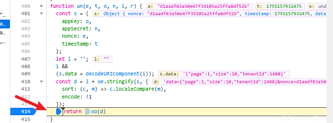

分析一下，传进来的值最后生成了一个d,再把d的值传给xo(d)函数进行sha1加密（至于为什么是sha1,AI说的）

我们控制台打印一下d的值看看是什么样子的

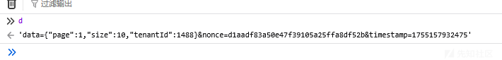

好，我们可以看到它的组成格式就是请求体的json格式+nonce+timestamp（时间戳）

我们把这一坨丢给AI分析

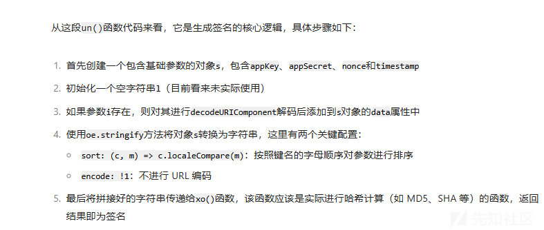

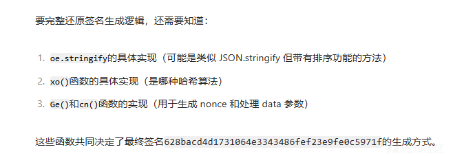

`appKey`和`appSecret`都没有用到

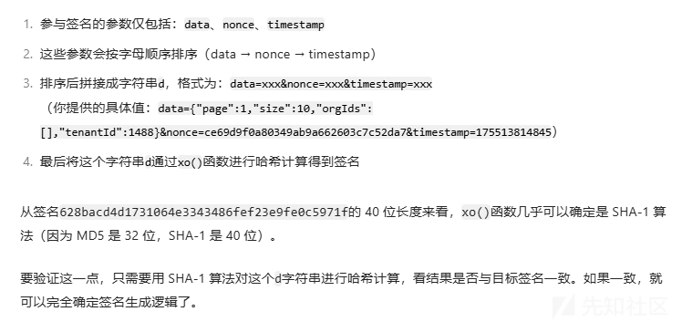

这里就可以解答为什么会是sha1加密了，因为我给它提供了Signature的一个例子，因为长度是40位的，所以就推断是sha1，属于是小母牛倒立——牛博一冲天了

让后就是让他生成python脚本

```
import hashlib
import random
import time


def generate_nonce(byte_list: list[int], start_index: int = 0) -> str:
    """生成Nonce值，基于提供的字节列表"""
    if len(byte_list) < start_index + 16:
        raise ValueError("byte_list 长度不足，请确保至少包含 start_index + 16 个元素 (0~255)。")

    # 每个字节转成 2 位小写十六进制，共 16 个字节 -> 32 个 hex 字符
    byte_hex = ''.join(f"{byte:02x}" for byte in byte_list[start_index:start_index + 16])

    # 按标准 UUID 分段（8-4-4-4-12），然后移除 '-'
    part1 = byte_hex[0:8]  # 8 hex -> 4字节
    part2 = byte_hex[8:12]  # 4 hex -> 2字节
    part3 = byte_hex[12:16]  # 4 hex -> 2字节
    part4 = byte_hex[16:20]  # 4 hex -> 2字节
    part5 = byte_hex[20:32]  # 12 hex -> 6字节

    uuid_str = f"{part1}-{part2}-{part3}-{part4}-{part5}"
    return uuid_str.replace("-", "")


def generate_dynamic_nonce() -> str:
    """动态生成随机的字节列表来创建Nonce"""
    # 生成16个0-255之间的随机整数作为字节列表
    random_bytes = [random.randint(0, 255) for _ in range(16)]
    return generate_nonce(random_bytes)


def generate_signature(data_str, nonce, timestamp):
    """生成签名，基于data、nonce和timestamp"""
    # 拼接待签名字符串，保持参数字母顺序
    input_str = f'data={data_str}&nonce={nonce}&timestamp={timestamp}'

    # 计算SHA-1哈希
    sha1_hash = hashlib.sha1(input_str.encode('utf-8'))
    return sha1_hash.hexdigest()


# 使用示例
if __name__ == "__main__":
    # 示例数据
    data = '{"page":1,"size":10,"orgIds":[],"tenantId":1488}'

    # 动态生成Nonce
    nonce = generate_dynamic_nonce()

    # 获取当前时间戳（毫秒级）
    timestamp = int(time.time() * 1000)

    # 生成签名
    signature = generate_signature(data, nonce, timestamp)

    # 按指定格式输出
    print(f"Nonce: {nonce}")
    print(f"Timestamp: {timestamp}")
    print(f"Signature: {signature}")

```

生成结果

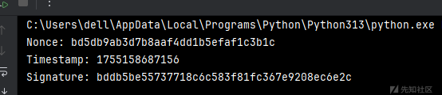

替换后，过关了

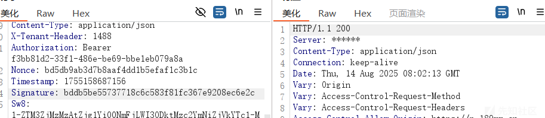

接下来就是加解密，都是aes，没什么难度，不写了......
