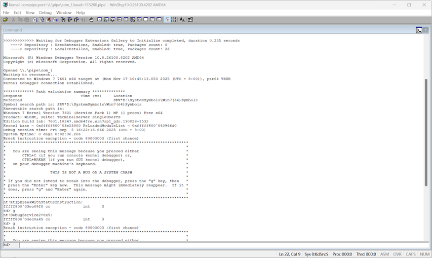
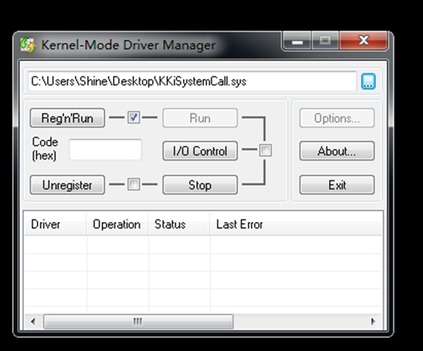
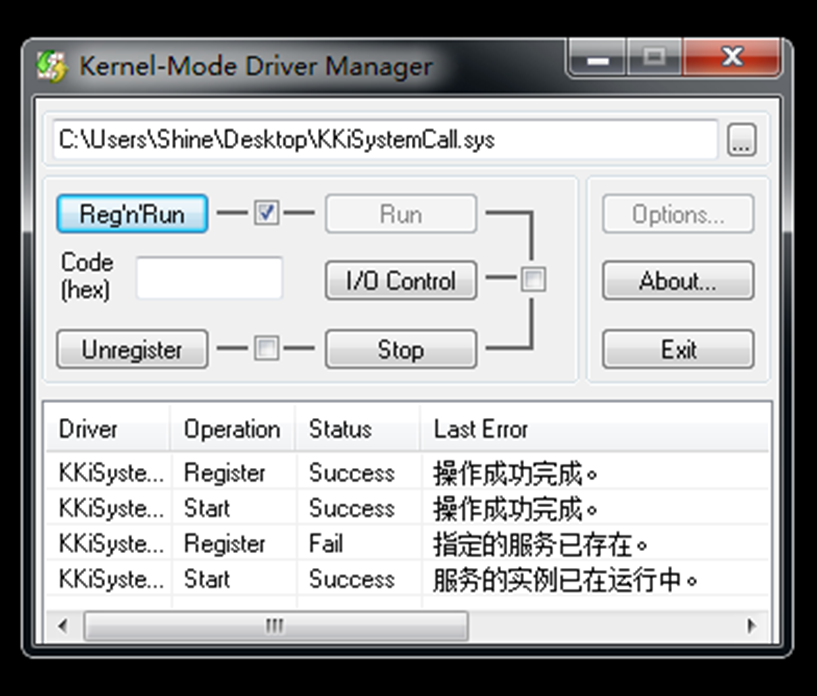
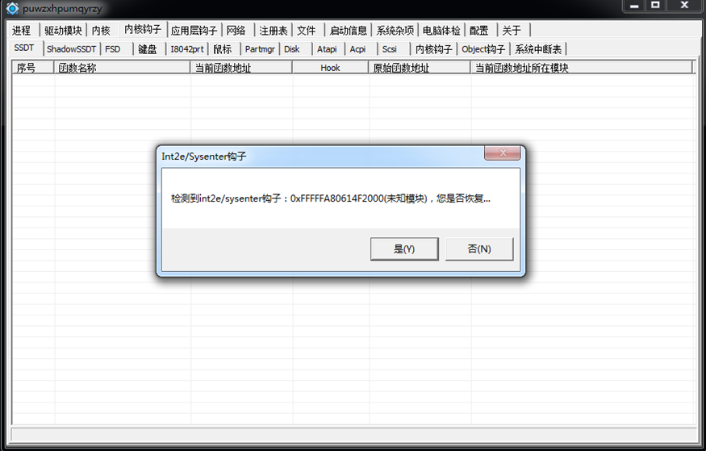
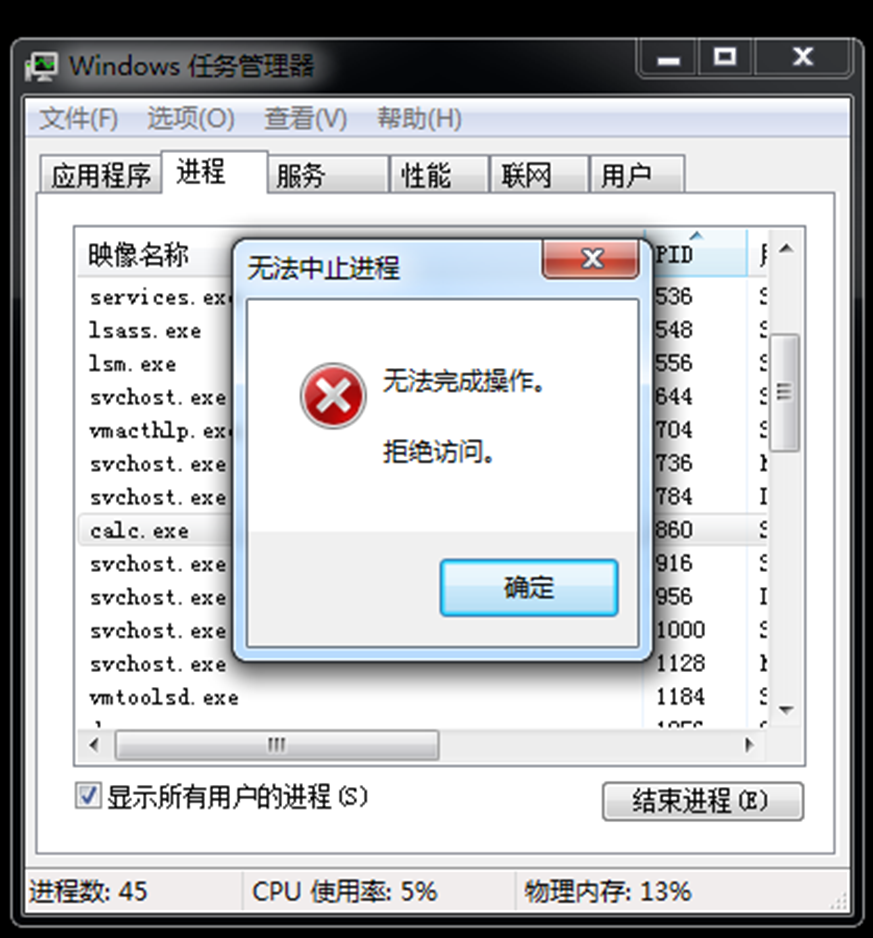

# KiSystemCall64 系统调用及钩子技术介绍-先知社区

> **来源**: https://xz.aliyun.com/news/19344  
> **文章ID**: 19344

---

# KiSystemCall64 系统调用及钩子技术介绍

## 一、KiSystemCall64 系统调用介绍

> KiSystemCall64是Windows x64系统中的内核例程，作为用户态程序通过syscall指令进入内核态的统一入口。它负责保存用户态上下文、根据系统调用号查找并分发到正确的内核服务函数，执行完毕后再恢复上下文并返回用户态，是实现操作系统功能调用的核心桥梁。

### 1.1 x64 架构系统调用机制

在 x64 Windows 系统中，用户态到内核态的切换通过 `syscall` 指令完成。该指令执行时，CPU 自动完成以下关键操作：

```
; syscall 指令执行流程（硬件自动完成）
mov rcx, rip          ; 保存返回地址到 RCX
mov r11, rflags       ; 保存标志寄存器
mov rip, IA32_LSTAR_MSR ; 跳转到系统调用处理程序
; 同时切换特权级别到 Ring 0，使用内核栈
```

IA32\_LSTAR MSR（Model Specific Register）寄存器存储着系统调用入口点 `KiSystemCall64` 的地址。这是整个系统调用机制的基石。

### 1.2 KiSystemCall64 执行流程

`KiSystemCall64` 作为系统调用的统一入口，承担着复杂的状态切换和参数处理任务：

```
1. 切换 GS 段指向 KPCR（处理器控制区域）
2. 从用户栈切换到内核栈
3. 关闭 SMAP 以允许内核访问用户数据
4. 缓解硬件漏洞的特殊代码
5. 保存完整用户态上下文到 _KTRAP_FRAME
6. 根据 EAX 计算目标系统服务地址
7. 复制用户栈参数到内核栈
8. 调用实际的内核服务函数
9. 执行用户态 APC（异步过程调用）
10. 恢复上下文并通过 sysret 返回用户态
```

### 1.3 系统服务表结构

Windows 维护两个主要系统服务表：

* **KeServiceDescriptorTable**：普通系统服务表
* **KeServiceDescriptorTableShadow**：包含 GUI 相关服务的扩展表

服务地址计算采用特殊的编码方式：

```
// 系统服务地址 = (SSDT 基地址 + (RVA 值 >> 4))
ULONG_PTR ServiceAddress = KeServiceDescriptorTable->ServiceTableBase + (RVA >> 4);
```

## 二、KiSystemCall 系统调用流程

## 1. KiSystemCall 陷入过程

### 1.1 用户态系统调用准备

在 Windows 10 21H2 中，三环应用程序通过 win32u.dll 中的存根函数发起系统调用：

```
; win32u.dll!NtGdiFlattenPath 实现示例
.text:0000000180006430 NtGdiFlattenPath proc near
.text:0000000180006430                 mov     r10, rcx        ; 保存第一个参数
.text:0000000180006433                 mov     eax, 12A0h      ; 系统调用号
.text:0000000180006438                 test    byte ptr ds:7FFE0308h, 1
.text:0000000180006440                 jnz     short loc_180006445
.text:0000000180006442                 syscall                 ; 执行系统调用
.text:0000000180006444                 retn
```

**关键点解析：**

* `eax=0x12A0`：系统调用号，高 4 位决定使用哪个服务表
* `r10=rcx`：保存第一个参数（符合 x64 调用约定）
* `7FFE0308h`：检测是否需要使用快速系统调用替代路径

### 1.2 syscall 指令硬件行为

执行 `syscall` 指令时，CPU 自动完成以下操作：

```
; syscall 指令的微码操作（硬件实现）
mov rcx, rip              ; 保存返回地址到 RCX
mov r11, rflags           ; 保存标志寄存器
mov rip, IA32_LSTAR_MSR   ; 跳转到 KiSystemCall64
; 同时：切换到 Ring 0 特权级，使用内核栈，更新 CS/SS 段寄存器
```

## 2. KiSystemCall64 内核入口点分析

### 2.1 初始堆栈切换与状态保存

```
.text:00000001404088C0 KiSystemCall64 proc near
.text:00000001404088C0 ; __unwind { // KiSystemServiceHandler
.text:00000001404088C0                 swapgs                  ; 切换 GS 指向 KPCR
.text:00000001404088C3                 mov     gs:10h, rsp     ; 保存用户栈到 KPCR.UserRsp
.text:00000001404088CC                 mov     rsp, gs:1A8h    ; 加载内核栈从 KPCR.KernelRsp
.text:00000001404088D5                 push    2Bh             ; 推送用户 SS 选择子
.text:00000001404088D7                 push    gs:10h          ; 推送用户 RSP
.text:00000001404088E0                 push    r11             ; 推送 RFLAGS
.text:00000001404088E2                 push    33h             ; 推送用户 CS 选择子
.text:00000001404088E4                 push    rcx             ; 推送返回地址
.text:00000001404088E5                 sub     rsp, 8          ; 对齐栈
.text:00000001404088E9                 push    rbp             ; 保存非易失寄存器
.text:00000001404088EA                 mov     rbp, rsp
.text:00000001404088ED                 push    rbx
.text:00000001404088EE                 push    rdi
.text:00000001404088EF                 push    rsi
```

**堆栈布局构建：**

```
+-----------------+
|      RSI        | ← rsp + 0x00
+-----------------+
|      RDI        | ← rsp + 0x08  
+-----------------+
|      RBX        | ← rsp + 0x10
+-----------------+
|      RBP        | ← rsp + 0x18
+-----------------+
|   对齐填充       | ← rsp + 0x20
+-----------------+
| 返回地址(RCX)    | ← rsp + 0x28
+-----------------+
|  用户CS(0x33)   | ← rsp + 0x30
+-----------------+
|   RFLAGS(R11)   | ← rsp + 0x38
+-----------------+
|  用户RSP         | ← rsp + 0x40
+-----------------+
|  用户SS(0x2B)    | ← rsp + 0x48
+-----------------+
```

### 2.2 系统服务分发逻辑

```
.text:00000001404088F0                 mov     rbx, gs:188h        ; 获取当前线程(KTHREAD)
.text:00000001404088F9                 mov     [rbx+1E0h], rsp     ; 保存栈指针到 Thread.TrapFrame
.text:0000000140408900                 mov     rdi, gs:900h        ; 加载当前进程(EPROCESS)
.text:0000000140408909                 mov     [rbx+1F0h], rdi     ; 保存到 Thread.ApcState.Process

; 系统调用号处理
.text:0000000140408C20 KiSystemServiceStart:
.text:0000000140408C20                 mov     [rbx+90h], rsp      ; Thread.SystemCallSp
.text:0000000140408C27                 mov     edi, eax            ; 保存系统调用号
.text:0000000140408C29                 shr     edi, 7              ; 计算服务表索引
.text:0000000140408C2C                 and     edi, 20h            ; 提取第 12 位(Shadow SSDT 标志)
.text:0000000140408C2F                 and     eax, 0FFFh          ; 提取 12 位服务索引
```

**系统调用号解码：**

```
系统调用号格式：0x12A0
┌─ 0x1 ─┐ ┌─ 0x2A0 ─┐
  高4位       低12位
    │           │
    ▼           ▼
服务表选择器   服务索引
(0=SSDT, 1=Shadow SSDT)
```

### 2.3 服务表选择与地址计算

```
.text:0000000140408C32                 mov     r10, [rbx+78h]      ; 加载服务描述符表
.text:0000000140408C36                 test    edi, edi            ; 检查是否使用 Shadow SSDT
.text:0000000140408C38                 jz      short loc_140408C42

; 使用 Shadow SSDT (GUI 相关服务)
.text:0000000140408C3A                 mov     r10, [r10+20h]      ; 指向 Shadow 表
.text:0000000140408C3E                 mov     r11, [r10+8]        ; 加载参数表
.text:0000000140408C42                 jmp     short loc_140408C4C

; 使用普通 SSDT
.text:0000000140408C44 loc_140408C44:
.text:0000000140408C44                 mov     r11, [r10+18h]      ; 加载参数表

.text:0000000140408C48 loc_140408C48:
.text:0000000140408C48                 mov     r10, [r10]          ; 加载服务表基址

.text:0000000140408C4B                 nop

.text:0000000140408C4C loc_140408C4C:
.text:0000000140408C4C                 cmp     eax, [r10+rdi+10h]  ; 检查服务号是否有效
.text:0000000140408C51                 jnb     loc_140409195       ; 跳转到无效服务处理

.text:0000000140408C57                 mov     r10, [r10+rdi]      ; 重新加载服务表基址
.text:0000000140408C5B                 movsxd  r11, dword ptr [r10+rax*4] ; 获取服务 RVA 偏移
```

**服务地址计算算法：**

```
// 实际服务地址 = 服务表基址 + (RVA >> 4)
ULONG_PTR ServiceAddress = ServiceTableBase + (RVA >> 4);
```

### 2.4 参数复制与调用准备

```
; 参数复制逻辑
.text:0000000140408C71                 movzx   ecx, byte ptr [r11+rax] ; 获取参数大小(字节)
.text:0000000140408C76                 mov     rsi, gs:10h         ; 获取用户栈指针
.text:0000000140408C7F                 add     rsi, 8              ; 跳过返回地址
.text:0000000140408C83                 mov     rdi, rsp            ; 目标：内核栈
.text:0000000140408C86                 shr     ecx, 3              ; 计算参数个数(8 字节为单位)
.text:0000000140408C89                 rep movsq                  ; 复制参数到内核栈

; 调用目标服务
.text:0000000140408D90 KiSystemServiceCopyEnd:
.text:0000000140408D90                 test    cs:KiDynamicTraceMask, 1
.text:0000000140408D9A                 jnz     loc_140409233       ; 跳转到 ETW 跟踪路径
.text:0000000140408DA0                 test    dword ptr cs:PerfGlobalGroupMask+8, 40h
.text:0000000140408DAA                 jnz     loc_1404092A7       ; 跳转到性能监控路径
.text:0000000140408DB0                 mov     rax, r10            ; 准备服务函数地址
.text:0000000140408DB3                 call    rax                 ; 调用实际系统服务
```

## 3. 实际服务调用路径分析

### 3.1 控制流防护绕行机制

由于启用了控制流防护(CFG)，直接跳转到系统服务需要经过特殊处理：

```
; 实际调用路径（CFG 保护）
call    nt!_guard_retpoline_indirect_rax (fffff803`36c1b2e0)

; _guard_retpoline_indirect_rax 内部：
fffff803`36c1b2e0                 call    $+5
fffff803`36c1b2e5                 pop     rcx
fffff803`36c1b2e6                 mov     [rsp+8], rcx
fffff803`36c1b2eb                 ret

; 继续执行：
fffff803`36c1b2ff                 call    nt!_guard_retpoline_indirect_rax+0x40 (fffff803`36c1b320)
```

**CFG 绕行原理：**

* 使用 retpoline 技术防止分支预测攻击
* 通过间接调用和返回序列确保控制流完整性
* 避免直接跳转到动态计算的目标地址

### 3.2 到达实际服务函数

经过 CFG 保护后，最终到达实际的系统服务实现：

```
; 到达 win32kfull!NtGdiFlattenPath
win32kfull!NtGdiFlattenPath:
ffffd004`238dde70 4053            push    rbx
ffffd004`238dde72 4881ecb0000000  sub     rsp, 0B0h
ffffd004`238dde79 488bd1          mov     rdx, rcx
ffffd004`238dde7c 488d4c2420      lea     rcx, [rsp+20h]
ffffd004`238dde81 e88e85dcff      call    win32kfull!DCOBJ::DCOBJ (ffffd004`236a6414)
ffffd004`238dde86 488b4c2420      mov     rcx, qword ptr [rsp+20h]
ffffd004`238dde8b 4885c9          test    rcx, rcx
ffffd004`238dde8e 7507            jne     win32kfull!NtGdiFlattenPath+0x27 (ffffd004`238dde97)
```

## 4. 系统调用返回路径

### 4.1 服务执行完成处理

```
; 系统服务执行完成后
.text:0000000140408DB5                 nop     dword ptr [rax]
.text:0000000140408DB8                 mov     [rsp+1D8h+var_A8], rax ; 保存返回值
.text:0000000140408DC0                 mov     rcx, gs:188h        ; 获取当前线程
.text:0000000140408DC9                 mov     r10, [rcx+0B8h]     ; 获取 TrapFrame

; 检查用户 APC 交付
.text:0000000140408DD0                 test    dword ptr [rcx+74h], 40000h
.text:0000000140408DD7                 jnz     loc_1404090C5       ; 跳转到 APC 交付路径
```

### 4.2 上下文恢复与返回用户态

```
; 快速返回路径（无 APC 需要交付）
.text:0000000140408F30 KiServiceExit:
.text:0000000140408F30                 mov     rcx, [rsp+1D8h+var_A8] ; 恢复返回值
.text:0000000140408F38                 mov     rsp, rbp            ; 恢复栈指针
.text:0000000140408F3B                 pop     rbp
.text:0000000140408F3C                 add     rsp, 28h            ; 跳过保存的上下文
.text:0000000140408F40                 pop     rcx                 ; 恢复返回地址
.text:0000000140408F41                 pop     r11                 ; 恢复 RFLAGS
.text:0000000140408F43                 pop     rsp                 ; 切换回用户栈
.text:0000000140408F44                 swapgs                      ; 恢复用户 GS
.text:0000000140408F47                 sysret                      ; 返回用户态
```

## 5. 调试技巧与注意事项

### 5.1 有效断点设置

由于 KiSystemCall64 开头涉及关键状态切换，直接下断点可能导致系统不稳定：

```
; 错误方式 - 可能导致崩溃
bp KiSystemCall64

; 正确方式 - 在安全位置下断点
ba e1 KiSystemCall64+15    ; 跳过初始 swapgs 指令
bp KiSystemServiceStart    ; 在服务分发逻辑开始处
ba e1 KiSystemServiceCopyEnd+0x20  ; 在服务调用前
```

### 5.2 符号加载与调试环境

```
; 加载必要符号
.reload
.load win32kfull
!process 0 0              ; 查看进程信息
!thread                   ; 查看当前线程信息

; 设置 GUI 服务断点
bp win32kfull!NtGdiFlattenPath
```

## 三、KiSystemCall64 钩子技术

## 1. KiSystemCall 钩子完整设计

### 1.1 驱动入口与初始化

```
NTSTATUS DriverEntry(PDRIVER_OBJECT DriverObject, PUNICODE_STRING RegisterPath)
{
    DriverObject->DriverUnload = DriverUnload;
    
    // 核心：重构建 KiSystemCall64
    __FakeKiSystemCall64 = ReloadKiSystemCall64();
    
    if (__FakeKiSystemCall64) {
        // 保存原始地址用于恢复
        KiSystemCall64 = __readmsr(0xC0000082);
        
        // 多处理器支持：在所有 CPU 核心上安装钩子
        for (ULONG i = 0; i < KeNumberProcessors; i++) {
            KeSetSystemAffinityThread((KAFFINITY)((ULONG64)1 << i));
            __writemsr(0xC0000082, __FakeKiSystemCall64);
            KeRevertToUserAffinityThread();
        }
        return STATUS_SUCCESS;
    }
    return STATUS_UNSUCCESSFUL;
}
```

### 1.2 内存重构建核心流程

#### 1.2.1 定位原始系统调用处理器

```
PUCHAR ReloadKiSystemCall64()
{
    // 通过 MSR 寄存器获取原始 KiSystemCall64 地址
    PUCHAR KiSystemCall64 = (PUCHAR)__readmsr(0xC0000082);
    
    // 搜索函数边界：查找跳转指令确定函数大小
    ULONG ViewSize = 0;
    for (ULONG i = 0; i < 0x1000; i++) {
        if (*(KiSystemCall64 + i) == 0xE9) { // JMP 指令
            if (*(KiSystemCall64 + i + 1) == 0x59 && ...) {
                ViewSize = i + 5;
                break;
            }
        }
    }
```

#### 1.2.2 内存布局规划

分配 0x13000 字节非分页内存，精心规划内存布局：

```
+-------------------+ 0x0000
| 复制的原始代码      | ← 完整的 KiSystemCall64 副本
+-------------------+ 0x1000  
| 伪造描述符表结构    | ← 伪造的 SSDT 和 Shadow SSDT
+-------------------+ 0x2000
| 地址指针数组       | ← 重定位后的函数指针
+-------------------+ 0x3000
| 伪造 SSDT RVA 表   | ← 服务号到 RVA 的映射
+-------------------+ 0x4000
| SSDT 跳板代码       | ← 每个系统服务的跳转代码
+-------------------+ 0x5000
| SSDT 函数地址数组   | ← 实际调用的函数地址
+-------------------+ 0x6000
| 伪造 Shadow RVA 表 | ← GUI 服务的 RVA 映射
+-------------------+ 0x7500
| Shadow 跳板代码     | ← GUI 服务的跳转代码
+-------------------+ 0x9500
| Shadow 函数地址数组 | ← GUI 服务函数地址
+-------------------+ 0x13000
```

### 1.3 指令修复与重定位

#### 1.3.1 修复相对调用指令

```
void FixBaseRelocation(ULONG64 VirtualAddress, PUCHAR KiSystemCall64, ULONG ViewSize)
{
    // 复制原始代码
    memcpy((PVOID)VirtualAddress, KiSystemCall64, ViewSize);
    
    // 修复所有地址相关指令
    for (ULONG i = 0; i < ViewSize - 15; i++) {
        PUCHAR Current = (PUCHAR)VirtualAddress + i;
        
        // 修复直接调用 (E8 opcode)
        if (*Current == 0xE8) {
            ULONG OriginalOffset = *(PULONG)(Current + 1);
            ULONG_PTR OriginalTarget = (ULONG_PTR)(Current + 5 + OriginalOffset);
            ULONG_PTR NewTarget = FindNewAddress(OriginalTarget);
            ULONG NewOffset = (ULONG)(NewTarget - (ULONG_PTR)Current - 5);
            *(PULONG)(Current + 1) = NewOffset;
        }
        
        // 修复间接调用 (FF 15 opcode)
        if (Current[0] == 0xFF && Current[1] == 0x15) {
            // 重定向到地址指针数组
            // ...
        }
    }
}
```

#### 1.3.2 关键指令重定向

最核心的修改是重定向 SSDT 加载指令：

```
; 原始代码：
lea r10, [KeServiceDescriptorTable]        ; 4C 8D 15 XX XX XX XX

; 修复后：
jmp qword ptr [__Address]                  ; FF 25 XX XX XX XX
```

这样，所有对原始 SSDT 的引用都被重定向到我们伪造的表结构。

### 1.4 伪造 SSDT 表构造

#### 1.4.1 构建伪造服务描述符表

```
void FixFakeKeServiceDescriptorTable(PSYSTEM_SERVICE_DESCRIPTOR_TABLE OriginalTable)
{
    // 复制原始表结构
    __FakeKeServiceDescriptorTable->ServiceTableBase = __FakeServiceTableBase;
    __FakeKeServiceDescriptorTable->NumberOfServices = OriginalTable->NumberOfServices;
    __FakeKeServiceDescriptorTable->ArgumentTableBase = OriginalTable->ArgumentTableBase;
    
    // 为每个系统服务构建跳板
    for (ULONG i = 0; i < OriginalTable->NumberOfServices; i++) {
        // 计算原始函数地址
        ULONG OriginalRVA = OriginalTable->ServiceTableBase[i];
        ULONG_PTR OriginalFunction = (ULONG_PTR)OriginalTable->ServiceTableBase + (OriginalRVA >> 4);
        
        // 保存原始函数指针
        __FakeSsdtService[i] = OriginalFunction;
        
        // 安装特定钩子（以 NtTerminateProcess 为例）
        if (i == 41) { // NtTerminateProcess 的服务号
            __NtTerminateProcess = (LPFN_TERMINATEPROCESS)__FakeSsdtService[i];
            __FakeSsdtService[i] = (ULONG_PTR)FakeNtTerminateProcess;
        }
        
        // 构建跳板代码
        BuildTrampoline(__SsdtTrampoline, &__FakeSsdtService[i]);
        
        // 计算新的 RVA 值
        ULONG NewRVA = (ULONG)((__SsdtTrampoline - __FakeServiceTableBase) << 4) | (OriginalRVA & 0xF);
        __FakeServiceTableBase[i] = NewRVA;
        
        __SsdtTrampoline += 6; // 每个跳板占用 6 字节
    }
}
```

#### 1.4.2 跳板代码构造

```
; 跳板代码结构：
; FF 25 XX XX XX XX     JMP [相对地址]
; 后跟 4 字节相对偏移量

; 实际生成的跳板：
__SsdtTrampoline:
    jmp qword ptr [__FakeSsdtService + index * 8]
```

这种设计使得我们可以动态修改 `__FakeSsdtService` 数组中的函数指针，实现灵活的挂钩。

### 1.5 Shadow SSDT 特殊处理

由于 win32k.sys 加载在会话空间，处理 Shadow SSDT 需要特殊技巧：

```
void FixFakeKeServiceDescriptorTableShadow()
{
    // 必须附加到 GUI 进程上下文
    PEPROCESS GuiProcess = FindGuiProcess();
    KAPC_STATE ApcState;
    
    KeStackAttachProcess(GuiProcess, &ApcState);
    
    // 构建过程与普通 SSDT 类似，但需要会话空间地址
    // ...
    
    KeUnstackDetachProcess(&ApcState);
}
```

## 2. 钩子函数实现示例

### 2.1 NtTerminateProcess 钩子

```
NTSTATUS FakeNtTerminateProcess(HANDLE ProcessHandle, NTSTATUS ExitStatus)
{
    // 前置处理：记录日志、权限检查等
    DbgPrint("NtTerminateProcess called: PID=%d, Status=0x%X
", 
             PsGetProcessId(ProcessHandle), ExitStatus);
    
    // 可以阻止特定进程被终止
    if (IsProtectedProcess(ProcessHandle)) {
        DbgPrint("Blocked termination of protected process
");
        return STATUS_ACCESS_DENIED;
    }
    
    // 调用原始函数
    return __NtTerminateProcess(ProcessHandle, ExitStatus);
}
```

## 3. 多处理器同步机制

### 3.1 跨 CPU 安装技术

```
// 确保所有处理器核心都应用钩子
for (ULONG i = 0; i < KeNumberProcessors; i++) {
    // 设置线程关联性到指定 CPU
    KeSetSystemAffinityThread((KAFFINITY)((ULONG64)1 << i));
    
    // 修改该 CPU 的 LSTAR MSR
    __writemsr(0xC0000082, __FakeKiSystemCall64);
    
    // 恢复线程关联性
    KeRevertToUserAffinityThread();
}
```

## 4. 驱动卸载与清理

### 4.1 安全恢复机制

```
VOID DriverUnload(PDRIVER_OBJECT DriverObject)
{
    // 在所有 CPU 上恢复原始 KiSystemCall64
    for (ULONG i = 0; i < KeNumberProcessors; i++) {
        KeSetSystemAffinityThread((KAFFINITY)((ULONG64)1 << i));
        __writemsr(0xC0000082, KiSystemCall64);
        KeRevertToUserAffinityThread();
    }
    
    // 释放分配的内存
    if (__FakeKiSystemCall64) {
        ExFreePoolWithTag((PVOID)__FakeKiSystemCall64, POOL_TAG);
    }
    
    DbgPrint("KiSystemCall64 hook unloaded successfully
");
}
```

## 5. 技术难点与解决方案

### 5.1 地址重定位挑战

**问题**：复制代码中的相对地址和绝对地址需要重新计算。

**解决方案**：

* 解析所有相对跳转和调用指令
* 维护地址映射表进行转换
* 使用间接跳转处理绝对地址

### 5.2 并发访问处理

**问题**：系统调用可能在不同 CPU 上同时执行。

**解决方案**：

* 使用原子操作修改 MSR 寄存器
* 确保内存屏障正确性
* 多处理器同步安装

### 5.3 稳定性保障

**问题**：错误的钩子实现可能导致系统崩溃。

**解决方案**：

* 严格验证所有指针
* 使用 try-except 保护关键操作
* 实现完整的恢复机制

## 6. 检测与反制技术

钩子检测思路：

可以通过检测MSR寄存器和SSDT是否被修改。

```
// 检测 LSTAR MSR 是否被修改
BOOLEAN IsKiSystemCall64Hooked()
{
    ULONG_PTR CurrentLstar = __readmsr(0xC0000082);
    ULONG_PTR OriginalLstar = GetOriginalKiSystemCall64Address();
    
    return CurrentLstar != OriginalLstar;
}

// 检测 SSDT 完整性
BOOLEAN IsSSDTHooked()
{
    PSYSTEM_SERVICE_DESCRIPTOR_TABLE ssdt = KeServiceDescriptorTable;
    
    // 检查 ServiceTableBase 是否在预期模块范围内
    if ((ULONG_PTR)ssdt->ServiceTableBase < (ULONG_PTR)ntoskrnlBase ||
        (ULONG_PTR)ssdt->ServiceTableBase > (ULONG_PTR)ntoskrnlEnd) {
        return TRUE;
    }
    
    return FALSE;
}
```

## 四、KiSystemCall钩子调试

### 1. 虚拟机环境准备

准备虚拟机双机调试环境，使用WinDBG链接虚拟机并支持对符号表等信息的查看。



如图所示，已经成功加载了双机调试。

### 2. 驱动加载

使用KMD Manager工具加载内核驱动，该驱动实现了对KisystemCall挂钩的行为。



成功加载驱动并实现挂钩操作。



### 3. 查看钩子加载

使用PC Hunter工具检测内核钩子，发现该钩子会被检测



测试被钩函数情况：



由于替换的函数是结束进程函数，对于使用该函数结束进程的操作被拒绝，说明挂钩成功，被钩函数执行成功。

## 五、总结

KiSystemCall64 钩子技术代表了 Windows 内核级系统调用拦截的最高水平。通过深入分析 x64 架构的系统调用机制，我们揭示了从用户态 `syscall` 指令执行到内核态 `KiSystemCall64` 完整处理流程的技术细节。

这项技术的核心在于对 IA32\_LSTAR MSR 寄存器的精密操控，通过替换系统调用入口点，实现对所有系统调用的统一拦截。关键技术突破包括：

1. **内存重构建技术** - 完整复制并修复原始 KiSystemCall64 代码，解决指令重定位难题
2. **伪造 SSDT 架构** - 构建完整的服务描述符表替代体系，实现细粒度函数级挂钩
3. **多处理器同步** - 确保钩子在所有 CPU 核心上的一致性安装
4. **控制流完整性** - 绕过 CFG 等安全机制，维持系统稳定性

相比传统的 SSDT 钩子，KiSystemCall64 钩子具有更彻底的拦截能力，能够捕获所有系统调用而不仅仅是特定服务表中的函数。这种技术既可用于安全防护软件的深度行为监控，也可能被恶意软件用于隐藏自身活动。
