# AstrBot 远程代码执行(CVE-2025-55449)漏洞分析-先知社区

> **来源**: https://xz.aliyun.com/news/19347  
> **文章ID**: 19347

---

# 简介

> AstrBot 是 AstrBotDevs 开发的一款开源大型语言模型聊天机器人及开发框架，支持多平台部署和插件扩展。该项目基于 Python 开发，提供 Web 管理界面（dashboard），允许用户通过插件系统扩展功能，集成各类大语言模型 API，广泛应用于企业和个人构建自定义AI助手场景。

# 漏洞描述

近日，奇安信CERT监测到官方修复**AstrBot 远程代码执行漏洞(CVE-2025-55449)**，该漏洞源于 AstrBot 使用了固定的 JWT 签名密钥，攻击者可利用该密钥伪造任意有效的 JWT 认证令牌，完全绕过身份验证机制。成功绕过认证后，攻击者可访问插件管理接口，通过上传恶意的 Python 插件文件实现远程代码执行。\*\*目前该漏洞POC和技术细节已在互联网上公开，\*\*鉴于该漏洞影响范围较大，建议客户尽快做好自查及防护。[1]

# 影响版本

> AstrBot < 3.5.18

# 漏洞分析

漏洞分析与漏洞复现环境版本为`v3.5.17`。

根据漏洞描述可以直接定位到漏洞函数位于`AuthRoute.generate_jwt`函数

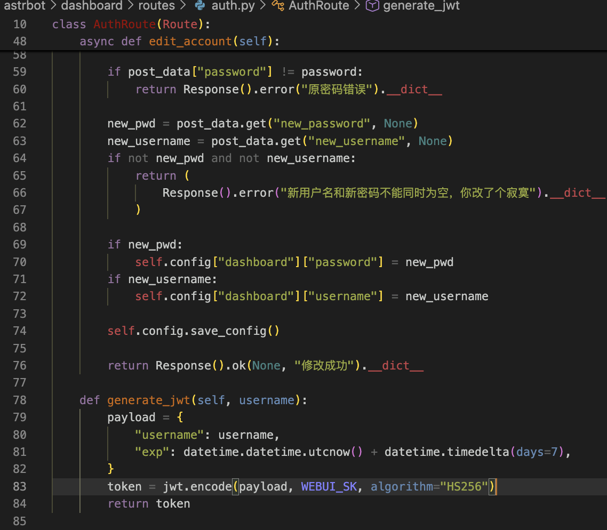

或者`AstrBotDashboard.srv_plug_route`函数都可以发现在对与JWT凭据中使用的都是同一个硬编码的密钥。（`Advanced_System_for_Text_Response_and_Bot_Operations_Tool`）

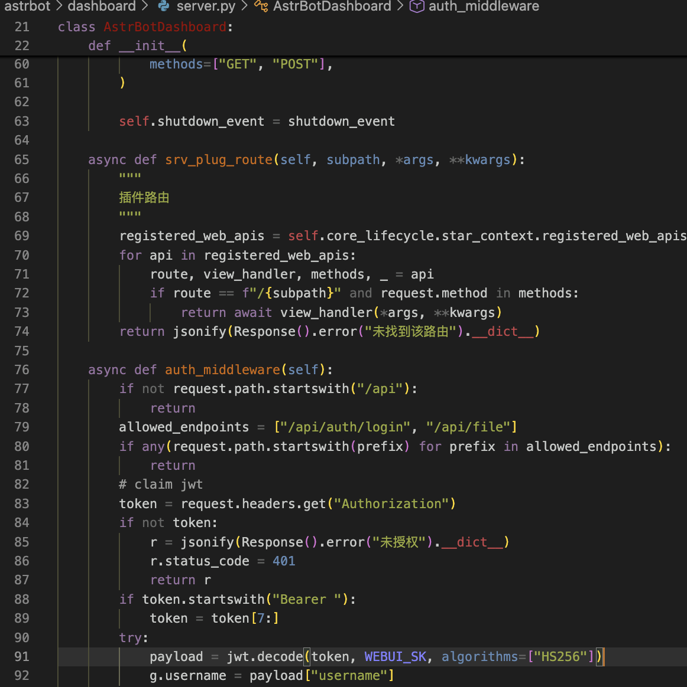

对于认证的判断只要Jwt Token能够被正常解析且未过期的情况下即可通过。

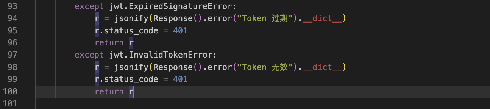

而后台的远程代码执行漏洞则是利用应用自带的插件扩展功能，允许用户上传自定义的插件包，程序会进行解压后读取插件相关的信息并导入对象的Python文件执行代码。

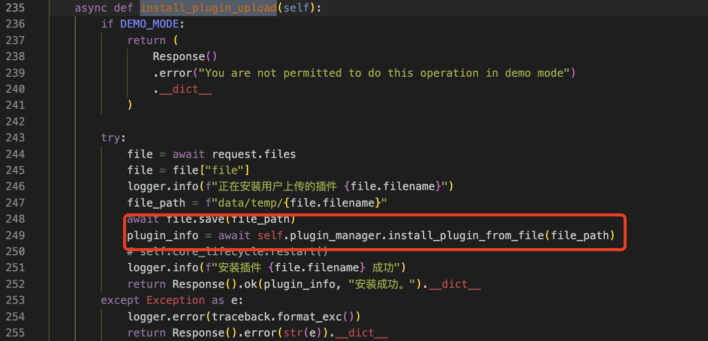

该函数映射的路由如图所示。

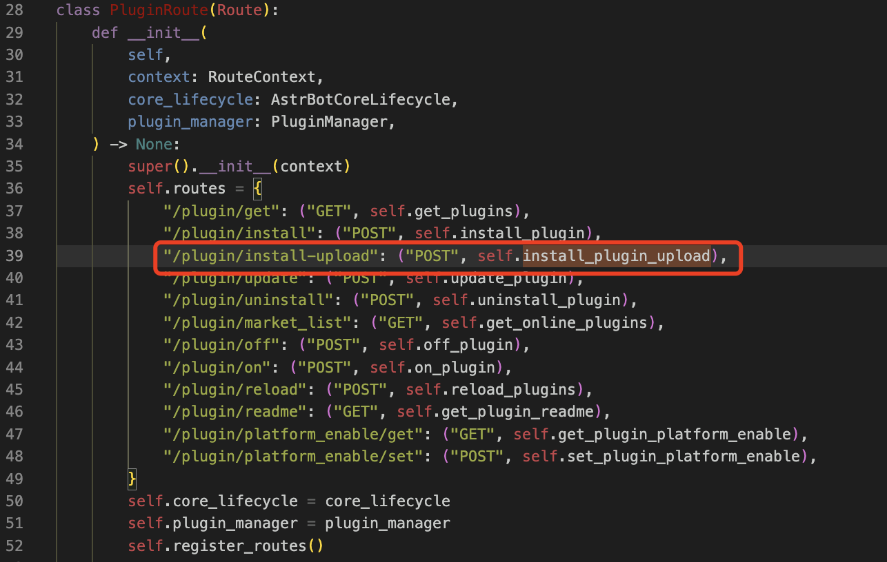

而`PluginManager.install_plugin_from_file`函数会对上传的文件进行解压后调用`load`方法加载插件。

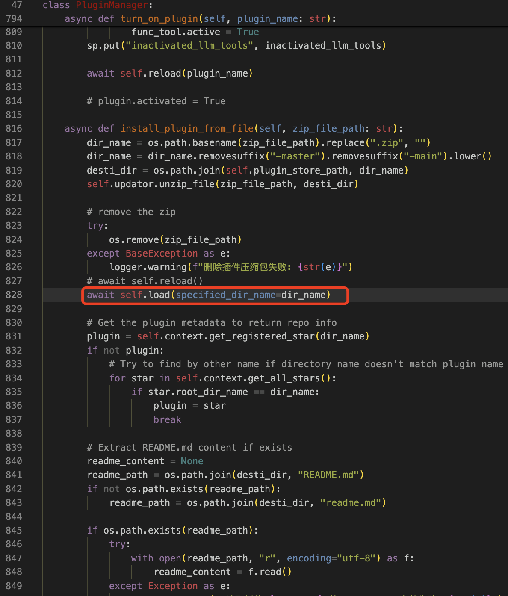

在该方法中会通过`__import__`的方式导入自定义的插件代码文件。

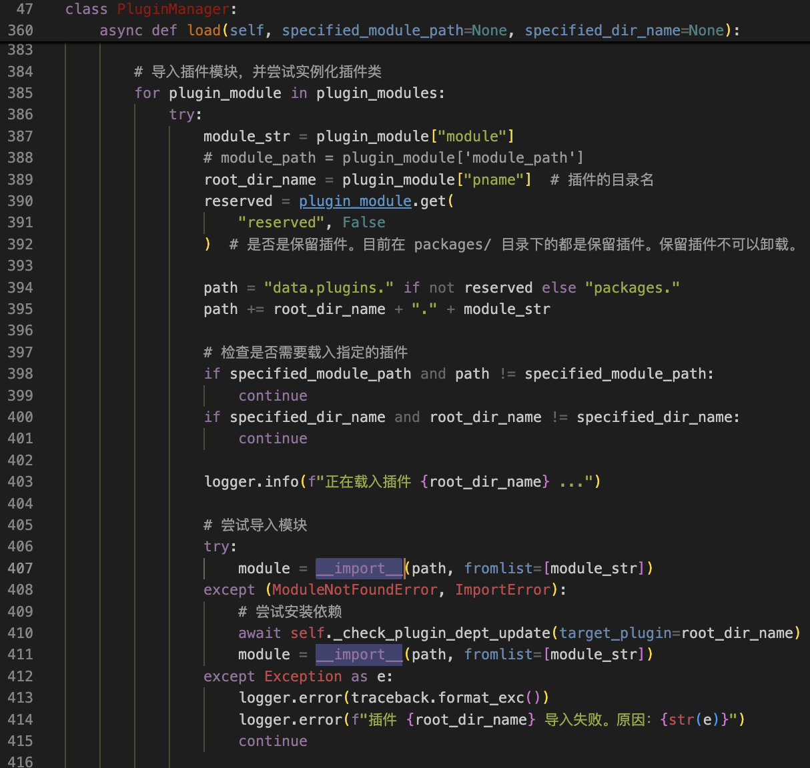

# 漏洞复现

（1）插件编写可以参考官方的插件模板代码仓库。（<https://github.com/Soulter/helloworld）>

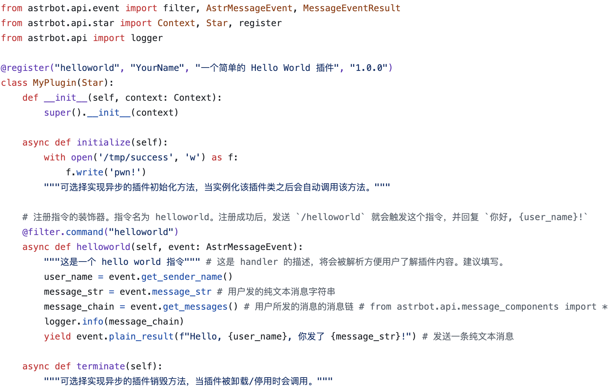

（2）使用pyjwt库和默认的密钥生成Jwt Token。

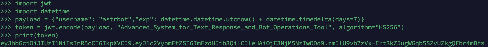

（3）构造请求上传插件压缩包即可触发代码执行。

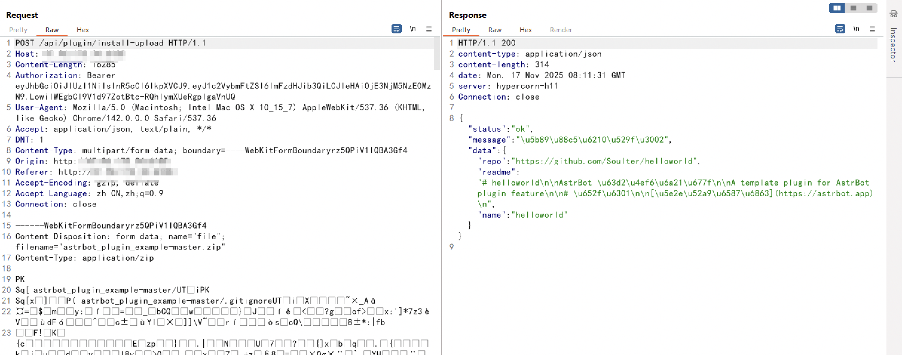

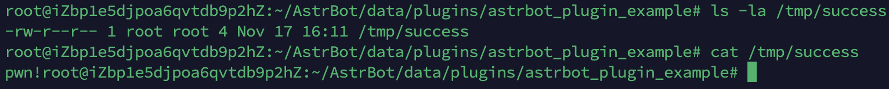

# 参考链接

[1] [【已复现】AstrBot 远程代码执行漏洞(CVE-2025-55449)安全风险通告](https://mp.weixin.qq.com/s/c2fNv8cAHHQ_DoczndT-3g)
