# RCTF 部分题目wp-先知社区

> **来源**: https://xz.aliyun.com/news/19351  
> **文章ID**: 19351

---

# Wanna Feel Love Writeup

## Challenge 1

将xml丢给ai写一个 ai返回一个脚本 我们直接利用脚本得到垃圾邮箱进行解密

Py脚本

```
from email import policy
from email.parser import BytesParser
from pathlib import Path
import base64
import quopri
import re

# 这里改成你的 eml 文件名
MAIL_FILE = "WannaFeelLove.eml"

def decode_part(part):
"""根据 Content-Transfer-Encoding + charset 解码出文本字符串"""
payload = part.get_payload(decode=False)

# payload 可能是 str 也可能是 bytes
if isinstance(payload, str):
raw = payload.encode("utf-8", errors="ignore")
else:
raw = payload

cte = (part.get("Content-Transfer-Encoding") or "").lower()

if "base64" in cte:
try:
decoded_bytes = base64.b64decode(raw)
except Exception:
decoded_bytes = raw
elif "quoted-printable" in cte:
decoded_bytes = quopri.decodestring(raw)
else:
decoded_bytes = raw

charset = part.get_content_charset() or "utf-8"
try:
text = decoded_bytes.decode(charset, errors="ignore")
except LookupError:
text = decoded_bytes.decode("utf-8", errors="ignore")

return text


def walk_message(msg, prefix="root"):
"""递归遍历整封邮件，拿到所有 text/* 部分"""
parts = []

if msg.is_multipart():
for idx, part in enumerate(msg.iter_parts(), 1):
ctype = part.get_content_type()
tag = f"{prefix}.{idx}-{ctype}"
if ctype == "message/rfc822":
# 内嵌一封邮件，递归进去
inner = part.get_payload(0)
parts.extend(walk_message(inner, prefix=tag))
else:
parts.extend(walk_message(part, prefix=tag))
else:
ctype = msg.get_content_type()
if ctype.startswith("text/"):
try:
text = decode_part(msg)
parts.append((prefix, ctype, text))
except Exception as e:
print(f"[!] 解码 {prefix} ({ctype}) 出错: {e}")

return parts


def main():
eml_path = Path(MAIL_FILE)
if not eml_path.exists():
print(f"[!] 找不到文件: {eml_path}")
return

data = eml_path.read_bytes()
msg = BytesParser(policy=policy.default).parsebytes(data)

# 先顺带把顶层 header 里可能的 comment 也看一下
print("=== 顶层邮件头中可能的注释 ===")
for k, v in msg.items():
if "(" in v and ")" in v:
print(f"{k}: {v}")
print("================================
")

parts = walk_message(msg)

if not parts:
print("[!] 没有找到任何 text/* 部分，可能这个 eml 很奇怪，建议用编辑器直接打开看看结构。")
return

out_dir = Path("mail_parts")
out_dir.mkdir(exist_ok=True)

for idx, (tag, ctype, text) in enumerate(parts, 1):
print(f"
=== Part #{idx} | {tag} | {ctype} | length={len(text)} ===")

# 保存到文件方便你用浏览器/编辑器打开
ext = ".html" if "html" in ctype else ".txt"
safe_tag = tag.replace("/", "_").replace(".", "_")
out_file = out_dir / f"part_{idx}_{safe_tag}{ext}"
out_file.write_text(text, encoding="utf-8", errors="ignore")
print(f"[*] 已保存到: {out_file}")

# 1) HTML 注释 <!-- ... -->
html_comments = re.findall(r"<!--(.*?)-->", text, flags=re.DOTALL)

# 2) C 风格注释 /* ... */
c_comments = re.findall(r"/\*(.*?)\*/", text, flags=re.DOTALL)

# 3) 行注释 // ... （简单粗暴版本，按行截取）
slash_comments = []
for line in text.splitlines():
if "//" in line:
# 去掉前面的代码，取 // 后面的部分
slash_comments.append(line.split("//", 1)[1].strip())

if not html_comments and not c_comments and not slash_comments:
print("[*] 这一部分里没找到明显的注释风格内容。")
else:
print("[+] 这一部分里找到可能的“低语”：")

if html_comments:
print("  - HTML 注释 <!-- -->：")
for i, c in enumerate(html_comments, 1):
print(f"    [HTML #{i}] {c.strip()}")

if c_comments:
print("  - C 风格注释 /* */：")
for i, c in enumerate(c_comments, 1):
print(f"    [C #{i}] {c.strip()}")

if slash_comments:
print("  - 行注释 // ：")
for i, c in enumerate(slash_comments, 1):
print(f"    [// #{i}] {c.strip()}")


if __name__ == "__main__":
main()

```

垃圾邮箱解密

```
Dear Friend , Thank-you for your interest in our publication
. If you no longer wish to receive our publications
simply reply with a Subject: of "REMOVE" and you will
immediately be removed from our mailing list . This
mail is being sent in compliance with Senate bill 2116
; Title 6 ; Section 305 . This is NOT unsolicited bulk
mail . Why work for somebody else when you can become
rich as few as 54 days ! Have you ever noticed people
will do almost anything to avoid mailing their bills
and most everyone has a cellphone ! Well, now is your
chance to capitalize on this . We will help you sell
more and use credit cards on your website . You can
begin at absolutely no cost to you . But don't believe
us ! Mr Simpson of Idaho tried us and says "I was skeptical
but it worked for me" . We are a BBB member in good
standing ! Do not go to sleep without ordering ! Sign
up a friend and your friend will be rich too . Best
regards ! Dear Friend , Your email address has been
submitted to us indicating your interest in our letter
. If you are not interested in our publications and
wish to be removed from our lists, simply do NOT respond
and ignore this mail . This mail is being sent in compliance
with Senate bill 2616 , Title 6 ; Section 308 . Do
NOT confuse us with Internet scam artists . Why work
for somebody else when you can become rich in 41 weeks
. Have you ever noticed nearly every commercial on
television has a .com on in it and people are much
more likely to BUY with a credit card than cash ! Well,
now is your chance to capitalize on this ! WE will
help YOU deliver goods right to the customer's doorstep
plus sell more ! You are guaranteed to succeed because
we take all the risk . But don't believe us . Mrs Anderson
of Arizona tried us and says "I've been poor and I've
been rich - rich is better" . We are a BBB member in
good standing . We urge you to contact us today for
your own future financial well-being ! Sign up a friend
and you'll get a discount of 60% . Thank-you for your
serious consideration of our offer . Dear Friend ;
Your email address has been submitted to us indicating
your interest in our briefing ! If you no longer wish
to receive our publications simply reply with a Subject:
of "REMOVE" and you will immediately be removed from
our mailing list . This mail is being sent in compliance
with Senate bill 1620 , Title 1 ; Section 303 ! This
is not multi-level marketing ! Why work for somebody
else when you can become rich in 33 months ! Have you
ever noticed nearly every commercial on television
has a .com on in it plus how long the line-ups are
at bank machines . Well, now is your chance to capitalize
on this . WE will help YOU SELL MORE & sell more !
The best thing about our system is that it is absolutely
risk free for you ! But don't believe us . Ms Ames
who resides in Missouri tried us and says "Now I'm
rich, Rich, RICH" ! This offer is 100% legal ! We BESEECH
you - act now . Sign up a friend and you get half off
! God Bless ! Dear Cybercitizen , You made the right
decision when you signed up for our mailing list !
If you are not interested in our publications and wish
to be removed from our lists, simply do NOT respond
and ignore this mail ! This mail is being sent in compliance
with Senate bill 2516 , Title 3 , Section 304 . This
is different than anything else you've seen . Why work
for somebody else when you can become rich in 83 DAYS
! Have you ever noticed more people than ever are surfing
the web and people will do almost anything to avoid
mailing their bills . Well, now is your chance to capitalize
on this . WE will help YOU process your orders within
seconds plus use credit cards on your website ! The
best thing about our system is that it is absolutely
risk free for you . But don't believe us ! Ms Jones
of Louisiana tried us and says "My only problem now
is where to park all my cars" . We are licensed to
operate in all states ! If not for you then for your
LOVED ONES - act now . Sign up a friend and you'll
get a discount of 20% . Thank-you for your serious
consideration of our offer ! Dear Web surfer , This
letter was specially selected to be sent to you ! If
you are not interested in our publications and wish
to be removed from our lists, simply do NOT respond
and ignore this mail . This mail is being sent in compliance
with Senate bill 1619 ; Title 2 , Section 301 . This
is NOT unsolicited bulk mail . Why work for somebody
else when you can become rich in 94 months ! Have you
ever noticed society seems to be moving faster and
faster and people love convenience . Well, now is your
chance to capitalize on this ! We will help you use
credit cards on your website and use credit cards on
your website . You are guaranteed to succeed because
we take all the risk ! But don't believe us ! Ms Anderson
who resides in South Dakota tried us and says "Now
I'm rich, Rich, RICH" . This offer is 100% legal !
So make yourself rich now by ordering immediately !
Sign up a friend and your friend will be rich too .
Best regards . Dear Salaryman , You made the right
decision when you signed up for our mailing list !
If you no longer wish to receive our publications simply
reply with a Subject: of "REMOVE" and you will immediately
be removed from our directory ! This mail is being
sent in compliance with Senate bill 1622 ; Title 5
; Section 304 . This is a ligitimate business proposal
! Why work for somebody else when you can become rich
in 26 months ! Have you ever noticed more people than
ever are surfing the web & nobody is getting any younger
. Well, now is your chance to capitalize on this !
We will help you use credit cards on your website and
SELL MORE ! You are guaranteed to succeed because we
take all the risk . But don't believe us . Prof Simpson
who resides in Delaware tried us and says "My only
problem now is where to park all my cars" . We are
licensed to operate in all states ! We BESEECH you
- act now . Sign up a friend and you'll get a discount
of 10% ! Thank-you for your serious consideration of
our offer ! Dear Sir or Madam , This letter was specially
selected to be sent to you . We will comply with all
removal requests ! This mail is being sent in compliance
with Senate bill 1618 , Title 5 ; Section 304 . This
is a ligitimate business proposal . Why work for somebody
else when you can become rich in 61 days . Have you
ever noticed people love convenience and nobody is
getting any younger ! Well, now is your chance to capitalize
on this . We will help you deliver goods right to the
customer's doorstep and SELL MORE . The best thing
about our system is that it is absolutely risk free
for you . But don't believe us ! Mr Ames of Pennsylvania
tried us and says "I've been poor and I've been rich
- rich is better" ! This offer is 100% legal ! We urge
you to contact us today for your own future financial
well-being . Sign up a friend and you'll get a discount
of 80% . God Bless ! Dear Friend ; Especially for you
- this cutting-edge news . If you are not interested
in our publications and wish to be removed from our
lists, simply do NOT respond and ignore this mail !
This mail is being sent in compliance with Senate bill
2416 ; Title 3 ; Section 305 ! This is NOT unsolicited
bulk mail . Why work for somebody else when you can
become rich in 72 months . Have you ever noticed people
are much more likely to BUY with a credit card than
cash plus nearly every commercial on television has
a .com on in it . Well, now is your chance to capitalize
on this ! WE will help YOU deliver goods right to the
customer's doorstep & decrease perceived waiting time
by 180% . You can begin at absolutely no cost to you
. But don't believe us ! Ms Ames of Florida tried us
and says "My only problem now is where to park all
my cars" . We are a BBB member in good standing ! If
not for you then for your loved ones - act now ! Sign
up a friend and your friend will be rich too ! Thank-you
for your serious consideration of our offer ! Dear
Internet user , You made the right decision when you
signed up for our mailing list . This is a one time
mailing there is no need to request removal if you
won't want any more . This mail is being sent in compliance
with Senate bill 1627 ; Title 7 ; Section 308 ! This
is NOT unsolicited bulk mail . Why work for somebody
else when you can become rich in 61 weeks . Have you
ever noticed people will do almost anything to avoid
mailing their bills plus most everyone has a cellphone
. Well, now is your chance to capitalize on this !
WE will help YOU use credit cards on your website plus
use credit cards on your website ! You are guaranteed
to succeed because we take all the risk . But don't
believe us ! Ms Ames who resides in Nevada tried us
and says "I was skeptical but it worked for me" ! We
assure you that we operate within all applicable laws
. So make yourself rich now by ordering immediately
. Sign up a friend and your friend will be rich too
. Warmest regards . Dear Friend ; You made the right
decision when you signed up for our directory ! If
you are not interested in our publications and wish
to be removed from our lists, simply do NOT respond
and ignore this mail . This mail is being sent in compliance
with Senate bill 1623 , Title 6 ; Section 301 ! This
is not a get rich scheme ! Why work for somebody else
when you can become rich in 24 MONTHS . Have you ever
noticed people love convenience and how long the line-ups
are at bank machines . Well, now is your chance to
capitalize on this ! WE will help YOU process your
orders within seconds and decrease perceived waiting
time by 190% . You can begin at absolutely no cost
to you ! But don't believe us ! Mr Simpson of Illinois
tried us and says "My only problem now is where to
park all my cars" ! We are licensed to operate in all
states ! For God's sake, order now . Sign up a friend
and you'll get a discount of 10% ! Thanks !
```

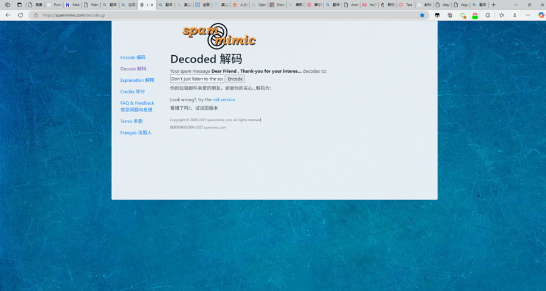

## Challenge 2 – Encoded in Melodies（XM 隐藏信息）

题目概述：  
“She wants to tell you something, encoded in melodies. Within the digital symphony, her true voice emerges. What is the hidden message found in the XM file? The words she longed to sing, the feeling she wanted to share.”  
  
这一关给出的是一个 XM 模块音乐文件。题目暗示要在音乐数据中挖出一段被隐藏的英文短句。

### 2.1 初步信息收集

1. 使用十六进制编辑器或 strings 对 XM 进行字符串提取，可以看到若干可读文本，例如：  
 • Extended Module: How Do you Feel?  
 • Can Anybody Extract  
 • The urban Legend Information About "Feel" From this XM file  
 • They say if you trace the peaks carefully enough, it spells a sentence that was never meant to be heard.  
  
2. 这些内容一方面点名了 I Feel Fantastic / Feel 相关的都市传说，另一方面明确告诉我们：  
 “trace the peaks”（追踪峰值）是解题关键，真正的信息被编码在波形的峰值结构中。

### 2.2 从 XM 到 WAV：准备解码素材

XM 不能直接用 wave 库解析，需要先渲染成 WAV：  
 • 使用 OpenMPT / MilkyTracker 打开 XM；  
 • 在 Samples / Patterns 中找到那段形状异常规则的 sample（通常像由一串脉冲/条形组成的波形）；  
 • 只导出该段为单声道、16-bit PCM WAV，例如 Feel.wav；  
 • 确认格式：1 通道 / 16-bit / 44.1k 或 48k 采样率，方便后续脚本处理。

### 2.3 峰值分析与比特流恢复

根据提示，我们对 WAV 进行如下处理：  
 1. 使用 Python 的 wave + struct 读取所有采样点，将其归一化到 [-1, 1]；  
 2. 选择一个窗口大小 SAMPLES\_PER\_BIT（代表每个 bit 占用的采样数），以及峰值阈值 THRESHOLD\_RATIO；  
 3. 对每个窗口计算绝对值最大值：若大于阈值记为 bit=1，否则为 bit=0；  
 4. 拼接获得 bit 串，并去除两端长串 0 填充；  
 5. 以 8 位为一组解析 ASCII，尝试 offset=0~7 对齐，寻找出现连贯英文的那一组。

核心脚本思路示意：  
 • 读取 WAV → 归一化样本；  
 • 滑动窗口 → 峰值超过一定比例则为 1，否则为 0；  
 • 尝试不同 SAMPLES\_PER\_BIT / 阈值 / 偏移，从输出文本中筛选出看起来像自然英文的候选。

### 2.4 最终结果

经过调参与偏移尝试，可以恢复出一段清晰的英文短句：  
  
 I Feel Fantastic heyheyhey  
  
这句话与该都市传说高度契合，也恰好回应了题面：“the words she longed to sing, the feeling she wanted to share”。  
因此，Challenge 2 的隐藏信息（密码）为：  
 Hidden message = "I Feel Fantastic heyheyhey"

## Challenge 3 – 传说在 YouTube 上的起点

题目概述：  
“She just feels love, and her legend once spread across YouTube. Her song touched hearts, but the original video on the YouTube platform has been removed — deleted, re-uploaded, distorted, like memories fading with time. Through the fragments of public records, find where her voice first echoed: the original video ID, upload date (YYYY-MM-DD), and the one who first shared her.”  
  
这一关要求通过公开信息，还原被删除的原始 YouTube 视频的：  
 • Video ID；  
 • Upload Date；  
 • Uploader。

### 3.1 信息收集与关键线索

1. 以 "I Feel Fantastic original YouTube upload"、"I Feel Fantastic creepyblog" 等关键词进行搜索。  
2. 找到多篇考据帖子、百科以及 Internet Archive 记录，均指向同一条已下架视频：  
 • 原始链接形式为：https://www.youtube.com/watch?v=rLy-AwdCOmI  
 • 归档信息中给出的 uploader 为：Creepyblog；  
 • 上传时间记录为：2009-04-15。  
3. 不同来源（Wiki、长文考据、存档站）之间进行交叉验证，确保 ID、日期与 uploader 一致，且与我们已知的传说背景吻合。

### 3.2 结果与答案

综合多个公开来源，可以稳定得出结论：  
 • Video ID：rLy-AwdCOmI  
 • Upload Date：2009-04-15  
 • Uploader：Creepyblog  
  
这条视频就是将 Tara / I Feel Fantastic 推向大众视野的起点，也符合题目所说“her legend once spread across YouTube”。

## Challenge 4：购买链接、发件人与创作年份

**Challenge 4** **提示：**“Her creator captured her voice, preserved in a 15-minute audio/video DVD. She only wanted to sing, and he gave her that chance. If you wish to purchase her album, to hear her songs of love, which link should you visit? After purchasing, who is the sender? And what is the actual creation year when these musical compositions first came to life?”

**后续提示：**“Some called her creator a murderer, others said he built her out of love. She only wanted to sing. She wants to tell you. She just feels love. The truth lies in older archives — an obituary, a quiet memorial, where the story of her creator rests in digital silence. Find the developer's digital grave. (URL, no trailing slash)”

本题是一道偏 OSINT（开源情报）+ 辟谣向的趣味题，围绕 2000 年代早期的机器人音乐视频 “I Feel Fantastic” 和背后的机器人 Tara the Android 以及其作者展开。

### 1.1 先锁定作品与人物

题目强调几点关键信息：  
• 15 分钟的 audio/video DVD；  
• “She only wanted to sing”；  
• 围绕“她的创作者（creator）”。  
  
把这些关键词与网络上早已有名的怪谈视频结合，很容易联想到 YouTube 上的 “I Feel Fantastic” —— 一个金发人形机器人反复唱 “I feel fantastic, hey hey hey” 的诡异视频。

搜索 “I Feel Fantastic Tara the Android” 可以迅速定位到相关的维基百科与介绍文章，确认：  
• 机器人名字：Tara the Android；  
• 创作者：John L. Bergeron；  
• 作品形式：收录在一张名为《Android Music Videos Volume 1》的 DVD 中，长度约 15 分钟。

### 1.2 找到官方销售页面（购买链接）

接下来从公开资料出发：  
1）在 “I Feel Fantastic” 相关页面（例如 Wikipedia）里，会看到一个 “Official website / 官方网站” 的外链，指向一个古早的机器人爱好者站点：Android World（AndroidWorld.com）。  
2）在站内继续搜索 “Tara” 或浏览产品列表，可以找到一个页面标题为 “Android Music Videos”，正文写着类似：  
 “John Bergeron has produced a 15 minute audio/video DVD of his android singing. …”  
 并说明这是一份独特（unique）的音乐视频 DVD，可通过页面支付购买。

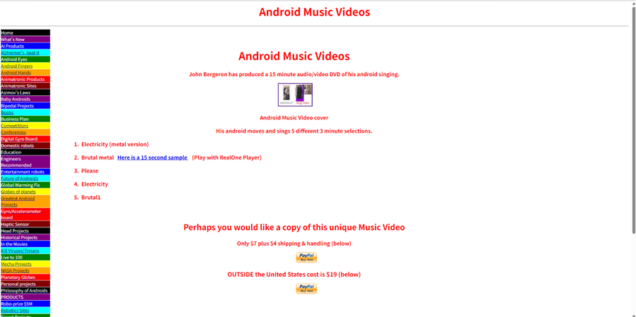

这个页面的路径固定为：

***http://www.androidworld.com/prod68.htm***

（现在有时会跳转到 androidworld.us 的镜像站点，但题目要的是“哪一个链接”，重点是 /prod68.htm 这个路径。）

因此，对应 Challenge 4 的第一问：  
• 购买链接（Purchase Link）：http://www.androidworld.com/prod68.htm

### 1.3 确认发件人（Sender）

题目第二问是：购买之后，谁是发件人？这就需要搞清楚是谁在运营 Android World 并寄出 DVD。

步骤：  
1）在 /prod68.htm 页面底部，可以看到一行联系信息，诸如：  
 “Comments? Email me at crwillis@androidworld.com.”  
 说明维护这个站点、处理订单的人使用邮箱 crwillis@androidworld.com。  
2）继续访问 AndroidWorld 的 “About / Contact” 或其它产品页（如 prod01jp 等），会看到更完整的抬头：  
 “Chris Willis; Android World, President; 3311 Santa Monica Dr, Denton, TX 76205, USA  
 General Information: crwillis@androidworld.com”  
 这说明 Android World 由 Chris Willis 负责，他以公司名义出售这些机器人相关产品。

因此在实际邮寄中，包裹上的发件人可以视为：  
• Android World / Chris Willis（邮箱 crwillis@androidworld.com）。  
这就是 Challenge 4 第二问期望你从 OSINT 中抽象出的 “sender”。

### 1.4 “创作年份” 而不是上传年份

第三问非常绕：  
“What is the actual creation year when these musical compositions first came to life?”  
  
注意这里问的是乐曲本身第一次“诞生”的年份，而不是：  
• DVD 出售上线的年份；  
• YouTube 上被重新上传的年份。

网络上关于 “I Feel Fantastic” 有大量二手甚至阴谋论式的说法，年份常常被写乱。要得到相对可信的“创作年份”，比较稳妥的做法是交叉对比多个权威/半权威源：

1）作者亲自购买 DVD 的实录文章  
 有一篇在 Medium 上的长文，作者讲述自己亲自从 Android World 购买《Android Music Videos Volume 1》 DVD 的过程。文中展示了 DVD 文件在自己电脑上的元数据：  
 • Mac 元数据中的修改时间为：2004-12-06；  
 • 在文件内容中也能看到 2004 年的日期字符串。  
 作者据此得出结论：这张 15 分钟视频光盘的原始文件创建于 2004 年末。

2）影音数据库 / 电影条目  
 在 Letterboxd、Cineamo 等影片数据库中，《Android Music Videos Volume 1》被列为：  
 • 影片年份：2004；  
 • 时长：16 分钟左右；  
 • 导演/制作：John Bergeron。  
 这些条目通常以“首发年份”来标注作品的年代。

3）音乐数据库（MusicBrainz 等）  
 在 MusicBrainz 上，艺术家 “John L. Bergeron” 的唱片目录中，  
 《Android Music Videos Volume 1》被归档为 2004 年的作品。

4）百科条目  
 Wikipedia 中对 “I Feel Fantastic” 的历史描述中，明确写到：  
 “I Feel Fantastic is a surrealist music video … created by John Bergeron in 2004.”  
 并指出 2009 年的 YouTube 版本只是别人对其中一个片段（歌曲《Please》）的二次上传。

综合以上多方信息，可以得出：  
• 机器人 Tara 作为实体，大约在 2003–2004 年间被组装完成；  
• 这几首歌曲（Electricity / Brutal Metal / Please 等）以及对应的音乐视频在 2004 年制作完成并刻录进 DVD；  
• 2009 年在 YouTube 上走红只是后续的传播事件。

因此，对应 Challenge 4 第三问的 “实际创作年份” 应写作：

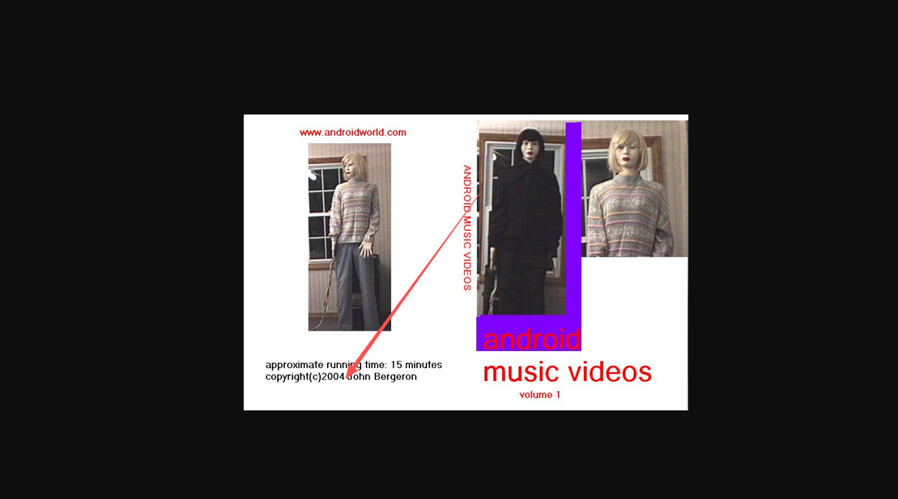

***Creation Year: 2004***

### 1.5 小结：Challenge 4 最终答案

整理一下本关需要提交的三个字段（英文形式）：  
• Purchase Link: http://www.androidworld.com/prod68.htm  
• Sender: Android World / Chris Willis (crwillis@androidworld.com)  
• Creation Year: 2004

## Challenge 5. Developer’s Digital Grave：寻找创作者的数字墓碑

### 2.1 题目含义与方向

提示文本把网络上关于作者的流言也拉进来了：  
“Some called her creator a murderer, others said he built her out of love.”  
这正是多年来围绕 John Bergeron 的都市传说——有人把他想象成连环杀手，把视频中的“Run, run, run”与后院草地镜头解读成杀人现场。

但题目的关键在后半句：  
“The truth lies in older archives — an obituary, a quiet memorial…”  
—— 也就是说，真正的答案埋在老旧的讣告与纪念页面里，而不是阴谋论视频。

### 2.2 从音乐作品反查真人信息

既然上一关已经确认 DVD 与音乐的署名为 “John L. Bergeron”，我们可以从音乐数据库再往下挖。

在 MusicBrainz 上搜索 “Android Music Videos Volume 1 John Bergeron”，可以找到一个艺术家条目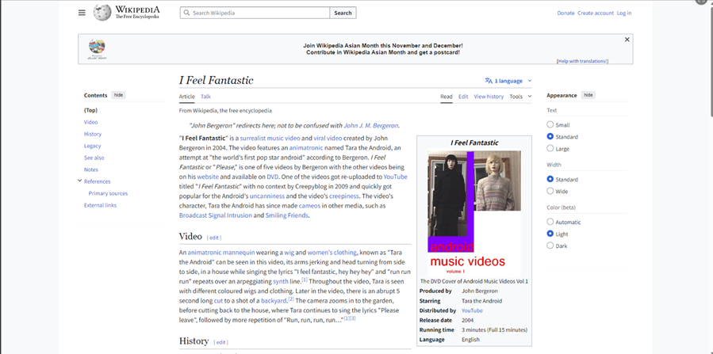  
• 名字：John L. Bergeron；  
• 作品：Android Music Videos Volume 1 (2004)；  
• 个人信息中写明：死亡日期为 2005-07-22，地点在 Vermont 州 Burlington 一带。

这一步非常关键：它把 “创作 I Feel Fantastic 的 John Bergeron” 和 “2005 年去世的 John L. Bergeron（Vermont 人）” 连接在一起。

### 2.3 追踪讣告与家族信息

拿到姓名 + 大致死亡日期之后，可以在本地报纸、族谱网站以及讣告数据库中继续检索，例如：  
• 搜索 “"JOHN L. BERGERON" "MILTON" "1940" 2005 obituary”；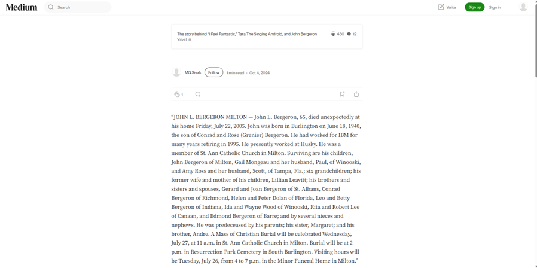  
• 能找到 2005 年 7 月份的讣告，内容大致是：  
 “John L. Bergeron, 65, died unexpectedly at his home Friday, July 22, 2005. … He had worked for IBM for many years … Burial will be in Resurrection Park Cemetery …”  
 同时列出了家人、子女等详细信息。

这一条讣告与 MusicBrainz 中的死亡日期、地区信息完全吻合，因此基本可以确认是同一个人。

### 2.4 在 Find A Grave 上定位 “数字墓碑”

题目要求的是开发者的 “digital grave（数字墓碑）”，而不是简单的讣告文本。最典型的数字墓碑服务就是 Find A Grave 这样的在线墓地网站。

用 “John Louis Bergeron 1940–2005 Resurrection Park Cemetery” 作为关键词，在 Find A Grave 中可以找到一条记录：  
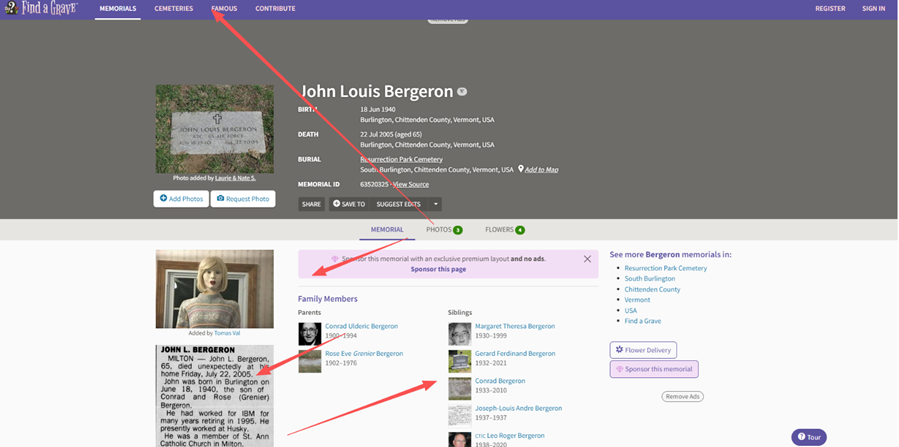

***https://www.findagrave.com/memorial/63520325/john\_louis-bergeron***

该页面列出了：  
• 姓名：John Louis Bergeron；  
• 出生：1940-06-18；  
• 去世：2005-07-22；  
• 安葬地点：Resurrection Park Cemetery, South Burlington, Vermont, USA；  
并在“Family links”中列出了他的父母、兄弟姐妹等家庭成员。

结合前面 MusicBrainz 的音乐作品、讣告中的细节、死亡时间与地点，可以较为可靠地认为：  
• 这就是 “I Feel Fantastic / Android Music Videos Volume 1” 的创作者 John L. Bergeron；  
• 上述 Find A Grave 页面就是题目所说的 “developer's digital grave”。


### 2.5 小结：数字墓碑答案

因此，对应这关需要提交的 URL（不带结尾斜杠）的形式为：

***https://www.findagrave.com/memorial/63520325/john\_louis-bergeron***

## 解题思路回顾与经验总结

本题的难点不是技术，而是信息噪音：网上关于 “I Feel Fantastic” 的都市传说太多，真正有用的事实反而被压在后面。

关键经验可以总结为：  
1）优先找一手源：  
 • 官方站点（AndroidWorld / prod68.htm）；  
 • 亲自购买者的记录（Medium 长文）；  
 • 正规的音乐 / 影视数据库（MusicBrainz, Discogs, Letterboxd 等）。  
  
2）注意题目措辞里的“坑”：  
 • creation year ≠ upload year；  
 • sender ≠ 创作者本人，而是实际寄盘的人/机构；  
 • digital grave 暗示的是 Find A Grave 这类网站，而不是随便一个博客。

3）对于有争议的人物，OSINT 的意义在于“去神秘化”：  
 • 通过公开记录，我们看到的是一个普通的工程师/音乐爱好者；  
 • 他在 2004 年做了一个略显诡异但本质上只是实验性艺术的机器人音乐视频；  
 • 2005 年他去世，之后作品被误读成各种恐怖故事。

题目通过让选手去查阅创作年代、销售链接、讣告与墓碑，实际上是在引导大家：  
• 用事实和原始记录对抗流言与阴谋论；  
• 记住这些作品背后是真实的人，而不仅仅是 “creepypasta” 的素材。


# Signin

直接抓包改进程得到flag

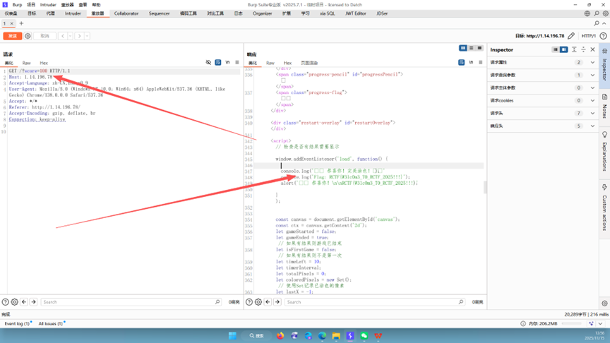

# Shadows of Asgard

流量取证题 Writeup

**一、题目**

在一次红队演练中，洛基（Loki）成功入侵了雷神 Thor 的主机，并植入了后门程序。Thor 虽然发现了异常并拿到了 Loki 的 C2 服务器 IP，但他只会跑目录扫描，对真正的溯源与反制一无所知。于是他把抓到的全部网络流量（challenge.pcapng）交给我们，希望找出 Loki 的行为细节并恢复被窃取的数据（flag）。

**本题的核心目标包括：**

1. 从 pcap 流量中识别出 Loki 的 C2 通信。

2. 理解 C2 协议（初始化握手 + 加密方式）。

3. 找到隐藏在 PNG 图片中的命令通道并成功解密。

4. 恢复 Loki 在受害主机上执行的关键命令（pwd、drives 等）的信息。

5. 找到数据外传记录，解出最终的 flag。

​

**二、环境与工具准备**

题目附件：challenge.pcapng（通过压缩包解出）。

推荐工具：

• Wireshark：用于流量整体分析、协议解码、导出 HTTP 对象；

• 任意十六进制编辑器（如 HxD）：用于查看 PNG 结构与 chunk；

• Python + PyCryptodome：用于编写 AES 解密脚本，批量解密隐藏数据。

​

**三、流量初步分析：锁定 Loki 的 C2**

1. 使用 Wireshark 打开 challenge.pcapng，先通过 “Statistics -> Conversations” 查看会话统计。可以发现本地内网 IP（如 192.168.77.134）与外部 IP 106.52.166.133 之间存在较为集中的 TCP 通信，端口为 10111。

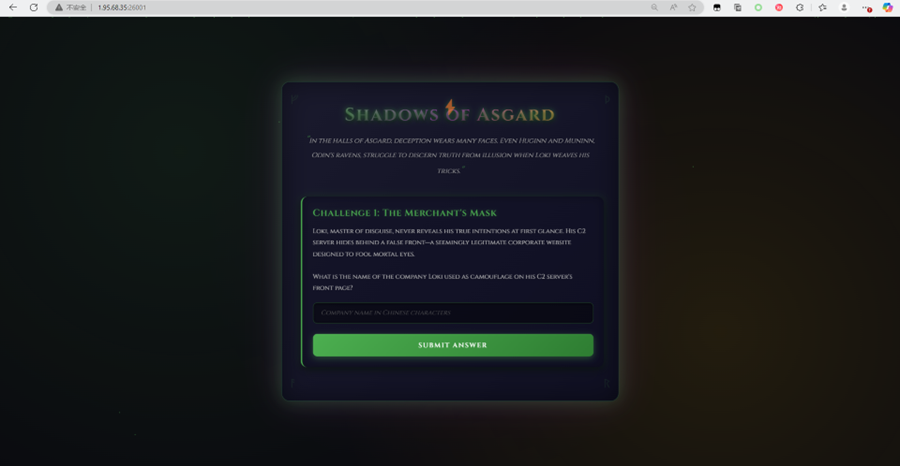

2. 在 Wireshark 里设置过滤条件：

***​******tcp.port == 10111 或 ip.addr == 106.52.166.133***

可以看到都是 HTTP 流量，通过 “Follow -> HTTP Stream” 能重组出完整的 HTTP 请求和响应。

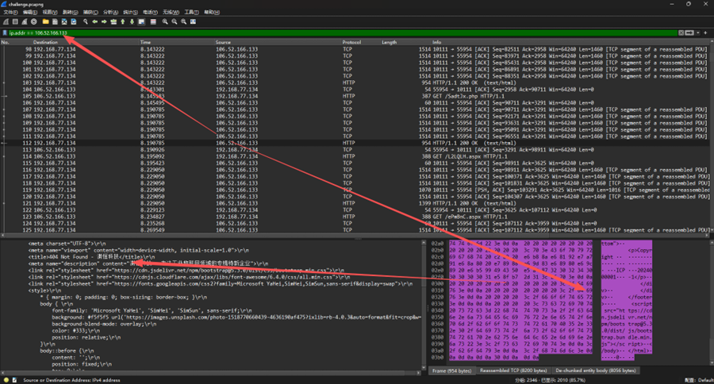

提交发现成功

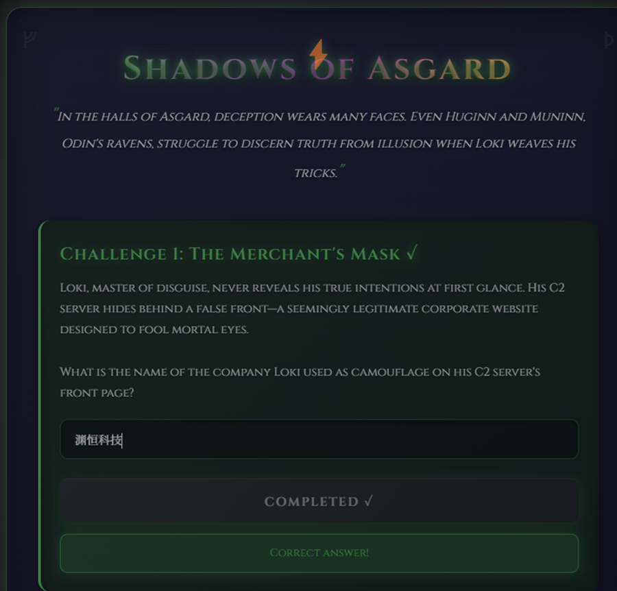

3. 访问该 HTTP 服务的根路径（/）的响应内容是一张正常公司官网风格的页面，看上去像是一家做物联网/工业相关业务的公司官网。这说明 Loki 把 C2 服务伪装成了一个“正常企业网站”来混淆视听。

**​**

**四、C2 初始化流量与 AES 密钥恢复**

在 10111 端口的 HTTP 流量中，过滤 POST 请求（http.request.method == "POST"），可以看到一条非常可疑的请求：

***​******POST /api/init/7411244dcfc0e6d5 HTTP/1.1***

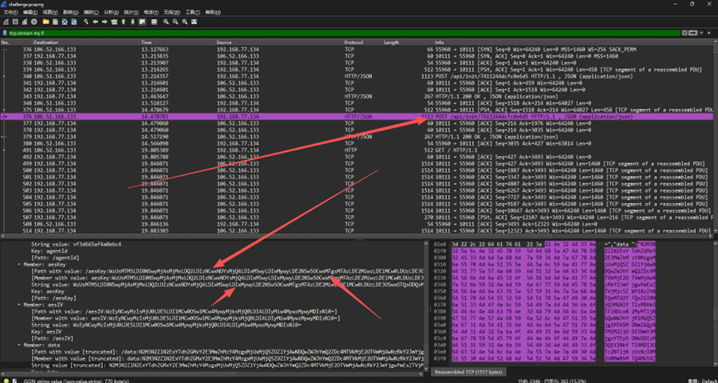

选中该请求的 HTTP body，Wireshark 会显示一个 JSON 结构，大致如下（格式化后）：

***{******"agentId": "vf3d665af4a0ebc4",******"aesKey": "WzUsMTM5LDI1NSwuLi5d",******"aesIV":******"WzEyNCw4MiwuLi5d",******"data":******"N2M3N2ZlN2ExYTdhZGMxY2E3MmZhMzY4MzgxMjUxMjQ5ZDY..."  
}***

其中 aesKey / aesIV 看似普通的 Base64 字符串，实则内部封装了一段“整型数组”的字符串，例如：

***Base64 解码 aesKey 之后得到内容类似：******"[5,139,245,220,231,46,234,146,248,211,2,213,2,165,98,118,103,162,3,150,4,53,179,194,84,207,45,245,88,179,193,101]"***

可以推断：Loki 客户端先把 AES 密钥生成为一个 32 字节的整型数组，再序列化为字符串，最后整体做了一次 Base64，服务器拿到后再反序列化即可使用。IV 也是同样的套路，只不过长度为 16 字节。

在 Python 中可用如下思路恢复 key / iv（伪代码）：

|  |
| --- |
| ***import base64, json, ast***  ***from Crypto.Cipher import AES***  ***​***  ***body = json.loads(http\_body)***  ***aes\_key\_str = base64.b64decode(body["aesKey"]).decode()***  ***aes\_iv\_str******= base64.b64decode(body["aesIV"]).decode()***  ***key\_list = ast.literal\_eval(aes\_key\_str)******# 转成 Python list[int]***  ***iv\_list******= ast.literal\_eval(aes\_iv\_str)***  ***key = bytes(key\_list)******# 32 字节，AES-256***  ***iv******= bytes(iv\_list)******# 16 字节，IV*** |

***​***

这样就拿到了 C2 通信使用的 AES-256-CBC 的密钥与 IV，为后面解密隐藏数据做好了准备。

​

**五、解密 init data：确认 Loki 代理进程路径**

接下来处理 JSON 里的 data 字段。可以看到 data 也是一长串 Base64 字符串：

|  |
| --- |
| ***data\_b64 = body["data"] data\_hex\_ascii = base64.b64decode(data\_b64)******# 得到一串十六进制的 ASCII 字符 cipher\_bytes = bytes.fromhex(data\_hex\_ascii.decode()) cipher = AES.new(key, AES.MODE\_CBC, iv) plain = cipher.decrypt(cipher\_bytes)*** |

***​***

对解密得到的明文去掉 PKCS#7 填充后，是一个 JSON 结构，包含 agent 上报的系统信息 systemInfo：

|  |
| --- |
| ***{*** ***"systemInfo": {*** ***"hostname": "DESKTOP-EO5QI9P",*** ***"username": "dell",*** ***"PID": 6796,*** ***"Process": "C:\\Users\\dell\\Desktop\\Microsoft VS Code\\Code.exe",*** ***...*** ***},*** ***"timestamp": 1763017667381 }*** |

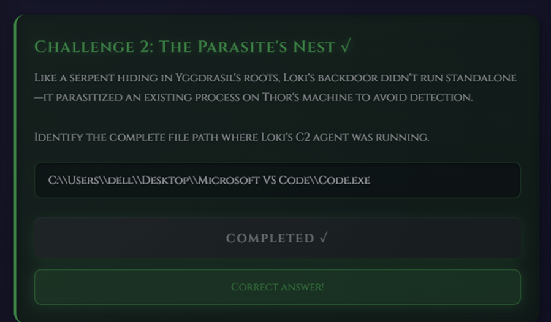

由此可以回答题目中与代理进程相关的问题：

• Loki 的 C2 代理运行的完整文件路径为：

C:\\Users\\dell\\Desktop\\Microsoft VS Code\\Code.exe

​

**六、PNG 图片中的隐藏命令通道**

仅有 init 流量还不够，我们需要进一步寻找 Loki 下发命令、主机回传结果的通道。观察 HTTP 流量发现，C2 站点首页会加载多张 PNG 图片资源（/assets/xxx.png）。这些图片很可能被用作隐写载体。

在 Wireshark 中使用 “File -> Export Objects -> HTTP”，筛选出所有 image/png 对象，将其导出到本地。

随后用十六进制编辑器打开任意一张导出的 PNG，可以看到标准结构：  
 • PNG 文件头：89 50 4E 47 0D 0A 1A 0A  
 • 多个标准 chunk：IHDR、IDAT、IEND 等  
 • 额外出现了 tEXt chunk，类型字段为 'tEXt'。

tEXt chunk 的格式为：  
 length(4) + 'tEXt'(4) + data(length) + CRC(4)  
data 部分内容形如：  
 "Comment\x00ZDRmNGZhMTU1MTU1YzI4NTM5NmU2NDNiMGM4YzlhMDE2ODdjZjFlMzc1MmZj."

可见 keyword 为 "Comment"，后面是一大串 Base64 编码的数据。对该 Base64 解码后，会得到一串十六进制字符串，再转为真正的密文字节，用前面恢复出的 AES key/iv 进行 AES-256-CBC 解密，同样可以得到 JSON：

|  |
| --- |
| ***cipher\_b64 = comment\_payload hex\_ascii = base64.b64decode(cipher\_b64) cipher\_bytes = bytes.fromhex(hex\_ascii.decode()) plain = AES.new(key, AES.MODE\_CBC, iv).decrypt(cipher\_bytes) # 去掉填充后再 json.loads(plain)*** |

解密多张 PNG 后，我们可以拿到一系列 Loki 下发到受害主机的任务（task），示例包括：

|  |
| --- |
| ***{ "command": "ls",******"outputChannel": "o-zgq4608uhw",******"taskId": "2b414ac4" } { "command": "pwd", "outputChannel": "o-1xk645wxtri",******"taskId": "c0c6125e" } { "command": "spawn whoami", "outputChannel": "o-7wnt1zex4mu", "taskId": "6e786b2a" } { "command": "drives", "outputChannel": "o-wup8k5bgwft", "taskId": "4471e3a8" }*** |

***​***

其中，与题目问题直接相关的包括：

• Loki 执行的 pwd 命令对应的 taskId 为：c0c6125e；

• drives 命令会返回各个盘符的信息，其中包含 C 盘创建时间等关键字段。

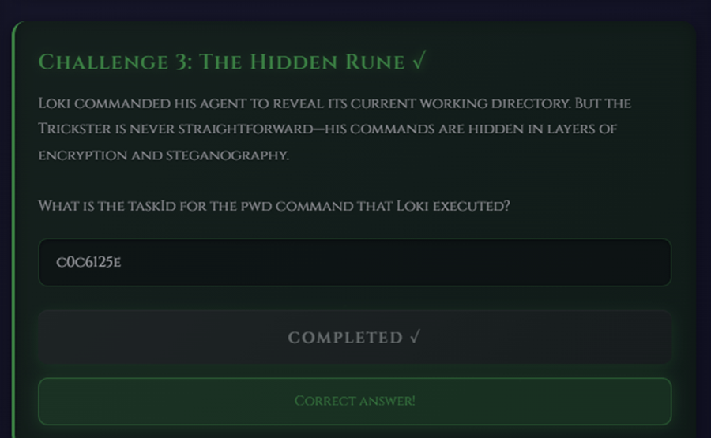

**七、解密 drives 输出：C 盘创建时间**

对某一张 PNG 的 tEXt 数据解密后，可以看到 Loki 代理执行 drives 命令的输出，内容类似：

|  |
| --- |
| ***Drive: C: Created: Fri Sep 14 2018 23:09:26 GMT-0700 (Pacific Daylight Time) Modified: Wed Nov 12 2025 22:52:43 GMT-0800 (Pacific Standard Time)*** |

***​***

因此可以得出：雷神主机 C 盘的创建时间为：

***2018-09-14 23:09:26***

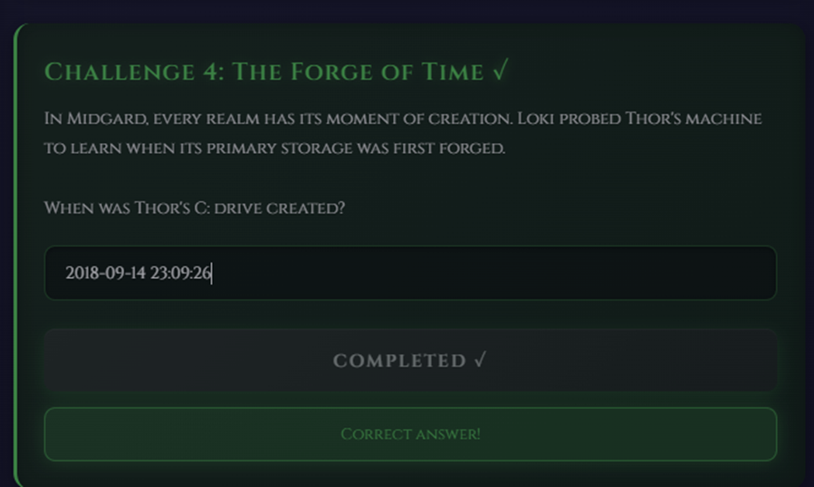

**八、外传文件与最终 flag 的恢复**

继续解密剩余的 PNG tEXt 数据，又发现了一条非常可疑的任务 JSON，字段如下：

|  |
| --- |
| ***{*** ***"outputChannel": "o-2ggeq7qpt2u",*** ***"taskId": "shell-upload-1763017722153",*** ***"fileId": "dd45c631-ec19-40b1-aa1b-e3dea35d21ae",*** ***"filePath": "C:\\Users\\dell\\Desktop\\Microsoft VS Code\\fllllag.txt",*** ***"fileData": "UkNURnt0aGV5IGFsd2F5cyBzYXkgUmF2ZW4gaXMgaW5hdXNwaWNpb3VzfQ==" }*** |

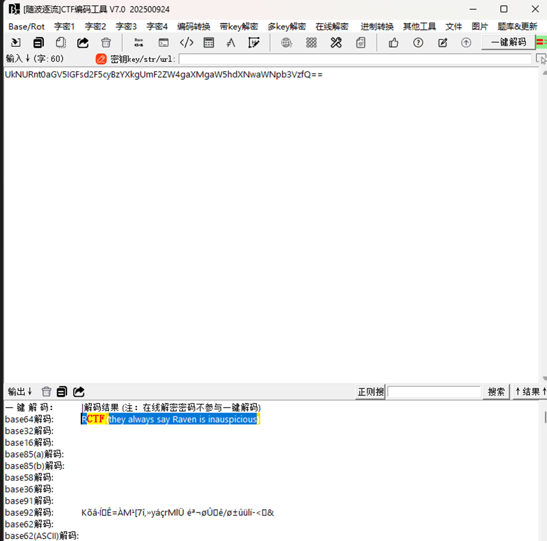

可以看出，这是一条“文件上传”类任务，Loki 把本地文件 fllllag.txt 的内容通过 C2 回传，fileData 字段即为该文件内容的 Base64 编码。

在 Python 中解码非常简单

|  |
| --- |
| import base64 data = "UkNURnt0aGV5IGFsd2F5cyBzYXkgUmF2ZW4gaXMgaW5hdXNwaWNpb3VzfQ==" print(base64.b64decode(data)) |

​

解码结果为：

***RCTF{they always say Raven is inauspicious}***

这就是本题最终的 flag。

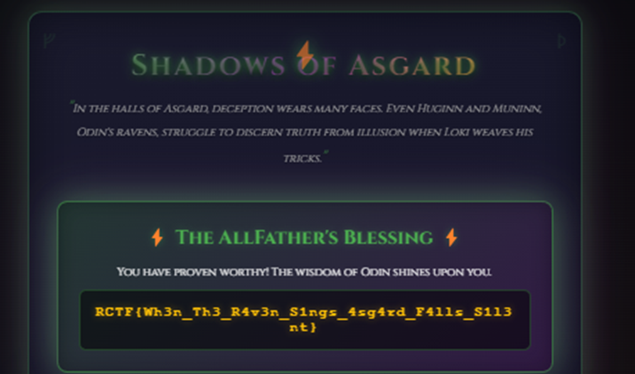

​

# Chaos

终端运行即可得到flag

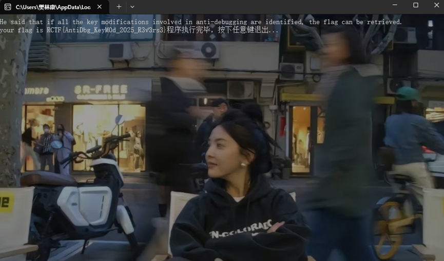
