# 银狐组织最新ValleyRAT样本分析-先知社区

> **来源**: https://xz.aliyun.com/news/19355  
> **文章ID**: 19355

---

## 概述

近日，笔者在日常分析工作中，追踪到一款针对国内的恶意EXE样本，为了定位其攻击背景，笔者尝试对此样本进行了系列分析，最终从外联通信行为、木马内置配置信息、外联C&C、远控模块等多角度确定此样本实际为银狐组织最新ValleyRAT样本。

通过分析，梳理此样本行为如下：

* **villa.exe样本**是一款通过PyInstaller打包的EXE程序，运行后会在%temp%目录释放并运行**恶意BGL.exe**文件和**正常卡尔别墅.pptx**文件；
* 恶意**BGL.exe**文件运行后将解密**shellcode1**，外联C&C地址下载加密数据，解密获取**shellcode2**；
* **shellcode2**加载后，将自加载内置的PE文件，此PE文件实际为**上线模块.dll**；
* 尝试对此样本进行溯源，发现此样本与近期曝光的《Chrome Installer Impersonation Campaign Targets China-Based Victims with ValleyRAT Trojan Rahul Ramesh》事件中的ValleyRAT同源，同时多平台将其识别为ValleyRAT样本，故笔者也将其背景定位为ValleyRAT样本；
* 在对样本通信数据包进行分析的过程中，笔者发现通过xor算法对直接对其通信数据进行解密（笔者从其通信数据中提取了后续**登录模块.dll**样本）。

## villa.exe

文件名称：villa.exe  
文件大小：18031013 字节  
MD5 ：14521699F0184011A3F083DDFBBB0BCA  
SHA1 ：0D32CF02611A158E4D9A955D13F26680DB836E3E  
CRC32 ：25C8AD9F

### python反编译

通过分析，发现此样本实际是一款由PyInstaller打包的EXE程序，直接查看字符串即可发现PyInstaller字符串信息。

因此，笔者使用了如下工具对此样本进行了反编译：

* pyinstxtractor-ng工具：用于将EXE程序转换为pyc文件；

* 下载地址：`https://github.com/pyinstxtractor/pyinstxtractor-ng`

* pylingual工具：用于将pyc文件转换为py文件；

* 下载地址：`https://github.com/syssec-utd/pylingual`

* 备注：由于此EXE程序是由python3.11编译的，故无法使用uncompyle6工具对其进行反编译，因为uncompyle6工具暂只支持3.9.3

相关截图如下：

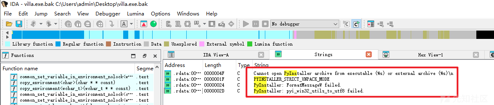

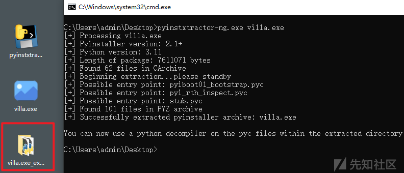

### stub.py

成功对villa.exe样本进行python反编译后，我们即可对反编译后的py脚本进行分析。

通过梳理，笔者确定stub.py脚本即为程序入口代码，尝试对stub.py脚本进行分析，梳理如下：

* 读取villa.exe样本文件内容，提取zip文件信息；
* zip文件信息存放于villa.exe样本末尾，长度为16字节，数据结构如下：

* ZIP文件大小：8字节，D6 EE 99 00 00 00 00 00；实际为0x99EED6
* magic\_number：8字节，BE BA FE CA EF BE AD DE；实际为0xDEADBEEFCAFEBABE，是脚本中16045690984503098046值的16进制形式

* 创建'packer\_temp\_{os.getpid()}\_{uuid.uuid4().hex}'目录，将文件解压至此目录中，运行文件。

相关代码截图如下：

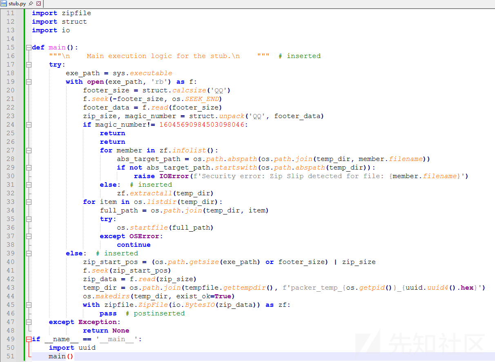

相关样本二进制截图如下：

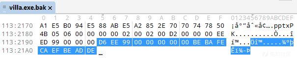

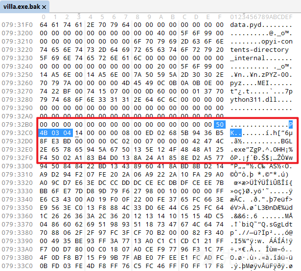

### ZIP压缩包

进一步分析，提取villa.exe样本携带的压缩包文件，即可发现此压缩包中携带了两个文件：

* 卡尔别墅.pptx：正常文件，文件修改时间为2025-11-8 02:18:17
* BGL.exe：木马文件，文件修改时间为2025-11-8 01:53:25

相关截图如下：

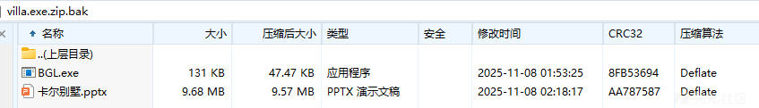

## 卡尔别墅.pptx

文件名称：卡尔别墅.pptx  
文件大小：10154781 字节  
修改时间：2025年11月8日 02:18:17  
MD5 ：F21AE39CF0B937D5BE8B76CBD3E76A97  
SHA1 ：6A20A74E664EE453AC0787975D43DB413BCED117  
CRC32 ：AA787587

### 正常文件

通过分析，发现此样本实际为正常文件。

文件内容截图如下：

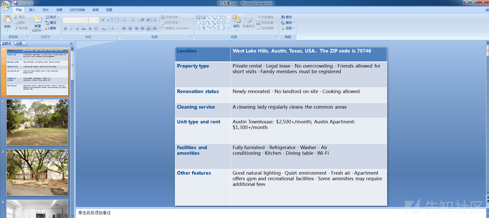

## BGL.exe

文件名称：BGL.exe  
文件大小：134144 字节  
文件版本：4.13.747.2523  
修改时间：2025年11月17日 11:54:15  
MD5 ：471D308CDD98A7D99CC35AF15505719D  
SHA1 ：26E00BAA12D78E9A3CF465D79E1D2B6D04E1C2F3  
CRC32 ：8FB53694

### UPX壳

通过分析，发现此样本携带了UPX壳，直接使用UPX脱壳工具即可对其进行脱壳。

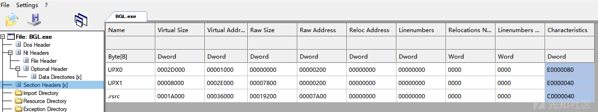

### 修复syscall调用代码

通过分析，发现此样本运行后，将按照如下逻辑修复syscall调用代码：

* 循环读取内存数据，并将内存中的6B 00 00 73 6B 00 00 74二进制修改为0F 05 90 90 C3 90 CC CC二进制；
* 动态调试分析，发现0F 05 90 90 C3 90 CC CC二进制实际为syscall代码；

相关代码截图如下：

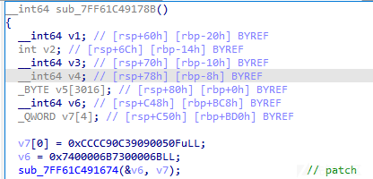

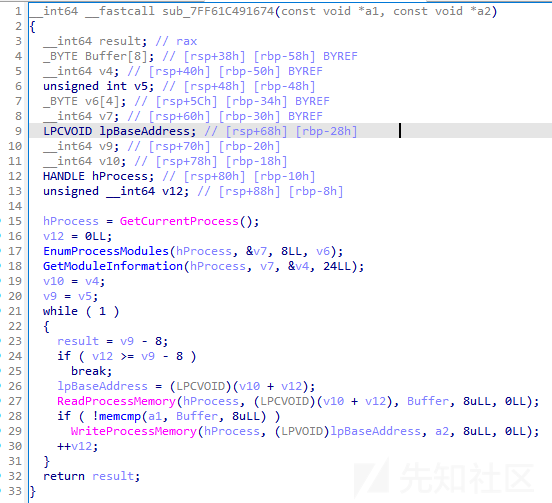

动态调试截图如下：

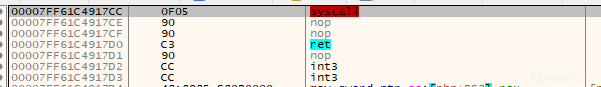

### 解密shellcode

通过分析，发现样本运行后将从自身数据中解密shellcode代码，shellcode代码长度为0xBBA。

解密代码截图如下：

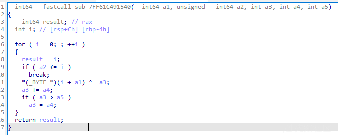

解密前数据截图如下：

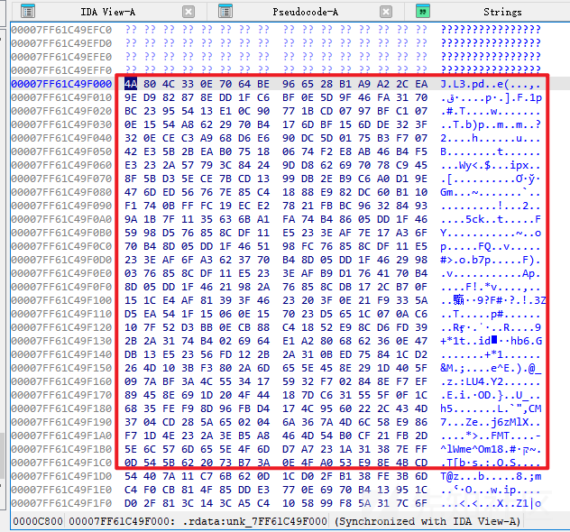

解密后数据截图如下：

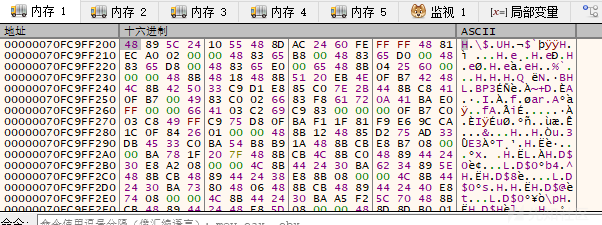

### 执行shellcode

成功解密shellcode代码后，样本将调用NtAllocateVirtualMemory、NtProtectVirtualMemory、NtCreateThreadEx、NtQuerySystemTime函数加载执行shellcode代码。

相关代码截图如下：

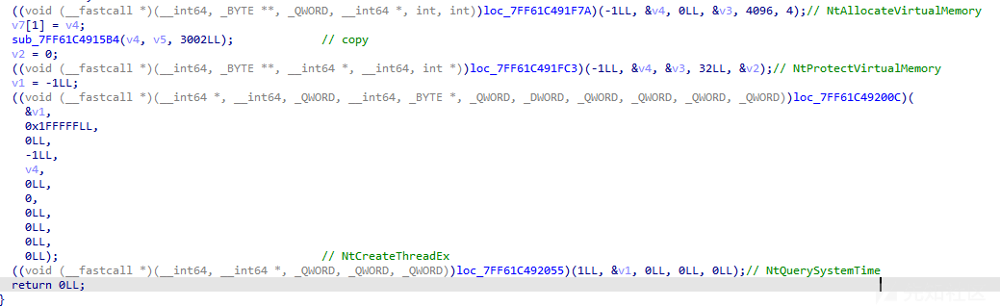

## shellcode1

### 配置信息

通过分析，发现在shellcode1代码末尾存放了整个样本的配置信息内容，相关截图如下：

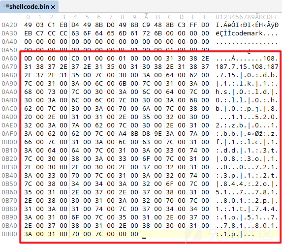

尝试对配置信息进行简单分析，提取配置信息内容如下：

`|p1:108.187.7.15|o1:447|t1:1|p2:108.187.7.15|o2:448|t2:1|p3:127.0.0.1|o3:80|t3:1|dd:1|cl:1|fz:默认|bb:1.0|bz:2025.11. 8|jp:0|bh:0|ll:0|dl:0|sh:1|kl:1|bd:0|`

进一步分析，发现关键配置信息如下：

* 外联地址：108.187.7.15:447、108.187.7.15:448、127.0.0.1:80
* 生成时间：2025.11. 8

### 获取API

通过分析，发现shellcode1运行后，将获取所需的API函数地址，相关代码截图如下：

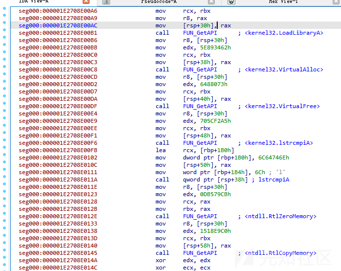

### 查找配置信息

shellcode1运行过程中，将在自身载荷中查找codemark字符串，用于定位配置信息内容。相关截图如下：

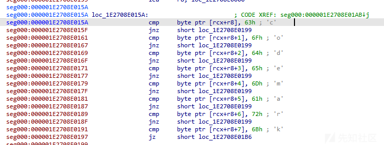

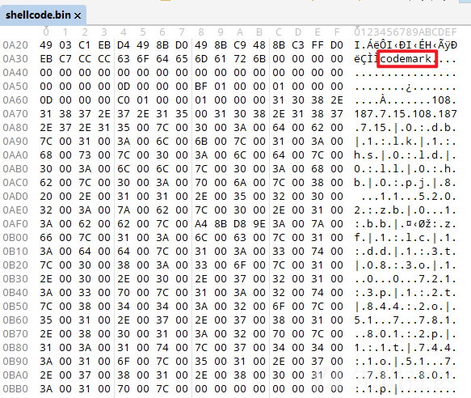

### 外联下载加密数据

成功获取配置信息后，shellcode1将根据配置信息中的外联地址发起外联通信，发送数据内容“64”后，随后C&C将向其返回加密数据。

相关代码截图如下：

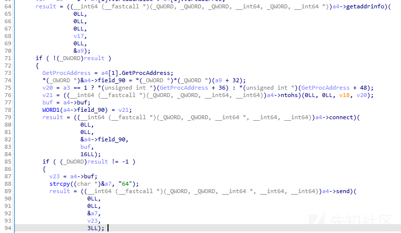

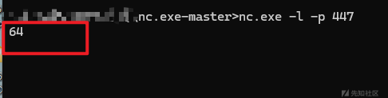

### 解密shellcode2

尝试模拟网络请求获取返回数据，并进一步分析。

发现shellcode在接收返回数据后，将对加密数据进行解密，获取shellcode2，然后加载执行shellcode2代码。

相关解密代码截图如下：

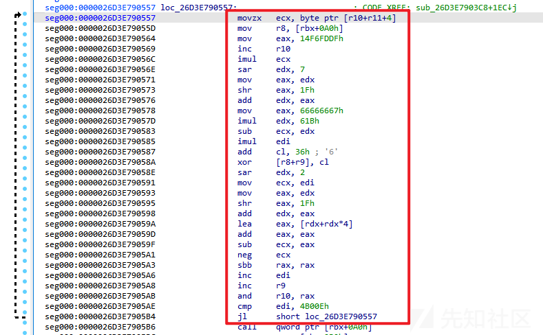

解密后shellcode2内容如下：

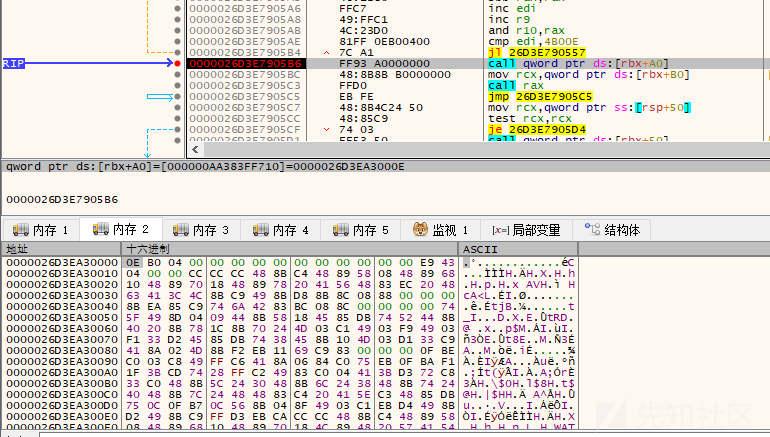

## shellcode2

### 内置PE文件

通过分析，发现在shellcode2代码中，携带了一个PE文件，相关载荷内容如下：

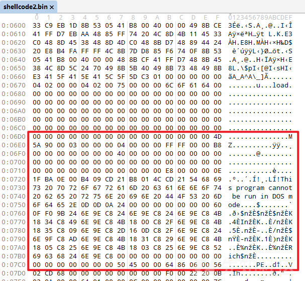

### 加载PE文件

进一步分析，发现此shellcode2的功能为：自加载内置的PE文件，相关代码截图如下：

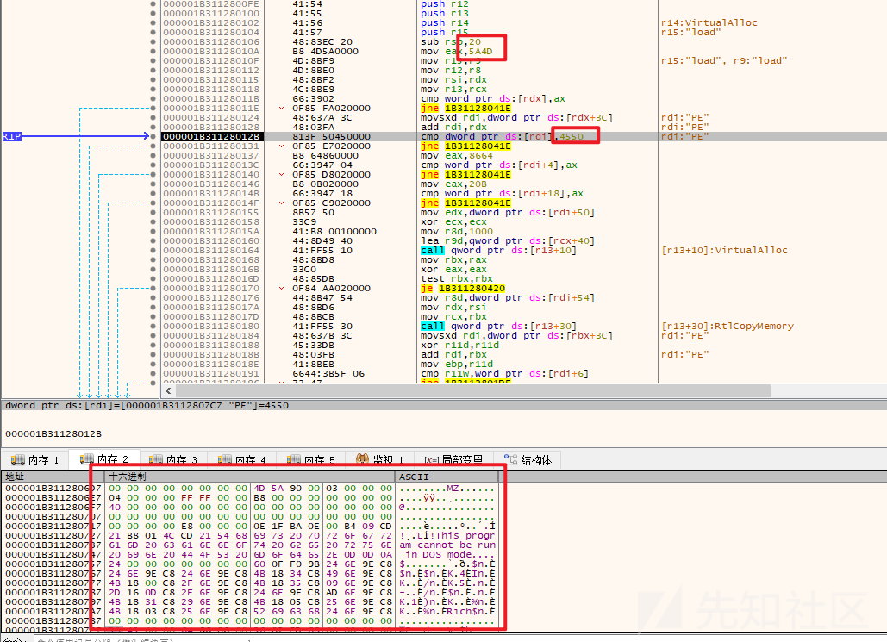

## PE文件-上线模块.dll

文件名称：shellcode2\_PE.bin  
文件大小：132096 字节  
MD5 ：98C3D0A794084AADB18786C41C088A19  
SHA1 ：8971F90458AC2749392C46A018E59C36D99E1F91  
CRC32 ：74CD1B82

### 加载DllMain函数

通过分析，发现shellcode2自加载PE文件的过程中，将首先加载PE文件的DllMain函数，相关代码截图如下：

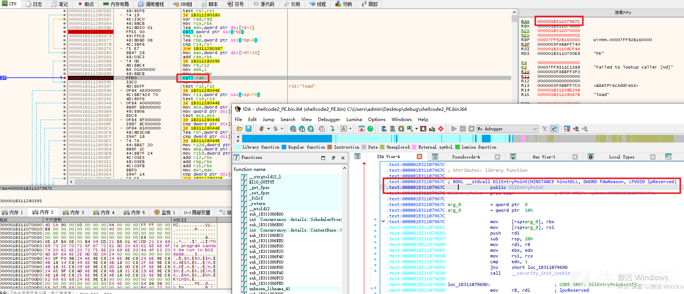

### 加载load函数

成功加载DllMain函数后，随后将把PE文件的load函数地址返回给shellcode1，并以配置信息作为参数加载运行load函数。

相关代码截图如下：

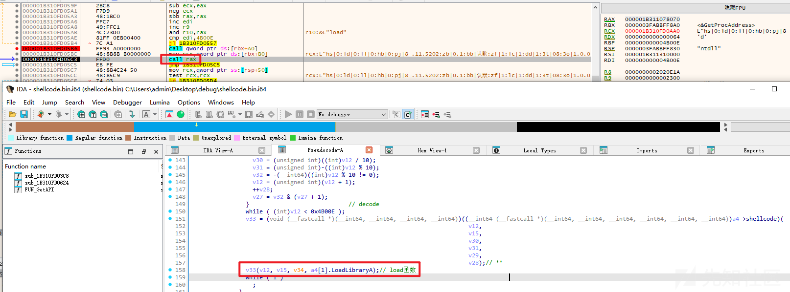

### ValleyRAT样本特征

通过分析，发现此PE文件中存在部分字符串特征，与银狐组织ValleyRAT样本攻击活动相关联：

* 上线模块.dll：模块名
* Console\1、d33f351a4aeea5e608853d1a56661059：后续插件在注册表中的存放位置

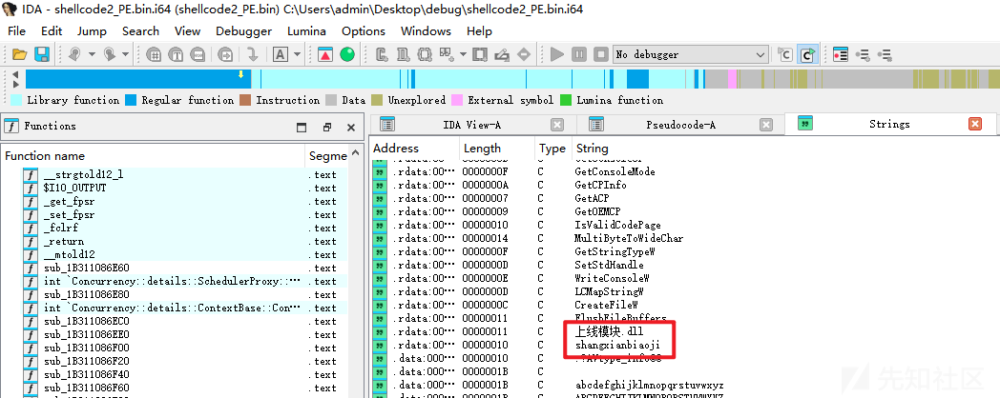

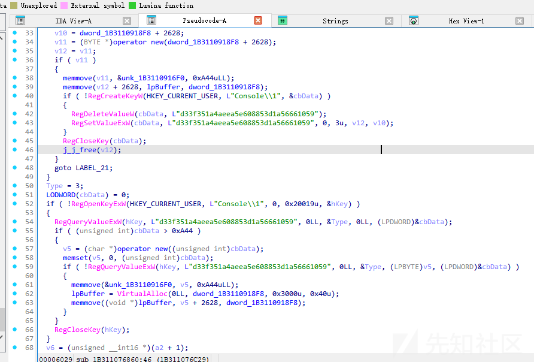

## 沙箱数据分析

为了进一步确定样本行为，笔者尝试将样本上传至微步沙箱，并从中提取了样本的通信数据。

### 通信数据解密

在对通信数据包进行分析的过程中，笔者发现数据包中存在大量的6666字符串，相关数据包载荷截图如下：

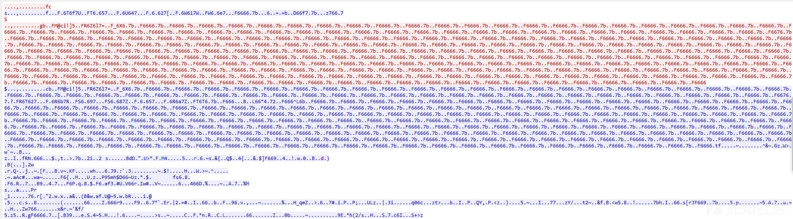

因此，笔者推测，此字符串就是它的解密密钥，所以，笔者就尝试了一下，发现基于此原理可有效解密其通信数据内容。

样本上传信息解密后内容如下：

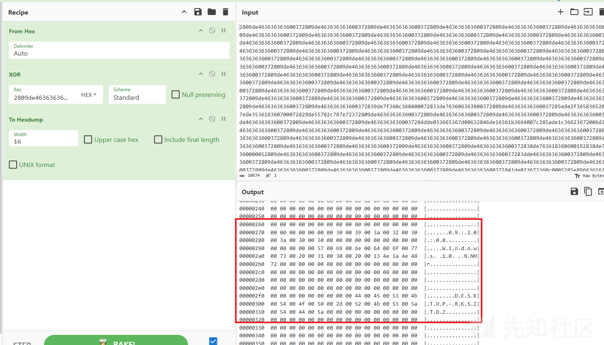

C&C下发的**登录模块.dll插件**内容如下：

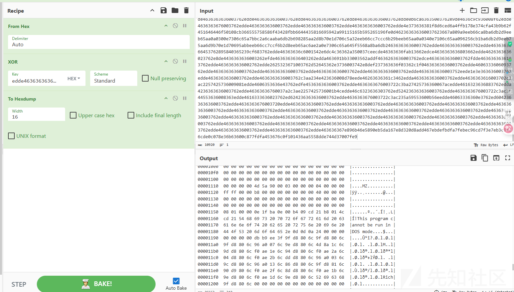

### {vU\_!jWW.dll.bin-登录模块.dll

文件名称：{vU\_!jWW.dll.bin  
文件大小：314368 字节  
MD5 ：695485ECA04998D2E4D7BDE212465F45  
SHA1 ：0625803F943CE7B125DCA151CD312B522283F63D  
CRC32 ：B943ADB8

通过分析，笔者发现此样本是C&C下发的`登录模块.dll`插件，同时笔者还发现样本中的默认外联地址为内网地址，因此，笔者推测，此`登录模块.dll`插件运行后，将根据配置信息参数自动更新运行过程中的配置信息。

相关代码截图如下：

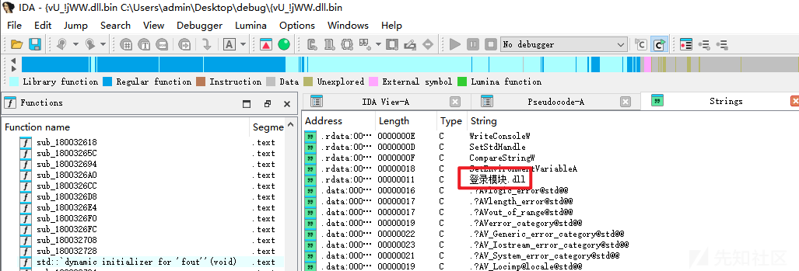

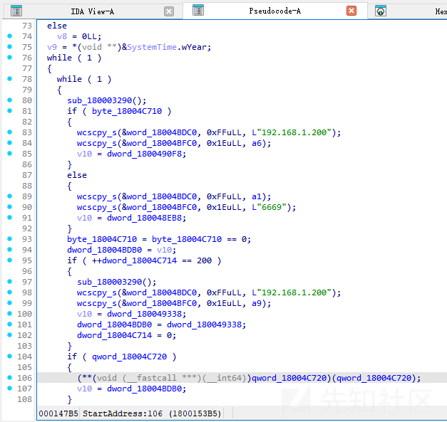

### 内存文件剖析

在查看微步沙箱结果时，笔者又发现了一个比较有意思的地方：**沙箱抓取的数据包中实际只传输了两个样本，但内存中提取了三个文件？**

进一步分析梳理：

* 第一个文件实际就是上线模块.dll；
* 第二、三个文件均是内存中运行的登录模块.dll，样本代码中的外联地址已替换为配置信息中的外联地址；

相关截图如下：

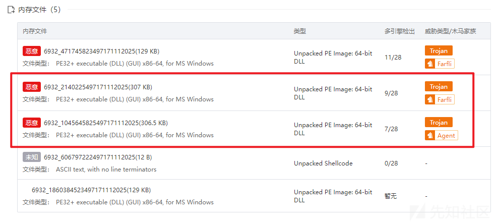

* 模块1

文件名称：9e32487dcd6cc8eb4900684a7817aed61db2504aa64ad74d42fffc888910cb96  
文件大小：314368 字节  
MD5 ：2E050D2E969CDAD4772DC0D47D577572  
SHA1 ：E3B0C79CCEFA107A18CC0646955B073E3D7BF1AB  
CRC32 ：79DB4A40

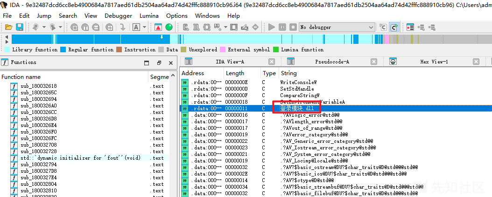

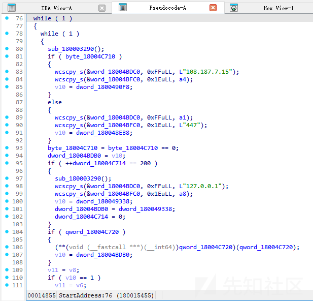

* 模块1

文件名称：42e78599941cf06893abf466fd5c0c2d58e0ff31adcf3099efcc7b344981fda5  
文件大小：313856 字节  
MD5 ：47ED16D677AF0DC440B79E233625D5C4  
SHA1 ：9793FF5E50F6D16FDF5008D2098F889BF1B68335  
CRC32 ：9EC2E24E

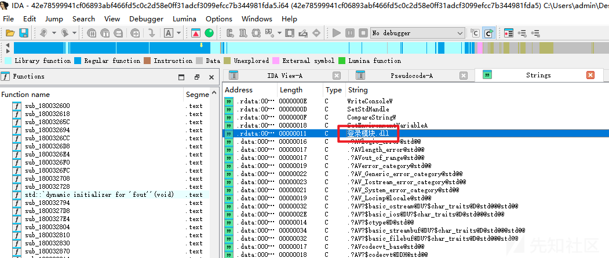

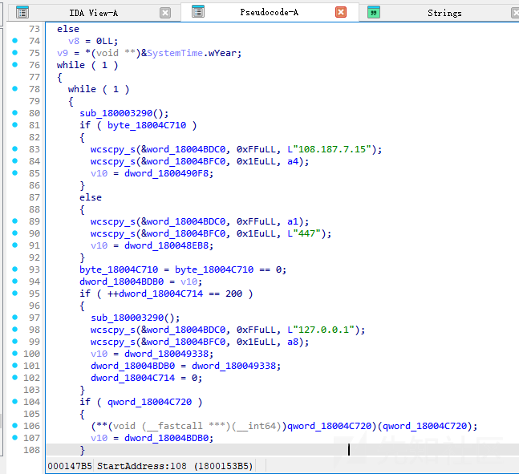

## 背景溯源

分析过程中，由于此样本的代码与银狐WinOS样本的众多特征相似，因此，笔者尝试对其样本家族进行了简单的研判：

* 多个沙箱平台将其识别为ValleyRAT样本；
* 近期《Chrome Installer Impersonation Campaign Targets China-Based Victims with ValleyRAT Trojan》文章对ValleyRAT样本的攻击活动进行了分析，同时还对WinOS 4.0样本和ValleyRAT样本进行了对比，最终确定此报告中的样本实际为ValleyRAT样本；
* 笔者尝试将《Chrome Installer Impersonation Campaign Targets China-Based Victims with ValleyRAT Trojan》文章中的ValleyRAT样本与本文中的样本进行对比，发现样本代码同源，故笔者也将其背景定位为ValleyRAT样本。

VT中沙箱平台标记如下：

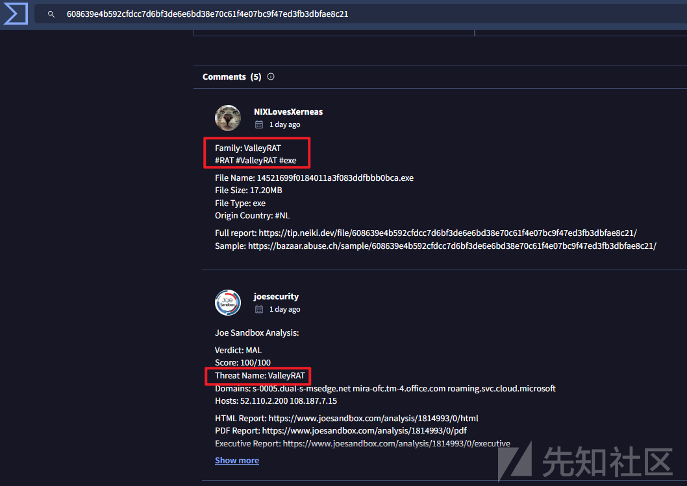

《Chrome Installer Impersonation Campaign Targets China-Based Victims with ValleyRAT Trojan》文章中关于ValleyRAT样本的样本家族确定如下：

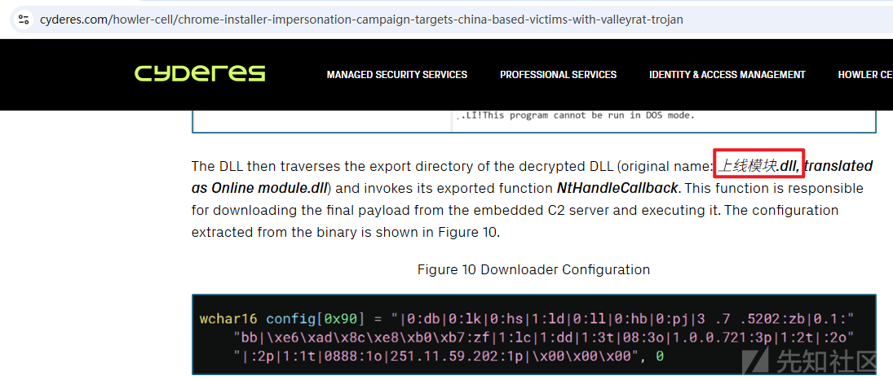

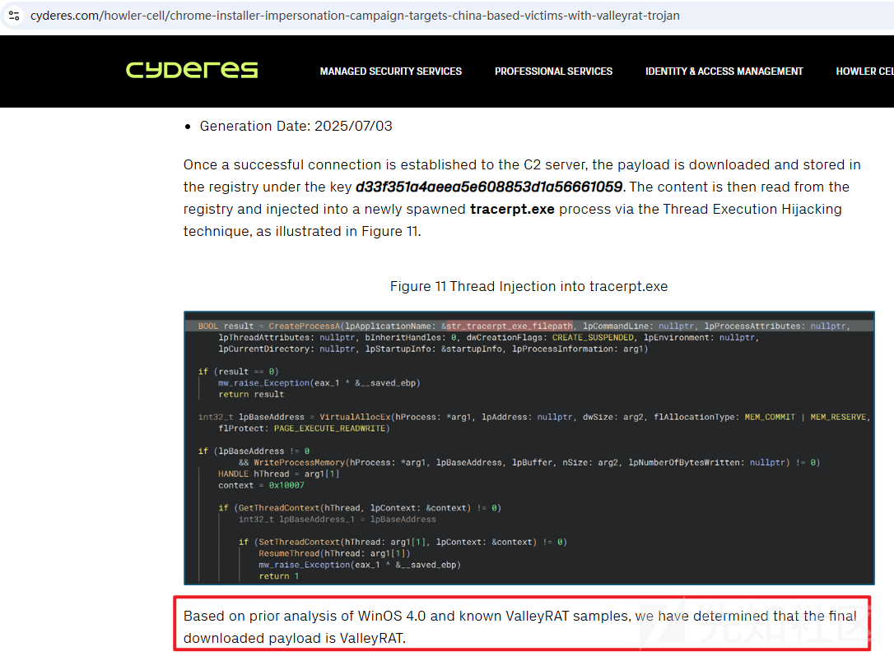

## IOCs

* 外联地址

|  |  |
| --- | --- |
| 外联地址 | 归属地 |
| 108.187.7.15:447 | 中国 香港特别行政区 |
| 108.187.7.15:448 | 中国 香港特别行政区 |

* 样本

|  |  |  |
| --- | --- | --- |
| 文件名 | MD5 | 备注 |
| villa.exe | 14521699F0184011A3F083DDFBBB0BCA |  |
| 卡尔别墅.pptx | F21AE39CF0B937D5BE8B76CBD3E76A97 | 正常文件 |
| BGL.exe | 471D308CDD98A7D99CC35AF15505719D |  |
| 上线模块.dll | 98C3D0A794084AADB18786C41C088A19 |  |
| 登录模块.dll | 695485ECA04998D2E4D7BDE212465F45 |  |
| 登录模块.dll | 2E050D2E969CDAD4772DC0D47D577572 | 内存文件 |
| 登录模块.dll | 47ED16D677AF0DC440B79E233625D5C4 | 内存文件 |
