# JWT 常见测试点-先知社区

> **来源**: https://xz.aliyun.com/news/19356  
> **文章ID**: 19356

---

# 一、JWT简单工作流程

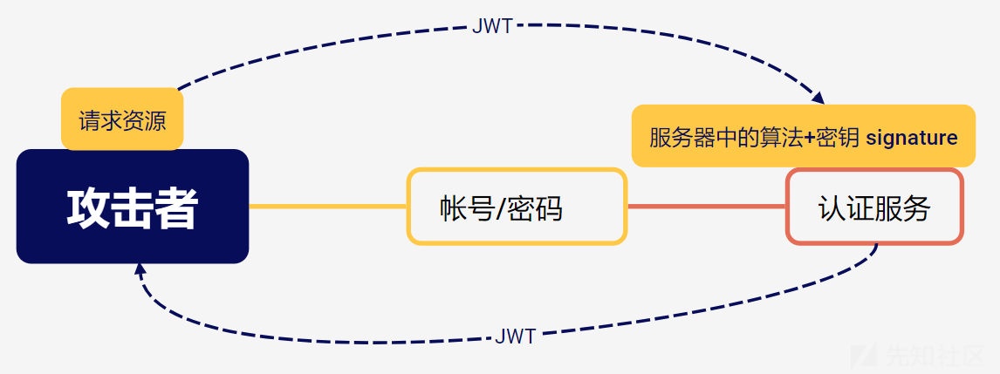

1.用户在登录界面输入账号与密码，通过 HTTPS 提交到认证服务器；

2. 认证服务器校验账号密码。若验证通过，则根据用户身份信息生成 **JWT Token**，并使用服务器端受信任的**密钥**进行签名；

3. 签名后的 JWT 返回给客户端 ；

4. 客户端将 JWT 存储在本地 ；

5. 客户端访问受保护 API 时，在请求头中携带该 token；

6. 服务器收到请求后解析 JWT 的三部分（Header、Payload、Signature） 。**不会信任** Header 中由客户端提供的字段 ；

7. 服务器根据配置中定义的算法与受信任的密钥（或公钥）对 Token 进行验签 ；

8. 验签成功后，服务器读取 Payload 中的用户信息。

# 二、未验证签名绕过JWT身份验证

## 1.漏洞利用过程

1. 使用正常用户账号密码登录系统，通过浏览器或 Burp Suite 抓包分析发现，系统的认证机制基于 **JWT（JSON Web Token）**。解析 Token 的 Payload，可见其中包含字段：其中 `unionid` 与 `account` 对应当前登录用户的唯一标识 。

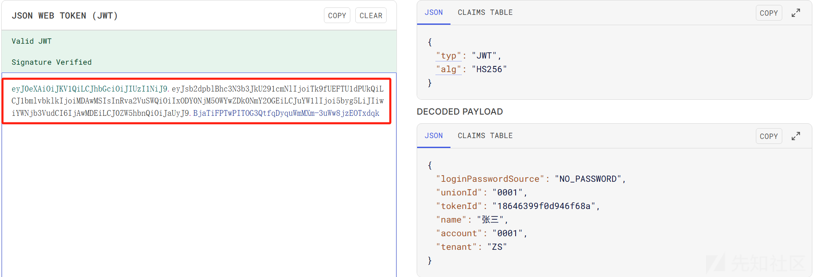

2. 将 Payload 中的 `account` 或 `unionid` 修改为另一合法用户的标识（例如 `user0002`），然后重新对 JWT 进行 **相同算法加密/签名**（或伪造签名）。

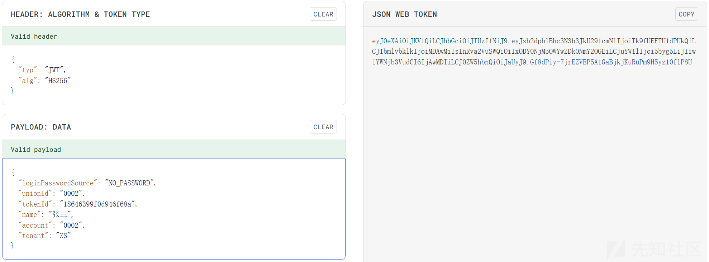

3. 在后续访问接口时，将请求头中的原 JWT 替换为伪造后的 Token ， 请求发送后，服务端未对 Token 进行有效签名验证，而直接依据 Token 中的 Payload 进行身份判断。结果成功访问到了 `user0002` 的个人信息数据。

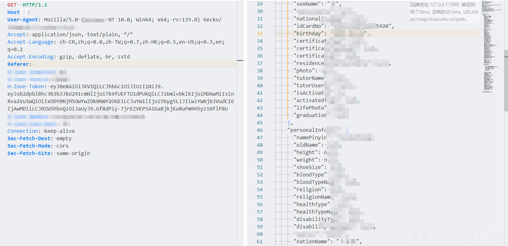

## 2.漏洞原理分析

在正常情况下，JWT 的验证逻辑应为：

1. 根据服务器配置的算法与密钥对 Token 进行验签；
2. 验签通过后才读取 Payload；
3. 根据 Payload 中的身份信息做授权。

出现漏洞的原因：服务端没有对 Token 进行验签，直接读取payload，返回用户信息。

## 3.修复意见

不要直接信任 Payload 内容所有身份信息应以数据库或会话验证为准；对用户访问的资源做服务端身份匹配校验。

# 三、有缺陷的签名验证绕过 JWT 身份验证

## 1.漏洞利用过程

靶场链接：<https://portswigger.net/web-security/jwt/lab-jwt-authentication-bypass-via-flawed-signature-verification>

1.使用普通帐号`wiener：peter`登录，sub为普通账户

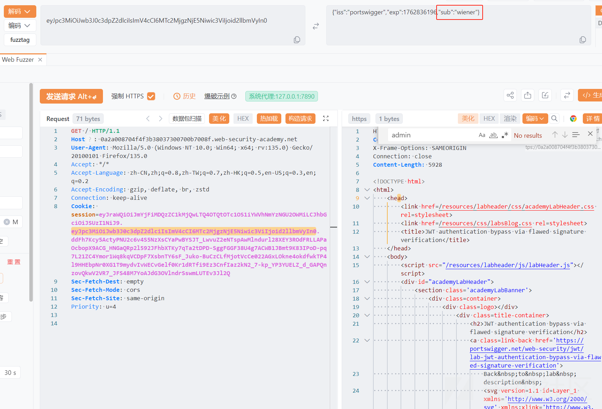

2.将 Payload 中的 `sub`修改为管理员用户的标识（例如 `administrator`），然后重新对 JWT 进行 **相同算法加密/签名**（或伪造签名）。 发现并未读取admin帐号的内容。

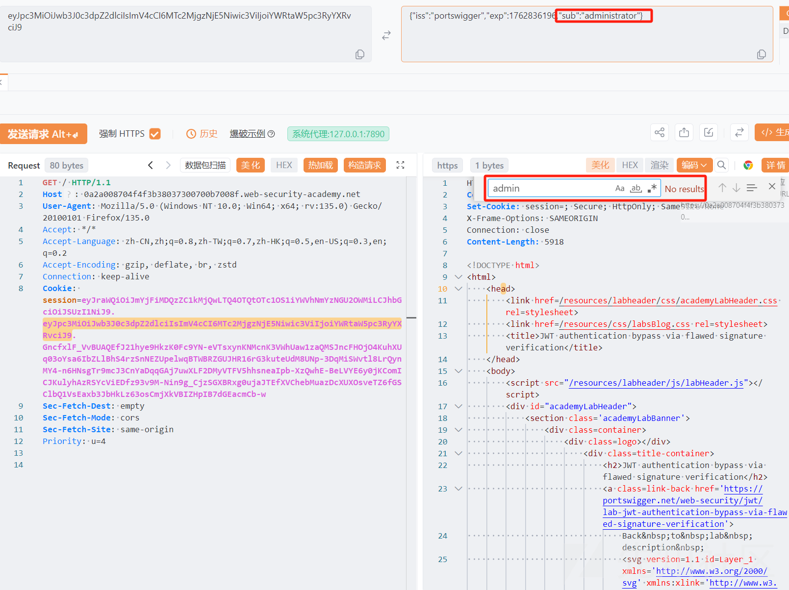

3.将Header中alg值修改为none后，成功访问到了admin信息。

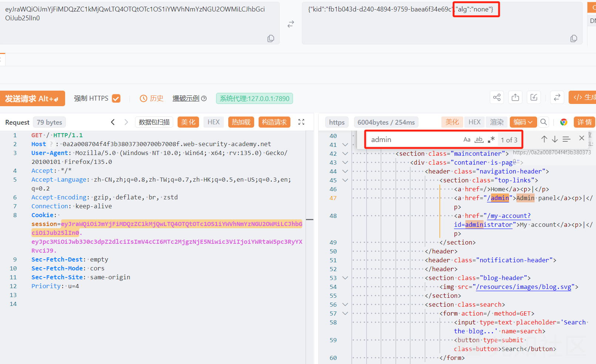

## 2.漏洞原理分析

出现漏洞的原因： 由于 `alg` 被设为“无签名”，错误实现的验证逻辑会跳过或绕过签名校验。 服务端把 payload 中的用户身份当作已认证身份处理。

```
alg = decodeHeader(token).alg
if (alg == 'none') {
    // 跳过签名验证 —— 致命错误
    payload = decodePayload(token)
} else if (alg == 'HS256') {
    verifyWithHMAC(token, secretFromConfigOrElsewhere)
} else if (alg == 'RS256') {
    verifyWithRSA(token, publicKey)
}
```

## 3.修复意见

1.严格校验 JWT 签名仅接受服务器端配置的算法，拒绝 alg: none；使用正确的密钥对，不允许客户端推测密钥。

# 四、弱签名密钥绕过 JWT 身份验证

## 1.漏洞利用过程

靶场链接：<https://portswigger.net/web-security/jwt/lab-jwt-authentication-bypass-via-weak-signing-key>

1.使用普通帐号 `wiener:peter` 登录，抓取请求中的 Cookie，解析得到 JWT，payload 中的 `sub` 字段为普通用户名，alg 为 `HS256`。

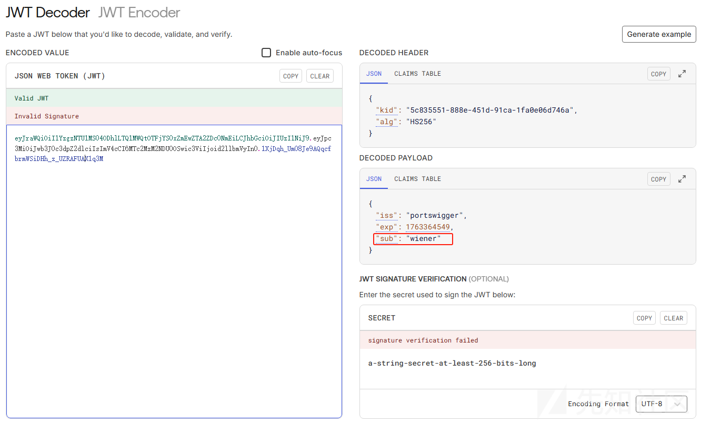

2. 使用 `jwt_tool.py`对 JWT 的签名密钥进行爆破。结果：密钥为 `secret1`

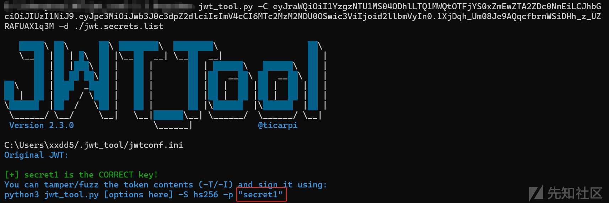

3. 使用爆破出的密钥 `secret1` 和 `HS256` 构造新 JWT，将 `sub` 改为 `administrator`（或所需的管理员用户名），生成新的签名。

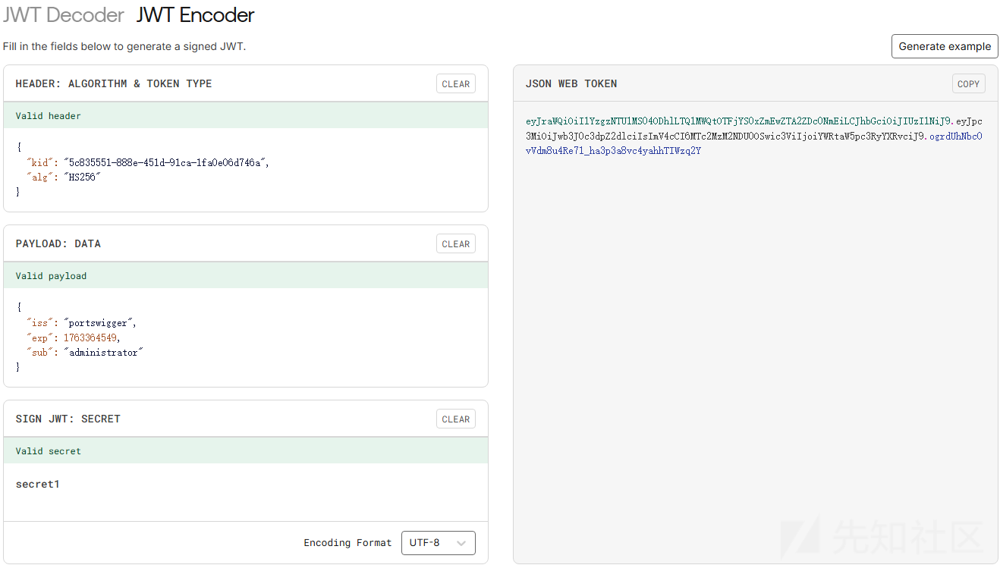

4. 将新 JWT 放回 Cookie，访问管理页面，确认成功获得管理员权限。

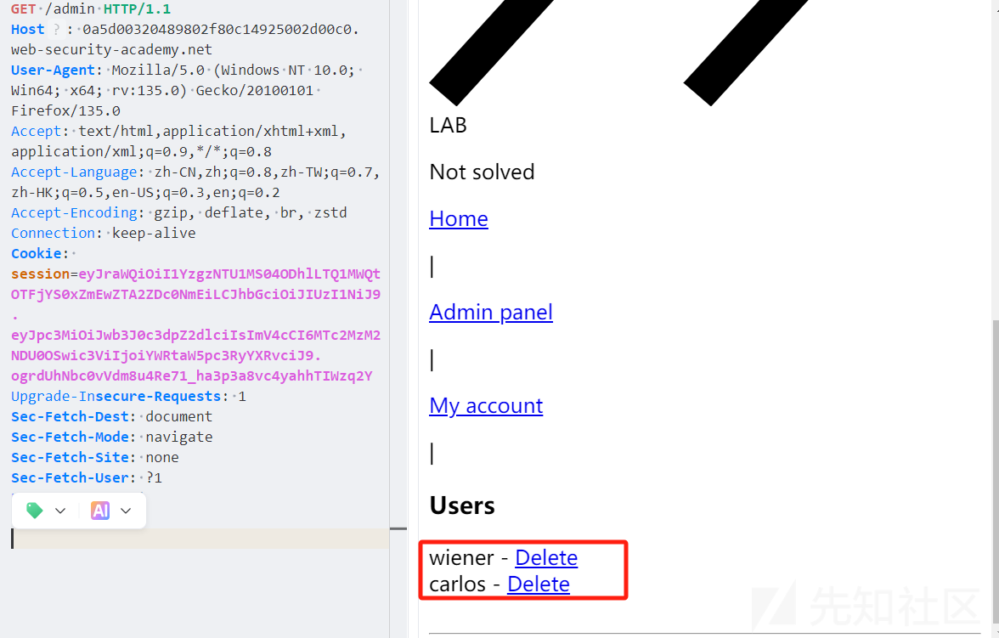

## 2.漏洞原理分析

HS256（HMAC-SHA256）使用的是 **对称密钥**：

* 加密和验证使用 **同一个密钥 secret**
* 只要攻击者爆破出该密钥，就可以伪造任意用户的 token

## 3.修复方法

1. 更换 JWT 密钥为高强度随机密钥（>=32字节）

2. 将 JWT 更换为非对称签名（强烈推荐）

# 五、通过 JWT 头部注入绕过 JWT 身份验证

## 1.漏洞利用过程

靶场链接：<https://portswigger.net/web-security/jwt/lab-jwt-authentication-bypass-via-jwk-header-injection>

1.使用普通帐号 `wiener:peter` 登录，抓取请求中的 Cookie，解析得到 JWT，payload 中的 `sub` 字段为普通用户名。

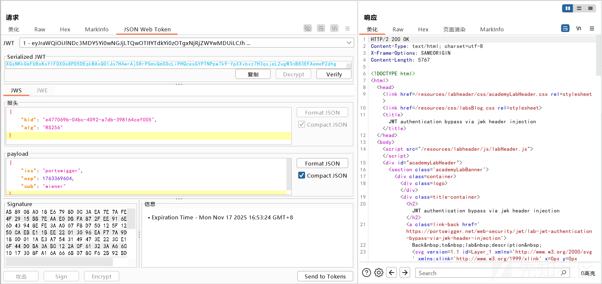

2.使用JWT\_editor生成新的RSA KEY, 用“我的私钥”重新签名整个 JWT 。

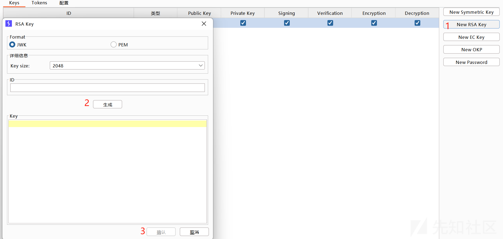

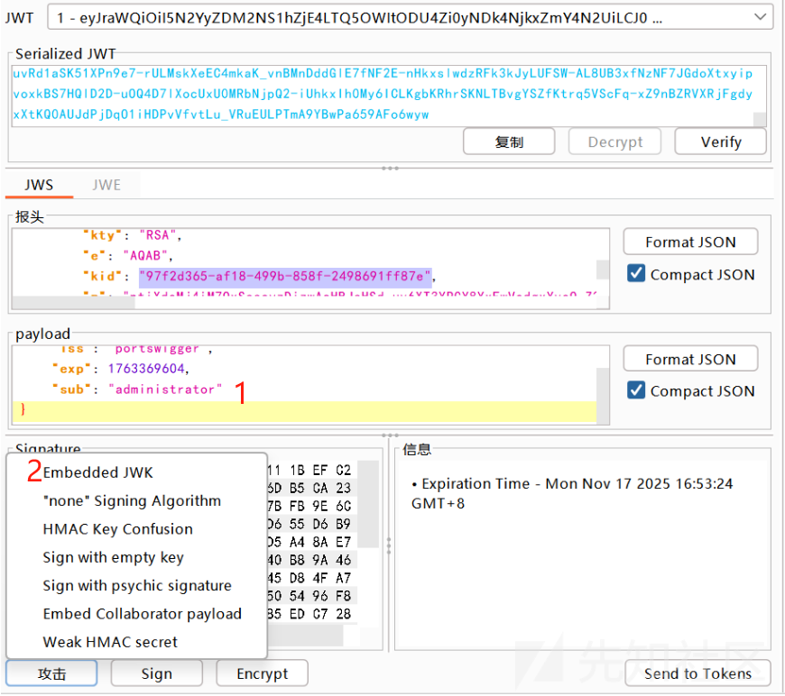

3.将新 JWT 放回 Cookie，访问管理页面，确认成功获得管理员权限。

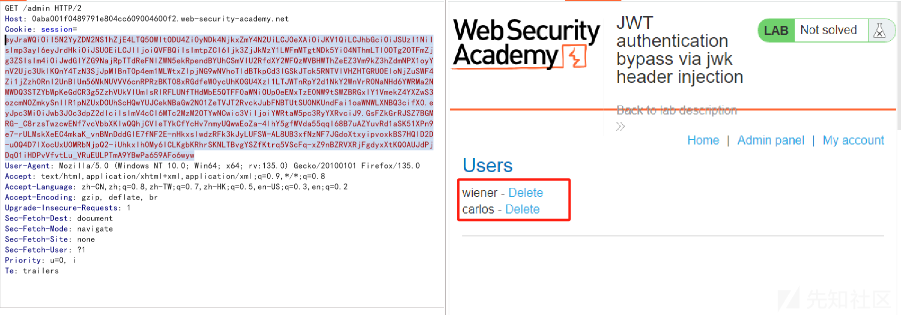

## 2.漏洞原理分析

**正常 RS256 流程**

* 服务器有自己的固定公钥（public key）
* JWT 是服务器用私钥签名的
* 验证时服务器使用“自己的公钥”验证

**漏洞场景（不安全配置）**

* 服务器**允许从 JWT header 中加载 JWK**
* 攻击者在 header 注入一个 JWK（即一个“我自己的公钥”）
* 然后攻击者用“我自己的私钥”重新签名整个 JWT
* 服务器天真地用攻击者提供的公钥验证，当然就“验证通过”

## 3.修复方法

1. 禁止解析 JWT header 中的 `jwk` 字段 ；

2. 禁止 jku（公钥 URL）除非启用了严格白名单 ；

3. 无论情况如何，都不允许“header 决定验证公钥” 。

# 六、通过注入 jku 标头绕过 JWT 身份验证

## 1.漏洞利用过程

靶场链接：<https://portswigger.net/web-security/jwt/lab-jwt-authentication-bypass-via-jku-header-injection>

1.使用普通帐号 `wiener:peter` 登录，抓取请求中的 Cookie，解析得到 JWT，payload 中的 `sub` 字段为普通用户名。

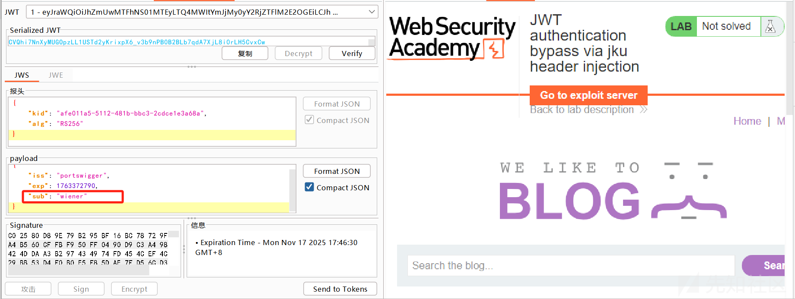

2.使用靶场提供的服务器放置RSA公钥

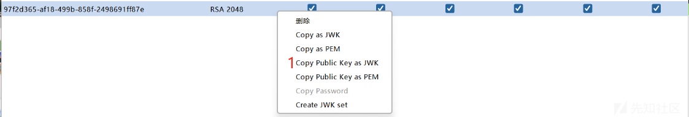

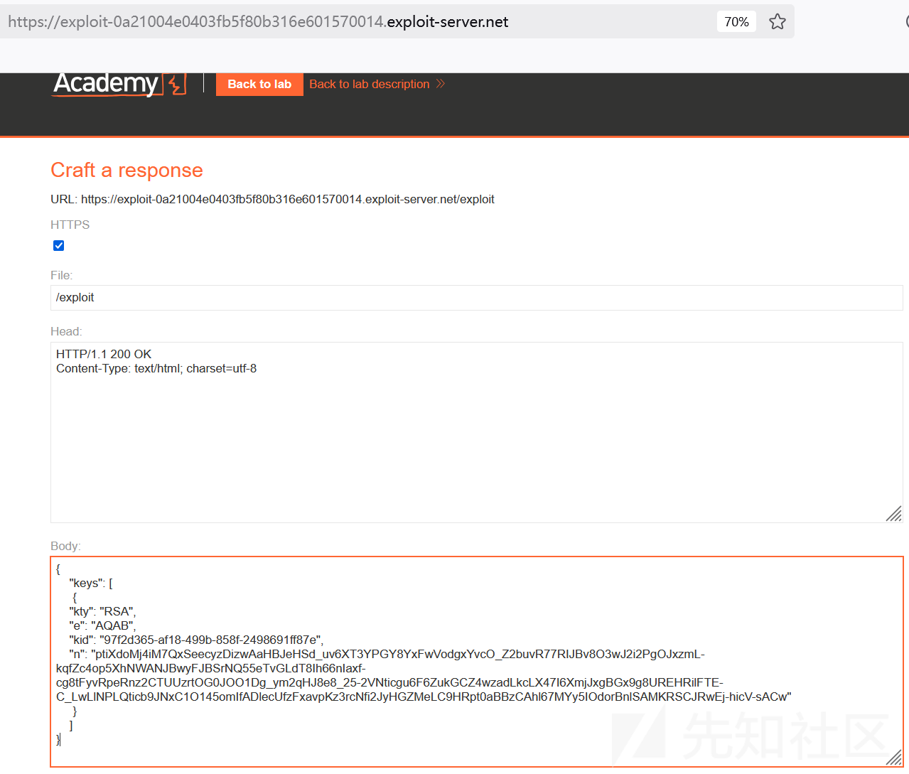

```
{
    "keys": [
     {
    RSA公钥
    ]
}
```

3.改动kid、jku、sub值，使用私钥生成JWT

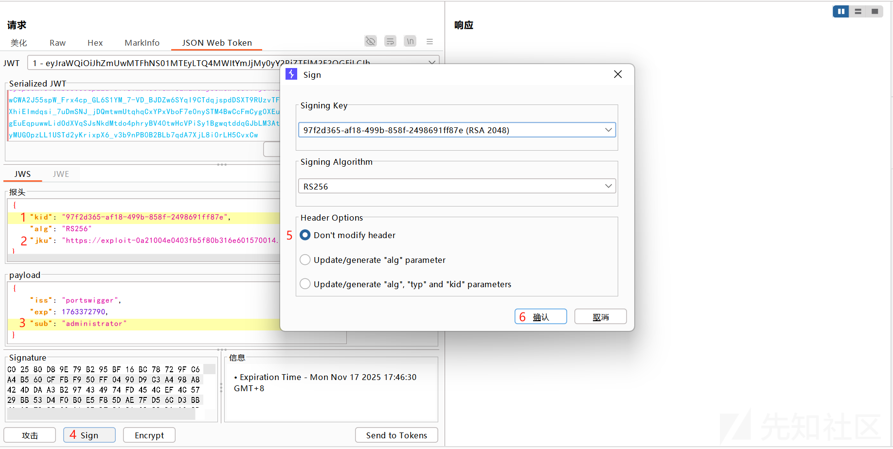

4.将新生成的JWT放回cookie中，访问管理员界面，确认成功访问管理员界面。

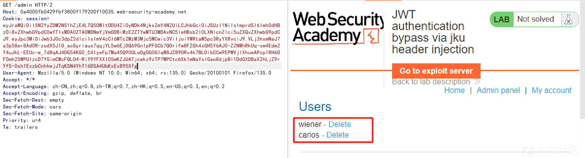

## 2.漏洞原理分析

服务端错误地信任来自 JWT header 的公钥信息（`jwk`/`jku`），没有固定公钥或公钥来源白名单，导致攻击者通过自定义密钥绕过签名验证。

## 3.修复方法

1.禁止使用：

* `jwk`
* `jku`
* `x5u`

2. 固定使用服务端本地配置的公钥 ；

3. 若必须使用 JWKS（如 OIDC），强制白名单 。

# 七、通过 KID 标头路径遍历绕过 JWT 身份验证

## 1.漏洞利用过程

靶场链接：<https://portswigger.net/web-security/jwt/lab-jwt-authentication-bypass-via-kid-header-path-traversal>

1.使用普通帐号 `wiener:peter` 登录，抓取请求中的 Cookie，解析得到 JWT，payload 中的 `sub` 字段为普通用户名。

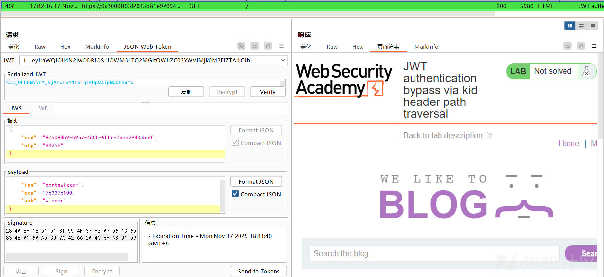

2.使用jwt\_editor建symmetric Key，k值修改为AA==。（如果kid读取失败就会回退到默认加密算法）

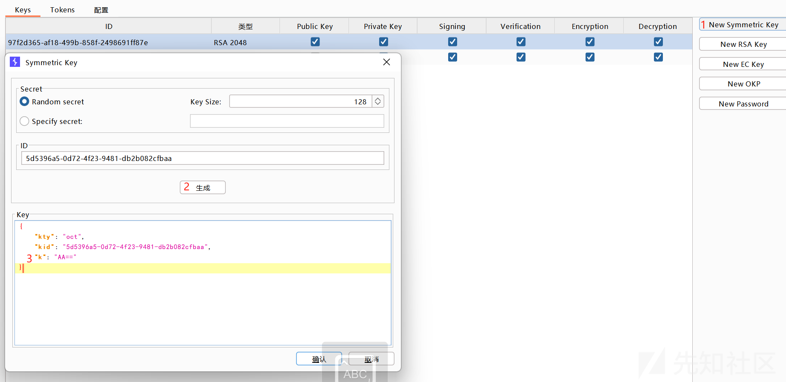

3.修改kid、sub值，加密获得新jwt

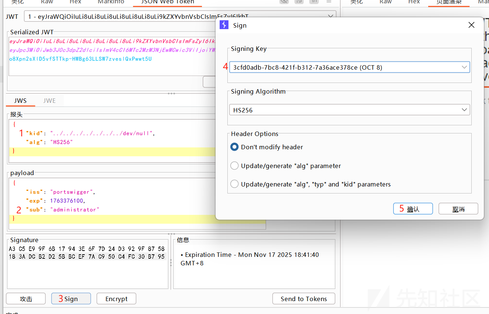

4.将新生成的JWT放回cookie中，访问管理员界面，确认成功访问到管理员界面。

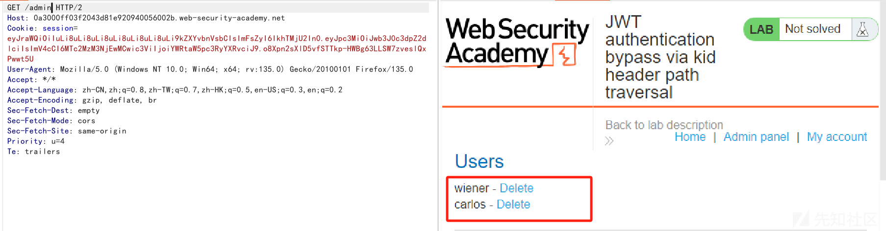

## 2.漏洞原理分析

服务器根据 KID 在密钥仓库里找到对应的公钥。将整个文件内容作为“公钥”解析失败 → 服务器 回退到弱验证模式 → 验证绕过。

## 3.修复方法

1.禁止自动降级到 HS256 ；

2. kid 必须严格校验（正则 + 不可含路径符）；

3.公钥/私钥不要存储在 Web 可访问目录 。

# 八、通过算法混淆绕过 JWT 身份验证

## 1.漏洞利用过程

靶场链接：<https://portswigger.net/web-security/jwt/lab-jwt-authentication-bypass-via-kid-header-path-traversal>

1..使用普通帐号 `wiener:peter` 登录，抓取请求中的 Cookie，解析得到 JWT，payload 中的 `sub` 字段为普通用户名。

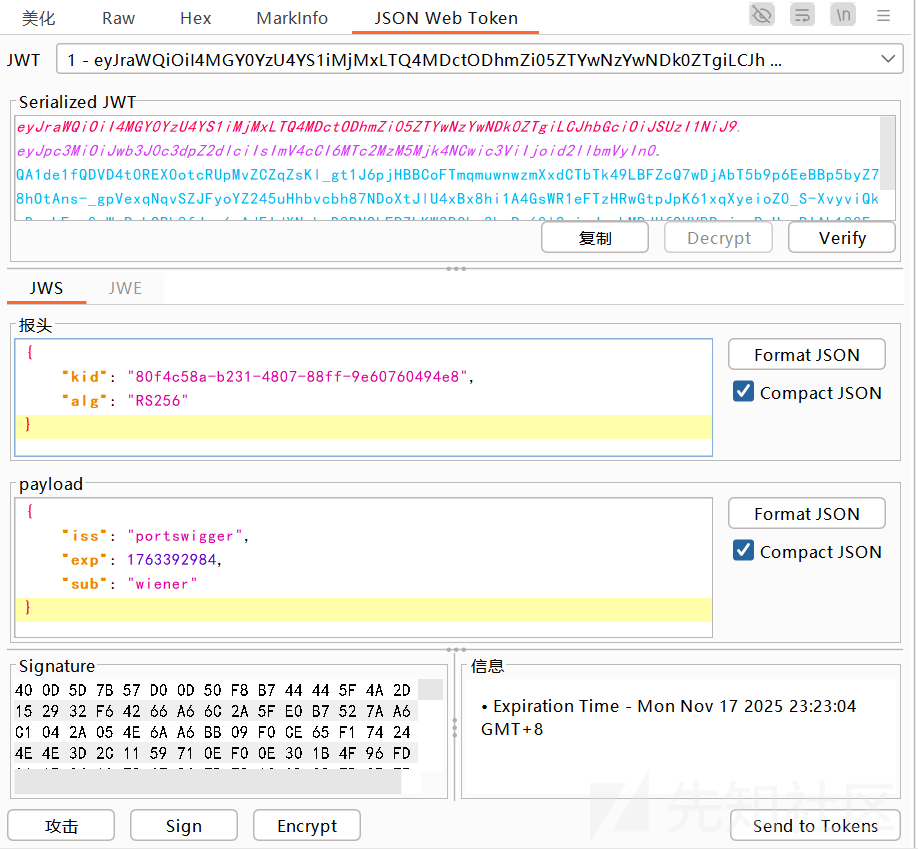

2.[https://XXXXX/jwks.json](https://0ab8009604281c2781c07f2c00c3002a.web-security-academy.net/jwks.json)泄露加密

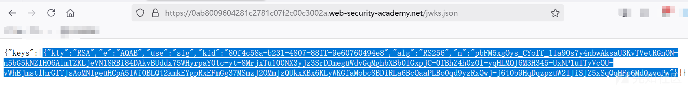

3.新建RSA KEY

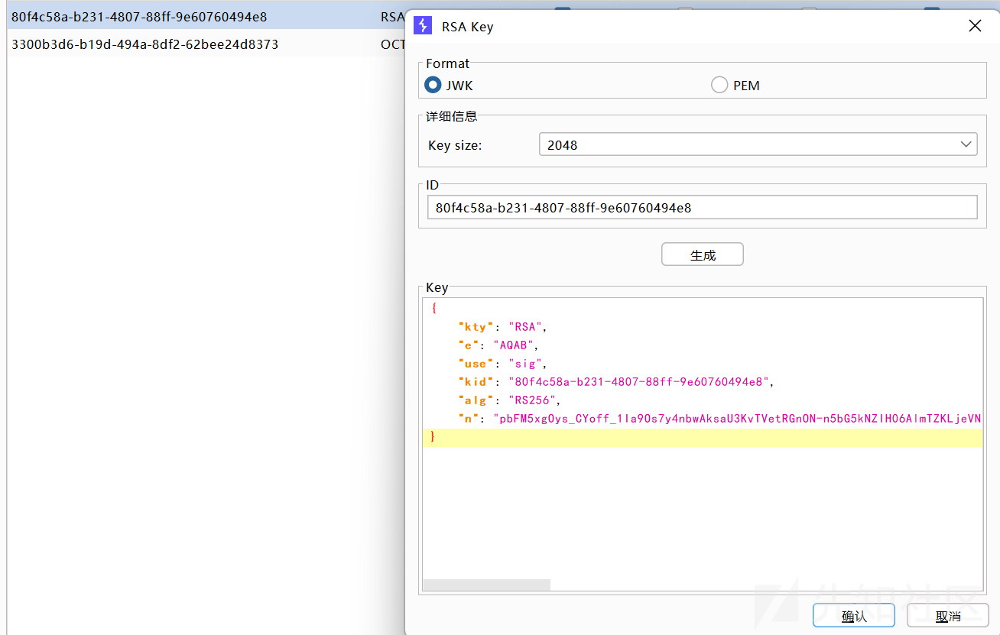

4.复制新建RSA KEY的PEM,BASE64编码

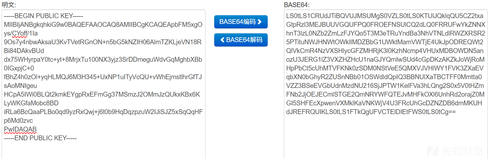

5.将编码好的密钥，填入新建Symmetric Key中的k值中。

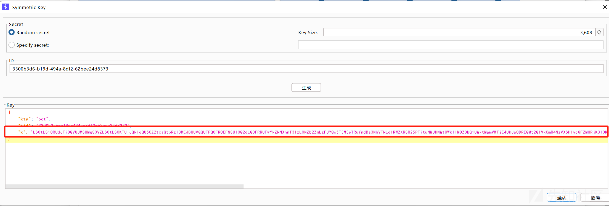

6.修改alg、sub新建JWT

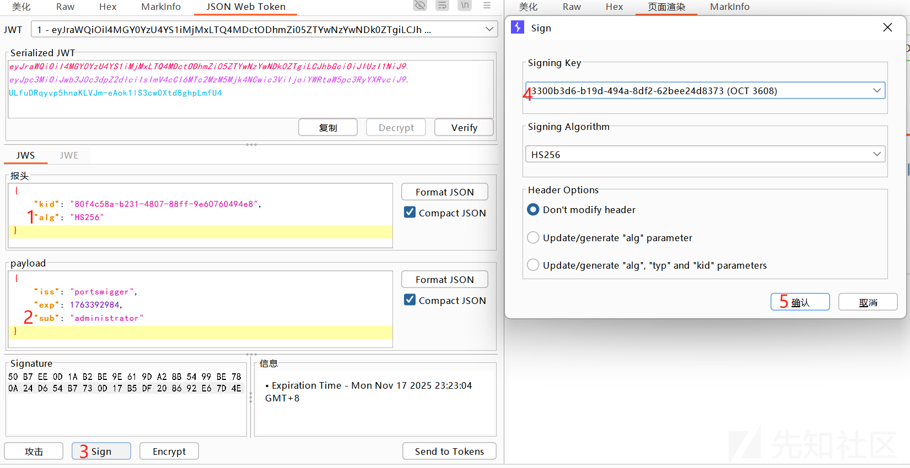

7.将新的JWT放回cookie中，访问管理员界面，成功访问。

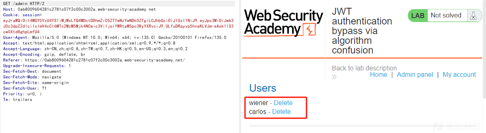

## 2.漏洞原理分析

JSON 文件里泄露了 JWT ，攻击者可能利用**算法混淆**或把公钥当对称 secret 的方式尝试伪造 token。

## 3.修复方法

在所有验证处强制只允许服务器期望的算法（例如仅 `RS256`），不要基于 token header 决定算法。

从可信 JWKS 获取 key；在使用 `kid` 前验证 key 类型和用途；不要从 header 直接读取公钥文本用作 secret。

# 九、利用算法混淆绕过 JWT 身份验证，且密钥未暴露（**令牌派生公钥**）

## 1.漏洞利用过程

靶场链接：<https://portswigger.net/web-security/jwt/algorithm-confusion/lab-jwt-authentication-bypass-via-algorithm-confusion-with-no-exposed-key>

1.使用普通帐号 `wiener:peter` 登录两次，复制这两次登录的cookie。使用jwt\_forgery.py逆向公钥。

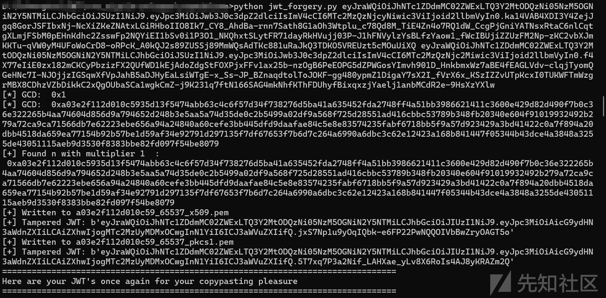

2.新建Symmetric key ，将公钥base64编码后填入k值中

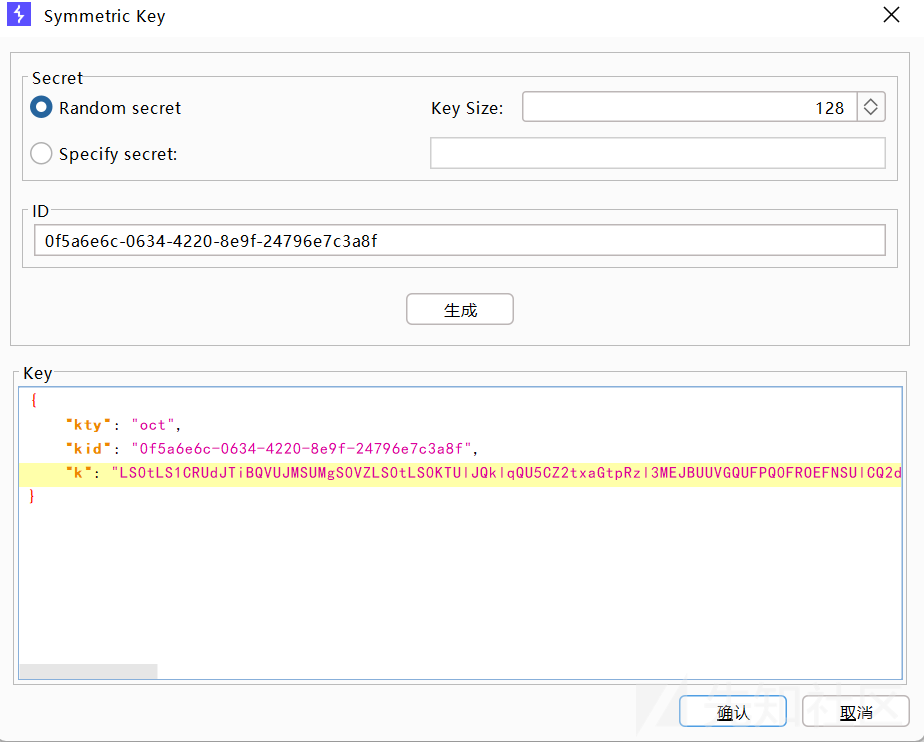

3.使用上面关卡步骤生成新JWT，将新JWT放回cookie中，访问管理员页面，成功访问管理员页面。

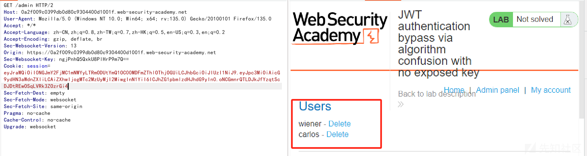

## 2.漏洞原理分析

利用 RSA 结构弱点 + 服务器信任 header 指定公钥 → 直接伪造签名。

* 模数位数太小（< 1024 bit）
* 使用了弱填充（无 PSS）
* 使用固定 exponent + 非随机填充
* RSA key pair 由弱随机数生成
* 厂商错误实现了 RS256

## 3.修复方法

禁止从 header 加载公钥

服务器不接受客户端提供的 kid 公钥

选择公钥应固定在服务器本地配置强制

使用标准 RS256 + 足够长度的 RSA（2048+）

# 十、敏感信息泄露

## 1.漏洞利用过程

靶场链接：<https://authlab.digi.ninja/Leaky_JWT>

1.访问链接复制页面JWT解密，发现存在password值。

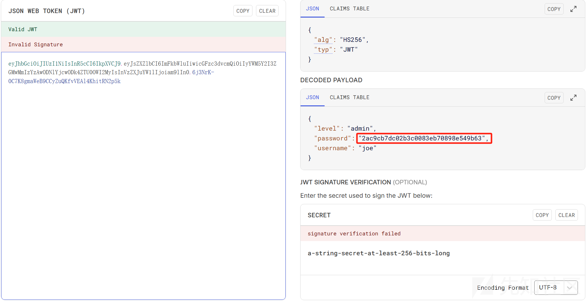

2.对password值进行解密，密码为Password1。

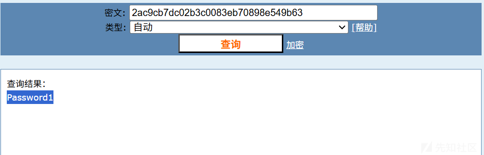

3.使用帐号joe：Password1的登录，确认成功登录。

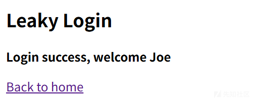

## 2.漏洞原理分析

jwt中泄露了用户名和用户密码，通过该情况可以直接登录 。

## 3.修复方法

在用户表 `users` 增加字段 `token_version INT DEFAULT 0`。JWT 在签发时把 `token_version` 放入 payload。验证时比较数据库中当前 `token_version` 与 token 中的值，若不一致则拒绝。
