# APK逆向：视频盗用+原创替换的实战分析-先知社区

> **来源**: https://xz.aliyun.com/news/19357  
> **文章ID**: 19357

---

# **APK逆向：视频盗用+原创替换的实战分析**

```
前段时间，我拿到了几个APP做逆向分析。研究后发现，它们的功能就是先解析并下载别人在短视频平台发的内容，然后通过“稿件替换”功能，把盗来的视频变成自己的原创稿件，从而获得抖音的原创认证和流量推荐。

话不多说，先在模拟器上尝试运行目标程序，发现需要购买卡密，于是尝试利用jadx分析。
```

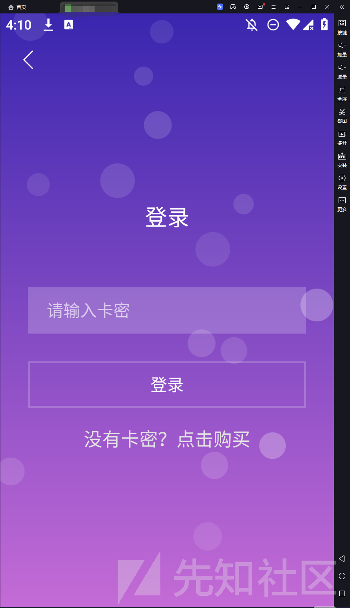

使用查壳工具，可以看到有360和腾讯的壳

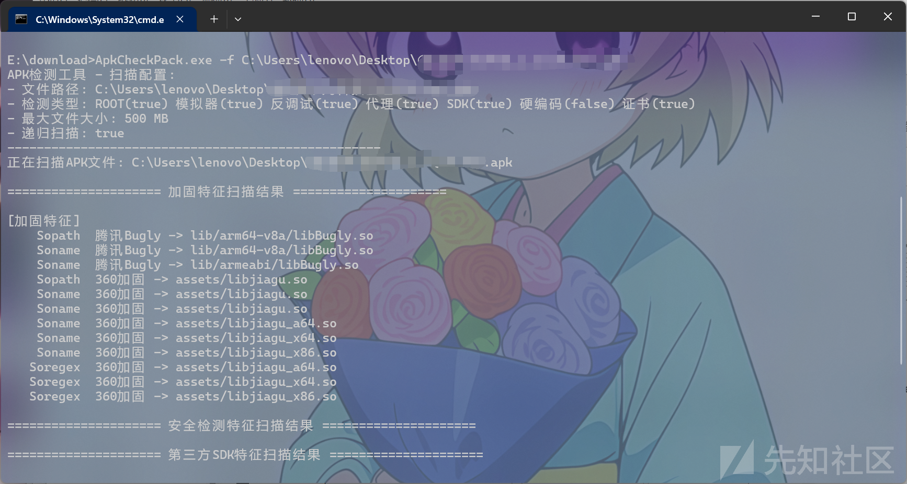

这里脱壳使用的是frida dexdump对apk进行attach，dump出dex文件如下

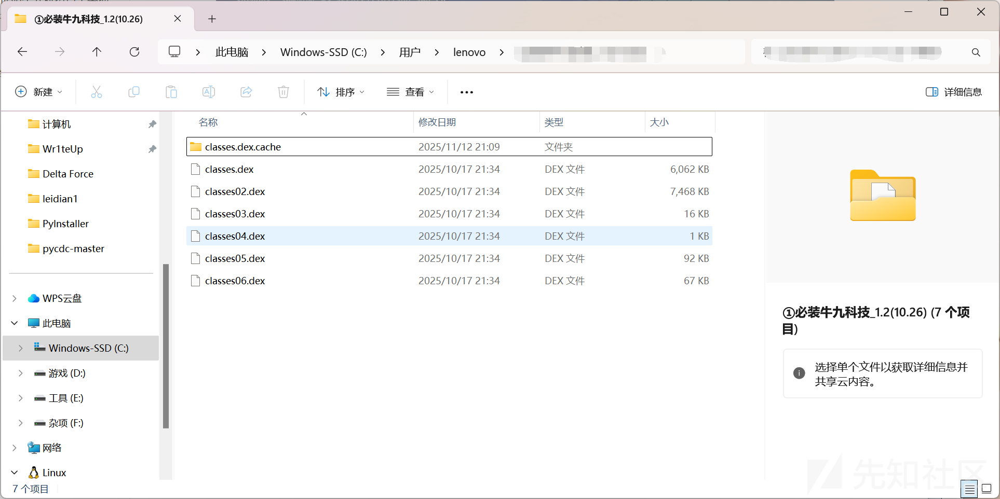

其中

class.dex，class02.dex为主要代码文件

于入口函数com.example.yuan\_wanandroid处找到主页相关代码

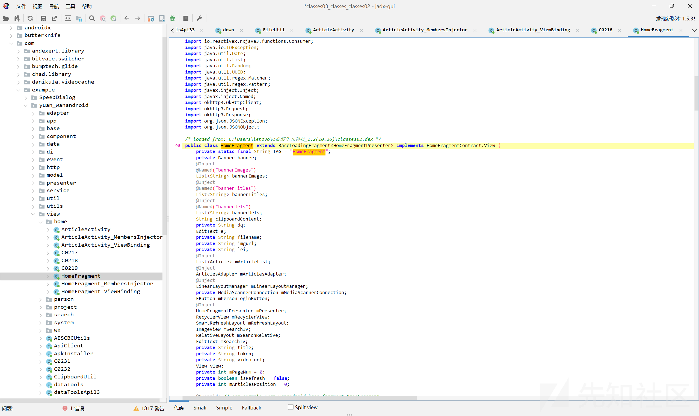

经分析，这是该app的主页代码，主要功能包括文章展示、Banner轮播、视频去水印下载等。

首先进行网络验证以及卡密验证，代码如下，其中卡密文件固定存储于/storage/emulated/0/kkk.txt

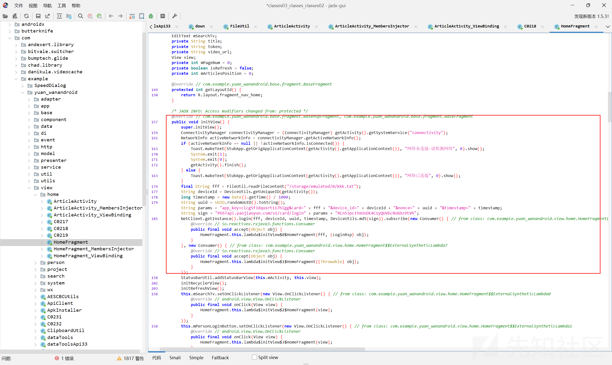

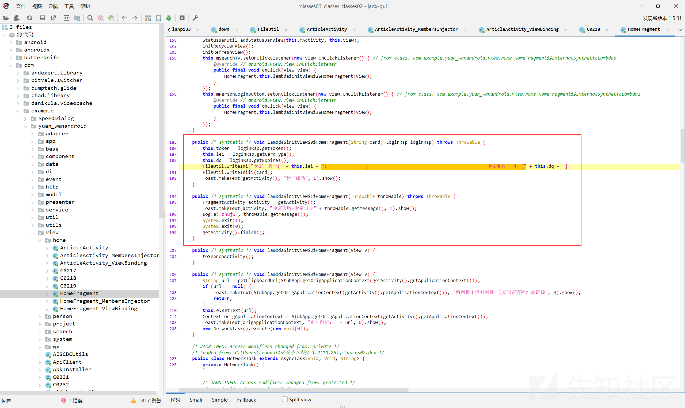

接着是剪切板内容提取的代码，结合视频分析，此代码用于提取各平台分享链接中的视频并解析提取视频

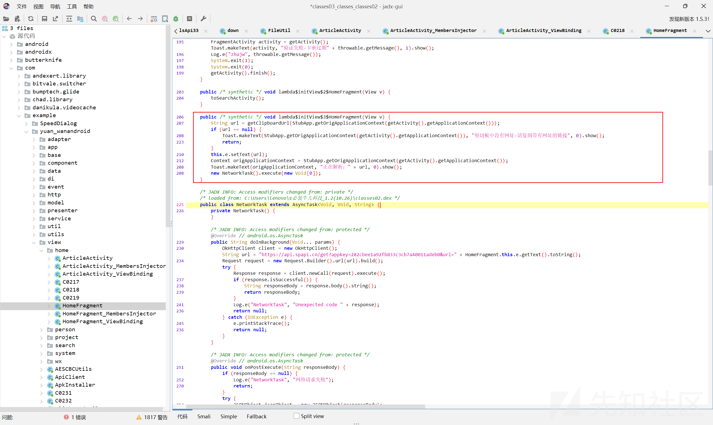

这里外链一个在线网站进行解析提取[https://api.spapi.cn，最后生成随机文件名，保存为.mp4文件](https://api.spapi.cn%EF%BC%8C%E6%9C%80%E5%90%8E%E7%94%9F%E6%88%90%E9%9A%8F%E6%9C%BA%E6%96%87%E4%BB%B6%E5%90%8D%EF%BC%8C%E4%BF%9D%E5%AD%98%E4%B8%BA.mp4%E6%96%87%E4%BB%B6)

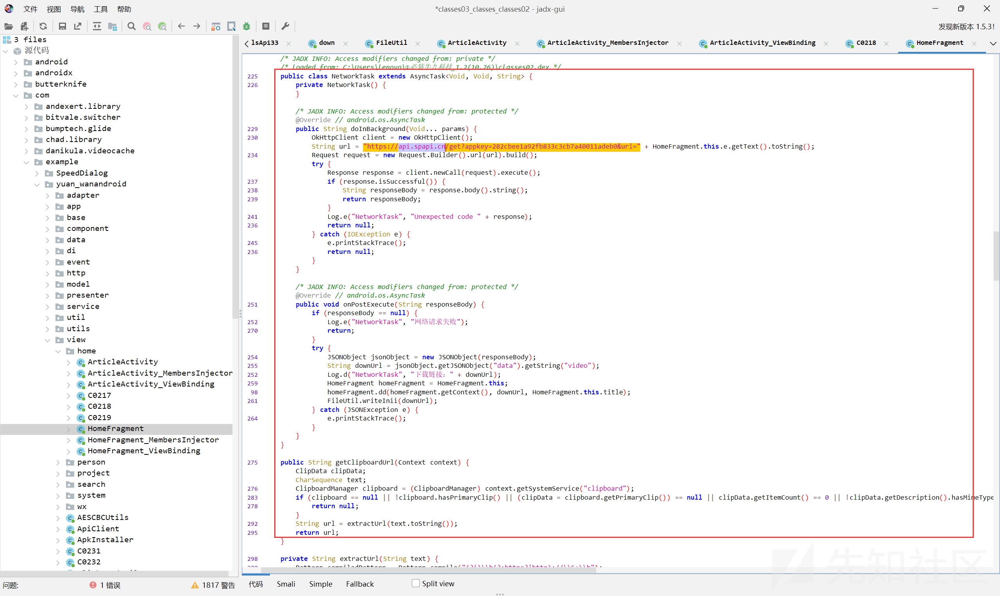

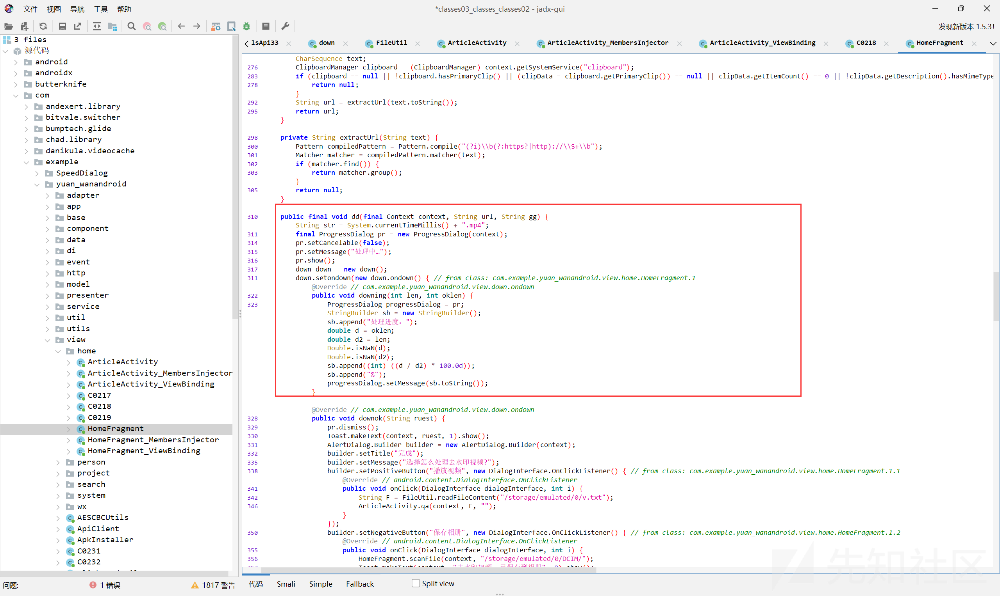

接下来是下载完成后的选项，根据代码显示可以选择预览播放，保存，或者快速发布抖音

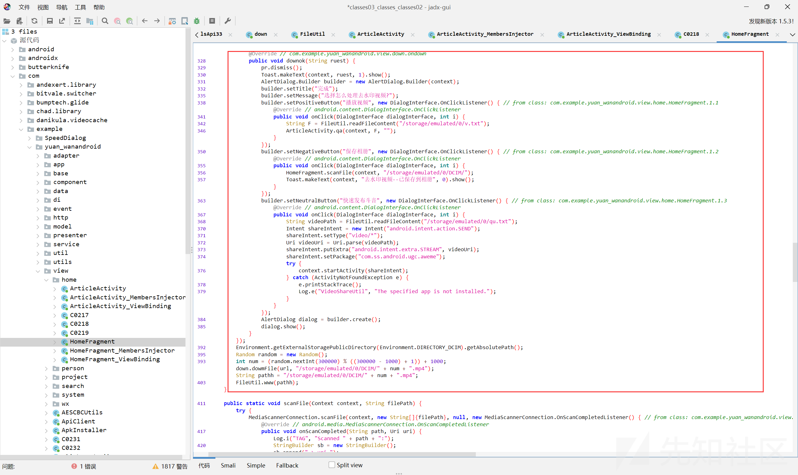

选择快速发布的话，会从本地路径/storage/emulated/0/qu.txt读取视频文件路径，然后构造一个分享意图(Intent("android.intent.action.SEND")），类型是 "video/\*"，把这个视频路径转换成 Uri，并放入 Intent 的 EXTRA\_STREAM 参数中，接着启动包名为"com.ss.android.ugc.aweme"的应用，这个包名经搜索，是抖音的包名

```
builder.setNeutralButton("快速发布斗音", new DialogInterface.OnClickListener() { // from class: com.example.yuan_wanandroid.view.home.HomeFragment.1.3
                    @Override // android.content.DialogInterface.OnClickListener
                    public void onClick(DialogInterface dialogInterface, int i) {
                        String videoPath = FileUtil.readFileContent("/storage/emulated/0/qu.txt");
                        Intent shareIntent = new Intent("android.intent.action.SEND");
                        shareIntent.setType("video/*");
                        Uri videoUri = Uri.parse(videoPath);
                        shareIntent.putExtra("android.intent.extra.STREAM", videoUri);
                        shareIntent.setPackage("com.ss.android.ugc.aweme");
                        try {
                            context.startActivity(shareIntent);
                        } catch (ActivityNotFoundException e) {
                            e.printStackTrace();
                            Log.e("VideoShareUtil", "The specified app is not installed.");
                        }
                    }
                });
```

对该程序替换抖音原草稿视频从而达到原创的功能分析如下，后续分析配合未经任何处理的目标apk进行，从而可以搜索其资源文件。

搜索文本找到与 **替换抖音** 相关的字符串，字符串保存在dialog\_layout.xml

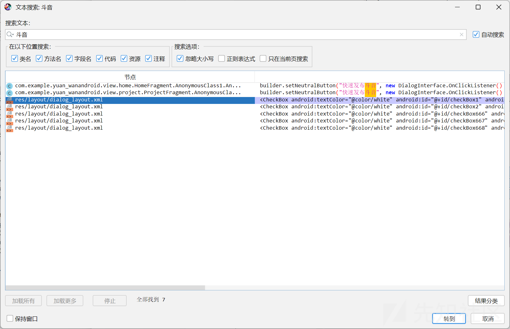

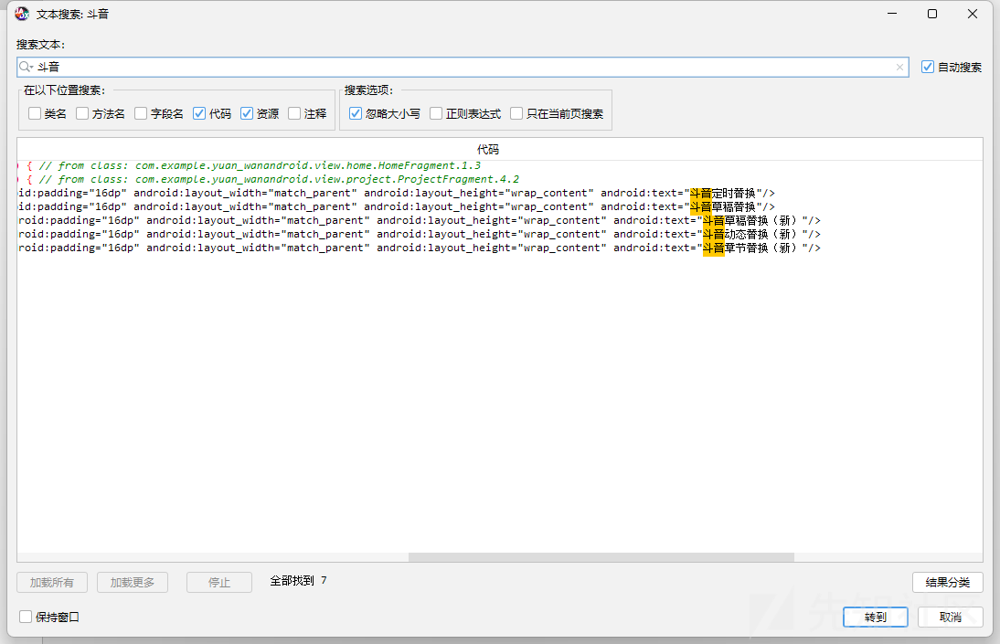

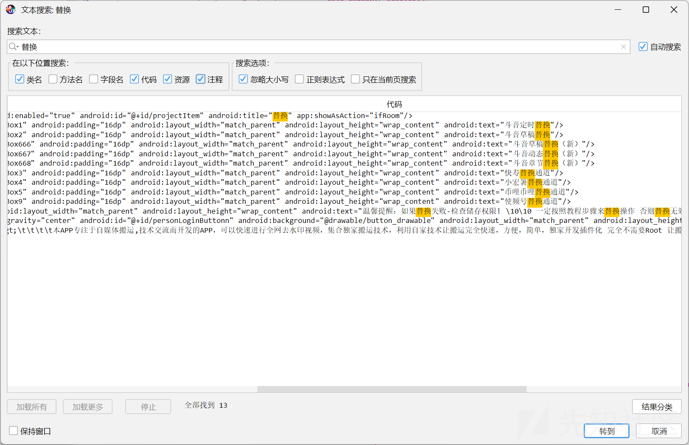

这里显示被android:id="@+id/checkBox"调用，通过对checkbox的搜索找到代码位置于package com.example.yuan\_wanandroid.view.system; 类 SystemFragment，函数 showDialog()。

该处代码采用了混淆和资源加密

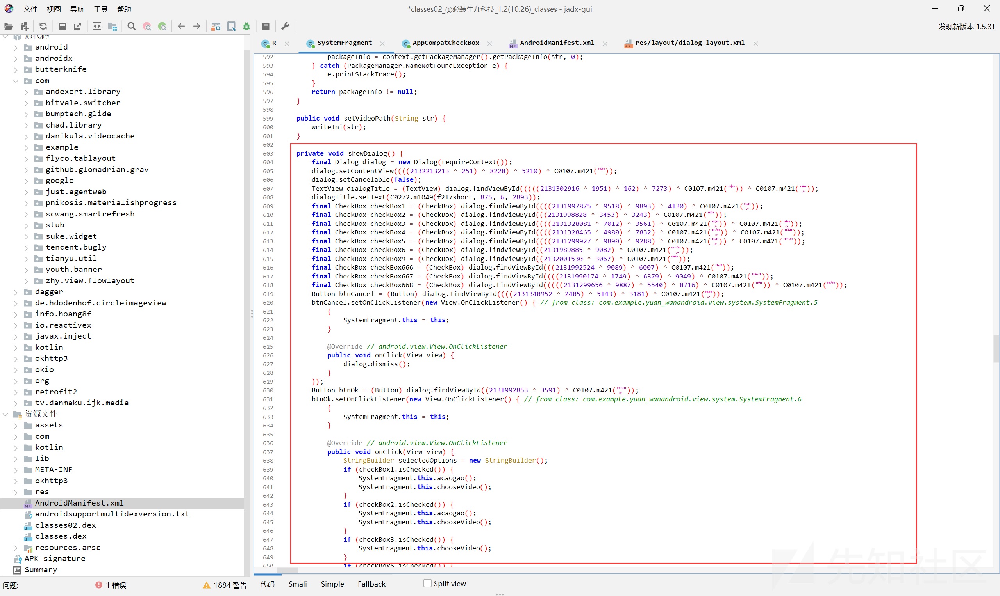

根据布局文件还原代码结构

```
private void showDialog() {
    // ... 前面的初始化代码
    
    public void onClick(View view) {
                    dialog.dismiss();
                    }

    // 确定按钮的点击事件（代码中可能被截断了）
    Button btnOk = (Button) dialog.findViewById(加密的确定按钮ID);
    btnOk.setOnClickListener(new View.OnClickListener() {
        @Override
        public void onClick(View v) {
            // 处理用户选择的平台
               handlePlatformSelection(
                checkBox1.isChecked(),  // 斗音定时替换
                checkBox2.isChecked(),  // 斗音草稿替换
                checkBox6.isChecked(),  // 官方斗因一键直接发布
                checkBox666.isChecked(), // 斗音草稿替换（新）
                checkBox667.isChecked(), // 斗音动态替换（新）
                checkBox668.isChecked(), // 斗音章节替换（新）
                checkBox3.isChecked(),  // 快寿替换通道
                checkBox4.isChecked(),  // 小宏暑替换通道
                checkBox5.isChecked(),  // 币哩币哩替换通道
                checkBox9.isChecked()   // 使频号替换通道
            );
            dialog.dismiss();
        }
    });

    dialog.show();
}
```

对应该app演示视频中的相关功能

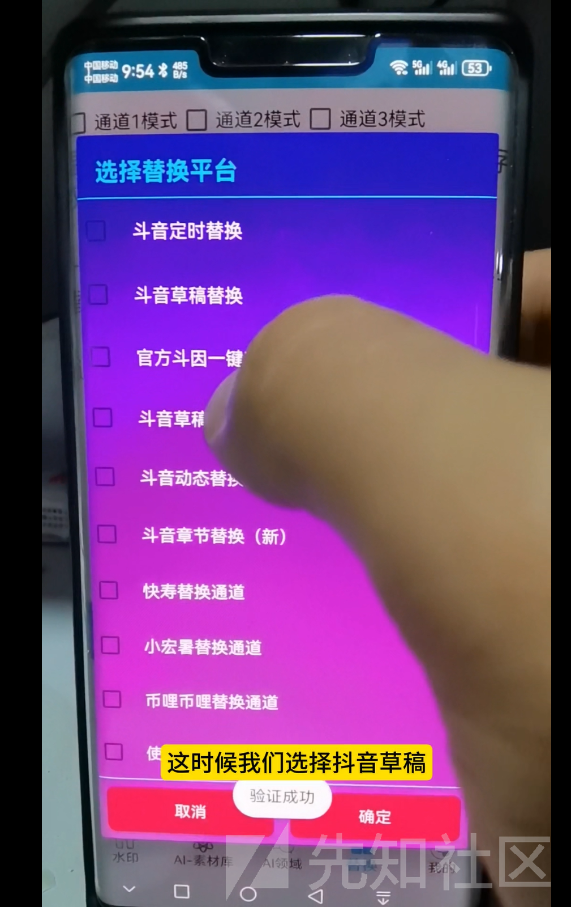

根据用户选择，调用相关的函数功能，下图的代码为视频替换功能的调用

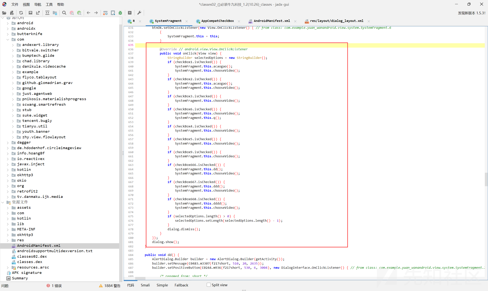

若用户点击斗音草稿替换（新），apk会调用checkBox666.isChecked() // 斗音草稿替换（新）

接下来执行如代码所示的两个函数**dd()** 与**chooseVideo()**

```
if (checkBox666.isChecked()) {
    SystemFragment.this.dd();
    SystemFragment.this.chooseVideo();
}
```

**dd()**

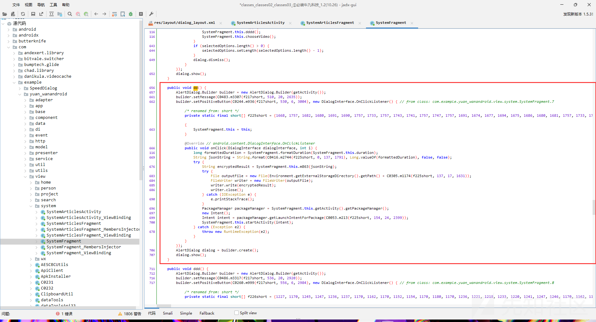

```
public void dd() {
        AlertDialog.Builder builder = new AlertDialog.Builder(getActivity());
        builder.setMessage(C0483.m3307(f217short, 510, 20, 2635));
        builder.setPositiveButton(C0244.m936(f217short, 530, 6, 3004), new DialogInterface.OnClickListener() { // from class: com.example.yuan_wanandroid.view.system.SystemFragment.7

            /* renamed from: short */
            private static final short[] f225short = {1668, 1757, 1682, 1680, 1691, 1690, 1757, 1733, 1757, 1743, 1741, 1757, 1747, 1757, 1691, 1674, 1677, 1694, 1675, 1686, 1680, 1681, 1757, 1733, 1754, 1691, 1747, 1757, 1679, 1694, 1675, 1687, 1757, 1733, 1757, 1744, 1676, 1675, 1680, 1677, 1694, 1688, 1690, 1744, 1690, 1682, 1674, 1683, 1694, 1675, 1690, 1691, 1744, 1743, 1744, 1723, 1724, 1718, 1714, 1744, 1691, 1690, 1676, 1675, 1686, 1681, 1670, 1745, 1682, 1679, 1739, 1757, 1747, 1757, 1691, 1674, 1677, 1694, 1675, 1686, 1680, 1681, 1742, 1757, 1733, 1743, 1747, 1757, 1686, 1676, 1696, 1694, 1691, 1691, 1696, 1691, 1680, 1681, 1688, 1675, 1674, 1757, 1733, 1754, 1693, 1747, 1757, 1686, 1676, 1696, 1694, 1691, 1691, 1696, 1669, 1687, 1694, 1681, 1688, 1685, 1686, 1690, 1757, 1733, 1754, 1693, 1747, 1757, 1674, 1676, 1690, 1677, 1757, 1733, 1757, 1757, 1666, 1648, 1563, 1564, 1558, 1554, 1648, 1566, 1553, 1563, 1549, 1552, 1558, 1563, 1649, 1583, 1585, 1592, 2364, 2352, 2354, 2417, 2348, 2348, 2417, 2366, 2353, 2363, 2349, 2352, 2358, 2363, 2417, 2346, 2360, 2364, 2417, 2366, 2344, 2362, 2354, 2362};

            {
                SystemFragment.this = this;
            }

            @Override // android.content.DialogInterface.OnClickListener
            public void onClick(DialogInterface dialogInterface, int i) {
                long formattedDuration = SystemFragment.formatDuration(SystemFragment.this.duration);
                String jsonString = String.format(C0416.m2744(f225short, 0, 137, 1791), Long.valueOf(formattedDuration), false, false);
                try {
                    String encryptedResult = SystemFragment.this.m863(jsonString);
                    try {
                        File outputFile = new File(Environment.getExternalStorageDirectory().getPath() + C0305.m1174(f225short, 137, 17, 1631));
                        FileWriter writer = new FileWriter(outputFile);
                        writer.write(encryptedResult);
                        writer.close();
                    } catch (IOException e) {
                        e.printStackTrace();
                    }
                    PackageManager packageManager = SystemFragment.this.getActivity().getPackageManager();
                    new Intent();
                    Intent intent = packageManager.getLaunchIntentForPackage(C0053.m213(f225short, 154, 24, 2399));
                    SystemFragment.this.startActivity(intent);
                } catch (Exception e2) {
                    throw new RuntimeException(e2);
                }
            }
        });
        AlertDialog dialog = builder.create();
        dialog.show();
    }
```

对代码的混淆进行解密

解密代码

```
import re

f225short = []

def m3307(sArr, i, i2, i3):
    cArr = []
    for i4 in range(i2):
        # Java char是16位无符号，这里取低16位
        c = (sArr[i + i4] ^ i3) & 0xFFFF
        cArr.append(chr(c))
    return ''.join(cArr)


res = m3307(f225short, xxx, xxx, xxx)
print(res)
```

替换后的结果如下

```
public void dd() {
    AlertDialog.Builder builder = new AlertDialog.Builder(getActivity());
    builder.setMessage("处理完毕-请打开适配抖音-草稿替换（新）");
    builder.setPositiveButton("打开适配抖音", new DialogInterface.OnClickListener() {   
    @Override 
        public void onClick(DialogInterface dialogInterface, int i) {
        long formattedDuration = SystemFragment.formatDuration(SystemFragment.this.duration);
        String jsonString = String.format({"mode":"02","duration":%d,"path":"/storage/emulated/0/DCIM/destiny.mp4","duration1":0,"is_add_dongtu":%b,"is_add_zhangjie":%b,"user":""}, Long.valueOf(formattedDuration), false, false);
            try {
                String encryptedResult = Base64.encodeToString(encryptWithRSA(jsonString.getBytes()), 0);
                try {
                    File outputFile = new File(Environment.getExternalStorageDirectory().getPath() + /DCIM/ANDROID.png);
                    FileWriter writer = new FileWriter(outputFile);
                    writer.write(encryptedResult);
                    writer.close();
                } catch (IOException e) {
                    e.printStackTrace();
                }
                   PackageManager packageManager = SystemFragment.this.getActivity().getPackageManager();
                new Intent();
                Intent intent = packageManager.getLaunchIntentForPackage("com.ss.android.ugc.aweme");
                SystemFragment.this.startActivity(intent);
            } catch (Exception e2) {
                throw new RuntimeException(e2);
            }
        }
    });
    AlertDialog dialog = builder.create();
    dialog.show();
}
```

在用户确认后，dd()构造了一个JSON数据：

{"mode":"02","duration":%d,"path":"/storage/emulated/0/DCIM/destiny.mp4","duration1":0,"is\_add\_dongtu":%b,"is\_add\_zhangjie":%b,"user":""}

模式为02，视频时长根据实际情况，视频路径固定为/storage/emulated/0/DCIM/destiny.mp4，duration1固定为0，动图，章节标识为false，用户名为空。

接着将JSON字节流进行RSA加密与Base64加密，写入/storage/emulated/0/DCIM/ANDROID.png 文件，接着调用系统包管理器获取抖音的启动 Intent，然后启动抖音。

这里分析RSA加密String encryptedResult = SystemFragment.this.m863(jsonString);

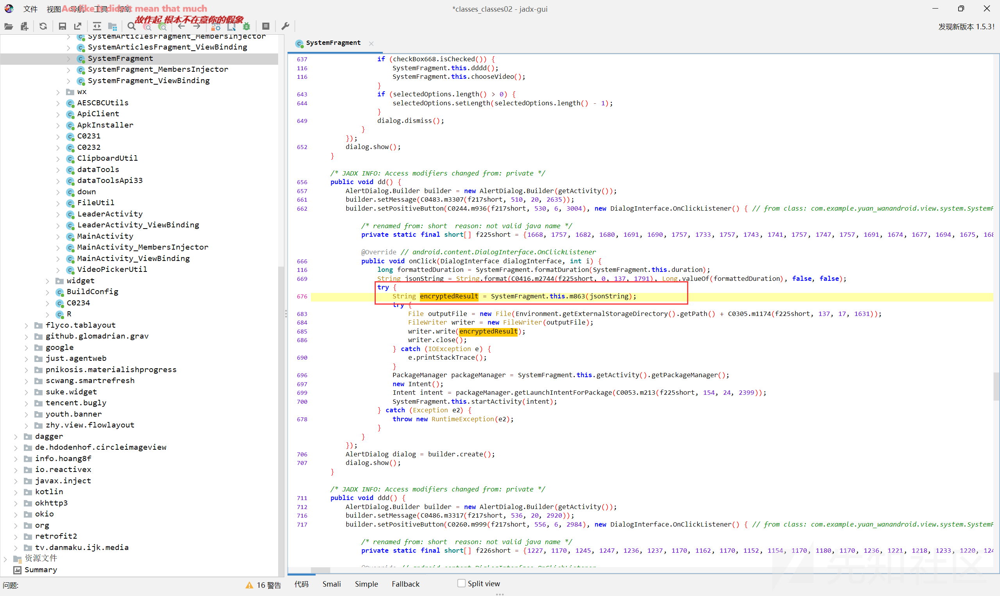

跟进查看函数m863

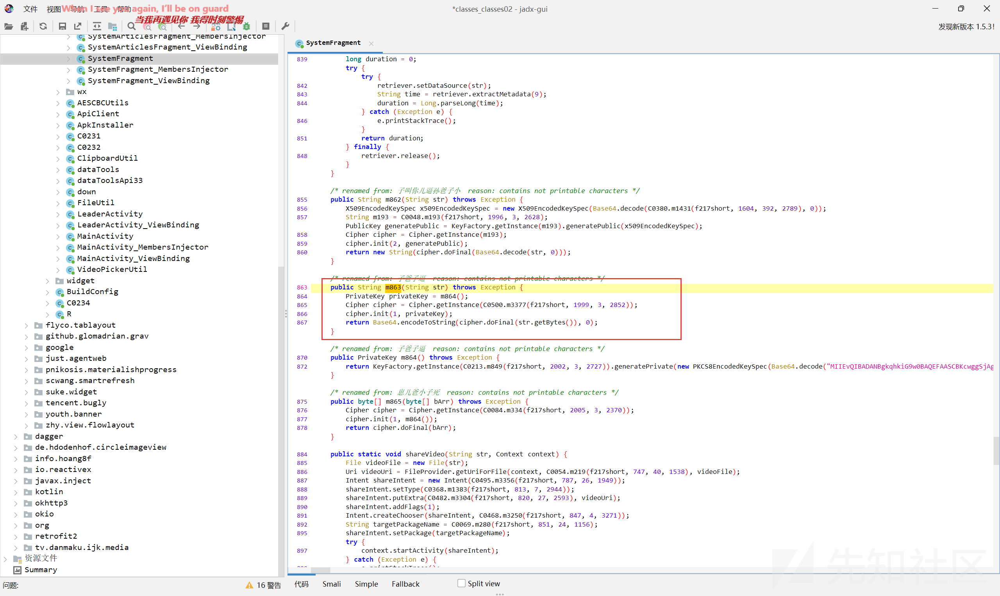

```
public String m863(String str) throws Exception {
    PrivateKey privateKey = m864();
    Cipher cipher = Cipher.getInstance(C0500.m3377(f217short, 1999, 3, 2852));
    cipher.init(1, privateKey);
    return Base64.encodeToString(cipher.doFinal(str.getBytes()), 0);
}
```

密钥生成函数

```
public PrivateKey m864() throws Exception {
    return KeyFactory.getInstance(C0213.m849(f217short, 2002, 3, 2727))
        .generatePrivate(
            new PKCS8EncodedKeySpec(
                Base64.decode("MIIEvQIBADANBgkqhkiG9w0BAQEFAASCBKcwggSjAgEAAoIBAQDdFDYxqpaGc0H8..." , 0)
            )
        );
}
```

经过分析，填充格式为RSA/ECB/PKCS1Padding，密钥类型为私钥，格式PKCS#8，原始存储的MIIEvQIBADANBgkqhkiG9w0BAQEFAASCBKcwggSj....为BASE64加密后的密钥

**分析得知，这里只是更改了本地文件**/storage/emulated/0/DCIM/ANDROID.png**的数据，后续替换逻辑由配套使用的二次修改抖音实现，由于抖音混淆严重，这里并未继续深入分析**

**chooseVideo()**

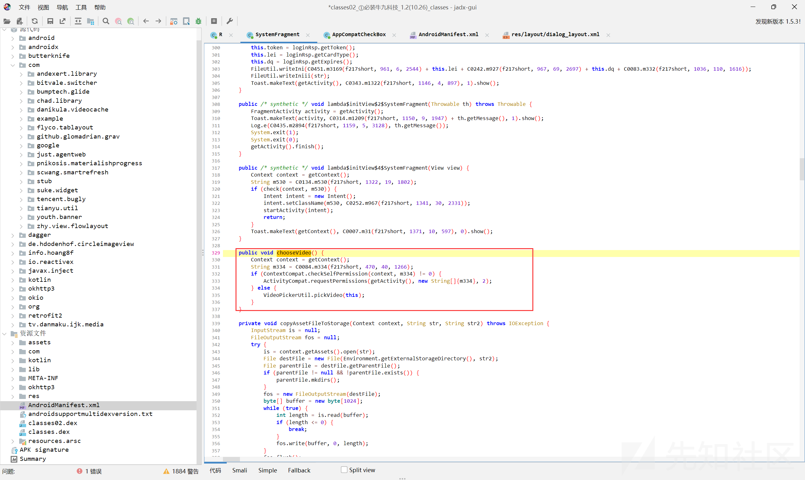

```
public void chooseVideo() {
        Context context = getContext();
        String m334 = C0084.m334(f217short, 470, 40, 1266);
        if (ContextCompat.checkSelfPermission(context, m334) != 0) {
            ActivityCompat.requestPermissions(getActivity(), new String[]{m334}, 2);
        } else {
            VideoPickerUtil.pickVideo(this);
        }
    }
```

解密代码如下

```
public void chooseVideo() {
    Context context = getContext();
    if (ContextCompat.checkSelfPermission(context, android.permission.READ_EXTERNAL_STORAGE) != 0) {
        ActivityCompat.requestPermissions(getActivity(), new String[]{android.permission.READ_EXTERNAL_STORAGE}, 2);
    } else {
        VideoPickerUtil.pickVideo(this);
    }
}
```

第一次运行会弹出权限请求框（系统会问是否允许访问存储），后续运行会直接进入视频选择器pickVideo()

```
public static void pickVideo(Fragment fragment) {
        if (Build.VERSION.SDK_INT >= 23 && ContextCompat.checkSelfPermission(fragment.requireContext(), "android.permission.READ_EXTERNAL_STORAGE") != 0) {
            fragment.requestPermissions(new String[]{"android.permission.READ_EXTERNAL_STORAGE"}, 2);
            return;
        }
        Intent intent = new Intent("android.intent.action.OPEN_DOCUMENT");
        intent.addCategory("android.intent.category.OPENABLE");
        intent.setType("video/*");
        fragment.startActivityForResult(intent, 1);
```

# 总结

用户打开应用后，该app先进行网络验证以及卡密验证，验证通过后进入首页，app自动读取剪切板内容，若用户点击“一键全网视频去除水印”，可以在处理完成后选择预览播放，保存，或者快速发布抖音。用户选择使用app的替换功能时， 会弹出选择替换平台的选项，包括斗音定时替换，斗音草稿替换，斗音草稿替换（新）等选项，在点击斗音草稿替换（新）后，用户需先在系统相册中选择需要替换的视频，接着app会生成一段JSON数据，该数据包含固定视频路径/storage/emulated/0/DCIM/destiny.mp4以及其他信息，接着将该信息进行RSA加密，以Base64的形式存储在固定路径下的/storage/emulated/0/DCIM/ANDROID.png文件中，最后启动非官方抖音，该png文件会被基于官方二次加工的抖音所读取并替换草稿箱的视频文件。
