# 使用dnlib自动化提取AgentTesla字符串-先知社区

> **来源**: https://xz.aliyun.com/news/19360  
> **文章ID**: 19360

---

## 1.1 AgentTesla介绍

AgentTesla 是一种非常典型、也非常“长寿”的 **Windows** 间谍木马/信息窃取器。

**类型**：远程访问木马（RAT）、间谍木马、信息窃取木马

**平台**：主要针对 Windows

**语言**：基于 .NET（C# / VB.NET 等）

**出现时间**：至少从 2014 年开始活跃，一直在不断迭代更新

**商业化**：以“恶意软件即服务”（Malware-as-a-Service, MaaS）形式在地下市场/论坛出售，过去还曾有公开网站售卖“订阅版”

AgentTesla特的变化特别多，而且擅长使用各种混淆和高级技巧，本文主要是**研究如何使用静态分析的方式使用脚本来进行提取AgentTesla的字符串并进行解密（自动化角度）。**

样本：4c321c77e5a9381005c96bc7fc887b962bcd8c82fcabf579f3301d583055f59d

## 1.2 静态分析

从DIE中可以看到Obfuscar保护器，这是因为dotNet样本太容易被反编译来， 所以普通都会增加保护器来阻止样本被反编译。

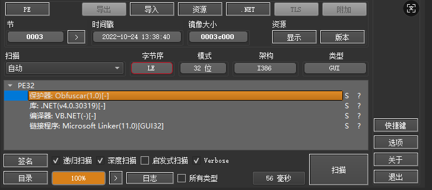

使用dnspy不难看出，样本的函数名、函数体都是加了保护的。但是我们本次的重点是字符串。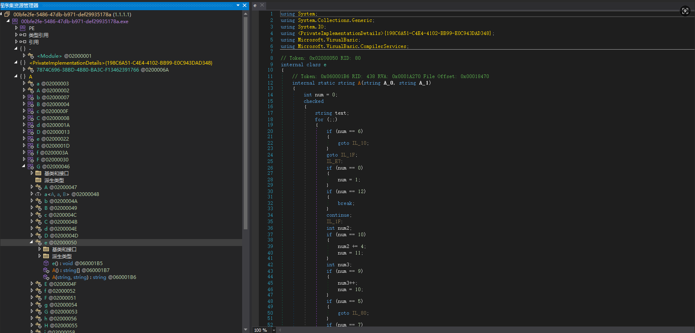

查看 {198C6A51-C4E4-4102-BB99-E0C943DAD348} 命名空间的时候，不难找到一个特大的字节数组：

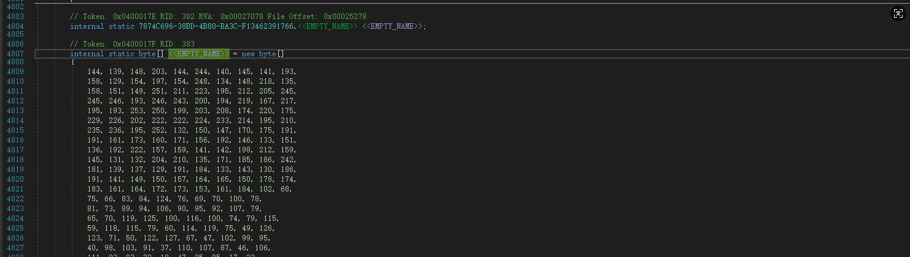

而且可以很容易的看到这个字节数组，上面就是解密函数：

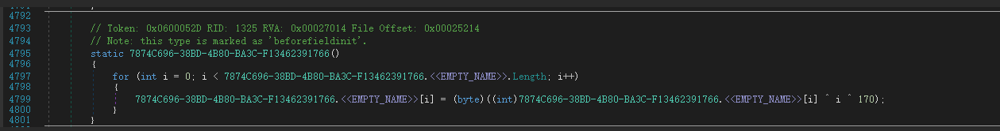

在 {198C6A51-C4E4-4102-BB99-E0C943DAD348} 命名空间中，会发现大量的这样的函数：

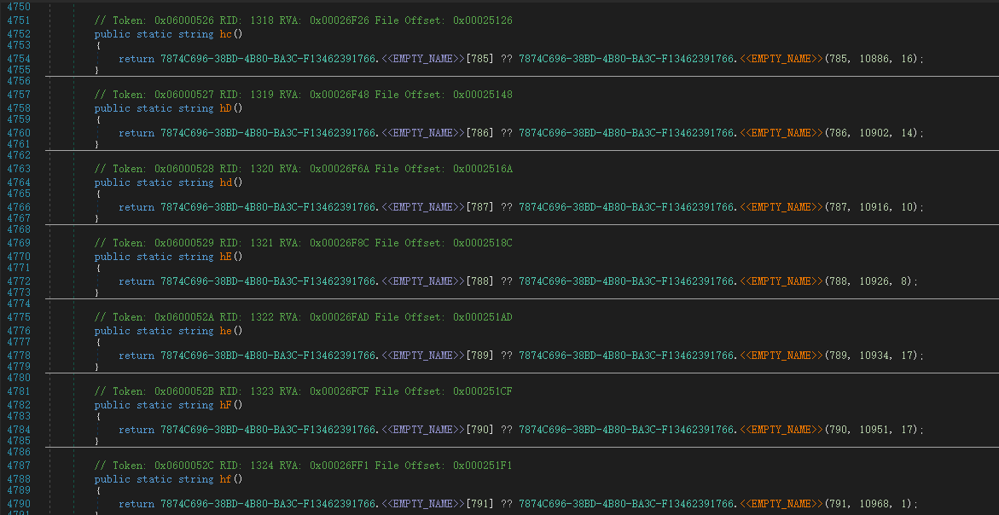

不难看出这里是通过：序号、偏移、长度的方式来获取字符串。这里可以猜测到字符串是没有 \x00\x00 分割的。（先猜测，后续验证）

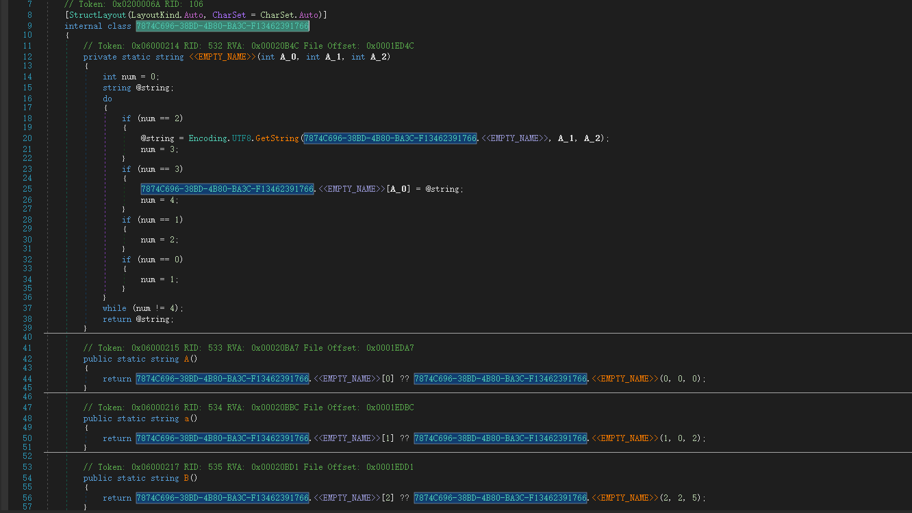

## 1.3 动态分析

笔者在动态分析验证的时候，发现该样本无法运行起来，那么就彻底放弃动态分析的这条路了，转而全部采用静态分析+脚本方式（这种也是在无法调试的情况下，分析样本的硬实力）。

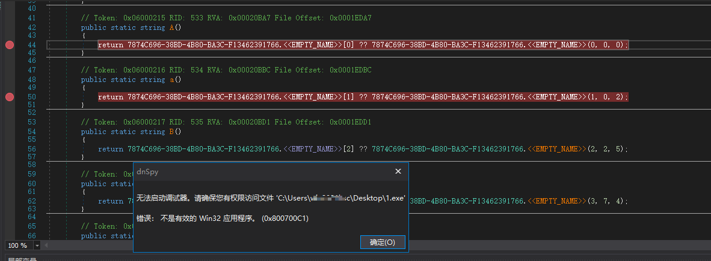

## 1.4 猜测验证

解密函数编写：核心就是 str[i] ^ i ^ 170

```
input_bytes = [		
            144, 139, 148, 203, 144, 244, 140, 145, 141, 193,
            158, 129, 154, 197, 154, 248, 134, 148, 218, 135,
            158, 151, 149, 251, 211, 223, 195, 212, 205, 245,
            245, 246, 193, 246, 243, 200, 194, 219, 167, 217,
            195, 193, 253, 250, 199, 203, 208, 174, 220, 175,
            229, 226, 202, 222, 222, 224, 233, 214, 195, 210,
            235, 236, 195, 252, 132, 150, 147, 170, 175, 191,
            191, 161, 173, 160, 171, 156, 192, 146, 133, 151,
            136, 192, 222, 157, 159, 141, 142, 198, 212, 159,
            145, 131, 132, 204, 210, 135, 171, 185, 186, 242,
            181, 139, 137, 129, 191, 184, 133, 143, 130, 186,
            191, 141, 149, 150, 157, 164, 165, 150, 178, 174,
            183, 161, 164, 172, 173, 153, 161, 184, 102, 68,
            75, 66, 83, 84, 124, 76, 69, 70, 100, 78,
            81, 73, 89, 94, 106, 90, 95, 92, 107, 79,
            65, 70, 119, 125, 100, 116, 100, 74, 79, 115,
            59, 118, 115, 79, 60, 114, 119, 75, 49, 126,
            123, 71, 50, 122, 127, 67, 47, 102, 99, 95,
            40, 98, 103, 91, 37, 110, 107, 87, 46, 106,
            111, 83, 83, 22, 19, 47, 95, 95, 17, 22,
            36, 82, 81, 28, 29, 33, 85, 87, 7, 91,
            27, 22, 16, 11, 14, 18, 30, 8, 51, 37,
            36, 59, 9, 83, 108, 42, 37, 57, 117, 115,
            106, 33, 54, 120, 126, 103, 33, 51, 127, 103,
            124, 42, 45, 54, 42, 100, 31, 50, 34, 58,]

def decrypt_bytes(input_bytes,keyword=170):
    str = ""
    for index, byte in enumerate(input_bytes,0):
        str += chr(byte ^ index ^ keyword)
    return str

print(decrypt_bytes(input_bytes))
```

结果：

```
: <b>[ </b> <b>]</b> ()False{BACK}{ALT+TAB}{ALT+F4}{TAB}{ESC}{Win}{CAPSLOCK}&uarr;&darr;&larr;&rarr;{DEL}{END}{HOME}{Insert}{NumLock}{PageDown}{PageUp}{ENTER}{F1}{F2}{F3}{F4}{F5}{F6}{F7}{F8}{F9}{F10}{F11}{F12} control{CTRL}&&amp;<&lt;>&gt;"&quot;Copi
```

从结果中不难发现，这个字符串是没有分隔符的，可以论证笔者之前的猜想。这里还有一个问题，这个字符串保护方式是 AgentTesla 自己编写的还是 Obfuscar的呢？这个可以翻阅源代码找到最终的结果。

Obfuscar 源代码是开源的，可以搜索 “Strings、Hide”等关键词，最终可以找到 void HideStrings() 函数：

[obfuscar/Obfuscar/Obfuscator.cs at d11f455af81a20209a0d746077447f50f7074f92 · obfuscar/obfuscar](https://github.com/obfuscar/obfuscar/blob/d11f455af81a20209a0d746077447f50f7074f92/Obfuscar/Obfuscator.cs#L1370)

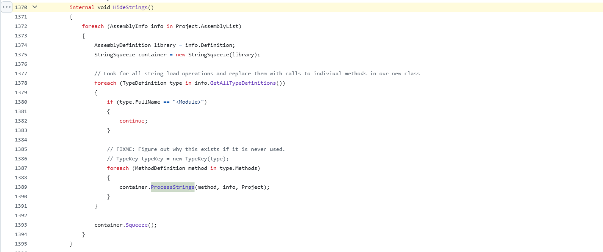

该函数逻辑的最终是 ProcessStrings 函数实现的：

[obfuscar/Obfuscar/Obfuscator.cs at d11f455af81a20209a0d746077447f50f7074f92 · obfuscar/obfuscar](https://github.com/obfuscar/obfuscar/blob/d11f455af81a20209a0d746077447f50f7074f92/Obfuscar/Obfuscator.cs#L1666)

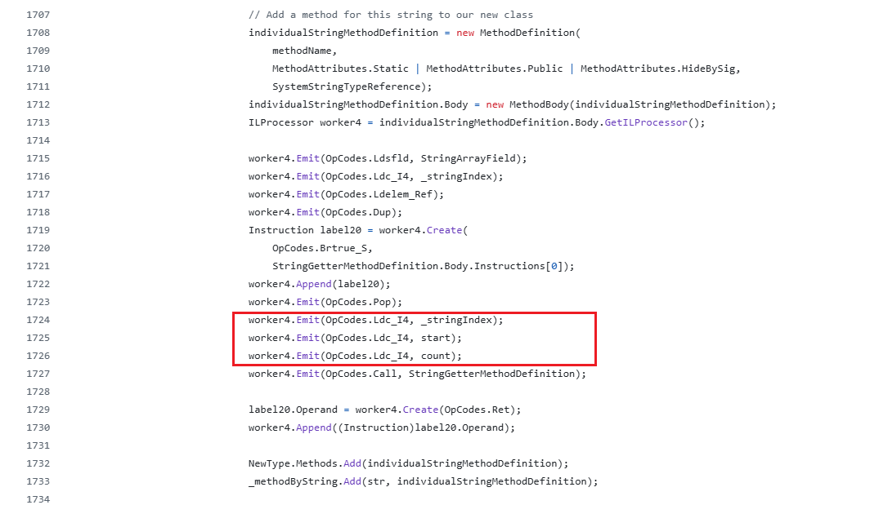

最终可以在代码中字符串的隐藏方式，采用的是 index、start、count来进行实现的。

# 二、目标确定

从上述中可以看出这个样本并不难分析，但是如何使用更为通用的脚本将样本加密数组提取、提取密钥、解密并像程序一样的切片还是有一定挑战性的，那么根据这个目标，笔者进行的如下几个阶段研究：

2.0 dnlib介绍

dnlib仓库地址：<https://github.com/0xd4d/dnlib>

dnlib功能介绍：

dnlib 是一个用 C# 写的库（dnSpy 内部就大量用 dnlib），主要用途：读取 .NET 程序集（EXE/DLL）并解析里面的**元数据**（类型、方法、字段、属性、特性……）、**IL 代码**（每个方法体里的 IL 指令）、资源、Manifest、签名信息等。其实这里可以类比为IDA的作用的。后续的IL层可以类比为汇编层，更加好理解一些。

## 2.1 字符串定位

既然要解密，那么第一件事件为如何定位字节数组，首先查看一下IL层代码：

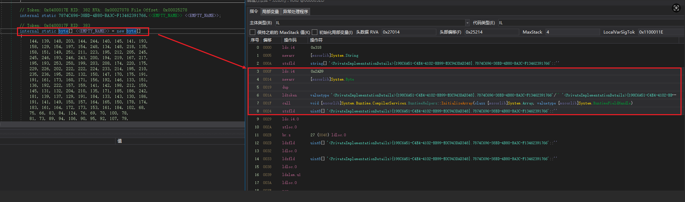

IL层代码解析：

```
    /* 0x0002522F 20D92A0000   */ IL_000F: ldc.i4    10969
    /* 0x00025234 8D47000001   */ IL_0014: newarr    [mscorlib]System.Byte
    /* 0x00025239 25           */ IL_0019: dup
    /* 0x0002523A D07E010004   */ IL_001A: ldtoken   field valuetype '<PrivateImplementationDetails>{198C6A51-C4E4-4102-BB99-E0C943DAD348}.7874C696-38BD-4B80-BA3C-F13462391766'/'' '<PrivateImplementationDetails>{198C6A51-C4E4-4102-BB99-E0C943DAD348}.7874C696-38BD-4B80-BA3C-F13462391766'::''
    /* 0x0002523F 280003000A   */ IL_001F: call      void [mscorlib]System.Runtime.CompilerServices.RuntimeHelpers::InitializeArray(class [mscorlib]System.Array, valuetype [mscorlib]System.RuntimeFieldHandle)
    /* 0x00025244 807F010004   */ IL_0024: stsfld    uint8[] '<PrivateImplementationDetails>{198C6A51-C4E4-4102-BB99-E0C943DAD348}.7874C696-38BD-4B80-BA3C-F13462391766'::''
```

补齐一下知识：

第一个：`Token: 0x0400017F RID: 383` 是啥意思？在 .NET 里，每个 **类型 / 方法 / 字段 / 属性** 等元数据记录都有一个 **Metadata Token**，用 4 字节表示：`token = (表号 << 24) | 行号(RID)`，高 1 个字节：\*\*表号（Table ID），\*\*低 3 个字节：**RID = Row ID**（该表中的行号，从 1 开始）。

比如上述的，Token: 0x0400017F RID: 383，拆开的话就是：

`0x04` —— 表号 = 4，表示 **FieldDef 表**（字段定义表）

`0x00017F` —— 行号 = 0x17F = 383（十进制），就是 “Field 表里的第 383 行”，串起来就是，这是 FieldDef 表里第 383 行的字段，它的元数据 token 是 0x0400017F。

第二个：解释 IL 层这段指令

IL\_000F: ldc.i4 10969：表示将 int32 常量 10969 压入计算栈，相当于 push 10969 。

IL\_0014: newarr [mscorlib]System.Byte：表示在栈上创建一个数组，具体大小为10969 。

IL\_0019: dup：相当于复制，这里就是将创建的数组复制一份，防止函数调用完成后，栈变量释放。

IL\_001A: ldtoken field valuetype '{GUID}.7874C696-38BD-4B80-BA3C-F13462391766'/'' ...：把字段{GUID}.7874C696-38BD-4B80-BA3C-F13462391766句柄压栈。

IL\_001F: call void System.Runtime.CompilerServices.RuntimeHelpers::InitializeArray(class System.Array,valuetype System.RuntimeFieldHandle)：初始化数组

IL\_0024: stsfld uint8[] '{198C6A51-C4E4-4102-BB99-E0C943DAD348}.7874C696-38BD-4B80-BA3C-F13462391766'::''：将创建的数组赋值给一个静态变量。

不难看出这些和x86汇编差不多…而使用dnlib编写脚本相当于IDA写idapython脚本。

从直观看的角度，只需要遍历一条一条的指令，然后使用 “InitializeArray” 关键找到关键语句，然后在上下查找即可，即可找到字节数组。那么再往上推，指令集往上就是函数，函数往上就是类。那么使用dnlib反着逻辑进行编写即可。

步骤1：加载PE

```
G_SAMPLE_PATH = r"样本位置"
G_DNLIB_PATH = r'dnlib.dll位置' 

import clr
# 注意 dnlib.dll 的版本
clr.AddReference(G_DNLIB_PATH)
# clr 添加dnlib.dll后才可以import
import dnlib
mw_module = dnlib.DotNet.ModuleDefMD.Load(G_SAMPLE_PATH)
print(mw_module)
```

坑：如果这里缺少库的话，一定不要安装 clr库，而是需要安装 pip install pythonnet，另一点就是需要注意 dnlib.dll的版本

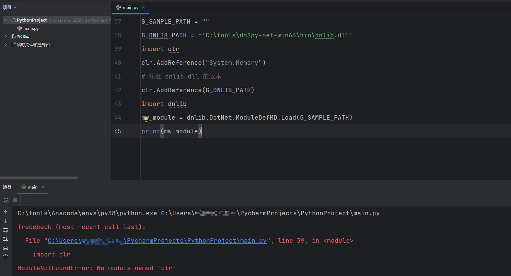

步骤2：遍历所有的类型

查看模板都有哪些函数的时候是不存在提示的，所以需要善用 dir 函数：

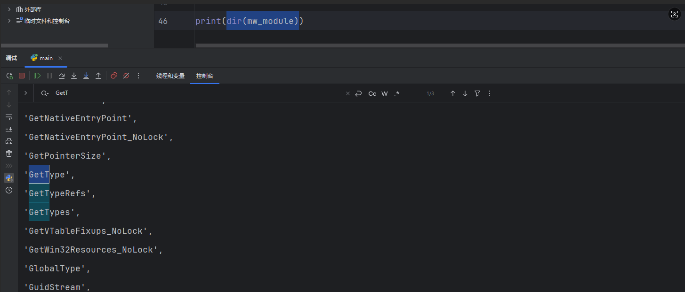

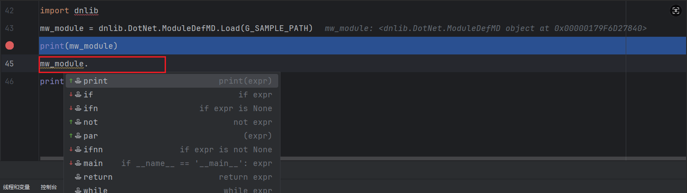

这里就写探索过程了…. 最终代码如下：

```
G_SAMPLE_PATH = r"样本位置"
G_DNLIB_PATH = r'dnlib.dll位置' 
import clr
clr.AddReference(G_DNLIB_PATH)
import dnlib
mw_module = dnlib.DotNet.ModuleDefMD.Load(G_SAMPLE_PATH)
print(mw_module)
for per_type in mw_module.GetTypes():
    print(per_type)
```

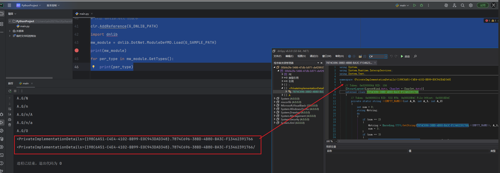

步骤3：遍历所有的函数

找到类型后，类似于从dnspy中分析一样，开始看函数…，遍历所有的函数：

```
G_SAMPLE_PATH = r"样本位置"
G_DNLIB_PATH = r'dnlib.dll位置' 
import clr
# 注意 dnlib.dll 的版本
clr.AddReference(G_DNLIB_PATH)
import dnlib
from dnlib.DotNet import *
mw_module = dnlib.DotNet.ModuleDefMD.Load(G_SAMPLE_PATH)
print(mw_module)
for per_type in mw_module.GetTypes():
    # 如果类型中没有函数就直接跳过
    if not per_type.HasMethods:
        continue
    print(dir(per_type))
    for per_method in per_type.Methods:
        # 函数一定存在函数体
        if not per_method.HasBody:
            print(per_method)
```

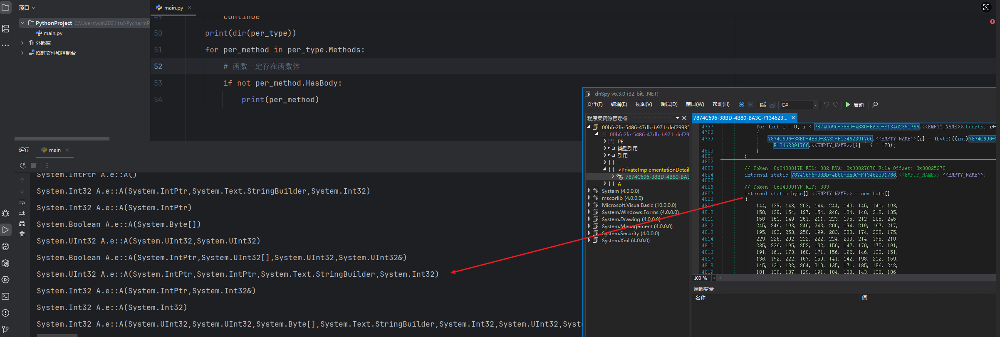

这里命名是变量复制，为什么还需要找函数呢？其实这句代码是再构造函数中。

步骤4：遍历所有的指令

```
G_SAMPLE_PATH = r"样本位置"
G_DNLIB_PATH = r'dnlib.dll位置' 

import clr
# 注意 dnlib.dll 的版本
clr.AddReference(G_DNLIB_PATH)
import dnlib
from dnlib.DotNet import *
mw_module = dnlib.DotNet.ModuleDefMD.Load(G_SAMPLE_PATH)
print(mw_module)
for per_type in mw_module.GetTypes():
    # 如果类型中没有函数就直接跳过
    if not per_type.HasMethods:
        continue
    print(dir(per_type))
    for per_method in per_type.Methods:
        # 函数一定存在函数体
        if not per_method.HasBody:
            continue
        if not per_method.Body.HasInstructions:
            continue
        for index in range(per_method.Body.Instructions.Count):
            print(per_method.Body.Instructions[index])
```

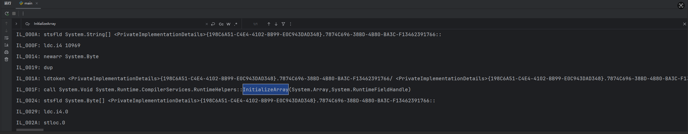

判断指令的类似于助记符，找到数组的位置：

```
G_SAMPLE_PATH = r"样本位置"
G_DNLIB_PATH = r'dnlib.dll位置' 
import clr
# 注意 dnlib.dll 的版本
clr.AddReference(G_DNLIB_PATH)
import dnlib
from dnlib.DotNet import *
mw_module = dnlib.DotNet.ModuleDefMD.Load(G_SAMPLE_PATH)
# print(mw_module)
for per_type in mw_module.GetTypes():
    # 如果类型中没有函数就直接跳过
    if not per_type.HasMethods:
        continue
    # print(dir(per_type))
    for per_method in per_type.Methods:
        # 函数一定存在函数体
        if not per_method.HasBody:
            continue
        if not per_method.Body.HasInstructions:
            continue
        for index in range(per_method.Body.Instructions.Count):
            # print(per_method.Body.Instructions[index])
            if "::InitializeArray" in per_method.Body.Instructions[index].ToString():
                print(per_method.Body.Instructions[index - 1])
```

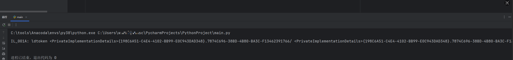

然后根据找到这个数据变量所在的偏移位置，然后提取数组：

```
import pefile

G_SAMPLE_PATH = r"样本位置"
G_DNLIB_PATH = r'dnlib.dll位置' 
G_ARRAY = None

G_PE = pefile.PE(data=open(G_SAMPLE_PATH,'rb').read(), fast_load=True)

import clr
# 注意 dnlib.dll 的版本
clr.AddReference(G_DNLIB_PATH)
import dnlib
from dnlib.DotNet import *
mw_module = dnlib.DotNet.ModuleDefMD.Load(G_SAMPLE_PATH)

for per_type in mw_module.GetTypes():
    if not per_type.HasMethods:
        continue
    for per_method in per_type.Methods:
        if not per_method.HasBody:
            continue
        if not per_method.Body.HasInstructions:
            continue
        for index in range(per_method.Body.Instructions.Count):
            if "RuntimeHelpers::InitializeArray" in per_method.Body.Instructions[index].ToString():
                G_ARRAY = per_method.Body.Instructions[index - 1]
                # 通过dnlib的FieldDef直接获取数组数据
                if isinstance(G_ARRAY.Operand, dnlib.DotNet.FieldDef) and G_ARRAY.Operand.HasFieldRVA:
                    array_data = G_ARRAY.Operand.InitialValue  # 直接提取字节数组
                    array_size = len(array_data)  # 从数据长度获取大小
                    print(f"数组RVA（dnlib元数据）: {hex(G_ARRAY.Operand.RVA)}")
                    print(f"数组大小: {hex(array_size)}")
                    print(list(array_data))  
                break
```

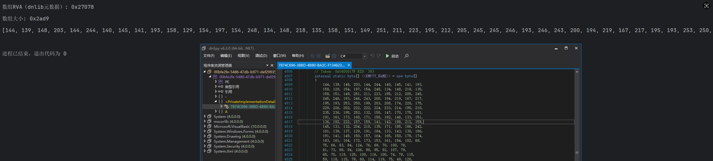

## 2.2 字符串解密

按照上述类似的操作来寻找XOR的 Key：

```
/* 0x0002524D 7E7F010004   */ IL_002D: ldsfld    uint8[] '<PrivateImplementationDetails>{198C6A51-C4E4-4102-BB99-E0C943DAD348}.7874C696-38BD-4B80-BA3C-F13462391766'::''
/* 0x00025252 06           */ IL_0032: ldloc.0
/* 0x00025253 7E7F010004   */ IL_0033: ldsfld    uint8[] '<PrivateImplementationDetails>{198C6A51-C4E4-4102-BB99-E0C943DAD348}.7874C696-38BD-4B80-BA3C-F13462391766'::''
/* 0x00025258 06           */ IL_0038: ldloc.0
/* 0x00025259 91           */ IL_0039: ldelem.u1
/* 0x0002525A 06           */ IL_003A: ldloc.0
/* 0x0002525B 61           */ IL_003B: xor
/* 0x0002525C 20AA000000   */ IL_003C: ldc.i4    170
/* 0x00025261 61           */ IL_0041: xor
/* 0x00025262 D2           */ IL_0042: conv.u1
/* 0x00025263 9C           */ IL_0043: stelem.i1
/* 0x00025264 06           */ IL_0044: ldloc.0
/* 0x00025265 17           */ IL_0045: ldc.i4.1
/* 0x00025266 58           */ IL_0046: add
/* 0x00025267 0A           */ IL_0047: stloc.0
```

```
  array_data = ""
  for index in range(per_method.Body.Instructions.Count):
      if "RuntimeHelpers::InitializeArray" in per_method.Body.Instructions[index].ToString():
          G_ARRAY = per_method.Body.Instructions[index - 1]
          # 关键修正：通过dnlib的FieldDef直接获取数组数据（假设是静态字段数组）
          if isinstance(G_ARRAY.Operand, dnlib.DotNet.FieldDef) and G_ARRAY.Operand.HasFieldRVA:
              array_data = G_ARRAY.Operand.InitialValue  # 直接提取字节数组
              array_size = len(array_data)  # 从数据长度获取大小
              print(f"数组RVA（dnlib元数据）: {hex(G_ARRAY.Operand.RVA)}")
              print(f"数组大小: {hex(array_size)}")
              print(list(array_data))
      if array_data:
          if "xor" in per_method.Body.Instructions[index].ToString() and "ldc.i4" in per_method.Body.Instructions[index + 1].ToString() and "xor" in per_method.Body.Instructions[index + 2].ToString():
              xor_key = per_method.Body.Instructions[index + 1].Operand
              print(xor_key)
```

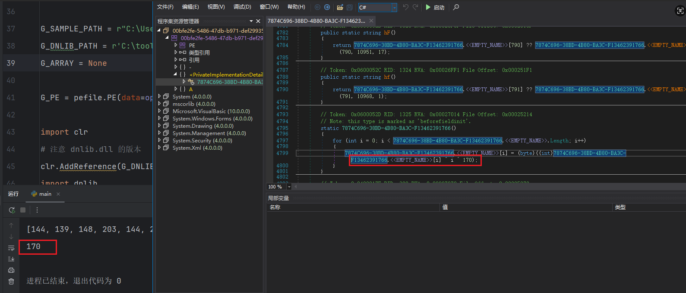

## 2.3 字符串切片

此时只需要发现每个切片函数的特征即可，提取它们的偏移：

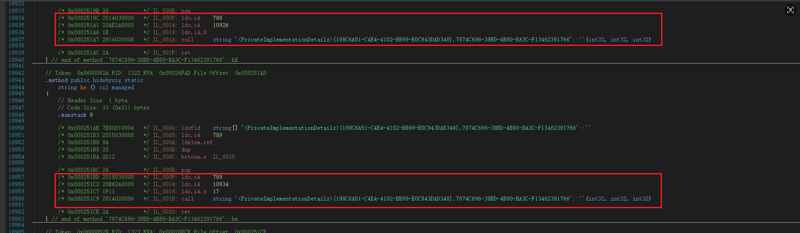

```
        /* 0x000251BD 2015030000   */ IL_000F: ldc.i4    789
        /* 0x000251C2 20B62A0000   */ IL_0014: ldc.i4    10934
        /* 0x000251C7 1F11         */ IL_0019: ldc.i4.s  17
        /* 0x000251C9 2814020006   */ IL_001B: call      string '<PrivateImplementationDetails>{198C6A51-C4E4-4102-BB99-E0C943DAD348}.7874C696-38BD-4B80-BA3C-F13462391766'::''(int32, int32, int32)
```

最终代码：

```
from symbol import pass_stmt
import pefile
from dncil.cil.opcode import OpCodes

G_SAMPLE_PATH = r"样本位置"
G_DNLIB_PATH = r'dnlib.dll位置' 
G_ARRAY = None
G_ARRAY_START_END = set()
G_PE = pefile.PE(data=open(G_SAMPLE_PATH,'rb').read(), fast_load=True)

import clr
# 注意 dnlib.dll 的版本
clr.AddReference(G_DNLIB_PATH)
import dnlib
from dnlib.DotNet import *
mw_module = dnlib.DotNet.ModuleDefMD.Load(G_SAMPLE_PATH)

def get_ldc_real_value(instr):
    """
    用指令名称字符串匹配（更稳定），直接对应你实际看到的 OpCode.Name
    示例：instr.OpCode.Name → 'ldc.i4'/'ldc.i4.s'/'ldc.i4.8'
    """
    op_name = instr.OpCode.Name  # 关键：直接取指令名称字符串
    print(f"调试：解析指令 → {instr} | OpCode.Name: {op_name}")  # 调试用，可删除

    # 1. 长格式：ldc.i4（如 ldc.i4 790）
    if op_name == 'ldc.i4':
        return instr.Operand if instr.Operand is not None else None

    # 2. 短格式：ldc.i4.s（如 ldc.i4.s 17）
    elif op_name == 'ldc.i4.s':
        return instr.Operand if instr.Operand is not None else None

    # 3. 极短格式：ldc.i4.0 ~ ldc.i4.8（如 ldc.i4.8）
    elif op_name == 'ldc.i4.0':
        return 0
    elif op_name == 'ldc.i4.1':
        return 1
    elif op_name == 'ldc.i4.2':
        return 2
    elif op_name == 'ldc.i4.3':
        return 3
    elif op_name == 'ldc.i4.4':
        return 4
    elif op_name == 'ldc.i4.5':
        return 5
    elif op_name == 'ldc.i4.6':
        return 6
    elif op_name == 'ldc.i4.7':
        return 7
    elif op_name == 'ldc.i4.8':
        return 8

    # 4. 特殊情况：ldc.i4.m1（加载-1）
    elif op_name == 'ldc.i4.m1':
        return -1

    # 其他未匹配的指令（打印出来方便调试）
    else:
        print(f"警告：未匹配的ldc指令 → {op_name}")
        return None

for per_type in mw_module.GetTypes():
    if not per_type.HasMethods:
        continue
    for per_method in per_type.Methods:
        if not per_method.HasBody:
            continue
        if not per_method.Body.HasInstructions:
            continue
        array_data = ""
        for index in range(per_method.Body.Instructions.Count):
            if index > 3:
                # print(per_method.Body.Instructions[index].ToString())
                if "call System.String" in per_method.Body.Instructions[index].ToString() and \
                    "ldc.i4" in per_method.Body.Instructions[index - 1].ToString() and "ldc.i4" in per_method.Body.Instructions[index - 2].ToString() and \
                    "ldc.i4" in per_method.Body.Instructions[index - 3].ToString():
                    start_index = get_ldc_real_value(per_method.Body.Instructions[index - 3])
                    start_location = get_ldc_real_value(per_method.Body.Instructions[index - 2])
                    end_location= get_ldc_real_value(per_method.Body.Instructions[index-1])
                    # start_index, start_location,end_location  = (per_method.Body.Instructions[index - 3].Operand,per_method.Body.Instructions[index - 2].Operand,per_method.Body.Instructions[index-1].Operand)
                    print(start_index, start_location,end_location)
                if "RuntimeHelpers::InitializeArray" in per_method.Body.Instructions[index].ToString():
                    G_ARRAY = per_method.Body.Instructions[index - 1]
                    # 关键修正：通过dnlib的FieldDef直接获取数组数据（假设是静态字段数组）
                    if isinstance(G_ARRAY.Operand, dnlib.DotNet.FieldDef) and G_ARRAY.Operand.HasFieldRVA:
                        array_data = G_ARRAY.Operand.InitialValue  # 直接提取字节数组
                        array_size = len(array_data)  # 从数据长度获取大小
                        print(f"数组RVA（dnlib元数据）: {hex(G_ARRAY.Operand.RVA)}")
                        print(f"数组大小: {hex(array_size)}")
                        print(list(array_data))
                if array_data:
                    if "xor" in per_method.Body.Instructions[index].ToString() and "ldc.i4" in per_method.Body.Instructions[index + 1].ToString() and "xor" in per_method.Body.Instructions[index + 2].ToString():
                        xor_key = per_method.Body.Instructions[index + 1].Operand
                        print(xor_key)
```

这里最重要的是需要注意：有些会使用 idc.i4.x 指令

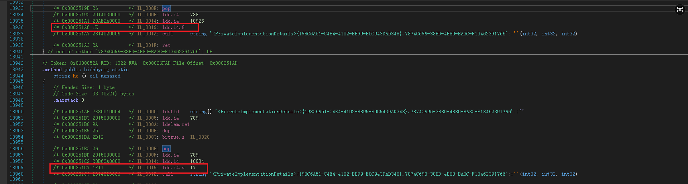

# 三、整体工程化测试

```
from symbol import pass_stmt
import pefile
import traceback

# 配置路径
G_SAMPLE_PATH = r"C:\Users\win2021ltsc\Desktop\4c321c77e5a9381005c96bc7fc887b962bcd8c82fcabf579f3301d583055f59d"
G_DNLIB_PATH = r'C:\tools\dnSpy-net-win64\bin\dnlib.dll'
G_PE = None

str_params = []  # (offset, size)
candidate_arrays = []  # 所有候选数组（用于筛选最长）
candidate_keys = []  # 所有候选密钥（用于验证）
target_array = None  # 最终筛选的字符串表
target_key = None  # 最终验证的正确密钥

# 加载dnlib
try:
    import clr

    clr.AddReference(G_DNLIB_PATH)
    import dnlib
    from dnlib.DotNet import *
    from dnlib.DotNet.Emit import OpCodes

    print("dnlib加载成功")
except Exception as e:
    print(f"dnlib加载失败：{str(e)}")
    print(f"异常详情：{traceback.format_exc()}")
    exit(1)

# 1. 解析参数
def get_param_value(instr):
    try:
        if instr.Operand is not None:
            return int(instr.Operand)
        else:
            instr_str = instr.ToString().strip()
            if '.' in instr_str:
                val_str = instr_str.split('.')[-1]
                if val_str.isdigit():
                    return int(val_str)
            print(f"警告：无法解析参数指令：{instr_str}")
            return None
    except Exception as e:
        print(f"解析参数失败：{str(e)}")
        return None

# 2. ASCII比例验证函数
def pct_ascii(data):
    """计算有效ASCII字符比例（0-1），>0.8为有效解密"""
    if not data:
        return 0.0
    valid = len([c for c in data if (0 <= ord(c) < 128) or ord(c) == 0])
    return valid / len(data)

# 3. 解密函数（data[i] ^ (i & 0xff) ^ key）
def decrypt_test(data, key):
    """测试解密（用于密钥验证）"""
    out = []
    for i in range(len(data)):
        byte_val = int(data[i]) if not isinstance(data[i], int) else data[i]
        char_code = (byte_val ^ (i & 0xff) ^ key) & 0xff 
        out.append(chr(char_code))
    return ''.join(out)

# 4. 动态收集候选密钥
def collect_candidate_keys(mw_module):
    print("
收集候选密钥...")
    for per_type in mw_module.GetTypes():
        for per_method in per_type.Methods:
            # 解密在构造函数中执行（constructor/.cctor）
            if not (per_method.IsConstructor or per_method.Name == ".cctor"):
                continue
            if not per_method.HasBody or not per_method.Body.HasInstructions:
                continue

            instructions = per_method.Body.Instructions
            for idx in range(1, len(instructions) - 1):
                current = instructions[idx]
                prev = instructions[idx - 1]
                next_instr = instructions[idx + 1]
                # 特征：ldc.i4 + 前后有xor
                if (current.OpCode == OpCodes.Ldc_I4 and
                        (prev.OpCode == OpCodes.Xor or next_instr.OpCode == OpCodes.Xor)):
                    key = get_param_value(current)
                    if key is not None and key not in candidate_keys:
                        candidate_keys.append(key)
                        print(f"新增候选密钥：{key}")

    # 备用：从普通方法收集
    if not candidate_keys:
        print("从普通方法补充收集密钥...")
        for per_type in mw_module.GetTypes():
            for per_method in per_type.Methods:
                if not per_method.HasBody or not per_method.Body.HasInstructions:
                    continue
                instructions = per_method.Body.Instructions
                for idx in range(len(instructions) - 2):
                    if (instructions[idx].OpCode == OpCodes.Xor and
                            instructions[idx + 1].OpCode == OpCodes.Ldc_I4 and
                            instructions[idx + 2].OpCode == OpCodes.Xor):
                        key = get_param_value(instructions[idx + 1])
                        if key is not None and key not in candidate_keys:
                            candidate_keys.append(key)
                            print(f"新增候选密钥：{key}")

# 5. 收集候选数组
def collect_candidate_arrays(mw_module):
    print("
收集候选数组...")
    for per_type in mw_module.GetTypes():
        for per_method in per_type.Methods:
            if not per_method.HasBody or not per_method.Body.HasInstructions:
                continue
            instructions = per_method.Body.Instructions
            for idx in range(len(instructions)):
                if "RuntimeHelpers::InitializeArray" in instructions[idx].ToString():
                    if idx - 1 >= 0:
                        arr_inst = instructions[idx - 1]
                        if isinstance(arr_inst.Operand, dnlib.DotNet.FieldDef) and arr_inst.Operand.HasFieldRVA:
                            arr_data = list(arr_inst.Operand.InitialValue)
                            candidate_arrays.append((arr_data, arr_inst.Operand.RVA))
                            print(f"新增候选数组：长度={len(arr_data)}，RVA={hex(arr_inst.Operand.RVA)}")

# 6. 筛选目标数组和密钥
def select_target_array_and_key():
    global target_array, target_key
    print("
筛选目标数组和密钥...")

    # 筛选最长数组作为字符串表
    if candidate_arrays:
        target_array = max(candidate_arrays, key=lambda x: len(x[0]))[0]
        print(f"选中字符串表：长度={len(target_array)}")
    else:
        print("无候选数组")
        return False

    # 验证并筛选密钥
    if not candidate_keys:
        print("无候选密钥")
        return False

    best_key = None
    best_pct = 0.0
    # 取数组前100字节测试解密（避免全量计算）
    test_data = target_array[:100]
    for key in candidate_keys:
        dec_test = decrypt_test(test_data, key)
        pct = pct_ascii(dec_test)
        print(f"密钥{key}：ASCII比例={pct:.2f}")
        if pct > best_pct and pct > 0.8:
            best_pct = pct
            best_key = key

    if best_key is not None:
        target_key = best_key
        print(f"选中有效密钥：{target_key}（ASCII比例={best_pct:.2f}）")
        return True
    else:
        print("无有效密钥（ASCII比例均<0.8）")
        return False

# 7. 收集目标参数
def collect_target_params(mw_module):
    print("
收集目标参数（公开方法+返回String）...")
    for per_type in mw_module.GetTypes():
        for per_method in per_type.Methods:
            # 公开方法 + 返回值为System.String
            if not per_method.IsPublic:
                continue
            if str(per_method.ReturnType) != "System.String":
                continue
            if not per_method.HasBody or not per_method.Body.HasInstructions:
                continue
            if len(per_method.Body.Instructions) < 10:
                continue

            instructions = per_method.Body.Instructions
            for ptr in range(len(instructions)):
                if "call System.String" in instructions[ptr].ToString():
                    if ptr >= 3:
                        size_instr = instructions[ptr - 1]
                        offset_instr = instructions[ptr - 2]
                        if "ldc" in size_instr.ToString() and "ldc" in offset_instr.ToString():
                            offset = get_param_value(offset_instr)
                            size = get_param_value(size_instr)
                            if offset is not None and size is not None and offset >= 0 and size > 0:
                                str_params.append((offset, size))
                                print(f"收集参数：offset={offset}，size={size}（方法：{per_method.Name}）")

# 8. 最终解密
def final_decrypt():
    print(f"
开始最终解密（密钥={target_key}，参数数={len(str_params)}）...")
    decrypted_strings = []
    for idx, (offset, size) in enumerate(str_params, 1):
        print(f"
=== 第{idx}个字符串 ===")
        print(f"offset={offset}，size={size}")

        if offset >= len(target_array):
            print("跳过：offset超出数组长度")
            continue
        end = offset + size
        if end > len(target_array):
            end = len(target_array)
            print(f"调整：实际截取到{end}（原size={size}）")

        sliced = target_array[offset:end]
        # 最终解密
        dec_str = []
        for i, byte in enumerate(sliced):
            global_idx = offset + i  # 全局索引（原数组中的位置）
            byte_val = int(byte) if not isinstance(byte, int) else byte
            char_code = (byte_val ^ (global_idx & 0xff) ^ target_key) & 0xff
            dec_str.append(chr(char_code))
        dec_str = ''.join(dec_str)
        decrypted_strings.append(dec_str)
        print(f"解密结果：{dec_str}")
        print("-" * 60)

    # 汇总
    print("
=== 所有解密字符串汇总 ===")
    for i, s in enumerate(decrypted_strings, 1):
        print(f"{i}. {s}")

# 主逻辑
if __name__ == "__main__":
    # 1. 加载文件
    try:
        print(f"加载样本：{G_SAMPLE_PATH}")
        with open(G_SAMPLE_PATH, 'rb') as f:
            pe_data = f.read()
        G_PE = pefile.PE(data=pe_data, fast_load=True)
        mw_module = dnlib.DotNet.ModuleDefMD.Load(G_SAMPLE_PATH)
        print("PE和.NET模块加载成功")
    except Exception as e:
        print(f"加载失败：{str(e)}")
        exit(1)

    # 2. 步骤1：收集候选密钥
    collect_candidate_keys(mw_module)
    if not candidate_keys:
        print("无候选密钥，退出")
        exit(1)

    # 3. 步骤2：收集候选数组
    collect_candidate_arrays(mw_module)
    if not candidate_arrays:
        print("无候选数组，退出")
        exit(1)

    # 4. 步骤3：筛选目标数组和密钥
    if not select_target_array_and_key():
        exit(1)

    # 5. 步骤4：收集目标参数
    collect_target_params(mw_module)
    if not str_params:
        print("无有效参数，退出")
        exit(0)

    # 6. 步骤5：最终解密
    final_decrypt()

    print("
程序执行完毕")
```

效果：

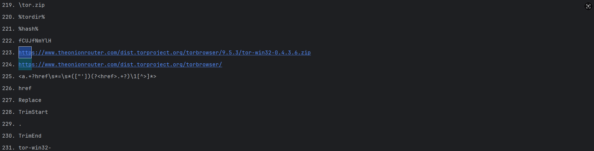

# 四、参考代码

<https://github.com/extremecoders-re/dnlib-demo/blob/master/listmethods.py>

<https://github.com/bartblaze/DotNet-MetaData/blob/main/DotNetMetadata.py>
