# 基于自定义鉴权的JAVA权限绕过-先知社区

> **来源**: https://xz.aliyun.com/news/19365  
> **文章ID**: 19365

---

# 0x00 前言

* 在国内许多 Web 项目中，为了实现统一鉴权或对部分静态/动态资源做统一控制，开发者常用过滤器（Filter）或拦截器（Interceptor）等自定义方法来在请求到达业务逻辑前进行判断与放行/拦截。然而，项目中往往混用或错误使用一些**原生 API （例如未对路径做规范化/解码、多处依赖不同的 path API等不适合用在权限校验、鉴权上面的方法）来获取请求路径**，导致对“请求路径”的判断存在歧义或盲点。此时可以利用这些差异构造（如/admin;.js等）能通过过滤器判断但实际上是有鉴权的请求，进行权限绕过。
* 目前攻防演练中很多Java站基本上都存在这种问题，某微，某凌，某远等各大OA/CMS都爆出过类似的漏洞，但之前调漏洞的时候也总是一知半解，比如有时候../就不起作用，有时候url编码绕不了，那会还以为是中间件的问题或者是安全设备的问题，实际上还有一部分原因是Spring解析URL的特性或者是路径匹配模式的问题。
* 本文将梳理常见的鉴权方案与请求路径获取方式，分析典型的绕过手段，并给出可操作的加固建议。

* 可以结合已经写好的靶场食用：<https://github.com/guchangan1/BypassPerVer>

# 0x01 常见鉴权方案

首先可以了解一下目前国内web项目常见的鉴权方案，了解鉴权逻辑可能会发生在什么地方，便于代审时快速确认关键点，一眼扫盲。

## **Java 鉴权方案一览表**

|  |  |  |  |
| --- | --- | --- | --- |
| **框架 / 方式** | **特性** | **基于什么鉴权** | **典型适用场景** |
| 自定义 Servlet Filter | 全局请求入口、可拦截静态资源 | Session / Token（自解析） | 自定义认证逻辑、审计、中央鉴权 |
| SpringHandlerInterceptor | 控制器级拦截、路由粒度 | 依赖上游认证（Session/Token） | URL 级鉴权、审计 |
| AOP 自定义方法拦截 | 业务方法最靠近，支持复杂上下文决策 | 基于 ThreadLocal/Token 的主体信息 | 细粒度业务授权、领域规则 |
| 容器管理安全（web.xml / JASPIC / JACC / Jakarta EE Security） | 容器级规则、声明式security-constraint、最少代码 | Session / HTTP Basic / FORM / Digest（由容器管理） | 传统 WAR 应用、快速启用容器认证 |
| Spring Security | 完整的过滤器链、方法级注解、OAuth2/OIDC 支持、CSRF/CORS | Session 或 JWT / OAuth2 tokens / Basic / LDAP / SAML | 现代 Spring Boot 应用、微服务资源服务器 |
| Apache Shiro | 简洁 Subject/Realm/Session，通配符权限字符串、URL 过滤链 | Session / RememberMe / Token（可扩展） | 轻量应用、非 Spring 项目 |
| Spring Security ACL（对象级） | 行级/对象级资源权限存储与校验 | DB 存储的 ACL + Session/Token | 需要对单资源做精粒度授权的系统 |
| API 网关（SCG、Nginx、Kong） | 统一入口、前置鉴权、限流/认证 | JWT / OIDC / mTLS / auth\_request | 微服务统一入口、边界防护 |
| Basic / Digest HTTP Auth | 简单、浏览器原生 | HTTP Authorization Header | 内部 API / 简易服务 |

## **自定义鉴权（Filter / Interceptor / AOP）**

### **Servlet Filter**

* web配置，处理/admin/\*

```
@Configuration
public class WebConfig implements WebMvcConfigurer {
    @Bean
    public FilterRegistrationBean<VulnerableAuthFilter> vulnerableAuthFilter() {
        FilterRegistrationBean<VulnerableAuthFilter> registrationBean = new FilterRegistrationBean<>();
        registrationBean.setFilter(new VulnerableAuthFilter());
        registrationBean.addUrlPatterns("/admin/*");
        return registrationBean;
    }
}
```

* 自定义的Filter逻辑

```
@WebFilter("/*")
public class AuthFilter implements Filter {
  public void doFilter(ServletRequest req, ServletResponse res, FilterChain chain)
      throws IOException, ServletException {
        HttpServletRequest httpRequest = (HttpServletRequest) request;
        HttpServletResponse httpResponse = (HttpServletResponse) response;
        // 检查是否已登录（这里简化处理，实际应用中应该检查session或token）
        String authHeader = httpRequest.getHeader("Authorization");
        if (authHeader == null || !authHeader.equals("BypassVulnDemo")) {
            System.out.println("Filter - 未授权访问，需要认证");
            httpResponse.setStatus(HttpServletResponse.SC_UNAUTHORIZED);
            httpResponse.getWriter().write("Filter: Authentication required");
            return;
        }
        
        // 通过验证，继续处理请求
        chain.doFilter(request, response);
  }
}
```

* 即会对对应路由的controller函数生效

```
@GetMapping("/admin/dashboard")
    public Map<String, Object> adminDashboard() {
        Map<String, Object> result = new HashMap<>();
        result.put("message", "成功访问管理员面板");
        result.put("status", "success");
        return result;
    }
```

### **Spring MVC** -**HandlerInterceptor**

**拦截器只能对Controller请求进行拦截，对其他的直接访问静态资源的请求无法拦截处理**。

* web配置

```
@Configuration
public class WebConfig implements WebMvcConfigurer {
    @Override
    public void addInterceptors(InterceptorRegistry registry) {
        registry.addInterceptor(new VulnerableInterceptor())
                .addPathPatterns("/secure/**");
    }
}
```

* 自定义的**HandlerInterceptor**逻辑

```
public class AuthzInterceptor implements HandlerInterceptor {
  public boolean preHandle(HttpServletRequest req, HttpServletResponse res, Object handler) {
    // 检查是否已登录（这里简化处理，实际应用中应该检查session或token）
        String authHeader = request.getHeader("Authorization");
        if (authHeader == null || !authHeader.equals("BypassVulnDemo")) {
            System.out.println("Interceptor - 未授权访问，需要认证");
            response.setStatus(HttpServletResponse.SC_UNAUTHORIZED);
            response.getWriter().write("Unauthorized: Authentication required");
            return false;
        }
  }
}
```

* 即会对对应路由的controller函数生效

```
@GetMapping("/secure/data")
    public Map<String, Object> secureData() {
        Map<String, Object> result = new HashMap<>();
        result.put("message", "成功访问安全数据");
        result.put("status", "success");
        return result;
    }
```

### **AOP 切面**

* 自定义注解@Authorization，用于标记需要进行权限检查的方法

```
@Target(ElementType.METHOD)
@Retention(RetentionPolicy.RUNTIME)
public @interface RequireAuth {
}
```

* 通过创建切面，来实现相关的鉴权操作

```
@Aspect
@Component
public class AopConfig {

    /**
     * 环绕通知，对标记了@RequireAuth注解的方法进行权限检查
     */
    @Around("@annotation(com.bypassvuln.config.RequireAuth)")
    public Object checkAuth(ProceedingJoinPoint joinPoint) throws Throwable {
        HttpServletRequest request = ((ServletRequestAttributes) RequestContextHolder.currentRequestAttributes()).getRequest();
        HttpServletResponse response = ((ServletRequestAttributes) RequestContextHolder.currentRequestAttributes()).getResponse();
        // 检查是否已登录（这里简化处理，实际应用中应该检查session或token）
        String authHeader = request.getHeader("Authorization");
        if (authHeader == null || !authHeader.equals("BypassVulnDemo")) {
            System.out.println("AOP - 未授权访问，需要认证");
            response.setStatus(HttpServletResponse.SC_UNAUTHORIZED);
            response.getWriter().write("Unauthorized: Authentication required");
            return null;
        }
        
        // 通过验证，继续处理请求
        return joinPoint.proceed();
    }
}
```

* 最后在需要权限控制的controller函数上使用注解即可完成对应的鉴权操作：

```
@GetMapping("/api/sensitive")
    @RequireAuth
    public Map<String, Object> sensitiveDdata() {
        Map<String, Object> result = new HashMap<>();
        result.put("message", "成功访问敏感数据");
        result.put("status", "success");
        return result;
    }
```

# 0x02 常见获取请求路径的方法

## 一览表

以常用的Spring-Web 5.3.20为例

|  |  |  |  |
| --- | --- | --- | --- |
| 类别 | 方法 | 描述 | 关注点 |
| HttpServletRequest | getRequestURL() | 返回完整URL，包含协议、主机名、端口和路径 | 传入什么就返回什么，没有任何处理 |
|  | getRequestURI() | 返回从协议名到查询字符串之间的部分 | 传入什么就返回什么，没有任何处理 |
|  | getServletPath() | 返回请求的servlet路径 | 1.先处理特殊字符，删除;后内容 2.会对路径进行URL解码 3.会解析../进行路径穿越 |
|  | getPathInfo() | 返回URL中额外的路径信息 | 一般为null |
|  | getContextPath() | 返回应用的上下文路径 |  |
| Spring RequestContextHolder | RequestContextHolder.getRequestAttributes().getRequest().getRequestURL().toString() | 实际上就是先获取request对象，然后再获取url；方法是与request.getRequestURI()一样的 | 传入什么就返回什么，没有任何处理 |
| Spring ServletUriComponentsBuilder | fromRequest() | 对request.getRequestURI()的封装 | 传入什么就返回什么，没有任何处理 |
|  | fromCurrentRequest() | 对request.getRequestURI()的封装 | 传入什么就返回什么，没有任何处理 |
| Spring HandlerMapping | HandlerMapping.BEST\_MATCHING\_PATTERN\_ATTRIBUTE | 只会返回配置的Controller对应的路径信息，强关联匹配的资源，方便匹配权限控制表 | 如传入/app/path-demo/show/admin返回/path-demo/show/\*\* |
|  | HandlerMapping.PATH\_WITHIN\_HANDLER\_MAPPING\_ATTRIBUTE | 获取处理器映射内的路径 | 1.先处理特殊字符，删除;后内容 2.不会对路径进行URL解码 |
| Spring UrlPathHelper | getPathWithinApplication() | 获取应用内的路径 | 1.先处理特殊字符，删除;后内容 2.会对路径进行URL解码 |
|  | getOriginatingRequestUri() | 获取原始请求URI | 1.先处理特殊字符，删除;后内容 2.会对路径进行URL解码 |
| Spring ServletRequestPathUtils | getCachedPath() | 实际上是从UrlPathHelper的PATH\_ATTRIBUTE或者是ServletRequestPathUtils的PATH\_ATTRIBUTE属性获取 | 1.根据实际情况会有URl解码和不解码区分 2.其他不做处理 |

## 靶场示例

可以自己感受一下

请求示例：[http://localhost:18083/app/path-demo/show///%2e%2e/../admin;.js](http://localhost:18083/app/path-demo/show/admin;.js)

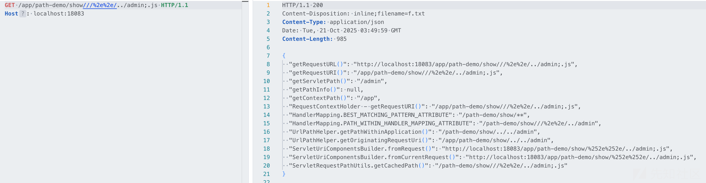

```
{
  "getRequestURL()": "http://localhost:18083/app/path-demo/show///%2e%2e/../admin/dashboard;.js",
  "getRequestURI()": "/app/path-demo/show///%2e%2e/../admin/dashboard;.js",
  "getServletPath()": "/admin/dashboard",
  "getPathInfo()": null,
  "getContextPath()": "/app",
  "RequestContextHolder - getRequestURI()": "/app/path-demo/show///%2e%2e/../admin/dashboard;.js",
  "HandlerMapping.BEST_MATCHING_PATTERN_ATTRIBUTE": "/path-demo/show/**",
  "HandlerMapping.PATH_WITHIN_HANDLER_MAPPING_ATTRIBUTE": "/path-demo/show///%2e%2e/../admin/dashboard",
  "UrlPathHelper.getPathWithinApplication()": "/path-demo/show/../../admin/dashboard",
  "UrlPathHelper.getOriginatingRequestUri()": "/app/path-demo/show/../../admin/dashboard",
  "ServletUriComponentsBuilder.fromRequest()": "http://localhost:18083/app/path-demo/show/%252e%252e/../admin/dashboard;.js",
  "ServletUriComponentsBuilder.fromCurrentRequest()": "http://localhost:18083/app/path-demo/show/%252e%252e/../admin/dashboard;.js",
  "ServletRequestPathUtils.getCachedPath()": "/path-demo/show///%2e%2e/../admin/dashboard;.js"
}
```

# 0x03 常见权限绕过场景

* 靶场配置应用根路径

* server.servlet.context-path=/app

* 靶场版本

* Spring Boot 2.7.0

* Spring Web 5.3.20

* 漏洞代码分别在Filter、HandlerInterceptor、Spring AOP中提供了对不同路由下的自定义过滤机制（实际上可以把所有漏洞逻辑写到Filter就行，但为了让大家知道一些可能存在鉴权的点，分别在这三处写了漏洞逻辑，便于对应调试、学习）
* Controller

```
@RestController
public class DemoController {
    /**
     * 受Filter过滤的管理员接口
     */
    @GetMapping("/admin/dashboard")
    public Map<String, Object> adminDashboard() {
        Map<String, Object> result = new HashMap<>();
        result.put("message", "成功访问管理员面板");
        result.put("status", "success");
        return result;
    }

    /**
     * 受Interceptor拦截的接口
     */
    @GetMapping("/secure/data")
    public Map<String, Object> secureData() {
        Map<String, Object> result = new HashMap<>();
        result.put("message", "成功访问安全数据");
        result.put("status", "success");
        return result;
    }

    /**
     * 受AOP拦截的接口
     */
    @GetMapping("/api/sensitive")
    @RequireAuth
    public Map<String, Object> sensitiveDdata() {
        Map<String, Object> result = new HashMap<>();
        result.put("message", "成功访问敏感数据");
        result.put("status", "success");
        return result;
    }
```

* web.config

```
@EnableAspectJAutoProxy
public class WebConfig implements WebMvcConfigurer {
    @Bean
    public FilterRegistrationBean<VulnerableAuthFilter> vulnerableAuthFilter() {
        FilterRegistrationBean<VulnerableAuthFilter> registrationBean = new FilterRegistrationBean<>();
        registrationBean.setFilter(new VulnerableAuthFilter());
        registrationBean.addUrlPatterns("/admin/*");
        registrationBean.setName("vulnerableAuthFilter");
        registrationBean.setOrder(1);
        return registrationBean;
    }

    @Override
    public void addInterceptors(InterceptorRegistry registry) {
        registry.addInterceptor(new VulnerableInterceptor())
                .addPathPatterns("/secure/**");
    }
```

## startsWith

### 漏洞代码

* VulnerableInterceptor

```
public boolean preHandle(HttpServletRequest request, HttpServletResponse response, Object handler) throws Exception {
        // 获取请求URI
        String requestUri = request.getRequestURI();
        
        // 对swagger开头的请求进行放行
        if (requestUri.startsWith("/swagger")) {
            return true;
        }
        
        // 检查是否已登录（这里简化处理，实际应用中应该检查session或token）
        String authHeader = request.getHeader("Authorization");
        if (authHeader == null || !authHeader.equals("BypassVulnDemo")) {
            System.out.println("Interceptor - 未授权访问，需要认证");
            response.setStatus(HttpServletResponse.SC_UNAUTHORIZED);
            response.getWriter().write("Unauthorized: Authentication required");
            return false;
        }
        
        // 通过验证，继续处理请求
        return true;
```

‍

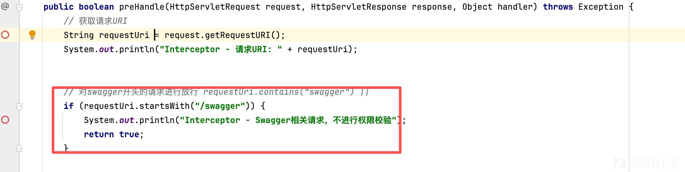

### 使用目录穿越符（../）绕过

正常访问，需要鉴权，可以看到受到拦截

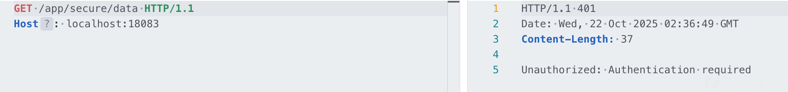

访问/swagger/../app/secure/data，成功绕过

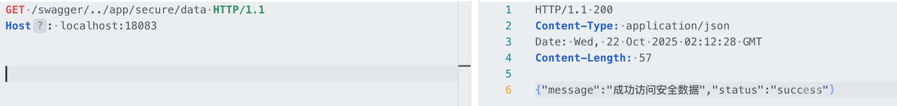

#### 绕过原理（感兴趣可以看看）

**思考**：为什么能绕过？按道理URL先经过Tomcat不应该做了规范化处理，传给Spring的时候不已经是/app/secure/data才对吗？

在过滤处打了个断点，看一下逻辑

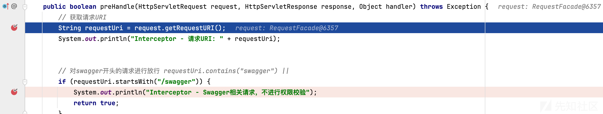

发现getRequestURI通过变量coyoteRequest获取到原始请求路径（/swagger/../app/secure/data）

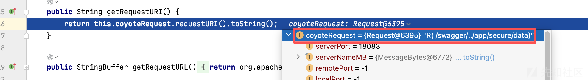

那么coyoteRequest是什么？找到变量第一次出现的点，是在Tomcat的CoyoteAdapter类获取到的，就是保存了一份原始请求对象（ Tomcat 解析 HTTP 报文后保存的最底层数据结构）

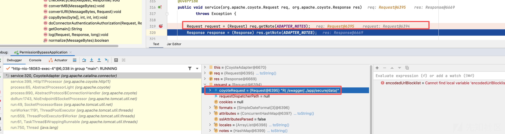

那么由于拦截器使用getRequestURI获取的请求路径，未进行规范化，导致直接获取到/swagger/../app/secure/data，满足以swagger开头的逻辑，就绕过了鉴权。

‍

**思考：** 既然是/swagger/../app/secure/data，那之后是怎么匹配到/app/secure/data的？

Tomcat解析完了报文，就给到Spring了，这里实际上就是Spring MVC 内部请求处理链（DispatcherServlet 调度机制） 的核心

```
浏览器发出请求
   ↓
[TOMCAT 层]
   Socket → CoyoteRequest → CoyoteAdapter → Application Filter Chain
   ↓
[SPRING MVC 层]
   DispatcherServlet → HandlerMapping → HandlerAdapter → Controller Method
   ↓
执行完返回 ModelAndView / ResponseBody
   ↓
视图解析 / 序列化为 JSON
   ↓
响应返回客户端
```

之前大学学java spring开发的时候保存的一张清朝老图，应付考试总结的一些内容如下

|  |  |  |
| --- | --- | --- |
| 阶段 | 主要类 | 职责 |
| Tomcat 层 | CoyoteRequest/CoyoteAdapter | 解析 HTTP 报文 |
| DispatcherServlet | doDispatch() | 请求调度核心 |
| HandlerMapping | RequestMappingHandlerMapping | 匹配 URL 到 Controller |
| HandlerAdapter | RequestMappingHandlerAdapter | 参数绑定、执行方法 |
| Controller | @Controller / @RestController | 业务逻辑 |
| ViewResolver | InternalResourceViewResolver | 渲染 HTML 视图 |
| Response | CoyoteResponse | 输出到 Socket |

‍

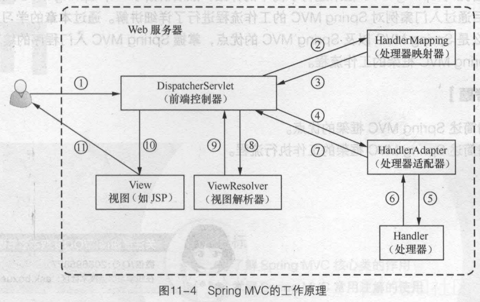

可以看到，把doDispatch关键的择出来看一下，结合上图得知，在HandlerMapping 的时候到了 Controller，找到controller是在getHandler方法，

```
protected void doDispatch(HttpServletRequest request, HttpServletResponse response) {
    //  查找 Handler（Controller 方法），包括 Controller + HandlerInterceptor[]
    HandlerExecutionChain mappedHandler = getHandler(request);
    //  查找对应的 HandlerAdapter
    HandlerAdapter ha = getHandlerAdapter(mappedHandler.getHandler());
    // 调用前置拦截器 preHandle()
    applyPreHandle(mappedHandler, request, response);
    // 执行 Controller 方法
    ModelAndView mv = ha.handle(request, response, mappedHandler.getHandler());
    // 调用后置拦截器 postHandle()
    applyPostHandle(mappedHandler, request, response, mv);
    // 视图渲染或返回 JSON
    processDispatchResult(request, response, mappedHandler, mv);
}
```

打断点看下，通过如下几个HandlerMapping

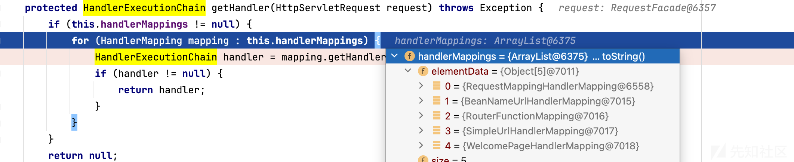

|  |  |  |
| --- | --- | --- |
| HandlerMapping 实现类 | 主要职责 | 说明 |
| RequestMappingHandlerMapping | 匹配基于注解的控制器方法（@RequestMapping,@GetMapping,@PostMapping等） | 这是现代 Spring MVC 绝大多数请求的匹配器。启动时扫描所有@Controller，建立 URL → HandlerMethod 的映射表。 |
| BeanNameUrlHandlerMapping | 根据 Bean 名称匹配 URL（beanName 以斜杠开头/xxx） | 早期 Spring 方式，现在基本弃用。 |
| RouterFunctionMapping | 匹配函数式路由（RouterFunction/ WebFlux 风格） | Spring 5 引入的函数式编程模型支持（RouterFunction<ServerResponse>）。 |
| SimpleUrlHandlerMapping | 用于手工配置的 URL → Controller 对应关系（例如静态资源、欢迎页） | 比如/static/\*\*、/favicon.ico、/webjars/\*\*之类。 |
| WelcomePageHandlerMapping | 匹配网站根路径/的欢迎页请求 | 如果项目里有index.html或配置的欢迎页，它负责匹配/请求。 |

这里匹配controller用的是RequestMappingHandlerMapping

进入RequestMappingHandlerMapping.getHandler

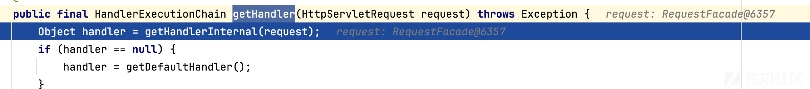

跟进getHandlerInternal，发现initLookupPath，看到path猜测这里就是做处理

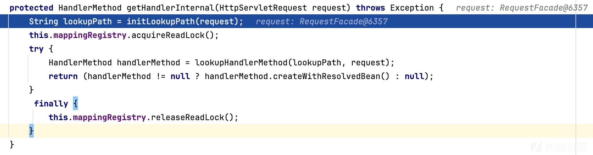

跟进后发现ServletRequestPathUtils.getParsedRequestPath进行了路径获取，跟进看下

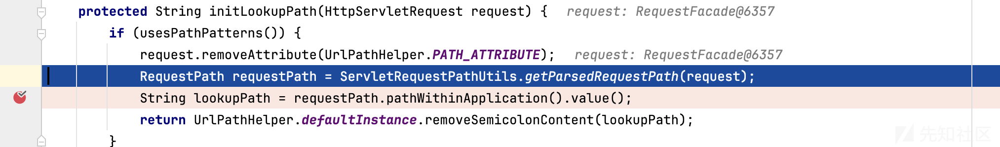

这里获取到了三个变量、fullPath、contextPath、pathWithinApplication，可以看到只有pathWithinApplication没有跨目录符，可能是对跨目录进行了解析？（下有绕过失败的章节会有对这里的解释，实际上并不是做了解析）

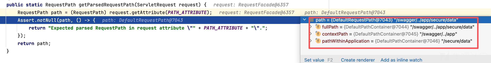

至此，通过pathWithinApplication获取到lookupPath，再通过该路径获取到对应的controller方法

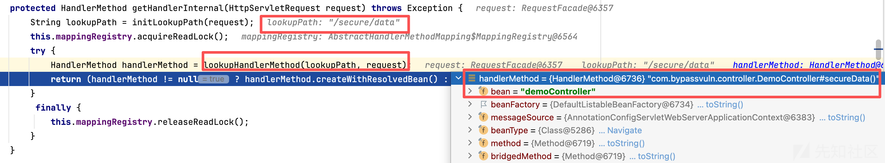

之后执行 Controller 方法 ModelAndView mv = ha.handle(request, response, mappedHandler.getHandler());不再赘述

#### 绕过失败的情况

实际上几年前审的代码这样的漏洞很多，但有时候使用/swagger/../ 就访问不到controller资源，最开始以为是nginx等反向代理配置了路由转发原因，这里实际上也有可能是根路径的配置问题。

现在把根路径设置为/

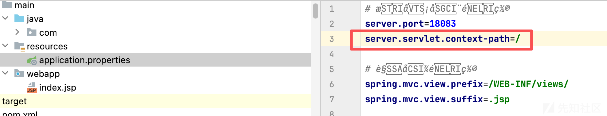

再次请求，直接返回404了

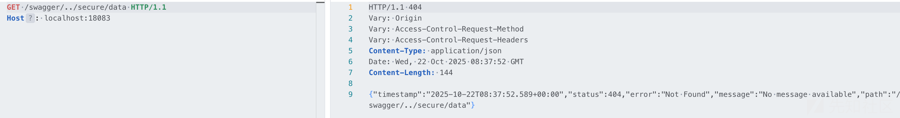

还是initLookupPath，跟一下，发现pathWithinApplication直接变成了/swagger/../secure/data

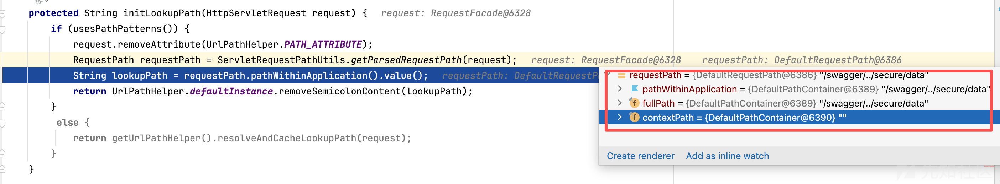

那自然找不到controller了

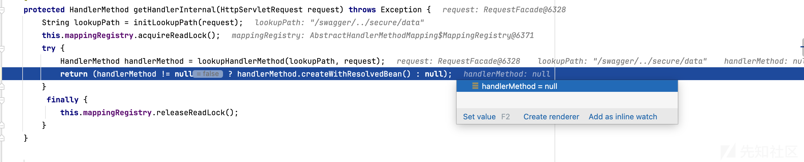

**思考：为什么**pathWithinApplication**直接变成了** /swagger/../secure/data **，为什么有根路径的时候就解析，没跟路径的时候不解析？那很可能说明，**pathWithinApplication**就压根没做路径规范化处理，看下怎么获取的**pathWithinApplication

ServletRequestPathUtils.getParsedRequestPath(request);这里也并没有做啥处理，直接就是取的PATH\_ATTRIBUTE变量org.springframework.web.util.ServletRequestPathUtils.PATH，那应该就是在这个构造PATH\_ATTRIBUTE的地方处理的

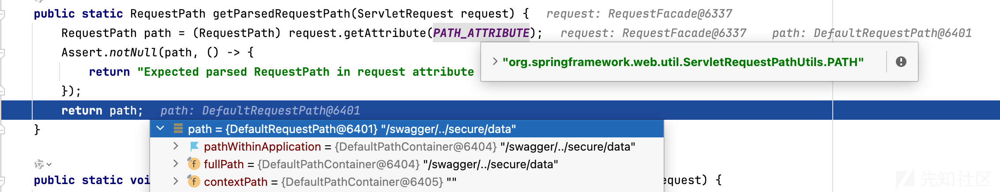

进入ServletRequestPathUtils，断点request.setAttribute(PATH\_ATTRIBUTE, requestPath);

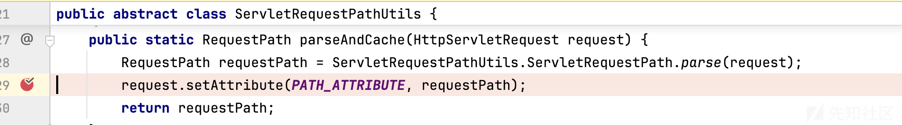

调试过程发现依然是从DispatcherServlet开始的，调用ServletRequestPathUtils.parseAndCache(request);解析请求

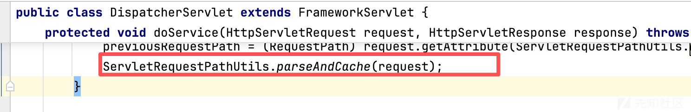

跟进，调用了ServletRequestPath.parse(request)

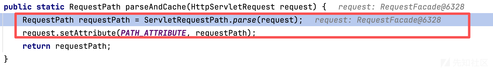

然后调用RequestPath.parse(requestUri, request.getContextPath());，这里通过request.getContextPath()获取到ContextPath

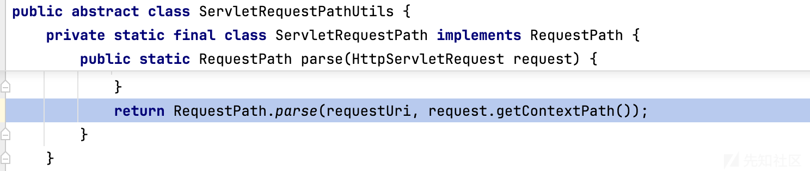

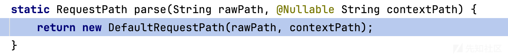

到达如下函数，可以看到extractPathWithinApplication方法之后获取到pathWithinApplication

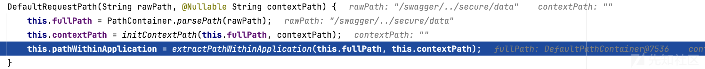

看下咋获取的，因为contextPath为空，所以元素大小就是0

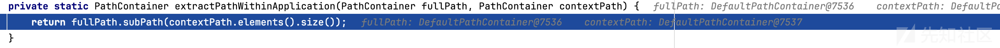

index为0，进入subPath，不断跟进

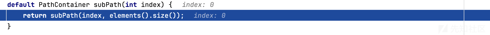

‍

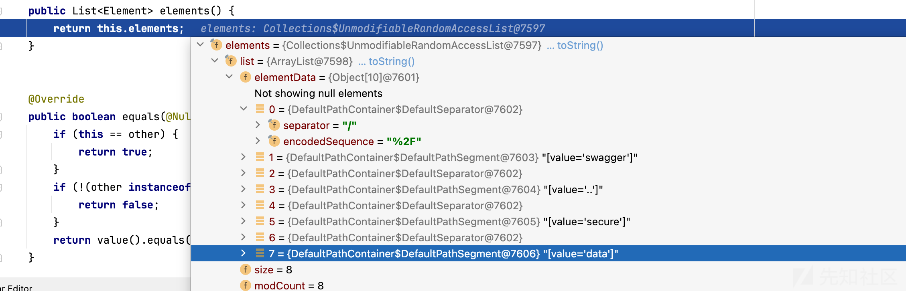

这里的endindex就是上面的全部元素，应该指的是全URI，有8个元素

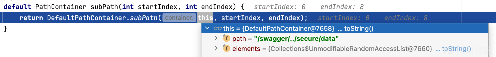

那么fromindex为0，toindex为8 跟进

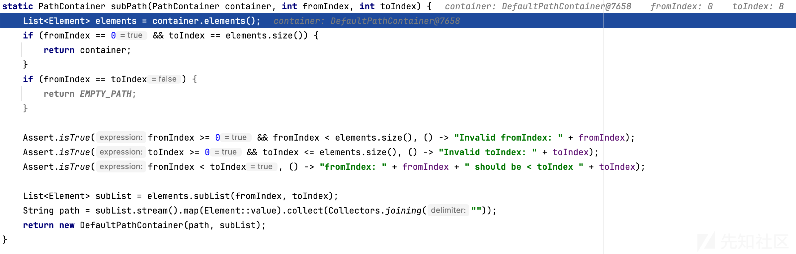

因为contextPath为空，fromIndex为0的条件下就直接返回全路径

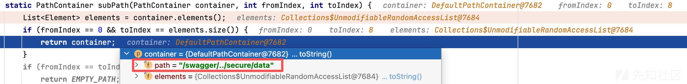

这就导致pathWithinApplication直接变成了/swagger/../secure/data，也就找不到controller了。

‍

**思考：那为什么设置了**server.servlet.context-path=/app**的情况**pathWithinApplication**就能正常获取呢？在设置**server.servlet.context-path=/app**的情况下传入**/swagger/../app/secure/data**继续看下这里怎么处理的**

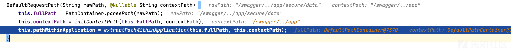

由于contextPath变成了/swagger/../app，那fromindex就是6，toindex为10。必定不满足fromIndex为0的条件，不返回全路径。这时匹配到全路径的第7-10，获取到controller路径 /secure/data

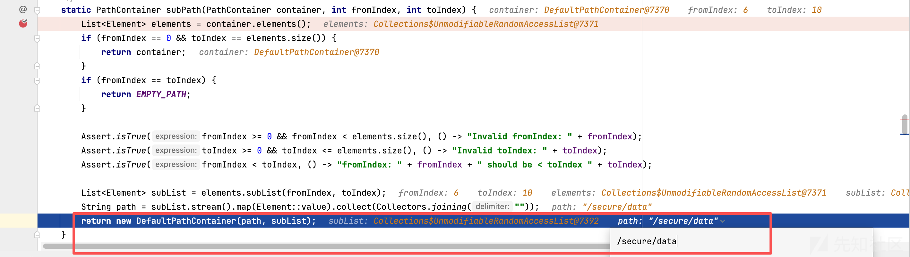

所以这里的关键，应该是在于contextPath为什么变成了/swagger/../app，所以看下contextPath咋获取的

我们知道是通过request.getContextPath()获取到的ContextPath


跟进看下，实际上就是Tomcat提供的getContextPath方法

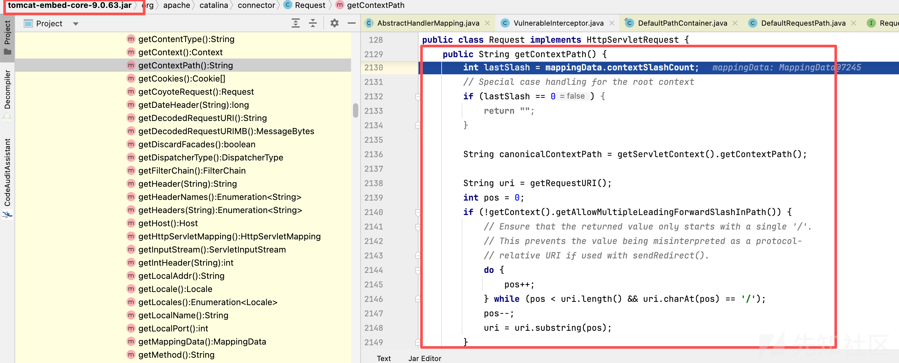

梳理一下如下：

1. 没有设置context-path或者设置为/的时候lastSlash为0，自然返回空，后续pathWithinApplication拿到的就是未规范化的路径，也就匹配不到controller
2. 但设置了context-path，比较传入的URI是否正确的时还进行了"去掉多余/，去参数、解码、归一化"；但返回值是原始 URI 的那一段（保持原始编码/大小写），应该是为了以便后续逻辑（比如日志、相对定位、转发）保留原貌。

1. 主要就在这个精确循环上，示例如下每次都取 candidate = uri.substring(0, pos)（或者到末尾），做三件事：  
   1.removePathParameters(candidate)（去掉 ;xxx=yyy 的分号参数）  
   2.URLDecode(candidate)（按 connector 的 URI 字符集解码）  
   3.RequestUtil.normalize(candidate)（归一化 . .. 多 / 等） 然后拿结果和 canonicalContextPath（/app）比较。
2. 第一次尝试

* pos=8，candidate = "/swagger"
* 去参数/解码/归一化后还是 "/swagger"
* 比较："/swagger" ≠ "/app" → 继续

1. 第二次尝试

* pos = nextSlash(chars, 9) → 找到 pos=11（/../ 中的 /）
* candidate = uri.substring(0, 11) → "/swagger/.."
* 归一化："/swagger/.." → 变成 "/"
* 比较："/" ≠ "/app" → 继续

1. 第三次尝试（命中）

* pos = nextSlash(chars, 12) → 找到 pos=16（/app/ 前的 /）
* candidate = uri.substring(0, 16) → "/swagger/../app"
* 归一化："/swagger/../app" → "/app"
* 比较："/app" == "/app" → match = true

以下是代码注释

```
public String getContextPath() {
    // Tomcat 在 Mapper 阶段统计出来的“context 中包含的斜杠个数”
    int lastSlash = mappingData.contextSlashCount;

    // 根上下文（ROOT，/）的特殊处理：contextPath 应为 ""（空串，而不是 "/"）
    if (lastSlash == 0) {
        return "";
    }
    // 配置文件配置的contextPath，例如 "/app"
    String canonicalContextPath = getServletContext().getContextPath();

    // 原始请求 URI（可能带多余斜杠、分号参数、编码等）
    String uri = getRequestURI();
    int pos = 0;

    // 如果不允许前导多斜杠，则把 URI 开头的多余 '/' 折叠成一个
    // 这样可避免后续 sendRedirect 时被解释为“协议相对 URL”（以 '//' 开头）
    if (!getContext().getAllowMultipleLeadingForwardSlashInPath()) {
        // 跳过连续的 '/'
        do {
            pos++;
        } while (pos < uri.length() && uri.charAt(pos) == '/');
        // 回退一位，确保以单个 '/' 开头
        pos--;
        uri = uri.substring(pos);
    }

    // 为了快速找下一个斜杠，转成 char 数组
    char[] uriChars = uri.toCharArray();

    // 先基于“斜杠计数”粗定位：至少要走到 contextPath 所在的斜杠边界
    // 例如 contextPath="/foo/bar" 则需要走到第 2 个斜杠边界
    while (lastSlash > 0) {
        pos = nextSlash(uriChars, pos + 1); // 从 pos+1 开始找下一个 '/'
        if (pos == -1) { // 没有更多斜杠
            break;
        }
        lastSlash--;
    }

    // 现在开始“精确匹配循环”
    // 思路：从当前候选边界开始，逐步向后扩展到下一个 '/'，
    // 对候选子串做“去 path 参数；URL 解码；路径归一化”后，
    // 与 canonicalContextPath 比较，相等即确定 contextPath。
    String candidate;
    if (pos == -1) {
        // 没有更多 '/'，候选就是整个 uri
        candidate = uri;
    } else {
        // [0, pos) —— 注意 substring 右开区间，返回不含 pos 的字符
        candidate = uri.substring(0, pos);
    }

    // 1) 去掉路径参数（matrix variables），例如 "/a;b=1/c" -> "/a/c"
    candidate = removePathParameters(candidate);
    // 2) URL 解码（把 %2F、%3B 等转回字符），字符集来自 Connector 配置
    candidate = UDecoder.URLDecode(candidate, connector.getURICharset());
    // 3) 归一化：折叠 ".."、"."、多斜杠等，确保一致的路径形式
    candidate = org.apache.tomcat.util.http.RequestUtil.normalize(candidate);

    // 与 canonicalContextPath 比较
    boolean match = canonicalContextPath.equals(candidate);

    // 若未匹配，继续向后扩展到下一个 '/'，重复“去参数→解码→归一化→比较”
    while (!match && pos != -1) {
        pos = nextSlash(uriChars, pos + 1);
        if (pos == -1) {
            candidate = uri;
        } else {
            candidate = uri.substring(0, pos);
        }
        candidate = removePathParameters(candidate);
        candidate = UDecoder.URLDecode(candidate, connector.getURICharset());
        candidate = org.apache.tomcat.util.http.RequestUtil.normalize(candidate);
        match = canonicalContextPath.equals(candidate);
    }

    // 命中后，返回“原始 URI”中与之对应的那一段子串（保留原样），否则抛异常
    if (match) {
        if (pos == -1) {
            return uri;               // 命中到 URI 末尾
        } else {
            return uri.substring(0, pos); // 命中到某个斜杠前
        }
    } else {
        // 理论上不会到这里：说明 canonicalContextPath 与请求 URI 无法对应
        throw new IllegalStateException(sm.getString(
                "coyoteRequest.getContextPath.ise", canonicalContextPath, uri));
    }
}
```

#### 扩展Payload

根据上文的路径处理情况，我们就知道了反正匹配contextpath的时候会对uri进行规范化处理（处理// 、解析../ 、进行url解码、去掉;至/部分）

那就可以这么玩：

/swagger/..;666666/app/secure/data （会去掉;至/部分）

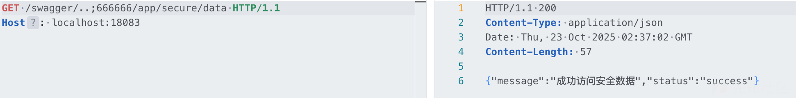

这么玩：

/swagger/////%2e%2e;666666/////%61%70%70/secure/data

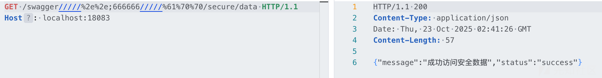

当然了，controller也是可以编码传入的，简单讲一下就是在匹配controller的时候有一个解码阶段，可以自己跟一下

/swagger/////%2e%2e;666666/////%61%70%70/%73%65%63%75%72%65/%64%61%74%61

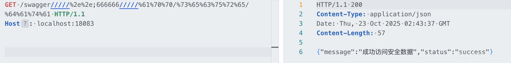

## endsWith

### 漏洞代码

VulnerableAuthFilter

```
public void doFilter(ServletRequest request, ServletResponse response, FilterChain chain)
            throws IOException, ServletException {
        HttpServletRequest httpRequest = (HttpServletRequest) request;
        HttpServletResponse httpResponse = (HttpServletResponse) response;
        
        // 获取请求URL
        String requestUrl = httpRequest.getRequestURL().toString();
        
        // 漏洞点：使用URL字符串判断，对.js结尾的请求不进行权限校验
        if (requestUrl.endsWith(".js")) {
            System.out.println("Filter - 静态JS资源，不进行权限校验");
            chain.doFilter(request, response);
            return;
        }
        
        // 检查是否已登录（这里简化处理，实际应用中应该检查session或token）
        String authHeader = httpRequest.getHeader("Authorization");
        if (authHeader == null || !authHeader.equals("BypassVulnDemo")) {
            System.out.println("Filter - 未授权访问，需要认证");
            httpResponse.setStatus(HttpServletResponse.SC_UNAUTHORIZED);
            httpResponse.getWriter().write("Filter: Authentication required");
            return;
        }
```

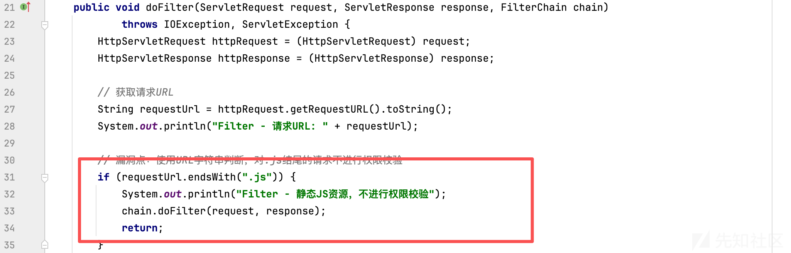

### 使用路径参数（;.js）绕过

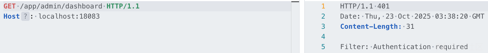

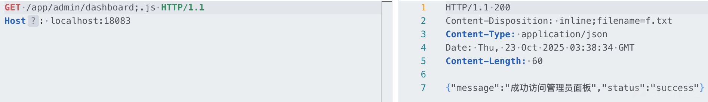

#### 绕过原理

我们已经知道getRequestURI通过变量coyoteRequest可以获取到原始请求路径（app/admin/dashboard;.js），自然是满足Filter以.js结尾的条件的

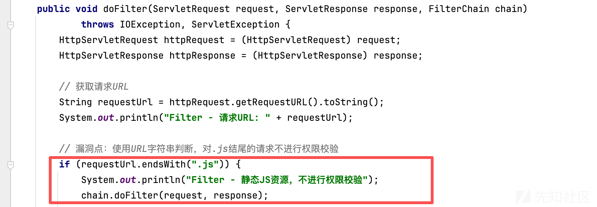

思考：为什么可以匹配到controller，什么时候过滤的;.js?

继续回到initLookupPathSpring路径处理的地方，这里对传入的LookupPath进行了过滤

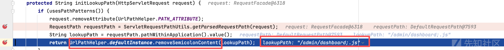

跟进方法，这个方法专门对传入的URl过滤了分号之后的内容

* 处理末段分号：/a;b=1 → 无下一个 /，直接裁剪为 /a。
* 处理多个分号连在一起：/a;;x=1/b → 删除从第一个 ; 到 /，一次性变 /a/b。
* 没有 ;的话原样返回。
* 只处理未编码的分号：/a%3Bb=1/b 不会被处理（需要在此函数前先 URL 解码）。

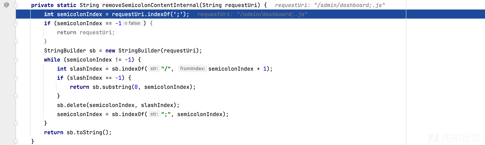

那肯定就是没问题的了

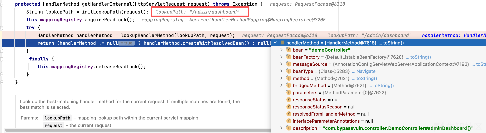

#### 扩展payload

那就可以这么玩了：

/app/admin;666666/dashboard;6666666;;;.js

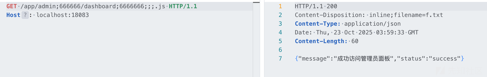

## contains

### 漏洞代码

Spring AOP

```
@Around("@annotation(com.bypassvuln.config.RequireAuth)")
    public Object checkAuth(ProceedingJoinPoint joinPoint) throws Throwable {
        HttpServletRequest request = ((ServletRequestAttributes) RequestContextHolder.currentRequestAttributes()).getRequest();
        HttpServletResponse response = ((ServletRequestAttributes) RequestContextHolder.currentRequestAttributes()).getResponse();
        String requestUri = request.getRequestURI();
        if (requestUri.contains("swagger")) {
            System.out.println("AOP - Swagger相关请求，不进行权限校验");
            return joinPoint.proceed();
        }
        
        // 检查是否已登录（这里简化处理，实际应用中应该检查session或token）
        String authHeader = request.getHeader("Authorization");
        if (authHeader == null || !authHeader.equals("BypassVulnDemo")) {
            return null;
        }
        return joinPoint.proceed();
    }
```

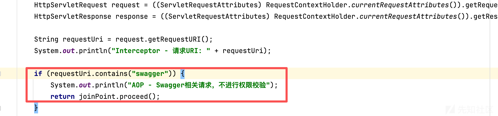

这种情况最简单，只用包含就行

### 使用目录穿越+路径参数绕过（/..;/）

了解我们上面的一些方法原理之后，就有很多种Payload构造方法

/swagger/../app/api/sensitive

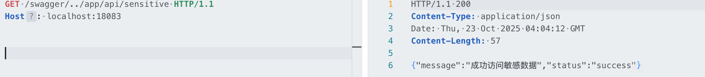

/app/api/sensitive;swagger

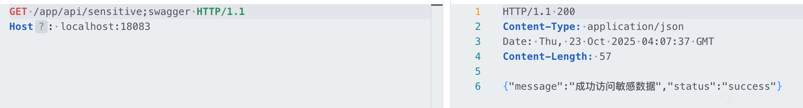

/app/api;swagger/sensitive

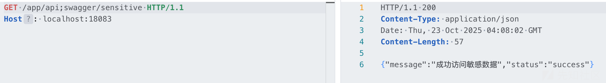

#### 绕过失败的情况

还是写一下吧，实际上就是把目录穿越符写到controller的情况/app/api/swagger/../sensitive

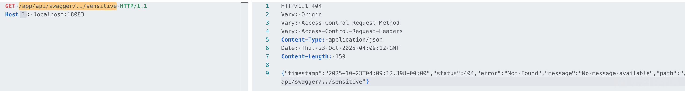

看过上面的原理的肯定能猜到了，事实上就是获取controller这块，并不会发生目录穿越的解析，所以压根就获取不到controller


### 后缀匹配模式下的绕过（.swagger）

还是得说一下，因为某OA是有这样的案例的，确实有低版本的情况。

* 5.3之前的默认开启后缀匹配模式（useSuffixPatternMatch）
* 5.3开始后缀匹配模式（useSuffixPatternMatch）就已经默认关闭了，需要手动开启PathMatchConfigurer.setUseSuffixPatternMatch(True)
* 另外Spring Boot下默认关闭

‍

因为我使用的是5.3.20，需要手动开启一下。

```
@Override
    public void configurePathMatch(PathMatchConfigurer configurer) {
        configurer.setUseSuffixPatternMatch(true);
    }
```

可以发现能够成功匹配


有很详细的介绍，不具体分析逻辑了


## endsWith（强制性白名单）

### 漏洞代码

* web.config

```
@Bean
    public FilterRegistrationBean<ExtensionAuthFilter> extensionAuthFilter() {
        FilterRegistrationBean<ExtensionAuthFilter> registrationBean = new FilterRegistrationBean<>();
        registrationBean.setFilter(new ExtensionAuthFilter());
        registrationBean.addUrlPatterns("/system/*"); 
        registrationBean.setName("extensionAuthFilter");
        return registrationBean;
    }
```

* ExtensionAuthFilter

```
public void doFilter(ServletRequest request, ServletResponse response, FilterChain chain) throws IOException, ServletException {
        HttpServletRequest httpRequest = (HttpServletRequest) request;
        HttpServletResponse httpResponse = (HttpServletResponse) response;
        
        // 获取请求URI
        String requestUri = httpRequest.getRequestURI();
        System.out.println("ExtensionAuthFilter - 请求URI: " + requestUri);
        
        // 检查是否以.do或.jsp结尾
        if (requestUri.endsWith(".do") || requestUri.endsWith(".jsp")) {
            System.out.println("ExtensionAuthFilter - 检测到.do或.jsp请求，进行权限校验");
            
            // 检查是否已登录（这里简化处理，实际应用中应该检查session或token）
            String authHeader = httpRequest.getHeader("Authorization");
            if (authHeader == null || !authHeader.equals("BypassVulnDemo")) {
                System.out.println("ExtensionAuthFilter - 未授权访问，需要认证");
                httpResponse.setStatus(HttpServletResponse.SC_UNAUTHORIZED);
                httpResponse.getWriter().write("Unauthorized: Authentication required for .do and .jsp resources");
                return; // 终止请求处理
            }
            
            System.out.println("ExtensionAuthFilter - 权限校验通过");
        } else {
            System.out.println("ExtensionAuthFilter - 非.do或.jsp请求，不进行权限校验");
        }
        
        // 继续处理请求
        chain.doFilter(request, response);
```

* controller

```
//正常情况下肯定没这样写的，只是为了掩饰以.do结尾的资源
    @GetMapping("/system/dashboard.do")
    public Map<String, Object> systemDashboard() {
        Map<String, Object> result = new HashMap<>();
        result.put("message", "成功访问system面板");
        result.put("status", "success");
        return result;
    }
```

### 使用结尾处添加路径参数或者结尾处/绕过


#### 绕过原理

* 对于;结尾的不再赘述，详见上一章节；
* 结尾加/满足了过滤器的要求，那是怎么匹配到controller的呢？

很明显，initLookupPath此时获取到的就是结尾加了/的的路径


那就是lookupHandlerMethod里的特性了，用LookupPath开始匹配现有的controller


跟进匹配方法


之后实际上就到了Spring的路径模式匹配链表递归算法了，可能比较难懂，意思就是如果已经没有更多元素，且当前位置是分隔符 /，就会把这最后一个 / 当成合法的可选结尾直接通过。感兴趣的可以自己跟一下。


‍

### 对controller使用编码绕过


#### 绕过原理

在之前的fullpath处理过程中，会进入方法PathContainer.parsePath(rawPath)


这里面有个方法会对URL进行uridecode处理


后续在匹配的过程中就会使用解码的值进行匹配


## equals（单独鉴权）

实际上还有一种情况，就是开发不会修洞或者临时写了个过滤器针对单个uri进行鉴权，但是依然使用了requesturi等未规范化获取uri的方法来获取路由，导致漏洞

### 漏洞代码

```
// 获取请求URI
        String requestUri = httpRequest.getRequestURI();

        if (requestUri.equals("/app/system/admin")) {
            System.out.println("ExtensionAuthFilter - 检测到特殊管理员请求，进行权限校验");
            
            // 检查是否已登录（这里简化处理，实际应用中应该检查session或token）
            String authHeader = httpRequest.getHeader("Authorization");
            if (authHeader == null || !authHeader.equals("BypassVulnDemo")) {
                System.out.println("ExtensionAuthFilter - 未授权访问，需要认证");
                httpResponse.setStatus(HttpServletResponse.SC_UNAUTHORIZED);
                httpResponse.getWriter().write("Unauthorized: Authentication required for .do and .jsp resources");
                return; // 终止请求处理
            }
```

‍

### 使用url编码绕过


requestUri获取到的是未规范化的路径，直接进行匹配肯定不满足条件，就不进入鉴权了


‍

## 总结

对于Spring5.3.20版本（估计5.3.x版本都一个德行，有一定差异，遇到实际情况再具体分析）一些解析特性如下

* 配置了server.servlet.context-path=/xxxx的情况下，使用 /aaaa/../xxxx 可以解析
* 不管是contextpath还是controller路由，都是可以进行url编码的
* ;xxx/会删除;至/之间的内容，没有/的话直接删除;后所有内容
* spring兼容uri结尾加/

|  |  |  |
| --- | --- | --- |
| 特性 | context-path（有配置的情况下） | controller-path |
| ; | 支持 | 支持 |
| ../ | 支持 | 不支持 |
| url解码 | 支持 | 支持 |
| 多个/ | 不支持 | 不支持 |

‍

对于5.3.x之前的版本

* 是一直都支持解析../的，不受context的限制 任意/aaaa/../xxxx 可以解析且支持url解码，解析跨目录符
* 另外默认开启后缀匹配模式，如/upload.swagger等效于/upload

‍

实战中建议各种方法都试一下，黑盒就是随便fuzzz

# 0x04 安全过滤机制

## **Spring Security StrictHttpFirewall**

StrictHttpFirewall 是 Spring Security 提供的一个 HTTP 防火墙实现，目的是在请求进入应用前把一类明显或常见的“可疑 URL / Header / Parameter”拦截掉，降低路径规范化、编码混淆、控制字符等导致的攻击面（例如基于 URL 编码/规范化的权限绕过、CRLF 注入、奇怪的 header/param 导致的异常行为等）。


#### 靶场测试示例

* 经测试发现，只要pom中引入**Spring Security**的包，默认配置就有**StrictHttpFirewall，** 会对非法的URL内容（// 、%2e、；）进行拦截，返回500，可以看到部分绕过方法直接失效。

```
<dependency>
            <groupId>org.springframework.boot</groupId>

            <artifactId>spring-boot-starter-security</artifactId>

        </dependency>
```


#### 默认过滤情况

1. rejectForbiddenHttpMethod：检查 HTTP method 是否在允许列表（默认允许常用方法 GET/POST/PUT/PATCH/DELETE/HEAD/OPTIONS；也可以设置放宽）。
2. rejectedBlocklistedUrls：检查 encoded / decoded blocklist（若命中则 RequestRejectedException）。


* **默认阻止（blocklist）项**类中用了两套 blocklist：**encodedUrlBlocklist**（检查编码形式）和 **decodedUrlBlocklist**（检查解码后的值）。默认包含（但不限于）：

* 编码类（encoded）禁止：%25（即 % 的编码）、%2e / %2E（编码的点）
* 未编码或解码后禁止：%（未编码的百分号）、Unicode 行分隔符 \u2028、段落分隔符 \u2029
* 其他禁止序列（放到两套的组合里）：;（矩阵参数）、%2f（编码斜杠）、//（重复斜杠）、反斜杠 \、%00（NULL）、换行 \n/%0a、回车 \r/%0d 等

1. rejectedUntrustedHosts：检查 request.getServerName() 是否满足 allowedHostnames（默认允许所有；可传入 Predicate 限制域名）。
2. isNormalized：检查 requestURI、contextPath、servletPath、pathInfo 是否都已规范化（检测 ..、. 等），否则拒绝。

```
private static boolean isNormalized(HttpServletRequest request) {
        if (!isNormalized(request.getRequestURI())) {
            return false;
        } else if (!isNormalized(request.getContextPath())) {
            return false;
        } else if (!isNormalized(request.getServletPath())) {
            return false;
        } else {
            return isNormalized(request.getPathInfo());
        }
    }
```

1. rejectNonPrintableAsciiCharactersInFieldName：检测 requestURI 中是否含有非打印 ASCII（会拒绝）。

#### 手动配置解除过滤

经梳理，**StrictHttpFirewall**是有如下setter方法去手动关闭过滤的 **：**

* 方法相关：

* setUnsafeAllowAnyHttpMethod(boolean)：是否允许任意 HTTP 方法（默认 false）。
* setAllowedHttpMethods(Collection<String>)：自定义允许的方法集合。

* URL/编码相关（一系列开关，控制移除/添加到 blocklist）：

* setAllowSemicolon(boolean)、setAllowUrlEncodedSlash(boolean)、setAllowUrlEncodedDoubleSlash(boolean)、setAllowUrlEncodedPeriod(boolean)、setAllowBackSlash(boolean)、setAllowNull(boolean)、setAllowUrlEncodedPercent(boolean)、setAllowUrlEncodedCarriageReturn(boolean)、setAllowUrlEncodedLineFeed(boolean)、setAllowUrlEncodedParagraphSeparator(boolean)、setAllowUrlEncodedLineSeparator(boolean) 等。

* Header / Parameter / Host 检查：

* setAllowedHeaderNames(Predicate<String>)
* setAllowedHeaderValues(Predicate<String>)
* setAllowedParameterNames(Predicate<String>)
* setAllowedParameterValues(Predicate<String>)
* setAllowedHostnames(Predicate<String>)

‍

如下配置，则解除限制，不过生产环境很少主动去配置这些的。


‍
