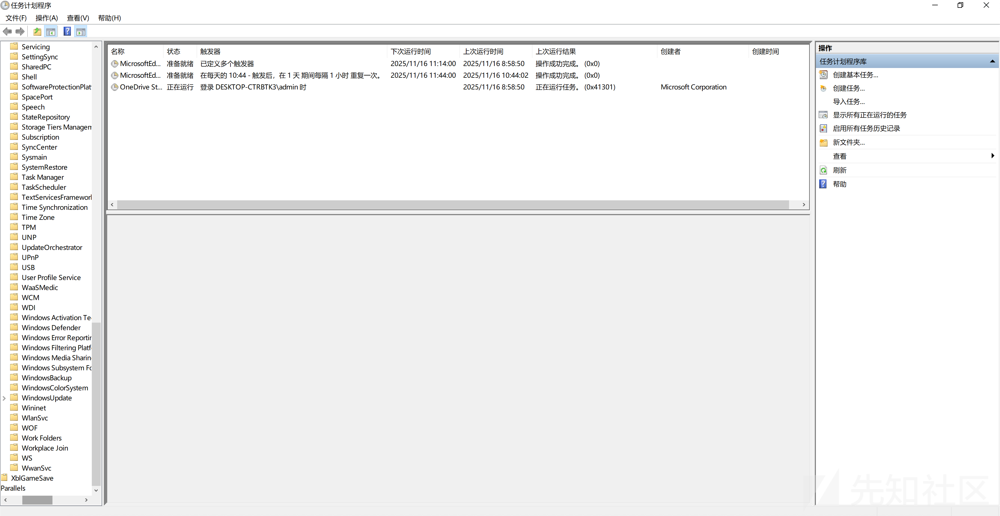
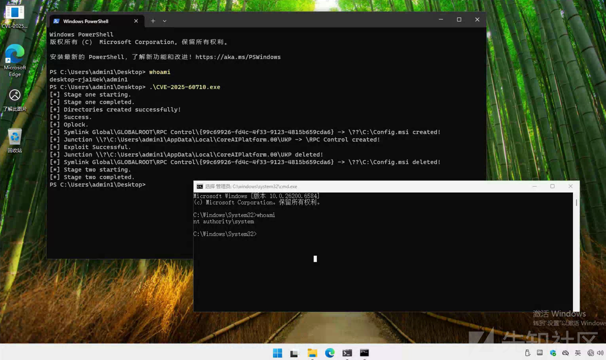

# Windows任务计划权限提升漏洞分析（CVE-2025-60710）-先知社区

> **来源**: https://xz.aliyun.com/news/19366  
> **文章ID**: 19366

---

# 前言

刷公众号时看到[Windows 11 PolicyConfiguration 计划任务特权提升漏洞(CVE-2025-60710)](https://mp.weixin.qq.com/s/LhOkC6cgBYgITs21AhwZKw)这篇文章，漏洞描述中提到这是一个任意文件删除漏洞，可怎么就成了任意代码执行，这激起了我的兴趣，利用下班及周末时间学习了一下，遂有此文，分享给大家

​

这个漏洞是微软在2025年11月的补丁星期二中发布的，公告地址：<https://msrc.microsoft.com/update-guide/vulnerability/CVE-2025-60710>

​

影响版本是Windows 11 25H2 10.0.26200.0 before 10.0.26200.7171

​

对应的任务计划是\Microsoft\Windows\WindowsAI\Recall\PolicyConfiguration，可以看到Windows 10中是没有这个任务计划的

# 漏洞基本原理

漏洞存在于Windows任务计划的调度程序taskhostw.exe中，当执行任务计划\Microsoft\Windows\WindowsAI\Recall\PolicyConfiguration的时候，taskhostw.exe会搜索C:\Usersusername%\AppData\Local\CoreAIPlatform.00\UKP下，匹配模式{????????-????-????-????-????????????}的目录，不校验它是否是一个快捷方式以及指向的是谁，然后以NT AUTHORITY\SYSTEM权限删除它，这给了我们一个机会，可以创建特定目录的快捷方式，然后删除那个目录

Windows通知功能（Windows Notification Facility， WNF）中，多个事件都可以触发这个任务计划，例如：

* Trigger ID为 RecallPolicyCheckUpdateTrigger，WNF State Name为 7508BCA32C079E41的事件，用于检查Recall Policy配置的更新
* Trigger ID为 AADStatusChangeTrigger，WNF State Name为 7508BCA32C0F8241的事件，用于检查Azure AD状态的改变
* Trigger ID为 DisableAIDataAnalysisTrigger，WNF State Name为 7528BCA32C079E41的事件，用于关闭AI数据分析
* Trigger ID为 UserLoginTrigger，WNF State Name为 7510BCA338038113的事件，用于监测用户登录

# 利用方式1 任意文件删除

讲解此利用方式前，需要先介绍一个概念

##### File Opportunistic Lock（FileOpLock，文件机会锁）

FileOpLock是Windows文件系统中的一种“异步通知机制”，本质是允许进程对文件/目录“提前占位”并获取通知，什么意思呢？

​

当进程A对某个文件/目录加了FileOpLock，其他进程（比如SYSTEM进程）尝试访问该文件/目录时，Windows内核会暂停访问操作，并立刻通知进程A（此时触发了A注册的“回调函数”），进程A的回调函数就可以在这个“暂停窗口”内做任意操作（比如将目录替换为符号链接），操作完成后，SYSTEM进程才会继续执行原本的访问（此时访问的是已被修改后的目标），简单说：FileOpLock能让攻击者“插队”，在SYSTEM进程执行删除操作的瞬间篡改目标，实现“时间差攻击”

​

想象一下，你在Windows中挖到一个高权限的文件删除漏洞（比如SYSTEM权限），你要如何利用它呢？由于删除操作是一瞬间的事（基本是毫秒级别），你很难捕捉到那一瞬间，所以我们要提前监控它，就像Hook一个函数一样，这里我们用FileOpLock，当SYSTEM进程想要访问被FileOpLock锁定的文件/目录时，内核会调用FileOpLock注册的回调函数，为漏洞利用提供了替换目录的时机

​

其实FileOpLock、FileLink是现代Windows漏洞利用中经常用到的手段，尤其在权限提升方面，它的实现较为复杂，涉及到线程池、内核等等，真要展开讲的话，够单独写一篇文章了，本文的目标不是研究它的实现，知道它的基本原理后，以后要用到这项技术，可以直接拿来用：<https://github.com/ybdt/evasion-hub/tree/master/05-Privilege%20Escalation/CVE-2025-60710-main/CVE-2025-60710>

​

利用过程如下

* 步骤1：在C:\Usersusername%\AppData\Local\CoreAIPlatform.00\UKP\下创建符合模式{????????-????-????-????-????????????}的目录
* 步骤2：通过FileOpLock::CreateLock()获取目录的Oplock，并定义一个回调函数cb0
* 步骤3：通过ZwUpdateWnfStateData()触发WNF State Name为7508BCA32C079E41的事件，就是Trigger ID为 RecallPolicyCheckUpdateTrigger的事件
* 步骤4：当SYSTEM进程准备删除目录的时候，由于目录有Oplock，Windows内核会暂停删除操作，并触发回调函数cb0
* 步骤5：在回调函数cb0中，替换目录为一个快捷方式，指向想删除的目录
* 步骤6：SYSTEM进程会删除攻击者指向的目录

# 利用方式2 从任意文件删除到任意代码执行

讲解此利用方式前，同样需要先介绍一个新的概念

##### MSI回滚机制

Windows中有一类文件的后缀是.msi，相比EXE文件，MSI文件有明显的管理优势，比如在安装失败时支持回滚操作，能将系统恢复到安装前的状态，避免系统错乱，当用户双击MSI文件时，会调用Windows系统中的Msiexec.exe程序，此程序是Windows Installer服务的核心组件，该程序通过Msi.dll读取MSI文件中的数据，执行文件复制、注册表配置等安装操作，完成软件部署，这其中会涉及到一个目录C:\Config.Msi，它是由Windows Installer服务专门控制的系统级目录，普通用户或管理员无法手动创建一个能被Windows Installer服务使用的目录，只有让Windows Installer服务自己创建的目录才能被它使用，这里涉及到目录的属主以及目录的DACL

​

DACL（Discretionary Access Control List，自主访问控制列表），是Windows中控制目录访问权限的核心机制，决定了“哪些用户/组能对该目录执行何种操作”，它是目录的“权限清单”，存储着针对不同主体（用户账户、用户组、计算机账户等）的访问规则，Windows系统通过检查这份清单，判断请求访问目录的主体是否被允许执行对应操作（如读取、写入、删除等），DACL由多个ACE（Access Control Entry，访问控制项）组成，每个ACE是一条具体的权限规则，包含两部分核心信息：安全标识符（SID）和访问掩码（Access Mask），安全标识符就是属主，访问掩码就是具体操作，有些人可能会困惑，DACL是我们常说的ACL吗？其实我们常说的ACL在Windows中是一个大类，包含DACL和SACL（System Access Control List，系统访问控制列表），其中的SACL的作用是审计，记录谁访问了资源、执行了什么操作

​

MSI在安装软件、更新软件、卸载软件的过程中均会涉及回滚，拿卸载来说，为防止卸载过程中意外中断导致的系统不稳定，MSI服务会将要删除的文件备份到目录C:\Config.Msi，比如文件a.dll会重命名为a.dll.rbf，并在C:\Config.Msi中创建.rbs文件，rbs文件记录着对系统做了哪些修改，比如注册表修改等等，等到回滚时，逆序操作来恢复系统

​

利用过程分为3个阶段

1. Stage 1，目标是获取一个能被Windows Installer服务使用的，空的目录C:\Config.Msi

* 准备一个MSI安装包
* 调用这个MSI安装包，手动在安装包的目标路径处创建一个文件dummy.txt，同时开启一个线程执行卸载操作，此时Windows Installer服务会先创建目录C:\Config.Msi，并在目录C:\Config.Msi中创建dummy.txt.rbf文件
* 通过Oplock阻止rbf文件的删除，此时会留下目录C:\Config.Msi和rbf文件
* 强制删除rbf文件，剩下空的C:\Config.Msi目录

2. Stage 2

* 通过上面的任意文件删除，删除SYSTEM权限的目录C:\Config.Msi

3. Stage 3

* 重新创建一个宽松访问权限的C:\Config.Msi
* 调用MSI安装包并传入参数ERROROUT=1，来触发MSI回滚
* 监控回滚脚本rbs的创建
* 从exe的resource中释放之前准备好的rbs和rbf，将MSI创建的rbs文件替换为我们的rbf，rbf是一个dll文件，rbs的内容为将dll文件释放到系统保护的位置C:\Program Files\Common Files\microsoft shared\ink\HID.DLL
* 执行HID.DLL的是同目录下的TabTip.exe，TabTip.exe正常会搜索C:\Windows\System32下的HID.DLL，这里利用了dll劫持，实现执行恶意dll

​

有人可能会问，利用过程这么麻烦干什么，直接创建目录C:\Config.Msi，释放恶意的rbf、rbs文件，调用MSI回滚不就完了，其实不然，我们创建的C:\Config.Msi和MSI服务创建的C:\Config.Msi虽然名字一样，但却是2个东西，无法被MSI服务使用，这里面涉及到文件夹的属主、权限等内容

# 漏洞复现

代码备份到：<https://github.com/ybdt/evasion-hub/tree/master/05-Privilege%20Escalation/CVE-2025-60710-main>

将编译后的exe拿到符合漏洞环境的Win11中执行，可以看到成功弹出了NT AUTHORITY\SYSTEM权限的cmd

# 参考

<https://deepwiki.com/Wh04m1001/CVE-2025-60710>  
<https://deepwiki.com/Wh04m1001/CVE-2025-60710/2-cve-2025-60710:-the-vulnerability>  
<https://deepwiki.com/Wh04m1001/CVE-2025-60710/3-exploitation-techniques>  
<https://deepwiki.com/Wh04m1001/CVE-2025-60710/3.2-msi-rollback-exploitation-(fileorfolderdelete.cpp)>
