# Windows任务计划及其COM组件-先知社区

> **来源**: https://xz.aliyun.com/news/19370  
> **文章ID**: 19370

---

# 前言

Windows下创建任务计划的方式通常有三种：任务计划的GUI界面、任务计划的命令行工具schtasks.exe、Windows提供的API接口

​

本文会依次介绍这三种方式，并展示免杀效果，需要注意，Windows中任务计划相关的API是基于COM机制的，同时也会介绍COM机制相关内容，掌握了任务计划的API编程，也就掌握了COM编程，通过窥一斑而知全豹也能对COM机制有一定理解

# 任务计划的GUI界面

通过GUI创建任务计划的方式很简单，运行中输入taskschd.msc，点击右侧的“创建任务”

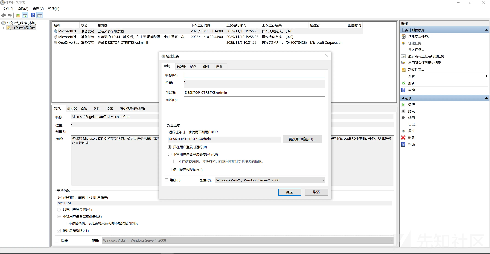

# 任务计划的命令行工具schtasks.exe

使用schtasks创建任务计划，命令如下

```
schtasks.exe /create /sc daily /tn "Test Schedule" /tr "c:\windows\system32
otepad32.exe"
```

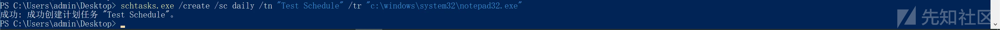

上述命令中，/create表示创建一个任务计划，/sc表示任务的频率，除了daily还有once、weekly、onlogon等等，/tn表示任务名字，/tr表示任务执行的程序，我们没有指定任务开始的时间，默认为任务被创建的时间，指定开始时间的语法如下

```
schtasks.exe /create /sc daily /st 15:00 /tn "Test Schedule" /tr "c:\windows\system32
otepad32.exe"
```

​

想要在远程主机上创建任务计划，可以使用下列语法，也就是多指定了主机名、用户名、密码

```
schtasks /s <hostname> /u <username> /p <password> /create /sc DAILY /tn "Test Schedule" /tr "c:\windows\system32
otepad.exe"
```

​

任务计划被成功创建后，系统会生成一个xml格式的配置文件，位于c:\windows\system32 asks\下，其实也可以通过xml配置文件创建任务计划，使用配置文件创建任务计划的语法如下，可以看到成功创建了任务计划

```
schtasks /create /xml "Test Schedule" /tn "Test Schedule"
```

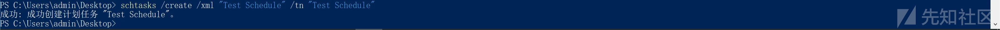

# schtasks.exe创建任务计划免杀效果测试

先说结论

​

测试环境是Parallels Desktop虚拟化的Windows 7 + 腾讯电脑管家、Windows 2008 R2 + 火绒、Windows 2012 + 360卫士 + 360杀毒

​

Windows 7 + 腾讯电脑管家：schtasks后面跟命令创建成功，schtasks后面跟配置文件创建成功  
Windows 2008 R2 + 火绒：schtasks后面跟命令创建成功，schtasks后面跟配置文件创建成功  
Windows 2012 + 360卫士 + 360杀毒：schtasks后面跟命令创建失败，schtasks后面跟配置文件创建失败

​

#### Windows 7 + 腾讯电脑管家

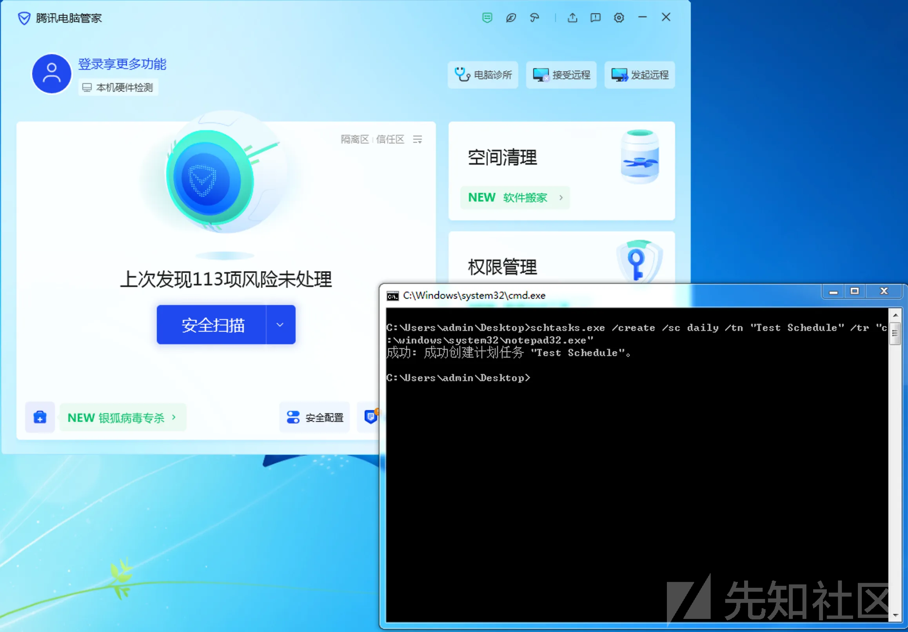

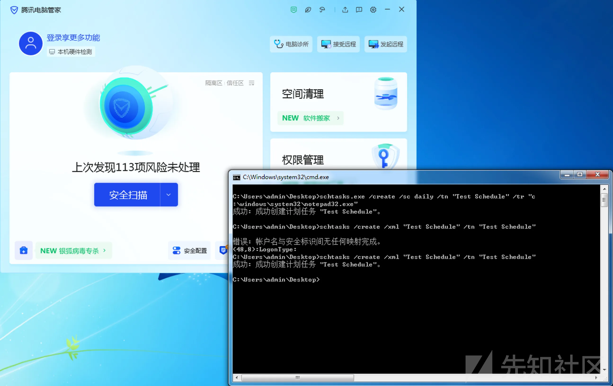

#### Windows 2008 R2 + 火绒

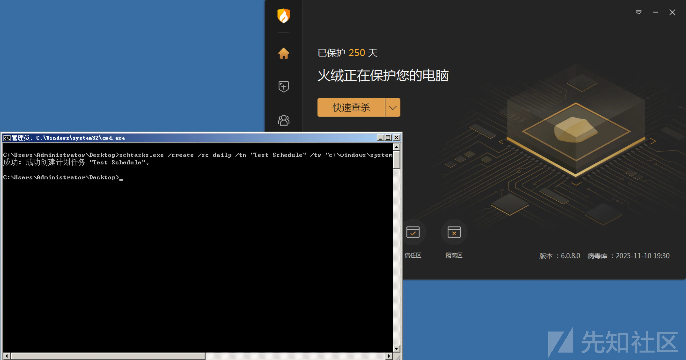

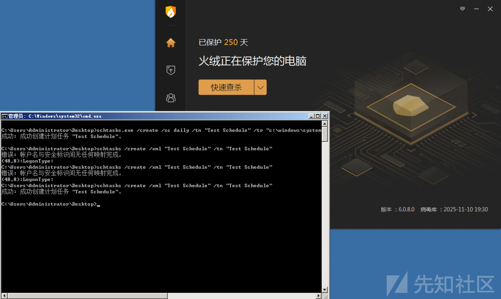

#### Windows 2012 + 360卫士 + 360杀毒

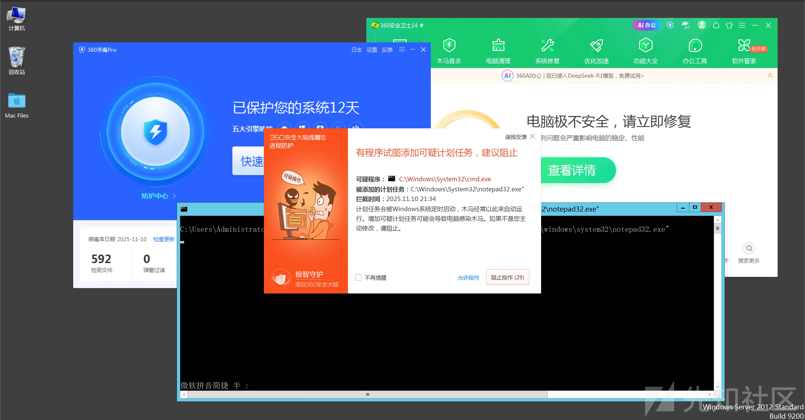

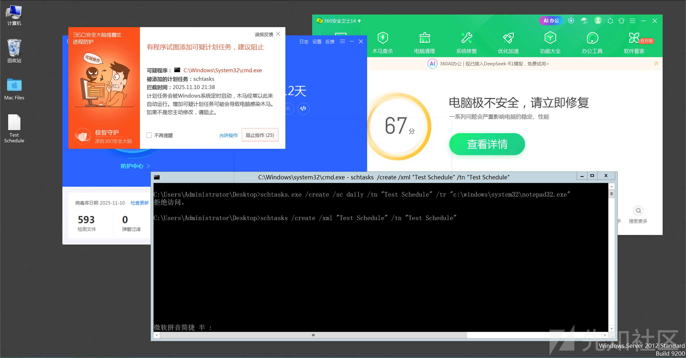

# Windows提供的API接口

Windows中任务计划相关的API是基于COM机制的，也就是说，你不能像调用MessageBox那样直接拿来用，需要涉及到COM编程

## 什么是COM

COM（Component Object Model，组件对象模型）是微软在 1990 年代提出的一种二进制组件规范（binary standard），用于让不同语言、不同进程、甚至不同计算机之间的对象可以交互。

​

简单说，COM 定义了一套让“二进制对象”彼此调用的协议。这意味着，你可以用 C++ 写一个类编译成 DLL，另一个程序用 VB、C#、Python、甚至脚本语言 都可以调用这个类，调用方不需要知道实现细节，只需通过一个统一的接口（IUnknown 或派生接口）

不像普通的 C++ 类编译成DLL后被动态（静态）链接使用，COM 对象是通过二进制接口访问的，只要遵守 COM 规范（接口调用规则），就能跨语言、跨编译器、跨模块使用

COM 对象不会暴露类的实现，而是通过接口来访问，接口是一个 纯虚函数表（vtable）结构，例如

```
struct IUnknown {
    virtual HRESULT QueryInterface(REFIID riid, void** ppvObject) = 0;
    virtual ULONG AddRef() = 0;
    virtual ULONG Release() = 0;
};
```

​

任何 COM 对象都必须实现 IUnknown，并且通过 QueryInterface 来获取其它接口的指针

​

每个 COM 类都有一个全局唯一的标识符 CLSID（Class ID），注册在注册表中

```
HKEY_CLASSES_ROOT\CLSID\{CLSID}
```

注册表中还包括：DLL或EXE的路径、支持的接口、启动方式（InProcServer32, LocalServer32, etc）

​

当调用

```
CoCreateInstance(CLSID_MyComponent, nullptr, CLSCTX_INPROC_SERVER, IID_IMyInterface, (void**)&pObj);
```

系统会根据指定的{CLSID}查找注册表中对应的项，然后加载DLL或启动EXE，最后创建对象并返回接口指针

​

总而言之，COM 是一种让对象“以二进制形式可重用”的机制，提供跨语言、跨模块、跨进程的调用能力

​

下述代码展示了COM编程涉及的每一个环节：COM初始化、设置安全描述符（这个环节是可选的）、创建特定CLSID的对象、连接到计划任务COM服务器，剩下的就是计划任务特有的步骤了：获取计划任务的根目录、创建任务建立器、设置标识符、设置任务创建者、指定任务运行时的属主和权限、指定触发器、指定计划任务动作、注册任务

​

这里执行动作用的是IExecAction，还可以用IComHandlerAction，可以作为AV/EDR躲避的一种选择，在接下来的文章中会提到

​

代码注释中解释了每段代码的含义

```
#include <stdio.h>
#include <windows.h>

#include <comutil.h>
#include <taskschd.h>
#pragma comment(lib, "comsupp.lib")
#pragma comment(lib, "taskschd.lib")

DWORD CreateScheduledTask(WCHAR* TaskAuthor, WCHAR* TaskName, WCHAR* wstrExePath)
{
    HRESULT hr = S_OK;

    //  初始化COM库
    hr = ::CoInitializeEx(NULL, COINIT_MULTITHREADED);
    if ((hr != S_OK) && hr != S_FALSE)
    {
        ::wprintf(L"[-] CoInitializeEx has failed
");
        return 0;
    }
    else if (hr == S_FALSE)
    {
        ::wprintf(L"[*] COM library has been already initialized
");
    }

    //  设置安全信息
    PSECURITY_DESCRIPTOR pSecDesc = { 0 };
    hr = ::CoInitializeSecurity(pSecDesc,
        -1,
        NULL,
        NULL,
        RPC_C_AUTHN_LEVEL_PKT,
        RPC_C_IMP_LEVEL_IMPERSONATE,
        NULL,
        0,
        NULL);
    if (hr != S_OK)
    {
        ::wprintf(L"[-] CoInitializeSecurity has failed
");
        ::CoUninitialize();
        return 0;
    }

    //  创建表示任务计划的CLSID的对象
    ITaskService* pService = NULL;
    hr = ::CoCreateInstance(CLSID_TaskScheduler,
        NULL,
        CLSCTX_INPROC_SERVER,
        IID_ITaskService,
        (void**)&pService);
    if (hr != S_OK)
    {
        ::wprintf(L"[-] CoCreateInstance has failed
");
        ::CoUninitialize();
        return 0;
    }

    //  连接到计划任务服务
    hr = pService->Connect(VARIANT(), VARIANT(), VARIANT(), VARIANT());
    if (FAILED(hr))
    {
        ::wprintf(L"[-] ITaskService::Connect has failed
");
        pService->Release();
        ::CoUninitialize();
        return 0;
    }

    //  获取任务的根目录
    ITaskFolder* pRootFolder = NULL;
    hr = pService->GetFolder(_bstr_t(L"\"), &pRootFolder);
    if (FAILED(hr))
    {
        ::wprintf(L"[-] ITaskService::GetFolder has failed
");
        pService->Release();
        ::CoUninitialize();
        return 0;
    }

    //  创建任务建立器对象，用于创建任务计划对象
    ITaskDefinition* pTask = NULL;
    hr = pService->NewTask(0, &pTask);
    pService->Release();
    if (FAILED(hr))
    {
        ::wprintf(L"[-] ITaskService::NewTask has failed
");
        ::CoUninitialize();
        return 0;
    }

    //  设置标识符
    IRegistrationInfo* pRegInfo = NULL;
    hr = pTask->get_RegistrationInfo(&pRegInfo);
    if (FAILED(hr))
    {
        ::wprintf(L"[-] get_RegistrationInfo has failed
");
        pRootFolder->Release();
        pTask->Release();
        ::CoUninitialize();
        return 0;
    }

    //  设置创建者名称
    hr = pRegInfo->put_Author(_bstr_t(TaskAuthor));
    pRegInfo->Release();
    if (FAILED(hr))
    {
        ::wprintf(L"[-] put_Author has failed
");
        pRootFolder->Release();
        pTask->Release();
        ::CoUninitialize();
        return 0;
    }

    //  指定任务运行时的身份和权限
    IPrincipal* pPrincipal = NULL;
    hr = pTask->get_Principal(&pPrincipal);
    if (FAILED(hr))
    {
        ::wprintf(L"[-] get_Principal has failed
");
        pRootFolder->Release();
        pTask->Release();
        ::CoUninitialize();
        return 0;
    }
    hr = pPrincipal->put_LogonType(TASK_LOGON_INTERACTIVE_TOKEN);
    pPrincipal->Release();
    if (FAILED(hr))
    {
        ::wprintf(L"[-] put_LogonType has failed
");
        pRootFolder->Release();
        pTask->Release();
        ::CoUninitialize();
        return 0;
    }

    //  指定触发器
    ITriggerCollection* pTriggerCollection = NULL;
    hr = pTask->get_Triggers(&pTriggerCollection);
    if (FAILED(hr))
    {
        ::wprintf(L"[-] get_Triggers has failed
");
        pRootFolder->Release();
        pTask->Release();
        ::CoUninitialize();
        return 0;
    }

    //  创建登录触发器（TASK_TRIGGER_LOGON）
    ITrigger* pTrigger = NULL;
    hr = pTriggerCollection->Create(TASK_TRIGGER_LOGON, &pTrigger);
    pTriggerCollection->Release();
    if (FAILED(hr))
    {
        ::wprintf(L"[-] Trigger Create has failed
");
        pRootFolder->Release();
        pTask->Release();
        ::CoUninitialize();
        return 0;
    }

    //  将通用触发器接口转换为登录触发器接口
    ILogonTrigger* pLogonTrigger = NULL;
    hr = pTrigger->QueryInterface(IID_ILogonTrigger, (void**)&pLogonTrigger);
    pTrigger->Release();
    if (FAILED(hr))
    {
        ::wprintf(L"[-] QueryInterface for ILogonTrigger has failed
");
        pRootFolder->Release();
        pTask->Release();
        ::CoUninitialize();
        return 0;
    }

    //  为触发器设置ID
    hr = pLogonTrigger->put_Id(_bstr_t(L"LogonTriggerId"));
    if (FAILED(hr))
    {
        ::wprintf(L"[-] Trigger put_Id has failed
");
    }

    //  可选：设置特定用户登录时触发（如果不设置，则任何用户登录都会触发）
    //  获取当前用户名
    WCHAR username[256];
    DWORD usernameLen = 256;
    if (GetUserNameW(username, &usernameLen))
    {
        hr = pLogonTrigger->put_UserId(_bstr_t(username));
        if (SUCCEEDED(hr))
        {
            ::wprintf(L"[+] Task will trigger on logon for user: %s
", username);
        }
    }
    // 如果想让任何用户登录都触发，注释掉上面的代码即可

    //  可选：设置延迟启动（登录后延迟一段时间再执行）
    // hr = pLogonTrigger->put_Delay(_bstr_t(L"PT30S")); // 延迟30秒

    pLogonTrigger->Release();

    //  设置计划任务动作为执行程序
    IActionCollection* pActionCollection = NULL;
    hr = pTask->get_Actions(&pActionCollection);
    if (FAILED(hr))
    {
        ::wprintf(L"[-] get_Actions has failed
");
        pRootFolder->Release();
        pTask->Release();
        ::CoUninitialize();
        return 0;
    }

    IAction* pAction = NULL;
    hr = pActionCollection->Create(TASK_ACTION_EXEC, &pAction);
    pActionCollection->Release();
    if (FAILED(hr))
    {
        ::wprintf(L"[-] Create action has failed
");
        pRootFolder->Release();
        pTask->Release();
        ::CoUninitialize();
        return 0;
    }

    //  设置计划任务具体执行什么程序
    IExecAction* pExecAction = NULL;
    hr = pAction->QueryInterface(IID_IExecAction, (void**)&pExecAction);
    pAction->Release();
    if (FAILED(hr))
    {
        ::wprintf(L"[-] QueryInterface action has failed
");
        pRootFolder->Release();
        pTask->Release();
        ::CoUninitialize();
        return 0;
    }

    hr = pExecAction->put_Path(_bstr_t(wstrExePath));
    pExecAction->Release();
    if (FAILED(hr))
    {
        ::wprintf(L"[-] put_Path has failed
");
        pRootFolder->Release();
        pTask->Release();
        ::CoUninitialize();
        return 0;
    }

    //  注册任务
    IRegisteredTask* pRegisteredTask = NULL;
    hr = pRootFolder->RegisterTaskDefinition(_bstr_t(TaskName),
        pTask,
        TASK_CREATE_OR_UPDATE,
        _variant_t(),
        _variant_t(),
        TASK_LOGON_INTERACTIVE_TOKEN,
        _variant_t(L""),
        &pRegisteredTask);
    if (FAILED(hr))
    {
        ::wprintf(L"[-] RegisterTaskDefinition has failed, error: 0x%08X
", hr);
        pRootFolder->Release();
        pTask->Release();
        ::CoUninitialize();
        return 0;
    }
    else //  任务注册成功后，立即执行
    {
        ::wprintf(L"[+] Scheduled task has been created
");

        IRunningTask* pRunningTask = NULL;
        hr = pRegisteredTask->Run(_variant_t(), &pRunningTask);
        if (FAILED(hr))
        {
            wprintf(L"[-] IRunningTask Failed, error: 0x%08X
", hr);
        }
        else
        {
            wprintf(L"[+] Task has been executed immediately
");
            if (pRunningTask)
            {
                pRunningTask->Release();
            }
        }
    }

    //  关闭COM库
    pRootFolder->Release();
    pTask->Release();
    pRegisteredTask->Release();
    ::CoUninitialize();

    return 1;
}

int main()
{
    WCHAR TaskAuthor[] = L"Microsoft Corporation";
    WCHAR TaskName[] = L"OneDrive Standalone Update Task-S-1-5-21-4162225321-4122752593-2322023677-001";
    WCHAR path[] = L"C:\Users\Public\OneDrive.exe";
    DWORD res_sch = CreateScheduledTask(TaskAuthor, TaskName, path);

    return 1;
}
```

​

通过代码编译执行后，我们测试一下免杀效果

​

环境：Windows 2012 + 360卫士 + 360杀毒

​

文件落地就被查杀

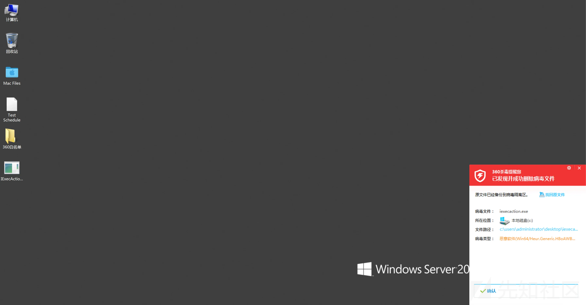

​

别担心，只是静态查杀被检测到了，我们将这个程序加到白名单中，再次执行

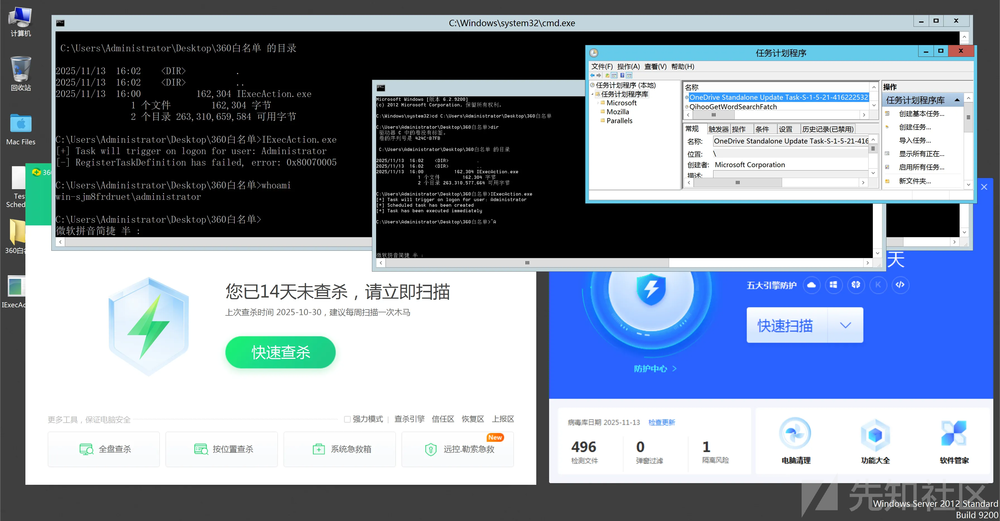

可以看到成功添加了任务计划，没有被拦截，说明这个动作是不被拦截的，至于静态查杀，可以是通过LLVM混淆、BOF、等方式过掉
